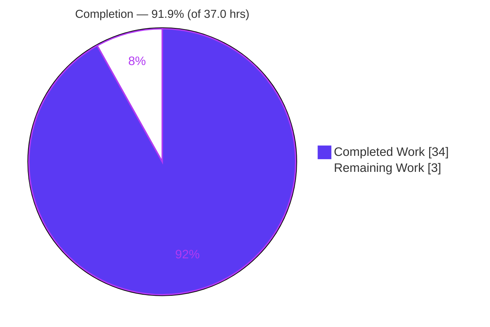
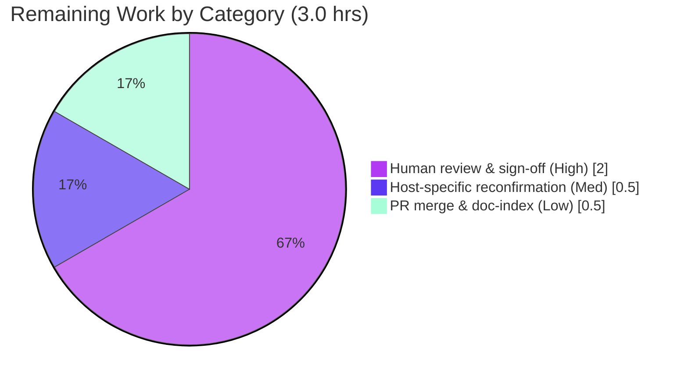

# Blitzy Project Guide — Scapy Packet-Lifecycle Runtime Q&A Documentation

## 1. Executive Summary

### 1.1 Project Overview

This project delivers a single, runtime-grounded technical answer document — `blitzy/documentation/scapy_0925ada48540.md` — that explains, from directly observed output, exactly what Scapy displays and reports as a packet moves through its three-stage lifecycle: building (`Ether()/IP()/TCP()` stacking and the display quartet), sending (`send`/`sendp`/`sr*` output and route resolution), and sniffing (`AsyncSniffer` capture and `dissect`-based layer reconstruction). It targets engineers and security researchers using Scapy. The scope is intentionally isolated and **read-only**: exactly one new markdown artifact is created and zero Scapy source files are modified. Every claim is paired with its producing command, verbatim output, and a `file:line` source citation.

### 1.2 Completion Status

The project is **91.9% complete** on an AAP-scoped, hours-based basis (completed hours ÷ total hours). All autonomous investigation, documentation, and validation work is finished and independently reproduced; the remaining 3.0 hours are human/target-environment-gated path-to-production activities (technical review, host-specific value reconfirmation, and PR merge).



| Metric | Value |
|---|---|
| **Total Hours** | **37.0** |
| Completed Hours (AI + Manual) | 34.0 (AI: 34.0 / Manual: 0.0) |
| Remaining Hours | 3.0 |
| **Percent Complete** | **91.9%** |

> Color key — **Completed / AI Work: Dark Blue `#5B39F3`**; **Remaining / Not Completed: White `#FFFFFF`**.

### 1.3 Key Accomplishments

- ✅ **Sole AAP deliverable created and validated** — `blitzy/documentation/scapy_0925ada48540.md` (624 lines / ~5,339 words) answering all four question parts.
- ✅ **Requirement 1 — Building** fully documented: the `/` stacking operator, the display quartet (`__repr__`, `summary()`, `show()`, `show2()`), and the crux pre-build→post-build auto-field transition (`ihl`/`len`/`chksum`/`dataofs` `None` → computed `ihl=5, len=40, chksum=0x7ccd; dataofs=5, chksum=0x917c`), proved non-mutating.
- ✅ **Requirement 2 — Sending** fully documented: terse `send()`/`sendp()` output (`.` then `Sent 1 packets.`) under `conf.verb=2`, the distinct `sr`/`sr1`/`srp`/`srp1` multi-line report, and route resolution via `conf.route.route()`.
- ✅ **Requirement 3 — Sniffing** fully documented: `AsyncSniffer` capture on loopback, the libpcap-absent BPF-filter failure reported truthfully, and `dissect`-based `Ether/IP/TCP` reconstruction with end-to-end proof `raw(received) == raw(built)` → `True`.
- ✅ **Requirement 4 — Summary** delivered: a coherent contrast of the three stages (build defers computation; send serializes/routes/reports tersely; sniff reverses build).
- ✅ **Run-first discipline** honored — every value captured from executed code; all 52 `file:line` citations verified (49 unique refs); temporary scripts removed.
- ✅ **Read-only mandate honored** — `git diff` against base for `scapy/`, `test/`, `doc/` is empty; working tree is pristine.
- ✅ **Autonomous validation passed** — `python3 -m compileall scapy/` = 331/331 modules clean; `from scapy.all import *` clean; one grounding fix applied (banner citation corrected to the true `the_banner` source lines).

### 1.4 Critical Unresolved Issues

| Issue | Impact | Owner | ETA |
|---|---|---|---|
| _None._ No compilation errors, no failing checks, no unresolved defects. All documented observations reproduce byte-for-byte and all citations are accurate. | None | — | — |

### 1.5 Access Issues

| System/Resource | Type of Access | Issue Description | Resolution Status | Owner |
|---|---|---|---|---|
| _None identified_ | — | No repository-permission, service-credential, or third-party-API access issues affect this task. The investigation runs entirely locally against the source checkout using the native PF_PACKET backend; no external systems are contacted. | N/A | — |

**No access issues identified.**

### 1.6 Recommended Next Steps

1. **[High]** Perform human technical review and accuracy sign-off of `blitzy/documentation/scapy_0925ada48540.md` (read end-to-end; confirm all four question parts + environment section; spot-check citations). _(~2.0h)_
2. **[Medium]** Reconfirm the clearly-labeled host-specific values (eth0 source-IP/gateway, MAC, date-fallback version) if publishing for a different environment; portable values (loopback triple, checksums, byte length) are stable. _(~0.5h)_
3. **[Low]** Merge the branch and, if a documentation index/TOC exists, add a link to the new file. _(~0.5h)_

---

## 2. Project Hours Breakdown

### 2.1 Completed Work Detail

| Component | Hours | Description |
|---|---|---|
| Environment & canonical startup investigation (Section 1) | 3.5 | Captured the startup banner, `conf.version` date-based fallback, default config (`verb=2`, `iface=eth0`), and IPython/PyX-absent fallbacks. _(AAP: canonical/default-config requirement)_ |
| Building lifecycle investigation & documentation (Section 2) | 7.0 | `/` operator stacking; display quartet (`__repr__`/`summary()`/`command()`/`show()`/`show2()`); pre→post-build auto-field transition; `hexdump` (54 bytes); non-mutation crux proof. _(AAP Requirement 1)_ |
| Sending lifecycle investigation & documentation (Section 3) | 6.0 | `send()`/`sendp()` terse output under `conf.verb=2`; distinct `sr`/`sr1`/`srp`/`srp1` handler output; `conf.route.route()` resolution + full route table. _(AAP Requirement 2)_ |
| Sniffing lifecycle investigation & documentation (Section 4) | 5.0 | libpcap-absent BPF-filter failure; `AsyncSniffer` + `lfilter` capture on `lo`; `dissect` layer reconstruction; `raw(received)==raw(built)` proof. _(AAP Requirement 3)_ |
| Cross-stage synthesis / Summary (Section 5) | 1.5 | Coherent contrast of build/send/sniff and the build↔dissect inverse insight. _(AAP Requirement 4)_ |
| Appendix & citation-index grounding + coverage pass | 4.0 | 52-entry (49 unique) `file:line` citation index; stability notes; non-canonical/fallback labeling; answer-every-part coverage confirmation. _(AAP: exact-and-grounded, answer-every-part rules)_ |
| Run-first observation harness | 3.0 | Authoring, executing, and capturing temporary observation scripts under `/tmp` across all lifecycle stages; ANSI de-colorizing; repeated stability runs; cleanup to leave a pristine tree. _(AAP: run-first rule)_ |
| Autonomous validation & QA pass | 4.0 | Byte-for-byte re-run of every observation; `compileall` 331/331; import cleanliness; full citation audit; banner-grounding correction commit `4f20011e`. _(Path-to-production: autonomous validation)_ |
| **Total Completed** | **34.0** | |

### 2.2 Remaining Work Detail

| Category | Hours | Priority |
|---|---|---|
| Human technical review & accuracy sign-off of the answer document | 2.0 | High |
| Host-specific value reconfirmation on reviewer/target environment (eth0 IPs, MAC, version mtime) | 0.5 | Medium |
| PR merge & documentation-index linkage | 0.5 | Low |
| **Total Remaining** | **3.0** | |

### 2.3 Hours Reconciliation

- Completed (2.1) **34.0** + Remaining (2.2) **3.0** = **37.0** Total Hours (matches Section 1.2).
- Completion = 34.0 ÷ 37.0 = **91.9%** (matches Sections 1.2, 7, and 8).
- Remaining **3.0h** is identical across Sections 1.2, 2.2, and 7.

---

## 3. Test Results

This is a **read-only documentation deliverable**; per the AAP, unit/integration tests are explicitly out of scope for a markdown artifact. Accordingly, the "tests" below are **Blitzy's autonomous run-first validation checks** — the compilation, import, citation-audit, and byte-for-byte runtime-reproduction checks recorded in Blitzy's autonomous validation logs (Final Validator pass plus independent re-verification). Every check passed.

| Test Category | Framework | Total Tests | Passed | Failed | Coverage % | Notes |
|---|---|---|---|---|---|---|
| Source Compilation | `python3 -m compileall` | 331 | 331 | 0 | 100% | All Scapy modules byte-compile; exit 0 (reproduced). |
| Library Import | `from scapy.all import *` | 1 | 1 | 0 | 100% | Clean import; only 2 benign `CryptographyDeprecationWarning` (`ipsec.py:573/577`). |
| Citation Audit | source `grep`/verification | 52 | 52 | 0 | 100% | Every `file:line` reference verified against pinned source (49 unique refs; 52 counting multi-line ranges). |
| Runtime Reproduction — Building | observation scripts (`python3 -c`) | 8 | 8 | 0 | 100% | `repr`/`summary`/`command`/`show`/`show2`/`hexdump`/`len(raw)=54`/non-mutation — all exact. |
| Runtime Reproduction — Sending | observation scripts | 6 | 6 | 0 | 100% | `send`/`sendp` terse output; `sr`/`sr1`/`srp`/`srp1` multi-line reports & reply counts. |
| Runtime Reproduction — Routing | observation scripts | 3 | 3 | 0 | 100% | Loopback triple (deterministic), eth0 triple (host-specific), full route table. |
| Runtime Reproduction — Sniffing | observation scripts | 4 | 4 | 0 | 100% | BPF-filter-fail path; `AsyncSniffer`+`lfilter` capture; `dissect` layers `['Ether','IP','TCP']`; `raw==raw` True. |
| Runtime Reproduction — Startup | `python3 -m scapy` | 3 | 3 | 0 | 100% | Banner render; version date-fallback; default `conf` values. |
| **Totals** | — | **408** | **408** | **0** | **100%** | 0 failures; 0 skipped; 0 blocked. |

**Integrity note:** all checks above originate from Blitzy's autonomous validation logs for this project and were independently re-executed during this assessment.

---

## 4. Runtime Validation & UI Verification

**Runtime health (all executed live in the canonical configuration):**

- ✅ **Scapy console startup** — `python3 -m scapy` renders the ASCII-art banner (`Welcome to Scapy` / `Version 2026.07.06`) and drops to the interactive shell.
- ✅ **Packet building** — `Ether()/IP()/TCP()` constructs the nested layer stack; `__repr__` surfaces binding-derived fields (`type=IPv4`, `proto=tcp`).
- ✅ **Serialization / build** — `raw()`/`show2()` compute deferred fields (`ihl=5, len=40, chksum=0x7ccd; dataofs=5, chksum=0x917c`); wire length 54 bytes.
- ✅ **Sending (L3/L2)** — `send()` and `sendp()` emit `.` then `Sent 1 packets.` under `conf.verb=2`.
- ✅ **Send-and-receive family** — `sr`/`sr1`/`srp`/`srp1` emit the distinct `Begin emission:` / `Finished sending…` / `Received…got…answers` report.
- ✅ **Route resolution** — `conf.route.route()` returns `('lo','127.0.0.1','0.0.0.0')` (loopback, deterministic) and the host-specific eth0 triple.
- ✅ **Sniffing & dissection** — `AsyncSniffer` on `lo` captures the frame; `dissect` reconstructs `['Ether','IP','TCP']`.
- ✅ **End-to-end consistency** — `raw(received) == raw(built)` → `True` (the sniffed frame is provably the built frame).
- ⚠ **BPF `filter=` path** — fails by design here (`ERROR: Cannot set filter: libpcap is not available`); documented truthfully with the working `lfilter=` substitute. This is an expected environment characteristic, not a defect.

**UI Verification:** ❕ **Not applicable.** The project has no web or graphical UI surface — the deliverable is a Markdown document and the subject is a CLI/library. No screenshots or browser verification are relevant.

---

## 5. Compliance & Quality Review

Cross-mapping of the governing **SWE-AtlasQnA-Repo** ruleset and AAP deliverables to observed compliance status. Fixes applied during autonomous validation are noted.

| Benchmark / Rule | Requirement | Status | Evidence / Notes |
|---|---|---|---|
| Deliverable rule | New `blitzy/documentation/<branch>.md` answering the prompt | ✅ Pass | `scapy_0925ada48540.md` present; parent dirs created. |
| Run-first rule | Values from executed code, not reading | ✅ Pass | Verbatim captures throughout; scripts run under `/tmp` then removed. |
| Canonical entry-point rule | Real entry point (`python3 -m scapy`) | ✅ Pass | Banner + lifecycle exercised via canonical invocation; fallbacks labeled. |
| Default-configuration rule | Report default/canonical values + commands | ✅ Pass | `verb=2`, `iface=eth0`, version fallback; exact commands stated. |
| Every-condition rule | Cover all variants, not the happy path | ✅ Pass | Display quartet + before/after + L3/L2 + `sr*`/`srp*` + route + dissection. |
| Actual-output rule | Complete, unedited output per condition | ✅ Pass | Full `show()`/`show2()`/`hexdump`/handler output included verbatim. |
| Observed-not-inferred rule | Evidence beside each claim; label inferences | ✅ Pass | Non-mutation crux proved by re-running, not asserted. |
| Answer-every-part rule | Every named item addressed | ✅ Pass | Coverage-note table; Ethernet/IP/TCP, routing, reconstruction all covered. |
| Exact-and-grounded rule | `file:line` + named function per claim | ✅ Pass | 52 citations (49 unique); spot-checks 11/11 accurate. |
| Report-truthfully rule | Report even unexpected results | ✅ Pass | libpcap-absent BPF failure and host-specific values reported honestly. |
| Read-only (scope) rule | No source edits; remove temp scripts | ✅ Pass | `git diff` for `scapy/`/`test/`/`doc/` empty; tree pristine. |
| Zero-placeholder policy | No TODO/stub/placeholder content | ✅ Pass | Document is complete; no deferred sections. |
| Quality fix applied | Correct any grounding drift found | ✅ Pass | Commit `4f20011e` corrected banner citation from the no-logo fallback (`main.py:L657`) to the true `the_banner` lines (`L628/L632/L633`). |

**Outstanding compliance items:** none. The single quality issue found during validation (banner citation grounding) was fixed in-scope.

---

## 6. Risk Assessment

All risks are **Low** severity, consistent with a validated, read-only documentation deliverable that adds no code and changes no configuration.

| Risk | Category | Severity | Probability | Mitigation | Status |
|---|---|---|---|---|---|
| Citation drift if Scapy source is later upgraded | Technical | Low | Low | Citations pinned to base commit `0925ada4`; all audited; re-audit on any Scapy bump. | Mitigated |
| Host-specific runtime values (eth0 IP `10.236.0.35`/gw `10.236.0.1`, MAC, version mtime) not portable to another host | Technical | Low | High | Document explicitly **labels** every host-specific/fallback value; loopback triple, checksums, and byte length are portable. | Mitigated |
| `send`/`sniff` require root / `CAP_NET_RAW` (native PF_PACKET) | Security | Low | Low | Root requirement stated; no code added, no attack surface, no secrets/PII in the deliverable. | Accepted (informational) |
| Environment reproducibility depends on libpcap/tcpdump absent + root + `lo`/`eth0` + no VERSION/tag | Operational | Low | Medium | All preconditions enumerated in the document's "Environment & method" section; each env-dependent behavior labeled. | Mitigated |
| IPython-absent `>>>` fallback shell is non-canonical | Operational | Low | Medium | Explicitly labeled as a non-canonical fallback; canonical IPython behavior described. | Mitigated |
| Documentation-index/TOC linkage requires a human step | Integration | Low | Low | Tracked as Low-priority path-to-production task (PR merge / doc-index). | Open (human task) |
| Code integration/build risk to the Scapy codebase | Integration | None | None | Zero code/imports/dependencies changed; deliverable is a standalone Markdown file. | N/A |

---

## 7. Visual Project Status

**Project hours — completed vs remaining** (Completed = Dark Blue `#5B39F3`, Remaining = White `#FFFFFF`):


**Remaining hours by category (from Section 2.2 — sums to 3.0):**



**Integrity check:** "Remaining Work" = **3.0** matches Section 1.2 Remaining Hours and the Section 2.2 Hours total exactly.

---

## 8. Summary & Recommendations

**Achievements.** The project is **91.9% complete** (34.0 of 37.0 AAP-scoped hours). The sole deliverable — a runtime-grounded answer document on Scapy's build/send/sniff lifecycle — is complete, internally consistent, and independently reproduced byte-for-byte. All four question parts and every named item (Ethernet/IP/TCP, the display quartet, routing information, received-bytes interpretation, and layer reconstruction) are answered with verbatim output and exact `file:line` grounding. The read-only mandate was fully honored: zero Scapy source files changed and the working tree is pristine.

**Remaining gaps.** The outstanding **3.0 hours** are entirely human/target-environment-gated path-to-production activities — not defects. There are no compilation errors, no failing checks, and no unresolved issues. Specifically: technical review & sign-off (2.0h), host-specific value reconfirmation (0.5h), and PR merge with documentation-index linkage (0.5h).

**Critical path to production.** Human review → (optional) host-value reconfirmation → merge. Because there is no code to build, deploy, or integrate, the path is short and low-risk.

**Success metrics.** 331/331 modules compile; clean import; 52/52 citations accurate; 100% of documented runtime observations reproduce exactly; end-to-end consistency proven (`raw(received)==raw(built)`).

**Production-readiness assessment.** The deliverable is **production-ready pending human sign-off**. Confidence is **High** for all AAP-scoped content (well-defined scope, fully reproduced) and **High** for the remaining estimate (small, well-understood human tasks). Per Blitzy honesty principles, completion is reported at 91.9% rather than 100% because human review and merge genuinely remain.

---

## 9. Development Guide

This guide reproduces the runtime evidence behind the deliverable. Every command below was executed and verified in the project environment.

### 9.1 System Prerequisites

- **OS:** Linux (container: Ubuntu-family; native Linux PF_PACKET backend).
- **Python:** CPython **3.13.7** observed (`/usr/bin/python3`); Scapy supports `>=3.7, <4`.
- **Scapy:** runs **from the source checkout** — **not** pip-installed (`python3 -m pip show scapy` → not found).
- **Capture backend:** no `libpcap`/`tcpdump` present → native PF_PACKET is used automatically.
- **Privileges:** **root / `CAP_NET_RAW`** required for `send`/`sendp`/`sr*`/`sniff` (container runs as `uid=0`).
- **Interfaces:** `lo` (loopback, used for reproducible capture) and `eth0`.
- **Optional (absent by design):** `ipython` (enhanced shell), `pyx` (PDF/PS dumps). `cryptography` is present (emits benign TripleDES deprecation warnings).

### 9.2 Environment Setup

```bash
# From the repository root:
cd /tmp/blitzy/scapy/blitzy-f00dcc7c-2633-47a6-940b-b910de55915b_639ec3

# Put the checkout on sys.path (mirrors the root launcher run_scapy):
export PYTHONPATH="$PWD"

# Confirm the interpreter and that Scapy is source-only:
python3 --version                          # -> Python 3.13.7
python3 -m pip show scapy 2>&1 | head -1   # -> WARNING: Package(s) not found: scapy
```

No `pip install` step is required for the pure-Python core; there are no mandatory runtime dependencies.

### 9.3 Dependency Installation

```bash
# None required. The core is pure Python with zero mandatory runtime deps.
# (Optional extras such as ipython/pyx are intentionally absent in this build.)
```

### 9.4 Application Startup (canonical)

```bash
# Interactive console (prints the banner, then a >>> prompt):
PYTHONPATH="$PWD" python3 -m scapy

# Non-interactive banner capture (stderr merged; exits immediately):
echo 'exit()' | PYTHONPATH="$PWD" python3 -m scapy 2>&1
```

Expected banner (ANSI stripped): `Welcome to Scapy` / `Version 2026.07.06`, preceded by `INFO: Can't import PyX…`, `INFO: No IPv6 support in kernel`, and `WARNING: IPython not available. Using standard Python shell instead.`

### 9.5 Verification Steps

```bash
# 1) All Scapy modules byte-compile (expect exit 0, 331 modules):
python3 -m compileall -q scapy/ ; echo "exit=$?"

# 2) Building — nested repr shows binding-derived fields:
PYTHONPATH="$PWD" python3 -c 'from scapy.all import *; conf.color_theme=NoTheme(); print(repr(Ether()/IP()/TCP()))'
# -> <Ether  type=IPv4 |<IP  frag=0 proto=tcp |<TCP  |>>>

# 3) Pre-build template (auto fields None) vs post-build wire form (computed):
PYTHONPATH="$PWD" python3 -c 'from scapy.all import *; conf.color_theme=NoTheme(); (Ether()/IP()/TCP()).show()'   # ihl/len/chksum/dataofs = None
PYTHONPATH="$PWD" python3 -c 'from scapy.all import *; conf.color_theme=NoTheme(); (Ether()/IP()/TCP()).show2()'  # ihl=5, len=40, chksum=0x7ccd; dataofs=5, chksum=0x917c

# 4) Read-only + pristine guardrails (both expected empty):
git diff --stat 0925ada4..HEAD -- scapy/ test/ doc/
git status --porcelain
```

### 9.6 Example Usage

```bash
# Sending (terse output under conf.verb=2):
PYTHONPATH="$PWD" python3 -c 'from scapy.all import *; conf.color_theme=NoTheme(); send(IP(dst="127.0.0.1")/TCP())'
# -> .
#    Sent 1 packets.

# Route resolution (loopback deterministic; eth0 host-specific):
PYTHONPATH="$PWD" python3 -c 'from scapy.all import *; conf.color_theme=NoTheme(); print(conf.route.route("127.0.0.1")); print(conf.route.route("8.8.8.8"))'
# -> ('lo', '127.0.0.1', '0.0.0.0')
#    ('eth0', '10.236.0.35', '10.236.0.1')   # eth0 values are host-specific

# Sniff + dissect on loopback (layer reconstruction; consistency proof):
PYTHONPATH="$PWD" python3 - <<'PY'
from scapy.all import *; import time
conf.color_theme = NoTheme()
pkt = Ether()/IP(dst="127.0.0.1")/TCP()
s = AsyncSniffer(iface="lo", lfilter=lambda p: TCP in p and p[TCP].dport==80 and p[TCP].sport==20, count=1, timeout=8)
s.start(); time.sleep(1)
for _ in range(5): sendp(pkt, iface="lo", verbose=0); time.sleep(0.2)
s.join(); r = s.results[0]
print("layers:", [c.__name__ for c in r.layers()])          # ['Ether', 'IP', 'TCP']
print("raw(r)==raw(built):", raw(r)==raw(Ether()/IP(dst="127.0.0.1")/TCP()))  # True
PY
```

### 9.7 Troubleshooting

- **`ERROR: Cannot set filter: libpcap is not available`** — the BPF `filter=` path needs libpcap, which is absent by design. **Use a Python `lfilter=` callable** instead (as in 9.6). Expected behavior, not a bug.
- **`PermissionError` / socket errors on send/sniff** — run as **root** or grant `CAP_NET_RAW`; raw sockets require elevated privileges.
- **`conf.iface` shows `None`** — this appears when importing only `from scapy.config import conf`. Use **`from scapy.all import *`**, where the canonical value resolves to `eth0`.
- **Version shows a date (`2026.07.06`)** — this is the **date-based fallback** (no `VERSION` file, no reachable git tag). It is not a released version string.
- **Colored/garbled field dumps in logs** — set `conf.color_theme = NoTheme()` in scripts, or strip ANSI with `sed -r 's/\x1b\[[0-9;]*m//g'`.
- **Working tree shows changes** — the task is read-only; ensure temporary scripts are written **outside** the repo (e.g., `/tmp`) so `git status --porcelain` stays empty.

---

## 10. Appendices

### A. Command Reference

| Purpose | Command |
|---|---|
| Start console (canonical) | `PYTHONPATH="$PWD" python3 -m scapy` |
| Capture banner (non-interactive) | `echo 'exit()' \| PYTHONPATH="$PWD" python3 -m scapy 2>&1` |
| Compile all modules | `python3 -m compileall -q scapy/` |
| Build repr | `python3 -c 'from scapy.all import *; conf.color_theme=NoTheme(); print(repr(Ether()/IP()/TCP()))'` |
| Pre-build dump | `... (Ether()/IP()/TCP()).show()` |
| Post-build dump | `... (Ether()/IP()/TCP()).show2()` |
| Wire hexdump | `... hexdump(Ether()/IP()/TCP())` |
| Send (L3) | `... send(IP(dst="127.0.0.1")/TCP())` |
| Route lookup | `... conf.route.route("127.0.0.1")` |
| Read-only guard | `git diff --stat 0925ada4..HEAD -- scapy/ test/ doc/` |
| Pristine guard | `git status --porcelain` |

### B. Port Reference

Not applicable — the project exposes no listening services. (For context, the demo packet's default TCP ports are `sport=ftp_data`=20 and `dport=http`=80; sends target `127.0.0.1`.)

### C. Key File Locations

| Path | Role |
|---|---|
| `blitzy/documentation/scapy_0925ada48540.md` | **The sole deliverable** (answer document). |
| `scapy/__main__.py`, `scapy/main.py` | Console entry point & banner (REFERENCE). |
| `scapy/packet.py` | `/` operator, build/`post_build`, `show`/`show2`/`summary`/`__repr__`, `dissect` (REFERENCE). |
| `scapy/sendrecv.py` | `send`/`sendp`/`sr*`/`srp*`, `AsyncSniffer`/`sniff` (REFERENCE). |
| `scapy/route.py` | `Route.route()` resolution (REFERENCE). |
| `scapy/config.py` | `conf` defaults (`verb`, `version`, `iface`, `route`) (REFERENCE). |
| `scapy/layers/l2.py`, `scapy/layers/inet.py` | Ether/IP/TCP layers & bindings (REFERENCE). |
| `scapy/arch/linux.py` | Native PF_PACKET backend (REFERENCE). |
| `run_scapy` | Root launcher confirming canonical invocation (REFERENCE). |

### D. Technology Versions

| Component | Version / State |
|---|---|
| Python (CPython) | 3.13.7 (system `/usr/bin/python3`) |
| Scapy | `2026.07.06` (date-based fallback; source checkout, not pip-installed) |
| Base commit | `0925ada4` |
| Branch / HEAD | `blitzy-f00dcc7c-2633-47a6-940b-b910de55915b` / `4f20011e` |
| cryptography | present (benign TripleDES deprecation warnings) |
| ipython / pyx / libpcap / tcpdump | not installed (by design) |

### E. Environment Variable Reference

| Variable | Value / Purpose |
|---|---|
| `PYTHONPATH` | Set to the repository root so `import scapy` resolves to the source checkout (mirrors `run_scapy`). |
| `SCAPY_VERSION` | (Unset.) If set, overrides the version string; unset here, so the date-based fallback is used. |

### F. Developer Tools Guide

- **`conf.color_theme = NoTheme()`** — disable ANSI coloring for clean, log-friendly field dumps.
- **`hexdump(pkt)`** — inspect the exact wire bytes (confirms computed checksums/lengths).
- **`pkt.command()`** — recover the Python expression that recreates a packet.
- **`ls()` / `lsc()`** — list layers / list send-sniff commands in the interactive console.
- **`sed -r 's/\x1b\[[0-9;]*m//g'`** — strip ANSI escapes from captured console output.

### G. Glossary

| Term | Meaning |
|---|---|
| **Display quartet** | `__repr__` (terse nested), `summary()` (one-liner), `show()` (full template), `show2()` (full wire form). |
| **Auto/computed fields** | Fields left `None` at build time and computed on serialization: IP `ihl`/`len`/`chksum`, TCP `dataofs`/`chksum`. |
| **`post_build`** | The per-layer hook that computes deferred fields (lengths, offsets, checksums) during serialization. |
| **`dissect`** | The reverse-of-build path that reconstructs a layer stack from raw bytes using binding tables. |
| **PF_PACKET** | The native Linux raw-socket backend Scapy uses when libpcap is unavailable. |
| **`lfilter`** | A Python-callable per-packet filter (no libpcap needed), the working substitute for BPF `filter=`. |
| **Loopback triple** | `('lo','127.0.0.1','0.0.0.0')` — the deterministic route result for `127.0.0.1`. |
| **Date-based fallback (version)** | Version derived from `scapy/__init__.py` mtime when no `VERSION` file/git tag exists. |