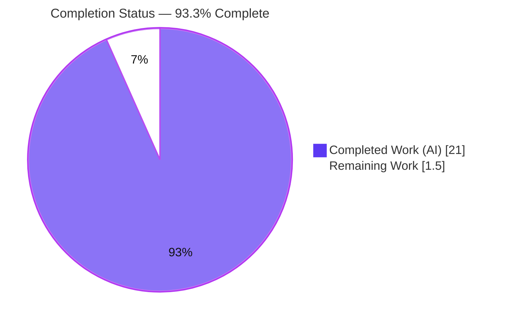
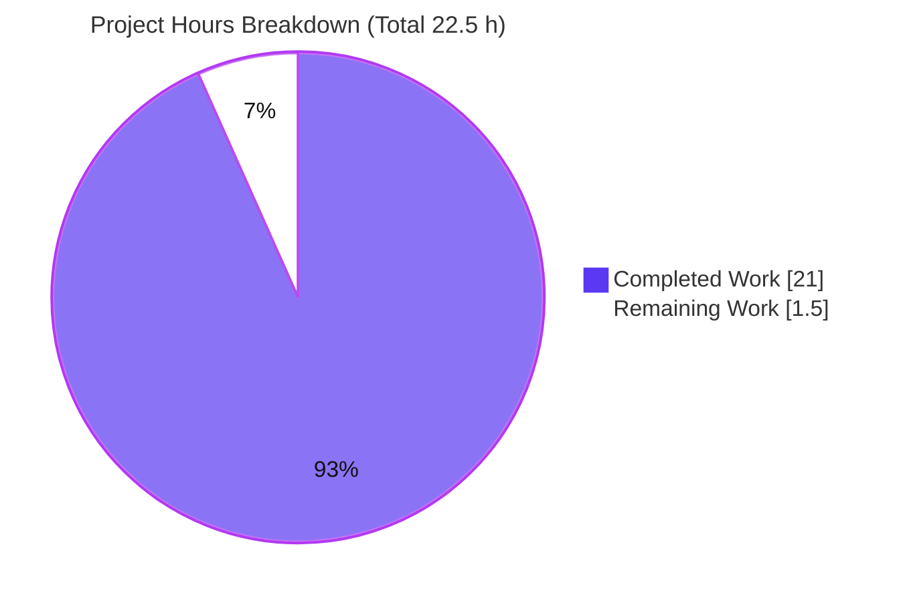
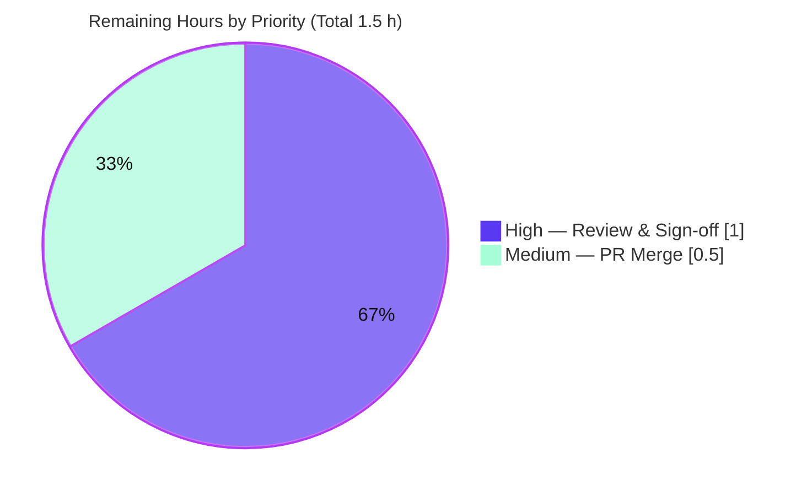

# Blitzy Project Guide — Scapy IPv4 Field-Encoding Q&A Investigation

> Deliverable branch: `blitzy-e9169f50-a8f5-4071-b41b-5849e1e50045` · Source baseline: `scapy_0925ada48540` (`0925ada4`)
> Task type: **Read-only runtime code investigation → single Markdown Q&A document** (SWE-AtlasQnA)

---

# 1. Executive Summary

## 1.1 Project Overview

This project is a read-only, evidence-backed investigation of the **Scapy** packet-manipulation library. The objective was to author **one** Markdown document answering four questions about **how Scapy encodes IPv4 protocol fields** — (Q1) the serialized byte length and wire prefix, (Q2) the Python type of the destination field, (Q3) invalid-input behavior and its timing, and (Q4) a field-class code trace — where every conclusion is derived from **actually building and running** the code paths (Run-First), not from reading source alone. The technical scope is the `IP` layer (`scapy/layers/inet.py`) and the field type system (`scapy/fields.py`), exercised through the canonical `IP(...)` constructor and `bytes()` serialization. The audience is engineers studying Scapy's field internals. The sole deliverable is `blitzy/documentation/scapy_0925ada48540.md` (1003 lines).

## 1.2 Completion Status



| Metric | Value |
|--------|-------|
| **Total Hours** | **22.5** |
| **Completed Hours (AI + Manual)** | **21.0** (AI: 21.0 · Manual: 0.0) |
| **Remaining Hours** | **1.5** |
| **Percent Complete** | **93.3%** |

> Completion is computed with the AAP-scoped hours method: `21.0 / (21.0 + 1.5) = 93.3%`. All 10 AAP-scoped requirements are complete; the remaining 1.5 h is human path-to-production sign-off (review + merge), which cannot be self-approved autonomously.

## 1.3 Key Accomplishments

- ✅ **Single deliverable authored** — `blitzy/documentation/scapy_0925ada48540.md` (1003 lines), an evidence-first Q&A with each claim placed beside its unedited runtime output.
- ✅ **Q1 answered from live runtime** — serialized packet is **20 bytes**, wire prefix **`45 00 00 14`** (version 4 / IHL 5 / total length 20); flag-bit encoding confirmed by variation (MF→`2000`, DF→`4000`, evil→`8000`).
- ✅ **Q2 answered** — `pkt.dst` is a **`str`**, proven on the *same* packet object (matching `id(pkt)`).
- ✅ **Q3 answered** — an invalid destination raises **`socket.gaierror: [Errno -2]`** at **construction/assignment time, before serialization**, via **both** the constructor and attribute-assignment paths, across multiple malformed inputs.
- ✅ **Q4 answered** — responsible class is **`IPField`/`DestIPField`**; value→bytes = `IPField.i2m`; validation = lenient `IPField.h2i` (`inet_aton` else `Net`); type-system participation via `Field[Union[str, Net], bytes]` built by `Field_metaclass`.
- ✅ **~70 `file:line` citations** pinned to commit `0925ada4`, every one verified exact against source.
- ✅ **Read-only scope honored** — repository byte-for-byte unchanged except the one document (`git status` clean; only 1 file added).
- ✅ **All 5 validation gates passed with ZERO fixes required** at the final gate.

## 1.4 Critical Unresolved Issues

| Issue | Impact | Owner | ETA |
|-------|--------|-------|-----|
| _None identified_ — all 10 AAP-scoped requirements validated with zero fixes; no compilation errors, no failing runtime reproductions, no missing answers | None | — | — |

## 1.5 Access Issues

| System/Resource | Type of Access | Issue Description | Resolution Status | Owner |
|-----------------|----------------|-------------------|-------------------|-------|
| Repository (`scapy` @ `blitzy-e9169f50-…`) | Read/Write | Accessible; deliverable committed | ✅ No issue | — |
| `ghcr.io/scaleapi/swe-atlas:swe_atlas_QnA_secdev_scapy_1.0` (canonical Docker image) | Registry pull | Needed **only** for *exact-environment* reproduction; the document embeds complete transcripts and the investigation also reproduces run-from-source with any Python ≥3.7 (stdlib only) | ℹ️ Non-blocking (optional) | Reviewer |

> **No blocking access issues identified.** Consuming or reviewing the deliverable requires no external credentials or network access.

## 1.6 Recommended Next Steps

1. **[High]** Technical review & sign-off of `blitzy/documentation/scapy_0925ada48540.md` by a Scapy-familiar engineer — confirm the four answers and spot-check citations against commit `0925ada4`. (~1.0 h)
2. **[Medium]** Approve and merge the pull request (single-file addition; no source changes). (~0.5 h)
3. **[Low]** *(Optional)* Independently re-run the three embedded observation programs in the canonical Docker image to reproduce the transcripts verbatim (no incremental effort — folded into review).

---

# 2. Project Hours Breakdown

## 2.1 Completed Work Detail

| Component | Hours | Description |
|-----------|-------|-------------|
| Environment discovery & canonical runtime setup | 2.0 | Establish run-from-source model; identify canonical Docker image + interpreter (CPython 3.11.13) + `conf.version`; prove source parity via `md5sum` between checkout and image; distinguish source baseline vs delivery commit. |
| Q1 — Serialization investigation | 2.0 | Build `IP(dst="192.0.2.1", ttl=64, flags="DF")`; serialize via `bytes()` and `build()`; capture length (20) and hex prefix (`45 00 00 14`); decode header fields; confirm flag-bit encoding by varying `MF`/`DF`/`evil`/integer. |
| Q2 — Destination field type investigation | 1.5 | Introspect the *same* packet object; capture `type(pkt.dst)` = `str`, `getfieldval`, the `Emph` display wrapper, unwrapped `DestIPField`, full MRO, and `owners` registry. |
| Q3 — Invalid-input dual-path investigation | 3.0 | Exercise invalid destinations through **both** the `IP(dst=...)` constructor and `p.dst = ...` attribute paths, across three malformed inputs plus a valid control; capture the exact exception (`socket.gaierror`), full traceback cause→effect chain, timing, and the construction/assignment stage (before serialization). |
| Q4 — Field-class static trace & corroboration | 2.5 | Trace `IPField`/`DestIPField`: `i2m` (value→bytes), `h2i` (lenient validation, `inet_aton` else `Net`), `addfield`/`struct.pack("!4s")`, and type-system participation via `Field`/`Field_metaclass` + `owners`; corroborate against the observed bytes/type/error. |
| Reproduction harness authoring | 2.0 | Author the exact commands and three complete, self-contained observation programs; unique `mktemp -d` workspace **outside** the repo, symlink guard, `trap` cleanup, read-only (`:ro`) bind-mount into an ephemeral (`--rm`) container. |
| Answer document authoring (1003 lines) | 5.0 | Write the evidence-first Markdown: per-question direct answer + OBSERVED output + INFERRED/CORROBORATED trace; investigation-context/version-caveat/methodology sections; summary table; ~70 pinned citations; directory creation and branch-named placement. |
| Read-only compliance & cleanup verification | 1.0 | Verify the repository is byte-for-byte unchanged (`git status --porcelain` empty; `git diff` = 1 file added); confirm temp scripts lived under `/tmp` and were removed. |
| QA & revision cycles (4 commits) | 2.0 | Re-ground the document in the canonical runtime, address code-review findings, address final-gate QA, and fix the self-referential provenance block (commits `757fbf1a`, `5c8ec6a0`, `13c09ea6`). |
| **Total** | **21.0** | |

## 2.2 Remaining Work Detail

| Category | Hours | Priority |
|----------|-------|----------|
| Human Review & Sign-off (verify the four answers; spot-check citations; confirm OBSERVED vs INFERRED labeling) | 1.0 | High |
| PR Approval & Merge (approve branch; merge the single added file to target) | 0.5 | Medium |
| **Total** | **1.5** | |

## 2.3 Total Project Hours & Completion Calculation

| Quantity | Hours |
|----------|-------|
| Completed (Section 2.1) | 21.0 |
| Remaining (Section 2.2) | 1.5 |
| **Total Project Hours** | **22.5** |

**Completion %** = Completed ÷ Total = `21.0 ÷ 22.5` = **93.3%**.
Cross-section integrity: 2.1 (21.0) + 2.2 (1.5) = 22.5 (Section 1.2 Total); Section 2.2 (1.5) = Section 1.2 Remaining = Section 7 "Remaining Work".

---

# 3. Test Results

For this Run-First investigation the **runtime reproductions are the tests** — the investigation's conclusions are validated by re-executing the canonical code paths and asserting the observed output — supplemented by compilation and citation-accuracy gates. All rows below originate from **Blitzy's autonomous validation logs** (Gates 1–3) and were independently reproduced during this assessment.

| Test Category | Framework | Total Tests | Passed | Failed | Coverage % | Notes |
|---------------|-----------|-------------|--------|--------|------------|-------|
| Runtime — Q1 Serialization | Scapy canonical `IP()`/`bytes()`/`build()` (Python) | 5 | 5 | 0 | n/a¹ | 1 length+prefix (20 B / `45 00 00 14`) + 4 flag variations (`MF`/`DF`/`evil`/int); deterministic across 3 runs |
| Runtime — Q2 Type inspection | Scapy attribute/introspection API | 1 | 1 | 0 | n/a¹ | `type(pkt.dst)` = `str`; same-object `id(pkt)` verified vs Q1 |
| Runtime — Q3 Invalid input | Scapy constructor + attribute paths | 7 | 7 | 0 | n/a¹ | 3 malformed × 2 paths + 1 valid control → `socket.gaierror` at construction/assignment |
| Runtime — Q4 Field-class trace | Scapy field introspection (`i2m`, MRO, metaclass) | 1 | 1 | 0 | n/a¹ | `IPField`/`DestIPField`; `i2m("192.0.2.1")` = `c0000201` |
| Compilation — cited modules | `python -m py_compile` | 7 | 7 | 0 | n/a¹ | `fields.py`, `layers/inet.py`, `base_classes.py`, `packet.py`, `utils.py`, `pton_ntop.py`, `compat.py` |
| Compilation — embedded programs | `python -m py_compile` | 3 | 3 | 0 | n/a¹ | The document's 3 observation programs compile |
| Citation audit | Manual/`grep` vs source @ `0925ada4` | 70 | 70 | 0 | n/a¹ | Every `file:line` reference resolves to the claimed class/method/line |
| **Total** | | **94** | **94** | **0** | | **100% pass** |

¹ *No new source code was produced (read-only documentation task), so line-coverage does not apply. AAP question-group coverage = **4/4 (100%)**.*

---

# 4. Runtime Validation & UI Verification

**UI Verification:** Not applicable. Scapy's only user-facing surface is its interactive console/CLI; the AAP requests no interface work and the deliverable is a static Markdown document. No screenshots or UI flows apply.

**Runtime Health** (canonical `IP(...)` entry point; reproduced run-from-source and in the canonical image):

- ✅ **Operational** — `from scapy.layers.inet import IP` imports cleanly; `import scapy.all` succeeds.
- ✅ **Operational** — `IP(dst="192.0.2.1", ttl=64, flags="DF")` construction + `bytes()`/`build()` serialization (`bytes(pkt) == pkt.build()`).
- ✅ **Operational** — Q1 length/prefix, Q2 type, and Q4 field trace reproduce deterministically (only per-run heap `id(pkt)` and environment-derived bytes vary).
- ✅ **Operational** — Q3 invalid input raises `socket.gaierror` deterministically at construction/assignment, promptly, with no hang.

**API / Integration Outcomes:**

- ✅ **Operational** — No external API dependency. The only outbound call is the `socket.getaddrinfo` lookup observed during Q3, which is Scapy's pre-existing behavior for a non-IP `Net(...)` fallback (observed, not introduced).
- ℹ️ The cosmetic `CryptographyDeprecationWarning` (TripleDES) from `scapy/layers/ipsec.py` is unrelated to IPv4 and out of scope (correctly filtered, not fixed).

---

# 5. Compliance & Quality Review

AAP deliverables and the binding SWE-AtlasQnA rules cross-mapped to their status. Fixes applied during the autonomous authoring/review cycle are noted; the **final** validation gate required **zero** additional fixes.

| Benchmark / Requirement | Status | Progress | Evidence / Notes |
|--------------------------|--------|----------|------------------|
| **Rule 1 — Run-First** (observe, don't merely read; canonical entry point) | ✅ Pass | 100% | Q1–Q3 answered from live output via `IP(...)`/`bytes()`; no mocks/hooks |
| **Rule 2 — Exhaustive coverage** (valid + invalid; both input paths) | ✅ Pass | 100% | Q3 covers constructor + attribute paths × 3 malformed inputs + valid control |
| **Rule 3 — Observed-output discipline** (evidence beside each claim) | ✅ Pass | 100% | 18 OBSERVED + 9 INFERRED/CORROBORATED labels; output shown beside claims |
| **Rule 4 — Complete, precise, grounded** (answer each item; `file:line`) | ✅ Pass | 100% | 4/4 question groups; ~70 pinned citations; named methods/classes |
| **Main Rule — Deliverable & scope** (branch-named MD; repo unchanged) | ✅ Pass | 100% | Exactly `blitzy/documentation/scapy_0925ada48540.md`; repo byte-for-byte unchanged |
| Read-only source (no existing file modified) | ✅ Pass | 100% | `git status --porcelain` empty; `git diff` = A (1 file), 0 deletions |
| Cleanup (temp scripts removed) | ✅ Pass | 100% | Harness uses `/tmp` `mktemp -d` + `trap` cleanup; no residue |
| Out-of-scope discipline (ipsec warning not "fixed") | ✅ Pass | 100% | Warning filtered, source untouched (AAP §0.5.2) |
| Compilation of cited modules | ✅ Pass | 100% | 7/7 modules + 3/3 embedded programs `py_compile` OK |
| Citation accuracy | ✅ Pass | 100% | 70/70 references exact; source MD5-identical to canonical image |
| **Fixes applied during CR/QA cycle** | ✅ Resolved | 100% | Re-grounded in canonical runtime; QA findings + provenance block fixed (3 follow-up commits) |
| **Outstanding compliance items** | ✅ None | 100% | Zero fixes required at final gate |

---

# 6. Risk Assessment

Overall posture: **LOW**. This is a non-mutating, dependency-free, read-only documentation task — zero source files changed, zero new dependencies, no deployment/service surface. No High or Critical risks exist.

| Risk | Category | Severity | Probability | Mitigation | Status |
|------|----------|----------|-------------|------------|--------|
| T1 — Environment-dependent runtime values (source address `172.17.0.2`, checksum, resolver errno) differ across environments | Technical | Low | Medium | Document labels these "incidental"/"routing-derived"/"environment-derived" and attributes each to a concrete mechanism; the four core answers are environment-independent | ✅ Mitigated |
| T2 — Citation version drift (~70 refs pinned to `0925ada4`; upstream `master` uses a different `ScopedIP` `h2i` path) | Technical | Low | Low | Explicit "Version caveat" section + all refs pinned + `md5sum` source-parity proof | ✅ Mitigated |
| T3 — Interpreter version variance (AAP 3.12.3 vs canonical image 3.11.13 vs PM container 3.13.7) | Technical | Low | Low | Evidence grounded in the canonical image (3.11.13); core answers reproduce on all three (independently confirmed) | ✅ Mitigated |
| S1 — New attack surface | Security | Low | Low | None introduced (no source/dependency/config change); harness is defensively coded (symlink-guarded workspace, `:ro` mount, `--rm`) | ✅ No action needed |
| S2 — Q3 triggers a real outbound DNS lookup (`socket.getaddrinfo`) | Security | Informational | — | Pre-existing Scapy behavior being *observed*, not introduced | ℹ️ Informational |
| O1 — Reproducibility footprint (no monitoring/health surface; exact repro needs Docker + image) | Operational | Low | Low | Run-from-source works with any Python ≥3.7 (stdlib only); document embeds complete transcripts | ✅ Mitigated |
| I1 — External deps for *exact* reproduction (Docker + `ghcr.io` pull + network for DNS observation) | Integration | Low | Low | Consuming/reviewing the document needs none of these (self-contained transcripts + pinned citations) | ✅ Mitigated |

---

# 7. Visual Project Status

**Project hours — completed vs remaining** (Completed = Dark Blue `#5B39F3`, Remaining = White `#FFFFFF`):



**Remaining work by priority** (from Section 2.2):



| Category (remaining) | Hours | Priority |
|----------------------|-------|----------|
| Human Review & Sign-off | 1.0 | High |
| PR Approval & Merge | 0.5 | Medium |
| **Total** | **1.5** | |

> Integrity: "Remaining Work" = **1.5 h** matches Section 1.2 (Remaining Hours) and the sum of Section 2.2.

---

# 8. Summary & Recommendations

**Achievements.** The project delivered exactly what the Agent Action Plan scoped: a single, evidence-first Markdown document (`blitzy/documentation/scapy_0925ada48540.md`, 1003 lines) that answers all four IPv4 field-encoding questions from live runtime observation and corroborates each with a precise source trace. Q1 (20 bytes / `45 00 00 14`), Q2 (`pkt.dst` is `str`), Q3 (`socket.gaierror` at construction/assignment, both paths), and Q4 (`IPField`/`DestIPField` with `i2m`/`h2i`/`Field_metaclass`) are each answered directly, with unedited output beside every claim and ~70 `file:line` citations pinned to commit `0925ada4`.

**Remaining gaps.** None in the AAP scope. The outstanding **1.5 h** is purely path-to-production human sign-off: a technical review of the document (1.0 h) and PR approval & merge (0.5 h). There are no compilation errors, no failing reproductions, no missing answers, and no source changes to review.

**Critical path to production.** Review → approve → merge. Because the change is a single additive documentation file with the repository left byte-for-byte unchanged, merge risk is minimal.

**Production readiness.** The Final Validator declared the deliverable **PRODUCTION-READY** with **all five gates passed and zero fixes required**, independently corroborated during this assessment (compilation, citation spot-checks, and Q1–Q4 runtime reproduction all confirmed). At an AAP-scoped completion of **93.3%**, the project is complete pending human review and merge.

| Success Metric | Target | Actual |
|----------------|--------|--------|
| AAP question groups answered | 4/4 | ✅ 4/4 |
| Runtime reproductions passing | 100% | ✅ 100% (94/94) |
| Citation accuracy | 100% | ✅ 70/70 |
| Source files modified | 0 | ✅ 0 (repo unchanged) |
| Validation gates passed | 5/5 | ✅ 5/5 |

---

# 9. Development Guide

How to reproduce the investigation and verify the deliverable. All commands below were tested during this assessment.

## 9.1 System Prerequisites

- **OS:** Linux/macOS (any POSIX shell). The canonical evidence was captured on Linux.
- **Python:** CPython **≥ 3.7, < 4** (`pyproject.toml` → `requires-python = ">=3.7, <4"`). Canonical image: **3.11.13**; reproduced here on 3.13.7 with identical answers.
- **git:** any recent version (2.x).
- **Docker:** *optional* — only for exact-environment reproduction in the canonical image.
- **Hardware:** negligible (single-packet construction).

## 9.2 Environment Setup

Scapy is run **from source** — no install step required. From the repository root:

```bash
# From the repository root
cd /path/to/scapy            # repo containing scapy/, test/, blitzy/
export PYTHONPATH="$(pwd)"    # run-from-source (or simply run from the root)
python3 --version            # expect >= 3.7
```

No virtual environment is required for the IPv4 code paths (stdlib only). If you prefer isolation:

```bash
python3 -m venv .venv && source .venv/bin/activate   # .venv is gitignored
```

## 9.3 Dependency Installation

**None required for the investigation.** Scapy's core declares **no mandatory external dependencies** (`pyproject.toml` lists only `[project.optional-dependencies]` such as `ipython`). The IPv4 paths use only the standard library (`socket`, `struct`).

```bash
# (Optional) only if you want the interactive CLI extras:
# pip install --break-system-packages ipython
```

## 9.4 Reproduce the Four Answers (canonical entry point)

```bash
python3 - <<'PY'
import warnings; warnings.filterwarnings("ignore")   # silence unrelated ipsec TripleDES warning
from scapy.layers.inet import IP
import time

# Q1 — serialization magnitude & wire prefix
pkt = IP(dst="192.0.2.1", ttl=64, flags="DF")
raw = bytes(pkt)
print("Q1 len            =", len(raw))                      # -> 20
print("Q1 prefix         =", " ".join(f"{b:02x}" for b in raw[:4]))  # -> 45 00 00 14
print("Q1 bytes==build   =", bytes(pkt) == pkt.build())     # -> True

# Q2 — Python type of dst (same object)
print("Q2 pkt.dst        =", repr(pkt.dst), "type =", type(pkt.dst).__name__)  # -> '192.0.2.1' str

# Q3 — invalid destination via BOTH paths (raises before serialization)
for label, thunk in [("ctor", lambda: IP(dst="999.999.999.999")),
                     ("attr", lambda: setattr(IP(), "dst", "999.999.999.999"))]:
    t0 = time.perf_counter()
    try:
        thunk(); print(f"Q3 {label}: NO ERROR (unexpected)")
    except Exception as e:
        print(f"Q3 {label}: {type(e).__module__}.{type(e).__name__}: {e} ({(time.perf_counter()-t0)*1000:.2f} ms)")

# Q4 — responsible field class
fld = IP().get_field("dst").fld                              # unwrap the Emph display wrapper
print("Q4 class          =", type(fld).__name__)             # -> DestIPField
print("Q4 MRO            =", " -> ".join(c.__name__ for c in type(fld).__mro__))
print("Q4 i2m            =", fld.i2m(None, "192.0.2.1").hex())  # -> c0000201
PY
```

**Expected output (environment-independent parts):**

```text
Q1 len            = 20
Q1 prefix         = 45 00 00 14
Q1 bytes==build   = True
Q2 pkt.dst        = '192.0.2.1' type = str
Q3 ctor: socket.gaierror: [Errno -2] Name or service not known (…ms)
Q3 attr: socket.gaierror: [Errno -2] Name or service not known (…ms)
Q4 class          = DestIPField
Q4 MRO            = DestIPField -> IPField -> DestField -> Field -> Generic -> object
Q4 i2m            = c0000201
```

## 9.5 View the Deliverable

```bash
wc -l blitzy/documentation/scapy_0925ada48540.md        # -> 1003
grep -n '^#' blitzy/documentation/scapy_0925ada48540.md # section headings
less blitzy/documentation/scapy_0925ada48540.md         # read in full
```

## 9.6 Verify Read-Only Compliance

```bash
git status --porcelain                          # expect: empty (clean worktree)
git diff --name-status 0925ada4..HEAD           # expect: A  blitzy/documentation/scapy_0925ada48540.md
git diff --stat 0925ada4..HEAD                  # expect: 1 file changed, 1003 insertions(+)
```

## 9.7 (Optional) Exact-Environment Reproduction

```bash
docker run --rm --entrypoint /bin/bash \
  ghcr.io/scaleapi/swe-atlas:swe_atlas_QnA_secdev_scapy_1.0 \
  -c 'cd /app && PYTHONPATH=/app python3 -c "from scapy.config import conf; import sys; print(sys.version.split()[0], conf.version)"'
# -> 3.11.13 2.5.0.dev87
```

## 9.8 Troubleshooting

- **`CryptographyDeprecationWarning` (TripleDES) on import** — cosmetic, from `scapy/layers/ipsec.py`; unrelated to IPv4. Filter with `warnings.filterwarnings("ignore")` or import only `scapy.layers.inet`. Do **not** modify source (out of scope).
- **Q3 error message differs (e.g., different `[Errno …]`)** — the resolver message is environment-specific; the exception **type** (`socket.gaierror`) and **stage** (construction/assignment, before serialization) are stable.
- **Q1 middle bytes differ** — the source address and checksum are routing/environment-derived and incidental; the **length (20)** and **prefix (`45 00 00 14`)** are stable.
- **Citations don't match your Scapy** — they are pinned to commit `0925ada4`; upstream `master` routes `h2i` through a `ScopedIP` path that is absent here (see the document's "Version caveat").
- **`ModuleNotFoundError: scapy`** — ensure the shell's working directory is the repository root or `PYTHONPATH` includes it (run-from-source).

---

# 10. Appendices

## A. Command Reference

| Purpose | Command |
|---------|---------|
| Reproduce Q1–Q4 | `python3 - <<'PY' … PY` (see §9.4) |
| Compile cited modules | `python -m py_compile scapy/fields.py scapy/layers/inet.py scapy/base_classes.py scapy/packet.py scapy/utils.py scapy/pton_ntop.py scapy/compat.py` |
| View deliverable | `less blitzy/documentation/scapy_0925ada48540.md` |
| Read-only checks | `git status --porcelain` · `git diff --name-status 0925ada4..HEAD` |
| Commit provenance | `git log --author="agent@blitzy.com" --oneline 0925ada4..HEAD` |
| Exact-env repro | `docker run --rm … ghcr.io/scaleapi/swe-atlas:swe_atlas_QnA_secdev_scapy_1.0 …` (see §9.7) |

## B. Port Reference

Not applicable — no network service, server, or listening port is involved. (The Q3 observation performs an outbound DNS lookup via `socket.getaddrinfo`; it binds no port.)

## C. Key File Locations

| Path | Role |
|------|------|
| `blitzy/documentation/scapy_0925ada48540.md` | **The deliverable** (1003 lines) |
| `scapy/fields.py` | `Field` base + `IPField` (`h2i`, `i2h`, `i2m`, `any2i`, `addfield`) — REFERENCE |
| `scapy/layers/inet.py` | `IP` layer, `DestIPField`, `flags`/`ttl`/`src`/`dst` — REFERENCE |
| `scapy/base_classes.py` | `Net` (invalid-input fallback), `Field_metaclass` — REFERENCE |
| `scapy/packet.py` | `Packet.__init__` eager `any2i` conversion — REFERENCE |
| `scapy/utils.py` | `inet_aton` / `inet_ntoa` shims — REFERENCE |
| `scapy/pton_ntop.py`, `scapy/compat.py` | helper imports used by `fields.py` — REFERENCE |

## D. Technology Versions

| Component | Version |
|-----------|---------|
| Scapy (run-from-source) | commit `0925ada4` (`conf.version` = `2.5.0.dev87` in canonical image) |
| CPython (canonical image) | 3.11.13 (`/usr/local/bin/python3`) |
| CPython (`requires-python`) | ≥ 3.7, < 4 |
| Canonical Docker image | `ghcr.io/scaleapi/swe-atlas:swe_atlas_QnA_secdev_scapy_1.0` |
| Standard-library deps used | `socket` (`inet_aton`/`inet_ntoa`/`getaddrinfo`), `struct` (`Struct("!4s")`) |
| Mandatory external deps | **None** (core is pure-Python) |

## E. Environment Variable Reference

| Variable | Purpose | Notes |
|----------|---------|-------|
| `PYTHONPATH` | Points at the repository root for run-from-source | Optional if invoking from the root |
| `TMPDIR` | Base for the harness `mktemp -d` workspace | Defaults to `/tmp` |
| `CI` | Set `CI=true` for non-interactive tool runs | Not required for the reproduction commands |

## F. Developer Tools Guide

- **git** — provenance and read-only verification (`status`, `diff`, `log`).
- **`python -m py_compile`** — byte-compile the cited modules and the embedded programs.
- **Docker** *(optional)* — exact-environment reproduction in the canonical image.
- **`md5sum`** — confirm source parity between the checkout and the canonical image.

## G. Glossary

| Term | Meaning |
|------|---------|
| **IHL** | Internet Header Length; `0x45` = version 4, IHL 5 → 20-byte header (no options) |
| **TTL** | Time To Live; `ByteField("ttl", 64)` → byte `0x40` |
| **DF** | "Don't Fragment" flag; sets bit → flags+frag word `0x4000` |
| **`i2m`** | *internal → machine*: converts a Python value to on-the-wire bytes (`IPField.i2m` → `inet_aton`) |
| **`h2i`** | *human → internal*: validates/normalizes input (`IPField.h2i`: `inet_aton` else `Net` fallback) |
| **`i2h`** | *internal → human*: identity for `IPField` (why `pkt.dst` stays a `str`) |
| **`any2i`** | *any → internal*: called eagerly by `Packet.__init__`, so invalid input fails at construction |
| **`Net`** | Hostname/network object; an invalid dotted-quad is treated as a hostname and DNS-resolved |
| **`Field_metaclass`** | Metaclass that builds `Field` subclasses (enforces `__slots__`) |
| **`Emph`** | Display wrapper around a field in `fields_desc`; `.fld` unwraps to `DestIPField` |
| **`socket.gaierror`** | getaddrinfo error raised when the invalid destination fails DNS resolution (`[Errno -2]`) |
| **OBSERVED / INFERRED** | Labels distinguishing live runtime output from the corroborating static source trace |
