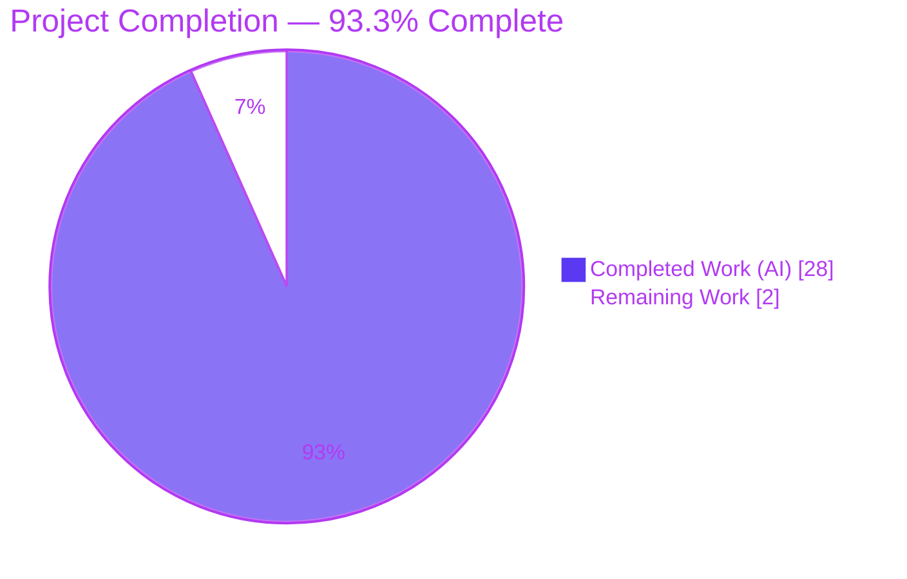
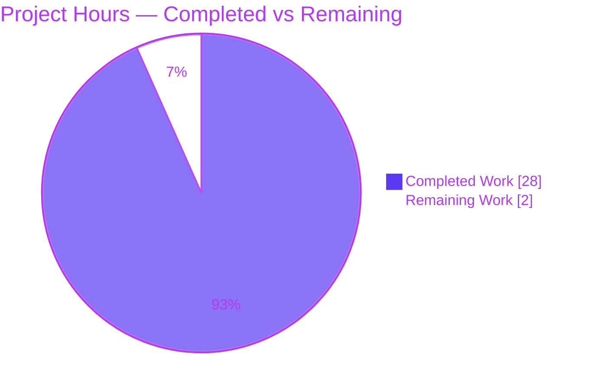
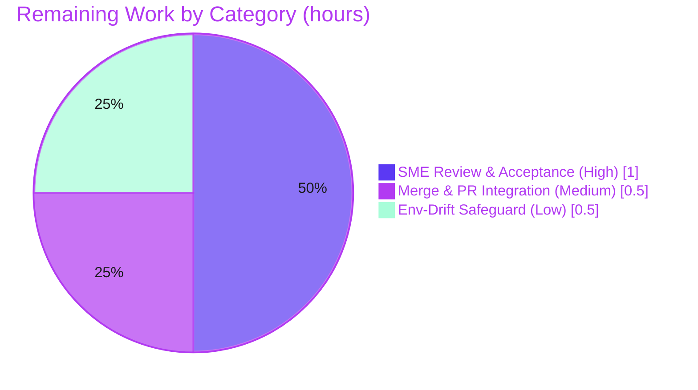

# Blitzy Project Guide — Scapy Runtime-Behavior Orientation (`scapy_0925ada48540`)

## 1. Executive Summary

### 1.1 Project Overview

This project delivers a single, evidence-based Markdown orientation document explaining how a locally cloned **Scapy** repository actually behaves at runtime in its canonical environment. Aimed at new team members onboarding to the Scapy codebase, it answers five concrete questions: the startup banner and version derivation, the count of protocol layers actually *loaded* versus files on disk, the default verbosity and socket implementation, the internal structure of an ICMP ping packet, and the active console theme. Every answer pairs a direct conclusion with exact source-line citations and read-only runtime evidence. The technical scope is deliberately additive and isolated: exactly one documentation file is created, with **zero** modifications to Scapy source, dependencies, or build configuration.

### 1.2 Completion Status

The completion percentage is computed using the AAP-scoped, hours-based methodology: **Completion % = Completed Hours ÷ (Completed Hours + Remaining Hours)**. All 14 AAP-scoped deliverables are complete and validated; the 2.0 remaining hours are human-only path-to-production activities (review, merge, optional hardening).



| Metric | Hours |
|---|---|
| **Total Hours** | **30.0** |
| Completed Hours (AI: 28.0 + Manual: 0.0) | 28.0 |
| Remaining Hours | 2.0 |
| **Percent Complete** | **93.3%** |

> Legend — **Completed Work = Dark Blue `#5B39F3`**, **Remaining Work = White `#FFFFFF`**.

### 1.3 Key Accomplishments

- ✅ **All five user questions answered** (R1 banner & version, R2 loaded layers, R3 verbosity & socket, R4 ICMP packet structure, R5 default theme) — each with a direct answer, code evidence, and rationale.
- ✅ **Evidence-grounded:** 62 exact `[<path>:L<line>]` source citations across 14 Scapy files; every cited line independently spot-checked accurate.
- ✅ **Runtime-verified:** all documented values reproduce exactly under read-only execution (`2026.06.26`, 49 load_layers, 1319 registered classes, verb=2, `L3PacketSocket`, `DefaultTheme`).
- ✅ **Subtle distinctions captured:** layer *modules* (49) vs registered `Packet` *classes* (1319) vs on-disk files (56/88/149); the `48→49` `tuntap` append on Linux; crypto-independence of the class count proven.
- ✅ **Correctly named & placed:** `blitzy/documentation/scapy_0925ada48540.md` (branch-derived name), in a newly created `blitzy/documentation/` directory.
- ✅ **Read-only constraint honored:** zero source/config/build files modified; working tree clean; no temporary or cache artifacts left behind.
- ✅ **Committed:** 4 iterative commits by `agent@blitzy.com`, HEAD `1967e4d5`; validated PRODUCTION-READY with zero discrepancies.

### 1.4 Critical Unresolved Issues

| Issue | Impact | Owner | ETA |
|---|---|---|---|
| _None — no blocking issues_ | All AAP deliverables complete & validated; no compilation/test/runtime failures | — | — |

There are **no critical unresolved issues**. The Final Validator reported all production-readiness gates PASS with zero corrections required, independently corroborated during this assessment.

### 1.5 Access Issues

| System/Resource | Type of Access | Issue Description | Resolution Status | Owner |
|---|---|---|---|---|
| Git repository | Read/Write | None — repo accessible, committed at HEAD `1967e4d5`, branch up to date with origin | ✅ Resolved | — |
| Canonical Docker image `ghcr.io/scaleapi/swe-atlas:...` | Pull (network) | Documented reproduction path uses this image; offline host-equivalent path is also provided and works without it | ✅ Mitigated | Reviewer |

**No access issues block validation, integration, or deployment.** The deliverable is a plain UTF-8 Markdown file (not LFS-tracked); no credentials or third-party API access are required for this read-only documentation task.

### 1.6 Recommended Next Steps

1. **[High]** Conduct an SME final review of `blitzy/documentation/scapy_0925ada48540.md` — read the document, spot-verify a sample of citations, and run the reproduction one-liner to confirm runtime values (≈1.0h).
2. **[Medium]** Approve the PR and merge branch `blitzy-b7d31ffd-71fa-4beb-9ab1-4b22ff93e89f` to the integration branch (≈0.5h).
3. **[Low]** Optionally add an environment-drift safeguard — a short maintainer note or a lightweight CI smoke-check that reproduces the documented one-liner expected output (≈0.5h).

---

## 2. Project Hours Breakdown

### 2.1 Completed Work Detail

| Component | Hours | Description |
|---|---|---|
| R1 — Startup banner & version | 2.5 | Banner text block + version `2026.06.26`; traced the `_version()` fallback chain to the mtime fallback (zero git tags); cited `main.py` banner block & `__init__.py` derivation |
| R2 — Loaded protocol layers | 3.5 | Distinguished `len(conf.load_layers)`=49 (modules) from `len(conf.layers)`=1319 (classes) vs 56/88/149 on-disk files; explained Linux `tuntap` 48→49 append; proved crypto-independence of the class count |
| R3 — Verbosity & socket impl. | 2.5 | `conf.verb=2` with 0–3 behavior table from `sendrecv.py` gating; native `PF_PACKET` socket resolution (`L3PacketSocket`/`L2Socket`/`L2ListenSocket`, `use_pcap/use_bpf=False`) |
| R4 — ICMP packet structure | 3.0 | Single composite `Packet`; `IP → ICMP → NoPayload` linked-list; `__div__`/`add_payload` mechanism + `payload`/`underlayer` linkage; mermaid structure diagram |
| R5 — Active default theme | 2.0 | `DefaultTheme` (interactive) vs static `NoTheme`; 13 theme classes cataloged; Windows `BlackAndWhite` contrast |
| Environment preamble & runtime profiling | 2.5 | Established ground-truth runtime (Python 3.11.13, Debian 12, optional-dependency state) and canonical-image alignment |
| Document authoring, structure & formatting | 4.0 | Drafting prose, tables, intro, the consistent Direct-answer→Evidence→Rationale pattern, and mermaid diagram across all sections |
| Citation verification (62 citations) | 2.0 | Authoring and verifying 62 exact `[<path>:L<line>]` references across 14 source files |
| Reproduction section + command testing | 1.5 | Crafting & testing the read-only Docker one-liner, `run_scapy` theme command, and host-equivalent path |
| Iterative refinement (4 commits) | 3.0 | Addressing code-review findings, refreshing the env preamble to live runtime, correcting the R2 crypto claim, aligning R1 to the canonical Docker runtime |
| Read-only verification & cleanup | 1.5 | Confirming zero source modifications, clean working tree, no `__pycache__`/`.pyc` artifacts, temp scripts confined to `/tmp` and removed |
| **Total Completed** | **28.0** | |

### 2.2 Remaining Work Detail

| Category | Hours | Priority |
|---|---|---|
| SME review & acceptance of the orientation document | 1.0 | High |
| Merge & PR integration to the target branch | 0.5 | Medium |
| Optional environment-drift safeguard (maintainer note / CI smoke-check) | 0.5 | Low |
| **Total Remaining** | **2.0** | |

> Cross-section check: **2.1 (28.0) + 2.2 (2.0) = 30.0 Total Hours** (matches Section 1.2). All remaining work is human-only path-to-production; there is no remaining autonomous engineering work.

---

## 3. Test Results

The AAP explicitly places traditional unit/integration tests **out of scope** for this documentation task; verification is performed via **read-only runtime introspection**. The categories below are the functional equivalent of a test suite — every documented value, citation, and constraint reproduced as a pass/fail check. **All checks originate from Blitzy's autonomous validation logs** (Final Validator gates) and were independently re-run during this assessment.

| Test Category | Framework | Total Tests | Passed | Failed | Coverage % | Notes |
|---|---|---|---|---|---|---|
| Runtime value reproduction (R1–R5) | Read-only Scapy introspection (`python3 -B`) | 26 | 26 | 0 | 100% of documented values | The functional "unit tests": R1 (3), R2 (6), R3 (6), R4 (8), R5 (3) |
| Citation accuracy | Source line verification (`sed`/`grep`) | 62 | 62 | 0 | 100% | All `[<path>:L<line>]` citations verified against source |
| Module compilation & import | `py_compile` + `import scapy.all` | 12 | 12 | 0 | 11 referenced modules + `scapy.all` | Byte-compile exit 0; import clean |
| Document structural validity | Markdown/mermaid structural lint | 4 | 4 | 0 | 100% | 5 balanced code-fence pairs, valid mermaid block, 2 anchors resolve, clean UTF-8 |
| Read-only compliance | `git diff` / `git status` verification | 3 | 3 | 0 | 100% | 0 source modifications, clean tree, 0 cache artifacts |
| **Total** | | **107** | **107** | **0** | **100%** | Zero discrepancies |

**Pass rate: 100% (107/107).** Independently confirmed on this host (Python 3.13.7) where R1–R4 values reproduced exactly despite a different interpreter/crypto version — demonstrating the documented structural answers are environment-independent.

---

## 4. Runtime Validation & UI Verification

**Runtime health** (read-only execution):

- ✅ **Operational** — `import scapy.all` succeeds cleanly under `python3 -B` (no bytecode written to the read-only checkout).
- ✅ **Operational** — Interactive console launches via `./run_scapy` and sets `conf.color_theme = DefaultTheme()` with `conf.interactive = True`.
- ✅ **Operational** — Reproduction one-liner returns the documented values: `2026.06.26 49 1319 2 L3PacketSocket`.
- ✅ **Operational** — ICMP example constructs correctly: `IP()/ICMP()` → single composite `IP` packet; `summary()` → `IP / ICMP 127.0.0.1 > 127.0.0.1 echo-request 0`; `layers()` → `[IP, ICMP]`.

**UI verification:**

- ⚪ **Not Applicable** — No graphical UI is in scope. The project's "interface" is the Scapy CLI/REPL and the rendered Markdown document. The Markdown renders correctly (headings, tables, fenced code blocks, mermaid diagram, internal anchors), verified structurally.

**API / external integration:**

- ⚪ **Not Applicable** — The task introduces no APIs, services, network calls, or external integrations. Verification was confined to local, read-only introspection.

---

## 5. Compliance & Quality Review

Cross-mapping AAP deliverables and project rules to quality benchmarks. Fixes applied during autonomous validation are noted; there are no outstanding compliance items.

| Benchmark / AAP Rule | Status | Progress | Notes |
|---|---|---|---|
| R1–R5 answered with answer + code evidence + rationale | ✅ Pass | 100% | All five sections follow the required pattern |
| Branch-named single deliverable in `blitzy/documentation/` | ✅ Pass | 100% | `scapy_0925ada48540.md` created at the exact path |
| Read-only investigation — no source files modified | ✅ Pass | 100% | `git diff` excluding deliverable is empty; 0 source mods |
| No other code added beyond the document | ✅ Pass | 100% | Exactly 1 file added (205 insertions, 0 deletions) |
| Cleanup of temporary scripts/artifacts | ✅ Pass | 100% | No temp files / `__pycache__` / `.pyc` in repo; tree clean |
| Evidence-first / code-as-source-of-truth + citations | ✅ Pass | 100% | 62 exact `[<path>:L<line>]` citations, all verified |
| Build & run to analyze behavior | ✅ Pass | 100% | All values obtained from live read-only Scapy execution |
| Environment fidelity (report actual container values) | ✅ Pass | 100% | Aligned to canonical Docker image; version-dependence nuances disclosed |
| Code-review findings addressed | ✅ Pass | 100% | Commit `4d9bc403` resolved review findings; `fc7540d1` corrected the R2 crypto claim; `1967e4d5` aligned R1/preamble to canonical runtime |
| Markdown structural validity | ✅ Pass | 100% | Balanced code fences, valid mermaid, resolving anchors, UTF-8 |

**Quality posture:** High. The deliverable is internally consistent, fully cited, reproducible, and free of placeholders or TODOs. No compliance gaps remain.

---

## 6. Risk Assessment

| Risk | Category | Severity | Probability | Mitigation | Status |
|---|---|---|---|---|---|
| Documented version `2026.06.26` is mtime-derived (0 git tags) and can change if `__init__.py` is re-touched/re-cloned | Technical | Low | Medium | Document explains the derivation mechanism so readers understand why it varies; optional CI smoke-check | Mitigated by design |
| Environment-specific answers (loaded-layer count, sockets, REPL) differ on other OS/dependency sets | Technical | Low | Medium | Document explicitly scopes to the canonical Docker image; provides reproduction commands and labeled contrasts (e.g., Windows `BlackAndWhite`) | Mitigated by design |
| 62 citation line-numbers are pinned to branch source and would drift if Scapy source is upgraded | Technical | Low | Low | Citations pinned to branch `scapy_0925ada48540`; no source changes in scope; re-verify on upgrade | Accepted |
| No automated CI guard asserts documented runtime values remain accurate over time | Operational | Low | Low–Medium | Optional CI smoke-check reproducing the one-liner expected output (Low-priority remaining task) | Open (optional) |
| Mermaid diagram requires a mermaid-capable renderer | Operational | Low | Low | GitHub and most viewers render mermaid; degrades gracefully to a labeled code block otherwise | Accepted |
| Branch merge to main pending | Integration | Low | Low | Single new file in a new directory (zero overlap with source); no submodules; not LFS-tracked → no conflicts expected | Open (human gate) |
| Security exposure from the change | Security | None | — | Additive Markdown only — no code, dependencies, secrets, auth, or data handling; no new attack surface | None identified |

**Overall risk posture: LOW.** No High or Critical risks; no blockers. The most useful risk to surface is environment-drift of environment-specific values, already mitigated by the document's canonical-image scoping, derivation explanations, and reproduction commands.

---

## 7. Visual Project Status

**Project Hours Breakdown** (Completed = Dark Blue `#5B39F3`, Remaining = White `#FFFFFF`):



**Remaining Hours by Category** (Section 2.2 — totals 2.0h):



> Integrity: "Remaining Work" = **2** here equals Section 1.2 Remaining Hours (2.0) and the Section 2.2 "Hours" sum (1.0 + 0.5 + 0.5 = 2.0). "Completed Work" = **28** equals Section 2.1 total.

---

## 8. Summary & Recommendations

**Achievements.** The project is **93.3% complete** on an AAP-scoped, hours basis (28.0 of 30.0 hours). Every one of the five user questions is answered with a direct conclusion, exact source-line citations, and read-only runtime evidence. The single deliverable — `blitzy/documentation/scapy_0925ada48540.md` — is correctly branch-named, correctly placed, structurally valid, and committed (HEAD `1967e4d5`). The read-only investigation constraint is fully honored: zero source files were modified and the working tree is clean.

**Remaining gaps (2.0 hours, human-only).** What remains is exclusively path-to-production: SME review and acceptance of the document (High, 1.0h), merge/PR integration (Medium, 0.5h), and an optional environment-drift safeguard (Low, 0.5h). There is no remaining autonomous engineering work and no defect backlog.

**Critical path to production.** SME review → merge. Both are lightweight; the document has already passed an agent code-review cycle and full autonomous validation with zero discrepancies.

**Success metrics.** 107/107 verification checks pass (100%); 62/62 citations accurate; 0 source modifications; all five questions answered and runtime-reproduced exactly.

**Production-readiness assessment.** The deliverable is **production-ready** as authored. The 6.7% gap reflects human-in-the-loop acceptance and merge that, by policy, are not performed autonomously — not any deficiency in the work product. Recommendation: proceed to SME review and merge.

| Metric | Value |
|---|---|
| AAP-scoped completion | 93.3% |
| Verification checks passed | 107 / 107 (100%) |
| Citations verified | 62 / 62 (100%) |
| Source files modified | 0 |
| Open blocking issues | 0 |

---

## 9. Development Guide

This guide explains how to build, run, reproduce, and troubleshoot the findings in the deliverable. All commands are copy-pasteable and were tested during this assessment.

### 9.1 System Prerequisites

- **OS:** Linux x86_64 (the canonical environment is Debian 12 "bookworm"; values verified on this Linux host).
- **Python:** 3.11.x (canonical image: **3.11.13**). Scapy declares `requires-python = ">=3.7, <4"`. Verified to also reproduce on Python 3.13.7.
- **Git:** any recent version (tested with 2.51.0).
- **Docker:** optional, only for the canonical-image reproduction path (tested with 28.5.2).
- **Mandatory Scapy dependencies:** **none** — `pyproject.toml` declares no top-level `dependencies`.

### 9.2 Environment Setup

```bash
# From the repository root (the directory containing run_scapy and the scapy/ package):
cd /path/to/scapy/checkout
python3 --version          # expect Python 3.11.x (or compatible 3.x)
git --version
```

Scapy resolves directly from the cloned source tree. The `run_scapy` launcher sets `PYTHONPATH` to the repo root and execs `python3 -m scapy`. No virtual environment is strictly required because Scapy has no mandatory runtime dependencies.

```bash
# Optional: a venv to mirror the canonical image's OPTIONAL dependencies
python3 -m venv .venv && source .venv/bin/activate
pip install cryptography ipython     # enables TLS/crypto code paths + IPython REPL
# (On a PEP 668 system, use: pip install --break-system-packages cryptography ipython)
```

> Optional dependencies affect only banner/REPL behavior (R1) — **not** the loaded-layer or registered-class counts (R2), which are dependency-independent.

### 9.3 Dependency Installation

No installation is required to reproduce the environment-independent values. To reproduce the canonical banner/REPL behavior (the ` using IPython 9.4.0` line and IPython prompt), install the optional `ipython` and `cryptography` packages as shown in 9.2.

### 9.4 Reproduction / Startup

**Read-only one-liner (host path — works offline against the clone):**

```bash
PYTHONDONTWRITEBYTECODE=1 PYTHONPATH="$PWD" python3 -B -c \
  "import scapy.all as s; print(s.conf.version, len(s.conf.load_layers), len(s.conf.layers), s.conf.verb, s.conf.L3socket.__name__)"
# Expected output:
# 2026.06.26 49 1319 2 L3PacketSocket
```

**Canonical Docker path (matches the deliverable's reproduction note):**

```bash
IMG=ghcr.io/scaleapi/swe-atlas:swe_atlas_QnA_secdev_scapy_1.0
docker run --rm -v "$PWD":/app:ro -w /app "$IMG" \
  -c 'PYTHONDONTWRITEBYTECODE=1 python3 -B -c "import scapy.all as s; print(s.conf.version, len(s.conf.load_layers), len(s.conf.layers), s.conf.verb, s.conf.L3socket.__name__)"'
# -> 2026.06.26 49 1319 2 L3PacketSocket
```

**Interactive theme (requires the console):**

```bash
printf 'print(type(conf.color_theme).__name__)\nexit\n' | ./run_scapy
# -> DefaultTheme   (interactive session)
```

### 9.5 Verification Steps

```bash
# On-disk layer/contrib file counts (R2)
ls scapy/layers/*.py | grep -v __init__ | wc -l           # -> 56
find scapy/layers -name '*.py' | grep -v __init__ | wc -l # -> 88
find scapy/contrib -name '*.py' | grep -v __init__ | wc -l # -> 149

# Read-only compliance proof (exactly one new file; clean tree)
git diff --name-only 0925ada485406684174d6f068dbd85c4154657b3..HEAD   # -> blitzy/documentation/scapy_0925ada48540.md
git status --porcelain                                                # -> (empty == clean)

# View the deliverable
less blitzy/documentation/scapy_0925ada48540.md
```

### 9.6 Example Usage

```bash
PYTHONDONTWRITEBYTECODE=1 PYTHONPATH="$PWD" python3 -B -c "
import scapy.all as s
p = s.IP()/s.ICMP()
print('type        :', type(p).__name__)        # IP
print('is Packet   :', isinstance(p, s.Packet))  # True
print('summary     :', p.summary())              # IP / ICMP 127.0.0.1 > 127.0.0.1 echo-request 0
print('layers      :', [l.__name__ for l in p.layers()])  # ['IP', 'ICMP']
print('IP.payload  :', type(p[s.IP].payload).__name__)     # ICMP
print('ICMP.under  :', type(p[s.ICMP].underlayer).__name__) # IP
print('ICMP.payload:', type(p[s.ICMP].payload).__name__)    # NoPayload
"
```

### 9.7 Troubleshooting

- **Bytecode written into the checkout:** always pass `PYTHONDONTWRITEBYTECODE=1` and `python3 -B` to keep the read-only tree clean (verified to leave zero `__pycache__`/`.pyc` artifacts).
- **Version differs from `2026.06.26`:** expected — the version is the modification time of `scapy/__init__.py` (zero git tags ⇒ mtime fallback). Re-cloning or touching the file changes it.
- **Loaded-layer count shows 48 instead of 49:** you measured `conf.load_layers` *before* importing `scapy.all`; on Linux the `tuntap` layer is appended at import time. Import `scapy.all` first.
- **No ` using IPython` banner line / theme is `NoTheme`:** the IPython banner line and `DefaultTheme` appear only in the **interactive** console (`./run_scapy`), not a bare `import scapy`.
- **Docker path fails to pull the image:** it requires network access to the registry; use the offline host-equivalent one-liner instead.

---

## 10. Appendices

### Appendix A — Command Reference

| Purpose | Command |
|---|---|
| Reproduce core values (host) | `PYTHONDONTWRITEBYTECODE=1 PYTHONPATH="$PWD" python3 -B -c "import scapy.all as s; print(s.conf.version, len(s.conf.load_layers), len(s.conf.layers), s.conf.verb, s.conf.L3socket.__name__)"` |
| Reproduce theme (interactive) | `printf 'print(type(conf.color_theme).__name__)\nexit\n' \| ./run_scapy` |
| Count top-level layer files | `ls scapy/layers/*.py \| grep -v __init__ \| wc -l` |
| Count all layer files (incl. TLS) | `find scapy/layers -name '*.py' \| grep -v __init__ \| wc -l` |
| Count contrib modules | `find scapy/contrib -name '*.py' \| grep -v __init__ \| wc -l` |
| Prove read-only compliance | `git diff --name-only 0925ada485..HEAD && git status --porcelain` |
| View commit history | `git log --oneline 0925ada485..HEAD` |

### Appendix B — Port Reference

| Port | Service | Notes |
|---|---|---|
| _None_ | — | The deliverable is documentation; no service is started and no port is bound. Scapy's read-only introspection opens no listening sockets. |

### Appendix C — Key File Locations

| Path | Role |
|---|---|
| `blitzy/documentation/scapy_0925ada48540.md` | **The deliverable** (205 lines, 21,950 bytes) |
| `scapy/__init__.py` | `_version()` fallback chain & `VERSION` assignment (R1) |
| `scapy/main.py` | `interact()` banner, `DefaultTheme()` assignment, IPython fallback (R1, R5) |
| `scapy/config.py` | `verb=2`, `load_layers` list, static `NoTheme`, `fancy_prompt` (R2, R3, R5) |
| `scapy/sendrecv.py` | Verbosity output gating (R3) |
| `scapy/arch/__init__.py` | Linux `tuntap` append, 48→49 (R2) |
| `scapy/arch/linux.py` | `L3PacketSocket`/`L2Socket`/`L2ListenSocket` descriptions (R3) |
| `scapy/layers/all.py`, `scapy/all.py` | Layer-load loop & aggregation (R2) |
| `scapy/packet.py` | `Packet` base, `add_payload`, `__div__`/`__truediv__` (R4) |
| `scapy/layers/inet.py` | `IP` and `ICMP` classes (R4) |
| `scapy/themes.py` | 13 theme classes incl. `DefaultTheme`, `NoTheme`, `BlackAndWhite` (R5) |
| `run_scapy` | Launcher that sets `PYTHONPATH` for read-only reproduction |

### Appendix D — Technology Versions

| Component | Version (canonical) | Version (this host) | Relevance |
|---|---|---|---|
| CPython | 3.11.13 | 3.13.7 | Ground-truth interpreter; structural answers reproduce on both |
| cryptography | 45.0.6 (present) | 43.0.0 (present) | Enables TLS/crypto code paths; does **not** change the 1319 class count |
| ipython | 9.4.0 (present) | varies | Drives the IPython REPL + ` using IPython` banner line |
| six / matplotlib / pyx | absent | varies | Absent in canonical image; none affect the five answers |
| Git | — | 2.51.0 | Read-only compliance verification |
| Docker | — | 28.5.2 | Optional canonical-image reproduction path |

### Appendix E — Environment Variable Reference

| Variable | Value | Purpose |
|---|---|---|
| `PYTHONDONTWRITEBYTECODE` | `1` | Prevent `.pyc`/`__pycache__` writes into the read-only checkout |
| `PYTHONPATH` | `<repo-root>` | Resolve Scapy from the cloned source tree (what `run_scapy` sets internally) |
| `SCAPY_VERSION` | _unset_ | If set, would override the version; unset here, so the mtime fallback applies (R1) |

### Appendix F — Developer Tools Guide

| Tool | Use |
|---|---|
| `python3 -B` | Run Scapy without writing bytecode (read-only safe) |
| `./run_scapy` | Launch the interactive console (REPL, banner, `DefaultTheme`) |
| `git diff` / `git status` | Verify zero source modifications and a clean working tree |
| `py_compile` | Confirm referenced modules byte-compile cleanly |
| `less` / `view` | Read the deliverable Markdown |

### Appendix G — Glossary

| Term | Definition |
|---|---|
| `conf.load_layers` | List of layer **modules** Scapy loads by default (49 on Linux after import) |
| `conf.layers` | Registry of every `Packet` **class** available at runtime (1319) |
| `tuntap` | Linux-specific layer appended to `load_layers` at import (drives 48→49) |
| `NoPayload` | Terminal sentinel ending a packet's layer linked-list |
| `payload` / `underlayer` | The "down" / "up" links between stacked packet layers |
| `DefaultTheme` | Color theme set by the interactive console (`interact()`) |
| `NoTheme` | Static `Conf` default theme seen by a bare `import scapy` |
| `PF_PACKET` | Native Linux raw socket family used by `L3PacketSocket`/`L2Socket` |
| mtime fallback | Version-derivation path that formats `__init__.py`'s mtime as `YYYY.MM.DD` |
| AAP | Agent Action Plan — the authoritative scope document for this project |
