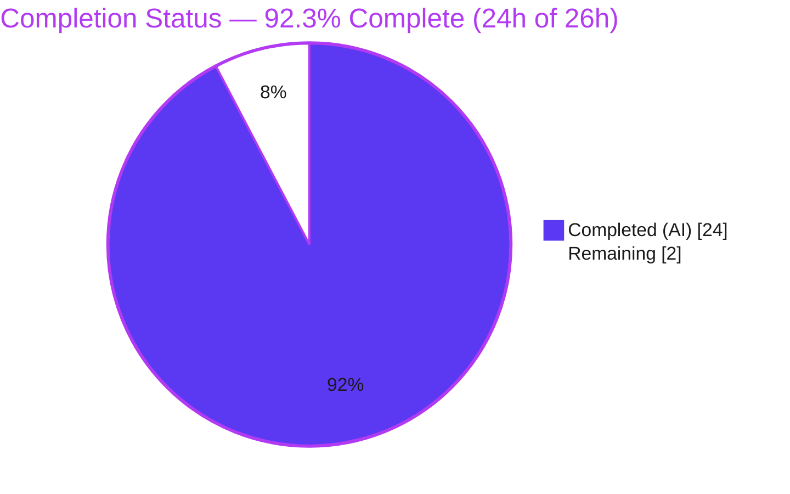
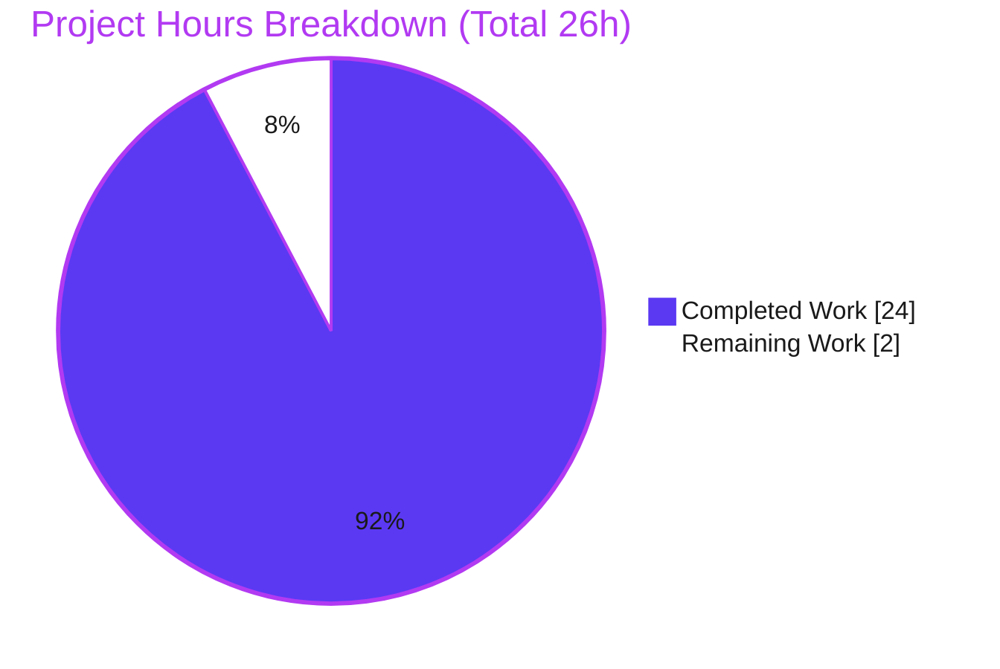
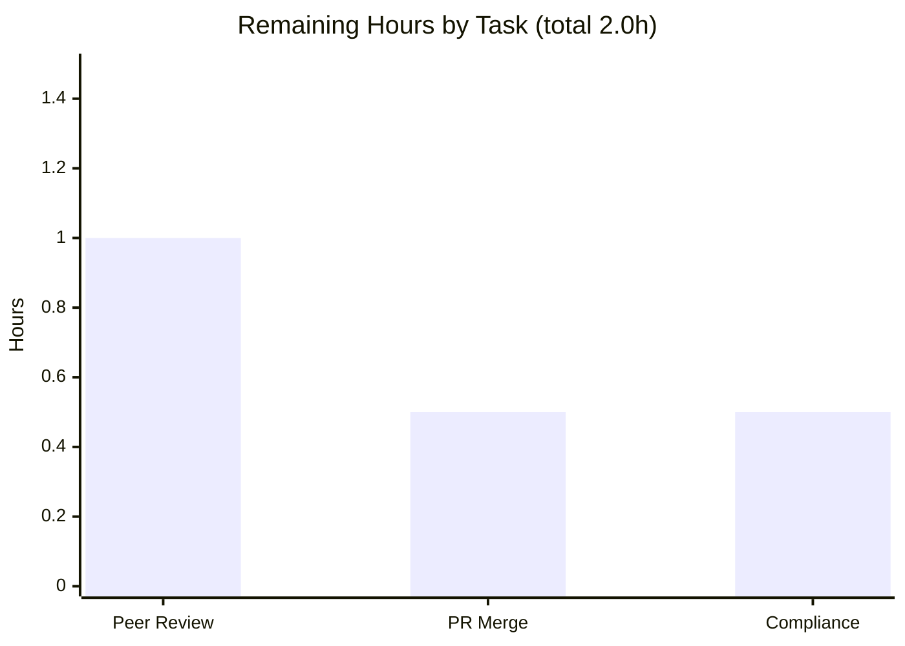

# Blitzy Project Guide — Scapy `TCPSession` Overlap/Retransmission Reassembly Investigation

> Scope of this guide: an AAP-scoped assessment of a **read-only investigation + single-Markdown documentation** deliverable produced under the `SWE-AtlasQnA-Repo` rule set. Completion percentage measures only work scoped in the Agent Action Plan (AAP) plus standard path-to-production activities.

---

## 1. Executive Summary

### 1.1 Project Overview

The objective was to empirically determine — by building and running real code first — how Scapy's **offline** `TCPSession` reconstructs a single application-layer byte stream when the payload is split across multiple TCP segments and at least one segment overlaps (retransmits) a sequence range already delivered, then to author one Markdown answer with verbatim runtime evidence and a code-level explanation. Blitzy agents built an observation harness that drives the real path `sniff(offline=..., session=TCPSession)` after `load_layer("http")`, captured byte-exact output for two overlap variants plus a reverse-order control, traced the decision to source (`scapy/sessions.py:193`), and delivered `blitzy/documentation/scapy_0925ada48540.md` — leaving all Scapy source untouched.

### 1.2 Completion Status

The project is **92.3% complete** (AAP-scoped). All 18 autonomous AAP requirements are delivered and independently re-verified byte-for-byte; the residual 2 hours are standard path-to-production human activities (SME peer review, compliance sign-off, PR merge).



| Metric | Hours |
|---|---|
| **Total Hours** | 26 |
| **Completed Hours (AI + Manual)** | 24 (AI: 24 · Manual: 0) |
| **Remaining Hours** | 2 |
| **Percent Complete** | **92.3%** |

> Colors: Completed = Dark Blue `#5B39F3`; Remaining = White `#FFFFFF`.

### 1.3 Key Accomplishments

- ✅ Reproduced a split, overlapping TCP stream through the **real** offline path `sniff(offline=..., session=TCPSession)` using built-in layers only (`IP`/`TCP`/`Raw`/`HTTP`) — no new `Packet` class, no `bind_layers`, no `StringBuffer` import.
- ✅ Captured byte-exact evidence for **V1** (identical overlap → `…AAAABBBB`, len 46), **V2** (different overlap → `…ZZZZBBBB`, len 46, winner `ZZZZ`), and a **reverse-order control** (→ `…AAAABBBB`, len 46, winner `AAAA`).
- ✅ Added a **no-HTTP control** proving `load_layer("http")` is pivotal (`hasattr(Raw,'tcp_reassemble')` is `False`; 3 unreassembled Raw packets).
- ✅ Proved **determinism** across ≥2 in-process runs and across separate process invocations.
- ✅ Traced the overlap policy to source — **last-write-wins** via the unconditional overwrite at `scapy/sessions.py:193`, reached via `data.append(new_data, seq)` at `:344`; length preserved because the growth guard at `:183` is skipped for an already-covered range — every `file:line` verified byte-accurate.
- ✅ Authored the single deliverable (581 lines) and left the repository otherwise untouched (0 source files changed across all 4 commits); temp artifacts removed.

### 1.4 Critical Unresolved Issues

| Issue | Impact | Owner | ETA |
|---|---|---|---|
| _None_ — independent re-run confirms zero errors; all constraints honored | None | — | — |

### 1.5 Access Issues

| System/Resource | Type of Access | Issue Description | Resolution Status | Owner |
|---|---|---|---|---|
| _No access issues identified_ | — | Full repository read/write access; Scapy imported cleanly from the in-tree checkout; no external credentials required (no third-party services in scope) | N/A | — |

### 1.6 Recommended Next Steps

1. **[Medium]** Have a Scapy-knowledgeable SME peer-review the deliverable's core conclusion and spot-check the cited `file:line` references against pinned commit `0925ada4`.
2. **[Medium]** Merge branch `blitzy-3cd33a27-de01-4df5-bcdd-34d771f1ec1a` (single added file; conflict-free) into the target branch.
3. **[Low]** Sign off `SWE-AtlasQnA-Repo` rule/format compliance; optionally wire a lightweight Markdown doc-lint for `blitzy/` (addresses operational risk O1).

---

## 2. Project Hours Breakdown

### 2.1 Completed Work Detail

| Component | Hours | Description |
|---|---:|---|
| Offline reproduction harness | 4 | Build `IP/TCP/Raw` segments with a deliberate same-range overlap + terminating FIN; `load_layer("http")`; `wrpcap` + `sniff(offline=..., session=TCPSession)` [AAP R1, R2, R3, R7, R8] |
| V1 + V2 variant evidence capture | 2 | Byte-exact `repr` + integer `len` + winning bytes for identical-overlap (V1) and different-overlap (V2) variants [AAP R4, R10, R14] |
| Reverse-order + no-HTTP controls | 2 | Reverse-order control isolates processing-order as the deciding factor; no-HTTP control proves `load_layer("http")` is pivotal [AAP R12, R7, R8] |
| Determinism verification | 1 | ≥2 in-process runs (RUN1==RUN2) + cross-process `diff` IDENTICAL [AAP R9] |
| Source code trace & analysis | 5 | Trace across 6 reference files with exact `file:line`, enclosing conditions quoted verbatim, cause→effect [AAP R5, R15] |
| Environment & canonical-values analysis | 1 | `scapy.__file__` provenance, canonical invocation, `conf.version` mtime-fallback nuance [AAP R17] |
| Deliverable authoring (581 lines) | 5 | Markdown Q&A with `[Observed]`/`[Inferred]` labels and complete unedited output [AAP R11, R13, R14, R16, R18] |
| Review & precision-refinement cycles | 3 | 3 follow-up commits: review findings (+73/-10), byte-verbatim quotes (+44/-33), `:377`/`:379` precision (+3/-3) |
| Cleanup, read-only proof & coverage pass | 1 | Temp-artifact removal + `git status` proof + §8 coverage pass [AAP R6, R10, R16] |
| **Total Completed** | **24** | |

### 2.2 Remaining Work Detail

| Category | Hours | Priority |
|---|---:|---|
| Technical peer review (SME validation of overlap policy + `file:line` spot-check) | 1.0 | Medium |
| PR merge & branch integration into target | 0.5 | Medium |
| Rules/format compliance sign-off (`SWE-AtlasQnA-Repo`) | 0.5 | Low |
| **Total Remaining** | **2.0** | |

### 2.3 Methodology & Completion Calculation

- **AAP-scoped only.** The work universe is (a) every AAP deliverable and (b) standard path-to-production activities for a documentation deliverable. No out-of-scope work is included.
- **Formula:** `Completion % = Completed / (Completed + Remaining) = 24 / (24 + 2) = 24 / 26 = 92.3%`.
- **Cross-checks:** Section 2.1 total (24) + Section 2.2 total (2) = 26 = Section 1.2 Total Hours; Section 2.2 total (2) = Section 1.2 Remaining = Section 7 "Remaining Work".
- Per Blitzy policy, completion is capped below 100% pending human review; the residual 2h reflects genuine path-to-production activities.

---

## 3. Test Results

This is a documentation/investigation deliverable, so there is **no traditional unit-test suite in scope**. The functional verification is the **runtime reproduction** driven through Scapy's real offline path. All checks below originate from **Blitzy's autonomous validation logs** for this project (authored by prior agents, re-run by the Final Validator, and independently re-run again during this assessment — byte-for-byte identical each time).

| Test Category | Framework | Total Tests | Passed | Failed | Coverage % | Notes |
|---|---|---:|---:|---:|---:|---|
| Runtime reproduction — main harness (V1/V2/REV) | Scapy offline `TCPSession` via `python3` | 3 | 3 | 0 | 100% of AAP variants | Real `sniff(offline=..., session=TCPSession)`; all → 1 packet, len 46; V2 winner `ZZZZ`, REV winner `AAAA` |
| Runtime control — no-HTTP (separate process) | Scapy offline `TCPSession` via `python3` | 1 | 1 | 0 | n/a | `hasattr(Raw,'tcp_reassemble')` False; 3 unreassembled Raw packets — proves `load_layer("http")` pivotal |
| Determinism | `diff` (in-process + cross-process) | 2 | 2 | 0 | n/a | RUN1==RUN2; cross-process stdout IDENTICAL |
| Reference-module byte-compile | `python -m py_compile` | 6 | 6 | 0 | n/a | All 6 REFERENCE modules compile |
| Deliverable well-formedness | custom (fences/tabs/ws/H1/lines) | 5 | 5 | 0 | n/a | 581 lines; 34 balanced fences; 0 tabs; 0 trailing-ws; H1 present |
| Code-reference accuracy | `grep`/`sed` spot-check | 7 | 7 | 0 | n/a | `sessions.py:183/:193/:344/:199`, `http.py:580`, `config.py:847-848`, `'http'∉load_layers` all accurate |
| **Total** | | **24** | **24** | **0** | | 100% pass rate |

---

## 4. Runtime Validation & UI Verification

**Runtime health (library/CLI investigation — no web/GUI surface):**

- ✅ **Operational** — In-tree Scapy import: `scapy.__file__` resolves into this checkout (not a pip copy).
- ✅ **Operational** — Offline read path: `sniff(offline=..., session=TCPSession)` reads pcaps via `PcapReader` and reconstructs the stream.
- ✅ **Operational** — HTTP reassembly engagement: after `load_layer("http")`, `HTTP.tcp_reassemble` reconstructs to a single 46-byte payload.
- ✅ **Operational** — Overlap resolution: last-write-wins confirmed (V2→`ZZZZ`, REV→`AAAA`) over identical sequence numbers.
- ✅ **Operational** — Determinism: byte-identical across ≥2 runs and across processes.
- ✅ **Operational** — Read-only guarantee: `git status --porcelain` empty; temp artifacts removed.

**API integration outcomes:** N/A — no external services, APIs, or credentials are in scope (built-in Scapy + Python stdlib only).

**UI verification:** N/A — there is no user interface. The deliverable is a Markdown document; its structural integrity is covered in Sections 3 and 5.

---

## 5. Compliance & Quality Review

Cross-mapping AAP deliverables and `SWE-AtlasQnA-Repo` rules to compliance status. Fixes applied during autonomous validation are noted.

| Benchmark / Rule | Requirement | Status | Progress | Notes / Fixes Applied |
|---|---|---|---|---|
| Investigate by running first | Answer written from captured output | ✅ Pass | 100% | Verbatim `[Observed]` blocks in §3/§4/§5 of the deliverable |
| Real path, no bypass | `sniff(offline=..., session=TCPSession)` | ✅ Pass | 100% | No private helper/fallback/stand-in |
| Built-in only | `IP`/`TCP`/`Raw`/`HTTP` + `load_layer("http")` | ✅ Pass | 100% | No new `Packet`, no `bind_layers`, no `StringBuffer` import |
| Every condition exercised | V1, V2, reverse control, no-HTTP control | ✅ Pass | 100% | All four conditions captured |
| Complete unedited output | Byte-exact `repr` + `len`, no elision | ✅ Pass | 100% | Byte-verbatim quotes ensured (commit `565d5dc3`) |
| Exact & grounded | `file:line` + named function + enclosing condition | ✅ Pass | 100% | Precision refinement `:377` stack / `:379` return (commit `6f222f3c`) |
| Answer every part + coverage pass | Full coverage before finishing | ✅ Pass | 100% | §8 coverage pass in deliverable |
| Observed vs Inferred labeling | Label each claim | ✅ Pass | 100% | Applied throughout |
| Single deliverable, fixed name/location | `blitzy/documentation/<branch>.md` | ✅ Pass | 100% | `scapy_0925ada48540.md` created |
| Read-only source | No source file modified | ✅ Pass | 100% | 0 source files changed across all commits |
| Cleanup temp artifacts | Removed + proven gone | ✅ Pass | 100% | `rm -rf` + `ls` "No such file" + clean `git status` |
| SME technical peer review | Human accuracy sign-off | ⬜ Pending | 0% | Path-to-production (see §2.2 / §6) |

---

## 6. Risk Assessment

| Risk | Category | Severity | Probability | Mitigation | Status |
|---|---|---|---|---|---|
| Behavior pinned to UNSTABLE Scapy Session internals ("custom Sessions may break") | Technical | Low | Medium | Deliverable pins to commit `0925ada4` + `conf.version` and warns against generalization | Mitigated (documented) |
| `file:line` reference drift if source moves | Technical | Low | Medium | Every reference re-verified byte-accurate on this checkout; pinned to commit | Mitigated |
| `conf.version` is an mtime fallback (`'2026.07.08'`), not a release tag | Technical | Low | Low | Deliverable explains the fallback; anchors reproducibility to git commit | Mitigated (documented) |
| No security-relevant surface | Security | None | N/A | Read-only; 0 source/dependency changes; no runtime service, auth, or data handling | N/A |
| Deliverable not covered by automated CI/doc-lint | Operational | Low | Low | Well-formedness verified manually (fences/tabs/ws/H1) | Open (minor) |
| Reproducibility depends on environment (system Python + `PYTHONPATH` vs pip copy) | Operational | Low | Medium | Canonical invocation + `scapy.__file__` provenance documented | Mitigated |
| Branch merge into target | Integration | Low | Low | Single NEW file, zero source overlap → conflict-free merge | Open (pending human merge) |
| External-service/API integration | Integration | None | N/A | None in scope (built-in Scapy + stdlib only) | N/A |

---

## 7. Visual Project Status

**Project Hours Breakdown** (Completed = Dark Blue `#5B39F3`, Remaining = White `#FFFFFF`):



**Remaining Hours by Task** (from Section 2.2):



| Priority | Remaining Hours |
|---|---:|
| High (blocking) | 0.0 |
| Medium | 1.5 |
| Low | 0.5 |
| **Total** | **2.0** |

> Integrity: "Remaining Work" (2) = Section 1.2 Remaining (2) = Section 2.2 total (2).

---

## 8. Summary & Recommendations

**Achievements.** The investigation is complete and independently reproducible. Blitzy agents delivered a rigorous, byte-exact answer to the question: on this checkout (baseline commit `0925ada4`), Scapy's offline `TCPSession` resolves an overlapping/retransmitted segment by **last-write-wins in pcap/processing order**, via the unconditional `memoryview(self.content)[seq:seq + data_len] = data` at `scapy/sessions.py:193`, and **preserves stream length** when the overlap falls within an already-covered range because the growth guard at `scapy/sessions.py:183` is skipped. Both variants reconstruct to **46 bytes** (V2→`ZZZZ`, reverse control→`AAAA`), proving the winner is decided by processing order rather than sequence-number magnitude or original-vs-retransmission status.

**Remaining gaps & critical path to production.** No engineering gaps remain in the AAP scope. The critical path is purely human path-to-production: (1) SME technical peer review, (2) PR merge, (3) rules/format compliance sign-off — **2.0 hours** total.

**Success metrics.** 18/18 AAP requirements delivered; 24/24 autonomous verification checks pass (100%); 0 source files modified; determinism confirmed; all cited `file:line` references verified byte-accurate.

**Production readiness assessment.** The project is **92.3% complete** and production-ready pending human sign-off. The single deliverable is well-formed, complete, and committed; the repository is otherwise untouched. Recommended action: peer-review and merge.

| Metric | Value |
|---|---|
| AAP requirements delivered | 18 / 18 |
| Autonomous verification checks passed | 24 / 24 (100%) |
| Source files modified | 0 |
| Completion (AAP-scoped) | 92.3% |
| Remaining effort | 2.0h |

---

## 9. Development Guide

All commands below were executed during assessment and produce the stated output. Replace `REPO` with the repository root.

### 9.1 System Prerequisites

- Linux (Ubuntu container); **Python 3.13.7** (`/usr/bin/python3`); **git 2.51.0**
- No external runtime dependencies (Scapy core declares none mandatory; the investigation uses built-in layers + Python standard library only)

### 9.2 Environment Setup

```bash
export REPO=/tmp/blitzy/scapy/blitzy-3cd33a27-de01-4df5-bcdd-34d771f1ec1a_57e369
cd "$REPO"
# Run system Python with PYTHONPATH pointing at the checkout so Scapy imports from THIS tree:
PYTHONPATH="$REPO" python3 -c "import scapy; print(scapy.__file__)"
# Expected: .../blitzy-3cd33a27-.../scapy/__init__.py   (NOT a site-packages path)
# Optional editable install instead of PYTHONPATH:
#   python3 -m venv .venv && . .venv/bin/activate && pip install -e .
```

### 9.3 Dependency Installation & Sanity

```bash
# No install required. Sanity byte-compile of the 6 REFERENCE modules (read-only):
PYTHONPATH="$REPO" python3 -m py_compile \
  scapy/sessions.py scapy/layers/http.py scapy/layers/inet.py \
  scapy/utils.py scapy/sendrecv.py scapy/config.py && echo "py_compile OK"
```

### 9.4 Reproduction (the investigation harness)

```bash
# Create a temp working dir OUTSIDE the repository (read-only mandate):
mkdir -p /tmp/scapy_probe
PYTHONPATH="$REPO" python3 - <<'PY' 2>/dev/null
import warnings; warnings.filterwarnings("ignore")   # hide harmless CryptographyDeprecationWarning
from scapy.all import IP, TCP, Raw, wrpcap, sniff, load_layer
from scapy.sessions import TCPSession
load_layer("http")                                    # PIVOTAL: engages built-in HTTP.tcp_reassemble
HDR = b"HTTP/1.1 200 OK\r\nContent-Length: 8\r\n\r\n"  # len 38, declares 8-byte body
def run(fc, oc, path):
    segs = [IP()/TCP(sport=1234, dport=80, seq=1000, flags="A")/Raw(HDR + fc),  # buffer 0-41
            IP()/TCP(sport=1234, dport=80, seq=1038, flags="A")/Raw(oc),        # OVERLAP 38-41
            IP()/TCP(sport=1234, dport=80, seq=1042, flags="FA")/Raw(b"BBBB")]  # FIN 42-45
    wrpcap(path, segs)
    pk = sniff(offline=path, session=TCPSession)
    return [bytes(p[TCP].payload) for p in pk if TCP in p]
for label, fc, oc in [("V1", b"AAAA", b"AAAA"), ("V2", b"AAAA", b"ZZZZ"), ("REV", b"ZZZZ", b"AAAA")]:
    o = run(fc, oc, "/tmp/scapy_probe/%s.pcap" % label)
    print(label, "count=", len(o), "repr=", repr(o[0]), "len=", len(o[0]))
PY
```

Expected output:

```console
V1 count= 1 repr= b'HTTP/1.1 200 OK\r\nContent-Length: 8\r\n\r\nAAAABBBB' len= 46
V2 count= 1 repr= b'HTTP/1.1 200 OK\r\nContent-Length: 8\r\n\r\nZZZZBBBB' len= 46
REV count= 1 repr= b'HTTP/1.1 200 OK\r\nContent-Length: 8\r\n\r\nAAAABBBB' len= 46
```

### 9.5 Verification & Read-Only Proof

```bash
# Cleanup temp artifacts and confirm gone:
rm -rf /tmp/scapy_probe && (ls /tmp/scapy_probe 2>&1 || echo "confirmed gone")
# Prove the repository was not modified:
git -C "$REPO" status --porcelain            # expect: empty
git -C "$REPO" diff --name-status 0925ada4 HEAD
# expect exactly: A  blitzy/documentation/scapy_0925ada48540.md
```

### 9.6 Troubleshooting

- **Stream not reassembled (3 separate `Raw` packets):** `load_layer("http")` was omitted. A bare `Raw` payload has no `tcp_reassemble`, so the gate at `scapy/sessions.py:325/327/330` returns each segment unreassembled.
- **`scapy.__file__` points into `site-packages`:** `PYTHONPATH` is unset or a pip-installed Scapy shadows the checkout; behavior and `file:line` references would differ. Set `PYTHONPATH="$REPO"`.
- **`CryptographyDeprecationWarning` on import:** harmless noise from `scapy/layers/ipsec.py`; filter with `warnings.filterwarnings("ignore")` or `2>/dev/null`. It does not affect the reassembly result.
- **`conf.version` shows a date, not a tag:** expected — it is the mtime fallback. Anchor reproducibility to git commit `0925ada4`, not to this string.

---

## 10. Appendices

### A. Command Reference

| Purpose | Command |
|---|---|
| Confirm in-tree import | `PYTHONPATH="$REPO" python3 -c "import scapy; print(scapy.__file__)"` |
| Byte-compile reference modules | `PYTHONPATH="$REPO" python3 -m py_compile scapy/sessions.py scapy/layers/http.py scapy/layers/inet.py scapy/utils.py scapy/sendrecv.py scapy/config.py` |
| Run reproduction | see §9.4 heredoc |
| Read-only proof | `git status --porcelain` ; `git diff --name-status 0925ada4 HEAD` |
| Cleanup | `rm -rf /tmp/scapy_probe` |

### B. Port Reference

| Port | Role | Notes |
|---|---|---|
| TCP/80 | Synthetic packet `dport` | Used only inside offline pcaps to trigger the shipped `TCP:80 ↔ HTTP` binding; **no** socket is opened and **no** service listens (offline reassembly only) |

### C. Key File Locations

| Path | Role |
|---|---|
| `blitzy/documentation/scapy_0925ada48540.md` | The single created deliverable (581 lines) |
| `scapy/sessions.py` | `TCPSession` + `StringBuffer`; overlap crux at `:193`, growth guard `:183`, accumulation `:344` |
| `scapy/layers/http.py` | `HTTP.tcp_reassemble` (`:580`); shipped `TCP:80` bindings (`:748`) |
| `scapy/layers/inet.py` | Built-in `IP` (`:521`) / `TCP` (`:753`) |
| `scapy/utils.py` | `wrpcap` (`:1095`), `PcapReader` (`:1367`) |
| `scapy/sendrecv.py` | `sniff(offline=..., session=...)` entry |
| `scapy/config.py` | Default `load_layers` (`:848`); `'http'` absent (`:847`) |

### D. Technology Versions

| Component | Version | Source |
|---|---|---|
| Python | 3.13.7 | `/usr/bin/python3` |
| Scapy | `conf.version` `'2026.07.08'` (mtime fallback); baseline commit `0925ada4` (2023-04-24) | in-tree checkout |
| git | 2.51.0 | system |

### E. Environment Variable Reference

| Variable | Value | Purpose |
|---|---|---|
| `PYTHONPATH` | repository root | Forces Scapy to import from the in-tree checkout (not a pip copy) |
| `REPO` | `/tmp/blitzy/scapy/blitzy-3cd33a27-de01-4df5-bcdd-34d771f1ec1a_57e369` | Convenience variable for the repository root |

### F. Developer Tools Guide

| Tool | Use |
|---|---|
| `python3 -m py_compile` | Read-only byte-compile sanity check of reference modules |
| `wrpcap` / `sniff(offline=...)` | Write/read pcaps to drive the real offline reassembly path |
| `load_layer("http")` | Built-in loader that registers `HTTP` + its `tcp_reassemble` (no `bind_layers` needed) |
| `git diff --name-status <base> HEAD` | Verify the read-only mandate (only the deliverable added) |
| `diff -u run1.out run2.out` | Confirm cross-process determinism |

### G. Glossary

| Term | Definition |
|---|---|
| `TCPSession` | Scapy session engine that reassembles TCP streams for layers exposing `tcp_reassemble` |
| `tcp_reassemble` | Classmethod a layer implements so `TCPSession` reconstructs its stream; `HTTP` provides one, `Raw` does not |
| `StringBuffer` | Internal relative-sequence-keyed accumulator in `scapy/sessions.py`; its unconditional overwrite decides overlap resolution |
| Last-write-wins | For a same-range overlap, the segment written **last in processing order** overwrites the range |
| Growth guard | The `if seq + data_len > self.content_len:` check (`:183`) that only enlarges the buffer for ranges extending past the current end |
| V1 / V2 / REV | Identical-overlap / different-overlap / reverse-order-control experimental variants |