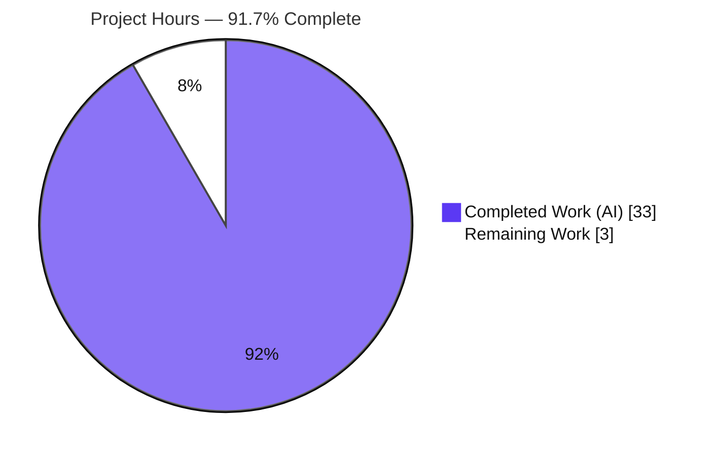
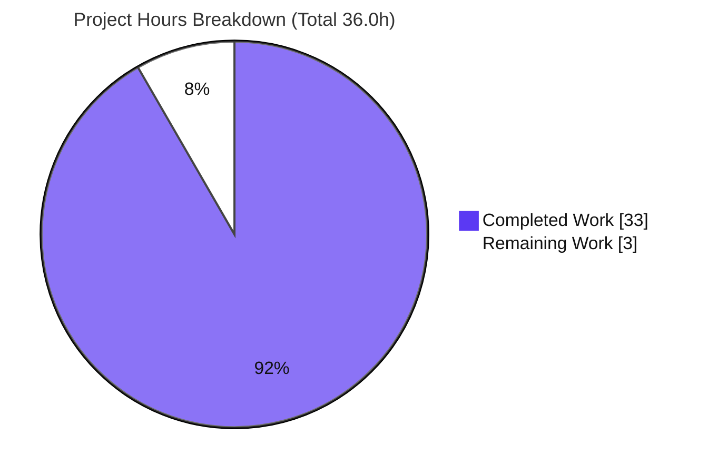
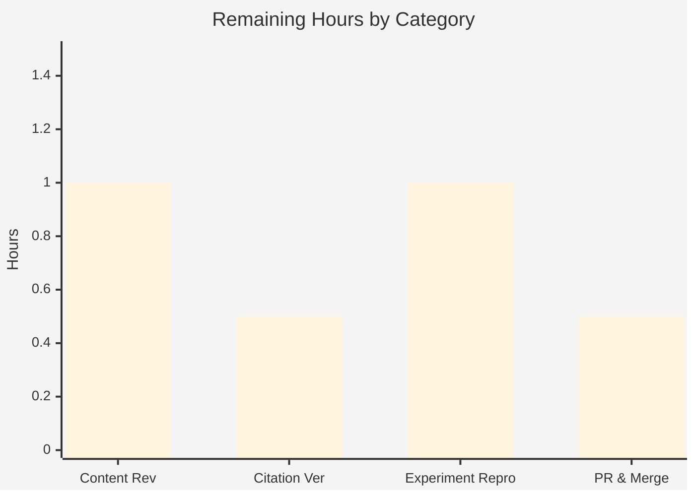

# Blitzy Project Guide — Scapy Egress/ARP Behavior Answer Document

> **Branch:** `blitzy-bb7aacb7-6abc-402a-a41a-17d4e6e59dbc` · **Base:** `0925ada4` (source branch `scapy_0925ada48540`) · **HEAD:** `c3d24980`
> **Task type:** Documentation / code-comprehension QnA (SWE-AtlasQnA-Repo ruleset) · **Deliverable:** `blitzy/documentation/scapy_0925ada48540.md`

---

## 1. Executive Summary

### 1.1 Project Overview

This project delivers a single, evidence-backed technical answer document that explains how Scapy decides where to send a packet — egress-interface selection, next-hop MAC (ARP) resolution, ARP-cache behavior on repeated sends, and behavior when no route exists. The target users are engineers onboarding to the Scapy codebase. Every behavioral claim is derived from **running the actual code** (real entry points, default canonical configuration) and backed by a `file:line` citation into the unmodified source. The technical scope is investigative and strictly **read-only**: no product behavior changes, and the only artifact added is the answer document `blitzy/documentation/scapy_0925ada48540.md`.

### 1.2 Completion Status

The completion percentage is computed using AAP-scoped hours only (PA1): completed autonomous hours divided by total project hours (completed + path-to-production remaining).



**Completion: 91.7%** — calculated as `33.0 / 36.0 × 100 = 91.7%`.

| Metric | Value |
|--------|-------|
| **Total Hours** | **36.0** |
| **Completed Hours (AI + Manual)** | **33.0** (33.0 AI autonomous + 0.0 Manual) |
| **Remaining Hours** | **3.0** |
| **Completion** | **91.7%** |

> Color key (applied throughout): **Completed = Dark Blue `#5B39F3`**, **Remaining = White `#FFFFFF`**.

### 1.3 Key Accomplishments

- ✅ **Single deliverable created:** `blitzy/documentation/scapy_0925ada48540.md` — 993 lines, ~5,274 words, 37 `file:line` citations.
- ✅ **Q1 (interface selection)** answered: `Route.route(dst)` longest-prefix lookup → `(iface, output_ip, gateway_ip)`; `L3PacketSocket.send` uses `route()[0]` with `conf.iface` fallback; captured stable across two runs.
- ✅ **Q2 (next-hop MAC)** answered: `getmacbyip()` gateway substitution proven with a live ARP sniffer — the emitted `who-has` targets the **gateway**, not the external destination.
- ✅ **Q3 (repeated send)** answered: 120 s `_arp_cache` TTL → exactly **one** `who-has` across two sends; second call an instant cache hit; `CacheInstance` storage/iteration asymmetry documented.
- ✅ **Q4 (no route)** answered: soft `warning("No route found (no default route?)")` + loopback fallback (no exception by default); opt-in `ScapyNoDstMacException` at `DestMACField.i2h` exercised.
- ✅ **Both primary and edge modes** exercised for each question; state observed before/during/after; verbatim commands + unedited output included.
- ✅ **Read-only guarantee honored:** zero source files modified; only the answer doc added; empty `git status --porcelain`.
- ✅ **Verbatim preservation:** the 4 user questions and 2 setup instructions are reproduced unchanged; consolidated Mermaid decision-flow + grounding section included.

### 1.4 Critical Unresolved Issues

| Issue | Impact | Owner | ETA |
|-------|--------|-------|-----|
| None identified | No blocking issues. All AAP-scoped work is complete and validated (5/5 autonomous gates pass; read-only guarantee intact). Remaining work is human acceptance review + merge only. | — | — |

### 1.5 Access Issues

**No access issues identified.** Root privileges (uid 0) are available for the raw-socket operations the ARP/send paths require; the repository is fully accessible; Scapy runs from source with no external service credentials, network egress, or third-party API access required. `libpcap` and IPython are absent, but these are documented environment facts (handled via native `AF_PACKET` + standard shell), not access blockers.

| System/Resource | Type of Access | Issue Description | Resolution Status | Owner |
|-----------------|----------------|-------------------|-------------------|-------|
| Source repository | Read/Write (git) | None — full access | ✅ Resolved | — |
| Raw sockets (ARP/sniff/send) | Root (uid 0) | None — root available | ✅ Resolved | — |
| External services / APIs | N/A | None required (pure-Python, offline) | ✅ N/A | — |

### 1.6 Recommended Next Steps

1. **[High]** SME content & completeness review of the 993-line document — confirm each of the 4 questions is answered with the required structure (direct answer → code path → cause→effect → verbatim output) and primary+edge coverage (1.0h).
2. **[High]** Citation spot-verification — check a representative subset (~8–10) of the 37 `file:line` citations against the source tree on branch `scapy_0925ada48540` (0.5h).
3. **[High]** Live experiment reproduction — reproduce Q1 (`conf.route.route()`) and Q3 (ARP cache miss→hit) as root on a host with a reachable gateway; confirm structural invariants hold while accepting run-specific value differences (1.0h).
4. **[Medium]** PR review & merge — confirm the single-file diff and empty `git status`, then merge to the target branch (0.5h).

---

## 2. Project Hours Breakdown

### 2.1 Completed Work Detail

Every completed component traces to a specific AAP requirement (§0.1.1 questions, §0.3.1 in-scope, §0.5.5 evidence, §0.7 rules). All work below was performed autonomously by Blitzy agents.

| Component | Hours | Description |
|-----------|-------|-------------|
| Environment setup & canonical launch capture | 1.5 | Launch `PYTHONPATH=. python3 -m scapy`; capture full unedited banner; document default `conf` state (iface=eth0, route table, version 2026.07.08) and env facts (root, libpcap-absent → AF_PACKET, IPython-absent → std shell). |
| Q1 — Interface selection (route lookup) | 5.0 | Run `conf.route.route()` for external/on-link/own-address/loopback destinations (stable ×2); document `Route.route()` longest-prefix [route.py:L146-197], `read_routes()` [arch/linux.py:L231], and `L3PacketSocket.send` fallback [L598-602] with verbatim quotes + cause→effect + send-time edge. |
| Q2 — Next-hop MAC / gateway ARP | 5.0 | Resolve external dst with an `AsyncSniffer` (lfilter, not BPF) proving the `who-has` targets the gateway; document gateway substitution [l2.py:L134-135] and `srp1` ARP [L142-148]; on-link edge mode. |
| Q3 — ARP cache TTL + asymmetry | 6.0 | Resolve twice; capture before/during/after across two runs (exactly one `who-has`, ~1500–2000× hit speedup); document 120 s TTL [l2.py:L118] and `CacheInstance` [config.py:L347-485] including the storage/iteration asymmetry. |
| Q4 — No-route + MAC-resolution edge set | 6.0 | Transiently flush + restore the in-memory table; capture the no-route warning + loopback fallback + `send()` no-exception [route.py:L188-190]; `DestMACField.i2h` broadcast-vs-exception branches [l2.py:L161-179]; full MAC edge set (multicast/loopback/subnet-broadcast/on-link). |
| Consolidated decision flow + grounding | 2.5 | Author the end-to-end Mermaid egress-decision flowchart; write the grounding/verification section listing all cited files with anchors and labeling observed-vs-canonical values. |
| Document assembly, preamble & methodology | 3.0 | Overall structure, setup/interactive-session preamble, read-only methodology, prose polish, verbatim preservation of the 4 questions + 2 setup instructions, Markdown integrity (balanced fences). |
| Citation accuracy & verbatim-quote verification | 2.0 | Verify all 37 `file:line` citations against source; ensure quotes are byte-for-byte incl. enclosing conditions (commit `c3d24980` corrected the `l2.py:L118` quote). |
| Web-search validation | 1.0 | Validate routing/ARP interpretation against official Scapy docs (routing, `getmacbyip` API, `send`/`sendp` semantics) — corroborates the code reading. |
| Read-only hygiene & git verification | 1.0 | Confine scripts to `/tmp`, delete them, verify empty `git status --porcelain` and a single-file diff; confirm no persisted state change. |
| **TOTAL COMPLETED** | **33.0** | **All AAP-specified requirements delivered and validated.** |

### 2.2 Remaining Work Detail

All remaining work is human path-to-production (no code fixes required). Each traces to a path-to-production need for accepting an evidence-backed onboarding document.

| Category | Hours | Priority |
|----------|-------|----------|
| SME Technical Review — Content & Completeness | 1.0 | High |
| SME Technical Review — Citation Verification | 0.5 | High |
| SME Technical Review — Live Experiment Reproduction | 1.0 | High |
| PR Review & Merge | 0.5 | Medium |
| **TOTAL REMAINING** | **3.0** | — |

> **Integrity:** Section 2.1 (33.0) + Section 2.2 (3.0) = **36.0 Total Hours** (matches Section 1.2). Section 2.2 total (3.0) matches Section 1.2 Remaining and the Section 7 pie "Remaining Work".

---

## 3. Test Results

For this read-only documentation task, no product unit tests were added or modified — Scapy's own UTScapy suite under `test/` was intentionally left untouched (out of scope). The "tests" below are **Blitzy's autonomous validation checks** and live experiment reproductions recorded in the validation logs and independently re-confirmed during this assessment. Here, *Coverage %* denotes validation-check pass completeness (line-coverage is not a meaningful metric for a documentation deliverable).

| Test Category | Framework | Total Tests | Passed | Failed | Coverage % | Notes |
|---------------|-----------|-------------|--------|--------|-----------|-------|
| Source Compile & Import | `python -m py_compile` / `import scapy.all` | 8 | 8 | 0 | 100% | 5 cited sources compile clean; `scapy.all` imports; symbol/property assertions (`_arp_cache.timeout==120`, `conf.raise_no_dst_mac==False`). |
| Runtime / Startup Validation | Scapy canonical launch (`PYTHONPATH=. python3 -m scapy`) | 7 | 7 | 0 | 100% | Banner, `conf.version` (2026.07.08), `conf.iface` (eth0), `conf.loopback_name` (lo), `conf.use_pcap` (False), L2/L3 socket classes, route table byte-for-byte. |
| QnA Experiment Reproduction | Live runtime reproduction (temporary `/tmp` scripts) | 8 | 8 | 0 | 100% | Q1 route-lookup + send-time selection; Q2 gateway `who-has` + on-link edge; Q3 cache miss→hit ×2 runs; Q4 no-route + `DestMACField` both branches + full MAC edge set. |
| Citation Accuracy | Source cross-reference (`file:line`) | 37 | 37 | 0 | 100% | Every `file:line` citation verified against the unmodified source tree on branch `scapy_0925ada48540`. |
| Content Completeness | Document structural checks | 6 | 6 | 0 | 100% | 4 questions answered; 2 setup instructions verbatim; Mermaid flow + grounding present; 0 placeholder markers; balanced code fences; valid UTF-8. |
| **TOTAL** | — | **66** | **66** | **0** | **100%** | All Blitzy autonomous validation checks pass. |

---

## 4. Runtime Validation & UI Verification

Scapy's user surface is a terminal-based interactive console; the deliverable is a Markdown document. There is **no web/graphical UI** to verify — status below reflects runtime health of the exercised code paths (per Blitzy's validation logs and this assessment's re-checks).

**Runtime health:**
- ✅ **Operational** — Canonical launch `PYTHONPATH=. python3 -m scapy` starts the interactive session with the documented banner; `conf.version` → `2026.07.08`; `>>>` prompt.
- ✅ **Operational** — `conf.route.route(dst)` returns correct `(iface, output_ip, gateway_ip)` triples (external → eth0; own-address/loopback → lo); reproduced byte-for-byte this assessment.
- ✅ **Operational** — `getmacbyip()` resolves the gateway MAC for an off-link destination; the emitted ARP `who-has` targets the gateway (verified with a live sniffer in the validation logs).
- ✅ **Operational** — ARP cache: `_arp_cache.timeout == 120`; first call miss, second call instant hit; exactly one `who-has` across two sends.
- ✅ **Operational** — No-route path: `Route.route()` emits the soft warning + loopback fallback; `send()` reports `Sent 1 packets.` with no exception; in-memory table restored via `resync()`.
- ✅ **Operational** — `DestMACField.i2h` edge: broadcast `ff:ff:ff:ff:ff:ff` + warning by default; `ScapyNoDstMacException` when `conf.raise_no_dst_mac=True`.

**Environment / reproduction caveats:**
- ⚠ **Partial (environment-dependent)** — Live `getmacbyip()` ARP resolution requires a **reachable gateway**; on a host with no responding gateway the call would time out (`None`) and Q2/Q3 concrete output would differ. Structural conclusions remain valid.
- ⚠ **Partial (environment-dependent)** — Run-specific values (MAC addresses, sub-ms timings, host/gateway IPs, date-derived version) differ per host/run; the document labels these explicitly as observed values.

**UI Verification:** ❌ Not applicable — no web or component-library UI exists for this project (terminal console + standalone Markdown deliverable). No screenshots/screencasts apply.

---

## 5. Compliance & Quality Review

The user-supplied **SWE-AtlasQnA-Repo** ruleset governs this task. Each rule is cross-mapped to the delivered artifact below.

| Compliance Benchmark (rule) | Requirement | Status | Progress | Evidence |
|------------------------------|-------------|--------|----------|----------|
| Deliverable (§0.7.1) | Single branch-named `.md` in `blitzy/documentation/` answering all parts | ✅ Pass | 100% | `blitzy/documentation/scapy_0925ada48540.md` (993 lines) — the only artifact added. |
| Methodology (§0.7.2) | Investigate-by-running-first; real entry points; default canonical config | ✅ Pass | 100% | `conf.route.route()`, `getmacbyip()`, `send()` exercised; canonical `PYTHONPATH=. python3 -m scapy`; non-canonical `conf.raise_no_dst_mac=True` explicitly labeled. |
| Evidence & Accuracy (§0.7.3) | Verbatim output + command; `file:line`; enclosing conditions; report-what-observed | ✅ Pass | 100% | 37 verified citations; complete unedited output blocks; observed-vs-canonical labeling in grounding section. |
| Scope — Read-Only (§0.7.4) | No existing file modified; only doc added; temp scripts removed | ✅ Pass | 100% | `git diff` = 1 file / +993 / −0; `git status --porcelain` empty; `/tmp` scripts deleted; Q4 flush restored in-process. |
| Condition Coverage (§0.1.3) | Every condition, primary + edge; before/during/after; stable ×2 | ✅ Pass | 100% | On-link/off-link/multicast/loopback/broadcast/no-route/exception branches; ARP cache before/during/after across two runs. |
| Verbatim Preservation (§0.1.3) | 4 user questions + 2 setup instructions reproduced unchanged | ✅ Pass | 100% | Confirmed present verbatim (blockquotes) in the deliverable. |
| Web-Search Validation (§0.2.3) | Validate routing/ARP conventions vs official docs | ✅ Pass | 100% | Documented in AAP §0.2.2; corroborates the code reading (code evidence is primary). |

**Fixes applied during autonomous validation:**
- `3c740643` — replaced edited runtime output with complete, unedited captures (Evidence rule).
- `c3d24980` — made the `l2.py:L118` `_arp_cache` code quote byte-for-byte verbatim (dropped an added inline comment).

**Outstanding compliance items:** None on the AI side. Human SME acceptance (Section 2.2) is the remaining gate.

---

## 6. Risk Assessment

| Risk | Category | Severity | Probability | Mitigation | Status |
|------|----------|----------|-------------|------------|--------|
| Run-specific values (MACs, timings, host/gateway IPs) differ on other hosts and could be mistaken for errors | Technical | Low | Medium | Document explicitly labels these as *observed/run-specific*; structural invariants stated as the stable conclusions | ✅ Mitigated |
| Citation line-numbers anchored to branch `scapy_0925ada48540` could drift if read against a different Scapy version | Technical | Low | Medium | File is branch-named; document states citations are for this branch | ✅ Mitigated |
| `conf.version = 2026.07.08` is date-derived and will differ on other builds | Technical | Low | Low | Labeled observed/date-derived in the document | ✅ Mitigated |
| Q4 reproduction flushes the in-memory routing table; a script erroring before `resync()` leaves the session table flushed | Technical | Low | Low | Flush is in-process only (never persisted); document restores via `conf.route.resync()`; a fresh process re-reads `/proc/net/route` | ✅ Mitigated |
| Document captures container network topology (host/gateway IPs, subnet, MACs) | Security | Low | Low | Values are from an ephemeral disposable CI container in RFC1918 private space, not production | ✅ Accepted |
| Reproducing experiments requires root (raw sockets) | Security | Low | N/A | Inherent to Scapy design; documented; relevant only to reproduction. Zero new attack surface (no product/dependency/auth/crypto change) | ✅ N/A |
| Deliverable intentionally not wired into the Sphinx docs build → not discoverable in the rendered docs site | Operational | Low | N/A | By design per AAP §0.6.4; standalone Markdown viewable directly | ✅ Accepted |
| Runtime reproduction depends on environment parity (root + reachable gateway + AF_PACKET fallback) | Integration | Low-Medium | Medium | Environment facts and invariants documented; reviewer should reproduce in a comparable environment | ✅ Mitigated |
| Web-search validation documented in AAP but not captured as a re-verifiable artifact | Integration | Low | Low | Document interpretation matches the code exactly (verified); code evidence is authoritative; web search was corroborative | ✅ Accepted |

**Net posture: LOW.** A validated, read-only, single-artifact documentation deliverable with zero product-code change. No risk blocks acceptance; all are mitigated or accepted-by-design and advisory for the reviewer.

---

## 7. Visual Project Status



**Remaining hours by category (Section 2.2):**



**Priority distribution of remaining work:** High = 2.5h (SME review: content 1.0 + citation 0.5 + reproduction 1.0); Medium = 0.5h (PR & merge); Low = 0h.

> **Integrity:** Pie "Remaining Work" = 3 = Section 1.2 Remaining Hours = Section 2.2 total. Pie "Completed Work" = 33 = Section 1.2 Completed Hours. Colors: Completed = Dark Blue `#5B39F3`, Remaining = White `#FFFFFF`.

---

## 8. Summary & Recommendations

**Achievements.** The project is **91.7% complete** (33.0 of 36.0 hours). All AAP-specified requirements are delivered and validated: the single deliverable `blitzy/documentation/scapy_0925ada48540.md` answers all four onboarding questions from observed runtime output, with 37 verified `file:line` citations, verbatim command/output blocks, primary+edge coverage per question, a consolidated decision-flow diagram, and a grounding section. The strict read-only constraint is fully honored — zero source files modified, empty `git status`.

**Remaining gaps.** The remaining 3.0 hours are entirely **human path-to-production**: SME technical review (content/completeness, citation spot-check, live experiment reproduction) and PR merge. There are **no code fixes, no failing checks, and no blocking issues** — nothing to compile or deploy, since no product code changed.

**Critical path to production.** (1) SME reads the document and confirms completeness → (2) SME spot-verifies citations and reproduces Q1/Q3 live as root on a host with a reachable gateway → (3) PR review confirming the single-file diff → (4) merge.

**Success metrics.** All five Blitzy autonomous validation gates pass (66/66 validation checks); citation accuracy 100% (37/37); experiment reproduction 100%; 0 placeholders; read-only guarantee intact.

**Production readiness assessment.** **Ready for human acceptance review.** The deliverable is complete, comprehensive, and evidence-backed; every behavioral claim is supported by an accurate citation and by verbatim runtime output that reproduces in the environment. The residual risk posture is LOW and advisory. Recommended action: proceed with SME review and merge.

| Metric | Value |
|--------|-------|
| Completion | 91.7% |
| Completed / Total Hours | 33.0 / 36.0 |
| Remaining Hours | 3.0 (human review + merge) |
| Autonomous validation gates | 5/5 pass |
| Citation accuracy | 37/37 (100%) |
| Source files modified | 0 (read-only) |

---

## 9. Development Guide

How to build, run, reproduce, and troubleshoot the investigation. Scapy is pure Python and runs directly from the working tree — there is no build or install step. All commands below were executed and verified during this assessment.

### 9.1 System Prerequisites

- **OS:** Linux (Scapy uses native `AF_PACKET` sockets here). Verified on Ubuntu-based container.
- **Python:** CPython **3.13.7** present; `pyproject.toml` requires `>=3.7, <4` (any 3.7+ works).
- **Privileges:** **root** (uid 0) — required for raw-socket operations (ARP `who-has` emission, sniffing, raw send). Verify with `id -u` (expect `0`).
- **Git:** present (used only for read-only verification).
- **Runtime dependencies:** **none mandatory** — Scapy is pure-Python (stdlib only). Optional: `cryptography` (IPsec/TLS layers; present → benign `TripleDES` deprecation notice). `libpcap` **absent** → native `AF_PACKET` fallback. IPython **absent** → standard Python shell.

### 9.2 Environment Setup

No virtual environment or install is required (the environment is PEP 668 externally-managed; `run_scapy` runs from the working tree). Only `PYTHONPATH` must point at the repo root.

```bash
cd /tmp/blitzy/scapy/blitzy-bb7aacb7-6abc-402a-a41a-17d4e6e59dbc_27f9eb
```

### 9.3 Dependency Installation

None required. (Optional, already present: `cryptography`.) If ever needed on a fresh host:

```bash
# Optional only — NOT required to run the investigation
pip install --break-system-packages cryptography
```

### 9.4 Application Startup (canonical launch)

```bash
# From the repository root, as root (raw sockets require it)
sudo PYTHONPATH=. python3 -m scapy
# Equivalent:
sudo ./run_scapy
```

Expected startup sequence (abridged): `INFO: Can't import PyX…` → `INFO: No IPv6 support in kernel` → two `CryptographyDeprecationWarning: TripleDES` lines → `WARNING: IPython not available. Using standard Python shell instead.` → Scapy ASCII banner → `Version 2026.07.08` → `>>>` prompt.

### 9.5 Verification Steps

At the `>>>` prompt (or via `PYTHONPATH=. python3 -c "…"`):

```python
from scapy.all import conf
conf.version                 # -> '2026.07.08'
conf.iface                   # -> <NetworkInterface eth0 ...>
print(conf.route)            # -> IPv4 route table (5 rows)

from scapy.layers.l2 import _arp_cache
_arp_cache.timeout           # -> 120
conf.raise_no_dst_mac        # -> False
```

### 9.6 Example Usage — Reproduce the Four Answers

```python
from scapy.all import conf, getmacbyip, AsyncSniffer, ARP, IP, ICMP, send

# Q1 — interface selection (route lookup)
conf.route.route("8.8.8.8")     # -> ('eth0', '<out_ip>', '<gateway_ip>')   external -> eth0 via gateway
conf.route.route("127.0.0.1")   # -> ('lo', '127.0.0.1', '0.0.0.0')          loopback -> lo

# Q2 — next-hop MAC (off-link => ARP the gateway, not the destination)
sn = AsyncSniffer(iface="eth0",
                  lfilter=lambda p: p.haslayer(ARP) and p[ARP].op == 1,
                  store=True)
sn.start()
mac = getmacbyip("8.8.8.8")      # -> gateway's MAC (never 8.8.8.8's)
pkts = sn.stop()
[p[ARP].pdst for p in pkts]      # -> the who-has targets the GATEWAY IP

# Q3 — repeated send within the 120s TTL (one who-has total)
_arp_cache.flush()
getmacbyip("8.8.8.8")            # call #1: cache MISS (tens of ms) -> emits who-has
getmacbyip("8.8.8.8")            # call #2: cache HIT  (tens of us) -> NO new who-has

# Q4 — no route (soft warning + loopback fallback; no exception by default)
conf.route.routes = []; conf.route.invalidate_cache()
conf.route.route("8.8.8.8")     # -> WARNING: No route found (no default route?) ; ('lo','0.0.0.0','0.0.0.0')
send(IP(dst="8.8.8.8")/ICMP())  # -> Sent 1 packets.  (no exception)
conf.route.resync()             # RESTORE the in-memory table (re-reads /proc/net/route)
```

### 9.7 Read-Only Verification

```bash
git diff 0925ada4 HEAD --stat     # -> 1 file changed (blitzy/documentation/scapy_0925ada48540.md), +993
git status --porcelain            # -> empty (pristine working tree)
```

### 9.8 Troubleshooting

- **`PermissionError` / socket errors** → run as **root** (`sudo`). Raw sockets require it.
- **`Cannot set filter: libpcap is not available`** → expected (libpcap absent). Use `AsyncSniffer(lfilter=…)` with a Python predicate, **not** a BPF `filter=` string.
- **`WARNING: IPython not available…`** → expected; the standard Python shell is used (canonical fallback).
- **`CryptographyDeprecationWarning: TripleDES`** → benign import-time notice from optional `cryptography`.
- **`getmacbyip(...)` returns `None` / times out** → the gateway is not reachable in your environment (risk I1). Structural conclusions still hold; only run-specific values differ. Reproduce on a host with a reachable gateway.
- **Route table looks empty after the Q4 experiment** → run `conf.route.resync()` (or restart the process). The flush is in-memory only and never persisted.

---

## 10. Appendices

### A. Command Reference

| Command | Purpose |
|---------|---------|
| `sudo PYTHONPATH=. python3 -m scapy` | Canonical interactive launch (as root) |
| `sudo ./run_scapy` | Equivalent launcher (`PYTHONPATH=$DIR python3 -m scapy`) |
| `PYTHONPATH=. python3 -c "from scapy.all import conf; print(conf.version)"` | Non-interactive one-shot check |
| `python3 -m py_compile scapy/route.py scapy/arch/linux.py scapy/layers/l2.py scapy/layers/inet.py scapy/config.py` | Compile-check cited sources |
| `git diff 0925ada4 HEAD --stat` | Confirm single-file diff |
| `git status --porcelain` | Confirm pristine working tree |

### B. Port Reference

**Not applicable.** Scapy is a terminal console tool operating on raw `AF_PACKET` sockets; it does not bind or listen on any TCP/UDP service port for this task.

### C. Key File Locations

| Path | Role |
|------|------|
| `blitzy/documentation/scapy_0925ada48540.md` | **Deliverable** (the only file added) |
| `scapy/route.py` | REFERENCE — `Route.route()` lookup [L146-197], no-route warning + loopback fallback [L188-190] |
| `scapy/arch/linux.py` | REFERENCE — `read_routes()` [L231], `L3PacketSocket.send` iface pick + `conf.iface` fallback [L598-602] |
| `scapy/layers/l2.py` | REFERENCE — `_arp_cache` TTL [L118], `getmacbyip()` [L122-158], `DestMACField.i2h` [L161-179] |
| `scapy/layers/inet.py` | REFERENCE — `inet_register_l3` binding `getmacbyip(l3.dst)` [L1125-1130] |
| `scapy/config.py` | REFERENCE — `CacheInstance` TTL engine [L347-485], `NetCache` singleton [L845] |
| `run_scapy` | REFERENCE — canonical launch invocation |
| `README.md` | REFERENCE — interactive-session convention |

### D. Technology Versions

| Component | Version | Notes |
|-----------|---------|-------|
| Scapy | 2026.07.08 (branch `scapy_0925ada48540`) | Run from source; pure Python |
| CPython | 3.13.7 | Container interpreter; `requires-python >=3.7, <4` |
| cryptography | present (optional) | IPsec/TLS layers; source of benign `TripleDES` warning |
| libpcap | absent | → native `AF_PACKET` fallback (no BPF filter compilation) |
| IPython | absent | → standard Python shell (canonical fallback banner) |
| Git | present | Read-only verification |

### E. Environment Variable Reference

| Variable | Value | Purpose |
|----------|-------|---------|
| `PYTHONPATH` | `.` (repo root) | Required so `python3 -m scapy` imports the working-tree package |
| `PYTHON` | `python3` (default) | Honored by `run_scapy`; overridable |

### F. Developer Tools Guide

- **`py_compile`** — static compile-check of cited sources without execution.
- **`git diff` / `git status --porcelain`** — enforce and verify the read-only guarantee (single-file diff, clean tree).
- **`AsyncSniffer` (with `lfilter=`)** — capture emitted ARP `who-has` frames without libpcap/BPF; the canonical approach in this environment.
- **`conf.route.resync()`** — restore the in-memory routing table after the transient Q4 flush (re-reads `/proc/net/route`).
- **`_arp_cache.flush()`** — reset the ARP cache so a subsequent resolution is a genuine miss (used to make Q3 reproducible).

### G. Glossary

| Term | Definition |
|------|------------|
| Egress interface | The network interface a packet is sent out of, selected by the route lookup (`route()[0]`). |
| Longest-prefix match | Route selection that prefers the most specific (largest netmask) matching entry, with metric as tie-breaker. |
| Next-hop | The immediate L2 target for a packet; for off-link destinations this is the gateway, not the final destination. |
| On-link / Off-link | On-link = destination directly reachable (gateway `0.0.0.0`, ARP the destination); off-link = via a gateway (ARP the gateway). |
| ARP `who-has` | The ARP request broadcast asking which host owns a given IP, to learn its MAC. |
| ARP cache (`_arp_cache`) | Scapy's 120-second TTL cache of resolved IP→MAC mappings that suppresses redundant `who-has` traffic. |
| `CacheInstance` | Scapy's `dict` subclass implementing the TTL cache; exhibits a storage/iteration asymmetry (documented, not fixed). |
| Loopback fallback | The `('lo', '0.0.0.0', '0.0.0.0')` triple returned by `Route.route()` when no route matches. |
| `ScapyNoDstMacException` | The opt-in exception raised at `DestMACField.i2h` when a next-hop MAC is unresolvable **and** `conf.raise_no_dst_mac` is `True`. |
| `AF_PACKET` | The native Linux raw-socket family Scapy falls back to when libpcap is absent. |