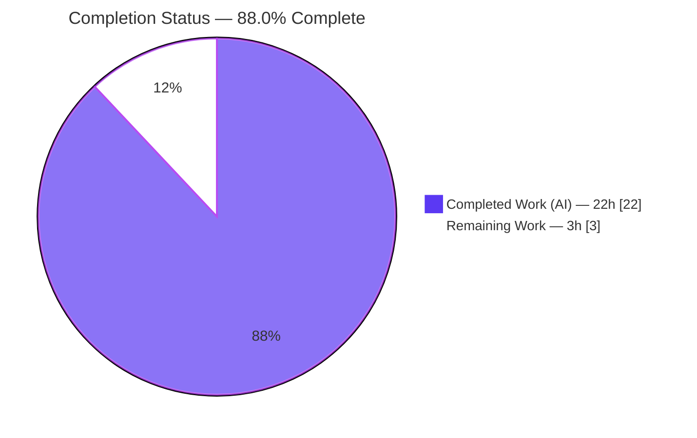
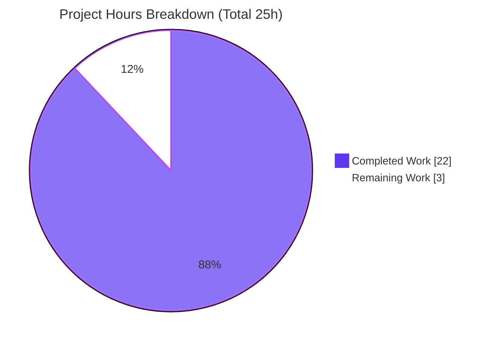
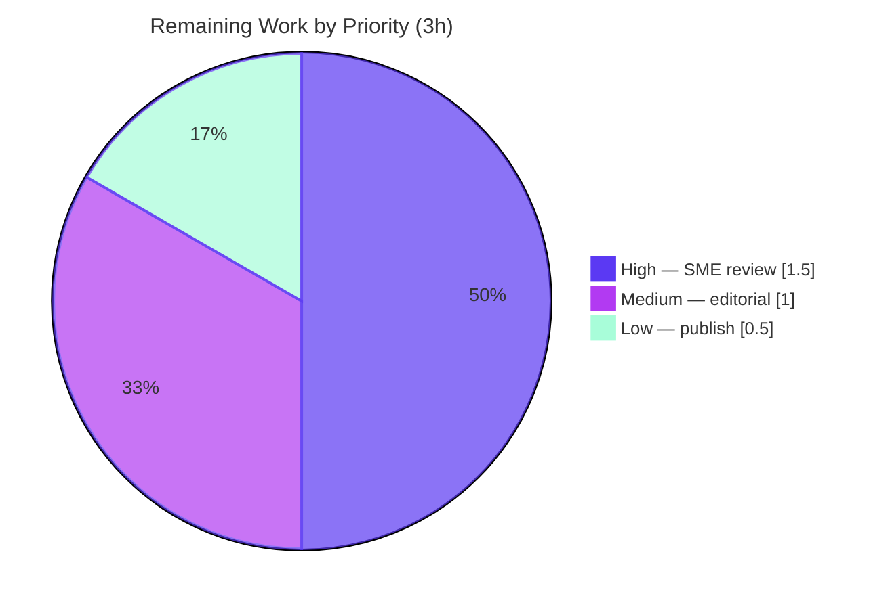

# Blitzy Project Guide — Scapy DNS Domain-Name Compression Explainer

> **Project:** Evidence-grounded onboarding explainer documenting how Scapy implements DNS domain-name compression (parse/decompress + build/compress) at runtime.
> **Branch:** `blitzy-bd01ba4c-cafc-48d6-8874-bd1f142dc64a` · **Base:** `0925ada4` (source branch `scapy_0925ada48540`)
> **Deliverable:** `blitzy/documentation/scapy_0925ada48540.md` (384 lines)
>
> **Legend (Blitzy brand colors):** 🟦 Completed / AI Work = Dark Blue `#5B39F3` · ⬜ Remaining / Not Completed = White `#FFFFFF`

---

## 1. Executive Summary

### 1.1 Project Overview

This project delivers a single, evidence-grounded onboarding explainer describing how Scapy implements DNS domain-name compression at runtime — the complete lifecycle from raw bytes entering the DNS layer, through decompression (parse) and compression (build), to a fully resolved name. The target readers are engineers onboarding to Scapy's DNS layer. It answers ten specific sub-questions, each backed by exact `file:line` citations into `scapy/layers/dns.py` (and helper modules) and verbatim runtime transcripts. The technical scope is deliberately narrow and **read-only**: exactly one new markdown file is created; no source, test, or configuration file is modified. Business impact: it accelerates onboarding and codifies the parser's adversarial-input robustness (loop, truncation, out-of-bounds handling) for security-aware development.

### 1.2 Completion Status



| Metric | Value |
|--------|-------|
| **Total Hours** | **25** |
| **Completed Hours (AI + Manual)** | **22** (22 AI + 0 Manual) |
| **Remaining Hours** | **3** |
| **Percent Complete** | **88.0%** |

> Completion is computed with the PA1 AAP-scoped, hours-based method: `Completed ÷ Total = 22 ÷ 25 = 88.0%`. All AAP deliverable work is complete and machine-validated; the remaining 3h is path-to-production human review that has not yet occurred.

### 1.3 Key Accomplishments

- ✅ **All ten sub-questions answered** — each in a dedicated section with citations and verbatim runtime output; a coverage-pass checklist confirms all ten (10 `[x]` items).
- ✅ **Deliverable created at the correct branch-derived path** — `blitzy/documentation/scapy_0925ada48540.md` (384 lines, ~33 KB), added across two agent commits (`f7488aa8`, `9f2729e0`).
- ✅ **Evidence-grounded** — 18 fully-qualified `scapy/layers/dns.py:L` citations plus 164 inline `L###` references, and cross-file citations to `error.py`, `compat.py`, `packet.py`, and `test/scapy/layers/dns.uts`; ~25 unique code locations spot-checked accurate against HEAD `0925ada4`.
- ✅ **14 verbatim runtime transcripts reproduce exactly** — including the loop `WARNING`, the `Scapy_Exception` path, graceful out-of-bounds/truncation retreats, the `0x40` quirk, and the `64→49`-byte compression round-trip with pointer `0xc00c`.
- ✅ **Behavioral test corpus green** — `UTscapy` on `test/scapy/layers/dns.uts` = **18 passed / 0 failed**; every cited test block passes.
- ✅ **Subject source compiles** — `compileall scapy/` and `py_compile scapy/layers/dns.py` both exit `0`.
- ✅ **Read-only mandate fully honored** — `git status --porcelain` is empty; the only change vs. base is the single new markdown file; every source/test/config file is byte-for-byte unchanged.
- ✅ **Standards-grounded** — RFC 1035 §4.1.4 (message compression) and RFC 9267 (RR-processing anti-patterns) correctly tie the code to the specs.

### 1.4 Critical Unresolved Issues

**No critical unresolved issues identified.** The deliverable passed all autonomous validation gates with zero discrepancies; nothing blocks release or validation. The items below are **non-blocking** path-to-production steps carried in Remaining Work (Section 2.2).

| Issue | Impact | Owner | ETA |
|-------|--------|-------|-----|
| _None (no blocking issues)_ | — | — | — |
| Human SME sign-off not yet performed (content is machine-validated only) | Non-blocking; quality gate before publication | Reviewing Engineer / DNS SME | 1.5h |
| Document not yet linked from an onboarding index | Non-blocking; affects discoverability only | Docs Owner | 0.5h |

### 1.5 Access Issues

**No access issues identified.** All work was performed in-container against an editable Scapy install in the provided virtual environment (`/opt/scapy311-venv`). Scapy's core has zero third-party runtime dependencies, and the task required no external credentials, network access, or third-party API keys.

| System/Resource | Type of Access | Issue Description | Resolution Status | Owner |
|-----------------|----------------|-------------------|-------------------|-------|
| _None_ | — | No access issues encountered | N/A | — |

### 1.6 Recommended Next Steps

1. **[High]** Have a DNS/Scapy subject-matter expert review the explainer for technical accuracy and completeness (spot-check citations against `scapy/layers/dns.py` at HEAD `0925ada4`; confirm transcripts and the `0x40` framing). — _1.5h_
2. **[Medium]** Run an editorial / readability pass and verify all code fences and the mermaid diagram render in the target markdown viewer. — _1.0h_
3. **[Low]** Publish the document and link it from the team's onboarding index so engineers can discover it (intentionally **not** wired into the Sphinx tree, per scope). — _0.5h_
4. **[Low]** _(Conditional / maintenance, not in baseline)_ If `scapy/layers/dns.py` changes after HEAD `0925ada4`, re-verify the pinned `file:line` citations. — _~0.5h if triggered_

---

## 2. Project Hours Breakdown

### 2.1 Completed Work Detail

All completed work was performed autonomously by Blitzy agents and traces to specific AAP requirements. **Total = 22 hours.**

| Component | Hours | Description |
|-----------|-------|-------------|
| Environment provisioning & run-first harness | 2 | Activate venv, verify editable Scapy install, scaffold ephemeral `/tmp` observation scripts, enforce cleanup discipline (AAP run-first + no-dependency mandates). |
| Investigation: wire encoding & decompression engine | 3 | Exercise `dns_encode` and `dns_get_str`, the `0xc0` marker and offset math; capture transcripts (sub-questions 1–3). |
| Investigation: adversarial / robustness | 4 | Craft loop `b"\xc0\x0c"`, out-of-bounds `b"\x05ab"`, incomplete jump `b"\xc0"`, and the no-full-packet exception; capture the `WARNING`, `Scapy_Exception`, and graceful retreats (sub-questions 4–5). |
| Investigation: cross-boundary, build-side & determinism | 3 | Exercise the `_orig_s` carrier, `dns_compress` `64→49` round-trip, pointer `0xc00c`, the `0x40` quirk, and clean reparse (sub-questions 6–8). |
| Source-code study & exact citation capture | 3 | Read `dns.py` plus `error.py`/`compat.py`/`packet.py`/`fields.py`; capture ~25 precise `file:line` citations (AAP exact-citation mandate). |
| Standards research | 1 | Ground behavior in RFC 1035 §4.1.4 and RFC 9267. |
| Document authoring | 4 | Write the 384-line explainer: 10 sub-question sections, methodology, lifecycle mermaid diagram, coverage-pass checklist, standards & scope notes (sub-questions 9–10 synthesis). |
| Self-validation | 2 | Verify citations, reproduce all 14 transcripts verbatim, run `UTscapy` (18/18), `compileall`/`py_compile`, confirm clean tree. |
| **Total Completed** | **22** | |

### 2.2 Remaining Work Detail

All remaining work is human-side path-to-production for a standalone onboarding document. **Total = 3 hours.**

| Category | Hours | Priority |
|----------|-------|----------|
| SME technical accuracy review of the DNS-compression explainer | 1.5 | High |
| Editorial / readability & consistency pass (copyedit; verify mermaid + code-fence rendering; check section anchors) | 1.0 | Medium |
| Publish / integrate into onboarding knowledge base & link from index (not Sphinx, per scope) | 0.5 | Low |
| **Total Remaining** | **3.0** | |

> **Excluded from baseline (conditional maintenance):** re-verifying pinned `file:line` citations if `scapy/layers/dns.py` changes after HEAD `0925ada4` (~0.5h). This is future-triggered and not required to ship the current deliverable, so it is not counted in the 3h.

### 2.3 Basis of Estimate

Hours reflect the effort an experienced engineer would invest to reproduce this deliverable to the same standard: a run-first forensic investigation of a non-trivial, adversarial-input-aware code path; precise multi-file citation; RFC grounding; and a validated 384-line write-up. Confidence is **High** for both completed and remaining estimates — the deliverable scope is well-defined and fully machine-validated, and the remaining tasks are standard, well-understood human-review activities. `Completed (22) + Remaining (3) = Total (25)`; `Completion = 22 ÷ 25 = 88.0%`.

---

## 3. Test Results

All tests below originate from Blitzy's autonomous validation logs for this project and were re-confirmed during assessment. The behavioral corpus `test/scapy/layers/dns.uts` is the authoritative reference suite for the in-scope subject (DNS name compression); every test block cited in the deliverable is contained within it and passes. Static-compilation gates are included as validation evidence.

| Test Category | Framework | Total Tests | Passed | Failed | Coverage % | Notes |
|---------------|-----------|-------------|--------|--------|------------|-------|
| DNS behavioral corpus | UTscapy (`scapy.tools.UTscapy`) | 18 | 18 | 0 | N/A¹ | Includes every cited block: Basic DNS Compression, Advanced `dns_get_str` (L144), Decompression loop (L150–153), Prematured end (L155–159), Other decompression loop, plus `dns_compress`/`dns_encode`/`rdlen` cases. |
| Static compilation — package | `python -m compileall scapy/` | 1 | 1 | 0 | N/A | Exit `0`; entire `scapy/` package byte-compiles cleanly. |
| Static compilation — subject file | `python -m py_compile scapy/layers/dns.py` | 1 | 1 | 0 | N/A | Exit `0`; the subject module compiles. |
| Runtime transcript reproduction | Ad-hoc Scapy script (ephemeral `/tmp`, removed) | 14 | 14 | 0 | N/A | All documented transcripts reproduce verbatim (see Section 4). |
| **Overall** | — | **34** | **34** | **0** | — | **100% pass; zero discrepancies.** |

> ¹ UTscapy reports pass/fail per test block, not line coverage; a numeric coverage percentage is therefore not applicable. The suite provides authoritative behavioral coverage of the DNS name encode/decode/compress/decompress path the document explains.
>
> **Benign, expected signals** (not failures): a `CryptographyDeprecationWarning` from an unrelated optional `ipsec` import; and intentional "DNS dissector failed" lines that are negative-path assertions **inside** the passing "Malformed DNS over TCP message" test.

---

## 4. Runtime Validation & UI Verification

**UI Verification:** ⬜ **Not applicable** — Scapy is a Python library/console and the deliverable is a markdown document. There is no user interface to verify.

**Runtime health** (every documented transcript reproduced verbatim; the ephemeral script ran outside the tree and was removed, leaving `git status` clean):

- ✅ **Operational** — `dns_encode(b'www.example.com')` → `b'\x03www\x07example\x03com\x00'`; `dns_encode(b'')` and `dns_encode(b'.')` → `b'\x00'`.
- ✅ **Operational** — `dns_get_str` decompression on well-formed names returns the expected 4-tuple (e.g., `(b'da.', 7, b'', False)`).
- ✅ **Operational** — Loop protection (A): `dns_get_str(b"\xc0\x0c", 0, _fullpacket=True)` emits `WARNING: DNS decompression loop detected` and returns `(b'', 2, b'', True)`.
- ✅ **Operational** — Graceful retreats (B, C): out-of-bounds label `b"\x05ab"` → `(b'ab.', 6, b'', False)`; incomplete jump `b"\xc0"` → `(b'', 2, b'', False)`.
- ✅ **Operational** — Dramatic path (D): pointer with no full-packet access raises `Scapy_Exception("DNS message can't be compressed at this point!")`.
- ✅ **Operational** — `0x40` quirk (E): `b"\x40"+b"AAAAA"+b"\x00"` → `(b'', 2, b'AAAA\x00', True)`.
- ✅ **Operational** — Build/compress round-trip: default build `64` bytes → `dns_compress` `49` bytes; compressed bytes contain pointer `0xc00c`; both `qd.qname` and `an.rrname` reparse to `b'www.example.com.'`.
- ✅ **Operational** — Cross-boundary resolution: answer RR carries `_orig_s` (len `37` = `49 − 12`), resolving the name across record boundaries.

**API integration:** ⬜ Not applicable — no external services, endpoints, or credentials are involved.

---

## 5. Compliance & Quality Review

AAP deliverable requirements and mandates cross-mapped to their compliance status. No fixes were required during autonomous validation — the deliverable was already accurate.

| Benchmark / AAP Mandate | Status | Evidence |
|-------------------------|--------|----------|
| Single branch-derived markdown created in `blitzy/documentation/` | ✅ Pass | `blitzy/documentation/scapy_0925ada48540.md` present (384 lines); parent dirs created. |
| All ten sub-questions answered | ✅ Pass | Sections (1)–(10) present; coverage-pass checklist with 10 `[x]` items. |
| Run-first methodology | ✅ Pass | Methodology section + reproduction script + verbatim transcripts. |
| Verbatim observed output quoted | ✅ Pass | 14 `text` transcript blocks; all reproduce exactly. |
| Exact `file:line` citations (no paraphrased values) | ✅ Pass | 18 qualified + 164 inline citations; ~25 unique locations verified against HEAD `0925ada4`. |
| Values quoted exactly (`0xc00c`, `-12`, 63-byte cap, `64→49`) | ✅ Pass | Present verbatim and reproduced at runtime. |
| RFC grounding (1035 §4.1.4, 9267) | ✅ Pass | Standards section maps specs to `L103`, `L227`, `L169`, `L114`, and the loop guard. |
| Read-only mandate (no source/test/config edits) | ✅ Pass | `git diff 0925ada4 --name-status` = single ADD; `git status --porcelain` empty. |
| Temporary scripts removed | ✅ Pass | Observation scripts confined to `/tmp` and deleted; tree clean; `__pycache__` gitignored. |
| No new runtime dependencies | ✅ Pass | Scapy zero-dependency core preserved; stdlib + Scapy only. |
| `0x40` quirk documented as-found (not "fixed") | ✅ Pass | Documented transparently in sub-question 8; no code change proposed. |
| Not wired into Sphinx (`-W` docs gate unaffected) | ✅ Pass | Standalone Blitzy-convention doc; `doc/scapy/` untouched. |
| Subject source integrity (compiles, tests pass) | ✅ Pass | `compileall`/`py_compile` exit `0`; `UTscapy` 18/18. |
| **Outstanding compliance item** | ⬜ Pending | Human SME sign-off (quality gate) — Remaining Work M1. |

---

## 6. Risk Assessment

Overall posture: **LOW.** No blocking, critical, security, or integration risks. All open items map to already-planned remaining tasks.

| Risk | Category | Severity | Probability | Mitigation | Status |
|------|----------|----------|-------------|------------|--------|
| Citation line-number drift if `scapy/layers/dns.py` changes after HEAD `0925ada4` | Technical | Low | Medium | Citations are explicitly pinned/labeled to HEAD `0925ada4`; cheap re-verify (~0.5h) on source change; the doc's "Notes on scope" already flags this. | Documented / Accepted |
| Content not yet human-SME-reviewed (machine-validated only) | Technical / Quality | Low | Low | SME technical review (Remaining task, 1.5h); all claims already verified by 18/18 tests + verbatim transcripts + citation checks. | Open (planned) |
| Low discoverability — doc not wired into Sphinx/searchable index | Operational | Low | Medium | Publish/link from onboarding index (Remaining task, 0.5h); Sphinx omission is by-design per AAP scope. | Open (planned) |
| Security exposure | Security | None | — | Read-only task: zero code changes, no new dependencies, no attack surface, no auth/data handling. | Not applicable |
| Integration/build coupling | Integration | None | — | Standalone markdown; no code/build/CI coupling; `-W` Sphinx docs gate unaffected. | Not applicable |
| `0x40` label-vs-pointer interpretation (informational) | Informational | Low | N/A | Pre-existing Scapy behavior (bitwise `cur & 0xc0` at `L103`); out of scope to change; benign for Scapy-built packets (63-byte cap `k[:63]` at `L169`). Documented as-found. | Accepted / By-design |

---

## 7. Visual Project Status

**Project hours breakdown** (🟦 Completed = Dark Blue `#5B39F3` · ⬜ Remaining = White `#FFFFFF`):



**Remaining hours by priority** (from Section 2.2 — sums to the 3h "Remaining Work" above):



> **Integrity check:** Remaining Work `= 3h` in Section 1.2 metrics, the sum of Section 2.2 "Hours", and the "Remaining Work" pie slice above — all identical.

---

## 8. Summary & Recommendations

**Achievements.** The project delivers a complete, evidence-grounded onboarding explainer for Scapy's DNS domain-name compression. All ten sub-questions are answered with exact `file:line` citations and verbatim runtime transcripts; the behavioral corpus passes 18/18; the subject source compiles; and the read-only mandate is fully honored (the working tree contains exactly one new file and is otherwise byte-for-byte unchanged). Independent re-verification during this assessment reproduced every transcript and spot-checked every category of citation with zero discrepancies.

**Completion.** Using the AAP-scoped, hours-based method, the project is **88.0% complete** (`22 of 25 hours`). The AAP-authorable deliverable itself is fully complete and machine-validated; the remaining **3 hours** are human-side path-to-production steps.

**Remaining gaps & critical path.** The critical path to production is short and non-blocking: (1) a DNS SME technical review (1.5h, High), (2) an editorial/rendering pass (1.0h, Medium), and (3) publishing and linking the document from an onboarding index (0.5h, Low). None of these require code changes.

**Success metrics.** All ten sub-questions covered ✅ · 18/18 behavioral tests green ✅ · subject source compiles ✅ · every documented transcript reproduces verbatim ✅ · read-only mandate preserved (clean `git status`) ✅.

**Production readiness.** The deliverable is **production-ready pending human sign-off**. There are no critical issues, no security or integration risks, and no rework. Recommended action: complete the three human-review steps above and publish.

---

## 9. Development Guide

This guide reproduces the investigation that grounds the deliverable. Every command below was executed and verified in the project container. All commands assume the repository root `/tmp/blitzy/scapy/blitzy-bd01ba4c-cafc-48d6-8874-bd1f142dc64a_56dcef` unless noted.

### 9.1 System Prerequisites

- **OS:** Linux (Ubuntu 25.10 container).
- **Git:** 2.51.0 (`git --version`).
- **Python:** system `python3` 3.13.7; execution virtual environment `/opt/scapy311-venv` runs **Python 3.11.15** (the venv used for all validation).
- **Scapy:** 2026.07.01, installed **editable** from the repository (no separate install needed).
- **Third-party runtime dependencies:** none — Scapy's core is zero-dependency; observation scripts use only the standard library plus Scapy.

### 9.2 Environment Setup

```bash
# From the repository root
cd /tmp/blitzy/scapy/blitzy-bd01ba4c-cafc-48d6-8874-bd1f142dc64a_56dcef

# Activate the provided virtual environment (Scapy is already installed editable)
source /opt/scapy311-venv/bin/activate

# Verify the interpreter and Scapy
python --version                 # -> Python 3.11.15
python -c "import scapy; print(scapy.__version__)"   # -> 2026.07.01
```

> **Do not** run `pip install scapy` against the system Python — on Ubuntu 25 it raises a PEP 668 "externally-managed-environment" error. Use the provided venv, where Scapy is already editable-installed.

### 9.3 Verify Source Integrity (Compilation)

```bash
python -m compileall -q scapy/               # expect: exit 0 (no output)
python -m py_compile scapy/layers/dns.py     # expect: exit 0
```

### 9.4 Run the Behavioral Test Corpus

```bash
python -m scapy.tools.UTscapy \
  -t test/scapy/layers/dns.uts \
  -N -K netaccess,needs_root,manufdb,tshark,tcpdump,wireshark
# expect: PASSED=18 FAILED=0
```

### 9.5 Reproduce the Runtime Transcripts

Keep the observation script **outside** the repository (under `/tmp`) and remove it afterward so the working tree stays clean.

```bash
cat > /tmp/repro_dns.py << 'PYEOF'
from scapy.layers.dns import dns_get_str, dns_encode, dns_compress, DNS, DNSQR, DNSRR
from scapy.error import Scapy_Exception
from scapy.compat import raw

print("encode:", dns_encode(b'www.example.com'))          # b'\x03www\x07example\x03com\x00'
print("(A) loop:", dns_get_str(b"\xc0\x0c", 0, _fullpacket=True))   # WARNING + (b'', 2, b'', True)
print("(B) OOB:", dns_get_str(b"\x05ab", 0, _fullpacket=True))      # (b'ab.', 6, b'', False)
print("(C) incomplete:", dns_get_str(b"\xc0", 0, _fullpacket=True)) # (b'', 2, b'', False)
try:
    dns_get_str(b"\xc0\x0c", 0, pkt=None, _fullpacket=False)        # (D)
except Scapy_Exception as e:
    print("(D) Scapy_Exception:", e)
print("(E) 0x40:", dns_get_str(b"\x40" + b"AAAAA" + b"\x00", 0, _fullpacket=True))  # (b'', 2, b'AAAA\x00', True)
pkt = DNS(qd=DNSQR(qname='www.example.com'),
          an=DNSRR(rrname='www.example.com', type='A', rdata='1.2.3.4'))
print("sizes:", len(raw(pkt)), "->", len(raw(dns_compress(pkt))))  # 64 -> 49
print("has 0xc00c:", b"\xc0\x0c" in raw(dns_compress(pkt)))        # True
PYEOF

PYTHONDONTWRITEBYTECODE=1 python -u /tmp/repro_dns.py
rm -f /tmp/repro_dns.py    # cleanup — preserves the read-only mandate
```

**Expected output:**

```text
encode: b'\x03www\x07example\x03com\x00'
WARNING: DNS decompression loop detected
(A) loop: (b'', 2, b'', True)
(B) OOB: (b'ab.', 6, b'', False)
(C) incomplete: (b'', 2, b'', False)
(D) Scapy_Exception: DNS message can't be compressed at this point!
(E) 0x40: (b'', 2, b'AAAA\x00', True)
sizes: 64 -> 49
has 0xc00c: True
```

### 9.6 View the Deliverable & Confirm a Clean Tree

```bash
wc -l blitzy/documentation/scapy_0925ada48540.md   # -> 384
git status --porcelain                              # -> (empty = clean)
git diff 0925ada4 --name-status                     # -> A  blitzy/documentation/scapy_0925ada48540.md
```

### 9.7 Troubleshooting

- **`WARNING: DNS decompression loop detected` on stderr** — Expected for adversarial loop inputs (case A). This is Scapy's runtime logger demonstrating loop protection, not a failure.
- **`CryptographyDeprecationWarning`** — Benign; originates from an unrelated optional `ipsec` import and does not affect DNS behavior or tests.
- **"DNS dissector failed" lines during the test run** — Intentional negative-path assertions **inside** the passing "Malformed DNS over TCP message" test; the suite still reports `FAILED=0`.
- **PEP 668 "externally-managed-environment" on `pip install`** — Use the provided venv (`source /opt/scapy311-venv/bin/activate`); Scapy is already editable-installed. Do not reinstall.
- **Dirty `git status` after running Python** — Ensure observation scripts live under `/tmp`, not the repo; `__pycache__` is gitignored, so byte-compilation does not dirty the tree.

---

## 10. Appendices

### Appendix A — Command Reference

| Purpose | Command |
|---------|---------|
| Activate venv | `source /opt/scapy311-venv/bin/activate` |
| Scapy version | `python -c "import scapy; print(scapy.__version__)"` |
| Compile package | `python -m compileall -q scapy/` |
| Compile subject file | `python -m py_compile scapy/layers/dns.py` |
| Run DNS test corpus | `python -m scapy.tools.UTscapy -t test/scapy/layers/dns.uts -N -K netaccess,needs_root,manufdb,tshark,tcpdump,wireshark` |
| Reproduce transcripts | `PYTHONDONTWRITEBYTECODE=1 python -u /tmp/repro_dns.py` (script under `/tmp`) |
| Deliverable line count | `wc -l blitzy/documentation/scapy_0925ada48540.md` |
| Clean-tree check | `git status --porcelain` |
| Change vs. base | `git diff 0925ada4 --name-status` |

### Appendix B — Port Reference

**Not applicable.** The project runs no network services, servers, or listeners; no ports are used.

### Appendix C — Key File Locations

| Path | Role |
|------|------|
| `blitzy/documentation/scapy_0925ada48540.md` | **The deliverable** — the DNS compression explainer (384 lines). |
| `scapy/layers/dns.py` | Primary subject source (1,179 lines): `dns_get_str` L69–144, `dns_encode` L154–172, `dns_compress` L184–267, `InheritOriginDNSStrPacket` L270–276, `DNSStrField`, `DNSRRField`, `DNSQRField`, `DNS`. |
| `scapy/error.py` | `Scapy_Exception`, `log_runtime`, `warning` (loop/bounds/dramatic outcomes). |
| `scapy/compat.py` | `orb`, `chb`, `raw`, `bytes_encode`, `plain_str` byte helpers. |
| `scapy/packet.py` | `Packet` base class and its `__slots__`. |
| `scapy/fields.py` | `StrField` base for `DNSStrField`. |
| `test/scapy/layers/dns.uts` | Authoritative behavioral corpus (18 tests) for compression/loops/truncation. |

### Appendix D — Technology Versions

| Component | Version | Notes |
|-----------|---------|-------|
| Scapy | 2026.07.01 | Editable install from the repository working tree. |
| Python (venv) | 3.11.15 | `/opt/scapy311-venv` — used for all validation. |
| Python (system) | 3.13.7 | Container default. |
| Git | 2.51.0 | — |
| Documented behavioral ceiling (per AAP) | Python 3.10 | From `pyproject.toml` classifiers / CI matrix. |
| Test framework | UTscapy (`scapy.tools.UTscapy`) | `.uts` format (not pytest). |

### Appendix E — Environment Variable Reference

| Variable | Value | Purpose |
|----------|-------|---------|
| `PYTHONDONTWRITEBYTECODE` | `1` | Prevents `.pyc` creation while reproducing transcripts (keeps the tree tidy). |
| `VIRTUAL_ENV` | `/opt/scapy311-venv` | Set by `source .../activate`; selects the validation interpreter. |

> No application-specific or secret environment variables are required — the project has no runtime configuration or credentials.

### Appendix F — Developer Tools Guide

| Tool | Use |
|------|-----|
| `scapy.tools.UTscapy` | Runs `.uts` behavioral test blocks; `-K` excludes suites needing root/network/external binaries. |
| `python -m compileall` / `py_compile` | Fast static syntax/compilation verification of the subject source. |
| `git diff` / `git status --porcelain` | Confirms the read-only mandate (single-file change, clean tree). |
| Scapy interactive (`from scapy.layers.dns import ...`) | Reproduces `dns_encode`/`dns_get_str`/`dns_compress` behavior for ad-hoc verification. |

### Appendix G — Glossary

| Term | Meaning |
|------|---------|
| **DNS name compression** | RFC 1035 §4.1.4 scheme that replaces a repeated domain name with a 2-octet pointer to an earlier occurrence. |
| **Compression pointer** | A 2-octet value whose top two bits are `11` (`0xc0` mask); the remaining 14 bits encode an offset from the start of the DNS message. |
| **`0xc00c`** | The canonical pointer to offset `12` — immediately after the 12-byte DNS header, where the first (question) name typically sits. |
| **`dns_get_str`** | Scapy's decompression engine: unwinds label/pointer chains into a readable name (`scapy/layers/dns.py:L69–144`). |
| **`dns_encode`** | Encodes a name into length-prefixed labels terminated by a zero octet (`L154–172`). |
| **`dns_compress`** | Build-side compressor: walks `qd→an→ns→ar`, substitutes pointers for repeated names (`L184–267`). |
| **`_orig_s`** | Slot on `InheritOriginDNSStrPacket` carrying the full DNS body so cross-boundary pointers resolve (`L270–276`). |
| **Loop guard** | `processed_pointers` list; a revisited target triggers `warning("DNS decompression loop detected")` and a graceful `break` (`L88`, `L115–117`, `L130`). |
| **UTscapy** | Scapy's native unit-test runner for `.uts` files. |
| **AAP** | Agent Action Plan — the primary directive defining project scope and requirements. |

---

*Generated by the Blitzy Platform. Completion (88.0%) reflects AAP-scoped and path-to-production work only. Cross-section integrity validated: Remaining hours (3h) are identical across Sections 1.2, 2.2, and 7; Completed (22h) + Remaining (3h) = Total (25h).*