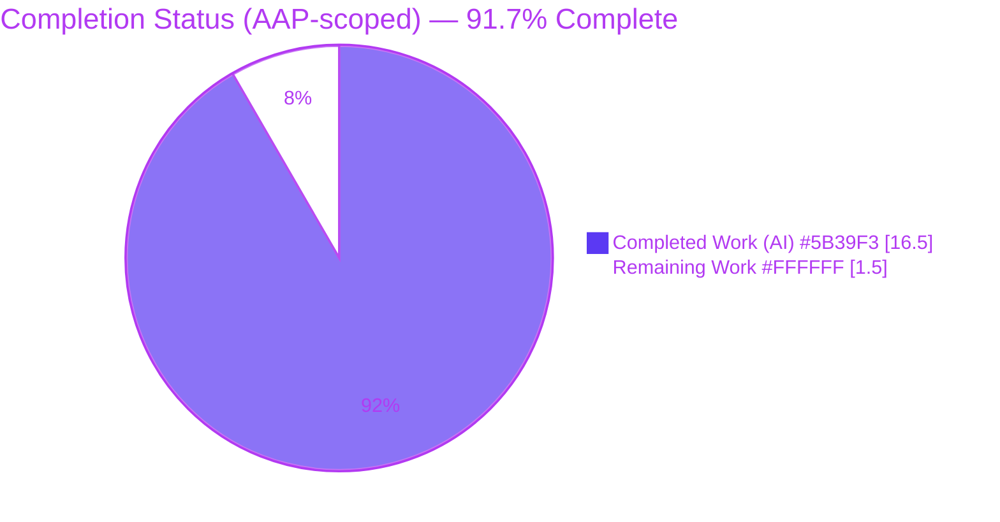
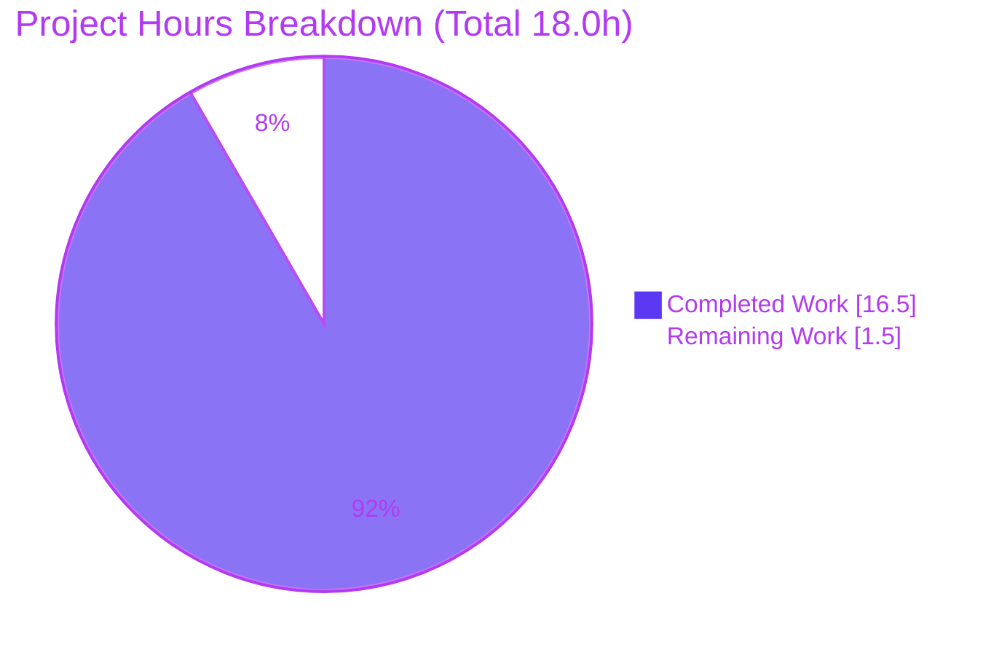

# Blitzy Project Guide — Scapy Checksum & Length: Computation vs. Caching (Grounded Q&A)

> **Deliverable type:** Documentation (grounded technical Q&A) · **Rule set:** `SWE-AtlasQnA-Repo` (read-only) · **Branch:** `blitzy-1bfbd906-a5ff-45d8-ae86-4591140fb590` · **Base:** `scapy_0925ada48540` (HEAD `0925ada4`)
>
> **Brand color legend:** <span style="color:#5B39F3">■</span> **Completed / AI Work = Dark Blue `#5B39F3`** · <span style="color:#FFFFFF;background:#333">■</span> **Remaining / Not Completed = White `#FFFFFF`** · <span style="color:#B23AF2">■</span> Headings/Accents = Violet-Black `#B23AF2` · <span style="color:#A8FDD9">■</span> Highlight = Mint `#A8FDD9`

---

## 1. Executive Summary

### 1.1 Project Overview

This project delivers a single, evidence-grounded markdown document that answers a behavioral question about the **Scapy** packet-manipulation library: *how Scapy computes versus caches checksum and length fields when a packet is serialized to bytes.* The audience is engineers and Scapy users who need a definitive, source-cited explanation. The technical scope is **read-only investigation + authoring**: build and run real IPv4/TCP packets, capture verbatim output, trace each behavior to an exact `file:line` in the Scapy source, and answer six sub-questions (O1–O6) plus the essential dissected-packet contrast (O2b). No Scapy source, test, or build file is modified; the only artifact produced is the answer document.

### 1.2 Completion Status

The completion percentage is computed using the **AAP-scoped hours methodology (PA1)**: `Completion % = Completed Hours ÷ (Completed + Remaining) × 100`. Only work defined by the Agent Action Plan and standard path-to-production activities are counted.



| Metric | Hours |
|--------|-------|
| **Total Hours** | **18.0** |
| **Completed Hours (AI + Manual)** | **16.5** (AI = 16.5, Manual = 0.0) |
| **Remaining Hours** | **1.5** |
| **Percent Complete** | **91.7%** |

> **Formula (explicit):** `16.5 ÷ (16.5 + 1.5) = 16.5 ÷ 18.0 = 91.666… → 91.7%`. All 13 AAP-specified requirements are **Completed**; the 1.5h remaining is exclusively human-gated path-to-production (review + merge).

### 1.3 Key Accomplishments

- ✅ Authored `blitzy/documentation/scapy_0925ada48540.md` (561 lines) — a complete grounded Q&A answering **all six** sub-questions (O1–O6) **plus** the dissected-packet stale-checksum contrast (O2b).
- ✅ **Ran-first (R1):** every hex dump and number was captured by actually executing packets, then re-verified byte-for-byte in this validation session.
- ✅ **Verbatim evidence (R2):** each scenario embeds its exact command/snippet and verbatim output.
- ✅ **Exact citations (R4):** every distinct `file:line` reference verified exact against HEAD `0925ada4` across `compat.py`, `packet.py`, `layers/inet.py`, `fields.py`.
- ✅ **Coverage pass (R3):** an explicit table maps O1–O6 + O2b to their answered sections.
- ✅ **Read-only + cleanup (R5):** `git diff` shows a single added file; zero source touched; working tree clean; temporary scripts removed.
- ✅ Explained the unifying mechanism once (the **`None` rule** + the **cache rule**) and referenced it from each scenario, including a Mermaid control-flow diagram.

### 1.4 Critical Unresolved Issues

| Issue | Impact | Owner | ETA |
|-------|--------|-------|-----|
| _None_ | No unresolved issues block release or validation. The deliverable is byte-for-byte accurate and fully grounded. | — | — |

### 1.5 Access Issues

| System/Resource | Type of Access | Issue Description | Resolution Status | Owner |
|-----------------|----------------|-------------------|-------------------|-------|
| _None_ | — | **No access issues identified.** The repository is present and writable for the single mandated file; Scapy runs from the source tree with no external services, credentials, or third-party access required. | N/A | — |

### 1.6 Recommended Next Steps

1. **[High]** Perform a human technical & pedagogical review of `blitzy/documentation/scapy_0925ada48540.md` — confirm the six sub-answers and the O2b contrast are correct and clearly explained; optionally re-run the Section 9 reproduction snippets (fast; outputs are deterministic). *(~1.0h)*
2. **[Medium]** Approve and merge/publish the deliverable (2 agent commits, additive, no conflicts expected). *(~0.5h)*
3. **[Low]** *(Optional, out of AAP scope)* Add a lightweight citation re-verification note/CI check for future Scapy refactors (mitigates line-number drift).
4. **[Low]** *(Optional, out of AAP scope)* Port/link the markdown into the project's `doc/` reStructuredText tree if RTD discoverability is desired.

---

## 2. Project Hours Breakdown

### 2.1 Completed Work Detail

Every component below traces to a specific AAP requirement or governing rule. **Total = 16.5h** (matches Completed Hours in Section 1.2).

| Component | Hours | Description |
|-----------|-------|-------------|
| Environment setup & Scapy-from-source runnability (R1 prereq) | 1.0 | Establish source-tree import (no pip install), venv/PYTHONPATH, confirm `conf.version`; handle harmless TripleDES warning |
| R1 investigation — O1 first-build capture | 0.5 | Build reference packet, capture `bytes()`, IP/TCP checksums, byte count, `raw_packet_cache` state |
| R1 investigation — O2 + O2b (fresh vs. cached, incl. dissected stale) | 2.0 | The subtlest behavior: from-scratch fresh recompute vs. dissected populated-cache stale checksum; full before/after hex |
| R1 investigation — O3 + O4 (manual override before/after) | 1.0 | Force `chksum=0xAAAA` before and after build; capture surviving bytes |
| R1 investigation — O5 (deep-copy isolation) | 0.5 | Copy packet, mutate clone payload, confirm original unchanged before/after |
| R1 investigation — O6 (IP length on growth) | 0.5 | Grow payload by 10 bytes; capture decimal `IP.len` vs. actual byte count |
| Source tracing & `file:line` citation verification (R4, 4 modules) | 2.5 | Locate & verify ~20 exact references in `compat.py`, `packet.py`, `layers/inet.py`, `fields.py` |
| Mechanism Overview authoring (`None` rule + cache rule + entry point) | 2.0 | Explain the two interacting rules once, with control-flow Mermaid diagram |
| Scenario sections authoring O1–O6 + O2b (verbatim evidence, R2) | 3.0 | Per-scenario question, snippet, verbatim output, and grounded rationale |
| Coverage pass + citation map + key insights (R3) | 1.5 | Coverage table, verified citation map, "the why" insights |
| QA — 39 documented-output assertions + re-runs | 1.5 | Assert every documented literal reproduces byte-for-byte |
| Read-only compliance, cleanup, commits (R5) | 0.5 | Confirm single-file diff, remove temp scripts, commit |
| **Total** | **16.5** | |

### 2.2 Remaining Work Detail

Each category is a standard path-to-production activity that is **human-gated by nature**. **Total = 1.5h** (matches Remaining Hours in Section 1.2 and the pie chart in Section 7).

| Category | Hours | Priority |
|----------|-------|----------|
| Human technical & pedagogical review of the answer document | 1.0 | High |
| Merge / publish the documentation deliverable | 0.5 | Medium |
| **Total** | **1.5** | |

> **Optional (out of AAP scope — 0h, not counted):** CI/citation re-verify guard for future refactors; porting the doc into the `doc/` RTD tree. Listed for completeness only; explicitly excluded from remaining hours.

### 2.3 Basis of Estimate & Confidence

- **Completed hours** are derived from the delivered artifact (561 lines), the breadth of source tracing (4 modules, ~20 citations), and the multi-scenario run-and-capture workflow.
- **Remaining hours** reflect only human review + merge. **Confidence: High** — the scope is fully defined, the deliverable is complete and verified, and there are no unknowns.

---

## 3. Test Results

All entries below originate from **Blitzy's autonomous validation logs** for this project (independently re-confirmed in this session). Because the AAP scope is documentation-only and adding tests is explicitly out of scope, "tests" here are **documented-output verification assertions** (behavioral reproduction) plus static and structural checks — not a new test suite.

| Test Category | Framework | Total Tests | Passed | Failed | Coverage % | Notes |
|---------------|-----------|-------------|--------|--------|-----------|-------|
| Documented-Output Verification (behavioral reproduction) | Python `assert` harness (Blitzy autonomous) | 39 | 39 | 0 | 100% (O1–O6 + O2b) | Every hex dump, checksum, length, and boolean reproduces byte-for-byte; re-confirmed here |
| Documented-Output Re-check (condensed inline) | Python `assert` (Blitzy autonomous) | 29 | 29 | 0 | 100% | Secondary condensed pass over the same literals |
| Citation Accuracy Verification | Source line-match vs. HEAD `0925ada4` | ~20 refs | ~20 | 0 | 100% of cited refs | All `file:line` references exact across 4 modules |
| Static Compilation | `python -m py_compile` | 4 modules | 4 | 0 | 100% of cited modules | `compat.py`, `packet.py`, `layers/inet.py`, `fields.py` |
| Markdown Structural Validation | Fence/diagram lint | 3 checks | 3 | 0 | 100% | 561 lines, 40 balanced code fences, 1 valid Mermaid diagram |

**Representative reproduced literals (verbatim):**

- **O1:** `IP.chksum=0x66c9`, `TCP.chksum=0xf437`, 44 bytes, `raw_packet_cache is None → True`
- **O2:** fresh `TCP 0xf437 → 0xf337`; `IP 0x66c9` unchanged (header-only)
- **O2b:** dissected cache populated → **stale** `TCP 0xf437`; `chksum=None → 0xf337`
- **O3 / O4:** `bytes[10:12] = aaaa` (override survives)
- **O5:** original unchanged (`True`); clone independent (50 bytes, `IP.len=50`, `TCP 0x2b69`)
- **O6:** `IP.len 44 → 54` equals byte count `44 → 54` (match)

> **Note on the project's own suite:** Scapy's UTscapy `.uts` regression campaigns (193 files) were **not** modified or run as part of this task — that is correct per the read-only mandate and "no new tests" scope boundary. They remain available for optional corroboration.

---

## 4. Runtime Validation & UI Verification

**Runtime health**

- ✅ **Operational** — Scapy imports and runs cleanly from the source tree (no pip install) under CPython 3.13.7; `conf.version` reports `2026.07.01`.
- ✅ **Operational** — All six scenarios (O1–O6) + O2b execute end-to-end and produce the documented output byte-for-byte.
- ✅ **Operational** — Both documented invocation paths work identically: the `.venv` interpreter and the `PYTHONPATH=. PYTHONDONTWRITEBYTECODE=1` idiom.
- ✅ **Operational** — Import emits only the expected, harmless `CryptographyDeprecationWarning` (TripleDES from `scapy/layers/ipsec.py`), unrelated to checksum/length behavior.

**API / integration verification**

- ⚠ **N/A** — This is a library/CLI investigation; there are no HTTP APIs or external service integrations in scope.

**UI verification**

- ⚠ **N/A** — There is no user interface. The deliverable is a markdown document; the only visual element is one Mermaid control-flow diagram, which was structurally validated (renders in GitHub and Mermaid-capable viewers).

---

## 5. Compliance & Quality Review

Cross-mapping of AAP deliverables and the governing `SWE-AtlasQnA-Repo` rules to their verification status. **Fixes applied during autonomous validation: 0** — the deliverable was already correct.

| Benchmark / Requirement | Status | Progress | Evidence |
|-------------------------|--------|----------|----------|
| **R1** — Investigate by running first | ✅ Pass | 100% | Runtime Context + verbatim per-scenario output; re-executed here |
| **R2** — Quote observed output verbatim | ✅ Pass | 100% | Every scenario embeds a verbatim `text` block with its producing snippet |
| **R3** — Answer every part + coverage pass | ✅ Pass | 100% | Coverage table maps O1–O6 + O2b; "nothing left unaddressed" |
| **R4** — Exact literals + `file:line` citations | ✅ Pass | 100% | Citation map + inline refs; all verified exact vs HEAD `0925ada4` |
| **R5** — Read-only scope + cleanup | ✅ Pass | 100% | `git diff` = 1 file added; zero source touched; tree clean; temp scripts removed |
| Deliverable at mandated path & filename | ✅ Pass | 100% | `blitzy/documentation/scapy_0925ada48540.md` (matches base branch name) |
| Parent directory creation | ✅ Pass | 100% | `blitzy/documentation/` created |
| O1 — Checksum on first build | ✅ Pass | 100% | `IP 0x66c9`, `TCP 0xf437`, 44 bytes, cache `None` |
| O2 — Cache behavior on payload mutation | ✅ Pass | 100% | Fresh recompute; full before/after hex; IP stable |
| O2b — Dissected-packet stale contrast | ✅ Pass | 100% | Stale `0xf437`; `clear_cache()` insufficient; `chksum=None → 0xf337` |
| O3 — Manual override before build | ✅ Pass | 100% | `0xAAAA` survives → `aaaa` |
| O4 — Manual override after build ("twist") | ✅ Pass | 100% | Survives → `aaaa`; twist does not occur (from-scratch) |
| O5 — Deep-copy isolation | ✅ Pass | 100% | Original unchanged; clone independent |
| O6 — IP length on growth | ✅ Pass | 100% | `44 → 54` len == byte count |
| Mechanism grounding (`None` rule + cache rule) | ✅ Pass | 100% | Explained once, cited, referenced per scenario |
| Documentation quality (structure, clarity, transparency) | ✅ Pass | 100% | Includes an explicit transparency note reconciling the Python 3.12.3 authoring reference vs. 3.13.7 capture (values deterministic) |

---

## 6. Risk Assessment

Risks are categorized per PA3 (technical, security, operational, integration). Overall posture is **very low** — an additive, read-only documentation deliverable with no code, dependency, or CI impact.

| Risk | Category | Severity | Probability | Mitigation | Status |
|------|----------|----------|-------------|------------|--------|
| Citation line-number drift if Scapy source is later refactored | Technical | Low | Medium (long-term) | Citations explicitly pinned to HEAD `0925ada4`; re-verify if source updates | Mitigated (pinned) |
| O5 clone checksum `0x2b69` is modification-dependent (specific to clone payload `b"BBBBBBBBBB"`) | Technical | Low | Low | Document includes an explicit callout flagging this and states its exact modification; reconciles the AAP's illustrative `0xc205` (a different clone payload) — not a defect | Mitigated (documented) |
| No automated CI test guards documented hex if checksum internals change | Technical | Low | Low | Copy-pasteable reproduction snippets enable fast manual re-verification; Internet checksum is standardized/deterministic | Accepted |
| Sensitive data / credentials / attack surface | Security | None | — | Read-only markdown; zero code added, zero dependencies changed | N/A — none |
| Document lives outside the project's `doc/` reStructuredText RTD tree | Operational | Low | By design | Intentional per governing rule (mandated `blitzy/documentation/` location) | By design |
| Mermaid diagram requires a Mermaid-capable viewer | Operational | Low | Low | GitHub and modern viewers render Mermaid natively; diagram validated | Accepted |
| Build/import/CI ripple effects | Integration | None | — | Confirmed no CI/build/config references `blitzy/`; markdown imports nothing and is imported by nothing | N/A — none |

**No High or Critical risks. No blockers to production (merge).**

---

## 7. Visual Project Status

**Project hours breakdown** — <span style="color:#5B39F3">Completed = Dark Blue `#5B39F3`</span>, <span style="color:#FFFFFF;background:#333">Remaining = White `#FFFFFF`</span>.



**Remaining work by priority** (from Section 2.2 — sums to 1.5h):

| Priority | Category | Hours |
|----------|----------|-------|
| High | Human technical & pedagogical review | 1.0 |
| Medium | Merge / publish | 0.5 |
| **Total** | | **1.5** |

> **Integrity:** the pie chart's "Remaining Work" (1.5) equals Section 1.2 Remaining Hours (1.5) and the Section 2.2 Hours total (1.5). "Completed Work" (16.5) equals Section 1.2 Completed Hours and the Section 2.1 total.

---

## 8. Summary & Recommendations

**Achievements.** The project is **91.7% complete** on an AAP-scoped basis. All 13 AAP-specified requirements — the six sub-questions (O1–O6), the implicit dissected-packet contrast (O2b), the unifying mechanism explanation, verbatim evidence (R2), exact citations (R4), the coverage pass (R3), and the read-only + cleanup mandate (R5) — are **complete and verified byte-for-byte**. The deliverable, `blitzy/documentation/scapy_0925ada48540.md`, is a rigorous, self-contained answer whose every claim is backed either by an exact `file:line` source reference or by output captured from actually running the code.

**Remaining gaps.** The remaining **1.5 hours (8.3%)** is exclusively human-gated path-to-production work: a technical/pedagogical review and the merge/publish step. There are no code defects, no failing checks, and no unknowns. The single "surprising" behavior — a dissected packet serving a stale upper-layer checksum (O2b) — is **correct-by-design** Scapy behavior, documented as observed rather than treated as a bug, precisely as the AAP requires.

**Critical path to production.** Review → approve → merge. No environment configuration, dependency work, deployment pipeline, or infrastructure is required (this is an additive markdown file with zero build/CI coupling).

**Success metrics (all met):** 39/39 documented-output assertions pass; 100% of `file:line` citations exact; single-file diff with clean working tree; all cited modules compile.

**Production readiness assessment:** **Ready for human review and merge.** Confidence is **High**. Per Blitzy policy, autonomous completion is capped below 100% pending human review; the honest AAP-scoped figure is **91.7%**.

---

## 9. Development Guide

Every command below was **executed and verified** during validation. The application under investigation is Scapy, run **directly from the source tree** (no pip install of Scapy required).

### 9.1 System Prerequisites

- **OS:** Linux/macOS/WSL (validated on Linux).
- **Python:** CPython ≥ 3.7, < 4 (project `requires-python`). Validated on **3.13.7**; behavior is deterministic and interpreter-independent.
- **Git:** any recent version (validated 2.51.0).
- **Hardware:** negligible — packet building is in-memory and instant.

### 9.2 Environment Setup

Two equivalent options; pick one.

**Option A — use the provided virtualenv (editable Scapy install):**
```bash
cd /path/to/repo          # repository root
source .venv/bin/activate # Python 3.13.7
python --version          # -> Python 3.13.7
```

**Option B — no venv, run from source with PYTHONPATH (documented idiom):**
```bash
cd /path/to/repo
export PYTHONPATH=.
export PYTHONDONTWRITEBYTECODE=1   # avoids writing .pyc/__pycache__ under scapy/
```

> **Dependencies:** Scapy's core has **zero** required third-party packages. No installation of dependencies is needed for this task.

### 9.3 Verify Scapy Runs

```bash
PYTHONDONTWRITEBYTECODE=1 python -c "from scapy.all import conf; print('conf.version =', conf.version)"
# Expected:
# conf.version = 2026.07.01
```
A harmless `CryptographyDeprecationWarning` about TripleDES may appear on import — it is expected and irrelevant to checksum/length behavior.

### 9.4 Canonical Reproduction (O1 reference build)

```bash
PYTHONPATH=. PYTHONDONTWRITEBYTECODE=1 python3 -c \
"from scapy.all import IP,TCP,Raw,raw; print(raw(IP(src='10.0.0.1',dst='10.0.0.2')/TCP(sport=1234,dport=80)/Raw(load=b'AAAA')).hex())"
# Expected (verbatim):
# 4500002c00010000400666c90a0000010a00000204d20050000000000000000050022000f437000041414141
```
Byte offsets: IP total length `bytes[2:4]=002c` (44); IP header checksum `bytes[10:12]=66c9`; TCP checksum `bytes[36:38]=f437`.

### 9.5 Full Verification Harness (all six scenarios)

```bash
PYTHONPATH=. PYTHONDONTWRITEBYTECODE=1 python3 - <<'PY'
from scapy.all import IP,TCP,Raw,raw
def mk(): return IP(src='10.0.0.1',dst='10.0.0.2')/TCP(sport=1234,dport=80)/Raw(load=b'AAAA')
# O1
p=mk(); b=raw(p)
assert b.hex()=='4500002c00010000400666c90a0000010a00000204d20050000000000000000050022000f437000041414141'
assert len(b)==44 and p.raw_packet_cache is None
# O2 (from-scratch: fresh)
p=mk(); _=raw(p); p[Raw].load=b'AABA'; a=raw(p)
assert IP(a)[TCP].chksum==0xf337 and IP(a)[IP].chksum==0x66c9
# O3 / O4 (override survives)
p=mk(); p[IP].chksum=0xAAAA; assert raw(p)[10:12].hex()=='aaaa'
p=mk(); _=raw(p); p[IP].chksum=0xAAAA; assert raw(p)[10:12].hex()=='aaaa'
# O5 (deep-copy isolation)
p=mk(); ob=raw(p); c=p.copy(); c[Raw].load=b'BBBBBBBBBB'; cb=raw(c)
assert raw(p)==ob and len(cb)==50 and IP(cb)[TCP].chksum==0x2b69
# O6 (length on growth)
p=mk(); p[Raw].load=b'AAAA'+b'B'*10; a=raw(p)
assert IP(a)[IP].len==54==len(a)
print('ALL DOCUMENTED LITERALS VERIFIED: O1,O2,O3,O4,O5,O6 PASS')
PY
# Expected:
# ALL DOCUMENTED LITERALS VERIFIED: O1,O2,O3,O4,O5,O6 PASS
```

### 9.6 Static & Read-Only Checks

```bash
# Compile the four cited modules
PYTHONDONTWRITEBYTECODE=1 python3 -m py_compile scapy/compat.py scapy/packet.py scapy/layers/inet.py scapy/fields.py && echo "compile OK"

# Confirm only the single documentation file was added
git diff 0925ada4 HEAD --name-status      # -> A  blitzy/documentation/scapy_0925ada48540.md
git status --porcelain                     # -> (empty = clean working tree)
wc -l blitzy/documentation/scapy_0925ada48540.md   # -> 561
```

### 9.7 Troubleshooting

- **`ModuleNotFoundError: scapy`** → ensure the repo root is on `PYTHONPATH` (Option B) or the `.venv` is active (Option A).
- **TripleDES `CryptographyDeprecationWarning`** → expected on import; safe to ignore.
- **A checksum "won't recompute" on a parsed/dissected packet** → its cache is populated; `clear_cache()` alone is insufficient. Reset the field itself: `pkt[TCP].chksum = None`, then rebuild (this is exactly the O2b behavior).
- **Different checksum than documented** → confirm you used the exact reference packet and modification; values are deterministic Internet-checksum outputs and do not vary by interpreter.

---

## 10. Appendices

### A. Command Reference

| Purpose | Command |
|---------|---------|
| Activate venv | `source .venv/bin/activate` |
| Run from source (no venv) | `export PYTHONPATH=. PYTHONDONTWRITEBYTECODE=1` |
| Print Scapy version | `python -c "from scapy.all import conf; print(conf.version)"` |
| Canonical build (hex) | `python3 -c "from scapy.all import IP,TCP,Raw,raw; print(raw(IP(src='10.0.0.1',dst='10.0.0.2')/TCP(sport=1234,dport=80)/Raw(load=b'AAAA')).hex())"` |
| Compile cited modules | `python3 -m py_compile scapy/compat.py scapy/packet.py scapy/layers/inet.py scapy/fields.py` |
| Read-only diff check | `git diff 0925ada4 HEAD --name-status` |
| Working-tree check | `git status --porcelain` |

### B. Port Reference

_Not applicable._ No network services, servers, or listening ports are used; packets are built and serialized entirely in memory (they are never sent).

### C. Key File Locations

| Path | Role |
|------|------|
| `blitzy/documentation/scapy_0925ada48540.md` | **The deliverable** (only added file, 561 lines) |
| `scapy/compat.py` | REFERENCE — `raw(x)` → `bytes(x)` serialization entry (L112–L118) |
| `scapy/packet.py` | REFERENCE — cache lifecycle, `do_build`/`self_build`, `copy`/`__deepcopy__`, `setfieldval`, `do_dissect` |
| `scapy/layers/inet.py` | REFERENCE — `IP.post_build`, `TCP.post_build`, `in4_chksum`, field defaults |
| `scapy/fields.py` | REFERENCE — `XShortField`/`ShortField`/`BitField` semantics behind the `None` rule |
| `test/*.uts` | REFERENCE (optional corroboration; not modified) |

### D. Technology Versions

| Component | Version |
|-----------|---------|
| Scapy (`conf.version`) | `2026.07.01` (dev build from source) |
| Python (CPython) | `3.13.7` (capture/validation) — deterministic & interpreter-independent |
| Git | `2.51.0` |
| Repository HEAD | `0925ada4` (base branch `scapy_0925ada48540`) |

### E. Environment Variable Reference

| Variable | Value | Purpose |
|----------|-------|---------|
| `PYTHONPATH` | `.` (repo root) | Import Scapy from the source tree without installing |
| `PYTHONDONTWRITEBYTECODE` | `1` | Prevent `.pyc`/`__pycache__` writes under `scapy/`, preserving read-only cleanliness |

### F. Developer Tools Guide

- **`git diff <base> HEAD --name-status`** — confirms the read-only mandate (single added file).
- **`python -m py_compile <module>`** — static syntax validation of cited modules.
- **Heredoc `python3 - <<'PY' … PY`** — runs the full multi-scenario verification harness in one shot (see Section 9.5).
- **Scapy from source** — `raw(pkt)` / `bytes(pkt)` materializes automatic fields; wrap in `IP(raw(pkt))` to reparse and read computed values.

### G. Glossary

| Term | Meaning |
|------|---------|
| **`post_build`** | Scapy hook where a layer finalizes its bytes; computes `chksum`/`len`/`ihl` **only when the field value is `None`** (the "`None` rule") |
| **`raw_packet_cache`** | Per-layer cache of built bytes; **populated on dissection**, `None` for from-scratch packets; when populated and unchanged, `do_build` returns cached bytes without recomputing |
| **`in4_chksum`** | Builds the IPv4 pseudo-header and computes the transport (TCP/UDP) checksum over it plus the segment |
| **`raw()` / `bytes()`** | The serialization entry point; `raw(x)` simply returns `bytes(x)`, which invokes `Packet.build()` → `do_build()` |
| **Stale checksum (O2b)** | On a *dissected* packet, mutating a child layer does not invalidate a parent's populated cache, so a previously computed upper-layer checksum can be re-emitted unchanged |
| **AAP-scoped completion** | Completion measured only against Agent Action Plan deliverables + standard path-to-production activities |

---

> **Cross-section integrity verified:** Rule 1 — Remaining = **1.5h** in Sections 1.2, 2.2, and 7. · Rule 2 — 2.1 (**16.5**) + 2.2 (**1.5**) = **18.0** Total. · Rule 3 — all Section 3 tests originate from Blitzy autonomous validation logs. · Rule 4 — no access issues. · Rule 5 — Completed = `#5B39F3`, Remaining = `#FFFFFF`. Completion **91.7%** is consistent across Sections 1.2, 7, and 8.