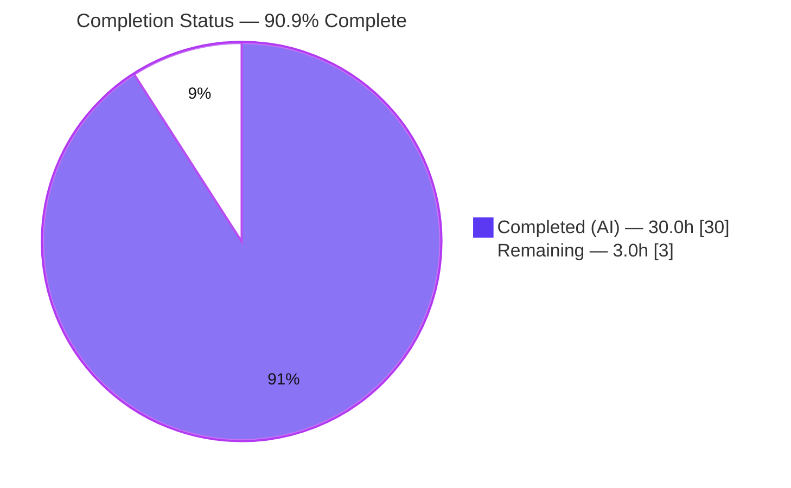
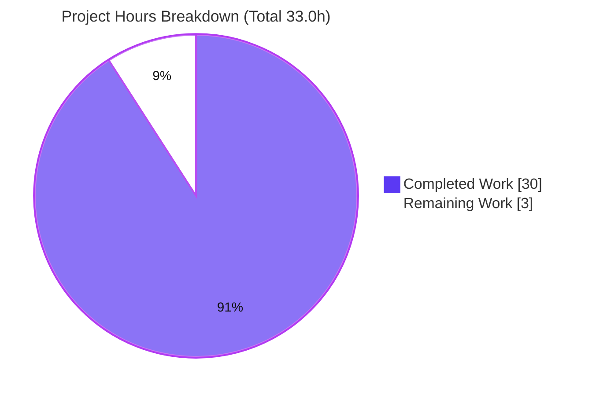
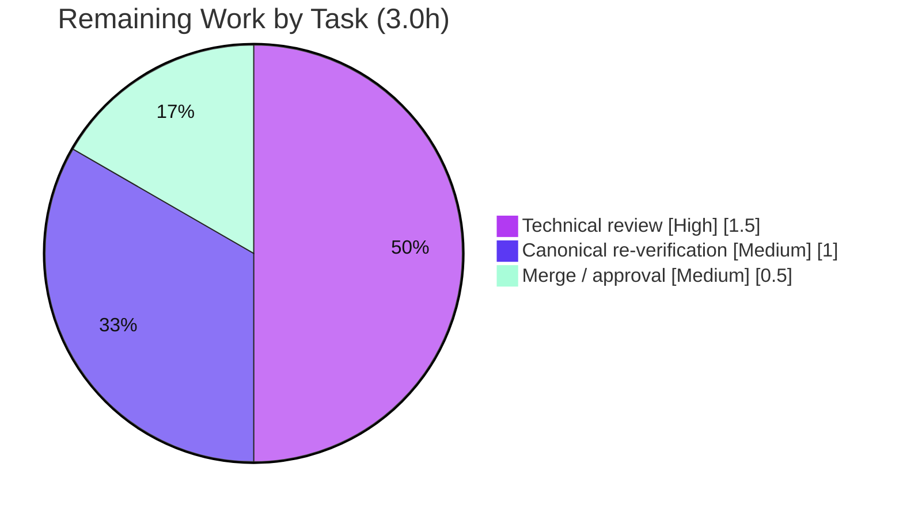

# Blitzy Project Guide

> **Project:** Scapy — IPv4 Field Representation & Encoding (runtime-grounded Q&A investigation)
> **Branch:** `blitzy-0c3735da-6b80-4c7e-8182-d5ca100ed4ef` · **Baseline:** `origin/scapy_0925ada48540` (`0925ada4`) · **HEAD:** `396523bf`
> **Task type:** Documentation — SWE-Atlas code-investigation Q&A (read-only source)

---

## 1. Executive Summary

### 1.1 Project Overview

This project is a runtime-grounded code-investigation Q&A against the **Scapy** interactive packet-manipulation library. The objective is to investigate — *by actually building and running the codebase* — how Scapy represents and encodes IPv4 protocol fields, and to capture the findings in a single new Markdown answer document. It answers four asks: (1) serialize an IPv4 packet and report its byte length and leading hex; (2) report the destination field's Python type; (3) show behavior for an invalid destination; and (4) trace the responsible field class, its wire-encode method, its validation, and its registry role. The target audience is engineers studying Scapy's field type system. Scope is **read-only**: exactly one document is written and no source file is changed.

### 1.2 Completion Status

The completion percentage is computed with the AAP-scoped hours methodology: **Completion % = Completed Hours ÷ (Completed + Remaining) × 100**, over AAP deliverables plus path-to-production (here, human review and merge). No out-of-scope work is counted.



| Metric | Value |
|--------|-------|
| **Total Project Hours** | **33.0 h** |
| **Completed Hours (AI + Manual)** | **30.0 h** (30.0 AI + 0.0 Manual) |
| **Remaining Hours** | **3.0 h** |
| **Completion** | **90.9%** |

> Formula: `30.0 ÷ (30.0 + 3.0) × 100 = 90.9%`. Completed work is coded in **Dark Blue `#5B39F3`**; remaining work in **White `#FFFFFF`**.

### 1.3 Key Accomplishments

- ✅ **Sole mandated deliverable created and committed:** `blitzy/documentation/scapy_0925ada48540.md` (1,114 lines), branch-named per the governing rule.
- ✅ **Ask 1** answered from observed bytes: `len(raw) == 20`, first bytes `4500001400014000`, full per-byte header parse, stable across 3 runs, `bytes(pkt) == raw(pkt)`.
- ✅ **Ask 2** answered: `type(pkt.dst)` is `str` (value `'192.0.2.1'`), grounded in `IPField.i2h`.
- ✅ **Ask 3** answered: five invalid destinations all raise `socket.gaierror` **at construction** (not serialization); permissive resolution-based validation explained with a 7-step construction chain.
- ✅ **Ask 4** answered: `IPField` (class), `IPField.i2m` (wire encode), `h2i`/`inet_aton` (validation), and registry participation via `Field`/`Field_metaclass` + `Packet_metaclass` owner-registration.
- ✅ **60+ `file:line` citations** verified exact at HEAD `0925ada4`; observed-vs-inferred and environment-dependent-vs-independent values labeled throughout.
- ✅ **Read-only guarantee upheld:** source/reference tree byte-for-byte unchanged; temporary observation scripts lived only under `/tmp` and were removed.
- ✅ **Validated in two environments** (canonical Docker image + host venv): UTScapy `test/fields.uts` = 138/138 pass; 7 assertion scripts pass; compilation clean.

### 1.4 Critical Unresolved Issues

| Issue | Impact | Owner | ETA |
|-------|--------|-------|-----|
| *None — no blocking issues* | No compilation errors, no failing/blocked tests, no missing deliverable content. All four asks answered and validated. | — | — |

> There are zero release-blocking issues. The only remaining items are the standard human review/verify/merge steps in §1.6 and §2.2.

### 1.5 Access Issues

| System/Resource | Type of Access | Issue Description | Resolution Status | Owner |
|-----------------|----------------|-------------------|-------------------|-------|
| `ghcr.io/scaleapi/swe-atlas:swe_atlas_QnA_secdev_scapy_1.0` (canonical Docker image) | Container registry pull | The canonical re-verification path (§2.2 item B) requires pulling the private image; the sandbox has no internet access, so a human with registry credentials must perform the canonical pull. | Low impact — **host-venv fallback is fully documented** (§9) and reproduces all environment-independent values. | Reviewer / DevOps |

> No repository-permission or source-credential issues. The IPv4 field path requires **no** external service credentials or API keys.

### 1.6 Recommended Next Steps

1. **[High]** Review `blitzy/documentation/scapy_0925ada48540.md`: confirm all four asks are answered and spot-check a sample of the `file:line` citations against source at HEAD `0925ada4`. *(≈1.5h)*
2. **[Medium]** Independently re-verify in the canonical Docker image: run the three documented one-liners and UTScapy `test/fields.uts` (expect 138 pass). *(≈1.0h)*
3. **[Medium]** Confirm the read-only guarantee (`git diff 0925ada4..HEAD` shows only the added document; working tree clean) and merge the branch. *(≈0.5h)*

---

## 2. Project Hours Breakdown

### 2.1 Completed Work Detail

Each component traces to an AAP requirement (the four asks, the deliverable, and the mandated methodology). All completed work was performed autonomously (AI); manual hours = 0.

| Component | Hours | Description |
|-----------|------:|-------------|
| Environment setup, runnable import & canonical version reporting | 2.0 | Establish in-tree Scapy import (`from scapy.all import IP`) in canonical image + host; report `scapy.VERSION` with exact invocation. |
| Ask 1 — serialize + length + hex | 4.0 | Build `IP(dst,ttl,flags)`, serialize via `raw()`/`bytes()`; capture `len==20` and `4500001400014000`; per-byte header parse; derived-vs-user-set analysis; serialization-lifecycle trace; 3-run stability. |
| Ask 2 — destination field Python type | 1.5 | Inspect `type(pkt.dst)` → `str`; ground in `IPField.i2h` and the i/m/h model. |
| Ask 3 — invalid-destination behavior | 4.0 | Exercise 5 invalid variants; capture exact `socket.gaierror` at construction; full traceback + 7-step construction chain; permissive/resolution-based validation semantics. |
| Ask 4 — field-class trace | 4.0 | Identify `IPField`; trace `i2m` (wire encode), `h2i`/`inet_aton` (validation), registry via `Field`/`Field_metaclass`/`Packet_metaclass`; MRO, `.owners`, `struct` `!4s`, `fields_desc`=13. |
| Source tracing & citation verification (12 files, 60+ anchors) | 3.0 | Trace `scapy/fields.py`, `layers/inet.py`, `packet.py`, `base_classes.py`, `utils.py`, plus docs/tests; verify every `file:line` exact at HEAD `0925ada4`. |
| Environment-dependent vs -independent analysis + 14-row table | 1.5 | Classify each observed value (stable vs env-varying); build comparison table across canonical/host. |
| Answer-document authoring & structure (1,114 lines) | 5.0 | Methodology, environment, per-ask sections, coverage pass, cleanup guarantee; embed commands and full unedited output. |
| Web-search corroboration of i/m/h model & `*2*()` converters | 1.0 | Confirm the field-conversion model against official "Adding new protocols" docs (code as ground truth). |
| Two autonomous review/QA revision rounds | 3.0 | Code-review round (+451/-134) and QA round (+190/-36): evidence completeness, security hardening of scratch dir, self-containment. |
| Cleanup, read-only verification & commit hygiene | 1.0 | Remove `/tmp` scripts; verify `git status` clean and source unchanged; 3 well-formed commits. |
| **Total Completed** | **30.0** | **Sum of Completed Hours (matches §1.2).** |

### 2.2 Remaining Work Detail

Each category is path-to-production for a documentation deliverable (human review, verification, merge). There is **no** product code, CI, infrastructure, or deployment in scope.

| Category | Hours | Priority |
|----------|------:|----------|
| Human technical review of the answer document (4 asks + citation spot-check + label review) | 1.5 | High |
| Independent re-verification in the canonical Docker image (3 one-liners + UTScapy) | 1.0 | Medium |
| Branch merge / PR approval / read-only-guarantee confirmation | 0.5 | Medium |
| **Total Remaining** | **3.0** | **Matches §1.2 Remaining and §7 pie "Remaining Work".** |

> **Integrity:** §2.1 (30.0) + §2.2 (3.0) = **33.0 h** Total = §1.2 Total Project Hours.

---

## 3. Test Results

All tests below originate from Blitzy's autonomous validation logs for this project and were independently re-run during this assessment.

| Test Category | Framework | Total Tests | Passed | Failed | Coverage % | Notes |
|---------------|-----------|------------:|-------:|-------:|-----------:|-------|
| Field regression (Unit) | UTScapy (`.uts`) | 138 | 138 | 0 | Field-behavior suite (`test/fields.uts`) | Passed in **both** canonical image and host venv; runner EXIT=0 with `-N` fail-fast. Read-only reference suite — not extended by this task. |
| Observation assertions (Runtime) | Python `assert` scripts | 7 | 7 | 0 | 4 / 4 asks | Scripts extracted **verbatim** from the deliverable; each prints `ALL_ASSERTIONS_PASSED`, EXIT=0 in the canonical image. |
| **Total** | — | **145** | **145** | **0** | **100% pass** | Zero blocked/skipped tests. |

**Compilation (quality gate, not counted as tests):** `py_compile` of 6 core modules + `compileall scapy/` (331 files) completed with **zero errors** in both environments.

> **Integrity note:** No synthetic or hand-authored tests are included; every entry is drawn from Blitzy's autonomous test execution logs.

---

## 4. Runtime Validation & UI Verification

**Runtime health** — canonical entry points `IP(dst=...)` + `raw()`/`bytes()` exercised successfully in both environments:

- ✅ **Scapy import** — `from scapy.all import IP, raw` succeeds (canonical `scapy.VERSION 2.5.0.dev87`; host `2026.07.13`).
- ✅ **Ask 1 serialization** — `len(raw) == 20`, first bytes `4500001400014000`, `bytes(pkt) == raw(pkt)`; stable across 3 runs.
- ✅ **Ask 2 attribute inspection** — `type(pkt.dst)` is `str`, value `'192.0.2.1'`.
- ✅ **Ask 3 error path** — invalid destinations raise `socket.gaierror` at construction; a valid destination reaches serialization (20 bytes).
- ✅ **Ask 4 field trace** — resolved field `DestIPField` (⊂ `IPField`); `i2m('192.0.2.1')` → `c0000201`; `struct` `!4s`, size 4; `fields_desc` length 13.

**Environment-dependent values (correctly labeled in the deliverable):** `src`/`chksum` bytes (route-dependent), `scapy.VERSION`, interpreter build, `gaierror` errno/text, stdlib `socket.py` traceback line. **Environment-independent:** total length, first 8 bytes, `dst` bytes, `dst` type, error class/timing, MRO, `i2m` output.

**UI Verification:** ⚠️ **Not applicable** — the deliverable is a Markdown document and the subject is a Python library. There is no web/GUI surface to verify.

---

## 5. Compliance & Quality Review

AAP/governing-rule requirements mapped to Blitzy quality benchmarks. Fixes applied during autonomous validation are noted; zero corrections were required at final validation.

| Requirement (AAP / "SWE-AtlasQnA-Repo") | Benchmark | Status | Progress | Notes |
|------------------------------------------|-----------|--------|----------|-------|
| Deliverable location & branch-name (`blitzy/documentation/scapy_0925ada48540.md`) | Rule compliance | ✅ Pass | 100% | File present & committed. |
| Run-first methodology (build/run before writing) | Methodology | ✅ Pass | 100% | Commands + full output embedded per claim. |
| Canonical entry points only (`IP(dst=...)`, `raw()`/`bytes()`) | Methodology | ✅ Pass | 100% | No mocks/debug hooks/synthetic bytes. |
| Actual complete output + `file:line` for every claim | Evidence | ✅ Pass | 100% | 94 code fences; 60+ citations verified exact. |
| Observed-vs-inferred labeling | Evidence | ✅ Pass | 100% | Labels applied throughout. |
| Observe at scale/stability (≥2 runs) | Methodology | ✅ Pass | 100% | 3-run stability for Ask 1. |
| Exercise every condition (happy + error/edge) | Coverage | ✅ Pass | 100% | 5 invalid variants + valid path + state changes. |
| Answer every part + coverage pass | Coverage | ✅ Pass | 100% | Explicit coverage pass + named-mechanism checklist. |
| Version reporting discipline (canonical build value + exact cmd) | Rule compliance | ✅ Pass | 100% | `scapy.VERSION` mechanism (git-describe vs mtime) explained. |
| Environment-dependent vs -independent labeling | Evidence | ✅ Pass | 100% | 14-row comparison table. |
| Web-search corroboration (code as ground truth) | Research | ✅ Pass | 100% | i/m/h model & `*2*()` converters corroborated. |
| Read-only scope + temp-script cleanup | Rule compliance | ✅ Pass | 100% | Source byte-for-byte unchanged; scripts removed. |
| Compilation clean | Code quality | ✅ Pass | 100% | `py_compile` + `compileall` OK both envs. |
| Zero-placeholder / well-formed Markdown | Code quality | ✅ Pass | 100% | 0 TODO/FIXME/placeholder; balanced fences; ends with newline. |
| Human review & merge | Path-to-production | ⬜ Pending | 0% | Standard human gate (see §1.6, §2.2). |

**Fixes applied during autonomous validation:** the code-review round strengthened evidence completeness and self-containment; the QA round hardened the observation scratch directory (`mktemp -d` + symlink guard + guarded cleanup trap) and clarified security framing of the DNS-resolution path. No further corrections were required.

---

## 6. Risk Assessment

| Risk | Category | Severity | Probability | Mitigation | Status |
|------|----------|----------|-------------|------------|--------|
| Environment-dependent values (`src`/`chksum`, `VERSION`, `gaierror` text, socket line) may confuse a reader running outside the canonical image | Technical | Low | Low | 14-row environment table labels every value as env-dependent vs -independent | Mitigated |
| `file:line` citations pinned to HEAD `0925ada4` could drift if the source tree later advances | Technical | Low | Low | Doc states citations are valid at HEAD `0925ada4`; branch is pinned | Accepted / Mitigated |
| `scapy.VERSION` differs across environments (`2.5.0.dev87` git-describe vs `2026.07.13` mtime fallback) — could look inconsistent | Technical | Low | Low | Doc explains the git-describe-vs-mtime derivation and labels it env-dependent | Mitigated |
| Documented invalid-`dst` path performs DNS resolution (`getaddrinfo`) on unresolvable names | Security | Low (informational) | N/A | Library behavior being *documented*, not introduced; scripts used TEST-NET-1 (`192.0.2.1`) + clearly bogus names; scratch dir hardened (`mktemp -d`, symlink guard, guarded trap) | Addressed |
| Canonical re-verification requires pulling a private registry image | Integration | Low | Low | Host-venv run path fully documented (§9); reproduces all env-independent values | Mitigated |
| Operational (monitoring/logging/backup) | Operational | None | — | Static Markdown deliverable — nothing to run, operate, or monitor | N/A |
| External integrations / credentials | Integration | None | — | IPv4 field path is stdlib-only (`socket`, `struct`); no services/APIs/keys | N/A |

> **Overall posture: LOW.** A read-only documentation task with a provably-unchanged source tree, no new dependencies, and no secrets carries minimal risk.

---

## 7. Visual Project Status

**Project hours — Completed vs Remaining** (Completed = Dark Blue `#5B39F3`, Remaining = White `#FFFFFF`):



**Remaining 3.0 h by task/priority:**



| Remaining Category | Hours | Priority |
|--------------------|------:|----------|
| Technical review | 1.5 | High |
| Canonical re-verification | 1.0 | Medium |
| Merge / approval | 0.5 | Medium |
| **Total** | **3.0** | — |

> **Integrity:** "Remaining Work" = **3.0 h** here = §1.2 Remaining = §2.2 total. "Completed Work" = **30.0 h** = §2.1 total.

---

## 8. Summary & Recommendations

**Achievements.** The single mandated deliverable — `blitzy/documentation/scapy_0925ada48540.md` — is complete and comprehensively answers all four asks from *observed* runtime behavior, with embedded commands, full unedited output, 60+ exact `file:line` citations, observed-vs-inferred labels, environment-dependent-vs-independent classification, multi-run stability, and a closing coverage pass. Every claim was validated in two environments and independently reproduced during this assessment. The read-only guarantee holds: the source/reference tree is byte-for-byte unchanged versus baseline `0925ada4`.

**Remaining gaps.** None in the deliverable itself. The outstanding **3.0 h** is the standard human path-to-production for a documentation artifact: technical review, an optional independent re-verification in the canonical image, and merge. There is no product code, CI, infrastructure, or deployment in scope.

**Critical path to production.** (1) Technical review → (2) canonical re-verification → (3) merge. No item is blocked.

**Success metrics.** Deliverable exists and is committed ✅ · four asks answered ✅ · UTScapy 138/138 ✅ · 7/7 assertion scripts ✅ · compilation clean ✅ · citations exact ✅ · source unchanged ✅.

**Production-readiness assessment.** The project is **90.9% complete** (30.0 h of 33.0 h). It is **ready for human review and merge**; the residual 9.1% is human verification/merge effort, not engineering rework.

| Dimension | Assessment |
|-----------|------------|
| Deliverable completeness | Complete (all 4 asks + coverage pass) |
| Validation depth | High (dual-environment, 145 tests, independent re-run) |
| Risk posture | Low |
| Confidence | High (well-defined scope, verified values) |
| Recommendation | **Approve after review & merge** |

---

## 9. Development Guide

Scapy is a pure-Python library; the IPv4 field path exercised here uses only the standard library (`socket`, `struct`) — **no dependency installation is required**. All commands below were tested and produce the shown output.

### 9.1 System Prerequisites

- **Python** `>=3.7, <4` (AAP canonical: **3.11**; canonical image ships CPython **3.11.13**; host venv used here is CPython **3.13.7**).
- **git** (for read-only-guarantee verification).
- **Docker** (optional — only for the canonical-image run path; verified `Docker 28.5.2`).
- Pure Python — **no C extensions** to compile.

### 9.2 Environment Setup

**Path A — Host venv (in-tree checkout).** Run from the repository root; put the repo on `PYTHONPATH` so the in-tree Scapy is imported:

```bash
cd /path/to/repo                 # repository root (contains scapy/, run_scapy)
python3 -m venv .venv            # if not already present
source .venv/bin/activate
export PYTHONPATH="$PWD"         # import the in-tree scapy, not a site-packages copy
```

**Path B — Canonical Docker image** (requires registry access; see §1.5):

```bash
docker run --rm -w /app --entrypoint python \
  ghcr.io/scaleapi/swe-atlas:swe_atlas_QnA_secdev_scapy_1.0 \
  -c "from scapy.all import IP, raw; print(len(raw(IP(dst='192.0.2.1',ttl=64,flags='DF'))))"
# expected: 20
```

### 9.3 Dependency Installation

None required for the IPv4 field path (stdlib-only). Scapy runs directly from the in-tree checkout. *(If you ever install packages on this Ubuntu system Python, note PEP 668: use a venv, or pass `--break-system-packages`.)*

### 9.4 Application Startup / Usage

Scapy is a **library, not a service** — there is no server to start and no port to bind. "Running" means importing Scapy and exercising the code paths, via any of:

```bash
# In-tree REPL entry point:
./run_scapy

# Or a one-off import check (host venv, from repo root with PYTHONPATH set):
PYTHONPATH="$PWD" .venv/bin/python -c "import scapy; from scapy.all import IP; print('scapy.VERSION =', scapy.VERSION)"
# expected (host): scapy.VERSION = 2026.07.13   (canonical image: 2.5.0.dev87)
```

> A benign `CryptographyDeprecationWarning` (TripleDES) may print on `import scapy.all`; it is off the IPv4 field path and can be ignored (suppress with `2>/dev/null`).

### 9.5 Verification Steps

**All four asks in one command** (host venv, from repo root):

```bash
PYTHONPATH="$PWD" .venv/bin/python - <<'PY' 2>/dev/null
from scapy.all import IP, raw
r = raw(IP(dst='192.0.2.1', ttl=64, flags='DF'))
print('Ask1: len =', len(r), '| first8 =', r[:8].hex())        # 20 | 4500001400014000
p = IP(dst='192.0.2.1')
print('Ask2: type(pkt.dst) =', type(p.dst).__name__, repr(p.dst))  # str '192.0.2.1'
try:
    IP(dst='999.999.999.999')
except Exception as e:
    print('Ask3:', type(e).__module__ + '.' + type(e).__name__, 'at construction')  # socket.gaierror
f = IP().get_field('dst'); real = getattr(f, 'fld', f)
print('Ask4: field =', type(real).__name__, '| i2m =', real.i2m(None, '192.0.2.1').hex(), '| fmt =', real.fmt)
PY
```

Expected output:

```
Ask1: len = 20 | first8 = 4500001400014000
Ask2: type(pkt.dst) = str '192.0.2.1'
Ask3: socket.gaierror at construction
Ask4: field = DestIPField | i2m = c0000201 | fmt = !4s
```

**Field regression suite** (expect 138 pass / 0 fail, EXIT=0):

```bash
PYTHONPATH="$PWD" .venv/bin/python -m scapy.tools.UTscapy -t test/fields.uts -f text -N
```

**Read-only guarantee** (source unchanged; only the doc added; tree clean):

```bash
git diff --name-status 0925ada4 -- scapy/ README.md run_scapy pyproject.toml setup.py doc/ test/   # (empty)
git diff --name-status 0925ada4 -- blitzy/                                                          # A blitzy/documentation/scapy_0925ada48540.md
git status --porcelain                                                                              # (empty)
```

### 9.6 Example Usage (per ask)

```bash
# Ask 1 — serialize & measure
PYTHONPATH="$PWD" .venv/bin/python -c "from scapy.all import IP, raw; r=raw(IP(dst='192.0.2.1',ttl=64,flags='DF')); print(len(r), r[:8].hex(), r.hex())" 2>/dev/null
# -> 20 4500001400014000 45000014000140004000....c0000201  (src/chksum are environment-dependent)

# Ask 3 — full invalid-destination traceback (observe socket.gaierror at construction)
PYTHONPATH="$PWD" .venv/bin/python -c "from scapy.all import IP; IP(dst='999.999.999.999')"
```

### 9.7 Troubleshooting

| Symptom | Cause | Resolution |
|---------|-------|------------|
| `ModuleNotFoundError: No module named 'scapy'` | In-tree package not on path | `export PYTHONPATH="$PWD"` from the repo root (or use `./run_scapy`). |
| `CryptographyDeprecationWarning: ... TripleDES` on import | `cryptography` emits a benign warning; off the IPv4 path | Ignore, or append `2>/dev/null`. |
| `scapy.VERSION` differs (`2.5.0.dev87` vs `2026.07.13`) | git-describe (tagged image) vs mtime fallback (tagless clone) | Expected & documented; environment-dependent. |
| `src`/`chksum` bytes differ from the doc's canonical hex | Auto-resolved source address is route-dependent | Expected; the first 8 bytes and `dst` bytes are environment-independent. |
| `error: externally-managed-environment` on `pip install` | Ubuntu PEP 668 system Python | Use a venv, or `pip install --break-system-packages` (not needed for this task). |
| UTScapy shows a "failed" token in HTML output | It is the "Expand Failed" UI control, not a test failure | Trust runner exit code (`-N` → EXIT=0 means all passed). |

---

## 10. Appendices

### Appendix A — Command Reference

| Purpose | Command |
|---------|---------|
| Import check | `PYTHONPATH="$PWD" .venv/bin/python -c "import scapy; print(scapy.VERSION)"` |
| Ask 1 (len + hex) | `... -c "from scapy.all import IP, raw; r=raw(IP(dst='192.0.2.1',ttl=64,flags='DF')); print(len(r), r[:8].hex())"` |
| Ask 2 (type) | `... -c "from scapy.all import IP; p=IP(dst='192.0.2.1'); print(type(p.dst).__name__, repr(p.dst))"` |
| Ask 3 (error) | `... -c "from scapy.all import IP; IP(dst='999.999.999.999')"` |
| Ask 4 (field) | `... -c "from scapy.all import IP; f=IP().get_field('dst'); r=getattr(f,'fld',f); print(type(r).__name__, r.i2m(None,'192.0.2.1').hex(), r.fmt)"` |
| Field tests | `PYTHONPATH="$PWD" .venv/bin/python -m scapy.tools.UTscapy -t test/fields.uts -f text -N` |
| REPL | `./run_scapy` |
| Read-only check | `git diff --name-status 0925ada4 -- scapy/ doc/ test/ README.md` |

### Appendix B — Port Reference

**Not applicable.** Scapy here is used as a library and the investigation binds **no listening ports**. (The invalid-`dst` demonstration calls `socket.getaddrinfo` for name resolution but opens no server socket.)

### Appendix C — Key File Locations

| Path | Role |
|------|------|
| `blitzy/documentation/scapy_0925ada48540.md` | **The deliverable** (only file added) |
| `scapy/fields.py` | `IPField` (L796), `i2m` (L830-834), `h2i` (L801-812), `i2h` (L814-816), base `Field` (L139) |
| `scapy/layers/inet.py` | `IP` layer, `fields_desc` (L524-537), `DestIPField` (L503) |
| `scapy/packet.py` | `build`/`self_build`/`post_build` lifecycle; `__init__` field assignment (L189) |
| `scapy/base_classes.py` | `Packet_metaclass`, `Field_metaclass`, `Net` resolver (L125) |
| `scapy/utils.py` | `inet_aton`/`inet_ntoa` (L621-634) |
| `test/fields.uts` | UTScapy field regression suite (138 tests) |
| `run_scapy` | In-tree REPL entry point |

### Appendix D — Technology Versions

| Component | Canonical (Docker image) | Host (this assessment) |
|-----------|--------------------------|------------------------|
| Python (CPython) | 3.11.13 | 3.13.7 |
| `scapy.VERSION` | 2.5.0.dev87 (git-describe) | 2026.07.13 (mtime fallback) |
| Scapy source | in-tree at HEAD `0925ada4` | same checkout |
| Docker | — | 28.5.2 |
| Supported Python (AAP) | `>=3.7, <4` (canonical 3.11) | — |

### Appendix E — Environment Variable Reference

| Variable | Purpose | Notes |
|----------|---------|-------|
| `PYTHONPATH` | Point to the repo root so the in-tree Scapy is imported | `export PYTHONPATH="$PWD"` from repo root |
| `PYTHON` | Interpreter used by `./run_scapy` | Optional; defaults to `python3` |

> No secrets, API keys, or service credentials are required by this task.

### Appendix F — Developer Tools Guide

| Tool | Use in this project |
|------|---------------------|
| `git` | Verify read-only guarantee (`git diff --name-status 0925ada4`, `git status --porcelain`) and authorship (`git log --author=agent@blitzy.com`). |
| UTScapy (`scapy.tools.UTscapy`) | Run `.uts` field regression suite; `-N` fail-fast, `-f text`/`-f html`. |
| `py_compile` / `compileall` | Static compile check of the Scapy package. |
| Docker | Reproduce values in the canonical image (§9.2 Path B). |

### Appendix G — Glossary

| Term | Meaning |
|------|---------|
| **`raw(pkt)` / `bytes(pkt)`** | Serialize a packet to its on-the-wire bytes via `Packet.build()`. |
| **i / m / h model** | Scapy field representations: internal, machine (on-the-wire), human. |
| **`h2i` / `i2h` / `i2m` / `m2i` / `any2i`** | Field converter methods between representations; `i2m` = internal→wire bytes. |
| **`IPField`** | The field class for IPv4 addresses (`scapy/fields.py:796`). |
| **`DestIPField`** | `dst` binding on `IP`; MRO `DestIPField → IPField → DestField → Field → Generic → object`. |
| **`fields_desc`** | Ordered list of a layer's field instances (`IP` has 13). |
| **`Packet_metaclass` / `Field_metaclass`** | Metaclasses; the former registers field owners over `fields_desc`. |
| **`Net`** | Hostname/network resolver used on the invalid-`dst` fallback path. |
| **`inet_aton`** | stdlib `socket` function converting a dotted-quad to 4 packed bytes. |
| **`socket.gaierror`** | DNS resolution error (subclass of `OSError`) raised for an unresolvable invalid destination at construction. |
| **DF flag** | IPv4 "Don't Fragment" bit; `flags="DF"` sets the word `0x4000`. |
| **TEST-NET-1** | Documentation-reserved range (`192.0.2.0/24`); `192.0.2.1` used as a safe example. |

---

*Generated by the Blitzy Platform. Completion is measured against AAP-scoped and path-to-production work only. Completed = Dark Blue `#5B39F3`; Remaining = White `#FFFFFF`.*