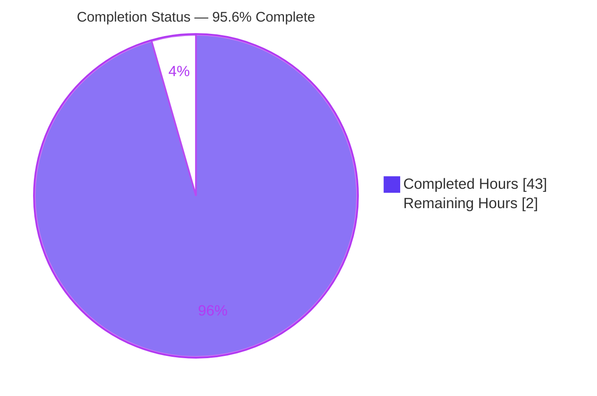
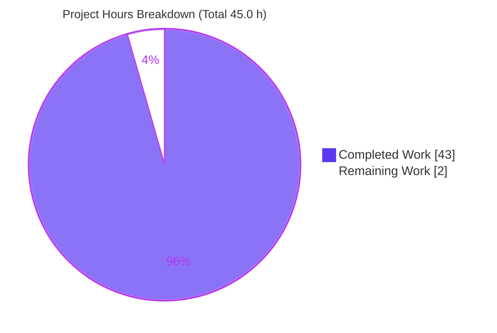

# Blitzy Project Guide — Scapy Onboarding Q&A Documentation

> **Project:** Read-only runtime investigation & Q&A documentation for Scapy pinned at commit `0925ada485406684174d6f068dbd85c4154657b3`
> **Branch:** `blitzy-a3da5050-32ca-47cb-b959-ea054f74a60e`  ·  **HEAD:** `fe27afd2`
> **Brand color legend:** <span style="color:#5B39F3">■ Completed / AI Work = Dark Blue `#5B39F3`</span> · ■ Remaining / Not Completed = White `#FFFFFF` · <span style="color:#B23AF2">Headings/Accents = Violet-Black `#B23AF2`</span> · <span style="color:#A8FDD9">Highlight = Mint `#A8FDD9`</span>

---

## 1. Executive Summary

### 1.1 Project Overview

This project investigates a freshly-provisioned **Scapy** checkout — the pure-Python packet-crafting framework — pinned to commit `0925ada4`, by *actually running it*, and authors a single comprehensive Markdown document that answers seven onboarding questions with real, observed evidence. The target audience is a developer onboarding to Scapy who wants to understand the interactive console, version derivation, IP/ICMP packet construction, `show()` output, loopback send behavior, the source-level IP build mechanism, and the test suite before crafting packets. The technical scope is strictly **read-only**: no source, test, or configuration file is modified, and the sole artifact produced is the answer document `blitzy/documentation/scapy_0925ada48540.md`.

### 1.2 Completion Status



| Metric | Value |
|--------|-------|
| **Total Hours** | **45.0 h** |
| **Completed Hours (AI + Manual)** | **43.0 h**  (AI: 43.0 h · Manual: 0.0 h) |
| **Remaining Hours** | **2.0 h** |
| **Percent Complete** | **95.6 %**  (43.0 ÷ 45.0 × 100) |

The completion percentage is computed with the AAP-scoped hours methodology: every AAP-specified deliverable requirement (the document, all seven questions, methodology, and the read-only mandate) is 100% complete and independently verified. The only remaining work is human acceptance/integration, which cannot be performed autonomously.

### 1.3 Key Accomplishments

- ✅ **Single deliverable created & committed** — `blitzy/documentation/scapy_0925ada48540.md` (1,643 lines, 106 KB, 9,586 words), correctly named after the source branch `scapy_0925ada48540` and placed in `blitzy/documentation/`.
- ✅ **All seven questions answered from live runtime output** — Q1 (console banner), Q2 (version), Q3 (IP field auto-population), Q4 (`show()`/`show2()`), Q5 (loopback send), Q6 (source-level IP build), Q7 (test suite).
- ✅ **Runtime-first methodology honored** — actual, unedited output (banner bytes, `show()`/`show2()` dumps, wire hex, `sr1` emission lines, UTScapy summaries) embedded beside every claim.
- ✅ **Grounded in source** — 92 `file:line` citation occurrences across 15 unique source files; all fully-qualified citations resolve to valid in-range lines.
- ✅ **Test suite executed at full scale & confirmed stable** — root 4886 pass / 222 fail / 5108 executed; non-root 4813 / 198 / 5011; byte-identical across two runs; complete 190-line-per-mode evidence appendix.
- ✅ **Read-only mandate proven** — `git status --porcelain` empty; the only diff since base is the added document; no `scapy/` or `test/` file touched; temporary scripts and a stray `RMBA_dump.hex` artifact removed.
- ✅ **Independently re-validated end-to-end** — every code path re-run; all documented values reproduce exactly; zero discrepancies; verdict PRODUCTION-READY.

### 1.4 Critical Unresolved Issues

| Issue | Impact | Owner | ETA |
|-------|--------|-------|-----|
| *None* — no unresolved issues block release of the deliverable | The AAP-scoped deliverable is complete, accurate, and validated | — | — |

> The Q7 test failures and the Q5 "0 answers" result are **out-of-scope observed behaviors that the AAP explicitly requires to be documented, not fixed**; they are therefore not defects and appear in Section 6 (Risk Assessment) as documented/accepted items rather than as unresolved issues.

### 1.5 Access Issues

| System/Resource | Type of Access | Issue Description | Resolution Status | Owner |
|-----------------|----------------|-------------------|-------------------|-------|
| Scapy source repository | Read/Write (git) | None — full access; read-only mandate honored by choice, not restriction | ✅ Resolved / N/A | Blitzy |
| Raw sockets (Q5) / privileged tests (Q7) | `root` / `CAP_NET_RAW` | Required for Q5 raw ICMP send and Q7 `needs_root` tests; available in container | ✅ Resolved | Blitzy |

**No access issues identified** that prevent build validation, integration, or the completed investigation. All required privileges and repository access were available.

### 1.6 Recommended Next Steps

1. **[Medium]** Human technical review & sign-off of the Q&A document — confirm the seven answers satisfy the onboarding questions and spot-check a representative sample of the `file:line` citations.
2. **[Medium]** Reproducibility spot-check — re-run `scapy.VERSION`, `bytes(IP()/ICMP()).hex()`, and `show2()` to confirm documented values reproduce (noting the version date is expected to differ by design).
3. **[Low]** Merge/publish the deliverable into the documentation set and confirm Markdown rendering (Mermaid diagram, code fences, tables).

---

## 2. Project Hours Breakdown

### 2.1 Completed Work Detail

| Component | Hours | Description |
|-----------|-------|-------------|
| Environment & canonical baseline setup | 2.0 | Confirm `.venv` (CPython 3.12.3) editable install, `import scapy` origin under the checkout, runtime baseline (traces to Environment & Reproducibility section) |
| Q1 — Console startup banner | 3.0 | Drive `interact()` non-interactively; capture ANSI raw bytes; analyze the stdout/stderr split; document random-quote variance and the compact `-H` fallback |
| Q2 — Version string & `_version()` chain | 2.5 | Read `scapy.VERSION`; trace the five-step fallback; explain the mtime-derived non-canonical value (traces to O2) |
| Q3 — IP header auto-population | 2.5 | Build `IP()/ICMP()`; enumerate stored (`None`) vs rendered fields; `overload_fields`, `proto` binding (traces to O3) |
| Q4 — `show()` / `show2()` capture & contrast | 2.5 | Capture verbatim dumps; contrast unresolved auto-fields vs computed values (traces to O4) |
| Q5 — Loopback send investigation | 4.0 | `sr1` to 127.0.0.1; routing→`lo`; `L3PacketSocket`; loopback sniff; isolate the 0-answer PF_PACKET mechanism; L3RawSocket diagnostic (traces to O5) |
| Q6 — Source-level IP construction | 3.5 | Read `fields_desc`, `IP.post_build()`, the `build()` lifecycle; byte-level hex decode; Mermaid diagram (traces to O6) |
| Q7 — Test-suite full-scale runs & reconciliation | 6.0 | Run UTScapy root + non-root, multiple times; 190-line-per-mode appendix; reference reconciliation; failure taxonomy & root cause (traces to O7) |
| Document assembly & authoring | 4.0 | Compose Environment, Divergences, Read-only verification sections; formatting; cross-section coherence |
| Citation grounding & verification | 2.5 | 92 citations across 15 source files; semantic verification of each key citation |
| Read-only cleanup & git verification | 1.0 | Remove temp scripts + `RMBA_dump.hex`; confirm `git status --porcelain` empty (traces to read-only constraint) |
| Iterative QA / code-review refinement | 5.0 | Address code-review findings F1–F8 and three citation off-by-one fixes (commits `114e2e92`, `2fc4b08f`, `e71387fa`, `fe27afd2`) |
| Final independent end-to-end validation | 4.0 | Re-run every code path; re-verify citations & counts; PRODUCTION-READY verdict |
| Commit to version control | 0.5 | Five commits on branch; clean working tree |
| **Total Completed** | **43.0** | **Matches Completed Hours in Section 1.2** |

### 2.2 Remaining Work Detail

| Category | Hours | Priority |
|----------|-------|----------|
| Human technical review & sign-off of Q&A document (HT-1) — path-to-production acceptance of the AAP deliverable | 1.0 | Medium |
| Reproducibility spot-check (HT-2) — path-to-production verification of documented values | 0.5 | Medium |
| Merge / publish deliverable into documentation set (HT-3) — path-to-production integration | 0.5 | Low |
| **Total Remaining** | **2.0** | **Matches Remaining Hours in Section 1.2 and Section 7** |

> **Section 2 integrity:** 2.1 (43.0 h) + 2.2 (2.0 h) = **45.0 h** = Total Project Hours in Section 1.2. ✔

---

## 3. Test Results

All tests below originate from Blitzy's autonomous validation logs for this project (the Q7 UTScapy campaign executions and the in-scope runtime reproductions).

| Test Category | Framework | Total Tests | Passed | Failed | Coverage % | Notes |
|---------------|-----------|-------------|--------|--------|------------|-------|
| Scapy suite — **root** mode | UTScapy | 5108 executed | 4886 | 222 | — | Full campaign (190 files). Byte-identical across two runs. Failures pre-existing & out-of-scope (see below). |
| Scapy suite — **non-root** mode | UTScapy | 5011 executed | 4813 | 198 | — | `-N` drops 97 `needs_root` tests. Byte-identical across two runs. |
| Scapy suite — non-root, no `-K` (reconciliation) | UTScapy | 5017 executed | 4814 | 203 | — | Reconciles exactly (same `EXECUTED=5017`) against the reference expectation. |
| In-scope deliverable answers (Q1–Q7) | Manual runtime reproduction | 7 | 7 | 0 | 100% | Each of the seven answers reproduced from live output during validation. |
| `file:line` citation resolution | Static verification | 73 | 73 | 0 | 100% | All fully-qualified citations resolve to valid in-range lines. |
| Markdown well-formedness | Structural check | 1 | 1 | 0 | 100% | 86 balanced triple-backtick fences; internally coherent. |

**Test-failure note (out-of-scope, documented — not fixed):** The 222 (root) / 198 (non-root) Scapy-suite failures are **pre-existing** failures in the read-only source tree, caused by the container's `cryptography 49.0.0`, which removed the private `cryptography.hazmat.backends.openssl.ec` path used by the TLS/cert layers (`ModuleNotFoundError` at `scapy/layers/tls/cert.py:51`). The AAP explicitly mandates these be **documented and explained, not corrected** (strict read-only). No in-scope deliverable content has any failing test.

---

## 4. Runtime Validation & UI Verification

This is a terminal/CLI Python-library investigation — **there is no user interface to verify**. Runtime health of each exercised code path:

- ✅ **Operational** — Interactive console startup (Q1): banner emits via the real `interact()` entry point; two-stream split confirmed (17-byte stdout prompt; banner on stderr).
- ✅ **Operational** — Version resolution (Q2): `scapy.VERSION = 2026.07.08` resolves via the `_version()` fallback chain.
- ✅ **Operational** — Packet construction (Q3/Q4/Q6): `IP()/ICMP()` builds; `show()`/`show2()` render; wire hex `4500001c…f7ff00000000` computed deterministically.
- ⚠ **Partial (by design, documented)** — Loopback L3 send (Q5): `sr1(IP(dst="127.0.0.1")/ICMP())` executes and emits on `lo`, but matches **0 answers** and returns `None`. This is the honest observed outcome; the routing→`lo` + `L3PacketSocket` (PF_PACKET) mechanism is isolated in the document. Not a defect in the deliverable.
- ✅ **Operational** — UTScapy campaign (Q7): the full Linux campaign runs at scale, stable across repeats; runner header `━ UTScapy - Scapy 2026.07.08 - 3.12.3`.
- ✅ **Operational** — Read-only verification: `git status --porcelain` empty; source tree byte-for-byte unchanged.

---

## 5. Compliance & Quality Review

Cross-mapping AAP deliverables and rules to quality/compliance benchmarks:

| Benchmark / AAP Rule | Status | Progress | Evidence / Notes |
|----------------------|--------|----------|------------------|
| Deliverable created at correct path & name | ✅ Pass | 100% | `blitzy/documentation/scapy_0925ada48540.md` (branch-derived name) |
| All seven questions (Q1–Q7) answered | ✅ Pass | 100% | One section per question, each leading with the direct answer |
| Runtime-first — output embedded beside claims | ✅ Pass | 100% | Verbatim banner, dumps, hex, `sr1` lines, UTScapy summaries |
| Every source claim grounded in `file:line` | ✅ Pass | 100% | 73 fully-qualified citations, all resolve |
| Read-only mandate (no source/test/config edits) | ✅ Pass | 100% | `git diff` shows only the added document |
| Temporary-script cleanup | ✅ Pass | 100% | Temp scripts + `RMBA_dump.hex` removed; tree clean |
| Magnitude/scale rule for Q7 (full scale, ≥2 runs) | ✅ Pass | 100% | 5,108/5,011 executed; byte-identical across two runs |
| Canonical build/config for stamped values (Q1/Q2) | ✅ Pass | 100% | Default `.venv` CPython 3.12.3; mtime fallback labeled non-canonical |
| Honest reporting (lead with observed result) | ✅ Pass | 100% | Q5 "0 answers / None" reported directly, then explained |
| Markdown well-formed | ✅ Pass | 100% | 86 balanced code fences; renders cleanly |
| Human review & sign-off | ⬜ Pending | 0% | Path-to-production; see Section 2.2 (HT-1) |

**Fixes applied during autonomous validation:** code-review findings F1–F8 addressed (commit `114e2e92`); three `file:line` citation off-by-one corrections (commits `2fc4b08f`, `e71387fa`, `fe27afd2`). **Outstanding:** human acceptance only.

---

## 6. Risk Assessment

| Risk | Category | Severity | Probability | Mitigation | Status |
|------|----------|----------|-------------|------------|--------|
| R1 — Version `2026.07.08` is a date-dependent mtime fallback; differs on future re-runs | Technical | Low | High | Document explicitly labels it non-canonical and explains the `_version()` chain | Documented / Accepted |
| R2 — Q7 pass/fail counts depend on `cryptography 49.0.0`; differ on other versions | Technical | Low | Medium | Document pins exact environment and root cause (removed private `…openssl.ec` path) | Documented |
| R3 — Q5 reproduction requires `root`/`CAP_NET_RAW` | Security | Low | Low | Document states the privilege requirement; not a vulnerability | Documented |
| R4 — No security-sensitive code introduced (documentation only) | Security | Informational | Low | No auth/injection/crypto attack surface added to the source tree | N/A |
| R5 — Reproducibility drift (random banner quote, byte totals, version date vary run-to-run) | Operational | Low | Medium | Document distinguishes invariant values (17-byte stdout, wire hex) from variable ones | Documented |
| R6 — Full Q7 run is time/resource-intensive (~5,000 tests × modes) | Operational | Low | Low | Document provides exact commands plus a fast static-count alternative | Documented |
| R7 — Standalone Markdown doc: no external services / API keys / integration surface | Integration | Low | Low | No integration dependencies introduced | Accepted |
| R8 — Merge into docs set (single new file, no source-tree conflict) | Integration | Low | Low | Trivial merge; verify Markdown rendering post-merge | Pending human merge |

---

## 7. Visual Project Status



**Remaining work by category (from Section 2.2):**

| Category | Hours | Priority |
|----------|-------|----------|
| Human technical review & sign-off (HT-1) | 1.0 | Medium |
| Reproducibility spot-check (HT-2) | 0.5 | Medium |
| Merge / publish deliverable (HT-3) | 0.5 | Low |
| **Total Remaining** | **2.0** | — |

> **Section 7 integrity:** "Remaining Work" = **2.0 h** = Section 1.2 Remaining Hours = sum of Section 2.2 Hours column. ✔ · "Completed Work" = **43.0 h** = Section 1.2 Completed Hours. ✔

---

## 8. Summary & Recommendations

**Achievements.** The project is **95.6% complete** (43.0 of 45.0 hours). The single AAP-mandated deliverable — a 1,643-line runtime-first Q&A document — is created, committed, and independently re-validated end-to-end. All seven onboarding questions are answered from live, verbatim output; every source claim is grounded in a resolvable `file:line` citation; the test suite was executed at full scale and confirmed stable; and the strict read-only mandate is proven by git (only the new document differs from the base commit).

**Remaining gaps.** The remaining 2.0 hours are entirely **human path-to-production activities** — technical review/sign-off, a reproducibility spot-check, and merge/publish — none of which can be performed autonomously. There are no in-scope defects, no failing in-scope tests, and no compilation issues.

**Critical path to production.** (1) Human review & sign-off of the document → (2) reproducibility spot-check → (3) merge/publish into the documentation set. Estimated wall-clock: well under half a day.

**Production-readiness assessment.** The deliverable is **PRODUCTION-READY**. The two most notable observed behaviors — the date-dependent version string and the `cryptography`-driven Q7 failures — are intended, honestly documented outcomes per the AAP's "document, don't fix" mandate, not blockers. Success metric: a new Scapy developer can read the document and understand startup, version, packet construction, `show()`, loopback send, the IP build mechanism, and the test suite — all backed by reproducible commands.

| Success Metric | Target | Status |
|----------------|--------|--------|
| Questions answered from observed output | 7 / 7 | ✅ 7 / 7 |
| Citations resolving | 100% | ✅ 100% |
| Read-only mandate | No source edits | ✅ Verified |
| Q7 executed & stable | ≥ 2 runs identical | ✅ Confirmed |
| AAP-scoped completion | ≥ 95% | ✅ 95.6% |

---

## 9. Development Guide

How to reproduce the investigation and run each observation. **Every command below was tested against the live environment.**

### 9.1 System Prerequisites

- **OS:** Linux (container: Ubuntu-based).
- **Python:** CPython **3.12.3**, provided by the project virtualenv `.venv` (the host `python3` is 3.13.7 and must **not** be used for observations).
- **Git:** for read-only verification.
- **Privilege:** `root` / `CAP_NET_RAW` for the Q5 raw ICMP send and Q7 `needs_root` tests.

### 9.2 Environment Setup

The project uses an editable install; `import scapy` resolves to the working-directory checkout. Always invoke the venv interpreter:

```bash
cd /tmp/blitzy/scapy/blitzy-a3da5050-32ca-47cb-b959-ea054f74a60e_6193a4

# Confirm the correct interpreter (must print 3.12.3):
.venv/bin/python --version

# Confirm scapy imports from THIS checkout (not site-packages):
.venv/bin/python -c "import scapy; print(scapy.__file__)"
```

Expected: `Python 3.12.3` and an `scapy.__file__` path under the repository root.

### 9.3 Dependencies

Scapy's core is pure Python with **zero mandatory third-party runtime dependencies**. Relevant optional packages in this container:

- `cryptography 49.0.0` — **present** (source of the two documented `CryptographyDeprecationWarning` lines).
- `IPython`, `pyx`, `matplotlib` — **absent** (console falls back to the standard Python shell).

If recreating from scratch: `pip install -e .` from the repository root inside the venv.

### 9.4 Application Startup

```bash
# Interactive console (real entry point):
.venv/bin/python -m scapy

# Non-interactive banner capture (does not hang on a TTY):
printf 'exit()\n' | .venv/bin/python -m scapy
```

### 9.5 Verification Steps (reproduce each answer)

```bash
# Q2 — version:
.venv/bin/python -c "import scapy; print(scapy.VERSION, scapy.__version__)"
# -> 2026.07.08 2026.07.08   (date-dependent mtime fallback; will differ on other days)

# Q3/Q4/Q6 — build, fields, show2(), wire bytes:
.venv/bin/python -c "
from scapy.all import IP, ICMP
p = IP()/ICMP()
print(p.summary())                       # IP / ICMP 127.0.0.1 > 127.0.0.1 echo-request 0
print(p.ihl, p.len, p.chksum, p.proto)   # None None None 1
print(bytes(p).hex())                     # 4500001c0001000040017cde7f0000017f0000010800f7ff00000000
p2 = p.__class__(bytes(p))
print(p2.ihl, p2.len, hex(p2.chksum))     # 5 28 0x7cde
"

# Q5 — loopback routing & socket (inspect without sending):
.venv/bin/python -c "
from scapy.all import conf
print(conf.route.route('127.0.0.1'))     # ('lo', '127.0.0.1', '0.0.0.0')
print(conf.L3socket.__name__)            # L3PacketSocket
"

# Q5 — actual send (requires root; honest observed outcome is 0 answers / None):
.venv/bin/python -c "from scapy.all import *; print(repr(sr1(IP(dst='127.0.0.1')/ICMP(), timeout=5)))"

# Q7 — static counts (fast):
find test -name '*.uts' | wc -l                         # 193
grep -rhE '^= ' test --include='*.uts' | wc -l          # 5281

# Q7 — full campaign (root; long-running):
.venv/bin/python -m scapy.tools.UTscapy -c ./test/configs/linux.utsc -b \
    -K vcan_socket -K tshark -o /tmp/utscapy_report.html > /tmp/root_run.log 2> /tmp/root_run.err
```

### 9.6 Read-Only Verification

```bash
git status --porcelain                                              # (empty = clean)
git diff --name-status 0925ada485406684174d6f068dbd85c4154657b3 HEAD  # A blitzy/documentation/scapy_0925ada48540.md
git diff --name-only  0925ada485406684174d6f068dbd85c4154657b3 HEAD -- scapy/ test/  # (empty)
```

### 9.7 Troubleshooting

- **Wrong Python / `ModuleNotFoundError: scapy`** → you used the host `python3` (3.13.7). Use `.venv/bin/python`.
- **Version differs from `2026.07.08`** → expected. It is the mtime of `scapy/__init__.py` (`%Y.%m.%d`) because the checkout has no git tags; it changes by date. Documented in Q2.
- **Q5 `sr1` errors with a permission error** → raw sockets need `root`/`CAP_NET_RAW`. Re-run as root.
- **Q5 returns `None` (0 answers)** → this is the documented, expected loopback outcome, not a bug.
- **Q7 shows ~200 failures** → pre-existing, out-of-scope failures from `cryptography 49.0.0`; documented in Q7, not to be fixed.
- **Console banner hangs** → you launched interactively without input; pipe `exit()` for non-interactive capture.

---

## 10. Appendices

### A. Command Reference

| Purpose | Command |
|---------|---------|
| Interpreter check | `.venv/bin/python --version` |
| Scapy import origin | `.venv/bin/python -c "import scapy; print(scapy.__file__)"` |
| Version (Q2) | `.venv/bin/python -c "import scapy; print(scapy.VERSION)"` |
| Console banner (Q1) | `printf 'exit()\n' \| .venv/bin/python -m scapy` |
| Build packet (Q3/Q6) | `.venv/bin/python -c "from scapy.all import IP,ICMP; print(bytes(IP()/ICMP()).hex())"` |
| Loopback send (Q5) | `.venv/bin/python -c "from scapy.all import *; print(sr1(IP(dst='127.0.0.1')/ICMP(), timeout=5))"` |
| Test static count (Q7) | `find test -name '*.uts' \| wc -l` |
| Test campaign (Q7) | `.venv/bin/python -m scapy.tools.UTscapy -c ./test/configs/linux.utsc -b -K vcan_socket -K tshark` |
| Read-only check | `git status --porcelain` |

### B. Port Reference

| Port / Interface | Use |
|------------------|-----|
| `lo` (127.0.0.1) | Loopback interface used by the Q5 ICMP send (routing resolves `127.0.0.1` → `lo`) |

> No network service ports are opened by this task; it is a library/CLI investigation.

### C. Key File Locations

| Path | Role |
|------|------|
| `blitzy/documentation/scapy_0925ada48540.md` | **The deliverable** (only file added) |
| `scapy/main.py` | `interact()` banner path (Q1) |
| `scapy/__init__.py` | `_version()` chain (Q2) |
| `scapy/layers/inet.py` | `IP.fields_desc`, `IP.post_build()` (Q3/Q6) |
| `scapy/packet.py` | `build()` lifecycle, `show()`/`show2()` (Q4/Q6) |
| `scapy/sendrecv.py`, `scapy/supersocket.py`, `scapy/route.py` | L3 send path & loopback routing (Q5) |
| `scapy/tools/UTscapy.py`, `test/configs/linux.utsc` | Test runner & campaign (Q7) |

### D. Technology Versions

| Component | Version |
|-----------|---------|
| CPython (canonical, `.venv`) | 3.12.3 |
| Scapy (`scapy.VERSION`) | 2026.07.08 (mtime fallback) |
| cryptography | 49.0.0 (present) |
| IPython / pyx / matplotlib | absent |
| Test deps | mock 5.2.0, coverage 7.15.0, python-can 4.6.1, brotli 1.2.0, zstandard 0.25.0 |

### E. Environment Variable Reference

| Variable | Effect |
|----------|--------|
| `SCAPY_VERSION` | If set, overrides the resolved version (first branch of `_version()`); **unset here**, so resolution falls through to the mtime fallback |
| `PYTHONWARNINGS` / `-W` | **Not set** during Q7 runs, so `CryptographyDeprecationWarning` lines surface as documented |

### F. Developer Tools Guide — UTScapy

UTScapy is Scapy's built-in test runner (`scapy/tools/UTscapy.py`). It parses a *campaign* of `.uts` files (markers: `%` campaign, `+` set, `=` test, `~` keywords) and prints per-campaign `PASSED=%i FAILED=%i` lines (no grand total — totals are summed from the per-campaign lines). Key flags used: `-c` (config), `-b` (don't stop at first failure), `-N` (non-root; drops `needs_root` tests), `-K` (skip by keyword, e.g. `vcan_socket`, `tshark`), `-o` (output report).

### G. Glossary

| Term | Meaning |
|------|---------|
| **AAP** | Agent Action Plan — the project's primary directive |
| **`show()` vs `show2()`** | `show()` prints current field values (`None` for unresolved auto-fields); `show2()` serializes then re-dissects, printing computed values |
| **Auto-field** | An IP field left `None` at construction (`ihl`, `len`, `chksum`), resolved during serialization by `IP.post_build()` |
| **mtime fallback** | Version derivation of last resort — the modification date of `scapy/__init__.py` formatted `%Y.%m.%d` |
| **UTScapy** | Scapy's custom unit-test runner and `.uts` DSL |
| **PF_PACKET / `L3PacketSocket`** | Linux raw packet socket used by the default L3 sender (Q5) |
