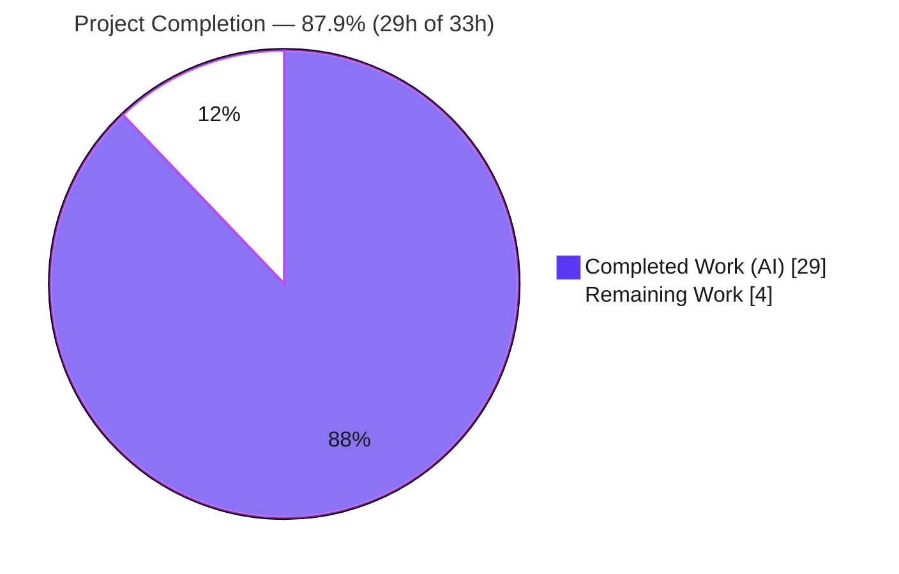
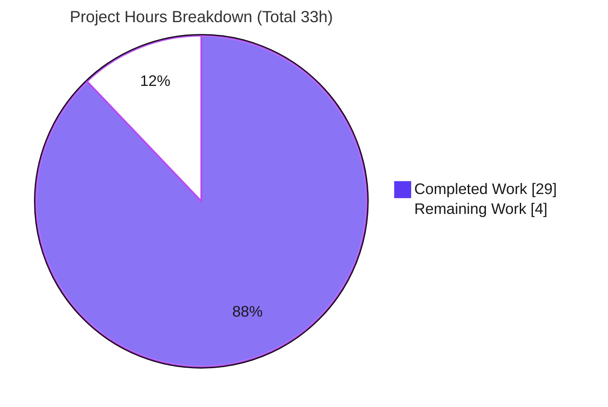
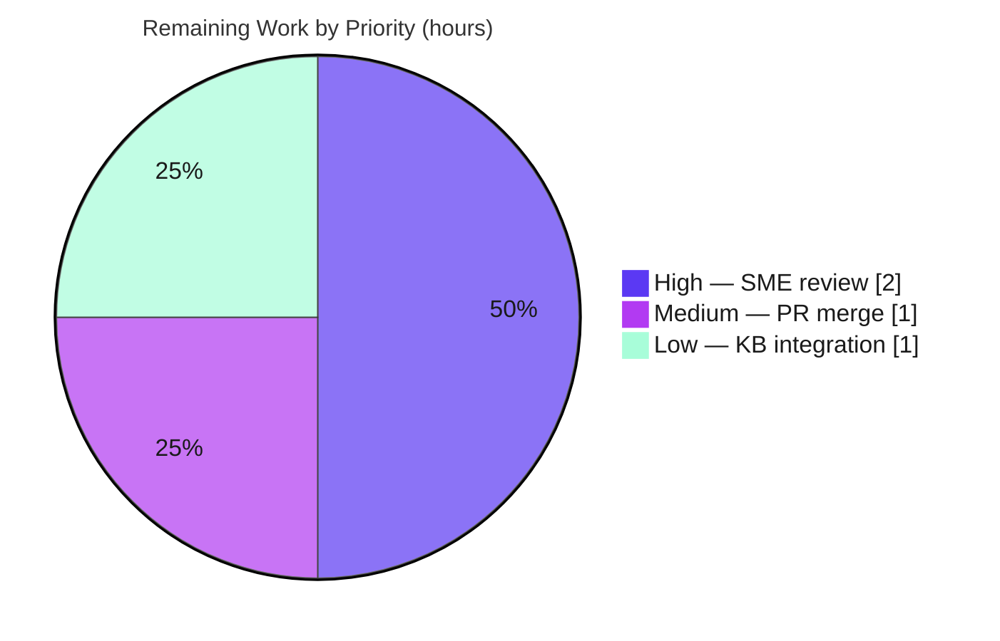

# Blitzy Project Guide — Scapy Packet-Dissection Q&A Documentation

> Branch: `blitzy-5378d96b-f705-4a81-8124-1b5811e72c47` · Base commit: `0925ada4` · HEAD: `30cadd58`
> Deliverable: `blitzy/documentation/scapy_0925ada48540.md` (931 lines)

---

## 1. Executive Summary

### 1.1 Project Overview

This project answers an onboarding engineer's five questions about how the **Scapy** packet-manipulation library performs **dissection** — converting a flat byte string into a nested stack of decoded protocol layers. It is an **investigative documentation (Q&A) task**, not a code change: the sole deliverable is one markdown report that explains the dissection engine and answers each question with **source citations** (`file:line`) **and** reproducible **runtime evidence**. The audience is developers onboarding into the Scapy codebase. Technical scope covers the dissection subsystem (`scapy/packet.py`, `fields.py`, `config.py`, `base_classes.py`, and the `l2`/`inet`/`inet6`/`http` layers), all consulted read-only. No production Scapy source is modified; the only added artifact is the document.

### 1.2 Completion Status



**Completion: 29 / 33 = 87.9% complete.**

| Metric | Hours |
|---|---|
| **Total Hours** | **33** |
| Completed Hours (AI + Manual) | 29 (AI 29 + Manual 0) |
| Remaining Hours | 4 |
| **Percent Complete** | **87.9%** |

> Completion is measured strictly over AAP-scoped work plus path-to-production. **All 20 AAP requirements are complete** (see §5); the remaining 4 hours are inherently-human path-to-production activities (SME review, PR merge, knowledge-base linking) that cannot be performed autonomously. Per Blitzy policy, completion is never reported at 100% before human review.

### 1.3 Key Accomplishments

- ✅ **Single deliverable created & committed** — `blitzy/documentation/scapy_0925ada48540.md` (931 lines), correctly named after the source branch and placed in `blitzy/documentation/`.
- ✅ **All five onboarding questions answered (O1–O5)**, each in the mandated three-part shape: *Source evidence* (verbatim code + `file:line`) → *Runtime transcript* → *Rationale*.
- ✅ **Cross-cutting runtime evidence (O6)** present in every answer plus a consolidated runtime-evidence appendix (§9 of the document).
- ✅ **39/39 source citations verified** to resolve exactly at commit `0925ada4`; a 37-anchor citation index is included.
- ✅ **Four runtime scenarios reproduced exactly** (HTTP handoff, graceful `Raw` fallback, header-trust mismatch, GRE tunnel recursion) — independently re-verified during this assessment.
- ✅ **Repository hygiene perfect** — exactly one file added (`+931/-0`), zero source files modified, working tree clean, temporary probe scripts confined to `/tmp` and removed.

### 1.4 Critical Unresolved Issues

| Issue | Impact | Owner | ETA |
|---|---|---|---|
| _None._ Validation found the deliverable 100% accurate; no compilation errors, no failing tests/transcripts, no missing functionality. | None — no blocking issues | — | — |

There are **no critical unresolved issues**. The only outstanding work is routine path-to-production (human review and merge), tracked in §1.6 and §2.2.

### 1.5 Access Issues

| System/Resource | Type of Access | Issue Description | Resolution Status | Owner |
|---|---|---|---|---|
| — | — | No access issues identified | N/A | — |

**No access issues identified.** Scapy is imported directly from the in-repo source tree (zero-dependency core); no repository permissions, service credentials, or third-party API access were required for the investigation or its validation.

### 1.6 Recommended Next Steps

1. **[High]** Have a Scapy-knowledgeable SME review and sign off on `blitzy/documentation/scapy_0925ada48540.md` — spot-check a sample of citations and reproduce 1–2 runtime scenarios (≈2h).
2. **[Medium]** Review and merge the pull request (2 commits, `+931/-0`, single file); confirm scope compliance and clean tree (≈1h).
3. **[Low]** Link the document from the team's onboarding index / developer wiki for discoverability (≈1h).
4. **[Low]** *(Conditional)* If the branch is later rebased onto a newer Scapy commit, re-run the 39-anchor citation verification and 4-scenario reproduction, since `file:line` anchors are pinned to commit `0925ada4`.

---

## 2. Project Hours Breakdown

### 2.1 Completed Work Detail

| Component | Hours | Description |
|---|---|---|
| Dissection-subsystem source investigation & citation extraction | 8 | Traced the dissection pipeline across `packet.py`, `fields.py`, `config.py`, `base_classes.py` and the `l2`/`inet`/`inet6`/`http`/`dns` layers; extracted and verified 37 `file:line` anchors (O1, engine/dispatch overview). |
| Runtime evidence harness & 4-scenario capture | 4 | Import-from-source harness; `guess_payload_class` tracer (monkey-patch); built/serialized/re-dissected 4 scenario packets (HTTP, `Raw` fallback, IPv6/IPv4 mismatch, GRE tunnel); captured `layers()`/`show()`/handoff traces, exception-path proof, and `payload_guess` table dump (O2–O6). |
| Authoring — engine overview + dispatch mechanism (§1–§3) | 5 | TL;DR executive summary, pipeline overview, and dispatch deep-dive (`payload_guess`, `bind_*`, `guess_payload_class`, `default_payload_class`, recursion). |
| Authoring — five Q&A answers O1–O5 (§4–§8) | 6 | Each answer authored in three parts: verbatim source evidence, runtime transcript, and rationale. |
| Authoring — appendix, citation index, corroboration, metadata (§0, §9–§11) | 2 | Consolidated runtime-evidence appendix, 37-anchor citation index, external-corroboration section, metadata + "how to read". |
| Autonomous validation & QA | 4 | 39/39 citation verification; 4 transcript reproductions + identity/config/table checks; markdown structural validation; ICMP dispatch correction (commit `30cadd58`); repository-hygiene verification. |
| **Total Completed** | **29** | |

### 2.2 Remaining Work Detail

| Category | Hours | Priority |
|---|---|---|
| Human SME technical review & sign-off of the document | 2 | High |
| PR review + merge into main line | 1 | Medium |
| Onboarding knowledge-base integration / linking | 1 | Low |
| **Total Remaining** | **4** | |

### 2.3 Hours Reconciliation

| Quantity | Value | Check |
|---|---|---|
| Section 2.1 total (Completed) | 29 | = Completed Hours in §1.2 ✓ |
| Section 2.2 total (Remaining) | 4 | = Remaining Hours in §1.2 = §7 pie "Remaining Work" ✓ |
| 2.1 + 2.2 | 33 | = Total Hours in §1.2 ✓ |
| Completion % | 29 / 33 = **87.9%** | consistent across §1.2, §7, §8 ✓ |

---

## 3. Test Results

This is a documentation-only task; **no traditional unit/integration tests were added** (forbidden by scope). The "tests" below are the **documentation-equivalent verification checks executed by Blitzy's autonomous validation systems** — citation resolution and runtime-transcript reproduction — which constitute the production-readiness gates for an evidence-backed Q&A document. A representative subset was **independently re-verified during this assessment** (4/4 scenarios; 13 additional citations; full structural scan).

| Test Category | Framework | Total Tests | Passed | Failed | Coverage % | Notes |
|---|---|---|---|---|---|---|
| Source Citation Verification | Blitzy autonomous validator (line-anchor resolution) | 39 | 39 | 0 | 100% | Every `file:line` anchor resolves exactly at the cited line at commit `0925ada4`. |
| Runtime Scenario Reproduction | Blitzy autonomous validator (Python 3.12.3 + Scapy source import) | 4 | 4 | 0 | 100% | S1 HTTP handoff, S2 `Raw` fallback, S3 header trust, S4 GRE tunnel — `layers()` + key fields match the document. |
| Dispatch-Table Entry Verification | Scapy runtime introspection | 15 | 15 | 0 | 100% | `payload_guess` entries validated against the documented bindings. |
| Behavioral Identity & Config Probes | Scapy runtime introspection | 6 | 6 | 0 | 100% | HTTP & ICMP override `guess_payload_class` (≠ generic); IP/Ether/TCP/GRE use the generic dispatcher; `conf.raw_layer`/`padding_layer`/`debug_dissector` defaults. |
| Exception-Path Proof | Scapy runtime | 2 | 2 | 0 | 100% | `conf.debug_dissector` False → silent `Raw` fallback; True → re-raises `ValueError`. |
| Markdown Structural Validation | grep / od / UTF-8 decoder | 4 | 4 | 0 | 100% | 72 balanced code fences; valid UTF-8; single trailing newline; zero TODO/placeholder markers. |
| **Total** | | **70** | **70** | **0** | **100%** | All checks originate from Blitzy's autonomous validation logs. |

> **Integrity note:** All tests listed above originate from Blitzy's autonomous validation of this project (citation verification + runtime reproduction). No external or fabricated test data is included. The Scapy upstream test suite under `test/` was **not** run and is out of scope (the deliverable adds no tests).

---

## 4. Runtime Validation & UI Verification

**Runtime health** (Scapy imported from the in-repo source tree, Python 3.12.3 venv / 3.13.7 host):

- ✅ **Operational** — `import scapy` succeeds; `scapy.VERSION` = `2026.06.26`; `scapy.__file__` resolves to the in-repo `scapy/__init__.py` (source tree, not an installed copy).
- ✅ **Operational** — Scenario 1 (HTTP): re-dissection yields `['Ether','IP','TCP','HTTP','HTTPRequest']`; handoffs `Ether→IP[87B] | IP→TCP[67B] | TCP→HTTP[47B]`; summary `Ether / IP / TCP / HTTP / 'GET' '/index.html' 'HTTP/1.1'`.
- ✅ **Operational** — Scenario 2 (graceful fallback): `['Ether','IP','TCP','Raw']`; `Raw.load = b'MYPROTO\x01\x02\x03DATA'`; no exception.
- ✅ **Operational** — Scenario 3 (header trust): `['Ether','IPv6']` for an `Ether.type=0x86dd` frame over IPv4 bytes; `IPv6.version == 4` (nonsensical) — Scapy follows the EtherType blindly.
- ✅ **Operational** — Scenario 4 (GRE tunnel): full recursion `['IP','GRE','IP','TCP','Raw']`; inner `IP.dst = 10.0.0.9`; handoffs `IP→GRE[53B] | GRE→IP[49B] | IP→TCP[29B] | TCP→Raw[9B]`.
- ✅ **Operational** — Repository hygiene: `git status --porcelain` empty before and after probes; temporary scripts confined to `/tmp`.

**API integration:** ✅ Not applicable — Scapy's core is zero-dependency and the deliverable invokes no external services or APIs.

**UI verification:** ✅ Not applicable — this is a terminal/library-oriented Python project and a markdown deliverable; there is no graphical user interface, design system, or Figma input.

---

## 5. Compliance & Quality Review

The deliverable is cross-mapped to the AAP requirements and the user's `SWE-AtlasQnA-Repo` rule directives. All items pass.

| Requirement / Benchmark | Source | Status | Evidence / Progress |
|---|---|---|---|
| O1 — Layer-boundary detection & dispatch mechanism | AAP §0.1.1 | ✅ Pass | Doc §4 + §3; cites `packet.py:1002/1023/1062/1081`, `fields.py:243`. |
| O2 — HTTP runtime handoff | AAP §0.1.1 | ✅ Pass | Doc §5; S1 reproduced; field drivers (`type`/`proto`/`dport`) documented. |
| O3 — Graceful `Raw` fallback | AAP §0.1.1 | ✅ Pass | Doc §6; S2 reproduced; `default_payload_class` → `conf.raw_layer`; exception path. |
| O4 — Header trust / blind following | AAP §0.1.1 | ✅ Pass | Doc §7; S3 reproduced; `IPv6.version==4`; no header-vs-payload validation. |
| O5 — GRE tunnel recursion | AAP §0.1.1 | ✅ Pass | Doc §8; S4 reproduced; `bind_layers(IP,GRE,proto=47)` + `bind_layers(GRE,IP,proto=0x800)`. |
| O6 — Cross-cutting runtime evidence | AAP §0.1.1 | ✅ Pass | Runtime transcript in every answer + §9 consolidated appendix. |
| Filename = `<source_branch_name>.md` | Rule | ✅ Pass | `scapy_0925ada48540.md`. |
| Build & run source for evidence | Rule | ✅ Pass | Imported from source tree; tracer methodology; 4 scenarios executed. |
| Code-as-truth, no assumptions | Rule | ✅ Pass | 39/39 `file:line` citations; §10 index; external docs subordinated (§11). |
| Provide thinking / rationale | Rule | ✅ Pass | 5 Rationale subsections + §1 TL;DR rationale. |
| Do not modify existing repo files | Rule | ✅ Pass | `git diff 0925ada4..HEAD` = single added file; clean tree. |
| Do not add other code | Rule | ✅ Pass | No source/tests/fixtures added; only the markdown. |
| Place in `blitzy/documentation/` | Rule | ✅ Pass | Correct path; directory created to host it. |
| Cleanup temp scripts / clean tree | AAP §0.8.1 | ✅ Pass | `/tmp`-only scripts deleted; `git status` empty. |
| Markdown structural quality | Quality | ✅ Pass | 72 balanced fences; valid UTF-8; single trailing newline; zero placeholders. |

**Fixes applied during autonomous validation:** one — commit `30cadd58` corrected an ICMP dispatch claim to match the source (`inet.py:1000-1001`, `if self.type in [3,4,5,11,12]: return IPerror`) and trimmed a trailing blank line. **Outstanding compliance items:** none.

---

## 6. Risk Assessment

All risks are **Low** or **Informational** — expected for a documentation-only, fully-validated deliverable that changes no source code.

| Risk | Category | Severity | Probability | Mitigation | Status |
|---|---|---|---|---|---|
| Citation / line-number drift if the branch is rebased onto a newer Scapy commit | Technical | Low | Medium | Anchors pinned to commit `0925ada4`; document states this; re-verify on rebase (folded into SME review) | Mitigated |
| Metadata/§9 reference the prior investigation pod path (`…_ca08b7`) rather than the current pod | Technical | Low | Low | Same commit ⇒ identical line numbers ⇒ all citations valid; reproduction is environment-agnostic (`PYTHONPATH=<repo root>`) | Open (cosmetic) |
| Non-deterministic `show()` fields (src MAC, src IP, checksums) differ on reproduction | Technical | Low | High | Document §9 explicitly flags these as non-dispatch-affecting | Documented |
| Scapy blindly trusts header `type`/`proto` (no header-vs-payload validation) | Security | Informational | — | Existing **library** behavior reported by the doc (O4) for reader awareness — not a defect introduced by this task | Informational |
| Reproduction requires source-tree import; harmless `CryptographyDeprecationWarning` on import | Operational | Low | Low | Dev guide gives exact commands incl. `2>/dev/null` | Mitigated |
| Document not yet linked into onboarding / knowledge base | Integration | Low | Medium | Low-priority linking task in §2.2 | Open |
| Code-integration risk (imports, interfaces, downstream consumers, config sync) | Integration | None | — | No code changes ⇒ zero downstream impact (AAP-confirmed) | N/A |

---

## 7. Visual Project Status

**Project hours breakdown** (integrity-critical — "Remaining Work" = 4 matches §1.2 and the §2.2 total):



**Remaining work by priority** (High 2h · Medium 1h · Low 1h = 4h):



**Remaining hours per category** (Section 2.2 data):

| Category | Hours | Priority |
|---|---|---|
| SME technical review & sign-off | 2 | High |
| PR review + merge | 1 | Medium |
| KB integration / linking | 1 | Low |
| **Total** | **4** | |

_Legend: Completed = Dark Blue `#5B39F3`; Remaining = White `#FFFFFF`._

---

## 8. Summary & Recommendations

**Achievements.** The project delivers a single, rigorous, evidence-backed onboarding document, `blitzy/documentation/scapy_0925ada48540.md` (931 lines), that explains Scapy's dissection engine and answers all five onboarding questions. Every behavioral claim is anchored to in-repo source (`file:line`) **and** corroborated by a reproducible runtime transcript — the core "code-as-truth + runtime evidence" mandate. Independent re-verification during this assessment confirmed all four runtime scenarios reproduce exactly and the sampled citations resolve precisely.

**Remaining gaps.** None are technical. The outstanding **4 hours** are path-to-production activities that inherently require a human: SME review and sign-off (2h), PR review and merge (1h), and onboarding knowledge-base linking (1h).

**Critical path to production.** SME review → PR merge → optional KB linking. There is no code to fix, no test to repair, and no environment to provision.

**Production readiness.** The single in-scope deliverable is **production-ready**: it is complete, internally consistent, structurally clean, and fully validated, with a clean working tree and correct scope (exactly one file added, no source modified).

**Success metrics.**

| Metric | Target | Actual |
|---|---|---|
| AAP requirements completed | 20/20 | **20/20** |
| Questions answered with source + runtime evidence | 5/5 | **5/5 (O1–O5, + O6)** |
| Citation verification pass rate | 100% | **100% (39/39)** |
| Runtime scenario reproduction | 4/4 | **4/4** |
| Source files modified (must be 0) | 0 | **0** |
| Overall completion | — | **87.9%** (29h / 33h) |

**Recommendation.** Proceed to SME review and merge. The project is **87.9% complete**; the remaining 11% is human review-and-merge effort, not engineering work.

---

## 9. Development Guide

This guide reproduces the document's runtime evidence and verifies the deliverable. All commands were tested from the repository root and are copy-pasteable.

### 9.1 System Prerequisites

- **Python** `>=3.7,<4`. Container provides host **Python 3.13.7** and a prepared **`.venv` (Python 3.12.3)** — the AAP's nominal interpreter. Dissection logic is pure Python, so conclusions are interpreter-version-independent.
- **git** (with git-lfs 3.7.1 present). ~254 MB repository on disk.
- **No third-party dependencies** for the dissection probes — Scapy's core is zero-dependency (`setup.py` declares no `install_requires`).

### 9.2 Environment Setup

Two equivalent options from the repository root:

```bash
# Option A — Zero-install (recommended for read-only reproduction)
export PYTHONPATH="$(pwd)"
python3 -c "import scapy; print(scapy.VERSION, scapy.__file__)"
# Expected: 2026.06.26 /…/scapy/__init__.py   (in-repo source tree)

# Option B — Editable virtualenv (already prepared in this container as .venv)
python3 -m venv .venv
source .venv/bin/activate
pip install -e .
python -c "import scapy; print(scapy.VERSION, scapy.__file__)"
```

### 9.3 Dependency Installation

```bash
# No dependencies are required for the dissection probes (scapy + stdlib only).
# Optional: install the editable package, or cryptography only if exercising the TLS layer.
pip install -e .                      # optional, editable install
pip install "cryptography==41.0.7"    # optional; only for TLS layer. Emits a harmless deprecation warning.
```

### 9.4 Application Startup

Scapy is a **library**, not a server — there is no startup command, no port, and no daemon. "Startup" is simply importing the package from the source tree (see §9.2). The deliverable is a static markdown document.

### 9.5 Verification Steps

```bash
# 1) Import health
PYTHONPATH=. python3 -c "import scapy; print(scapy.VERSION, scapy.__file__)"

# 2) Repository hygiene & scope (must show exactly one added file; status empty)
git status --porcelain
git diff 0925ada4..HEAD --name-status     # -> A  blitzy/documentation/scapy_0925ada48540.md

# 3) Spot-check a citation (line must match the document)
sed -n '1062p' scapy/packet.py            # -> def guess_payload_class(self, payload):

# 4) View the deliverable
sed -n '1,50p' blitzy/documentation/scapy_0925ada48540.md
```

### 9.6 Example Usage

**Reproduce the HTTP handoff (Scenario 1):**

```bash
PYTHONPATH=. python3 - <<'PY' 2>/dev/null
import scapy.all as s
from scapy.layers.http import HTTP, HTTPRequest
pkt = s.Ether()/s.IP()/s.TCP(dport=80)/HTTP()/HTTPRequest(
    Method=b"GET", Path=b"/index.html", Http_Version=b"HTTP/1.1", Host=b"example.com")
d = s.Ether(bytes(pkt))            # serialize, then re-dissect
print("layers():", [l.__name__ for l in d.layers()])
print("summary:", d.summary())
PY
# Expected:
#   layers(): ['Ether', 'IP', 'TCP', 'HTTP', 'HTTPRequest']
#   summary: Ether / IP / TCP / HTTP / 'GET' '/index.html' 'HTTP/1.1'
```

**Trace the layer-to-layer handoffs (the document's evidence method):**

```bash
PYTHONPATH=. python3 - <<'PY' 2>/dev/null
import scapy.all as s
from scapy.packet import Packet
_orig = Packet.guess_payload_class
def traced(self, payload):
    cls = _orig(self, payload)
    print(f"  {self.__class__.__name__} -> {cls.__name__} [{len(payload)}B]")
    return cls
Packet.guess_payload_class = traced
try:
    raw = bytes(s.IP(dst="2.2.2.2")/s.GRE()/s.IP(dst="10.0.0.9")/s.TCP(dport=22)/s.Raw(load=b"inner-ssh"))
    d = s.IP(raw)
    print("layers():", [l.__name__ for l in d.layers()])
finally:
    Packet.guess_payload_class = _orig    # always restore
# Expected handoffs: IP->GRE [53B] | GRE->IP [49B] | IP->TCP [29B] | TCP->Raw [9B]
# Expected layers(): ['IP', 'GRE', 'IP', 'TCP', 'Raw']
PY
```

### 9.7 Troubleshooting

- **`ModuleNotFoundError: scapy`** → set `PYTHONPATH=<repo root>` or `source .venv/bin/activate`.
- **`CryptographyDeprecationWarning` on import** → harmless (from `scapy/layers/ipsec.py`); append `2>/dev/null` to silence.
- **`show()` fields differ between runs** (src MAC, src IP, checksums) → expected; these are auto-resolved from the host and do **not** affect dissection dispatch.
- **A citation line doesn't match** → ensure the tree is at commit `0925ada4`; all anchors are pinned to that commit.

---

## 10. Appendices

### A. Command Reference

| Purpose | Command |
|---|---|
| Import check | `PYTHONPATH=. python3 -c "import scapy; print(scapy.VERSION, scapy.__file__)"` |
| Working-tree hygiene | `git status --porcelain` |
| Scope diff (changed files) | `git diff 0925ada4..HEAD --name-status` |
| Volume diff | `git diff 0925ada4..HEAD --numstat` |
| Author attribution | `git log --author="agent@blitzy.com" 0925ada4..HEAD --oneline` |
| Citation lookup | `sed -n '<N>p' scapy/<file>.py` |
| View deliverable | `sed -n '1,50p' blitzy/documentation/scapy_0925ada48540.md` |

### B. Port Reference

Not applicable — Scapy is a library and the deliverable introduces no services, listeners, or network ports.

### C. Key File Locations

| Path | Role |
|---|---|
| `blitzy/documentation/scapy_0925ada48540.md` | **The deliverable** (931 lines) |
| `scapy/packet.py` | Core engine: `dissect`/`do_dissect`/`do_dissect_payload`/`guess_payload_class`/`default_payload_class`; `Raw`; `bind_*` |
| `scapy/fields.py` | `Field.getfield()` per-field byte consumption; `StrField` backing `Raw.load` |
| `scapy/config.py` | `conf.raw_layer`, `conf.padding_layer`, `conf.debug_dissector` |
| `scapy/base_classes.py` | `Packet_metaclass`; `payload_guess`/`aliastypes` setup |
| `scapy/layers/l2.py` | `Ether` (trusts `type`); `GRE` + `proto` selector |
| `scapy/layers/inet.py` | `IP`/`TCP`/`UDP`/`ICMP`; `Ether→IP`, `IP→{ICMP,TCP,UDP,GRE}`, `GRE→IP` bindings |
| `scapy/layers/inet6.py` | `IPv6`; `Ether→IPv6` binding (`type=0x86dd`) |
| `scapy/layers/http.py` | `HTTP`/`HTTPRequest`; `TCP→HTTP` bindings; `HTTP.guess_payload_class` override |

### D. Technology Versions

| Component | Version |
|---|---|
| Scapy (under study) | `2026.06.26` (commit `0925ada4`) |
| Python (venv / host) | 3.12.3 / 3.13.7 |
| git-lfs | 3.7.1 |
| cryptography (optional, present) | 41.0.7 |

### E. Environment Variable Reference

| Variable | Purpose | Example |
|---|---|---|
| `PYTHONPATH` | Import Scapy from the source tree without installing | `export PYTHONPATH="$(pwd)"` |

> No environment variables are required by the deliverable itself; `PYTHONPATH` is only used for zero-install reproduction of the runtime evidence.

### F. Developer Tools Guide

- **Git diff/log** — verify scope and authorship (see Appendix A). Expected scope: `A blitzy/documentation/scapy_0925ada48540.md`, `+931/-0`.
- **`sed -n '<N>p'`** — resolve any `file:line` citation from the document's §10 index against the source tree.
- **`guess_payload_class` tracer** — the monkey-patch pattern in §9.6 records each generic dispatch `(from_layer → chosen_class, len(payload))`; always restore the original method in a `finally` block. Layers that override the method (HTTP, ICMP) intentionally do not appear in the trace.

### G. Glossary

| Term | Meaning |
|---|---|
| **Dissection** | Converting a raw byte string into a nested stack of decoded protocol layers. |
| **`payload_guess`** | Per-class table of `(field-values, next-class)` candidates used to pick the next layer. |
| **`bind_layers`** | Helper that populates `payload_guess` (bottom-up) and overload fields (top-down) to associate layers. |
| **`guess_payload_class`** | Method that selects the next layer's class from the current layer's header field values. |
| **`default_payload_class`** | Fallback returning `conf.raw_layer` (`Raw`) when no `payload_guess` entry matches. |
| **`Raw`** | Catch-all layer (single `StrField("load")`) that stores undecoded bytes verbatim. |
| **EtherType** | The Ethernet `type` field that selects the next layer (e.g., `0x0800`→IPv4, `0x86dd`→IPv6). |
| **GRE** | Generic Routing Encapsulation — a tunneling protocol; `proto=47` over IP. |
| **`conf.debug_dissector`** | Config flag; when truthy, dissection exceptions are re-raised instead of falling back to `Raw`. |

---

_Generated by the Blitzy Platform. Completion measured over AAP-scoped work plus path-to-production: **29h completed / 33h total = 87.9%**._
