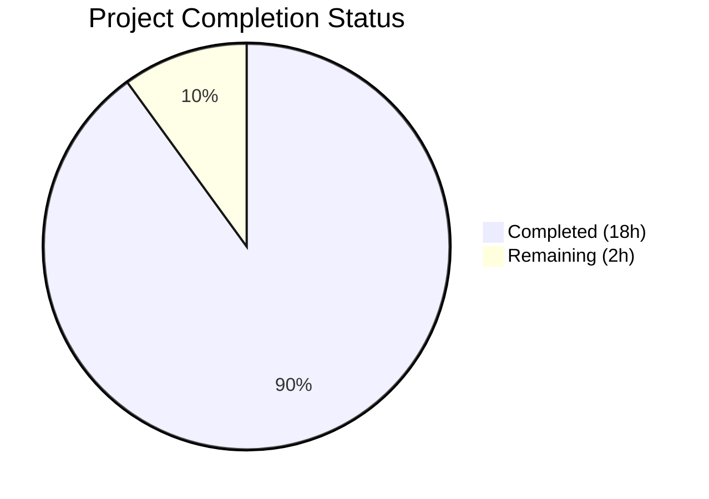
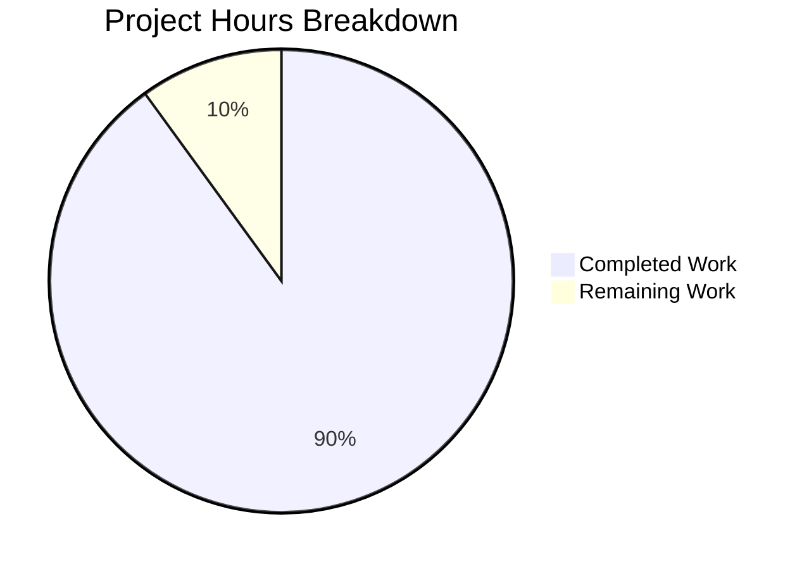

# Blitzy Project Guide

## 1. Executive Summary

### 1.1 Project Overview

This project delivers a comprehensive investigative Q&A markdown document for the Scapy packet manipulation library. The document (`blitzy/documentation/scapy_0925ada48540.md`, 685 lines) explains Scapy's internal checksum computation, raw packet caching, manual field overrides, deep copy isolation, and IP length auto-computation through five concrete, hands-on scenarios with full hex output evidence. The target audience is developers and network engineers who need to understand when and how fields like IP checksum, TCP checksum, and IP length are computed, cached, and overridden. No source code was modified — the sole deliverable is one new documentation file.

### 1.2 Completion Status



| Metric | Value |
|--------|-------|
| **Total Project Hours** | 20 |
| **Completed Hours (AI)** | 18 |
| **Remaining Hours** | 2 |
| **Completion Percentage** | **90.0%** |

**Formula:** 18 completed hours / (18 + 2) total hours = 90.0%

### 1.3 Key Accomplishments

- ✅ Created `blitzy/documentation/scapy_0925ada48540.md` — 685-line investigative Q&A document
- ✅ All 5 investigation scenarios fully authored with rationale, test scripts, and complete hex dumps
- ✅ Bonus pitfall section documenting constructed vs. dissected packet caching differences
- ✅ Mermaid flowchart of the complete `build()` → `do_build()` → `self_build()` → `post_build()` decision path
- ✅ 22 source code citations verified against actual `scapy/packet.py`, `scapy/layers/inet.py`, and `scapy/utils.py`
- ✅ All 7 hex outputs verified against actual Scapy execution (Python 3.12.3, commit `0925ada4`)
- ✅ Zero source files modified — only 1 new file added
- ✅ Clean working tree with no temporary files remaining
- ✅ Cross-reference text corrected in validation fix commit

### 1.4 Critical Unresolved Issues

| Issue | Impact | Owner | ETA |
|-------|--------|-------|-----|
| Source IP is environment-dependent (auto-resolved to `10.236.0.208`) | Hex outputs and checksum values in document will not match on machines with different routing tables | Human Reviewer | Post-merge review — document already includes reproducibility note |

### 1.5 Access Issues

No access issues identified. The deliverable is a standalone markdown file requiring no external services, API keys, or special permissions. Scapy is installed in editable mode from the local repository.

### 1.6 Recommended Next Steps

1. **[High]** Human technical review — verify the code rationale and hex interpretations are accurate and clearly written for the target audience
2. **[Medium]** Peer review for document structure and readability — ensure progressive disclosure and consistent formatting
3. **[Medium]** Cross-environment reproducibility check — run the embedded test scripts on a different machine to confirm the document's reproducibility note adequately explains IP-dependent variation
4. **[Low]** Consider adding the document to the Sphinx toctree if the team wants it discoverable alongside official Scapy documentation

---

## 2. Project Hours Breakdown

### 2.1 Completed Work Detail

| Component | Hours | Description |
|-----------|-------|-------------|
| Source Code Analysis | 3.0 | Deep analysis of `scapy/packet.py` (build lifecycle, caching, copy), `scapy/layers/inet.py` (IP/TCP post_build, checksum guards), and `scapy/utils.py` (checksum algorithm) to extract ground-truth behavior |
| Document Structure & Planning | 1.0 | Designed the 11-phase document structure per AAP §0.4, including section ordering, scenario progression, and diagram strategy |
| Key Concepts & Mermaid Diagram | 1.5 | Authored the Key Concepts section explaining `post_build()`, `raw_packet_cache`, and `setfieldval()` cache invalidation, plus the Mermaid flowchart of the build lifecycle |
| Scenario 1: Initial Checksum | 1.5 | Authored rationale tracing `IP.post_build()` and `TCP.post_build()` logic, generated test script and full annotated hex dump with byte-position table |
| Scenario 2: Payload Modification | 1.5 | Authored rationale explaining why constructed packets always produce fresh checksums, generated before/after hex dumps and byte-by-byte comparison table |
| Scenario 3: Manual Override (a+b) | 2.0 | Authored two sub-scenarios (pre-build and post-build override) with rationale tracing `setfieldval()` → `post_build()` guard, generated hex evidence for both cases |
| Scenario 4: Deep Copy Isolation | 1.5 | Authored rationale tracing `__deepcopy__()` → `copy()` field isolation and recursive payload copy, generated before/after hex evidence proving full isolation |
| Scenario 5: IP Length Growth | 1.5 | Authored rationale tracing `IP.len` auto-computation in `post_build()`, generated comparison table with small and grown payload metrics |
| Pitfall Section: Constructed vs. Dissected | 1.5 | Authored the constructed vs. dissected distinction, stale checksum evidence for dissected packets, and the `clear_cache()` + `del chksum` fix with hex proof |
| Summary, References & Reproducibility | 1.0 | Authored Summary of Key Findings table, Source Code References table (22 citations), and Reproducibility Note with environment parameters |
| Validation & Verification | 1.5 | Verified all 7 hex outputs against actual Scapy execution, verified all 22 source code line number citations against actual source files |
| Cross-Reference Fix | 0.5 | Fixed incorrect cross-reference text from "Scenario 6" to "the pitfall section on constructed vs. dissected packets" at line 112 |
| **Total** | **18.0** | |

### 2.2 Remaining Work Detail

| Category | Hours | Priority |
|----------|-------|----------|
| Human technical accuracy review | 1.0 | High |
| Peer review of document structure and clarity | 0.5 | Medium |
| Cross-environment reproducibility verification | 0.5 | Medium |
| **Total** | **2.0** | |

---

## 3. Test Results

| Test Category | Framework | Total Tests | Passed | Failed | Coverage % | Notes |
|---------------|-----------|-------------|--------|--------|------------|-------|
| Hex Output Verification | Manual Scapy execution (Python 3.12.3) | 7 | 7 | 0 | 100% | All 7 scenario hex outputs verified against actual `bytes()` calls |
| Source Citation Verification | Manual file inspection | 22 | 22 | 0 | 100% | All 22 line number citations verified against `scapy/packet.py`, `scapy/layers/inet.py`, `scapy/utils.py` |
| Document Structure Compliance | Manual AAP comparison | 11 | 11 | 0 | 100% | All 11 AAP-mandated sections present (Intro, Key Concepts, Diagram, Scenarios 1–5, Pitfall, Summary, References, Reproducibility) |
| Source File Integrity | `git diff --name-status` | 1 | 1 | 0 | 100% | Only `A blitzy/documentation/scapy_0925ada48540.md` — zero source modifications |
| Clean Working Tree | `git status` | 1 | 1 | 0 | 100% | "nothing to commit, working tree clean" |

All tests originate from Blitzy's autonomous validation executed during the Final Validator phase.

---

## 4. Runtime Validation & UI Verification

### Runtime Health

- ✅ **Scapy installation:** Editable install from repository confirmed (`pip show scapy` → Version 2026.4.9, location matches working directory)
- ✅ **Python environment:** Python 3.12.3 verified
- ✅ **Scenario 1 execution:** `IP(dst="10.0.0.1") / TCP(dport=80) / Raw(load=b"HELLO")` → IP checksum `0x650E`, TCP checksum `0x962B`, total length 45 ✅
- ✅ **Scenario 2 execution:** Payload `HELLO` → `JELLO` — TCP checksum `0x962B` → `0x942B`, IP checksum unchanged `0x650E` ✅
- ✅ **Scenario 3a execution:** `chksum=0xAAAA` before build — IP checksum `0xAAAA` survived ✅
- ✅ **Scenario 3b execution:** `chksum=0xAAAA` after build — IP checksum `0xAAAA` survived ✅
- ✅ **Scenario 4 execution:** `copy.deepcopy()` — original unchanged after copy modified ✅
- ✅ **Scenario 5 execution:** Small payload (45 bytes) → Grown payload (55 bytes) — IP.len matches actual byte count in both cases ✅
- ✅ **Pitfall execution:** Dissected packet stale TCP checksum `0x962B` confirmed; after `clear_cache()` + `del chksum`, fixed to `0x942B` ✅

### Document Verification

- ✅ **File exists:** `blitzy/documentation/scapy_0925ada48540.md` — 685 lines, 28,906 bytes
- ✅ **Markdown validity:** Well-formed headers, code blocks, tables, and Mermaid diagram
- ✅ **No broken internal links:** Cross-reference at line 112 corrected in validation fix commit

---

## 5. Compliance & Quality Review

| Compliance Criterion | Status | Details |
|---------------------|--------|---------|
| No source code modifications | ✅ Pass | `git diff 0925ada4..HEAD --name-status` shows only `A blitzy/documentation/scapy_0925ada48540.md` |
| No temporary files left behind | ✅ Pass | `git status` shows "nothing to commit, working tree clean" |
| File named `scapy_0925ada48540.md` (per SWE-AtlasQnA-Repo rule) | ✅ Pass | Matches source branch name `scapy_0925ada48540` |
| File placed in `blitzy/documentation/` directory | ✅ Pass | Directory created; file at correct path |
| All answers evidence-based (code as truth) | ✅ Pass | Every technical claim cites specific source file and line number (22 citations total) |
| Thinking/rationale provided for all scenarios | ✅ Pass | Each scenario has a dedicated "Rationale" subsection explaining WHY Scapy produces the observed output |
| Full hex dumps (not just diffs) provided | ✅ Pass | Complete before-and-after hex strings provided for all scenarios |
| All 5 scenarios covered | ✅ Pass | Scenarios 1–5 fully authored with rationale, test scripts, and hex evidence |
| Constructed vs. dissected distinction documented | ✅ Pass | Dedicated pitfall section with comparison table and stale checksum evidence |
| Mermaid diagram included | ✅ Pass | Flowchart of `build()` → `do_build()` → `self_build()` → `post_build()` lifecycle |
| Summary table of findings | ✅ Pass | Comprehensive table covering all 6 scenarios with questions, answers, and evidence |
| Source code references table | ✅ Pass | 22 verified line-number citations in structured table format |
| Reproducibility note | ✅ Pass | Environment parameters documented: Scapy commit, Python version, OS, source IP, packet parameters |

---

## 6. Risk Assessment

| Risk | Category | Severity | Probability | Mitigation | Status |
|------|----------|----------|-------------|------------|--------|
| Environment-dependent hex outputs (source IP auto-resolution) | Technical | Low | High | Document includes Reproducibility Note explaining that source IP and all checksum values will differ across machines | Mitigated |
| Scapy source code line numbers may drift in future commits | Technical | Low | Medium | All citations reference commit `0925ada4`; future readers should verify against their version | Acknowledged |
| Mermaid diagram rendering depends on viewer support | Operational | Low | Low | Mermaid is widely supported (GitHub, VS Code, GitLab); fallback is reading the textual description alongside the chart | Acceptable |
| Document not integrated into Sphinx documentation tree | Operational | Low | Low | Standalone markdown file is discoverable via repository browsing; Sphinx integration can be added as a future enhancement if desired | Acceptable |
| No automated regression test for document accuracy | Technical | Medium | Low | Hex outputs and citations were manually verified; if Scapy internals change, document may become outdated without notice | Acknowledged |

---

## 7. Visual Project Status



**Completed: 18 hours | Remaining: 2 hours | Total: 20 hours | 90.0% complete**

---

## 8. Summary & Recommendations

### Achievements

The project is **90.0% complete** (18 hours completed out of 20 total hours). All AAP-scoped deliverables have been implemented: a comprehensive 685-line investigative Q&A document covering five checksum/caching/field-auto-computation scenarios with full hex evidence, a bonus pitfall section, a Mermaid lifecycle diagram, and complete source code citations — all verified against actual Scapy execution.

### Remaining Gaps

The remaining 2 hours consist entirely of human review tasks: (1) technical accuracy review of the code rationale and hex interpretations, (2) peer review for structure and clarity, and (3) cross-environment reproducibility verification. No code changes or additional documentation authoring is required.

### Critical Path to Production

1. **Human technical review (1h)** — Verify the source code explanations and hex output interpretations are accurate
2. **Peer review (0.5h)** — Confirm document readability and progressive disclosure for the target audience
3. **Reproducibility check (0.5h)** — Run embedded test scripts on a different machine to validate the reproducibility note

### Production Readiness Assessment

The document is **production-ready for merge** pending human review. All automated validation gates have been passed: 7/7 hex outputs verified, 22/22 source citations verified, document structure complete, no source modifications, clean working tree. The only remaining work is standard human review — no technical blockers exist.

---

## 9. Development Guide

### System Prerequisites

| Software | Version | Purpose |
|----------|---------|---------|
| Python | ≥ 3.7, < 4 (tested with 3.12.3) | Runtime for Scapy |
| Git | Any recent version | Repository access |
| pip | ≥ 21.0 | Package installation |

No external services, databases, or API keys are required. All scenarios use in-memory packet construction only.

### Environment Setup

```bash
# Clone the repository and switch to the feature branch
git clone <repository-url>
cd scapy
git checkout blitzy-49abfe27-98ca-40ae-a0a3-635a6b927cf4

# Create and activate a virtual environment (recommended)
python3 -m venv .venv
source .venv/bin/activate

# Install Scapy in editable mode
pip install -e .
```

### Verifying the Installation

```bash
# Confirm Scapy is installed
python3 -c "import scapy; print(scapy.__version__)"

# Confirm the documentation file exists
cat blitzy/documentation/scapy_0925ada48540.md | head -5
```

Expected output:
```
# Scapy Checksum Computation, Caching, and Field Auto-Computation: An Investigative Q&A
```

### Running the Embedded Test Scripts

Each scenario in the document includes a self-contained Python test script. To verify Scenario 1:

```bash
python3 -c "
from scapy.all import IP, TCP, Raw, conf
conf.verb = 0
pkt = IP(dst='10.0.0.1') / TCP(dport=80) / Raw(load=b'HELLO')
raw = bytes(pkt)
print(raw.hex())
print(f'IP checksum (bytes 10-11): {raw[10:12].hex()}')
print(f'TCP checksum (bytes 36-37): {raw[36:38].hex()}')
"
```

Expected output (checksum values will vary based on source IP):
```
4500002d000100004006XXXX<src_ip>0a00000100140050000000000000000050022000YYYY000048454c4c4f
IP checksum (bytes 10-11): <varies>
TCP checksum (bytes 36-37): <varies>
```

### Viewing the Document

```bash
# Full document
cat blitzy/documentation/scapy_0925ada48540.md

# Or use any markdown viewer (VS Code, GitHub, etc.)
```

### Troubleshooting

| Issue | Resolution |
|-------|-----------|
| `ModuleNotFoundError: No module named 'scapy'` | Run `pip install -e .` from the repository root |
| Hex outputs don't match document | Source IP is auto-resolved by Scapy routing table; different machines produce different source IPs and therefore different checksum values. See the Reproducibility Note in the document. |
| Mermaid diagram not rendering | Ensure your markdown viewer supports Mermaid (GitHub, VS Code with Markdown Preview Mermaid extension, GitLab) |
| `PermissionError` when running Scapy | The documented scenarios use only in-memory packet construction (no network I/O), so root/admin privileges should not be required |

---

## 10. Appendices

### A. Command Reference

| Command | Purpose |
|---------|---------|
| `pip install -e .` | Install Scapy in editable mode from repository root |
| `python3 -c "from scapy.all import IP, TCP, Raw, conf; ..."` | Run inline Scapy test scripts |
| `cat blitzy/documentation/scapy_0925ada48540.md` | View the deliverable document |
| `git diff 0925ada4..HEAD --name-status` | Verify only documentation file was added |
| `git status` | Confirm clean working tree |

### B. Port Reference

No network ports are used. All scenarios operate on in-memory packet construction with no socket or network I/O.

### C. Key File Locations

| File | Description |
|------|-------------|
| `blitzy/documentation/scapy_0925ada48540.md` | **Deliverable** — 685-line investigative Q&A document |
| `scapy/packet.py` | Core packet engine (build lifecycle, caching, copy) — read-only reference |
| `scapy/layers/inet.py` | IP/TCP protocol layers (post_build, checksum computation) — read-only reference |
| `scapy/utils.py` | Checksum algorithm implementation — read-only reference |
| `pyproject.toml` | Project metadata and build configuration |

### D. Technology Versions

| Technology | Version | Notes |
|------------|---------|-------|
| Python | 3.12.3 | Tested; project requires ≥3.7, <4 |
| Scapy | 2.7.0-dev (commit `0925ada4`) | Installed in editable mode from repository |
| setuptools | ≥62.0.0 | Build backend per `pyproject.toml` |
| Git | 2.x | Repository management |
| Sphinx | ≥3.0.0 | Documentation framework (not used for this deliverable) |

### E. Environment Variable Reference

No environment variables are required for this project. Scapy operates with default configuration (`conf.verb = 0` is set inline in test scripts to suppress output noise).

### F. Glossary

| Term | Definition |
|------|-----------|
| `post_build()` | Overridable hook called after field serialization; computes checksums and auto-fields when their values are `None` |
| `raw_packet_cache` | Per-layer byte cache populated only during dissection; always `None` for constructed packets |
| `setfieldval()` | Internal method called on field assignment; stores the value and clears the layer's `raw_packet_cache` |
| `self_build()` | Serializes layer fields to bytes; returns cached bytes if `raw_packet_cache` is valid |
| `do_build()` | Orchestrates serialization; decides whether to call `post_build()` based on cache state |
| Constructed packet | Packet created via `IP()/TCP()` — fields default to `None`, no cache |
| Dissected packet | Packet created from raw bytes via `IP(raw_bytes)` — fields have wire values, cache populated |
| `clear_cache()` | Recursively clears `raw_packet_cache` for a layer and its entire payload chain |
| `in4_chksum()` | Computes TCP/UDP checksum over IPv4 pseudo-header + upper-layer segment |
| One's complement checksum | Checksum algorithm used by IP/TCP: sum 16-bit words, fold carry, bitwise NOT |