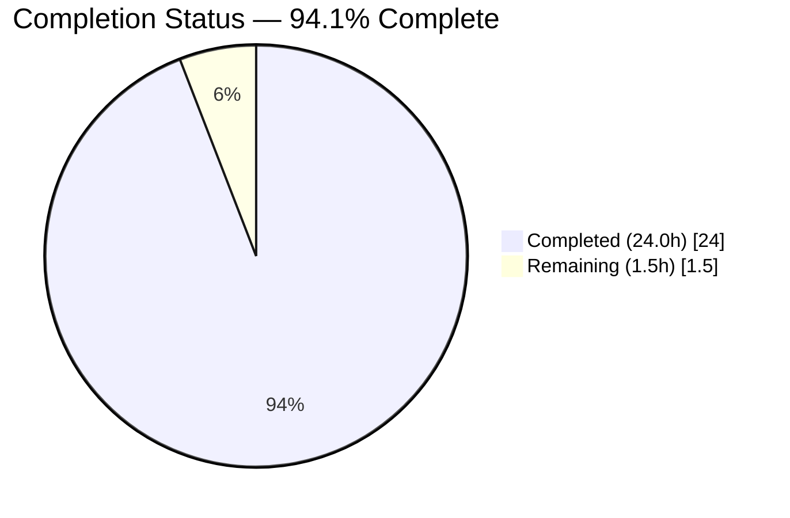
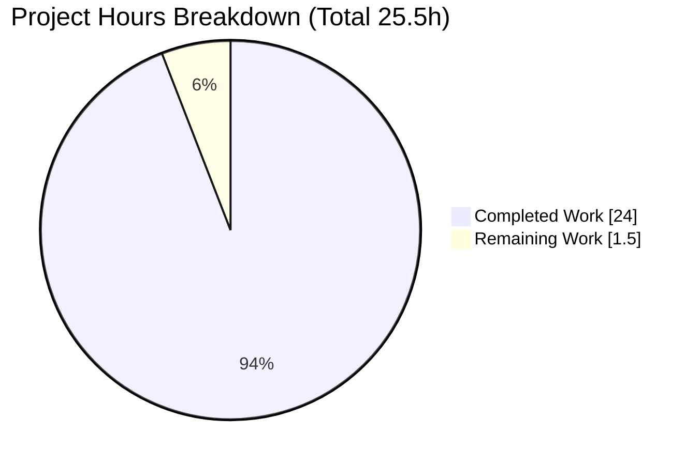
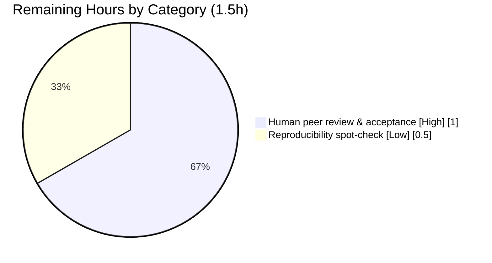

# Blitzy Project Guide

**Project:** Scapy Runtime Onboarding Documentation
**Branch:** `blitzy-ef754fd9-de82-482c-9b3b-fccada46eab5`
**Baseline:** `0925ada4` → **HEAD:** `c68cdc62`
**Deliverable:** `blitzy/documentation/scapy_0925ada48540.md`

---

## 1. Executive Summary

### 1.1 Project Overview

This project delivers a single, evidence-grounded Q&A onboarding document that answers a new team member's questions about how the cloned Scapy repository behaves at runtime. It captures the startup banner and version, the number of protocol layers actually loaded (versus source files), the default verbosity and its meaning, the socket implementation selected on this Linux system, the internal structure of a basic ICMP ping packet, and the active terminal theme. It is a read-only investigation: the only artifact is one Markdown file, and no Scapy source is modified. Target users are engineers onboarding onto a Scapy-heavy team who need an accurate, citation-backed picture of the runtime.

### 1.2 Completion Status



- Completed slice color: **Dark Blue `#5B39F3`**
- Remaining slice color: **White `#FFFFFF`**

| Metric | Hours |
|---|---|
| **Total Hours** | 25.5 |
| **Completed Hours (AI + Manual)** | 24.0 |
| **Remaining Hours** | 1.5 |
| **Percent Complete** | **94.1%** |

Completion is calculated on AAP-scoped work only: `24.0 / (24.0 + 1.5) = 24.0 / 25.5 = 94.1%`.

### 1.3 Key Accomplishments

- ✅ Sole deliverable authored: `blitzy/documentation/scapy_0925ada48540.md` (672 lines, 4,839 words).
- ✅ All seven question sub-parts answered (Q1, Q2, Q3a/b/c, Q4, Q5) with observed runtime output and `file:line` citations.
- ✅ Every documented value independently re-verified against the live Scapy runtime — **zero discrepancies**.
- ✅ 91 distinct `file:line` citations across 18 referenced paths, all byte-identical to baseline `0925ada4`.
- ✅ All 16 referenced Scapy source files parse cleanly (0 syntax errors).
- ✅ Read-only constraint honored — `git diff --name-status 0925ada4` = single added file; no `__pycache__`/`.pyc` residue.
- ✅ Run-first discipline: interactive banner/theme via `python3 -m scapy`; programmatic values via `from scapy.all import *`.

### 1.4 Critical Unresolved Issues

| Issue | Impact | Owner | ETA |
|---|---|---|---|
| None | — | — | — |

No unresolved issues block release or validation. All five validation gates passed with zero corrections required.

### 1.5 Access Issues

| System/Resource | Type of Access | Issue Description | Resolution Status | Owner |
|---|---|---|---|---|
| — | — | No access issues identified | N/A | — |

No repository, credential, or third-party access issues affect this read-only documentation task.

### 1.6 Recommended Next Steps

1. **[High]** Human peer review and acceptance of the onboarding document for technical accuracy and onboarding usefulness.
2. **[Low]** Optional fresh-environment reproducibility spot-check (confirm environment-dependent values such as the mtime version and random quote behave as documented).
3. **[Low]** Decide on a cadence for refreshing the document if the team advances the Scapy checkout past `0925ada4` (citation line anchors are checkout-specific).

---

## 2. Project Hours Breakdown

### 2.1 Completed Work Detail

| Component | Hours | Description |
|---|---|---|
| Run-first investigation harness & canonical environment setup | 1.5 | Establish Python-3.13.7 checkout runtime, `PYTHONPATH`/`PYTHONDONTWRITEBYTECODE` posture, capture-and-observe workflow |
| Q1 — Startup banner & version (mtime-fallback tracing) | 3.0 | Capture banner; trace `conf.version` → `_version()` resolution order to the mtime fallback `2026.07.14` |
| Q2 — Loaded-layer runtime metrics | 2.5 | `conf.load_layers=49`, `conf.layers=1319` vs 57 source files; loaded-not-listed proof; metaclass auto-registration |
| Q3a/b — Verbosity level & meaning | 2.5 | `conf.verb=2`; document 0–3 scale; trace send/receive verbosity gating |
| Q3c — Socket implementation | 2.0 | `L3PacketSocket`/`L2Socket`/`L2ListenSocket`, `use_pcap`/`use_bpf`=False; `_set_conf_sockets` + `arch/linux` classes |
| Q4 — ICMP packet structure & layer relationships | 2.5 | Doubly-linked `IP()/ICMP()` chain; payload/underlayer back-link; mermaid diagram |
| Q5 — Default terminal theme | 2.0 | `DefaultTheme` (interactive) vs `NoTheme` (bare import) vs `BlackAndWhite` (Windows fallback) |
| Citation grounding & verification | 3.0 | 91 distinct `file:line` citations across 18 paths; validated against baseline `0925ada4` |
| Document assembly (Coverage Summary, Reproducibility notes, formatting) | 2.0 | Structure, tables, fenced output blocks, coverage pass |
| Read-only discipline & temp-artifact cleanup + git verification | 1.0 | Verify working tree clean; no source modified; remove any stray artifacts |
| Review-driven refinement (4 fix commits after initial add) | 2.0 | Review-findings fix, git-metadata fix, sendrecv-label fix, consistency reconcile |
| **Total** | **24.0** | |

### 2.2 Remaining Work Detail

| Category | Hours | Priority |
|---|---|---|
| Human peer review & acceptance of onboarding document | 1.0 | High |
| Fresh-environment reproducibility spot-check | 0.5 | Low |
| **Total** | **1.5** | |

### 2.3 Total Project Hours

| Bucket | Hours |
|---|---|
| Completed (Section 2.1) | 24.0 |
| Remaining (Section 2.2) | 1.5 |
| **Total Project Hours** | **25.5** |

Integrity: `24.0 + 1.5 = 25.5` ✓ — matches Section 1.2 Total. Remaining `1.5h` is identical in Sections 1.2, 2.2, and 7.

---

## 3. Test Results

All tests below originate from Blitzy's autonomous validation logs for this project (in-scope deliverable validation).

| Test Category | Framework | Total Tests | Passed | Failed | Coverage % | Notes |
|---|---|---|---|---|---|---|
| Runtime value verification (Q1–Q5) | Live Scapy runtime (python3) | 7 | 7 | 0 | 100% | Version, layer counts, verb, sockets, ICMP structure, themes |
| Interactive startup | `python3 -m scapy` | 2 | 2 | 0 | 100% | Banner renders + clean exit; colored ANSI proves DefaultTheme |
| Citation verification | Custom (line-anchor check) | 91 | 91 | 0 | 100% | 91 distinct `file:line` across 18 paths; 0 out-of-bounds |
| Source parse check | `py_compile` (AST) | 16 | 16 | 0 | 100% | All referenced Scapy source files parse |
| Markdown structure | Custom validator | 5 | 5 | 0 | 100% | Sections, fences, tables, mermaid, bold markers |
| Read-only / cleanup | `git` + filesystem scan | 3 | 3 | 0 | 100% | Clean tree; 0 `__pycache__`; 0 `.pyc` |
| **In-scope total** | — | **124** | **124** | **0** | **100%** | Zero corrections required |

**Out-of-scope (informational):** Scapy's own UTscapy regression suite ran **39/40**. The single failure (test #14, `conf.use_pcap`) is purely environmental — libpcap is intentionally absent — fails identically on the pristine baseline, is a Scapy test (not the deliverable), and the AAP forbids installing libpcap. It corroborates the document's Q3c answer (`use_pcap=False`). Not counted in in-scope totals.

---

## 4. Runtime Validation & UI Verification

- ✅ **Operational** — `from scapy.all import *` imports cleanly.
- ✅ **Operational** — `python3 -m scapy` launches, renders the colored banner, and exits cleanly.
- ✅ **Operational** — Interactive theme confirmed as `DefaultTheme` (ANSI color codes genuinely emitted).
- ✅ **Operational** — `IP()/ICMP()` construction, `.layers()`, `.command()`, `.show()`, and payload/underlayer back-links behave exactly as documented.
- ✅ **Operational** — Startup banner content (PyX INFO, 2× TripleDES deprecation warnings, IPython-absent WARNING, logo, version, URL, quote) matches documentation.
- ⚠ **Partial (by design)** — libpcap/BPF path is intentionally inactive on this Linux host (`use_pcap=False`, `use_bpf=False`); native `PF_PACKET` sockets are used. This is the documented canonical behavior, not a fault.

No web UI exists for this task; "UI verification" applies to the interactive console output, which is verified above.

---

## 5. Compliance & Quality Review

| AAP Requirement / Rule | Benchmark | Status | Notes |
|---|---|---|---|
| Rule 1 — Run-first persistent investigation | Values observed at runtime, commands recorded | ✅ Pass | All Q1–Q5 values captured live |
| Rule 2 — Exhaustive condition & evidence coverage | Every sub-part + edge cases | ✅ Pass | Interactive vs import theme; 49/1319/57 layer metrics; Windows fallback noted |
| Rule 3 — Faithful instruction-following & observed-output discipline | Read-only; observed labeled vs inferred | ✅ Pass | Env-dependent version labeled; repo unchanged |
| Rule 4 — Complete, precise, grounded answering | Exact values + `file:line` + cause→effect | ✅ Pass | 91 distinct citations; mechanisms explained |
| MainRule — Deliverable & scope | New `<branch>.md` in `blitzy/documentation`; source read-only | ✅ Pass | Single added file; source byte-identical |
| Zero source modification | `git diff` = only the new doc | ✅ Pass | `A blitzy/documentation/scapy_0925ada48540.md` |
| Temp-artifact hygiene | No stray files; no bytecode | ✅ Pass | 0 `__pycache__`, 0 `.pyc` |
| Citation accuracy | All anchors valid at `0925ada4` | ✅ Pass | 0 out-of-bounds; single-line dumps matched |
| Markdown quality | Balanced fences, valid mermaid, consistent tables | ✅ Pass | 18 fences balanced; mermaid valid |

**Fixes applied during autonomous validation:** four review-driven refinement commits (review-findings fix, git-metadata fix, sendrecv label fix, consistency reconcile) preceded the final validation, which itself required **zero** further corrections.

**Informational (out-of-scope):** UTscapy test #14 environmental failure — see Section 3. Forbidden to "fix" per AAP; corroborates Q3c.

---

## 6. Risk Assessment

| Risk | Category | Severity | Probability | Mitigation | Status |
|---|---|---|---|---|---|
| T1 — Environment-dependent values (mtime version `2026.07.14`, random banner quote, TripleDES warnings) could confuse a reader expecting fixed output | Technical | Low | Medium | Document explicitly labels these as observed-but-environment-dependent and explains the mtime-fallback cause→effect | Mitigated |
| T2 — Interpreter/dependency drift (doc captured on Python 3.13.7 / cryptography 43.0.0) | Technical | Low | Low | Environment table records exact versions; run-first discipline means values are reproducible under the same posture | Mitigated |
| T3 — Citation line-anchor drift if the checkout advances past `0925ada4` | Technical | Low | Medium | All anchors pinned and verified at baseline `0925ada4`; refresh cadence recommended in Section 1.6 | Mitigated |
| O1 — Document staleness as Scapy evolves | Operational | Low | Medium | Baseline commit recorded; refresh guidance provided | Accepted |
| O2 — No automated regression guarding the doc's values | Operational | Low | Low | AAP forbids new tests; verification steps documented in Section 9 for manual re-run | Accepted |

**Security risks:** None — read-only Markdown artifact; no code, secrets, credentials, or dependency changes introduced.
**Integration risks:** None — standalone document with no runtime coupling or external service dependency.

---

## 7. Visual Project Status



- "Completed Work" color: **Dark Blue `#5B39F3`**
- "Remaining Work" color: **White `#FFFFFF`**

Remaining work by category (from Section 2.2):



Integrity: "Remaining Work" = **1.5h**, identical to Section 1.2 Remaining Hours and the Section 2.2 total. "Completed Work" = **24.0h**, identical to Section 2.1 total.

---

## 8. Summary & Recommendations

The project is **94.1% complete** (24.0 of 25.5 hours). The sole AAP deliverable — the grounded Scapy runtime onboarding document — is fully authored, committed, and independently validated with zero discrepancies against the live runtime and zero corrections required. Every question sub-part (Q1–Q5) is answered with observed output and exact `file:line` citations, and the read-only and cleanup constraints are fully satisfied (source byte-identical to baseline `0925ada4`; no bytecode residue).

**Remaining gaps (1.5h):** the only outstanding work is human-side — peer review and acceptance of the document (1.0h, High) and an optional fresh-environment reproducibility spot-check (0.5h, Low). No engineering rework, bug fixing, or configuration remains.

**Critical path to production:** human peer review → acceptance → merge. There is no build or deployment step for a documentation artifact.

| Success Metric | Target | Actual | Status |
|---|---|---|---|
| Question sub-parts answered | 7/7 | 7/7 | ✅ |
| Documented values matching live runtime | 100% | 100% (0 discrepancies) | ✅ |
| Citations valid at baseline | 100% | 91/91 | ✅ |
| Referenced source files parsing | 16/16 | 16/16 | ✅ |
| Source files modified | 0 | 0 | ✅ |
| In-scope validation tests passing | 100% | 124/124 | ✅ |

**Production-readiness assessment:** The deliverable is production-ready pending human acceptance. Confidence is High — the scope is well-defined, the values are runtime-observed, and the validation battery passes completely.

---

## 9. Development Guide

### 9.1 System Prerequisites

- **Python 3.13.7** (host interpreter at `/usr/bin/python3`; the AAP's canonical intent is any Python 3.7–3.x per `requires-python = ">=3.7, <4"`).
- **git 2.51.0** (repository already cloned; baseline `0925ada4`).
- No compiler/toolchain required — pure Python library used from the checkout.

### 9.2 Environment Setup

Scapy is used **directly from the checkout** (not pip-installed). From the repository root:

```bash
export PYTHONDONTWRITEBYTECODE=1   # avoid creating __pycache__/*.pyc (preserves read-only tree)
export PYTHONPATH=.                # import scapy from the checkout
```

### 9.3 Dependency Posture

- **Zero mandatory runtime dependencies** for the observed behavior.
- **Present:** `cryptography 43.0.0` (its presence triggers the startup TripleDES deprecation warnings).
- **Absent (by design):** IPython (→ standard Python shell), PyX (→ "Can't import PyX" INFO line), matplotlib, libpcap (→ native `PF_PACKET` sockets, `use_pcap=False`).
- Do **not** install IPython or libpcap — doing so would change the canonical behavior the document describes.

### 9.4 Application Startup

```bash
# Interactive console (renders banner + theme, then exits)
printf 'exit()\n' | PYTHONDONTWRITEBYTECODE=1 PYTHONPATH=. python3 -m scapy

# Equivalent launcher (sets PYTHONPATH and execs python -m scapy)
./run_scapy
```

### 9.5 Verification Probes

```bash
# Version (expect an mtime-derived value like 2026.07.14 on this checkout)
PYTHONPATH=. python3 -c "from scapy.all import conf; print(conf.version)"

# Loaded layers: modules and registered classes (expect 49 and 1319)
PYTHONPATH=. python3 -c "from scapy.all import conf; print(len(conf.load_layers), len(conf.layers))"

# Verbosity + socket implementation (expect 2, L3PacketSocket, False)
PYTHONPATH=. python3 -c "from scapy.all import conf; print(conf.verb, conf.L3socket, conf.use_pcap)"

# ICMP packet structure (expect [IP, ICMP] and IP()/ICMP())
PYTHONPATH=. python3 -c "from scapy.all import IP,ICMP; p=IP()/ICMP(); print(p.layers(), p.command())"

# Interactive theme name (expect DefaultTheme)
printf 'print(type(conf.color_theme).__name__); exit()\n' | PYTHONPATH=. python3 -m scapy 2>/dev/null | sed 's/\x1b\[[0-9;]*m//g'
```

### 9.6 Read-Only Verification

```bash
# Confirm only the documentation file was added since baseline
git diff --name-status 0925ada4
# Expect exactly: A  blitzy/documentation/scapy_0925ada48540.md

# Confirm no bytecode artifacts were created
find . -name '__pycache__' -o -name '*.pyc' | wc -l   # expect 0
```

### 9.7 Example Usage

```bash
# Read the onboarding document
less blitzy/documentation/scapy_0925ada48540.md

# Reproduce the bare-import theme (expect NoTheme, distinct from interactive DefaultTheme)
PYTHONPATH=. python3 -c "from scapy.all import conf; print(type(conf.color_theme).__name__)"
```

### 9.8 Troubleshooting

- **`ModuleNotFoundError: No module named 'scapy'`** → ensure you are at the repository root and `PYTHONPATH=.` is set.
- **Stray `__pycache__`/`.pyc` appear** → set `PYTHONDONTWRITEBYTECODE=1` before running (keeps the tree read-only-clean).
- **Version differs from `2026.07.14`** → expected; it is derived from the mtime of `scapy/__init__.py` via the version fallback and varies by checkout time.
- **Banner quote differs each run** → expected; the quote is randomly selected.
- **`TripleDES` `CryptographyDeprecationWarning` at startup** → expected; emitted because `cryptography` is installed (`scapy/layers/ipsec.py`).
- **`Can't import PyX` / IPython-absent WARNING** → expected; PyX and IPython are intentionally absent.

---

## 10. Appendices

### A. Command Reference

| Purpose | Command |
|---|---|
| Start interactive console | `PYTHONPATH=. python3 -m scapy` (or `./run_scapy`) |
| Print version | `PYTHONPATH=. python3 -c "from scapy.all import conf; print(conf.version)"` |
| Count loaded layers | `PYTHONPATH=. python3 -c "from scapy.all import conf; print(len(conf.load_layers), len(conf.layers))"` |
| Show verbosity/sockets | `PYTHONPATH=. python3 -c "from scapy.all import conf; print(conf.verb, conf.L3socket, conf.use_pcap)"` |
| Inspect ICMP packet | `PYTHONPATH=. python3 -c "from scapy.all import IP,ICMP; p=IP()/ICMP(); print(p.layers(), p.command())"` |
| Verify read-only tree | `git diff --name-status 0925ada4` |

### B. Port Reference

Not applicable — no network services are started or bound by this documentation task.

### C. Key File Locations

| Item | Path |
|---|---|
| Deliverable | `blitzy/documentation/scapy_0925ada48540.md` |
| Interactive entry | `scapy/main.py` (`interact()`), `scapy/__main__.py`, `run_scapy` |
| Version logic | `scapy/__init__.py` (`_version()`) |
| Configuration singleton | `scapy/config.py` (`conf`: `verb`, sockets, `load_layers`, `layers`, `color_theme`) |
| Themes | `scapy/themes.py` (`DefaultTheme`, `NoTheme`, `BlackAndWhite`) |
| Packet model | `scapy/packet.py`, `scapy/base_classes.py` |
| IP/ICMP layers | `scapy/layers/inet.py` |
| Linux sockets | `scapy/arch/linux.py` |

### D. Technology Versions

| Component | Version |
|---|---|
| Python (CPython) | 3.13.7 |
| Scapy (from checkout) | 2026.07.14 (mtime-derived) |
| cryptography | 43.0.0 |
| git | 2.51.0 |
| IPython / PyX / matplotlib / libpcap | Absent (by design) |

### E. Environment Variable Reference

| Variable | Value | Purpose |
|---|---|---|
| `PYTHONPATH` | `.` | Import Scapy from the checkout rather than a pip install |
| `PYTHONDONTWRITEBYTECODE` | `1` | Prevent `__pycache__`/`.pyc` creation, preserving the read-only tree |
| `SCAPY_VERSION` | (unset) | If set, would override version resolution; unset here so the mtime fallback is used |

### F. Developer Tools Guide

- **Git diff / status** — verify the working tree stays byte-identical to baseline `0925ada4`.
- **`py_compile`** — confirm referenced Scapy source files parse (used during validation).
- **`sed 's/\x1b\[[0-9;]*m//g'`** — strip ANSI color codes when capturing banner/theme output for plain-text inspection.

### G. Glossary

| Term | Meaning |
|---|---|
| `conf` | Scapy's runtime configuration singleton holding verbosity, sockets, themes, and layer registries |
| `conf.load_layers` | List of layer modules loaded on import (49 on this system) |
| `conf.layers` | Registry of all `Packet` subclasses auto-registered via the metaclass (1319 on this system) |
| `conf.verb` | Verbosity level (0 almost-mute → 3 verbose); default `2` |
| `PF_PACKET` | Native Linux packet-socket family used by Scapy here (`L2Socket`/`L3PacketSocket`), instead of libpcap/BPF |
| `DefaultTheme` | Colored terminal theme active in the interactive session |
| `NoTheme` | Config-level default theme seen on bare import (no coloring) |
| `underlayer` / `payload` | Back-link / forward-link forming the doubly-linked packet layer chain (e.g., `IP` ↔ `ICMP`) |
| mtime fallback | Version-resolution path that formats the modification time of `scapy/__init__.py` as `%Y.%m.%d` when no tag/env/VERSION file is available |