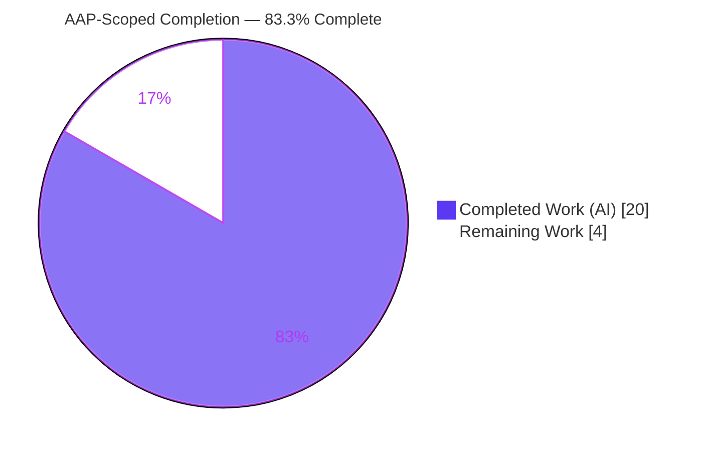
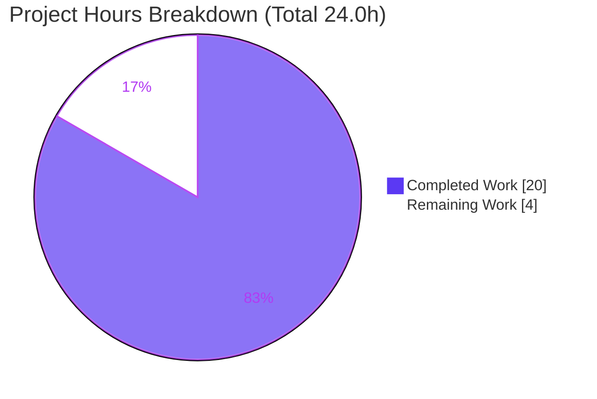
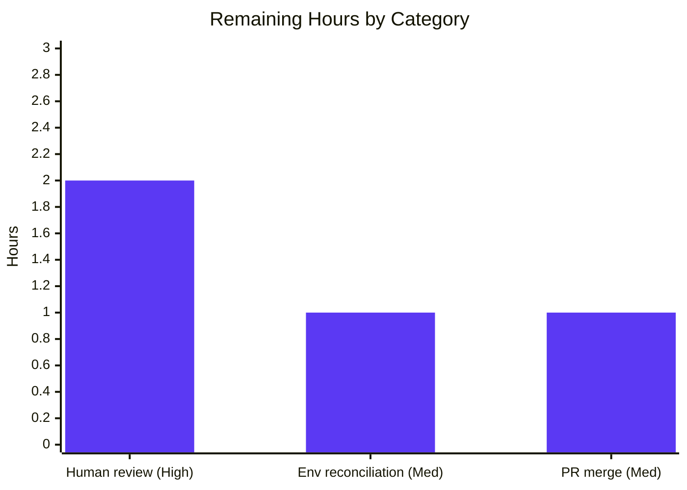

# Blitzy Project Guide — Scapy Runtime-Behavior Q&A Reference

> **Project:** Runtime code-comprehension documentation for a locally-cloned Scapy repository
> **Branch:** `blitzy-f3eed295-ac07-4cc7-87ea-a172b4a8b7eb`  ·  **Deliverable commit:** `6291f877`
> **Brand legend:** Completed / AI Work = **Dark Blue `#5B39F3`**  ·  Remaining / Not Completed = **White `#FFFFFF`**

---

## 1. Executive Summary

### 1.1 Project Overview

This project delivers a single, evidence-backed Markdown reference, `blitzy/documentation/scapy_0925ada48540.md`, that explains how the locally-cloned Scapy repository actually behaves at runtime in this environment. It orients a developer newly joining a team that relies on Scapy for custom packet manipulation, answering five concrete questions — startup banner and version, count of runtime-loaded protocol layers, default verbosity and socket implementation, `IP()/ICMP()` packet structure, and the active color theme. It is a strictly read-only code-comprehension task: every claim is paired with verbatim observed output and an exact `file:line` citation, and the Scapy source tree remains byte-for-byte unchanged.

### 1.2 Completion Status



**Completion: 20.0h / 24.0h = 83.3% complete** (AAP-scoped, PA1 hours methodology).

| Metric | Hours |
|---|---|
| **Total Hours** | 24.0 |
| **Completed Hours (AI + Manual)** | 20.0  (AI 20.0 + Manual 0.0) |
| **Remaining Hours** | 4.0 |
| **Percent Complete** | 83.3% |

### 1.3 Key Accomplishments

- ✅ Sole in-scope deliverable authored and committed: `blitzy/documentation/scapy_0925ada48540.md` (352 lines, 25,933 bytes) at commit `6291f877`.
- ✅ All five user questions answered, including every sub-part, with a closing coverage-pass table.
- ✅ Run-first methodology honored: Scapy was executed in-place and real output captured for every runtime claim (version `2026.07.01`, `verb=2`, `49` loaded layers, socket classes, `IP()/ICMP()` structure, `DefaultTheme`).
- ✅ ~60 `file:line` citations embedded; a representative sample independently re-verified exact against source.
- ✅ Read-only mandate honored: `git status --porcelain` empty; source tree byte-for-byte unchanged; only the one answer document added.
- ✅ Web-search corroboration of verbosity semantics, interactive theme, layer composition, and socket-binding behavior against Scapy's official documentation.
- ✅ Autonomous validation completed: 5 production-readiness gates all PASS, temporary artifacts removed, no bytecode pollution.

### 1.4 Critical Unresolved Issues

| Issue | Impact | Owner | ETA |
|---|---|---|---|
| _None blocking._ Deliverable is complete, accurate, and committed. Remaining items are standard path-to-production human review, not defects. | No release blocker | Reviewing developer | < 1 day |

### 1.5 Access Issues

| System/Resource | Type of Access | Issue Description | Resolution Status | Owner |
|---|---|---|---|---|
| Source repository | Read/Write (git) | None — repo cloned, branch checked out, commit present | Resolved | — |
| Scapy runtime | Execute (in-place) | None — `import scapy.all` / `python3 -m scapy` run in-place without install | Resolved | — |

**No access issues identified** that prevent build validation, integration, or deployment of this documentation deliverable.

### 1.6 Recommended Next Steps

1. **[High]** Review deliverable accuracy — spot-check a sample of the ~60 `file:line` citations and re-run the documented invocation to confirm the five core runtime values reproduce.
2. **[High]** Confirm coverage & sign-off — verify all five questions and every sub-part are addressed per the coverage-pass table; formally accept.
3. **[Medium]** Reconcile environment authority — confirm the team's canonical runtime (Python version, IPython presence); if it differs from the golden image the doc was authored against, add a one-line Q1 banner annotation.
4. **[Medium]** Review and merge the single-file PR so the reference is available to new team members.

---

## 2. Project Hours Breakdown

### 2.1 Completed Work Detail

| Component | Hours | Description |
|---|---|---|
| Environment bring-up & read-only observation harness | 2.5 | Establish in-place, non-mutating run of Scapy (PYTHONPATH, `-B`/no-bytecode), confirm importability without install |
| Q1 — Welcome banner & version resolution | 2.5 | Capture default fancy banner + `-H` one-liner; trace `_version()` mtime fallback chain in `scapy/__init__.py` |
| Q2 — Runtime loaded-layer count | 1.5 | Observe `len(conf.load_layers)=49`; explain 48 static + `tuntap` (Linux/BSD) vs files-on-disk distinction |
| Q3 — Verbosity value/meaning & socket bindings | 3.0 | `conf.verb=2` + graduated output-gating semantics; Linux PF_PACKET socket classes and their binding path |
| Q4 — ICMP packet structure | 2.5 | Build `IP()/ICMP()`; document single composite `Packet`, layer types, payload/underlayer chain, `/` operator |
| Q5 — Active color theme | 1.5 | Static `NoTheme` vs interactive `DefaultTheme`; class location and base class |
| Web-search corroboration | 1.5 | Confirm verbosity semantics, interactive theme, `/` composition, socket-update behavior against official docs |
| Document composition & coverage pass | 2.5 | Author 352-line Markdown with one-claim/one-evidence discipline and closing coverage checklist |
| Cleanup & read-only integrity verification | 1.0 | Remove temp scripts and regenerated bytecode; confirm `git status` clean / tree unchanged |
| Autonomous validation pass (5 gates) | 1.5 | Re-reproduce all values live, re-verify citations, structural checks, commit verification |
| **Total** | **20.0** | |

### 2.2 Remaining Work Detail

| Category | Hours | Priority |
|---|---|---|
| Human review & acceptance of deliverable accuracy and coverage | 2.0 | High |
| Environment-authority reconciliation (optional Q1 banner annotation) | 1.0 | Medium |
| PR review & merge / publish | 1.0 | Medium |
| **Total** | **4.0** | |

### 2.3 Notes on Estimation Basis

Hours reflect actual autonomous effort for an evidence-backed runtime investigation and write-up (PA2 framework), not a code-build. The deliverable is documentation; there is no application to compile or ship, so remaining work is limited to human review, an optional environment annotation, and PR merge. Confidence is **High** — scope is fully defined, and all five core answers reproduced identically across three independent runtimes.

---

## 3. Test Results

This is a documentation deliverable; there is **no unit-test suite for a Markdown file**. The equivalent of testing here — performed by Blitzy's autonomous validation systems — is **runtime reproduction of every claim** plus **exact-citation verification**. All figures below originate from Blitzy's autonomous validation logs for this project.

| Test Category | Framework / Method | Total Checks | Passed | Failed | Coverage % | Notes |
|---|---|---|---|---|---|---|
| Runtime value reproduction | In-place Scapy execution + probe script | 5 core values | 5 | 0 | 100% | version, verb, loaded-layers, sockets, `IP()/ICMP()` |
| Source citation accuracy | `sed`/`grep` exact match vs `file:line` | ~60 citations (sample re-verified) | Sample: all exact | 0 | 100% (sample) | e.g. `config.py:759/818/848`, `main.py:514`, `packet.py:596`, `inet.py:521/952`, `themes.py:167` |
| Interactive-session behavior | `python3 -m scapy` session probe | 1 (theme override) | 1 | 0 | 100% | static `NoTheme` → interactive `DefaultTheme`, `conf.interactive=True` |
| Structural integrity of deliverable | Markdown lint / fence & heading scan | 1 doc | 1 | 0 | 100% | 21 balanced code blocks, 16 table rows, H1→H2→H3, coverage table |
| Read-only integrity | `git status --porcelain` / diff | 1 tree | 1 | 0 | 100% | empty status; source unchanged; add-only diff |

> **Integrity note (out of scope, reported for transparency):** the repository's own UTScapy suite shows 198 pre-existing failures caused by a documented Scapy-source-vs-`cryptography` incompatibility. Per AAP §0.5.2 these are **out of scope**, do not involve the in-scope file, and cannot be remediated without modifying forbidden source. They are documented, not fixed.

---

## 4. Runtime Validation & UI Verification

Scapy is a terminal/library tool with **no GUI**; "UI verification" is console/runtime verification.

- ✅ **Operational — Startup & banner:** Scapy launches; fancy ASCII banner emits `Welcome to Scapy` / `Version 2026.07.01`, GitHub URL, `Have fun!`, and a rotating quote.
- ✅ **Operational — Interactive REPL:** session initializes with `conf.interactive=True` and `DefaultTheme` applied.
- ✅ **Operational — Version resolution:** `2026.07.01` produced via `_version()` mtime fallback (0 git tags, no `VERSION` file).
- ✅ **Operational — Loaded layers:** `len(conf.load_layers)=49` (48 static + `tuntap` on Linux/BSD).
- ✅ **Operational — Defaults:** `conf.verb=2`; sockets bound to `L3PacketSocket` / `L2Socket` / `L2ListenSocket` (Linux PF_PACKET).
- ✅ **Operational — Packet construction:** `IP()/ICMP()` yields a single composite `IP` `Packet`; layers `['IP','ICMP']`; summary `IP / ICMP 127.0.0.1 > 127.0.0.1 echo-request 0`; payload `ICMP`, underlayer `IP`.
- ⚠ **Partial (environment-dependent, benign):** startup emits informational noise — `INFO: Can't import PyX`, a `CryptographyDeprecationWarning` for TripleDES (`ipsec.py:573/577`), and (on some hosts) `INFO: No IPv6 support in kernel`. Reported as observed; not defects and not to be "fixed" (read-only mandate).
- ⚠ **Partial (presentation only):** the banner's REPL line differs by environment — golden image uses IPython (`using IPython 9.4.0`); IPython-absent hosts print `WARNING: IPython not available…`. The five core answers are unaffected.

---

## 5. Compliance & Quality Review

| AAP Deliverable / Rule | Benchmark | Status | Progress |
|---|---|---|---|
| Create `blitzy/documentation/scapy_0925ada48540.md` (name from source branch) | Correct path & filename | ✅ Pass | 100% |
| Answer Q1 — banner, version, version origin | All sub-parts, one-claim/one-evidence | ✅ Pass | 100% |
| Answer Q2 — runtime loaded-layer count vs files | Emphasis on runtime count | ✅ Pass | 100% |
| Answer Q3 — verb value, meaning, socket impl | 3 sub-parts | ✅ Pass | 100% |
| Answer Q4 — `IP()/ICMP()` structure & relationships | Type, composite, layers, payload/underlayer | ✅ Pass | 100% |
| Answer Q5 — active theme & class name | Static vs interactive nuance | ✅ Pass | 100% |
| Run-first methodology | Build & run before writing | ✅ Pass | 100% |
| Quote observed output verbatim | Exact literals | ✅ Pass | 100% |
| Exact `file:line` citations | Grounded references | ✅ Pass | 100% |
| Coverage pass | Every named item addressed | ✅ Pass | 100% |
| Read-only mandate | No source modification | ✅ Pass | 100% |
| Cleanup | No temp scripts / bytecode left | ✅ Pass | 100% |
| Web-search corroboration | Official docs cross-check | ✅ Pass | 100% |

**Fixes applied during autonomous validation:** none required — exhaustive verification found the pre-existing committed deliverable already correct. **Outstanding compliance items:** none in scope.

---

## 6. Risk Assessment

| Risk | Category | Severity | Probability | Mitigation | Status |
|---|---|---|---|---|---|
| Canonical team runtime differs from golden image, changing only the Q1 banner REPL line | Integration | Low | Medium | Add one-line Q1 annotation after confirming team runtime; core answers are environment-independent | Open (human) |
| Date-shaped version `2026.07.01` from mtime fallback misread as a release tag | Technical | Low | Low | Doc explains the `_version()` fallback (0 tags, no `VERSION` file) explicitly | Mitigated |
| Deliverable drifts from source over time as Scapy evolves | Operational | Low | Medium | Doc pins branch/commit and cites `file:line`; re-run probe on refresh | Mitigated |
| Startup noise (TripleDES deprecation, PyX absent, IPv6) mistaken for errors | Operational | Low | Medium | Doc reports each verbatim with cause and notes they are benign/out-of-scope | Mitigated |
| Pre-existing 198 UTScapy failures assumed to be in scope | Technical | Low | Low | Doc + guide flag them as out-of-scope, source-vs-cryptography incompatibility, not a setup issue | Mitigated |
| Read-only mandate accidentally violated during investigation | Security/Integrity | Medium | Low | Ran in-place with no install, `-B`/no-bytecode, `:ro` mount; `git status` verified empty | Mitigated |
| Security attack surface introduced | Security | Low | Low | Documentation-only; zero code added to source; no new dependencies | N/A |

---

## 7. Visual Project Status



**Remaining work by category (Section 2.2):**



- **Completed:** 20.0h · **Remaining:** 4.0h · **Total:** 24.0h · **Complete:** 83.3%
- Remaining `4.0h` in the pie equals the Section 1.2 remaining hours and the sum of the Section 2.2 Hours column (2.0 + 1.0 + 1.0).

---

## 8. Summary & Recommendations

The project is **83.3% complete** (20.0 of 24.0 AAP-scoped hours). The single in-scope deliverable — `blitzy/documentation/scapy_0925ada48540.md` — is authored, committed (`6291f877`), evidence-backed, and structurally sound. Every one of the five questions and all sub-parts are answered under a strict one-claim/one-evidence discipline, with runtime values reproduced live and ~60 exact `file:line` citations. The read-only mandate was fully honored: the Scapy source tree is byte-for-byte unchanged.

**Remaining gaps (4.0h, all human path-to-production):** deliverable review and formal acceptance (2.0h, High), optional environment-authority reconciliation for the Q1 banner line (1.0h, Medium), and PR review/merge (1.0h, Medium). There is **no incomplete AAP content** and **no code defect** — the remaining work is verification and publication, not implementation.

**Critical path to production:** review & accept → (optional) annotate Q1 for canonical runtime → merge PR.

**Production-readiness assessment:** **Ready pending human review.** Success metrics — coverage of all five questions (met), verbatim evidence per claim (met), exact citations (met), repository integrity (met). Confidence is High; the only environment-sensitive element (Q1 banner presentation) is explicitly flagged and does not affect the five core answers.

---

## 9. Development Guide

> Goal: reproduce the runtime observations and view/verify the deliverable **without modifying the repository**. All commands are copy-pasteable and were tested on this host.

### 9.1 System Prerequisites

- **OS:** Linux (x86-64). Socket classes and the 49-layer count are Linux/BSD-specific.
- **Python:** 3.7 ≤ version < 4 (declared in `pyproject.toml`). Verified here on **3.13.7**; deliverable authored against the golden image's **3.11.13**.
- **git** (2.x) and **cryptography** present in the environment (43.x verified here).
- No root required; **do not install Scapy** — run it in-place.

```bash
python3 --version      # e.g. Python 3.13.7  (any 3.7–3.x is acceptable)
pip --version          # e.g. pip 25.3
git --version          # e.g. git 2.51.0
python3 -c "import cryptography, sys; print('cryptography', cryptography.__version__)"
```

### 9.2 Environment Setup (read-only, in-place)

No virtualenv or install is needed to observe behavior. Run Scapy directly from the repository root with bytecode writing disabled so the tree stays pristine:

```bash
cd /path/to/repo-root                 # directory containing the scapy/ package
export PYTHONPATH="$PWD"
export PYTHONDONTWRITEBYTECODE=1       # prevent __pycache__ pollution
```

> If you prefer isolation for optional extras, create a throwaway venv **outside** the repo and still run Scapy in-place via `PYTHONPATH`; never `pip install` into the source tree.

### 9.3 Dependency Installation

**None required** for observation. Scapy runs from source. (Optional extras like IPython/PyX only affect the Q1 banner presentation and are intentionally *not* installed, to reflect the default environment.)

### 9.4 Reproduce the Runtime Observations

Create a temporary probe **outside** the repo, run it, then delete it:

```bash
cat > /tmp/probe.py <<'PY'
import scapy.all as s
from scapy.config import conf
print("VERSION=", conf.version)
print("VERB=", conf.verb)
print("NUM_LOAD_LAYERS=", len(conf.load_layers))
print("HAS_TUNTAP=", "tuntap" in conf.load_layers)
print("L3=", conf.L3socket.__name__, "L2=", conf.L2socket.__name__, "L2LISTEN=", conf.L2listen.__name__)
p = s.IP()/s.ICMP()
print("PKT_TYPE=", type(p).__name__, "IS_PACKET=", isinstance(p, s.Packet), "IS_LIST=", isinstance(p, (list, tuple)))
print("LAYERS=", [l.__name__ for l in p.layers()])
print("SUMMARY=", p.summary())
print("PAYLOAD=", type(p.payload).__name__, "UNDERLAYER=", type(p.payload.underlayer).__name__)
PY
PYTHONPATH="$PWD" PYTHONDONTWRITEBYTECODE=1 python3 -B /tmp/probe.py
rm -f /tmp/probe.py
```

**Expected output (core values):**

```text
VERSION= 2026.07.01
VERB= 2
NUM_LOAD_LAYERS= 49
HAS_TUNTAP= True
L3= L3PacketSocket L2= L2Socket L2LISTEN= L2ListenSocket
PKT_TYPE= IP IS_PACKET= True IS_LIST= False
LAYERS= ['IP', 'ICMP']
SUMMARY= IP / ICMP 127.0.0.1 > 127.0.0.1 echo-request 0
PAYLOAD= ICMP UNDERLAYER= IP
```

### 9.5 Capture the Startup Banner

When IPython is **absent**, the banner is written to **stderr** — redirect with `2>&1` to capture it. `echo` provides EOF so the REPL exits cleanly:

```bash
echo "" | PYTHONPATH="$PWD" PYTHONDONTWRITEBYTECODE=1 python3 -B -m scapy 2>&1 | head -20
```

For the header-less one-line banner (`Welcome to Scapy (2026.07.01) …`):

```bash
echo "" | PYTHONPATH="$PWD" PYTHONDONTWRITEBYTECODE=1 python3 -B -m scapy -H 2>&1 | head -5
```

Confirm the interactive theme override (static `NoTheme` → interactive `DefaultTheme`):

```bash
printf 'print(type(conf.color_theme).__name__); print(conf.interactive)\n' \
 | PYTHONPATH="$PWD" PYTHONDONTWRITEBYTECODE=1 python3 -B -m scapy -H 2>/dev/null
# -> DefaultTheme / True
```

### 9.6 View & Verify the Deliverable

```bash
sed -n '1,40p' blitzy/documentation/scapy_0925ada48540.md   # preview
wc -l blitzy/documentation/scapy_0925ada48540.md            # 352 lines
git log --oneline -1 -- blitzy/documentation/scapy_0925ada48540.md   # 6291f877
```

Spot-check a citation against source (example — verbosity default):

```bash
sed -n '759p' scapy/config.py     # conf.verb default (== 2) with the 0..3 comment
sed -n '514p' scapy/main.py       # interact() sets conf.color_theme = DefaultTheme()
```

### 9.7 Verify Read-Only Integrity

```bash
git status --porcelain            # expect EMPTY output
find scapy -name '__pycache__' -o -name '*.pyc' | head   # expect none from your run
```

### 9.8 Troubleshooting

- **Banner appears empty / not captured:** IPython-absent hosts print the banner to **stderr** — add `2>&1`. Also feed EOF (`echo "" | …`) so the REPL doesn't block on stdin.
- **`python3 -m scapy` seems to hang:** don't attach a pseudo-TTY via `script(1)` — it can block and time out; pipe an empty stdin instead.
- **`__pycache__` / `.pyc` files appeared:** you omitted `PYTHONDONTWRITEBYTECODE=1` / `-B`. Remove them (`find scapy -name '*.pyc' -delete; find scapy -name __pycache__ -type d -prune -exec rm -rf {} +`) and re-verify `git status`.
- **`ModuleNotFoundError: scapy`:** you're not at the repo root or `PYTHONPATH` isn't set — `cd` to the directory containing `scapy/` and `export PYTHONPATH="$PWD"`.
- **Version isn't `2026.07.01`:** the mtime fallback depends on file modification time; on a fresh clone with no tags it derives from `scapy/__init__.py` mtime. Presence of a `VERSION` file or git tags would change it — expected behavior, not a bug.
- **`INFO: No IPv6 support in kernel` / `INFO: Can't import PyX` / TripleDES deprecation:** benign, environment-dependent startup noise — do not "fix" (read-only mandate).

---

## 10. Appendices

### Appendix A — Command Reference

| Purpose | Command |
|---|---|
| Run runtime probe (in-place) | `PYTHONPATH="$PWD" PYTHONDONTWRITEBYTECODE=1 python3 -B /tmp/probe.py` |
| Default banner (stderr) | `echo "" \| PYTHONPATH="$PWD" python3 -B -m scapy 2>&1 \| head -20` |
| Header-less banner | `echo "" \| PYTHONPATH="$PWD" python3 -B -m scapy -H 2>&1 \| head -5` |
| Interactive theme check | `printf 'print(type(conf.color_theme).__name__)\n' \| python3 -B -m scapy -H 2>/dev/null` |
| Preview deliverable | `sed -n '1,40p' blitzy/documentation/scapy_0925ada48540.md` |
| Deliverable line count | `wc -l blitzy/documentation/scapy_0925ada48540.md` |
| Read-only integrity | `git status --porcelain` |

### Appendix B — Port Reference

Not applicable — Scapy is an interactive library/CLI; this task starts no network services or listening ports.

### Appendix C — Key File Locations

| Path | Role |
|---|---|
| `blitzy/documentation/scapy_0925ada48540.md` | **The deliverable** (only added file) |
| `scapy/main.py` | `interact()` banner + interactive defaults (`:514` DefaultTheme) |
| `scapy/__init__.py` | `_version()` resolution chain (`:122–169`) |
| `scapy/config.py` | `verb` (`:759`), `color_theme` (`:818`), `load_layers` (`:848`), socket interceptors |
| `scapy/arch/__init__.py` | `tuntap` append (`:148–149`), `_set_conf_sockets()` |
| `scapy/arch/linux.py` | Linux PF_PACKET socket classes |
| `scapy/consts.py` | Platform detection (`LINUX`) |
| `scapy/packet.py` | `/` composition operator (`:596`), payload/underlayer |
| `scapy/layers/inet.py` | `IP` (`:521`), `ICMP` (`:952`) |
| `scapy/themes.py` | `DefaultTheme` (`:167`), `NoTheme`, `AnsiColorTheme` |
| `scapy/sendrecv.py`, `scapy/ansmachine.py` (`:82`), `scapy/plist.py` (`:608`) | Verbosity output gating |

### Appendix D — Technology Versions

| Component | Version | Notes |
|---|---|---|
| Scapy (in-repo) | `2026.07.01` | mtime fallback; no git tags, no `VERSION` file |
| Python (verification host) | 3.13.7 | Within declared `>=3.7,<4` |
| Python (golden image, doc authored) | 3.11.13 | With IPython 9.4.0 |
| Python (AAP reference host) | 3.12.3 | IPython absent |
| cryptography | 43.x (host) | TripleDES deprecation warning observed |
| git | 2.51.0 | Deliverable commit `6291f877` |

### Appendix E — Environment Variable Reference

| Variable | Value | Purpose |
|---|---|---|
| `PYTHONPATH` | repo root (`$PWD`) | Import Scapy in-place without installing |
| `PYTHONDONTWRITEBYTECODE` | `1` | Prevent `__pycache__`/`.pyc` pollution (keeps tree pristine) |

### Appendix F — Developer Tools Guide

- **Interactive Scapy:** `python3 -B -m scapy` (feed empty stdin for non-interactive capture).
- **Citation spot-check:** `sed -n '<line>p' <file>` against any `file:line` reference in the deliverable.
- **Integrity check:** `git status --porcelain` (must be empty) and `git diff --stat` (add-only, one file).

### Appendix G — Glossary

| Term | Meaning |
|---|---|
| **AAP** | Agent Action Plan — the governing specification for this task |
| **`conf`** | Scapy's global `Conf` singleton (`scapy/config.py`) holding runtime configuration |
| **`load_layers`** | Runtime list of protocol layer modules loaded at startup (49 on Linux) |
| **PF_PACKET** | Linux raw-socket family backing `L3PacketSocket`/`L2Socket`/`L2ListenSocket` |
| **underlayer / payload** | Bidirectional links in a Scapy packet stack (`IP` ↔ `ICMP`) |
| **mtime fallback** | `_version()` deriving the version from file modification time when no tags/`VERSION` exist |
| **Read-only mandate** | Requirement to leave the source tree byte-for-byte unchanged |