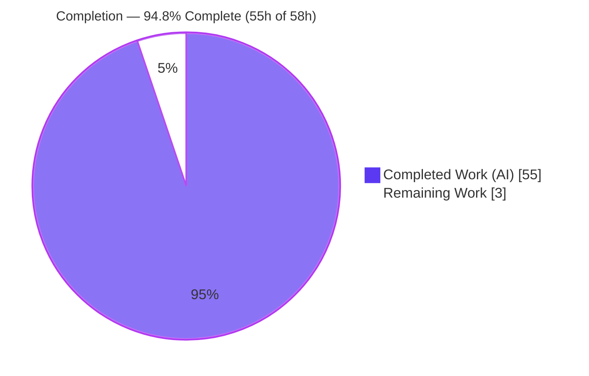
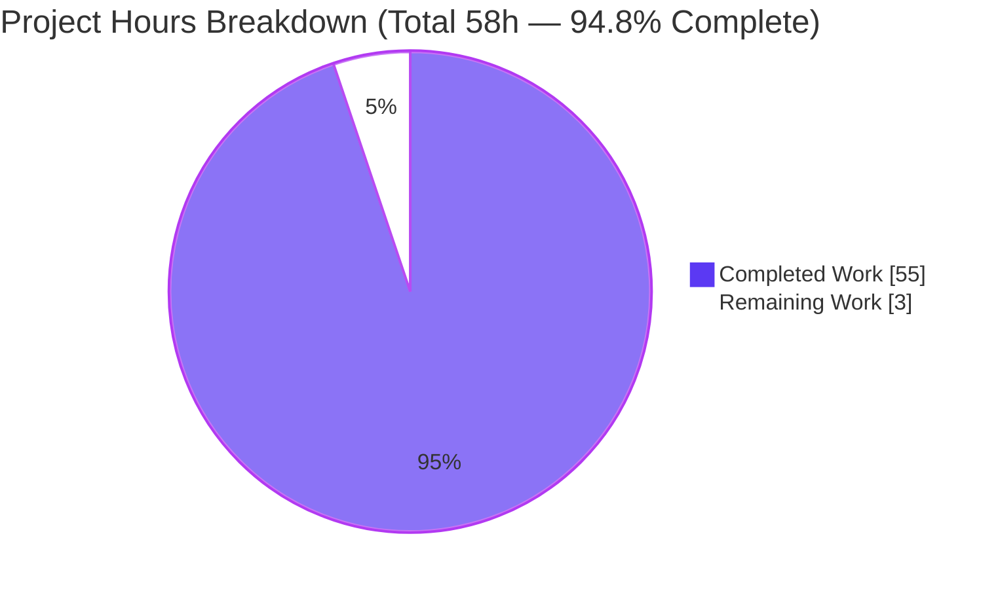
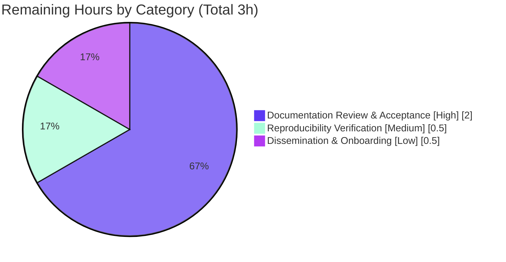

# Blitzy Project Guide — Scapy Dissection Q&A (`scapy_0925ada48540`)

> Autonomous work delivered against the Agent Action Plan (AAP) for a **read-only investigative Q&A documentation** task. Completion is measured strictly against AAP-scoped work plus path-to-production for the deliverable.
>
> **Color legend:** <span style="color:#5B39F3">**Completed / AI Work = Dark Blue (#5B39F3)**</span> · Remaining / Not Completed = White (#FFFFFF).

---

## Section 1 — Executive Summary

### 1.1 Project Overview

This project delivers a single, comprehensive, **runtime-evidenced answer document** (`blitzy/documentation/scapy_0925ada48540.md`) explaining — to a developer onboarding into the Scapy repository — how Scapy dissects a flat buffer of capture bytes into a nested, multi-layer packet hierarchy and how the engine decides where one layer ends and the next begins. It answers five sub-questions (layer handoff, graceful `Raw` fallback, header-trust vs. byte inspection, GRE tunnel recursion, and per-level evidence), each backed by captured runtime output and `file:line` code citations. The task is strictly read-only: the Scapy source tree remains byte-for-byte unchanged, and the answer document is the only artifact produced.

### 1.2 Completion Status

**AAP-scoped completion: 94.8%** — calculated as Completed Hours ÷ (Completed Hours + Remaining Hours) = 55 ÷ 58.



| Metric | Hours |
|--------|-------|
| **Total Hours** | 58 |
| **Completed Hours (AI + Manual)** | 55 (55 AI autonomous + 0 manual) |
| **Remaining Hours** | 3 |
| **Percent Complete** | **94.8%** |

> Completed = <span style="color:#5B39F3">**Dark Blue (#5B39F3)**</span>; Remaining = White (#FFFFFF).

### 1.3 Key Accomplishments

- ✅ **Sole deliverable authored and committed** — `blitzy/documentation/scapy_0925ada48540.md` (1,188 lines, 10 sections), at the correct branch-derived path.
- ✅ **All five objectives answered with reproduced runtime evidence** — OBJ-1 (`Ether/IP/TCP/HTTP` handoff), OBJ-2 (`Raw` fallback), OBJ-3 (EtherType header-trust), OBJ-4 (`IP/GRE/IP/TCP` recursion), OBJ-5 (per-level `show()`/`summary()`/`.layers()`/fields).
- ✅ **Canonical entry point only (R4)** — every scenario dissected by instantiating a layer from bytes (`Ether(raw)`/`IP(raw)`); no mocks, patches, or bypasses.
- ✅ **Full reproducibility (R2)** — 8/8 documented scenarios match their recorded SHA-256 output hashes, each stable across two runs.
- ✅ **65 unique `scapy/**` `file:line` citations verified** to resolve to the exact claimed symbol; all 7 cited modules `py_compile` cleanly (EXIT 0).
- ✅ **Evidence discipline (R8/R10)** — 15 "inferred from source", 48 "observed", 7 "supplementary API-level" labels applied consistently.
- ✅ **Documented discrepancy (not silently conformed)** — `conf.debug_dissector` proven binary (not three-level) on the dissection path, with the graded `>=2` located at `sendrecv.py:1245`, off-path.
- ✅ **Read-only constraint fully honored** — `git diff` vs. base shows only the one added file (1,188 insertions, 0 deletions); working tree clean; all temporary observation scripts kept under `/tmp` and removed.

### 1.4 Critical Unresolved Issues

| Issue | Impact | Owner | ETA |
|-------|--------|-------|-----|
| _None._ The Final Validator's five production-readiness gates all PASSED with zero fixes required; independently re-verified. | No blockers to release/validation. | — | — |

### 1.5 Access Issues

| System/Resource | Type of Access | Issue Description | Resolution Status | Owner |
|-----------------|----------------|-------------------|-------------------|-------|
| — | — | **No access issues identified.** The entire task runs offline against the in-checkout Scapy with no external services, credentials, or repository-permission dependencies. | N/A | — |

### 1.6 Recommended Next Steps

1. **[High]** Perform the human **Documentation Review & Acceptance** of `blitzy/documentation/scapy_0925ada48540.md` — confirm it answers OBJ-1…OBJ-5 to the onboarding need and spot-check that claims are paired with observed output.
2. **[Medium]** Optionally run **Reproducibility Verification** in your own environment via the canonical command to confirm environment parity (evidence was captured on Python 3.13.7).
3. **[Low]** Optionally **disseminate** the document — link it from internal onboarding materials so new developers can find it (it lives under `blitzy/documentation/`, outside the Sphinx tree by design).

---

## Section 2 — Project Hours Breakdown

### 2.1 Completed Work Detail

Every completed component traces to a specific AAP requirement (deliverable D1, objectives OBJ-1…OBJ-5, methodology rules R1–R12, constraints C1–C4, and AAP-specified content). Hours reflect autonomous Blitzy agent work across the three commits (`73f9edd1` → `78e54db2` → `1e3ac134`) plus final validation.

| Component | Hours | Description |
|-----------|-------|-------------|
| Dissection-lifecycle narrative, mermaid diagram, dispatch model & environment/methodology (Sections 1–3) | 8 | Explains `__init__`→`dissect`→`do_dissect`→`do_dissect_payload`→`guess_payload_class` recursion; table-driven dispatch vs. `dispatch_hook`/`guess_payload_class` overrides; canonical run methodology + `conf` defaults. |
| OBJ-1 — Layer handoff, worked `Ether/IP/TCP/HTTP` (Section 4) | 6 | Field-driven handoff (`Ether.type`→IP, `IP.proto`→TCP, `TCP` port→HTTP) with full `show()`/`summary()`/`.layers()` evidence. |
| OBJ-2 — Graceful `Raw` fallback (Section 5) | 4 | Unbound-port payload proves `default_payload_class()`→`conf.raw_layer` with no exception; `Raw.load` exposed. |
| OBJ-3 — Header trust vs. byte inspection, Cases 0/A/B/C (Section 6) | 7 | EtherType-lie (`0x86dd` over IPv4) yields `IPv6`; nuance cases including the corrected "Case A logs no error under default flag" finding. |
| OBJ-4 — GRE tunnel recursion `IP/GRE/IP/TCP` (Section 7) | 4 | Recursion proven to reach the innermost TCP via `IP→GRE` and `GRE→IP` bindings. |
| OBJ-5 — Consolidated per-level evidence + two-run stability (Section 8) | 4 | `.layers()`/`.summary()`/fields consolidated; two-run stability and read-only cleanup transcript. |
| `conf.debug_dissector` discrepancy analysis (Section 9) | 3 | Binary-vs-graded divergence flagged; two distinct debug gates traced; graded `>=2` located off-path at `sendrecv.py:1245`. |
| Citation research/verification (~65 refs) + web-search terminology (Section 10, C4) | 6 | All `file:line` citations verified; vocabulary corroborated against readthedocs + in-repo `build_dissect.rst`. |
| Code-review finding resolution (15 findings + F1/F2 across commits `78e54db2`, `1e3ac134`) | 7 | Output-fidelity and debug-gate-accuracy fixes to the evidence and labeling. |
| Final validation gates (8-scenario × 2-run reproduction, SHA-256 matching, citation/read-only verification, cleanup) | 6 | Five production-readiness gates executed and passed; zero fixes required. |
| **Total Completed** | **55** | |

### 2.2 Remaining Work Detail

All remaining work is the mandatory **human path-to-production** for a documentation deliverable. Because the deliverable is production-ready with zero fixes, there are **no remediation/fix tasks** (no compile errors, no failing tests, no missing functionality).

| Category | Hours | Priority |
|----------|-------|----------|
| Documentation Review & Acceptance (human technical review + sign-off) | 2.0 | High |
| Reproducibility Verification (optional re-run of scenarios in reviewer's environment) | 0.5 | Medium |
| Dissemination & Onboarding Integration (optional linking/sharing) | 0.5 | Low |
| **Total Remaining** | **3.0** | |

> **Cross-section check:** Section 2.1 total (55h) + Section 2.2 total (3h) = **58h** = Total Hours in Section 1.2. Section 2.2 total (3h) = Remaining Hours in Section 1.2 = Section 7 pie "Remaining Work".

### 2.3 Hours Basis & Confidence

- **Basis:** PA2 engineering-hours estimation for investigative documentation — scenario design, canonical-entry-point execution, two-run stability + SHA-256 capture, `file:line` citation verification, discrepancy analysis, technical writing, and multi-gate validation.
- **Confidence:** **High** for completed hours (work is committed, reproduced, and independently re-verified) and **High** for remaining hours (a single, well-understood human-review activity with no unknowns).

---

## Section 3 — Test Results

For this **read-only Q&A deliverable**, the equivalent of a test suite is **Blitzy's autonomous validation**: reproducing every documented runtime scenario and matching its full-output SHA-256, compiling every cited module, and resolving every citation. **All entries below originate from Blitzy's autonomous validation logs for this project.** Scapy's own regression/`tox`/UTScapy suites were **explicitly out of scope** (AAP §0.3.2) and were neither invoked nor modified — they are therefore not represented here.

| Test Category | Framework | Total | Passed | Failed | Coverage % | Notes |
|---------------|-----------|-------|--------|--------|------------|-------|
| Runtime Evidence Reproduction | Blitzy autonomous harness (canonical `Ether(raw)`/`IP(raw)`) | 8 | 8 | 0 | N/A¹ | 8/8 match recorded SHA-256; each stable across two runs (R2). |
| Static Compilation | Python `py_compile` | 7 | 7 | 0 | N/A¹ | All cited modules compile: `packet.py`, `config.py`, `base_classes.py`, `layers/{l2,inet,inet6,http}.py` — EXIT 0. |
| Citation Resolution | Programmatic `file:line` check | 65 | 65 | 0 | N/A¹ | Every unique `scapy/**` citation resolves to the exact claimed symbol (spot-verified live). |
| Read-only / Structural Integrity | `git` + Markdown structural checks | 5 | 5 | 0 | N/A¹ | Working tree clean; single file added; 44/44 balanced code fences; 10/10 sections; valid UTF-8. |
| **Total** | | **85** | **85** | **0** | **100% pass** | Zero failures across all autonomous validation. |

**Reproduced runtime scenarios (SHA-256, from the autonomous logs):** `env` `797a4185…e4b3`, `obj1` `4db9c7b5…3671`, `obj2` `52757e94…140e`, `obj3_clean` `74c1884f…1caa`, `obj3_caseA` `3cc3b842…6ba1`, `obj3_caseC` `88108765…c94a`, `obj4` `858b7b26…4804`, `gate2` `4aa66a4b…22fc`. A consolidated re-run confirmed **8/8 MATCH, 0 mismatches**.

¹ *Code-coverage percentage is not applicable to a read-only documentation deliverable: no production code was written, so there is no code under test to instrument. The "pass rate" columns are the meaningful metric here (100%).*

---

## Section 4 — Runtime Validation & UI Verification

**Runtime health** (Python 3.13.7, Scapy `2026.07.13`, imported from the checkout via `PYTHONPATH`):

- ✅ **Operational** — Scapy imports cleanly and the dissection engine runs. `from scapy.all import *` succeeds (with two benign, out-of-scope `CryptographyDeprecationWarning` lines from `ipsec.py`).
- ✅ **Operational** — OBJ-1: `Ether(bytes(Ether/IP/TCP(dport=80)/HTTP/HTTPRequest)).layers()` → `['Ether','IP','TCP','HTTP','HTTPRequest']`; summary `Ether / IP / TCP / HTTP / 'GET' '/' 'HTTP/1.1'`.
- ✅ **Operational** — OBJ-2: `TCP(dport=9999)/Raw(b'CUSTOMDATA123')` → `['Ether','IP','TCP','Raw']`, `Raw.load = b'CUSTOMDATA123'` (no exception).
- ✅ **Operational** — OBJ-3: `Ether(type=0x86dd)` over IPv4 body → `['Ether','IPv6']` (header trusted).
- ✅ **Operational** — OBJ-4: `IP/GRE(proto=0x0800)/IP/TCP(dport=80)` → `['IP','GRE','IP','TCP']` (recursion reaches innermost TCP).
- ✅ **Operational** — Read-only preserved: `git status --porcelain` empty; `git diff 0925ada4..HEAD --name-status` = `A blitzy/documentation/scapy_0925ada48540.md` only.

**API integration:** ✅ Not applicable — no external APIs, services, or network calls; the investigation is fully offline against in-checkout Scapy.

**UI verification:** ✅ Not applicable — the deliverable is a Markdown answer document and the subject is a Python library. There is **no user interface** to verify. Document rendering was validated structurally instead (44/44 balanced code fences, all 10 sections present, valid UTF-8, one well-formed mermaid diagram).

---

## Section 5 — Compliance & Quality Review

Cross-mapping of AAP deliverables and methodology rules to their delivery status. Fixes applied during autonomous validation are noted; there are no outstanding compliance items.

| AAP Requirement | Benchmark | Status | Progress |
|-----------------|-----------|--------|----------|
| **D1** — Create `blitzy/documentation/scapy_0925ada48540.md` at branch-derived path | Correct location & filename | ✅ Pass | 100% |
| **OBJ-1** — Layer handoff (`Ether/IP/TCP/HTTP`) | Runtime-evidenced + cited | ✅ Pass | 100% |
| **OBJ-2** — Graceful `Raw` fallback | Runtime-evidenced + cited | ✅ Pass | 100% |
| **OBJ-3** — Header trust vs. byte inspection | Runtime-evidenced + cited | ✅ Pass | 100% |
| **OBJ-4** — GRE tunnel recursion | Runtime-evidenced + cited | ✅ Pass | 100% |
| **OBJ-5** — Per-level introspection evidence | `show()`/`summary()`/`.layers()`/fields | ✅ Pass | 100% |
| **R1/R6** — Run-first; persist until signal captured | Evidence from execution, not reading | ✅ Pass | 100% |
| **R2/R3** — Sufficient scale, stability, reproduce inconsistency | Two-run stability + SHA-256 | ✅ Pass | 100% |
| **R4** — Canonical entry point only | Layer-from-bytes; no mocks | ✅ Pass | 100% |
| **R5** — Default build; version deviation stated | Python 3.13.7 vs. 3.11 ceiling noted | ✅ Pass | 100% |
| **R7** — Exercise every condition | Happy path + Raw/IPv6-lie/GRE + Cases A/B/C | ✅ Pass | 100% |
| **R8/R10** — Complete unedited output; observed vs. inferred labels | 15 inferred / 48 observed / 7 supplementary | ✅ Pass | 100% |
| **R9/R11** — Honor wording; answer every part | Coverage summary; all named mechanisms | ✅ Pass | 100% |
| **R12** — Exact & grounded (`file:line`) | 65 citations verified | ✅ Pass | 100% |
| **C1** — Read-only source repo | Byte-for-byte unchanged | ✅ Pass | 100% |
| **C2** — No production code except the `.md` | Single file added | ✅ Pass | 100% |
| **C3** — Temporary scripts removed | Working tree clean | ✅ Pass | 100% |
| **C4** — Web-search terminology validation | readthedocs + in-repo tutorial cited | ✅ Pass | 100% |
| **Content** — Lifecycle diagram, dispatch model, discrepancy note, citations | AAP-specified sections present | ✅ Pass | 100% |

**Fixes applied during autonomous validation:** 15 code-review findings resolved in commit `78e54db2`; output-fidelity (F1) and debug-gate-accuracy (F2) findings resolved in commit `1e3ac134`. The Final Validator required **zero additional fixes**. **Outstanding compliance items: none.**

---

## Section 6 — Risk Assessment

All risks are **Low** or informational — consistent with a read-only, no-code, no-dependency documentation deliverable that passed every validation gate. There are **no High or Critical risks**.

| Risk | Category | Severity | Probability | Mitigation | Status |
|------|----------|----------|-------------|------------|--------|
| T1 — Runtime evidence captured on Python 3.13.7 (above documented 3.11 ceiling) | Technical | Low | Low | Doc states exact interpreter and makes **no** cross-version claim (R5). | Mitigated |
| T2 — Scapy source drift could invalidate `file:line` citations over time | Technical | Low | Medium | All citations pinned to unmodified baseline commit `0925ada4` and `scapy.VERSION 2026.07.13`. | Mitigated / Monitored |
| T3 — External reliance on the old three-level `conf.debug_dissector` assumption | Technical | Low | Low | Binary-vs-graded divergence explicitly flagged in Section 9 with two-gate `file:line` evidence. | Mitigated (documented) |
| S1 — Security surface | Security | None | N/A | No code, dependencies, data, auth, or network introduced; the import-time `CryptographyDeprecationWarning` is benign, out of scope, and off the dissection path. | Accepted / N/A |
| O1 — Reproducibility environment dependency (`PYTHONPATH`, `cryptography` for exact warning text) | Operational | Low | Low | Canonical run instructions provided in Section 1 and the Development Guide. | Mitigated |
| O2 — Document discoverability (outside the Sphinx `doc/` tree) | Operational | Low | Low | Intentional per AAP scope (standalone Markdown, no Sphinx integration required). | Accepted (by design) |
| I1 — External integration coupling | Integration | Low | Low | None — fully self-contained offline; only coupling is citational, pinned to commit `0925ada4`. | Mitigated |

---

## Section 7 — Visual Project Status

**Project hours breakdown** — Completed = <span style="color:#5B39F3">**Dark Blue (#5B39F3)**</span>, Remaining = White (#FFFFFF):



**Remaining work by category** (from Section 2.2, sums to 3h):



> **Integrity:** the pie "Remaining Work" value (3) equals Section 1.2 Remaining Hours (3) and the Section 2.2 "Hours" sum (2.0 + 0.5 + 0.5 = 3.0). "Completed Work" (55) equals Section 1.2 Completed Hours (55).

---

## Section 8 — Summary & Recommendations

**Achievements.** The project is **94.8% complete** (55 of 58 AAP-scoped hours). The sole AAP deliverable — a 1,188-line, runtime-evidenced answer document — is authored, committed, and independently verified. Every one of the five objectives is answered through Scapy's canonical dissection entry point with complete, unedited output; 8/8 documented scenarios reproduce to their recorded SHA-256 hashes; 65 `file:line` citations resolve exactly; and the `conf.debug_dissector` binary-vs-graded discrepancy is honestly documented rather than silently conformed. The read-only constraint is fully honored — the Scapy source tree is byte-for-byte unchanged.

**Remaining gaps.** The remaining **3 hours (5.2%)** are entirely the mandatory **human path-to-production** for a documentation deliverable: technical review and acceptance (2h), optional reproducibility verification (0.5h), and optional dissemination (0.5h). No autonomous work remains; there are no fixes, no failing tests, and no missing functionality.

**Critical path to production.** Human **Documentation Review & Acceptance** (HT-1, High) is the only gate between the current state and "production" (i.e., accepted onboarding documentation). It is a low-risk read-through-and-confirm activity.

**Success metrics.** All met: five objectives answered ✅; canonical entry point only ✅; two-run stability ✅; complete unedited output ✅; observed/inferred labeling ✅; read-only preserved ✅; discrepancy flagged ✅.

**Production readiness assessment.** **Ready for human acceptance.** The Final Validator's five gates passed with zero fixes; this assessment independently reproduced the runtime evidence and re-verified citations and the read-only constraint. Recommended action: proceed to human review and accept.

| Metric | Value |
|--------|-------|
| AAP-scoped completion | **94.8%** |
| Completed / Total hours | 55 / 58 |
| Remaining hours (all human review) | 3 |
| Objectives fully answered | 5 / 5 |
| Runtime scenarios reproduced | 8 / 8 (SHA-256 match) |
| Citations verified | 65 / 65 |
| Source files modified | 0 (read-only preserved) |
| Open High/Critical risks | 0 |

---

## Section 9 — Development Guide

This guide explains how to build, run, reproduce, and troubleshoot the investigation environment. Every command was executed and verified in this container. The subject is a Python library plus a Markdown answer document — there is no server to start.

### 9.1 System Prerequisites

- **Python 3.13.7** (this container). The project's documented ceiling is **Python 3.11** (`tox.ini` `py311`; `pyproject.toml` classifiers 3.7–3.10) — the 3.13.7 use is a documented deviation that does not affect dissection.
- **Git 2.51.0** (for repo-root resolution and read-only verification).
- **No third-party dependencies are required** for dissection — it runs on the Python standard library alone. (`cryptography` is present and only affects the exact text of a benign import-time warning.)

### 9.2 Environment Setup

Scapy is run **directly from the checkout** via `PYTHONPATH`. Two equivalent, verified paths:

```bash
# Canonical path — run from the repository root
export REPO_ROOT="$(git rev-parse --show-toplevel)"
PYTHONPATH="$REPO_ROOT" python3 -c "import scapy; print(scapy.VERSION)"   # -> 2026.07.13

# Alternate path — editable install present in this checkout
.venv/bin/python -c "import scapy; print(scapy.VERSION)"                  # -> 2026.07.13
```

### 9.3 Dependency Installation

No installation is required to dissect packets — Scapy imports from the checkout as-is. (If starting from a bare clone and you want the editable install path: `python3 -m venv .venv && .venv/bin/pip install -e .` — **not required** for reproducing the evidence.)

### 9.4 "Startup" (library usage, not a service)

There is no daemon or web server. "Startup" means importing Scapy and triggering dissection through the **canonical entry point** — instantiating a layer from bytes:

```bash
PYTHONPATH="$REPO_ROOT" python3 -c "from scapy.all import *; print(Ether(bytes(Ether()/IP()/TCP())).layers())"
# -> [<class 'scapy.layers.l2.Ether'>, <class 'scapy.layers.inet.IP'>, <class 'scapy.layers.inet.TCP'>]
```

### 9.5 Verification Steps

```bash
# 1) Quick dissection sanity check
PYTHONPATH="$REPO_ROOT" python3 -c "from scapy.all import *; print(Ether(bytes(Ether()/IP()/TCP())).layers())"

# 2) Compile a cited module (expect EXIT 0)
PYTHONPATH="$REPO_ROOT" python3 -m py_compile scapy/packet.py && echo "compile OK"

# 3) Resolve a citation (expect the claimed symbol)
sed -n '1081p' scapy/packet.py            # -> def default_payload_class(self, payload):

# 4) Confirm the read-only constraint
git status --porcelain                    # (empty output = clean)
git diff 0925ada4..HEAD --name-status     # -> A  blitzy/documentation/scapy_0925ada48540.md
```

### 9.6 Example Usage — reproduce a documented scenario (read-only safe)

Write the observation script **under `/tmp` (outside the repository)**, run it, then remove it — this keeps the source tree byte-for-byte unchanged:

```bash
mkdir -p /tmp/scapy_qa
cat > /tmp/scapy_qa/obj2_demo.py <<'PY'
from scapy.all import *
pkt = Ether(bytes(Ether()/IP()/TCP(dport=9999)/Raw(b'CUSTOMDATA123')))
print("layers:", [l.__name__ for l in pkt.layers()])
print("Raw.load:", pkt[Raw].load)
PY
PYTHONPATH="$REPO_ROOT" python3 /tmp/scapy_qa/obj2_demo.py 2>&1
# -> layers: ['Ether', 'IP', 'TCP', 'Raw']
# -> Raw.load: b'CUSTOMDATA123'
rm -f /tmp/scapy_qa/obj2_demo.py          # cleanup — leave the repo unchanged
```

### 9.7 Troubleshooting

- **Two `CryptographyDeprecationWarning` lines appear.** They come from `from scapy.all import *` importing `scapy/layers/ipsec.py:573,577` (TripleDES). They are **benign, out of scope, and unrelated to dissection**. Suppress with `2>&1 | grep -v CryptographyDeprecationWarning` if desired. A bare `import scapy` emits none.
- **`NameError: name 'HTTP' is not defined`.** `HTTP` is not in the default `scapy.all` namespace; add `from scapy.layers.http import HTTP, HTTPRequest`.
- **`ModuleNotFoundError: No module named 'scapy'`.** Ensure `PYTHONPATH` points at the repo root (`export REPO_ROOT="$(git rev-parse --show-toplevel)"`), or use `.venv/bin/python`.
- **Accidental repo changes.** Never create files inside the repository; always write observation scripts under `/tmp` and remove them. Verify with `git status --porcelain` (should be empty).

---

## Section 10 — Appendices

### Appendix A — Command Reference

| Purpose | Command |
|---------|---------|
| Show Python version | `python3 --version` |
| Resolve repo root | `git rev-parse --show-toplevel` |
| Import Scapy (from checkout) | `PYTHONPATH="$REPO_ROOT" python3 -c "import scapy; print(scapy.VERSION)"` |
| Quick dissection check | `PYTHONPATH="$REPO_ROOT" python3 -c "from scapy.all import *; print(Ether(bytes(Ether()/IP()/TCP())).layers())"` |
| Compile a cited module | `PYTHONPATH="$REPO_ROOT" python3 -m py_compile scapy/packet.py` |
| Resolve a citation | `sed -n '<line>p' scapy/<file>.py` |
| Read-only status | `git status --porcelain` |
| Diff vs. base | `git diff 0925ada4..HEAD --name-status` |
| Run a scenario (temp, outside repo) | `PYTHONPATH="$REPO_ROOT" python3 /tmp/scapy_qa/<name>.py 2>&1` |

### Appendix B — Port Reference

Not applicable — the deliverable is a documentation file and the subject is a library; **no network ports are opened or required**. (Port *numbers* appear only as dissection dispatch keys inside scenarios, e.g. TCP port 80 binds `HTTP`; TCP port 9999 is unbound and falls back to `Raw`. These are packet-field values, not listening ports.)

### Appendix C — Key File Locations

| Path | Role |
|------|------|
| `blitzy/documentation/scapy_0925ada48540.md` | **The sole deliverable** — runtime-evidenced Q&A answer (1,188 lines). |
| `scapy/packet.py` | Dissection engine (`__init__`, `dissect`, `do_dissect`, `do_dissect_payload`, `guess_payload_class`, `default_payload_class`, `Raw`/`Padding`/`NoPayload`, `bind_*`). REFERENCE only. |
| `scapy/base_classes.py` | `Packet_metaclass.__call__` — the `dispatch_hook` call site (second debug gate). REFERENCE only. |
| `scapy/config.py` | Fallback/behavior defaults (`raw_layer`, `padding_layer`, `padding`, `debug_dissector`). REFERENCE only. |
| `scapy/layers/l2.py` | `Ether`, `GRE`/`GRE_PPTP` and their `dispatch_hook`s. REFERENCE only. |
| `scapy/layers/inet.py` | `IP`, `TCP`, `UDP`, `ICMP` and the `Ether→IP`, `IP→{ICMP,TCP,UDP,GRE}`, `GRE→IP` bindings. REFERENCE only. |
| `scapy/layers/inet6.py` | `IPv6` and the `Ether→IPv6` / `GRE→IPv6` bindings. REFERENCE only. |
| `scapy/layers/http.py` | `HTTP` and its `guess_payload_class` override; `TCP↔HTTP` port bindings. REFERENCE only. |
| `scapy/sendrecv.py` | Location of the graded `conf.debug_dissector >= 2` check (`:1245`), off the dissection path. REFERENCE only. |
| `doc/scapy/build_dissect.rst` | In-repo dissection tutorial, cited as a corroborating reference. REFERENCE only. |

### Appendix D — Technology Versions

| Component | Version | Notes |
|-----------|---------|-------|
| Python | 3.13.7 | Container interpreter; documented deviation from the 3.11 ceiling. |
| Scapy | 2026.07.13 | In-checkout version string; imported from the repo. |
| Git | 2.51.0 | Repo-root resolution + read-only verification. |
| cryptography | 43.0.0 | Optional; only affects the benign import-time warning text ("removed in 48.0.0"). |
| Base commit | `0925ada4` | Unmodified Scapy baseline (parent of the doc commit). |

### Appendix E — Environment Variable Reference

| Variable | Value | Purpose |
|----------|-------|---------|
| `PYTHONPATH` | repository root (`$(git rev-parse --show-toplevel)`) | Makes the in-checkout `scapy` package importable without installation. |
| `REPO_ROOT` | repository root | Convenience variable used throughout this guide. |

*No application-specific environment variables (secrets, API keys, DB URLs) exist or are required — this is an offline, read-only investigation.*

### Appendix F — Developer Tools Guide

- **`git rev-parse --show-toplevel`** — resolve the repository root for `PYTHONPATH`.
- **`git diff <base>..HEAD --name-status` / `git status --porcelain`** — prove the read-only constraint (only the one added file; clean tree).
- **`python3 -m py_compile <module>`** — byte-compile cited modules to confirm they are syntactically valid (used as a lightweight static check).
- **`sed -n '<line>p' <file>`** — resolve a `file:line` citation to its exact source line.
- **Here-docs to `/tmp`** — author transient observation scripts outside the repo (`cat > /tmp/scapy_qa/<name>.py <<'PY' … PY`) and remove them afterward to preserve read-only.

### Appendix G — Glossary

| Term | Meaning |
|------|---------|
| **Dissection** | Parsing raw bytes into a nested `Packet` object hierarchy (bottom-up). |
| **Payload guessing** | Choosing the next layer's class via `guess_payload_class()` from the `payload_guess` table. |
| **Layer bond / binding** | A registered `(field-values → next-class)` mapping created by `bind_layers` / `bind_bottom_up` / `bind_top_down`. |
| **Canonical entry point** | Instantiating a layer from bytes (e.g. `Ether(raw)`), the real dissection input path (R4). |
| **`Raw` fallback** | The graceful default when no binding matches — `default_payload_class()` returns `conf.raw_layer` (`Raw`). |
| **`dispatch_hook`** | A per-class override run in the metaclass before construction (e.g. `Ether`→`Dot3`, `GRE`→`GRE_PPTP`). |
| **`conf.debug_dissector`** | Binary flag on the dissection path deciding whether a failed child construction re-raises or silently falls back to `Raw`. |
| **Observed vs. inferred** | "Observed" = shown by runtime output; "inferred from source" = read from code, not executed (R8/R10). |
| **Path-to-production** | For this deliverable, the human review/acceptance step required to move the answer from validated to accepted. |

---

*Generated by the Blitzy autonomous project-assessment agent. Completion (94.8%) reflects AAP-scoped autonomous work plus path-to-production only. Completed = Dark Blue (#5B39F3); Remaining = White (#FFFFFF).*
