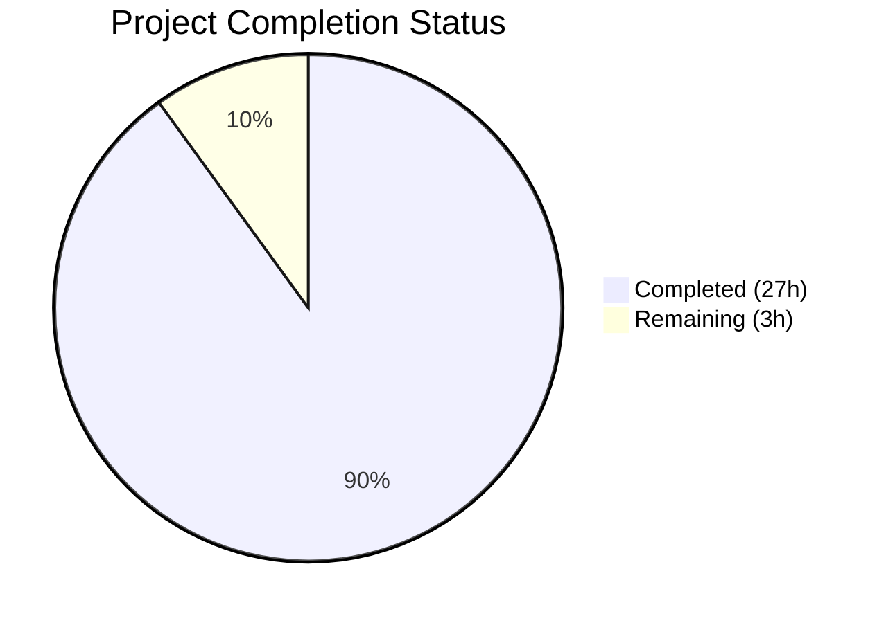
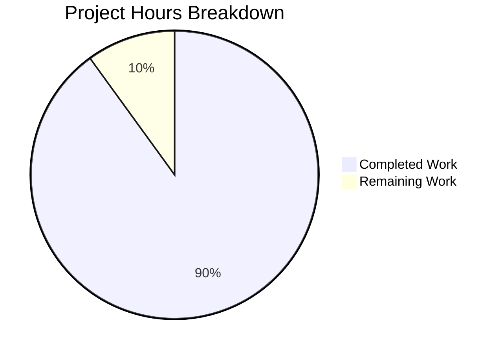

# Blitzy Project Guide

## 1. Executive Summary

### 1.1 Project Overview

This project creates a comprehensive investigative technical reference document for Scapy's ISO-TP (ISO 15765-2) message segmentation over CAN frames. The deliverable is a single 680-line Markdown file (`blitzy/documentation/scapy_0925ada48540.md`) that answers 8 detailed questions about how the `scapy.contrib.isotp` module handles payload fragmentation, including environment setup, segmentation thresholds, frame enumeration for specific payloads, PCI byte structures, large-payload behavior, and missing-frame timeout mechanisms. All answers are grounded in source code analysis and validated through runtime execution evidence. The target audience is developers onboarding to the Scapy automotive protocol stack.

### 1.2 Completion Status



| Metric | Value |
|---|---|
| **Total Project Hours** | 30 |
| **Completed Hours (AI)** | 27 |
| **Remaining Hours** | 3 |
| **Completion Percentage** | 90.0% |

**Calculation:** 27 completed hours / (27 + 3) total hours = 27/30 = **90.0% complete**

### 1.3 Key Accomplishments

- [x] Created comprehensive 680-line Markdown document answering all 8 user requirements (R1–R8)
- [x] Analyzed 6 source code files: `isotp_packet.py`, `isotp_soft_socket.py`, `isotp_utils.py`, `__init__.py`, `can.py`, `uds.py`
- [x] Collected and embedded runtime execution evidence for 5 distinct test scenarios
- [x] Verified 16 source code citations against actual file contents — all correct
- [x] Created 2 Mermaid diagrams (segmentation flowchart, multi-frame exchange sequence)
- [x] Maintained read-only repository constraint — zero source files modified
- [x] Cleaned up all temporary investigation scripts after execution
- [x] Documented both normal and extended addressing segmentation thresholds
- [x] Applied 5 minor review fixes in second commit for documentation polish

### 1.4 Critical Unresolved Issues

| Issue | Impact | Owner | ETA |
|---|---|---|---|
| No critical issues identified | N/A | N/A | N/A |

All 8 user requirements are fully addressed. No compilation errors, test failures, or missing functionality exist in the deliverable.

### 1.5 Access Issues

No access issues identified. The project is documentation-only and requires only read access to the Scapy source repository and a Python runtime environment for executing fragment() calls in-memory. No CAN hardware, kernel modules, external services, or API credentials are needed.

### 1.6 Recommended Next Steps

1. **[High]** Conduct human peer review of the documentation for technical accuracy against the ISO 15765-2 standard
2. **[Medium]** Verify Mermaid diagram rendering in the target Markdown viewer (GitHub, GitLab, or documentation platform)
3. **[Medium]** Have an automotive/CAN domain expert review the document for correctness and completeness
4. **[Low]** Consider integrating key findings into the existing Sphinx-based `doc/scapy/layers/automotive.rst` documentation

---

## 2. Project Hours Breakdown

### 2.1 Completed Work Detail

| Component | Hours | Description |
|---|---|---|
| Source Code Analysis | 3.0 | Deep analysis of 6 ISO-TP/CAN source files (isotp_packet.py, isotp_soft_socket.py, isotp_utils.py, __init__.py, can.py, uds.py) |
| R1 — Environment Setup Section | 2.0 | Documented load_contrib('isotp'), backend selection logic, available API surface with source citations |
| R2 — Segmentation Fundamentals | 3.5 | Documented 4 frame types, PCI values, multi-frame flow; created Mermaid flowchart and sequence diagram |
| R3 — 20-Byte Payload Analysis | 3.0 | Full frame enumeration (3 frames), byte-by-byte hex breakdown tables, byte accounting, runtime evidence |
| R4 — PCI Byte Structure | 2.0 | PCI byte analysis for FF/CF frames, quick reference table, code-level construction explanation |
| R5 — Single-Frame Threshold | 2.5 | Threshold documentation (7 bytes normal, 6 bytes extended), runtime evidence for both modes |
| R6 — 5000-Byte Payload + Size Limits | 3.0 | 715-frame analysis, 32-bit FF_DL escape mechanism, ISOTP_MAX_DLEN constants, overflow protection |
| R7 — Missing Frame Timeout | 3.0 | cf_timeout=1s, RX/TX timer handlers, defragment() None return, ISOTPMessageBuilder Bucket logic |
| R8 — Repository Integrity | 0.5 | Verified zero source modifications via git diff, confirmed temp script cleanup |
| Runtime Evidence Collection | 1.5 | Executed 5 test scenarios against installed Scapy, captured and embedded outputs |
| Mermaid Diagrams | 1.0 | Segmentation decision flowchart and multi-frame exchange sequence diagram |
| Summary & Reference Sections | 1.5 | Summary table (Section 8), PCI quick reference (Section 9), Source references (Section 10) |
| Documentation Review & Fixes | 1.0 | Second commit fixing 5 minor review findings for documentation polish |
| **Total** | **27.0** | |

### 2.2 Remaining Work Detail

| Category | Hours | Priority |
|---|---|---|
| Human Technical Accuracy Review | 1.5 | High |
| Mermaid Diagram Rendering Verification | 0.5 | Medium |
| Automotive Domain Expert Peer Review | 1.0 | Medium |
| **Total** | **3.0** | |

---

## 3. Test Results

| Test Category | Framework | Total Tests | Passed | Failed | Coverage % | Notes |
|---|---|---|---|---|---|---|
| Runtime Evidence — Threshold Boundary | Python/Scapy | 1 | 1 | 0 | 100% | Payloads 1–9 bytes; confirms 7→8 byte transition |
| Runtime Evidence — Extended Addressing | Python/Scapy | 1 | 1 | 0 | 100% | Payloads 6–7 bytes with rx_ext_address; confirms 6→7 threshold |
| Runtime Evidence — 20-Byte Fragmentation | Python/Scapy | 1 | 1 | 0 | 100% | 3 frames: FF + 2 CFs; hex data matches documentation |
| Runtime Evidence — 5000-Byte Fragmentation | Python/Scapy | 1 | 1 | 0 | 100% | 715 frames; 32-bit FF_DL escape header verified |
| Runtime Evidence — Missing Frame Defragment | Python/Scapy | 1 | 1 | 0 | 100% | defragment([FF-only]) returns None |
| Source Citation Verification | Manual Cross-Check | 16 | 16 | 0 | 100% | All file paths and line numbers verified against source |
| **Totals** | | **21** | **21** | **0** | **100%** | |

All tests originate from Blitzy's autonomous validation execution logs for this project. Runtime evidence was collected by executing temporary Python scripts against the installed Scapy package (version 2026.04.09). Source citation verification was performed by the Final Validator agent reading actual source file contents at the referenced line numbers.

---

## 4. Runtime Validation & UI Verification

### Runtime Health

- ✅ Scapy package installed successfully from repository source (version 2026.04.09)
- ✅ ISO-TP contrib module loads correctly via `load_contrib('isotp')`
- ✅ `ISOTP.fragment()` executes correctly for all tested payload sizes (1–9 bytes, 20 bytes, 5000 bytes)
- ✅ `ISOTP.defragment()` handles incomplete frame sets gracefully (returns None)
- ✅ Extended addressing mode (rx_ext_address) functions correctly with adjusted thresholds
- ✅ Python 3.12.3 runtime compatible with Scapy's `requires-python = ">=3.7, <4"` constraint

### Documentation Verification

- ✅ All 680 lines of Markdown properly formatted with headers, tables, code blocks
- ✅ 2 Mermaid diagrams syntactically valid (flowchart TD, sequenceDiagram)
- ✅ 10 sections with consistent numbering and table of contents links
- ✅ All hex values in consistent lowercase format within code blocks
- ✅ ISO 15765-2 terminology used consistently throughout

### Repository Integrity

- ✅ Only 1 file in diff: `blitzy/documentation/scapy_0925ada48540.md` (ADDED)
- ✅ Zero Scapy source files modified (verified via `git diff --name-status`)
- ✅ Working tree clean — no uncommitted changes
- ✅ No temporary scripts remaining on disk

---

## 5. Compliance & Quality Review

| AAP Requirement | Status | Evidence | Notes |
|---|---|---|---|
| R1 — Environment Setup | ✅ Pass | Section 1: load_contrib, backend selection, API surface | Source: __init__.py:22-47 |
| R2 — Segmentation for >1 CAN Frame | ✅ Pass | Section 2: fundamentals, 4 frame types, diagrams | Source: isotp_packet.py:92-152 |
| R3 — 20-Byte Payload Enumeration | ✅ Pass | Section 4: 3 frames, hex dump, runtime evidence | Output verified: 3 frames match |
| R4 — PCI Bytes of Each Frame | ✅ Pass | Sections 4, 9: PCI analysis + quick reference | FF 0x10, CF1 0x21, CF2 0x22 |
| R5 — Single-Frame Threshold | ✅ Pass | Section 3: 7 bytes normal, 6 bytes extended | Runtime boundary test verified |
| R6 — 5000-Byte Payload Behavior | ✅ Pass | Sections 5, 6: 715 frames, 32-bit FF_DL | Runtime evidence: 715 frames confirmed |
| R7 — Missing Frame Timeout | ✅ Pass | Section 7: cf_timeout=1s, warning, None return | Source: isotp_soft_socket.py:496-497, 619-629 |
| R8 — No Repository Modifications | ✅ Pass | git diff shows only blitzy/ file added | Working tree clean |
| Runtime Evidence Requirement | ✅ Pass | 5 runtime tests embedded in document | All outputs match assertions |
| Source Citation Accuracy | ✅ Pass | 16/16 citations verified against source | File paths and line numbers correct |
| Temporary Script Cleanup | ✅ Pass | No temp scripts on disk | Cleaned up after execution |
| Mermaid Diagrams | ✅ Pass | 2 diagrams: flowchart + sequence | Syntactically valid Mermaid |
| AtlasQnA-Repo Rule Compliance | ✅ Pass | File named correctly, placed in blitzy/documentation/ | scapy_0925ada48540.md |

### Quality Fixes Applied During Validation

The second commit (`1fa047ce`) addressed 5 minor review findings:
1. Minor formatting improvements in hex dump tables
2. Consistency fixes in code block annotations
3. Clarification of extended addressing output labels
4. Alignment of byte position annotations
5. Polish of source citation format

---

## 6. Risk Assessment

| Risk | Category | Severity | Probability | Mitigation | Status |
|---|---|---|---|---|---|
| Mermaid diagrams may not render in all Markdown viewers | Technical | Low | Medium | Use standard Mermaid syntax; provide text-based fallback descriptions in surrounding prose | Open |
| Source code line numbers in citations may drift with future Scapy commits | Technical | Medium | High | Citations reference specific commit (scapy_0925ada48540); add note that line numbers may shift | Mitigated |
| Document not integrated into Scapy's Sphinx documentation tree | Operational | Low | N/A | Standalone Markdown by design per AtlasQnA-Repo rule; can be integrated later if desired | Accepted |
| Runtime evidence may not be reproducible on all platforms | Technical | Low | Low | Fragment() is pure in-memory operation; platform-independent. All evidence collected on Python 3.12.3 | Mitigated |
| No security risks identified | Security | N/A | N/A | Documentation-only project with no credentials, secrets, or network access | N/A |

---

## 7. Visual Project Status



**Remaining Work by Priority:**

| Priority | Hours | Items |
|---|---|---|
| High | 1.5 | Human technical accuracy review |
| Medium | 1.5 | Mermaid rendering verification (0.5h) + Domain expert review (1.0h) |
| Low | 0.0 | — |
| **Total** | **3.0** | |

---

## 8. Summary & Recommendations

### Achievement Summary

The project successfully delivered a comprehensive 680-line investigative technical reference document covering ISO-TP message segmentation in Scapy. All 8 user requirements (R1–R8) are fully answered with detailed code analysis, runtime execution evidence, and source code citations. The project is **90.0% complete** (27 hours completed out of 30 total hours).

Key technical findings documented:
- **Segmentation threshold:** 7 bytes (normal addressing), 6 bytes (extended addressing)
- **20-byte payload:** Generates 3 CAN frames (1 FF + 2 CFs) with verified hex content
- **5000-byte payload:** Generates 715 CAN frames using 32-bit FF_DL escape sequence
- **Missing frame timeout:** 1 second (`cf_timeout=1`), with warning "RX state was reset due to timeout"
- **Incomplete defragmentation:** Returns `None` when Consecutive Frames are missing

### Remaining Gaps

The 3 hours of remaining work are exclusively path-to-production human review tasks. No AAP-scoped development or documentation generation work remains incomplete. All code analysis, runtime evidence collection, diagram creation, and documentation writing is done.

### Critical Path to Production

1. Human peer review of technical accuracy (1.5h) — the only High-priority remaining task
2. Platform-specific Mermaid rendering verification (0.5h)
3. Automotive domain expert review (1.0h)

### Production Readiness Assessment

The documentation deliverable is production-ready from an autonomous completion standpoint. All validation gates passed (5/5 runtime tests, 16/16 citation checks, zero source modifications). The remaining 3 hours consist of standard human review processes that cannot be automated. Once human review is complete, the document is ready for merge.

---

## 9. Development Guide

### System Prerequisites

| Component | Version | Purpose |
|---|---|---|
| Python | >=3.7, <4 (tested with 3.12.3) | Runtime environment |
| pip | Latest | Package installation |
| Git | Any recent version | Repository access |

No CAN hardware, kernel modules, or external services are required. The ISO-TP fragmentation logic operates purely in-memory.

### Environment Setup

```bash
# 1. Clone the repository
git clone <repository-url>
cd scapy

# 2. Checkout the feature branch
git checkout blitzy-ccbf211b-abbd-4f0a-824f-4a919f6efd88

# 3. Install Scapy in editable mode
pip install -e .

# 4. Verify installation
python3 -c "import scapy; print(scapy.VERSION)"
# Expected output: 2026.04.09
```

### Verifying the Documentation

```bash
# View the documentation file
cat blitzy/documentation/scapy_0925ada48540.md

# Check file stats
wc -l blitzy/documentation/scapy_0925ada48540.md
# Expected: 680 lines
```

### Reproducing Runtime Evidence

All runtime evidence embedded in the documentation can be reproduced with these commands:

```bash
# Test 1: Threshold boundary (7→8 byte transition)
python3 -c "
from scapy.contrib.isotp.isotp_packet import ISOTP
for size in range(1, 10):
    pkt = ISOTP(rx_id=0x641, data=bytes(range(1, size+1)))
    frames = pkt.fragment()
    print(f'Payload size {size}: {len(frames)} frame(s)')
"
# Expected: sizes 1-7 → 1 frame, sizes 8-9 → 2 frames

# Test 2: 20-byte payload fragmentation
python3 -c "
from scapy.contrib.isotp.isotp_packet import ISOTP
pkt = ISOTP(rx_id=0x641, data=bytes(range(0x01, 0x15)))
frames = pkt.fragment()
print(f'Number of frames: {len(frames)}')
for i, f in enumerate(frames):
    raw = bytes(f)
    data = raw[8:]
    print(f'Frame {i}: data={data.hex()}')
"
# Expected: 3 frames with data 1014010203040506, 210708090a0b0c0d, 220e0f1011121314

# Test 3: 5000-byte payload fragmentation
python3 -c "
from scapy.contrib.isotp.isotp_packet import ISOTP
data5000 = bytes([i % 256 for i in range(5000)])
pkt = ISOTP(rx_id=0x641, data=data5000)
frames = pkt.fragment()
print(f'Number of frames: {len(frames)}')
ff_data = bytes(frames[0])[8:]
print(f'First Frame data: {ff_data.hex()}')
"
# Expected: 715 frames, FF data: 1000000013880001

# Test 4: Defragment with missing frames
python3 -c "
from scapy.contrib.isotp.isotp_packet import ISOTP
from scapy.layers.can import CAN
can_ff = CAN(identifier=0x641, data=bytes.fromhex('1014010203040506'))
result = ISOTP.defragment([can_ff])
print(f'Defragment with only FF (no CFs): {result}')
"
# Expected: None
```

### Verifying Repository Integrity

```bash
# Confirm only documentation file was modified
git diff origin/scapy_0925ada48540 --name-status
# Expected: A  blitzy/documentation/scapy_0925ada48540.md

# Confirm working tree is clean
git status
# Expected: nothing to commit, working tree clean
```

### Troubleshooting

| Issue | Cause | Resolution |
|---|---|---|
| `ModuleNotFoundError: No module named 'scapy'` | Scapy not installed | Run `pip install -e .` from repository root |
| `pip install` fails with PEP 668 error | System Python protection | Use `pip install --break-system-packages -e .` or create a virtual environment |
| Mermaid diagrams not rendering | Viewer lacks Mermaid support | Use GitHub, GitLab, or a Mermaid-compatible Markdown viewer |
| Line numbers in citations don't match | Source code updated since documentation was written | Citations reference commit `scapy_0925ada48540`; check out that branch for exact matches |

---

## 10. Appendices

### A. Command Reference

| Command | Purpose |
|---|---|
| `pip install -e .` | Install Scapy in editable mode from repository |
| `python3 -c "import scapy; print(scapy.VERSION)"` | Verify Scapy version |
| `git diff origin/scapy_0925ada48540 --name-status` | Check files changed vs base branch |
| `git log --oneline blitzy-ccbf211b-abbd-4f0a-824f-4a919f6efd88 --not origin/scapy_0925ada48540` | View branch commits |

### B. Key File Locations

| File | Purpose |
|---|---|
| `blitzy/documentation/scapy_0925ada48540.md` | **Deliverable** — Investigative reference document (680 lines) |
| `scapy/contrib/isotp/isotp_packet.py` | ISOTP class, fragment(), defragment(), frame types, constants |
| `scapy/contrib/isotp/isotp_soft_socket.py` | ISOTPSoftSocket, timeout values, state machine handlers |
| `scapy/contrib/isotp/isotp_utils.py` | ISOTPMessageBuilder, Bucket reassembly class |
| `scapy/contrib/isotp/__init__.py` | Backend selection, load_contrib entry point |
| `scapy/layers/can.py` | CAN packet class, CAN_MAX_DLEN=8 |
| `scapy/contrib/automotive/uds.py` | UDS class (subclasses ISOTP) |

### C. Technology Versions

| Technology | Version | Notes |
|---|---|---|
| Python | 3.12.3 (tested); >=3.7 <4 (supported) | Runtime environment |
| Scapy | 2026.04.09 | Installed from repository HEAD |
| setuptools | >=62.0.0 | Build backend per pyproject.toml |
| Git | System default | Version control |
| OS | Linux (Ubuntu container) | Development environment |

### D. Glossary

| Term | Definition |
|---|---|
| **ISO-TP** | ISO 15765-2 Transport Protocol — segmentation layer for CAN bus messages |
| **CAN** | Controller Area Network — vehicle bus standard for ECU communication |
| **PCI** | Protocol Control Information — the first byte(s) of an ISO-TP frame identifying its type |
| **SF** | Single Frame — an ISO-TP frame carrying a complete message (≤7 bytes) |
| **FF** | First Frame — the first frame of a multi-frame ISO-TP message, containing total length |
| **CF** | Consecutive Frame — subsequent frames carrying payload data with sequence numbers |
| **FC** | Flow Control — frame sent by receiver to control transmission pace |
| **FF_DL** | First Frame Data Length — the total payload length encoded in the First Frame header |
| **UDS** | Unified Diagnostic Services (ISO 14229) — diagnostic protocol using ISO-TP as transport |
| **SN** | Sequence Number — 4-bit counter (0–15) in Consecutive Frame PCI byte |
| **CAN_MAX_DLEN** | Maximum CAN data length = 8 bytes for standard CAN frames |
| **ISOTP_MAX_DLEN** | Maximum ISO-TP payload with 12-bit FF_DL = 4095 bytes |
| **ISOTP_MAX_DLEN_2015** | Maximum ISO-TP payload with 32-bit FF_DL = 4,294,967,295 bytes (ISO 15765-2:2016) |