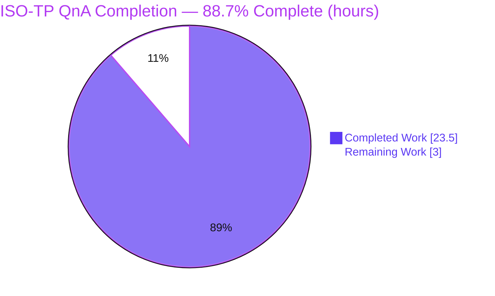
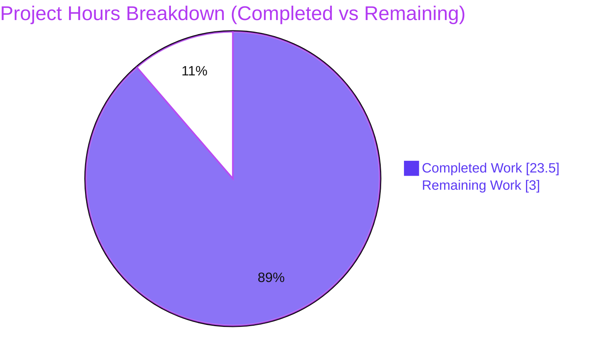

# Blitzy Project Guide — Scapy ISO-TP (ISO 15765-2) Segmentation & Reassembly Onboarding QnA

> Brand legend: **Completed / AI Work** = Dark Blue `#5B39F3` · **Remaining / Not Completed** = White `#FFFFFF` · **Headings / Accents** = Violet-Black `#B23AF2` · **Highlight** = Mint `#A8FDD9`.

---

## 1. Executive Summary

### 1.1 Project Overview

This project delivers a single, runtime-evidence-grounded knowledge-base article explaining how Scapy's automotive ISO-TP (ISO 15765-2) contrib module segments an oversized diagnostic payload across CAN frames, and how its receive state machine behaves when a middle Consecutive Frame never arrives. The target users are engineers onboarding to the Scapy automotive stack. The deliverable answers eight onboarding questions (Q1–Q8) with reproducible commands, complete raw output, and `file:line` citations, produced under a strict read-only constraint. Business impact: it accelerates automotive-diagnostics onboarding and captures a subtle silent-timeout behavior. Technical scope: exactly one Markdown file plus a read-only investigation of `scapy/contrib/isotp/`.

### 1.2 Completion Status



| Metric | Value |
|--------|-------|
| **Total Hours** | 26.5 |
| **Completed Hours (AI + Manual)** | 23.5 (23.5 AI + 0.0 Manual) |
| **Remaining Hours** | 3.0 |
| **Percent Complete** | **88.7%** |

> Completion is computed by the PA1 AAP-scoped hours method: `Completed / (Completed + Remaining) × 100 = 23.5 / 26.5 × 100 = 88.7%`. All completed work was performed autonomously by Blitzy agents (0 manual hours to date). Remaining hours are standard human review-and-publish activities for a knowledge-base document, not deficiencies in the delivered content.

### 1.3 Key Accomplishments

- ✅ Sole deliverable created and committed: `blitzy/documentation/scapy_0925ada48540.md` (494 lines) answering all of Q1–Q8.
- ✅ Every behavioral claim grounded in **real runtime execution evidence** — each answer shows the exact command, its complete unedited output, and a `file:line` citation.
- ✅ Transmit segmentation exercised through the real entry point `ISOTP.fragment()`: 7-byte single-frame threshold; 20-byte payload → **3 frames** (1 FF + 2 CF); 5000-byte payload → **715 frames** via the ISO-TP 2016 32-bit escape (no exception).
- ✅ Receive path exercised through the real `ISOTPSoftSocket` with paired in-memory sockets: missing-CF `cf_timeout = 1 s` (N_Cr) fires and **silently resets** state — **no exception** (warning only at `conf.verb > 2`).
- ✅ Magnitude/timing stability confirmed (20-byte count stable across 2 runs; RX timeout stable across 3 + 10 runs at 0.999–1.000 s).
- ✅ **101/101** in-repo ISO-TP unit tests pass (49 packet + 52 soft-socket), independently re-run and corroborated.
- ✅ **Perfect read-only compliance**: `git diff base..HEAD` = exactly one added file; `git status --porcelain` clean; temp scripts confined to `/tmp` and deleted.
- ✅ All `file:line` citations independently verified line-by-line against source; independent byte-for-byte reproduction of the documented frame counts and bytes.

### 1.4 Critical Unresolved Issues

| Issue | Impact | Owner | ETA |
|-------|--------|-------|-----|
| None — no unresolved item blocks release or validation | N/A | N/A | N/A |

> No critical unresolved issues were identified. The deliverable compiles conceptually (Markdown is well-formed: 16 balanced code fences, 2 Mermaid blocks, 10 H2 sections), all runtime claims reproduce, and the working tree is clean.

### 1.5 Access Issues

| System/Resource | Type of Access | Issue Description | Resolution Status | Owner |
|-----------------|----------------|-------------------|-------------------|-------|
| Native SocketCAN / `can-isotp` kernel module | Kernel/network tooling (`ip`, `modprobe`, `vcan`) | Not available in the container; the native `ISOTPNativeSocket` receive path cannot be exercised here | Accepted — out of scope; the default pure-Python `ISOTPSoftSocket` is the canonical path and is fully exercised. Documented as a non-canonical sibling variant | Blitzy (documented) |

> No access issues prevent build validation, review, or publication of the documentation deliverable. The single environmental limitation above is explicitly out of scope per the AAP and does not affect any Q1–Q8 answer.

### 1.6 Recommended Next Steps

1. **[High]** Have a subject-matter expert review and sign off on the ISO-TP QnA answer — verify Q1–Q8 technical accuracy against ISO 15765-2 and the cited Scapy source (optionally re-run the four probes). *(≈1.5h)*
2. **[Medium]** Verify the document renders correctly in the target documentation platform — the two Mermaid diagrams, fenced code blocks, and tables. *(≈0.5h)*
3. **[Medium]** Merge the single-file PR and integrate the document into the team's onboarding index for discoverability. *(≈1.0h)*

---

## 2. Project Hours Breakdown

### 2.1 Completed Work Detail

| Component | Hours | Description |
|-----------|-------|-------------|
| Environment provisioning & canonical setup | 3.0 | venv creation, editable Scapy install (`pip install -e .`), `python-can` 4.6.1, backend verification (`ISOTPSocket == ISOTPSoftSocket`, `USE_CAN_ISOTP_KERNEL_MODULE = False`) |
| ISO-TP source study & ISO 15765-2 web research | 3.0 | Reading `fragment()` and the soft-socket RX state machine for citations; validating SF/FF/CF/FC taxonomy, the 4095-byte / 32-bit length limits, the N_Cr timer, and `python-can-isotp` disambiguation |
| Q1 — Module load investigation & write-up | 2.0 | `probe1`: `load_contrib("isotp")` + eager import, socket-backend selection, five `file:line` citations, raw output |
| Q2 — Segmentation-decision overview | 1.5 | SF → FF + N×CF explanation, four-PDU table, decision flowchart (Mermaid), citations |
| Q3/Q4/Q5 — 20-byte enumeration, PCI decode, threshold | 3.0 | `probe2`: 6/7/8/20-byte fragmentation, two-run stability, per-frame first-byte (PCI) decode, 7-byte / 6-byte threshold |
| Q6 — Oversized 5000-byte path | 2.0 | `probe3`: 4095/4096/5000-byte, classic vs. 2016 32-bit escape First Frame, the no-exception finding, ~4 GB boundary (labeled inferred) |
| Q7 — Receive missing-CF timeout | 4.0 | `probe4`: paired `TestSocket` + `ISOTPSoftSocket`, `cf_timeout = 1 s`, no-exception result, `conf.verb` gating, before/during/after state capture, 3 + 10-run timing stability, state diagram |
| Q8 — Read-only compliance evidence | 1.0 | `git diff`/`git status` proofs, `--ignored` byproduct explanation, temporary-script cleanup |
| Document authoring & assembly | 2.0 | 494-line Markdown, 10 sections, quick-answers summary, supporting version references, appendix/lineage |
| Autonomous validation & QA | 2.0 | 101/101 unit tests, byte-for-byte reproduction, line-by-line citation verification, methodology-note correction, 5 commits |
| **Total** | **23.5** | Sum of completed AAP-scoped work (all AI/autonomous) |

### 2.2 Remaining Work Detail

| Category | Hours | Priority |
|----------|-------|----------|
| SME technical review & sign-off of the ISO-TP QnA answer (Q1–Q8 accuracy vs. ISO 15765-2 and cited source) | 1.5 | High |
| Documentation-platform rendering verification (2 Mermaid diagrams, code blocks, tables) | 0.5 | Medium |
| PR merge & onboarding-index integration / publish | 1.0 | Medium |
| **Total** | **3.0** | — |

### 2.3 Completion Calculation & Cross-Section Reconciliation

- **Completed Hours** = Σ Section 2.1 = **23.5h**
- **Remaining Hours** = Σ Section 2.2 = **3.0h**
- **Total Project Hours** = 23.5 + 3.0 = **26.5h** (matches Section 1.2)
- **Percent Complete** = 23.5 / 26.5 × 100 = **88.7%** (matches Section 1.2 and Section 7)
- **Integrity**: Section 1.2 Remaining (3.0) = Section 2.2 total (3.0) = Section 7 "Remaining Work" (3.0). Section 2.1 (23.5) + Section 2.2 (3.0) = Section 1.2 Total (26.5). ✅

---

## 3. Test Results

All tests below originate from Blitzy's autonomous validation logs for this project and were independently re-executed during this assessment using the Scapy `UTscapy` runner from the canonical editable venv (both campaigns exited 0 with zero failures).

| Test Category | Framework | Total Tests | Passed | Failed | Coverage % | Notes |
|---------------|-----------|-------------|--------|--------|------------|-------|
| ISO-TP packet / fragmentation (unit) | Scapy UTscapy (`test/contrib/isotp_packet.uts`) | 49 | 49 | 0 | N/A¹ | Validates SF/FF/CF construction and 7/8/4997-byte fragmentation — underpins Q2–Q6 |
| ISO-TP soft-socket RX/TX (unit) | Scapy UTscapy (`test/contrib/isotp_soft_socket.uts`) | 52 | 52 | 0 | N/A¹ | Validates the `ISOTPSoftSocket` receive state machine — underpins Q7 |
| **Unit total** | **UTscapy** | **101** | **101** | **0** | **N/A¹** | 100% pass; both campaigns exit 0, "All campaigns executed" |
| Runtime probe — Q1 module load | Real entry point (`load_contrib` + import) | 1 | 1 | 0 | — | `USE_CAN_ISOTP_KERNEL_MODULE=False`, `ISOTPSocket is ISOTPSoftSocket=True` |
| Runtime probe — Q2–Q5 fragmentation | Real entry point (`ISOTP.fragment()`) | 1 | 1 | 0 | — | 6→1 SF, 7→1 SF, 8→2, 20→3 frames; stable across 2 runs; reproduced byte-for-byte |
| Runtime probe — Q6 oversized 5000 B | Real entry point (`ISOTP.fragment()`) | 1 | 1 | 0 | — | 4095→586, 4096→586, 5000→715 frames; no exception; stable across 2 runs |
| Runtime probe — Q7 missing-CF timeout | Real entry point (`ISOTPSoftSocket` + paired `TestSocket`) | 1 | 1 | 0 | — | `cf_timeout=1s`, CF1→reset=1.000s, no exception; stable across 3 + 10 runs |

> ¹ Coverage percentage was not measured for this documentation task; the AAP did not scope a coverage target. The listed `.uts` suites are the ISO-TP module's own functional unit tests and are reported as pass/fail. The four runtime probes are the primary evidence source for the answer document and each reproduces byte-for-byte on re-execution.

---

## 4. Runtime Validation & UI Verification

This is a documentation deliverable with **no UI and no long-running services**; runtime validation therefore covers module load and the transmit/receive protocol paths exercised through their real entry points.

- ✅ **Operational** — Scapy imports from the editable checkout (`scapy.__file__` → `<repo>/scapy/__init__.py`, `scapy.VERSION = 2026.07.08`).
- ✅ **Operational** — ISO-TP module loads via both `load_contrib("isotp")` and `from scapy.contrib.isotp import ...`.
- ✅ **Operational** — Socket backend resolves to `ISOTPSoftSocket` (`USE_CAN_ISOTP_KERNEL_MODULE = False`).
- ✅ **Operational** — Transmit segmentation (`ISOTP.fragment()`): 7-byte SF threshold; 20-byte → 3 frames; 5000-byte → 715 frames (2016 escape); byte-for-byte reproducible.
- ✅ **Operational** — Receive reassembly (`ISOTPSoftSocket`): missing-CF `cf_timeout = 1 s` fires; state IDLE → WAIT_DATA → IDLE; partial data discarded; no exception.
- ✅ **Operational** — In-repo `test.testsocket.TestSocket(CAN).pair()` drives the receive path without SocketCAN.
- ⚠ **Partial (out of scope)** — Native `ISOTPNativeSocket` path not exercisable in-container (no `ip`/`modprobe`/`vcan`); documented as a non-canonical sibling variant.
- ❌ **Failing** — None. No runtime failures observed.
- **UI Verification** — Not applicable (no user interface in this project).

---

## 5. Compliance & Quality Review

Cross-mapping of the AAP ruleset ("SWE-AtlasQnA-Repo") and quality benchmarks to delivered evidence.

| Benchmark / AAP Rule | Requirement | Status | Progress | Evidence |
|----------------------|-------------|--------|----------|----------|
| Deliverable location & name | Create `blitzy/documentation/<source_branch>.md` | ✅ Pass | 100% | `blitzy/documentation/scapy_0925ada48540.md` exists (494 lines) |
| Answer every part | Answer each of Q1–Q8 explicitly and by name | ✅ Pass | 100% | 10 H2 sections incl. Q1–Q8 (Q3/Q4/Q5 shared probe with per-question answers) |
| Investigate by running first | Evidence from executed code, not reading alone | ✅ Pass | 100% | 4 probes with commands + raw output embedded |
| Real entry points only | `ISOTP.fragment()` (TX), `ISOTPSoftSocket` (RX) | ✅ Pass | 100% | No synthetic stand-ins; verified in source and at runtime |
| Magnitude/timing stability (≥2 runs) | Confirm 20-byte count and RX timeout stable | ✅ Pass | 100% | 20-byte count 2 runs identical; timeout stable across 3 + 10 runs |
| Actual output for every claim | Complete unedited output + exact command | ✅ Pass | 100% | RUN #1/#2 blocks for TX; combined stdout+stderr for RX |
| Exact & grounded (`file:line`) | Cite `file:line`; label inferred values | ✅ Pass | 100% | 24 isotp `file:line` citations; 4 GB boundary labeled INFERRED |
| Citation accuracy | Citations match source lines | ✅ Pass | 100% | Independently verified line-by-line (L99/L104/L34-36/L42-45/L496-497/L619-629) |
| Exercise every condition | Primary + secondary/error/edge/transitional | ✅ Pass | 100% | SF↔multi-frame; classic vs escape FF; withheld-CF; RX before/during/after |
| Read-only scope | No existing file modified; temp scripts removed | ✅ Pass | 100% | `git diff base..HEAD` = 1 added file; porcelain clean; `/tmp` scripts deleted |
| Canonical configuration | Default build/config; state exact commands | ✅ Pass | 100% | Editable install; default `ISOTPSocket = ISOTPSoftSocket`; commands recorded |
| Library disambiguation | Distinguish Scapy from `python-can-isotp` | ✅ Pass | 100% | Explicit note: Scapy silently resets; `python-can-isotp` raises |
| No placeholders / TODOs | Complete content, no stubs | ✅ Pass | 100% | No TODO/FIXME/placeholder in deliverable |
| SME technical sign-off | Human acceptance before publish | ⬜ Pending | 0% | Remaining task (Section 2.2) |

**Fixes applied during autonomous validation:** (1) Q1 observed Python version corrected to the true container value **3.13.7** (QA finding F1). (2) Q7 raw evidence completed with the `conf.verb > 2` stderr timeout warning. (3) Methodology note corrected to reflect the **canonical editable install** (`pip install -e .`) as the capture method (6 framing-only edits; zero evidence/citation/answer changes).

**Outstanding compliance items:** Human SME sign-off (Section 1.6 / 2.2), a documentation-acceptance step — not an autonomous deficiency.

---

## 6. Risk Assessment

| Risk | Category | Severity | Probability | Mitigation | Status |
|------|----------|----------|-------------|------------|--------|
| Evidence captured on Python 3.13.7, not the AAP's stated canonical 3.12.3 (unavailable in container) | Technical | Low | Low | Transparently documented; `requires-python = ">=3.7, <4"` (`pyproject.toml:L17`) satisfied; 101/101 tests pass on 3.13.7 | Mitigated |
| Scapy version is HEAD/nightly-style (2026.07.08, editable from commit `0925ada`); values could drift in future releases | Technical | Low | Low | Every claim pinned to `file:line` at the base commit; corroborated by in-repo `.uts` tests | Mitigated |
| ~4 GB (4294967295) exception boundary is inferred from the guard, not empirically triggered | Technical | Low | Low | Explicitly labeled INFERRED; guard constant verified at `isotp_packet.py:L35,L103-104` | Accepted |
| Documented silent RX failure (missing CF → no exception, no default log) may surprise downstream consumers | Operational | Low | Low | Existing Scapy behavior surfaced as an onboarding insight; per AAP "described, not altered" | Documented |
| Documentation staleness as Scapy evolves | Operational | Low | Low | Commit + `file:line` pinning enables future re-verification | Accepted |
| Native `ISOTPNativeSocket` path not exercisable in-container | Integration | Low | Low | Out of scope and non-default; documented as a non-canonical sibling variant with its errno-84 citation | Accepted |
| Mermaid/Markdown rendering in the target docs platform | Integration | Low | Low | Verify in target viewer (Section 2.2 task, 0.5h) | Open (minor) |
| Security exposure | Security | None | N/A | Read-only doc; no product code, no manifest/dependency change (empty diff verified), no secrets, no new attack surface | None identified |

**Overall risk posture: LOW.** No High-severity risks; no risk blocks the deliverable.

---

## 7. Visual Project Status



**Remaining hours by category (Section 2.2):**

| Category | Hours | Priority |
|----------|-------|----------|
| SME technical review & sign-off | 1.5 | High |
| PR merge & onboarding-index integration | 1.0 | Medium |
| Documentation-platform rendering verification | 0.5 | Medium |
| **Total Remaining** | **3.0** | — |

> Integrity: pie "Completed Work" = 23.5 (Section 1.2 Completed, Section 2.1 total); pie "Remaining Work" = 3.0 (Section 1.2 Remaining, Section 2.2 total). Completed = Dark Blue `#5B39F3`; Remaining = White `#FFFFFF`.

---

## 8. Summary & Recommendations

**Achievements.** The project is **88.7% complete** (23.5 of 26.5 AAP-scoped hours). The single required deliverable — `blitzy/documentation/scapy_0925ada48540.md` — is created, committed, and fully answers all eight onboarding questions with reproducible runtime evidence and verified `file:line` citations. Transmit segmentation and receive reassembly were exercised through their real entry points; magnitude and timing values were confirmed stable across multiple runs; and 101/101 ISO-TP unit tests pass. Read-only compliance is perfect (exactly one added file; clean working tree).

**Remaining gaps.** The remaining **3.0 hours** are standard documentation path-to-production steps: human SME sign-off on technical accuracy (1.5h), documentation-platform rendering verification (0.5h), and PR merge plus onboarding-index integration (1.0h). None represents an autonomous deficiency.

**Critical path to production.** SME review & sign-off → rendering verification → merge & publish.

**Success metrics.** All eight questions answered by name (100%); all runtime claims reproduce byte-for-byte; all citations verified; 101/101 unit tests pass; working tree byte-for-byte unchanged apart from the one added document.

**Production readiness assessment.** The deliverable is **content-complete and validation-clean**. It is ready for human review and publication. The realistic pre-review ceiling for autonomous work is intentionally capped below 100%; the 88.7% figure reflects that human review-and-publish remains.

| Metric | Value |
|--------|-------|
| AAP-scoped completion | 88.7% |
| Deliverables complete | 1 of 1 document (all Q1–Q8) |
| Unit tests passing | 101 / 101 |
| Read-only compliance | Clean (1 added file) |
| Open High-priority items | 1 (SME sign-off) |

---

## 9. Development Guide

All commands below were tested in the canonical environment during this assessment.

### 9.1 System Prerequisites

- **OS:** Linux (Ubuntu 25.10 container used); any POSIX environment.
- **Python:** 3.13.7 observed. Any version satisfying `requires-python = ">=3.7, <4"` (`pyproject.toml:L17`) works.
- **Git:** 2.51.0 (for read-only verification and viewing the document).
- **Disk:** ~120 MB for the repository checkout.

### 9.2 Environment Setup

```bash
# From the repository root
cd /tmp/blitzy/scapy/blitzy-bf097d4b-ecea-403b-ab24-864c0df9ab81_a9fcab

# Create and activate an isolated virtual environment
python3 -m venv /tmp/blitzy/scapy/venv
source /tmp/blitzy/scapy/venv/bin/activate

# Confirm interpreter
python --version        # -> Python 3.13.7
```

### 9.3 Dependency Installation

```bash
# Install Scapy EDITABLE from the checkout (canonical: exercises the repo's own ISO-TP source)
pip install -e .

# Optional CAN backend (test-only dependency per tox.ini:L33)
pip install python-can

# Verify provenance and version
python -c "import scapy; print(scapy.VERSION); print(scapy.__file__)"
# -> 2026.07.08
# -> <repo-root>/scapy/__init__.py     (confirms editable install)
```

### 9.4 Reproducing the Runtime Evidence (Q1–Q7)

```bash
# Q1 — load the ISO-TP module and confirm the socket backend
python -c "from scapy.main import load_contrib; load_contrib('isotp'); \
from scapy.contrib.isotp import ISOTPSocket, ISOTPSoftSocket, USE_CAN_ISOTP_KERNEL_MODULE; \
print('USE_CAN_ISOTP_KERNEL_MODULE=', USE_CAN_ISOTP_KERNEL_MODULE); \
print('ISOTPSocket is ISOTPSoftSocket=', ISOTPSocket is ISOTPSoftSocket)"
# -> USE_CAN_ISOTP_KERNEL_MODULE= False
# -> ISOTPSocket is ISOTPSoftSocket= True

# Q3/Q5 — 20-byte enumeration + threshold
python -c "from scapy.contrib.isotp import ISOTP; \
f=ISOTP(data=b'\x00'*20).fragment(); \
print('20B ->', len(f), 'frames', [bytes(x.data).hex() for x in f]); \
print('7B ->', len(ISOTP(data=b'\x00'*7).fragment()), '| 8B ->', len(ISOTP(data=b'\x00'*8).fragment()))"
# -> 20B -> 3 frames ['1014000000000000', '2100000000000000', '2200000000000000']
# -> 7B -> 1 | 8B -> 2

# Q6 — 5000-byte oversized payload
python -c "from scapy.contrib.isotp import ISOTP; \
f=ISOTP(data=b'\xaa'*5000).fragment(); \
print('5000B ->', len(f), 'frames; FF=', bytes(f[0].data).hex())"
# -> 5000B -> 715 frames; FF= 100000001388aaaa

# Q7 — receive missing-CF timeout probe (needs PYTHONPATH for the in-repo test.testsocket)
PYTHONPATH="$PWD" python -c "from test.testsocket import TestSocket; print('test.testsocket import OK')"
# The full Q7 probe (paired sockets, withheld CF2, ~1 s timeout) is embedded verbatim in the deliverable's Q7 section.
```

### 9.5 Verification

```bash
# Unit tests (ISO-TP) via the Scapy UTscapy runner
PYTHONPATH="$PWD" python -m scapy.tools.UTscapy -t test/contrib/isotp_packet.uts        # 49 tests, 0 failures, exit 0
PYTHONPATH="$PWD" python -m scapy.tools.UTscapy -t test/contrib/isotp_soft_socket.uts   # 52 tests, 0 failures, exit 0

# Read-only compliance
git status --porcelain                                                   # (empty) => clean tree
git diff --name-status 0925ada485406684174d6f068dbd85c4154657b3..HEAD    # A  blitzy/documentation/scapy_0925ada48540.md

# View the deliverable
less blitzy/documentation/scapy_0925ada48540.md
```

### 9.6 Example Usage

```bash
# Read the "Quick answers" summary at the top of the document
sed -n '1,9p' blitzy/documentation/scapy_0925ada48540.md

# Jump to a specific answer (e.g., Q7 receive timeout)
grep -n "^## Q7" blitzy/documentation/scapy_0925ada48540.md
```

### 9.7 Troubleshooting

- **`ModuleNotFoundError: No module named 'test'`** — set `PYTHONPATH=<repo-root>`; this is required only for the Q7 receive probe and the `.uts` suites, which import the in-repo `test.testsocket` package (not part of the installed Scapy distribution).
- **Native `ISOTPNativeSocket` unavailable** — expected in this container (no `ip`/`modprobe`/`vcan`); the default `ISOTPSoftSocket` is canonical.
- **UTscapy stdout has ANSI color codes** — a naive `grep 'passed' | wc -l` over-counts; rely on the runner exit code (0) and the `= ` test-header count (49 / 52) for the authoritative 101 total.
- **Do not commit `scapy.egg-info/` or `__pycache__/`** — these are git-ignored byproducts of the editable install and imports, not repository content.

---

## 10. Appendices

### A. Command Reference

| Purpose | Command |
|---------|---------|
| Create venv | `python3 -m venv /tmp/blitzy/scapy/venv` |
| Activate venv | `source /tmp/blitzy/scapy/venv/bin/activate` |
| Editable install | `pip install -e .` |
| Optional CAN backend | `pip install python-can` |
| Check Scapy version/provenance | `python -c "import scapy; print(scapy.VERSION, scapy.__file__)"` |
| Load ISO-TP module | `python -c "from scapy.main import load_contrib; load_contrib('isotp')"` |
| Fragment probe (20B) | `python -c "from scapy.contrib.isotp import ISOTP; print(len(ISOTP(data=b'\x00'*20).fragment()))"` |
| Unit tests (packet) | `PYTHONPATH=$PWD python -m scapy.tools.UTscapy -t test/contrib/isotp_packet.uts` |
| Unit tests (soft socket) | `PYTHONPATH=$PWD python -m scapy.tools.UTscapy -t test/contrib/isotp_soft_socket.uts` |
| Read-only check (status) | `git status --porcelain` |
| Read-only check (diff) | `git diff --name-status 0925ada485406684174d6f068dbd85c4154657b3..HEAD` |
| View deliverable | `less blitzy/documentation/scapy_0925ada48540.md` |

### B. Port Reference

Not applicable — this project defines no network services, servers, or listening ports. The receive path is driven entirely by in-memory paired sockets (`test.testsocket.TestSocket(CAN).pair()`).

### C. Key File Locations

| Path | Role |
|------|------|
| `blitzy/documentation/scapy_0925ada48540.md` | **The deliverable** — QnA answer (Q1–Q8), 494 lines |
| `scapy/contrib/isotp/__init__.py` | Module exports & socket-backend selection (Q1, Q7) |
| `scapy/contrib/isotp/isotp_packet.py` | Core segmentation logic — `ISOTP.fragment()` (Q2–Q6) |
| `scapy/contrib/isotp/isotp_soft_socket.py` | Receive state machine & `cf_timeout` (Q7) |
| `scapy/contrib/isotp/isotp_native_socket.py` | Native sibling receive path (Q7 completeness) |
| `test/testsocket.py` | Paired in-memory socket driving the RX path |
| `test/contrib/isotp_packet.uts` | Fragmentation unit tests (49) |
| `test/contrib/isotp_soft_socket.uts` | Soft-socket unit tests (52) |
| `pyproject.toml` | `requires-python = ">=3.7, <4"` (`:L17`) |
| `tox.ini` | `python-can` test dependency (`:L33`) |

### D. Technology Versions

| Component | Version | Notes |
|-----------|---------|-------|
| Python | 3.13.7 | Container runtime; satisfies `requires-python ">=3.7, <4"` |
| Scapy | 2026.07.08 | Editable install from repo checkout (commit `0925ada`) |
| python-can | 4.6.1 | Optional/test-only CAN backend |
| Git | 2.51.0 | Read-only verification |
| Base commit | `0925ada485406684174d6f068dbd85c4154657b3` | "Add AUTOSAR PDUTransport/PDU with initial batch of tests (#3933)" |
| HEAD commit | `543ff5ea083d521e8dc26c3c19eef1a8c9fe32f1` | Final methodology-note correction |

### E. Environment Variable Reference

| Variable | Value | When needed |
|----------|-------|-------------|
| `PYTHONPATH` | `<repo-root>` | Only for the Q7 receive probe and the `.uts` suites, so the in-repo `test.testsocket` package resolves |
| `conf.verb` (Scapy runtime setting) | `2` (default) / `>2` | At default, the RX timeout is silent; at `>2`, the warning `"RX state was reset due to timeout"` is logged |

> No `.env` file or secret/credential variables are required by this project.

### F. Developer Tools Guide

- **Scapy UTscapy** — the built-in unit-test-server runner used for `.uts` suites: `python -m scapy.tools.UTscapy -t <file.uts>`.
- **Real entry points** — transmit: `ISOTP(data=...).fragment()`; receive: `ISOTPSoftSocket` paired with `test.testsocket.TestSocket(CAN).pair()`.
- **Git diff/status** — read-only compliance verification against the base commit.

### G. Glossary

| Term | Meaning |
|------|---------|
| **ISO-TP** | ISO 15765-2 Transport Protocol; segments diagnostic messages larger than one 8-byte CAN frame |
| **SF** | Single Frame — whole message fits in one CAN frame (PCI high-nibble `0x0`) |
| **FF** | First Frame — first frame of a segmented message; carries total length (PCI `0x1X`) |
| **CF** | Consecutive Frame — subsequent data with a wrapping sequence number (PCI `0x2N`) |
| **FC** | Flow Control — receiver → sender flow governance (block size / STmin) (PCI `0x3X`) |
| **PCI** | Protocol Control Information — the leading byte(s) encoding frame type and length/sequence |
| **N_Cr** | ISO 15765-2 consecutive-frame receive timer; Scapy models it as `cf_timeout = 1 s` |
| **2016 escape** | ISO-TP 2016 32-bit length escape (FF begins `0x10 0x00` + 32-bit length) for payloads > 4095 bytes |
| **`ISOTPSoftSocket`** | Pure-Python ISO-TP socket; the default `ISOTPSocket` when the kernel module is disabled |
| **`.uts`** | Scapy "unit-test server" test file format executed by UTscapy |