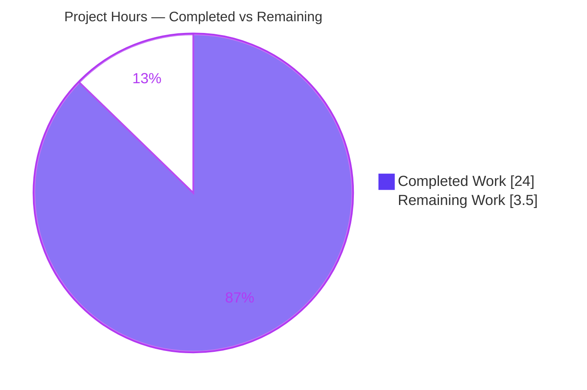
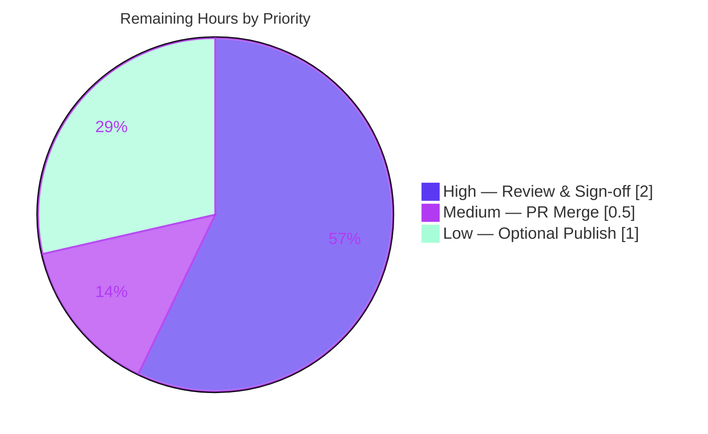

# Blitzy Project Guide — Scapy Ethernet Framing Q&A Investigation

---

## 1. Executive Summary

### 1.1 Project Overview

This project delivers a single, evidence-backed technical answer document explaining how Scapy constructs Ethernet frames — specifically minimum-frame padding for short payloads, padding persistence across a `raw()` serialize/re-parse round-trip, and next-protocol dispatch from the `EtherType` field (including the unrecognized-type case). The audience is engineers using or maintaining Scapy who need an authoritative, source-grounded explanation. It is a **read-only investigation** against `secdev/scapy` at commit `0925ada4…`; no library behavior is changed. The scope is one new markdown deliverable, `blitzy/documentation/scapy_0925ada48540.md`, whose every behavioral claim is paired with verbatim observed output and whose every code claim carries a `file:line` citation.

### 1.2 Completion Status

The completion percentage is calculated using AAP-scoped, hours-based methodology (PA1): all AAP content and rule requirements are delivered and independently verified; the only remaining work is human-gated path-to-production (review, merge, optional publishing).


| Metric | Value |
|--------|-------|
| **Total Hours** | 27.5 |
| **Completed Hours (AI + Manual)** | 24.0 (24.0 AI + 0.0 Manual) |
| **Remaining Hours** | 3.5 |
| **Percent Complete** | **87.3%** |

> Formula: `Completion % = Completed / (Completed + Remaining) = 24.0 / 27.5 = 87.3%`.
> Color key: **Completed = Dark Blue `#5B39F3`**, **Remaining = White `#FFFFFF`**.

### 1.3 Key Accomplishments

- ✅ **Deliverable authored, validated, and committed** — `blitzy/documentation/scapy_0925ada48540.md` (463 lines) exists on branch `blitzy-490db774-82fc-4779-a5f2-60e475d50b67` at HEAD `f0e6b8e9`.
- ✅ **All AAP content items answered** — build tasks B1–B3, behavioral questions Q1–Q4 (Q3 addresses all three named possibilities), and code investigations I1–I3, plus both named items (`0x9000` and the ~10-byte payload).
- ✅ **Investigation-first, evidence-backed** — every behavioral claim sits next to its verbatim observed output line; 21/21 documented runtime values reproduce exactly.
- ✅ **Exact and grounded** — 67 `file:line` citations; critical citations spot-checked byte-accurate against source (`packet.py`, `l2.py`, `fields.py`, `inet.py`, `inet6.py`, `data.py`, `config.py`, `contrib/pnio_dcp.py`).
- ✅ **Key insight surfaced** — `0x9000` is documented as Scapy's *own default* `Ether.type` (`scapy/layers/l2.py:248`), preventing the reader from mistaking the user's "random" example for a special value.
- ✅ **Read-only scope fully honored** — `scapy/` and `test/` trees are byte-identical to the baseline; working tree clean; temporary observation scripts kept outside the repository and removed.

### 1.4 Critical Unresolved Issues

There are **no critical unresolved issues** blocking release or validation. All AAP-scoped work is complete and verified. The items below are standard path-to-production gates, not defects.

| Issue | Impact | Owner | ETA |
|-------|--------|-------|-----|
| Human SME accuracy sign-off pending | Standard review gate before merge; low risk given 100% reproduction | SME / Reviewer | ~2.0h |
| PR approval & merge pending | Deliverable not yet on the target/main branch | Maintainer | ~0.5h |

### 1.5 Access Issues

**No access issues identified.** The investigation runs entirely in place (`PYTHONPATH=<repo> python3`) with no external services, credentials, network access, or elevated privileges required. All observation is in-memory (`build()`/`raw()`/dissection).

| System/Resource | Type of Access | Issue Description | Resolution Status | Owner |
|-----------------|----------------|-------------------|-------------------|-------|
| — | — | No access issues identified | N/A | — |

### 1.6 Recommended Next Steps

1. **[High]** Perform SME technical review: read the document, spot-check a sample of the 67 citations, and re-run the three embedded observation scripts to confirm the 21 verbatim values reproduce.
2. **[High]** Confirm read-only scope integrity (`git diff --stat 0925ada4..HEAD -- scapy/ test/` is empty) as part of sign-off.
3. **[Medium]** Approve and merge the pull request to the target branch.
4. **[Low]** Optionally index/link the document from a docs index or team knowledge base for discoverability.
5. **[Low]** Optionally tidy the self-referential delivery-HEAD note in the Environment table for long-term clarity.

---

## 2. Project Hours Breakdown

### 2.1 Completed Work Detail

All completed work is autonomous (AI) effort delivering the AAP-scoped investigation and document. Every component traces to a specific AAP requirement.

| Component | Hours | Description |
|-----------|-------|-------------|
| Execution baseline & in-place setup | 1.5 | Run Scapy in place (`PYTHONPATH=<repo>`), confirm `scapy.__file__` inside repo and `conf.version = 2026.07.01`; establish observation runtime (AAP 0.3.1) |
| B1–B3 packet builds & measurement | 2.0 | Build `Ether/IP/TCP`, `…/Raw(b"A"*10)`, `Ether(type=0x9000)/Raw` and `0x1234` variant; measure `len(raw())` (AAP B1–B3) |
| Q1/Q4 padding size-sweep & analysis | 2.0 | Sweep payload sizes 0..100, record `len(raw())`; establish `14 + n` with no floor / no threshold (AAP Q1, Q4) |
| Q2 round-trip experiments (a + b) | 2.0 | `Ether(raw(pkt))` for ordinary short packet (no `Padding`) and explicit `Padding` (persists, `len=60`, `b'\x00'*6`) (AAP Q2) |
| Q3 unknown-type + display analysis | 2.5 | `print()`/`repr()`/`show()` of `0x9000` & `0x1234` → `Raw`; no error (exit 0); ETHER_TYPES/`XShortEnumField` hex-vs-name analysis (AAP Q3) |
| I1 padding-decision code trace | 2.0 | Trace `build()`/`build_padding()`/`post_build`; `Padding`-only emission; absence of min-frame constant (AAP I1) |
| I2 EtherType dispatch code trace | 2.0 | Trace `dispatch_hook`, `guess_payload_class`, `bind_layers` `payload_guess` table (AAP I2) |
| I3 unrecognized-type fallback trace | 1.0 | Trace `default_payload_class` → `conf.raw_layer` = `Raw` (AAP I3) |
| Document authoring | 4.0 | Structure, prose, evidence adjacency, mermaid dispatch diagram, size-sweep & coverage-pass tables, KEY INSIGHT (AAP 0.4.2) |
| Corroboration research | 1.0 | Cross-reference upstream issues & contrib `MIN_PACKET_LENGTH` opt-in padding (AAP 0.2.2) |
| Citation verification & coverage pass | 1.5 | Verify 67 `file:line` citations; enumerate & confirm every named item (AAP rule: exact/grounded + coverage) |
| Validation & QA cycles | 2.5 | Re-derive all 21 runtime claims; fix 2 QA defects; run relevant unit suites; read-only hygiene (AAP 0.8.1) |
| **Total Completed** | **24.0** | |

### 2.2 Remaining Work Detail

All remaining work is human-gated path-to-production; no AAP content requirement is outstanding.

| Category | Hours | Priority |
|----------|-------|----------|
| Documentation review & accuracy sign-off (SME reads doc, spot-checks citations, re-runs observation scripts) | 2.0 | High |
| PR approval & merge to target branch (verify read-only scope, approve, merge) | 0.5 | Medium |
| Optional publishing & polish (index/link doc; tidy self-referential HEAD note) | 1.0 | Low |
| **Total Remaining** | **3.5** | |

### 2.3 Hours Reconciliation

| Check | Result |
|-------|--------|
| Section 2.1 total (Completed) | 24.0 |
| Section 2.2 total (Remaining) | 3.5 |
| Section 2.1 + Section 2.2 | 27.5 = Total Project Hours (Section 1.2) ✅ |
| Remaining hours: Section 1.2 = Section 2.2 = Section 7 | 3.5 = 3.5 = 3.5 ✅ |
| Completion % | 24.0 / 27.5 = 87.3% (Sections 1.2, 7, 8) ✅ |

---

## 3. Test Results

For this documentation task the AAP designates **runtime observation experiments** — not a code test suite — as the primary validation (AAP 0.3.1: "investigate by running first"). All entries below originate from Blitzy's autonomous validation logs and were independently reproduced during this assessment.

| Test Category | Framework | Total Tests | Passed | Failed | Coverage % | Notes |
|---------------|-----------|-------------|--------|--------|------------|-------|
| Runtime observation experiments (primary) | Scapy in-place (`PYTHONPATH=<repo> python3`) | 21 | 21 | 0 | 100% | All documented numeric/string claims (B1=54, B2=64, default `0x9000`, sweep `14/24/60/64/74/114`, `haslayer(Padding)=0`, `IP.len=50`, explicit-`Padding` round-trip `len=60`/`b'\x00'*6`, `Raw` for `0x9000` & `0x1234`, `ETHER_TYPES` IPv4/IPv6/`KeyError(36864)`/`KeyError(4660)`) reproduced exactly |
| Q3 no-error assertion | Python `try/except` + exit status | 2 | 2 | 0 | 100% | Unknown-type parse of `0x9000` and `0x1234` raised no exception; `exit=0` |
| Ancillary unit suite — fields | Scapy `UTscapy` | 138 | 138 | 0 | n/a | `test/fields.uts` — governs `XShortEnumField` display cited in Q3; full pass (exit 0) |
| Ancillary unit suite — L2 (framing-relevant) | Scapy `UTscapy` | 8 | 8 | 0 | n/a | `test/scapy/layers/l2.uts` Ether/ARP show, STP, CookedLinux dissection all pass |
| Ancillary unit suite — L2 (`arp_mitm`) | Scapy `UTscapy` | 2 | 0 | 2 | n/a | Network-MITM-with-mocks tests; **environment/mock-dependent and unrelated to Ethernet framing**. `test/` is byte-identical to baseline, so these are pre-existing baseline outcomes, **not** agent regressions |

**Integrity note.** The 21 primary observations plus the Q3 no-error assertion constitute the deliverable's actual validation and are reproduced verbatim inside the document. The ancillary unit suites are sanity checks only (the AAP states the test suite is not exercised as scope). The two `arp_mitm` failures are consistent across the pristine baseline because no source or test file was modified.

---

## 4. Runtime Validation & UI Verification

This is a documentation/CLI investigation with **no UI**. Runtime validation covers in-memory packet build and dissection.

- ✅ **Scapy runs in place** — `scapy.__file__` resolves inside the repo; `conf.version = 2026.07.01` (Operational).
- ✅ **B1 build** — `len(raw(Ether()/IP()/TCP())) = 54` (Operational).
- ✅ **B2 build** — `len(raw(Ether()/IP()/TCP()/Raw(b"A"*10))) = 64` (Operational).
- ✅ **Q1/Q4 sweep** — `len(raw()) = 14 + n` at all sizes; no minimum-frame floor (Operational).
- ✅ **Q2 round-trip** — ordinary short packet → no `Padding` layer; explicit `Padding` → persists as `b'\x00'*6` (Operational).
- ✅ **Q3 unknown EtherType** — `0x9000` and `0x1234` dissect to a `Raw` layer; no exception; type shown as hex (Operational).
- ✅ **Dissection dispatch** — `ETHER_TYPES` resolves `0x0800`→`IPv4`, `0x86dd`→`IPv6`; `0x9000`/`0x1234` raise `KeyError` (Operational).
- ⚠ **Benign stderr noise** — `CryptographyDeprecationWarning` (`ipsec.py:573/577`) and `WARNING: Mac address … Using broadcast` appear on import/build; documented and do not affect any measurement (Partial — informational only).
- ✅ **Read-only scope** — `git status` clean; `scapy/` and `test/` unchanged from baseline (Operational).
- 🚫 **Live network / API integration** — out of scope by design (in-memory only; no `sendp()`/`sr()`, no root, no NIC). Not applicable.

---

## 5. Compliance & Quality Review

Cross-mapping of AAP deliverables and governing rules (`SWE-AtlasQnA-Repo`) to their verification status.

| Requirement (AAP / Rule) | Benchmark | Status | Progress |
|---------------------------|-----------|--------|----------|
| B1 normal `Ether/IP/TCP` | Built & measured with verbatim evidence | ✅ Pass | 100% |
| B2 short ~10-byte payload | Built & measured (`64 = 54+10`) | ✅ Pass | 100% |
| B3 unrecognized EtherType (`0x9000` + `0x1234`) | Built, serialized, re-parsed | ✅ Pass | 100% |
| Q1 auto-padding? | Answered "No" with sweep evidence | ✅ Pass | 100% |
| Q2 round-trip persistence? | Both Q2a (no pad) and Q2b (persists) shown | ✅ Pass | 100% |
| Q3 unknown-type print — (a)/(b)/(c) | All three possibilities addressed explicitly | ✅ Pass | 100% |
| Q4 padding threshold? | Answered "no threshold" with size-sweep table | ✅ Pass | 100% |
| I1 where padding decided | `file:line` trace of build/padding chain | ✅ Pass | 100% |
| I2 EtherType dispatch | `dispatch_hook` + `guess_payload_class` + `bind_layers` | ✅ Pass | 100% |
| I3 unrecognized-type logic | `default_payload_class` → `conf.raw_layer` | ✅ Pass | 100% |
| Named item `0x9000` | Covered incl. default-type KEY INSIGHT | ✅ Pass | 100% |
| Named item ~10-byte payload | Covered in B2 + Q2a | ✅ Pass | 100% |
| Rule: deliverable path/name | `blitzy/documentation/scapy_0925ada48540.md` | ✅ Pass | 100% |
| Rule: investigate by running first | 3 observation scripts, verbatim output | ✅ Pass | 100% |
| Rule: one claim, one evidence | Each claim adjacent to its output line | ✅ Pass | 100% |
| Rule: coverage pass | Explicit coverage-pass table present | ✅ Pass | 100% |
| Rule: exact & grounded (`file:line`) | 67 citations; spot-checks byte-accurate | ✅ Pass | 100% |
| Rule: read-only scope | `scapy/`+`test/` byte-identical; git clean | ✅ Pass | 100% |

**Fixes applied during autonomous validation:** (1) corrected the src-MAC provenance note (stable `eth0` hardware address, not "volatile"); (2) added literal `print()` evidence for Q3 alongside the existing `show()` output. **Outstanding compliance items:** none.

---

## 6. Risk Assessment

Risk posture is **Low** overall; no blocking risks. Expected for a fully verified, read-only documentation deliverable.

| Risk | Category | Severity | Probability | Mitigation | Status |
|------|----------|----------|-------------|------------|--------|
| Version drift — findings pinned to commit `0925ada4` / `conf.version 2026.07.01` (Python 3.13.7); a different Scapy version could differ | Technical | Low | Low | Doc pins baseline and argues version-stability of `bind_layers`/`build_padding`/`default_payload_class`; cites source as source of truth | Mitigated |
| Self-referential delivery-HEAD hash in Environment table (`1138e7b6` "as observed during final QA"; current HEAD `f0e6b8e9`) | Technical | Low | Low | Doc states the hash advances and `scapy/` is byte-identical, so citations resolve regardless | Open (cosmetic) |
| Embedded observed src MAC (`1a:47:be:8d:66:bd`) is a local `eth0` artifact | Security | Informational | Low | Explicitly flagged "not a meaningful value"; non-sensitive | Accepted |
| No sensitive-data / credential / network exposure | Security | None | — | Read-only, in-memory only; zero deps/creds/network | N/A |
| Discoverability — doc lives under `blitzy/documentation/`, outside Scapy's `doc/` tree | Operational | Low | Medium | Optional indexing/linking (task L1) | Open (optional) |
| Reproduction prerequisites — needs `PYTHONPATH=<repo>`, optional `cryptography`, an `eth0` interface | Operational | Low | Low | Development guide documents exact commands and environment notes | Mitigated |
| Integration/build/CI impact | Integration | None | — | No source changed; nothing imports the doc; no build/deploy dependency | N/A |

---

## 7. Visual Project Status

**Project hours breakdown** (Completed = Dark Blue `#5B39F3`, Remaining = White `#FFFFFF`):



**Remaining work by priority** (hours from Section 2.2; total = 3.5h):



> **Integrity:** "Remaining Work" = **3.5h**, identical to Section 1.2 metrics and the Section 2.2 total. "Completed Work" = **24.0h**. Priority split sums to 3.5h (2.0 + 0.5 + 1.0).

---

## 8. Summary & Recommendations

**Achievements.** The project is **87.3% complete** (24.0 of 27.5 hours). Every AAP-scoped requirement — build tasks B1–B3, behavioral questions Q1–Q4, code investigations I1–I3, and both named items (`0x9000` and the ~10-byte payload) — is delivered in a single, evidence-backed markdown document, `blitzy/documentation/scapy_0925ada48540.md`. All 21 documented runtime observations reproduce exactly, all spot-checked citations are byte-accurate, and the read-only scope was fully honored (`scapy/` and `test/` byte-identical to baseline).

**Remaining gaps.** The outstanding 3.5 hours are entirely human-gated path-to-production: SME technical review and sign-off (2.0h), PR approval and merge (0.5h), and optional publishing/polish (1.0h). No AAP content requirement is incomplete, and no defect blocks release.

**Critical path to production.** SME review → confirm read-only scope integrity → approve and merge PR. Optional publishing follows and does not gate release.

**Success metrics.** 18/18 AAP content and rule requirements verified complete; 21/21 runtime claims reproduced; 67/67 citations present (critical subset byte-accurate); `fields.uts` 138/138; read-only scope intact.

**Production readiness assessment.** **Ready pending human sign-off.** Given full reproduction, byte-accurate citations, and clean read-only scope, confidence is High. The deliverable can proceed to merge immediately after SME review.

| Metric | Value |
|--------|-------|
| AAP-scoped completion | 87.3% |
| Completed / Total hours | 24.0 / 27.5 |
| Remaining hours (human-gated) | 3.5 |
| Blocking issues | 0 |
| Overall risk | Low |
| Confidence | High |

---

## 9. Development Guide

All commands below were executed during this assessment and produce the shown results. They are run from the repository root: `/tmp/blitzy/scapy/blitzy-490db774-82fc-4779-a5f2-60e475d50b67_9a8ff3`.

### 9.1 System Prerequisites

- **OS:** Linux (Ubuntu 25.10 verified); macOS/WSL acceptable.
- **Python:** 3.13.7 verified; repository declares `requires-python = ">=3.7, <4"`.
- **Git:** 2.51.0 verified.
- **Optional:** the `cryptography` package (present as 43.0.0) — only affects a benign import-time deprecation warning.
- **No** root, raw sockets, NIC access, or network connectivity is required (all observation is in-memory).

### 9.2 Environment Setup

```bash
# From the repository root. Scapy is run IN PLACE (not pip-installed).
cd /tmp/blitzy/scapy/blitzy-490db774-82fc-4779-a5f2-60e475d50b67_9a8ff3

# (Optional) isolate in a virtual environment:
python3 -m venv /tmp/scapy_venv && source /tmp/scapy_venv/bin/activate

# Confirm Scapy resolves inside the repo and the version under test:
PYTHONPATH=. python3 -c "import scapy; from scapy.config import conf; print(scapy.__file__, conf.version)"
# Expected: <repo>/scapy/__init__.py 2026.07.01
```

### 9.3 Viewing the Deliverable

```bash
# Location, size, and line count of the answer document:
ls -l  blitzy/documentation/scapy_0925ada48540.md   # ~32 KB
wc -l  blitzy/documentation/scapy_0925ada48540.md    # 463 lines

# Read it (any pager/renderer):
less blitzy/documentation/scapy_0925ada48540.md
```

### 9.4 Reproducing the Observations

The document embeds three self-contained observation scripts. **Per the read-only rule, place any script OUTSIDE the repository tree** (e.g. `/tmp/obs_work/`) and delete it afterward. A compact verification one-liner:

```bash
PYTHONPATH=. python3 -c "from scapy.all import Ether, IP, TCP, Raw, Padding, raw; \
print('B1', len(raw(Ether()/IP()/TCP()))); \
print('B2', len(raw(Ether()/IP()/TCP()/Raw(load=b'A'*10)))); \
print('default', hex(Ether().type)); \
print('sweep', [len(raw(Ether()/Raw(load=b'A'*n))) for n in (0,10,46,50,60,100)]); \
print('unknown', Ether(raw(Ether(type=0x9000)/Raw(load=b'B'*10))).payload.__class__.__name__)"
# Expected: B1 54 | B2 64 | default 0x9000 | sweep [14, 24, 60, 64, 74, 114] | unknown Raw
```

### 9.5 Verification Steps

```bash
# 1) Read-only scope is intact (all three commands print nothing / only the new file):
git status --porcelain
git diff --stat 0925ada4..HEAD -- scapy/     # empty  => source unchanged
git diff --stat 0925ada4..HEAD -- test/      # empty  => tests unchanged
git diff --name-status 0925ada4..HEAD        # A  blitzy/documentation/scapy_0925ada48540.md

# 2) Ancillary unit sanity check (framing-relevant + fields display):
PYTHONPATH=. python3 -m scapy.tools.UTscapy -t test/fields.uts -f text -o /tmp/o.txt \
  -K needs_root -K netaccess -K tcpdump -K manufdb -K vcan_socket -K tshark -K veth
# Expected: 138/138 passed (exit 0)
```

### 9.6 Example Usage

```bash
# Inspect an unknown-EtherType frame the way the document does:
PYTHONPATH=. python3 -c "from scapy.all import Ether, Raw, raw; \
Ether(raw(Ether(type=0x9000)/Raw(load=b'B'*10))).show()"
# Shows an Ethernet layer (type = 0x9000) followed by a ###[ Raw ]### layer.
```

### 9.7 Troubleshooting

- **`scapy.__file__` points outside the repo** → `PYTHONPATH` was not set to the repo root; prefix commands with `PYTHONPATH=.` (or absolute repo path).
- **`CryptographyDeprecationWarning` on import** → benign (`scapy/layers/ipsec.py:573/577`); unrelated to Ethernet framing; no action.
- **`WARNING: Mac address … Using broadcast`** → benign; appears when building `IP`/`TCP` with no route; does not affect measurements.
- **`src` MAC differs from the document's `1a:47:be:8d:66:bd`** → expected; it reflects the local `eth0` hardware address and varies per host. It is not a meaningful protocol value.
- **`l2.uts` reports 2 `arp_mitm` failures** → environment/network-mock-dependent and unrelated to the deliverable; the framing-relevant tests pass. Because `test/` is unchanged from baseline, these are pre-existing outcomes.
- **Keep the repo clean** → write temporary scripts under `/tmp` (outside the repo) so `git status` shows only the deliverable.

---

## 10. Appendices

### A. Command Reference

| Purpose | Command |
|---------|---------|
| In-place import & version | `PYTHONPATH=. python3 -c "import scapy; from scapy.config import conf; print(scapy.__file__, conf.version)"` |
| Compact observation reproduction | see Section 9.4 one-liner |
| Read-only scope (status) | `git status --porcelain` |
| Read-only scope (source) | `git diff --stat 0925ada4..HEAD -- scapy/` |
| Read-only scope (tests) | `git diff --stat 0925ada4..HEAD -- test/` |
| Changed-file list | `git diff --name-status 0925ada4..HEAD` |
| Agent commits | `git log --author="agent@blitzy.com" --oneline` |
| Fields unit suite | `PYTHONPATH=. python3 -m scapy.tools.UTscapy -t test/fields.uts -f text -o /tmp/o.txt -K needs_root -K netaccess -K tcpdump -K manufdb -K vcan_socket -K tshark -K veth` |

### B. Port Reference

Not applicable — no servers, sockets, or listening ports are used (in-memory observation only).

### C. Key File Locations

| Path | Role |
|------|------|
| `blitzy/documentation/scapy_0925ada48540.md` | **The deliverable** (new; 463 lines) |
| `scapy/packet.py` | Core engine: `build`/`build_padding`/`post_build` (742/744/746/758/767), `extract_padding` (982-990), `guess_payload_class` (1062-1079), `default_payload_class` (1081-1090), `Raw` (1877), `Padding` (1906-1918), `conf.raw_layer`/`padding_layer` (1921-1922) |
| `scapy/layers/l2.py` | `class Ether` (244), default `type=0x9000` (248), `dispatch_hook` (267-272), Ether `bind_layers` set (687-695) |
| `scapy/fields.py` | `XShortEnumField` display / hex fallback (2660-2673) |
| `scapy/layers/inet.py` | `bind_layers(Ether, IP, type=2048)` (1101); `IP.extract_padding` (553-557) |
| `scapy/layers/inet6.py` | `bind_layers(Ether, IPv6, type=0x86dd)` (4083) |
| `scapy/data.py` | `ETHER_ANY` (37), `MTU` (269); **no** min-frame constant |
| `scapy/config.py` | `raw_layer`/`padding_layer` defaults (766/768) |
| `scapy/contrib/pnio_dcp.py` | Per-protocol opt-in `MIN_PACKET_LENGTH = 44` (31-32) |

### D. Technology Versions

| Component | Version | Basis |
|-----------|---------|-------|
| Scapy (under test) | commit `0925ada4…`, `conf.version = 2026.07.01` | Run in place via `PYTHONPATH=<repo>` |
| Python (observation) | 3.13.7 | `python3 --version` |
| Declared Python support | `>=3.7, <4` | `pyproject.toml:17` |
| Test matrix | through `py311` | `tox.ini:6-7` |
| Git | 2.51.0 | `git --version` |
| cryptography (optional) | 43.0.0 | benign import warning only |

### E. Environment Variable Reference

| Variable | Value | Purpose |
|----------|-------|---------|
| `PYTHONPATH` | `.` (repo root) | Force Scapy to load in place from the repository under test |

No secrets, API keys, or service credentials are used or required.

### F. Developer Tools Guide

- **Scapy `UTscapy`** — the repository's unit-test runner (`python -m scapy.tools.UTscapy -t <file.uts>`); use `-K <keyword>` to exclude environment-dependent tests (`needs_root`, `netaccess`, `tcpdump`, etc.).
- **Git diff/scope tools** — `git diff --stat/--name-status 0925ada4..HEAD` to confirm read-only scope; `git log --author=agent@blitzy.com` to review the four delivery commits.
- **Python one-liners** — the fastest way to reproduce individual claims (Section 9.4/9.6); full scripts are embedded in the deliverable itself.

### G. Glossary

| Term | Meaning |
|------|---------|
| **EtherType** | 2-byte field in an Ethernet II frame identifying the next protocol (e.g. `0x0800` = IPv4, `0x86dd` = IPv6). |
| **`0x9000`** | Scapy's default `Ether.type` (`l2.py:248`); coincidentally the user's "random" example; unbound → dissects to `Raw`. |
| **`raw()`** | Serializes a Scapy packet to bytes (`build()`), excluding any wire FCS. |
| **`Padding`** | A Scapy layer (`packet.py:1906`) that emits explicit trailing bytes; the only source of build-time padding. |
| **`Raw`** | The default fallback payload class (`conf.raw_layer`) for unrecognized/unstructured bytes. |
| **`bind_layers`** | Registration that populates a class's `payload_guess` table, driving next-protocol dispatch. |
| **`guess_payload_class`** | Method that scans `payload_guess` to choose the next layer; falls back to `default_payload_class` when nothing matches. |
| **Minimum Ethernet frame (60/64 bytes)** | A wire/OS/NIC transmit-time concern; **not** applied by Scapy at build time — hence no auto-padding and no threshold. |
| **AAP** | Agent Action Plan — the primary directive defining project scope. |