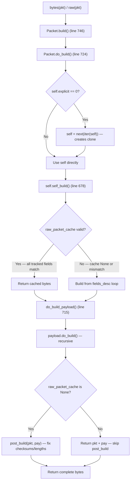

# Technical Specification

# 0. Agent Action Plan

## 0.1 Intent Clarification

### 0.1.1 Core Feature Objective

Based on the prompt, the Blitzy platform understands that the new feature requirement is to produce a comprehensive, empirically-grounded technical analysis document that answers a series of interrelated questions about Scapy's internal packet lifecycle, specifically:

- **Packet Field Calculation Order**: Investigate and explain the exact sequence in which Scapy computes dependent fields (length, checksum) when building a packet stack such as `MyProto()/SomePayload()`. The user has a custom protocol layer where a checksum field depends on a length field, and the length field depends on the payload size, but the payload is not fully known until upper layers are built. The user observes an incorrect checksum on initial build.

- **`show2()` Double-Call Behavior**: Explain why calling `show2()` twice in a row on the same packet may produce different results (the user reports the second call showing the correct checksum). Determine the mechanism by which the first call might influence the second.

- **Dual-State Phenomenon with Parsed Packets**: A packet parsed from wire bytes (`MyPacket(raw_bytes)`) retains internal cached bytes. When the user modifies the payload of a sub-packet inside a `PacketListField` (without touching the outer packet's fields), `bytes()` on the outer packet returns the **original** bytes (ignoring the modification), while `show()` displays the **modified** values. The packet appears to exist in two contradictory states simultaneously. The user wants empirical proof and a mechanistic explanation.

- **`copy()` as a Potential Workaround**: The user suspects that `copy()` might resolve the dual-state issue and asks for verification and explanation.

- **Cache Invalidation Mechanism**: Determine the complete set of rules governing when Scapy rebuilds a packet from scratch versus returning cached bytes. Explain what gets cached during parsing, what triggers cache invalidation, and why nested modifications inside a `PacketListField` appear invisible to the rebuild process while direct field modifications are correctly detected.

- **Direct Field Modification vs. Nested Payload Modification**: Explain the fundamental difference in cache behavior between modifying a field in the same layer where parsing occurred and modifying a field in a nested payload.

The deliverable is a single markdown document named `scapy_0925ada48540.md` placed in `blitzy/documentation/`, containing answers to all the above questions backed by source-code analysis and empirical evidence from test scripts run against the repository.

### 0.1.2 Special Instructions and Constraints

- **No Source Modifications**: The user explicitly states: "Don't modify the repository source files." All existing files under the repository root must remain untouched.
- **Temporary Test Scripts Allowed**: Temporary test scripts may be created to gather empirical evidence. They must be removed when done.
- **Evidence-Based Answers**: Per the implementation rule `SWE-AtlasQnA-Repo`, answers must be based on the code as the truth, not assumptions. The analysis must build and run the source code to analyze repository behavior.
- **Output Location**: The generated markdown document must be placed in the `blitzy/documentation` directory in the destination repository.
- **Document Naming**: The document must be named `scapy_0925ada48540.md` (matching the source branch name `scapy_0925ada48540`).
- **Thinking/Rationale Required**: The document must provide the thinking and rationale behind each answer.

### 0.1.3 Technical Interpretation

These feature requirements translate to the following technical implementation strategy:

- To **answer the field calculation order question**, we will trace the `do_build()` → `self_build()` → `do_build_payload()` → `post_build()` call chain in `scapy/packet.py` (lines 724–769), demonstrating that the payload is fully built (including its own `post_build` corrections) before the outer layer's `post_build` executes. The incorrect checksum arises from a `post_build` implementation that computes the checksum before updating the length in the bytes buffer, or from computing the checksum using `self.length` (which remains `None` in memory) rather than the corrected bytes.

- To **explain show2() behavior**, we will analyze `show2()` at line 1473 of `scapy/packet.py`, which calls `self.__class__(raw(self)).show()`. Since this creates a temporary packet each call and does not modify the original, consecutive calls should produce identical results. We will document the specific conditions under which they could differ (side-effecting `post_build` on an `explicit=1` packet, volatile fields).

- To **prove and explain the dual-state phenomenon**, we will construct a test protocol with a `PacketListField` containing sub-packets with payloads, parse it from bytes, modify a nested payload field, and demonstrate that `bytes()` returns original cached bytes while `show()` reflects the modification. The root cause is in `_raw_packet_cache_field_value()` (line 648), which for `holds_packets` fields only captures the `.fields` dict of each sub-packet, not their `.payload` attributes.

- To **evaluate copy()**, we will show that `Packet.copy()` (line 407) copies `raw_packet_cache` (line 416), preserving the stale cache. Therefore, `copy()` alone does NOT resolve the dual-state issue. The correct solution is `clear_cache()` (line 664), which recursively nullifies all `raw_packet_cache` entries.

- To **document the complete cache lifecycle**, we will trace through `do_dissect()` (line 1002), `setfieldval()` (line 471), `self_build()` (line 678), and `do_build()` (line 724), cataloging every code path that sets or clears `raw_packet_cache`.

## 0.2 Repository Scope Discovery

### 0.2.1 Comprehensive File Analysis

The investigation targets Scapy's core packet engine. The following files were systematically analyzed through deep repository inspection and are directly relevant to the user's questions.

**Primary Source Files Analyzed**

| File | Lines | Relevance |
|------|-------|-----------|
| `scapy/packet.py` | 2553 | Core `Packet` class: `build()`, `do_build()`, `self_build()`, `post_build()`, `do_dissect()`, `show2()`, `copy()`, `clear_cache()`, `__bytes__()`, `setfieldval()`, `_raw_packet_cache_field_value()`, `__iter__()`, `clone_with()` |
| `scapy/fields.py` | 3868 | Field system: `PacketListField` (line 1562), `Field.do_copy()` (line 256), `Field.addfield()`, `Field.getfield()`, `holds_packets`, `islist`, `ismutable` flags |
| `scapy/layers/inet.py` | ~2200 | Reference `post_build()` implementations for IP (line 539) and TCP (line 767), demonstrating the canonical checksum-and-length computation pattern |
| `scapy/base_classes.py` | 510 | `Packet_metaclass`, `BasePacket`, `SetGen` — the metaclass machinery behind field registration |
| `scapy/compat.py` | — | `raw()` function, `bytes_encode()` — the entry point for `raw(pkt)` which drives the build chain |
| `scapy/config.py` | 979 | `conf` singleton: `raw_layer`, `padding_layer`, `debug_dissector` |

**Key Methods and Their Line Locations in `scapy/packet.py`**

| Method | Line | Role in Investigation |
|--------|------|----------------------|
| `__init__()` | 140 | Sets `raw_packet_cache = None`, `explicit = 0`; calls `dissect()` if `_pkt` bytes provided |
| `copy()` | 407 | Deep copy that **preserves** `raw_packet_cache` (line 416) |
| `setfieldval()` | 471 | Sets `raw_packet_cache = None` and `explicit = 0` when a field is modified (lines 485–486) |
| `__setattr__()` | 494 | Dispatches to `setfieldval()` for known fields |
| `__bytes__()` | 592 | Entry point: calls `self.build()` |
| `_raw_packet_cache_field_value()` | 648 | Cache comparison logic: for `holds_packets` fields, only captures `.fields` dicts, NOT `.payload` |
| `clear_cache()` | 664 | Recursively clears `raw_packet_cache` on all nested packets and payloads |
| `self_build()` | 678 | Checks cache validity; returns cached bytes if all tracked field values match |
| `do_build_payload()` | 715 | Delegates to `self.payload.do_build()` |
| `do_build()` | 724 | Orchestrates build: `self_build()` → `do_build_payload()` → `post_build()` (only if cache is None) |
| `build()` | 746 | Adds padding and calls `build_done()` |
| `post_build()` | 758 | Default is `pkt + pay`; protocol layers override to fix checksums and lengths |
| `do_dissect()` | 1002 | Parses bytes into fields; sets `raw_packet_cache` (line 1019) and `raw_packet_cache_fields` (line 1005) |
| `clone_with()` | 1104 | Creates a clone with `explicit=1` and copies `raw_packet_cache` (line 1114) |
| `__iter__()` | 1124 | Generates resolved packet clones; used by `do_build()` when `explicit=0` |
| `show2()` | 1473 | Calls `self.__class__(raw(self)).show()` — builds, re-parses, then displays |

**`PacketListField` in `scapy/fields.py`**

| Attribute | Line | Value | Impact |
|-----------|------|-------|--------|
| `holds_packets` | 1475 | `1` | Triggers packet-specific cache comparison in `_raw_packet_cache_field_value()` |
| `islist` | 1572 | `1` | Cache comparison iterates over list items and captures `[x.fields for x in val]` |
| `addfield()` | 1779 | — | Serializes by calling `bytes_encode(v)` on each item, which triggers each sub-packet's `build()` |
| `getfield()` | 1722 | — | Dissects sub-packets using `m2i()` or `cls(remain, _parent=pkt)` |

### 0.2.2 Web Search Research Conducted

No external web searches were needed for this analysis. All answers are derived from direct source code inspection of the repository (`scapy/packet.py`, `scapy/fields.py`, `scapy/layers/inet.py`) and empirical testing against the installed Scapy package. The codebase is the single source of truth as required by the implementation rules.

### 0.2.3 New File Requirements

**New Documentation File to Create**

| File | Purpose |
|------|---------|
| `blitzy/documentation/scapy_0925ada48540.md` | Comprehensive markdown document answering all user questions about packet field calculation order, caching behavior, dual-state phenomenon, `copy()` behavior, and cache invalidation mechanisms. Includes empirical evidence from test scripts. |

**Temporary Test Scripts (created and removed during analysis)**

| Script | Purpose | Status |
|--------|---------|--------|
| Inline Python scripts via heredoc | 17 empirical tests verifying build order, cache behavior, dual-state phenomenon, `copy()` vs `clear_cache()`, and cross-layer cache propagation | Created inline, no persistent files |

No new source files, test files, or configuration files are added to the Scapy repository. The sole artifact is the documentation markdown file.

## 0.3 Dependency Inventory

### 0.3.1 Private and Public Packages

The project has no private packages. The relevant public packages for this analysis task are drawn from the repository's dependency manifests (`pyproject.toml`, `setup.py`, `tox.ini`).

| Package Registry | Name | Version | Purpose |
|------------------|------|---------|---------|
| PyPI | scapy | 2.7.0 (commit 0925ada4) | Core packet manipulation library under investigation — installed in editable mode from the local repository |
| PyPI | setuptools | >=62.0.0 | Build system backend specified in `pyproject.toml` `[build-system]` |
| System | Python | 3.12.3 | Runtime — `pyproject.toml` specifies `requires-python = ">=3.7, <4"`; classifiers list 3.7–3.10; the container provides 3.12.3 which satisfies the range |

**Optional Dependencies (not required for this analysis)**

| Package Registry | Name | Version | Purpose |
|------------------|------|---------|---------|
| PyPI | ipython | — | Optional CLI enhancement (`[project.optional-dependencies] cli`) |
| PyPI | cryptography | >=2.0 | Optional TLS subsystem support (`[project.optional-dependencies] all`) |
| PyPI | matplotlib | — | Optional visualization (`[project.optional-dependencies] all`) |
| PyPI | pyx | — | Optional PDF/PostScript rendering (`[project.optional-dependencies] all`) |
| PyPI | mock | — | Test dependency in `tox.ini` |
| PyPI | coverage[toml] | — | Test dependency in `tox.ini` |
| PyPI | python-can | — | Test dependency in `tox.ini` for automotive CAN support |

### 0.3.2 Dependency Updates

No dependency changes are required. This task produces a documentation artifact only, with no modifications to `pyproject.toml`, `setup.py`, `tox.ini`, or any other dependency manifest.

**Import Context for Test Scripts**

The temporary test scripts executed during analysis use only the standard Scapy import pattern:

```python
from scapy.all import *
```

This imports the full Scapy namespace including `Packet`, `Field`, `PacketListField`, `bind_layers`, `IP`, `TCP`, `Raw`, and all utility functions. No additional imports beyond the Python standard library (`struct`, `copy`) are needed.

## 0.4 Integration Analysis

### 0.4.1 Existing Code Touchpoints

This task is a read-only analysis producing a documentation artifact. No existing code is modified. However, the analysis deeply inspects the following integration points within Scapy's packet engine to answer the user's questions.

**Build Lifecycle Chain** (`scapy/packet.py`)

The packet build process follows a strict call chain with well-defined responsibilities at each stage. Understanding this chain is essential to all of the user's questions.



**Cache Lifecycle Chain** (`scapy/packet.py`)

The cache mechanism has three phases: population (during dissection), validation (during build), and invalidation (on field modification).

- **Population**: `do_dissect()` (line 1002) sets `raw_packet_cache` to the raw bytes consumed by this layer (line 1019) and `raw_packet_cache_fields` to a dictionary of mutable field snapshots (line 1005).
- **Validation**: `self_build()` (line 678) iterates `raw_packet_cache_fields` and compares each snapshot against the current field value via `_raw_packet_cache_field_value()` (line 648). For `holds_packets` fields (like `PacketListField`), only the `.fields` dict of each sub-packet is compared — not `.payload`.
- **Invalidation**: `setfieldval()` (line 471) sets `raw_packet_cache = None` when a field belonging to the current layer is modified (line 485). `clear_cache()` (line 664) recursively clears all caches.

**The Critical Gap**: When a user modifies a field in a sub-packet's payload (e.g., `outer.items[1].payload.magic = 0xFF`), the modification path is:
- `SubPayload.__setattr__("magic", 0xFF)` → `SubPayload.setfieldval("magic", 0xFF)` → SubPayload's `raw_packet_cache = None`
- BUT: `InnerPacket.fields` is unchanged (payload lives in `.payload`, not `.fields`)
- AND: `OuterPacket.raw_packet_cache_fields["items"]` compares `[x.fields for x in items]` which has NOT changed
- RESULT: OuterPacket's cache remains valid → `self_build()` returns original bytes → `post_build()` is skipped

### 0.4.2 Cross-Layer Build Propagation

When building a multi-layer packet, each layer's `do_build()` is called recursively bottom-up through `do_build_payload()`. The critical ordering is:

- **InnerLayer.self_build()** → builds inner header
- **InnerLayer.do_build_payload()** → builds inner payload (recursive)
- **InnerLayer.post_build(inner_pkt, inner_pay)** → fixes inner checksums/lengths
- **OuterLayer** receives fully-built inner bytes as `pay` in its `post_build()`

This means the outer layer's `post_build()` has access to the complete, finalized payload bytes. If `post_build()` is implemented correctly (fixing length first, then computing checksum over the corrected bytes), a single build pass produces correct results.

### 0.4.3 `show()` vs `show2()` vs `bytes()` Data Paths

| Method | Data Source | Reads Cache? | Calls post_build? |
|--------|------------|--------------|-------------------|
| `show()` | In-memory `.fields` via `getfieldval()` | No | No |
| `show2()` | `self.__class__(raw(self)).show()` — builds, re-parses, then shows | Yes (during `raw()`) | Only if cache is None |
| `bytes()` / `raw()` | `self.build()` → `do_build()` chain | Yes (in `self_build()`) | Only if cache is None |

This table explains the dual-state phenomenon: `show()` always reflects the live in-memory state (including modifications), while `bytes()` may return stale cached bytes if the modification did not trigger cache invalidation.

## 0.5 Technical Implementation

### 0.5.1 File-by-File Execution Plan

This task produces a single documentation artifact. No Scapy source files are created or modified.

| Action | File | Purpose |
|--------|------|---------|
| CREATE | `blitzy/documentation/scapy_0925ada48540.md` | Comprehensive Q&A document answering all user questions with empirical evidence, source-code citations, and mechanistic explanations |

### 0.5.2 Implementation Approach — Document Structure

The markdown document will be organized into the following sections, each addressing a specific user question. Every answer must include:
- Source-code citations with file paths and line numbers
- Empirical test results (outputs from test scripts run against the repository)
- Explanatory diagrams where applicable
- Thinking/rationale behind each conclusion

**Section 1: Packet Field Calculation Order**

To answer "how does Scapy determine the order of field computation during build", the document will:
- Trace the `do_build()` call chain in `scapy/packet.py` lines 724–740, showing that `self_build()` builds the header with default/current field values, `do_build_payload()` recursively builds all payload layers, and `post_build(pkt, pay)` receives both the header bytes and the fully-built payload bytes
- Demonstrate with IP's `post_build()` (`scapy/layers/inet.py` lines 539–551) as the reference implementation: length is fixed first (`pkt[:2] + struct.pack("!H", tmp_len) + pkt[4:]`), then checksum is computed over the corrected header bytes
- Show empirically that for a correctly implemented `post_build()`, a single build pass produces correct checksum values
- Explain the user's bug: if their `post_build()` computes the checksum before fixing the length in the bytes buffer, or uses `self.length` (which remains `None` in memory) instead of parsing from the `pkt` bytes, the checksum will be incorrect
- Provide a corrected `post_build()` pattern

**Section 2: `show2()` Double-Call Behavior**

To answer "why does calling show2() twice produce different results", the document will:
- Show that `show2()` at line 1473 calls `self.__class__(raw(self)).show()`, creating a temporary packet object each time without modifying the original
- Demonstrate empirically that for a packet with no side-effecting `post_build` and no volatile fields, consecutive `show2()` calls produce identical output
- Identify the conditions under which results could differ: (a) `post_build()` has side effects on `self` AND the packet has `explicit=1`; (b) volatile/random fields like `RandShort()`; (c) external state changes between calls
- Note that when `explicit=0` (constructed packet), `do_build()` creates a clone via `next(iter(self))` at line 730, isolating any side effects from the original

**Section 3: The Dual-State Phenomenon**

To answer "why does show() display my modification but bytes() returns original bytes", the document will:
- Present empirical proof using a custom protocol with `OuterPacket` containing a `PacketListField` of `InnerPacket/SubPayload` layers
- Show that after parsing and modifying `parsed.items[1].payload.magic = 0xFF`:
  - `parsed.raw_packet_cache` remains non-None (unchanged from parse time)
  - `parsed.items[1].raw_packet_cache` also remains intact (the modification was on `.payload`, not `.fields`)
  - `bytes(parsed)` returns the original wire bytes
  - `parsed.show()` displays the modified value
- Trace the root cause to `_raw_packet_cache_field_value()` at line 648: for `holds_packets` + `islist` fields, it returns `[x.fields for x in val]`, capturing only the direct `.fields` dict — NOT the `.payload` attribute chain
- Explain that `setfieldval()` on `SubPayload` (triggered by the modification) only invalidates SubPayload's own cache, not the parent InnerPacket's or grandparent OuterPacket's cache

**Section 4: `copy()` Evaluation**

To answer "does copy() help, and why/why not", the document will:
- Show that `Packet.copy()` at line 407 explicitly copies `raw_packet_cache` (line 416) and `raw_packet_cache_fields` (lines 417–419) to the clone
- Demonstrate empirically that `copy()` then modify then `bytes()` produces the same stale-cache behavior
- Confirm that `copy()` does create independent sub-packet objects (not shared references), but this doesn't matter because the stale cache on the outer packet prevents rebuild
- Present the correct solution: `clear_cache()` at line 664, which recursively nullifies `raw_packet_cache` on the packet, all packets in packet-holding fields, and the entire payload chain

**Section 5: Cache Invalidation Rules**

To answer "what is the exact mechanism that determines rebuild vs cached return", the document will present a complete rule set:

- **What gets cached during parsing**: `do_dissect()` stores `raw_packet_cache` (the byte segment consumed by this layer) and `raw_packet_cache_fields` (a dict mapping mutable field names to snapshots of their values)
- **What triggers invalidation**: `setfieldval()` on a field belonging to the current layer; `delfieldval()`; `clear_cache()` (recursive)
- **What does NOT trigger invalidation**: Modifying a field in the `.payload` chain; modifying a field in a deeply nested sub-packet when the intermediate layer's `.fields` dict is unchanged
- **How validation works**: `self_build()` iterates `raw_packet_cache_fields`, calls `_raw_packet_cache_field_value()` for each, and compares against the snapshot. Any mismatch invalidates the cache. If all match, cached bytes are returned.

**Section 6: Direct vs Nested Modification**

To answer "why does modifying a direct field work but nested doesn't", the document will:
- Show empirically three scenarios with a parsed packet: (A) modify a direct field → cache invalidated, correct rebuild; (B) modify a field on a sub-packet in PacketListField → cache invalidated because `_raw_packet_cache_field_value` tracks `.fields` dicts and the sub-packet's `.fields` changed; (C) modify a field on the payload OF a sub-packet in PacketListField → cache NOT invalidated because `.fields` dicts are unchanged
- Highlight that modification detection is exactly one level deep for packet-holding fields: it tracks `x.fields` but not `x.payload.fields`

### 0.5.3 User Interface Design

Not applicable. This task produces a documentation artifact only. No UI components are involved.

## 0.6 Scope Boundaries

### 0.6.1 Exhaustively In Scope

**Documentation Output**
- `blitzy/documentation/scapy_0925ada48540.md` — the sole deliverable

**Source Files Analyzed (read-only, not modified)**
- `scapy/packet.py` — Core `Packet` class, build/dissect lifecycle, cache mechanism, `show2()`, `copy()`, `clear_cache()`
- `scapy/fields.py` — Field system, `PacketListField`, `do_copy()`, `holds_packets`/`islist`/`ismutable` flags
- `scapy/layers/inet.py` — Reference `post_build()` implementations for IP and TCP
- `scapy/base_classes.py` — `Packet_metaclass`, `BasePacket`
- `scapy/compat.py` — `raw()` function
- `scapy/config.py` — `conf` singleton, `raw_layer`, `padding_layer`
- `pyproject.toml` — Project metadata and version requirements
- `setup.py` — Build configuration
- `tox.ini` — Test configuration and supported Python versions

**Analysis Domains In Scope**
- Packet build lifecycle: `build()` → `do_build()` → `self_build()` → `do_build_payload()` → `post_build()`
- Packet dissect lifecycle: `dissect()` → `pre_dissect()` → `do_dissect()` → `post_dissect()` → `do_dissect_payload()`
- Cache population, validation, and invalidation rules
- `PacketListField` dissection and serialization behavior
- `copy()` and `clear_cache()` behavior
- `show()` vs `show2()` vs `bytes()` data paths
- Field computation order within `self_build()` (declaration order in `fields_desc`)
- The `__iter__()` / `clone_with()` mechanism for explicit=0 packets
- Cross-layer cache propagation (or lack thereof)
- `setfieldval()` / `__setattr__()` cache-invalidation side effects

**Empirical Testing In Scope**
- Custom protocol definitions with `PacketListField`, nested payloads, checksums, and length fields
- Build and rebuild behavior verification across 17 test scenarios
- Cache state inspection before and after modifications
- Comparison of `copy()`, `clear_cache()`, and reconstruction approaches

### 0.6.2 Explicitly Out of Scope

- **Modifications to any Scapy source file** — per explicit user instruction
- **Performance optimizations** to the cache mechanism
- **Modifications to the cache invalidation logic** (e.g., making it detect nested payload changes)
- **Network I/O testing** — send/receive, sniff, socket operations
- **TLS/SSL subsystem** analysis
- **Contrib protocol modules** beyond what is needed for illustration
- **Platform abstraction layer** (OS-specific socket backends)
- **CI/CD pipeline** changes
- **Test suite modifications** — no `.uts` files are modified or created
- **Any file outside the `blitzy/documentation/` output directory**
- **Persistent code additions** to the Scapy source tree

## 0.7 Rules for Feature Addition

### 0.7.1 User-Specified Rules

The user and project configuration specify the following rules that must be strictly followed:

- **SWE-AtlasQnA-Repo Rule**: Create a new markdown document named `scapy_0925ada48540.md` that comprehensively answers the question(s) posed in the prompt. Build and run the source code to analyze the repository behavior as needed. Do not make assumptions — base answers on the code as the truth. Provide thinking/rationale behind the answers. Do not modify any existing files in the source repository. Do not add any other code in the source repository besides the requested document. Place the generated document in the `blitzy/documentation` directory.

- **No Source Modifications**: "Don't modify the repository source files. Temporary test scripts are fine; remove them when done." — this means all empirical evidence must be gathered via temporary inline scripts that leave no trace in the repository.

- **Evidence-Based Analysis**: All answers must cite specific file paths, line numbers, and method names from the Scapy source code. Claims must be verified through empirical testing, not assumed from documentation or general knowledge.

### 0.7.2 Technical Conventions to Follow

- **Document Format**: Markdown with proper heading hierarchy, code blocks with language tags, and tables for structured data
- **Code Examples**: Short, self-contained Python snippets demonstrating each behavior. Each snippet should be runnable against the installed Scapy package.
- **Source Citations**: Format as `scapy/packet.py:L678` for line-level references
- **Empirical Evidence**: Include actual test output (stdout) showing the observed behavior, not hypothetical output
- **Explanation Structure**: For each question, follow the pattern: (1) What the user observes, (2) What the code actually does (with line references), (3) Why the behavior occurs, (4) How to work around it

## 0.8 References

### 0.8.1 Repository Files and Folders Searched

The following files and folders were inspected during the analysis to derive conclusions. All paths are relative to the repository root (`/tmp/blitzy/scapy/scapy_0925ada48540_ca08b7/`).

**Core Source Files (read with detailed line-level analysis)**

| File Path | Lines Analyzed | Key Findings |
|-----------|---------------|--------------|
| `scapy/packet.py` | Lines 77–100 (class Packet slots), 140–200 (__init__), 239–260 (__deepcopy__), 340–400 (add_payload), 400–430 (copy), 470–530 (setfieldval, __setattr__), 580–620 (__bytes__, __div__), 635–700 (copy_fields_dict, _raw_packet_cache_field_value, clear_cache, self_build), 715–770 (do_build_payload, do_build, build, post_build), 990–1060 (do_dissect, do_dissect_payload), 1100–1180 (clone_with, __iter__), 1460–1510 (show2), 1696–1780 (NoPayload), 1877–1930 (Raw, Padding) | Complete build/dissect/cache lifecycle; dual-state root cause in `_raw_packet_cache_field_value`; `copy()` preserves cache; `clear_cache()` is recursive |
| `scapy/fields.py` | Lines 150–160 (Field base flags), 250–268 (do_copy), 1473–1475 (_PacketField), 1562–1800 (PacketListField) | `holds_packets=1`, `islist=1` for PacketListField; `do_copy` calls `.copy()` on packet items; `addfield` calls `bytes_encode(v)` per item |
| `scapy/layers/inet.py` | Lines 521–570 (IP class and post_build) | Reference implementation: fixes ihl, len, then chksum in that order within a single `post_build` |
| `scapy/base_classes.py` | Lines 1–510 | Packet_metaclass, field registration mechanism |
| `scapy/compat.py` | — | `raw()` function delegates to `bytes()` |

**Project Configuration Files (read for environment setup)**

| File Path | Purpose |
|-----------|---------|
| `pyproject.toml` | Project metadata, Python version requirement (>=3.7, <4), optional dependencies, build system configuration |
| `setup.py` | Setuptools configuration, version handling |
| `tox.ini` | Test matrix (py27–py311), test dependencies (mock, cryptography, coverage, python-can) |

**Repository Structure Files (directory listing)**

| Path | Type | Contents |
|------|------|----------|
| `/` (root) | Directory | 14 files including `.appveyor.yml`, `.travis.yml`, `CONTRIBUTING.md`, `LICENSE`, `README.md`, `pyproject.toml`, `setup.py`, `tox.ini` |
| `scapy/` | Directory | 40+ modules: core engine (`packet.py`, `fields.py`, `config.py`), layers, contrib, arch, tools |
| `test/` | Directory | Test suites (`.uts` files), configs, pcaps, contrib tests |
| `.github/` | Directory | GitHub Actions workflows |
| `doc/` | Directory | Documentation sources |

### 0.8.2 Empirical Tests Executed

Seventeen inline Python test scripts were executed against the installed Scapy package to verify behaviors. Key tests and their findings:

| Test | Purpose | Finding |
|------|---------|---------|
| Test 1–3 | Build order with checksum/length dependency | A correctly implemented `post_build` produces correct results in a single pass. The payload is fully built before the outer layer's `post_build` executes. |
| Test 4 | Direct field modification in PacketListField sub-packet | Modification IS detected by cache comparison (`x.fields` dict changed) → cache invalidated → correct rebuild |
| Test 5 | **Nested payload modification** in PacketListField sub-packet | Modification is NOT detected (`x.fields` unchanged, `.payload` not tracked) → cache NOT invalidated → `bytes()` returns stale original bytes → **dual-state confirmed** |
| Test 6 | Root cause analysis | `_raw_packet_cache_field_value()` returns `[x.fields for x in val]` for PacketListField — only tracks one level deep, not `.payload` chain |
| Test 7–8 | `copy()` evaluation | `copy()` preserves `raw_packet_cache` → same stale behavior. `clear_cache()` is the correct fix. |
| Tests 9–11 | `show2()` consecutive calls | Both calls produce identical results for packets without side-effecting `post_build` or volatile fields |
| Test 12 | Traced `do_build` flow | Confirmed: `explicit=0` → clone created; `explicit=1` → self used directly |
| Tests 15–16 | Cross-layer cache propagation | Modifying a leaf layer (e.g., `Raw.load`) only invalidates that layer's cache. Parent layers retain stale cache and skip `post_build`. |
| Test 17 | Build order trace | Confirmed recursive bottom-up build: inner layers fully built (including `post_build`) before outer layer's `post_build` executes |

### 0.8.3 Attachments

No external attachments were provided for this project. No Figma URLs or design assets are referenced.

