# Technical Specification

# 0. Agent Action Plan

## 0.1 Intent Clarification

Based on the prompt, the Blitzy platform understands that the new feature requirement is to conduct a deep empirical investigation of Scapy's internal packet lifecycle mechanisms—specifically the build-time field calculation order, the raw-byte cache system, and the conditions under which cache invalidation succeeds or fails—and to deliver a comprehensive, code-grounded Q&A document that answers the user's questions with concrete evidence drawn from the Scapy source code.

### 0.1.1 Core Feature Objective

The investigation must answer the following user questions with empirical evidence:

- **Field Calculation Order**: When building a packet stack (e.g., `MyProto()/SomePayload()`), how does Scapy ensure that auto-computed fields such as checksums and lengths are calculated in the correct dependency order? The user has a custom protocol where a checksum field depends on a length field, and the length depends on payload size. The user believes the checksum is calculated before the length is finalized—this must be verified or refuted.

- **show2() Consistency**: The user reports that calling `show2()` twice in a row on a constructed packet yields a correct checksum only on the second call. This claim must be verified against the actual `show2()` implementation in `scapy/packet.py` line 1486, which calls `self.__class__(raw(self)).show(...)`, creating a fresh re-parsed packet each time.

- **Dual-State Anomaly (Core Bug)**: After parsing a packet from wire bytes via `MyPacket(raw_bytes)`, then modifying a field inside a sub-packet contained in a `PacketListField` (without touching the outer packet's fields), the user observes that `bytes()` returns the original wire bytes while `show()` displays the modified value. The packet appears to exist in two different states simultaneously. This behavior must be reproduced, root-caused, and explained.

- **copy() as Workaround**: The user suspects `copy()` may resolve the dual-state anomaly. If so, the precise mechanism by which `copy()` breaks the shared-reference problem must be explained.

- **Cache Invalidation Rules**: The user notes that modifying a field in the same layer where bytes were parsed triggers a correct rebuild, but modifying a field in a nested payload does not. The exact mechanism governing whether Scapy rebuilds from scratch versus returning cached bytes must be documented, including what gets cached during parsing, what triggers invalidation, and why nested modifications are invisible.

### 0.1.2 Special Instructions and Constraints

- **Read-Only Source Policy**: The user explicitly states: "Don't modify the repository source files. Temporary test scripts are fine; remove them when done." No modifications to the Scapy repository are permitted.
- **Implementation Rule (SWE-AtlasQnA-Repo)**: Create a new markdown document named `<source_branch_name>.md` (i.e., `scapy_0925ada48540.md`) that comprehensively answers the questions. Provide thinking/rationale. Base answers on the code as truth. Do not modify any existing files. Place the document in the `blitzy/documentation` directory.
- **Evidence-Based**: All answers must be grounded in actual source code analysis, citing specific files, line numbers, and methods—not theoretical descriptions.
- **No Assumptions**: Answers must be derived from the code, not from general knowledge about packet manipulation libraries.

### 0.1.3 Technical Interpretation

These feature requirements translate to the following technical implementation strategy:

- To **answer the field calculation order question**, we will analyze the `do_build()` → `self_build()` → `do_build_payload()` → `post_build()` call chain in `scapy/packet.py` (lines 724–767), demonstrating that `post_build()` receives both the serialized current-layer bytes and the fully-built payload bytes, allowing correct dependency resolution for length and checksum fields.

- To **verify show2() behavior**, we will trace the `show2()` implementation at line 1486 of `scapy/packet.py`, which constructs `self.__class__(raw(self)).show(...)`, proving it has no side effects on the original packet and produces identical output on successive calls.

- To **reproduce and explain the dual-state anomaly**, we will trace the `raw_packet_cache` system through `do_dissect()` (line 1002), `self_build()` (line 678), and `_raw_packet_cache_field_value()` (line 648), showing that the cache comparison for `PacketListField` items uses a shallow copy of inner packet `fields` dicts, causing modifications to deeply-nested Packet objects (held by reference) to be invisible to the cache validity check.

- To **explain why copy() fixes the issue**, we will analyze `Packet.copy()` at line 407, showing that it creates deep copies of field values (including sub-packets inside `PacketListField`), breaking the shared-reference between the cached snapshot and the live field values, thereby enabling the cache comparison to detect modifications.

- To **document cache invalidation rules**, we will catalog the three invalidation triggers: (a) `setfieldval()` at line 472 clears the cache for the modified layer only, (b) `delfieldval()` at line 504 does the same, and (c) `self_build()` at line 685 detects mutable-field changes via `raw_packet_cache_fields` comparison—but only at the shallow-copy level.

- To **deliver the output**, we will create the file `blitzy/documentation/scapy_0925ada48540.md` containing the complete analysis.

## 0.2 Repository Scope Discovery

### 0.2.1 Comprehensive File Analysis

The investigation targets the core packet engine of the Scapy project. A thorough analysis of the repository has identified every source file, test file, and configuration artifact relevant to answering the user's questions. Since the task is a Q&A investigation (not a code modification), the focus is on files to **read and analyze** and on the single output document to **create**.

**Core Source Files Analyzed (build, cache, and field mechanics):**

| File | Lines | Relevance to Investigation |
|------|-------|---------------------------|
| `scapy/packet.py` | 2553 | Central to ALL user questions: `Packet` base class with `build()`, `do_build()`, `self_build()`, `post_build()`, `do_dissect()`, `copy()`, `show()`, `show2()`, `clear_cache()`, `raw_packet_cache`, `raw_packet_cache_fields`, `setfieldval()`, `__iter__()`, `clone_with()` |
| `scapy/fields.py` | 3868 | Field type system: `PacketListField` (line 1562), `PacketField` (line 1525), `_PacketField` (line 1473) with `holds_packets=1`, `islist`, `ismutable`, `do_copy()` (line 256), `FieldLenField` (line 2086), `LenField` (line 2184) |
| `scapy/compat.py` | ~180 | `raw()` function (line 112) that `show2()` uses—delegates to `bytes(x)` |
| `scapy/layers/inet.py` | ~2000 | Real-world `post_build()` examples: `IP.post_build()` (line 539) computes `ihl`, `len`, `chksum`; `TCP.post_build()` (line 767) computes `dataofs`, `chksum`; `UDP.post_build()` (line 841) computes `len`, `chksum` |
| `scapy/base_classes.py` | 510 | Metaclass machinery (`Packet_metaclass`), `SetGen`, `Gen` generators used in `__iter__()` |

**Key Methods and Their Line Locations in `scapy/packet.py`:**

| Method | Line | Role in Investigation |
|--------|------|----------------------|
| `__init__()` | 141 | Stores `original`, initializes `raw_packet_cache = None`, triggers `dissect()` if `_pkt` provided |
| `copy()` | 407 | Deep-copies fields via `copy_fields_dict()`, copies payload recursively, preserves `raw_packet_cache` |
| `setfieldval()` | 472 | Cache invalidation on field modification: sets `raw_packet_cache = None` for current layer ONLY |
| `delfieldval()` | 504 | Same cache invalidation behavior as `setfieldval()` |
| `_raw_packet_cache_field_value()` | 648 | Creates comparison snapshot for mutable/packet-holding fields—shallow copy of `fields` dict |
| `clear_cache()` | 664 | Recursively clears cache for all sub-packets and payload chain |
| `self_build()` | 678 | Cache-or-rebuild decision: compares `raw_packet_cache_fields` with current values |
| `do_build()` | 724 | Orchestrator: resolves volatiles → `self_build()` → `do_build_payload()` → conditionally `post_build()` |
| `build()` | 746 | Top-level: `do_build()` + `build_padding()` + `build_done()` |
| `post_build()` | 758 | Default is `pkt + pay`; overridden by protocols (IP, TCP, UDP) to compute auto-fields |
| `do_dissect()` | 1002 | Sets `raw_packet_cache` and `raw_packet_cache_fields` during parsing |
| `__iter__()` | 1124 | Resolves `VolatileValue` fields and creates clones via `clone_with()` |
| `show()` | 1459 | Reads field values directly from in-memory object (NOT from cache) |
| `show2()` | 1473 | Builds to bytes via `raw(self)`, re-parses, then calls `show()` on fresh packet |

**Field System Files Analyzed:**

| Class in `scapy/fields.py` | Line | Relevance |
|-----------------------------|------|-----------|
| `Field.do_copy()` | 256 | Shallow copy behavior: `list[:]` for lists, `.copy()` for objects with copy method (dict.copy = shallow) |
| `_PacketField` | 1473 | Sets `holds_packets = 1`; `i2m()` calls `raw(i)` to serialize sub-packets |
| `PacketField` | 1525 | Single sub-packet container |
| `PacketListField` | 1562 | List of sub-packets; `islist = 1`; root cause of the dual-state anomaly |
| `FieldLenField` | 2086 | Auto-computes length from another field via `i2m()` when value is `None` |
| `LenField` | 2184 | Auto-computes payload length via `len(pkt.payload)` when value is `None` |

### 0.2.2 Integration Point Discovery

The investigation touches the following integration points within the Scapy architecture:

- **Build-Dissect Pipeline** (`scapy/packet.py`): The `build()` → `do_build()` → `self_build()` → `post_build()` chain and its inverse `__init__()` → `dissect()` → `do_dissect()` → `do_dissect_payload()` chain
- **Field Auto-Computation**: `FieldLenField.i2m()` and `LenField.i2m()` in `scapy/fields.py` compute values at serialization time based on sibling/payload fields
- **Protocol post_build Implementations**: `IP.post_build()`, `TCP.post_build()`, `UDP.post_build()` in `scapy/layers/inet.py` as real-world examples of checksum/length auto-computation
- **Cache System**: The `raw_packet_cache` / `raw_packet_cache_fields` interplay between `do_dissect()` (cache population) and `self_build()` (cache validation)
- **Object Identity in PacketListField**: The shallow-copy semantics of `Field.do_copy()` applied to inner packet `fields` dicts

### 0.2.3 New File Requirements

**Output Document (single file to create):**

| File | Purpose |
|------|---------|
| `blitzy/documentation/scapy_0925ada48540.md` | Comprehensive Q&A document answering all user questions with empirical evidence, code citations, and rationale |

No other files need to be created or modified. All test scripts used during investigation were inline heredocs executed in `/tmp` and left no artifacts in the repository.

## 0.3 Dependency Inventory

### 0.3.1 Private and Public Packages

Since this task is a read-only Q&A investigation with a single markdown output file, no new dependencies need to be installed. The relevant packages are those that constitute the Scapy project itself, used as the basis for analysis.

| Registry | Package | Version | Purpose |
|----------|---------|---------|---------|
| PyPI | `scapy` | 2026.4.13 (from source at commit `0925ada4`) | The target project under investigation; installed in editable mode for import-based experiments |
| PyPI | `setuptools` | >=62.0.0 | Build backend declared in `pyproject.toml` |
| System | Python | 3.12.3 (installed); 3.7–3.11 (explicitly documented range in `tox.ini` envlist `py{37,38,39,310,311}`) | Runtime; `pyproject.toml` declares `requires-python = ">=3.7, <4"` |

**Optional dependencies from `pyproject.toml` (not required for this task):**

| Package | Version Constraint | Group | Relevance |
|---------|-------------------|-------|-----------|
| `ipython` | (any) | `cli` | Interactive console enhancement |
| `cryptography` | >=2.0 | `all` | TLS/crypto features |
| `pyx` | (any) | `all` | PDF/PostScript diagram export |
| `matplotlib` | (any) | `all` | Visualization |

### 0.3.2 Dependency Updates

No dependency additions, removals, or version changes are required. The investigation uses only the existing Scapy source code and Python standard library for analysis. The output is a standalone Markdown document with no external dependencies.

**Import Usage in Analysis (read-only):**

The investigation reads and analyzes imports within the following source files but does not modify them:

- `scapy/packet.py` imports from `scapy.compat` (`raw`, `orb`, `bytes_encode`), `scapy.fields`, `scapy.config`, `scapy.base_classes`, and standard library modules (`time`, `itertools`, `struct`, `copy`, `warnings`)
- `scapy/fields.py` imports from `scapy.config`, `scapy.base_classes`, `scapy.compat`, `scapy.volatile`, and standard library (`struct`, `socket`, `copy`)
- `scapy/layers/inet.py` imports from `scapy.packet`, `scapy.fields`, `scapy.compat`, and standard library (`struct`, `socket`)

## 0.4 Integration Analysis

### 0.4.1 Existing Code Touchpoints

The following integration points within the Scapy codebase are directly relevant to answering the user's questions. These are documented here as the architectural relationships that the output Q&A document must reference and explain.

**Build Pipeline Touchpoints (Question: Field Calculation Order)**

- `scapy/packet.py` — `Packet.do_build()` (line 724): The orchestrator that calls `self_build()` first (serializing the current layer's fields), then `do_build_payload()` (recursively building all inner layers), and finally `post_build(pkt, pay)` only if `raw_packet_cache is None`. This ordering guarantees that `post_build()` always receives the fully-built payload bytes, enabling correct computation of length and checksum fields that depend on payload content.

- `scapy/packet.py` — `Packet.post_build()` (line 758): The base implementation simply returns `pkt + pay`. Protocol-specific subclasses override this to compute auto-fields. The critical detail: `post_build()` receives `pkt` (the current layer's bytes with `None` fields serialized as zero/default) and `pay` (complete payload bytes), then patches the byte string in-place using `struct.pack()`.

- `scapy/layers/inet.py` — `IP.post_build()` (line 539): Computes `ihl` first, then `len` (from `len(pkt) + len(pay)`), then `chksum` (from the IP header bytes with length already patched). This demonstrates correct dependency ordering: length is computed before checksum because the checksum covers the length field.

- `scapy/layers/inet.py` — `TCP.post_build()` (line 767): Computes `dataofs` first, then `chksum` (using the IP underlayer for pseudo-header). The checksum covers the entire TCP segment including payload.

**Cache System Touchpoints (Questions: Dual-State Anomaly and Cache Invalidation)**

- `scapy/packet.py` — `Packet.do_dissect()` (line 1002): During parsing, sets `self.raw_packet_cache` to the consumed bytes and populates `self.raw_packet_cache_fields` with shallow-copied snapshots of mutable field values. For fields with `holds_packets=1` and `islist=1` (i.e., `PacketListField`), the cached snapshot is a list of shallow-copied `fields` dicts: `[fld.do_copy(x.fields) for x in val]`.

- `scapy/packet.py` — `Packet.self_build()` (line 678): Before building from scratch, checks if cache is valid by comparing `raw_packet_cache_fields` entries against current field values via `_raw_packet_cache_field_value()`. If all comparisons pass, returns cached bytes directly and sets the condition for `do_build()` to skip `post_build()`.

- `scapy/packet.py` — `Packet._raw_packet_cache_field_value()` (line 648): For `holds_packets` fields with `islist`, returns `[x.fields for x in val]` (without copy when `copy=False`). This creates a list of references to the actual `fields` dicts of each sub-packet. The comparison against the cached snapshot (which is a shallow copy of the same dicts) succeeds if and only if the dict values are equal—but since deeply-nested Packet objects inside the dict are shared by reference, mutations to them are invisible.

- `scapy/packet.py` — `Packet.setfieldval()` (line 472): Clears `raw_packet_cache` and `raw_packet_cache_fields` for the layer on which the field is set. Does NOT propagate upward to `underlayer` or `parent`.

- `scapy/packet.py` — `Packet.clear_cache()` (line 664): Recursively clears `raw_packet_cache` for the current packet, all sub-packets held in `PacketField`/`PacketListField` items, and the entire payload chain. This is the brute-force cache invalidation mechanism.

**Copy System Touchpoints (Question: Why copy() Fixes the Bug)**

- `scapy/packet.py` — `Packet.copy()` (line 407): Creates a new `Packet` instance, deep-copies `self.fields` via `copy_fields_dict()`, deep-copies `self.default_fields`, copies `raw_packet_cache` (shared bytes reference) and `raw_packet_cache_fields` (also via `copy_fields_dict()`), then recursively copies the payload. The critical effect: after copy, the `fields` dict of each sub-packet in a `PacketListField` contains NEW Packet objects (via `Field.do_copy()` which calls `.copy()` on Packet instances), while the `raw_packet_cache_fields` snapshot retains references to the OLD Packet objects from the original. This breaks the shared-reference identity, enabling the cache comparison to detect subsequent modifications.

- `scapy/fields.py` — `Field.do_copy()` (line 256): For lists, creates a shallow copy and recursively `.copy()`s any `BasePacket` elements. For objects with a `.copy()` method (including dicts), calls `.copy()` which for dicts is a shallow copy. This is the root cause: `dict.copy()` on `{..., 'inner_payload': <SubPayload>}` copies the dict but not the SubPayload object, so nested Packet references remain shared.

### 0.4.2 Architectural Interaction Map

```mermaid
flowchart TD
    subgraph BuildPipeline["Build Pipeline (packet.py)"]
        build["build()"] --> do_build["do_build()"]
        do_build --> check_explicit{"explicit?"}
        check_explicit -->|No| resolve["__iter__() resolve volatiles"]
        check_explicit -->|Yes| self_build
        resolve --> self_build["self_build()"]
        self_build --> cache_check{"raw_packet_cache\nvalid?"}
        cache_check -->|Yes| return_cached["Return cached bytes"]
        cache_check -->|No| build_fields["Serialize fields via addfield()"]
        build_fields --> do_build_payload["do_build_payload() → recursive"]
        do_build_payload --> post_build_check{"cache was None?"}
        post_build_check -->|Yes| post_build["post_build(pkt, pay)\nCompute len, chksum"]
        post_build_check -->|No| concat["pkt + pay (SKIP post_build)"]
    end

    subgraph CacheSystem["Cache System"]
        dissect["do_dissect()"] --> set_cache["Set raw_packet_cache\n= consumed bytes"]
        dissect --> set_fields["Set raw_packet_cache_fields\n= shallow-copied mutable values"]
        setfield["setfieldval()"] --> clear_local["Clear THIS layer's cache only"]
        copy_op["copy()"] --> break_ref["Break shared references\nbetween cached and live values"]
        clear_cache_op["clear_cache()"] --> clear_all["Recursively clear all caches"]
    end

    subgraph DualState["Dual-State Anomaly"]
        parse["Parse from bytes"] --> cache_set["Cache set with shallow-copied\nfields dict containing Packet refs"]
        modify_nested["Modify nested sub-pkt field"] --> same_ref["Cached and live dicts\nshare same Packet object"]
        same_ref --> comparison["Cache comparison: equal\n(same object identity)"]
        comparison --> stale["Returns stale cached bytes"]
    end
```

### 0.4.3 Database/Schema Updates

Not applicable. This task produces a documentation artifact only; no database or schema changes are involved.

## 0.5 Technical Implementation

### 0.5.1 File-by-File Execution Plan

This task produces a single output file. No source files are modified.

**Group 1 — Output Document:**

- **CREATE**: `blitzy/documentation/scapy_0925ada48540.md` — Comprehensive Q&A document containing:
  - Detailed answer to the field calculation order question, with `post_build()` call-chain analysis
  - Empirical verification of `show2()` behavior, proving it produces consistent results
  - Full reproduction and root-cause analysis of the dual-state anomaly in `PacketListField` modifications
  - Explanation of why `copy()` resolves the issue by breaking shared Packet object references
  - Complete documentation of the cache lifecycle: population during `do_dissect()`, validation during `self_build()`, invalidation via `setfieldval()`/`clear_cache()`, and the shallow-copy limitation in `_raw_packet_cache_field_value()`

**Group 2 — Directory Structure:**

- **CREATE**: `blitzy/documentation/` directory (if not already present)

### 0.5.2 Implementation Approach per File

The output document (`scapy_0925ada48540.md`) will be structured as follows:

**Section 1: Field Calculation Order in the Build Pipeline**
- Trace the `do_build()` → `self_build()` → `do_build_payload()` → `post_build()` sequence from `scapy/packet.py` lines 724–767
- Show that `post_build()` receives both the current layer bytes (`pkt`) and the fully-built payload bytes (`pay`)
- Reference `IP.post_build()` (line 539 of `scapy/layers/inet.py`) as a concrete example where `len` is computed from `len(pkt) + len(pay)` and `chksum` is computed after `len` is patched into the header bytes
- Explain that `self_build()` serializes `None`-valued fields as zeros/defaults, and the actual auto-computation happens in `post_build()` after the payload is fully built—ensuring correct dependency resolution

**Section 2: show2() Behavior Analysis**
- Quote the implementation: `self.__class__(raw(self)).show(...)` at line 1486
- Explain the three-step process: (1) `raw(self)` calls `bytes()` which triggers a full build, (2) `self.__class__(bytes)` re-parses the built bytes into a fresh packet with all auto-fields populated, (3) `show()` displays this fresh packet
- Prove that `show2()` has no side effects on the original packet (the original `self` is never modified)
- Explain that consecutive `show2()` calls produce identical results for deterministic packets, and different results only if `VolatileValue` fields (e.g., `RandShort`) are present

**Section 3: The Dual-State Anomaly — Root Cause**
- Reproduce the bug with a concrete example: `OuterPkt` with `PacketListField` containing `InnerPkt` instances that hold nested `SubPayload` packets
- Trace the cache population path through `do_dissect()` (line 1002–1021):
  - `raw_packet_cache` = consumed bytes
  - `raw_packet_cache_fields` populated with `_raw_packet_cache_field_value(f, fval, copy=True)` for mutable fields
  - For `PacketListField` (holds_packets=1, islist=1): cached value = `[fld.do_copy(x.fields) for x in val]`
  - `fld.do_copy(dict)` calls `dict.copy()` = **shallow copy** — Packet objects inside the dict are shared by reference
- Trace the cache validation path through `self_build()` (lines 685–695):
  - Compares `_raw_packet_cache_field_value(fld, val)` (current, no copy) against cached snapshot
  - For PacketListField: current = `[x.fields for x in val]` — references to live `fields` dicts
  - The cached snapshot's dict and the live dict both contain the **same** SubPayload Packet object
  - Modifying `SubPayload.data` changes the object in-place — both cached and live see the same change
  - Comparison returns `True` (equal) → cache is considered valid → stale bytes returned
- Show why `show()` works correctly: it reads field values directly from the in-memory object hierarchy via `getfieldval()` (line 1421 of `_show_or_dump`), which follows the live object references and sees the modification

**Section 4: Why copy() Fixes the Issue**
- Trace `Packet.copy()` at line 407: creates new instance, calls `copy_fields_dict(self.fields)` which calls `Field.do_copy()` for each field value
- For `PacketListField` values: `Field.do_copy(list)` creates `list[:]` then `.copy()`s each `BasePacket` element → new InnerPkt instances → which also copy their fields → new SubPayload instances
- For `raw_packet_cache_fields`: also copied via `copy_fields_dict()`, but the copying behavior for the cached snapshot dict (which contains Packet references) uses `fld.do_copy(dict)` = `dict.copy()` = shallow copy → original Packet references preserved
- Result after copy: live fields dict points to **NEW** SubPayload objects; cached snapshot still points to **OLD** SubPayload objects → modifications to new objects are detected by the cache comparison

**Section 5: Complete Cache Lifecycle Reference**
- **Population**: `do_dissect()` sets `raw_packet_cache` and `raw_packet_cache_fields`
- **Validation**: `self_build()` compares cached field snapshots with current values
- **Invalidation Trigger 1**: `setfieldval()` / `delfieldval()` — clears cache for the **current layer only**, does NOT propagate upward
- **Invalidation Trigger 2**: `clear_cache()` — recursively clears cache for all sub-packets and the entire payload chain
- **The Gap**: Modifications to deeply-nested Packet objects (held by reference inside `PacketListField` items) are invisible to the cache validation because the cached snapshot shares object identity with the live values

### 0.5.3 Key Empirical Findings

The following results were obtained through 18 controlled experiments run against the Scapy codebase:

- **Finding 1**: `post_build()` always receives fully-built payload bytes. The build order is bottom-up: inner layers build first, then `post_build()` processes the outer layer with complete knowledge of payload size. Field calculation order is correct by design.

- **Finding 2**: `show2()` produces identical output on consecutive calls for the same deterministic packet. It creates a completely new temporary packet each time via `self.__class__(raw(self))` and has no side effects on the original.

- **Finding 3**: The dual-state anomaly is reproducible. After parsing `OuterPkt` from bytes and modifying `items[0].inner_payload.data`, `bytes(pkt)` returns the original wire bytes while `show()` displays the modified value. Root cause: shallow copy in `_raw_packet_cache_field_value()` causes shared Packet object references.

- **Finding 4**: Modifying a direct field of a sub-packet inside a `PacketListField` (e.g., `items[0].hdr = 0xFF`) DOES trigger correct cache invalidation. This is because `setfieldval()` updates the `fields` dict of that sub-packet, and the dict comparison detects the new value (the shallow copy preserves scalar values independently).

- **Finding 5**: `copy()` fixes the issue by creating new Packet object instances for sub-packets while the cached snapshot retains references to old instances. `clear_cache()` also fixes the issue by brute-force invalidating all caches in the hierarchy.

- **Finding 6**: When a lower layer (e.g., IP) has a valid cache but a payload layer (e.g., TCP) is modified, the lower layer's `post_build()` is skipped. This means auto-computed fields in the lower layer (like IP.len or IP.chksum) may become stale if the payload size changes.

## 0.6 Scope Boundaries

### 0.6.1 Exhaustively In Scope

**Source Files to Analyze (read-only):**

- `scapy/packet.py` — All methods related to build, dissect, cache, copy, show, and field access
- `scapy/fields.py` — `Field.do_copy()`, `_PacketField`, `PacketListField`, `PacketField`, `FieldLenField`, `LenField`
- `scapy/compat.py` — `raw()` function used by `show2()`
- `scapy/layers/inet.py` — `IP.post_build()`, `TCP.post_build()`, `UDP.post_build()` as examples
- `scapy/base_classes.py` — `Packet_metaclass`, `SetGen`, `Gen` for `__iter__()` context

**Specific Code Regions in `scapy/packet.py`:**

- Lines 141–205: `__init__()` — packet construction and dissection trigger
- Lines 407–426: `copy()` — deep copy mechanism
- Lines 472–492: `setfieldval()` — cache invalidation on field set
- Lines 504–517: `delfieldval()` — cache invalidation on field delete
- Lines 592–594: `__bytes__()` → `build()`
- Lines 648–662: `_raw_packet_cache_field_value()` — cache comparison value computation
- Lines 664–676: `clear_cache()` — recursive cache clearing
- Lines 678–713: `self_build()` — cache validation and rebuild decision
- Lines 715–740: `do_build()` and `do_build_payload()` — build orchestration
- Lines 746–767: `build()` and `post_build()` — top-level build and auto-field hook
- Lines 1002–1021: `do_dissect()` — cache population during parsing
- Lines 1124–1163: `__iter__()` — volatile field resolution
- Lines 1383–1457: `_show_or_dump()` — show display mechanism
- Lines 1473–1486: `show2()` — build-reparse-display mechanism

**Output Artifact:**

- `blitzy/documentation/scapy_0925ada48540.md` — The deliverable Q&A document

**Configuration Files Referenced (read-only):**

- `pyproject.toml` — Python version constraints, package metadata
- `tox.ini` — Test environment matrix, Python version coverage
- `setup.py` — Legacy build script with version hooks

### 0.6.2 Explicitly Out of Scope

- **Source modifications**: No files in the Scapy repository will be modified, per user instruction
- **Network socket operations**: The investigation does not involve actual packet transmission or capture; all experiments are in-memory
- **Platform abstraction layer**: `scapy/arch/` backends are irrelevant to the build/cache mechanism questions
- **Protocol-specific layer implementations**: Only `scapy/layers/inet.py` is analyzed as a reference example; other protocol layers are not in scope
- **Contrib modules**: `scapy/contrib/` is entirely out of scope
- **TLS subsystem**: `scapy/layers/tls/` is not relevant to the cache/build investigation
- **Session management**: `scapy/sessions.py` is not relevant
- **Automaton framework**: `scapy/automaton.py` is not relevant
- **Pipe processing**: `scapy/pipetool.py` and `scapy/scapypipes.py` are not relevant
- **Performance optimization**: No changes to improve Scapy's caching performance are proposed
- **Bug fixes**: While the dual-state anomaly could be considered a design limitation, proposing patches to the Scapy source is out of scope
- **Test suite modifications**: No changes to existing UTscapy test files

## 0.7 Rules for Feature Addition

### 0.7.1 User-Specified Rules

The following rules were explicitly stated by the user and must be strictly followed:

- **No Source Modifications**: "Don't modify the repository source files." — The Scapy repository source code must remain completely untouched. No files under `scapy/`, `test/`, `doc/`, `.config/`, or `.github/` may be modified.

- **Temporary Scripts Allowed**: "Temporary test scripts are fine; remove them when done." — Experimental scripts may be created during investigation but must be cleaned up before completion. All experiments in this investigation were executed via inline heredocs in `/tmp` and left no artifacts.

- **SWE-AtlasQnA-Repo Rule**: The project-level implementation rule specifies:
  - Create a new markdown document named `<source_branch_name>.md` — this resolves to `scapy_0925ada48540.md`
  - The document must comprehensively answer the questions posed in the prompt
  - Provide thinking and rationale behind the answers
  - Do not make assumptions; base answers on the code as the truth
  - Do not modify any existing files in the source repository
  - Do not add any other code in the source repository besides the requested document
  - Place the generated document in the `blitzy/documentation` directory in the destination repo

### 0.7.2 Evidence Standards

- Every claim in the Q&A document must cite specific file paths and line numbers from the Scapy source code
- Assertions about behavior must be verified through empirical testing, not assumed from documentation or general knowledge
- Where the user's stated observations differ from actual behavior (e.g., the show2() claim), the document must respectfully present the verified behavior with evidence

### 0.7.3 Document Quality Standards

- The Q&A document must be self-contained and readable without requiring access to the source code
- Code snippets included in the document should be minimal and focused—demonstrating the specific mechanism being explained
- Each answer should follow the pattern: (1) restate the question, (2) present the relevant source code mechanism, (3) show empirical evidence, (4) provide the clear answer

## 0.8 References

### 0.8.1 Repository Files and Folders Searched

The following files and folders were systematically inspected to derive the conclusions in this Agent Action Plan:

**Root-Level Files:**
- `pyproject.toml` — Package metadata, Python version constraints (`>=3.7, <4`), build system (`setuptools>=62.0.0`), optional dependencies
- `setup.py` — Legacy build script, Python 2 guard, VERSION file generation
- `tox.ini` — Test matrix: `py{27,34,35,36,37,38,39,310,311}`, CI environments, QA tools

**Core Source Files (deep analysis):**
- `scapy/packet.py` (2553 lines) — Lines 77–810, 982–1090, 1103–1200, 1383–1486, 1696–1810 analyzed; key methods: `__init__`, `copy`, `setfieldval`, `delfieldval`, `_raw_packet_cache_field_value`, `clear_cache`, `self_build`, `do_build`, `do_build_payload`, `build`, `post_build`, `build_done`, `do_dissect`, `dissect`, `do_dissect_payload`, `__iter__`, `clone_with`, `_show_or_dump`, `show`, `show2`, `__bytes__`, `NoPayload` class
- `scapy/fields.py` (3868 lines) — Lines 154–280, 1460–1600, 2086–2205 analyzed; key classes: `Field` (with `do_copy`, `islist`, `ismutable`, `holds_packets`), `_PacketField`, `PacketField`, `PacketLenField`, `PacketListField`, `FieldLenField`, `LenField`
- `scapy/compat.py` — Lines 112–118 analyzed; `raw()` function
- `scapy/layers/inet.py` — Lines 521–600, 753–860 analyzed; `IP`, `TCP`, `UDP` classes with their `post_build()` implementations
- `scapy/base_classes.py` (510 lines) — Summary reviewed for metaclass and generator context

**Folder Structure Inspected:**
- Root (`/`) — Full directory listing and summary
- `scapy/` — Complete listing of all 33 files and 7 subfolders
- `test/` — Directory structure and contents overview

### 0.8.2 Technical Specification Sections Referenced

- **Section 4.2 — Core Packet Engine Processes**: Packet Build Lifecycle (4.2.1), Packet Dissection Lifecycle (4.2.2), Layer Stacking and Protocol Binding (4.2.3) — provided architectural context for the build/dissect pipeline analysis
- **Section 5.2 — Component Details**: Core Packet Engine (5.2.1), Protocol Stack (5.2.3) — provided component-level context for field types, binding mechanism, and protocol implementations

### 0.8.3 Empirical Experiments Conducted

18 experiments were executed in-memory using inline Python heredocs, targeting the following topics:

| Experiment | Topic | Key Finding |
|------------|-------|-------------|
| 1 | IP/TCP field calculation order | Auto-fields (len, chksum) correctly computed via `post_build()` |
| 2 | Custom protocol `post_build()` | Length computed before checksum; both correct in built bytes |
| 3 | PacketListField field modification | Modifying direct field of inner packet IS detected by cache |
| 4 | PacketField nested modification | Modifying nested SubPayload field is NOT detected — dual-state bug reproduced |
| 5 | Cache comparison deep analysis | Confirmed: cached dict and live dict share same SubPayload object reference |
| 6 | Same-layer vs nested modification | Direct field mod: cache invalidated ✓; Nested payload mod: cache NOT invalidated ✗ |
| 7 | copy() mechanism analysis | After copy(), cached and live dicts have different SubPayload instances |
| 8 | clear_cache() as fix | Confirmed: `clear_cache()` forces full rebuild, producing correct bytes |
| 9 | IP/TCP payload modification | Modifying TCP.dport: TCP cache cleared, IP cache preserved |
| 10 | TCP checksum correctness | Parsed TCP.chksum is explicit (not None), so `post_build()` does not recompute |
| 11 | IP.len stale after payload change | Confirmed: changing payload size without clearing IP cache produces wrong IP.len |
| 12 | show2() consistency | Both calls produce identical output; no side effects on original packet |
| 13 | post_build() receives pkt and pay | Traced build order: payload built first, then post_build patches auto-fields |
| 14 | do_build() sequence trace | Confirmed bottom-up build: inner layers first, post_build last |
| 15 | Complete parse-modify-rebuild lifecycle | Full trace of IP/TCP cache states through modification and rebuild |
| 16 | setfieldval propagation | Confirmed: setfieldval clears only the current layer's cache, not parent/underlayer |
| 17 | raw_packet_cache_fields contents | IP tracks `{flags, options}`, TCP tracks `{flags, options}` — only mutable fields |
| 18 | Sub-packet direct field modification | Direct field modification in PacketListField item correctly triggers outer cache invalidation |

### 0.8.4 Attachments

No attachments were provided for this project.

### 0.8.5 Source Branch Information

- **Branch Name**: `scapy_0925ada48540`
- **Head Commit**: `0925ada485406684174d6f068dbd85c4154657b3`
- **Commit Message**: "Add AUTOSAR PDUTransport/PDU with initial batch of tests (#3933)"
- **Output Document Path**: `blitzy/documentation/scapy_0925ada48540.md`

