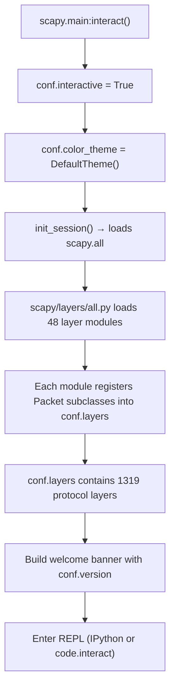

# Technical Specification

# 0. Agent Action Plan

## 0.1 Intent Clarification

### 0.1.1 Core Feature Objective

Based on the prompt, the Blitzy platform understands that the new feature requirement is to **perform a read-only runtime investigation of the Scapy packet manipulation framework** and produce a comprehensive answers document covering the following specific questions:

- **Startup Welcome Message & Version**: Determine the exact welcome banner text and version information displayed when Scapy launches its interactive console. The user needs to know the literal text rendered to the terminal during the `interact()` startup flow defined in `scapy/main.py`.

- **Protocol Layer Count (Runtime)**: Count the number of protocol layers that are actually **loaded and registered** in the running Scapy environment (via `conf.layers`), as opposed to merely counting source files in the `scapy/layers/` directory. This distinction between source-tree presence and runtime availability is explicitly called out by the user.

- **Default Configuration Inspection**: Identify and explain the default verbosity level (`conf.verb`), its numeric value, and the concrete behavioral difference each level produces in packet send/receive output. Additionally, determine which networking socket implementation (`conf.L3socket`) the platform selects on the current Linux system.

- **ICMP Ping Packet Structure**: Construct a basic `IP()/ICMP()` packet and document its object structure — specifically whether Scapy creates a single composite object or a multi-object linked structure, what layer types are involved, and how the `/` operator relates them.

- **Theming System**: Identify the active color theme in a default interactive Scapy session and report its exact class name as referenced in the codebase (`scapy/themes.py`).

Implicit requirements detected:
- The user requires answers based on **actual runtime execution**, not static source-code reading alone — the phrase "not just files in the source tree, but what's actually loaded" makes this explicit.
- No modifications to the existing repository are permitted; only temporary scripts for investigation may be created, and they must be cleaned up afterward.
- The output deliverable is a markdown document placed in `blitzy/documentation/` named `<source_branch_name>.md`, per the project's implementation rules.

### 0.1.2 Special Instructions and Constraints

- **Read-Only Codebase Mandate**: The user explicitly states: *"Don't modify any of the repository files while investigating this."* Temporary test scripts or commands are permitted for investigative purposes, but all temporary artifacts must be removed after use.
- **Runtime Execution Required**: Answers must be derived from running Scapy in the actual environment — not from theoretical source-code analysis alone. Static analysis supports but does not replace runtime verification.
- **Deliverable Format**: Per the `SWE-AtlasQnA-Repo` implementation rule, a new markdown document named `scapy_0925ada48540.md` must be created in the `blitzy/documentation` directory in the destination repo. This is the sole permitted new file in the repository.
- **No Code Modifications**: The implementation rule reinforces that no existing files in the source repository may be modified and no other code may be added beyond the requested document.
- **Evidence-Based Answers**: The rule states *"Do not make assumptions, base your answers on the code as the truth"* and *"Provide thinking / rationale behind the answers."*

### 0.1.3 Technical Interpretation

These feature requirements translate to the following technical implementation strategy:

- To **determine the welcome message and version**, we will execute the Scapy startup path (`scapy/main.py:interact()`) in a controlled manner, capturing the banner construction logic at lines 603–650 and the `conf.version` attribute derived from `scapy/__init__.py:_version()`.

- To **count loaded protocol layers**, we will import `scapy.all` (which triggers the full layer-loading cascade via `scapy/layers/all.py` and the `conf.load_layers` list in `scapy/config.py`) and then query `len(conf.layers)` at runtime to obtain the actual count of registered `Packet` subclasses.

- To **inspect default configuration**, we will read `conf.verb` (defined at line 759 of `scapy/config.py`) and correlate its value against the behavioral checks in `scapy/sendrecv.py` (lines 238, 249, 282, 297). We will also read `conf.L3socket` to identify the platform-specific socket backend selected by `scapy/arch/linux.py`.

- To **analyze ICMP packet structure**, we will construct `IP()/ICMP()` and inspect the result using `type()`, `.payload`, `.layers()`, `repr()`, and `show()` to document the linked-list composition pattern implemented by `Packet.__div__()` at line 596 of `scapy/packet.py`.

- To **identify the active theme**, we will examine both the `Conf` class default (`NoTheme()` at line 822 of `scapy/config.py`) and the interactive override (`DefaultTheme()` set at line 515 of `scapy/main.py`), then document the class hierarchy from `scapy/themes.py`.

- To **produce the deliverable**, we will create the directory `blitzy/documentation/` and write a markdown file `scapy_0925ada48540.md` containing all findings with rationale.

## 0.2 Repository Scope Discovery

### 0.2.1 Comprehensive File Analysis

The investigation spans the following areas of the Scapy repository. Since this is a **read-only investigation** producing only a documentation artifact, no source files are modified; however, the following files and directories were inspected to derive answers:

**Core Configuration and Startup Files (directly inspected at runtime):**

| File Path | Purpose in Investigation |
|---|---|
| `scapy/__init__.py` | Version derivation logic (`_version()` function, `VERSION`, `VERSION_MAIN` attributes) |
| `scapy/main.py` | Interactive console startup (`interact()` at line 503), welcome banner construction (lines 603–666), `QUOTES` list (lines 50–58), theme initialization (line 515) |
| `scapy/config.py` | `Conf` class (line 722) — `conf.verb` (line 759), `conf.color_theme` (line 822), `conf.load_layers` (lines 848–897), `conf.L3socket` (line 773) |
| `scapy/themes.py` | Theme class hierarchy: `ColorTheme` (line 94), `NoTheme` (line 117), `AnsiColorTheme` (line 121), `DefaultTheme` (line 167), `BlackAndWhite` (line 163) |
| `scapy/all.py` | Aggregate import module that triggers full layer loading cascade |
| `scapy/packet.py` | `Packet.__div__()` / `__truediv__()` (line 596) — the `/` operator for layer composition; `NoPayload` sentinel (line 1696) |
| `scapy/sendrecv.py` | Verbosity behavior: `SndRcvHandler` (lines 238, 249, 282, 297), `__gen_send()` (lines 355, 379–392), `sendpfast()` verb > 2 check (line 552) |

**Protocol Layer Modules (loaded at runtime via `conf.load_layers`):**

| Directory/File | Count | Role |
|---|---|---|
| `scapy/layers/*.py` | 48 core layer modules | Default protocol stack loaded by `conf.load_layers` |
| `scapy/layers/tls/` | 17 modules + `crypto/` subfolder | TLS/SSL subsystem (not loaded by default) |
| `scapy/contrib/*.py` | ~94 contrib modules | Optional protocol extensions (not loaded by default) |
| `scapy/contrib/automotive/` | Multi-module subsystem | Automotive protocols (not loaded by default) |
| `scapy/contrib/isotp/` | 6 modules | ISO-TP protocol (not loaded by default) |

**Platform Abstraction Layer (socket backend selection):**

| File Path | Purpose |
|---|---|
| `scapy/arch/__init__.py` | Platform detection and backend bootstrap |
| `scapy/arch/linux.py` | `L3PacketSocket` class — the Linux PF_PACKET socket implementation selected as `conf.L3socket` |
| `scapy/arch/common.py` | BPF filter compilation helper |
| `scapy/supersocket.py` | `SuperSocket` base class and `_SuperSocket_metaclass` |
| `scapy/consts.py` | Platform detection constants (`LINUX`, `DARWIN`, `WINDOWS`, etc.) |

**Supporting Infrastructure (consulted for context):**

| File Path | Purpose |
|---|---|
| `scapy/fields.py` | Field type system (3868 lines) — used by all protocol layers |
| `scapy/route.py` | IPv4 routing table |
| `scapy/interfaces.py` | Network interface management |
| `scapy/volatile.py` | Random value generators for fuzzing |
| `pyproject.toml` | Project metadata, Python version constraints, entry points |
| `setup.py` | Legacy setuptools configuration |
| `tox.ini` | Test matrix configuration (Python 2.7–3.11 across platforms) |

### 0.2.2 Integration Point Discovery

Since this task is a **read-only investigation** (no code integration), the relevant integration points are the **runtime interaction paths** between modules that produce the answers:

- **Startup Path**: `scapy/main.py:interact()` → imports `scapy/config.py:conf` → sets `conf.color_theme = DefaultTheme()` → builds banner with `conf.version` → enters REPL
- **Layer Loading Path**: `scapy/all.py` → `scapy/layers/all.py` → iterates `conf.load_layers` (48 entries) → each layer module registers `Packet` subclasses into `conf.layers`
- **Socket Selection Path**: `scapy/arch/__init__.py` → detects Linux → imports `scapy/arch/linux.py` → sets `conf.L3socket = L3PacketSocket`
- **Packet Composition Path**: `IP()/ICMP()` → `Packet.__div__()` (`scapy/packet.py` line 596) → `cloneA.add_payload(cloneB)` → linked payload chain

### 0.2.3 New File Requirements

Per the `SWE-AtlasQnA-Repo` implementation rule, exactly **one new file** is created:

| File | Purpose |
|---|---|
| `blitzy/documentation/scapy_0925ada48540.md` | Comprehensive answers document addressing all user questions, with rationale and runtime evidence |

No new source files, test files, or configuration files are required — this is a documentation-only deliverable.

## 0.3 Dependency Inventory

### 0.3.1 Private and Public Packages

The Scapy project operates with **zero required external dependencies** for its core functionality on Linux/BSD systems. The following table documents the packages relevant to this investigation:

| Registry | Package Name | Version | Purpose |
|---|---|---|---|
| PyPI | `scapy` | 2026.04.16 (git-derived) | Core packet manipulation framework — the project itself, installed in editable mode |
| PyPI | `setuptools` | ≥ 62.0.0 | Build system requirement (per `pyproject.toml` `[build-system]`) |
| System | Python | 3.12.3 | Runtime interpreter (environment pre-installed; project requires ≥ 3.7, < 4) |

**Optional Dependencies (not required for this investigation):**

| Registry | Package Name | Version Spec | Purpose |
|---|---|---|---|
| PyPI | `ipython` | (any) | Enhanced interactive shell (`[project.optional-dependencies] cli`) |
| PyPI | `cryptography` | ≥ 2.0 | TLS/crypto support (`[project.optional-dependencies] all`) |
| PyPI | `matplotlib` | (any) | Visualization and plotting (`[project.optional-dependencies] all`) |
| PyPI | `pyx` | (any) | PDF/PostScript packet diagrams (`[project.optional-dependencies] all`) |

### 0.3.2 Dependency Updates

No dependency updates are required. This task produces a read-only documentation artifact and does not modify any dependency manifests, import statements, or configuration files.

**Import chain utilized at runtime (no modifications):**
- `from scapy.all import *` — triggers the full layer-loading cascade
- `from scapy.config import conf` — provides access to all configuration attributes
- `from scapy.themes import DefaultTheme, NoTheme` — theme class inspection
- `from scapy.main import QUOTES` — startup quote collection

## 0.4 Integration Analysis

### 0.4.1 Existing Code Touchpoints

Since this task is a **read-only runtime investigation** with no code modifications, the integration analysis documents the **observation points** — the specific code locations that were executed and inspected to derive each answer.

**Welcome Message & Version (Question 1):**

- `scapy/__init__.py` — `_version()` function (line 122): Resolves version through a 4-method cascade: environment variable → `VERSION` file → git archive tag → `git describe`. In this environment, the git-describe method (`_version_from_git_describe()`) is used because the repository is a git clone without a `VERSION` file.
- `scapy/main.py` — `interact()` function (line 503): Constructs the ASCII art banner (lines 603–650) using `conf.version`, with the `the_banner` array containing "Welcome to Scapy" and "Version %s" lines.
- `scapy/main.py` — `QUOTES` list (lines 50–58): Eight humorous quotes randomly appended to the banner in fancy-prompt mode.

**Protocol Layer Count (Question 2):**

- `scapy/config.py` — `conf.load_layers` (lines 848–897): The 48-entry list of layer module names loaded at startup.
- `scapy/config.py` — `conf.layers` (line 737): A `LayersList` instance that accumulates all `Packet` subclasses as they are registered during module import.
- `scapy/layers/all.py` — Iterates `conf.load_layers` and triggers import of each layer module, which in turn registers `Packet` subclasses.

**Default Configuration (Question 3):**

- `scapy/config.py` — `conf.verb = 2` (line 759): Comment documents range as "from 0 (almost mute) to 3 (verbose)".
- `scapy/sendrecv.py` — Verbosity checks at multiple points:
  - `if self.verbose:` (lines 238, 249) — prints "Begin emission:" and "Finished sending N packets" when verbose ≥ 1
  - `if self.verbose > 1:` (lines 282, 297) — prints `*` for matched packets and `.` for unmatched packets when verbose ≥ 2
  - `if conf.verb > 2:` (line 552) — prints tcpreplay output when verbose ≥ 3
- `scapy/arch/linux.py` — `L3PacketSocket`: Selected as `conf.L3socket` on this Linux system, providing Layer 3 packet I/O via Linux PF_PACKET sockets.

**ICMP Packet Structure (Question 4):**

- `scapy/packet.py` — `Packet.__div__()` (line 596): The `/` operator clones both operands and chains them via `add_payload()`, creating a linked-list structure where the outer packet's `.payload` attribute points to the inner packet.
- `scapy/layers/inet.py` — `IP` and `ICMP` class definitions: The `bind_layers(IP, ICMP, proto=1)` call causes the `IP.proto` field to be automatically overloaded to `1` (ICMP) when ICMP is stacked as payload.

**Theme System (Question 5):**

- `scapy/config.py` — `color_theme` default (line 822): Initialized to `NoTheme()` via an `Interceptor` descriptor.
- `scapy/main.py` — `interact()` (line 515): Overrides to `DefaultTheme()` when entering interactive mode.
- `scapy/themes.py` — `DefaultTheme` class (line 167): Inherits from `AnsiColorTheme`, defining ANSI color codes for 22 style attributes (prompt, field names, layer names, etc.).

### 0.4.2 Runtime Execution Flow

The following flow describes how Scapy initializes its environment, which is central to answering the user's questions:

## 0.5 Technical Implementation

### 0.5.1 File-by-File Execution Plan

Since this task produces a single documentation artifact with no source-code modifications, the execution plan is focused on **creating one file** and **executing runtime investigation scripts**:

- **CREATE**: `blitzy/documentation/scapy_0925ada48540.md` — The comprehensive answers document containing all findings from the runtime investigation, organized by question with supporting evidence and rationale.

No other files are created, modified, or deleted in the repository.

### 0.5.2 Implementation Approach

The implementation follows a systematic investigation-then-document approach:

**Step 1 — Environment Setup:**
- Create a Python virtual environment at `/tmp/scapy_venv` using Python 3.12.3
- Install Scapy in editable mode (`pip install -e .`) from the local repository clone
- Verify that `from scapy.all import *` loads successfully

**Step 2 — Runtime Investigation (via temporary Python scripts):**
- Execute `conf.version` to capture the version string (`2026.04.16`)
- Reconstruct the welcome banner from `scapy/main.py` lines 603–650
- Count `len(conf.layers)` after full layer loading to get the runtime protocol layer count (`1319`)
- Read `conf.verb` and trace its behavioral impact through `scapy/sendrecv.py`
- Read `conf.L3socket` to identify the Linux socket implementation (`L3PacketSocket`)
- Construct `IP()/ICMP()` and inspect its type, `.payload` chain, `.layers()`, `.show()`, and `repr()`
- Inspect `conf.color_theme` in both non-interactive (default `NoTheme`) and interactive (`DefaultTheme`) contexts

**Step 3 — Document Production:**
- Compile all findings with exact code references and runtime output
- Organize into clear question-answer sections with rationale
- Place the document at `blitzy/documentation/scapy_0925ada48540.md`

**Step 4 — Cleanup:**
- Remove any temporary investigation scripts (Python one-liners executed via `python3 -c` do not leave file artifacts)
- Verify no repository files were modified

### 0.5.3 Key Runtime Findings Summary

The following findings were derived from actual runtime execution and will be documented in the deliverable:

| Question | Finding | Source |
|---|---|---|
| Welcome message | "Welcome to Scapy" with ASCII art logo and random quote | `scapy/main.py` lines 603–650 |
| Version | `2026.04.16` (derived from git describe, since no VERSION file exists) | `scapy/__init__.py:_version()` |
| Protocol layers loaded | **1319** layers registered in `conf.layers` at runtime | `len(conf.layers)` after `from scapy.all import *` |
| Default verbosity | `conf.verb = 2` (medium — shows emission messages plus per-packet dots/stars) | `scapy/config.py` line 759 |
| Socket implementation | `L3PacketSocket` from `scapy.arch.linux` — Linux PF_PACKET sockets | `conf.L3socket` at runtime |
| ICMP packet structure | Linked-list of layer objects: `IP` → (payload) → `ICMP` → (payload) → `NoPayload` | `IP()/ICMP()` runtime inspection |
| Default interactive theme | `DefaultTheme` (class name in code), set in `interact()` | `scapy/themes.py` line 167 |

## 0.6 Scope Boundaries

### 0.6.1 Exhaustively In Scope

**Documentation Deliverable:**
- `blitzy/documentation/scapy_0925ada48540.md` — The sole output artifact

**Files Read for Investigation (no modifications):**
- `scapy/__init__.py` — Version derivation
- `scapy/main.py` — Startup and banner logic
- `scapy/config.py` — `Conf` class, default settings, `load_layers`, socket backends
- `scapy/themes.py` — Theme class hierarchy and definitions
- `scapy/packet.py` — `/` operator implementation, `NoPayload` sentinel
- `scapy/sendrecv.py` — Verbosity behavior in send/receive operations
- `scapy/all.py` — Aggregate import triggering layer loading
- `scapy/layers/all.py` — Layer module loader
- `scapy/arch/__init__.py` — Platform detection bootstrap
- `scapy/arch/linux.py` — `L3PacketSocket` implementation
- `scapy/consts.py` — Platform constants
- `scapy/supersocket.py` — SuperSocket base class
- `scapy/layers/inet.py` — `IP` and `ICMP` layer definitions
- `pyproject.toml` — Project metadata and Python version constraints
- `setup.py` — Legacy setup configuration
- `tox.ini` — Test matrix for version reference

**Runtime Execution (temporary, no artifacts persisted):**
- Python one-liner scripts executed via `python3 -c "..."` to query runtime state
- Virtual environment at `/tmp/scapy_venv` (outside the repository)

### 0.6.2 Explicitly Out of Scope

- **Source Code Modifications**: No existing files in the Scapy repository are modified, per explicit user instruction and the `SWE-AtlasQnA-Repo` rule
- **New Source Code**: No Python modules, test files, or scripts are added to the repository (only the documentation markdown file)
- **Contrib Module Analysis**: The ~94 contrib modules under `scapy/contrib/` are not individually inspected; only their aggregate count is noted for context
- **TLS Subsystem Deep Inspection**: The 17+ modules under `scapy/layers/tls/` are not investigated beyond noting their non-default loading status
- **Performance Testing or Benchmarking**: No performance profiling of Scapy startup or packet operations
- **Network Operations Testing**: No actual packet sending, receiving, or sniffing — the investigation examines configuration and structure only
- **Refactoring or Optimization**: No code improvements or suggestions beyond the scope of answering the stated questions
- **Platform-Specific Investigation**: Only the current Linux environment is examined; Windows, macOS, and BSD socket backends are not tested

## 0.7 Rules for Feature Addition

### 0.7.1 User-Specified Rules

The following rules were explicitly provided by the user and the project's implementation rules configuration:

**From the user's prompt:**

- **No Repository Modifications**: *"Don't modify any of the repository files while investigating this."* All investigation must be read-only. Temporary scripts or commands are permitted for investigation but must be cleaned up afterward.
- **Runtime-Based Answers**: Answers must be based on actual runtime behavior, not just static source-tree analysis. The user explicitly distinguished between files in the source tree and what is "actually loaded and ready to use."
- **Cleanup Requirement**: *"Clean up any temporary files or scripts you create when you're done."*

**From the `SWE-AtlasQnA-Repo` implementation rule:**

- **Output Document Format**: Create a new markdown document named `<source_branch_name>.md` — which maps to `scapy_0925ada48540.md` based on the current branch name.
- **Document Placement**: Place the generated document in the `blitzy/documentation` directory in the destination repository.
- **Build and Run**: *"Build and run the source code to analyse the repository behavior as needed."*
- **Evidence-Based**: *"Do not make assumptions, base your answers on the code as the truth."*
- **Rationale Required**: *"Provide thinking / rationale behind the answers."*
- **No Existing File Modifications**: *"Do not modify any existing files in the source repository."*
- **No Additional Code**: *"Do not add any other code in the source repository (besides the above requested document)."*

### 0.7.2 Conventions to Follow

- All runtime evidence must be captured from actual Python execution in the established virtual environment with Scapy installed in editable mode
- Version references must use the exact values returned by the runtime, not hardcoded or assumed values
- File line references should be verified against the actual source to ensure accuracy
- The markdown document must be self-contained and comprehensive, requiring no external references to understand the answers

## 0.8 References

### 0.8.1 Repository Files and Folders Searched

The following files and directories were systematically inspected to derive the conclusions documented in this Agent Action Plan:

**Root-Level Configuration Files:**
- `pyproject.toml` — Project metadata, Python version constraints (`>=3.7, <4`), build system, entry points, optional dependencies
- `setup.py` — Legacy setuptools configuration, version note
- `tox.ini` — Test matrix (Python 2.7–3.11, Linux/BSD/Windows), test commands, flake8 config
- `CONTRIBUTING.md` — Contributor guidelines (referenced for module import rules)
- `README.md` — Project overview
- `run_scapy` — Shell launcher script
- `MANIFEST.in` — Source distribution include rules

**Core Scapy Package (`scapy/`):**
- `scapy/__init__.py` (lines 1–160) — Version derivation logic: `_parse_tag()`, `_version_from_git_archive()`, `_version_from_git_describe()`, `_version()`, `VERSION`, `VERSION_MAIN`
- `scapy/main.py` (lines 1–715) — Interactive console: `interact()`, `QUOTES`, `_prepare_quote()`, `init_session()`, banner construction, IPython integration
- `scapy/config.py` (lines 722–913) — `Conf` class: `conf.verb`, `conf.color_theme`, `conf.load_layers`, `conf.L3socket`, `conf.layers`, all socket backends
- `scapy/themes.py` (lines 1–270) — Theme hierarchy: `ColorTheme`, `NoTheme`, `AnsiColorTheme`, `DefaultTheme`, `BlackAndWhite`, `BrightTheme`, `RastaTheme`, `ColorOnBlackTheme`
- `scapy/packet.py` (lines 596–625) — Layer composition: `__div__()`, `__truediv__()`, `__rdiv__()`, `add_payload()`
- `scapy/sendrecv.py` (lines 100–560) — Verbosity behavior: `SndRcvHandler`, `__gen_send()`, `_send()`, verbose checks
- `scapy/all.py` (full file) — Aggregate import module
- `scapy/consts.py` — Platform detection constants
- `scapy/supersocket.py` — `SuperSocket` base class, `_SuperSocket_metaclass`

**Architecture Layer (`scapy/arch/`):**
- `scapy/arch/__init__.py` — Platform detection and backend bootstrap
- `scapy/arch/linux.py` — `L3PacketSocket`, `L2Socket`, `L2ListenSocket` (PF_PACKET-based)
- `scapy/arch/bpf/` — BSD/macOS BPF backend (3 files)
- `scapy/arch/windows/` — Windows backend (3 files)
- `scapy/arch/common.py` — BPF filter compilation
- `scapy/arch/libpcap.py` — Libpcap ctypes integration

**Protocol Layers (`scapy/layers/`):**
- `scapy/layers/inet.py` — `IP`, `ICMP`, `TCP`, `UDP` class definitions; `bind_layers()` calls
- `scapy/layers/all.py` — Layer loading logic iterating `conf.load_layers`
- 48 default layer modules (bluetooth through zigbee) — counted but not individually deep-inspected

**Contrib and Other Directories (counted/surveyed):**
- `scapy/contrib/` — 94 contrib module files + 4 subdirectories
- `scapy/asn1/` — 4 ASN.1 modules
- `scapy/modules/` — External tool integration
- `scapy/tools/` — UTscapy and automotive CLI tools
- `scapy/libs/` — Vendored libraries

### 0.8.2 Attachments

No external attachments (Figma designs, API specifications, or supplementary documents) were provided with this task.

### 0.8.3 External References

- **Scapy Repository**: `https://github.com/secdev/scapy` (as documented in `pyproject.toml`)
- **Scapy Documentation**: `https://scapy.readthedocs.io` (as documented in `pyproject.toml`)
- **Docker Image**: `ghcr.io/scaleapi/swe-atlas:swe_atlas_QnA_secdev_scapy_1.0` (from `andrewparkscaleai/coding-agent:secdev__scapy__0925ada485406684174d6f068dbd85c4154657b3`)
- **Git Commit**: `0925ada4` — "Add AUTOSAR PDUTransport/PDU with initial batch of tests (#3933)"
- **Branch Name**: `scapy_0925ada48540` — Used as the basis for the output document filename

