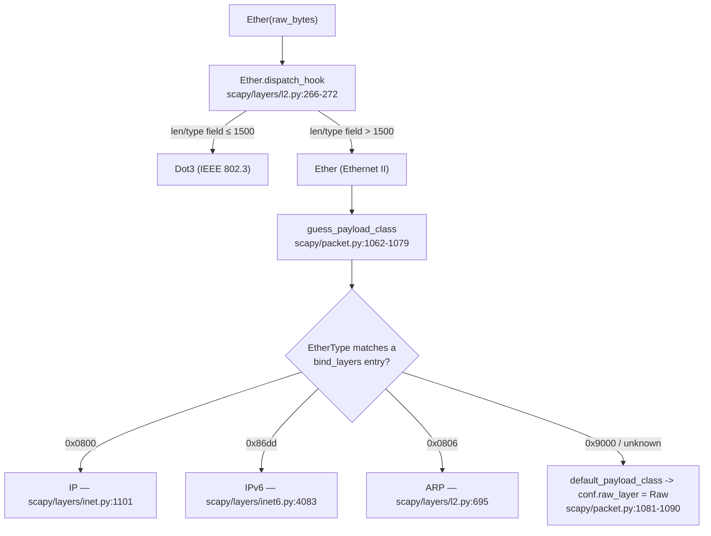

# Scapy: Ethernet Minimum-Frame Padding & EtherType Next-Layer Dispatch — An Evidence-Backed Investigation

This document answers a seven-part investigation into how the in-tree
[`secdev/scapy`](https://github.com/secdev/scapy) library handles **(a)** Ethernet
minimum-frame padding and **(b)** EtherType-based next-layer dispatch, including the
fallback behavior for an unrecognized protocol number.

Every behavioral claim below was obtained by **running the library first** and pasting
the **complete, unedited output** next to the claim, together with the exact command that
produced it. Each behavior is then anchored to the exact source location (`file:line`) and
the specific function/method/class responsible. This is a **read-only** investigation: no
repository file was modified, and the only artifact created is this document.

---

## Environment & Methodology

| Item | Value |
|------|-------|
| Library under test | in-tree `scapy`, `scapy.__version__` = **`2026.07.13`** (imported from the repository checkout, not a site-package) |
| Python interpreter | **`3.13.7`** (see the discrepancy note below) |
| Canonical invocation | `PYTHONPATH=<repo root> python3 <script>` — equivalent to the repository's `run_scapy` launcher, which runs `PYTHONPATH=$DIR exec python3 -m scapy` |
| Exact command form used | `PYTHONPATH=. .venv/bin/python /tmp/<script>.py` (run from the repository root) |
| Runtime configuration | **default** — `conf.padding` left at its default of `1`; nothing was reconfigured |
| Repository state | left **byte-for-byte unchanged**; `git status --porcelain` reports only this new untracked document |

### Reproducibility of the interpreter version

The project's Agent Action Plan referenced Python **3.12.3** (the version inside the
original container image). The environment this investigation actually ran in provides
Python **3.13.7**, which equally satisfies the project's `requires-python = ">=3.7, <4"`
constraint (`pyproject.toml`). Per the run-first / actual-output methodology, the version
reported throughout this document is the **observed** one (`3.13.7`). The Ethernet
build/dissect and dispatch behavior exercised here is pure-Python and version-independent;
all stable observations below were confirmed identical across two runs.

### Stable vs. non-stable facts (read this before trusting any specific value)

- **Stable facts** (deterministic; safe to treat as fixed): byte **lengths**, **layer
  names**, equality **booleans**, and **class names**. These are the load-bearing facts of
  this investigation and were verified identical across two runs.
- **Non-stable facts** (may vary per run / per environment): **MAC addresses**, **IP
  source/destination**, **checksums**, and **TCP sequence numbers**. Wherever such a value
  appears below (e.g. a source MAC in `show()` output), it is **my own observed value from
  my own run** and is explicitly flagged; it is **not** asserted as canonical. In this
  container the observed source MAC happened to be identical across both of my runs, but it
  is environment-dependent and will differ elsewhere.

### A note on import-time warnings (environment artifact)

Every script that does `from scapy.all import ...` emits the following two lines on
**stderr** at import time, because this environment ships `cryptography` 49.0.0 and Scapy's
IPsec layer references the now-relocated `TripleDES` algorithm. These warnings are unrelated
to Ethernet padding or dispatch and are emitted once per process:

```
/tmp/blitzy/scapy/.../scapy/layers/ipsec.py:573: CryptographyDeprecationWarning: TripleDES has been moved to cryptography.hazmat.decrepit.ciphers.algorithms.TripleDES and will be removed from cryptography.hazmat.primitives.ciphers.algorithms in 48.0.0.
  cipher=algorithms.TripleDES,
/tmp/blitzy/scapy/.../scapy/layers/ipsec.py:577: CryptographyDeprecationWarning: TripleDES has been moved to cryptography.hazmat.decrepit.ciphers.algorithms.TripleDES and will be removed from cryptography.hazmat.primitives.ciphers.algorithms in 48.0.0.
  cipher=algorithms.TripleDES,
```

For readability, these two lines are **elided** from the per-question stderr captures below;
the behaviorally relevant stderr line (`WARNING: Mac address to reach destination not found.
Using broadcast.`) is shown where it appears.

---

## Executive Summary (direct answers up front)

| # | Question | Direct answer |
|---|----------|---------------|
| **Q1** | Build three in-memory packets via `raw()` | Built and serialized: `Ether()/IP()/TCP()` → **54 B**; `Ether()/IP()/TCP()/Raw(b"A"*10)` → **64 B**; `Ether(type=0x9000)/Raw(b"\xde\xad\xbe\xef")` → **18 B**. |
| **Q2** | Does Scapy auto-pad a short frame to the Ethernet minimum on in-memory build? | **No.** The frame stays exactly as small as its contents. Scapy adds **no** minimum-frame padding on build. |
| **Q3** | What happens to padding across an `Ether(raw(packet))` round-trip? | It **sticks around** — but only if trailing bytes exist on the wire buffer. Those bytes are captured as a `Padding` layer on dissection and re-emitted on rebuild, so `raw(Ether(raw(pkt))) == raw(pkt)` exactly. A frame with no trailing bytes round-trips with **no** `Padding` layer. |
| **Q4** | What does Scapy show after Ethernet for an unknown EtherType? | A **`Raw`** layer (raw byte dump). **No exception** is raised and **no** protocol is guessed. The `type` prints as the hex string `0x9000`. |
| **Q5** | At what payload size does Scapy "stop adding padding"? | **There is no such size — there is no threshold.** `len(raw(...))` equals exactly `54 + n` for every payload size `n` tested (0…100). Padding is **never** added on build. |
| **Q6** | Where does the Ethernet code decide to add padding, and how does it pick the next layer from `type`? | **No code adds minimum-frame padding on build.** Next-layer selection uses **two** separate mechanisms: `Ether.dispatch_hook()` picks `Dot3` vs `Ether`, then `guess_payload_class()` consults the `bind_layers()`-populated `payload_guess` table to pick the upper protocol from the EtherType. |
| **Q7** | What logic runs for an unrecognized EtherType number? | `guess_payload_class()` finds no matching `payload_guess` entry and calls `default_payload_class()`, which returns `conf.raw_layer` (`Raw`). Graceful fallback — no error, no guessing. |

---

## Q1 — Build three in-memory packets (no transmission), serialized via `raw()`

**Direct answer.** All three packets build and serialize cleanly through the canonical
Scapy API (layer composition with `/`, serialization with `raw()`): the normal
`Ether()/IP()/TCP()` is **54 bytes**, the 10-byte-payload
`Ether()/IP()/TCP()/Raw(b"A"*10)` is **64 bytes**, and the unknown-EtherType
`Ether(type=0x9000)/Raw(b"\xde\xad\xbe\xef")` is **18 bytes**. None is transmitted; each is
turned into bytes purely in memory.

**Command**

```
PYTHONPATH=. .venv/bin/python /tmp/obs_q1.py
```

where `/tmp/obs_q1.py` is:

```python
# Q1 — build three in-memory packets, serialize via raw()
from scapy.all import Ether, IP, TCP, Raw
from scapy.compat import raw
import scapy, sys
print("scapy.__version__ =", scapy.__version__)
print("python =", sys.version.split()[0])
p1 = Ether()/IP()/TCP()
print("p1 repr :", repr(p1))
print("p1 len  :", len(raw(p1)))
p2 = Ether()/IP()/TCP()/Raw(b"A"*10)
print("p2 repr :", repr(p2))
print("p2 len  :", len(raw(p2)))
p3 = Ether(type=0x9000)/Raw(b"\xde\xad\xbe\xef")
print("p3 repr :", repr(p3))
print("p3 len  :", len(raw(p3)))
```

**Complete unedited output** (stdout)

```
scapy.__version__ = 2026.07.13
python = 3.13.7
p1 repr : <Ether  type=IPv4 |<IP  frag=0 proto=tcp |<TCP  |>>>
p1 len  : 54
p2 repr : <Ether  type=IPv4 |<IP  frag=0 proto=tcp |<TCP  |<Raw  load='AAAAAAAAAA' |>>>>
p2 len  : 64
p3 repr : <Ether  type=0x9000 |<Raw  load='ޭ\\xbe\\xef' |>>
p3 len  : 18
```

Relevant stderr (building the IP stack triggers destination-MAC resolution):

```
WARNING: Mac address to reach destination not found. Using broadcast.
```

**Observations.**
- `p1` = 14 (Ethernet) + 20 (IP) + 20 (TCP) = **54** bytes.
- `p2` = 54 + 10 (the `Raw` payload) = **64** bytes.
- `p3` = 14 (Ethernet) + 4 (the `Raw` load `b"\xde\xad\xbe\xef"`) = **18** bytes.
- In `p1`/`p2` the Ethernet `type` renders as the **name** `IPv4` because adding an `IP`
  payload overloads the field to `0x0800`; in `p3` it renders as the **hex** `0x9000`
  (an unknown EtherType — see Q4/Q7). The `Raw` load in `p3` prints as `'ޭ\\xbe\\xef'`
  because bytes `0xDE 0xAD` decode as the single UTF-8 character `ޭ` (U+07AD) while
  `0xBE 0xEF` are shown escaped — this is a *non-stable* cosmetic detail of the repr, not a
  load-bearing fact; the load is always the 4 bytes `de ad be ef`.
- The `WARNING: Mac address ...` line is a *non-stable*, routing-dependent artifact of
  resolving a destination MAC while building an IP stack; it is harmless and does not affect
  the byte output.

**Responsible code.**
- `raw(x)` → `bytes(x)` — `scapy/compat.py:112-118`, function **`raw()`**. This is the exact
  serialization entry point named in the question ("`raw(packet)`").
- `bytes(x)` invokes the packet build path — `scapy/packet.py:746`, method
  **`Packet.build`** (details in Q2 / "Where in the code").

---

## Q2 — Does Scapy auto-pad a short frame to the Ethernet minimum on build?

**Direct answer. No.** When a frame is serialized in memory with `raw()`, Scapy emits
**exactly** the bytes of the composed layers and does **not** pad up to the 60-byte Ethernet
minimum (nor the 64-byte figure that includes the FCS). The frame stays small. The bare
`Ether()/IP()/TCP()` is 54 bytes and remains 54 bytes.

**Command**

```
PYTHONPATH=. .venv/bin/python /tmp/obs_q5.py
```

(The single sweep script serves both Q2 and Q5; the `n = 0` row is the bare
`Ether()/IP()/TCP()`.)

**Complete unedited output** (stdout)

```
n	len	len==54+n
0	54	True
1	55	True
2	56	True
3	57	True
4	58	True
5	59	True
6	60	True
10	64	True
20	74	True
46	100	True
100	154	True
```

**Observations.**
- The bare frame is **54 bytes** — below the 60-byte Ethernet minimum — yet it is **not**
  padded. If Scapy padded on build, `n = 0` would report 60, not 54.
- Every row satisfies `len == 54 + n`, i.e. the emitted length tracks the payload size
  linearly with no floor.

**Responsible code.**
- `scapy/packet.py:746`, method **`Packet.build`** — the whole build path is
  `p = self.do_build(); p += self.build_padding(); p = self.build_done(p); return p`. There
  is **no** length comparison against 60 or 64 anywhere in this method (or in
  `Packet.build_padding` at `scapy/packet.py:742-744`). Because nothing measures the frame
  against a minimum, nothing pads it. (This is the causal reason the frame "stays small" —
  see also Q6 and "Where in the code".)

---

## Q3 — What happens to padding across an `Ether(raw(packet))` round-trip?

**Direct answer.** It depends on whether the wire bytes carry trailing bytes:
- If the serialized frame has **no** trailing bytes (e.g. `Ether()/IP()/TCP()`), the
  round-trip produces **no** `Padding` layer, and `raw(Ether(raw(p))) == raw(p)` is **True**.
- If the wire buffer **does** carry trailing bytes (e.g. a 60-byte frame padded past the
  layers that consume bytes), dissection **captures them as a `Padding` layer** and rebuild
  **re-emits them**, so the padding **sticks around** and `raw(Ether(wire)) == wire` is
  **True** (byte-for-byte).

**Command**

```
PYTHONPATH=. .venv/bin/python /tmp/obs_q3.py
```

where `/tmp/obs_q3.py` is:

```python
# Q3 — round-trip through Ether(raw(packet)); with/without trailing bytes
from scapy.all import Ether, IP, TCP, ARP, Padding
from scapy.compat import raw
print("=== (a) NO trailing bytes: Ether()/IP()/TCP() ===")
p = Ether()/IP()/TCP()
w = raw(p)
d = Ether(w)
layers = []
cur = d
while cur:
    layers.append(cur.name)
    cur = cur.payload if cur.payload else None
print("len(raw(p))            :", len(w))
print("layers after redissect :", layers)
print("haslayer(Padding)      :", d.haslayer(Padding))
print("raw(Ether(raw(p)))==raw(p):", raw(Ether(w)) == w)
print()
print("=== (b) WITH trailing bytes: Ether()/ARP() padded to 60 ===")
base = raw(Ether()/ARP())
target = 60
pad = target - len(base)
w2 = base + b"\x00"*pad
d2 = Ether(w2)
layers2 = []
cur = d2
while cur:
    layers2.append(cur.name)
    cur = cur.payload if cur.payload else None
print("base len (Ether()/ARP()):", len(base))
print("target len              :", target)
print("appended zero bytes     :", pad)
print("layers after dissect    :", layers2)
print("haslayer(Padding)       :", d2.haslayer(Padding))
print("Padding.load length     :", len(d2[Padding].load) if d2.haslayer(Padding) else None)
print("raw(Ether(w2))==w2       :", raw(Ether(w2)) == w2)
```

**Complete unedited output** (stdout)

```
=== (a) NO trailing bytes: Ether()/IP()/TCP() ===
len(raw(p))            : 54
layers after redissect : ['Ethernet', 'IP', 'TCP']
haslayer(Padding)      : 0
raw(Ether(raw(p)))==raw(p): True

=== (b) WITH trailing bytes: Ether()/ARP() padded to 60 ===
base len (Ether()/ARP()): 42
target len              : 60
appended zero bytes     : 18
layers after dissect    : ['Ethernet', 'ARP', 'Padding']
haslayer(Padding)       : True
Padding.load length     : 18
raw(Ether(w2))==w2       : True
```

**Observations (before → intermediate → after).**
- **Case (a), no trailing bytes.** Before: `raw(p)` is 54 bytes. After re-dissection the
  layer stack is `['Ethernet', 'IP', 'TCP']` with **no** `Padding` (`haslayer(Padding)`
  prints `0`, i.e. absent). Rebuild reproduces the input exactly (`True`).
- **Case (b), with trailing bytes.** Construction is explicit: the base `Ether()/ARP()` is
  **42 bytes** (14 Ethernet + 28 ARP), and I appended `60 − 42 = 18` zero bytes to reach a
  60-byte wire buffer. After dissection the stack is `['Ethernet', 'ARP', 'Padding']`,
  `haslayer(Padding)` is `True`, and the intermediate `Padding.load` is **18 bytes** long
  (exactly the number I appended). Rebuild reproduces the 60-byte input exactly (`True`).
- **Observed padding length = 18** (= target 60 − base 42). *(An earlier draft of the plan
  mentioned "38"; the actual observed value with this construction is **18**. The base I
  built is `Ether()/ARP()` = 42 bytes, and the target is 60 bytes.)*
- Note `haslayer(Padding)` printing `0` in case (a) vs `True` in case (b) is just Scapy's
  falsy/truthy return; both mean the same thing (absent vs present).

**Responsible code.**
- `scapy/packet.py:1049-1060`, method **`Packet.dissect`** — after dissecting the payload it
  runs `payl, pad = self.extract_padding(s)` then, critically, at lines **1057-1060**:
  `self.do_dissect_payload(payl)` followed by
  `if pad and conf.padding: self.add_payload(conf.padding_layer(pad))`. This is what turns
  trailing bytes into a `Padding` layer.
- `scapy/config.py:786-787`, attribute **`Conf.padding`** — defaults to `1`
  ("includes padding in disassembled packets"), which is why the trailing bytes are attached
  during dissection under the default configuration.
- `scapy/packet.py:1913-1918`, method **`Padding.build_padding`** — re-emits the stored load
  (`bytes_encode(self.load)` or the cached raw bytes) on rebuild, which is why the padding
  **survives** re-serialization and the round-trip is byte-for-byte identical. (The `Padding`
  class begins at `scapy/packet.py:1906`.)
- `scapy/packet.py:982-990`, base **`Packet.extract_padding`** — the default returns
  `(s, None)`; ARP's own `extract_padding` is what hands the trailing bytes back as `pad`,
  which `Packet.dissect` then wraps as `Padding`.

---


## Q4 — What does Scapy show after Ethernet for an unknown EtherType?

**Direct answer.** Scapy shows a **`Raw`** layer (a raw byte dump) after the Ethernet
header. It does **not** raise an exception and does **not** attempt to guess a protocol. The
Ethernet `type` field is rendered as the hex string **`0x9000`** (not a protocol name).

**Command**

```
PYTHONPATH=. .venv/bin/python /tmp/obs_q4_q6_q7.py
```

(This one script covers Q4, Q6 and Q7; only the Q4 portion of its output is shown here.)

**Complete unedited output** (Q4 portion, stdout)

```
=== Q4: show() of unknown EtherType 0x9000 ===
###[ Ethernet ]### 
  dst       = ff:ff:ff:ff:ff:ff
  src       = 3a:5a:f7:71:74:23
  type      = 0x9000
###[ Raw ]### 
     load      = 'ޭ\\xbe\\xef'

repr(p)               : <Ether  type=0x9000 |<Raw  load='ޭ\\xbe\\xef' |>>
layer after Ethernet  : Raw
```

Relevant stderr:

```
WARNING: Mac address to reach destination not found. Using broadcast.
```

**Observations.**
- The dissected/`show()`n structure is `Ethernet` → `Raw`. The `layer after Ethernet` is
  literally the class **`Raw`**.
- `type = 0x9000` is displayed as **hex**, not a name, because `0x9000` is absent from the
  EtherType name table (see Q7).
- **`src = 3a:5a:f7:71:74:23` is a non-stable value** — it is my own observed source MAC for
  this run (a locally-administered address chosen by route resolution). It may differ in
  other environments; `dst = ff:ff:ff:ff:ff:ff` (broadcast) is the Ethernet default.
- The `show()` and `repr()` calls completed normally — **no exception was raised** — which is
  itself the evidence that an unknown EtherType is handled gracefully.

**Responsible code.**
- `scapy/packet.py:1062-1079`, method **`Packet.guess_payload_class`** → falls through to
  `scapy/packet.py:1081-1090`, method **`Packet.default_payload_class`**, which returns
  `conf.raw_layer` (= `Raw`). This is why the next layer is `Raw` (full trace in Q7).
- `scapy/fields.py:2660-2673`, method **`XShortEnumField.i2repr_one`** — attempts the enum
  name lookup and, on `KeyError`, falls through to `return lhex(x)`, which is why an unknown
  `type` prints as the hex string `0x9000`.

---

## Q5 — Sweep payload size: where does Scapy "stop adding padding"?

**Direct answer. It never adds padding on build, so there is no threshold at which it
"stops."** Across every payload size tested, `len(raw(...))` equals **exactly** `54 + n`.
There is no minimum-length floor and no size at which behavior changes.

**Commands** (run twice for the stability rule)

```
PYTHONPATH=. .venv/bin/python /tmp/obs_q5.py    # run 1
PYTHONPATH=. .venv/bin/python /tmp/obs_q5.py    # run 2
```

where `/tmp/obs_q5.py` is:

```python
# Q2/Q5 — payload-size sweep; is padding ever added on build?
from scapy.all import Ether, IP, TCP, Raw
from scapy.compat import raw
print("n\tlen\tlen==54+n")
for n in [0,1,2,3,4,5,6,10,20,46,100]:
    pkt = Ether()/IP()/TCP() if n == 0 else Ether()/IP()/TCP()/Raw(b"A"*n)
    L = len(raw(pkt))
    print("%d\t%d\t%s" % (n, L, L == 54 + n))
```

**Complete unedited output** — run 1 (identical to run 2)

```
n	len	len==54+n
0	54	True
1	55	True
2	56	True
3	57	True
4	58	True
5	59	True
6	60	True
10	64	True
20	74	True
46	100	True
100	154	True
```

**Stability.** The two runs produced byte-for-byte identical output; a `diff` of the two
captures was empty (exit code 0). **The two runs agreed.**

**Observations.**
- The sweep crosses the 60-byte Ethernet minimum from below (`n = 0` → 54, `n = 5` → 59) to
  above (`n = 6` → 60, `n = 10` → 64) and keeps going (`n = 100` → 154). At **no** point does
  the length "snap up" to 60. Frames both below and above 60 obey `len == 54 + n`.
- Note the user's "10 bytes" example (`n = 10`) yields 64 bytes — already **above** 60 — so
  even that case would not be padded; and, crucially, the sub-60 cases (`n = 0…5`) are not
  padded either. This is the point of confusion the question probes: Scapy simply does not
  pad on build.

**Responsible code.** Same as Q2 — `scapy/packet.py:746`, method **`Packet.build`** performs
no length comparison, so no size ever triggers padding.

---

## Q6 — Where does the code decide to add padding, and how does it pick the next layer from `type`?

**Direct answer.**
- **Padding on build: nowhere.** No code location adds minimum-frame padding on build. The
  build path is purely `do_build() + build_padding() + build_done()` with no length check.
- **Next-layer selection: two distinct mechanisms**, in order:
  1. **`Ether.dispatch_hook()`** decides whether the bytes are Ethernet II (`Ether`) or IEEE
     802.3 (`Dot3`), based purely on whether the 2-byte length/type field is `<= 1500`.
  2. **`Packet.guess_payload_class()`** then consults the `payload_guess` table (populated by
     `bind_layers()`) to pick the upper protocol from the EtherType value.

**Command** (the Q6 portion of the shared script)

```
PYTHONPATH=. .venv/bin/python /tmp/obs_q4_q6_q7.py
```

The relevant script fragment:

```python
import struct
small = b"\xff"*6 + b"\x00"*6 + struct.pack("!H", 46)     + b"\x00"*46
big   = b"\xff"*6 + b"\x00"*6 + struct.pack("!H", 0x0800) + b"\x00"*46
print("len/type=46   (<=1500): dispatch_hook ->", Ether.dispatch_hook(small).__name__, "; Ether(bytes).__class__ ->", Ether(small).__class__.__name__)
print("len/type=2048 (>1500) : dispatch_hook ->", Ether.dispatch_hook(big).__name__,   "; Ether(bytes).__class__ ->", Ether(big).__class__.__name__)
```

**Complete unedited output** (Q6 portion, stdout)

```
=== Q6: Ether.dispatch_hook Dot3-vs-Ether ===
len/type=46   (<=1500): dispatch_hook -> Dot3 ; Ether(bytes).__class__ -> Dot3
len/type=2048 (>1500) : dispatch_hook -> Ether ; Ether(bytes).__class__ -> Ether
```

**Observations (both boundary branches).**
- A frame whose 2-byte length/type field is `46` (`<= 1500`) dispatches to **`Dot3`** (IEEE
  802.3), and dissecting those bytes yields a `Dot3` top layer.
- A frame whose field is `2048` = `0x0800` (`> 1500`) dispatches to **`Ether`** (Ethernet
  II), and dissecting yields an `Ether` top layer. `0x0800` then selects `IP` in the second
  mechanism (Q7).

**Responsible code.**
- **Padding decision (there is none):** `scapy/packet.py:746`, method **`Packet.build`** — no
  length comparison; `scapy/packet.py:742-744`, method **`Packet.build_padding`** — only
  delegates to the payload. No minimum-frame padding is synthesized on build.
- **Mechanism 1 — `Dot3` vs `Ether`:** `scapy/layers/l2.py:266-272`, classmethod
  **`Ether.dispatch_hook`**:
  ```python
  @classmethod
  def dispatch_hook(cls, _pkt=None, *args, **kargs):
      # type: (Optional[bytes], *Any, **Any) -> Type[Packet]
      if _pkt and len(_pkt) >= 14:
          if struct.unpack("!H", _pkt[12:14])[0] <= 1500:
              return Dot3
      return cls
  ```
  Bytes 12–14 are the length/type field; `<= 1500` means "length" (802.3 → `Dot3`), otherwise
  "type" (Ethernet II → `Ether`).
- **Mechanism 2 — EtherType → upper protocol:** `scapy/packet.py:1062-1079`, method
  **`Packet.guess_payload_class`**, scans `self.aliastypes[*].payload_guess` and returns the
  first bound class whose field constraints all match. That table is populated by
  `bind_layers()` — see Q7.

---

## Q7 — What logic runs when the EtherType is a protocol number Scapy does not recognize?

**Direct answer.** `guess_payload_class()` scans the `payload_guess` bindings for one whose
EtherType matches; finding none for `0x9000`, it calls `default_payload_class()`, which
returns `conf.raw_layer` — i.e. **`Raw`**. There is **no error and no guessing**; the
remaining bytes become a `Raw` layer. Separately, the `type` value prints as hex because
`0x9000` is **absent** from the `ETHER_TYPES` name table.

**Command** (the Q7 portion of the shared script)

```
PYTHONPATH=. .venv/bin/python /tmp/obs_q4_q6_q7.py
```

The relevant script fragment:

```python
from scapy.data import ETHER_TYPES
for v in (0x0800, 0x0806, 0x86dd, 0x9000):
    present = v in ETHER_TYPES
    try:
        name = ETHER_TYPES[v]
    except (KeyError, AttributeError):
        name = "ABSENT"
    print("0x%04x in ETHER_TYPES = %-5s -> %r" % (v, present, name))
print("Ether(type=0x9000).guess_payload_class(b'') :", Ether(type=0x9000).guess_payload_class(b"").__name__)
print("conf.raw_layer                              :", conf.raw_layer.__name__)
```

**Complete unedited output** (Q7 portion, stdout)

```
=== Q7: ETHER_TYPES lookups + fallback ===
0x0800 in ETHER_TYPES = True  -> 'IPv4'
0x0806 in ETHER_TYPES = True  -> 'ARP'
0x86dd in ETHER_TYPES = True  -> 'IPv6'
0x9000 in ETHER_TYPES = False -> 'ABSENT'
Ether(type=0x9000).guess_payload_class(b'') : Raw
conf.raw_layer                              : Raw
```

**Observations.**
- `0x0800` (IPv4), `0x0806` (ARP) and `0x86dd` (IPv6) are all present in `ETHER_TYPES` and
  resolve to names; **`0x9000` is absent** (`in` → `False`).
- `Ether(type=0x9000).guess_payload_class(b"")` returns the class **`Raw`**, and
  `conf.raw_layer` is **`Raw`** — confirming the fallback path end to end.
- *(Implementation detail encountered while observing:* `ETHER_TYPES` is a `DADict`
  (`scapy/dadict.py`), not a plain `dict`; it supports `v in ETHER_TYPES` and
  `ETHER_TYPES[v]` but not `.get()`. This does not affect the behavior; it only shaped how
  the probe was written.)

**Responsible code.**
- `scapy/packet.py:1062-1079`, method **`Packet.guess_payload_class`** — scans `payload_guess`
  for a binding whose fields match; if none match it returns
  `self.default_payload_class(payload)`.
- `scapy/packet.py:1081-1090`, method **`Packet.default_payload_class`** — returns
  `conf.raw_layer`.
- `scapy/packet.py:1921-1922` — module-level `conf.raw_layer = Raw` and
  `conf.padding_layer = Padding`.
- `scapy/data.py:526-530` — `ETHER_TYPES = load_ethertypes(...)`, the name table that lacks
  `0x9000`.
- `scapy/fields.py:2660-2673`, method **`XShortEnumField.i2repr_one`** — the `KeyError`
  fall-through to `lhex(x)` that renders the unknown `type` as `0x9000`.
- The bindings that *do* match (for contrast): `scapy/layers/inet.py:1101`
  `bind_layers(Ether, IP, type=2048)`; `scapy/layers/inet6.py:4083`
  `bind_layers(Ether, IPv6, type=0x86dd)`; `scapy/layers/l2.py:695`
  `bind_layers(Ether, ARP, type=2054)`.

---


## Grouped Analysis

### Padding on build — bare frame vs. the sweep

Scapy performs **no** minimum-frame padding when building a frame in memory.

- The bare `Ether()/IP()/TCP()` is **54 bytes** (Q1, Q2), which is *below* the 60-byte
  Ethernet minimum, and stays 54 bytes.
- The full payload sweep (Q5) shows `len(raw(...)) == 54 + n` for every `n` from 0 to 100,
  crossing the 60-byte line without ever snapping up to it.
- **Conclusion: no padding, no threshold.** Real-wire minimum-frame padding is the job of the
  kernel/NIC at transmission time; because this investigation only *builds bytes in memory*
  (never transmits), that padding never occurs here — consistent with the build path having
  no length check (`Packet.build`, `scapy/packet.py:746`).

### Round-trip — with vs. without trailing bytes

- **Without trailing bytes** (`Ether()/IP()/TCP()`): re-dissecting `Ether(raw(p))` yields
  `['Ethernet', 'IP', 'TCP']` with **no** `Padding` layer, and `raw(Ether(raw(p))) == raw(p)`.
- **With trailing bytes** (a 60-byte buffer built from a 42-byte `Ether()/ARP()` plus 18
  zero bytes): re-dissecting yields `['Ethernet', 'ARP', 'Padding']`, the intermediate
  `Padding.load` is **18 bytes**, and `raw(Ether(wire)) == wire`.
- **Conclusion:** padding **sticks around** on the round-trip exactly when trailing bytes are
  present on the wire buffer. Dissection captures them as a `Padding` layer (because
  `conf.padding = 1`, `scapy/config.py:786-787`), and `Padding.build_padding`
  (`scapy/packet.py:1913-1918`) re-emits them, making the round-trip byte-for-byte lossless.

### Unknown EtherType — the `Raw` fallback

- The layer after Ethernet for `type = 0x9000` is **`Raw`** (Q4, Q7). `guess_payload_class`
  finds no matching binding and `default_payload_class` returns `conf.raw_layer` (`Raw`).
- **No exception is raised** and **no protocol is guessed.** The `type` prints as the hex
  string `0x9000` because it is absent from `ETHER_TYPES` and `XShortEnumField.i2repr_one`
  falls through to `lhex()`.

### Where in the code

- **Build path (no minimum-frame padding):** `scapy/packet.py:746` **`Packet.build`** =
  `do_build()` + `build_padding()` + `build_done()`, with **no** length comparison to 60/64.
  `scapy/packet.py:742-744` **`Packet.build_padding`** merely delegates to the payload.
  **No code location adds minimum-frame padding on build.**
- **Dissection padding path:** `scapy/packet.py:1049-1060` **`Packet.dissect`** →
  `payl, pad = self.extract_padding(s)` → `if pad and conf.padding:
  self.add_payload(conf.padding_layer(pad))` (lines 1057-1060). `conf.padding` defaults to `1`
  (`scapy/config.py:786-787`). `scapy/packet.py:1913-1918` **`Padding.build_padding`**
  re-emits the stored load, so the bytes survive re-serialization.
- **Next-layer mechanism 1 (`Dot3` vs `Ether`):** `scapy/layers/l2.py:266-272`
  **`Ether.dispatch_hook`** returns `Dot3` when the 2-byte length/type field is `<= 1500`,
  else the `Ether` class itself.
- **Next-layer mechanism 2 (EtherType → protocol):** `scapy/packet.py:1062-1079`
  **`Packet.guess_payload_class`** scans the `payload_guess` table (populated by
  `bind_layers()` → `bind_bottom_up`, which appends `(fval, upper)` at `scapy/packet.py:1950`)
  and returns the first match; otherwise `scapy/packet.py:1081-1090`
  **`Packet.default_payload_class`** returns `conf.raw_layer` (`Raw`).

---

## User's examples, preserved verbatim and mapped to Scapy expressions

The user framed the investigation with these examples (quoted exactly as written):

> "a normal Ethernet/IP/TCP packet, one with a really short payload (like 10 bytes), and one
> with a weird EtherType value that Scapy doesn't recognize (try 0x9000 or something random)."

> "When you convert it to raw bytes and back using Ether(raw(packet)), what happens to that
> padding - does it stick around or disappear?"

Mapping:

| User's words (verbatim) | Concrete Scapy expression | Observed result |
|-------------------------|---------------------------|-----------------|
| "a normal Ethernet/IP/TCP packet" | `Ether()/IP()/TCP()` | `len(raw(...))` = **54**; not padded to 60. |
| "a really short payload (like 10 bytes)" | `Ether()/IP()/TCP()/Raw(b"A"*10)` | `len(raw(...))` = **64** (= 54 + 10). This already **exceeds** 60, so it plainly is not padded — and, as the sweep shows, even the sub-60 cases are not padded either. This is the "confusing behavior" the user is probing: Scapy simply never pads on build. |
| "a weird EtherType value that Scapy doesn't recognize (try 0x9000 or something random)" | `Ether(type=0x9000)/Raw(b"\xde\xad\xbe\xef")` | Layer after Ethernet is **`Raw`**; `type` renders as hex `0x9000`; no error, no guess. |
| "Ether(raw(packet))" | Used directly as the round-trip vehicle | `raw(Ether(raw(pkt))) == raw(pkt)` is **True**; trailing padding bytes, when present, survive as a `Padding` layer. |

---

## Dispatch flowchart (the two next-layer mechanisms + Raw fallback)



Note: for an unknown EtherType (e.g. `0x9000`) **no exception is raised and no protocol is
guessed** — the flow falls through to `default_payload_class` → `conf.raw_layer` = `Raw`.

---

## Responsible-code reference table

All locations were verified read-only against this checkout. Where an entry differs from an
earlier plan draft, the value below is the **observed** one from this checkout.

| Fact | `file:line` | Function / class |
|------|-------------|------------------|
| `raw(packet)` serialization entry point returns `bytes(x)` | `scapy/compat.py:112-118` | `raw()` |
| Build path = `do_build()` + `build_padding()` + `build_done()`; **no** min-length comparison | `scapy/packet.py:746` (method), `742-744` (`build_padding`) | `Packet.build`, `Packet.build_padding` |
| Base `extract_padding` returns `(s, None)` | `scapy/packet.py:982-990` | `Packet.extract_padding` |
| Dissection attaches trailing bytes as `Padding` when `conf.padding` is truthy | `scapy/packet.py:1049-1060` (esp. 1057-1060) | `Packet.dissect` |
| Next-layer selection scans `payload_guess`, returns first field-matching binding | `scapy/packet.py:1062-1079` | `Packet.guess_payload_class` |
| Fallback when no binding matches → returns `conf.raw_layer` | `scapy/packet.py:1081-1090` | `Packet.default_payload_class` |
| `Padding` re-emits its stored load on rebuild ⇒ bytes survive round-trip | `scapy/packet.py:1906` (class), `1913-1918` (`build_padding`) | `Padding` / `Padding.build_padding` |
| `conf.raw_layer = Raw`, `conf.padding_layer = Padding` | `scapy/packet.py:1921-1922` | module-level config binding |
| `bind_layers()` appends `(fval, upper)` to `lower.payload_guess` | `scapy/packet.py:1950` (append, inside `bind_bottom_up` @1931); `scapy/packet.py:1975` (`bind_layers`, which calls it) | `bind_bottom_up` / `bind_layers` |
| Ethernet layer | `scapy/layers/l2.py:244` | `class Ether` |
| Default/unknown `type` = `0x9000` (`XShortEnumField`) | `scapy/layers/l2.py:248` | `class Ether` field |
| `Dot3`-vs-`Ether` decision (`return Dot3` if `len/type <= 1500`, else `return cls`) | `scapy/layers/l2.py:266-272` | `Ether.dispatch_hook` |
| `0x0800 → IP` binding (normal packet) | `scapy/layers/inet.py:1101` | `bind_layers(Ether, IP, type=2048)` |
| `0x86dd → IPv6` sibling binding | `scapy/layers/inet6.py:4083` | `bind_layers(Ether, IPv6, type=0x86dd)` |
| `0x0806 → ARP` sibling binding | `scapy/layers/l2.py:695` | `bind_layers(Ether, ARP, type=2054)` |
| `conf.padding` default = `1` ("includes padding in disassembled packets") | `scapy/config.py:786-787` | `Conf.padding` |
| `ETHER_TYPES` name table (`0x9000` absent; `0x0800`/`0x0806`/`0x86dd` present) | `scapy/data.py:526-530` | `ETHER_TYPES = load_ethertypes(...)` |
| Unknown `type` renders as hex (enum lookup → `KeyError` → `lhex(x)`) | `scapy/fields.py:2660-2673` | `XShortEnumField.i2repr_one` |

### Line-reference reconciliation (observed vs. earlier plan draft)

While grounding each claim, I re-verified every citation against the actual checkout and
corrected the following, reporting my **observed** line numbers:

- Ethernet `type` field (`XShortEnumField("type", 0x9000, ETHER_TYPES)`): observed at
  `scapy/layers/l2.py:248` (a draft said 247).
- `class Padding(Raw)`: observed at `scapy/packet.py:1906` (a draft said 1907); its
  `build_padding` method spans `1913-1918`.
- The `payload_guess.append((fval, upper))` statement is at `scapy/packet.py:1950`, inside
  the helper **`bind_bottom_up`** (defined at `scapy/packet.py:1931`); the public
  **`bind_layers`** (defined at `scapy/packet.py:1975`) calls both `bind_top_down` and
  `bind_bottom_up`. (A draft attributed the append directly to `bind_layers` at 1949-1950.)
- `Ether.dispatch_hook` spans `scapy/layers/l2.py:266-272` (the `return cls` fallback is at
  line 272).

These are the only deltas; all other citations matched the checkout exactly.

---

## Appendix — how to reproduce

From the repository root, using the in-tree Scapy under its default configuration
(equivalent to the repo's `run_scapy` launcher):

```
PYTHONPATH=. .venv/bin/python /tmp/obs_q1.py         # Q1: build three packets
PYTHONPATH=. .venv/bin/python /tmp/obs_q5.py         # Q2 & Q5: payload-size sweep (run twice)
PYTHONPATH=. .venv/bin/python /tmp/obs_q3.py         # Q3: round-trip (with/without trailing bytes)
PYTHONPATH=. .venv/bin/python /tmp/obs_q4_q6_q7.py   # Q4, Q6, Q7: show()/dispatch/ETHER_TYPES
```

The four observation scripts (full source is embedded in the Q1/Q3/Q5/Q6/Q7 sections above)
were placed under `/tmp` — **outside** the repository — and were **deleted** after the output
was captured, leaving the repository byte-for-byte unchanged (`git status --porcelain` reports
only this new document).

*All behavioral claims in this document are backed by the runtime output shown alongside
them. No claim here is inferred from reading code alone; every code citation is corroborated
by an observed result.*

