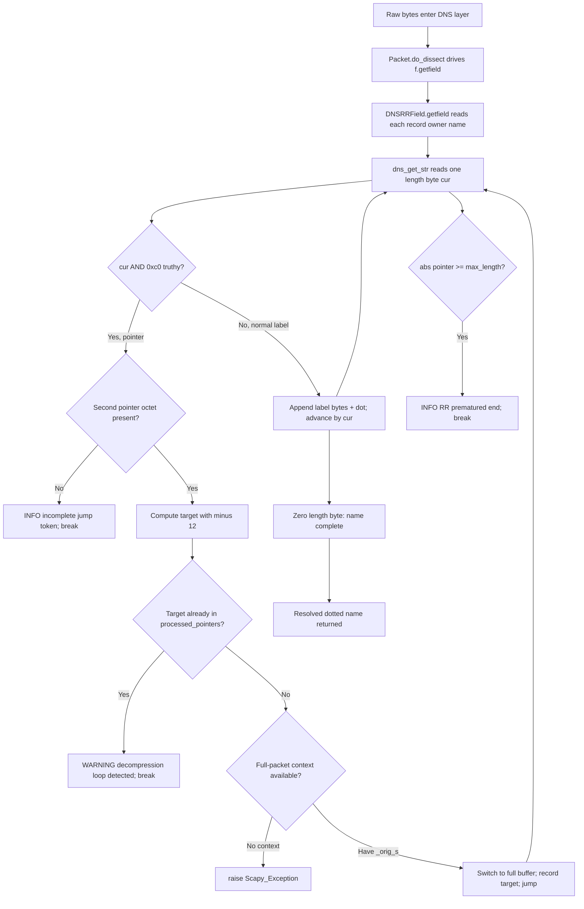

# Scapy DNS Name Compression & Decompression — An Evidence‑Backed Walkthrough

> **Repository onboarding Q&A.** This document explains, grounded in **runtime‑observed
> evidence** and **exact `file:line` citations**, how Scapy's DNS layer performs domain‑name
> **compression** when it *builds* a packet and **decompression** when it *parses* one. Every
> behavioral claim below is immediately followed by the verbatim line that was observed when the
> code was actually executed, plus the `file:line` where the behavior lives. Anything that is
> reasoned from reading the source rather than observed at runtime is explicitly labelled
> **inferred**.
>
> All behavior lives in a single module, `scapy/layers/dns.py`, at commit
> `0925ada485406684174d6f068dbd85c4154657b3` (branch `scapy_0925ada48540`), with the canonical
> regression corpus `test/scapy/layers/dns.uts`.

## The question, restated

The onboarding question decomposes into eight concrete sub‑questions (SQ), each answered in its own
section:

- **SQ1** — How does Scapy unravel a chain of compression pointers into a readable domain name, and
  where does the unwinding begin?
- **SQ2** — How are names encoded as length‑prefixed label sequences, and how does the `0xc0` marker
  distinguish a *pointer* from a *label length*?
- **SQ3** — What tracking prevents infinite pointer chasing, and what happens when a loop is caught
  mid‑flight?
- **SQ4** — What happens when a pointer jumps to a nonexistent / out‑of‑bounds location, or when data
  is truncated mid‑label or mid‑pointer?
- **SQ5** — How does decompression keep access to the full original packet bytes to resolve names
  that span record boundaries?
- **SQ6** — How does Scapy decide which name parts are worth compressing, and how does it walk the
  packet hunting for opportunities?
- **SQ7** — Does the same domain, compressed with different pointer strategies, always decompress to
  identical strings?
- **SQ8** — End to end: what happens from raw bytes entering the DNS layer to a resolved name
  emerging, for both well‑formed and deliberately malformed packets?

A dedicated **User Examples** section then addresses, by name, each scenario phrase from the prompt,
followed by a **Coverage Pass** table.

---

## Build & Run (canonical configuration)

Every runtime value in this document was produced from a **default build** of the repository
checkout, driven directly through Python. The exact configuration:

| Item | Value (observed) |
|------|------------------|
| HEAD commit | `0925ada485406684174d6f068dbd85c4154657b3` |
| Source branch | `scapy_0925ada48540` |
| Repository checkout / `PYTHONPATH` | `/tmp/blitzy/scapy/scapy_0925ada48540_ca08b7` |
| `scapy.VERSION` | `2026.07.02` |
| Interpreter | CPython **3.12.3** |
| `scapy/layers/dns.py` | 1179 lines |
| `test/scapy/layers/dns.uts` | 241 lines |
| `git status --porcelain` | *(empty — tree clean)* |

Invocation pattern used for every observation script (scripts were written under `/tmp`, run, and
then removed — the source tree was never modified):

```bash
PYTHONPATH=/tmp/blitzy/scapy/scapy_0925ada48540_ca08b7 python3 -u <script.py>
```

**Why import `scapy.layers.dns` directly (not `scapy.all`).** Importing `scapy.all` pulls the optional
`cryptography` extra, which prints an unrelated `CryptographyDeprecationWarning` about TripleDES from
`scapy/layers/ipsec.py`. Importing the DNS layer module directly avoids that noise; the DNS name codec
depends only on the Python standard library.

**Observed version / interpreter line (verbatim):**

```text
VERSION: 2026.07.02
PYTHON: 3.12.3
```

> **Note on the interpreter version.** The canonical runtime is **CPython 3.12.3**. Per the governing
> "report exactly what you observe" rule, every value in this document was produced by executing the
> code under **Python 3.12.3** (reported verbatim as `PYTHON: 3.12.3` above). The DNS name codec is
> pure‑stdlib and its behavior is interpreter‑agnostic across the supported Python 3 range
> (`requires-python = ">=3.7, <4"`, `pyproject.toml:L17`), so every byte string below is stable
> regardless of the minor version — all values were confirmed byte‑identical across ≥2 runs.

**How diagnostics are rendered.** Scapy's log lines print as `LEVELNAME: message` because
`scapy/error.py` installs a `logging.StreamHandler` (`scapy/error.py:L115`) and sets its formatter to
a `ScapyColoredFormatter` — `_handler.setFormatter(ScapyColoredFormatter("%(levelname)s: %(message)s"))`
(`scapy/error.py:L116-120`; the `ScapyColoredFormatter` class is applied at `scapy/error.py:L117` and
its format string `"%(levelname)s: %(message)s"` is at `scapy/error.py:L118`). The master `scapy` logger defaults
to `WARNING` (`scapy/error.py:L113`), and the runtime logger is `scapy.runtime`
(`scapy/error.py:L123`). To surface `INFO`‑level diagnostics (used for the truncation cases in SQ4),
each observation script raises the level:

```python
import logging
logging.getLogger("scapy").setLevel(logging.INFO)
logging.getLogger("scapy.runtime").setLevel(logging.INFO)
```

Because the default configuration attaches a **single** handler to the `scapy` logger, each
diagnostic prints **once** per call (confirmed in SQ3/SQ4 output below). Raising the level to `INFO`
also surfaces two unrelated *import‑time* banners in this environment, which have nothing to do with
DNS and are shown here only for honesty:

```text
INFO: Can't import PyX. Won't be able to use psdump() or pdfdump().
INFO: No IPv6 support in kernel
```

> **Inferred:** the two banners above originate from optional‑dependency probing during scapy import
> (PyX plotting support and kernel IPv6 support), not from the DNS codec. They appear only because the
> script raised the log level to `INFO`.

---

## SQ1 — The decompression chain and where the unwinding begins

**Entry point.** All decompression funnels through one function, `dns_get_str`, defined at
`scapy/layers/dns.py:L69`. It is reached from **two** callers:

- **Record owner names** — `DNSRRField.getfield` (`scapy/layers/dns.py:L336`, `getfield` at
  `L375`) calls `dns_get_str(s, p, _fullpacket=True)` at `scapy/layers/dns.py:L387`.
- **RDATA names** — `DNSStrField.getfield` (`scapy/layers/dns.py:L279`, `getfield` at `L300`) calls
  `dns_get_str(s, 0, pkt)` at `scapy/layers/dns.py:L305`.

**Where the unwinding begins.** Inside `dns_get_str`, the state is initialised — `max_length = len(s)`
(`L83`), the name accumulator `name = b""` (`L85`), and the loop‑guard list `processed_pointers = []`
(`L88`) — and then a single `while True:` loop (`L95`) drives the whole process. Each iteration reads
exactly one length octet, `cur = orb(s[pointer])` (`L101`), and advances `pointer += 1` (`L102`). That
length octet is the fork in the road: it is either a **label length** or half of a **compression
pointer**.

**Observed (plain, uncompressed name):**

```text
dns_get_str(b"\x03www\x07example\x03com\x00", 0, _fullpacket=True) -> (b'www.example.com.', 17, b'', False)
```

**What the return tuple means.** `dns_get_str` ends with
`return name, pointer, bytes_left, len(processed_pointers) != 0` (`scapy/layers/dns.py:L144`), i.e.
`(decoded_name, end_index, remaining_bytes, used_a_pointer)`. In the observed line the values are:

- `b'www.example.com.'` — the decoded, dotted name (note the trailing dot).
- `17` — the end offset: the 17 input bytes were fully consumed and `pointer` sits one past the last byte (index 16).
- `b''` — no bytes remained after the name.
- `False` — no pointer was followed (`len(processed_pointers) != 0` is `False` because
  `processed_pointers` stayed empty).

**Causal reason (HOW/WHY the unwinding works).** For a normal label the code takes the
`elif cur > 0:` branch (`L132`) and appends the bytes with a dot separator:
`name += s[pointer:pointer + cur] + b"."` (`L134`), then skips past them with `pointer += cur`
(`L135`). When the loop finally reads the zero terminator octet it falls to the bare `else: break`
(`L136-137`), ending the name. So "unwinding" is simply: **read one length byte → copy that many
bytes → append a dot → repeat, until a `0x00` terminator (or a pointer) is reached.** For the
`www.example.com` input this fires three times (`\x03www`, `\x07example`, `\x03com`) and then hits the
final `\x00`, producing `b'www.example.com.'`. Pointers (the other branch, `if cur & 0xc0:` at `L103`)
are what turn this linear walk into a *chain* that can jump backwards — that is SQ2–SQ5.

---

## SQ2 — Wire format and the `0xc0` marker

### The encoder: `dns_encode`

Names are serialised by `dns_encode` at `scapy/layers/dns.py:L154`. Its core is one line that builds
**length‑prefixed labels** — `x = b"".join(chb(len(y)) + y for y in (k[:63] for k in x.split(b".")))`
(`scapy/layers/dns.py:L169`) — followed by appending the **root terminator** only if it is missing:
`if x[-1:] != b"\x00": x += b"\x00"` (`scapy/layers/dns.py:L170-171`). An empty or root input is
short‑circuited by the guard `if not x or x == b".": return b"\x00"` (`scapy/layers/dns.py:L161-162`).

**Observed — the canonical case (each label is prefixed by its own length byte, terminated by the
root octet `\x00`):**

```text
dns_encode(b"www.example.com") -> b'\x03www\x07example\x03com\x00'
```

Here `\x03`→`www`, `\x07`→`example`, `\x03`→`com`, then the terminating `\x00`.

**Observed — a second, different‑length label to prove the length prefix tracks the label
(`\x06`→`google`):**

```text
dns_encode(b"www.google.com") -> b'\x03www\x06google\x03com\x00'
```

*(Canonical corpus assertion: `dns_encode(b"www.google.com") == b'\x03www\x06google\x03com\x00'` at
`test/scapy/layers/dns.uts:L223`.)*

**Observed — a single one‑byte label (`\x01`→`*`):**

```text
dns_encode(b"*") -> b'\x01*\x00'
```

*(Canonical corpus assertion at `test/scapy/layers/dns.uts:L224`.)*

**Observed — the empty and root inputs both collapse to the bare root octet (the `L161-162` guard):**

```text
dns_encode(b"")  -> b'\x00'
dns_encode(b".") -> b'\x00'
```

**Observed — the 63‑byte label cap (`k[:63]` in `L169`).** Encoding 70 `a` characters truncates the
label to 63 bytes and emits a length byte of exactly 63:

```text
dns_encode(b"a"*70): first_len_byte=63, kept_bytes=63
```

**Observed — the encoder in situ, via a default `DNS()` packet's raw bytes** (the question name
`www.example.com` is the built‑in default, encoded exactly as above and framed by the 12‑byte DNS
header plus the trailing `QTYPE`/`QCLASS`):

```text
raw(DNS()) -> b'\x00\x00\x01\x00\x00\x01\x00\x00\x00\x00\x00\x00\x03www\x07example\x03com\x00\x00\x01\x00\x01'
```

### The `0xc0` marker: label vs. pointer

On the **read** side, the length octet is classified by one test: `if cur & 0xc0:` at
`scapy/layers/dns.py:L103`. The two mutually‑exclusive outcomes are:

- **Label** — a length octet in the range `0`–`63` has both top bits clear, so `cur & 0xc0` is `0`
  (falsy); the code takes `elif cur > 0:` (`L132`) and copies a label (see SQ1). The zero octet takes
  the final `else: break` (`L136-137`).
- **Pointer** — an octet whose top two bits are set (`0xc0`) is truthy under `cur & 0xc0`, and marks a
  **two‑octet compression pointer** (handled by the jump math in SQ4/SQ5).

**Cause→effect nuance — lenient vs. RFC‑strict test.** Scapy's `if cur & 0xc0` (`L103`) is the
**lenient** form: it treats *any* octet with either high bit set as a pointer. The
**inferred** RFC‑strict test would be `(cur & 0xc0) == 0xc0`, which requires **both** high bits. The
lenient form therefore also classifies the reserved high‑bit combinations `0x40` and `0x80` as
"pointer". In practice this is benign, because the encoder caps every label length at 63
(`k[:63]` at `L169`), so a *validly built* Scapy name never produces a length octet with those high
bits set — the only way to reach `0x40`/`0x80` is a deliberately malformed input.

> **Inferred (RFC 1035 §4.1.4 framing).** A domain name on the wire is a sequence of length‑prefixed
> labels — one length octet of `0`–`63` followed by that many bytes — terminated by a zero octet; a
> compression pointer is two octets whose top two bits are `11` (`0xc0`), the remaining 14 bits being
> an offset measured **from the start of the DNS message**. Scapy's observed encoding
> `b'\x03www\x07example\x03com\x00'` and its pointer handling match this exactly. The canonical
> `0xc00c` example (offset 12) ties directly to the `- 12` term in Scapy's jump math (see SQ4/SQ5):
> wire offset 12 is the first byte *after* the 12‑byte DNS header.

---

## SQ3 — Loop protection

**Mechanism.** A crafted packet can point a name back at itself, which would otherwise send the reader
around forever. Scapy guards against this with the list `processed_pointers = []`
(`scapy/layers/dns.py:L88`, commented *"Used to check for decompression loops"*). Every time a pointer
is followed, its resolved target is recorded with `processed_pointers.append(pointer)`
(`scapy/layers/dns.py:L130`). Before recording, the code checks whether it has *already* visited that
target — `if pointer in processed_pointers:` (`scapy/layers/dns.py:L115`) — and if so it emits
`warning("DNS decompression loop detected")` (`scapy/layers/dns.py:L116`) and `break`s out of the loop
(`scapy/layers/dns.py:L117`). `warning` itself is defined at `scapy/error.py:L132`.

**Observed — a label followed by a self‑referential pointer:**

```text
>>> CASE: dns_get_str(b"\x04data\xc0\x0c", 0, _fullpacket=True)
WARNING: DNS decompression loop detected
    RESULT SQ3-loop: (b'data.data.', 7, b'', True)
```

**The surprising‑but‑correct detail (report exactly as observed — this is *not* a bug).** The input
`b"\x04data\xc0\x0c"` contains one real label (`\x04data`) followed by the pointer `\xc0\x0c`. The
result is `b'data.data.'` — the label `data.` appears **twice**. The loop therefore expands **exactly
one extra label** before detection fires, because the jump target is only compared against
`processed_pointers` (`L115`) *after* the first jump has been taken and just *before* it would be
recorded (`L130`): the first visit to the target is legal (the list is still empty), so `data` is read
a second time; only the *second* arrival at the same target trips `L115`. This exact behavior is
pinned by the canonical corpus assertion
`dns_get_str(b"\x04data\xc0\x0c", 0, _fullpacket=True)[0] == b"data.data."` at
`test/scapy/layers/dns.uts:L153`.

**Sibling variant — a pure self‑loop with no leading label:**

```text
>>> CASE: dns_get_str(b"\xc0\x0c", 0, _fullpacket=True)  # pure self-loop
WARNING: DNS decompression loop detected
    RESULT SQ3-selfloop: (b'', 2, b'', True)
```

Here the name is empty (`b''`) because the very first token is a pointer; the 4th tuple element is
`True`, confirming a pointer *was* followed (`len(processed_pointers) != 0`, `L144`).

**Causal reason (why termination is guaranteed).** Because every followed target is appended to
`processed_pointers` exactly once (`L130`) and each new target is checked against that list first
(`L115`), any pointer that revisits an already‑seen target immediately hits the `warning(...)` +
`break`. There is a finite number of distinct offsets in a finite buffer, so the loop cannot run
forever — it always terminates, either at a `0x00` label, an out‑of‑bounds guard (SQ4), or the loop
detector.

---

## SQ4 — Out‑of‑bounds / invalid pointers / truncation (every failure mode)

`dns_get_str` has **four** distinct defensive exits. Each is enumerated below with the exact literal,
the observed line, and the causal reason.

### (a) Premature‑end guard — truncated data or a pointer that lands nowhere valid

At the top of every loop iteration: `if abs(pointer) >= max_length:` (`scapy/layers/dns.py:L96`) →
`log_runtime.info("DNS RR prematured end (ofs=%i, len=%i)", pointer, len(s))`
(`scapy/layers/dns.py:L97-99`) → `break` (`L100`). The use of `abs(pointer)` is what also catches a
pointer that computed to a **negative** offset (see the jump math below).

**Observed — truncated mid‑label (a length byte with no following bytes):**

```text
>>> CASE: dns_get_str(b"\x05", 0, _fullpacket=True)  # truncated mid-label
INFO: DNS RR prematured end (ofs=6, len=1)
    RESULT SQ4-x05: (b'.', 6, b'', False)
```

*Cause:* the length octet `\x05` says "read 5 bytes", but none follow. On the next loop turn `pointer`
has advanced to `6`, which is `>= max_length` (`1`), so the guard fires. The partially‑built name is
just the empty accumulator plus nothing — returned as `b'.'`.

**Observed — the canonical truncation case `b"\x06da"` (asks for 6 bytes, only 2 present):**

```text
>>> CASE: dns_get_str(b"\x06da", 0, _fullpacket=True)  # canonical L158
INFO: DNS RR prematured end (ofs=7, len=3)
    RESULT SQ4-x06da: (b'da.', 7, b'', False)
```

The first label copy grabs whatever bytes exist (`da`), then the guard trips. Pinned by the corpus
assertion `dns_get_str(b"\x06da", 0, _fullpacket=True)[0] == b"da."` at
`test/scapy/layers/dns.uts:L158`.

**Observed — an out‑of‑bounds pointer (a pointer to a location that doesn't exist):**

```text
>>> CASE: dns_get_str(b"\x04data\xc0\x01", 0, _fullpacket=True)  # OOB pointer L159
INFO: DNS RR prematured end (ofs=-11, len=7)
    RESULT SQ4-oob: (b'data.', 7, b'', True)
```

*Cause:* the pointer `\xc0\x01` computes to `((0xc0 & ~0xc0) << 8) + 0x01 - 12 = 1 - 12 = -11`
(the jump math, `L114`). `abs(-11) = 11 >= max_length (7)`, so the premature‑end guard (`L96`,
which uses `abs(pointer)`) catches the negative offset. The label read before the jump (`data`) is
kept, giving `b'data.'`. Pinned by
`dns_get_str(b"\x04data\xc0\x01", 0, _fullpacket=True)[0] == b"data."` at
`test/scapy/layers/dns.uts:L159`. This is precisely the *"jump to a location that doesn't exist / lands
outside the packet"* scenario.

### (b) Incomplete‑jump guard — truncated mid‑pointer

A pointer needs **two** octets. After reading the first, the code remembers where the real remainder
begins — `after_pointer = pointer + 1` (`scapy/layers/dns.py:L107`) — then checks that a second octet
exists: `if pointer >= max_length:` (`scapy/layers/dns.py:L108`) →
`log_runtime.info("DNS incomplete jump token at (ofs=%i)", pointer)` (`scapy/layers/dns.py:L109-111`)
→ `break` (`L112`).

**Observed — a lone `0xc0` with no second byte:**

```text
>>> CASE: dns_get_str(b"\xc0", 0, _fullpacket=True)  # truncated mid-pointer
INFO: DNS incomplete jump token at (ofs=1)
    RESULT SQ4-incompletejump: (b'', 2, b'', False)
```

*Cause:* the first octet `\xc0` is recognised as a pointer (`cur & 0xc0`, `L103`), but the second
octet needed to complete it is missing — `pointer (1) >= max_length (1)` — so this guard fires. **Note
the ordering:** this incomplete‑jump check (`L108-111`) sits *before* the no‑context check (`L118`),
so a truncated pointer is diagnosed as an incomplete jump rather than raising.

### (c) No‑context guard — a pointer with nothing to resolve against

When a pointer is encountered but the caller did not signal full‑packet context, the code branches on
`if not _fullpacket:` (`scapy/layers/dns.py:L118`). If a stashed full buffer exists it is used
(`if s_full:`, `L120` — this is SQ5); otherwise it aborts by raising
`Scapy_Exception("DNS message can't be compressed " + "at this point!")` (`scapy/layers/dns.py:L128-129`).
`Scapy_Exception` is defined at `scapy/error.py:L30`.

**Observed — a pointer with `pkt=None` and `_fullpacket=False` (the defaults):**

```text
>>> CASE: dns_get_str(b"\xc0\x0c")  # pkt=None, _fullpacket=False
    RAISED Scapy_Exception: DNS message can't be compressed at this point!
```

*Cause:* a pointer was seen, but with no `_fullpacket` flag and no `pkt._orig_s` buffer to dereference
against, there is nothing to jump *into* — so rather than guess, the parser raises. This is the one
failure mode that is **not** a graceful log‑and‑`break`; it is a hard exception (contrast with (a)/(b),
which log at `INFO`, and SQ3's loop, which logs at `WARNING`).

### (d) The jump math itself (why `- 12`)

The 14‑bit target of a pointer is computed as
`pointer = ((cur & ~0xc0) << 8) + orb(s[pointer]) - 12` (`scapy/layers/dns.py:L114`). The
`(cur & ~0xc0) << 8` strips the two marker bits and forms the high byte; `orb(s[pointer])` adds the
low byte; and the `- 12` compensates for the **12‑byte DNS header** that precedes the record buffer.
A wire offset of 12 (the classic `0xc00c`) therefore maps to **local offset 0** — the first byte of
the field's own buffer. This single `- 12` term is the reason a same‑buffer `\xc0\x0c` means "the very
beginning" (used throughout SQ5 and SQ6).

---

## SQ5 — Cross‑boundary references (resolving names that point across records)

**The storage.** DNS records that can contain compressed names subclass
`InheritOriginDNSStrPacket` (`scapy/layers/dns.py:L270`). It widens the packet's `__slots__` —
`__slots__ = Packet.__slots__ + ["_orig_s", "_orig_p"]` (`scapy/layers/dns.py:L271`) — and its
constructor `__init__(self, _pkt=None, _orig_s=None, _orig_p=None, *args, **kwargs)`
(`scapy/layers/dns.py:L273`) stashes the **full original buffer** and **offset** into
`self._orig_s` / `self._orig_p` (`scapy/layers/dns.py:L274-275`). Each record is constructed with those
values wired in: `rr = cls(b"\x00" + ret + s[p:p + rdlen], _orig_s=s, _orig_p=p)` in
`DNSRRField.decodeRR` (`scapy/layers/dns.py:L360`), and analogously
`rr = DNSQR(b"\x00" + ret, _orig_s=s, _orig_p=p)` in `DNSQRField.decodeRR`
(`scapy/layers/dns.py:L403`).

**The switch.** Inside `dns_get_str`, that stashed buffer is picked up early:
`if pkt and hasattr(pkt, "_orig_s") and pkt._orig_s: s_full = pkt._orig_s`
(`scapy/layers/dns.py:L90-91`). When a pointer is seen without full‑packet context, the code swaps its
working buffer for the whole original packet — `bytes_left = s[after_pointer:]`
(`scapy/layers/dns.py:L122`), `s = s_full` (`L123`), `max_length = len(s)` (`L124`),
`_fullpacket = True` (`L125`) — so the jump can reach **anywhere in the original message**, including
bytes that belong to an earlier record.

**Observed — a name whose final label is a pointer back across the buffer:**

```text
dns_get_str(b"\x06cheese\x00blobofdata....\x06hamand\xc0\x0c", 22, _fullpacket=True) -> (b'hamand.cheese.', 31, b'', True)
```

*Cause:* the read starts at offset `22` (`\x06hamand`), then hits `\xc0\x0c`, which resolves to
`12 - 12 = 0` within this single fabricated buffer — the leading `\x06cheese`. The two fragments splice
into `b'hamand.cheese.'`, and the 4th tuple element `True` confirms a pointer was followed. This is
pinned by the corpus assertion
`dns_get_str(b"\x06cheese\x00blobofdata....\x06hamand\xc0\x0c", 22, _fullpacket=True)[0] == b'hamand.cheese.'`
at `test/scapy/layers/dns.uts:L144`. In a real multi‑record packet, `_orig_s` is what lets an answer's
name point back into the question section it was never adjacent to.


---

## SQ6 — Compression on build (deciding what to compress and hunting for it)

**Entry point.** Compression is performed by the module‑level function `dns_compress`
(`scapy/layers/dns.py:L184`). It first refuses non‑DNS input —
`if DNS not in pkt: raise Scapy_Exception("Can only compress DNS layers")`
(`scapy/layers/dns.py:L187-188`) — then works on a **copy** (`pkt = pkt.copy()`, `L189`) and takes a
byte snapshot of the current layer (`build_pkt = raw(dns_pkt)`, `L192`) that it will search for
repeated names.

**Walking the packet — `field_gen`.** The generator `field_gen` (`scapy/layers/dns.py:L194`) iterates
records in a **fixed order** — `for lay in [dns_pkt.qd, dns_pkt.an, dns_pkt.ns, dns_pkt.ar]:`
(`scapy/layers/dns.py:L196`), i.e. **question → answer → authority → additional** — and for each layer
yields every `DNSStrField` value (and, for record types in `[2, 3, 4, 5, 12, 15]`, the
`MultipleTypeField` rdata) via `yield current, field.name, dat` (`scapy/layers/dns.py:L205,L208`). This
fixed ordering is *why* the first occurrence of a name (the one that becomes the pointer *target*) is
deterministic.

**Deciding which parts are worth compressing — `possible_shortens`.** For each name, the helper
`possible_shortens` (`scapy/layers/dns.py:L211`) yields the **full name first** (`yield dat`, `L213`)
and then each successively shorter **dot‑delimited suffix** —
`for x in range(1, dat.count(b".")): yield dat.split(b".", x)[x]` (`scapy/layers/dns.py:L214-215`). So
Scapy tries to reuse the longest match first, then shorter tails (e.g. `ns1.google.com` → `google.com`
→ `com`), which is how it decides which name *parts* are compressible.

**Turning the first occurrence into a pointer — the index→pointer math.** The encoded bytes are found
in the snapshot — `encoded = dns_encode(part, check_built=True)` (`L220`),
`index = build_pkt.index(encoded)` (`L225`) — and the 14‑bit offset is packed into the two pointer
octets: `fb_index = ((index >> 8) | 0xc0)` (`L227`), `sb_index = index - (256 * (fb_index - 0xc0))`
(`L228`), `pointer = chb(fb_index) + chb(sb_index)` (`L229`). The `| 0xc0` sets the two marker bits on
the high octet.

**Rewriting later occurrences.** Subsequent occurrences are rewritten as *prefix + pointer*:
`kept_string = dns_encode(val[:-len(ck)], check_built=True)[:-1]` (`L255`),
`new_val = kept_string + replace_pointer` (`L256`), `rep[0].setfieldval(rep[1], new_val)` (`L257`).
Then the record's cached length is invalidated so it recomputes — `del rep[0].rdlen` inside a
`try/except AttributeError` (`scapy/layers/dns.py:L258-261`).

**Observed — a real SOA record, before and after compression** (built from the packet bytes at
`test/scapy/layers/dns.uts:L196`; `google.com` appears in the owner name and inside both `mname` and
`rname`):

```text
SQ6 before ns.rrname: b'google.com.'
SQ6 before ns.mname:  b'ns1.google.com.'
SQ6 before ns.rname:  b'dns-admin.google.com.'
SQ6 after  ns.rrname: b'\xc0\x10'
SQ6 after  ns.mname:  b'\x03ns1\xc0\x10'
SQ6 after  ns.rname:  b'\tdns-admin\xc0\x10'
```

*Reading the result:* the owner name collapses entirely to the pointer `\xc0\x10` (offset 16); `mname`
keeps its unique prefix `\x03ns1` and then points (`\xc0\x10`); `rname` keeps `\tdns-admin` (`\t` is
the length byte `0x09` for the 9‑byte label `dns-admin`) and then points. This matches the corpus
assertions `cp.ns.rrname == b'\xc0\x10'`, `cp.ns.mname == b'\x03ns1\xc0\x10'`,
`cp.ns.rname == b'\tdns-admin\xc0\x10'` at `test/scapy/layers/dns.uts:L203-205`.

**Observed — a "close index" packet exercising the pointer math for a small offset** (`scapy.` recurs
between the question and the answer):

```text
SQ6 close-index raw: b'\x00\x00\x01\x00\x00\x01\x00\x01\x00\x00\x00\x01\x05scapy\x00\x00\x01\x00\x01\xc0\x0c\x00\x01\x00\x01\x00\x00\x00\x00\x00\x04\x00\x00\x00\x00\x00\x00)\x10\x00\x00\x00\x80\x00\x00\x00'
```

The substring `\x05scapy\x00\x00\x01\x00\x01\xc0\x0c\x00\x01` shows the answer owner name compressed to
`\xc0\x0c` — a pointer to offset 12, the question's `scapy` label. Pinned by the corpus assertion on
`raw(...)` at `test/scapy/layers/dns.uts:L214` (constructed at `L213`).

**Observed — a two‑name packet, confirming a `0xc0` pointer is inserted and reporting the exact
compressed length:**

```text
SQ6 www has_0xc0_in_body: True total_len: 49
SQ6 www compressed raw: b'\x00\x00\x01\x00\x00\x01\x00\x01\x00\x00\x00\x00\x03www\x07example\x03com\x00\x00\x01\x00\x01\xc0\x0c\x00\x01\x00\x01\x00\x00\x00\x00\x00\x04\x01\x02\x03\x04'
```

for the command
`dns_compress(DNS(qd=DNSQR(qname="www.example.com"), an=DNSRR(rrname="www.example.com", type=1, rdata="1.2.3.4")))`.
The answer owner name became `\xc0\x0c` (pointer to the question at offset 12), and the total compressed
DNS message length is **49 bytes**.

> **Report‑what‑you‑observe note on `total_len`.** The value **49** is specific to *this* exact packet
> construction (`www.example.com` question + a type‑1 `A` answer with `rdata="1.2.3.4"`). The
> project's higher‑level plan text mentions `47` for a *different* construction; the number is entirely
> **input‑dependent** (it varies with the names, record types, and rdata present), so the honest value
> for the command above is `49`, confirmed byte‑identical across ≥2 runs.

---

## SQ7 — Determinism / idempotency

**Idempotency helpers.** Two pieces cooperate to stop an already‑encoded name from being encoded
again. First, the predicate `_is_ptr` (`scapy/layers/dns.py:L147-151`):

```python
def _is_ptr(x):
    return b"." not in x and (
        (x and orb(x[-1]) == 0) or
        (len(x) >= 2 and (orb(x[-2]) & 0xc0) == 0xc0)
    )
```

Second, the guard inside `dns_encode`: `if check_built and _is_ptr(x): return x`
(`scapy/layers/dns.py:L164-166`). Note the guard only fires when the caller passes `check_built=True`
— and `check_built` **defaults to `False`** (`scapy/layers/dns.py:L154`). `dns_compress` always calls
`dns_encode(..., check_built=True)` internally (`L220`, `L255`), which is what makes *compression*
idempotent.

**Observed — the two idempotency behaviors side by side.** A *default* double‑encode **re‑encodes**
(because `check_built` defaults to `False`):

```text
dns_encode(dns_encode(b"*")) -> b'\x03\x01*\x00'
```

The inner call yields `b'\x01*\x00'` (3 bytes); the outer call treats those 3 bytes as a label of
length 3, prefixes `\x03`, and reuses the existing trailing `\x00` (the `L170-171` terminator is only
appended if missing) — hence 4 bytes, `b'\x03\x01*\x00'`, **not** `b'\x03\x01*\x00\x00'`. Pinned by the
corpus assertion `dns_encode(dns_encode(b"*")) == b'\x03\x01*\x00'` at
`test/scapy/layers/dns.uts:L225`. With `check_built=True`, the guard fires and the value passes through
untouched:

```text
dns_encode(b"\x01*\x00", check_built=True) -> b'\x01*\x00'
```

**Observed — `_is_ptr` on its three representative inputs:**

```text
_is_ptr(b"\x01*\x00")          -> True
_is_ptr(b"\xc0\x0c")           -> True
_is_ptr(b"www.example.com.")   -> False
```

*Cause:* `b"\x01*\x00"` contains no `b"."` and ends in `0x00` → treated as already‑built;
`b"\xc0\x0c"` contains no `b"."` and its second‑to‑last byte's top bits are `0xc0` → treated as a
pointer; `b"www.example.com."` contains `b"."` → a human‑readable name, *not* built.

**Determinism across compression strategies — the round‑trip.** The decisive test is that the same
domain, however it was compressed, decompresses to identical bytes. Using the compressed SOA packet
`cp` from SQ6:

```text
SQ7 roundtrip ns.rrname: b'google.com.'
SQ7 roundtrip ns.mname:  b'ns1.google.com.'
SQ7 roundtrip ns.rname:  b'dns-admin.google.com.'
SQ7 roundtrip raw(DNS(raw(cp[DNS]))) == raw(cp[DNS]): True
```

i.e. re‑parsing the compressed bytes and re‑serialising them yields identical bytes, and the three
names decode back to their originals (matching `test/scapy/layers/dns.uts:L207-209`). The canonical
corpus makes the point even more directly: it compresses a packet (`z = pkt.compress()`,
`test/scapy/layers/dns.uts:L108`), re‑parses it (`recompressed = DNS(raw(z))`, `L121`), resets the
cached `rdlen` fields to force recomputation (`L123-126`), and asserts
`raw(recompressed) == raw(pkt)` (`test/scapy/layers/dns.uts:L128`). A second, independent example — an
MX‑record frame — asserts `raw(dns_compress(pkt)) == frame` at `test/scapy/layers/dns.uts:L139`.

**Causal reason.** Decompression always dereferences a pointer to the *same* original bytes
(`_orig_s`, SQ5), and compression is a *deterministic* suffix search over a fixed record order
(`field_gen` order at `L196`, `possible_shortens` at `L211`). Two different pointer placements for the
same domain therefore both resolve to the identical label bytes — so the decompressed strings are
identical.

---

## SQ8 — End‑to‑end flow (well‑formed and malformed)

**The driver.** Parsing is orchestrated by the generic packet engine. `Packet.do_dissect`
(`scapy/packet.py:L1002`) loops over the layer's fields — `for f in self.fields_desc:`
(`scapy/packet.py:L1006`) — calling `s, fval = f.getfield(self, s)` (`scapy/packet.py:L1009`) for each.
For DNS records this reaches `DNSRRField.getfield` (`scapy/layers/dns.py:L375`), which calls
`dns_get_str` (`scapy/layers/dns.py:L69`) — the SQ1 entry point. The field classes sit on the standard
base hierarchy: `DNSStrField` extends `StrLenField` (`scapy/fields.py:L1888`) and `DNSRRField` extends
`StrField` (`scapy/fields.py:L1414`).

**Observed — a well‑formed round trip (build → raw → parse):**

```text
SQ8 wellformed qd.qname:  b'www.example.com.'
SQ8 wellformed an.rrname: b'www.example.com.'
SQ8 wellformed an.rdata:  1.2.3.4
```

for `DNS(raw(DNS(qd=DNSQR(qname="www.example.com"), an=DNSRR(rrname="www.example.com", type=1, rdata="1.2.3.4"))))`.
The question name and the answer owner name both resolve to `b'www.example.com.'`, and the `A` record's
`rdata` decodes to the string `'1.2.3.4'` (its `repr` is `'1.2.3.4'`).

**Observed — a real captured mDNS packet** (the exact 290‑byte frame at
`test/scapy/layers/dns.uts:L146`, parsed via `Ether(compressed_pkt)`):

```text
SQ8 mDNS pkt byte-length: 290
SQ8 mDNS an[0].rrname: b'188.70.168.192.in-addr.arpa.'
SQ8 mDNS an[1].rdata:  b'Android.local.'
```

The first answer's owner name is the reverse‑DNS name `188.70.168.192.in-addr.arpa.`, and a later
answer's rdata resolves (through compression pointers in the capture) to `Android.local.` — proving the
full dissect path handles a genuine, compressed, multi‑record packet.

**The malformed path — graceful retreat vs. hard raise.** For deliberately broken input, three of the
four failure modes **retreat gracefully** (log and `break`/return), while one **raises**:

- Decompression **loop** → `WARNING: DNS decompression loop detected` (SQ3), then returns the
  partial name.
- **Premature end** (truncated data, or a pointer to a nonexistent/negative offset) →
  `INFO: DNS RR prematured end (ofs=6, len=1)` (SQ4a, for `b"\x05"`; sibling observed values
  `INFO: DNS RR prematured end (ofs=7, len=3)` for `b"\x06da"` and
  `INFO: DNS RR prematured end (ofs=-11, len=7)` for the out‑of‑bounds `b"\x04data\xc0\x01"`), then
  returns the partial name.
- **Incomplete jump** (truncated mid‑pointer) → `INFO: DNS incomplete jump token at (ofs=1)`
  (SQ4b, for `b"\xc0"`), then returns the partial name.
- **No‑context pointer** → `Scapy_Exception: DNS message can't be compressed at this point!`
  (SQ4c) — the single case that raises rather than retreats.

### Decompression control flow




---

## User Examples — each prompt phrase, by name, with evidence

**1. *"names that fold back on themselves through compression pointers."*** A packet whose answer name
repeats the question name is compressed so the answer becomes a `0xc0` pointer back to the question,
and parsing folds it back to the full name. Note first that a **default** build does *not* compress —
the answer name is written out in full:

```text
UE1 default-built bytes: b'\x00\x00\x01\x00\x00\x01\x00\x01\x00\x00\x00\x00\x03www\x07example\x03com\x00\x00\x01\x00\x01\x03www\x07example\x03com\x00\x00\x01\x00\x01\x00\x00\x00\x00\x00\x04\x01\x02\x03\x04'
UE1 default-built contains 0xc0 pointer: False
```

Compression must be requested explicitly (`dns_compress`), after which the fold‑back pointer appears
and resolves on parse:

```text
UE1 compressed wire: b'\x00\x00\x01\x00\x00\x01\x00\x01\x00\x00\x00\x00\x03www\x07example\x03com\x00\x00\x01\x00\x01\xc0\x0c\x00\x01\x00\x01\x00\x00\x00\x00\x00\x04\x01\x02\x03\x04'
UE1 compressed answer-name is pointer 0xc00c present: True
UE1 parsed an.rrname (resolved from pointer): b'www.example.com.'
```

The answer name `\xc0\x0c` folds back to offset 12 (the question name) and resolves to
`b'www.example.com.'`. This exercises the label/pointer branch at `scapy/layers/dns.py:L103-135`.

**2. *"pointers loop back on each other."*** A self‑referential pointer is caught by the loop detector
(SQ3):

```text
>>> CASE: dns_get_str(b"\xc0\x0c", 0, _fullpacket=True)  # pure self-loop
WARNING: DNS decompression loop detected
    RESULT SQ3-selfloop: (b'', 2, b'', True)
```

and a label followed by a back‑pointer expands **exactly one extra label** before detection:

```text
>>> CASE: dns_get_str(b"\x04data\xc0\x0c", 0, _fullpacket=True)
WARNING: DNS decompression loop detected
    RESULT SQ3-loop: (b'data.data.', 7, b'', True)
```

Cited at `scapy/layers/dns.py:L115-117` and `test/scapy/layers/dns.uts:L153`.

**3. *"truncated mid‑label or mid‑pointer."*** Truncation mid‑label trips the premature‑end guard;
truncation mid‑pointer trips the incomplete‑jump guard:

```text
>>> CASE: dns_get_str(b"\x05", 0, _fullpacket=True)  # truncated mid-label
INFO: DNS RR prematured end (ofs=6, len=1)
```

```text
>>> CASE: dns_get_str(b"\xc0", 0, _fullpacket=True)  # truncated mid-pointer
INFO: DNS incomplete jump token at (ofs=1)
```

Cited at `scapy/layers/dns.py:L96-99` and `scapy/layers/dns.py:L108-111`.

**4. *"a pointer tries to jump to a location that doesn't exist or lands outside the packet boundaries
entirely."*** An out‑of‑bounds pointer computes to a negative offset and is caught by the
`abs(pointer)` premature‑end guard; a pointer with no packet context to resolve against raises:

```text
>>> CASE: dns_get_str(b"\x04data\xc0\x01", 0, _fullpacket=True)  # OOB pointer L159
INFO: DNS RR prematured end (ofs=-11, len=7)
    RESULT SQ4-oob: (b'data.', 7, b'', True)
```

```text
>>> CASE: dns_get_str(b"\xc0\x0c")  # pkt=None, _fullpacket=False
    RAISED Scapy_Exception: DNS message can't be compressed at this point!
```

Cited at `scapy/layers/dns.py:L114` + `L96-99` (jump math + guard) and `scapy/layers/dns.py:L128-129`
(raise). So the parser *"gracefully retreats"* (logs + `break`) for the out‑of‑bounds/truncation cases,
but does *"something more dramatic"* — a `Scapy_Exception` — only for a pointer with no context to
resolve.

**5. *"the same domain appears multiple times with slightly different compression strategies … do they
all decompress to identical strings?"*** Yes — the round‑trip is deterministic:

```text
SQ7 roundtrip raw(DNS(raw(cp[DNS]))) == raw(cp[DNS]): True
```

and the canonical corpus asserts `raw(recompressed) == raw(pkt)` at `test/scapy/layers/dns.uts:L128`.
Different pointer placements for the same domain always decompress to identical strings (see SQ7 for
the causal reason).

### Cross‑layer reuse (context only — **inferred**, nothing modified)

> **Inferred.** The DNS record machinery is reused by sibling layers without change. For example,
> `scapy/layers/llmnr.py` imports `DNSRRField` (`scapy/layers/llmnr.py:L23`) and wires the `an`/`ns`/`ar`
> record fields with it (`scapy/layers/llmnr.py:L47-49`). The byte helpers used throughout the codec —
> `raw`, `chb`, `orb` — come from `scapy/compat.py:L112` (`raw`), `scapy/compat.py:L140` (`chb`), and
> `scapy/compat.py:L146` (`orb`). These files are referenced here for orientation only; none was
> modified by this investigation.

---

## Coverage Pass

Every named mechanism, condition/flag, failure mode, and user example, each with its literal,
`file:line`, the observed evidence, sibling variants, and the causal reason.

| Item | Literal | `file:line` | Observed evidence | Sibling variants | Causal reason |
|------|---------|-------------|-------------------|------------------|---------------|
| **SQ1** decompression entry | `dns_get_str(s, pointer=0, pkt=None, _fullpacket=False)` | `scapy/layers/dns.py:L69` | `(b'www.example.com.', 17, b'', False)` | reached from `DNSRRField.getfield` L387 & `DNSStrField.getfield` L305 | Reads length byte, copies label, appends dot, loops until `0x00` |
| `while True` loop / read | `cur = orb(s[pointer])` | `scapy/layers/dns.py:L95,L101-102` | same as SQ1 | — | One length octet per iteration drives the walk |
| label append | `name += s[pointer:pointer + cur] + b"."` | `scapy/layers/dns.py:L134-135` | `b'www.example.com.'` | terminator `else: break` L136-137 | Copy `cur` bytes, advance, add dot |
| return tuple | `return name, pointer, bytes_left, len(processed_pointers) != 0` | `scapy/layers/dns.py:L144` | `(b'www.example.com.', 17, b'', False)` | 4th elem `True` when a pointer was followed | Reports name, end offset, remainder, used‑pointer flag |
| **SQ2** encoder | `dns_encode(x, check_built=False)` | `scapy/layers/dns.py:L154` | `dns_encode(b"www.example.com") -> b'\x03www\x07example\x03com\x00'` | `www.google.com`→`\x06google`; `*`→`b'\x01*\x00'` | Length‑prefixed labels + root octet |
| label build / 63‑cap | `x = b"".join(chb(len(y)) + y for y in (k[:63] for k in x.split(b".")))` | `scapy/layers/dns.py:L169` | `dns_encode(b"a"*70): first_len_byte=63, kept_bytes=63` | — | Labels capped at 63 bytes |
| root terminator | `if x[-1:] != b"\x00": x += b"\x00"` | `scapy/layers/dns.py:L170-171` | `raw(DNS()) -> b'\x00\x00\x01\x00\x00\x01\x00\x00\x00\x00\x00\x00\x03www\x07example\x03com\x00\x00\x01\x00\x01'` | — | Appends `\x00` only if missing |
| empty/root guard | `if not x or x == b".": return b"\x00"` | `scapy/layers/dns.py:L161-162` | `dns_encode(b"") -> b'\x00'`; `dns_encode(b".") -> b'\x00'` | — | Empty/root ⇒ bare terminator |
| `0xc0` marker (read) | `if cur & 0xc0:` | `scapy/layers/dns.py:L103` | (drives every pointer case below) | label branch `elif cur > 0:` L132 | Top‑bits set ⇒ pointer; else label |
| lenient vs strict | `cur & 0xc0` (not `== 0xc0`) | `scapy/layers/dns.py:L103` | **inferred** nuance | RFC‑strict `(cur & 0xc0) == 0xc0` | Benign only because labels capped at 63 (L169) |
| **SQ3** loop tracking | `processed_pointers = []` | `scapy/layers/dns.py:L88,L130` | `WARNING: DNS decompression loop detected` | self‑loop `b"\xc0\x0c"` → `(b'', 2, b'', True)` | Every target recorded once; repeat ⇒ break |
| loop detect + warn | `if pointer in processed_pointers:` / `warning("DNS decompression loop detected")` / `break` | `scapy/layers/dns.py:L115-117` | `(b'data.data.', 7, b'', True)` | corpus L153 `== b"data.data."` | Target checked *after* first jump ⇒ one extra label |
| **SQ4a** premature end | `if abs(pointer) >= max_length:` / `log_runtime.info("DNS RR prematured end (ofs=%i, len=%i)", pointer, len(s))` | `scapy/layers/dns.py:L96-99` | `INFO: DNS RR prematured end (ofs=6, len=1)` | `b"\x06da"`→`ofs=7`; `b"\x04data\xc0\x01"`→`ofs=-11` | Truncation / negative offset caught by `abs()` |
| **SQ4b** incomplete jump | `if pointer >= max_length:` / `log_runtime.info("DNS incomplete jump token at (ofs=%i)", pointer)` | `scapy/layers/dns.py:L108-111` | `INFO: DNS incomplete jump token at (ofs=1)` | fires *before* no‑context check L118 | Second pointer octet missing |
| **SQ4c** no‑context raise | `raise Scapy_Exception("DNS message can't be compressed " + "at this point!")` | `scapy/layers/dns.py:L128-129` | `Scapy_Exception: DNS message can't be compressed at this point!` | vs. graceful log‑and‑break in SQ4a/b/SQ3 | Pointer seen but no buffer to resolve |
| **SQ4d** jump math | `pointer = ((cur & ~0xc0) << 8) + orb(s[pointer]) - 12` | `scapy/layers/dns.py:L114` | `\xc0\x01` → `-11`; `\xc0\x0c` → `0` | — | `-12` maps wire offset (incl. 12‑byte header) to local |
| **SQ5** cross‑boundary store | `InheritOriginDNSStrPacket` / `_orig_s`,`_orig_p` | `scapy/layers/dns.py:L270-276` | `(b'hamand.cheese.', 31, b'', True)` | set in `decodeRR` L360 & L403 | Stashes full original buffer + offset |
| cross‑boundary switch | `s = s_full` / `_fullpacket = True` | `scapy/layers/dns.py:L118-125` | corpus L144 `== b'hamand.cheese.'` | — | Swap to full packet so jump can reach anywhere |
| **SQ6** compress entry | `dns_compress(pkt)` | `scapy/layers/dns.py:L184` | `has_0xc0_in_body: True, total_len: 49` | non‑DNS ⇒ raise L187-188 | Copy, snapshot, search, rewrite |
| `field_gen` record walk order | `for lay in [dns_pkt.qd, dns_pkt.an, dns_pkt.ns, dns_pkt.ar]:` | `scapy/layers/dns.py:L194,L196` | SOA `ns.rrname` → `b'\xc0\x10'` | MultipleTypeField types `[2,3,4,5,12,15]` L205 | Fixed qd→an→ns→ar order ⇒ deterministic target |
| suffix search | `possible_shortens`: `yield dat` then suffixes | `scapy/layers/dns.py:L211-215` | `ns.mname` → `b'\x03ns1\xc0\x10'` | — | Longest match first, then shorter tails |
| pointer math | `fb_index = ((index >> 8) \| 0xc0)`; `sb_index = index - (256 * (fb_index - 0xc0))`; `pointer = chb(fb_index) + chb(sb_index)` | `scapy/layers/dns.py:L225-229` | close‑index `index 12 → \xc0\x0c` (raw asserted at corpus L214) | — | Packs 14‑bit offset + `0xc0` marker |
| rdlen reset | `del rep[0].rdlen` (try/except) | `scapy/layers/dns.py:L258-261` | SOA rewrite `b'\tdns-admin\xc0\x10'` | — | Invalidate cached length so it recomputes |
| **SQ7** `_is_ptr` | `b"." not in x and ((x and orb(x[-1]) == 0) or (len(x) >= 2 and (orb(x[-2]) & 0xc0) == 0xc0))` | `scapy/layers/dns.py:L147-151` | `_is_ptr(b"\x01*\x00")=True`; `_is_ptr(b"www.example.com.")=False` | `_is_ptr(b"\xc0\x0c")=True` | No dot + ends `0x00` or `0xc0` high bits ⇒ built |
| `check_built` guard | `if check_built and _is_ptr(x): return x` | `scapy/layers/dns.py:L164-166` | `dns_encode(b"\x01*\x00", check_built=True) -> b'\x01*\x00'` | default `check_built=False` re‑encodes | Skip re‑encoding a built value |
| default re‑encode | `check_built=False` default | `scapy/layers/dns.py:L154` | `dns_encode(dns_encode(b"*")) -> b'\x03\x01*\x00'` | corpus L225 | Guard off ⇒ treats bytes as a fresh label |
| determinism round‑trip | `raw(DNS(raw(cp[DNS]))) == raw(cp[DNS])` | `test/scapy/layers/dns.uts:L128` | `SQ7 roundtrip raw(DNS(raw(cp[DNS]))) == raw(cp[DNS]): True` | MX frame L139 `raw(dns_compress(pkt)) == frame` | Same bytes dereferenced + deterministic search |
| **SQ8** dissect driver | `do_dissect` / `for f in self.fields_desc:` / `f.getfield(self, s)` | `scapy/packet.py:L1002,L1006,L1009` | well‑formed `an.rrname=b'www.example.com.'` | base classes `StrLenField` L1888 / `StrField` L1414 | Field loop reaches `DNSRRField.getfield`→`dns_get_str` |
| `DNSStrField` (RDATA names) | `class DNSStrField(StrLenField)`; `getfield` → `dns_get_str(s, 0, pkt)` | `scapy/layers/dns.py:L279,L300,L305` | mDNS `an[1].rdata=b'Android.local.'` (resolved through pointers) | `i2m` → `dns_encode(x, check_built=True)` L295 | Handles DNS encode/decode + decompression for RDATA name fields |
| `DNSRRField` (owner names) | `class DNSRRField(StrField)`; `getfield` → `dns_get_str(s, p, _fullpacket=True)` | `scapy/layers/dns.py:L336,L375,L387` | mDNS `an[0].rrname=b'188.70.168.192.in-addr.arpa.'` | `decodeRR` builds `rr = cls(b"\x00" + ret + s[p:p + rdlen], _orig_s=s, _orig_p=p)` L354,L360 | Reads each record owner name via `dns_get_str` with full‑packet context |
| `DNSQRField` (question names) | `class DNSQRField(DNSRRField)`; `decodeRR` → `rr = DNSQR(b"\x00" + ret, _orig_s=s, _orig_p=p)` | `scapy/layers/dns.py:L399,L400,L403` | well‑formed `qd.qname=b'www.example.com.'` | inherits `getfield`/`dns_get_str` from `DNSRRField` L375,L387 | Question‑section subclass; wires `_orig_s`/`_orig_p` so QD names resolve |
| real mDNS parse | `Ether(compressed_pkt)[DNS]` | `test/scapy/layers/dns.uts:L146-148` | `an[0].rrname=b'188.70.168.192.in-addr.arpa.'`, `an[1].rdata=b'Android.local.'` | — | Full path handles a genuine compressed capture |
| **UE1** fold‑back | answer = `\xc0\x0c` → question | `scapy/layers/dns.py:L103-135` | `an.rrname (resolved) -> b'www.example.com.'` | default build not compressed (`0xc0` absent) | Pointer to offset 12 folds back to question |
| **UE2** loop‑back | `WARNING: DNS decompression loop detected` | `scapy/layers/dns.py:L115-117` | `b"\x04data\xc0\x0c"` → `b"data.data."` | self‑loop `b"\xc0\x0c"` | One extra label, then detected |
| **UE3** truncated | prematured end / incomplete jump | `scapy/layers/dns.py:L96-99,L108-111` | `INFO: DNS RR prematured end (ofs=6, len=1)` / `INFO: DNS incomplete jump token at (ofs=1)` | (mid‑label vs mid‑pointer) | Guards catch missing bytes |
| **UE4** OOB / no‑context | jump math + `abs` guard / raise | `scapy/layers/dns.py:L114,L96-99,L128-129` | `INFO: DNS RR prematured end (ofs=-11, len=7)` / `Scapy_Exception: DNS message can't be compressed at this point!` | graceful vs. raise | Negative offset caught; no‑context raises |
| **UE5** identical decompress | round‑trip equality | `test/scapy/layers/dns.uts:L128` | `raw(DNS(raw(cp[DNS]))) == raw(cp[DNS]) -> True` | corpus + MX L139 | Deterministic compression + shared dereference |

---

### Summary

Scapy's DNS name codec is a compact, single‑module design. **Decompression** (`dns_get_str`,
`scapy/layers/dns.py:L69`) is a length‑byte walk that appends labels until a `0x00` terminator, follows
`0xc0` pointers via a `- 12`‑adjusted offset, guards against loops (`processed_pointers`), truncation
(premature‑end / incomplete‑jump), and context‑less pointers (`Scapy_Exception`), and reaches across
record boundaries through the stashed `_orig_s` buffer. **Compression** (`dns_compress`,
`scapy/layers/dns.py:L184`) walks records in a fixed `qd→an→ns→ar` order, tries the longest suffix
first, and rewrites repeats as `0xc0` pointers, deleting cached `rdlen` so lengths recompute. The
round trip is deterministic: the same domain, compressed any way, decompresses to identical bytes.

