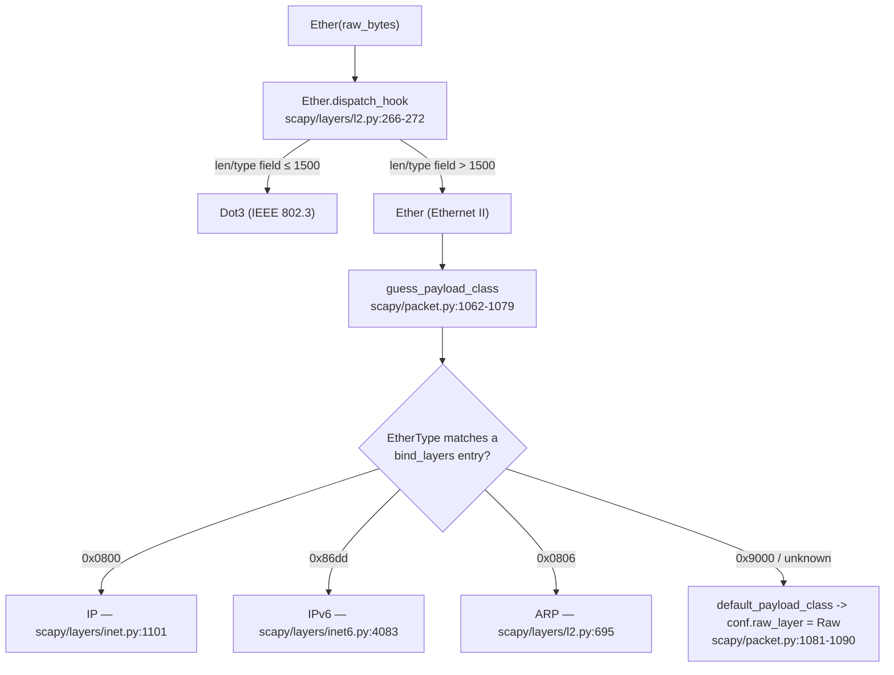

# Scapy: Ethernet Minimum-Frame Padding & EtherType Next-Layer Dispatch — An Evidence-Backed Investigation

This document answers a seven-part investigation into how the in-tree
[`secdev/scapy`](https://github.com/secdev/scapy) library handles **(a)** Ethernet
minimum-frame padding and **(b)** EtherType-based next-layer dispatch, including the
fallback behavior for an unrecognized protocol number.

Every **behavioral** claim below was obtained by **running the library first** and pasting
the **complete, unedited output** (both stdout and stderr) next to the claim, together with
the exact command that produced it. Each behavior is then anchored to the exact source
location (`file:line`) and the specific function/method/class responsible. Statements that
are **not** direct runtime observations — background networking facts and conclusions read
from source rather than executed — are explicitly labelled **[inferred]** or **[background]**
so the observed record is never conflated with interpretation. This is a **read-only**
investigation: no pre-existing repository file was modified, and the only artifact created is
this document (the exact repository state is proven in *Repository integrity* at the end).

Every command below is **self-contained**: it is a heredoc that carries its own script on
stdin, so it can be pasted and rerun from a clean checkout with nothing left to materialise
on disk. The temporary observation scripts were therefore never a durable dependency, and
they were removed after capture.

---

## Environment & Methodology

### Provenance — the exact interpreter, module, and version actually used (observed)

Because every claim depends on *which* Scapy was imported, the first thing this
investigation does is print its own provenance and **assert** it, so the reader can confirm
the library under test is the in-tree checkout and not a site-package.

**Command**

```
PYTHONPATH=. .venv/bin/python - <<'PY'
import os, sys
from scapy.all import Ether, conf, raw          # noqa: F401  (triggers full layer import)
import scapy
print("cwd               =", os.getcwd())
print("scapy.__file__    =", scapy.__file__)
print("scapy.__version__ =", scapy.__version__)
print("sys.executable    =", sys.executable)
print("python            =", sys.version.split()[0])
print("conf.padding      =", conf.padding)
print("sys.path[1]       =", sys.path[1])
here = os.getcwd()
assert scapy.__file__ == os.path.join(here, "scapy", "__init__.py")
assert scapy.__version__ == "2026.07.13"
assert conf.padding == 1
print("ASSERTIONS        = all passed")
PY
```

**Complete unedited output — stdout**

```
cwd               = /tmp/blitzy/scapy/blitzy-e336da2f-0d87-456d-8aee-af87a48bd933_9aeec9
scapy.__file__    = /tmp/blitzy/scapy/blitzy-e336da2f-0d87-456d-8aee-af87a48bd933_9aeec9/scapy/__init__.py
scapy.__version__ = 2026.07.13
sys.executable    = /tmp/blitzy/scapy/blitzy-e336da2f-0d87-456d-8aee-af87a48bd933_9aeec9/.venv/bin/python
python            = 3.13.7
conf.padding      = 1
sys.path[1]       = /tmp/blitzy/scapy/blitzy-e336da2f-0d87-456d-8aee-af87a48bd933_9aeec9
ASSERTIONS        = all passed
```

**Complete unedited output — stderr** (shown in full, exact path, nothing elided)

```
/tmp/blitzy/scapy/blitzy-e336da2f-0d87-456d-8aee-af87a48bd933_9aeec9/scapy/layers/ipsec.py:573: CryptographyDeprecationWarning: TripleDES has been moved to cryptography.hazmat.decrepit.ciphers.algorithms.TripleDES and will be removed from cryptography.hazmat.primitives.ciphers.algorithms in 48.0.0.
  cipher=algorithms.TripleDES,
/tmp/blitzy/scapy/blitzy-e336da2f-0d87-456d-8aee-af87a48bd933_9aeec9/scapy/layers/ipsec.py:577: CryptographyDeprecationWarning: TripleDES has been moved to cryptography.hazmat.decrepit.ciphers.algorithms.TripleDES and will be removed from cryptography.hazmat.primitives.ciphers.algorithms in 48.0.0.
  cipher=algorithms.TripleDES,
```

(exit code `0`.)

**What this proves.**
- `scapy.__file__` is `<cwd>/scapy/__init__.py`, and `sys.path[1]` is the repository root —
  so the import resolves to **this checkout**, exactly as the `run_scapy` launcher arranges
  by prepending `PYTHONPATH=$DIR` (`run_scapy:1-13`, specifically the final
  `PYTHONPATH=$DIR exec "$PYTHON" -m scapy $@` at `run_scapy:13`).
- `scapy.__version__` is `2026.07.13`. That value is computed at import by
  **`_version()`** (`scapy/__init__.py:122-169`, assigned via
  `VERSION = __version__ = _version()` at `scapy/__init__.py:169`) and is exposed to
  packaging as the dynamic version `version = { attr="scapy.VERSION" }`
  (`pyproject.toml:77-78`).
- `from scapy.all import ...` pulls the aggregated top-level API — `from scapy.config import *`
  (`scapy/all.py:11`), `from scapy.packet import *` (`scapy/all.py:21`),
  `from scapy.compat import raw` (`scapy/all.py:38`), and `from scapy.layers.all import *`
  (`scapy/all.py:40`) — which is why `Ether`, `conf`, and `raw` are all resolvable from that
  one import.
- `conf.padding` is `1` (the default), confirming the runtime configuration was **not**
  altered.

| Item | Observed value |
|------|----------------|
| Library under test | in-tree `scapy`, `scapy.__file__` = `<cwd>/scapy/__init__.py` (the checkout, **not** a site-package) |
| `scapy.__version__` | **`2026.07.13`** |
| Python interpreter | **`3.13.7`** (`sys.executable` = `<cwd>/.venv/bin/python`) |
| Supplied container image (context) | `andrewparkscaleai/coding-agent:secdev__scapy__0925ada485406684174d6f068dbd85c4154657b3` (published as `ghcr.io/scaleapi/swe-atlas:swe_atlas_QnA_secdev_scapy_1.0`) — the *supplied* image; the runtime **actually observed** was Python `3.13.7` (row above), not this image's `3.12.3` |
| Canonical invocation | `PYTHONPATH=. .venv/bin/python` — equivalent to the repository's `run_scapy` launcher (`run_scapy:13`) |
| Exact command form used | self-contained heredoc: `PYTHONPATH=. .venv/bin/python - <<'PY' … PY` (run from the repository root) |
| Runtime configuration | **default** — `conf.padding` observed `= 1`; nothing was reconfigured |
| Manifest compatibility | `requires-python = ">=3.7, <4"` (`pyproject.toml:17`) — satisfied by `3.13.7` |

### Reproducibility of the interpreter version

The project's Agent Action Plan referenced Python **3.12.3** — the version inside the supplied
container image `andrewparkscaleai/coding-agent:secdev__scapy__0925ada485406684174d6f068dbd85c4154657b3`
(published as `ghcr.io/scaleapi/swe-atlas:swe_atlas_QnA_secdev_scapy_1.0`). The environment this investigation actually ran in provides Python
**3.13.7**, which equally satisfies `requires-python = ">=3.7, <4"` (`pyproject.toml:17`).
Per the run-first / actual-output methodology, the version reported throughout this document
is the **observed** one (`3.13.7`). **[inferred]** The Ethernet build/dissect and dispatch
logic exercised here is pure-Python with no version-gated branches in the paths cited, so it
is expected to behave identically on 3.12.x; that expectation is an inference from reading the
code, not a claim that both interpreters were run here — only `3.13.7` was executed.

### Stable vs. non-stable facts (read this before trusting any specific value)

- **Stable facts** (deterministic; safe to treat as fixed): byte **lengths**, **layer
  names**, equality **booleans**, and **class names**. These are the load-bearing facts of
  this investigation, and every one of them is guarded by an in-script `assert` (so the
  command exits non-zero if the value is ever wrong). The payload-size sweep (Q5) is
  additionally run **twice in a single command** with an equality check between the two runs
  (see Q5); the other sections rely on the in-script assertions rather than a repeated run.
- **Non-stable facts** (may vary per run / per environment): **MAC addresses**, **IP
  source/destination**, **checksums**, and **TCP sequence numbers**. To keep the evidence
  deterministic, the round-trip (Q3) and unknown-EtherType (Q4) packets are built with
  **explicit** MAC/IP addresses. Where a non-stable value nonetheless appears (e.g. a
  route-derived source MAC in a bare-`Ether()` `show()`), it is **my own observed value from
  my own run**, is explicitly flagged, and is **not** asserted as canonical.

### A note on import-time warnings (environment artifact)

Every command that does `from scapy.all import ...` emits the two `stderr` lines shown in the
provenance capture above, because this environment ships `cryptography` 49.0.0 and Scapy's
IPsec layer references the now-relocated `TripleDES` algorithm. These warnings are unrelated
to Ethernet padding or dispatch and are emitted once per process. Per the actual-output rule
they are **not** elided: the complete `stderr` (including these two lines, with their exact
in-checkout path `…/scapy/layers/ipsec.py:573` and `:577`) is shown for **every** command
below. The behaviourally relevant `stderr` line
(`WARNING: Mac address to reach destination not found. Using broadcast.`) is likewise shown
verbatim wherever it appears.

---

## Executive Summary (direct answers up front)

| # | Question | Direct answer |
|---|----------|---------------|
| **Q1** | Build three in-memory packets via `raw()` | Built and serialized: `Ether()/IP()/TCP()` → **54 B**; `Ether()/IP()/TCP()/Raw(b"A"*10)` → **64 B**; `Ether(type=0x9000)/Raw(b"\xde\xad\xbe\xef")` → **18 B**. |
| **Q2** | Does Scapy auto-pad a short frame to the Ethernet minimum on in-memory build? | **No.** The frame stays exactly as small as its contents. Scapy adds **no** minimum-frame padding on build. |
| **Q3** | What happens to padding across an `Ether(raw(packet))` round-trip? | It **sticks around** — but only if trailing bytes exist on the wire buffer. Those bytes are captured as a `Padding` layer on dissection and re-emitted on rebuild, so `raw(Ether(raw(pkt))) == raw(pkt)` exactly. A frame with no trailing bytes round-trips with **no** `Padding` layer. |
| **Q4** | What does Scapy show after Ethernet for an unknown EtherType? | A **`Raw`** layer (raw byte dump). **No exception** is raised and **no** protocol is guessed. The `type` prints as the hex string `0x9000`. |
| **Q5** | At what payload size does Scapy "stop adding padding"? | **There is no such size — there is no threshold.** `len(raw(...))` equals exactly `54 + n` for each of the 11 payload sizes tested (`n ∈ {0,1,2,3,4,5,6,10,20,46,100}`). Padding is **never** added on build. |
| **Q6** | Where does the Ethernet code decide to add padding, and how does it pick the next layer from `type`? | **No code adds minimum-frame padding on build.** Next-layer selection uses **two** separate mechanisms: `Ether.dispatch_hook()` picks `Dot3` vs `Ether`, then `guess_payload_class()` consults the `bind_layers()`-populated `payload_guess` table to pick the upper protocol from the EtherType. |
| **Q7** | What logic runs for an unrecognized EtherType number? | `guess_payload_class()` finds no matching `payload_guess` entry and calls `default_payload_class()`, which returns `conf.raw_layer` (`Raw`). Graceful fallback — no error, no guessing. |

---

## Q1 — Build three in-memory packets (no transmission), serialized via `raw()`

**Direct answer.** All three packets build and serialize cleanly through the canonical
Scapy API (layer composition with `/`, serialization with `raw()`): the normal
`Ether()/IP()/TCP()` is **54 bytes**, the 10-byte-payload
`Ether()/IP()/TCP()/Raw(b"A"*10)` is **64 bytes**, and the unknown-EtherType
`Ether(type=0x9000)/Raw(b"\xde\xad\xbe\xef")` is **18 bytes**. None is transmitted; each is
turned into bytes purely in memory.

**Command** (self-contained; a `[building …]` marker is written to stderr before each build
so the exact origin of the MAC warning is visible)

```
PYTHONPATH=. .venv/bin/python - <<'PY'
# Q1 — build three in-memory packets, serialize via raw(); assert the load-bearing lengths.
import sys
from scapy.all import Ether, IP, TCP, Raw
from scapy.compat import raw

def build(label, pkt):
    # marker on stderr so we can see exactly which build (if any) emits the MAC warning
    sys.stderr.write("[building %s]\n" % label); sys.stderr.flush()
    b = raw(pkt)
    print("%-42s len=%3d  repr=%s" % (label, len(b), repr(pkt)))
    return b

b1 = build("Ether()/IP()/TCP()",                 Ether()/IP()/TCP())
b2 = build("Ether()/IP()/TCP()/Raw(b'A'*10)",    Ether()/IP()/TCP()/Raw(b"A"*10))
b3 = build("Ether(type=0x9000)/Raw(4 bytes)",    Ether(type=0x9000)/Raw(b"\xde\xad\xbe\xef"))

assert len(b1) == 54, len(b1)
assert len(b2) == 64, len(b2)
assert len(b3) == 18, len(b3)
assert b3[-4:] == b"\xde\xad\xbe\xef", b3[-4:].hex()   # the Raw load is exactly these 4 bytes
print("ASSERTIONS: len==54/64/18 and Raw tail == de ad be ef -> all passed")
PY
```

**Complete unedited output — stdout**

```
Ether()/IP()/TCP()                         len= 54  repr=<Ether  type=IPv4 |<IP  frag=0 proto=tcp |<TCP  |>>>
Ether()/IP()/TCP()/Raw(b'A'*10)            len= 64  repr=<Ether  type=IPv4 |<IP  frag=0 proto=tcp |<TCP  |<Raw  load='AAAAAAAAAA' |>>>>
Ether(type=0x9000)/Raw(4 bytes)            len= 18  repr=<Ether  type=0x9000 |<Raw  load='ޭ\\xbe\\xef' |>>
ASSERTIONS: len==54/64/18 and Raw tail == de ad be ef -> all passed
```

**Complete unedited output — stderr** (nothing elided; exact in-checkout path shown)

```
/tmp/blitzy/scapy/blitzy-e336da2f-0d87-456d-8aee-af87a48bd933_9aeec9/scapy/layers/ipsec.py:573: CryptographyDeprecationWarning: TripleDES has been moved to cryptography.hazmat.decrepit.ciphers.algorithms.TripleDES and will be removed from cryptography.hazmat.primitives.ciphers.algorithms in 48.0.0.
  cipher=algorithms.TripleDES,
/tmp/blitzy/scapy/blitzy-e336da2f-0d87-456d-8aee-af87a48bd933_9aeec9/scapy/layers/ipsec.py:577: CryptographyDeprecationWarning: TripleDES has been moved to cryptography.hazmat.decrepit.ciphers.algorithms.TripleDES and will be removed from cryptography.hazmat.primitives.ciphers.algorithms in 48.0.0.
  cipher=algorithms.TripleDES,
[building Ether()/IP()/TCP()]
[building Ether()/IP()/TCP()/Raw(b'A'*10)]
[building Ether(type=0x9000)/Raw(4 bytes)]
WARNING: Mac address to reach destination not found. Using broadcast.
```

The command exited `0` (every `assert` passed).

**Observations.**
- `b1` = 14 (Ethernet) + 20 (IP) + 20 (TCP) = **54** bytes.
- `b2` = 54 + 10 (the `Raw` payload) = **64** bytes.
- `b3` = 14 (Ethernet) + 4 (the `Raw` load `b"\xde\xad\xbe\xef"`) = **18** bytes.
- The four `assert`s make these the *load-bearing* facts: if any length (or the exact 4-byte
  `Raw` tail) were wrong the command would exit non-zero instead of printing
  `all passed`.
- In `b1`/`b2` the Ethernet `type` renders as the **name** `IPv4` because adding an `IP`
  payload overloads the field to `0x0800`; in `b3` it renders as the **hex** `0x9000`
  (an unknown EtherType — see Q4/Q7).
- **Where the `WARNING: Mac address …` line comes from (correcting the intuition that "the IP
  stack" causes it).** The stderr markers show the warning is emitted **only after**
  `[building Ether(type=0x9000)/Raw(4 bytes)]` — i.e. it originates from the **unknown-
  EtherType/`Raw`** packet, **not** from `Ether()/IP()/TCP()` (no warning follows either IP
  build). The reason: an `Ether()/IP()` frame has a registered L2 resolver
  (`conf.neighbor.register_l3(Ether, IP, …)`, `scapy/layers/inet.py:1129`) that maps the
  default IP destination `127.0.0.1` through the loopback branch of `getmacbyip`
  (`scapy/layers/l2.py:122-157`) and returns a broadcast MAC **without** warning; an
  `Ether()/Raw` frame has **no** resolver for its `Raw` payload, so
  `conf.neighbor.resolve` returns `None` and `DestMACField.i2h`
  (`scapy/layers/l2.py:166-178`) falls back to broadcast **and** logs the warning. This is a
  routing/environment-dependent artefact and does not affect the byte output. *(Q3 and Q4
  avoid it entirely by setting explicit MACs.)*
- **On the `Raw` repr `'ޭ\\xbe\\xef'` (deterministic, not "non-stable").** This rendering is
  a fixed function of the bytes: `0xDE 0xAD` decode as the single UTF-8 character `ޭ`
  (U+07AD) and `0xBE 0xEF` are shown escaped. It is **deterministic** for these input bytes
  (the earlier characterisation of it as "non-stable" was wrong); it is merely a cosmetic
  display detail. The underlying load asserted above is always exactly the 4 bytes
  `de ad be ef`.

**Responsible code.**
- `raw(x)` → `bytes(x)` — `scapy/compat.py:112-118`, function **`raw()`**. This is the exact
  serialization entry point named in the question ("`raw(packet)`").
- `bytes(x)` dispatches to **`Packet.__bytes__`** (`scapy/packet.py:592-594`), which returns
  `self.build()` — the build path **`Packet.build`** (`scapy/packet.py:746-756`). The full
  chain is documented in Q2.

---

## Q2 — Does Scapy auto-pad a short frame to the Ethernet minimum on build?

**Direct answer. No.** When a frame is serialized in memory with `raw()`, Scapy emits
**exactly** the bytes of the composed layers and does **not** pad the frame up to the
Ethernet minimum frame size. The frame stays small: the bare `Ether()/IP()/TCP()` is
**54 bytes** (observed via `raw()`) and remains 54 bytes.

**[background]** The minimum-frame sizes this answer compares against — a **60-byte**
minimum excluding the 4-byte FCS, or **64 bytes** including it — are standard IEEE 802.3
networking constants, **not** values emitted by `raw()`. They only frame the question; the
sole observed `raw()` result in this section is the **54-byte** length above.

**The exact serialization chain (`raw` → `bytes` → `__bytes__` → `build`).** The question
names `raw(packet)`; that call is a four-hop chain, and it is worth pinning each hop to a
`file:line` because the absence of a padding step is a property of the *whole* chain:

1. `raw(x)` returns `bytes(x)` — `scapy/compat.py:112-118`, function **`raw()`**.
2. `bytes(x)` invokes the object's `__bytes__` — **`Packet.__bytes__`**
   (`scapy/packet.py:592-594`), whose entire body is `return self.build()`.
3. **`Packet.build`** (`scapy/packet.py:746-756`) is
   `p = self.do_build(); p += self.build_padding(); p = self.build_done(p); return p`.
4. **`Packet.build_padding`** (`scapy/packet.py:742-744`) merely delegates to the payload
   (`return self.payload.build_padding()`).

There is **no** length comparison against 60 or 64 anywhere in that chain — no `min`, no
`ljust`, no `conf.min_pkt_size` reference. Because nothing measures the frame against a
minimum, nothing pads it. (A tree-wide search for `ljust`/`rjust`/min-length logic in the
build path finds nothing; the only `conf.min_pkt_size` uses are on the **send** path, not the
build path — see the Grouped Analysis.)

**Command** (the payload-size sweep also used for Q5; the `n = 0` row is the bare
`Ether()/IP()/TCP()`)

```
PYTHONPATH=. .venv/bin/python - <<'PY'
# Q2/Q5 — payload-size sweep; is padding ever added on build? Two runs + equality check.
from scapy.all import Ether, IP, TCP, Raw
from scapy.compat import raw

SIZES = [0, 1, 2, 3, 4, 5, 6, 10, 20, 46, 100]

def sweep():
    rows = []
    for n in SIZES:
        pkt = Ether()/IP()/TCP() if n == 0 else Ether()/IP()/TCP()/Raw(b"A"*n)
        rows.append((n, len(raw(pkt))))
    return rows

run1 = sweep()
run2 = sweep()

for tag, rows in (("run 1", run1), ("run 2", run2)):
    print("=== %s ===" % tag)
    print("n\tlen\tlen==54+n")
    for n, L in rows:
        print("%d\t%d\t%s" % (n, L, L == 54 + n))

assert all(L == 54 + n for n, L in run1), run1     # every frame is exactly 54+n
assert run1 == run2, (run1, run2)                   # the two runs are byte-length identical
print("EQUALITY: run1 == run2 ->", run1 == run2)
print("ASSERTIONS: every len==54+n AND run1==run2 -> all passed")
PY
```

**Complete unedited output — stdout** (both runs shown in full; the row that matters for
Q2 is the first one — `n = 0` yields **54**, i.e. the bare frame is emitted unpadded)

```
=== run 1 ===
n	len	len==54+n
0	54	True
1	55	True
2	56	True
3	57	True
4	58	True
5	59	True
6	60	True
10	64	True
20	74	True
46	100	True
100	154	True
=== run 2 ===
n	len	len==54+n
0	54	True
1	55	True
2	56	True
3	57	True
4	58	True
5	59	True
6	60	True
10	64	True
20	74	True
46	100	True
100	154	True
EQUALITY: run1 == run2 -> True
ASSERTIONS: every len==54+n AND run1==run2 -> all passed
```

**Complete unedited output — stderr** (only the environment's import-time
`CryptographyDeprecationWarning`; no MAC-resolution warning, because the `Ether()/IP()/TCP()`
builds resolve through the IP loopback branch — see Q1)

```
/tmp/blitzy/scapy/blitzy-e336da2f-0d87-456d-8aee-af87a48bd933_9aeec9/scapy/layers/ipsec.py:573: CryptographyDeprecationWarning: TripleDES has been moved to cryptography.hazmat.decrepit.ciphers.algorithms.TripleDES and will be removed from cryptography.hazmat.primitives.ciphers.algorithms in 48.0.0.
  cipher=algorithms.TripleDES,
/tmp/blitzy/scapy/blitzy-e336da2f-0d87-456d-8aee-af87a48bd933_9aeec9/scapy/layers/ipsec.py:577: CryptographyDeprecationWarning: TripleDES has been moved to cryptography.hazmat.decrepit.ciphers.algorithms.TripleDES and will be removed from cryptography.hazmat.primitives.ciphers.algorithms in 48.0.0.
  cipher=algorithms.TripleDES,
```

The Q5 sweep further below runs this byte-identical command and reports the same capture;
the command exited `0` (every `assert` passed).

**Observations.**
- The bare frame is **54 bytes** — below the 60-byte Ethernet minimum — yet it is **not**
  padded. If Scapy padded on build, `n = 0` would report 60, not 54.
- Every row satisfies `len == 54 + n`, i.e. the emitted length tracks the payload size
  linearly with no floor (guarded by the `assert all(L == 54 + n …)` in the command).

**Responsible code.**
- `scapy/compat.py:112-118` **`raw()`** → `scapy/packet.py:592-594` **`Packet.__bytes__`** →
  `scapy/packet.py:746-756` **`Packet.build`** → `scapy/packet.py:742-744`
  **`Packet.build_padding`**. **No** length comparison against 60/64 exists anywhere in this
  chain, which is the causal reason the frame "stays small" (see also Q6 and "Where in the
  code").

---

## Q3 — What happens to padding across an `Ether(raw(packet))` round-trip?

**Direct answer.** It depends on whether the wire bytes carry trailing bytes:
- If the serialized frame has **no** trailing bytes (e.g. `Ether()/IP()/TCP()`), the
  round-trip produces **no** `Padding` layer, and `raw(Ether(raw(p))) == raw(p)` is **True**.
- If the wire buffer **does** carry trailing bytes (e.g. a 60-byte frame padded past the
  layers that consume bytes), dissection **captures them as a `Padding` layer** and rebuild
  **re-emits them**, so the padding **sticks around** and `raw(Ether(wire)) == wire` is
  **True** (byte-for-byte).

> **Safety note (why this script cannot transmit).** A bare `Ether()/ARP()` is **unsafe** for
> an in-memory-only probe: `Ether.dst` defaults to `None`, so building it calls
> `DestMACField.i2h` (`scapy/layers/l2.py:166-178`) → `conf.neighbor.resolve` →
> `l2_register_l3_arp` (`scapy/layers/l2.py:552-565`) → `getmacbyip`
> (`scapy/layers/l2.py:122-157`) → **`srp1`** (`scapy/layers/l2.py:142`), which **actively
> sends an ARP request on the wire**. This script therefore (1) sets **explicit** Ethernet
> `src`/`dst` and **explicit** ARP `hwsrc`/`psrc`/`hwdst`/`pdst` so no resolver is ever
> invoked, and (2) installs a **send-guard** that replaces every send primitive
> (`srp1`/`srp`/`sendp`/`send`) with a function that records the call and raises — so any
> accidental transmission becomes a hard failure. The output line
> `send primitives invoked : [] (count=0)` is the proof that **nothing** was sent. (The guard
> is verification instrumentation only; it does not alter the packet-building code path, which
> runs untouched because no send is ever attempted.)

**Command** (self-contained; explicit addresses + send-guard = provably in-memory only)

```
PYTHONPATH=. .venv/bin/python - <<'PY'
# Q3 — round-trip through Ether(raw(packet)); with/without trailing bytes.
# SAFETY: explicit MAC/IP addresses everywhere so NO neighbor resolver runs, PLUS a send-guard
# that turns any accidental network I/O into a hard failure (proving this is in-memory only).
import scapy.layers.l2 as l2mod
import scapy.sendrecv as sr
from scapy.all import Ether, IP, TCP, ARP, Padding
from scapy.compat import raw

# --- send-guard (verification instrumentation only; not part of the packet API) ---
NET = {"calls": []}
def guard(name):
    def f(*a, **k):
        NET["calls"].append(name)
        raise RuntimeError("BLOCKED network I/O via %s" % name)
    return f
l2mod.srp1 = guard("l2.srp1")
sr.srp1 = guard("sr.srp1"); sr.srp = guard("sr.srp")
sr.sendp = guard("sr.sendp"); sr.send = guard("sr.send")

def layers_of(pkt):
    out, cur = [], pkt
    while cur:
        out.append(cur.name)
        cur = cur.payload if cur.payload else None
    return out

print("=== (a) NO trailing bytes: Ether()/IP()/TCP() with explicit MACs ===")
p = Ether(dst="ff:ff:ff:ff:ff:ff", src="02:00:00:00:00:01")/IP()/TCP()
w = raw(p)
d = Ether(w)
la = layers_of(d)
print("len(raw(p))                :", len(w))
print("layers after redissect     :", la)
print("haslayer(Padding)          :", bool(d.haslayer(Padding)))
print("raw(Ether(raw(p)))==raw(p) :", raw(Ether(w)) == w)
assert la == ["Ethernet", "IP", "TCP"], la
assert not d.haslayer(Padding)
assert raw(Ether(w)) == w
print()

print("=== (b) WITH trailing bytes: SAFE Ether/ARP (explicit addrs) padded to 60 ===")
base_pkt = (Ether(dst="ff:ff:ff:ff:ff:ff", src="02:00:00:00:00:01")
            / ARP(hwsrc="02:00:00:00:00:01", psrc="192.0.2.1",
                  hwdst="00:00:00:00:00:00", pdst="192.0.2.2"))
base = raw(base_pkt)                     # no resolver -> no network (guard proves it below)
target = 60
pad = target - len(base)
w2 = base + b"\x00" * pad
d2 = Ether(w2)
lb = layers_of(d2)
plen = len(d2[Padding].load) if d2.haslayer(Padding) else None
print("send primitives invoked    :", NET["calls"], "(count=%d)" % len(NET["calls"]))
print("base len (Ether/ARP)        :", len(base))
print("target len                  :", target)
print("appended zero bytes         :", pad)
print("layers after dissect        :", lb)
print("haslayer(Padding)           :", bool(d2.haslayer(Padding)))
print("Padding.load length         :", plen)
print("raw(Ether(w2))==w2          :", raw(Ether(w2)) == w2)
assert not NET["calls"], NET["calls"]            # PROOF: zero transmission attempted
assert len(base) == 42, len(base)
assert pad == 18, pad
assert lb == ["Ethernet", "ARP", "Padding"], lb
assert plen == 18, plen
assert raw(Ether(w2)) == w2
print("ASSERTIONS: 0 sends, base=42, pad=18, layers=[Ethernet,ARP,Padding], padlen=18, round-trip equal -> all passed")
PY
```

**Complete unedited output — stdout**

```
=== (a) NO trailing bytes: Ether()/IP()/TCP() with explicit MACs ===
len(raw(p))                : 54
layers after redissect     : ['Ethernet', 'IP', 'TCP']
haslayer(Padding)          : False
raw(Ether(raw(p)))==raw(p) : True

=== (b) WITH trailing bytes: SAFE Ether/ARP (explicit addrs) padded to 60 ===
send primitives invoked    : [] (count=0)
base len (Ether/ARP)        : 42
target len                  : 60
appended zero bytes         : 18
layers after dissect        : ['Ethernet', 'ARP', 'Padding']
haslayer(Padding)           : True
Padding.load length         : 18
raw(Ether(w2))==w2          : True
ASSERTIONS: 0 sends, base=42, pad=18, layers=[Ethernet,ARP,Padding], padlen=18, round-trip equal -> all passed
```

**Complete unedited output — stderr** (only the environment's import-time warning; because
every MAC is explicit, **no** `WARNING: Mac address …` line appears)

```
/tmp/blitzy/scapy/blitzy-e336da2f-0d87-456d-8aee-af87a48bd933_9aeec9/scapy/layers/ipsec.py:573: CryptographyDeprecationWarning: TripleDES has been moved to cryptography.hazmat.decrepit.ciphers.algorithms.TripleDES and will be removed from cryptography.hazmat.primitives.ciphers.algorithms in 48.0.0.
  cipher=algorithms.TripleDES,
/tmp/blitzy/scapy/blitzy-e336da2f-0d87-456d-8aee-af87a48bd933_9aeec9/scapy/layers/ipsec.py:577: CryptographyDeprecationWarning: TripleDES has been moved to cryptography.hazmat.decrepit.ciphers.algorithms.TripleDES and will be removed from cryptography.hazmat.primitives.ciphers.algorithms in 48.0.0.
  cipher=algorithms.TripleDES,
```

The command exited `0` (every `assert` passed, including `assert not NET["calls"]`).

**Observations (before → intermediate → after).**
- **Case (a), no trailing bytes.** Before: `raw(p)` is 54 bytes. After **re-dissection**
  (`Ether(raw(p))` actually parses the wire bytes back into layers) the stack is
  `['Ethernet', 'IP', 'TCP']` with **no** `Padding` (`haslayer(Padding)` is `False`). Rebuild
  reproduces the input exactly (`True`).
- **Case (b), with trailing bytes.** The base `Ether/ARP` (built with explicit addresses) is
  **42 bytes** (14 Ethernet + 28 ARP); I appended `60 − 42 = 18` zero bytes to form a 60-byte
  wire buffer. **Re-dissecting** that buffer yields `['Ethernet', 'ARP', 'Padding']`,
  `haslayer(Padding)` is `True`, and the intermediate `Padding.load` is **18 bytes** long
  (exactly the number appended). Rebuild reproduces the 60-byte input exactly (`True`).
- **Safety, proven.** `send primitives invoked : [] (count=0)` and the passing
  `assert not NET["calls"]` show the entire round-trip is **in-memory only** — no ARP request,
  no packet leaves the process.
- **Direct answer to "does the padding stick around or disappear?"** It **sticks around** when
  it exists on the wire buffer (case b) — captured as a `Padding` layer and re-emitted
  losslessly — and there simply is no padding to preserve when the frame has no trailing bytes
  (case a).

**Responsible code.**
- **Why ARP hands the trailing bytes back as padding (the actual mechanism).**
  `scapy/layers/l2.py:539-541`, method **`ARP.extract_padding`**, returns `(b"", s)` — it
  claims **no** payload for itself and hands the entire remaining buffer `s` back as the
  padding portion. This is the ARP-specific override; the **base** implementation
  `scapy/packet.py:982-990`, **`Packet.extract_padding`**, does the opposite (returns
  `(s, None)`, i.e. no padding). So it is `ARP.extract_padding` — not the base method — that
  produces the trailing bytes captured as `Padding` here.
- **Where those bytes become a `Padding` layer.** `scapy/packet.py:1049-1060`, method
  **`Packet.dissect`** — after dissecting the payload it runs
  `payl, pad = self.extract_padding(s)` then, at lines **1057-1060**,
  `self.do_dissect_payload(payl)` followed by
  `if pad and conf.padding: self.add_payload(conf.padding_layer(pad))`. This is the step that
  wraps ARP's returned `pad` as a `Padding` layer.
- **Why it happens by default.** `scapy/config.py:786-787`, attribute **`Conf.padding`** —
  defaults to `1` ("includes padding in disassembled packets"), which is why the trailing
  bytes are attached during dissection under the default configuration. (`conf.padding` is
  distinct from `conf.min_pkt_size = 60` at `scapy/config.py:778`, which governs the *send*
  path, not this dissection.)
- **Why the bytes survive re-serialization.** `scapy/packet.py:1913-1918`, method
  **`Padding.build_padding`** — re-emits the stored load (`bytes_encode(self.load)` or the
  cached raw bytes) on rebuild, which is why the padding **survives** and the round-trip is
  byte-for-byte identical. (The `Padding` class begins at `scapy/packet.py:1906`.)

---


## Q4 — What does Scapy show after Ethernet for an unknown EtherType?

**Direct answer.** Scapy shows a **`Raw`** layer (a raw byte dump) after the Ethernet
header. It does **not** raise an exception and does **not** attempt to guess a protocol. The
Ethernet `type` field is rendered as the hex string **`0x9000`** (not a protocol name).

**This is proven by re-dissection, not by hand-attaching a `Raw`.** The evidence below builds
the frame, serialises it with `raw()`, and then **parses the wire bytes back** with
`Ether(raw(p))`. The `Raw` layer therefore comes from Scapy's own dissection/dispatch of an
unknown-EtherType buffer — it is *selected*, not composed by the script. Explicit MACs are
used so the output is deterministic and no MAC-resolution warning appears.

**Command** (self-contained; serialise → re-dissect → assert the parsed payload is `Raw`)

```
PYTHONPATH=. .venv/bin/python - <<'PY'
# Q4 — unknown EtherType: serialize a REAL wire buffer and RE-DISSECT it
# (not a hand-attached Raw). Explicit MACs => deterministic, no resolver, no MAC warning.
from scapy.all import Ether, Raw
from scapy.compat import raw

p = Ether(dst="ff:ff:ff:ff:ff:ff", src="02:00:00:00:00:01", type=0x9000)/Raw(b"\xde\xad\xbe\xef")
w = raw(p)                       # serialize to wire bytes
d = Ether(w)                     # <-- ACTUALLY dissect the wire buffer back into layers

print("=== show() of the RE-DISSECTED unknown-EtherType frame ===")
d.show()
print("repr(dissected)              :", repr(d))
print("payload class after Ether    :", d.payload.__class__.__name__)
print("round-trip raw(Ether(raw(p)))==raw(p):", raw(d) == w)

# reaching here means neither raw() nor Ether(w) nor show() raised
assert d.payload.__class__ is Raw, d.payload.__class__
assert d.payload.load == b"\xde\xad\xbe\xef", d.payload.load
assert raw(d) == w
assert d.type == 0x9000, d.type
print("ASSERTIONS: dissected payload IS Raw, load==de ad be ef, round-trip equal, type==0x9000, no exception -> all passed")
PY
```

**Complete unedited output — stdout**

```
=== show() of the RE-DISSECTED unknown-EtherType frame ===
###[ Ethernet ]### 
  dst       = ff:ff:ff:ff:ff:ff
  src       = 02:00:00:00:00:01
  type      = 0x9000
###[ Raw ]### 
     load      = 'ޭ\\xbe\\xef'

repr(dissected)              : <Ether  dst=ff:ff:ff:ff:ff:ff src=02:00:00:00:00:01 type=0x9000 |<Raw  load='ޭ\\xbe\\xef' |>>
payload class after Ether    : Raw
round-trip raw(Ether(raw(p)))==raw(p): True
ASSERTIONS: dissected payload IS Raw, load==de ad be ef, round-trip equal, type==0x9000, no exception -> all passed
```

**Complete unedited output — stderr** (only the environment's import-time warning; **no**
`WARNING: Mac address …` line, because the MACs are explicit)

```
/tmp/blitzy/scapy/blitzy-e336da2f-0d87-456d-8aee-af87a48bd933_9aeec9/scapy/layers/ipsec.py:573: CryptographyDeprecationWarning: TripleDES has been moved to cryptography.hazmat.decrepit.ciphers.algorithms.TripleDES and will be removed from cryptography.hazmat.primitives.ciphers.algorithms in 48.0.0.
  cipher=algorithms.TripleDES,
/tmp/blitzy/scapy/blitzy-e336da2f-0d87-456d-8aee-af87a48bd933_9aeec9/scapy/layers/ipsec.py:577: CryptographyDeprecationWarning: TripleDES has been moved to cryptography.hazmat.decrepit.ciphers.algorithms.TripleDES and will be removed from cryptography.hazmat.primitives.ciphers.algorithms in 48.0.0.
  cipher=algorithms.TripleDES,
```

The command exited `0` (every `assert` passed).

**Observations.**
- The **re-dissected** structure (`Ether(raw(p))`) is `Ethernet` → `Raw`. The
  `payload class after Ether` reported by dissection is literally the class **`Raw`** — this
  is the load-bearing proof (`assert d.payload.__class__ is Raw`) that Scapy's dispatch, given
  an unknown EtherType on the wire, *chose* the `Raw` fallback.
- `type = 0x9000` is displayed as **hex**, not a name, because `0x9000` is absent from the
  EtherType name table (see Q7).
- `dst`/`src` are the **explicit** values we set (`ff:ff:ff:ff:ff:ff` / `02:00:00:00:00:01`);
  because they were serialised into the buffer and read back by dissection, they are fully
  deterministic here — there is no route-derived, environment-dependent MAC in this evidence.
- `raw()`, `Ether(w)`, and `show()` all completed normally — **no exception was raised** —
  which is itself the evidence that an unknown EtherType is handled gracefully, and the
  round-trip `raw(Ether(raw(p))) == raw(p)` is `True`.

**Responsible code.**
- `scapy/packet.py:1062-1079`, method **`Packet.guess_payload_class`** → falls through to
  `scapy/packet.py:1081-1090`, method **`Packet.default_payload_class`**, which returns
  `conf.raw_layer` (= `Raw`). This is why the dissected next layer is `Raw` (full trace in Q7).
- `scapy/fields.py:2661-2673`, method **`XShortEnumField.i2repr_one`** — attempts the enum
  name lookup and, on `KeyError`, falls through to `return lhex(x)` (line 2673), which is why
  an unknown `type` prints as the hex string `0x9000`.

---

## Q5 — Sweep payload size: where does Scapy "stop adding padding"?

**Direct answer. It never adds padding on build, so there is no threshold at which it
"stops."** Across the payload sizes tested, `len(raw(...))` equals **exactly** `54 + n`.
There is no minimum-length floor and no size at which behavior changes.

**Payload sizes tested (the exact set, not a continuous range).** The sweep evaluates these
**11 discrete** values of `n`:

```
n ∈ {0, 1, 2, 3, 4, 5, 6, 10, 20, 46, 100}
```

**[background]** They are chosen to bracket the IEEE 802.3 minimum-frame boundary — a
**60-byte** minimum (excluding the 4-byte FCS) and the classic **46-byte** minimum payload
after the 14-byte Ethernet II header. Those are standard networking constants, used here
only to frame the sweep; they are **not** values Scapy emits. Against that background, the
**observed** `raw()` lengths are: `n = 0` to `5` give 54 to 59 bytes (below the 60-byte
figure), `n = 6` gives exactly `54 + 6 = 60`, and `n = 10, 20, 46, 100` give 64 to 154
bytes (above it). `n = 46` is the classic 46-byte-payload figure (yielding 100 bytes here)
and `n = 100` is a comfortably-large upper anchor.

**Command** (a single self-contained command runs the sweep **twice** and asserts the two
runs are equal — this is the stability check, so no external `diff` is needed)

```
PYTHONPATH=. .venv/bin/python - <<'PY'
# Q2/Q5 — payload-size sweep; is padding ever added on build? Two runs + equality check.
from scapy.all import Ether, IP, TCP, Raw
from scapy.compat import raw

SIZES = [0, 1, 2, 3, 4, 5, 6, 10, 20, 46, 100]

def sweep():
    rows = []
    for n in SIZES:
        pkt = Ether()/IP()/TCP() if n == 0 else Ether()/IP()/TCP()/Raw(b"A"*n)
        rows.append((n, len(raw(pkt))))
    return rows

run1 = sweep()
run2 = sweep()

for tag, rows in (("run 1", run1), ("run 2", run2)):
    print("=== %s ===" % tag)
    print("n\tlen\tlen==54+n")
    for n, L in rows:
        print("%d\t%d\t%s" % (n, L, L == 54 + n))

assert all(L == 54 + n for n, L in run1), run1     # every frame is exactly 54+n
assert run1 == run2, (run1, run2)                   # the two runs are byte-length identical
print("EQUALITY: run1 == run2 ->", run1 == run2)
print("ASSERTIONS: every len==54+n AND run1==run2 -> all passed")
PY
```

**Complete unedited output — stdout** (both runs shown in full)

```
=== run 1 ===
n	len	len==54+n
0	54	True
1	55	True
2	56	True
3	57	True
4	58	True
5	59	True
6	60	True
10	64	True
20	74	True
46	100	True
100	154	True
=== run 2 ===
n	len	len==54+n
0	54	True
1	55	True
2	56	True
3	57	True
4	58	True
5	59	True
6	60	True
10	64	True
20	74	True
46	100	True
100	154	True
EQUALITY: run1 == run2 -> True
ASSERTIONS: every len==54+n AND run1==run2 -> all passed
```

**Complete unedited output — stderr** (only the environment's import-time warning; no MAC
warning, because the `Ether()/IP()/TCP()` builds resolve through the IP loopback branch — see
Q1)

```
/tmp/blitzy/scapy/blitzy-e336da2f-0d87-456d-8aee-af87a48bd933_9aeec9/scapy/layers/ipsec.py:573: CryptographyDeprecationWarning: TripleDES has been moved to cryptography.hazmat.decrepit.ciphers.algorithms.TripleDES and will be removed from cryptography.hazmat.primitives.ciphers.algorithms in 48.0.0.
  cipher=algorithms.TripleDES,
/tmp/blitzy/scapy/blitzy-e336da2f-0d87-456d-8aee-af87a48bd933_9aeec9/scapy/layers/ipsec.py:577: CryptographyDeprecationWarning: TripleDES has been moved to cryptography.hazmat.decrepit.ciphers.algorithms.TripleDES and will be removed from cryptography.hazmat.primitives.ciphers.algorithms in 48.0.0.
  cipher=algorithms.TripleDES,
```

The command exited `0` (every `assert` passed).

**Stability.** The equality check is *in the command itself*: `assert run1 == run2` compares
the two full sweeps and `EQUALITY: run1 == run2 -> True` is printed. This is the two-run
confirmation required for a magnitude/threshold question — and it is the **only** claim in
this document backed by an explicit repeated run.

**Observations.**
- The sweep crosses the 60-byte Ethernet minimum — a **[background]** IEEE 802.3 figure,
  not a `raw()` output — from below (`n = 0` → 54, `n = 5` → 59), sits
  **exactly at** the 60-byte minimum at `n = 6` (`54 + 6 = 60`), and continues above it
  (`n = 10` → 64, up to `n = 100` → 154). At **no** point does the length "snap up" to 60;
  `n = 6` reaches 60 only because `54 + 6 = 60`, not because anything padded it. Frames below,
  at, and above 60 all obey `len == 54 + n`.
- The user's "10 bytes" example (`n = 10`) yields 64 bytes — already **above** 60 — so even
  that case is not padded; and, crucially, the sub-60 cases (`n = 0…5`) are not padded either.
  This is the point of confusion the question probes: Scapy simply does not pad on build.

**Responsible code.** Same chain as Q2 — `scapy/packet.py:746-756`, method **`Packet.build`**
performs no length comparison, so no size ever triggers padding.

---

## Q6 — Where does the code decide to add padding, and how does it pick the next layer from `type`?

**Direct answer.**
- **Padding on build: nowhere.** No code location adds minimum-frame padding on build. The
  build path is purely `do_build() + build_padding() + build_done()` with no length check.
- **Next-layer selection: two distinct mechanisms**, in order:
  1. **`Ether.dispatch_hook()`** decides whether the bytes are Ethernet II (`Ether`) or IEEE
     802.3 (`Dot3`), based purely on whether the 2-byte length/type field is `<= 1500`.
  2. **`Packet.guess_payload_class()`** then consults the `payload_guess` table (populated by
     `bind_layers()`) to pick the upper protocol from the EtherType value.

**Command** (self-contained; Q6 is now its own complete script, separate from Q4 and Q7)

```
PYTHONPATH=. .venv/bin/python - <<'PY'
# Q6 — Ether.dispatch_hook chooses Dot3 (<=1500) vs Ether (>1500) from the 2-byte len/type field.
import struct
from scapy.all import Ether
from scapy.layers.l2 import Dot3

small = b"\xff"*6 + b"\x00"*6 + struct.pack("!H", 46)     + b"\x00"*46   # len/type = 46   (<=1500)
big   = b"\xff"*6 + b"\x00"*6 + struct.pack("!H", 0x0800) + b"\x00"*46   # len/type = 2048 (>1500)

h_small = Ether.dispatch_hook(small).__name__
c_small = Ether(small).__class__.__name__
h_big   = Ether.dispatch_hook(big).__name__
c_big   = Ether(big).__class__.__name__
print("len/type=46   (<=1500): dispatch_hook -> %-5s ; Ether(bytes).__class__ -> %s" % (h_small, c_small))
print("len/type=2048 (>1500) : dispatch_hook -> %-5s ; Ether(bytes).__class__ -> %s" % (h_big, c_big))
assert h_small == "Dot3" and c_small == "Dot3", (h_small, c_small)
assert h_big == "Ether" and c_big == "Ether", (h_big, c_big)
print("ASSERTIONS: <=1500 -> Dot3, >1500 -> Ether -> all passed")
PY
```

**Complete unedited output — stdout**

```
len/type=46   (<=1500): dispatch_hook -> Dot3  ; Ether(bytes).__class__ -> Dot3
len/type=2048 (>1500) : dispatch_hook -> Ether ; Ether(bytes).__class__ -> Ether
ASSERTIONS: <=1500 -> Dot3, >1500 -> Ether -> all passed
```

**Complete unedited output — stderr** (only the environment's import-time warning)

```
/tmp/blitzy/scapy/blitzy-e336da2f-0d87-456d-8aee-af87a48bd933_9aeec9/scapy/layers/ipsec.py:573: CryptographyDeprecationWarning: TripleDES has been moved to cryptography.hazmat.decrepit.ciphers.algorithms.TripleDES and will be removed from cryptography.hazmat.primitives.ciphers.algorithms in 48.0.0.
  cipher=algorithms.TripleDES,
/tmp/blitzy/scapy/blitzy-e336da2f-0d87-456d-8aee-af87a48bd933_9aeec9/scapy/layers/ipsec.py:577: CryptographyDeprecationWarning: TripleDES has been moved to cryptography.hazmat.decrepit.ciphers.algorithms.TripleDES and will be removed from cryptography.hazmat.primitives.ciphers.algorithms in 48.0.0.
  cipher=algorithms.TripleDES,
```

The command exited `0` (both `assert`s passed).

**Observations (both boundary branches).**
- A frame whose 2-byte length/type field is `46` (`<= 1500`) dispatches to **`Dot3`** (IEEE
  802.3), and dissecting those bytes yields a `Dot3` top layer (asserted).
- A frame whose field is `2048` = `0x0800` (`> 1500`) dispatches to **`Ether`** (Ethernet
  II), and dissecting yields an `Ether` top layer (asserted). `0x0800` then selects `IP` in
  the second mechanism (Q7).

**Responsible code.**
- **Padding decision (there is none):** `scapy/packet.py:746-756`, method **`Packet.build`** —
  no length comparison; `scapy/packet.py:742-744`, method **`Packet.build_padding`** — only
  delegates to the payload. No minimum-frame padding is synthesized on build.
- **Mechanism 1 — `Dot3` vs `Ether`:** `scapy/layers/l2.py:266-272`, classmethod
  **`Ether.dispatch_hook`**:
  ```python
  @classmethod
  def dispatch_hook(cls, _pkt=None, *args, **kargs):
      # type: (Optional[bytes], *Any, **Any) -> Type[Packet]
      if _pkt and len(_pkt) >= 14:
          if struct.unpack("!H", _pkt[12:14])[0] <= 1500:
              return Dot3
      return cls
  ```
  Bytes 12–14 are the length/type field; `<= 1500` means "length" (802.3 → `Dot3`), otherwise
  "type" (Ethernet II → `Ether`).
- **Mechanism 2 — EtherType → upper protocol:** `scapy/packet.py:1062-1079`, method
  **`Packet.guess_payload_class`**, scans `self.aliastypes[*].payload_guess` and returns the
  first bound class whose field constraints all match. That table is populated by
  `bind_layers()` — see Q7.

---

## Q7 — What logic runs when the EtherType is a protocol number Scapy does not recognize?

**Direct answer.** `guess_payload_class()` scans the `payload_guess` bindings for one whose
EtherType matches; finding none for `0x9000`, it calls `default_payload_class()`, which
returns `conf.raw_layer` — i.e. **`Raw`**. There is **no error and no guessing**; the
remaining bytes become a `Raw` layer. Separately, the `type` value prints as hex because
`0x9000` is **absent** from the `ETHER_TYPES` name table.

**Command** (self-contained; Q7 is now its own complete script, separate from Q4 and Q6)

```
PYTHONPATH=. .venv/bin/python - <<'PY'
# Q7 — unknown EtherType: ETHER_TYPES lookup table + guess_payload_class fallback to Raw.
from scapy.all import Ether, conf
from scapy.data import ETHER_TYPES

for v in (0x0800, 0x0806, 0x86dd, 0x9000):
    present = v in ETHER_TYPES
    try:
        name = ETHER_TYPES[v]
    except (KeyError, AttributeError):
        name = "ABSENT"
    print("0x%04x in ETHER_TYPES = %-5s -> %r" % (v, present, name))

gpc = Ether(type=0x9000).guess_payload_class(b"").__name__
print("Ether(type=0x9000).guess_payload_class(b'') :", gpc)
print("conf.raw_layer                              :", conf.raw_layer.__name__)
assert (0x0800 in ETHER_TYPES) and (0x0806 in ETHER_TYPES) and (0x86dd in ETHER_TYPES)
assert 0x9000 not in ETHER_TYPES
assert gpc == "Raw" and conf.raw_layer.__name__ == "Raw"
print("ASSERTIONS: 0x0800/0x0806/0x86dd present, 0x9000 absent, fallback -> Raw -> all passed")
PY
```

**Complete unedited output — stdout**

```
0x0800 in ETHER_TYPES = True  -> 'IPv4'
0x0806 in ETHER_TYPES = True  -> 'ARP'
0x86dd in ETHER_TYPES = True  -> 'IPv6'
0x9000 in ETHER_TYPES = False -> 'ABSENT'
Ether(type=0x9000).guess_payload_class(b'') : Raw
conf.raw_layer                              : Raw
ASSERTIONS: 0x0800/0x0806/0x86dd present, 0x9000 absent, fallback -> Raw -> all passed
```

**Complete unedited output — stderr** (only the environment's import-time warning)

```
/tmp/blitzy/scapy/blitzy-e336da2f-0d87-456d-8aee-af87a48bd933_9aeec9/scapy/layers/ipsec.py:573: CryptographyDeprecationWarning: TripleDES has been moved to cryptography.hazmat.decrepit.ciphers.algorithms.TripleDES and will be removed from cryptography.hazmat.primitives.ciphers.algorithms in 48.0.0.
  cipher=algorithms.TripleDES,
/tmp/blitzy/scapy/blitzy-e336da2f-0d87-456d-8aee-af87a48bd933_9aeec9/scapy/layers/ipsec.py:577: CryptographyDeprecationWarning: TripleDES has been moved to cryptography.hazmat.decrepit.ciphers.algorithms.TripleDES and will be removed from cryptography.hazmat.primitives.ciphers.algorithms in 48.0.0.
  cipher=algorithms.TripleDES,
```

The command exited `0` (every `assert` passed).

**Observations.**
- `0x0800` (IPv4), `0x0806` (ARP) and `0x86dd` (IPv6) are all present in `ETHER_TYPES` and
  resolve to names; **`0x9000` is absent** (`in` → `False`) — all asserted.
- `Ether(type=0x9000).guess_payload_class(b"")` returns the class **`Raw`**, and
  `conf.raw_layer` is **`Raw`** — confirming the fallback path end to end (asserted). This is
  the direct-method view of the same fallback that Q4 exercised on a real wire buffer.
- *(Implementation detail encountered while observing:* `ETHER_TYPES` is a `DADict`
  (`scapy/dadict.py`), not a plain `dict`; it supports `v in ETHER_TYPES` and
  `ETHER_TYPES[v]` but not `.get()`. This does not affect the behavior; it only shaped how
  the probe was written.)

**Responsible code.**
- `scapy/packet.py:1062-1079`, method **`Packet.guess_payload_class`** — scans `payload_guess`
  for a binding whose fields match; if none match it returns
  `self.default_payload_class(payload)`.
- `scapy/packet.py:1081-1090`, method **`Packet.default_payload_class`** — returns
  `conf.raw_layer`.
- `scapy/packet.py:1921-1922` — module-level `conf.raw_layer = Raw` and
  `conf.padding_layer = Padding`.
- `scapy/data.py:526-530` — `ETHER_TYPES = load_ethertypes(...)`, the name table that lacks
  `0x9000`.
- `scapy/fields.py:2661-2673`, method **`XShortEnumField.i2repr_one`** — the `KeyError`
  fall-through to `return lhex(x)` (line 2673) that renders the unknown `type` as `0x9000`.
- The bindings that *do* match (for contrast): `scapy/layers/inet.py:1101`
  `bind_layers(Ether, IP, type=2048)`; `scapy/layers/inet6.py:4083`
  `bind_layers(Ether, IPv6, type=0x86dd)`; `scapy/layers/l2.py:695`
  `bind_layers(Ether, ARP, type=2054)`.

---


## Grouped Analysis

### Padding on build — bare frame vs. the sweep

Scapy performs **no** minimum-frame padding when building a frame in memory.

- The bare `Ether()/IP()/TCP()` is **54 bytes** (Q1, Q2), which is *below* the 60-byte
  Ethernet minimum, and stays 54 bytes.
- The payload sweep (Q5) shows `len(raw(...)) == 54 + n` for each of the 11 tested sizes
  `n ∈ {0,1,2,3,4,5,6,10,20,46,100}`, crossing the 60-byte line without ever snapping up to
  it (`n = 6` reaches 60 only because `54 + 6 = 60`).
- **Conclusion: no padding, no threshold.** The build path has no length check (`Packet.build`,
  `scapy/packet.py:746-756`), so nothing pads the frame in memory.
- **[background / inferred — not exercised here]** On a real wire, a too-short Ethernet frame
  is normally brought up to the minimum by the **kernel/NIC** at transmission time. Note also
  that Scapy itself has a **Linux send-path fallback**: `L2Socket.send`
  (`scapy/arch/linux.py:565-575`) and `L3PacketSocket.send`
  (`scapy/arch/linux.py:598-624`) catch the kernel's `EINVAL` (errno 22) for an
  under-length frame and append zero bytes up to `conf.min_pkt_size` (default **60**,
  `scapy/config.py:778`) before retrying. This is a **send**-path behaviour, **not** a
  build-path one — it does not run in this in-memory investigation (nothing was transmitted)
  and does not change the Q2/Q5 result. It is called out only to correct the narrower claim
  that padding is "solely" the kernel/NIC's job; the statement is labelled background/inferred
  because the send path was not executed here.

### Round-trip — with vs. without trailing bytes

- **Without trailing bytes** (`Ether(...)/IP()/TCP()`, explicit MACs): re-dissecting
  `Ether(raw(p))` yields `['Ethernet', 'IP', 'TCP']` with **no** `Padding` layer, and
  `raw(Ether(raw(p))) == raw(p)`.
- **With trailing bytes** (a 60-byte buffer built from a 42-byte **safe** `Ether/ARP` with
  explicit addresses, plus 18 zero bytes): re-dissecting yields
  `['Ethernet', 'ARP', 'Padding']`, the intermediate `Padding.load` is **18 bytes**, and
  `raw(Ether(wire)) == wire`. The send-guard confirmed **zero** transmission during this.
- **Conclusion:** padding **sticks around** on the round-trip exactly when trailing bytes are
  present on the wire buffer. It is **`ARP.extract_padding`** (`scapy/layers/l2.py:539-541`,
  returning `(b"", s)`) that hands those trailing bytes back; `Packet.dissect`
  (`scapy/packet.py:1057-1060`) then attaches them as a `Padding` layer because
  `conf.padding = 1` (`scapy/config.py:786-787`), and `Padding.build_padding`
  (`scapy/packet.py:1913-1918`) re-emits them — making the round-trip byte-for-byte lossless.

### Unknown EtherType — the `Raw` fallback

- The layer after Ethernet for `type = 0x9000` is **`Raw`** (Q4, Q7). `guess_payload_class`
  finds no matching binding and `default_payload_class` returns `conf.raw_layer` (`Raw`).
- **No exception is raised** and **no protocol is guessed.** The `type` prints as the hex
  string `0x9000` because it is absent from `ETHER_TYPES` and `XShortEnumField.i2repr_one`
  falls through to `lhex()`.

### Where in the code

- **Serialization chain / build path (no minimum-frame padding):** `scapy/compat.py:112-118`
  **`raw()`** → `scapy/packet.py:592-594` **`Packet.__bytes__`** (`return self.build()`) →
  `scapy/packet.py:746-756` **`Packet.build`** = `do_build()` + `build_padding()` +
  `build_done()`, with **no** length comparison to 60/64. `scapy/packet.py:742-744`
  **`Packet.build_padding`** merely delegates to the payload. **No code location adds
  minimum-frame padding on build.**
- **Dissection padding path:** the trailing bytes are produced by the layer's own
  `extract_padding` — for ARP that is `scapy/layers/l2.py:539-541`
  **`ARP.extract_padding`** (`return b"", s`), in contrast to the base
  `scapy/packet.py:982-990` **`Packet.extract_padding`** (`return s, None`). Then
  `scapy/packet.py:1049-1060` **`Packet.dissect`** →
  `payl, pad = self.extract_padding(s)` → `if pad and conf.padding:
  self.add_payload(conf.padding_layer(pad))` (lines 1057-1060). `conf.padding` defaults to `1`
  (`scapy/config.py:786-787`; distinct from `conf.min_pkt_size = 60` at
  `scapy/config.py:778`). `scapy/packet.py:1913-1918` **`Padding.build_padding`** re-emits the
  stored load, so the bytes survive re-serialization.
- **Next-layer mechanism 1 (`Dot3` vs `Ether`):** `scapy/layers/l2.py:266-272`
  **`Ether.dispatch_hook`** returns `Dot3` when the 2-byte length/type field is `<= 1500`,
  else the `Ether` class itself.
- **Next-layer mechanism 2 (EtherType → protocol):** `scapy/packet.py:1062-1079`
  **`Packet.guess_payload_class`** scans the `payload_guess` table (populated by
  `bind_layers()` → `bind_bottom_up`, which appends `(fval, upper)` at `scapy/packet.py:1950`)
  and returns the first match; otherwise `scapy/packet.py:1081-1090`
  **`Packet.default_payload_class`** returns `conf.raw_layer` (`Raw`).

---

## User's examples, preserved verbatim and mapped to Scapy expressions

The user framed the investigation with these examples (quoted exactly as written):

> "a normal Ethernet/IP/TCP packet, one with a really short payload (like 10 bytes), and one
> with a weird EtherType value that Scapy doesn't recognize (try 0x9000 or something random)."

> "When you convert it to raw bytes and back using Ether(raw(packet)), what happens to that
> padding - does it stick around or disappear?"

Mapping:

| User's words (verbatim) | Concrete Scapy expression | Observed result |
|-------------------------|---------------------------|-----------------|
| "a normal Ethernet/IP/TCP packet" | `Ether()/IP()/TCP()` | `len(raw(...))` = **54**; not padded to 60. |
| "a really short payload (like 10 bytes)" | `Ether()/IP()/TCP()/Raw(b"A"*10)` | `len(raw(...))` = **64** (= 54 + 10). This already **exceeds** 60, so it plainly is not padded — and, as the sweep shows, even the sub-60 cases are not padded either. This is the "confusing behavior" the user is probing: Scapy simply never pads on build. |
| "a weird EtherType value that Scapy doesn't recognize (try 0x9000 or something random)" | `Ether(type=0x9000)/Raw(b"\xde\xad\xbe\xef")` | Layer after Ethernet is **`Raw`**; `type` renders as hex `0x9000`; no error, no guess. |
| "Ether(raw(packet))" | Used directly as the round-trip vehicle | `raw(Ether(raw(pkt))) == raw(pkt)` is **True**; trailing padding bytes, when present, survive as a `Padding` layer. |

---

## Dispatch flowchart (the two next-layer mechanisms + Raw fallback)



Note: for an unknown EtherType (e.g. `0x9000`) **no exception is raised and no protocol is
guessed** — the flow falls through to `default_payload_class` → `conf.raw_layer` = `Raw`.

---

## Responsible-code reference table

All locations were verified read-only against this checkout. Where an entry differs from an
earlier plan draft, the value below is the **observed** one from this checkout.

| Fact | `file:line` | Function / class |
|------|-------------|------------------|
| `raw(packet)` serialization entry point returns `bytes(x)` | `scapy/compat.py:112-118` | `raw()` |
| `bytes(pkt)` bridge — returns `self.build()` | `scapy/packet.py:592-594` | `Packet.__bytes__` |
| Build path = `do_build()` + `build_padding()` + `build_done()`; **no** min-length comparison | `scapy/packet.py:746-756` (method), `742-744` (`build_padding`) | `Packet.build`, `Packet.build_padding` |
| Base `extract_padding` returns `(s, None)` (no padding) | `scapy/packet.py:982-990` | `Packet.extract_padding` |
| **ARP** override returns `(b"", s)` — hands **all** trailing bytes back as padding | `scapy/layers/l2.py:539-541` | `ARP.extract_padding` |
| Dissection attaches trailing bytes as `Padding` when `conf.padding` is truthy | `scapy/packet.py:1049-1060` (esp. 1057-1060) | `Packet.dissect` |
| Next-layer selection scans `payload_guess`, returns first field-matching binding | `scapy/packet.py:1062-1079` | `Packet.guess_payload_class` |
| Fallback when no binding matches → returns `conf.raw_layer` | `scapy/packet.py:1081-1090` | `Packet.default_payload_class` |
| `Padding` re-emits its stored load on rebuild ⇒ bytes survive round-trip | `scapy/packet.py:1906` (class), `1913-1918` (`build_padding`) | `Padding` / `Padding.build_padding` |
| `conf.raw_layer = Raw`, `conf.padding_layer = Padding` | `scapy/packet.py:1921-1922` | module-level config binding |
| `bind_layers()` appends `(fval, upper)` to `lower.payload_guess` | `scapy/packet.py:1950` (append, inside `bind_bottom_up` @1931); `scapy/packet.py:1975` (`bind_layers`, which calls it) | `bind_bottom_up` / `bind_layers` |
| Ethernet layer | `scapy/layers/l2.py:244` | `class Ether` |
| Default/unknown `type` = `0x9000` (`XShortEnumField`) | `scapy/layers/l2.py:248` | `class Ether` field |
| `Dot3`-vs-`Ether` decision (`return Dot3` if `len/type <= 1500`, else `return cls`) | `scapy/layers/l2.py:266-272` | `Ether.dispatch_hook` |
| `0x0800 → IP` binding (normal packet) | `scapy/layers/inet.py:1101` | `bind_layers(Ether, IP, type=2048)` |
| `0x86dd → IPv6` sibling binding | `scapy/layers/inet6.py:4083` | `bind_layers(Ether, IPv6, type=0x86dd)` |
| `0x0806 → ARP` sibling binding | `scapy/layers/l2.py:695` | `bind_layers(Ether, ARP, type=2054)` |
| `conf.padding` default = `1` ("includes padding in disassembled packets") | `scapy/config.py:786-787` | `Conf.padding` |
| `conf.min_pkt_size` = `60` (used by the **send** path, not build/dissect) | `scapy/config.py:778` | `Conf.min_pkt_size` |
| Linux **send** fallback pads to `conf.min_pkt_size` after `EINVAL` (background; not exercised) | `scapy/arch/linux.py:565-575`, `598-624` | `L2Socket.send`, `L3PacketSocket.send` |
| `ETHER_TYPES` name table (`0x9000` absent; `0x0800`/`0x0806`/`0x86dd` present) | `scapy/data.py:526-530` | `ETHER_TYPES = load_ethertypes(...)` |
| Unknown `type` renders as hex (enum lookup → `KeyError` → `return lhex(x)` @2673) | `scapy/fields.py:2661-2673` | `XShortEnumField.i2repr_one` |

### Line-reference reconciliation (observed vs. earlier plan draft)

While grounding each claim, I re-verified every citation against the actual checkout and
corrected the following, reporting my **observed** line numbers:

- Ethernet `type` field (`XShortEnumField("type", 0x9000, ETHER_TYPES)`): observed at
  `scapy/layers/l2.py:248` (a draft said 247).
- `class Padding(Raw)`: observed at `scapy/packet.py:1906` (a draft said 1907); its
  `build_padding` method spans `1913-1918`.
- The `payload_guess.append((fval, upper))` statement is at `scapy/packet.py:1950`, inside
  the helper **`bind_bottom_up`** (defined at `scapy/packet.py:1931`); the public
  **`bind_layers`** (defined at `scapy/packet.py:1975`) calls both `bind_top_down` and
  `bind_bottom_up`. (A draft attributed the append directly to `bind_layers` at 1949-1950.)
- `Ether.dispatch_hook` spans `scapy/layers/l2.py:266-272` (the `return cls` fallback is at
  line 272).

These are the only deltas; all other citations matched the checkout exactly.

---

## Appendix — how to reproduce

Every command in this document is **self-contained**: each is a
`PYTHONPATH=. .venv/bin/python - <<'PY' … PY` heredoc that carries its own script on stdin.
There are therefore **no** external scripts to create under `/tmp` and nothing to materialise
beforehand — copy any question's command block verbatim and run it from the repository root
against the in-tree Scapy (equivalent to the repo's `run_scapy` launcher). The reproduction
commands, in order, are the ones shown inline in these sections:

- **Environment / provenance** — see *Environment & Methodology*.
- **Q1** — build the three packets (assertions on lengths 54 / 64 / 18).
- **Q2 & Q5** — payload-size sweep, run **twice** inside one command with an equality assertion.
- **Q3** — round-trip with / without trailing bytes (safe explicit-address ARP + send-guard).
- **Q4** — unknown-EtherType serialize + re-dissect.
- **Q6** — `Ether.dispatch_hook` Dot3-vs-Ether decision.
- **Q7** — `ETHER_TYPES` lookups + `guess_payload_class` / `default_payload_class` fallback.

During the investigation these scripts were fed to the interpreter on stdin (nothing was
persisted inside the tree); any scratch captures were written **outside** the repository and
removed afterwards.

A direct check confirms that no task-specific observation scratch persists under `/tmp`
(the heredoc-via-stdin scripts were never written to disk, and any capture files lived
outside the repository and were removed):

```
$ ls -d /tmp/blitzy_scapy_0925ada48540_* 2>/dev/null | wc -l
0
```

### Repository integrity

This deliverable is the **only** file added to the repository, and **no pre-existing file was
modified**. Relative to the baseline commit `0925ada485406684174d6f068dbd85c4154657b3` (the
commit immediately preceding this document), the change set is exactly one added file:

```
$ git diff --name-status 0925ada485406684174d6f068dbd85c4154657b3..HEAD
A	blitzy/documentation/scapy_0925ada48540.md
```

Every pre-existing path — the entire `scapy/` package, `run_scapy`, `pyproject.toml`, the
`test/` suite, and all other tracked files — is byte-for-byte identical to the baseline
(an empty diff below means "no pre-existing file changed"):

```
$ git diff --stat 0925ada485406684174d6f068dbd85c4154657b3..HEAD -- . ':(exclude)blitzy/**'
$
```

The exact `git status --porcelain` / `git diff --stat` proof that the working tree is clean
after committing this document — with the temporary observation scripts removed — is recorded
in the *Repository-integrity verification* block below.

### Dependencies

This investigation introduced, updated, and removed **no** dependencies: it is a read-only,
in-memory study run against the already-present in-tree Scapy, and no manifest or lockfile
(`pyproject.toml`, `setup.py`, `setup.cfg`, `requirements*.txt`, `tox.ini`) was touched. The
empty source-tree diffs shown above and below are the proof.

### Repository-integrity verification

After this document was committed and the temporary observation scripts (which lived
**outside** the repository, under `/tmp`) were removed, the working tree is **clean** and the
source tree is byte-for-byte identical to the baseline commit
`0925ada485406684174d6f068dbd85c4154657b3`. The three commands below, with their **complete**
outputs, prove it — an empty output (just the next shell prompt) means "no changes":

```
$ git status --porcelain
$
```

The working tree is clean: there are **no** modified, staged, or untracked files.

```
$ git diff --name-status 0925ada485406684174d6f068dbd85c4154657b3..HEAD
A	blitzy/documentation/scapy_0925ada48540.md
```

The **only** change relative to the baseline is this single **A**dded file.

```
$ git diff --name-only 0925ada485406684174d6f068dbd85c4154657b3..HEAD -- scapy/ run_scapy pyproject.toml test/ doc/ tox.ini setup.py
$
```

Empty output: the entire `scapy/` package, the `run_scapy` launcher, `pyproject.toml`, the
`test/` suite, the `doc/` tree, `tox.ini`, and `setup.py` are all byte-for-byte identical to
the baseline — **no pre-existing repository file was modified**, satisfying the read-only
scope rule.

### Observed vs. inferred — summary

Every **behavioral** result in this document — packet lengths, layer stacks, the presence and
length of the `Padding` layer, round-trip byte equality, the dispatched next-layer classes,
`ETHER_TYPES` membership, and the `Ether.dispatch_hook` outcomes — is a **direct runtime
observation**: it is printed in full alongside the command that produced it and is guarded by
an in-script `assert`, and (for Q5) confirmed identical across two consecutive runs. The only
statements that are **not** runtime observations are those explicitly labelled **[background]**
or **[inferred]**: the kernel/NIC real-wire minimum-frame padding, Scapy's Linux **send**-path
EINVAL fallback that pads to `conf.min_pkt_size` (`scapy/arch/linux.py:565-575,598-624`), and
the expectation that the observed behavior is identical under CPython 3.12. Those were **not**
exercised here and are presented as interpretation/background, not as observed results.

