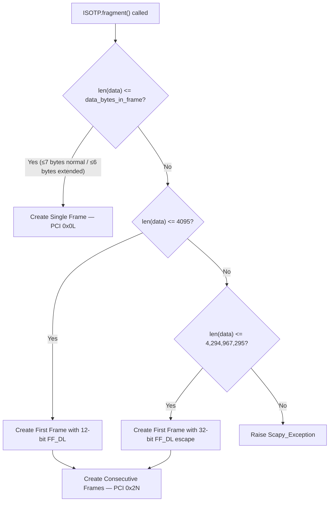
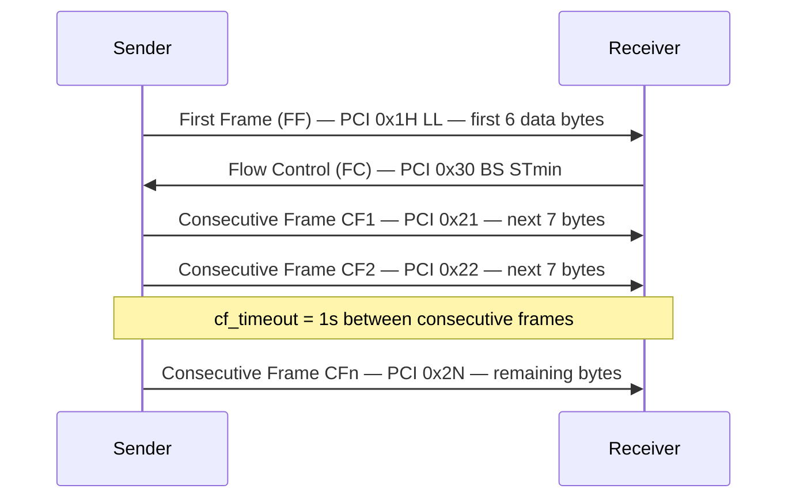

# ISO-TP Message Segmentation in Scapy's Automotive Diagnostic Protocols

An investigative technical reference documenting how Scapy's `scapy.contrib.isotp` module implements ISO-TP (ISO 15765-2) message segmentation over CAN frames. Every answer in this document is derived directly from reading the Scapy source code and validated through runtime execution evidence against the installed package.

| Metadata | Value |
|---|---|
| **Date** | 2026-04-09 |
| **Scapy Version** | 2026.04.09 |
| **Python Version** | >=3.7, <4 |
| **Protocol Standard** | ISO 15765-2 (ISO-TP) |
| **Repository Commit** | `scapy_0925ada48540` |

---

## Table of Contents

1. [Environment Setup](#1-environment-setup)
2. [ISO-TP Segmentation Fundamentals](#2-iso-tp-segmentation-fundamentals)
3. [Maximum Payload Before Segmentation (Single-Frame Threshold)](#3-maximum-payload-before-segmentation-single-frame-threshold)
4. [Fragmenting a 20-Byte Diagnostic Payload](#4-fragmenting-a-20-byte-diagnostic-payload)
5. [Handling Large Payloads (5000 Bytes)](#5-handling-large-payloads-5000-bytes)
6. [Absolute Size Limits](#6-absolute-size-limits)
7. [Receiving Segmented Messages — Missing Frame Behavior](#7-receiving-segmented-messages--missing-frame-behavior)
8. [Summary Table](#8-summary-table)
9. [PCI Byte Quick Reference](#9-pci-byte-quick-reference)
10. [Source References](#10-source-references)

---

## 1. Environment Setup

To use Scapy's ISO-TP capabilities, the `isotp` contrib module must be loaded explicitly. It is not part of Scapy's default layer stack.

### Loading the Module

```python
from scapy.all import *
load_contrib('isotp')
```

This triggers the execution of `scapy/contrib/isotp/__init__.py`, which imports and re-exports the full ISO-TP API surface. The following symbols become available after loading:

- **Packet classes:** `ISOTP`, `ISOTPHeader`, `ISOTPHeaderEA`, `ISOTP_SF`, `ISOTP_FF`, `ISOTP_CF`, `ISOTP_FC`
- **Socket classes:** `ISOTPSoftSocket`, `ISOTPSocket` (alias for either soft or native)
- **Utilities:** `ISOTPSession`, `ISOTPMessageBuilder`, `isotp_scan`
- **Flags:** `USE_CAN_ISOTP_KERNEL_MODULE`

These are all declared in the module's `__all__` list at `__init__.py` lines 22–25.

### Backend Selection

Scapy supports two ISO-TP socket backends, selected via `conf.contribs['ISOTP']`:

```python
# Option A: Use the Linux kernel can-isotp module (Linux only)
conf.contribs['ISOTP'] = {'use-can-isotp-kernel-module': True}
load_contrib('isotp')
# ISOTPSocket is now ISOTPNativeSocket

# Option B: Use the pure-Python soft socket (default, cross-platform)
conf.contribs['ISOTP'] = {'use-can-isotp-kernel-module': False}
load_contrib('isotp')
# ISOTPSocket is now ISOTPSoftSocket
```

The backend selection logic at `__init__.py` lines 32–47 works as follows:

1. The `USE_CAN_ISOTP_KERNEL_MODULE` flag defaults to `False` (line 27).
2. On Linux (`scapy.consts.LINUX` is `True`), Scapy checks `conf.contribs['ISOTP']['use-can-isotp-kernel-module']` (line 34).
3. If the key is `True`, the flag is set and `ISOTPNativeSocket` is imported from `isotp_native_socket.py`.
4. If the key is missing, a `KeyError` is caught and an informational message is logged (lines 37–39).
5. The final assignment at lines 44–47 aliases `ISOTPSocket` to either `ISOTPNativeSocket` or `ISOTPSoftSocket`.

**Important:** The fragmentation logic documented in this guide (`ISOTP.fragment()`) operates purely in-memory on packet objects. It does **not** require CAN hardware, kernel modules, or the `python-can` library. All runtime evidence in this document was collected by calling `fragment()` directly.

> Source: `scapy/contrib/isotp/__init__.py:22-47`

---

## 2. ISO-TP Segmentation Fundamentals

### The CAN Data Field Constraint

A standard CAN frame carries at most **8 bytes** of data:

```python
CAN_MAX_DLEN = 8
```

> Source: `scapy/layers/can.py:52` and `scapy/contrib/isotp/isotp_packet.py:34`

Since ISO-TP messages (e.g., UDS diagnostic requests) can far exceed 8 bytes, the ISO 15765-2 protocol defines a segmentation scheme that splits large payloads across multiple CAN frames.

### The Four ISO-TP Frame Types

ISO-TP defines four frame types, identified by the upper nibble of the first data byte — the **Protocol Control Information (PCI)** byte:

| Frame Type | Constant | PCI Value | Purpose |
|---|---|---|---|
| **Single Frame (SF)** | `N_PCI_SF = 0x00` | `0x0L` | Carries the entire payload when it fits in one CAN frame. `L` = payload length. |
| **First Frame (FF)** | `N_PCI_FF = 0x10` | `0x1H LL` | First frame of a multi-frame message. Contains the total message length and the beginning of the payload. |
| **Consecutive Frame (CF)** | `N_PCI_CF = 0x20` | `0x2N` | Subsequent frames carrying payload data. `N` = sequence number (0–15, wrapping). |
| **Flow Control (FC)** | `N_PCI_FC = 0x30` | `0x3F BS STmin` | Sent by the receiver after receiving a FF to control the transmission pace. `F` = flow status, `BS` = block size, `STmin` = minimum separation time. |

> Source: `scapy/contrib/isotp/isotp_packet.py:42-45`

### What Happens When a Payload Exceeds One CAN Frame

When a diagnostic payload exceeds the capacity of a single CAN frame (7 data bytes for normal addressing), the `ISOTP.fragment()` method at `isotp_packet.py` line 106 detects that `len(self.data) > data_bytes_in_frame` and triggers multi-frame segmentation:

1. A **First Frame (FF)** is constructed containing the total message length in its header and as many data bytes as fit in the remaining space (6 bytes for normal addressing with a 2-byte FF header, or 2 bytes when the 6-byte 32-bit FF_DL header is used).
2. **Consecutive Frames (CFs)** are generated for the remaining data, each carrying up to 7 bytes (normal addressing) with a 1-byte PCI header containing a sequence number that increments from 1 to 15 and then wraps to 0.
3. During live transmission, the receiver sends a **Flow Control (FC)** frame after receiving the FF, telling the sender whether to continue (`CTS`), wait (`WT`), or abort (`OVFLW`).

> Source: `scapy/contrib/isotp/isotp_packet.py:92-152`

### Segmentation Decision Flowchart



### Multi-Frame ISO-TP Exchange Sequence



### UDS Inherits ISO-TP Fragmentation

The Unified Diagnostic Services (UDS) protocol in Scapy directly subclasses `ISOTP`:

```python
class UDS(ISOTP):
    ...
```

This means all UDS diagnostic messages (`DiagnosticSessionControl`, `ReadDataByIdentifier`, `SecurityAccess`, etc.) automatically inherit the same fragmentation behavior documented here. When a UDS request or response exceeds 7 bytes, it is segmented identically.

> Source: `scapy/contrib/automotive/uds.py:44`

---

## 3. Maximum Payload Before Segmentation (Single-Frame Threshold)

**Direct Answer:** The maximum payload size before ISO-TP segmentation is triggered is **7 bytes** for normal addressing and **6 bytes** for extended addressing.

### Code Analysis

The `fragment()` method determines the threshold at `isotp_packet.py` lines 99–101 and 106:

```python
data_bytes_in_frame = 7
if self.rx_ext_address is not None:
    data_bytes_in_frame = 6
...
if len(self.data) <= data_bytes_in_frame:
    # We can do this in a single frame
    frame_data = struct.pack('B', len(self.data)) + self.data
```

### Rationale

- A standard CAN frame has **8 data bytes** maximum (`CAN_MAX_DLEN = 8`).
- A Single Frame uses **1 byte** for the PCI header (`0x0L` where `L` is the payload length).
- Therefore: `8 - 1 = 7` bytes available for payload.
- With **extended addressing**, an additional byte is consumed for the extended address byte, leaving `8 - 1 - 1 = 6` bytes for payload.

### Runtime Evidence — Threshold Boundary Test

The following script was executed against the installed Scapy package:

```python
from scapy.contrib.isotp.isotp_packet import ISOTP

for size in range(1, 10):
    pkt = ISOTP(rx_id=0x641, data=bytes(range(1, size+1)))
    frames = pkt.fragment()
    print(f"Payload size {size}: {len(frames)} frame(s)")
```

**Output:**

```
Payload size 1: 1 frame(s)
Payload size 2: 1 frame(s)
Payload size 3: 1 frame(s)
Payload size 4: 1 frame(s)
Payload size 5: 1 frame(s)
Payload size 6: 1 frame(s)
Payload size 7: 1 frame(s)    <-- Last single frame
Payload size 8: 2 frame(s)    <-- First multi-frame!
Payload size 9: 2 frame(s)
```

The transition from 1 frame to 2 frames occurs precisely at **8 bytes**, confirming the 7-byte single-frame threshold.

### Runtime Evidence — Extended Addressing Threshold

With `rx_ext_address=0x55`, the threshold drops from 7 to 6 bytes:

**Output:**

```
Extended addr, 6 bytes: 1 frame(s)  <-- Last single frame with ext addr
  Ext6 Frame 0: data=5506010203040506  (0x55=ext_addr, 0x06=SF PCI+len, rest=payload)
Extended addr, 7 bytes: 2 frame(s)  <-- First multi-frame with ext addr
  Ext7 Frame 0: data=5510070102030405  (0x55=ext_addr, 0x10,0x07=FF header, rest=data)
  Ext7 Frame 1: data=55210607          (0x55=ext_addr, 0x21=CF SN=1, rest=data)
```

In the extended Single Frame (`5506010203040506`):
- Byte 0: `0x55` — extended address
- Byte 1: `0x06` — PCI `0x00` (Single Frame) + length `6`
- Bytes 2–7: `01 02 03 04 05 06` — the 6-byte payload

> Source: `scapy/contrib/isotp/isotp_packet.py:99-101,106`

---

## 4. Fragmenting a 20-Byte Diagnostic Payload

**Direct Answer:** A 20-byte payload generates **3 CAN frames**: 1 First Frame + 2 Consecutive Frames.

### Script

```python
from scapy.contrib.isotp.isotp_packet import ISOTP

pkt = ISOTP(rx_id=0x641, data=bytes(range(0x01, 0x15)))
frames = pkt.fragment()
print(f"Number of frames: {len(frames)}")
for i, f in enumerate(frames):
    raw = bytes(f)
    data = raw[8:]  # CAN header is 8 bytes (flags+id+length+reserved)
    print(f"Frame {i}: data={data.hex()}")
```

### Runtime Evidence Output

```
Number of frames: 3
Frame 0: data=1014010203040506
Frame 1: data=210708090a0b0c0d
Frame 2: data=220e0f1011121314
```

### Detailed Hex Breakdown

#### Frame 0 — First Frame (FF)

| Byte Position | Hex Value | Meaning |
|---|---|---|
| 0 | `0x10` | PCI type = `0x1` (First Frame). FF_DL high nibble = `0x0`. |
| 1 | `0x14` | FF_DL low byte = `0x14` = 20 (total payload length). |
| 2 | `0x01` | Payload byte 1 |
| 3 | `0x02` | Payload byte 2 |
| 4 | `0x03` | Payload byte 3 |
| 5 | `0x04` | Payload byte 4 |
| 6 | `0x05` | Payload byte 5 |
| 7 | `0x06` | Payload byte 6 |

The 12-bit FF_DL is formed by combining the lower nibble of byte 0 (`0x0`) with the full byte 1 (`0x14`): FF_DL = `0x014` = **20 bytes**.

The First Frame header is constructed at `isotp_packet.py` line 121:

```python
frame_header = struct.pack(">H", len(self.data) + 0x1000)
# struct.pack(">H", 20 + 0x1000) = struct.pack(">H", 0x1014) = b'\x10\x14'
```

#### Frame 1 — Consecutive Frame 1 (CF, SN=1)

| Byte Position | Hex Value | Meaning |
|---|---|---|
| 0 | `0x21` | PCI type = `0x2` (Consecutive Frame). Sequence Number = `1`. |
| 1 | `0x07` | Payload byte 7 |
| 2 | `0x08` | Payload byte 8 |
| 3 | `0x09` | Payload byte 9 |
| 4 | `0x0A` | Payload byte 10 |
| 5 | `0x0B` | Payload byte 11 |
| 6 | `0x0C` | Payload byte 12 |
| 7 | `0x0D` | Payload byte 13 |

#### Frame 2 — Consecutive Frame 2 (CF, SN=2)

| Byte Position | Hex Value | Meaning |
|---|---|---|
| 0 | `0x22` | PCI type = `0x2` (Consecutive Frame). Sequence Number = `2`. |
| 1 | `0x0E` | Payload byte 14 |
| 2 | `0x0F` | Payload byte 15 |
| 3 | `0x10` | Payload byte 16 |
| 4 | `0x11` | Payload byte 17 |
| 5 | `0x12` | Payload byte 18 |
| 6 | `0x13` | Payload byte 19 |
| 7 | `0x14` | Payload byte 20 |

### Byte Accounting

| Frame | Data Bytes Carried | Cumulative |
|---|---|---|
| FF (Frame 0) | 6 bytes (8 - 2 header bytes) | 6 |
| CF1 (Frame 1) | 7 bytes (8 - 1 PCI byte) | 13 |
| CF2 (Frame 2) | 7 bytes (8 - 1 PCI byte) | 20 ✓ |

Total: 6 + 7 + 7 = **20 bytes**. Matches the original payload length exactly.

### PCI Byte Analysis (R4)

- **Frame 0, byte 0** (`0x10`): The upper nibble `0x1` identifies this as a **First Frame** (`N_PCI_FF = 0x10`). The lower nibble (`0x0`) plus byte 1 (`0x14`) form the 12-bit FF_DL = 20.
- **Frame 1, byte 0** (`0x21`): The upper nibble `0x2` identifies this as a **Consecutive Frame** (`N_PCI_CF = 0x20`). The lower nibble `0x1` is the **sequence number** = 1.
- **Frame 2, byte 0** (`0x22`): Upper nibble `0x2` = Consecutive Frame. Lower nibble `0x2` = sequence number 2.

The CF header is constructed at `isotp_packet.py` line 139:

```python
frame_header = struct.pack("b", (n % 16) + N_PCI_CF)
# For n=1: struct.pack("b", 1 + 0x20) = b'\x21'
# For n=2: struct.pack("b", 2 + 0x20) = b'\x22'
```

Sequence numbers wrap at 16 (i.e., after SN=15, the next SN is 0), as controlled by the `(n % 16)` expression.

> Source: `scapy/contrib/isotp/isotp_packet.py:42-45` (PCI constants)
> Source: `scapy/contrib/isotp/isotp_packet.py:120-121` (FF header construction)
> Source: `scapy/contrib/isotp/isotp_packet.py:139` (CF header construction)

---

## 5. Handling Large Payloads (5000 Bytes)

**Direct Answer:** A 5000-byte payload generates **715 CAN frames** (1 First Frame + 714 Consecutive Frames). The First Frame uses the **32-bit FF_DL escape sequence** because 5000 > 4095 (the 12-bit maximum).

### The 32-Bit FF_DL Escape Mechanism

The standard 12-bit FF_DL field in a First Frame can represent payloads up to 4095 bytes (`ISOTP_MAX_DLEN = (1 << 12) - 1`). For payloads larger than 4095 bytes, the ISO 15765-2:2016 revision defines a **32-bit escape sequence**:

The code at `isotp_packet.py` lines 120–123 implements both paths:

```python
if len(self.data) <= ISOTP_MAX_DLEN:
    frame_header = struct.pack(">H", len(self.data) + 0x1000)
else:
    frame_header = struct.pack(">HI", 0x1000, len(self.data))
```

When the 32-bit escape is triggered:
- The first 2 bytes are `0x1000` — the PCI type nibble is `0x1` (First Frame) and the 12-bit FF_DL field is `0x000`, which signals "look at the next 4 bytes for the real length."
- The next 4 bytes contain the actual payload length as a big-endian 32-bit unsigned integer.
- This 6-byte header leaves only **2 data bytes** in the First Frame (8 total CAN bytes - 6 header bytes).

### First Frame Header for 5000 Bytes

```
Bytes: 10 00 00 00 13 88
       ──── ─────────────
       │    │
       │    └─ 32-bit FF_DL = 0x00001388 = 5000
       └─ PCI = 0x10 (FF), 12-bit DL = 0x000 (escape trigger)
```

### Frame Count Calculation

| Component | Value | Calculation |
|---|---|---|
| First Frame data bytes | 2 | 8 total - 6 header bytes |
| Remaining data | 4998 | 5000 - 2 |
| Bytes per CF | 7 | 8 - 1 PCI byte |
| CFs needed | 714 | ⌈4998 / 7⌉ = 714 |
| **Total frames** | **715** | 1 FF + 714 CFs |

### Runtime Evidence

```python
from scapy.contrib.isotp.isotp_packet import ISOTP

data5000 = bytes([i % 256 for i in range(5000)])
pkt = ISOTP(rx_id=0x641, data=data5000)
frames = pkt.fragment()
print(f"Number of frames: {len(frames)}")
ff_data = bytes(frames[0])[8:]
print(f"First Frame data: {ff_data.hex()}")
```

**Output:**

```
Number of frames: 715
First Frame data: 1000000013880001
CF1 data: 2102030405060708
Last CF data: 2a81828384858687
```

**First Frame data breakdown** (`1000000013880001`):

| Bytes | Hex | Meaning |
|---|---|---|
| 0–1 | `10 00` | PCI = First Frame (`0x1`), 12-bit FF_DL = `0x000` (32-bit escape trigger) |
| 2–5 | `00 00 13 88` | 32-bit FF_DL = 5000 |
| 6–7 | `00 01` | First 2 payload bytes (`data5000[0]=0x00`, `data5000[1]=0x01`) |

**FF header analysis:**

```
FF header bytes: 100000001388
  Byte 0: 0x10 (PCI = 0x10 = First Frame, DL upper nibble = 0)
  Byte 1: 0x00 (DL lower byte = 0, triggers 32-bit escape)
  Bytes 2-5: 00001388 (32-bit FF_DL = 5000)
```

> Source: `scapy/contrib/isotp/isotp_packet.py:120-123`

---

## 6. Absolute Size Limits

Scapy enforces two ISO-TP payload size constants:

| Constant | Value | Standard | Code Location |
|---|---|---|---|
| `ISOTP_MAX_DLEN` | 4095 | ISO 15765-2 (12-bit FF_DL maximum) | `isotp_packet.py:36` |
| `ISOTP_MAX_DLEN_2015` | 4,294,967,295 | ISO 15765-2:2016 (32-bit FF_DL maximum) | `isotp_packet.py:35` |

### Overflow Protection

The `fragment()` method checks the payload size at `isotp_packet.py` lines 103–104 before any frame construction:

```python
if len(self.data) > ISOTP_MAX_DLEN_2015:
    raise Scapy_Exception("Too much data in ISOTP message")
```

If a payload exceeds 4,294,967,295 bytes (~4 GB), Scapy raises a `Scapy_Exception` with the message `"Too much data in ISOTP message"`.

In practice, attempting to allocate a `bytes` object larger than 4 GB in Python will likely cause a `MemoryError` before the Scapy check is reached. The guard is nevertheless present to enforce protocol compliance.

### Payload Size Ranges

| Payload Size | Frame Strategy | FF_DL Encoding |
|---|---|---|
| 0–7 bytes | Single Frame | N/A (PCI `0x0L`) |
| 8–4095 bytes | First Frame + Consecutive Frames | 12-bit FF_DL |
| 4096–4,294,967,295 bytes | First Frame + Consecutive Frames | 32-bit FF_DL escape |
| > 4,294,967,295 bytes | Rejected | `Scapy_Exception` raised |

> Source: `scapy/contrib/isotp/isotp_packet.py:35-36,103-104`

---

## 7. Receiving Segmented Messages — Missing Frame Behavior

**Direct Answer:** The timeout for a missing Consecutive Frame is **1 second** (`cf_timeout = 1`). The warning message is `"RX state was reset due to timeout"`.

### Timeout Values

The `ISOTPSocketImplementation.__init__()` method sets both timeout values at `isotp_soft_socket.py` lines 496–497:

```python
self.fc_timeout = 1  # Flow Control timeout (seconds)
self.cf_timeout = 1  # Consecutive Frame timeout (seconds)
```

| Timeout | Value | Trigger Condition |
|---|---|---|
| `cf_timeout` | 1 second | Receiver waiting for a Consecutive Frame that never arrives |
| `fc_timeout` | 1 second | Sender waiting for a Flow Control frame that never arrives |

### RX Timeout Handler — Missing Consecutive Frame

When a receiver gets a First Frame and begins expecting Consecutive Frames, it schedules a timer using the `TimeoutScheduler`:

```python
# After receiving FF (isotp_soft_socket.py:842-843):
self.rx_timeout_handle = TimeoutScheduler.schedule(
    self.cf_timeout, self._rx_timer_handler)

# After each CF (isotp_soft_socket.py:910-911):
self.rx_timeout_handle = TimeoutScheduler.schedule(
    self.cf_timeout, self._rx_timer_handler)
```

If the timer fires (i.e., no Consecutive Frame arrives within 1 second), the `_rx_timer_handler` at lines 619–629 executes:

```python
def _rx_timer_handler(self):
    if self.rx_state == ISOTP_WAIT_DATA:
        # we did not get new data frames in time.
        # reset rx state
        self.rx_state = ISOTP_IDLE
        if conf.verb > 2:
            log_isotp.warning("RX state was reset due to timeout")
```

**Behavior:**
1. The receive state machine resets from `ISOTP_WAIT_DATA` to `ISOTP_IDLE`.
2. Any partially received message data is abandoned.
3. When `conf.verb > 2` (verbose mode), the warning `"RX state was reset due to timeout"` is logged.

### TX Timeout Handler — Missing Flow Control

Similarly, when a sender transmits a First Frame and expects a Flow Control response, the `_tx_timer_handler` at lines 631–643 handles the timeout:

```python
def _tx_timer_handler(self):
    if (self.tx_state == ISOTP_WAIT_FC or
            self.tx_state == ISOTP_WAIT_FIRST_FC):
        # we did not get any flow control frame in time
        # reset tx state
        self.tx_state = ISOTP_IDLE
        log_isotp.warning("TX state was reset due to timeout")
        return
```

The sender's state machine resets to `ISOTP_IDLE`, and the warning `"TX state was reset due to timeout"` is always logged (not gated by `conf.verb`).

### Defragment with Missing Frames (Packet-Level)

Outside the socket state machine, the static `ISOTP.defragment()` method uses `ISOTPMessageBuilder` for reassembly. When provided with an incomplete set of CAN frames (e.g., only a First Frame with no Consecutive Frames), it returns `None`:

The `ISOTPMessageBuilder.Bucket` class (at `isotp_utils.py` lines 83–105) tracks reassembly progress:

```python
class Bucket(object):
    def __init__(self, total_len, first_piece, ts):
        self.total_len = total_len
        self.current_len = 0
        self.ready = None
        self.push(first_piece)

    def push(self, piece):
        self.pieces.append(piece)
        self.current_len += len(piece)
        if self.current_len >= self.total_len:
            isotp_data = b"".join(self.pieces)
            self.ready = isotp_data[:self.total_len]
```

The `ready` field remains `None` until `current_len >= total_len`. If Consecutive Frames are missing, the bucket never completes, and `ISOTP.defragment()` returns `None`.

### Runtime Evidence

```python
from scapy.contrib.isotp.isotp_packet import ISOTP
from scapy.layers.can import CAN

# Build just a First Frame for a 20-byte message but provide no CFs
can_ff = CAN(identifier=0x641, data=bytes.fromhex('1014010203040506'))
result = ISOTP.defragment([can_ff])
print(f"Defragment with only FF (no CFs): {result}")
```

**Output:**

```
Defragment with only FF (no CFs): None
```

This confirms that incomplete frame sets produce a `None` result rather than raising an exception.

> Source: `scapy/contrib/isotp/isotp_soft_socket.py:496-497` (timeout values)
> Source: `scapy/contrib/isotp/isotp_soft_socket.py:619-629` (RX timeout handler)
> Source: `scapy/contrib/isotp/isotp_soft_socket.py:631-643` (TX timeout handler)
> Source: `scapy/contrib/isotp/isotp_soft_socket.py:842-843` (CF timer schedule after FF)
> Source: `scapy/contrib/isotp/isotp_soft_socket.py:910-911` (CF timer reschedule after CF)
> Source: `scapy/contrib/isotp/isotp_packet.py:154-195` (defragment method)
> Source: `scapy/contrib/isotp/isotp_utils.py:83-105` (Bucket class)

---

## 8. Summary Table

| # | Question | Answer |
|---|---|---|
| 1 | How to load ISO-TP? | `load_contrib('isotp')` — configure `conf.contribs['ISOTP']` for backend selection |
| 2 | What happens with payload > 1 CAN frame? | Payload is split into First Frame + Consecutive Frames via `ISOTP.fragment()` |
| 3 | How many frames for 20 bytes? | **3 frames:** 1 FF (`1014010203040506`) + 2 CFs (`210708090a0b0c0d`, `220e0f1011121314`) |
| 4 | PCI bytes at start of each frame? | FF: `0x10,0x14` (type=1, DL=20); CF1: `0x21` (type=2, SN=1); CF2: `0x22` (type=2, SN=2) |
| 5 | Max payload before segmentation? | **7 bytes** (normal addressing); **6 bytes** (extended addressing) |
| 6 | 5000-byte payload behavior? | **715 frames;** FF uses 32-bit FF_DL escape (`10 00 00 00 13 88`) |
| 7 | Missing frame timeout? | `cf_timeout = 1` second; warning: `"RX state was reset due to timeout"` |
| 8 | Defragment with missing frames? | `ISOTP.defragment()` returns `None` |

---

## 9. PCI Byte Quick Reference

| Frame Type | PCI Byte(s) | Bit Layout | Example |
|---|---|---|---|
| Single Frame (SF) | 1 byte | `0000 LLLL` (L = payload length, 0–7) | `0x07` = SF, 7 bytes |
| First Frame (FF) — 12-bit | 2 bytes | `0001 HHHH LLLLLLLL` (12-bit DL) | `0x10 0x14` = FF, 20 bytes |
| First Frame (FF) — 32-bit | 6 bytes | `0001 0000 00000000` + 4-byte DL | `0x10 0x00 0x00 0x00 0x13 0x88` = FF, 5000 bytes |
| Consecutive Frame (CF) | 1 byte | `0010 NNNN` (N = sequence number, 0–15) | `0x21` = CF, SN=1 |
| Flow Control (FC) | 1 byte + 2 | `0011 FFFF` (F = flag) + BS + STmin | `0x30 0x00 0x00` = CTS, BS=0, STmin=0 |

### PCI Constant Definitions in Code

```python
N_PCI_SF = 0x00  # Single Frame
N_PCI_FF = 0x10  # First Frame
N_PCI_CF = 0x20  # Consecutive Frame
N_PCI_FC = 0x30  # Flow Control
```

> Source: `scapy/contrib/isotp/isotp_packet.py:42-45`

---

## 10. Source References

All findings in this document are derived from the following source files at commit `scapy_0925ada48540`:

### Primary Sources

| File | Key Sections | Lines |
|---|---|---|
| `scapy/contrib/isotp/isotp_packet.py` | `ISOTP` class, `fragment()`, `defragment()` | 92–152 (fragment), 154–195 (defragment) |
| | Protocol constants (`N_PCI_SF/FF/CF/FC`) | 42–45 |
| | Size limits (`ISOTP_MAX_DLEN`, `ISOTP_MAX_DLEN_2015`) | 35–36 |
| | Frame type classes (`ISOTP_SF`, `ISOTP_FF`, `ISOTP_CF`, `ISOTP_FC`) | 271–309 |
| | CAN constants (`CAN_MAX_DLEN=8`) | 34 |
| | Overflow check | 103–104 |
| `scapy/contrib/isotp/isotp_soft_socket.py` | `ISOTPSocketImplementation` (timeout values) | 496–497 |
| | `_rx_timer_handler` (RX timeout / missing CF) | 619–629 |
| | `_tx_timer_handler` (TX timeout / missing FC) | 631–643 |
| | `_recv_ff` (CF timer schedule after First Frame) | 842–843 |
| | `_recv_cf` (CF timer reschedule after each CF) | 910–911 |
| | State constants (`ISOTP_IDLE`, `ISOTP_WAIT_DATA`, etc.) | 47–51 |
| `scapy/contrib/isotp/isotp_utils.py` | `ISOTPMessageBuilder` class | 59–321 |
| | `Bucket` helper class (reassembly tracking) | 83–105 |
| `scapy/contrib/isotp/__init__.py` | Backend selection logic | 32–47 |
| | `__all__` re-exports | 22–25 |
| | `USE_CAN_ISOTP_KERNEL_MODULE` flag | 27 |

### Supporting Sources

| File | Key Information | Lines |
|---|---|---|
| `scapy/layers/can.py` | `CAN` packet class, `CAN_MAX_DLEN = 8` | 52, 64 |
| `scapy/contrib/automotive/uds.py` | `class UDS(ISOTP)` — UDS inherits ISO-TP fragmentation | 44 |

---

*This document was generated as part of an investigative analysis of the Scapy codebase. All runtime evidence was collected by executing temporary Python scripts against Scapy version 2026.04.09 installed from the repository source. No repository files were modified during this investigation.*
