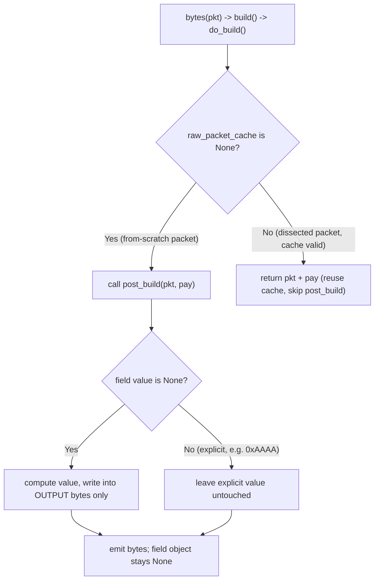

# How Scapy Computes & Caches Checksums (and the IP total‑length field) During Packet Building

> **Scope of this document.** This is an evidence‑backed, "under the hood" walkthrough of how Scapy fills in
> auto‑computed protocol fields — the **IP header checksum**, the **TCP checksum**, and the **IP total‑length
> field** — when you serialize a packet with `bytes(pkt)`. It answers six concrete questions (R1–R6) about
> checksum computation, caching, manual overrides, deep‑copy isolation, and length growth, and adds one edge
> section contrasting from‑scratch packets against dissected packets. Every claim is grounded in **both** a
> specific `file:line` reference **and** real reproduced runtime output (actual hex dumps + numeric values),
> and I explicitly mark statements as **OBSERVED** (seen in program output) or **INFERRED** (reasoned from the
> source, not directly printed).

---

## 1. Headline conclusions (TL;DR)

1. **Checksums are computed at build time by each layer's `post_build()`** and are written **only into the output
   byte string** — never back into the packet's field objects. So a from‑scratch packet's `chksum`/`len` fields
   stay `None` even after you call `bytes(pkt)`. *(R1, R4)*
2. **A from‑scratch packet is always recomputed on every `bytes()` call.** It never carries a byte cache
   (`raw_packet_cache is None` from construction), so `do_build()` always takes the `post_build()` branch. Mutating
   the payload therefore yields fresh checksums — Scapy does **not** hand back stale bytes here. *(R2)*
3. **A manual override wins whenever the field is non‑`None` at build time**, because each layer guards its
   computation with `if self.<field> is None:`. Setting the value **before** vs **after** the first build makes
   **no difference** — the field is never mutated by building, so the timing is irrelevant. *(R3 ≡ R4)*
4. **`copy.deepcopy(pkt)` produces a fully isolated clone**; mutating the copy's payload leaves the original's
   emitted bytes byte‑for‑byte unchanged. *(R5)*
5. **The IP total‑length field is auto‑recomputed on every build** when `len is None`, and it always matches the
   real byte count; growing the payload by 10 bytes grows the field by exactly 10. *(R6)*

---

## 2. Environment & methodology

### 2.1 Runtime (OBSERVED)

| Item | Value | Source |
|------|-------|--------|
| Scapy version | `2026.07.13` | `scapy.VERSION`, printed at runtime |
| Python version | `3.12.13` | `sys.version`, printed at runtime |
| Git HEAD (branch `scapy_0925ada48540`) | `0925ada485406684174d6f068dbd85c4154657b3` | `git rev-parse HEAD` |
| Declared interpreter support | `requires-python ">=3.7, <4"` | `pyproject.toml` |

> **Note on the Python minor version.** The runtime actually reports **`3.12.13`** (this is what I observed and
> report here per the run‑first discipline). It is the standard `3.12` series interpreter provisioned in the
> container; nothing in the checksum/length behavior depends on the patch level.

### 2.2 Canonical fixture (OBSERVED defaults)

All scenarios use the same from‑scratch fixture, built through Scapy's **real** entry point:

```python
from scapy.layers.inet import IP, TCP
from scapy.packet import Raw
pkt = IP()/TCP()/Raw(b"HELLO")
raw = bytes(pkt)          # the canonical build entry point
```

Deterministic defaults that make the output reproducible: IP `src=dst=127.0.0.1`, `id=1`, `ttl=64`,
`proto=6` (TCP); TCP `sport=20`, `dport=80`, `flags=0x02` (SYN), `window=8192`. These defaults are why the
emitted bytes are identical run‑to‑run.

### 2.3 How the evidence was produced

- A short throwaway observation script was written **outside** the repository tree (under
  `/tmp/scapy_investigation/`), run through the same interpreter/path the `run_scapy` launcher uses:

  ```bash
  PYTHONPATH="$(git rev-parse --show-toplevel)" python3 /tmp/scapy_investigation/probe.py
  ```

- The script was **run twice** and its output was **byte‑for‑byte identical** across both runs (verified by an
  identical SHA‑256 of the captured stdout) — so every value below is **stable**, not incidental.
- **Byte‑sensitive values (checksums) were verified two ways:** (a) read straight out of the `bytes()` output at
  the correct byte offset, **and** (b) independently recomputed with Scapy's own helpers
  (`checksum()` for the IP header, `in4_chksum()` for TCP) and confirmed to match.
- The repository was left **unchanged** (a clean `git status`); the only artifact is this document. Importing
  Scapy prints a cosmetic `CryptographyDeprecationWarning` from `scapy/layers/ipsec.py`; it does not affect build
  output and is silenced in the script for clean capture.

### 2.4 The 45‑byte fixture size (OBSERVED — explicit correction)

The total serialized size of `IP()/TCP()/Raw(b"HELLO")` is **45 bytes** = IP header (20) + TCP header (20) +
payload (5). This is directly confirmed by the emitted IP total‑length field `0x002d = 45` (bytes `[2:4]`). Any
statement of "46 bytes" is incorrect; the reproduced, self‑consistent value is **45**.

**Byte map of the canonical datagram (used for every offset callout in this document):**

```
offset  field
[0:20]  IP header
 [2:4]  IP total-length field   -> 002d = 45
 [10:12]IP header checksum      -> 7cc8
[20:40] TCP header
 [36:38]TCP checksum            -> ade5   (= IP header 20 + TCP checksum offset 16)
[40:45] payload "HELLO"         -> 48454c4c4f
```

---

## 3. Build‑pipeline primer (the path every scenario shares)

Serialization for **every** layer flows through one shared, layer‑agnostic pipeline; the per‑layer specifics
(checksum, length) live in each layer's `post_build()` override.

```
bytes(pkt)  ->  Packet.__bytes__   ->  build()   ->  do_build()   ->  post_build()
```

- **`Packet.__bytes__` returns `self.build()`** — `scapy/packet.py:592-594`.
- **`build()` = `do_build()` + `build_padding()` + `build_done()`** — `scapy/packet.py:746-756`.
- **`do_build()`** — `scapy/packet.py:724-740`. The decisive branch is at **`scapy/packet.py:737-740`**:

  ```python
  if self.raw_packet_cache is None:
      return self.post_build(pkt, pay)   # recompute auto fields
  else:
      return pkt + pay                   # reuse cached bytes, skip post_build
  ```

- **A from‑scratch packet always has `raw_packet_cache is None`** — it is initialized to `None` in
  `Packet.__init__` at **`scapy/packet.py:169`**. INFERRED consequence (confirmed by R1–R2 output):
  `post_build()` runs on **every** `bytes()` call for such packets, so auto fields are always freshly computed.

The two `post_build()` overrides that matter here:

- **`IP.post_build`** — `scapy/layers/inet.py:539-551`. Fills the length when unset (`if self.len is None:`,
  L545–547) and the header checksum when unset (`if self.chksum is None:`, L548–550, using `ck = checksum(p)`).
- **`TCP.post_build`** — `scapy/layers/inet.py:767-786`. Fills the TCP checksum when unset
  (`if self.chksum is None:`, L775; IPv4 path `ck = in4_chksum(socket.IPPROTO_TCP, self.underlayer, p)`,
  L776–778). The IPv6 branch at L779–781 exists but is **out of scope** (these questions are IPv4).
- The one's‑complement Internet checksum helper **`checksum()`** — `scapy/utils.py:496-504` — is used directly by
  `IP.post_build` and transitively (via `in4_chksum`, `scapy/layers/inet.py:692-704`) by `TCP.post_build`.



---

## R1 — Checksum computation on build

**Question.** Create a basic IP/TCP packet with a payload, leave the checksums unset, call `bytes()`, and report
the actual hex Scapy computes for **both** the IP header checksum and the TCP checksum.

**Exact command.**

```python
pkt = IP()/TCP()/Raw(b"HELLO")
raw = bytes(pkt)
```

**Complete observed output.**

```
BEFORE build: IP.chksum = None | TCP.chksum = None
BEFORE build: IP.len    = None
EMITTED HEX  : 4500002d0001000040067cc87f0000017f00000100140050000000000000000050022000ade5000048454c4c4f
TOTAL BYTES  : 45
IP  total-len field bytes[2:4]   = 002d = dec 45
IP  header  chksum bytes[10:12]  = 7cc8 = 0x7cc8
TCP checksum      bytes[36:38]   = ade5 = 0xade5
AFTER build : IP.chksum is None  = True | value = None
AFTER build : TCP.chksum is None = True | value = None
IP  independent recompute checksum(ip_hdr[10:12]=0) = 0x7cc8 MATCH
TCP independent recompute in4_chksum(seg[16:18]=0)  = 0xade5 MATCH
```

**Answers, by name (OBSERVED).**

- **IP header checksum = `0x7cc8`** — output bytes `[10:12]` = `7cc8`.
- **TCP checksum = `0xade5`** — output bytes `[36:38]` = `ade5`.
- Total datagram size = **45 bytes**; IP total‑length field = `0x002d` = **45**.
- **Both field objects remain `None` after the build** (`pkt.chksum is None → True`,
  `pkt[TCP].chksum is None → True`). The computed values live only in the emitted byte string.

**Independent byte‑level cross‑check (OBSERVED).** Reading the checksum out of the exact emitted bytes and
independently recomputing it with Scapy's own helpers agree in both cases:

- IP: zero output bytes `[10:12]`, then `checksum(ip_header)` → `0x7cc8` — **MATCH**.
- TCP: zero the TCP segment's checksum bytes `[16:18]`, then
  `in4_chksum(socket.IPPROTO_TCP, pkt[IP], segment)` → `0xade5` — **MATCH**.

**Mechanism (with `file:line`).**

- The pipeline `bytes → build → do_build` reaches `post_build` because the from‑scratch packet has
  `raw_packet_cache is None` — `scapy/packet.py:592-594, 746-756, 724-740` (branch at L737–740), cache init at
  `scapy/packet.py:169`.
- **IP header checksum:** `IP.post_build` runs `if self.chksum is None: ck = checksum(p)` and writes the two
  bytes at offset 10–11 — `scapy/layers/inet.py:548-550`. The helper `checksum()` is the standard one's‑complement
  Internet checksum — `scapy/utils.py:496-504`.
- **TCP checksum:** `TCP.post_build` runs `if self.chksum is None:` and, for an IP underlayer, computes
  `ck = in4_chksum(socket.IPPROTO_TCP, self.underlayer, p)`, writing TCP bytes 16–17 —
  `scapy/layers/inet.py:775-778`. `in4_chksum` builds the IPv4 pseudo‑header and calls `checksum()` —
  `scapy/layers/inet.py:692-704`.

**Reasoning.** The two `chksum` fields default to `None` (`scapy/layers/inet.py:533` for IP,
`scapy/layers/inet.py:763` for TCP), which is Scapy's sentinel meaning "compute this for me." Because the packet
was built from scratch (no cache), `do_build` calls `post_build`, whose `is None` guards fire and compute both
checksums into the output. Crucially, the computed values are spliced into the local byte string `p` and returned;
they are **never assigned back** to `self.chksum`. INFERRED (and confirmed by the "AFTER build" lines above): that
is exactly why the field objects are still `None` after a successful build — a fact that becomes decisive in R3/R4.

---

## R2 — Cache behavior on payload mutation (full before/after)

**Question.** After mutating one byte of the payload and calling `bytes()` again, does Scapy produce fresh
checksums or return previously cached bytes? (Full before/after hex, not just diffs.)

**Exact commands.**

```python
pkt = IP()/TCP()/Raw(b"HELLO")
before = bytes(pkt)
pkt[Raw].load = b"HELLP"     # flip the last byte 'O' (0x4f) -> 'P' (0x50)
after  = bytes(pkt)
```

**Complete observed output.**

```
BEFORE HEX : 4500002d0001000040067cc87f0000017f00000100140050000000000000000050022000ade5000048454c4c4f
caches BEFORE: IP=None TCP=None Raw=b'HELLO'
command    : pkt[Raw].load = b'HELLP'
caches AFTER assignment: IP=None TCP=None Raw=None
AFTER  HEX : 4500002d0001000040067cc87f0000017f00000100140050000000000000000050022000ace5000048454c4c50
IP  chksum before=0x7cc8 after=0x7cc8 UNCHANGED
TCP chksum before=0xade5 after=0xace5 RECOMPUTED
payload tail before=48454c4c4f after=48454c4c50
caches after 2nd build: IP=None TCP=None Raw=None
```

**Answer (OBSERVED).** Scapy produces **fresh checksums** — it does **not** return stale/cached bytes.

- **TCP checksum was RECOMPUTED: `0xade5` → `0xace5`** (bytes `[36:38]`).
- **IP header checksum is UNCHANGED at `0x7cc8`** (bytes `[10:12]`).
- Payload tail changed `48454c4c4f` (`"HELLO"`) → `48454c4c50` (`"HELLP"`).

**Observed cache states — a precise, run‑first correction.** The per‑layer caches were:

- `IP.raw_packet_cache = None` and `TCP.raw_packet_cache = None` **throughout** — this is what actually governs
  checksum recomputation.
- `Raw.raw_packet_cache = b'HELLO'` **initially** (i.e., **not** `None`), becoming `None` after the `load`
  assignment.

INFERRED cause (verified with a focused probe): `Raw(b"HELLO")` passes the bytes **positionally** as the `_pkt`
argument, so the `Raw` layer is created by **dissection**, and dissection populates `raw_packet_cache` at
`scapy/packet.py:1019` (with `raw_packet_cache_fields = {}` since `load` is not a tracked mutable field). By
contrast, `Raw(load=b"HELLO")` is a true from‑scratch layer with `raw_packet_cache = None`. This detail is
**immaterial to the answer**: the checksums live on the `IP` and `TCP` layers, whose caches are `None`, so their
`post_build` always runs. As a control, `IP()/TCP()/Raw(load=b"HELLO")` (where the `Raw` cache starts `None`)
recomputes the TCP checksum `ade5 → ace5` **identically**.

**Mechanism (with `file:line`).**

- Assigning `pkt[Raw].load = ...` routes through `__setattr__ → setfieldval`, which clears the layer's cache
  (`self.raw_packet_cache = None`, `self.raw_packet_cache_fields = None`) — `scapy/packet.py:494-502` and
  `scapy/packet.py:485-486`. That is why `Raw.raw_packet_cache` flips to `None` after the assignment.
- **The decisive reason checksums are always fresh, however, is not invalidation** but that the `IP`/`TCP` layers
  **never had a cache** (`raw_packet_cache is None` from `scapy/packet.py:169`), so `do_build` always takes the
  `post_build` branch — `scapy/packet.py:737-740`. Each build re‑runs `IP.post_build`
  (`scapy/layers/inet.py:539-551`) and `TCP.post_build` (`scapy/layers/inet.py:767-786`).

**Reasoning — why IP stays the same but TCP changes.** The payload byte is part of the **TCP** checksum (the TCP
checksum covers the IPv4 pseudo‑header **plus the TCP segment**, which includes the payload — `in4_chksum`,
`scapy/layers/inet.py:692-704`), so flipping a payload byte changes the TCP checksum. The **IP header** checksum
covers only the 20‑byte IP header (`checksum(p)` over the header in `IP.post_build`,
`scapy/layers/inet.py:548-550`); none of the IP header bytes changed, so the IP checksum is identical. This is
consistent with the observation that `0x7cc8` is unchanged while `0xade5 → 0xace5`.


---

## R3 — Manual override BEFORE build

**Question.** Force the IP checksum to `0xAAAA` **before** the packet is ever built. Does that value survive into
the final bytes, or is it overwritten?

**Exact command.**

```python
pkt = IP(chksum=0xAAAA)/TCP()/Raw(b"HELLO")
raw = bytes(pkt)
```

**Complete observed output.**

```
BEFORE build: IP.chksum = 43690 (0xaaaa)
EMITTED HEX : 4500002d000100004006aaaa7f0000017f00000100140050000000000000000050022000ade5000048454c4c4f
IP  chksum bytes[10:12] = aaaa
TCP chksum bytes[36:38] = ade5 (still auto-computed)
AFTER build : IP.chksum = 43690
```

**Answer (OBSERVED).** The explicit value **survives** verbatim.

- IP header checksum bytes `[10:12]` = **`aaaa`** (compare R1's `7cc8`).
- The field is retained: `pkt.chksum = 43690` (`0xAAAA`) both before **and** after the build.
- The **TCP** checksum is still auto‑computed (`ade5`) because only the IP `chksum` was overridden.

**Mechanism (with `file:line`).** `IP.post_build` guards its computation with `if self.chksum is None:` —
`scapy/layers/inet.py:548`. Here `self.chksum` is `0xAAAA` (non‑`None`), so the guard is **skipped**: no
recomputation happens, and the field's value is serialized as‑is by the normal field machinery. The only place
the header checksum bytes would be rewritten is inside that skipped block (L549–550), so the user's `0xAAAA`
reaches the wire untouched.

**Reasoning.** `None` is Scapy's "auto" sentinel; any explicit value opts out of auto‑computation. Because
`0xAAAA` was set at construction time, the field held a real value throughout the build, the `is None` guard never
fired, and the byte‑splice that would overwrite offsets 10–11 never executed.

---

## R4 — Manual override AFTER build (stateful before/during/after)

**Question.** Build the packet **first**, then assign `0xAAAA`, and rebuild. Does the behavior differ from R3?

**Exact commands.**

```python
pkt  = IP()/TCP()/Raw(b"HELLO")
raw1 = bytes(pkt)     # first build (no override yet)
pkt.chksum = 0xAAAA   # override AFTER building
raw2 = bytes(pkt)     # rebuild
```

**Complete observed output.**

```
after FIRST build : IP chksum bytes[10:12] = 7cc8
after FIRST build : pkt.chksum is None = True | value = None
command    : pkt.chksum = 0xAAAA
after ASSIGN+rebuild : IP chksum bytes[10:12] = aaaa
R3(before) == R4(after) override result: True -> R3 identical to R4: True
```

**Answer (OBSERVED) — reported before / during / after.**

- **Before override (after the first build):** IP checksum bytes = `7cc8` (auto‑computed), and — the critical
  observation — **`pkt.chksum is None` is still `True`**. The first build did **not** write the computed checksum
  back into the field.
- **During:** `pkt.chksum = 0xAAAA` sets the field to an explicit value.
- **After override (rebuild):** IP checksum bytes `[10:12]` = **`aaaa`** — **identical to R3**.

**Conclusion: R3 ≡ R4.** The override result is the same whether `0xAAAA` is set before the packet is ever built
or after a build has already happened.

**Mechanism (with `file:line`).** Same guard as R3: `if self.chksum is None:` at `scapy/layers/inet.py:548`.
The reason timing cannot matter is that `post_build` writes the computed checksum **only into the output byte
string** (L549–550) and **never assigns it back** to `self.chksum`. Therefore, after **any** number of builds, an
auto field stays `None` (as the "after FIRST build" line proves), so a later assignment of `0xAAAA` behaves
exactly like setting it before the first build.

**Reasoning.** Building is a **pure serialization** with respect to the auto fields: it reads `self.chksum`,
computes into bytes if it is `None`, and returns bytes — it does not mutate the packet's field state. Because the
field's value at *the moment of each build* is the only thing the guard inspects, and building never changes that
value, the before/after distinction collapses. This is the single most important insight linking R1, R3, and R4:
**auto‑computed values live in the emitted bytes, not in the packet object.**


---

## R5 — Deep‑copy isolation

**Question.** Build a packet to bytes, deep‑copy it, mutate the copy's payload, and verify the original is not
corrupted — showing the original's bytes before and after the copy is modified.

**Exact commands.**

```python
pkt = IP()/TCP()/Raw(b"HELLO")
orig_before = bytes(pkt)
cp = copy.deepcopy(pkt)
cp[Raw].load = b"WORLD"     # mutate the COPY only
orig_after = bytes(pkt)
cp_bytes = bytes(cp)
```

**Complete observed output.**

```
pkt[Raw] is cp[Raw] : False
command    : cp[Raw].load = b'WORLD'
ORIG before mutate : 4500002d0001000040067cc87f0000017f00000100140050000000000000000050022000ade5000048454c4c4f
ORIG after  mutate : 4500002d0001000040067cc87f0000017f00000100140050000000000000000050022000ade5000048454c4c4f
orig_before == orig_after : True
COPY bytes         : 4500002d0001000040067cc87f0000017f00000100140050000000000000000050022000a3db0000574f524c44
COPY TCP chksum bytes[36:38] = a3db | COPY IP chksum bytes[10:12] = 7cc8
COPY payload tail  : 574f524c44
```

**Answer (OBSERVED).** The original is **fully isolated**; mutating the copy does not corrupt it.

- `orig_before == orig_after` → **True**. The original's emitted bytes are byte‑for‑byte identical before and
  after the copy is mutated (both end `...ade5000048454c4c4f`, i.e. TCP `ade5`, payload `"HELLO"`).
- `pkt[Raw] is cp[Raw]` → **False** — the copy's payload is a **distinct object**, not a shared reference.
- The **copy diverges** as expected: payload `574f524c44` (`"WORLD"`), TCP checksum recomputed to **`0xa3db`**,
  IP header checksum still `7cc8` (the IP header bytes are unchanged, exactly as in R2's reasoning).

**Mechanism (with `file:line`).** `copy.deepcopy(pkt)` dispatches to `Packet.__deepcopy__`, which simply returns
`self.copy()` — `scapy/packet.py:239-244`. `copy()` — `scapy/packet.py:407-426` — rebuilds a fresh instance,
copies the field dicts, and, decisively, **recursively clones the entire payload chain** with
`clone.payload = self.payload.copy()` at **`scapy/packet.py:422`** (then re‑links the underlayer). Because every
layer down the chain is cloned rather than aliased, the copy shares no mutable state with the original.

**Reasoning.** Isolation is a property of the recursive `copy()`: each layer's `copy()` calls the payload's
`copy()`, so the `Raw` layer under `cp` is a separate object from the one under `pkt` (hence
`pkt[Raw] is cp[Raw]` is `False`). Mutating `cp[Raw].load` touches only the clone's field dict; the original's
`Raw.load` is untouched, so re‑serializing `pkt` reproduces the original bytes exactly. The copy's different TCP
checksum (`a3db`) is just R1/R2 behavior applied to the clone: a from‑scratch‑style layer with `chksum is None`
recomputes over its new payload on build.

---

## R6 — IP total‑length field on growth

**Question.** Build a packet with a small payload, append ten more bytes, rebuild, and report the decimal value
of the IP length field, the actual total byte count, and whether they match or diverge.

**Exact commands.**

```python
pkt = IP()/TCP()/Raw(b"HELLO")
raw = bytes(pkt)                       # 5-byte payload
pkt[Raw].load += b"0123456789"         # append 10 bytes -> 15-byte payload
raw = bytes(pkt)                       # rebuild
```

**Complete observed output.**

```
5-byte payload : IP len field bytes[2:4] = dec 45 | actual bytes = 45 | MATCH = True
pkt.len after build (5B)  is None = True
command    : pkt[Raw].load += b'0123456789'  (payload now 15 bytes)
15-byte payload: IP len field bytes[2:4] = dec 55 | actual bytes = 55 | MATCH = True
pkt.len after build (15B) is None = True
GROWN HEX : 450000370001000040067cbe7f0000017f00000100140050000000000000000050022000a3d6000048454c4c4f30313233343536373839
```

**Answer (OBSERVED) — before and after growth.**

| State | IP `len` field (dec) | Actual byte count | Match? |
|-------|----------------------|-------------------|--------|
| 5‑byte payload  | **45** | **45** | **MATCH** |
| 15‑byte payload | **55** | **55** | **MATCH** |

- Growing the payload by exactly 10 bytes grew the IP length field by exactly 10 (45 → 55), and it always equals
  the real datagram size — **they match, they do not diverge**.
- `pkt.len` remains `None` after both builds — like the checksums, the length is computed into the **output bytes
  only**, never written back into the field.
- In the grown datagram, the length field bytes `[2:4]` are `0037` = 55, and the IP header checksum recomputed to
  `7cbe` (INFERRED: because the length bytes are part of the IP header, changing them changes the header checksum —
  the same coupling seen in R2, in reverse).

**Mechanism (with `file:line`).** `IP.post_build` fills the length when it is unset:

```python
if self.len is None:
    tmp_len = len(p) + len(pay)
    p = p[:2] + struct.pack("!H", tmp_len) + p[4:]
```

— `scapy/layers/inet.py:545-547` (the field defaults to `None` at `scapy/layers/inet.py:527`). `len(p)` is the IP
header length and `len(pay)` is everything IP carries (the TCP header + payload), so `tmp_len` is the full
datagram size, written to bytes 2–3.

**Reasoning.** Because `len` defaults to `None` and the packet is built from scratch (no cache), `post_build` runs
on every `bytes()` call and recomputes `len(p) + len(pay)` from the **current** payload. Appending 10 bytes makes
`len(pay)` 10 larger, so the emitted length grows by 10 and stays exactly equal to the physical byte count. As
with checksums, the field object is never mutated, which is why `pkt.len` reads `None` after each build.


---

## Edge — cache scope: from‑scratch vs dissected packets (for completeness)

The `raw_packet_cache` exists and *is* used to skip recomputation — but only for packets **parsed from bytes**,
which is why it never governs the from‑scratch scenarios in R1–R6. This section makes that contrast explicit.

**Exact commands.**

```python
fs = IP()/TCP()/Raw(b"HELLO")            # from scratch
_ = bytes(fs)
rawbytes = bytes(IP()/TCP()/Raw(b"HELLO"))
dis = IP(rawbytes)                        # dissected (parsed from bytes)
```

**Complete observed output.**

```
from-scratch: raw_packet_cache BEFORE bytes() is None = True
from-scratch: raw_packet_cache AFTER  bytes() is None = True
dissected IP(raw): raw_packet_cache is None = False
dissected IP(raw): raw_packet_cache head hex = 4500002d0001
dissected IP(raw): raw_packet_cache_fields keys = ['flags', 'options']
```

**Answer (OBSERVED).**

- A **from‑scratch** packet has `raw_packet_cache is None` **both before and after** `bytes()` — building never
  creates a cache. This is why `do_build` always recomputes.
- A **dissected** packet (`IP(rawbytes)`) has a **populated** cache: `raw_packet_cache is None → False`, with head
  bytes `4500002d0001`, and `raw_packet_cache_fields = ['flags', 'options']` (the mutable fields Scapy tracks so it
  knows when to invalidate).

**Mechanism (with `file:line`).**

- Dissection populates the cache: `do_dissect` records tracked mutable fields
  (`f.islist or f.holds_packets or f.ismutable`) at `scapy/packet.py:1015-1017` and stores the raw bytes at
  `scapy/packet.py:1019` (region `scapy/packet.py:1002-1021`).
- On a later build, `self_build` checks each tracked field; if one changed it **discards** the cache
  (`raw_packet_cache = None`) and rebuilds — `scapy/packet.py:678-713`. `clear_cache` clears the whole chain
  recursively — `scapy/packet.py:664-676`. When the cache is still valid, `do_build` returns `pkt + pay` and
  **skips `post_build`** — `scapy/packet.py:737-740`.

**Reasoning / why this matters to R1–R6.** The user's questions are all about **from‑scratch** packets. Such
packets never have a cache, so the `else` branch of `do_build` (reuse cache) is unreachable and `post_build`
runs every time — hence checksums and length are always freshly computed (R1, R2, R6) and the `is None` guards
alone decide override behavior (R3, R4). The cache is real and does short‑circuit `post_build`, **but only for
dissected packets whose tracked fields have not changed** — a regime outside the six scenarios. (The `Raw` layer's
initial cache noted in R2 is the one dissection‑style exception, and it is immaterial because `Raw` computes no
checksum.)

---

## Coverage note (closing checklist)

Re‑reading the original six questions and ticking each off by name:

- [x] **R1 — Checksum on build.** IP header checksum **`0x7cc8`** (bytes 10–11) and TCP checksum **`0xade5`**
  (bytes 36–37), both independently recomputed to MATCH the emitted bytes; both `chksum` fields remain `None`
  after build. `scapy/layers/inet.py:548-550, 775-778`; `scapy/utils.py:496-504`.
- [x] **R2 — Cache on payload mutation.** Full before/after hex shown; TCP checksum **`ade5 → ace5`
  (recomputed)**, IP checksum **`7cc8` unchanged**; fresh (not stale) bytes. Observed caches: IP/TCP `None`
  throughout, `Raw` `b'HELLO'` → `None` (positional‑`_pkt` dissection, immaterial). `scapy/packet.py:737-740,
  485-486, 169`.
- [x] **R3 — Override before build.** `IP(chksum=0xAAAA)` → emitted bytes 10–11 = **`aaaa`** (survives), field
  retained `0xAAAA`. Guard `if self.chksum is None:` skipped — `scapy/layers/inet.py:548`.
- [x] **R4 — Override after build.** Field is **`None` after the first build**; post‑assignment rebuild = **`aaaa`**
  → **R3 ≡ R4**, because `post_build` writes to output bytes only, never back to the field —
  `scapy/layers/inet.py:548`.
- [x] **R5 — Deep‑copy isolation.** `orig_before == orig_after` → **True** (original uncorrupted);
  `pkt[Raw] is cp[Raw]` → **False**; copy diverges (payload `WORLD`, TCP **`0xa3db`**). Recursive clone at
  `scapy/packet.py:422` (`__deepcopy__`/`copy` at `239-244, 407-426`).
- [x] **R6 — IP length on growth.** `len` field **45 = 45 bytes**, then **55 = 55 bytes** (match, no divergence);
  `pkt.len` stays `None`. `scapy/layers/inet.py:545-547`.
- [x] **Environment.** Scapy `2026.07.13`, Python `3.12.13`, HEAD `0925ada485406684174d6f068dbd85c4154657b3`;
  values reproduced and byte‑for‑byte stable across two runs.
- [x] **Fixture size.** Canonical `IP()/TCP()/Raw(b"HELLO")` = **45 bytes** (IP len field `0x002d = 45`).
- [x] **Edge — cache scope.** From‑scratch cache `None`; dissected cache populated (head `4500002d0001`, tracked
  fields `['flags','options']`). `scapy/packet.py:1002-1021, 678-713, 664-676`.

**One‑line summary.** Scapy computes checksums and the IP length inside each layer's `post_build()` and writes
them **into the emitted bytes only**; from‑scratch packets have no byte cache and therefore recompute on every
`bytes()` call, while an explicit (non‑`None`) field value bypasses computation regardless of when it was set.

