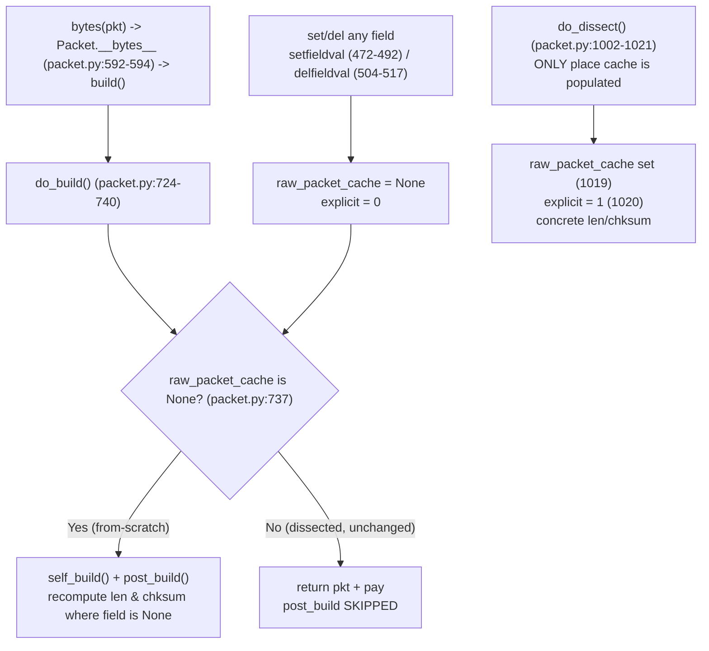

# How Scapy Computes and Caches the IP Checksum, the TCP Checksum, and the IP `len` Field

This document answers, from **observed runtime behavior**, how Scapy computes and caches three
values while building packets:

1. the **IP header checksum** (`IP.chksum`),
2. the **TCP checksum** (`TCP.chksum`), and
3. the **IP total-length field** (`IP.len`).

It addresses six scenarios (**R1–R6**), the underlying **fresh-vs-cached mechanism**, and one
**notable edge case** (a stale checksum after dissection). Every value below was produced by
executing the real serialization entry point — `bytes(pkt)` → `Packet.build()` — through temporary
scripts, capturing the complete unedited output, and confirming it is **byte-identical across two
runs**. Each answer leads with the direct result, shows the exact command and full output (complete
hex, never elided), cites the governing `file:line` and method, and explains the cause → effect.

---

## Environment & Commands

| Item | Observed value |
|------|----------------|
| Repository root (`pwd`) | `/tmp/blitzy/scapy/blitzy-e31ec6e3-3ad3-4c14-a9fa-9da728c3c5b3_670b05` |
| Interpreter (`python3 --version`) | **CPython 3.13.7** |
| Source branch (embedded in this file's name) | `scapy_0925ada48540` |
| Current checkout branch (`git branch --show-current`) | `blitzy-e31ec6e3-3ad3-4c14-a9fa-9da728c3c5b3` |
| Baseline / source commit under investigation (parent of the deliverable commit; `git rev-parse --short 0925ada485406684174d6f068dbd85c4154657b3`) | `0925ada4` |
| Clean tree at start (`git status --porcelain`) | empty |
| `scapy.VERSION` | **`2026.07.08`** |
| `scapy.__file__` | `/tmp/blitzy/scapy/blitzy-e31ec6e3-3ad3-4c14-a9fa-9da728c3c5b3_670b05/scapy/__init__.py` (in-repo) |
| `cryptography` version | `43.0.0` |

**Exact invocation form used for every probe** (run from the repository root so the *in-repo* Scapy
is imported, not any site-packages copy):

```bash
PYTHONPATH=. python3 /tmp/probes/<script>.py
```

Import origin was verified with `PYTHONPATH=. python3 -c "import scapy; print(scapy.__file__)"`,
which points into the repository tree shown above.

### Honest notes where observed reality differs from prior claims

These are reported exactly as observed (the "run first, then write" methodology exists precisely to
catch this kind of drift):

- **Interpreter version.** The interpreter is **CPython 3.13.7**, not the 3.12.3 named in the
  planning text. Reported as observed.

- **`scapy.VERSION` is computed dynamically, and equals `2026.07.08`.** There is no `scapy/VERSION`
  file and no usable git tag in this checkout, so `_version()` falls through to its last-resort
  branch and derives the version from the modification time of `scapy/__init__.py`:
  `datetime.datetime.utcfromtimestamp(os.path.getmtime(__file__))` at `scapy/__init__.py:160`, then
  `d.strftime('%Y.%m.%d')` at `scapy/__init__.py:161`; `VERSION` is assigned at
  `scapy/__init__.py:169`. The value therefore reflects the file's mtime and is **`2026.07.08`** here
  (an earlier planning note said `2026.07.07`; the observed value is `2026.07.08`).

- **Import warning: the TripleDES `CryptographyDeprecationWarning` *does* appear here.** A default
  import — `PYTHONPATH=. python3 -c "import scapy.all"` (no `-W`) — emits **two**
  `CryptographyDeprecationWarning` lines on **stderr**, from `scapy/layers/ipsec.py:573` and
  `scapy/layers/ipsec.py:577`:

  ```
  /tmp/blitzy/scapy/blitzy-e31ec6e3-3ad3-4c14-a9fa-9da728c3c5b3_670b05/scapy/layers/ipsec.py:573: CryptographyDeprecationWarning: TripleDES has been moved to cryptography.hazmat.decrepit.ciphers.algorithms.TripleDES and will be removed from this module in 48.0.0.
    cipher=algorithms.TripleDES,
  /tmp/blitzy/scapy/blitzy-e31ec6e3-3ad3-4c14-a9fa-9da728c3c5b3_670b05/scapy/layers/ipsec.py:577: CryptographyDeprecationWarning: TripleDES has been moved to cryptography.hazmat.decrepit.ciphers.algorithms.TripleDES and will be removed from this module in 48.0.0.
    cipher=algorithms.TripleDES,
  ```

  This warning is a function of the installed `cryptography` version (**43.0.0** here, which has
  deprecated `TripleDES` in that module). It is **benign and unrelated to IP/TCP checksum behavior**.
  It appears only on **stderr**; the probe **stdout** captured below is clean. Under
  `python3 -W all`, one additional, unrelated `DeprecationWarning` about
  `datetime.datetime.utcfromtimestamp()` surfaces from `scapy/__init__.py:160` (the very line that
  computes `VERSION`).

**Stability.** Every scenario was executed at least twice; the stdout of each probe was
**byte-identical across runs** (verified with `md5sum`). The values reported below are those stable
observations.

**Independent checksum cross-check.** Beyond Scapy's own re-dissection (shown in R1), the R1 wire
bytes were fed to a **hand-rolled** RFC-793 / RFC-1071 one's-complement implementation — independent
of `scapy.utils.checksum` — to validate both emitted checksums against the exact emitted bytes. For
each checksum the probe (a) recomputes it over the bytes with the checksum field zeroed and (b)
verifies that folding the bytes **as emitted** yields `0x0000` (a valid checksum makes the whole
covered region sum to all-ones, whose one's complement is zero).

**Exact command.**

```bash
PYTHONPATH=. python3 /tmp/probes/r1_crosscheck.py
```

**Complete, unedited output.**

```
R1 full_hex             = 4500002d00010000400666c80a0000010a0000020014005000000000000000005002200037a5000068656c6c6f
IP recompute (zeroed)   = 0x66c8
IP verify  (as emitted) = 0x0000
TCP seg length          = 25
TCP recompute (zeroed)  = 0x37a5
TCP verify (as emitted) = 0x0000
```

The independently recomputed **IP checksum `0x66c8`** and **TCP checksum `0x37a5`** match Scapy's
emitted values exactly, and folding the bytes **as emitted** yields `0x0000` for both — so both
emitted checksums are mathematically valid over the exact emitted bytes. This output was
**byte-identical across two runs** (`md5sum` = `9ed8b680f9bd29c27aa9dd52d4a1e04e`).

**Byte offsets used throughout** (IPv4 header is 20 bytes at `ihl=5`):

| Field | Absolute byte offset |
|-------|----------------------|
| IP `len` | bytes **2–3** |
| IP header checksum | bytes **10–11** |
| TCP checksum | bytes **36–37** (IP 20 bytes + TCP-relative offset 16) |
| Payload start | byte **40** |

**Base packet** (unless a scenario states otherwise). Both `src` and `dst` are set explicitly so no
route-dependent source-address selection can perturb the bytes:

```python
IP(dst='10.0.0.2', src='10.0.0.1')/TCP()/Raw(load=b'hello')
```

---

## Direct-answer summary

| # | Question | Direct answer | Key observed values |
|---|----------|---------------|---------------------|
| **R1** | Build IP/TCP/payload without setting checksums, call `bytes()`; what are the IP and TCP checksums? | Scapy computes **both** checksums **and** `len` into the **wire bytes**; the Python fields stay `None`. | IP `chksum` = `0x66c8`, TCP `chksum` = `0x37a5`, IP `len` = `45` (= 45 actual bytes). |
| **R2** | After changing a payload byte and calling `bytes()` again — fresh checksums or the same cached bytes? | **Fresh recompute.** From-scratch packets are never byte-cached, so every `bytes()` recomputes. | TCP `chksum` `0x37a5` → `0x57a5`; IP `chksum` **unchanged** `0x66c8` (IP header does not cover payload); `len` unchanged `45`. Caches stay `None`. |
| **R3** | Force IP `chksum = 0xAAAA` **before** ever building — does it survive? | **Yes, it survives** verbatim into the wire bytes. | Wire bytes 10–11 = `aaaa`; field `pkt[IP].chksum = 0xaaaa`. |
| **R4** | Build first, **then** assign `0xAAAA` and rebuild — different behavior (the "twist")? | **No twist — identical to R3.** The forced value still survives to `aaaa`. | STEP1 bytes 10–11 = `66c8` (field stays `None`); STEP2 bytes 10–11 = `aaaa` (field `0xaaaa`). STEP2 bytes == R3 bytes exactly. |
| **R5** | Build to bytes, deep-copy, modify the copy's payload — is the original corrupted? | **No.** The original is untouched; the copy diverges independently. | Original stays 45 bytes / IP `0x66c8` / TCP `0x37a5`; copy becomes 47 bytes / IP `0x66c6` / TCP `0x5d88`. `orig_unchanged = True`. |
| **R6** | Build small payload, add 10 bytes, rebuild — does IP `len` match the actual size? | **Yes — it matches at both sizes; no discrepancy.** | Small: `len` `45` = 45 bytes. Grown (+10): `len` `55` = 55 bytes. IP `chksum` recomputes `0x66c8` → `0x66be`. |
| **Mechanism** | When are values cached vs recomputed? | `raw_packet_cache` is populated **only during dissection**; from-scratch builds recompute on **every** call. Per-field auto-compute is gated **separately** by an `is None` guard. | From-scratch: cache `None` before **and** after `bytes()`, two builds identical. Dissected: cache set, `explicit = 1`, concrete `len`/`chksum`. |

---

## The fresh-vs-cached mechanism (the core of the answer)

**Direct answer.** There are **two independent gates**, and conflating them is the usual source of
confusion:

1. **A whole-packet byte cache, `raw_packet_cache`.** It is populated **only during dissection**
   (parsing raw bytes into a packet). A packet **built from scratch** never populates it, so such a
   packet **recomputes its bytes on every `bytes()` call** — there is no "same cached bytes" to
   return.
2. **A per-field auto-computation guard, `if self.<field> is None:`.** Independently of the byte
   cache, each of `IP.len`, `IP.chksum`, and `TCP.chksum` is computed **only when that field is
   `None`**. A concrete value (whether you set it, or dissection populated it) **suppresses**
   recomputation of that one field.

### Exact command and complete output

```bash
PYTHONPATH=. python3 /tmp/probes/mechanism.py
```

```
FROM-SCRATCH packet
  cache before bytes() = None | explicit = 0
  cache after  bytes() = None | explicit = 0
  two builds identical = True
DISSECTED packet IP(raw)
  raw_packet_cache set = True
  explicit             = 1
  concrete IP.len      = 45
  concrete IP.chksum   = 0x66c8
  concrete TCP.chksum  = 0x37a5
```

### Governing code (`file:line` + method)

- `bytes(pkt)` calls **`Packet.__bytes__`** at `scapy/packet.py:592-594`, whose body is
  `return self.build()` (`scapy/packet.py:594`) — this is the real entry point.
- **`Packet.build`** at `scapy/packet.py:746-756` runs `do_build()` → `build_padding()` →
  `build_done()`.
- **`Packet.do_build`** at `scapy/packet.py:724-740` contains the **build-vs-cache decision** at
  `scapy/packet.py:737`:
  ```python
  if self.raw_packet_cache is None:
      return self.post_build(pkt, pay)   # recompute (len/chksum where field is None)
  else:
      return pkt + pay                   # cached bytes returned; post_build SKIPPED
  ```
- **`Packet.do_dissect`** at `scapy/packet.py:1002-1021` is the **only** place the byte cache is
  populated: it writes concrete field values (`self.fields[f.name] = fval`,
  `scapy/packet.py:1018`), sets `self.raw_packet_cache = _raw[:-len(s)] if s else _raw`
  (`scapy/packet.py:1019`), and `self.explicit = 1` (`scapy/packet.py:1020`).
- Mutating any field via **`Packet.setfieldval`** (`scapy/packet.py:472-492`) resets
  `explicit = 0` (`:484`), `raw_packet_cache = None` (`:485`),
  `raw_packet_cache_fields = None` (`:486`), and `wirelen = None` (`:487`). Deleting a field via
  **`Packet.delfieldval`** (`scapy/packet.py:504-517`) performs the same resets (`:508-511`).
- The per-field guards live in **`IP.post_build`** (`scapy/layers/inet.py:539-551`) and
  **`TCP.post_build`** (`scapy/layers/inet.py:767-786`) — see the scenario sections below.

### Cause → effect

- A **from-scratch** packet starts with `raw_packet_cache is None` and `explicit = 0`; the observed
  output shows the cache is `None` **before and after** `bytes()`. So `do_build`'s guard at
  `scapy/packet.py:737` is always true → `post_build` runs → `len`/`chksum` recompute over the
  current bytes. Two consecutive builds are byte-identical because the inputs are identical, **not**
  because bytes were cached.
- A **dissected** packet (`IP(raw)`) has `raw_packet_cache` set and `explicit = 1`, and its
  `len`/`chksum` are **concrete** (populated from the wire). The byte cache short-circuits rebuilds
  *until* a field mutation invalidates it (via `setfieldval`/`delfieldval`).



---

## R1 — Basic checksum computation

**Direct answer.** When you build `IP()/TCP()/Raw(...)` without setting the checksum fields and call
`bytes()`, Scapy computes **both** checksums and the IP length and writes them **into the emitted
wire bytes**: the **IP header checksum is `0x66c8`** (bytes 10–11), the **TCP checksum is `0x37a5`**
(bytes 36–37), and **IP `len` is `45`** (bytes 2–3). Crucially, the Python fields are **not** written
back — after `bytes()`, `pkt[IP].len`, `pkt[IP].chksum`, and `pkt[TCP].chksum` all remain `None`. The
computed values live only in the byte string, which is confirmed by re-dissecting those bytes.

**Exact command.**

```bash
PYTHONPATH=. python3 /tmp/probes/r1_basic.py
```

**Complete, unedited output.**

```
scapy.VERSION           = 2026.07.08
full_hex                = 4500002d00010000400666c80a0000010a0000020014005000000000000000005002200037a5000068656c6c6f
byte_count              = 45
IP.len   (bytes 2-3)    = 45
IP.chksum(bytes 10-11)  = 0x66c8
TCP.chksum(bytes 36-37) = 0x37a5
field pkt[IP].len       = None
field pkt[IP].chksum    = None
field pkt[TCP].chksum   = None
redissect IP.len        = 45
redissect IP.chksum     = 0x66c8
redissect TCP.chksum    = 0x37a5
```

Reading the values straight out of the 45-byte `full_hex`:

- bytes 2–3 = `002d` = **45** → IP `len`.
- bytes 10–11 = `66c8` → **IP header checksum `0x66c8`**.
- bytes 36–37 = `37a5` → **TCP checksum `0x37a5`**.
- byte 40 onward = `68656c6c6f` = `hello` → the payload.

**Citations (method + `file:line`).**

- IP `len` and IP `chksum` are written by **`IP.post_build`** at `scapy/layers/inet.py:539-551`:
  `if self.len is None:` (`:545`) computes `tmp_len = len(p) + len(pay)` (`:546`) and writes it at IP
  bytes 2–3 via `p[:2] + struct.pack("!H", tmp_len) + p[4:]` (`:547`); `if self.chksum is None:`
  (`:548`) computes `ck = checksum(p)` (`:549`) and writes it at IP bytes 10–11 via
  `p[:10] + chb(ck >> 8) + chb(ck & 0xff) + p[12:]` (`:550`).
- The TCP checksum is written by **`TCP.post_build`** at `scapy/layers/inet.py:767-786`:
  `if self.chksum is None:` (`:775`) and `isinstance(self.underlayer, IP)` (`:776`) →
  `ck = in4_chksum(socket.IPPROTO_TCP, self.underlayer, p)` (`:777`), written at TCP bytes 16–17
  (absolute 36–37) via `p[:16] + struct.pack("!H", ck) + p[18:]` (`:778`).
- **`in4_chksum`** at `scapy/layers/inet.py:692-704` builds the RFC-793 IPv4 pseudo-header
  (`in4_pseudoheader`, `:703`) and returns `checksum(psdhdr + p)` (`:704`).
- The arithmetic is the standard 16-bit one's-complement sum in **`checksum`** at
  `scapy/utils.py:496-504` (`s = sum(array.array("H", pkt))`, fold carries twice, bitwise-NOT, endian
  transform, mask `& 0xffff`).
- The default `None` values that arm the guards are the field definitions `ShortField("len", None)`
  (`scapy/layers/inet.py:527`), `XShortField("chksum", None)` for IP (`:533`), and
  `XShortField("chksum", None)` for TCP (`:763`).

**Cause → effect.** The fields default to `None`, so both `is None` guards in `post_build` fire. Each
guard writes its result **into the local byte string `p`** and returns it — it never assigns back to
`self.fields`. That is why the Python fields stay `None` after `bytes()`, while the wire bytes carry
the real values. Re-dissecting the bytes with `IP(raw)` parses them back into concrete fields
(`len=45`, `chksum=0x66c8`, TCP `chksum=0x37a5`), which verifies the emitted bytes are exactly those
computed values.

---

## R2 — Fresh vs. cached after a payload change

**Direct answer.** You get **fresh checksums**, not cached bytes. A packet built from scratch is
**never** stored in `raw_packet_cache`, so each `bytes()` call recomputes. After flipping the first
payload byte (`b'hello'` → `b'Hello'`, i.e. `0x68` → `0x48`), the **TCP checksum recomputes**
`0x37a5` → `0x57a5` (the TCP checksum covers the payload), while the **IP checksum is unchanged**
`0x66c8` (the IPv4 header checksum does **not** cover the payload) and IP `len` stays `45` (the
payload length did not change). The per-layer `raw_packet_cache` is `None` throughout.

**Exact command.**

```bash
PYTHONPATH=. python3 /tmp/probes/r2_fresh_vs_cached.py
```

**Complete, unedited output.**

```
BEFORE load=b'hello'
  full_hex   = 4500002d00010000400666c80a0000010a0000020014005000000000000000005002200037a5000068656c6c6f
  IP.chksum  = 0x66c8
  TCP.chksum = 0x37a5
  IP.len     = 45
  cache IP   = None | cache Raw = None
AFTER load=b'Hello'
  full_hex   = 4500002d00010000400666c80a0000010a0000020014005000000000000000005002200057a5000048656c6c6f
  IP.chksum  = 0x66c8
  TCP.chksum = 0x57a5
  IP.len     = 45
  cache IP   = None | cache Raw = None
bytes_differ = True
```

Comparing the two full-hex strings position by position, exactly two spans differ:

- TCP checksum at bytes 36–37: `37a5` → `57a5`.
- payload first byte at byte 40: `68` (`h`) → `48` (`H`); the rest `656c6c6f` (`ello`) is unchanged.

Everything else — including IP `len` (`002d`) and the IP checksum (`66c8`) — is identical between
BEFORE and AFTER.

**Citations (method + `file:line`).**

- The recompute-vs-cache decision is **`Packet.do_build`** at `scapy/packet.py:724-740`, specifically
  `if self.raw_packet_cache is None:` at `scapy/packet.py:737`. For a from-scratch packet the cache is
  `None`, so `post_build` is called every time.
- The byte cache is only ever populated in **`Packet.do_dissect`** (`scapy/packet.py:1002-1021`,
  cache assignment at `:1019`) — never on the build path — which is why the from-scratch caches print
  `None`.
- The TCP checksum recompute is **`TCP.post_build`** (`scapy/layers/inet.py:767-786`, guard `:775`,
  write `:778`) via `in4_chksum` (`scapy/layers/inet.py:692-704`); the IP checksum is **`IP.post_build`**
  (`scapy/layers/inet.py:539-551`, guard `:548`).

**Cause → effect.** Because a from-scratch packet never populates `raw_packet_cache`
(`do_dissect` is the only writer, `scapy/packet.py:1019`), `do_build`'s guard at
`scapy/packet.py:737` is true on **every** call, so `post_build` recomputes the checksums over the
**current** bytes. The TCP checksum covers the TCP header + payload, so changing a payload byte
changes it (`0x37a5` → `0x57a5`). The IPv4 header checksum is computed over the **IP header only**
(`checksum(p)` where `p` is the 20-byte header in `IP.post_build`), so a payload edit leaves it at
`0x66c8`; and `len` tracks total length, which is unchanged because the payload stayed 5 bytes.

---

## R3 — Forcing the IP checksum *before* building

**Direct answer.** The forced value **survives**. Setting `IP(..., chksum=0xAAAA)` before ever
calling `bytes()` puts `0xAAAA` on the wire verbatim: bytes 10–11 = `aaaa`, and the field remains
`0xaaaa`.

**Exact command.**

```bash
PYTHONPATH=. python3 /tmp/probes/r3_forced_before.py
```

**Complete, unedited output.**

```
full_hex               = 4500002d000100004006aaaa0a0000010a0000020014005000000000000000005002200037a5000068656c6c6f
IP.chksum(bytes 10-11) = 0xaaaa
field pkt[IP].chksum   = 0xaaaa
```

Bytes 10–11 of `full_hex` read `aaaa`, exactly the forced value. (Note IP `len` at bytes 2–3 is still
auto-computed `002d` = 45, and the TCP checksum at bytes 36–37 is still auto-computed `37a5`, because
only `IP.chksum` was forced.)

**Citations (method + `file:line`).**

- **`IP.post_build`** at `scapy/layers/inet.py:539-551`, guard `if self.chksum is None:` at
  `scapy/layers/inet.py:548`. Because `chksum` was set to `0xAAAA`, `self.chksum is None` is **False**,
  so the checksum-writing branch (`:549-550`) is skipped and the field's serialized value (`aaaa`)
  stays in the bytes.

**Cause → effect.** Auto-computation of the IP checksum is gated solely by `if self.chksum is None:`
(`scapy/layers/inet.py:548`). Supplying `chksum=0xAAAA` makes that condition False, so `post_build`
does not overwrite bytes 10–11; the field value serialized by the normal field machinery (`aaaa`)
is what appears on the wire.


---

## R4 — Forcing the IP checksum *after* building (the "twist")

**Direct answer.** There is **no behavioral twist — the result is identical to R3.** If you build
the packet first (getting the auto-computed `0x66c8`, with the field still `None`), then assign
`pkt[IP].chksum = 0xAAAA` and rebuild, the forced value **survives** to the wire exactly as in R3:
bytes 10–11 = `aaaa`. STEP 2's final bytes are byte-for-byte identical to R3's final bytes.

**Exact command.**

```bash
PYTHONPATH=. python3 /tmp/probes/r4_forced_after.py
```

**Complete, unedited output.**

```
STEP1 build first
  full_hex             = 4500002d00010000400666c80a0000010a0000020014005000000000000000005002200037a5000068656c6c6f
  IP.chksum(bytes10-11)= 0x66c8
  field pkt[IP].chksum = None
STEP2 assign 0xAAAA then rebuild
  full_hex             = 4500002d000100004006aaaa0a0000010a0000020014005000000000000000005002200037a5000068656c6c6f
  IP.chksum(bytes10-11)= 0xaaaa
  field pkt[IP].chksum = 0xaaaa
```

STEP 2's `full_hex`
(`4500002d000100004006aaaa0a0000010a0000020014005000000000000000005002200037a5000068656c6c6f`) is
**exactly equal** to R3's `full_hex` shown in the previous section. In STEP 1 the field is `None` and
the wire shows the auto-computed `66c8` at bytes 10–11; after the assignment the field is `0xaaaa` and
the wire shows `aaaa` at bytes 10–11.

**Citations (method + `file:line`).**

- The same guard governs both timings: `if self.chksum is None:` in **`IP.post_build`** at
  `scapy/layers/inet.py:548`.
- The assignment path is **`Packet.setfieldval`** at `scapy/packet.py:472-492`, which stores the
  value in `self.fields` and resets `explicit = 0` (`:484`) and `raw_packet_cache = None` (`:485`).

**Cause → effect.** "Before" vs. "after" is a distinction without a difference here, because
auto-computation is decided **at build time** by inspecting `self.chksum`, not by *when* the value was
set. In STEP 1 the field is `None`, so the guard fires and `0x66c8` is computed into the bytes (the
field itself stays `None`). Assigning `0xAAAA` via `setfieldval` makes `self.chksum` non-`None`; on
the next build the guard at `scapy/layers/inet.py:548` is False, so `post_build` emits the explicit
`aaaa`. Both R3 and R4 converge on the identical bytes because both simply make `self.chksum is None`
False before the build that matters.

---

## R5 — Deep-copy isolation

**Direct answer.** The original is **not** corrupted. After building the original to bytes,
deep-copying it, and mutating the **copy's** payload to `b'GOODBYE'`, the original re-serializes to
the **exact same 45 bytes** as before (IP `len` 45, IP `chksum` `0x66c8`, TCP `chksum` `0x37a5`), and
`orig[Raw].load` is still `b'hello'`. Only the copy changes (47 bytes, IP `chksum` `0x66c6`, TCP
`chksum` `0x5d88`). `orig_unchanged` is `True`.

**Exact command.**

```bash
PYTHONPATH=. python3 /tmp/probes/r5_deepcopy.py
```

**Complete, unedited output.**

```
ORIGINAL before copy mutation
  hex   = 4500002d00010000400666c80a0000010a0000020014005000000000000000005002200037a5000068656c6c6f
  bytes = 45
COPY after mutation load=b'GOODBYE'
  hex   = 4500002f00010000400666c60a0000010a000002001400500000000000000000500220005d880000474f4f44425945
  bytes = 47
  IP.len= 47 IP.chksum=0x66c6 TCP.chksum=0x5d88
ORIGINAL after copy mutation
  hex   = 4500002d00010000400666c80a0000010a0000020014005000000000000000005002200037a5000068656c6c6f
  bytes = 45
  orig[Raw].load = b'hello'
orig_unchanged = True
```

The original's "before" and "after" hex strings are byte-for-byte identical — both are the same
45-byte string whose payload tail is `68656c6c6f` = `hello`. The copy's payload tail is instead
`474f4f44425945` = `GOODBYE`, its `len` is `002f` = 47, and its IP/TCP checksums differ accordingly.

**Citations (method + `file:line`).**

- `copy.deepcopy(orig)` is routed through **`Packet.__deepcopy__`** at `scapy/packet.py:239-244`,
  whose body is `return self.copy()` (`:244`).
- **`Packet.copy`** at `scapy/packet.py:407-426` builds a fresh instance, copies the field dicts
  (`copy_fields_dict`), and — critically — **recursively deep-copies the payload chain** at
  `clone.payload = self.payload.copy()` (`scapy/packet.py:422`), then re-parents it with
  `clone.payload.add_underlayer(clone)` (`:423`).

**Cause → effect.** Because `copy()` gives the clone **independent** `fields`/`default_fields`
dictionaries and a recursively **independent payload chain** (`scapy/packet.py:422`), the copy's
`Raw` layer is a different object from the original's. Assigning `dup[Raw].load = b'GOODBYE'` mutates
only the copy's `Raw`, so rebuilding the original re-runs `post_build` over the original's untouched
5-byte payload and reproduces the identical 45 bytes. The copy, now carrying a 7-byte payload,
recomputes to 47 bytes with its own `len` (47) and checksums (IP `0x66c6`, TCP `0x5d88`).

---

## R6 — IP `len` on growth (the user's example)

**Direct answer.** IP `len` **matches the actual byte count at both sizes — there is no
discrepancy.** With a 5-byte payload (`b'AAAAA'`), `len` = `45` and the packet is 45 bytes. After
adding 10 bytes (`+= b'B'*10`, payload now 15 bytes) and rebuilding, `len` = `55` and the packet is
55 bytes. Because the header changed (the `len` field went 45 → 55), the IP header checksum also
recomputes, `0x66c8` → `0x66be`.

**Exact command.**

```bash
PYTHONPATH=. python3 /tmp/probes/r6_len_growth.py
```

**Complete, unedited output.**

```
SMALL payload b'AAAAA' (5 bytes)
  hex        = 4500002d00010000400666c80a0000010a00000200140050000000000000000050022000b7f400004141414141
  IP.len     = 45
  byte_count = 45
  match      = True
  IP.chksum  = 0x66c8
GROWN payload += b'B'*10 (15 bytes)
  hex        = 4500003700010000400666be0a0000010a000002001400500000000000000000500220006c9f0000414141414142424242424242424242
  IP.len     = 55
  byte_count = 55
  match      = True
  IP.chksum  = 0x66be
```

SMALL: bytes 2–3 = `002d` = 45 = the 45-byte packet; payload tail `4141414141` = `AAAAA`.
GROWN: bytes 2–3 = `0037` = 55 = the 55-byte packet; payload tail
`414141414142424242424242424242` = `AAAAA` + ten `B`s. `match` is `True` in both states.

**Citations (method + `file:line`).**

- IP `len` is recomputed by **`IP.post_build`** at `scapy/layers/inet.py:539-551`, guard
  `if self.len is None:` at `scapy/layers/inet.py:545`: `tmp_len = len(p) + len(pay)` (`:546`) is the
  **actual** built length (header `p` + payload `pay`), written at IP bytes 2–3 via
  `p[:2] + struct.pack("!H", tmp_len) + p[4:]` (`:547`).
- The accompanying IP checksum recompute is the adjacent guard `if self.chksum is None:` at
  `scapy/layers/inet.py:548`.

**Cause → effect.** Because IP `len` is left at its default `None`
(`ShortField("len", None)`, `scapy/layers/inet.py:527`), the guard at `scapy/layers/inet.py:545`
fires on **every** build and sets `len` to the **measured** total length `len(p) + len(pay)`. It
therefore tracks the payload exactly: 45 bytes when the payload is 5 bytes, 55 bytes after adding 10.
A useful corollary visible in the output: the SMALL packet's IP checksum (`0x66c8`) equals the base
packet's — any 5-byte payload yields the same 20-byte IP header — whereas growing the payload changes
the `len` field in the header from 45 to 55, so the IP header (and thus its checksum) changes to
`0x66be`.


---

## Notable edge behavior — a stale checksum after dissection (reported as observed)

**Direct answer.** On a **dissected** packet, the `is None` per-field guard can leave a checksum
**stale**. When you parse bytes with `d = IP(raw)`, the `chksum`/`len` fields become **concrete**
(not `None`). If you then change another field — e.g. `d.ttl = 42` — the whole-packet
`raw_packet_cache` is invalidated (→ `None`) and `explicit` → `0`, so the packet **does** rebuild;
but because `d.chksum` is no longer `None`, `IP.post_build` **does not recompute it**. The rebuilt
bytes therefore carry the new TTL (`0x2a`) alongside the **old** checksum `0x66c8`, even though the
correct checksum for `ttl=42` is `0x7cc8`. Deleting the field (`del d.chksum`, making it `None` again)
restores auto-computation, and the next build emits the recomputed `0x7cc8`.

This is **described, not corrected** — the Scapy source is read-only for this task, and this is
intended behavior of the `is None` guard, not a defect to fix.

**Exact command.**

```bash
PYTHONPATH=. python3 /tmp/probes/edge_stale.py
```

**Complete, unedited output.**

```
dissected IP.chksum   = 0x66c8 | cache set = True
after d.ttl=42 rebuild
  hex             = 4500002d000100002a0666c80a0000010a0000020014005000000000000000005002200037a5000068656c6c6f
  ttl byte (b8)   = 0x2a
  IP.chksum(b10-11)= 0x66c8 (STALE if != recomputed)
  cache after set = None | explicit = 0
after del d.chksum rebuild
  hex             = 4500002d000100002a067cc80a0000010a0000020014005000000000000000005002200037a5000068656c6c6f
  IP.chksum(b10-11)= 0x7cc8 (RECOMPUTED)
```

After `d.ttl = 42`: byte 8 (`ttl`) = `2a`, but bytes 10–11 (`chksum`) are still `66c8`. After
`del d.chksum`: byte 8 is still `2a`, and bytes 10–11 are now `7cc8`.

**Citations (method + `file:line`).**

- The gate is the same per-field guard `if self.chksum is None:` in **`IP.post_build`** at
  `scapy/layers/inet.py:548`. On the dissected packet `chksum` is concrete, so the guard is False and
  no recompute happens.
- The dissection that made `chksum`/`len` concrete is **`Packet.do_dissect`** at
  `scapy/packet.py:1002-1021` (fields written at `:1018`, `explicit = 1` at `:1020`).
- `d.ttl = 42` goes through **`Packet.setfieldval`** (`scapy/packet.py:472-492`), which clears
  `raw_packet_cache` (`:485`) and sets `explicit = 0` (`:484`) — hence `cache after set = None`,
  `explicit = 0` in the output — but does **not** touch the concrete `chksum` field.
- `del d.chksum` goes through **`Packet.delfieldval`** (`scapy/packet.py:504-517`), which removes the
  field (making `self.chksum` read back as its `None` default) and performs the same cache/`explicit`
  resets (`:508-511`), re-arming the `is None` guard.

**Cause → effect.** The whole-packet byte cache and the per-field auto-computation are **two
different mechanisms**. Mutating `ttl` invalidates the byte cache (so the packet is rebuilt from
fields) but leaves the concrete `chksum` value in place; since `IP.post_build`'s recompute is gated
purely on `chksum is None` (`scapy/layers/inet.py:548`), the still-concrete checksum is emitted
unchanged → **stale**. Only when `del d.chksum` returns the field to `None` does the guard fire again
and produce the correct `0x7cc8`. This is the clearest demonstration that per-field auto-computation
is governed **solely** by the `is None` guard, independent of `raw_packet_cache`.

---

## Coverage note

Every named item in the question is addressed with a direct answer, the exact command, complete
unedited output (full hex, no elision), a `file:line` citation naming the governing method, and a
cause → effect rationale:

- **IP header checksum** — computed by `IP.post_build` (`scapy/layers/inet.py:548-550`) via
  `checksum` (`scapy/utils.py:496-504`); observed `0x66c8`. ✓ (R1, R2, R3, R4, R6, edge)
- **TCP checksum** — computed by `TCP.post_build` (`scapy/layers/inet.py:775-778`) via `in4_chksum`
  (`scapy/layers/inet.py:692-704`); observed `0x37a5`, and `0x57a5` after the payload edit. ✓ (R1, R2)
- **IP `len` field** — computed by `IP.post_build` (`scapy/layers/inet.py:545-547`); observed
  `45`, and `55` after growth; matches the actual byte count in every case. ✓ (R1, R6)
- **Fresh vs. cached** — `raw_packet_cache` populated only in `do_dissect` (`scapy/packet.py:1019`);
  build-vs-cache decision at `do_build` (`scapy/packet.py:737`); from-scratch packets recompute every
  call. ✓ (R2, Mechanism)
- **Forced-checksum survival before build** — guard `if self.chksum is None:`
  (`scapy/layers/inet.py:548`) is False; observed `aaaa`. ✓ (R3)
- **Forced-checksum survival after build (the "twist")** — same guard, same result; no difference
  from R3. ✓ (R4)
- **Deep-copy isolation** — `copy` recursively deep-copies the payload
  (`scapy/packet.py:422`) via `__deepcopy__` (`scapy/packet.py:239-244`); original unchanged. ✓ (R5)
- **Growth-triggered length recomputation** — `if self.len is None:` recomputes
  `len(p) + len(pay)` (`scapy/layers/inet.py:545-546`); `len` tracks growth exactly. ✓ (R6)
- **Notable edge case** — stale checksum after dissection; governed solely by the `is None` guard
  (`scapy/layers/inet.py:548`), distinct from the byte cache. ✓ (edge)

All values were produced through the real entry point `bytes(pkt)` → `Packet.build()`
(`scapy/packet.py:592-594`, `:746-756`), captured verbatim, and confirmed byte-identical across two
runs.

