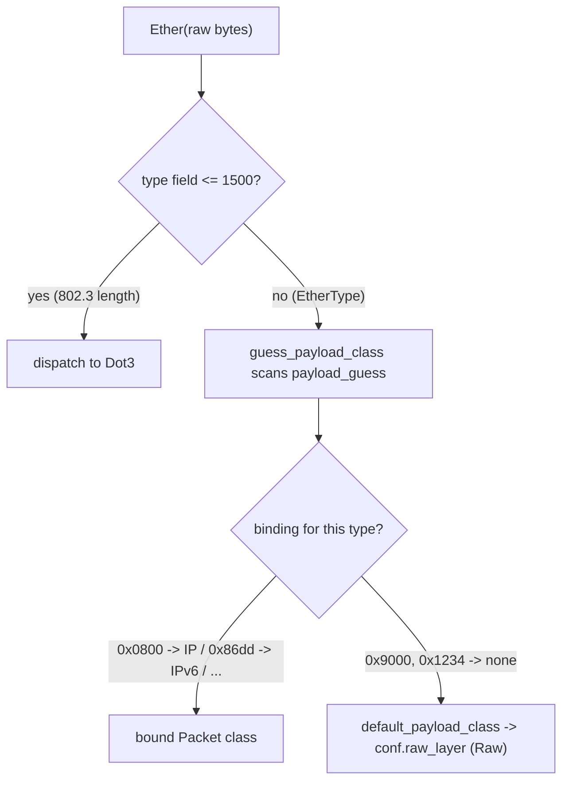

# How Scapy Handles Ethernet Frame Construction — Padding, Round‑Trips, and EtherType Dispatch

> **What this document answers.** How Scapy builds Ethernet frames, specifically: (a) whether it auto‑pads short payloads up to the minimum Ethernet frame size, (b) whether that padding persists across a `raw()` serialize / re‑parse round‑trip, and (c) how it dispatches to the next protocol from the `EtherType` field — including the *unrecognized* type case. It is an **evidence‑backed, read‑only investigation**: every behavioral claim below sits next to the exact observed output line that proves it, and every code claim carries a `file:line` reference. **No repository file was modified.**

---

## Environment (confirmed facts)

| Fact | Value | How confirmed |
|------|-------|---------------|
| Repository commit | `0925ada485406684174d6f068dbd85c4154657b3` | `git rev-parse HEAD` |
| Branch | `scapy_0925ada48540` | task branch under test |
| Scapy run mode | **in place** via `PYTHONPATH=<repo> python3` (NOT pip‑installed) | `scapy.__file__ = <repo>/scapy/__init__.py` |
| `conf.version` | `2026.07.01` (CalVer/dev build at `0925ada4`) | printed at runtime (see below) |
| Observation runtime | **Python 3.13.7** (system `/usr/bin/python3.13`) | `python3 --version` |
| Declared support | `requires-python = ">=3.7, <4"` [`pyproject.toml:17`] | Python 3.13.7 satisfies this range |
| Test matrix | `tox` envlist enumerates interpreters through `py311` [`tox.ini:6-7`] | — |

**Notes on the runtime that keep this honest:**

- The Ethernet **padding** and **EtherType‑dispatch** behavior investigated here is **version‑stable** — it is driven by source constructs (`bind_layers`, `build_padding`, `default_payload_class`) that are unchanged in shape across the supported Python range. The AAP anticipated Python 3.12.3; the actual observation host provides **Python 3.13.7**, which likewise satisfies `>=3.7, <4`. Per the "report exactly what is observed" rule, all values below were captured on **3.13.7**.
- **Benign runtime noise** (stated so the reader is not confused):
  - Building `IP`/`TCP` in memory without a route prints a harmless stderr line: `WARNING: Mac address to reach destination not found. Using broadcast.` (it appeared **3×** in the captured run, once as `WARNING: more Mac address ...`). It does **not** affect any measurement.
  - Importing Scapy **may** emit a `CryptographyDeprecationWarning` from `scapy/layers/ipsec.py` (the optional `cryptography` package). In *this* host it **did** appear, twice, from `scapy/layers/ipsec.py:573` and `:577` (`TripleDES has been moved ...`). It is unrelated to Ethernet framing and requires no action.
- **All observation is in‑memory** — `build()` / `raw()` / dissection only. There is **no** live transmission (`sendp()`/`sr()`), and nothing requires root, raw sockets, or a NIC. The **60‑byte wire minimum is explained conceptually**, not demonstrated by sending a frame.

---

## Reproducing the evidence (the observation script)

Every measured value in this document comes from executing the script below. Per the read‑only rule it lives **outside** the repository tree (e.g. `/tmp/obs_work/obs_scapy.py`) and is **deleted** afterward, leaving `git status` showing only this new document.

```python
# /tmp/obs_work/obs_scapy.py  (OUTSIDE the repo; read-only; delete after use)
from scapy.all import Ether, IP, TCP, Raw, Padding, raw, conf
import scapy
from scapy.data import ETHER_TYPES

print("scapy.__file__ =", scapy.__file__)
print("conf.version =", conf.version)

# B1
print("B1 len(raw)=", len(raw(Ether()/IP()/TCP())))
# B2
print("B2 len(raw)=", len(raw(Ether()/IP()/TCP()/Raw(load=b"A"*10))))
print("default Ether().type =", hex(Ether().type))
# Q1/Q4 sweep
for n in [0, 10, 46, 50, 60, 100]:
    print("n=%d -> len(raw)=%d" % (n, len(raw(Ether()/Raw(load=b"A"*n)))))
# Q2a
rt = Ether(raw(Ether()/IP()/TCP()/Raw(load=b"A"*10)))
print("haslayer(Padding)=", int(rt.haslayer(Padding)))
# Q2b
pad = Ether()/IP()/TCP()/Padding(load=b"\x00"*6)
print("padded len(raw)=", len(raw(pad)))
rt2 = Ether(raw(pad))
print("has Padding after round-trip?", rt2.haslayer(Padding))
print("Padding.load =", repr(rt2[Padding].load))
# B3/Q3/I3
u = Ether(type=0x9000)/Raw(load=b"B"*10)
ru = Ether(raw(u))
print("payload class after Ether:", ru.payload.__class__.__name__)
ru.show()
# ETHER_TYPES resolution
for t in [0x0800, 0x86dd, 0x9000, 0x1234]:
    try:
        print("ETHER_TYPES[%s] = %r" % (hex(t), ETHER_TYPES[t]))
    except KeyError as e:
        print("ETHER_TYPES[%s] -> KeyError(%r)" % (hex(t), e.args[0]))
```

Run command:

```
$ PYTHONPATH=<repo> python3 /tmp/obs_work/obs_scapy.py
```

**Verbatim captured stdout** (stderr warnings elided here; they are described in the Environment section):

```
scapy.__file__ = /tmp/blitzy/scapy/.../scapy/__init__.py
conf.version = 2026.07.01
B1 len(raw)= 54
B2 len(raw)= 64
default Ether().type = 0x9000
n=0 -> len(raw)=14
n=10 -> len(raw)=24
n=46 -> len(raw)=60
n=50 -> len(raw)=64
n=60 -> len(raw)=74
n=100 -> len(raw)=114
haslayer(Padding)= 0
padded len(raw)= 60
has Padding after round-trip? True
Padding.load = b'\x00\x00\x00\x00\x00\x00'
payload class after Ether: Raw
###[ Ethernet ]### 
  dst       = ff:ff:ff:ff:ff:ff
  src       = 1a:47:be:8d:66:bd
  type      = 0x9000
###[ Raw ]### 
     load      = 'BBBBBBBBBB'
ETHER_TYPES[0x800] = 'IPv4'
ETHER_TYPES[0x86dd] = 'IPv6'
ETHER_TYPES[0x9000] -> KeyError(36864)
ETHER_TYPES[0x1234] -> KeyError(4660)
```

> The `src` MAC (`1a:47:be:8d:66:bd`) is **auto‑selected and volatile** — it differs run to run and is not a meaningful value. Everything else reproduces exactly.

A second, supplementary script backs the Q2a analysis and the `0x1234` variant:

```python
from scapy.all import Ether, IP, TCP, Raw, Padding, raw
rt = Ether(raw(Ether()/IP()/TCP()/Raw(load=b"A"*10)))
print("Q2a haslayer(Raw)=", int(rt.haslayer(Raw)))
print("Q2a Raw under TCP load =", repr(rt[Raw].load))
print("Q2a layers =", [l.__name__ for l in rt.layers()])
print("Q2a IP.len =", rt[IP].len)
u2 = Ether(type=0x1234)/Raw(load=b"B"*10)
ru2 = Ether(raw(u2))
print("B3alt type int repr =", ru2.type)
print("B3alt payload class after Ether:", ru2.payload.__class__.__name__)
ru2.show()
```

**Verbatim captured stdout:**

```
Q2a haslayer(Raw)= 1
Q2a Raw under TCP load = b'AAAAAAAAAA'
Q2a layers = ['Ether', 'IP', 'TCP', 'Raw']
Q2a IP.len = 50
B3alt type int repr = 4660
B3alt payload class after Ether: Raw
###[ Ethernet ]### 
  dst       = ff:ff:ff:ff:ff:ff
  src       = 1a:47:be:8d:66:bd
  type      = 0x1234
###[ Raw ]### 
     load      = 'BBBBBBBBBB'
```

---

## 🔑 KEY INSIGHT — `0x9000` is Scapy's *own default* EtherType

The user's "something random" example, **`0x9000`, is coincidentally Scapy's own default `Ether.type`.** The field is declared as `XShortEnumField("type", 0x9000, ETHER_TYPES)` at [`scapy/layers/l2.py:248`], so a bare `Ether()` already carries `type == 0x9000`.

- **Evidence (one claim, one line):** `default Ether().type = 0x9000` — from `print("default Ether().type =", hex(Ether().type))`.

So `0x9000` is **not special or specially meaningful** — it is simply the constructor default. To demonstrate a *truly arbitrary, unbound* EtherType this document also uses **`0x1234`**, which behaves identically (falls back to a `Raw` payload, displayed as hex). Keep this coincidence in mind while reading B3, Q3, and I2/I3 below.

---

# Part 1 — Build tasks (in‑memory packets)

## B1 — a normal `Ether()/IP()/TCP()` packet

**Build & measure:**

```python
len(raw(Ether()/IP()/TCP()))
```

- **Observed (verbatim):** `B1 len(raw)= 54`

**Explanation.** `54 = 14 (Ethernet header) + 20 (IP header) + 20 (TCP header)`. The Ethernet header is 6 (dst) + 6 (src) + 2 (type) = 14 bytes; the field layout is `class Ether(Packet)` at [`scapy/layers/l2.py:244`] with `fields_desc = [DestMACField("dst"), SourceMACField("src"), XShortEnumField("type", 0x9000, ETHER_TYPES)]` [`scapy/layers/l2.py:246-248`]. A default `IP()` header is 20 bytes and a default `TCP()` header is 20 bytes; with no payload the total is exactly 54.

## B2 — a really short payload ("like 10 bytes")

This is the user's named **~10‑byte payload** item.

**Build & measure:**

```python
len(raw(Ether()/IP()/TCP()/Raw(load=b"A"*10)))
```

- **Observed (verbatim):** `B2 len(raw)= 64`

**Explanation.** `64 = 14 (Ether) + 20 (IP) + 20 (TCP) + 10 (payload)` — **no padding is added.** The frame is 64 bytes purely because the 10 payload bytes are appended to the 54‑byte B1 total; Scapy inserts nothing to reach any minimum size. (The fact that 64 *happens* to equal the classic on‑the‑wire minimum‑frame number is a coincidence of this particular stack; the size‑sweep in Q4 shows the total is always exactly `header + payload`, never floored.)

Also note the default EtherType surfaced here (see KEY INSIGHT):

- **Observed (verbatim):** `default Ether().type = 0x9000`

## B3 — an unrecognized EtherType (`0x9000` **and** `0x1234`)

The user's example was *"0x9000 or something random"*. Because `0x9000` is the constructor default (KEY INSIGHT), B3 covers **both** the default‑but‑unbound value `0x9000` **and** a genuinely arbitrary value `0x1234`.

**Build, serialize, re‑parse:**

```python
u  = Ether(type=0x9000)/Raw(load=b"B"*10)
ru = Ether(raw(u))
print("payload class after Ether:", ru.payload.__class__.__name__)
ru.show()
```

- **Observed (verbatim):** `payload class after Ether: Raw`
- **Observed `ru.show()` (verbatim):**

```
###[ Ethernet ]### 
  dst       = ff:ff:ff:ff:ff:ff
  src       = 1a:47:be:8d:66:bd
  type      = 0x9000
###[ Raw ]### 
     load      = 'BBBBBBBBBB'
```

**Arbitrary variant `0x1234`** (from the supplementary script):

- **Observed (verbatim):** `B3alt type int repr = 4660` and `B3alt payload class after Ether: Raw`
- **Observed `ru2.show()` (verbatim):**

```
###[ Ethernet ]### 
  dst       = ff:ff:ff:ff:ff:ff
  src       = 1a:47:be:8d:66:bd
  type      = 0x1234
###[ Raw ]### 
     load      = 'BBBBBBBBBB'
```

**What B3 establishes.** Both an unbound default (`0x9000`) and an arbitrary unbound value (`0x1234`) dissect to a `Raw` layer after `Ether`, and both display their type as **hex** (`0x9000`, `0x1234`) rather than a protocol name. The *why* is answered in **Q3** (display + fallback) and **I2/I3** (dispatch mechanism and fallback code path).

---

# Part 2 — Behavioral questions

## Q1 — Does Scapy auto‑pad a short frame to the minimum Ethernet frame size?

**Answer: No.** At build time Scapy does **not** pad a short frame up to any minimum Ethernet frame size — the frame stays exactly as large as `header + payload`.

**Evidence (one claim, one line each)** — from the sweep `Ether()/Raw(load=b"A"*n)`:

- `n=0 -> len(raw)=14`
- `n=10 -> len(raw)=24`

The length grows strictly as `14 + n` with **no floor at 60**. Compare this to B2's stack: `Ether()/IP()/TCP()/Raw(b"A"*10)` measured `B2 len(raw)= 64` — again just `54 + 10`, with nothing added to reach a minimum.

**Why (grounded in source).** The base serialization path never inserts minimum‑frame bytes: `Packet.post_build` [`scapy/packet.py:758`] returns the header concatenated with the payload unchanged — `return pkt + pay` at [`scapy/packet.py:767`] — and the base `Packet.build_padding` [`scapy/packet.py:742`] simply delegates down the payload chain (`return self.payload.build_padding()` at [`scapy/packet.py:744`]). There is **no minimum‑frame constant** anywhere in `scapy/data.py` to pad toward (the only size‑ish constants are `ETHER_ANY = b"\x00" * 6` [`scapy/data.py:37`] and `MTU = 0xffff` [`scapy/data.py:269`]; there is no `60`/`64`/`46` min‑frame constant). See **I1** for the full trace.

**The distinction that matters.** The classic **60‑byte minimum Ethernet frame** (i.e. a 46‑byte minimum *data* field) is an **OS/NIC transmit‑time** concern, applied by the driver/hardware as a frame leaves the wire — **not** something Scapy adds when you call `raw()`/`build()` in memory. Since this investigation is purely in‑memory, that wire minimum never comes into play.

## Q2 — After `Ether(raw(packet))`, does the padding stick around or disappear?

**Answer: It depends on whether there are genuine surplus trailing bytes.** An ordinary short packet gains **no** `Padding` layer; padding persists across the round‑trip **only** when real trailing bytes exist (e.g. an explicit `Padding` layer).

### Q2a — ordinary short packet: no padding appears

```python
rt = Ether(raw(Ether()/IP()/TCP()/Raw(load=b"A"*10)))
rt.haslayer(Padding)
```

- **Observed (verbatim):** `haslayer(Padding)= 0`

Where did the 10 bytes go? They come back as the **`Raw` load *inside* TCP**, because the IP total‑length field already accounts for them:

- **Observed (verbatim):** `Q2a haslayer(Raw)= 1`
- **Observed (verbatim):** `Q2a Raw under TCP load = b'AAAAAAAAAA'`
- **Observed (verbatim):** `Q2a layers = ['Ether', 'IP', 'TCP', 'Raw']`
- **Observed (verbatim):** `Q2a IP.len = 50`

Because `IP.len = 50` (= 20 IP + 20 TCP + 10 data) covers all 10 payload bytes, dissection assigns them to the TCP payload as `Raw` — there are **no surplus trailing bytes** left over to become `Padding`.

### Q2b — explicit `Padding`: it does persist

```python
pad  = Ether()/IP()/TCP()/Padding(load=b"\x00"*6)
len(raw(pad))                     # -> built length
rt2  = Ether(raw(pad))
rt2.haslayer(Padding)             # -> present after round-trip?
rt2[Padding].load                 # -> the preserved bytes
```

- **Observed (verbatim):** `padded len(raw)= 60`
- **Observed (verbatim):** `has Padding after round-trip? True`
- **Observed (verbatim):** `Padding.load = b'\x00\x00\x00\x00\x00\x00'`

Here the 6 explicit padding bytes are genuine surplus trailing bytes (beyond what `IP.len` covers), so on re‑parse they are separated back out into a `Padding` layer and preserved intact.

**Conclusion.** Padding survives `Ether(raw(pkt))` **iff** the serialized bytes contain trailing bytes beyond the declared lengths of the inner layers. Ordinary short frames do **not** gain (or keep) any Ethernet padding — there is nothing to gain, because Q1 already showed Scapy never added any. The mechanics of separating surplus bytes are in `Packet.extract_padding` [`scapy/packet.py:982-990`] and `Padding.build_padding` [`scapy/packet.py:1913-1918`] (see **I1/I3**).

## Q3 — For the unknown‑EtherType packet, what does `print()`/`show()` show — (a) raw dump, (b) error, or (c) protocol guess?

All three named possibilities are addressed explicitly:

- **(a) A raw data dump — ✅ YES, this is what happens.** After the `Ether` layer you get a `###[ Raw ]###` layer.
  - **Evidence (verbatim):** `payload class after Ether: Raw`, and the `show()` output ends with:
    ```
    ###[ Raw ]### 
         load      = 'BBBBBBBBBB'
    ```
- **(b) An error — ❌ NO.** No exception is raised and dissection completes cleanly; the script printed the full packet and continued to the `ETHER_TYPES` section without any traceback. (Had an error occurred, `payload class after Ether: Raw` would never have printed.)
- **(c) A protocol guess — ❌ NO.** Scapy does **not** guess a higher‑level protocol for the unknown type; it falls straight back to `Raw`. Both `0x9000` and `0x1234` show `payload class after Ether: Raw` — no speculative layer such as IP/IPv6 is inserted.

### Why the type shows as hex (not a name)

The `type` field is displayed as **hex** — `type = 0x9000` (and `type = 0x1234`) — because those numbers have **no entry** in the `ETHER_TYPES` name table:

- **Evidence (verbatim):** `ETHER_TYPES[0x9000] -> KeyError(36864)`
- **Evidence (verbatim):** `ETHER_TYPES[0x1234] -> KeyError(4660)`

Known types resolve to names, which is why *bound* types print symbolically:

- **Evidence (verbatim):** `ETHER_TYPES[0x800] = 'IPv4'`
- **Evidence (verbatim):** `ETHER_TYPES[0x86dd] = 'IPv6'`

The display logic is `XShortEnumField` [`scapy/fields.py:2660`]: its `i2repr_one` (def at [`scapy/fields.py:2661`]) tries the name table (`return self.i2s[x]` at [`scapy/fields.py:2666`]), and on `KeyError` [`scapy/fields.py:2667`] falls through to `return lhex(x)` at [`scapy/fields.py:2673`] — i.e. it prints the hex literal when the number is unnamed. The arbitrary `0x1234` confirms identical behavior: integer repr `4660`, displayed `0x1234`, payload `Raw`.

## Q4 — Across several payload sizes, at what threshold does Scapy stop adding padding?

**Answer: There is NO threshold — padding never begins at build time.** An actual payload‑size sweep of `Ether()/Raw(load=b"A"*n)` shows `len(raw())` is always exactly `14 + n`, with no floor at 60 (or any other value):

| payload bytes (n) | observed `len(raw())` | verbatim line |
|-------------------|-----------------------|---------------|
| 0   | 14  | `n=0 -> len(raw)=14`   |
| 10  | 24  | `n=10 -> len(raw)=24`  |
| 46  | 60  | `n=46 -> len(raw)=60`  |
| 50  | 64  | `n=50 -> len(raw)=64`  |
| 60  | 74  | `n=60 -> len(raw)=74`  |
| 100 | 114 | `n=100 -> len(raw)=114`|

Every row satisfies `len(raw()) == 14 + n` — there is no size at which the total is floored to 60, and no size at which "padding stops." The "threshold at which Scapy stops padding" is therefore a **non‑event**: Scapy adds no minimum‑frame padding at *any* size, so there is no transition to observe. This is grounded in the absence of any minimum‑frame constant in `scapy/data.py` and the pass‑through `post_build`/`build_padding` shown in Q1 and detailed in **I1**.

---

# Part 3 — Code investigation (exact `file:line`)

## I1 — Where Scapy decides to add padding

**Finding: Scapy has no automatic Ethernet minimum‑frame padding step. Actual padding bytes are emitted only by an explicit `Padding` layer — padding is opt‑in.**

The build/padding chain:

1. `Packet.build()` [`scapy/packet.py:746`] produces the packet, calling `do_build()` and then `self.build_padding()`.
2. The **base** `Packet.build_padding` [`scapy/packet.py:742`] does **not** add any bytes of its own — it delegates down the payload chain: `return self.payload.build_padding()` at [`scapy/packet.py:744`].
3. The **base** `Packet.post_build` [`scapy/packet.py:758`] returns the header and payload unchanged: `return pkt + pay` at [`scapy/packet.py:767`]. It never inserts padding.
4. **Actual padding bytes are emitted ONLY by `Padding`.** `class Padding(Raw)` is defined at [`scapy/packet.py:1906`]; its `self_build` returns `b""` (contributes no header bytes) [`scapy/packet.py:1909-1911`], and its overridden `build_padding` returns the padding load followed by the rest of the chain's padding [`scapy/packet.py:1913-1918`].

There is **no minimum‑frame constant** in `scapy/data.py` to trigger padding: only `ETHER_ANY = b"\x00" * 6` [`scapy/data.py:37`] and `MTU = 0xffff` [`scapy/data.py:269`] exist; there is no `60`/`64`/`46` value. This is exactly why the Q4 sweep never floors at 60 and why B2 stays at 64 = `54 + 10`.

> Related to Q2: the *dissection‑side* counterpart is `Packet.extract_padding` [`scapy/packet.py:982-990`], whose base implementation returns `(s, None)` — layers that declare a length (like IP via `IP.len`) override it to peel surplus trailing bytes off into padding. That is the mechanism by which genuine surplus bytes (Q2b) reappear as a `Padding` layer while the ordinary short packet (Q2a) does not.

## I2 — How Scapy selects the next protocol from the `EtherType` value

**Finding: dispatch is table‑driven by `guess_payload_class`, scanning the `payload_guess` table populated by `bind_layers(...)`; a `dispatch_hook` pre‑check first diverts 802.3 length frames to `Dot3`.**

1. **Pre‑check — `Ether.dispatch_hook`** [`scapy/layers/l2.py:267-272`]. Before the payload table is consulted, this hook inspects the 2‑byte type/length field: for a buffer of at least 14 bytes [`scapy/layers/l2.py:269`], if `struct.unpack("!H", _pkt[12:14])[0] <= 1500` [`scapy/layers/l2.py:270`] it returns `Dot3` (the IEEE 802.3 *length* interpretation) [`scapy/layers/l2.py:271`]; otherwise it returns the normal `Ether` class [`scapy/layers/l2.py:272`]. Since `0x9000` (36864) and `0x1234` (4660) are both `> 1500`, they are treated as Ethernet II EtherTypes and proceed to step 2.
2. **Dispatch — `Packet.guess_payload_class`** [`scapy/packet.py:1062-1079`]. It iterates the class's alias types (`for t in self.aliastypes:` [`scapy/packet.py:1071`]) and each class's `payload_guess` table (`for fval, cls in t.payload_guess:` [`scapy/packet.py:1072`]), returning the bound class `cls` [`scapy/packet.py:1076`] when the recorded field values (here, `type`) match; if nothing matches it falls back to `return self.default_payload_class(payload)` [`scapy/packet.py:1079`].
3. **What populates `payload_guess`** — `bind_layers(...)` registrations, e.g.:
   - `bind_layers(Ether, IP, type=2048)` [`scapy/layers/inet.py:1101`] — `2048 == 0x0800`, so EtherType `0x0800` → `IP`.
   - `bind_layers(Ether, IPv6, type=0x86dd)` [`scapy/layers/inet6.py:4083`] — EtherType `0x86dd` → `IPv6`.
   - the L2 set (LLC, Dot1Q, Dot1AD, Ether, ARP, …) [`scapy/layers/l2.py:687-695`].
4. **The type field itself** is declared `XShortEnumField("type", 0x9000, ETHER_TYPES)` [`scapy/layers/l2.py:248`]; its hex‑vs‑name **display** is governed by `XShortEnumField` [`scapy/fields.py:2660`] (see Q3).

Because neither `0x9000` nor `0x1234` appears in any `bind_layers(Ether, …)` registration, the scan in step 2 finds no match and falls through to `default_payload_class` (→ **I3**).

## I3 — What logic runs when the protocol number is unrecognized

**Finding: `guess_payload_class` falls back to `default_payload_class`, which returns `conf.raw_layer` — i.e. `Raw`. No error, no guess.**

- When the `payload_guess` scan matches nothing, `guess_payload_class` calls `default_payload_class` [`scapy/packet.py:1081-1090`], which `return conf.raw_layer` at [`scapy/packet.py:1090`].
- `conf.raw_layer` is `Raw`: `class Raw(Packet)` is defined at [`scapy/packet.py:1877`], and the assignment `conf.raw_layer = Raw` is at [`scapy/packet.py:1921`]. (Its pre‑assignment default is `raw_layer = None` at [`scapy/config.py:766`]; the sibling `padding_layer = None` at [`scapy/config.py:768`] is later set with `conf.padding_layer = Padding` at [`scapy/packet.py:1922`].)

So an unrecognized EtherType dissects into a `Raw` layer — matching the observed `payload class after Ether: Raw` for both `0x9000` and `0x1234`. This is the code‑level reason B3/Q3 produce a raw dump rather than an error or a protocol guess.

---

## Dispatch / fallback diagram



---

## Corroboration (optional — repository source lines remain the source of truth)

The observed behavior aligns with upstream/community sources. These are corroboration only; the `file:line` references above are authoritative.

- **Scapy core does not itself pad short Ethernet frames** (it historically relied on the OS driver). The upstream tracker issue titled *"Linux: (ethernet) padding no longer automatically added"* notes that Scapy "hopes that the underlying driver will add a payload if needed" — matching the Q1/Q4 finding that no padding is added at build time. (secdev/scapy issue #90.)
- **On‑the‑wire padded frames surface as extra trailing bytes when re‑parsed** — an upstream report describes padding and CRC of short Ethernet II frames being counted in the captured length, consistent with the Q2 finding that padding materializes only from genuine surplus trailing bytes. (secdev/scapy issue #3733.)
- **Any minimum‑length padding is per‑protocol opt‑in, not a global Ethernet behavior** — the contrib layer `scapy/contrib/pnio_dcp.py` defines its own `MIN_PACKET_LENGTH = 44` with a comment noting the 60‑byte minimum and that 14 bytes are the `Ether()` header — illustrating that minimum‑length handling is defined by a specific protocol layer, not by the core Ethernet build path.

---

## Coverage pass (every asked item is present and answered)

| Item | Where answered | Key verbatim evidence |
|------|----------------|-----------------------|
| **B1** normal `Ether()/IP()/TCP()` | Part 1 · B1 | `B1 len(raw)= 54` (= 14+20+20) |
| **B2** short ~10‑byte payload | Part 1 · B2 | `B2 len(raw)= 64` (= 14+20+20+10, no pad) |
| **B3** unrecognized EtherType (`0x9000` **and** `0x1234`) | Part 1 · B3 | `payload class after Ether: Raw`; `type = 0x9000`; `B3alt ... type = 0x1234` |
| **Q1** auto‑padding? | Part 2 · Q1 | `n=0 -> len(raw)=14`, `n=10 -> len(raw)=24` → **No** |
| **Q2** round‑trip persistence? | Part 2 · Q2 | `haslayer(Padding)= 0` (ordinary) vs `has Padding after round-trip? True` + `Padding.load = b'\x00\x00\x00\x00\x00\x00'` (explicit) |
| **Q3** unknown‑type print — (a) raw / (b) error / (c) guess | Part 2 · Q3 | (a) **YES** `payload class after Ether: Raw`; (b) **NO** error; (c) **NO** guess |
| **Q4** padding threshold? | Part 2 · Q4 | sweep `14/24/60/64/74/114` (= `14+n`) → **no threshold** |
| **I1** where padding is decided | Part 3 · I1 | `packet.py:742/744/746/758/767`, `1906/1909-1911/1913-1918`; no min‑frame const in `data.py` |
| **I2** EtherType → next protocol | Part 3 · I2 | `guess_payload_class` `packet.py:1062-1079`; `bind_layers` `inet.py:1101`, `inet6.py:4083`, `l2.py:687-695`; `dispatch_hook` `l2.py:267-272` |
| **I3** unrecognized‑number logic | Part 3 · I3 | `default_payload_class` `packet.py:1081-1090` → `conf.raw_layer = Raw` `packet.py:1921` |
| **Named item `0x9000`** | KEY INSIGHT + B3 + Q3 | `default Ether().type = 0x9000`; `ETHER_TYPES[0x9000] -> KeyError(36864)` |
| **Named item ~10‑byte payload** | B2 + Q2a | `B2 len(raw)= 64`; `Q2a Raw under TCP load = b'AAAAAAAAAA'`; `Q2a IP.len = 50` |

**Summary of answers.** Scapy performs **no** minimum‑frame padding at build time (Q1), so there is **no threshold** (Q4) — `len(raw()) == 14 + payload` at every size. Padding survives an `Ether(raw(pkt))` round‑trip **only** when genuine surplus trailing bytes exist, e.g. an explicit `Padding` layer (Q2). An unrecognized EtherType (`0x9000`, `0x1234`) dissects to a **`Raw`** layer — a raw dump, **not** an error and **not** a protocol guess (Q3) — and the numeric type is shown as hex because it has no `ETHER_TYPES` name. Padding is decided in `Packet.build()`/`build_padding()` and only emitted by an explicit `Padding` layer (I1); next‑protocol selection is table‑driven via `guess_payload_class` over `bind_layers`‑populated `payload_guess` (I2); unrecognized numbers fall back through `default_payload_class` to `conf.raw_layer` = `Raw` (I3). Finally, the user's `0x9000` example is coincidentally Scapy's **own default** `Ether.type` [`scapy/layers/l2.py:248`], while `0x1234` demonstrates a truly arbitrary unbound value.

