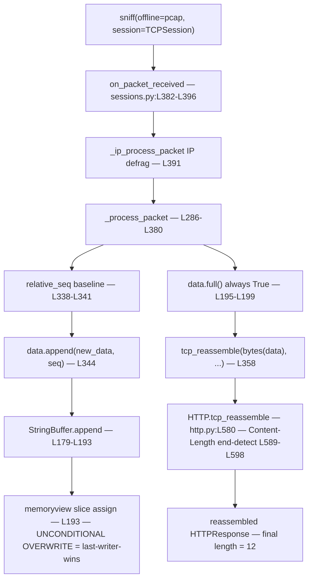

# Scapy TCP Overlap/Retransmission Reassembly — Which Bytes Win?

> **Investigated revision:** Scapy repository at branch `scapy_0925ada48540`, HEAD `0925ada485406684174d6f068dbd85c4154657b3`.
> **Scapy version:** `2026.06.26` (imported directly from the source tree with `PYTHONPATH` set to the repository root — no `pip install` of Scapy is required).
> **Runtime:** The reassembly logic under study is pure-Python byte-buffer slicing, so its behavior is **version-independent**. The evidence below was reproduced byte-for-byte on both the documented canonical CPython **3.11.13** (the version pinned by `tox.ini` and CI `.github/workflows/unittests.yml`) and on CPython **3.13.7**, with identical results.
> **Method:** Every behavioral claim is grounded in the Scapy source code (the source of truth) with an exact `[scapy/<file>:Lxxx]` locator and the name of the symbol it refers to, and is confirmed by a live run through Scapy's standard **offline** reassembly path.

---

## 1. The Question

When a TCP application-layer stream is reconstructed from a capture, **what happens to a byte range that is covered by more than one segment?** Concretely: if an earlier segment writes some bytes at a given position in the stream, and a *later* segment (a retransmission, or a deliberately crafted overlapping segment) writes over **the same sequence range**, which bytes appear in the final reconstructed stream?

There are three classically possible policies a reassembler could implement:

- **First-writer-wins** — keep the bytes that arrived first and ignore the later overlapping bytes (the behavior of many operating-system TCP stacks).
- **Last-writer-wins** — let the later-processed segment overwrite the earlier bytes.
- **Reject / de-duplicate** — detect the overlap and drop or specially handle the duplicate range.

This document determines **empirically, from the code**, which policy Scapy's session-based reassembler implements, and demonstrates it with two variants:

1. the overlapping segment carries **identical** bytes over the contested range; and
2. the overlapping segment carries **different** bytes over the same range — so the surviving bytes unambiguously reveal the policy.

---

## 2. Short Answer

**Scapy uses last-writer-wins, via an unconditional positional `memoryview` overwrite.**

The decision lives in the per-flow byte accumulator `StringBuffer.append`, whose final statement is `memoryview(self.content)[seq:seq + data_len] = data` `[scapy/sessions.py:L193]`. When a later segment's bytes map to a buffer offset that an earlier segment already wrote, that slice assignment simply **overwrites** the contested range. There is **no comparison, no drop, no merge, and no sequence de-duplication** — whichever segment is processed *later* wins the overlapping offsets.

Two consequences follow directly from the code:

- The final reconstructed stream **length** is not governed by the overlap logic at all; it is governed by the protocol's end-detection. For HTTP (the vehicle used here) that is the `Content-Length` check in `HTTP.tcp_reassemble` `[scapy/layers/http.py:L589-L598]`, which returns `None` until exactly `Content-Length` body bytes are present.
- The overlap policy is **protocol-independent**: it is implemented in the shared `StringBuffer` `[scapy/sessions.py:L161]` used by `TCPSession`, not inside any individual protocol's `tcp_reassemble`. Every built-in protocol that rides on `TCPSession` inherits the same last-writer-wins behavior.

---

## 3. The Standard Offline Reassembly Path

Reassembly is **not** performed by `rdpcap()`. A plain `rdpcap()` returns the individual packets exactly as captured and performs no stream reconstruction. TCP stream reassembly is performed only when packets are routed through a **session** that implements it — `TCPSession`:

```python
sniff(offline="capture.pcap", session=TCPSession)
```

Only protocols that implement a `tcp_reassemble` classmethod are reconstructed; for any other payload class, `TCPSession` has no way to know where the application message ends and returns the packet unchanged (`_process_packet` `[scapy/sessions.py:L286-L380]`, specifically the `hasattr(pay_class, "tcp_reassemble")` guard at `[scapy/sessions.py:L325]`). Scapy ships several such protocols — **HTTP 1.0, TLS, Kerberos, LDAP, SMB, DCE/RPC, Postgres, and DOIP** — and this investigation uses **HTTP** because it is the simplest canonical vehicle and requires no manual setup (see §8 for why).

The end-to-end call chain that a single packet travels through is:

- `TCPSession.on_packet_received` `[scapy/sessions.py:L382-L396]` — the dissection entry point. It first IP-defragments via `_ip_process_packet` `[scapy/sessions.py:L391]`, then hands the packet to `_process_packet` `[scapy/sessions.py:L395]`.
- `TCPSession._process_packet` `[scapy/sessions.py:L286-L380]` — the reassembly driver. It identifies the flow with `_get_ident` `[scapy/sessions.py:L270-L284]`, looks up that flow's `(StringBuffer, metadata)` pair in the per-flow map `tcp_frags` `[scapy/sessions.py:L263-L265]`, normalizes the TCP sequence number to a buffer offset (the relative-sequence baseline at `[scapy/sessions.py:L338-L341]`), and appends the segment's bytes via `data.append(new_data, seq)` `[scapy/sessions.py:L344]`.
- `StringBuffer.append` `[scapy/sessions.py:L179-L193]` — places the bytes into the per-flow buffer and performs the decisive overwrite at `[scapy/sessions.py:L193]`.
- `tcp_reassemble` — after every segment (because `StringBuffer.full()` always returns `True` `[scapy/sessions.py:L195-L199]`), `_process_packet` calls the protocol's reassembler `[scapy/sessions.py:L358]`; for HTTP this is `HTTP.tcp_reassemble` `[scapy/layers/http.py:L580]`.

Because the reproduction reads packets back from a pcap on disk through exactly this path, it exercises Scapy's real reassembly machinery rather than any ad-hoc byte concatenation.

---

## 4. The Reproduction (Script + Exact Command)

The reproduction builds a minimal HTTP/1.1 response flow from built-in `IP`/`TCP`/`Raw` layers, with TCP sequence numbers chosen so that a later segment overlaps the body range written by an earlier segment. It serializes the three segments to a pcap with `wrpcap()` (under `/tmp`, outside the repository) and reads them back through `sniff(offline=<pcap>, session=TCPSession)`. The built-in HTTP layer is loaded with `load_layer("http")`, which also registers Scapy's own TCP port-80 bindings `[scapy/layers/http.py:L748-L750]` — so the harness defines **no** new `Packet` subclass, calls **no** `bind_layers`, and never imports or instantiates `StringBuffer` (which is exercised only internally by `TCPSession`).

> **Note:** `TCPSession` must be imported (it is exported by `scapy.all`); omitting it raises `NameError`.

```python
#!/usr/bin/env python3
"""Reproduce Scapy TCP overlap/retransmission reassembly via the STANDARD
offline path: write a pcap, then read it back through
    sniff(offline=<pcap>, session=TCPSession)
Constraints honored: built-in IP/TCP/Raw/HTTP layers only; NO new Packet
subclasses; NO bind_layers (Scapy self-binds HTTP to port 80); NO StringBuffer
import/instantiation (it is exercised only internally by TCPSession).
"""
from scapy.all import IP, TCP, Raw, wrpcap, sniff, load_layer, TCPSession

# Load the built-in HTTP layer; this ALSO registers Scapy's own TCP port-80
# bindings (scapy/layers/http.py:748-750), so no manual bind_layers is needed.
load_layer("http")
from scapy.layers.http import HTTPResponse  # noqa: E402

HEADER = b"HTTP/1.1 200 OK\r\nContent-Length: 12\r\n\r\n"  # 39 bytes
ISN = 1000


def build_pcap(path, s3_payload):
    # HTTP response: server (port 80) -> client. Three segments.
    # s1=HEADER, s2=body[0:8], s3=body[4:12] -> s3 overlaps body[4:8].
    s1 = (IP(src="10.0.0.1", dst="10.0.0.2") /
          TCP(sport=80, dport=12345, seq=ISN, flags="A") / Raw(HEADER))
    s2 = (IP(src="10.0.0.1", dst="10.0.0.2") /
          TCP(sport=80, dport=12345, seq=ISN + len(HEADER), flags="A") /
          Raw(b"AAAABBBB"))
    s3 = (IP(src="10.0.0.1", dst="10.0.0.2") /
          TCP(sport=80, dport=12345, seq=ISN + len(HEADER) + 4, flags="PA") /
          Raw(s3_payload))
    wrpcap(path, [s1, s2, s3])


def reassemble(path):
    for p in sniff(offline=path, session=TCPSession):
        if p.haslayer(HTTPResponse):
            return p
    return None


def show(title, s3_payload, pcap_path, note=""):
    build_pcap(pcap_path, s3_payload)
    p = reassemble(pcap_path)
    body = bytes(p[HTTPResponse].payload)
    print(title)
    print(f"{'reassembled body bytes':<24}: {body!r}")
    print(f"{'reassembled body length':<24}: {len(body)}")
    print(f"{'overlap region body[4:8]':<24}: {body[4:8]!r}{note}")
    print(f"{'layer stack':<24}: {[l.__name__ for l in p.layers()]}")


show("=== VARIANT 1: overlap carries IDENTICAL bytes "
     "(s3 re-sends 'BBBB' over body[4:8]) ===",
     b"BBBBCCCC", "/tmp/repro_overlap_v1.pcap")
print()
show("=== VARIANT 2: overlap carries DIFFERING bytes "
     "(s3 sends 'WWWW' over body[4:8], originally 'BBBB') ===",
     b"WWWWZZZZ", "/tmp/repro_overlap_v2.pcap", note=" <- LATER segment (s3) wins")
```

**Exact command (run from the repository root):**

```text
$ PYTHONPATH="$(pwd)" python3 /tmp/repro_overlap.py
```

(When literally executed, harmless `cryptography` TripleDES deprecation warnings are emitted on **stderr**; the §5 block shows the clean **stdout**. Appending `2>/dev/null` suppresses those stderr warnings without changing stdout.)

### Byte/sequence layout (why the overlap collides at the same offset)

With `HEADER = b"HTTP/1.1 200 OK\r\nContent-Length: 12\r\n\r\n"` (**39 bytes**) and ISN **1000**:

| Segment | TCP `seq` | Payload | Buffer offset written |
|---------|-----------|---------|-----------------------|
| s1 | 1000 | `HEADER` (39 bytes) | 0–38 |
| s2 | 1039 | `AAAABBBB` (8 bytes) | 39–46 (body[0:8]) |
| s3 | 1043 | variant (8 bytes) | 43–50 (body[4:12]) — overlaps 43–46 |

The collision is **guaranteed** by how sequence numbers are normalized. The relative-sequence baseline is fixed **once** from the first segment: `relative_seq = metadata["relative_seq"] = seq - 1` `[scapy/sessions.py:L340]`, giving `relative_seq = 999`. Every later segment is converted to a buffer offset with `seq = seq - relative_seq` `[scapy/sessions.py:L341]`, and `StringBuffer.append` then subtracts one more (`seq = seq - 1` `[scapy/sessions.py:L182]`) to get a 0-based index. So s2 (seq 1039) lands at buffer offset 39 and s3 (seq 1043) lands at buffer offset 43 — and since the body begins at offset 39, s3's first four bytes fall on `body[4:8]` (buffer offsets 43–46), exactly the range s2 already wrote with `BBBB`.


---

## 5. Verbatim Two-Variant Evidence

The command and the complete output of both variants, exactly as produced:

```text
$ PYTHONPATH="$(pwd)" python3 /tmp/repro_overlap.py
=== VARIANT 1: overlap carries IDENTICAL bytes (s3 re-sends 'BBBB' over body[4:8]) ===
reassembled body bytes  : b'AAAABBBBCCCC'
reassembled body length : 12
overlap region body[4:8]: b'BBBB'
layer stack             : ['IP', 'TCP', 'HTTP', 'HTTPResponse', 'Raw']

=== VARIANT 2: overlap carries DIFFERING bytes (s3 sends 'WWWW' over body[4:8], originally 'BBBB') ===
reassembled body bytes  : b'AAAAWWWWZZZZ'
reassembled body length : 12
overlap region body[4:8]: b'WWWW' <- LATER segment (s3) wins
layer stack             : ['IP', 'TCP', 'HTTP', 'HTTPResponse', 'Raw']
```

**Interpretation:**

- **Variant 1 — identical overlap (`s3 = b"BBBBCCCC"`).** s3 re-sends `BBBB` over `body[4:8]` (already written by s2) and appends `CCCC` to `body[8:12]`. The reconstructed body is `b'AAAABBBBCCCC'`, length 12. The overlap region `body[4:8]` is `b'BBBB'`, unchanged — because the bytes that overwrote it were identical. (This is exactly what a retransmission looks like: the same bytes for the same sequence range.)
- **Variant 2 — differing overlap (`s3 = b"WWWWZZZZ"`).** s3 writes `WWWW` over `body[4:8]` (originally `BBBB` from s2) and appends `ZZZZ` to `body[8:12]`. The reconstructed body is `b'AAAAWWWWZZZZ'`, length 12. The overlap region `body[4:8]` is now `b'WWWW'` — **the later segment's bytes won**. This is the direct, unambiguous proof of last-writer-wins: the only thing that changed between the variants is the bytes s3 carried over the contested range, and the survivor is always s3's.
- **Both variants** dissect to the identical layer stack `['IP', 'TCP', 'HTTP', 'HTTPResponse', 'Raw']`, confirming that the reconstructed body rides in the trailing `Raw` layer of a reassembled `HTTPResponse` produced by `HTTP.tcp_reassemble` `[scapy/layers/http.py:L580]`.

Note also that the final length is **12** in both cases — neither longer (the overlap did not extend the stream, because s3's range was already within the body) nor shorter (the `Content-Length: 12` end-detection in `HTTP.tcp_reassemble` `[scapy/layers/http.py:L589-L598]` waits until exactly 12 body bytes are present before emitting the reassembled packet).


---

## 6. Code Trace — The *Why*

The behavior follows deterministically from four code facts. Each is cited to its exact location and symbol.

**1. Entry and routing.** `sniff(offline=<pcap>, session=TCPSession)` delivers every packet to `TCPSession.on_packet_received` `[scapy/sessions.py:L382-L396]`. That method first IP-defragments the packet (`pkt = self._ip_process_packet(pkt)` `[scapy/sessions.py:L391]`) and then drives TCP reassembly (`pkt = self._process_packet(pkt)` `[scapy/sessions.py:L395]`).

**2. Flow keying, sequence normalization, and buffering.** `TCPSession._process_packet` `[scapy/sessions.py:L286-L380]` derives a per-flow identity key with `_get_ident` `[scapy/sessions.py:L270-L284]` and fetches that flow's `(StringBuffer, metadata)` pair from the per-flow map `tcp_frags` `[scapy/sessions.py:L263-L265]`. It establishes the relative-sequence baseline **once**, from the first segment seen on the flow: `relative_seq = metadata["relative_seq"] = seq - 1` `[scapy/sessions.py:L340]`, then normalizes the current segment to a buffer offset with `seq = seq - relative_seq` `[scapy/sessions.py:L341]`. It then appends the payload with `data.append(new_data, seq)` `[scapy/sessions.py:L344]`. The in-code comment immediately above that call is explicit about intent: `# Note that this take care of retransmission packets.` `[scapy/sessions.py:L343]` — Scapy itself states that `append` is what handles retransmissions, and (as the next fact shows) it does so by overwriting.

**3. The decisive overwrite.** `StringBuffer.append` `[scapy/sessions.py:L179-L193]` first converts the sequence to a 0-based index (`seq = seq - 1` `[scapy/sessions.py:L182]`). It then **grows/zero-fills the buffer only when the new segment extends past the current end** — the guarded block `if seq + data_len > self.content_len:` `[scapy/sessions.py:L183]` spanning `[scapy/sessions.py:L183-L188]` (zero-pad at `[scapy/sessions.py:L184]`, record the missing range in `self.incomplete` at `[scapy/sessions.py:L186]`, advance `content_len` at `[scapy/sessions.py:L187]`). When the segment falls **within** the existing buffer (the overlap case), this growth block is skipped entirely. In **all** cases, the method's final statement runs unconditionally:

```python
memoryview(self.content)[seq:seq + data_len] = data   # scapy/sessions.py:L193
```

This positional slice assignment **replaces** the bytes at `[seq, seq + data_len)` with the current segment's `data`. There is **no** comparison against what is already there, **no** "first-wins" guard, **no** merge, and **no** de-duplication. Whichever segment is processed *later* therefore wins the contested offsets. (Note too that the gap-clearing logic that might have reconciled overlaps with previously recorded missing ranges is **commented out** at `[scapy/sessions.py:L189-L192]`, so it has no effect.)

**4. When the stream is emitted, and how long it is.** `StringBuffer.full()` always returns `True` `[scapy/sessions.py:L195-L199]`, so after **every** segment `_process_packet` calls the protocol reassembler `tcp_reassemble(bytes(data), metadata, tcp_session)` `[scapy/sessions.py:L358]`. For HTTP this is `HTTP.tcp_reassemble` `[scapy/layers/http.py:L580]`, which uses the `Content-Length` header to decide when the body is complete `[scapy/layers/http.py:L589-L598]`: it returns `None` until exactly `Content-Length` (here, 12) body bytes are present, and only then emits the reassembled `HTTPResponse`. This is why both variants converge on a final body length of **12** regardless of the overlap.

Putting facts 1–4 together: the contested range `body[4:8]` is written first by s2 (`BBBB`) and then again by s3 (`BBBB` in Variant 1, `WWWW` in Variant 2). Because s3 is processed after s2 and `[scapy/sessions.py:L193]` overwrites unconditionally, the surviving bytes are always s3's.




---

## 7. Cleanup Proof

The reproduction's only artifacts are the script and the two pcaps, all under `/tmp` (outside the repository). They are deleted, and their absence is confirmed:

```text
$ rm -f /tmp/repro_overlap.py /tmp/repro_overlap_v1.pcap /tmp/repro_overlap_v2.pcap
$ ls -1 /tmp/repro_* 2>&1 || echo "NONE: no repro_* files remain in /tmp"
ls: cannot access '/tmp/repro_*': No such file or directory
NONE: no repro_* files remain in /tmp
```

The repository itself was **never modified**: only `/tmp` artifacts were created and then deleted. `git status --porcelain` reports only the untracked `blitzy/` directory (this document) and **zero** modified or deleted tracked files — in particular, nothing under `scapy/` or `doc/` was touched. The investigation of `scapy/sessions.py` and `scapy/layers/http.py` was strictly read-only.


---

## 8. Caveats & Rationale

- **Missing-gap detection is explicitly unimplemented.** If a true gap exists (a byte range that no segment has yet covered), `StringBuffer` zero-fills it `[scapy/sessions.py:L184]` and records it in `self.incomplete` `[scapy/sessions.py:L186]`, but nothing later re-examines that record: the gap-clearing logic is commented out at `[scapy/sessions.py:L189-L192]`, and `_process_packet` itself flags the omission with `# XXX TODO: check that no empty space is missing in the buffer.` `[scapy/sessions.py:L353-L354]`. Combined with `StringBuffer.full()` always returning `True` `[scapy/sessions.py:L195-L199]`, this means a zero-filled gap that is later "filled" by a delayed segment is simply overwritten in place — consistent with the same unconditional-overwrite mechanism documented here.
- **Security-relevant nuance — Scapy can disagree with the OS.** Scapy's last-writer-wins policy can **differ** from operating-system TCP stacks, many of which retain the **first-arrived** bytes for an overlapping range. Consequently, the application stream that Scapy reconstructs from a crafted or overlapping capture may **diverge** from what a target kernel would actually deliver to the application. This matters for IDS/forensics and overlap-based evasion analysis: a tool relying on Scapy's reassembly may "see" different bytes than the endpoint did. This is consistent with maintainer-tracker issue `secdev/scapy` #4340, which reports that `TCPSession` does not perform retransmission-aware handling — exactly what the unconditional overwrite at `[scapy/sessions.py:L193]` implies.
- **The policy is protocol-independent.** Because the overlap decision lives in the shared `StringBuffer.append` `[scapy/sessions.py:L179-L193]` and not in any single protocol's `tcp_reassemble`, every built-in protocol that reassembles over `TCPSession` inherits the same last-writer-wins behavior. Other built-in `tcp_reassemble` providers — TLS, Kerberos, LDAP, SMB, DCE/RPC, Postgres, and DOIP — would exhibit identical overlap handling. (They are named here for completeness only; they were not exercised, since the policy does not depend on them.)
- **Why HTTP was chosen as the vehicle.** HTTP is the simplest built-in protocol that implements `tcp_reassemble` `[scapy/layers/http.py:L580]`, and Scapy self-binds it to TCP port 80 at import/`load_layer("http")` time `[scapy/layers/http.py:L748-L750]`. This lets the reproduction stay entirely within the prompt's constraints: no custom `Packet` subclass, no manual `bind_layers`, and no direct use of `StringBuffer`. The `Content-Length`-based end-detection `[scapy/layers/http.py:L589-L598]` also gives a clean, deterministic final length, which makes the overlap effect easy to read off the output.

---

## 9. Conclusion

Scapy reconstructs overlapping and retransmitted TCP segments with a **last-writer-wins positional overwrite**: the later-processed segment's bytes replace the contested range via the unconditional slice assignment `memoryview(self.content)[seq:seq + data_len] = data` in `StringBuffer.append` `[scapy/sessions.py:L193]`, with no comparison, drop, merge, or de-duplication. The final reconstructed length is bounded not by the overlap logic but by the protocol's end-detection — here, HTTP's `Content-Length` check in `HTTP.tcp_reassemble` `[scapy/layers/http.py:L589-L598]`. Because the decision lives in the shared `StringBuffer`, the policy is protocol-independent.

This conclusion is grounded in the code (the source of truth) and confirmed by the verbatim two-variant runtime evidence captured through Scapy's standard offline path:

- **Identical overlap** (`s3` re-sends `BBBB`) → `b'AAAABBBBCCCC'` (length 12); the overlap region is unchanged.
- **Differing overlap** (`s3` sends `WWWW` over the same range) → `b'AAAAWWWWZZZZ'` (length 12); **`WWWW` wins**, proving the later segment overwrites the earlier bytes.

