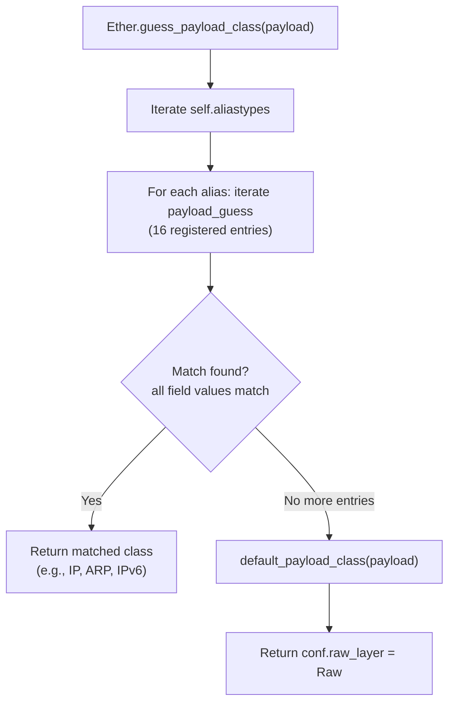
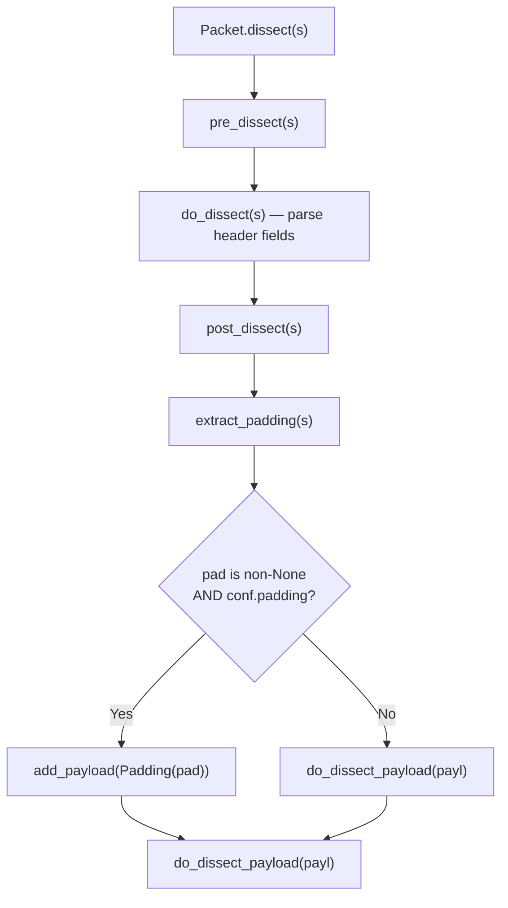

# Scapy Ethernet Layer Investigation: Packet Construction, Padding & EtherType Dispatch

| Metadata | Value |
|----------|-------|
| **Branch** | `scapy_0925ada48540` |
| **Scapy Commit** | `0925ada48540` — "Add AUTOSAR PDUTransport/PDU with initial batch of tests (#3933)" |
| **Date** | 2026-04-09 |

---

## Introduction

This document is a comprehensive technical investigation into how Scapy's Ethernet layer (`Ether`) handles three core behaviors:

1. **Packet construction** — How does `Ether()/IP()/TCP()` build a packet, and what are the default field values?
2. **Padding** — Does Scapy automatically pad frames to the IEEE 802.3 minimum of 60 bytes? If so, when — during `build()` or during `dissect()`?
3. **Unknown EtherType dispatch** — What happens when Scapy encounters an EtherType it does not recognize?

These questions are answered through six interrelated requirements (**R1–R6**), each explored via controlled in-memory experiments and then traced to specific source code locations.

### Methodology

Every observation in this document is derived from one of two sources:

- **In-memory experiments**: Packets are constructed using Scapy's Python API (`Ether()`, `IP()`, `TCP()`, `Raw()`), serialized via `raw()`, and dissected via `Ether(raw_bytes)`. No packets are sent or received on any network interface.
- **Source code analysis**: Each behavioral observation is traced to specific lines in the Scapy source tree. All citations use the format `file_path:line_number` and reference the code at commit `0925ada48540`.

> **The source code is the single source of truth.** No assumptions are made about Ethernet behavior based on external documentation or protocol specifications alone — every claim is grounded in what the code actually does.

---

## Experiment 1: Normal Ethernet/IP/TCP Construction

**Question (R1):** Build a standard `Ether()/IP()/TCP()` packet. Document its structure, field defaults, and total byte length when serialized via `raw()`.

### Code

```python
from scapy.all import *

pkt = Ether()/IP()/TCP()
raw_bytes = raw(pkt)
print(len(raw_bytes))  # 54
pkt.show()
```

### Observed Output

The packet is **54 bytes** total: 14 bytes (Ethernet) + 20 bytes (IP) + 20 bytes (TCP).

```
###[ Ethernet ]###
  dst       = ff:ff:ff:ff:ff:ff
  src       = 00:00:00:00:00:00
  type      = IPv4
###[ IP ]###
     version   = 4
     ihl       = None
     tos       = 0x0
     len       = None
     id        = 1
     flags     =
     frag      = 0
     ttl       = 64
     proto     = tcp
     chksum    = None
     src       = 127.0.0.1
     dst       = 127.0.0.1
###[ TCP ]###
        sport     = ftp_data
        dport     = http
        seq       = 0
        ack       = 0
        dataofs   = None
        reserved  = 0
        flags     = S
        window    = 8192
        chksum    = None
        urgptr    = 0
        options   = ''
```

**Key default values:**

| Layer | Field | Default Value | Notes |
|-------|-------|---------------|-------|
| Ether | `dst` | `ff:ff:ff:ff:ff:ff` | Broadcast |
| Ether | `src` | Local MAC (or `00:00:00:00:00:00` if no interface) | Auto-detected |
| Ether | `type` | `0x0800` (IPv4) | **Not** the field default — overridden by `bind_layers` |
| IP | `version` | `4` | IPv4 |
| IP | `ihl` | `None` (auto-computed to 5 at build time) | 5 × 4 = 20 bytes |
| IP | `len` | `None` (auto-computed to 40 at build time) | 20 IP + 20 TCP |
| IP | `ttl` | `64` | Standard default |
| IP | `proto` | `6` (TCP) | Set by `bind_layers(IP, TCP, proto=6)` |
| TCP | `sport` | `20` (ftp_data) | Scapy default |
| TCP | `dport` | `80` (http) | Scapy default |
| TCP | `flags` | `S` (SYN) | Scapy default |

### Why `type=0x0800` Instead of `0x9000`

The `Ether` class declares its default type as `0x9000`:

```python
# Source: scapy/layers/l2.py:244-248
class Ether(Packet):
    name = "Ethernet"
    fields_desc = [DestMACField("dst"),
                   SourceMACField("src"),
                   XShortEnumField("type", 0x9000, ETHER_TYPES)]
```

However, when `IP()` is stacked on top of `Ether()` via the `/` operator, the type field is overridden to `0x0800` (2048). This happens because of the **`bind_layers`** mechanism:

```python
# Source: scapy/layers/inet.py:1101
bind_layers(Ether, IP, type=2048)
```

This call invokes `bind_top_down(Ether, IP, type=2048)` (at `scapy/packet.py:1953-1971`), which stores `{Ether: {'type': 2048}}` in `IP._overload_fields`. When the `/` operator combines `Ether()` and `IP()`, Scapy checks `IP._overload_fields` and applies the override, setting `Ether.type = 0x0800`.

> **Key insight:** The `Ether` field default `0x9000` is a "no protocol" placeholder (Configuration Testing Protocol / Loopback). It is only visible when `Ether` is constructed without a recognized upper layer.

---

## Experiment 2: Short Payload Padding Behavior

**Question (R2):** Construct an Ethernet frame with a very small payload (~10 bytes). Does Scapy automatically pad the frame to the IEEE 802.3 minimum of 60 bytes (excluding FCS)? Does padding occur during `build()` or during dissection?

### 2a: Build-Time Observation — Scapy Does NOT Pad

```python
pkt = Ether()/IP()/Raw(b"A" * 10)
raw_bytes = raw(pkt)
print(len(raw_bytes))  # 44, NOT 60
```

**Result:** The serialized packet is exactly **44 bytes** (14 Ether + 20 IP + 10 Raw). Scapy does **not** pad the frame to 60 bytes during `build()`.

**Source code trace:**

The `Packet.build()` method at `scapy/packet.py:746-756`:

```python
def build(self):
    p = self.do_build()
    p += self.build_padding()
    p = self.build_done(p)
    return p
```

The `build_padding()` method at `scapy/packet.py:742-744` simply delegates to the payload:

```python
def build_padding(self):
    return self.payload.build_padding()
```

This chain eventually reaches `NoPayload.build_padding()` at `scapy/packet.py:1770-1772`:

```python
def build_padding(self):
    return b""
```

There is **no padding injection logic** anywhere in the build path. The build pipeline produces exactly the bytes contributed by each layer's fields — nothing more.

> **Note:** `conf.min_pkt_size = 60` exists at `scapy/config.py:778`, but this value is used by the **sending layer** (e.g., L2 sockets at the OS level), not by `Packet.build()` itself. Scapy intentionally builds minimal packets and relies on the NIC or driver to handle minimum frame size requirements.

### 2b: Dissection-Time Observation — Padding Detection via `extract_padding()`

Padding detection happens during **dissection**, not during building. The key method is `Packet.dissect()` at `scapy/packet.py:1049-1060`:

```python
def dissect(self, s):
    s = self.pre_dissect(s)
    s = self.do_dissect(s)
    s = self.post_dissect(s)
    payl, pad = self.extract_padding(s)
    self.do_dissect_payload(payl)
    if pad and conf.padding:
        self.add_payload(conf.padding_layer(pad))
```

After parsing the current layer's fields via `do_dissect(s)`, the remaining bytes `s` are passed to `extract_padding(s)`. If the method returns a non-None `pad` and `conf.padding` is truthy (default: `1`, per `scapy/config.py:787`), a `Padding` layer is created.

**Critical insight: `Ether` does NOT override `extract_padding()`.**

The base `Packet.extract_padding()` at `scapy/packet.py:982-990` simply returns `(s, None)`:

```python
def extract_padding(self, s):
    """
    DEV: to be overloaded to extract current layer's padding.

    :param str s: the current layer
    :return: a couple of strings (actual layer, padding)
    """
    return s, None
```

This means the Ethernet layer **never separates padding from payload on its own**. It passes all remaining bytes to the next layer as payload.

### 2c: Who Actually Detects Padding? — `IP.extract_padding()`

The `IP` class overrides `extract_padding()` at `scapy/layers/inet.py:553-557`:

```python
def extract_padding(self, s):
    tmp_len = self.len - (self.ihl << 2)
    if tmp_len < 0:
        return s, b""
    return s[:tmp_len], s[tmp_len:]
```

This method uses the IP header's `len` field to compute the actual payload length:
- `self.len` = total IP packet length (header + data)
- `self.ihl << 2` = IP header length in bytes (typically 20)
- `tmp_len` = expected payload length

Any bytes beyond `tmp_len` are returned as padding. For example, if `IP.len = 30` and `IP.ihl = 5`, then `tmp_len = 30 - 20 = 10`. If 26 bytes remain after parsing IP fields, the first 10 are payload and the last 16 are padding.

Similarly, `Dot3.extract_padding()` at `scapy/layers/l2.py:281-284` uses its `len` field:

```python
def extract_padding(self, s):
    tmp_len = self.len
    return s[:tmp_len], s[tmp_len:]
```

And `UDP.extract_padding()` at `scapy/layers/inet.py:866-868`:

```python
def extract_padding(self, s):
    tmp_len = self.len - 8
    return s[:tmp_len], s[tmp_len:]
```

> **Key insight:** Padding detection is **protocol-dependent**. It requires a layer that has a length field and overrides `extract_padding()`. The `Ether` class has no length field and no override — it relies entirely on inner layers (IP, Dot3, UDP) to identify padding boundaries.

---

## Experiment 3: Raw Roundtrip Fidelity

**Question (R3):** Serialize a short-payload packet to bytes via `raw()`, then re-parse it with `Ether(raw(packet))`. What happens to padding?

### 3a: Roundtrip WITHOUT NIC-Level Padding

```python
pkt = Ether()/IP()/Raw(b"A" * 10)
raw_bytes = raw(pkt)       # 44 bytes — no padding added
pkt2 = Ether(raw_bytes)
print(pkt2.haslayer(Padding))  # False
print(pkt2.layers())           # [Ether, IP, Raw]
```

**Result:** No `Padding` layer appears. Since `raw(pkt)` produces exactly 44 bytes (Scapy adds no padding during build), re-parsing finds no extra bytes.

**Why:** `IP.extract_padding()` computes `tmp_len = 30 - 20 = 10`, which exactly matches the 10-byte Raw payload. There are zero remaining bytes, so `pad` is empty and no `Padding` layer is created.

### 3b: Roundtrip WITH NIC-Level Padding (Simulated)

In real-world scenarios, a NIC or driver pads Ethernet frames to the minimum 60 bytes before transmission. We can simulate this:

```python
pkt = Ether()/IP()/Raw(b"A" * 10)
raw_bytes = raw(pkt)  # 44 bytes
# Simulate NIC padding to 60 bytes
padded_bytes = raw_bytes + b"\x00" * (60 - len(raw_bytes))
print(len(padded_bytes))  # 60

pkt3 = Ether(padded_bytes)
print(pkt3.haslayer(Padding))   # True
print(len(pkt3[Padding].load))  # 16
```

**Result:** A `Padding` layer with 16 null bytes appears.

**What happened step by step:**

1. `Ether.dissect()` parses the first 14 bytes (dst, src, type), leaving 46 bytes
2. Since `type=0x0800`, `guess_payload_class()` returns `IP`
3. `IP.do_dissect()` parses 20 bytes of header, leaving 26 bytes
4. `IP.extract_padding()` computes `tmp_len = 30 - 20 = 10`, returns `(s[:10], s[10:])` — 10 bytes payload, 16 bytes padding
5. `IP.dissect()` at line 1059: `if pad and conf.padding:` → True → creates `Padding(b"\x00" * 16)`
6. The 10-byte payload is dissected as `Raw(load=b"AAAAAAAAAA")`

**Re-serialization behavior:** When the dissected packet (with its `Padding` layer) is re-serialized via `raw()`:

```python
rebuilt = raw(pkt3)
print(len(rebuilt))       # 60
print(rebuilt == padded_bytes)  # True
```

The `Padding` class at `scapy/packet.py:1906-1918` has a special `build_padding()` method:

```python
class Padding(Raw):
    name = "Padding"

    def self_build(self, field_pos_list=None):
        return b""

    def build_padding(self):
        return (
            bytes_encode(self.load) if self.raw_packet_cache is None
            else self.raw_packet_cache
        ) + self.payload.build_padding()
```

- `self_build()` returns `b""` — padding contributes **nothing** to the "self" portion of the packet
- `build_padding()` returns its load bytes — padding is appended at the **end** of the serialized packet, via the `build_padding()` chain called at `scapy/packet.py:754`: `p += self.build_padding()`

So the 16 padding bytes **persist** through the roundtrip and are included in the rebuilt raw output.

---

## Experiment 4: Unknown EtherType Behavior

**Question (R4):** Construct an Ethernet frame with an EtherType that Scapy does not recognize (e.g., `0x9000`, `0xBEEF`, `0x1234`). What does Scapy render after the Ethernet layer?

### 4a: EtherType `0x9000` — Ether's Default Type

```python
pkt = Ether(type=0x9000)/Raw(b"HELLO")
pkt.show()
```

**Output:**

```
###[ Ethernet ]###
  dst       = ff:ff:ff:ff:ff:ff
  src       = <local MAC>
  type      = 0x9000
###[ Raw ]###
     load      = 'HELLO'
```

**Result:** The payload becomes a `Raw` layer. No error is raised. No protocol guessing occurs.

**Why:** `0x9000` (Configuration Testing Protocol / Loopback) is the default `type` value in `Ether.fields_desc` (`scapy/layers/l2.py:248`). However, there is **no** `bind_layers(Ether, ..., type=0x9000)` call anywhere in the codebase. Therefore, `guess_payload_class()` iterates all entries in `Ether.payload_guess`, finds no match for `type=0x9000`, and falls through to `default_payload_class()` which returns `conf.raw_layer` = `Raw`.

Additionally, `0x9000` is **not** present in the `ETHER_TYPES` display dictionary (neither in the bundled fallback data at `scapy/libs/ethertypes.py` nor in the system `/etc/ethertypes`). The `XShortEnumField` therefore displays the raw hex value `0x9000` rather than a symbolic name.

### 4b: EtherType `0xBEEF` — Arbitrary Unknown

```python
pkt = Ether(type=0xBEEF)/Raw(b"TEST")
pkt.show()
```

**Output:**

```
###[ Ethernet ]###
  dst       = ff:ff:ff:ff:ff:ff
  src       = <local MAC>
  type      = 0xbeef
###[ Raw ]###
     load      = 'TEST'
```

**Result:** Same behavior — payload becomes `Raw`. No error, no guessing. `0xBEEF` is not in any `bind_layers` registration and is not in `ETHER_TYPES`.

### 4c: EtherType `0x1234`

```python
pkt = Ether(type=0x1234)/Raw(b"DATA")
pkt.show()
```

**Output:**

```
###[ Ethernet ]###
  dst       = ff:ff:ff:ff:ff:ff
  src       = <local MAC>
  type      = 0x1234
###[ Raw ]###
     load      = 'DATA'
```

**Result:** Payload becomes `Raw`. No error.

**Important distinction regarding `ETHER_TYPES`:** The bundled fallback data at `scapy/libs/ethertypes.py` (line 70) includes `DCA 1234`, which would map `0x1234` to the display name "DCA". However, `ETHER_TYPES` is populated from the system's `/etc/ethertypes` file first (per `scapy/data.py:526-530`), and only falls back to the bundled data if that file is absent. Whether `0x1234` gets a display name depends on the system's ethertypes file.

**Critically, `ETHER_TYPES` is a display-name dictionary only, NOT a dispatch table.** Even if `0x1234` had a symbolic name in `ETHER_TYPES`, the payload would still fall through to `Raw` because there is no `bind_layers(Ether, ..., type=0x1234)` call that would register a protocol dissector for this EtherType.

### 4d: The Complete Dispatch Chain

When `Ether.dissect()` finishes parsing the Ethernet header, the remaining bytes are passed to `do_dissect_payload()`, which calls `guess_payload_class()`. Here is the full dispatch chain:

**Step 1: `guess_payload_class(payload)`** — `scapy/packet.py:1062-1079`

```python
def guess_payload_class(self, payload):
    for t in self.aliastypes:
        for fval, cls in t.payload_guess:
            try:
                if all(v == self.getfieldval(k)
                       for k, v in fval.items()):
                    return cls
            except AttributeError:
                pass
    return self.default_payload_class(payload)
```

The method iterates through `self.aliastypes` (which includes the packet class and its aliases), and for each, iterates the `payload_guess` list. Each entry is a tuple `(field_value_dict, class)` added by `bind_bottom_up()` at `scapy/packet.py:1949-1950`. If all field values match the current packet, the corresponding class is returned.

**Step 2: `default_payload_class(payload)`** — `scapy/packet.py:1081-1090`

If no match is found, this method returns `conf.raw_layer`, which is set to `Raw` at `scapy/packet.py:1921`.

**Step 3: `do_dissect_payload(s)`** — `scapy/packet.py:1023-1047`

The returned class is instantiated with the remaining bytes: `cls(s, _internal=1, _underlayer=self)`. For unknown EtherTypes, this creates `Raw(load=remaining_bytes)`.

### Registered `bind_layers(Ether, ...)` Entries

The `Ether.payload_guess` list contains **16 registered bindings** (as of this commit):

| EtherType | Decimal | Target Class | Registration Source |
|-----------|---------|--------------|---------------------|
| `0x007A` | 122 | `LLC` | `scapy/layers/l2.py:687` |
| `0x8870` | 34928 | `LLC` | `scapy/layers/l2.py:688` |
| `0x8100` | 33024 | `Dot1Q` | `scapy/layers/l2.py:689` |
| `0x88A8` | 34984 | `Dot1AD` | `scapy/layers/l2.py:690` |
| `0x0001` | 1 | `Ether` | `scapy/layers/l2.py:694` |
| `0x0806` | 2054 | `ARP` | `scapy/layers/l2.py:695` |
| `0x88A4` | 34980 | `EtherCat` | `scapy/contrib/ethercat.py` |
| `0x0800` | 2048 | `IP` | `scapy/layers/inet.py:1101` |
| `0x86DD` | 34525 | `IPv6` | `scapy/layers/inet6.py` |
| `0x888E` | 34958 | `EAPOL` | `scapy/layers/eap.py` |
| `0x8863` | 34915 | `PPPoED` | `scapy/layers/ppp.py` |
| `0x8864` | 34916 | `PPPoE` | `scapy/layers/ppp.py` |
| `0x8021` | 32801 | `PPP_IPCP` | `scapy/layers/ppp.py` |
| `0x8053` | 32851 | `PPP_ECP` | `scapy/layers/ppp.py` |
| `0x88D9` | 35033 | `LLTD` | `scapy/layers/lltd.py` |
| `0xA0ED` | 41197 | `SixLoWPAN` | `scapy/layers/sixlowpan.py` |

Any EtherType not in this list will result in a `Raw` payload — silently, with no error.



---

## Experiment 5: Padding Threshold Discovery

**Question (R5):** At what payload size does Scapy stop adding padding (during dissection)?

### 5a: Build-Time Size Sweep — No Padding Ever

```python
for n in [0, 10, 20, 30, 40, 45, 46, 47, 50, 60]:
    pkt = Ether()/Raw(b"A" * n)
    raw_bytes = raw(pkt)
    print(f"N={n}, raw_len={len(raw_bytes)}, expected={14 + n}")
```

**Output:**

| Payload Size (N) | `raw()` Length | Expected (14 + N) | Match? |
|-------------------|----------------|---------------------|--------|
| 0 | 14 | 14 | ✅ |
| 10 | 24 | 24 | ✅ |
| 20 | 34 | 34 | ✅ |
| 30 | 44 | 44 | ✅ |
| 40 | 54 | 54 | ✅ |
| 45 | 59 | 59 | ✅ |
| 46 | 60 | 60 | ✅ |
| 47 | 61 | 61 | ✅ |
| 50 | 64 | 64 | ✅ |
| 60 | 74 | 74 | ✅ |

**Conclusion:** There is **no build-time padding threshold**. Every `raw()` output matches the exact packet content at every size. Scapy never injects padding during `build()`.

### 5b: Dissection-Time Threshold with NIC-Padded Frames (Ether/IP/TCP)

To test padding detection during dissection, we simulate NIC padding by appending null bytes to reach 60 bytes:

```python
for size in range(0, 12):
    pkt = Ether()/IP()/TCP()/Raw(b"A" * size)
    raw_bytes = raw(pkt)
    padded = raw_bytes + b"\x00" * max(0, 60 - len(raw_bytes))
    parsed = Ether(padded)
    has_pad = parsed.haslayer(Padding)
    print(f"payload={size}, raw_len={len(raw_bytes)}, "
          f"padded_len={len(padded)}, has_padding={has_pad}")
```

**Output:**

| TCP Payload | `raw()` Length | Padded Length | Has Padding? |
|-------------|----------------|---------------|--------------|
| 0 | 54 | 60 | **True** |
| 1 | 55 | 60 | **True** |
| 2 | 56 | 60 | **True** |
| 3 | 57 | 60 | **True** |
| 4 | 58 | 60 | **True** |
| 5 | 59 | 60 | **True** |
| **6** | **60** | **60** | **False** |
| 7 | 61 | 61 | False |
| 8 | 62 | 62 | False |

**Threshold:** For `Ether/IP/TCP`, the transition occurs at **TCP payload = 6 bytes**, where the total frame reaches exactly 60 bytes (14 + 20 + 20 + 6 = 60). At this point, no NIC padding is added, so no `Padding` layer is detected.

### 5c: Threshold Breakdown by Protocol Stack

The IEEE 802.3 minimum Ethernet frame is **64 bytes on the wire** (60 bytes excluding the 4-byte FCS). The Ethernet header is 14 bytes, so the minimum payload after the Ether header is **46 bytes**.

| Protocol Stack | Header Total | Minimum Payload for ≥ 60 Bytes | Calculation |
|---------------|-------------|-------------------------------|-------------|
| Ether only | 14 | 46 bytes | 14 + 46 = 60 |
| Ether/IP | 34 | 26 bytes | 14 + 20 + 26 = 60 |
| Ether/IP/TCP | 54 | 6 bytes | 14 + 20 + 20 + 6 = 60 |
| Ether/IP/UDP | 42 | 18 bytes | 14 + 20 + 8 + 18 = 60 |

### 5d: Ether-Only Frames Without IP — No Padding Detection

```python
pkt = Ether()/Raw(b"A" * 10)
raw_bytes = raw(pkt)  # 24 bytes
padded = raw_bytes + b"\x00" * (60 - len(raw_bytes))  # Pad to 60
parsed = Ether(padded)
print(parsed.haslayer(Padding))  # False
print(len(parsed[Raw].load))    # 46 — all bytes merged into Raw.load
```

**Result:** No `Padding` layer is created. The 10 `A` bytes and 36 null bytes are **all merged** into `Raw.load` (46 bytes total).

**Why:** Without an IP layer (or any layer that overrides `extract_padding()`), the base `Packet.extract_padding()` returns `(s, None)`. The Ether layer has no length field and no way to determine where the actual payload ends and padding begins. All remaining bytes become `Raw.load`.

> **Critical insight:** Padding detection is **protocol-dependent**. It requires a layer with a length field (like IP, Dot3, or UDP) that can compute the boundary between real payload and padding. Without such a layer, null bytes are indistinguishable from legitimate payload data.

---

## Source Code Deep Dive: Padding Logic

**Question (R6, Part 1):** Where in the source code does Scapy make padding decisions?

### Where Padding Decisions Are Made

The padding system spans three concerns: **detection** (during dissection), **representation** (the `Padding` class), and **suppression** (via `conf.padding`).

#### The Dissection Pipeline

`Packet.dissect()` at `scapy/packet.py:1049-1060` is the orchestrator:

```
Line 1051: s = self.pre_dissect(s)
Line 1053: s = self.do_dissect(s)
Line 1055: s = self.post_dissect(s)
Line 1057: payl, pad = self.extract_padding(s)
Line 1058: self.do_dissect_payload(payl)
Line 1059: if pad and conf.padding:
Line 1060:     self.add_payload(conf.padding_layer(pad))
```

The critical line is **1057**: after parsing the current layer's fields, the remaining bytes are passed to `extract_padding()`. This method must be overridden by each protocol layer that knows its own length:

| Method | File | Behavior |
|--------|------|----------|
| `Packet.extract_padding()` | `scapy/packet.py:982-990` | Returns `(s, None)` — never splits padding (base implementation) |
| `IP.extract_padding()` | `scapy/layers/inet.py:553-557` | Uses `self.len - (self.ihl << 2)` to compute payload length |
| `Dot3.extract_padding()` | `scapy/layers/l2.py:281-284` | Uses `self.len` to compute payload length |
| `UDP.extract_padding()` | `scapy/layers/inet.py:866-868` | Uses `self.len - 8` to compute payload length |
| `Ether.extract_padding()` | **Not overridden** | Inherits base — returns `(s, None)`, never detects padding |



### The Padding Class

`Padding` at `scapy/packet.py:1906-1918` is a subclass of `Raw`:

```python
class Padding(Raw):
    name = "Padding"

    def self_build(self, field_pos_list=None):
        return b""

    def build_padding(self):
        return (
            bytes_encode(self.load) if self.raw_packet_cache is None
            else self.raw_packet_cache
        ) + self.payload.build_padding()
```

Two key behaviors:

1. **`self_build()` returns `b""`** — During the forward `do_build()` pass, padding contributes nothing. This ensures that when iterating over layers to build the packet, the `Padding` layer adds zero bytes to the "body" of the packet.

2. **`build_padding()` returns the load bytes** — The padding bytes are appended **after** all layers, via the `build_padding()` chain. In `Packet.build()` at line 754: `p += self.build_padding()`. This is what makes the padding appear at the end of the serialized output.

### Build vs. Dissect Asymmetry

| Phase | Path | Padding Behavior |
|-------|------|-----------------|
| **Build** | `build()` → `do_build()` → `build_padding()` → `NoPayload.build_padding()` returns `b""` | No padding added (unless a `Padding` layer already exists from prior dissection) |
| **Dissect** | `dissect()` → `do_dissect()` → `extract_padding()` → `do_dissect_payload()` | Padding layer may be created if inner layer detects trailing bytes |

This asymmetry is **intentional**: Scapy builds minimal packets; the NIC, driver, or OS socket layer is expected to handle minimum frame size padding at send time. During reception, the extra bytes from NIC padding need to be identified and separated from the actual protocol data.

---

## Source Code Deep Dive: EtherType Dispatch

**Question (R6, Part 2):** How does EtherType-to-protocol dispatch work, and what happens with unknown protocols?

### The `bind_layers()` Mechanism

`bind_layers()` at `scapy/packet.py:1974-1996` calls both `bind_top_down()` and `bind_bottom_up()`:

```python
@conf.commands.register
def bind_layers(lower, upper, __fval=None, **fval):
    if __fval is not None:
        fval.update(__fval)
    bind_top_down(lower, upper, **fval)
    bind_bottom_up(lower, upper, **fval)
```

**`bind_bottom_up()`** at `scapy/packet.py:1931-1950` — registers the dissection binding:

```python
def bind_bottom_up(lower, upper, __fval=None, **fval):
    if __fval is not None:
        fval.update(__fval)
    lower.payload_guess = lower.payload_guess[:]
    lower.payload_guess.append((fval, upper))
```

This appends `(field_value_dict, upper_class)` to `lower.payload_guess`. For example, `bind_layers(Ether, IP, type=2048)` adds `({'type': 2048}, IP)` to `Ether.payload_guess`.

**`bind_top_down()`** at `scapy/packet.py:1953-1971` — registers the build binding:

```python
def bind_top_down(lower, upper, __fval=None, **fval):
    if __fval is not None:
        fval.update(__fval)
    upper._overload_fields = upper._overload_fields.copy()
    upper._overload_fields[lower] = fval
```

This adds `{lower: fval}` to `upper._overload_fields`. So `bind_layers(Ether, IP, type=2048)` does **two** things:

1. **Dissection direction:** Adds `({'type': 2048}, IP)` to `Ether.payload_guess` — when dissecting an Ether frame with `type=2048`, the payload is parsed as `IP`
2. **Building direction:** Adds `{Ether: {'type': 2048}}` to `IP._overload_fields` — when building `Ether()/IP()`, the Ether type is automatically set to `2048`

### `guess_payload_class()` → `default_payload_class()` Chain

**`guess_payload_class()`** at `scapy/packet.py:1062-1079`:

```python
def guess_payload_class(self, payload):
    for t in self.aliastypes:
        for fval, cls in t.payload_guess:
            try:
                if all(v == self.getfieldval(k)
                       for k, v in fval.items()):
                    return cls
            except AttributeError:
                pass
    return self.default_payload_class(payload)
```

- Iterates all `aliastypes` (the class itself and any aliases)
- For each, iterates the `payload_guess` list
- Checks if ALL key-value pairs match the current packet's field values
- If a match is found, returns the registered class immediately
- If no match, falls through to `default_payload_class()`

**`default_payload_class()`** at `scapy/packet.py:1081-1090`:

```python
def default_payload_class(self, payload):
    return conf.raw_layer
```

Returns `conf.raw_layer`, which is set to `Raw` at `scapy/packet.py:1921`:

```python
conf.raw_layer = Raw
```

### `ETHER_TYPES` Is NOT a Dispatch Table

`ETHER_TYPES` is loaded at `scapy/data.py:526-530`:

```python
# On non-Windows systems:
ETHER_TYPES = load_ethertypes("/etc/ethertypes")
```

The `load_ethertypes()` function at `scapy/data.py:355` parses this file (or the bundled fallback at `scapy/libs/ethertypes.py`) and returns an `EtherDA` instance (defined at `scapy/data.py:331`). `EtherDA` is a subclass of `DADict` — a display-name dictionary.

`ETHER_TYPES` is used by `XShortEnumField("type", 0x9000, ETHER_TYPES)` in `Ether.fields_desc` **solely for pretty-printing**. When `pkt.show()` renders the `type` field, it looks up the integer value in `ETHER_TYPES` to find a symbolic name (e.g., `2048` → `"IPv4"`). If no name is found, the raw hex value is displayed.

**`ETHER_TYPES` is never consulted for protocol dispatch.** Dispatch uses the `payload_guess` list exclusively, which is populated by `bind_bottom_up()` / `bind_layers()` calls.

### `Ether.dispatch_hook()` — Ether vs. Dot3

Located at `scapy/layers/l2.py:266-272`:

```python
@classmethod
def dispatch_hook(cls, _pkt=None, *args, **kargs):
    if _pkt and len(_pkt) >= 14:
        if struct.unpack("!H", _pkt[12:14])[0] <= 1500:
            return Dot3
    return cls
```

This hook runs **before dissection**, at packet instantiation time. It examines the 2-byte type/length field at offset 12–13:

- If the value is **≤ 1500**, it's interpreted as a length field → the frame is **IEEE 802.3** → `Dot3` class is used
- If the value is **> 1500**, it's an EtherType → the frame is **Ethernet II** → `Ether` class is used

This hook does **not** influence EtherType-to-protocol dispatch (that is handled by `guess_payload_class`). It only decides whether the frame itself is `Ether` or `Dot3`.

---

## Additional Findings

### `conf.padding = 0` Suppresses Padding Layers

```python
from scapy.all import *

conf.padding = 0
padded = raw(Ether()/IP()/Raw(b"A" * 10)) + b"\x00" * 16
parsed = Ether(padded)
print(parsed.haslayer(Padding))  # False
conf.padding = 1  # Restore default
```

**Result:** With `conf.padding = 0`, no `Padding` layer is created even when `IP.extract_padding()` returns non-empty pad bytes.

**Source:** `scapy/packet.py:1059` — `if pad and conf.padding:` — when `conf.padding = 0`, the condition evaluates to `False`, so `conf.padding_layer(pad)` is never called. The padding bytes are silently discarded.

### `Ether` Has No `extract_padding` Override

```python
print('extract_padding' in Ether.__dict__)  # False
```

Confirmed: `Ether` does **not** define its own `extract_padding()`. It inherits the base `Packet.extract_padding()` which always returns `(s, None)`. This means `Ether` can never detect padding on its own — it relies entirely on inner-layer protocols.

---

## Summary of Key Findings

| Question | Answer | Key Source Reference |
|----------|--------|---------------------|
| **R1:** Normal Ether/IP/TCP | 54 bytes total; `type=0x0800` set via `bind_layers` overload mechanism | `scapy/layers/l2.py:244-248`, `scapy/layers/inet.py:1101` |
| **R2:** Does Scapy pad during `build()`? | **NO** — the build path has no padding injection logic | `scapy/packet.py:742-756`, `scapy/packet.py:1770-1772` |
| **R2:** Does Scapy detect padding during `dissect()`? | **YES** — but only via inner-layer `extract_padding()` overrides (IP, Dot3, UDP) | `scapy/layers/inet.py:553-557`, `scapy/packet.py:1049-1060` |
| **R3:** Raw roundtrip fidelity | Without NIC padding: no Padding layer. With NIC padding: Padding layer persists and is included in re-serialization | `scapy/packet.py:1906-1918` |
| **R4:** Unknown EtherType | Falls through to `Raw` silently — no error, no protocol guessing | `scapy/packet.py:1062-1090` |
| **R5:** Padding threshold | 60-byte minimum frame; for Ether/IP/TCP, threshold is TCP payload ≥ 6 bytes | IEEE 802.3 standard + `IP.extract_padding` |
| **R6:** Source code locations | Detailed per-section citations throughout this document | Multiple files (see below) |

### Seven Most Important Insights

1. **Scapy does NOT pad frames during `build()`** — this is by design. The `build()` → `build_padding()` → `NoPayload.build_padding()` chain always returns `b""`. Padding is expected to be handled by the NIC, driver, or OS socket layer at send time.

2. **Padding detection is PROTOCOL-DEPENDENT** — it requires a layer that overrides `extract_padding()` with logic that uses a length field to compute the payload/padding boundary. Examples: `IP`, `Dot3`, `UDP`.

3. **`Ether` does NOT override `extract_padding()`** — it inherits the base implementation that returns `(s, None)`, meaning Ether can never detect padding by itself. Without an inner layer like IP, null bytes from NIC padding merge into the `Raw` payload.

4. **Unknown EtherTypes fall to `Raw`** via the `guess_payload_class()` → `default_payload_class()` → `conf.raw_layer` chain. No error is raised, no protocol guessing occurs.

5. **`ETHER_TYPES` is a display dictionary, NOT a dispatch table** — it maps integer EtherType values to symbolic names for pretty-printing only. Protocol dispatch uses the `payload_guess` list populated by `bind_layers()` calls.

6. **`conf.padding` (default: 1) controls Padding layer creation** — setting it to `0` suppresses `Padding` layers during dissection, even when `extract_padding()` returns non-empty pad bytes.

7. **The `Padding` class is a `Raw` subclass with special build behavior** — `self_build()` returns `b""` (padding adds no bytes during the forward build pass), while `build_padding()` appends the padding bytes at the end of the packet via the `build_padding()` chain.

### Complete Source Code Reference Index

| File | Lines | Content |
|------|-------|---------|
| `scapy/layers/l2.py` | 244–248 | `Ether` class definition, `fields_desc`, default `type=0x9000` |
| `scapy/layers/l2.py` | 266–272 | `Ether.dispatch_hook()` — Ether vs. Dot3 selection |
| `scapy/layers/l2.py` | 281–284 | `Dot3.extract_padding()` |
| `scapy/layers/l2.py` | 686–695 | `bind_layers(Ether, ...)` calls for LLC, Dot1Q, Dot1AD, ARP |
| `scapy/packet.py` | 742–744 | `Packet.build_padding()` |
| `scapy/packet.py` | 746–756 | `Packet.build()` |
| `scapy/packet.py` | 982–990 | `Packet.extract_padding()` — base implementation |
| `scapy/packet.py` | 1023–1047 | `Packet.do_dissect_payload()` |
| `scapy/packet.py` | 1049–1060 | `Packet.dissect()` |
| `scapy/packet.py` | 1062–1079 | `Packet.guess_payload_class()` |
| `scapy/packet.py` | 1081–1090 | `Packet.default_payload_class()` |
| `scapy/packet.py` | 1770–1772 | `NoPayload.build_padding()` |
| `scapy/packet.py` | 1877–1903 | `Raw` class |
| `scapy/packet.py` | 1906–1918 | `Padding` class |
| `scapy/packet.py` | 1921 | `conf.raw_layer = Raw` |
| `scapy/packet.py` | 1931–1950 | `bind_bottom_up()` |
| `scapy/packet.py` | 1953–1971 | `bind_top_down()` |
| `scapy/packet.py` | 1974–1996 | `bind_layers()` |
| `scapy/layers/inet.py` | 553–557 | `IP.extract_padding()` |
| `scapy/layers/inet.py` | 866–868 | `UDP.extract_padding()` |
| `scapy/layers/inet.py` | 1101 | `bind_layers(Ether, IP, type=2048)` |
| `scapy/data.py` | 331 | `EtherDA` class definition |
| `scapy/data.py` | 355 | `load_ethertypes()` function |
| `scapy/data.py` | 526–530 | `ETHER_TYPES` loading |
| `scapy/config.py` | 768 | `conf.padding_layer` declaration |
| `scapy/config.py` | 778 | `conf.min_pkt_size = 60` |
| `scapy/config.py` | 787 | `conf.padding = 1` |
