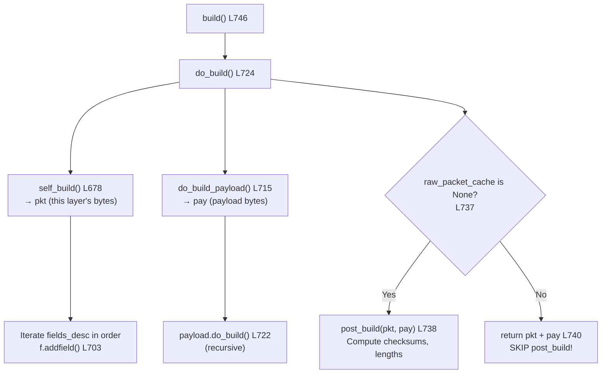
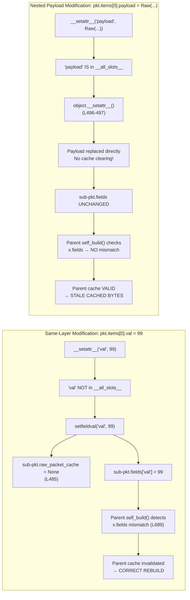
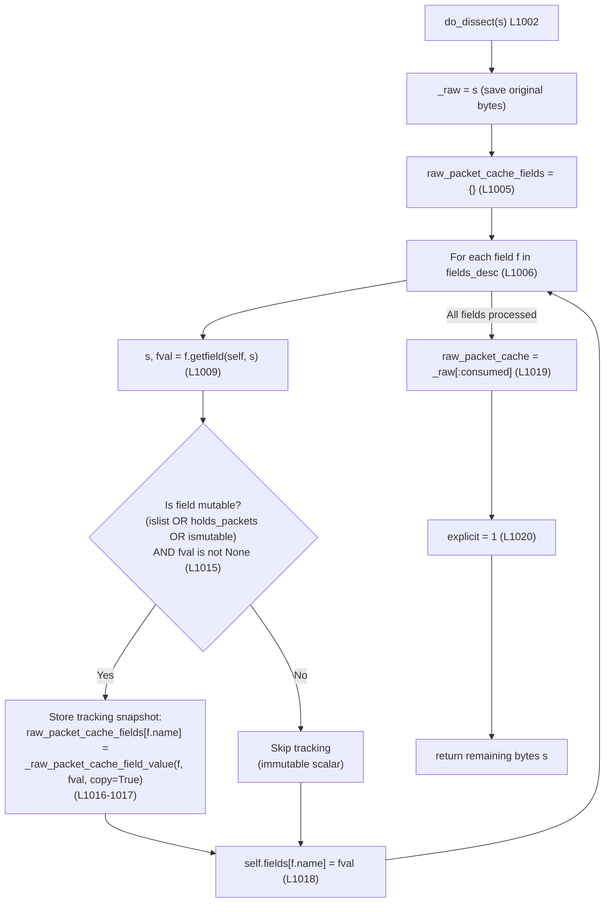
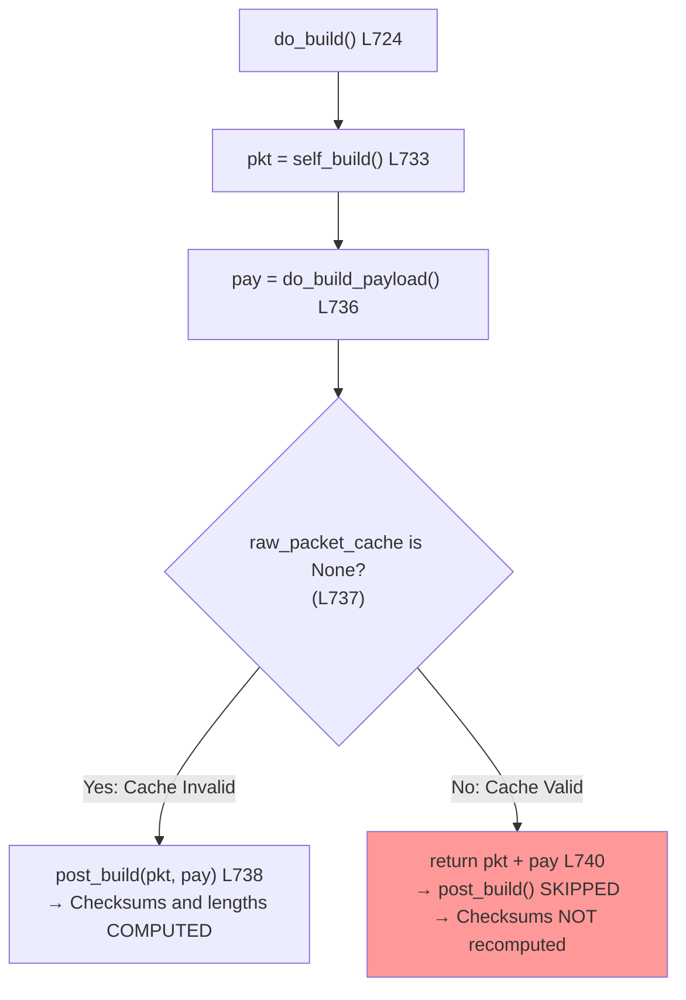

# Scapy Packet Cache Internals: Field Calculation Order, Dual-State Behavior, and Cache Invalidation

This document is a code-traced investigative analysis that answers common questions about Scapy's build pipeline, raw packet caching mechanism, and the surprising behaviors developers encounter when modifying nested payloads in dissected packets. Every claim is grounded in specific source code lines — the code is the truth, and no assumptions are made.

The questions addressed are:

1. **What is the field calculation order** in `post_build()`, and why does checksum computation depend on length finalization?
2. **Does calling `show2()` consecutively produce different results?**
3. **Why do `show()` and `bytes()` disagree** after modifying a nested payload inside a `PacketListField`?
4. **What determines whether Scapy rebuilds a packet or returns cached bytes?**
5. **How does modifying a nested payload differ from modifying a direct field** in terms of cache invalidation?
6. **Does `copy()` fix the dual-state problem?** Why or why not, and what is the correct fix?

## Source Code References

| File | Role |
|------|------|
| `scapy/packet.py` | Core `Packet` class: `build()`, `do_build()`, `self_build()`, `post_build()`, `do_dissect()`, `show()`, `show2()`, `copy()`, `clear_cache()`, `setfieldval()`, `delfieldval()`, `_raw_packet_cache_field_value()` |
| `scapy/fields.py` | Field types: `Field` base class, `PacketListField`, `_PacketField`; cache tracking helpers (`islist`, `holds_packets`, `ismutable`) |
| `scapy/layers/inet.py` | Reference `post_build()` implementations: `IP` (L539), `TCP` (L767), `UDP` (L841) |
| `scapy/compat.py` | `raw()` function (L112): confirms `raw(x) = bytes(x)` |
| `scapy/base_classes.py` | `Packet_metaclass` (L349): builds `__all_slots__` set used by `__setattr__` |

## Table of Contents

- [1. Field Calculation Order in `post_build()`](#1-field-calculation-order-in-post_build)
  - [1.1 The Build Pipeline](#11-the-build-pipeline)
  - [1.2 How `post_build()` Receives Fully-Built Payload](#12-how-post_build-receives-fully-built-payload)
  - [1.3 Why Order Within `post_build()` Matters](#13-why-order-within-post_build-matters)
  - [1.4 Key Insight](#14-key-insight)
- [2. `show2()` Behavior on Consecutive Calls](#2-show2-behavior-on-consecutive-calls)
  - [2.1 What `show2()` Actually Does](#21-what-show2-actually-does)
  - [2.2 Why Consecutive Calls Produce Identical Results](#22-why-consecutive-calls-produce-identical-results)
  - [2.3 `show()` vs `show2()` vs `bytes()` Comparison](#23-show-vs-show2-vs-bytes-comparison)
- [3. The Dual-State Problem](#3-the-dual-state-problem)
  - [3.1 Reproducing the Behavior](#31-reproducing-the-behavior)
  - [3.2 Root Cause: Cache Tracking Blind Spot](#32-root-cause-cache-tracking-blind-spot)
  - [3.3 Same-Layer vs Nested Modification](#33-same-layer-vs-nested-modification)
  - [3.4 Why `show()` and `bytes()` Disagree](#34-why-show-and-bytes-disagree)
- [4. The Complete Cache Lifecycle](#4-the-complete-cache-lifecycle)
  - [4.1 Cache Population During Dissection](#41-cache-population-during-dissection)
  - [4.2 Cache Check During Build](#42-cache-check-during-build)
  - [4.3 Cache Invalidation Rules](#43-cache-invalidation-rules)
  - [4.4 The `do_build()` Cache Gate](#44-the-do_build-cache-gate)
- [5. Does `copy()` Fix the Dual-State Problem?](#5-does-copy-fix-the-dual-state-problem)
  - [5.1 What `copy()` Does to the Cache](#51-what-copy-does-to-the-cache)
  - [5.2 Why `copy()` Does Not Help](#52-why-copy-does-not-help)
  - [5.3 The Correct Fix: `clear_cache()` + `del`](#53-the-correct-fix-clear_cache--del)
- [6. Summary of Practical Remedies](#6-summary-of-practical-remedies)

---

## 1. Field Calculation Order in `post_build()`

### 1.1 The Build Pipeline

When you call `bytes(pkt)` or `raw(pkt)`, Scapy executes a well-defined build pipeline. Here is the complete call chain, traced from the source:

1. **`__bytes__()`** at `Source: scapy/packet.py:592` returns `self.build()`.
2. **`build()`** at `Source: scapy/packet.py:746` calls `self.do_build()` (L753), then appends padding via `build_padding()` (L754) and finalizes via `build_done()` (L755).
3. **`do_build()`** at `Source: scapy/packet.py:724` performs three sub-steps:
   - Calls **`self_build()`** at `Source: scapy/packet.py:678` (invoked at L733) to serialize this layer's fields into bytes.
   - Calls **`do_build_payload()`** at `Source: scapy/packet.py:715` (invoked at L736) which recursively calls `self.payload.do_build()` (L722).
   - Decides whether to call **`post_build(pkt, pay)`** at `Source: scapy/packet.py:758` (invoked at L738) or return cached bytes (L740). This decision is the **cache gate**, detailed in [Section 4.4](#44-the-do_build-cache-gate).
4. **`self_build()`** at `Source: scapy/packet.py:678` iterates over `self.fields_desc` in declaration order (L697), calling `f.addfield(self, p, val)` for each field (L703). Fields are serialized strictly in the order they appear in the class's `fields_desc` list.
5. **`post_build(pkt, pay)`** at `Source: scapy/packet.py:758` receives two arguments:
   - `pkt`: the bytes produced by `self_build()` for the current layer only
   - `pay`: the bytes produced by `do_build_payload()` — the complete, recursively-built payload chain



**Rationale**: The build pipeline is designed so that by the time `post_build()` runs, the `pay` parameter already contains the complete serialized payload. This means `post_build()` has all the information it needs to compute derived values like lengths (which depend on payload size) and checksums (which depend on the finalized header including the length).

### 1.2 How `post_build()` Receives Fully-Built Payload

The default `post_build()` at `Source: scapy/packet.py:758` simply concatenates the layer's bytes with the payload:

```python
def post_build(self, pkt, pay):
    return pkt + pay
```

Protocol layers override this method to fill in auto-computed fields. The key design principle is that `pay` is **already fully built** when `post_build()` is invoked — the recursive call to `payload.do_build()` at L722 has already completed. This means:

- Length calculations can use `len(pkt) + len(pay)` (as IP does) or `len(p)` after `p += pay` (as UDP and TCP do).
- Checksum calculations can cover the complete header + payload bytes.
- There is no need to "wait" for downstream layers — they are already serialized.

### 1.3 Why Order Within `post_build()` Matters

Within a single `post_build()` override, the order of operations is critical because some computed fields depend on other computed fields. The universal pattern across all Scapy protocol layers is: **length/offset fields first, checksums last**.

**IP.post_build()** — `Source: scapy/layers/inet.py:539`

```python
def post_build(self, p, pay):
    ihl = self.ihl
    p += b"\0" * ((-len(p)) % 4)            # Step 1: Pad options (L541)
    if ihl is None:
        ihl = len(p) // 4                    # Step 2: Compute IHL (L542-544)
        p = chb(((self.version & 0xf) << 4) | ihl & 0x0f) + p[1:]
    if self.len is None:
        tmp_len = len(p) + len(pay)           # Step 3: Compute total length (L545-547)
        p = p[:2] + struct.pack("!H", tmp_len) + p[4:]
    if self.chksum is None:
        ck = checksum(p)                      # Step 4: Compute checksum LAST (L548-550)
        p = p[:10] + chb(ck >> 8) + chb(ck & 0xff) + p[12:]
    return p + pay
```

The checksum at Step 4 covers the **entire header** including the `ihl` and `len` fields computed in Steps 2-3. If checksum were computed before length, it would be computed over a header where the `len` field is still zero — producing an incorrect checksum.

**UDP.post_build()** — `Source: scapy/layers/inet.py:841`

```python
def post_build(self, p, pay):
    p += pay                                  # Step 1: Concatenate payload (L842)
    tmp_len = self.len
    if tmp_len is None:
        tmp_len = len(p)                      # Step 2: Compute length (L843-846)
        p = p[:4] + struct.pack("!H", tmp_len) + p[6:]
    if self.chksum is None:                   # Step 3: Compute checksum LAST (L847-863)
        if isinstance(self.underlayer, IP):
            ck = in4_chksum(socket.IPPROTO_UDP, self.underlayer, p)
            if ck == 0:
                ck = 0xFFFF
            p = p[:6] + struct.pack("!H", ck) + p[8:]
        # ... (IPv6 handling omitted for brevity)
    return p
```

**TCP.post_build()** — `Source: scapy/layers/inet.py:767`

```python
def post_build(self, p, pay):
    p += pay                                  # Step 1: Concatenate payload (L768)
    dataofs = self.dataofs
    if dataofs is None:                       # Step 2: Compute data offset (L769-774)
        opt_len = len(self.get_field("options").i2m(self, self.options))
        dataofs = 5 + ((opt_len + 3) // 4)
        dataofs = (dataofs << 4) | orb(p[12]) & 0x0f
        p = p[:12] + chb(dataofs & 0xff) + p[13:]
    if self.chksum is None:                   # Step 3: Compute checksum LAST (L775-786)
        if isinstance(self.underlayer, IP):
            ck = in4_chksum(socket.IPPROTO_TCP, self.underlayer, p)
            p = p[:16] + struct.pack("!H", ck) + p[18:]
        # ... (IPv6 handling omitted for brevity)
    return p
```

All three protocols follow the same pattern:
1. Pad or concatenate payload
2. Compute size-dependent fields (IHL, length, data offset)
3. Compute checksums **last** — because the checksum covers the header bytes that now include the correct length/offset values

### 1.4 Key Insight

The checksum is **NOT** "computed before length is finalized." Within `post_build()`, the order is always correct: lengths and offsets first, checksums last. If you observe stale or incorrect checksums on dissected-then-modified packets, the cause is the **cache gate** in `do_build()` (see [Section 4.4](#44-the-do_build-cache-gate)), which skips `post_build()` entirely when the cache is still valid — not a miscalculation within `post_build()` itself.

---

## 2. `show2()` Behavior on Consecutive Calls

### 2.1 What `show2()` Actually Does

The implementation at `Source: scapy/packet.py:1473-1486`:

```python
def show2(self, dump=False, indent=3, lvl="", label_lvl=""):
    return self.__class__(raw(self)).show(dump, indent, lvl, label_lvl)
```

This single line performs three distinct operations:

1. **`raw(self)`** — Defined at `Source: scapy/compat.py:112` as `return bytes(x)`, which calls `self.__bytes__()` at `Source: scapy/packet.py:592`, which returns `self.build()`. This triggers the full build pipeline, producing the serialized bytes of the packet. If `raw_packet_cache` is valid, `self_build()` returns the cached bytes (L694-695) and `do_build()` may skip `post_build()` (L740).

2. **`self.__class__(raw_bytes)`** — Passes the built bytes to the packet class constructor at `Source: scapy/packet.py:141`. Because `_pkt` is non-empty (L175), the constructor calls `self.dissect(_pkt)` (L176), which calls `do_dissect()` (L1002), producing a **brand-new, freshly dissected packet** with all auto-computed fields populated from the wire bytes.

3. **`.show()`** — Called on the **temporary** freshly dissected packet (not on `self`), displaying all fields with their computed values.

**Critical observation**: `show2()` does **NOT** modify `self`. It creates a wholly new temporary packet object. The original packet's fields, cache, and payload structure are untouched.

### 2.2 Why Consecutive Calls Produce Identical Results

Since `show2()` creates a new temporary packet each time and does not modify `self`:

- Each call independently executes: build `self` → serialize to bytes → re-dissect bytes → show result.
- The original packet `self` is never mutated between calls.
- Given the same `self` state, `raw(self)` produces the same bytes, which dissect to the same fields.
- The result is **deterministic and idempotent** for non-volatile fields.

**Exception for volatile fields**: If the packet contains volatile fields (e.g., `RandShort()` for source port), `raw(self)` resolves them via the `clone_with()` path in `do_build()` at L731-732. However, the volatile field object remains in `self.fields`, so the next `show2()` call generates a new random value. Each call is still independently deterministic — but two calls may show different resolved values for volatile fields because they independently sample from the random distribution.

### 2.3 `show()` vs `show2()` vs `bytes()` Comparison

| Method | What It Does | Auto-computed Fields | Reads Cache? |
|--------|-------------|---------------------|-------------|
| `show()` | Reads in-memory field values directly via `_show_or_dump()` (L1459) | Shows `None` for unset auto-fields on constructed packets | No — reads `self.fields` and `self.default_fields` directly |
| `show2()` | Builds → re-dissects → shows the result (L1486) | Shows computed values (resolved via build then dissection) | Indirectly — `raw(self)` → `build()` may use `raw_packet_cache` |
| `bytes()` / `raw()` | Calls `build()` → `do_build()` → may use cache (L592, L746) | N/A (returns raw bytes) | Yes — `self_build()` returns `raw_packet_cache` if valid (L694) |

**Key difference for dissected packets**: After dissection, all fields (including auto-computed ones like checksums) hold their parsed wire values. `show()` displays these values directly. `bytes()` may return the original cached bytes. `show2()` builds (potentially using cache), then re-dissects the result. If the cache is valid, all three methods reflect the original wire bytes. If you've modified a field and the cache was properly invalidated, `show()` shows the in-memory modification, `bytes()` rebuilds, and `show2()` shows the rebuilt result.

---

## 3. The Dual-State Problem

### 3.1 Reproducing the Behavior

The "dual-state" problem occurs when a dissected packet simultaneously reports two different states: `show()` displays modified values while `bytes()` returns the original, unmodified wire bytes. Here is a concrete reproduction using custom protocol classes:

```python
from scapy.packet import Packet, Raw
from scapy.fields import ByteField, FieldLenField, PacketListField

class Inner(Packet):
    fields_desc = [ByteField("val", 0)]

class Outer(Packet):
    fields_desc = [
        FieldLenField("count", None, count_of="items"),
        PacketListField("items", [], Inner, count_from=lambda p: p.count)
    ]

# Step 1: Build a packet and capture its wire bytes
original_bytes = bytes(Outer(items=[Inner(val=1)]))

# Step 2: Dissect from wire bytes (populates raw_packet_cache)
pkt = Outer(original_bytes)

# Step 3: Modify the PAYLOAD of a sub-packet inside the PacketListField
pkt.items[0].payload = Raw(b"injected")

# Step 4: Observe the dual state
# show() reads in-memory structure → sees the modified payload
pkt.show()        # Shows: val=1 followed by Raw payload "injected"

# bytes() triggers build → cache comparison passes → returns ORIGINAL bytes
assert bytes(pkt) == original_bytes  # TRUE! Original bytes, no "injected"
```

The packet now exists in **two simultaneous states**: the in-memory object graph reflects the modification, but the serialized representation ignores it entirely.

### 3.2 Root Cause: Cache Tracking Blind Spot

The root cause is in `_raw_packet_cache_field_value()` at `Source: scapy/packet.py:648`, which determines what aspects of mutable fields are tracked for cache invalidation:

```python
def _raw_packet_cache_field_value(self, fld, val, copy=False):
    _cpy = lambda x: fld.do_copy(x) if copy else x
    if fld.holds_packets:                          # L652
        if fld.islist:                             # L654
            return [
                _cpy(x.fields) for x in val        # L655-656: ONLY tracks x.fields!
            ]
        else:
            return _cpy(val.fields)                 # L659
    elif fld.islist or fld.ismutable:               # L660
        return _cpy(val)
    return None
```

For `PacketListField` — which has `holds_packets = 1` (inherited from `_PacketField` at `Source: scapy/fields.py:1475`) and `islist = 1` (at `Source: scapy/fields.py:1571`) — the tracking value is `[x.fields for x in val]`. This is a list of the `.fields` dictionaries of each sub-packet.

**Critically, this does NOT track**:
- `x.payload` — the payload chain of each sub-packet
- `x.underlayer` — the underlayer references
- Any nested structure beyond the direct `.fields` dict

When `self_build()` at L685-695 later compares the current tracking value against the stored one:

```python
if self.raw_packet_cache is not None and \
        self.raw_packet_cache_fields is not None:          # L685-686
    for fname, fval in self.raw_packet_cache_fields.items():  # L687
        fld, val = self.getfield_and_val(fname)             # L688
        if self._raw_packet_cache_field_value(fld, val) != fval:  # L689
            self.raw_packet_cache = None                     # L690: invalidate
            ...
            break
    if self.raw_packet_cache is not None:                   # L694
        return self.raw_packet_cache                         # L695: return cached bytes!
```

The comparison at L689 only compares `.fields` dicts. Since modifying a sub-packet's `.payload` does not change the sub-packet's `.fields` dict, the comparison passes, the cache remains valid, and the original dissected bytes are returned at L695.

### 3.3 Same-Layer vs Nested Modification

Understanding why same-layer modifications work correctly while nested payload modifications do not requires tracing two different code paths through `__setattr__` and the cache system.

**Same-layer modification** — `pkt.items[0].val = 99`:

1. `__setattr__("val", 99)` is called on the sub-packet (`Inner` instance) at `Source: scapy/packet.py:494`.
2. `"val"` is **not** in `self.__all_slots__` (it's a protocol field, not a Python slot), so execution falls through to `self.setfieldval("val", 99)` at L499.
3. In `setfieldval()` at `Source: scapy/packet.py:472`, `"val"` is found in `self.default_fields` (L476), triggering the first branch.
4. The sub-packet's cache is cleared at L484-486:
   ```python
   self.explicit = 0
   self.raw_packet_cache = None
   self.raw_packet_cache_fields = None
   self.wirelen = None
   ```
5. The sub-packet's `.fields["val"]` is updated (L482-483).
6. When the **parent** (`Outer`) packet's `self_build()` runs (L685-695), it compares `[x.fields for x in val]` against the cached tracking value. Since `x.fields["val"]` has changed from `1` to `99`, the comparison at L689 **fails**, invalidating the parent's cache too.
7. Result: **both** the sub-packet and parent are correctly rebuilt.

**Nested payload modification** — `pkt.items[0].payload = Raw(b"injected")`:

1. `__setattr__("payload", Raw(b"injected"))` is called on the sub-packet at `Source: scapy/packet.py:494`.
2. `"payload"` **IS** in `self.__all_slots__` — it is listed in `Packet.__slots__` at `Source: scapy/packet.py:90`, and `__all_slots__` is built by the metaclass at `Source: scapy/base_classes.py:352-356` as the union of all `__slots__` from the MRO.
3. Therefore, `__setattr__` takes the **early return** at L496-497:
   ```python
   if attr in self.__all_slots__:
       return object.__setattr__(self, attr, val)
   ```
4. `object.__setattr__` directly replaces the `payload` attribute on the sub-packet instance. **No `setfieldval()` is called. No `remove_payload()` or `add_payload()` is called. No cache clearing occurs.**
5. The sub-packet's `.fields` dict is **unchanged** — only `.payload` (a slot attribute) was modified.
6. When the parent's `self_build()` compares `[x.fields for x in val]`, the `.fields` dicts match perfectly — the comparison at L689 **passes**.
7. Neither the sub-packet's cache nor the parent's cache is invalidated.
8. Result: `self_build()` returns `self.raw_packet_cache` (the original dissected bytes) at L695.



### 3.4 Why `show()` and `bytes()` Disagree

The disagreement exists because `show()` and `bytes()` read from fundamentally different data sources:

- **`show()`** at `Source: scapy/packet.py:1459` calls `_show_or_dump()`, which recursively traverses the **live in-memory packet object graph**. It reads `self.fields` for each layer and then traverses `self.payload`. Since the payload was replaced in-memory, `show()` sees the modification.

- **`bytes()`** at `Source: scapy/packet.py:592` calls `build()` → `do_build()` → `self_build()`. The `self_build()` cache comparison at L685-695 passes (because `.fields` dicts haven't changed), so it returns `self.raw_packet_cache` — the **original dissected bytes** from before the modification.

The packet literally exists in two states simultaneously: the in-memory object graph contains the modified payload, while the serialization system returns the original wire bytes.

---

## 4. The Complete Cache Lifecycle

### 4.1 Cache Population During Dissection

When a packet is dissected from wire bytes, the `do_dissect()` method at `Source: scapy/packet.py:1002` populates the raw packet cache:

```python
def do_dissect(self, s):
    _raw = s                                           # L1004: save original bytes
    self.raw_packet_cache_fields = {}                  # L1005: init tracking dict
    for f in self.fields_desc:                         # L1006: iterate fields
        if not s:
            break
        s, fval = f.getfield(self, s)                  # L1009: dissect each field
        if isinstance(f, ConditionalField) and fval is None:
            continue                                   # L1011-1012: skip unused conditionals
        if (f.islist or f.holds_packets or f.ismutable) and fval is not None:
            self.raw_packet_cache_fields[f.name] = \
                self._raw_packet_cache_field_value(f, fval, copy=True)  # L1015-1017
        self.fields[f.name] = fval                     # L1018: store parsed value
    self.raw_packet_cache = _raw[:-len(s)] if s else _raw  # L1019: cache consumed bytes
    self.explicit = 1                                  # L1020
    return s                                           # remaining bytes → payload
```

Key details:

- **`raw_packet_cache`** (L1019): Stores the **exact wire bytes** consumed by this layer (everything except what's left for the payload). This is the byte string that `self_build()` will return if the cache is deemed valid.
- **`raw_packet_cache_fields`** (L1005-1017): A dictionary tracking only **mutable** fields — those with `islist=1`, `holds_packets=1`, or `ismutable=True` (L1015). Immutable scalar fields (like `ByteField`, `ShortField`) are NOT tracked because their in-memory values can be compared directly via `self.fields`. Only mutable objects (lists, packets) need deep-copy tracking.
- **`_raw_packet_cache_field_value(f, fval, copy=True)`** (L1016-1017): Creates a **deep copy** of the tracking value at dissection time. The `copy=True` parameter ensures the stored snapshot is independent of future in-memory mutations. For `PacketListField`, this is `[fld.do_copy(x.fields) for x in val]` — a deep copy of each sub-packet's `.fields` dict.
- **`explicit = 1`** (L1020): Marks the packet as having explicit field values (parsed from wire), which affects the `do_build()` volatile-field resolution at L731-732.



### 4.2 Cache Check During Build

When `self_build()` at `Source: scapy/packet.py:678` runs during a subsequent `build()` call, it checks whether the cache is still valid:

```python
def self_build(self):
    if self.raw_packet_cache is not None and \
            self.raw_packet_cache_fields is not None:      # L685-686: both must exist
        for fname, fval in self.raw_packet_cache_fields.items():  # L687: check each tracked field
            fld, val = self.getfield_and_val(fname)         # L688: get current value
            if self._raw_packet_cache_field_value(fld, val) != fval:  # L689: compare
                self.raw_packet_cache = None                 # L690: INVALIDATE
                self.raw_packet_cache_fields = None          # L691
                self.wirelen = None                          # L692
                break                                        # L693
        if self.raw_packet_cache is not None:               # L694: still valid?
            return self.raw_packet_cache                     # L695: return cached bytes!
    # ... fall through to field-by-field serialization at L696-713
```

The comparison at L689 calls `_raw_packet_cache_field_value(fld, val)` with `copy=False` (default) — it reads the **current** values without copying. It then compares against `fval`, which is the deep-copied snapshot from dissection time.

**If all tracked fields match**: the cache is valid, and `self_build()` returns the original `raw_packet_cache` bytes at L695. No field-by-field serialization occurs.

**If any tracked field differs**: the cache is invalidated at L690-692, and execution falls through to the field-by-field serialization loop at L696-713, which calls `f.addfield()` for each field in `fields_desc` order.

### 4.3 Cache Invalidation Rules

The cache can be invalidated through five distinct mechanisms:

**1. `setfieldval(attr, val)` — Direct field assignment** (`Source: scapy/packet.py:472`)

When `attr` is found in `self.default_fields` (L476), lines 484-487 unconditionally clear:
```python
self.explicit = 0            # L484
self.raw_packet_cache = None # L485
self.raw_packet_cache_fields = None  # L486
self.wirelen = None          # L487
```
This is the most common invalidation path — triggered whenever you set a protocol field like `pkt.src = "10.0.0.1"`.

**2. `delfieldval(attr)` — Field deletion** (`Source: scapy/packet.py:504`)

When `attr` is found in `self.fields` (L506), lines 508-511 clear the same set:
```python
self.explicit = 0            # L508
self.raw_packet_cache = None # L509
self.raw_packet_cache_fields = None  # L510
self.wirelen = None          # L511
```
This is triggered by `del pkt.chksum`, which removes the explicit value and allows it to fall back to the default (`None`).

**3. `setfieldval` payload branch — Setting `payload` via `setfieldval()`** (`Source: scapy/packet.py:488-490`)

```python
elif attr == "payload":
    self.remove_payload()
    self.add_payload(val)
```
**Cache is NOT cleared in this branch.** However, this code path is only reached when calling `pkt.setfieldval("payload", val)` directly — not via the `pkt.payload = val` attribute assignment syntax (see point 5 below).

**4. `setfieldval` pass-through — Setting a field on a deeper layer** (`Source: scapy/packet.py:491-492`)

```python
else:
    self.payload.setfieldval(attr, val)
```
When `attr` is not in the current layer's `default_fields` and is not `"payload"`, the call is delegated to the payload. **The current layer's cache is NOT cleared** — only the payload layer's `setfieldval()` may clear the payload's own cache.

**5. Direct `__setattr__` for slot attributes** (`Source: scapy/packet.py:494-497`)

```python
def __setattr__(self, attr, val):
    if attr in self.__all_slots__:
        return object.__setattr__(self, attr, val)
```
Since `"payload"` is in `__all_slots__` (populated from `Packet.__slots__` at L90 by the metaclass at `Source: scapy/base_classes.py:352-356`), writing `pkt.payload = X` bypasses `setfieldval()` entirely. The attribute is directly replaced via `object.__setattr__`, with **no cache clearing, no `remove_payload()`, and no `add_payload()`**.

**6. `clear_cache()` — Explicit recursive cache clearing** (`Source: scapy/packet.py:664`)

```python
def clear_cache(self):
    self.raw_packet_cache = None                       # L667: clear this layer
    for fname, fval in self.fields.items():            # L668: iterate fields
        fld = self.get_field(fname)                    # L669
        if fld.holds_packets:                          # L670
            if isinstance(fval, Packet):               # L671
                fval.clear_cache()                     # L672: recurse into single packet
            elif isinstance(fval, list):               # L673
                for fsubval in fval:                   # L674
                    fsubval.clear_cache()              # L675: recurse into each list item
    self.payload.clear_cache()                         # L676: recurse into payload
```
This recursively clears `raw_packet_cache` on the current layer, all held packets (in `PacketListField` and `PacketField` values), and the entire payload chain. This is the only mechanism that reliably clears cache across all nesting levels.

### 4.4 The `do_build()` Cache Gate

This is the most consequential undocumented behavior in the cache system. At `Source: scapy/packet.py:737-740`:

```python
def do_build(self):
    if not self.explicit:
        self = next(iter(self))                        # L731-732: resolve volatiles
    pkt = self.self_build()                            # L733
    for t in self.post_transforms:
        pkt = t(pkt)                                   # L734-735
    pay = self.do_build_payload()                      # L736
    if self.raw_packet_cache is None:                  # L737: THE CACHE GATE
        return self.post_build(pkt, pay)               # L738: checksums computed!
    else:
        return pkt + pay                               # L740: post_build() SKIPPED!
```

**When `raw_packet_cache` is `None`** (cache was invalidated): `do_build()` calls `post_build(pkt, pay)` at L738, which computes checksums, lengths, and other derived fields.

**When `raw_packet_cache` is NOT `None`** (cache is valid): `do_build()` returns `pkt + pay` **directly** at L740, **completely skipping `post_build()`**.

This has a critical implication: **even if the payload was somehow correctly rebuilt** (producing different `pay` bytes), the parent layer's `post_build()` is never called when the parent's cache is valid. This means:
- Length fields (computed in `post_build()`) are NOT recalculated
- Checksums (computed in `post_build()`) are NOT recalculated
- Any other derived field that depends on payload size or content is stale

This is the fundamental mechanism that causes stale checksums and lengths in dissected-then-modified packets — not a wrong calculation order within `post_build()`, but the complete skipping of `post_build()` by the cache gate.



---

## 5. Does `copy()` Fix the Dual-State Problem?

### 5.1 What `copy()` Does to the Cache

The `copy()` method at `Source: scapy/packet.py:407-426`:

```python
def copy(self) -> Self:
    clone = self.__class__()
    clone.fields = self.copy_fields_dict(self.fields)
    clone.default_fields = self.copy_fields_dict(self.default_fields)
    clone.overloaded_fields = self.overloaded_fields.copy()
    clone.underlayer = self.underlayer
    clone.parent = self.parent
    clone.explicit = self.explicit                              # L415
    clone.raw_packet_cache = self.raw_packet_cache              # L416: COPIES the cache!
    clone.raw_packet_cache_fields = self.copy_fields_dict(      # L417-419: COPIES tracking dict!
        self.raw_packet_cache_fields
    )
    clone.wirelen = self.wirelen
    clone.post_transforms = self.post_transforms[:]
    clone.payload = self.payload.copy()                          # L422: recursive copy
    clone.payload.add_underlayer(clone)
    clone.time = self.time
    clone.comment = self.comment
    return clone
```

Key observations:

- **Line 416**: `clone.raw_packet_cache = self.raw_packet_cache` — the cache bytes are **directly assigned** to the clone. Since `bytes` is immutable in Python, both the original and clone reference the same byte string.
- **Lines 417-419**: `clone.raw_packet_cache_fields = self.copy_fields_dict(self.raw_packet_cache_fields)` — the tracking dictionary is deep-copied via `copy_fields_dict()` at L641-646, which calls `fld.do_copy(value)` for each field.
- **Line 422**: `clone.payload = self.payload.copy()` — the payload chain is recursively copied, which also preserves **its** cache (the recursive `copy()` also copies `raw_packet_cache` at L416).

### 5.2 Why `copy()` Does Not Help

After `copy()`, the clone has:
- A valid `raw_packet_cache` holding the original dissected bytes
- A `raw_packet_cache_fields` tracking dict that matches the current field values
- A recursively copied payload chain, each layer also preserving its own cache

The clone is in the **exact same cache state** as the original. Any modification to the clone that would escape cache detection on the original (such as modifying a sub-packet's payload) will also escape detection on the clone.

`copy()` is designed for **value isolation** — ensuring that modifying the clone's fields doesn't affect the original's fields (and vice versa). It is NOT designed for cache reset. The cache preservation is intentional: it ensures that an unmodified copy serializes efficiently without rebuilding.

### 5.3 The Correct Fix: `clear_cache()` + `del`

The correct fix for the dual-state problem is a two-step process:

**Step 1: Clear the cache** using `clear_cache()` at `Source: scapy/packet.py:664`:

```python
pkt.clear_cache()
```

This recursively sets `raw_packet_cache = None` on the packet, all sub-packets held in `PacketListField` and `PacketField` values, and the entire payload chain. After this, `self_build()` will fall through to field-by-field serialization, and `do_build()` will call `post_build()`.

**Step 2: Delete auto-computed fields** that hold explicit dissected values:

```python
del pkt[IP].chksum
del pkt[IP].len
del pkt[UDP].chksum
del pkt[UDP].len
```

**Why is Step 2 necessary?** After dissection, auto-computed fields hold their parsed wire values (e.g., `chksum = 0x1a2b`), not `None`. The `post_build()` guards in protocol layers check for `None`:

```python
# In IP.post_build() at scapy/layers/inet.py L548:
if self.chksum is None:      # Only recomputes if chksum is None!
    ck = checksum(p)
    ...
```

If `self.chksum` holds an explicit value like `0x1a2b` (parsed from wire), this guard evaluates to `False`, and the checksum is NOT recomputed — even though the payload has changed and the old checksum is now wrong.

`del pkt[IP].chksum` calls `__delattr__("chksum")` at `Source: scapy/packet.py:519`, which (since `"chksum"` is not `"payload"` and not in `__all_slots__`) calls `delfieldval("chksum")` at L526. `delfieldval()` at L504 removes `"chksum"` from `self.fields` (L507), making `getfieldval("chksum")` fall back to `self.default_fields["chksum"]`, which is `None` (the default from `XShortField("chksum", None)` in the class definition). Now `post_build()` will see `self.chksum is None` and recompute the checksum.

**Complete working example**:

```python
from scapy.layers.inet import IP, UDP
from scapy.packet import Raw

# Build and dissect a packet
original = IP(dst="10.0.0.1") / UDP(dport=53) / Raw(b"hello")
wire_bytes = bytes(original)
pkt = IP(wire_bytes)  # dissect from wire

# Modify the payload
pkt[Raw].load = b"modified payload that is longer"

# WRONG: bytes(pkt) still returns original wire_bytes because cache is valid

# CORRECT FIX:
pkt.clear_cache()       # Step 1: clear all caches recursively
del pkt[IP].len         # Step 2a: reset IP length to None
del pkt[IP].chksum      # Step 2b: reset IP checksum to None
del pkt[UDP].len        # Step 2c: reset UDP length to None
del pkt[UDP].chksum     # Step 2d: reset UDP checksum to None

# Now bytes(pkt) correctly rebuilds with new payload, length, and checksum
new_bytes = bytes(pkt)
assert new_bytes != wire_bytes  # TRUE: correctly rebuilt
```

---

## 6. Summary of Practical Remedies

| Problem | Wrong Fix | Why It's Wrong | Correct Fix |
|---------|-----------|----------------|-------------|
| Dual-state: `show()` ≠ `bytes()` after nested modification | `copy()` | Preserves `raw_packet_cache` (L416) | `pkt.clear_cache()` |
| Stale checksums after modification of dissected packet | Just `clear_cache()` | Dissected checksums are explicit values, not `None`; `post_build()` guards like `if self.chksum is None` won't trigger | `clear_cache()` + `del pkt[Layer].chksum` |
| Stale lengths after modification of dissected packet | Just `clear_cache()` | Dissected lengths are explicit values, not `None`; `post_build()` guards like `if self.len is None` won't trigger | `clear_cache()` + `del pkt[Layer].len` |
| Need to see computed field values | `show()` | Shows `None` for unset auto-fields on constructed (non-dissected) packets | `show2()` — builds, re-dissects, then shows computed values |

### The Safest Pattern

After modifying any part of a dissected packet, apply this universal fix to ensure correct serialization:

```python
# After modifying any part of a dissected packet:
pkt.clear_cache()

# Delete ALL auto-computed fields on affected layers so post_build() recomputes them:
for layer_cls in [IP, TCP, UDP]:  # adapt to the layers in your packet
    if layer_cls in pkt:
        for field_name in ['len', 'chksum', 'ihl', 'dataofs']:
            try:
                delattr(pkt[layer_cls], field_name)
            except (AttributeError, KeyError):
                pass

# Now bytes(pkt) will correctly rebuild everything:
# - clear_cache() ensures self_build() serializes fields instead of returning cached bytes
# - clear_cache() ensures do_build() calls post_build() (the cache gate at L737 sees None)
# - Deleted fields fall back to None defaults, so post_build() guards trigger recomputation
rebuilt_bytes = bytes(pkt)
```

**Why both steps are necessary**:
- `clear_cache()` alone ensures the cache gate at L737 allows `post_build()` to run — but `post_build()` will still skip recomputation for fields that hold explicit non-`None` values.
- `del` alone (without `clear_cache()`) clears the layer's cache via `delfieldval()` at L509-510, but only for that specific layer — nested sub-packets in `PacketListField` still retain their caches.
- Together, they guarantee correct serialization across all layers and nesting levels.
