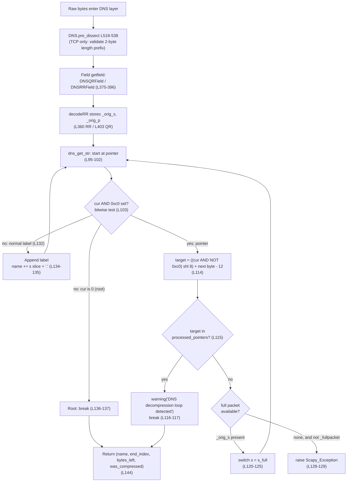

# How Scapy Implements DNS Domain-Name Compression

> An onboarding explainer that traces the complete DNS name lifecycle in Scapy — from raw bytes entering the layer, through decompression (parse) and compression (build), to a fully resolved name — and shows how the machinery handles both well-formed and deliberately twisted packets.

## The question, restated

An engineer joining the project wants to understand what *really* happens from the moment raw bytes enter the DNS layer to when a fully resolved domain name emerges: how Scapy unwinds compression-pointer chains into a readable name, how names are encoded into length-prefixed labels, how the `0xc0` marker is recognized, how loops and out-of-bounds/truncated pointers are handled, how cross-record references stay resolvable, how the build side decides what to compress, and whether differing pointer placements always decompress to identical strings — i.e., how the compression machinery copes with both well-formed packets and adversarial ones that try to break the rules.

## Methodology (run-first, evidence-grounded)

This document follows a **run-first** methodology:

- **Every behavioral claim is backed by an exact `file:line` citation and/or a verbatim runtime transcript.** Code citations are pinned to git branch `scapy_0925ada48540`, HEAD `0925ada4` (full `0925ada485406684174d6f068dbd85c4154657b3`).
- **Runtime output is quoted exactly as observed.** Transcripts were produced by importing Scapy in place (no install) with `PYTHONDONTWRITEBYTECODE=1 PYTHONPATH=<repo> python3 -u` against a script kept outside the repository tree, so the tracked working tree stayed byte-for-byte unchanged (`git status --porcelain` remained empty). The single loop `WARNING` line is emitted once per call by Scapy's own runtime logger.
- **Unless another path is given, all citations refer to `scapy/layers/dns.py`** (1,179 lines) — the module that contains every DNS name encode/decode/compress/decompress unit. Supporting helpers are `scapy/error.py` (`Scapy_Exception`, `log_runtime`, `warning`), `scapy/compat.py` (`orb`, `chb`, `raw`, `bytes_encode`, `plain_str`), `scapy/packet.py` (`Packet` and its `__slots__`), and `scapy/fields.py` (`StrField` / `StrLenField`). The read-only behavioral reference corpus is `test/scapy/layers/dns.uts`.

The exact imports the module relies on are declared at `scapy/layers/dns.py:L20-21`:

```python
from scapy.compat import orb, raw, chb, bytes_encode, plain_str   # scapy/layers/dns.py:L20
from scapy.error import log_runtime, warning, Scapy_Exception     # scapy/layers/dns.py:L21
```

### How the transcripts were reproduced

All transcripts below came from a single script (kept under `/tmp/**`, removed afterward), using only the Python standard library plus Scapy:

```python
from scapy.layers.dns import dns_get_str, dns_encode, dns_compress, DNS, DNSQR, DNSRR
from scapy.error import Scapy_Exception
from scapy.compat import raw

print(dns_get_str(b"\xc0\x0c", 0, _fullpacket=True))                  # (A) loop
print(dns_get_str(b"\x05ab", 0, _fullpacket=True))                    # (B) OOB label
print(dns_get_str(b"\xc0", 0, _fullpacket=True))                      # (C) incomplete jump
try:
    dns_get_str(b"\xc0\x0c", 0, pkt=None, _fullpacket=False)          # (D) no full packet
except Scapy_Exception as e:
    print("Scapy_Exception", e)
print(dns_get_str(b"\x40" + b"AAAAA" + b"\x00", 0, _fullpacket=True)) # (E) 0x40 label
pkt = DNS(qd=DNSQR(qname='www.example.com'),
          an=DNSRR(rrname='www.example.com', type='A', rdata='1.2.3.4'))
print(len(raw(pkt)), len(raw(dns_compress(pkt))))                     # 64, 49
print(dns_encode(b'www.example.com'), dns_encode(b''), dns_encode(b'.'))
```

The ten sub-questions are answered below in a logical order — foundation → parse → robustness → build → determinism → lifecycle → synthesis — and the document closes with a coverage-pass checklist confirming all ten.

---

## (2) Wire format / label encoding

> *"how domain names get encoded into those length-prefixed label sequences before compression even enters the picture"*

**Code:** `dns_encode(x, check_built=False)` at `scapy/layers/dns.py:L154-172`.

- **Empty / root special case** — `if not x or x == b".": return b"\x00"` at `scapy/layers/dns.py:L161-162`. An empty name or a bare `"."` (the DNS root) encodes to a single zero octet.
- **Label join + 63-byte cap** — `x = b"".join(chb(len(y)) + y for y in (k[:63] for k in x.split(b".")))` at `scapy/layers/dns.py:L169`. The name is split on `.`; each label `y` is emitted as its length byte `chb(len(y))` followed by the label bytes. The slice `k[:63]` caps every label at **63** octets (`0x3f`).
- **Terminator** — `if x[-1:] != b"\x00": x += b"\x00"` at `scapy/layers/dns.py:L170-171`. A trailing zero octet closes the name.
- Helper `chb` (int → single byte) is `scapy/compat.py:L140`.

**Verbatim transcript:**

```text
dns_encode(b'www.example.com'): b'\x03www\x07example\x03com\x00'
dns_encode(b''): b'\x00'
dns_encode(b'.'): b'\x00'
```

**Rationale.** A human-readable name becomes a sequence of `<len><label>` pairs terminated by a zero octet. `www.example.com` becomes `\x03www\x07example\x03com\x00` — that is `3` + `www`, `7` + `example`, `3` + `com`, then the `\x00` root terminator. This matches **RFC 1035 §4.1.4**, which specifies that a label begins with two zero bits and is restricted to 63 octets or fewer. Crucially, the `k[:63]` cap means a length byte produced by `dns_encode` can never legitimately reach `0x40` or above — a fact that becomes important for the determinism quirk discussed in sub-question (8): because the top two bits of any Scapy-emitted length byte are always `00`, they can never be mistaken for the `11` of a compression pointer.

---

## (1) Decompression chain & start point

> *"how does Scapy unravel that chain of references into a readable domain name, and where does the unwinding actually begin?"*

**Code:** `dns_get_str(s, pointer=0, pkt=None, _fullpacket=False)` at `scapy/layers/dns.py:L69-144` — the decompression engine.

- **Unwinding begins at the supplied `pointer`** (default `0`): the main loop `while True:` at `L95`; each iteration reads `cur = orb(s[pointer])` at `L101` and advances `pointer += 1` at `L102`. So the caller decides where reading starts — the field machinery passes the current offset for record names, or `0` for an rdata slice (see sub-question 9).
- **Bounds guard at the top of the loop**: `if abs(pointer) >= max_length:` at `L96` (detailed in sub-question 5).
- **Normal label branch**: `elif cur > 0:  # Label` at `L132` appends the label and a dot — `name += s[pointer:pointer + cur] + b"."` at `L134` — then skips past it with `pointer += cur` at `L135`.
- **Root terminator**: `else: break` at `L136-137` — a `0x00` length byte ends the name.
- **Return tuple**: `return name, pointer, bytes_left, len(processed_pointers) != 0` at `L144` — i.e. `(decoded_name, end_index, bytes_left, was_compressed)`. The `end_index` reflects where parsing of *this* field ends; when a pointer was followed, it is restored from `after_pointer` (`L138-140`), not from the jump target.
- Helper `orb` (single byte → int) is `scapy/compat.py:L146`.

**Verbatim transcript** (a clean, uncompressed name showing the 4-tuple shape):

```text
dns_get_str(b"\x06da", 0, _fullpacket=True) = (b'da.', 7, b'', False)
```

**Rationale.** Unwinding begins wherever the caller points (`pointer`, default `0`). The engine reads one length-prefixed label at a time, appends `label + b"."`, and continues until it meets a `0x00` root byte or a pointer redirect. The fourth element of the returned tuple, `was_compressed`, is `True` **iff** at least one pointer was followed (`len(processed_pointers) != 0`); in the transcript above no pointer was followed, so it is `False`. (This same input is revisited under sub-question 5 as the "premature end" case — the leading length byte claims 6 bytes but only 2 are present.)

---

## (3) The `0xc0` marker

> *"how the 0xc0 marker distinguishes a compression pointer from a normal label length"*

**Code:**

- **Marker test**: `if cur & 0xc0:  # Label pointer` at `scapy/layers/dns.py:L103`. This is a **bitwise-AND, not an equality test**. Any byte with either of its top two bits set makes `cur & 0xc0` truthy, so `0xc0`, `0x80`, and `0x40` all take the pointer branch. (The consequence for `0x40` is explored in sub-question 8.)
- **Target computation**: `pointer = ((cur & ~0xc0) << 8) + orb(s[pointer]) - 12` at `scapy/layers/dns.py:L114`. The top two bits are masked off with `cur & ~0xc0` to recover the high 6 bits of the 14-bit offset; those are shifted left by 8 and OR-ed with the next byte to form the wire offset. The trailing **`- 12`** normalizes that wire offset — measured from the start of the 12-byte DNS header — into an index within the layer body (see sub-question 6 for why the body starts 12 bytes in).
- **Build-side counterpart**: the high bits are set with `fb_index = ((index >> 8) | 0xc0)` at `scapy/layers/dns.py:L227` (see sub-question 7).

**Verbatim transcript** (the canonical `0xc00c` pointer to offset `12`, from the determinism smoke test):

```text
compressed hex: 00000100000100010000000003777777076578616d706c6503636f6d0000010001c00c0001000100000000000401020304
contains pointer 0xc00c: True
```

Reading the hex from the first name onward: `03777777` = `\x03www`, `076578616d706c65` = `\x07example`, `03636f6d` = `\x03com`, `00` = the root terminator; later, `c00c` is a compression pointer to offset `12` — exactly where the question's `www.example.com` already sits.

**Rationale.** A leading byte whose top two bits are set (`11xxxxxx`) marks a two-octet compression pointer; the remaining 14 bits encode the offset. Per **RFC 1035 §4.1.4**, the `11` combination is defined for pointers while `10` and `01` are reserved, and a real label always begins with `00`. Because Scapy's test is the bitwise `cur & 0xc0` rather than `cur & 0xc0 == 0xc0`, it treats `0x40`-, `0x80`-, and `0xc0`-prefixed bytes alike as pointers. The `- 12` at `L114` is grounded in sub-question 6's evidence: the parsed DNS body carried in `_orig_s` is exactly the full message minus its 12-byte header, so wire offset `12` (`0xc00c`) maps to index `0` of that body.

---

## (6) Cross-boundary references

> *"how does the decompression maintain access to the full original packet bytes to resolve those cross-boundary references?"*

**Code:**

- **The carrier** — `class InheritOriginDNSStrPacket(Packet):` at `scapy/layers/dns.py:L270`, which declares `__slots__ = Packet.__slots__ + ["_orig_s", "_orig_p"]` at `L271` and stores the original bytes in its constructor at `L273-276`. (The base `Packet.__slots__` is at `scapy/packet.py:L82`.)
- **Records are built with the original bytes** — `rr = cls(b"\x00" + ret + s[p:p + rdlen], _orig_s=s, _orig_p=p)` at `scapy/layers/dns.py:L360` (`DNSRRField.decodeRR`), and `rr = DNSQR(b"\x00" + ret, _orig_s=s, _orig_p=p)` at `L403` (`DNSQRField.decodeRR`). Every parsed record thus keeps a handle on the whole DNS body.
- **The switch to the full packet inside `dns_get_str`** — the full message is sourced from `pkt._orig_s` at `L90-91` (`s_full = pkt._orig_s`). On the first pointer, guarded by `if not _fullpacket:` at `L118` → `if s_full:` at `L120`, the engine saves the local continuation `bytes_left = s[after_pointer:]` at `L122`, then switches `s = s_full` at `L123`, resets `max_length = len(s)` at `L124`, and sets `_fullpacket = True` at `L125`.
- **The rdata-name decode path that relies on `_orig_s`** — `DNSStrField.getfield` calls `decoded, _, left, self.compressed = dns_get_str(s, 0, pkt)` at `L305`. Here `s` is only the rdata slice, so any cross-boundary jump *needs* `pkt._orig_s` to reach names defined earlier in the message.

**Verbatim transcript** (real cross-boundary resolution on the 49-byte compressed packet):

```text
answer RR type: DNSRR ; has _orig_s slot: True
_orig_s len = 37 == full packet len 49 MINUS the 12-byte DNS header (49 - 12 = 37)
an.rrname (resolved across boundary): b'www.example.com.'
```

The synthetic corpus example exercises the same mechanism — a pointer at the end of the third label jumps back to a name defined earlier in the buffer:

```text
dns_get_str(b"\x06cheese\x00blobofdata....\x06hamand\xc0\x0c", 22, _fullpacket=True) = (b'hamand.cheese.', 31, b'', True)   # test/scapy/layers/dns.uts:L144
```

**Rationale.** Each parsed record carries the entire DNS body in `_orig_s`. When `dns_get_str` hits a pointer while decoding an rdata slice, it records where the local bytes should resume (`after_pointer`) and switches `s` to the full message, so a pointer can reach a name that was defined in an earlier record. The observed `_orig_s` length of `37` equals the `49`-byte packet minus its `12`-byte header (`49 - 12 = 37`) — which is precisely why the wire offset `0xc00c` (= `12`) maps to index `0` of `_orig_s`, grounding the `- 12` normalization at `L114`.

---

## (4) Loop protection

> *"what exactly triggers that protection and what does the system do when it catches a loop mid-flight?"*

**Code:**

- **Guard list initialized** — `processed_pointers = []  # Used to check for decompression loops` at `scapy/layers/dns.py:L88`.
- **Each resolved target is appended** — `processed_pointers.append(pointer)` at `L130`.
- **Revisit detection + action** — `if pointer in processed_pointers:` at `L115` → `warning("DNS decompression loop detected")` at `L116` → `break` at `L117`.
- Helper `warning` is `scapy/error.py:L132`.

**Verbatim transcript:**

```text
=== (A) Pointer loop: s=b"\xc0\x0c" -> self-loop ===
WARNING: DNS decompression loop detected
RESULT: (b'', 2, b'', True)
```

The behavioral corpus asserts the same guard on a packet that reads one real label before looping:

```text
dns_get_str(b"\x04data\xc0\x0c", 0, _fullpacket=True) = (b'data.data.', 7, b'', True)   # emits WARNING: DNS decompression loop detected ; test/scapy/layers/dns.uts:L153 (block L150-153)
```

**Rationale.** A revisited pointer target triggers a **logged warning, not an exception**, and the partial name accumulated so far is returned with `was_compressed=True`. In `b"\x04data\xc0\x0c"` the engine reads one real label (`data`), the pointer jumps back to offset `12` (index `0` here), reads `data` a second time, and the *next* jump lands on an already-recorded target — caught at `L115`, yielding `b'data.data.'`. For the bare self-loop `b"\xc0\x0c"` no label is read before the jump target repeats, so the result is the empty name `b''`. This directly implements the mitigation recommended by **RFC 9267**, which documents that unbounded pointer-following — including the canonical `0xc00c` self-reference at offset `12` — leads to infinite loops and denial-of-service, and that implementations must restrict repeated jumps.

---

## (5) Invalid / out-of-bounds pointers & truncation

> *"what happens when a compression pointer tries to jump to a location that doesn't exist or lands outside the packet boundaries entirely, or when data is truncated mid-label or mid-pointer, does the parser gracefully retreat or does something more dramatic occur?"*

There are **three distinct outcomes**, and only one of them is dramatic.

**Code:**

- **Out-of-range / premature end (graceful)** — `if abs(pointer) >= max_length:` at `scapy/layers/dns.py:L96` → `log_runtime.info("DNS RR prematured end (ofs=%i, len=%i)", pointer, len(s))` at `L97-99` → `break` at `L100`. This fires both when a label claims more bytes than remain and when a followed pointer target lands past the end of the buffer. (`log_runtime` is `scapy/error.py:L123`.)
- **Incomplete jump token (graceful)** — `if pointer >= max_length:` at `L108` → `log_runtime.info("DNS incomplete jump token at (ofs=%i)", pointer)` at `L109-111` → `break` at `L112`. This fires when the first pointer byte is present but the second (the low-order offset byte) is missing.
- **The one dramatic path** — `raise Scapy_Exception("DNS message can't be compressed at this point!")` at `L128-129`, reached in the `else` of `if s_full:` — i.e., a pointer is encountered with **neither** full-packet access (`_orig_s`) **nor** `_fullpacket` set. (`Scapy_Exception` is `scapy/error.py:L30`.)

**Verbatim transcripts:**

```text
=== (B) Out-of-bounds normal label: s=b"\x05ab" (claims 5, 2 present) ===
RESULT: (b'ab.', 6, b'', False)

=== (C) Incomplete jump token: s=b"\xc0" ===
RESULT: (b'', 2, b'', False)

=== (D) Pointer but NO full-packet access (pkt=None, _fullpacket=False) ===
EXCEPTION: Scapy_Exception "DNS message can't be compressed at this point!"
```

The corpus corroborates the graceful cases — a truncated label and an out-of-bounds pointer target both retreat to a best-effort partial name:

```text
dns_get_str(b"\x06da", 0, _fullpacket=True) = (b'da.', 7, b'', False)     # premature end -> b'da.' ; test/scapy/layers/dns.uts:L158 (block L155-159)
dns_get_str(b"\x04data\xc0\x01", 0, _fullpacket=True) = (b'data.', 7, b'', True)  # OOB pointer retreat -> b'data.' ; test/scapy/layers/dns.uts:L159
```

**Rationale.** Truncated labels and out-of-range or incomplete pointers cause a **graceful retreat**: the parser logs an info line and returns the best-effort partial name it has accumulated. In case (B), the byte `0x05` claims a 5-byte label but only `ab` (2 bytes) follow, so the slice `s[pointer:pointer + cur]` yields `ab`, the next iteration's bounds guard trips, and `b'ab.'` is returned. In case (C), the lone `0xc0` is recognized as the start of a pointer, but the second offset byte is missing, so the incomplete-jump guard breaks out with the empty name. The **only** dramatic outcome is the explicit `Scapy_Exception` guard in case (D), which fires solely when a pointer appears with no way to resolve it (no `_orig_s`, and `_fullpacket=False`). On the normal Scapy dissection path, records always carry `_orig_s` (sub-question 6), so this exception is not reached — it is a guard against calling `dns_get_str` on a bare compressed fragment out of context.

---

## (7) Build-side compression strategy

> *"how does it decide which parts of a name are worth compressing and which earlier names to reference, and is there a pattern to how it walks through the packet hunting for compression opportunities?"*

**Code:** `dns_compress(pkt)` at `scapy/layers/dns.py:L184-267`.

- **Fixed section walk order** — `for lay in [dns_pkt.qd, dns_pkt.an, dns_pkt.ns, dns_pkt.ar]:` at `L196`. Compression scans the four sections in DNS order: question → answer → authority → additional.
- **Suffix enumeration** — the nested generator `possible_shortens(dat)` at `L211` yields the full name first with `yield dat` at `L213`, then every trailing suffix via `for x in range(1, dat.count(b".")): yield dat.split(b".", x)[x]` at `L214-215`. This is what lets a shared parent domain (e.g., `example.com`) be pointed at even when the full names differ.
- **First occurrence recorded at its byte index** — `index = build_pkt.index(encoded)` at `L225`. The byte offset of the first place each encoded (sub)name appears becomes the pointer target.
- **Pointer construction** — `fb_index = ((index >> 8) | 0xc0)` at `L227`; `sb_index = index - (256 * (fb_index - 0xc0))` at `L228`; `pointer = chb(fb_index) + chb(sb_index)` at `L229`. The high byte is OR-ed with `0xc0` to set the `11` marker bits, and the two bytes together form the compression pointer.
- **Stale length invalidation** — `del rep[0].rdlen` at `L259`, so an RR's rdata length is recomputed after a name inside it is replaced by a shorter pointer.
- **Return** — `return dns_pkt` at `L267`. The layer entry point is `def compress(self): return dns_compress(self)` at `L514-516`.

**Verbatim transcript** (the 64→49 result from the smoke test):

```text
default build len: 64
occurrences of b'www' in default build: 2      # name verbatim TWICE = NOT compressed by default
compressed build len: 49                        # via dns_compress(pkt) / pkt.compress()
compressed hex: 00000100000100010000000003777777076578616d706c6503636f6d0000010001c00c0001000100000000000401020304
contains pointer 0xc00c: True
```

**Rationale.** Compression walks the four sections in a fixed order, enumerates each name and all of its trailing suffixes, records the first byte offset where each encoded (sub)name appears, and replaces any later duplicate with a two-byte pointer whose high bits are OR-ed with `0xc0`. In the example, the answer's `www.example.com` is replaced by `0xc00c` — a pointer to offset `12`, where the question's identical name already sits — shrinking the packet from `64` to `49` bytes. Note that compression is **opt-in**: the default build leaves both names verbatim, which is why `b'www'` appears **twice** (count `2`) in the default build; calling `dns_compress()` (or the packet's `.compress()`) performs the substitution.

---

## (8) Determinism / ambiguity

> *"do they all decompress to identical strings or can subtle differences in pointer placement lead to surprising results?"*

**Code:** the marker test `if cur & 0xc0:` at `scapy/layers/dns.py:L103` (the bitwise-AND) and the 63-byte cap `k[:63]` at `L169` (why Scapy-built length bytes never exceed `0x3f`).

**Verbatim transcripts** — a clean round-trip and the surprising crafted case:

```text
reparsed qd.qname: b'www.example.com.'
reparsed an.rrname: b'www.example.com.'
```

```text
=== (E) label length 0x40 (=64): s=b"\x40"+b"AAAAA"+b"\x00" ===
RESULT (0x40 leading byte): (b'', 2, b'AAAA\x00', True)
```

**Rationale.** Well-formed packets round-trip identically — both the question name and the (compressed) answer name reparse to `b'www.example.com.'`, so differing pointer placements that encode the same logical name decompress to the same string. The surprising result arises **only** for crafted input: a leading byte `0x40` is interpreted as a **pointer**, because `cur & 0xc0` is truthy for `0x40` (its `01` top bits satisfy the bitwise mask), even though `0x40` is the *reserved* `01` bit-combination per RFC 1035 and is therefore **not** decoded as a 64-byte label. Concretely, `b"\x40" + b"AAAAA" + b"\x00"` is read as a two-byte pointer (consuming `\x40` and the first `A`), computing a jump target and leaving `b'AAAA\x00'` as the remaining bytes, so the result is `(b'', 2, b'AAAA\x00', True)` rather than a 64-byte `AAAAA...` label. This is **safe for Scapy-built packets** because `dns_encode` caps labels at 63 (`0x3f`) at `L169`, so a length byte in the `0x40`–`0xBF` range can only appear in deliberately twisted input. This is documented **as-found** — it is a direct consequence of the bitwise `cur & 0xc0` test and is not a defect to be corrected here; the document proposes no code change.

---

## (9) Full lifecycle

> *"what really happens from the moment raw bytes enter the DNS layer to when a fully resolved name emerges"*

**The chain, in order:**

1. **`DNS.pre_dissect(self, s)`** at `scapy/layers/dns.py:L518` (class `DNS(Packet)` at `L462`). For a **TCP** underlayer only, it validates the 2-byte length prefix: `dns_len = struct.unpack("!H", s[:2])[0]` at `L526`, and raises `Scapy_Exception` on a too-small or invalid length at `L528-536`; otherwise it returns `s` unchanged at `L538`. (Over UDP there is no length prefix, so this check is skipped.)
2. **Record fields iterate by count** — `DNSRRField.getfield` at `L375-396` reads the section count, then loops, calling `name, p, _, _ = dns_get_str(s, p, _fullpacket=True)` at `L387` for each RR name (here `s` is already the full DNS body, hence `_fullpacket=True`), followed by `rr, p = self.decodeRR(name, s, p)` at `L388`.
3. **`DNSRRField.decodeRR`** at `L354-373` reads the 10-byte fixed RR header via `struct.unpack("!HHIH", ret)` at `L357`, constructs the record while carrying the original bytes with `rr = cls(b"\x00" + ret + s[p:p + rdlen], _orig_s=s, _orig_p=p)` at `L360`, drops the stale length with `del rr.rdlen` at `L368` when the rdata used compression, and sets `rr.rrname = name` at `L370`. The question analogue `DNSQRField.decodeRR` at `L400-405` reads the 4-byte question header and likewise passes `_orig_s=s, _orig_p=p` at `L403`.
4. **For rdata that is itself a name** (for example a CNAME target), `DNSStrField.getfield` at `L300-307` calls `dns_get_str(s, 0, pkt)` at `L305`, using `pkt._orig_s` for any cross-boundary jump.
5. **`dns_get_str`** at `L69-144` performs the actual unwinding and returns the resolved name.
6. **On build**, `DNS.compress()` at `L514-516` delegates to `dns_compress()`.

The decompression data flow:



**Verbatim transcript** (the end-to-end reparse):

```text
reparsed qd.qname: b'www.example.com.'
reparsed an.rrname: b'www.example.com.'
```

**Rationale.** The complete journey runs from raw bytes to a resolved `b'www.example.com.'`: `pre_dissect` performs the TCP length sanity check, the record fields iterate by section count, `decodeRR` stamps every record with `_orig_s`/`_orig_p`, and `dns_get_str` unwinds labels and pointers into the final name. Note the two decode entry points that differ by argument: record names are decoded via `dns_get_str(s, p, _fullpacket=True)` at `L387` (the full body is already in hand), whereas an rdata-embedded name is decoded via `dns_get_str(s, 0, pkt)` at `L305`, which must rely on `pkt._orig_s` to follow any pointer out of the local rdata slice.

---

## (10) Well-formed vs. deliberately twisted packets

> *"how the compression machinery handles both well-formed packets and deliberately twisted ones that try to break the rules"*

This is the synthesis: the clean `www.example.com` round-trip (64→49 bytes, `0xc00c`, both names reparse to `b'www.example.com.'`) juxtaposed against the adversarial experiment set (A)–(E).

| Case | Input | Outcome | Citation |
|------|-------|---------|----------|
| Clean round-trip | `DNS(qd=..www.example.com, an=..www.example.com A 1.2.3.4)` | `64`→`49` bytes, `0xc00c`, both reparse `b'www.example.com.'` | `dns_compress` L184-267 |
| (A) self-loop | `b"\xc0\x0c"` | `WARNING: DNS decompression loop detected` → `(b'', 2, b'', True)` | L115-117 |
| (B) OOB label | `b"\x05ab"` | graceful → `(b'ab.', 6, b'', False)` | L96-100 |
| (C) incomplete jump | `b"\xc0"` | graceful → `(b'', 2, b'', False)` | L108-112 |
| (D) pointer, no full packet | `dns_get_str(b"\xc0\x0c", 0, pkt=None, _fullpacket=False)` | `Scapy_Exception("DNS message can't be compressed at this point!")` | L128-129 |
| (E) `0x40` label byte | `b"\x40"+b"AAAAA"+b"\x00"` | treated as pointer → `(b'', 2, b'AAAA\x00', True)` | L103 |

**Rationale.** Well-formed packets compress and decompress deterministically and safely: the answer name collapses to a `0xc00c` pointer, the packet shrinks from `64` to `49` bytes, and every name reparses to `b'www.example.com.'`. Deliberately twisted packets are handled defensively — loops are caught with a warning and a partial name (A), out-of-bounds and incomplete data retreat gracefully with best-effort partial names (B, C), and the sole hard failure is the explicit "can't be compressed at this point" guard, which only fires when a pointer is presented with no full-packet context (D). The `0x40` quirk (E) is a direct consequence of the bitwise `cur & 0xc0` test at `L103` and is benign for Scapy-built packets thanks to the 63-byte label cap at `L169`.

---

## Coverage-pass checklist

All ten sub-questions are answered, each in its own section with `file:line` citations and verbatim runtime output:

- [x] **(1) Decompression chain & start point** — `dns_get_str` L69-144; unwinding starts at `pointer` (L95-102); 4-tuple return L144.
- [x] **(2) Wire format / label encoding** — `dns_encode` L154-172; label join + 63-byte cap `k[:63]` L169; empty/root special case L161-162; terminator L170-171.
- [x] **(3) The `0xc0` marker** — bitwise test `if cur & 0xc0:` L103; target math with `- 12` L114; build-side `| 0xc0` L227.
- [x] **(4) Loop protection** — `processed_pointers` init L88 / append L130; revisit → `warning("DNS decompression loop detected")` + `break` L115-117.
- [x] **(5) Bounds/truncation** — premature end L96-100 and incomplete jump L108-112 (both graceful); the one dramatic `Scapy_Exception` L128-129.
- [x] **(6) Cross-boundary references** — `InheritOriginDNSStrPacket` L270-276 (`__slots__` L271); `_orig_s` stamped at L360 / L403; full-packet switch L118-125 (`s_full` from `pkt._orig_s` L90-91).
- [x] **(7) Build-side compression** — `dns_compress` L184-267; section walk L196; suffix enumeration L213-215; first-occurrence index L225; pointer math L227-229; `del rep[0].rdlen` L259; entry point `compress()` L514-516.
- [x] **(8) Determinism / ambiguity** — clean reparse to `b'www.example.com.'` vs. the crafted `0x40` surprise; grounded in `cur & 0xc0` L103 and `k[:63]` L169.
- [x] **(9) Full lifecycle** — `pre_dissect` L518-538 → field `getfield` (`DNSRRField` L375-396 / `DNSQRField`) → `decodeRR` stamps `_orig_s`/`_orig_p` L360 / L403 → `dns_get_str` L69-144 → resolved name; build via `compress()` L514-516.
- [x] **(10) Well-formed vs. twisted** — clean 64→49 round-trip vs. adversarial experiments (A)–(E), summarized in the table above.

### Standards grounding

- **RFC 1035 §4.1.4 (Message compression)** — a compression pointer is a two-octet sequence whose first two bits are `11`, with the remaining fourteen bits encoding an offset from the start of the message; labels begin with two zero bits and are limited to 63 octets, and the `10`/`01` bit combinations are reserved. This underpins Scapy's `cur & 0xc0` parse test (L103), its `| 0xc0` build marker (L227), the 63-byte cap `k[:63]` (L169), and the `- 12` header normalization (L114).
- **RFC 9267 (Common Implementation Anti-Patterns Related to DNS RR Processing)** — unbounded pointer-following, including the canonical `0xc00c` self-reference at offset `12`, leads to infinite loops and denial-of-service; implementations must restrict repeated jumps. This is exactly the purpose of Scapy's `processed_pointers` loop guard (L88, L115-117, L130).

### Notes on scope and verification

- Citations are pinned to HEAD `0925ada4` of branch `scapy_0925ada48540` in `scapy/layers/dns.py` (1,179 lines) unless another path is given; the behavioral corpus is `test/scapy/layers/dns.uts`.
- The investigation was **read-only**: observation scripts ran outside the repository tree and were removed, leaving the tracked working tree unchanged apart from this document.
- The `0x40` label-length-vs-pointer behavior is recorded **as observed**; no code change is proposed.

