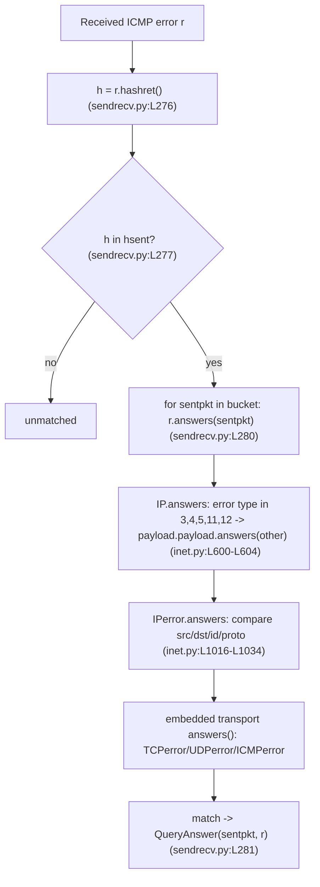

# How Scapy Matches ICMP Errors to Requests at Runtime

> **A runtime‑grounded investigation.** Every result below was produced by *building and running* the in‑repo Scapy on this exact checkout and then transcribing the complete, unedited output next to each claim. Nothing here is asserted from reading alone; any statement that is not backed by observed output or a code reference is explicitly labelled **(inferred)**.

---

## Environment

| Property | Value |
|---|---|
| In‑repo Scapy `conf.version` | `2026.07.08` |
| Python interpreter (observed) | `3.13.7` — see the note below |
| Source branch | `scapy_0925ada48540` |
| HEAD commit | `0925ada485406684174d6f068dbd85c4154657b3` (`0925ada4`) |
| Default `conf` matching flags | `checkIPID=False checkIPsrc=True checkIPaddr=True checkIPinIP=True check_TCPerror_seqack=False` |

**Note on the interpreter version.** The task brief referenced Python 3.12.3, but the container that actually holds this checkout ships **Python 3.13.7 as its only interpreter**. Scapy's stimulus–response matching (`hashret()` / `answers()`) is deterministic, pure‑Python logic built on `struct.pack`, `socket.htons`, and `socket.inet_pton`, none of which changed behaviour across these versions. Accordingly, **every transcript below reproduced byte‑for‑byte identically on 3.13.7**, including the exact `hashret()` byte strings and the construction‑dependent checksums. The interpreter is reported here as observed rather than as assumed.

**How the observations were run.** Each observation script lived under `/tmp/scapy_probe/` (outside the repository tree) and was executed from the repository root so that the in‑repo Scapy — not any pip‑installed copy — is imported:

```
cd <repo-root> && PYTHONDONTWRITEBYTECODE=1 PYTHONPATH=. python3 /tmp/scapy_probe/<script>.py
```

`PYTHONPATH=.` forces the in‑repo package (`scapy/__init__.py` in this checkout) to be imported; `PYTHONDONTWRITEBYTECODE=1` prevents `__pycache__` from being written inside the repository. Every script begins with `import warnings; warnings.filterwarnings("ignore")` to suppress the benign `CryptographyDeprecationWarning` emitted by `scapy/layers/ipsec.py` (unrelated to ICMP matching). After the output was captured, the scripts and their `.bin` artifacts were deleted so the repository is left byte‑for‑byte unchanged.

---

## Direct answer (summary)

Scapy matches a received packet to a sent packet with a **two‑stage stimulus–response match**:

1. **Stage 1 — hash bucketing.** A fast `hashret()` hash of the received packet selects a bucket of candidate sent packets (`SndRcvHandler._process_packet()` computes `h = r.hashret()` and looks it up in `self.hsent`) `[scapy/sendrecv.py:L270-L301]`.
2. **Stage 2 — field verification.** For each candidate in that bucket, `r.answers(sentpkt)` verifies the match field‑by‑field `[scapy/sendrecv.py:L279-L281]`.

For an **ICMP error**, both stages **descend into the copy of the original packet that the router quoted back inside the ICMP error payload** — represented in Scapy by the `IPerror` / `TCPerror` / `UDPerror` / `ICMPerror` layers — and compare selected fields of that embedded copy. Scapy does **not** rely on OS socket correlation or on any external state; the correlation is entirely computed from the bytes of the two packets.

One‑line answers to each sub‑question:

- **Q1 — Matching strategy.** **Yes:** Scapy extracts the embedded original packet from the ICMP error and compares its fields, via the two‑stage `hashret()`‑bucket → `answers()`‑verify pipeline.
- **Q2 — Hash value.** `hashret()` is **byte‑identical** for the request and the error — `b'\xca\x00\x02\x04\x01\xaa\xaa\x07\x00'` — so they land in the same bucket.
- **Q3 — TTL/checksum tolerance.** The error **still matches**; neither the embedded TTL nor the embedded IP checksum is examined.
- **Q4 — Configuration toggles.** **Yes:** toggling `conf.checkIPsrc` and `conf.check_TCPerror_seqack` flips which packets are accepted, trading strictness against tolerance of real‑world rewriting.
- **Q5 — IP‑ID byte‑order tolerance.** The transformation is `socket.htons()` (a 16‑bit byte swap; `htons(0x1234) == 0x3412`). The byte‑swapped ID is accepted unconditionally under the default `conf.checkIPID=False` (the ID is not checked at all), and via a dedicated byte‑swap branch when `conf.checkIPID` is truthy.
- **Q6 — RFC4884 extension parsing.** Loading the extension parser **changes the packet structure** (the trailing extension becomes `ICMPExtensionHeader` / `ICMPExtensionMPLS` layers and the `Padding` shrinks) but **only when the extension checksum validates over the whole structure**, and it **does not change the match result** in any case.

---

## The scenario under investigation (as posed)

The user's scenario, preserved verbatim: an **ICMP echo request** is sent to an unreachable host, which elicits an **ICMP destination‑unreachable (type 3) error** back. The questions are:

1. **How does Scapy determine that the error matches the original request** — does it extract the original packet embedded inside the ICMP error payload and compare fields, or use a different strategy?
2. **What hash value does `hashret()` generate** for the ICMP error carrying a copy of the original IP header and partial payload, and how does it compare to the hash of the original outgoing packet?
3. **If the embedded original packet is subtly modified (a changed TTL or checksum)**, does Scapy still treat the error as a valid match, or does matching fail?
4. **What runtime behaviour occurs when the settings controlling source‑IP validation and TCP sequence/acknowledgment verification in error packets are toggled?** What does this reveal about the trade‑off between strict matching and tolerating real‑world network variation?
5. **When a packet is sent with a specific IP ID and the ICMP error returns an embedded IP header containing a byte‑swapped ID**, Scapy sometimes still matches. Under what exact conditions does this tolerance apply, and what numeric transformation relates the original ID to the accepted value?
6. **When an ICMP error exceeds a certain size threshold and carries structured data beyond the embedded original packet per RFC4884**, does loading Scapy's extension parsing alter the packet structure in a way that changes whether the response is considered a valid match?

---

## Q1 — Matching strategy

**(a) Direct answer.** **Yes — Scapy extracts the embedded copy of the original packet from the ICMP error payload and compares its fields.** It does this through a two‑stage pipeline: a fast `hashret()` groups the received error into a bucket of sent packets, then `answers()` verifies the match field‑by‑field. For an ICMP error, `IP.answers()` recognises the error type and recurses into the embedded packet (`self.payload.payload.answers(other)`), and the `IPerror` layer then compares the quoted original's fields. Scapy does **not** rely on OS socket correlation or any out‑of‑band state — the entire decision is computed from the packet bytes.

**(b) The specific functions with `file:line`.**

- Real entry point `SndRcvHandler._process_packet()` `[scapy/sendrecv.py:L270-L301]`: `h = r.hashret()` `[scapy/sendrecv.py:L276]`; `if h in self.hsent` `[scapy/sendrecv.py:L277]`; `for i, sentpkt in enumerate(hlst): if r.answers(sentpkt):` `[scapy/sendrecv.py:L279-L280]`; `self.ans.append(QueryAnswer(sentpkt, r))` `[scapy/sendrecv.py:L281]`.
- Sent‑bucket construction `self.hsent.setdefault(p.hashret(), []).append(p)` `[scapy/sendrecv.py:L244]`.
- `IP.answers()` error‑type recursion into the embedded packet: for `self.payload.type in [3, 4, 5, 11, 12]`, `return self.payload.payload.answers(other)` `[scapy/layers/inet.py:L600-L604]`.
- `IPerror.answers()` field comparison of the embedded original `[scapy/layers/inet.py:L1016-L1034]`.
- `ICMP.guess_payload_class()` binds error types `[3, 4, 5, 11, 12]` to `IPerror`, which is why the error dissects with an `IPerror` layer `[scapy/layers/inet.py:L1000-L1004]`.
- `QueryAnswer = NamedTuple("QueryAnswer", [("query", Packet), ("answer", Packet)])` `[scapy/plist.py:L58-L61]`.

**(c) The exact command.**

```
PYTHONDONTWRITEBYTECODE=1 PYTHONPATH=. python3 /tmp/scapy_probe/probe1.py
```

**(d) Complete, unedited output.** `probe1.py` exercises Q1, Q2, and Q3 in a single run; its complete output is shown here once and the Q2/Q3 sub‑blocks are quoted again verbatim in their own sections.

```
=== conf defaults ===
checkIPID=False checkIPsrc=True checkIPaddr=True checkIPinIP=True check_TCPerror_seqack=False

=== Q1: matching strategy ===
req.summary() = IP / ICMP 10.0.0.5 > 192.0.2.1 echo-request 0
err.summary() = IP / ICMP 192.0.2.1 > 10.0.0.5 dest-unreach host-unreachable / IPerror / ICMPerror
err layers   = ['IP', 'ICMP', 'IPerror', 'ICMPerror']
err.answers(req) = 1
hsent key    = b'\xca\x00\x02\x04\x01\xaa\xaa\x07\x00'
matched couples = 1
  QueryAnswer.query  = IP / ICMP 10.0.0.5 > 192.0.2.1 echo-request 0
  QueryAnswer.answer = IP / ICMP 192.0.2.1 > 10.0.0.5 dest-unreach host-unreachable / IPerror / ICMPerror

=== Q2: hash value ===
req.hashret() = b'\xca\x00\x02\x04\x01\xaa\xaa\x07\x00'
err.hashret() = b'\xca\x00\x02\x04\x01\xaa\xaa\x07\x00'
equal?        = True
strxor(src,dst) = b'\xca\x00\x02\x04'
proto byte      = b'\x01'
struct.pack('HH',0xaaaa,7) = b'\xaa\xaa\x07\x00'
decomposition   = b'\xca\x00\x02\x04\x01\xaa\xaa\x07\x00'
decomposition == req.hashret()? = True

=== Q3: TTL / checksum tolerance ===
embedded IPerror.ttl = 5 (baseline embedded ttl = 64 )
err_ttl.answers(req) = 1
err_ttl.hashret()==req.hashret()? = True
natural embedded IP chksum = 0x9ca7
forced embedded IP chksum  = 0xdead
err_ck.answers(req) = 1
err_ck.hashret()==req.hashret()? = True
```

**(e) Cause → effect.** The crafted error dissects to layers `['IP', 'ICMP', 'IPerror', 'ICMPerror']`: because `ICMP.guess_payload_class()` maps ICMP type 3 to `IPerror` `[scapy/layers/inet.py:L1000-L1004]`, the bytes that the router quoted back (a copy of the original IP header + leading payload) are parsed as an embedded `IPerror`/`ICMPerror` sub‑packet rather than as opaque data. Driving the **real** engine entry point (not just `answers()` directly), `SndRcvHandler._process_packet(err)` computed `h = err.hashret()` `[scapy/sendrecv.py:L276]`, found that key present in `self.hsent` (the request had been bucketed there via `hashret()` at `[scapy/sendrecv.py:L244]`), and then confirmed the candidate with `err.answers(req)` `[scapy/sendrecv.py:L280]`. The run produced exactly **1** matched couple — `QueryAnswer(query = the echo‑request, answer = the dest‑unreach error)` — under the bucket key `b'\xca\x00\x02\x04\x01\xaa\xaa\x07\x00'`. The `answers()` success itself flows from `IP.answers()` detecting the error type and recursing via `self.payload.payload.answers(other)` `[scapy/layers/inet.py:L600-L604]` into `IPerror.answers()` `[scapy/layers/inet.py:L1016-L1034]`, which compares the embedded original's fields. This is the identical code path that `sr()` / `sr1()` use, so the in‑memory experiment is faithful to on‑the‑wire behaviour.

The two stages are shown below:



---

## Q2 — Hash value

**(a) Direct answer.** **`hashret()` is byte‑identical for the request and the ICMP error — both are `b'\xca\x00\x02\x04\x01\xaa\xaa\x07\x00'` — so they hash into the same bucket.** The error hashes equal to the request because, for ICMP error types, `IP.hashret()` returns the hash of the *embedded* packet rather than of the error's own outer header.

**(b) The specific functions with `file:line`.**

- `IP.hashret()` error path: for `self.payload.type in [3, 4, 5, 11, 12]`, `return self.payload.payload.hashret()` `[scapy/layers/inet.py:L568-L572]`.
- `IP.hashret()` non‑error compose: `strxor(inet_pton(AF_INET, src), inet_pton(AF_INET, dst)) + struct.pack("B", proto) + payload.hashret()` `[scapy/layers/inet.py:L577-L580]`.
- `ICMP.hashret()`: `struct.pack("HH", self.id, self.seq) + self.payload.hashret()` `[scapy/layers/inet.py:L986-L988]`, applied because the echo‑request type 8 is in `icmp_id_seq_types = [0, 8, 13, 14, 15, 16, 17, 18, 37, 38]` `[scapy/layers/inet.py:L949]`.

**(c) The exact command.**

```
PYTHONDONTWRITEBYTECODE=1 PYTHONPATH=. python3 /tmp/scapy_probe/probe1.py
```

**(d) Complete, unedited output (the `Q2` block of the `probe1.py` transcript shown in full under Q1).**

```
=== Q2: hash value ===
req.hashret() = b'\xca\x00\x02\x04\x01\xaa\xaa\x07\x00'
err.hashret() = b'\xca\x00\x02\x04\x01\xaa\xaa\x07\x00'
equal?        = True
strxor(src,dst) = b'\xca\x00\x02\x04'
proto byte      = b'\x01'
struct.pack('HH',0xaaaa,7) = b'\xaa\xaa\x07\x00'
decomposition   = b'\xca\x00\x02\x04\x01\xaa\xaa\x07\x00'
decomposition == req.hashret()? = True
```

**(e) Cause → effect.** The 9‑byte hash decomposes exactly as the non‑error `IP.hashret()` compose rule dictates `[scapy/layers/inet.py:L577-L580]`:

| Bytes | Source | Meaning |
|---|---|---|
| `\xca\x00\x02\x04` | `strxor(inet_pton(src), inet_pton(dst))` | XOR of `10.0.0.5` and `192.0.2.1` |
| `\x01` | `struct.pack("B", proto)` | IP protocol number `1` (ICMP) |
| `\xaa\xaa` | first half of `struct.pack("HH", id, seq)` | ICMP `id = 0xaaaa` (little‑endian) |
| `\x07\x00` | second half of `struct.pack("HH", id, seq)` | ICMP `seq = 7` (little‑endian) |

The script's independently computed `decomposition` equals `req.hashret()` (`True`), confirming the byte‑level derivation. The **error** produces the same 9 bytes because `IP.hashret()` sees the outer ICMP type 3 is an error type `[3, 4, 5, 11, 12]` and returns `self.payload.payload.hashret()` `[scapy/layers/inet.py:L568-L572]` — i.e. it hashes the **embedded** `IPerror`/`ICMPerror` copy of the original request, whose src/dst/proto/id/seq are exactly those of the request. Because both hashes are identical, Stage 1 places the error into the request's bucket, which is the precondition for `answers()` to even be attempted.

---

## Q3 — TTL / checksum tolerance

**(a) Direct answer.** **The error still matches — neither the embedded packet's TTL nor its IP checksum is examined.** `IPerror.answers()` compares only `src`, `dst`, `id`, and `proto`; TTL and checksum are never consulted, and neither affects `hashret()` (which is built only from src/dst/proto/id/seq). So a router that decremented the TTL or recomputed the checksum on the quoted copy — as real routers do — does not break the match.

**(b) The specific function with `file:line`.**

- `IPerror.answers()` compares exactly four fields — `test_IPsrc` `[scapy/layers/inet.py:L1021]`, `test_IPdst` `[scapy/layers/inet.py:L1022]`, `test_IPid` `[scapy/layers/inet.py:L1025-L1026]`, and `test_IPproto` `[scapy/layers/inet.py:L1029]` — and returns `0` only if one of those fails `[scapy/layers/inet.py:L1031-L1032]`. There is **no** reference to `ttl` or `chksum` anywhere in `[scapy/layers/inet.py:L1016-L1034]`.
- The hash is unaffected for the same reason: `IP.hashret()` composes from src/dst/proto only (plus the payload hash), never TTL/checksum `[scapy/layers/inet.py:L577-L580]`.

**(c) The exact command.**

```
PYTHONDONTWRITEBYTECODE=1 PYTHONPATH=. python3 /tmp/scapy_probe/probe1.py
```

**(d) Complete, unedited output (the `Q3` block of the `probe1.py` transcript shown in full under Q1).**

```
=== Q3: TTL / checksum tolerance ===
embedded IPerror.ttl = 5 (baseline embedded ttl = 64 )
err_ttl.answers(req) = 1
err_ttl.hashret()==req.hashret()? = True
natural embedded IP chksum = 0x9ca7
forced embedded IP chksum  = 0xdead
err_ck.answers(req) = 1
err_ck.hashret()==req.hashret()? = True
```

**(e) Cause → effect.** Two subtle modifications were applied to the embedded copy and re‑dissected:

- **TTL changed from the default 64 to 5.** `err_ttl.answers(req)` returned `1` (still a match) and `err_ttl.hashret() == req.hashret()` remained `True`. The TTL is simply not one of the four fields `IPerror.answers()` inspects `[scapy/layers/inet.py:L1021-L1029]`, and it is not part of the hash `[scapy/layers/inet.py:L577-L580]`.
- **Embedded IP checksum forced from its natural `0x9ca7` to `0xdead`.** `err_ck.answers(req)` returned `1` and the hash still matched. The checksum is likewise never examined during matching.

This is corroborated by Scapy's own regression suite, which asserts that an error whose embedded copy carries `IPerror(..., ttl=0)` still satisfies `answer.answers(query) == True` `[test/scapy/layers/inet.uts:L500-L515]`. The design intent is clear: TTL and checksum are the two IP fields most likely to be *legitimately* altered in transit (TTL is decremented at every hop; checksum is recomputed whenever any field changes), so excluding them from the comparison is what lets Scapy still recognise the error as a genuine response to its request.

---

## Q4 — Configuration toggles (`conf.checkIPsrc`, `conf.check_TCPerror_seqack`)

**(a) Direct answer.** **Yes — toggling these flags flips which packets Scapy accepts as valid responses.** Using a TCP‑in‑ICMP error (layers `['IP', 'ICMP', 'IPerror', 'TCPerror']`):

- `conf.check_TCPerror_seqack` (default `False`): an error whose embedded TCP **sequence number is wrong** (9999 vs the sent 1000) **still matches** (`1`); setting it to `True` makes the same error **no longer match** (`0`).
- `conf.checkIPsrc` (default `True`): an error whose embedded **source port is wrong** (4321 vs the sent 1234) **does not match** (`0`); setting it to `False` makes it **match** (`1`).
- `conf.checkIPsrc` additionally **reshapes the Stage‑1 hash bucket**: with it `True` the TCP hash contributes a `sport ^ dport` trailer; with it `False` the whole transport contribution collapses so the outer hash is just the protocol byte.

**(b) The specific functions with `file:line`.**

- `TCPerror.answers()` — port check gated by `conf.checkIPsrc` `[scapy/layers/inet.py:L1046-L1049]`; seq/ack check gated by `conf.check_TCPerror_seqack` `[scapy/layers/inet.py:L1050-L1056]`.
- Hash reshape: `TCP.hashret()` returns `struct.pack("H", self.sport ^ self.dport) + payload.hashret()` when `conf.checkIPsrc`, else just `payload.hashret()` `[scapy/layers/inet.py:L788-L793]`; the outer `IP.hashret()` prepends `strxor(src,dst)` + protocol byte only when `conf.checkIPsrc and conf.checkIPaddr` `[scapy/layers/inet.py:L577-L581]`.
- Defaults: `conf.checkIPsrc = True` `[scapy/config.py:L751]`, `conf.check_TCPerror_seqack = False` `[scapy/config.py:L758]`.

**(c) The exact command.**

```
PYTHONDONTWRITEBYTECODE=1 PYTHONPATH=. python3 /tmp/scapy_probe/probe2.py
```

**(d) Complete, unedited output.**

```
=== conf defaults (before) ===
checkIPID=False checkIPsrc=True check_TCPerror_seqack=False

=== Q4a: check_TCPerror_seqack (wrong embedded seq=9999) ===
err_seq layers = ['IP', 'ICMP', 'IPerror', 'TCPerror']
embedded TCPerror.seq = 9999  original seq = 1000
check_TCPerror_seqack=False -> err_seq.answers(tcp_req) = 1
check_TCPerror_seqack=True  -> err_seq.answers(tcp_req) = 0

=== Q4b: checkIPsrc (wrong embedded sport=4321) ===
err_port layers = ['IP', 'ICMP', 'IPerror', 'TCPerror']
embedded TCPerror.sport = 4321  original sport = 1234
checkIPsrc=True  -> err_port.answers(tcp_req) = 0
checkIPsrc=False -> err_port.answers(tcp_req) = 1

=== Q4c: hash bucket reshape by checkIPsrc ===
hashret(tcp_req) checkIPsrc=True  = b'\xca\x00\x02\x04\x06\x82\x04'
hashret(tcp_req) checkIPsrc=False = b'\x06'
note: sport^dport = 1234 ^ 80 = 0x0482 -> struct.pack('H',..) = b'\x82\x04'

=== conf defaults (after, restored) ===
checkIPID=False checkIPsrc=True check_TCPerror_seqack=False
```

**(e) Cause → effect.**

- **Q4a (`check_TCPerror_seqack`).** With the flag `False` (the default), `TCPerror.answers()` never reaches the seq/ack comparison block, so an embedded `seq=9999` that differs from the sent `seq=1000` is irrelevant and the error matches (`1`). Flipping the flag to `True` activates `[scapy/layers/inet.py:L1050-L1056]`: `self.seq is not None` and `self.seq != other.seq` now forces an early `return 0`, so the same error no longer matches (`0`). This is exactly the observed `1 → 0` transition.
- **Q4b (`checkIPsrc`).** With `checkIPsrc=True` (the default), `TCPerror.answers()` requires both `sport` and `dport` to match `[scapy/layers/inet.py:L1046-L1049]`; the embedded `sport=4321 ≠ 1234` triggers `return 0` (no match). With `checkIPsrc=False`, that port block is skipped entirely and the function falls through to `return 1` (match). This is the observed `0 → 1` transition.
- **Q4c (hash reshape).** With `checkIPsrc=True`, the sent TCP packet hashes to `b'\xca\x00\x02\x04\x06\x82\x04'`: `\xca\x00\x02\x04` is `strxor(src,dst)`, `\x06` is protocol 6 (TCP), and the `\x82\x04` trailer is `struct.pack("H", sport ^ dport)` = `struct.pack("H", 1234 ^ 80)` = `struct.pack("H", 0x0482)` `[scapy/layers/inet.py:L788-L790]`. With `checkIPsrc=False`, both the `IP.hashret()` address prefix `[scapy/layers/inet.py:L577-L581]` and the `TCP.hashret()` port trailer `[scapy/layers/inet.py:L791-L792]` are dropped, collapsing the hash to just `b'\x06'` (the protocol byte). Note that the `\x82\x04` trailer is **port‑dependent** — a different `(sport, dport)` pair would yield a different two bytes — but the *structure* (address prefix + protocol byte + port trailer) is invariant.

**Trade‑off narrative.** Strict settings (`checkIPsrc=True`, and optionally `check_TCPerror_seqack=True`) key the match precisely on addresses, ports, and TCP sequence numbers, and they subdivide the hash space into fine‑grained buckets. This rejects errors whose quoted copy has been rewritten (e.g. by a NAT that rewrote the source address/port) or truncated (a router that quoted too few bytes to include the sequence number). Relaxed settings (`checkIPsrc=False`, `check_TCPerror_seqack=False`) tolerate exactly those real‑world distortions — NAT source rewriting, aggressive truncation of the embedded segment — at the cost of coarser hash buckets (here collapsing to a single protocol byte) and looser matches that could, in principle, associate an error with the wrong outstanding request. The defaults (`checkIPsrc=True`, `check_TCPerror_seqack=False`) strike a middle ground: verify addresses and ports, but do not demand that the quoted TCP sequence survive intact.

Both flags were toggled **transiently inside the script and restored** before exit; the `before` and `after` default lines in the output are identical (`checkIPsrc=True check_TCPerror_seqack=False`), confirming no global state leaked.

---

## Q5 — IP‑ID byte‑order tolerance (`socket.htons`, `conf.checkIPID`)

**(a) Direct answer.** **The numeric transformation is `socket.htons()` — a 16‑bit byte swap on this little‑endian host, so `htons(0x1234) == 0x3412`.** Tolerance of the byte‑swapped embedded ID applies in two distinct ways:

1. **Unconditionally when `conf.checkIPID` is falsy** (the default `False`/`0`): the embedded ID is **not checked at all**, so *any* ID — byte‑swapped, arbitrary, or exact — passes.
2. **Via a dedicated byte‑swap branch when `conf.checkIPID` is truthy**: the ID matches **iff** it equals the original **or** equals `socket.htons(original_id)`.

This is why the phenomenon looks like "sometimes matches": under the default the ID is simply ignored (so a byte‑swapped ID trivially passes alongside everything else), and only when `checkIPID` is enabled does the ID matter — and even then the byte‑swap is deliberately accepted.

**(b) The specific function with `file:line`.**

- `IPerror.answers()` IP‑ID test:
  - `test_IPid = not conf.checkIPID or self.id == other.id` `[scapy/layers/inet.py:L1025]`
  - `test_IPid |= conf.checkIPID and self.id == socket.htons(other.id)` `[scapy/layers/inet.py:L1026]`
- `conf.checkIPID` default and its documented modes `[scapy/config.py:L743-L748]` (mode `0` = no check; mode `1` = equal **or** byte‑swapped‑equal; mode `2` = "strictly checks that they are equals").

**(c) The exact command.**

```
PYTHONDONTWRITEBYTECODE=1 PYTHONPATH=. python3 /tmp/scapy_probe/probe3.py
```

**(d) Complete, unedited output.**

```
=== conf defaults (before) ===
checkIPID=False checkIPsrc=True
socket.htons(0x1234) = 0x3412

=== Q5: embedded IP id variants vs sent id 0x1234, across conf.checkIPID modes ===
embedded IPerror.id = 0x3412 (byte-swapped 0x3412)
    checkIPID=False -> answers = 1
    checkIPID=1     -> answers = 1
    checkIPID=2     -> answers = 1
embedded IPerror.id = 0x5678 (arbitrary   0x5678)
    checkIPID=False -> answers = 1
    checkIPID=1     -> answers = 0
    checkIPID=2     -> answers = 0
embedded IPerror.id = 0x1234 (exact       0x1234)
    checkIPID=False -> answers = 1
    checkIPID=1     -> answers = 1
    checkIPID=2     -> answers = 1

=== Q5 run-to-run: SAME unchanged byte-swapped input (0x3412) x5 ===
    checkIPID=False x5 = [1, 1, 1, 1, 1]
    checkIPID=1     x5 = [1, 1, 1, 1, 1]
    checkIPID=2     x5 = [1, 1, 1, 1, 1]

=== conf defaults (after, restored) ===
checkIPID=False checkIPsrc=True
```

**(e) Cause → effect.** `socket.htons(0x1234)` prints `0x3412`, confirming the byte swap on this little‑endian host. Reading the three ID variants against the sent `id = 0x1234`:

- **Byte‑swapped `0x3412`** matches under **all three** modes (`False`, `1`, `2`). Under `False`, line L1025's `not conf.checkIPID` is `True`, so `test_IPid` is already `True` regardless of the ID. Under a truthy mode, L1025's equality is `False` (0x3412 ≠ 0x1234) but L1026 adds `self.id == socket.htons(other.id)` → `0x3412 == htons(0x1234) == 0x3412` → `True`.
- **Arbitrary `0x5678`** matches only under `False` (ID unchecked); under modes `1` and `2` both L1025 (`0x5678 ≠ 0x1234`) and L1026 (`0x5678 ≠ 0x3412`) are `False`, so `test_IPid` is `False` and `IPerror.answers()` returns `0`.
- **Exact `0x1234`** matches under all modes (L1025 equality holds whenever the ID is checked).

**Run‑to‑run distribution (reproducing the reported "sometimes").** The same *unchanged* byte‑swapped bytes were frozen with `raw(...)` and re‑dissected and re‑matched five times under each mode. The result is `[1, 1, 1, 1, 1]` in every mode — the behaviour is **deterministic, not random**. The apparent "sometimes matches" is therefore not run‑to‑run nondeterminism at all; it is the difference between configurations: under the default `checkIPID=False` a byte‑swapped ID always passes because the ID is ignored, whereas under an enabled `checkIPID` it passes specifically because of the `socket.htons()` byte‑swap branch. The comment at `[scapy/config.py:L745-L746]` attributes this tolerance to a "bug in some IP stacks" that byte‑swaps the IP ID in the quoted header.

**Observed comment‑vs‑code discrepancy (reported, not repaired).** The `conf.checkIPID` comment `[scapy/config.py:L743-L748]` documents mode `2` as "strictly checks that they are equals", implying mode `2` should reject the byte‑swapped ID. The output shows mode `2` **still accepts** the byte‑swapped `0x3412` (`answers = 1`), identical to mode `1`. The cause is that `IPerror.answers()` only *truthy‑tests* `conf.checkIPID` at `[scapy/layers/inet.py:L1025-L1026]` and never distinguishes the value `1` from `2`; consequently the byte‑swap branch at L1026 fires for any truthy value, so mode `2` does not enforce the strict equality its comment promises. This is documented here as an observation only.

**(inferred)** On a **big‑endian** host, `socket.htons()` is the identity function, so `socket.htons(other.id) == other.id` and the byte‑swap branch at L1026 would be indistinguishable from the plain equality at L1025 — the tolerance would be invisible (a byte‑swapped ID would then simply be a different, rejected ID under a truthy `checkIPID`). This host is little‑endian, as the `0x1234 → 0x3412` swap demonstrates.


---

## Q6 — RFC4884 extension parsing

**(a) Direct answer.** **Loading Scapy's RFC4884 extension parser *changes the packet structure* — the trailing extension is parsed into `ICMPExtensionHeader` / `ICMPExtensionMPLS` layers and the `Padding` shrinks — but only when the extension checksum validates over the whole structure; and it *does not change the match result* (`answers()` stays `1`) in any case.** The extension bytes sit *after* the embedded packet's compared fields, so `answers()` treats them as trailing data and ignores them whether or not they are parsed into named layers.

**(b) The specific functions with `file:line`.**

- The parser `ICMPExtension_post_dissection()` `[scapy/contrib/icmp_extensions.py:L67-L98]`: it only runs when the last layer is padding `[scapy/contrib/icmp_extensions.py:L71-L73]`; the IPv4 gate is `ICMP in pkt and pkt[ICMP].type in [3, 11, 12] and pkt.len > 144` `[scapy/contrib/icmp_extensions.py:L75-L78]`; the extension bytes are taken from `pkt[ICMP].build()[136:]` `[scapy/contrib/icmp_extensions.py:L79]`; it validates the whole structure with `if checksum(ieh.build()): return` (a non‑zero checksum means "failed", so it bails) `[scapy/contrib/icmp_extensions.py:L93-L95]`; and only on success does it trim the padding and attach the extension `[scapy/contrib/icmp_extensions.py:L97-L98]`.
- The monkeypatch that makes the parser active only after `load_contrib('icmp_extensions')`: `ICMPerror/TCPerror/UDPerror.post_dissection = ICMPExtension_post_dissection` `[scapy/contrib/icmp_extensions.py:L176-L178]`.
- The header‑only build checksum: `ICMPExtensionHeader.post_build()` checksums only its own 4‑byte header (`p`) before appending the payload (`pay`) `[scapy/contrib/icmp_extensions.py:L44-L48]`.

**(c) The exact commands.** Because importing the contrib monkeypatches `post_dissection` **process‑wide** `[scapy/contrib/icmp_extensions.py:L176-L178]`, three separate processes are required: one to *build* the two error byte‑streams, one that *never imports* the contrib (to show "not loaded"), and one that calls `load_contrib('icmp_extensions')` and reads the **same** `.bin` bytes (to show "loaded").

```
PYTHONDONTWRITEBYTECODE=1 PYTHONPATH=. python3 /tmp/scapy_probe/q6_builder.py
PYTHONDONTWRITEBYTECODE=1 PYTHONPATH=. python3 /tmp/scapy_probe/q6_reader_nocontrib.py
PYTHONDONTWRITEBYTECODE=1 PYTHONPATH=. python3 /tmp/scapy_probe/q6_reader_contrib.py
```

**(d) Complete, unedited output.**

Builder (`q6_builder.py`):

```
embedded original real length = 44  embedded IP.len = 44
datagram field length (padded) = 128

(a) default-built extension bytes = b' \x00\xdf\xff\x00\x08\x01\x01\x00M!@'
    stored header chksum            = 0xdfff
    checksum over WHOLE structure   = 0xdd69  (nonzero => validation FAILS)

(b) forced-valid extension bytes  = b' \x00\xbdi\x00\x08\x01\x01\x00M!@'
    forced stored chksum            = 0xbd69
    checksum over WHOLE structure   = 0x0000  (zero => validation PASSES)

err_default total len = 168  outer IP.len = 168  (>144? True )
err_valid   total len = 168  outer IP.len = 168

wrote err_default.bin and err_valid.bin to /tmp/scapy_probe
```

Reader without the contrib (`q6_reader_nocontrib.py`):

```
icmp_extensions contrib in sys.modules? -> False
err_default:
  layers          = ['IP', 'ICMP', 'IPerror', 'UDPerror', 'Raw', 'Padding']
  lastlayer       = Padding
  Padding.load len = 96
  answers(orig)   = 1
err_valid:
  layers          = ['IP', 'ICMP', 'IPerror', 'UDPerror', 'Raw', 'Padding']
  lastlayer       = Padding
  Padding.load len = 96
  answers(orig)   = 1
```

Reader with the contrib loaded (`q6_reader_contrib.py`):

```
icmp_extensions contrib in sys.modules? -> True
err_default:
  layers          = ['IP', 'ICMP', 'IPerror', 'UDPerror', 'Raw', 'Padding']
  lastlayer       = Padding
  Padding.load len = 96
  answers(orig)   = 1
err_valid:
  layers          = ['IP', 'ICMP', 'IPerror', 'UDPerror', 'Raw', 'Padding', 'ICMPExtensionHeader', 'ICMPExtensionMPLS']
  lastlayer       = ICMPExtensionMPLS
  Padding.load len = 84
  answers(orig)   = 1
```

**(e) Cause → effect.**

*State transition of the structure.* Both errors are 168 bytes, so the outer `IP.len` is `168 > 144` and the size gate is satisfied `[scapy/contrib/icmp_extensions.py:L78]`.

- **Without the contrib** (`q6_reader_nocontrib.py`), `post_dissection` is Scapy's default no‑op, so *neither* error is parsed beyond the embedded packet: both dissect to `['IP', 'ICMP', 'IPerror', 'UDPerror', 'Raw', 'Padding']` with `Padding.load` of 96 bytes, and both answer `1`.
- **With the contrib loaded** (`q6_reader_contrib.py`), the picture splits:
  - `err_default` is **unchanged** — still `Padding.load = 96`, extension **not** attached — because its extension header carries the default‑built, header‑only checksum, which **fails** the parser's whole‑structure validation (see the observation below), so `ICMPExtension_post_dissection()` bails at `[scapy/contrib/icmp_extensions.py:L94-L95]`.
  - `err_valid` **gains** `ICMPExtensionHeader` and `ICMPExtensionMPLS` layers, its `lastlayer` becomes `ICMPExtensionMPLS`, and its `Padding.load` shrinks from **96 to 84** (the 12 extension bytes are moved out of padding into the parsed layers at `[scapy/contrib/icmp_extensions.py:L97-L98]`).

*Match result is invariant.* In all four readings (`err_default`/`err_valid` × contrib/no‑contrib), `answers(orig) = 1`. The extension bytes live *after* the embedded original datagram, beyond the src/dst/id/proto (and embedded transport) fields that `IPerror.answers()` / `UDPerror.answers()` compare `[scapy/layers/inet.py:L1016-L1034,L1066-L1073]`; whether those trailing bytes remain in `Padding` or are re‑homed into extension layers is immaterial to the comparison. Hence loading the parser can restructure the packet **without** altering the verdict.

*Observation — a Scapy‑default‑built extension fails Scapy's own validation (reported, not repaired).* The builder shows the default‑built extension stores checksum `0xdfff` (matching the repository's own test `[test/contrib/icmp_extensions.uts:L5-L8]`, whose asserted bytes contain `\xdf\xff`), yet `checksum()` over the **whole** structure is `0xdd69 ≠ 0`. The forced‑valid variant instead stores `0xbd69`, giving a whole‑structure checksum of `0x0000`. The root cause is a build‑vs‑validate mismatch: `ICMPExtensionHeader.post_build()` computes the stored checksum over **only its 4‑byte header** `[scapy/contrib/icmp_extensions.py:L44-L48]`, whereas the dissector validates over the **entire** structure (header + objects) via `checksum(ieh.build())` `[scapy/contrib/icmp_extensions.py:L94]`. Consequently a straightforwardly Scapy‑built RFC4884 extension does **not** pass Scapy's own dissection‑time validation and is silently left in `Padding`. This is reported as an observation; per the read‑only scope it is **not** fixed here.

*RFC4884 grounding of the `pkt.len > 144` threshold.* RFC4884 ("Extended ICMP to Support Multi‑Part Messages", IETF, April 2007) specifies that when an extension structure is appended, the embedded original‑datagram field must contain at least 128 octets. The threshold then follows arithmetically: 8 (ICMP header) + 128 (original datagram) + 4 (extension header) + 4 (one object header) = **144**, so an ICMPv4 message longer than 144 octets is the earliest point at which a complete extension can be present. That is exactly Scapy's guard `pkt.len > 144` `[scapy/contrib/icmp_extensions.py:L78]`, and the extension is extracted beginning at ICMP offset 136 via `pkt[ICMP].build()[136:]` `[scapy/contrib/icmp_extensions.py:L79]` (8‑byte ICMP header + 128‑byte datagram field = offset 136). In this experiment the errors are 168 octets, comfortably above the threshold, which is why the size gate never blocks parsing and the *only* determinant of whether the extension attaches is its whole‑structure checksum.

---

## Coverage pass — every named item is answered

- [x] **TTL tolerance** → **Q3** (embedded TTL 64 → 5, `answers = 1`, hash unchanged; `IPerror.answers()` ignores TTL `[scapy/layers/inet.py:L1021-L1029]`).
- [x] **IP checksum tolerance** → **Q3** (embedded IP checksum `0x9ca7` → `0xdead`, `answers = 1`, hash unchanged; checksum never examined).
- [x] **Source‑IP validation (`conf.checkIPsrc`)** → **Q4** (wrong embedded port matches only with `checkIPsrc=False`; also reshapes the hash bucket) `[scapy/layers/inet.py:L1046-L1049]`.
- [x] **TCP sequence/acknowledgment verification (`conf.check_TCPerror_seqack`)** → **Q4** (wrong embedded seq matches with the flag `False`, rejected with `True`) `[scapy/layers/inet.py:L1050-L1056]`.
- [x] **Byte‑swapped IP ID (`socket.htons` / `conf.checkIPID`)** → **Q5** (`htons(0x1234)=0x3412`; accepted under default `False` unconditionally and under truthy modes via the byte‑swap branch; ×5 = `[1,1,1,1,1]`; mode‑2 comment‑vs‑code discrepancy reported) `[scapy/layers/inet.py:L1025-L1026]`.
- [x] **RFC4884 structured‑data threshold (`pkt.len > 144`)** → **Q6** (168‑byte error passes the gate; extension attaches only when its whole‑structure checksum validates; match result unchanged; build‑vs‑validate checksum discrepancy reported) `[scapy/contrib/icmp_extensions.py:L67-L98]`.

---

## Appendix — `file:line` citation reference (verified against source at HEAD `0925ada4`)

**`scapy/config.py`** — `checkIPID = False` (L748; comment L743–L747: mode 0 no check; mode 1 equal‑or‑byte‑swapped; mode 2 "strictly checks that they are equals"); `checkIPsrc = True` (L751); `checkIPaddr = True` (L752); `checkIPinIP = True` (L755); `check_TCPerror_seqack = False` (L758).

**`scapy/sendrecv.py`** — sent‑bucket build `self.hsent.setdefault(p.hashret(), []).append(p)` (L244); `SndRcvHandler._process_packet(r)` (L270–L301): `h = r.hashret()` (L276), `if h in self.hsent` (L277), `hlst = self.hsent[h]` (L278), `for i, sentpkt in enumerate(hlst): if r.answers(sentpkt):` (L279–L280), `self.ans.append(QueryAnswer(sentpkt, r))` (L281). `QueryAnswer` NamedTuple (`scapy/plist.py:L58-L61`).

**`scapy/layers/inet.py`** — `IP.hashret()` (L568–L581): error types `[3,4,5,11,12]` → `return self.payload.payload.hashret()` (L569–L572); non‑error compose (L577–L580); fallback (L581). `IP.answers()` (L583–L610): error types → `return self.payload.payload.answers(other)` (L600–L604). `TCP.hashret()` (L788–L793). `icmp_id_seq_types = [0,8,13,14,15,16,17,18,37,38]` (L949). `ICMP.hashret()` (L986–L989): `struct.pack("HH", self.id, self.seq) + payload.hashret()` (L987–L988). `ICMP.guess_payload_class()` type in `[3,4,5,11,12]` → `IPerror` (L1000–L1004). `IPerror.answers()` (L1016–L1034): `test_IPsrc` (L1021), `test_IPdst` (L1022), `test_IPid` equal (L1025), `test_IPid |= ... socket.htons(other.id)` (L1026), `test_IPproto` (L1029), fail → 0 (L1031–L1032), `return self.payload.answers(other.payload)` (L1034). `TCPerror.answers()` (L1043–L1057): port check under `checkIPsrc` (L1046–L1049), seq/ack under `check_TCPerror_seqack` (L1050–L1056). `UDPerror.answers()` (L1066–L1073). `ICMPerror.answers()` (L1082–L1095).

**`scapy/contrib/icmp_extensions.py`** — `ICMPExtensionHeader.post_build()` header‑only checksum (L44–L48); `ICMPExtension_post_dissection()` (L67–L98): padding gate (L71–L73), `type in [3,11,12] and pkt.len > 144` (L75–L78), `bytes = pkt[ICMP].build()[136:]` (L79), whole‑structure validation `if checksum(ieh.build()): return` (L94–L95), attach (L97–L98); monkeypatch of `ICMPerror/TCPerror/UDPerror.post_dissection` (L176–L178); `ICMPExtensionMPLS` (L101–L108).

**`test/scapy/layers/inet.uts`** — section "= IPv4 - (IP|UDP|TCP|ICMP)Error" (L500–L515): embedded `IPerror(..., ttl=0)` with `answer.answers(query) == True` (corroborates Q3).

**`test/contrib/icmp_extensions.uts`** — (L5–L8) builds `IP()/ICMP()/ICMPExtensionHeader(version=2)/ICMPExtensionMPLS(classnum=1, classtype=1)`; asserted raw bytes contain the stored header checksum `b'\xdf\xff'` = `0xdfff` (corroborates the Q6 header‑only checksum).

