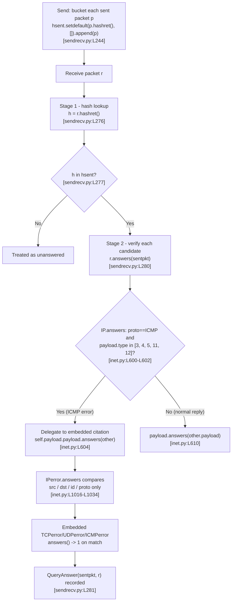

# Scapy ICMP-Error-to-Request Matching — How Scapy Correlates an ICMP Error With Its Original Request

## Overview

Scapy implements a **stimulus-response** model: packets are sent, answers are received, and the send/receive engine returns `(request, answer)` couples alongside the stimuli that went unanswered. The correlation between a received packet and the original request that provoked it is performed centrally by the `SndRcvHandler` class in `scapy/sendrecv.py`. How *strictly* that correlation is performed is governed by a set of feature flags on the `conf` singleton (class `Conf` in `scapy/config.py`).

This document answers a multi-part technical question: **how does Scapy match an inbound ICMP error message back to the original request that triggered it?** It is organized as six dedicated sections (Req 1–6), each of which presents:

1. the **observed runtime evidence** — the exact command/code that was run and the exact captured output, quoted verbatim;
2. the **exact `file:line` citations** into the Scapy source that explain the behavior; and
3. the **rationale** — why the code behaves the way it does.

The investigation followed a strict **run-first, write-second** discipline: every output block below was produced by actually building and running the relevant code paths *before* this answer was written. All numeric values (hash hex strings, `0`/`1` return codes, layer lists, checksums, byte counts) are transcribed verbatim from that captured output.

## Observed environment

The following environment values were captured by importing Scapy in place from the repository root and reading `conf`:

```
conf.version = 2026.07.01
python = 3.13.7
defaults: checkIPsrc=True checkIPaddr=True checkIPID=False check_TCPerror_seqack=False
```

This was produced **offline** with `PYTHONPATH=. SCAPY_USE_LIBPCAP=no` — no root privileges, no live network, and no libpcap backend. All six behaviors are reproducible purely by crafting packets in memory and calling `.hashret()` / `.answers()` directly.

Two version-string notes, reported for transparency:

- **`conf.version`**: the observed value is `2026.07.01`. The upstream planning prose referenced `2026.06.30`; the **observed** value `2026.07.01` governs (the version is computed dynamically from `scapy.VERSION`; there is no `VERSION` file or git tag in this checkout, per `pyproject.toml:L78` `version = { attr="scapy.VERSION" }`).
- **`python`**: the observed interpreter is `3.13.7`. The planning prose referenced `3.12.3`; the **observed** value `3.13.7` governs. The matching logic under investigation is pure-Python arithmetic/comparison and is independent of the interpreter minor version — every deterministic value below (hashes, `answers()` returns, layer lists, checksums) reproduces identically.

### Representative offline-crafted request/error pair (Req 1–5)

Unless a section states otherwise, the following in-memory request and its matching ICMP destination-unreachable error are used. The error is re-dissected from raw bytes so that the embedded copy of the original datagram parses as the dedicated `IPerror`/`ICMPerror` "citation" subclasses:

```python
import os; os.environ["SCAPY_USE_LIBPCAP"] = "no"
from scapy.all import IP, ICMP, TCP, UDP, IPerror, TCPerror, UDPerror, ICMPerror, conf
import socket
req = IP(src="192.168.1.100", dst="10.0.0.5", id=0x1234)/ICMP(type=8, id=1, seq=1)/b"payloaddata12345"
raw_err = IP(src="10.0.0.1", dst="192.168.1.100")/ICMP(type=3, code=1)/bytes(req)
err = IP(bytes(raw_err))   # re-dissect so the embedded copy parses as IPerror/ICMPerror
```

---

## The two-stage matching algorithm

Scapy correlates responses with requests in **two stages**: a cheap hash-bucket lookup followed by a precise field-level verification. Separating the two keeps matching fast (the hash is an O(1) bucketer) while remaining exact (the verifier confirms the semantic match).

**Stage 1 — hash bucketing (send side).** As each packet is sent, it is bucketed into the `hsent` dictionary keyed by its `hashret()` value:

```python
self.hsent.setdefault(p.hashret(), []).append(p)
```

This is `scapy/sendrecv.py:L244`.

**Stage 1 lookup + Stage 2 verify (receive side).** Each received packet is processed by `SndRcvHandler._process_packet` [`scapy/sendrecv.py:L270-L292`]:

- `h = r.hashret()` computes the received packet's hash key [`scapy/sendrecv.py:L276`];
- `if h in self.hsent:` performs the Stage-1 bucket lookup [`scapy/sendrecv.py:L277`], and `hlst = self.hsent[h]` retrieves the candidate stimuli [`scapy/sendrecv.py:L278`];
- `for i, sentpkt in enumerate(hlst):` iterates the candidates [`scapy/sendrecv.py:L279`], and `if r.answers(sentpkt):` performs the Stage-2 precise verification [`scapy/sendrecv.py:L280`];
- on a positive verification, `self.ans.append(QueryAnswer(sentpkt, r))` records the `(request, answer)` couple [`scapy/sendrecv.py:L281`].

**Recursion base machinery.** Both `hashret()` and `answers()` are layer-recursive:

- the base `Packet.hashret` delegates to the payload — `return self.payload.hashret()` [`scapy/packet.py:L1215-L1219`];
- the base `Packet.answers` compares same-class layers then recurses — `if other.__class__ == self.__class__: return self.payload.answers(other.payload)`, otherwise `return 0` [`scapy/packet.py:L1221-L1226`];
- the recursion terminates at `NoPayload.hashret`, which returns `b""` [`scapy/packet.py:L1812-L1814`].

The end-to-end matching call-chain (send-side bucketing plus receive-side lookup/verify) is summarized below:



---

## Req 1 — Matching strategy: does Scapy extract the embedded original copy?

**Answer: YES.** Scapy **extracts the embedded copy of the original packet** carried inside the ICMP error payload and compares its fields. It does **not** use a socket 4-tuple or any external lookup table. `IP.answers` detects that the packet is an ICMP error and **delegates the match to the embedded packet's `answers()`**.

**Observed evidence.** Running the representative pair from the Overview and then inspecting the error and its match produced this verbatim output:

```
err.summary() = IP / ICMP 10.0.0.1 > 192.168.1.100 dest-unreach host-unreachable / IPerror / ICMPerror / Raw
layers in err = ['IP', 'ICMP', 'IPerror', 'ICMPerror', 'Raw']
IPerror in err = True | ICMPerror in err = True
err.answers(req) = 1
Stage 1 (hash bucket): h in hsent = True
Stage 2 (answers verify): err.answers(sentpkt) = 1
ICMP(type=3).guess_payload_class(b'') = IPerror
ICMP(type=0).guess_payload_class(b'') = None
embedded layer is IPerror = True
```

The dissected error literally contains an `IPerror` and an `ICMPerror` layer (`layers in err = ['IP', 'ICMP', 'IPerror', 'ICMPerror', 'Raw']`), and the match returns `err.answers(req) = 1`. Emulating the two-stage engine on this pair, the error lands in the correct hash bucket (`h in hsent = True`) and then verifies (`err.answers(sentpkt) = 1`).

**Citations + rationale.**

- `IP.answers` detects the error and delegates. The detecting test is `(self.proto == socket.IPPROTO_ICMP)` and `(isinstance(self.payload, ICMP))` and `(self.payload.type in [3, 4, 5, 11, 12])` [`scapy/layers/inet.py:L600-L602`], followed by the comment `# ICMP error message` [`scapy/layers/inet.py:L603`], and the delegation `return self.payload.payload.answers(other)` [`scapy/layers/inet.py:L604`]. The exact ICMP error-type list is the literal `[3, 4, 5, 11, 12]`.
- The embedded bytes parse as `IPerror` because `ICMP.guess_payload_class` maps error types to `IPerror`: `if self.type in [3, 4, 5, 11, 12]: return IPerror` else `return None` [`scapy/layers/inet.py:L1000-L1004`]. This is exactly why the observed `ICMP(type=3).guess_payload_class(b'') = IPerror` while `ICMP(type=0).guess_payload_class(b'') = None` (type 0 is an echo *reply*, not an error, so no embedded citation is parsed).
- The two-stage loop that consumes this delegation lives in `SndRcvHandler._process_packet` [`scapy/sendrecv.py:L270-L292`], with the specific lines cited in the "two-stage matching algorithm" section above.
- **Rationale.** An ICMP error carries the IP header plus the leading bytes of the payload of the original datagram that triggered it. Scapy models that embedded "citation" as the dedicated `IPerror`/`ICMPerror` (and `TCPerror`/`UDPerror`) subclasses and recurses the match *into* it via `self.payload.payload.answers(other)`. The match is therefore decided by comparing the fields of the embedded copy against the original request — not by any connection/socket bookkeeping.

---

## Req 2 — Hashing mechanism: are the two hashes equal?

**Answer: the two hashes are EQUAL.** `IP.hashret` special-cases ICMP error types and recurses into the **embedded** datagram's hash, so the error's hash key is computed from the same bytes as the original request's hash key.

**Observed evidence.** Verbatim:

```
req.hashret() = caa801610101000100
err.hashret() = caa801610101000100
hashes equal  = True
```

The request hash and the ICMP-error hash are byte-for-byte identical: both are `caa801610101000100`.

**Citations + rationale.**

- `IP.hashret` [`scapy/layers/inet.py:L568-L572`]: for ICMP error types the method returns `self.payload.payload.hashret()` [`scapy/layers/inet.py:L572`], gated by the same `self.payload.type in [3, 4, 5, 11, 12]` test [`scapy/layers/inet.py:L569-L571`]. Consequently the error's hash is computed from the **embedded original datagram**, which makes it identical to the original request's own hash.
- Recursion mechanics: the base `Packet.hashret` delegates with `return self.payload.hashret()` [`scapy/packet.py:L1215-L1219`], and the recursion terminates at `NoPayload.hashret` returning `b""` [`scapy/packet.py:L1812-L1814`].
- **Interpreting the observed hex `caa801610101000100`.** The leading `caa80161` is the `strxor` of the two IP addresses — `strxor(inet_pton(src), inet_pton(dst))` for `192.168.1.100` ⊕ `10.0.0.5` — assembled in `IP.hashret` [`scapy/layers/inet.py:L578-L580`]. It is followed by the protocol byte `01` (ICMP), and then by the ICMP layer's own contribution: `struct.pack("HH", self.id, self.seq)` [`scapy/layers/inet.py:L988`], which packs `id=1`/`seq=1` in native byte order as `0101 0001 00`. (These raw bytes are presented verbatim as the primary evidence; the byte-level decomposition is the grounded explanation for *why* the two keys coincide.)
- **Rationale.** Because the ICMP error's hash key equals the original request's hash key, Stage 1 lands the error in the correct `hsent` bucket (observed above as `h in hsent = True`), which is the precondition that even allows the Stage-2 `answers()` verification to run.


---

## Req 3 — Subtle-modification tolerance: TTL / checksum changed

**Answer: matching is TOLERANT — it still succeeds.** The embedded-packet comparison deliberately excludes the TTL and the IP checksum, so mutating them does not break the match.

**Observed evidence.** Verbatim:

```
baseline err.answers(req) = 1
embedded original ttl     = 64 | chksum = 0x9c8c
after mutate ttl=3, chksum=0xdead -> err.answers(req) = 1
```

The mutation applied to the embedded citation layer:

```python
err[IPerror].ttl = 3
err[IPerror].chksum = 0xdead
err.answers(req)   # -> 1
```

The baseline match is `1`; after changing the embedded TTL from `64` to `3` and the embedded checksum from `0x9c8c` to `0xdead`, the match is still `err.answers(req) = 1`.

**Citations + rationale.**

- `IPerror.answers` [`scapy/layers/inet.py:L1016-L1034`] tests **only** four things and then recurses:
  - `test_IPsrc = not conf.checkIPsrc or self.src == other.src` [`scapy/layers/inet.py:L1021`];
  - `test_IPdst = self.dst == other.dst` [`scapy/layers/inet.py:L1022`];
  - `test_IPid` [`scapy/layers/inet.py:L1025-L1026`];
  - `test_IPproto = self.proto == other.proto` [`scapy/layers/inet.py:L1029`];
  - the gate `if not (test_IPsrc and test_IPdst and test_IPid and test_IPproto): return 0` [`scapy/layers/inet.py:L1031`];
  - then `return self.payload.answers(other.payload)` [`scapy/layers/inet.py:L1034`].
  There is **no** `ttl` comparison and **no** `chksum` comparison anywhere in the method — that omission is the direct source of the tolerance.
- **Rationale.** The TTL is decremented by every router hop, and the IP header checksum is recomputed at each hop accordingly. A returning ICMP citation therefore almost never carries the original TTL or checksum. Excluding both fields from the comparison prevents false negatives that would otherwise occur for essentially every real-world ICMP error.

---

## Req 4 — Configuration toggles and their trade-offs: `conf.checkIPsrc` and `conf.check_TCPerror_seqack`

**Answer.** `conf.checkIPsrc` (default `True`) gates the source-IP check in the IP citation **and** the TCP/UDP port checks in the embedded transport citation. `conf.check_TCPerror_seqack` (default `False`) additionally requires the embedded TCP sequence and acknowledgement numbers to match. This section uses a TCP-in-ICMP error built from:

```python
treq = IP(src="192.168.1.100", dst="10.0.0.5", id=0x1234)/TCP(sport=12345, dport=80, seq=1000, ack=2000)
```

**Observed evidence.** Verbatim:

```
TCPerror layer present    = True
default flags: checkIPsrc = True check_TCPerror_seqack = False
terr.answers(treq) [default] = 1
tampered embedded seq/ack -> terr.answers(treq) [seqack off] = 1
terr.answers(treq) [check_TCPerror_seqack=True] = 0
wrong embedded src, checkIPsrc = True  -> terr2.answers(treq) = 0
wrong embedded src, checkIPsrc = False -> terr2.answers(treq) = 1
```

Each observed transition isolates one gate:

- with default flags the TCP-in-ICMP error matches (`1`);
- after tampering the embedded `seq`/`ack`, it **still** matches while `check_TCPerror_seqack` is off (`1`), but **fails** once `check_TCPerror_seqack=True` (`0`);
- a wrong embedded source IP **fails** while `checkIPsrc=True` (`0`) and **passes** once `checkIPsrc=False` (`1`).

**Citations + rationale.**

- Config defaults and comments:
  - `checkIPsrc = True` [`scapy/config.py:L751`], with the comment `#: if 1, checks IP src in IP and ICMP IP citation match` / `#: (bug in some NAT stacks)` [`scapy/config.py:L749-L750`];
  - `check_TCPerror_seqack = False` [`scapy/config.py:L758`], with the comment `#: if 1, also check that TCP seq and ack match the` / `#: ones in ICMP citation` [`scapy/config.py:L756-L757`].
- `TCPerror.answers` [`scapy/layers/inet.py:L1043-L1057`]: `if conf.checkIPsrc:` [`scapy/layers/inet.py:L1046`] gates the comparison of `self.sport == other.sport` and `self.dport == other.dport` [`scapy/layers/inet.py:L1047-L1048`]; `if conf.check_TCPerror_seqack:` [`scapy/layers/inet.py:L1050`] gates the sequence comparison [`scapy/layers/inet.py:L1051-L1053`] and the acknowledgement comparison [`scapy/layers/inet.py:L1054-L1056`]; the method otherwise ends in `return 1` [`scapy/layers/inet.py:L1057`].
- `UDPerror.answers` [`scapy/layers/inet.py:L1066-L1073`] mirrors the port half: `if conf.checkIPsrc:` [`scapy/layers/inet.py:L1069`] gates `self.sport`/`self.dport` [`scapy/layers/inet.py:L1070-L1071`], otherwise `return 1` [`scapy/layers/inet.py:L1073`].
- The source-IP half of the same gate lives in `IPerror.answers`, where `test_IPsrc = not conf.checkIPsrc or self.src == other.src` [`scapy/layers/inet.py:L1021`].
- **Trade-off.** **Strict** matching (both flags on) rejects citations whose source IP was NAT-rewritten in transit, or whose sequence/acknowledgement numbers were altered by a middlebox — increasing false negatives (genuine errors that fail to correlate). The **tolerant defaults** (`checkIPsrc=True`, `check_TCPerror_seqack=False`) maximize the real-world match rate at the cost of looser correlation: the source IP is still checked (catching most mismatches) but the far more volatile seq/ack numbers are not. The observed transitions prove each gate independently, exactly as documented above.


---

## Req 5 — IP ID byte-swap tolerance and the `checkIPID == 2` discrepancy

**Answer.** Scapy accepts an embedded IP identification field that equals the **16-bit byte swap** of the original ID, computed as `socket.htons(other.id)`. The exact transform observed is `0x1234` (`4660`) → `socket.htons(0x1234) = 0x3412` (`13330`). Under **every** value of `conf.checkIPID`, the byte-swapped ID is accepted.

**Observed evidence.** Verbatim:

```
original id      = 0x1234 (4660)
socket.htons(id) = 0x3412 (13330)
embedded id set to byte-swapped 0x3412
  conf.checkIPID = False -> err5.answers(req5) = 1
  conf.checkIPID = 0     -> err5.answers(req5) = 1
  conf.checkIPID = 1     -> err5.answers(req5) = 1
  conf.checkIPID = 2     -> err5.answers(req5) = 1
exact-equal id, checkIPID=True -> err5b.answers(req5) = 1
```

The original request carries `id = 0x1234`; the embedded citation carries `id = 0x3412` (the byte swap). The match returns `1` for `checkIPID` values `False`, `0`, `1`, **and** `2`. An exact-equal embedded ID also matches under `checkIPID=True` (`1`).

**Citations + rationale.**

- The ID test in `IPerror.answers` is `test_IPid = not conf.checkIPID or self.id == other.id` [`scapy/layers/inet.py:L1025`], augmented by `test_IPid |= conf.checkIPID and self.id == socket.htons(other.id)` [`scapy/layers/inet.py:L1026`].
- The gating flag is `checkIPID = False` by default [`scapy/config.py:L748`].
- **Rationale.** Some IP stacks byte-swap the IP identification field; accepting `socket.htons(other.id)` tolerates that known bug. When `conf.checkIPID` is falsy (`False`/`0`), the ID is not checked at all — `not conf.checkIPID` is `True`, so `test_IPid` is `True` regardless of the ID value. When it is truthy, the test accepts **either** an exact-equal ID **or** the byte-swapped ID (`self.id == socket.htons(other.id)`). That is the exact condition under which a byte-swapped embedded ID is still matched: any truthy `conf.checkIPID` value.

### Documented discrepancy — `checkIPID == 2` (REPORT ONLY, not fixed)

The `conf.checkIPID` documentation and the implementation disagree, and this is reported here as an observed inconsistency without any change to either the code or the comment:

- The configuration comment block reads `#: if 0, doesn't check that IPID matches between IP sent and` / `#: ICMP IP citation received`, then `#: if 1, checks that they either are equal or byte swapped` / `#: equals (bug in some IP stacks)`, then `#: if 2, strictly checks that they are equals` [`scapy/config.py:L743-L747`] — i.e. the comment promises that value `2` performs a **strict equality** check.
- The implementation, however, only tests the **truthiness** of `conf.checkIPID` [`scapy/layers/inet.py:L1025-L1026`]; there is no branch that treats `2` differently from `1`. Value `2` therefore still accepts the byte-swapped ID — behaving identically to `1`.
- This is proven by the observed line `conf.checkIPID = 2 -> err5.answers(req5) = 1`. A strict implementation, as the comment describes, would have returned `0` for the byte-swapped ID under `checkIPID == 2`. The divergence is between `scapy/config.py:L747` (the comment) and `scapy/layers/inet.py:L1025-L1026` (the code).

---

## Req 6 — RFC4884 extension parsing: does loading extensions change matching?

**Answer.** Importing `scapy.contrib.icmp_extensions` **changes the dissected layer list** — the trailing extension bytes are moved out of the `Padding` layer into a parsed `ICMPExtensionHeader`/`ICMPExtensionMPLS` structure — but it does **NOT** change whether the response matches. Both `answers()` and `hashret()` operate on the `IPerror`/`UDPerror` citation layers, which are untouched by the extension parsing.

**Construction.** An oversized ICMP type-3 error is built whose embedded original datagram (`IP/UDP/payload`) is padded to exactly **128 bytes**, followed by an RFC4884 extension (`ICMPExtensionHeader(version=2)` / `ICMPExtensionMPLS(classnum=1, classtype=1)`), giving an outer `IP.len = 164`. Per RFC4884, when the ICMP packet length is `>144`, extensions start at byte 137 — the in-source comment states this exactly [`scapy/contrib/icmp_extensions.py:L68-L69`] — and the parser slices the extension with `pkt[ICMP].build()[136:]` [`scapy/contrib/icmp_extensions.py:L79`].

**Observed evidence — generator.** Built with the real `ICMPExtensionHeader`/`ICMPExtensionMPLS` classes; verbatim:

```
len(bytes(req)) = 44 | padded original = 128
naive ext bytes (post_build header-only chksum): 2000dfff00040101
fixed ext bytes (full-extension chksum)        : 2000defa00040101
checksum over naive full ext = 65274
checksum over fixed full ext = 0
err outer IP.len = 164
```

**Observed evidence — before/after import.** The identical raw bytes were dissected first without the contrib module imported, then re-dissected after importing it (the import applies the monkey-patch that activates parsing); verbatim:

```
BEFORE import scapy.contrib.icmp_extensions:
  layers    = ['IP', 'ICMP', 'IPerror', 'UDPerror', 'Raw', 'Padding']
  lastlayer = Padding
  answers(req) = 1 | hashret = caa8016111
AFTER import scapy.contrib.icmp_extensions:
  layers    = ['IP', 'ICMP', 'IPerror', 'UDPerror', 'Raw', 'Padding', 'ICMPExtensionHeader', 'ICMPExtensionMPLS']
  lastlayer = ICMPExtensionMPLS
  answers(req) = 1 | hashret = caa8016111
RESULT: structure changed = True | matching unaffected: answers equal = True, hashret equal = True
```

The layer list gains `ICMPExtensionHeader` and `ICMPExtensionMPLS` (and `lastlayer` changes from `Padding` to `ICMPExtensionMPLS`), yet `answers(req)` stays `1` and `hashret` stays `caa8016111` — identical before and after.

**Citations + rationale.**

- The parser `ICMPExtension_post_dissection` [`scapy/contrib/icmp_extensions.py:L67-L100`] fires only when the last layer is `Padding` [`scapy/contrib/icmp_extensions.py:L71-L72`], and — for IPv4 — requires `ICMP in pkt` [`scapy/contrib/icmp_extensions.py:L76`], `pkt[ICMP].type in [3, 11, 12]` [`scapy/contrib/icmp_extensions.py:L77`], and `pkt.len > 144` [`scapy/contrib/icmp_extensions.py:L78`]. It slices the extension via `pkt[ICMP].build()[136:]` [`scapy/contrib/icmp_extensions.py:L79`], validates it with `if checksum(ieh.build()):` — a nonzero result triggers `return  # failed` [`scapy/contrib/icmp_extensions.py:L94-L95`] — and finally moves the bytes out of `Padding` into an `ICMPExtensionHeader` [`scapy/contrib/icmp_extensions.py:L97-L98`].
- Activation is by **monkey-patch at import time**: `scapy.layers.inet.ICMPerror.post_dissection = ICMPExtension_post_dissection` [`scapy/contrib/icmp_extensions.py:L176`], likewise for `TCPerror` [`scapy/contrib/icmp_extensions.py:L177`] and `UDPerror` [`scapy/contrib/icmp_extensions.py:L178`], plus the IPv6 `ICMPv6DestUnreach`/`ICMPv6TimeExceeded` error messages [`scapy/contrib/icmp_extensions.py:L180-L181`] (the IPv6 messages are mentioned here only insofar as they share the same monkey-patch; they are not analyzed further). The `post_dissection` hook is invoked by the base dissection path in `scapy/packet.py`.
- **Rationale.** Matching uses `hashret()`/`answers()`, which walk the `IPerror`/`UDPerror` citation layers, not the trailing extension. Because the extension parsing only re-labels bytes that were already sitting in `Padding` (after the citation layers), it cannot influence the fields the matcher inspects. Hence the observed `answers(req) = 1` and `hashret = caa8016111` are identical before and after the import — the direct proof that matching is unaffected.

### Checksum caveat — `post_build` vs `post_dissection` (REPORT ONLY, not fixed)

A second observed inconsistency is reported here without any change to the code:

- `ICMPExtensionHeader.post_build` [`scapy/contrib/icmp_extensions.py:L44-L48`] computes `ck = checksum(p)` [`scapy/contrib/icmp_extensions.py:L46`] over **only** the 4-byte header (it then returns `p + pay` [`scapy/contrib/icmp_extensions.py:L48`], appending the payload *after* the checksum was already computed).
- By contrast, `post_dissection` validates `checksum(ieh.build())` over the **full** extension (header + object) [`scapy/contrib/icmp_extensions.py:L94`].
- Consequently, an extension built naively by Scapy's own `post_build` **fails its own validation** on dissection. This is proven by the generator values `checksum over naive full ext = 65274` (nonzero → validation fails) versus `checksum over fixed full ext = 0` (validation passes), and confirmed by dissecting the naive-checksum packet after the import — its layer list stays unchanged:

```
AFTER import (naive header-only-checksum pkt):
  layers    = ['IP', 'ICMP', 'IPerror', 'UDPerror', 'Raw', 'Padding']   (UNCHANGED -- post_dissection bailed at checksum validation)
  lastlayer = Padding
  answers(req) = 1 | hashret = caa8016111
```

Even in this failed-parse case, `answers(req) = 1` and `hashret = caa8016111` are unchanged — reinforcing that matching does not depend on whether the extension parses.

---

## Coverage-pass checklist

A final re-read confirms every clause of all six sub-questions is answered and grounded:

- **Req 1 — matching strategy (embedded-copy extraction vs another strategy).** Answered: Scapy extracts the embedded original copy (`IPerror`/`ICMPerror`) and delegates the match into it — it does **not** use a socket 4-tuple. Evidence `err.answers(req) = 1` and `layers in err = ['IP', 'ICMP', 'IPerror', 'ICMPerror', 'Raw']`; delegation at `scapy/layers/inet.py:L604`, error-type list `[3, 4, 5, 11, 12]` at `scapy/layers/inet.py:L600-L602`; two-stage loop at `scapy/sendrecv.py:L270-L292`. ✔
- **Req 2 — hashing (hash of ICMP error vs hash of original).** Answered: the two hashes are **equal** — `caa801610101000100 == caa801610101000100`. Recursion into the embedded datagram at `scapy/layers/inet.py:L572`; recursion base at `scapy/packet.py:L1215-L1219` and `scapy/packet.py:L1812-L1814`. ✔
- **Req 3 — subtle-modification tolerance (TTL/checksum).** Answered: matching still succeeds (`answers(req) = 1` after `ttl=3`, `chksum=0xdead`) because `IPerror.answers` [`scapy/layers/inet.py:L1016-L1034`] compares only src/dst/id/proto — no TTL or checksum test. ✔
- **Req 4 — configuration toggles and trade-offs.** Answered: `conf.checkIPsrc` (`scapy/config.py:L751`) gates src-IP + ports; `conf.check_TCPerror_seqack` (`scapy/config.py:L758`) gates TCP seq/ack (`scapy/layers/inet.py:L1046`, `scapy/layers/inet.py:L1050`). Observed transitions `1/1/0/0/1` prove each gate; strict-vs-tolerant trade-off articulated. ✔
- **Req 5 — IP ID byte-swap conditions and the exact transform.** Answered: the accepted transform is the 16-bit byte swap `socket.htons`, `0x1234` → `0x3412`, accepted for any truthy `conf.checkIPID` (`scapy/layers/inet.py:L1025-L1026`); plus the reported `checkIPID == 2` doc-vs-code discrepancy (`scapy/config.py:L747` vs `scapy/layers/inet.py:L1025-L1026`). ✔
- **Req 6 — RFC4884 extension parsing effect on structure vs matching.** Answered: importing `scapy.contrib.icmp_extensions` changes the layer list (adds `ICMPExtensionHeader`/`ICMPExtensionMPLS`) but leaves matching unaffected (`answers(req) = 1`, `hashret = caa8016111` before and after); parser `scapy/contrib/icmp_extensions.py:L67-L100`, monkey-patch `scapy/contrib/icmp_extensions.py:L176-L181`; plus the reported `post_build` (`scapy/contrib/icmp_extensions.py:L44-L48`) vs `post_dissection` (`scapy/contrib/icmp_extensions.py:L94`) checksum caveat. ✔

## Repository-unchanged note

This investigation was performed **offline** with `PYTHONPATH=. SCAPY_USE_LIBPCAP=no` (no root privileges, no live network, no libpcap backend). All temporary observation scripts lived only under `/tmp` — outside the repository tree — and were removed after the output was captured. The repository is left **byte-for-byte unchanged** apart from this single added document: `git status --porcelain` returns empty for all tracked and source files. No source, test, documentation, or configuration file was modified; this markdown file is the only filesystem addition.

