# How Scapy Reconstructs an Overlapping / Retransmitted TCP Byte Stream

**Question answered:** When a single application payload is split across multiple TCP
segments that **overlap or retransmit**, how does Scapy's canonical *offline* reassembly
path (`pcap → TCPSession`) reconstruct the application byte stream? Specifically, which
bytes "win" in the overlap region, where in the source is that policy decided, and why
does it yield the exact observed bytes?

**Methodology (binding):** *Run first, then write.* Every conclusion below was captured
from **observed runtime output** produced through the real, canonical offline path
(`sniff(offline="…pcap", session=TCPSession)`) and then traced to specific `file:line`
locations in the checkout under test. All temporary scripts/pcaps lived **outside** the
repository (under `/tmp`) and were deleted; the repository was left unmodified (see
Section 7).

> **Citations** use `path:line` and are accurate at **HEAD
> `0925ada485406684174d6f068dbd85c4154657b3`** (verified line-by-line against the checkout).

---

## 1. Direct Answer

Scapy's `TCPSession` reorder buffer resolves overlapping / retransmitted TCP segments by
**UNCONDITIONAL OVERWRITE — last-writer-wins.** The reorder buffer is the internal helper
`StringBuffer` (`scapy/sessions.py:161`). When a fragment arrives, `StringBuffer.append`
(`scapy/sessions.py:179`) writes it into the buffer with a **plain slice assignment**:

```python
memoryview(self.content)[seq:seq + data_len] = data   # scapy/sessions.py:193
```

There is **no byte comparison, no drop, no merge, and no first-writer guard** anywhere on
this path. Of the four candidate overlap policies — named explicitly and each adjudicated:

| Policy | Meaning | Implemented? | Why (grounded in code + observed output) |
|--------|---------|--------------|------------------------------------------|
| **accept** (accept-first / keep-existing) | Preserve the bytes already in the buffer; ignore the overlapping region of the new fragment | **NO** | The differing-overlap variant returns the **later** bytes `AAAAXXXXCCCC`, not the earlier `AAAABBBBCCCC`. If existing bytes were kept, `BBBB` would survive. |
| **drop** (drop-new) | Discard the new fragment when it overlaps | **NO** | The new fragment is written every time; the later `XXXX` reaches the output. Nothing is discarded. |
| **merge** (reconcile / combine) | Compare/reconcile overlapping bytes (e.g., flag a conflict, OR-merge, keep min/max) | **NO** | There is no comparison of any kind at `scapy/sessions.py:193`; the slice is assigned verbatim. No conflict is detected or reported. |
| **overwrite** (last-writer-wins) | The later-processed fragment's bytes replace whatever occupied the same sequence-relative offset | **YES ✅** | The single unconditional slice assignment at `scapy/sessions.py:193` overwrites the overlap region. Observed: differing overlap → `AAAAXXXXCCCC` (the later `XXXX` wins). |

**Consequences (both observed at runtime, Section 3):**

- **Identical-byte overlap is invisible** — the same bytes are rewritten in place, so the
  output is unchanged (`AAAABBBBCCCC`, 51 bytes).
- **Differing-byte overlap yields the later-written bytes** — `AAAAXXXXCCCC` (51 bytes);
  the retransmission's `XXXX` overwrites the original `BBBB`.
- The **winner is determined purely by processing (file) order**, not by any sequence-number
  comparison — proven by the order-swap control in Section 4.

---

## 2. Environment & Canonical Entry Point

The reproduction runs the **in-repo Scapy** (not any site-packages copy) by placing the
checkout root on `PYTHONPATH`, so the code under test is exactly the code cited.

**Proof-of-checkout command and its verbatim output:**

```console
$ PYTHONPATH=/tmp/blitzy/scapy/blitzy-154f92d1-0885-4a7d-982d-731aea49d048_a0e523 \
    python3 -c "import sys; print(sys.version.split()[0]); import scapy; print(scapy.VERSION); print(scapy.__file__)"
3.13.7
2026.07.13
/tmp/blitzy/scapy/blitzy-154f92d1-0885-4a7d-982d-731aea49d048_a0e523/scapy/__init__.py
```

| Item | Value (observed at runtime) |
|------|------------------------------|
| Scapy version (`scapy.VERSION`) | **2026.07.13** |
| `scapy.__file__` | inside the checkout (`…/scapy/__init__.py`) — confirms the in-repo code is used, not site-packages |
| Python | **3.13.7** |
| Git HEAD | `0925ada485406684174d6f068dbd85c4154657b3` |
| `PYTHONPATH` / checkout root | `/tmp/blitzy/scapy/blitzy-154f92d1-0885-4a7d-982d-731aea49d048_a0e523` |

**Honest reconciliation of environment values.** Two environment values differ from the
values named in the task brief; per the run-first / report-what-you-observe rule, the
**observed** values are reported here:

- **Python `3.13.7`** was observed (the brief named `3.12.3`). Python 3.12 is not
  obtainable on this host image (Ubuntu 25.10); the reproduction runs on the default
  interpreter `3.13.7`. Scapy declares `requires-python ">=3.7,<4"`, so `3.13.7` is a
  supported, default configuration and does not affect the reassembly path under test.
- **Checkout root** `…/blitzy-154f92d1-0885-4a7d-982d-731aea49d048_a0e523` was used (the
  brief named a sibling path `…/scapy_0925ada48540_ca08b7`). Both checkouts are pinned to
  the **identical HEAD `0925ada485406684174d6f068dbd85c4154657b3`**, so every `file:line`
  citation in this document is valid in either checkout. `scapy.VERSION` (`2026.07.13`)
  matches the brief exactly.

**Canonical entry point.** Reassembly is driven only through the documented offline path
`sniff(offline="…pcap", session=TCPSession)` (`scapy/sendrecv.py:1308`;
`session` parameter wiring `scapy/sendrecv.py:1077`; `AsyncSniffer` `scapy/sendrecv.py:981`;
`TCPSession` `scapy/sessions.py:223`). This is the same convention the project's own test
campaign uses: `a = sniff(offline=filename, session=TCPSession)`
(`test/scapy/layers/http.uts:16`). No debug hooks, mocks, or bypasses are used in the
canonical demonstration; the one diagnostic that uses `sys.settrace` (Section 5) is
read-only, changes no result, and is explicitly labelled non-canonical.

---

## 3. Reproduction — Two Overlap Variants (verbatim)

### 3.1 Design (and why `seg1` must be *incomplete*)

Two built-in `IP/TCP/Raw` segments carry one HTTP response whose 12-byte body is written
across the two segments, with a 4-byte **overlap region** in the middle:

- `HEADERS = b"HTTP/1.1 200 OK\r\nContent-Length: 12\r\n\r\n"` → **39 bytes**, relative
  offsets `0..38`.
- **`seg1`** (`seq = 1000`): `HEADERS + b"AAAA" + b"BBBB"` → **47 bytes**, offsets
  `0..46`. Its body is `"AAAABBBB"` — only **8 of the 12** `Content-Length` bytes, so
  `seg1` alone is **incomplete**.
- **`seg2`** (`seq = 1000 + 43 = 1043`): `<overlap>(4) + b"CCCC"(4)` → **8 bytes**,
  offsets `43..50`. The 4-byte `<overlap>` lands at offsets **43..46** — exactly on top
  of `seg1`'s `"BBBB"` (this is the OVERLAP), while `"CCCC"` lands at **47..50**, extending
  the buffer to its final **51 bytes**.

`seg1` is deliberately **incomplete** so the overwrite from `seg2` lands in the reorder
buffer **before** `HTTP.tcp_reassemble` finishes the message. If `seg1` alone carried the
full 51 bytes, reassembly would complete on `seg1` and the later overlap could never affect
the output — the differing variant would then wrongly show `BBBB`. The "before vs. after"
evidence in Section 3.4 confirms `seg1` alone does not complete.

The constructors use only built-in layers — `IP` (`scapy/layers/inet.py:521`), `TCP`
(`scapy/layers/inet.py:753`; `sport` `:755`, `dport` `:756`, `seq` `IntField` `:757`,
`flags` `FlagsField "FSRPAUECN"` `:761`), and `Raw` (`scapy/packet.py:1877`, whose bytes
are read via `Packet.original` at `scapy/packet.py:167`). The TCP→HTTP routing on port 80
comes solely from `import scapy.layers.http` (its module-level bindings auto-associate TCP
ports 80/8080/8000 with `HTTP`) — no user layer-binding call is made. The pcap round-trip
uses `wrpcap` (`scapy/utils.py:1095`) and is read back by `PcapReader` (`scapy/utils.py:1367`).

### 3.2 The exact reproduction script

Written to `/tmp/scapy_qna_repro/repro.py` (outside the checkout). It defines **no** new
`Packet` subclass, makes **no** manual layer-binding call, and does **not** import the
internal reorder-buffer helper — it only uses built-in `IP/TCP/Raw`, the built-in HTTP
routing, and the canonical `sniff(offline=…, session=TCPSession)`:

```python
import sys
from scapy.all import IP, TCP, Raw, wrpcap, sniff
from scapy.sessions import TCPSession          # session class only
import scapy.layers.http                        # built-in TCP 80/8080/8000 -> HTTP routing
from scapy.compat import raw
import scapy

print("python:", sys.version.split()[0])
print("scapy.VERSION:", scapy.VERSION)
print("scapy.__file__:", scapy.__file__)
print()

HEADERS = b"HTTP/1.1 200 OK\r\nContent-Length: 12\r\n\r\n"   # 39 bytes; Content-Length = 12
S = 1000  # absolute base TCP seq

def build(overlap, swap, path):
    seg1 = IP(src="10.0.0.1", dst="10.0.0.2")/TCP(sport=1234, dport=80, seq=S,    flags="A")/Raw(load=HEADERS + b"AAAA" + b"BBBB")
    seg2 = IP(src="10.0.0.1", dst="10.0.0.2")/TCP(sport=1234, dport=80, seq=S+43, flags="A")/Raw(load=overlap + b"CCCC")
    pkts = [seg2, seg1] if swap else [seg1, seg2]   # ascending-seq (seg1 first) is canonical
    wrpcap(path, pkts)

def run(path):
    out = b""
    for p in sniff(offline=path, session=TCPSession):
        if p.haslayer("HTTP"):
            out = raw(p["HTTP"])
    return out

for label, overlap, swap in [("IDENTICAL", b"BBBB", False),
                             ("DIFFERING", b"XXXX", False),
                             ("ORDER-SWAP (NON-CANONICAL: seg2 first, XXXX)", b"XXXX", True)]:
    path = "/tmp/scapy_qna_repro/x.pcap"
    build(overlap, swap, path)
    r = run(path)
    print(f"{label}: {r!r}  len={len(r)}")
```

> The `-W ignore` flag on the command line only suppresses an unrelated
> `CryptographyDeprecationWarning` (about `TripleDES`) emitted at import time by
> `scapy.layers.ipsec`, which is pulled in transitively by `scapy.all`. It has nothing to
> do with TCP reassembly and does not alter any result; it is suppressed purely to keep the
> evidence uncluttered.

### 3.3 Verbatim run output (both variants + the order-swap control)

```console
$ PYTHONPATH=/tmp/blitzy/scapy/blitzy-154f92d1-0885-4a7d-982d-731aea49d048_a0e523 \
    python3 -W ignore /tmp/scapy_qna_repro/repro.py
python: 3.13.7
scapy.VERSION: 2026.07.13
scapy.__file__: /tmp/blitzy/scapy/blitzy-154f92d1-0885-4a7d-982d-731aea49d048_a0e523/scapy/__init__.py

IDENTICAL: b'HTTP/1.1 200 OK\r\nContent-Length: 12\r\n\r\nAAAABBBBCCCC'  len=51
DIFFERING: b'HTTP/1.1 200 OK\r\nContent-Length: 12\r\n\r\nAAAAXXXXCCCC'  len=51
ORDER-SWAP (NON-CANONICAL: seg2 first, XXXX): b'XXXXCCCC'  len=8
```

**Reading the two canonical variants:**

| Variant | Overlap bytes (offsets 43..46) | Reconstructed bytes (verbatim) | Final length | Which bytes win |
|---------|-------------------------------|--------------------------------|--------------|-----------------|
| **IDENTICAL** | `seg1` writes `BBBB`, `seg2` re-writes `BBBB` | `b'HTTP/1.1 200 OK\r\nContent-Length: 12\r\n\r\nAAAABBBBCCCC'` | **51** | `BBBB` (overlap **invisible** — same bytes rewritten) |
| **DIFFERING** | `seg1` writes `BBBB`, `seg2` re-writes `XXXX` | `b'HTTP/1.1 200 OK\r\nContent-Length: 12\r\n\r\nAAAAXXXXCCCC'` | **51** | **`XXXX` wins** — the later-processed `seg2` overwrites the earlier `BBBB` (last-writer-wins) |

The differing variant is the decisive one: had the policy been accept/keep-existing or
drop-new, the earlier `BBBB` would have survived and the body would read `AAAABBBBCCCC`.
Instead the body reads `AAAAXXXXCCCC` — the retransmitted `XXXX` overwrote `BBBB`.

### 3.4 Before vs. after the overlapping segment (buffer state)

Feeding `seg1` alone versus `seg1`+`seg2` through the same canonical path confirms that the
message completes **only after** the second (overlapping) segment arrives — i.e. the
overwrite lands *before* completion:

```console
$ PYTHONPATH=/tmp/blitzy/scapy/blitzy-154f92d1-0885-4a7d-982d-731aea49d048_a0e523 \
    python3 -W ignore /tmp/scapy_qna_repro/before_state.py
BEFORE (seg1 only, 47B buffer, body 8/12):  completed HTTP messages = []
AFTER  (seg1+seg2, 51B buffer, body 12/12): completed HTTP messages = [b'HTTP/1.1 200 OK\r\nContent-Length: 12\r\n\r\nAAAAXXXXCCCC']
```

`seg1` alone yields **no** completed HTTP message (`[]`); completion happens only once
`seg2` extends the buffer to the full 51 bytes — by which point the overlap region has
already been overwritten.

### 3.5 Stability (determinism across ≥ 2 runs)

The reproduction was executed twice; the reconstructed-bytes result block is **byte-identical**
across runs (empty `diff`, matching SHA-256), so the reconstruction is deterministic:

```console
$ diff -u run1.txt run2.txt   # (result lines from run 1 vs run 2)
$ echo "exit=$?"
exit=0
$ sha256sum run1.txt run2.txt
3265ca6ff6d578e74229b518f7dec0361f8cc9394bf06645cca75ec2be5a6b32  run1.txt
3265ca6ff6d578e74229b518f7dec0361f8cc9394bf06645cca75ec2be5a6b32  run2.txt
```

Both runs produced exactly:

```text
IDENTICAL: b'HTTP/1.1 200 OK\r\nContent-Length: 12\r\n\r\nAAAABBBBCCCC'  len=51
DIFFERING: b'HTTP/1.1 200 OK\r\nContent-Length: 12\r\n\r\nAAAAXXXXCCCC'  len=51
ORDER-SWAP (NON-CANONICAL: seg2 first, XXXX): b'XXXXCCCC'  len=8
```

---

## 4. Order-Swap Causality Control (NON-CANONICAL)

> **This section is a deliberately NON-CANONICAL control.** It feeds the higher-sequence
> segment (`seg2`) **before** the lower-sequence segment (`seg1`) to prove that the overlap
> **winner is governed by processing/file order, not by any sequence-number comparison.**
> The canonical demonstration in Section 3 always orders segments ascending-by-sequence
> (`seg1` first). The value below must not be read as a normal reassembly result.

**Observed output** (from the same `repro.py`, the `swap=True` case):

```text
ORDER-SWAP (NON-CANONICAL: seg2 first, XXXX): b'XXXXCCCC'  len=8
```

Instead of the 51-byte message, only the mis-anchored **8-byte** fragment `b'XXXXCCCC'`
surfaces. A read-only diagnostic (using `sys.settrace`, changing no result) shows exactly
what happens, call by call:

```console
$ PYTHONPATH=/tmp/blitzy/scapy/blitzy-154f92d1-0885-4a7d-982d-731aea49d048_a0e523 \
    python3 -W ignore /tmp/scapy_qna_repro/swap_diag.py
tcp_reassemble CALL #1: input buffer len=8  completed=True
tcp_reassemble CALL #2: input buffer len=47 completed=False
completed HTTP messages: [b'XXXXCCCC']
```

**Why framing breaks (grounded in the trace and the anchor at `scapy/sessions.py:340`):**

1. `seg2` is processed **first**. The relative-sequence origin is anchored to the
   **first-processed** packet: `relative_seq = metadata["relative_seq"] = seq - 1`
   (`scapy/sessions.py:340`), then `seq = seq - relative_seq` (`scapy/sessions.py:341`).
   So `seg2` — despite its higher absolute sequence `1043` — is mapped to buffer offset `0`.
2. The buffer therefore holds just `seg2`'s 8 bytes, `b'XXXXCCCC'`. `HTTP(b'XXXXCCCC')`
   has a payload of type `Raw`, **not** `_HTTPContent`, so `HTTP.tcp_reassemble` returns
   the packet immediately at `scapy/layers/http.py:587-588` — completing this bogus 8-byte
   "message" (CALL #1, `completed=True`).
3. On completion the flow buffer and metadata are cleared and the flow key is dropped
   (`scapy/sessions.py:368-371`).
4. `seg1` then arrives **second** into a fresh buffer (CALL #2, buffer len 47). Its body is
   only 8 of the 12 `Content-Length` bytes, so the length-based end-detector
   (`scapy/layers/http.py:596-598`, needs ≥ 51 bytes) returns `False` and `seg1` **never
   completes** (`completed=False`).

Net effect: the true HTTP message (status line + headers + 12-byte body) never reassembles;
only the mis-anchored fragment `b'XXXXCCCC'` is emitted. Crucially, there is **no
`if seq < existing`-style comparison** anywhere that would reorder `seg1` ahead of `seg2` —
confirming that the overlap winner is a pure function of processing order. That is exactly
why the canonical demonstration orders segments ascending-by-sequence.


---

## 5. Runtime Call-Path Trace (to `file:line`)

The observed bytes are produced by the following path, from the offline entry point down to
the **overwrite** decision at `scapy/sessions.py:193` and back up through
`HTTP.tcp_reassemble` to `raw(pkt["HTTP"])`.

```mermaid
flowchart TD
    A["Build built-in IP/TCP/Raw segments<br/>inet.py:521 (IP), inet.py:753 (TCP), packet.py:1877 (Raw)"]
    B["wrpcap writes pcap to /tmp<br/>utils.py:1095"]
    C["sniff(offline=..., session=TCPSession)<br/>sendrecv.py:1308 (session param :1077, AsyncSniffer :981)"]
    D["TCPSession.on_packet_received<br/>sessions.py:382 (class TCPSession :223)"]
    E["_process_packet<br/>sessions.py:286"]
    F["new_data = pay.original (sessions.py:316)<br/>seq = pkt[TCP].seq (sessions.py:318)"]
    G["capability guard: payload class has tcp_reassemble?<br/>sessions.py:323-330 (else return pkt unchanged)"]
    H["relative_seq anchor = seq - 1 (sessions.py:340)<br/>seq = seq - relative_seq (sessions.py:341)"]
    I["data.append(new_data, seq)<br/>sessions.py:344 (comment :343: retransmission)"]
    J["StringBuffer.append<br/>sessions.py:179 (class :161)"]
    K["grow + zero-fill ONLY if past current end<br/>sessions.py:183-188"]
    L["OVERWRITE (last-writer-wins):<br/>memoryview(self.content)[seq:seq+data_len] = data<br/>sessions.py:193  &lt;- DECISION POINT"]
    M["data.full() always True -> reassemble every append<br/>sessions.py:195-199 (gate :356)"]
    N["HTTP.tcp_reassemble(bytes(data), metadata, ...)<br/>sessions.py:358-362 -> http.py:580"]
    O["Content-Length length-based end-detector<br/>http.py:596-598; completes via :632-635"]
    P["rebuild packet if complete<br/>sessions.py:364-379"]
    Q["raw(pkt['HTTP']) -> observed reconstructed bytes<br/>compat.py:112"]

    A --> B --> C --> D --> E --> F --> G --> H --> I --> J --> K --> L --> M --> N --> O --> P --> Q
```



**Step-by-step, with the exact source lines exercised:**

1. **`sniff(offline=…, session=TCPSession)`** — `scapy/sendrecv.py:1308`. `sniff` builds an
   `AsyncSniffer` (`scapy/sendrecv.py:981`) and runs it **synchronously** via `_run(...)`
   (so a current-thread `sys.settrace` sees the calls); the `session` parameter is wired at
   `scapy/sendrecv.py:1077`. `TCPSession` is `scapy/sessions.py:223`.
2. **`TCPSession.on_packet_received`** — `scapy/sessions.py:382` — the dissection entry hook;
   it defragments IP if needed, then calls `_process_packet`.
3. **`TCPSession._process_packet`** — `scapy/sessions.py:286`:
   - `new_data = pay.original` — `scapy/sessions.py:316` (the TCP payload bytes; `Raw`'s
     `original` is set at `scapy/packet.py:167`).
   - `seq = pkt[TCP].seq` — `scapy/sessions.py:318`.
   - **Capability guard** — `scapy/sessions.py:323-330`: the payload class must implement a
     `tcp_reassemble` classmethod; otherwise `_process_packet` returns the packet unchanged
     and **no reassembly occurs**. `HTTP` supplies it (`scapy/layers/http.py:580`), so the
     buffer path runs. (`_get_ident` computes the per-flow key at `scapy/sessions.py:270`.)
   - **Relative-sequence anchor** — `scapy/sessions.py:338-341`: on the first packet of a
     flow, `relative_seq = metadata["relative_seq"] = seq - 1` (`:340`), then
     `seq = seq - relative_seq` (`:341`). This anchors offsets to the **first-processed**
     packet (the cause of the Section 4 order sensitivity).
   - `data.append(new_data, seq)` — `scapy/sessions.py:344` (the in-code comment at `:343`
     reads *"Note that this take care of retransmission packets."*).
   - `if data.full():` gate — `scapy/sessions.py:356` — always taken (see step 5).
   - `tcp_reassemble(bytes(data), metadata, tcp_session)` — `scapy/sessions.py:358-362`.
4. **`StringBuffer.append(data, seq)`** — `scapy/sessions.py:179` (class at `:161`):
   - It first does `seq = seq - 1` (`scapy/sessions.py:182`); combined with the `seq - 1`
     anchor at `:340`, the first packet lands at buffer offset `0`.
   - **Growth / zero-fill branch** — `scapy/sessions.py:183-188` — runs **only** when the
     fragment reaches *past* the current end (`if seq + data_len > self.content_len`),
     appending zero-fill and extending `content_len`.
   - **THE OVERWRITE — unconditional slice assignment** —
     `memoryview(self.content)[seq:seq + data_len] = data` — **`scapy/sessions.py:193`**.
     This is the decision point: it writes the incoming bytes verbatim over whatever occupied
     that sequence-relative offset, with **no comparison, drop, merge, or first-writer guard.**
   - `full()` **always returns `True`** — `scapy/sessions.py:195-199` — so `_process_packet`
     attempts reassembly after **every** append.
5. **`HTTP.tcp_reassemble`** — `scapy/layers/http.py:580` — surfaces the reassembled message.
   For a `Content-Length` body it installs a **length-based end-detector** at
   `scapy/layers/http.py:596-598` and completes by returning the parsed `HTTP(data)` from the
   (already-overwritten) buffer via `scapy/layers/http.py:632-635` (first-call completion path
   is `:630-631`; port→HTTP dispatch is `guess_payload_class` at `:637`). Empirical branch
   confirmation is in Section 6.1.
6. **`raw(pkt["HTTP"])`** — `scapy/compat.py:112` — extracts the observed reconstructed bytes.

pcap round-trip helpers on this path: `wrpcap` `scapy/utils.py:1095`, `rdpcap`
`scapy/utils.py:1136`, `RawPcapReader` `scapy/utils.py:1233`, `PcapReader`
`scapy/utils.py:1367`, `PcapWriter` `scapy/utils.py:2261`.

---

## 6. Why the Exact Bytes / Length Result

### 6.1 Which bytes win — the overwrite, confirmed by branch trace

The overlap region (buffer offsets `43..46`) is written by `seg1` as `BBBB` and then
re-written by `seg2` (as `BBBB` in the identical variant, or `XXXX` in the differing
variant) through the single slice assignment at `scapy/sessions.py:193`. Because that
assignment is unconditional, **the last write wins** — hence `AAAAXXXXCCCC` in the differing
variant.

A read-only `sys.settrace` diagnostic confirms *why* `seg1` does not complete before `seg2`'s
overwrite — and pins down the exact `HTTP.tcp_reassemble` branch that fires (this corrects a
tempting-but-wrong explanation that blames the `lambda dat: False` branch at
`scapy/layers/http.py:601`):

```console
$ PYTHONPATH=/tmp/blitzy/scapy/blitzy-154f92d1-0885-4a7d-982d-731aea49d048_a0e523 \
    python3 -W ignore /tmp/scapy_qna_repro/trace_http.py
CALL #1: HTTP.tcp_reassemble executed http.py lines [581, 582, 583, 584, 585, 587, 589, 590, 594, 596, 597, 598, 629, 630]
         -> RETURN None
CALL #2: HTTP.tcp_reassemble executed http.py lines [581, 582, 583, 633, 634, 635]
         -> RETURN packet
```

- **CALL #1** (buffer = 47 bytes, `seg1` only): because `seg1` carries a *partial* body
  (`"AAAABBBB"`, 8 bytes), `http_packet.payload.payload` is truthy, so the condition at
  `scapy/layers/http.py:596` is **True** and the **length-based** detector is installed at
  `scapy/layers/http.py:597-598` (`http_length = 39`, `length = 12`, i.e.
  `detect_end = lambda dat: len(dat) - 39 >= 12`, needing **≥ 51** bytes). Then
  `scapy/layers/http.py:630` evaluates `detect_end(47)` → `47 - 39 = 8 >= 12` → **False**, so
  the completing `return` at `:631` is **not** reached and `seg1` does not complete. The
  `lambda dat: False` branch at `scapy/layers/http.py:601` is **not executed** (601 does not
  appear in the traced line list). *(That sibling branch fires only when the first segment
  carries **zero** body bytes — not the case here.)*
- **CALL #2** (buffer = 51 bytes, after `seg2`'s append + overwrite): the detector is cached
  and `is_unknown` is `False`, so the `else` at `scapy/layers/http.py:632` is taken;
  `detect_end(51)` → `51 - 39 = 12 >= 12` → **True** → `scapy/layers/http.py:634` builds
  `HTTP(data)` from the **already-overwritten** 51-byte buffer → `scapy/layers/http.py:635`
  returns it. So the message that surfaces reflects the overwrite performed at
  `scapy/sessions.py:193` during `seg2`'s append.

This is the mechanism that makes last-writer-wins observable: the overwrite lands during
`seg2`'s append, *before* the message is completed on that same append.

### 6.2 Length invariance — why both variants are exactly 51 bytes

Both variants reconstruct to **51 bytes** because the only difference between them is the
content of offsets `43..46`, which is **within the already-written range** in both cases —
so the overlap is a *pure overwrite* via `scapy/sessions.py:193`, never a buffer extension.
The growth / zero-fill branch at `scapy/sessions.py:183-188` runs only when a fragment
reaches *past* the current end; here that is `seg2`'s `"CCCC"` at offsets `47..50`, which
extends the buffer identically in both variants. The arithmetic:

```text
offsets  0 .. 38  : HEADERS                         (39 bytes)
offsets 39 .. 42  : "AAAA"                           ( 4 bytes)
offsets 43 .. 46  : overlap  (BBBB->BBBB or BBBB->XXXX, pure overwrite)   ( 4 bytes)
offsets 47 .. 50  : "CCCC"   (buffer extension via :183-188)              ( 4 bytes)
                    -----------------------------------------------------
total             : 39 + 4 + 4 + 4 = 51 bytes  (= 39-byte header + 12-byte Content-Length body)
```

Header (39) + body (12) = **51** in both the identical and the differing variant — matching
the observed `len=51`.

---

## 7. Cleanup Evidence (repository left unmodified)

All temporary scripts and pcaps lived under `/tmp/scapy_qna_repro` — **outside** the
repository checkout — and were removed after the run. The reproduction wrote **nothing**
inside the checkout; after removal the only new path in the working tree is this deliverable,
and the Scapy source/tests/docs/config tree is provably untouched. (The listing below is a
single, unified capture that includes every script this document references.)

```console
$ ls -la /tmp/scapy_qna_repro/
total 52
drwxr-xr-x  2 root root 4096 Jul 13 17:12 .
drwxrwsrwx 11 root root 4096 Jul 13 17:12 ..
-rw-r--r--  1 root root  127 Jul 13 17:12 b1.pcap
-rw-r--r--  1 root root  191 Jul 13 17:12 b2.pcap
-rw-r--r--  1 root root  918 Jul 13 17:12 before_state.py
-rw-r--r--  1 root root 1132 Jul 13 17:12 repro.py
-rw-r--r--  1 root root  225 Jul 13 17:12 run1.txt
-rw-r--r--  1 root root  225 Jul 13 17:12 run2.txt
-rw-r--r--  1 root root  191 Jul 13 17:12 swap.pcap
-rw-r--r--  1 root root 1511 Jul 13 17:12 swap_diag.py
-rw-r--r--  1 root root  191 Jul 13 17:12 t.pcap
-rw-r--r--  1 root root 1371 Jul 13 17:12 trace_http.py
-rw-r--r--  1 root root  191 Jul 13 17:12 x.pcap

$ rm -rf /tmp/scapy_qna_repro
$ ls -la /tmp/scapy_qna_repro/
ls: cannot access '/tmp/scapy_qna_repro/': No such file or directory

$ cd /tmp/blitzy/scapy/blitzy-154f92d1-0885-4a7d-982d-731aea49d048_a0e523

# The ONLY new path Git reports in the working tree is this deliverable:
$ git status --porcelain -uall
?? blitzy/documentation/scapy_0925ada48540.md

# The Scapy source / tests / docs / config tree is untouched (empty output):
$ git status --porcelain -uall -- scapy test doc .config setup.py pyproject.toml tox.ini MANIFEST.in run_scapy run_scapy.bat
$
```

The temporary artifacts are gone, and the only path Git reports as new is this document
(`blitzy/documentation/scapy_0925ada48540.md`) — the sanctioned deliverable. The
source-tree-filtered `git status` is **empty**, proving **no Scapy source, test, doc, or
config file was added, modified, or deleted** by the investigation. (Immediately after
cleanup and *before* this document was created, the unfiltered `git status --porcelain` was
likewise fully empty; once this deliverable is committed, the working tree is clean again.)

---

## 8. Coverage Pass

A final checklist confirming every required item is addressed **by name**:

- [x] **`StringBuffer`** — named and cited as the reorder buffer: class `scapy/sessions.py:161`,
      `append` `scapy/sessions.py:179`, and the decisive **overwrite** at
      `scapy/sessions.py:193`. It is only *read and cited* — never imported or instantiated in
      the reproduction.
- [x] **accept** (accept-first / keep-existing) — **named and ruled out**: the differing
      variant returns the later `XXXX`, not the earlier `BBBB` (Sections 1, 3.3).
- [x] **drop** (drop-new) — **named and ruled out**: the new fragment is always written; the
      later bytes reach the output (Sections 1, 3.3).
- [x] **merge** (reconcile / combine) — **named and ruled out**: there is no comparison at
      `scapy/sessions.py:193`; the slice is assigned verbatim (Sections 1, 5).
- [x] **overwrite** (last-writer-wins) — **named and identified as the implemented policy**:
      unconditional slice assignment at `scapy/sessions.py:193` (Sections 1, 5, 6).
- [x] **Both variants run** — identical-byte overlap (`AAAABBBBCCCC`) **and** differing-byte
      overlap (`AAAAXXXXCCCC`), each with verbatim command, reconstructed-bytes representation,
      and final length (Section 3.3).
- [x] **The overlap winner** — **`XXXX`** wins in the differing variant (last-writer-wins),
      shown verbatim (Sections 1, 3.3, 6.1).
- [x] **The final byte length** — **51** bytes in both variants, with the length-invariance
      arithmetic (Sections 3.3, 6.2).
- [x] **Before vs. after** buffer state — `seg1` alone completes nothing; completion occurs
      only after `seg2` (Section 3.4).
- [x] **Order-swap causality control** — labelled NON-CANONICAL; `b'XXXXCCCC'`, len 8;
      `relative_seq` anchoring at `scapy/sessions.py:340` explained (Section 4).
- [x] **Stability across ≥ 2 runs** — byte-identical output, matching SHA-256 (Section 3.5).
- [x] **Canonical entry point** — `sniff(offline=…, session=TCPSession)`, mirroring
      `test/scapy/layers/http.uts:16` (Section 2).
- [x] **In-repo Scapy proven** — `scapy.__file__` inside the checkout; Scapy `2026.07.13`;
      HEAD `0925ada485406684174d6f068dbd85c4154657b3` (Section 2).
- [x] **Read-only repository** — temp artifacts outside the checkout and removed; empty
      `git status --porcelain` (Section 7).
- [x] **Constraints honored** — built-in `IP/TCP/Raw` only; HTTP routing via
      `import scapy.layers.http`; no new `Packet` classes; no manual layer-binding calls; the
      internal reorder-buffer helper never imported (Sections 3.2, 5).

