# How Scapy Reconstructs an Overlapping / Retransmitted TCP Byte Stream

**Question answered:** When a single application payload is split across multiple TCP
segments that **overlap or retransmit**, how does Scapy's canonical *offline* reassembly
path (`pcap → TCPSession`) reconstruct the application byte stream? Specifically, which
bytes "win" in the overlap region, where in the source is that policy decided, and why
does it yield the exact observed bytes?

**Methodology (binding):** *Run first, then write.* Every conclusion below was captured
from **observed runtime output** produced through the real, canonical offline path
(`sniff(offline="…pcap", session=TCPSession)`) and then traced to specific `file:line`
locations in the checkout under test. All temporary scripts/pcaps lived **outside** the
repository (under `/tmp`) and were deleted; the repository was left unmodified (see
Section 7).

> **Citations** use `path:line` and are accurate at the **source-branch commit
> `0925ada485406684174d6f068dbd85c4154657b3`** — the commit on which this deliverable is
> based (see Section 2), verified line-by-line against the checkout.

---

## 1. Direct Answer

Scapy's `TCPSession` reorder buffer resolves overlapping / retransmitted TCP segments by
**UNCONDITIONAL OVERWRITE — last-writer-wins.** The reorder buffer is the internal helper
`StringBuffer` (`scapy/sessions.py:161`). When a fragment arrives, `StringBuffer.append`
(`scapy/sessions.py:179`) writes it into the buffer with a **plain slice assignment**:

```python
memoryview(self.content)[seq:seq + data_len] = data   # scapy/sessions.py:193
```

There is **no byte comparison, no drop, no merge, and no first-writer guard** anywhere on
this path. Of the four candidate overlap policies — named explicitly and each adjudicated:

| Policy | Meaning | Implemented? | Why (grounded in code + observed output) |
|--------|---------|--------------|------------------------------------------|
| **accept** (accept-first / keep-existing) | Preserve the bytes already in the buffer; ignore the overlapping region of the new fragment | **NO** | The differing-overlap variant returns the **later** bytes `AAAAXXXXCCCC`, not the earlier `AAAABBBBCCCC`. If existing bytes were kept, `BBBB` would survive. |
| **drop** (drop-new) | Discard the new fragment when it overlaps | **NO** | The new fragment is written every time; the later `XXXX` reaches the output. Nothing is discarded. |
| **merge** (reconcile / combine) | Compare/reconcile overlapping bytes (e.g., flag a conflict, OR-merge, keep min/max) | **NO** | There is no comparison of any kind at `scapy/sessions.py:193`; the slice is assigned verbatim. No conflict is detected or reported. |
| **overwrite** (last-writer-wins) | The later-processed fragment's bytes replace whatever occupied the same sequence-relative offset | **YES ✅** | The single unconditional slice assignment at `scapy/sessions.py:193` overwrites the overlap region. Observed: differing overlap → `AAAAXXXXCCCC` (the later `XXXX` wins). |

**Consequences (both observed at runtime, Section 3):**

- **Identical-byte overlap is invisible** — the same bytes are rewritten in place, so the
  output is unchanged (`AAAABBBBCCCC`, 51 bytes).
- **Differing-byte overlap yields the later-written bytes** — `AAAAXXXXCCCC` (51 bytes);
  the retransmission's `XXXX` overwrites the original `BBBB`.
- The **overlap winner is the later-written fragment.** This is established by the
  *differing canonical variant* (Section 3.3) together with the unconditional slice
  assignment at `scapy/sessions.py:193`: with both fragments present in one live buffer and
  ordered ascending-by-sequence, the later write of `XXXX` replaces the earlier `BBBB`, and
  there is no sequence-number comparison anywhere that could prefer the earlier bytes.
- Separately, because buffer offsets are anchored to the **first-processed** packet
  (`scapy/sessions.py:340`), the reconstruction is also sensitive to **processing (file)
  order**. The NON-CANONICAL order-swap control in Section 4 demonstrates *that anchoring /
  ordering effect* — it does **not**, by itself, adjudicate the overlap, because in the
  swapped run the two fragments never coexist in one live buffer (the first-processed 8-byte
  fragment completes and clears the buffer before the other arrives).

---

## 2. Environment & Canonical Entry Point

**Build and run — the mandated canonical container.** The project's setup mandates the
Docker image `ghcr.io/scaleapi/swe-atlas:swe_atlas_QnA_secdev_scapy_1.0`. Scapy under test
is **this repository checkout**, bind-mounted **read-only** at `/work` and placed on
`PYTHONPATH` so the code exercised is exactly the code cited (never the container's own
`/app` copy, which is a *different* build — `2.5.0.dev87` — and is deliberately not used).
The exact, reusable build/invocation command is:

```console
$ cd /tmp/blitzy/scapy/blitzy-154f92d1-0885-4a7d-982d-731aea49d048_a0e523
$ docker run --rm --entrypoint /bin/bash \
    -v "$(pwd)":/work:ro \
    -v /tmp/scapy_qna_repro:/tmp/scapy_qna_repro \
    ghcr.io/scaleapi/swe-atlas:swe_atlas_QnA_secdev_scapy_1.0 \
    -lc 'cd /work && PYTHONPATH=/work python3 /tmp/scapy_qna_repro/repro.py'
```

**Verbatim provenance banner** (printed by `repro.py` before any reproduction output — the
`python`, `scapy.VERSION`, and `scapy.__file__` values come from the software *as built and
run in its default configuration* inside the mandated container):

```text
python: 3.11.13
scapy.VERSION: 2026.07.13
scapy.__file__: /work/scapy/__init__.py
```

| Item | Value (observed at runtime, default config) |
|------|----------------------------------------------|
| Container image | `ghcr.io/scaleapi/swe-atlas:swe_atlas_QnA_secdev_scapy_1.0` |
| Python (container default) | **3.11.13** |
| Scapy version (`scapy.VERSION`) | **2026.07.13** |
| `scapy.__file__` | `/work/scapy/__init__.py` — the read-only bind-mount of this checkout (proves in-repo code, not the container's `/app` copy) |
| `PYTHONPATH` | `/work` |

**What `scapy.VERSION == 2026.07.13` actually is (grounded).** This is **not** a release
tag — it is a *fallback* derived from the modification time of `scapy/__init__.py`.
`pyproject.toml` sets the package version from the attribute (`version = { attr="scapy.VERSION" }`,
`pyproject.toml:78`) and `requires-python = ">=3.7, <4"` (`pyproject.toml:17`). `VERSION` is
computed by `_version()` (`scapy/__init__.py:122`), assigned at
`VERSION = __version__ = _version()` (`scapy/__init__.py:169`). `_version()` tries, in order:
the `SCAPY_VERSION` env var; a bundled `VERSION` file (`scapy/__init__.py:135-142` — absent
in this checkout); a git-archive tag (`scapy/__init__.py:144-148`); `git describe`
(`scapy/__init__.py:150-154`); and finally the **modification-date fallback**
(`scapy/__init__.py:160-161`: `datetime…utcfromtimestamp(os.path.getmtime(__file__))` →
`strftime('%Y.%m.%d')`). In this container that fallback is what runs, which we confirmed
directly:

```text
mtime UTC: 2026-07-13 16:21:10.031002
strftime %Y.%m.%d -> 2026.07.13
scapy.VERSION -> 2026.07.13
match: True
git-describe raised: ValueError
```

So `2026.07.13` is literally the `__init__.py` file date, and `git describe` raises
`ValueError` here — establishing that the fallback branch, not a real tag, produces the
version string.

**Git provenance — source branch vs. platform workspace branch (grounded).** Two distinct
branches are in play, and the citations are pinned to the **source** one. The transcript
below was captured **during the investigation**, when the workspace `HEAD` was this
deliverable's *initial* commit (`e0765f54…`, shown below); the later review-resolution commit
that carries this updated document is layered on top afterward and, like the initial commit,
changes **only this one file** — so the absolute source-branch commit `0925ada4…`, against
which every citation is pinned, is unchanged and the Scapy source stays byte-identical:

```console
$ git branch --show-current
blitzy-154f92d1-0885-4a7d-982d-731aea49d048
$ git rev-parse HEAD
e0765f548ab0320f3b234e25b5fe91f7e5f445dd
$ git rev-parse HEAD~1
0925ada485406684174d6f068dbd85c4154657b3
$ git log -1 --format='%H %s' HEAD~1
0925ada485406684174d6f068dbd85c4154657b3 Add AUTOSAR PDUTransport/PDU with initial batch of tests (#3933)
$ git diff --stat HEAD~1 HEAD
 blitzy/documentation/scapy_0925ada48540.md | 533 +++++++++++++++++++++++++++++
 1 file changed, 533 insertions(+)
$ git diff --stat HEAD~1 HEAD -- scapy test .config pyproject.toml setup.py tox.ini
$
```

- **Source branch = `scapy_0925ada48540`**, whose tip is the commit
  `0925ada485406684174d6f068dbd85c4154657b3` (shown as `HEAD~1` in the capture above, taken at
  investigation time). **Every `file:line` citation in this document refers to that commit**
  (matching the intro banner).
- **Platform workspace branch = `blitzy-154f92d1-0885-4a7d-982d-731aea49d048`** (the current
  branch) simply *adds this deliverable on top* of the source commit: the initial deliverable
  commit `e0765f54…` (shown as `HEAD` in the capture) added **only** this document over
  `0925ada4…` (533 insertions), and the subsequent review-resolution commit likewise changes
  only this file. The source-tree-filtered `git diff --stat` is **empty**, proving the Scapy
  source / tests / config are **byte-identical** from `0925ada4…` through the current `HEAD`.
  Consequently every cited `file:line` is valid at all of these commits, and the code under
  test equals the code cited.

**Canonical entry point.** Reassembly is driven only through the documented offline path
`sniff(offline="…pcap", session=TCPSession)` (`scapy/sendrecv.py:1308`;
`session` parameter of `AsyncSniffer._run` `scapy/sendrecv.py:1077`; `AsyncSniffer`
`scapy/sendrecv.py:981`; `TCPSession` `scapy/sessions.py:223`). This is the same convention
the project's own test campaign uses: `a = sniff(offline=filename, session=TCPSession)`
(`test/scapy/layers/http.uts:16`). No debug hooks, mocks, or bypasses are used in the
canonical demonstration; the two diagnostics in Sections 4 and 6 (a read-only observer
wrapper and a `sys.settrace` line tracer) are labelled **non-canonical**, change no result,
and only observe the real path.

---

## 3. Reproduction — Two Overlap Variants (verbatim)

### 3.1 Design (and why `seg1` must be *incomplete*)

Two built-in `IP/TCP/Raw` segments carry one HTTP response whose 12-byte body is written
across the two segments, with a 4-byte **overlap region** in the middle:

- `HEADERS = b"HTTP/1.1 200 OK\r\nContent-Length: 12\r\n\r\n"` → **39 bytes**, relative
  offsets `0..38`.
- **`seg1`** (`seq = 1000`): `HEADERS + b"AAAA" + b"BBBB"` → **47 bytes**, offsets
  `0..46`. Its body is `"AAAABBBB"` — only **8 of the 12** `Content-Length` bytes, so
  `seg1` alone is **incomplete**.
- **`seg2`** (`seq = 1000 + 43 = 1043`): `<overlap>(4) + b"CCCC"(4)` → **8 bytes**,
  offsets `43..50`. The 4-byte `<overlap>` lands at offsets **43..46** — exactly on top
  of `seg1`'s `"BBBB"` (this is the OVERLAP), while `"CCCC"` lands at **47..50**, extending
  the buffer to its final **51 bytes**.

`seg1` is deliberately **incomplete** so the overwrite from `seg2` lands in the reorder
buffer **before** `HTTP.tcp_reassemble` finishes the message. If `seg1` alone carried the
full 51 bytes, reassembly would complete on `seg1` and the later overlap could never affect
the output — the differing variant would then wrongly show `BBBB`. The "before vs. after"
evidence in Section 3.4 confirms `seg1` alone does not complete.

The constructors use only built-in layers — `IP` (`scapy/layers/inet.py:521`), `TCP`
(`scapy/layers/inet.py:753`; `sport` `:755`, `dport` `:756`, `seq` `IntField` `:757`,
`flags` `FlagsField "FSRPAUECN"` `:761`), and `Raw` (`scapy/packet.py:1877`, whose bytes
are read via `Packet.original` at `scapy/packet.py:167`). The TCP→HTTP routing comes solely
from `import scapy.layers.http`, which executes that module's own bottom-of-file bindings —
**no user layer-binding call is made.** The exact bindings are: for **port 80**,
`bind_bottom_up(TCP, HTTP, sport=80)` (`scapy/layers/http.py:748`),
`bind_bottom_up(TCP, HTTP, dport=80)` (`scapy/layers/http.py:749`), and
`bind_layers(TCP, HTTP, sport=80, dport=80)` (`scapy/layers/http.py:750`); for **port 8080**,
`bind_bottom_up(TCP, HTTP, sport=8080)` (`scapy/layers/http.py:752`) and
`bind_bottom_up(TCP, HTTP, dport=8080)` (`scapy/layers/http.py:753`). (There is **no**
port-8000 binding.) Because our segments use `dport=80`, the binding that routes dissection
into `HTTP` on read-back is the `bind_bottom_up(TCP, HTTP, dport=80)` at
`scapy/layers/http.py:749`. The pcap round-trip uses `wrpcap` (`scapy/utils.py:1095`) and is
read back by `PcapReader` (`scapy/utils.py:1367`).

### 3.2 The exact reproduction script

Written to `/tmp/scapy_qna_repro/repro.py` (outside the checkout). It defines **no** new
`Packet` subclass, makes **no** manual layer-binding call, and does **not** import the
internal reorder-buffer helper (`StringBuffer`) — it uses only **direct built-in submodule
imports** (`IP/TCP/Raw`, `wrpcap`, `sniff`, `TCPSession`), the built-in HTTP routing from
`import scapy.layers.http`, and the canonical `sniff(offline=…, session=TCPSession)`. It also
**asserts** the exact reconstructed-message list, the exact byte length, and the exact message
count for every case, so a run can never silently "pass" on an empty (`b''`) result:

```python
#!/usr/bin/env python3
"""
Canonical offline TCP-reassembly reproduction for the overlap / retransmission
investigation.

It builds two built-in IP/TCP/Raw segments that carry ONE HTTP response whose
12-byte body is split across the two segments with a 4-byte OVERLAP region, writes
them to an on-disk pcap, and reassembles them through the canonical offline path
    sniff(offline=<pcap>, session=TCPSession)
for three cases:
    IDENTICAL  - the overlap re-writes the same bytes (BBBB over BBBB)
    DIFFERING  - the overlap re-writes different bytes (XXXX over BBBB)
    ORDER-SWAP - NON-CANONICAL control: seg2 (higher seq) fed before seg1

Purity constraints honoured (verified by inspection):
  * NO new Packet subclass is defined.
  * NO bind_layers() call is made - TCP:80 -> HTTP routing comes solely from
    `import scapy.layers.http` (its module-level bindings, http.py:748-750).
  * StringBuffer (scapy/sessions.py:161) is NEVER imported or instantiated.
Direct module imports (not `scapy.all`) keep the run warning-free: `scapy.all`
would transitively import scapy.layers.ipsec and emit an unrelated
CryptographyDeprecationWarning (TripleDES), which has nothing to do with reassembly.

Assertions guard against silent success on b'' or a wrong result count.
"""
import sys

from scapy.layers.inet import IP, TCP          # inet.py:521 (IP), inet.py:753 (TCP)
from scapy.packet import Raw                    # packet.py:1877
from scapy.utils import wrpcap                  # utils.py:1095
from scapy.sendrecv import sniff                # sendrecv.py:1308
from scapy.sessions import TCPSession           # sessions.py:223
import scapy.layers.http                        # http.py:749 bind_bottom_up dport=80 -> HTTP
from scapy.compat import raw                    # compat.py:112
import scapy

print("python:", sys.version.split()[0])
print("scapy.VERSION:", scapy.VERSION)
print("scapy.__file__:", scapy.__file__)
print()

HEADERS = b"HTTP/1.1 200 OK\r\nContent-Length: 12\r\n\r\n"   # 39 bytes; Content-Length = 12
S = 1000  # absolute base TCP sequence number

def build(overlap, swap, path):
    # seg1: HEADERS + "AAAA" + "BBBB"  -> 47 bytes, offsets 0..46; body "AAAABBBB" = 8 of 12 (INCOMPLETE)
    seg1 = IP(src="10.0.0.1", dst="10.0.0.2")/TCP(sport=1234, dport=80, seq=S,    flags="A")/Raw(load=HEADERS + b"AAAA" + b"BBBB")
    # seg2: <overlap> + "CCCC"         -> 8 bytes at seq S+43; overlap lands on offsets 43..46 (over "BBBB")
    seg2 = IP(src="10.0.0.1", dst="10.0.0.2")/TCP(sport=1234, dport=80, seq=S+43, flags="A")/Raw(load=overlap + b"CCCC")
    pkts = [seg2, seg1] if swap else [seg1, seg2]   # ascending-seq (seg1 first) is the canonical order
    wrpcap(path, pkts)

def run(path):
    # Collect EVERY reconstructed HTTP message (not just the last) so we can
    # assert on the exact count as well as the exact bytes.
    results = []
    for p in sniff(offline=path, session=TCPSession):
        if p.haslayer("HTTP"):
            results.append(raw(p["HTTP"]))
    return results

# (label, overlap-bytes, swap, expected-messages, expected-len-of-message)
CASES = [
    ("IDENTICAL", b"BBBB", False,
     [b"HTTP/1.1 200 OK\r\nContent-Length: 12\r\n\r\nAAAABBBBCCCC"], 51),
    ("DIFFERING", b"XXXX", False,
     [b"HTTP/1.1 200 OK\r\nContent-Length: 12\r\n\r\nAAAAXXXXCCCC"], 51),
    ("ORDER-SWAP (NON-CANONICAL: seg2 first, XXXX)", b"XXXX", True,
     [b"XXXXCCCC"], 8),
]

PATH = "/tmp/scapy_qna_repro/x.pcap"
for label, overlap, swap, expect_msgs, expect_len in CASES:
    build(overlap, swap, PATH)
    results = run(PATH)
    msg = results[-1] if results else b""
    print(f"{label}: {msg!r}  len={len(msg)}  (messages={len(results)})")
    # Exact-count, exact-bytes, exact-length assertions (fail loudly, never silently pass on b'')
    assert results == expect_msgs, f"{label}: expected {expect_msgs!r}, got {results!r}"
    assert len(msg) == expect_len, f"{label}: expected len {expect_len}, got {len(msg)}"
    assert len(results) == len(expect_msgs), f"{label}: expected {len(expect_msgs)} message(s), got {len(results)}"

print()
print("ALL ASSERTIONS PASSED")
```

**Warnings — none suppressed.** The reproduction imports Scapy via **direct submodule
imports** (e.g. `from scapy.layers.inet import IP, TCP`), *not* `from scapy.all import …`.
That distinction matters: `scapy.all` transitively imports `scapy.layers.ipsec`, which emits
an unrelated `CryptographyDeprecationWarning` about `TripleDES` (`scapy/layers/ipsec.py:573`
and `:577`) — nothing to do with TCP reassembly. By importing only the needed submodules the
reproduction avoids that path entirely, so **no `-W ignore` (nor any other warning
suppression) is used anywhere in this document.** The run is genuinely warning-free: it raises
**zero** `DeprecationWarning`s even under `python3 -W error::DeprecationWarning` (which
promotes any such warning to an error):

```console
$ docker run --rm --entrypoint /bin/bash -v "$(pwd)":/work:ro \
    ghcr.io/scaleapi/swe-atlas:swe_atlas_QnA_secdev_scapy_1.0 \
    -lc 'cd /work && PYTHONPATH=/work python3 -W error::DeprecationWarning -c "
from scapy.layers.inet import IP, TCP
from scapy.packet import Raw
from scapy.utils import wrpcap
from scapy.sendrecv import sniff
from scapy.sessions import TCPSession
import scapy.layers.http
from scapy.compat import raw
print(\"direct imports OK: no DeprecationWarning raised even under -W error::DeprecationWarning\")
"'
direct imports OK: no DeprecationWarning raised even under -W error::DeprecationWarning
```

For contrast, `from scapy.all import IP` *does* surface the unrelated warning (shown verbatim)
— which is exactly why the reproduction avoids `scapy.all`:

```console
$ docker run --rm --entrypoint /bin/bash -v "$(pwd)":/work:ro \
    ghcr.io/scaleapi/swe-atlas:swe_atlas_QnA_secdev_scapy_1.0 \
    -lc 'cd /work && PYTHONPATH=/work python3 -c "from scapy.all import IP"'
/work/scapy/layers/ipsec.py:573: CryptographyDeprecationWarning: TripleDES has been moved to cryptography.hazmat.decrepit.ciphers.algorithms.TripleDES and will be removed from cryptography.hazmat.primitives.ciphers.algorithms in 48.0.0.
  cipher=algorithms.TripleDES,
/work/scapy/layers/ipsec.py:577: CryptographyDeprecationWarning: TripleDES has been moved to cryptography.hazmat.decrepit.ciphers.algorithms.TripleDES and will be removed from cryptography.hazmat.primitives.ciphers.algorithms in 48.0.0.
  cipher=algorithms.TripleDES,
```

### 3.3 Verbatim run output (both variants + the order-swap control)

```console
$ cd /tmp/blitzy/scapy/blitzy-154f92d1-0885-4a7d-982d-731aea49d048_a0e523
$ docker run --rm --entrypoint /bin/bash -v "$(pwd)":/work:ro -v /tmp/scapy_qna_repro:/tmp/scapy_qna_repro \
    ghcr.io/scaleapi/swe-atlas:swe_atlas_QnA_secdev_scapy_1.0 \
    -lc 'cd /work && PYTHONPATH=/work python3 /tmp/scapy_qna_repro/repro.py'
python: 3.11.13
scapy.VERSION: 2026.07.13
scapy.__file__: /work/scapy/__init__.py

IDENTICAL: b'HTTP/1.1 200 OK\r\nContent-Length: 12\r\n\r\nAAAABBBBCCCC'  len=51  (messages=1)
DIFFERING: b'HTTP/1.1 200 OK\r\nContent-Length: 12\r\n\r\nAAAAXXXXCCCC'  len=51  (messages=1)
ORDER-SWAP (NON-CANONICAL: seg2 first, XXXX): b'XXXXCCCC'  len=8  (messages=1)

ALL ASSERTIONS PASSED
```

**Reading the two canonical variants:**

| Variant | Overlap bytes (offsets 43..46) | Reconstructed bytes (verbatim) | Final length | Which bytes win |
|---------|-------------------------------|--------------------------------|--------------|-----------------|
| **IDENTICAL** | `seg1` writes `BBBB`, `seg2` re-writes `BBBB` | `b'HTTP/1.1 200 OK\r\nContent-Length: 12\r\n\r\nAAAABBBBCCCC'` | **51** | `BBBB` (overlap **invisible** — same bytes rewritten) |
| **DIFFERING** | `seg1` writes `BBBB`, `seg2` re-writes `XXXX` | `b'HTTP/1.1 200 OK\r\nContent-Length: 12\r\n\r\nAAAAXXXXCCCC'` | **51** | **`XXXX` wins** — the later-processed `seg2` overwrites the earlier `BBBB` (last-writer-wins) |

The differing variant is the decisive one: had the policy been accept/keep-existing or
drop-new, the earlier `BBBB` would have survived and the body would read `AAAABBBBCCCC`.
Instead the body reads `AAAAXXXXCCCC` — the retransmitted `XXXX` overwrote `BBBB`.

### 3.4 Before vs. after the overlapping segment (buffer state)

Feeding `seg1` alone versus `seg1`+`seg2` through the same canonical path confirms that the
message completes **only after** the second (overlapping) segment arrives — i.e. the
overwrite lands *before* completion. The complete helper script (same purity constraints as
`repro.py`: built-in `IP/TCP/Raw` only, no `bind_layers`, no `StringBuffer` import; it also
asserts both outcomes) is:

```python
#!/usr/bin/env python3
"""
Boundary evidence: reorder-buffer state BEFORE vs AFTER the overlapping segment.

Feeds seg1 alone, then seg1+seg2, through the SAME canonical offline path
(sniff(offline=..., session=TCPSession)) and reports how many completed HTTP
messages surface in each case. This proves the message completes ONLY AFTER the
second (overlapping) segment arrives - i.e. the overwrite lands before completion.

Same purity constraints as repro.py: built-in IP/TCP/Raw only, no bind_layers,
no StringBuffer import. Uses the DIFFERING overlap (XXXX) so the "after" bytes
also demonstrate the last-writer-wins outcome.
"""
from scapy.layers.inet import IP, TCP
from scapy.packet import Raw
from scapy.utils import wrpcap
from scapy.sendrecv import sniff
from scapy.sessions import TCPSession
import scapy.layers.http
from scapy.compat import raw

HEADERS = b"HTTP/1.1 200 OK\r\nContent-Length: 12\r\n\r\n"
S = 1000
seg1 = IP(src="10.0.0.1", dst="10.0.0.2")/TCP(sport=1234, dport=80, seq=S,    flags="A")/Raw(load=HEADERS + b"AAAA" + b"BBBB")
seg2 = IP(src="10.0.0.1", dst="10.0.0.2")/TCP(sport=1234, dport=80, seq=S+43, flags="A")/Raw(load=b"XXXX" + b"CCCC")

def completed(pkts, path):
    wrpcap(path, pkts)
    return [raw(p["HTTP"]) for p in sniff(offline=path, session=TCPSession) if p.haslayer("HTTP")]

before = completed([seg1],       "/tmp/scapy_qna_repro/b1.pcap")   # 47B buffer, body 8/12
after  = completed([seg1, seg2], "/tmp/scapy_qna_repro/b2.pcap")   # 51B buffer, body 12/12

print(f"BEFORE (seg1 only, 47B buffer, body 8/12):  completed HTTP messages = {before}")
print(f"AFTER  (seg1+seg2, 51B buffer, body 12/12): completed HTTP messages = {after}")

assert before == [], f"expected NO completion from seg1 alone, got {before!r}"
assert after == [b"HTTP/1.1 200 OK\r\nContent-Length: 12\r\n\r\nAAAAXXXXCCCC"], f"unexpected AFTER: {after!r}"
print("ASSERTIONS PASSED (seg1 alone completes nothing; completion only after seg2)")
```

Run through the canonical container:

```console
$ docker run --rm --entrypoint /bin/bash -v "$(pwd)":/work:ro -v /tmp/scapy_qna_repro:/tmp/scapy_qna_repro \
    ghcr.io/scaleapi/swe-atlas:swe_atlas_QnA_secdev_scapy_1.0 \
    -lc 'cd /work && PYTHONPATH=/work python3 /tmp/scapy_qna_repro/before_state.py'
BEFORE (seg1 only, 47B buffer, body 8/12):  completed HTTP messages = []
AFTER  (seg1+seg2, 51B buffer, body 12/12): completed HTTP messages = [b'HTTP/1.1 200 OK\r\nContent-Length: 12\r\n\r\nAAAAXXXXCCCC']
ASSERTIONS PASSED (seg1 alone completes nothing; completion only after seg2)
```

`seg1` alone yields **no** completed HTTP message (`[]`); completion happens only once
`seg2` extends the buffer to the full 51 bytes — by which point the overlap region has
already been overwritten.

### 3.5 Stability (determinism across ≥ 2 runs of one unchanged input)

Per the stability rule, determinism is demonstrated by generating a **fixed** pcap set
**once** and then reading **the same, unchanged files twice** — not by regenerating between
reads. Two small helper scripts drive this: `gen_pcaps.py` writes the fixed set, and
`read_pcaps.py` only *reads* it (it builds nothing). Both obey the same purity constraints
(built-in `IP/TCP/Raw`, no `bind_layers`, no `StringBuffer` import):

```python
#!/usr/bin/env python3
"""
Generate a FIXED pcap set ONCE for the stability check.

Writes three pcaps that are then treated as immutable input:
    identical.pcap  - seg1, seg2(BBBB overlap)   (canonical order)
    differing.pcap  - seg1, seg2(XXXX overlap)   (canonical order)
    swap.pcap       - seg2(XXXX overlap), seg1   (NON-CANONICAL order)
read_pcaps.py reads these unchanged files; running it twice against the same
files (whose sha256 we record) demonstrates determinism.
"""
from scapy.layers.inet import IP, TCP
from scapy.packet import Raw
from scapy.utils import wrpcap
import scapy.layers.http  # noqa: F401  (bindings only; not strictly needed to write)

HEADERS = b"HTTP/1.1 200 OK\r\nContent-Length: 12\r\n\r\n"
S = 1000

def seg1():
    return IP(src="10.0.0.1", dst="10.0.0.2")/TCP(sport=1234, dport=80, seq=S,    flags="A")/Raw(load=HEADERS + b"AAAA" + b"BBBB")

def seg2(overlap):
    return IP(src="10.0.0.1", dst="10.0.0.2")/TCP(sport=1234, dport=80, seq=S+43, flags="A")/Raw(load=overlap + b"CCCC")

wrpcap("/tmp/scapy_qna_repro/identical.pcap", [seg1(), seg2(b"BBBB")])
wrpcap("/tmp/scapy_qna_repro/differing.pcap", [seg1(), seg2(b"XXXX")])
wrpcap("/tmp/scapy_qna_repro/swap.pcap",      [seg2(b"XXXX"), seg1()])
print("generated: identical.pcap differing.pcap swap.pcap")
```

```python
#!/usr/bin/env python3
"""
Read the FIXED pcap set produced by gen_pcaps.py and print the reconstructed
byte stream for each. This script BUILDS NOTHING - it only reads the three
immutable pcap files through the canonical offline path
    sniff(offline=<pcap>, session=TCPSession)
so that running it twice against the same unchanged files demonstrates that the
reconstruction is deterministic (byte-identical across runs).
"""
from scapy.sendrecv import sniff
from scapy.sessions import TCPSession
import scapy.layers.http  # noqa: F401  (TCP:80 -> HTTP bindings)
from scapy.compat import raw

def run(path):
    msg = b""
    for p in sniff(offline=path, session=TCPSession):
        if p.haslayer("HTTP"):
            msg = raw(p["HTTP"])
    return msg

r_id = run("/tmp/scapy_qna_repro/identical.pcap")
r_df = run("/tmp/scapy_qna_repro/differing.pcap")
r_sw = run("/tmp/scapy_qna_repro/swap.pcap")

print(f"IDENTICAL: {r_id!r}  len={len(r_id)}")
print(f"DIFFERING: {r_df!r}  len={len(r_df)}")
print(f"ORDER-SWAP (NON-CANONICAL: seg2 first, XXXX): {r_sw!r}  len={len(r_sw)}")
```

The full run, in one container invocation — generate once, hash the inputs **before**
reading, read twice (absolute paths, full outputs), `diff` the two outputs, hash both
outputs, then **re-hash the input pcaps after both reads** to prove the input never changed
between the two reads:

```console
$ docker run --rm --entrypoint /bin/bash -v "$(pwd)":/work:ro -v /tmp/scapy_qna_repro:/tmp/scapy_qna_repro \
    ghcr.io/scaleapi/swe-atlas:swe_atlas_QnA_secdev_scapy_1.0 -lc '
cd /work && export PYTHONPATH=/work
D=/tmp/scapy_qna_repro
echo "### step 1: generate the FIXED pcap set ONCE"
python3 $D/gen_pcaps.py
echo "### step 2: sha256 of the fixed input pcaps (BEFORE reading)"
sha256sum $D/identical.pcap $D/differing.pcap $D/swap.pcap
echo "### step 3: read_pcaps.py -> run1.txt"
python3 $D/read_pcaps.py | tee $D/run1.txt
echo "### step 4: read_pcaps.py again -> run2.txt"
python3 $D/read_pcaps.py | tee $D/run2.txt
echo "### step 5: diff run1.txt run2.txt (empty = identical)"
diff $D/run1.txt $D/run2.txt && echo "IDENTICAL: run1.txt == run2.txt (no differences)"
echo "### step 6: sha256 of the two output transcripts"
sha256sum $D/run1.txt $D/run2.txt
echo "### step 7: re-hash input pcaps AFTER both reads (unchanged-input proof)"
sha256sum $D/identical.pcap $D/differing.pcap $D/swap.pcap
'
### step 1: generate the FIXED pcap set ONCE
generated: identical.pcap differing.pcap swap.pcap
### step 2: sha256 of the fixed input pcaps (BEFORE reading)
e204de097ab6116d3a7909a89258d874a49503542aa9bc3f0e2ba324919aa15d  /tmp/scapy_qna_repro/identical.pcap
051b1d7fba0e7d213984e49c4958d23aaf3f6b96a6e5286a8dbaa5f9a09b7188  /tmp/scapy_qna_repro/differing.pcap
31637997477eac229e13ba187902589a2ee5e99f45bd0ed362b9c27f3fabf846  /tmp/scapy_qna_repro/swap.pcap
### step 3: read_pcaps.py -> run1.txt
IDENTICAL: b'HTTP/1.1 200 OK\r\nContent-Length: 12\r\n\r\nAAAABBBBCCCC'  len=51
DIFFERING: b'HTTP/1.1 200 OK\r\nContent-Length: 12\r\n\r\nAAAAXXXXCCCC'  len=51
ORDER-SWAP (NON-CANONICAL: seg2 first, XXXX): b'XXXXCCCC'  len=8
### step 4: read_pcaps.py again -> run2.txt
IDENTICAL: b'HTTP/1.1 200 OK\r\nContent-Length: 12\r\n\r\nAAAABBBBCCCC'  len=51
DIFFERING: b'HTTP/1.1 200 OK\r\nContent-Length: 12\r\n\r\nAAAAXXXXCCCC'  len=51
ORDER-SWAP (NON-CANONICAL: seg2 first, XXXX): b'XXXXCCCC'  len=8
### step 5: diff run1.txt run2.txt (empty = identical)
IDENTICAL: run1.txt == run2.txt (no differences)
### step 6: sha256 of the two output transcripts
3265ca6ff6d578e74229b518f7dec0361f8cc9394bf06645cca75ec2be5a6b32  /tmp/scapy_qna_repro/run1.txt
3265ca6ff6d578e74229b518f7dec0361f8cc9394bf06645cca75ec2be5a6b32  /tmp/scapy_qna_repro/run2.txt
### step 7: re-hash input pcaps AFTER both reads (unchanged-input proof)
e204de097ab6116d3a7909a89258d874a49503542aa9bc3f0e2ba324919aa15d  /tmp/scapy_qna_repro/identical.pcap
051b1d7fba0e7d213984e49c4958d23aaf3f6b96a6e5286a8dbaa5f9a09b7188  /tmp/scapy_qna_repro/differing.pcap
31637997477eac229e13ba187902589a2ee5e99f45bd0ed362b9c27f3fabf846  /tmp/scapy_qna_repro/swap.pcap
```

**What this proves.** The input pcaps are **byte-identical before (step 2) and after (step 7)
both reads** — the same SHA-256 triple — so the two reads genuinely consumed **one unchanged
input**. The two reads' outputs are **byte-identical** (empty `diff` in step 5; equal
transcript SHA-256 `3265ca6f…` in step 6), so the reconstruction is deterministic. The
reconstructed body is `AAAABBBBCCCC` (identical overlap) and `AAAAXXXXCCCC` (differing
overlap), both **51 bytes**, on every read.

> **Note (grounded observation).** The *output* transcript hash `3265ca6f…` is reproducible
> across independent runs, but the *input* pcap-file hash is specific to each `gen_pcaps.py`
> invocation: the pcap record format stores a per-packet capture timestamp, so regenerating
> the set yields different file bytes even though the packet payloads are identical. That is
> exactly why stability is demonstrated by fixing one generated set and reading it twice
> (step 2 vs. step 7 confirm the bytes did not change between the reads) rather than by
> regenerating — and it confirms the reassembly output is invariant to that timestamp noise.

---

## 4. Order-Swap Causality Control (NON-CANONICAL)

> **This section is a deliberately NON-CANONICAL control.** It feeds the higher-sequence
> segment (`seg2`) **before** the lower-sequence segment (`seg1`) to demonstrate the
> **first-packet sequence anchoring** and the resulting **sensitivity to processing/file
> order**. It does **not**, by itself, adjudicate the overlap winner: in this swapped run the
> two fragments **never coexist in one live buffer** (as the diagnostic below shows, `seg2`
> completes and clears the buffer *before* `seg1` is processed), so no overwrite *between the
> two fragments* occurs here. The last-writer-wins overlap policy is instead established by
> the *differing canonical variant* (Section 3.3) plus the unconditional slice assignment at
> `scapy/sessions.py:193`. The canonical demonstration in Section 3 always orders segments
> ascending-by-sequence (`seg1` first). The value below must not be read as a normal
> reassembly result.

**Observed output** (from the same `repro.py`, the `swap=True` case):

```text
ORDER-SWAP (NON-CANONICAL: seg2 first, XXXX): b'XXXXCCCC'  len=8
```

Instead of the 51-byte message, only the mis-anchored **8-byte** fragment `b'XXXXCCCC'`
surfaces. A read-only diagnostic — a thin observer wrapped around `HTTP.tcp_reassemble` that
**calls the real classmethod unchanged** and merely records each call's input-buffer length
and whether it completed (it alters no result) — shows exactly what happens, call by call.
The complete diagnostic script is:

```python
#!/usr/bin/env python3
"""
NON-CANONICAL order-swap diagnostic.

Feeds the higher-sequence segment (seg2) BEFORE the lower-sequence segment (seg1)
and observes, call by call, what HTTP.tcp_reassemble receives and whether it
completes. It does this with a thin read-only OBSERVER wrapper that calls the
real HTTP.tcp_reassemble unchanged and merely records the input-buffer length and
whether a completion was returned - it alters no result (the wrapper returns
exactly what the original returns). The canonical demonstration (repro.py) uses
NO such wrapper; this file is a labelled diagnostic only.

Purpose: prove that with seg2 first, its 8-byte fragment COMPLETES and clears the
buffer BEFORE seg1 arrives, so the true HTTP message never reassembles - i.e. the
effect is first-packet anchoring + processing-order sensitivity, NOT two fragments
overlapping in one live buffer.
"""
from scapy.layers.inet import IP, TCP
from scapy.packet import Raw
from scapy.utils import wrpcap
from scapy.sendrecv import sniff
from scapy.sessions import TCPSession
import scapy.layers.http
from scapy.layers.http import HTTP
from scapy.compat import raw

# Read-only observer around the real classmethod (calls through; changes nothing).
_orig = HTTP.tcp_reassemble.__func__      # unwrap the original classmethod function
_n = 0
def _observe(cls, data, metadata, session):
    global _n
    _n += 1
    result = _orig(cls, data, metadata, session)   # the REAL, unmodified reassembler
    print(f"tcp_reassemble CALL #{_n}: input buffer len={len(data):<2} completed={result is not None}")
    return result
HTTP.tcp_reassemble = classmethod(_observe)

HEADERS = b"HTTP/1.1 200 OK\r\nContent-Length: 12\r\n\r\n"
S = 1000
seg1 = IP(src="10.0.0.1", dst="10.0.0.2")/TCP(sport=1234, dport=80, seq=S,    flags="A")/Raw(load=HEADERS + b"AAAA" + b"BBBB")
seg2 = IP(src="10.0.0.1", dst="10.0.0.2")/TCP(sport=1234, dport=80, seq=S+43, flags="A")/Raw(load=b"XXXX" + b"CCCC")

# NON-CANONICAL order: seg2 (higher seq) FIRST.
wrpcap("/tmp/scapy_qna_repro/swap.pcap", [seg2, seg1])
msgs = [raw(p["HTTP"]) for p in sniff(offline="/tmp/scapy_qna_repro/swap.pcap", session=TCPSession) if p.haslayer("HTTP")]
print(f"completed HTTP messages: {msgs}")

assert msgs == [b"XXXXCCCC"], f"unexpected: {msgs!r}"
```

```console
$ docker run --rm --entrypoint /bin/bash -v "$(pwd)":/work:ro -v /tmp/scapy_qna_repro:/tmp/scapy_qna_repro \
    ghcr.io/scaleapi/swe-atlas:swe_atlas_QnA_secdev_scapy_1.0 \
    -lc 'cd /work && PYTHONPATH=/work python3 /tmp/scapy_qna_repro/swap_diag.py'
tcp_reassemble CALL #1: input buffer len=8  completed=True
tcp_reassemble CALL #2: input buffer len=47 completed=False
completed HTTP messages: [b'XXXXCCCC']
```

**Why framing breaks (grounded in the trace and the anchor at `scapy/sessions.py:340`):**

1. `seg2` is processed **first**. The relative-sequence origin is anchored to the
   **first-processed** packet: `relative_seq = metadata["relative_seq"] = seq - 1`
   (`scapy/sessions.py:340`), then `seq = seq - relative_seq` (`scapy/sessions.py:341`).
   So `seg2` — despite its higher absolute sequence `1043` — is mapped to buffer offset `0`.
2. The buffer therefore holds just `seg2`'s 8 bytes, `b'XXXXCCCC'`. `HTTP(b'XXXXCCCC')`
   has a payload of type `Raw`, **not** `_HTTPContent`, so `HTTP.tcp_reassemble` returns
   the packet immediately at `scapy/layers/http.py:587-588` — completing this bogus 8-byte
   "message" (CALL #1, `completed=True`).
3. On completion the flow buffer and metadata are cleared and the flow key is dropped
   (`scapy/sessions.py:368-371`).
4. `seg1` then arrives **second** into a fresh buffer (CALL #2, buffer len 47). Its body is
   only 8 of the 12 `Content-Length` bytes, so the length-based end-detector
   (`scapy/layers/http.py:596-598`, needs ≥ 51 bytes) returns `False` and `seg1` **never
   completes** (`completed=False`).

Net effect: the true HTTP message (status line + headers + 12-byte body) never reassembles;
only the mis-anchored fragment `b'XXXXCCCC'` is emitted. Note the two `tcp_reassemble` calls
act on **separate** buffers (8 bytes, then 47 bytes): the fragments never overlap in one live
buffer here, so this control isolates the *anchoring / ordering* effect rather than the
overlap adjudication itself. Crucially, there is **no `if seq < existing`-style comparison**
anywhere that would reorder `seg1` ahead of `seg2`; the reorder buffer processes packets in
arrival order and anchors to the first-processed one. That first-packet anchoring is exactly
why the canonical demonstration (Section 3) orders segments ascending-by-sequence — so that
both fragments populate **one** buffer and the genuine overlap, resolved by the overwrite at
`scapy/sessions.py:193`, is what surfaces.


---

## 5. Runtime Call-Path Trace (to `file:line`)

The observed bytes are produced by the following path, from the offline entry point down to
the **overwrite** decision at `scapy/sessions.py:193` and back up through
`HTTP.tcp_reassemble` to `raw(pkt["HTTP"])`.

```mermaid
flowchart TD
    A["Build built-in IP/TCP/Raw segments<br/>inet.py:521 (IP), inet.py:753 (TCP), packet.py:1877 (Raw)"]
    B["wrpcap writes pcap to /tmp<br/>utils.py:1095"]
    C["sniff(offline=..., session=TCPSession)<br/>sendrecv.py:1308 -> AsyncSniffer._run sendrecv.py:1077 (AsyncSniffer :981)"]
    C2["session instantiated: session(prn=..., store=..., **kwargs)<br/>sendrecv.py:1084-1088"]
    C3["offline -> PcapReader added to sniff_sockets<br/>sendrecv.py:1107-1123 (PcapReader :1116);<br/>per packet: session.on_packet_received(p) sendrecv.py:1254"]
    D["TCPSession.on_packet_received<br/>sessions.py:382 (class TCPSession :223)"]
    E["_process_packet<br/>sessions.py:286"]
    F["new_data = pay.original (sessions.py:316)<br/>seq = pkt[TCP].seq (sessions.py:318)"]
    G["capability guard: payload class has tcp_reassemble?<br/>sessions.py:323-330 (else return pkt unchanged)"]
    H["relative_seq anchor = seq - 1 (sessions.py:340)<br/>seq = seq - relative_seq (sessions.py:341)"]
    I["data.append(new_data, seq)<br/>sessions.py:344 (comment :343: retransmission)"]
    J["StringBuffer.append<br/>sessions.py:179 (class :161)"]
    K["grow + zero-fill ONLY if past current end<br/>sessions.py:183-188"]
    L["OVERWRITE (last-writer-wins):<br/>memoryview(self.content)[seq:seq+data_len] = data<br/>sessions.py:193  &lt;- DECISION POINT"]
    M["data.full() always True -> reassemble every append<br/>sessions.py:195-199 (gate :356)"]
    N["HTTP.tcp_reassemble(bytes(data), metadata, ...)<br/>sessions.py:358-362 -> http.py:580"]
    O["Content-Length length-based end-detector<br/>http.py:596-598; completes via :632-635"]
    P["rebuild packet if complete<br/>sessions.py:364-379"]
    Q["raw(pkt['HTTP']) -> observed reconstructed bytes<br/>compat.py:112"]

    A --> B --> C --> C2 --> C3 --> D --> E --> F --> G --> H --> I --> J --> K --> L --> M --> N --> O --> P --> Q
```



**Step-by-step, with the exact source lines exercised:**

1. **`sniff(offline=…, session=TCPSession)`** — `scapy/sendrecv.py:1308`. `sniff` builds an
   `AsyncSniffer` (`scapy/sendrecv.py:981`) and runs it **synchronously** via `_run(...)`
   (`session` parameter at `scapy/sendrecv.py:1077`; synchronous execution means a
   current-thread `sys.settrace` sees the calls). Inside `_run`, the passed `session`
   **class** is instantiated —
   `session = session(prn=prn, store=store, **session_kwargs)` at
   `scapy/sendrecv.py:1084-1088` — yielding a live `TCPSession` (`scapy/sessions.py:223`).
   Because `offline` is set, `_run` opens the pcap by adding a `PcapReader` to its read set:
   `if offline is not None:` (`scapy/sendrecv.py:1107`) … `PcapReader(...)`
   (`scapy/sendrecv.py:1116`, within the `:1107-1123` block). For each packet read it then
   invokes `session.on_packet_received(p)` (`scapy/sendrecv.py:1254`), and the collected
   results are returned via `session.toPacketList()` (`scapy/sendrecv.py:1275`).
2. **`TCPSession.on_packet_received`** — `scapy/sessions.py:382` — the dissection entry hook;
   it defragments IP if needed, then calls `_process_packet`.
3. **`TCPSession._process_packet`** — `scapy/sessions.py:286`:
   - `new_data = pay.original` — `scapy/sessions.py:316` (the TCP payload bytes; `Raw`'s
     `original` is set at `scapy/packet.py:167`).
   - `seq = pkt[TCP].seq` — `scapy/sessions.py:318`.
   - **Capability guard** — `scapy/sessions.py:323-330`: the payload class must implement a
     `tcp_reassemble` classmethod; otherwise `_process_packet` returns the packet unchanged
     and **no reassembly occurs**. `HTTP` supplies it (`scapy/layers/http.py:580`), so the
     buffer path runs. (`_get_ident` computes the per-flow key at `scapy/sessions.py:270`.)
   - **Relative-sequence anchor** — `scapy/sessions.py:338-341`: on the first packet of a
     flow, `relative_seq = metadata["relative_seq"] = seq - 1` (`:340`), then
     `seq = seq - relative_seq` (`:341`). This anchors offsets to the **first-processed**
     packet (the cause of the Section 4 order sensitivity).
   - `data.append(new_data, seq)` — `scapy/sessions.py:344` (the in-code comment at `:343`
     reads *"Note that this take care of retransmission packets."*).
   - `if data.full():` gate — `scapy/sessions.py:356` — always taken (see step 5).
   - `tcp_reassemble(bytes(data), metadata, tcp_session)` — `scapy/sessions.py:358-362`.
4. **`StringBuffer.append(data, seq)`** — `scapy/sessions.py:179` (class at `:161`):
   - It first does `seq = seq - 1` (`scapy/sessions.py:182`); combined with the `seq - 1`
     anchor at `:340`, the first packet lands at buffer offset `0`.
   - **Growth / zero-fill branch** — `scapy/sessions.py:183-188` — runs **only** when the
     fragment reaches *past* the current end (`if seq + data_len > self.content_len`),
     appending zero-fill and extending `content_len`.
   - **THE OVERWRITE — unconditional slice assignment** —
     `memoryview(self.content)[seq:seq + data_len] = data` — **`scapy/sessions.py:193`**.
     This is the decision point: it writes the incoming bytes verbatim over whatever occupied
     that sequence-relative offset, with **no comparison, drop, merge, or first-writer guard.**
   - `full()` **always returns `True`** — `scapy/sessions.py:195-199` — so `_process_packet`
     attempts reassembly after **every** append.
5. **`HTTP.tcp_reassemble`** — `scapy/layers/http.py:580` — surfaces the reassembled message.
   For a `Content-Length` body it installs a **length-based end-detector** at
   `scapy/layers/http.py:596-598` and completes by returning the parsed `HTTP(data)` from the
   (already-overwritten) buffer via `scapy/layers/http.py:632-635` (first-call completion path
   is `:630-631`). Note that `HTTP.guess_payload_class` (`scapy/layers/http.py:637`) does
   **not** dispatch by TCP port — it inspects the message **content** to classify it as an
   `HTTPRequest`, `HTTPResponse`, or plain `Raw` (the request/response regex classification
   spans `scapy/layers/http.py:637-660`). Empirical branch confirmation is in Section 6.1.
6. **`raw(pkt["HTTP"])`** — `scapy/compat.py:112` — extracts the observed reconstructed bytes.

**pcap helpers — executed vs. related-but-unused.** The executed offline path uses exactly
two: `wrpcap` (`scapy/utils.py:1095`) to write the pcap, and `PcapReader`
(`scapy/utils.py:1367`) — opened by `_run` at `scapy/sendrecv.py:1116` — to read it back
packet-by-packet. (`PcapWriter` `scapy/utils.py:2261` underlies `wrpcap`, and `RawPcapReader`
`scapy/utils.py:1233` is the lower-level reader that `PcapReader` builds on.) By contrast,
`rdpcap` (`scapy/utils.py:1136`) is a **related-but-unused** all-at-once convenience reader:
it is **not** on the `sniff(offline=…)` path and is named here only to disambiguate it from
`PcapReader`.

---

## 6. Why the Exact Bytes / Length Result

### 6.1 Which bytes win — the overwrite, confirmed by branch trace

The overlap region (buffer offsets `43..46`) is written by `seg1` as `BBBB` and then
re-written by `seg2` (as `BBBB` in the identical variant, or `XXXX` in the differing
variant) through the single slice assignment at `scapy/sessions.py:193`. Because that
assignment is unconditional, **the last write wins** — hence `AAAAXXXXCCCC` in the differing
variant.

A read-only `sys.settrace` diagnostic confirms *why* `seg1` does not complete before `seg2`'s
overwrite — and pins down the exact `HTTP.tcp_reassemble` branch that fires (this corrects a
tempting-but-wrong explanation that blames the `lambda dat: False` branch at
`scapy/layers/http.py:601`):

The complete diagnostic script is:

```python
#!/usr/bin/env python3
"""
NON-CANONICAL branch trace of HTTP.tcp_reassemble for the DIFFERING canonical
variant (seg1 then seg2).

Uses sys.settrace as a pure READ-ONLY line tracer: it records which source lines
of HTTP.tcp_reassemble execute on each call and whether the call returns a
completed packet. It changes NO result (settrace observes; it does not modify the
reassembler). The canonical demonstration (repro.py) uses no tracer; this file is
a labelled diagnostic that pins down the exact HTTP completion branch.

Goal: show that the length-based end-detector at http.py:598 fires (needs >= 51
bytes) and that the zero-body branch at http.py:601 (detect_end = lambda: False)
is NEVER executed here, and that CALL #2 completes via the cached-detector else
branch at http.py:632-635 from the already-overwritten 51-byte buffer.
"""
import sys
from scapy.layers.inet import IP, TCP
from scapy.packet import Raw
from scapy.utils import wrpcap
from scapy.sendrecv import sniff
from scapy.sessions import TCPSession
import scapy.layers.http
from scapy.layers.http import HTTP
from scapy.compat import raw

_target = HTTP.tcp_reassemble.__func__.__code__   # code object of HTTP.tcp_reassemble
_calls = []   # each entry: {"lines": [...], "ret": bool}

def _local(frame, event, arg):
    rec = _calls[-1]
    if event == "line":
        rec["lines"].append(frame.f_lineno)
    elif event == "return":
        rec["ret"] = arg is not None
    return _local

def _global(frame, event, arg):
    if event == "call" and frame.f_code is _target:
        _calls.append({"lines": [], "ret": None})
        return _local
    return None

HEADERS = b"HTTP/1.1 200 OK\r\nContent-Length: 12\r\n\r\n"
S = 1000
seg1 = IP(src="10.0.0.1", dst="10.0.0.2")/TCP(sport=1234, dport=80, seq=S,    flags="A")/Raw(load=HEADERS + b"AAAA" + b"BBBB")
seg2 = IP(src="10.0.0.1", dst="10.0.0.2")/TCP(sport=1234, dport=80, seq=S+43, flags="A")/Raw(load=b"XXXX" + b"CCCC")
wrpcap("/tmp/scapy_qna_repro/t.pcap", [seg1, seg2])   # canonical ascending-seq order

sys.settrace(_global)
list(sniff(offline="/tmp/scapy_qna_repro/t.pcap", session=TCPSession))
sys.settrace(None)

for i, rec in enumerate(_calls, 1):
    print(f"CALL #{i}: HTTP.tcp_reassemble executed http.py lines {rec['lines']}")
    print(f"         -> RETURN {'packet' if rec['ret'] else 'None'}")

# Guard the key claims: 601 never runs; 598 runs on CALL #1; CALL #2 completes.
assert len(_calls) == 2, f"expected 2 calls, got {len(_calls)}"
assert 601 not in _calls[0]["lines"], "http.py:601 (zero-body false-branch) unexpectedly executed"
assert 598 in _calls[0]["lines"], "http.py:598 (length-based detector) was expected on CALL #1"
assert _calls[0]["ret"] is False, "CALL #1 unexpectedly completed"
assert _calls[1]["ret"] is True, "CALL #2 did not complete"
```

```console
$ docker run --rm --entrypoint /bin/bash -v "$(pwd)":/work:ro -v /tmp/scapy_qna_repro:/tmp/scapy_qna_repro \
    ghcr.io/scaleapi/swe-atlas:swe_atlas_QnA_secdev_scapy_1.0 \
    -lc 'cd /work && PYTHONPATH=/work python3 /tmp/scapy_qna_repro/trace_http.py'
CALL #1: HTTP.tcp_reassemble executed http.py lines [581, 582, 583, 584, 585, 587, 589, 590, 594, 596, 597, 598, 629, 630]
         -> RETURN None
CALL #2: HTTP.tcp_reassemble executed http.py lines [581, 582, 583, 633, 634, 635]
         -> RETURN packet
```

- **CALL #1** (buffer = 47 bytes, `seg1` only): because `seg1` carries a *partial* body
  (`"AAAABBBB"`, 8 bytes), `http_packet.payload.payload` is truthy, so the condition at
  `scapy/layers/http.py:596` is **True** and the **length-based** detector is installed at
  `scapy/layers/http.py:597-598` (`http_length = 39`, `length = 12`, i.e.
  `detect_end = lambda dat: len(dat) - 39 >= 12`, needing **≥ 51** bytes). Then
  `scapy/layers/http.py:630` evaluates `detect_end(47)` → `47 - 39 = 8 >= 12` → **False**, so
  the completing `return` at `:631` is **not** reached and `seg1` does not complete. The
  `lambda dat: False` branch at `scapy/layers/http.py:601` is **not executed** (601 does not
  appear in the traced line list). *(That sibling branch fires only when the first segment
  carries **zero** body bytes — not the case here.)*
- **CALL #2** (buffer = 51 bytes, after `seg2`'s append + overwrite): the detector is cached
  and `is_unknown` is `False`, so the `else` at `scapy/layers/http.py:632` is taken;
  `detect_end(51)` → `51 - 39 = 12 >= 12` → **True** → `scapy/layers/http.py:634` builds
  `HTTP(data)` from the **already-overwritten** 51-byte buffer → `scapy/layers/http.py:635`
  returns it. So the message that surfaces reflects the overwrite performed at
  `scapy/sessions.py:193` during `seg2`'s append.

This is the mechanism that makes last-writer-wins observable: the overwrite lands during
`seg2`'s append, *before* the message is completed on that same append.

### 6.2 Length invariance — why both variants are exactly 51 bytes

Both variants reconstruct to **51 bytes** because the only difference between them is the
content of offsets `43..46`, which is **within the already-written range** in both cases —
so the overlap is a *pure overwrite* via `scapy/sessions.py:193`, never a buffer extension.
The growth / zero-fill branch at `scapy/sessions.py:183-188` runs only when a fragment
reaches *past* the current end; here that is `seg2`'s `"CCCC"` at offsets `47..50`, which
extends the buffer identically in both variants. The arithmetic:

```text
offsets  0 .. 38  : HEADERS                         (39 bytes)
offsets 39 .. 42  : "AAAA"                           ( 4 bytes)
offsets 43 .. 46  : overlap  (BBBB->BBBB or BBBB->XXXX, pure overwrite)   ( 4 bytes)
offsets 47 .. 50  : "CCCC"   (buffer extension via :183-188)              ( 4 bytes)
                    -----------------------------------------------------
total             : 39 + 4 + 4 + 4 = 51 bytes  (= 39-byte header + 12-byte Content-Length body)
```

Header (39) + body (12) = **51** in both the identical and the differing variant — matching
the observed `len=51`.

---

## 7. Cleanup Evidence (repository left unmodified)

All temporary scripts and pcaps lived under `/tmp/scapy_qna_repro` — **outside** the
repository checkout — and were removed after the run. The reproduction wrote **nothing**
inside the checkout; after removal the only path Git reports in the working tree is this
deliverable itself, and the Scapy source/tests/docs/config tree is provably untouched. (The
listing below is a single, unified capture that includes every script this document
references.)

```console
$ ls -la /tmp/scapy_qna_repro/
total 72
drwxr-xr-x  2 root root 4096 Jul 13 17:49 .
drwxrwsrwx 15 root root 4096 Jul 13 18:50 ..
-rw-r--r--  1 root root  127 Jul 13 17:48 b1.pcap
-rw-r--r--  1 root root  191 Jul 13 17:48 b2.pcap
-rw-r--r--  1 root root 1958 Jul 13 17:47 before_state.py
-rw-r--r--  1 root root  191 Jul 13 18:17 differing.pcap
-rw-r--r--  1 root root 1300 Jul 13 17:48 gen_pcaps.py
-rw-r--r--  1 root root  191 Jul 13 18:17 identical.pcap
-rw-r--r--  1 root root 1079 Jul 13 17:48 read_pcaps.py
-rw-r--r--  1 root root 4117 Jul 13 17:47 repro.py
-rw-r--r--  1 root root  225 Jul 13 18:17 run1.txt
-rw-r--r--  1 root root  225 Jul 13 18:17 run2.txt
-rw-r--r--  1 root root  191 Jul 13 18:17 swap.pcap
-rw-r--r--  1 root root 2276 Jul 13 17:47 swap_diag.py
-rw-r--r--  1 root root  191 Jul 13 17:49 t.pcap
-rw-r--r--  1 root root 2801 Jul 13 17:48 trace_http.py
-rw-r--r--  1 root root  191 Jul 13 18:46 x.pcap

$ rm -rf /tmp/scapy_qna_repro
$ ls -la /tmp/scapy_qna_repro/
ls: cannot access '/tmp/scapy_qna_repro/': No such file or directory

$ cd /tmp/blitzy/scapy/blitzy-154f92d1-0885-4a7d-982d-731aea49d048_a0e523

# The ONLY path Git reports in the working tree is this deliverable:
$ git status --porcelain -uall
 M blitzy/documentation/scapy_0925ada48540.md

# The Scapy source / tests / docs / config tree is untouched (empty output):
$ git status --porcelain -uall -- scapy test doc .config setup.py pyproject.toml tox.ini MANIFEST.in run_scapy run_scapy.bat
$
```

The temporary artifacts are gone, and the only path Git reports in the working tree is this
document (`blitzy/documentation/scapy_0925ada48540.md`) — the sanctioned deliverable itself.
The source-tree-filtered `git status` (the second command above) is **empty**, proving **no
Scapy source, test, doc, or config file was added, modified, or deleted** by the
investigation. The *unfiltered* `git status --porcelain` is deliberately **not** empty in the
excerpt above: it reports exactly that one path, the deliverable. Once the deliverable is
committed, the unfiltered `git status --porcelain` is empty and the working tree is clean
again. In short, the investigation's *sole* contribution to the repository is this document,
and nothing under the Scapy source tree changed.

---

## 8. Coverage Pass

A final checklist confirming every required item is addressed **by name**:

- [x] **`StringBuffer`** — named and cited as the reorder buffer: class `scapy/sessions.py:161`,
      `append` `scapy/sessions.py:179`, and the decisive **overwrite** at
      `scapy/sessions.py:193`. It is only *read and cited* — never imported or instantiated in
      the reproduction.
- [x] **accept** (accept-first / keep-existing) — **named and ruled out**: the differing
      variant returns the later `XXXX`, not the earlier `BBBB` (Sections 1, 3.3).
- [x] **drop** (drop-new) — **named and ruled out**: the new fragment is always written; the
      later bytes reach the output (Sections 1, 3.3).
- [x] **merge** (reconcile / combine) — **named and ruled out**: there is no comparison at
      `scapy/sessions.py:193`; the slice is assigned verbatim (Sections 1, 5).
- [x] **overwrite** (last-writer-wins) — **named and identified as the implemented policy**:
      unconditional slice assignment at `scapy/sessions.py:193` (Sections 1, 5, 6).
- [x] **Both variants run** — identical-byte overlap (`AAAABBBBCCCC`) **and** differing-byte
      overlap (`AAAAXXXXCCCC`), each with verbatim command, reconstructed-bytes representation,
      and final length (Section 3.3).
- [x] **The overlap winner** — **`XXXX`** wins in the differing variant (last-writer-wins),
      shown verbatim (Sections 1, 3.3, 6.1).
- [x] **The final byte length** — **51** bytes in both variants, with the length-invariance
      arithmetic (Sections 3.3, 6.2).
- [x] **Before vs. after** buffer state — `seg1` alone completes nothing; completion occurs
      only after `seg2` (Section 3.4).
- [x] **Order-swap causality control** — labelled NON-CANONICAL; `b'XXXXCCCC'`, len 8;
      `relative_seq` anchoring at `scapy/sessions.py:340` explained (Section 4).
- [x] **Stability across ≥ 2 runs** — byte-identical output, matching SHA-256 (Section 3.5).
- [x] **Canonical entry point** — `sniff(offline=…, session=TCPSession)`, mirroring
      `test/scapy/layers/http.uts:16` (Section 2).
- [x] **In-repo Scapy proven** — `scapy.__file__` inside the checkout; Scapy `2026.07.13`;
      source-branch commit `0925ada485406684174d6f068dbd85c4154657b3` — the commit every
      citation references (Section 2).
- [x] **Read-only repository** — temp artifacts outside the checkout and removed; the
      source-tree-filtered `git status --porcelain` is empty and the only path Git reports is
      this deliverable itself (Section 7).
- [x] **Constraints honored** — built-in `IP/TCP/Raw` only; HTTP routing via
      `import scapy.layers.http`; no new `Packet` classes; no manual layer-binding calls; the
      internal reorder-buffer helper never imported (Sections 3.2, 5).
