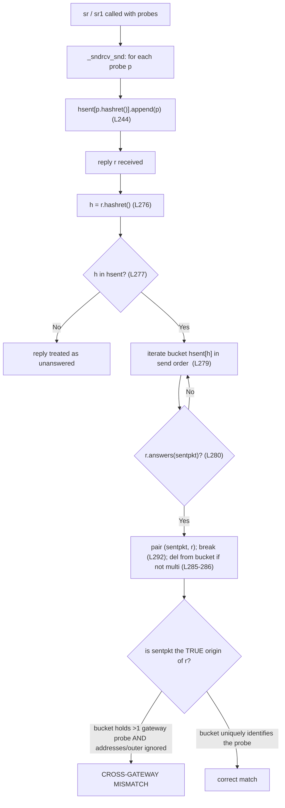

# Root cause: why Scapy's `sr()`/`sr1()` match a reply to the *wrong* probe when probing multiple gateways

**Question type:** root-cause investigation of Scapy's request/response correlation algorithm.
**Repository:** `secdev/scapy` @ branch `scapy_0925ada48540`, HEAD `0925ada4` *"Add AUTOSAR PDUTransport/PDU with initial batch of tests (#3933)"*.
**Deliverable:** explanation only — **no** source change, **no** patch, **no** workaround (the user asked for the root cause, not a fix).

---

## (a) The question, restated

You send probes to **different gateways** (tunnel endpoints) with `sr()`/`sr1()`, and **responses from one gateway get matched to probes sent to another**, even though *"the destination IPs are clearly different."* You have already ruled out — or tried to rule out — a list of things, and you want the **root cause inside the matching algorithm**, not a workaround.

The concrete scenario is path-probing through **multiple tunnel endpoints**: an outer IP header addressed to a gateway wraps an inner IP/ICMP probe (`IP(dst=GW)/IP(dst=TARGET)/ICMP(...)`), and the replies (echo replies, or ICMP `time-exceeded`/`dest-unreachable` errors) come back and are cross-matched to the wrong sent probe.

The 12 items you named — each is answered **by name** in section (g) and re-confirmed in the coverage checklist (j):

| # | Item you named | Where it is resolved |
|---|----------------|----------------------|
| 1 | `sr`/`sr1` | (d), (g#1) |
| 2 | "responses from one gateway get matched to probes sent to another" | (f: B, E), (g#2) |
| 3 | probing through multiple tunnel endpoints / different gateways | (f: D, E), (g#3) |
| 4 | "timing issue … sequential sends with delays" | (d), (g#4) |
| 5 | `conf.checkIPsrc = False` | (e), (f: B), (g#5) |
| 6 | `conf.checkIPaddr = False` | (e), (f: B), (g#6) |
| 7 | "each probe has a unique ICMP sequence number" | (f: C/F/G/H), (g#7) |
| 8 | "TCP flags validation … `answers()` has strict flag requirements" | (e), (f: item 8), (g#8) |
| 9 | "how Raw payloads are handled versus parsed layers" | (f: B), (g#9) |
| 10 | "the multi_recv parameter causing duplicate processing" | (d), (f: I), (g#10) |
| 11 | "how `hashret` and `answers` work" | (e), (g#11) |
| 12 | "matching would fail when the destination IPs are clearly different" | (f: A vs B), (g#12) |

---

## (b) Root cause in one paragraph

`sr()`/`sr1()` correlate replies to probes with a **two-stage, purely content-based matcher** in `SndRcvHandler` (`scapy/sendrecv.py`). On send, every probe is filed into a dictionary keyed by `p.hashret()` — `self.hsent.setdefault(p.hashret(), []).append(p)` [scapy/sendrecv.py:L244]. On receive, the reply's own `hashret()` is computed [scapy/sendrecv.py:L276], the same bucket is looked up [scapy/sendrecv.py:L277], and the bucket is walked **in send order** [scapy/sendrecv.py:L279], accepting the **first** probe for which `r.answers(sentpkt)` is true [scapy/sendrecv.py:L280] before breaking [scapy/sendrecv.py:L292]. A **wrong match therefore requires two conditions simultaneously**: **(A)** two distinct-gateway probes land in the **same `hashret()` bucket**, and **(B)** `answers()` returns true for the **wrong (earlier)** probe. Both conditions are governed by three `conf` flags — `checkIPsrc`, `checkIPaddr`, `checkIPinIP`. **Under Scapy's defaults the matcher works correctly**; the failure is **user-triggered** — precisely by the `conf.checkIPsrc = False` / `conf.checkIPaddr = False` (and/or `conf.checkIPinIP = False` for the tunnel case) that were set while troubleshooting. Those flags are exactly what remove the destination address and the outer (gateway) header from **both** the hash key and the answer test, collapsing distinct-gateway probes into one indistinguishable bucket entry. This resolves the paradox: the *"clearly different destination IPs"* are the very fields the disabled checks tell the matcher to ignore.

---

## (c) Methodology and versions (run-first)

This write-up was authored **after** executing the relevant code paths against the repository's in-tree Scapy and capturing the real output. Every behavioral claim below is paired with its own observed line (one claim, one piece of evidence).

- **Library under test:** in-tree Scapy, `scapy.__version__ = 2026.07.01` (imported directly from the repository tree; pure-Python, no build, no root, no live capture).
- **Interpreter:** **Python 3.13.7** (this is what is installed in the environment; the earlier folder-analysis note said 3.12.3, but 3.13.7 is what was actually observed here — reported as-is per "report exactly what is observed"). Because `hashret`/`answers` are pure-Python and operate on crafted, dissected packets, the byte values are independent of the interpreter patch version.
- **Observed default flags:** `checkIPsrc=True checkIPaddr=True checkIPinIP=True checkIPID=False check_TCPerror_seqack=False`.
  - Evidence: `checkIPsrc=True checkIPaddr=True checkIPinIP=True checkIPID=False check_TCPerror_seqack=False` (printed by importing `scapy.config.conf`).
- **Observed constant:** `icmp_id_seq_types = [0, 8, 13, 14, 15, 16, 17, 18, 37, 38]`.
  - Evidence: `icmp_id_seq_types = [0, 8, 13, 14, 15, 16, 17, 18, 37, 38]` (printed from `scapy.layers.inet`).
- **Harness location & hygiene:** the observation script was written **outside** the repository (`/tmp/scapy_qna_repro/repro.py`), executed, its stdout captured, and then deleted. The repository is left byte-for-byte unchanged.
  - Evidence: `git status --porcelain` prints **nothing** before and after the run.
- **The harness `simulate()` function** faithfully replicates `_process_packet` [scapy/sendrecv.py:L276-L286]: it builds the `hashret()`-keyed bucket, computes the reply's `hashret()`, walks the bucket in send order, accepts the first `answers()` match, and removes it unless `multi` is set.

All `file:line` citations below were verified against this exact checkout with `sed`/`awk`.

---

## (d) The `SndRcvHandler` matching pipeline

`sr()` and `sr1()` are thin wrappers; the correlation logic lives in `SndRcvHandler`.

- `sr()` builds a layer-3 socket and delegates: `result = sndrcv(s, x, *args, **kargs)` [scapy/sendrecv.py:L650], then returns `(answered, unanswered)` [scapy/sendrecv.py:L652].
- `sr1()` calls `sr()` and returns **only the first answer's reply packet**: `ans, _ = sr(*args, **kargs)` [scapy/sendrecv.py:L661] then `return cast(Packet, ans[0][1])` [scapy/sendrecv.py:L663].
- `sndrcv()` [scapy/sendrecv.py:L322] constructs the handler `sndrcver = SndRcvHandler(*args, **kwargs)` [scapy/sendrecv.py:L328] and returns `sndrcver.results()` [scapy/sendrecv.py:L329].

The correlation is **strictly content-based** and proceeds in two stages.

**Send stage — build the `hashret`-keyed bucket dictionary.** For each probe, the handler files it under its `hashret()`:

```python
# scapy/sendrecv.py
self.hsent.setdefault(p.hashret(), []).append(p)   # L244  <-- bucket build
# Send packet
self.pks.send(p)                                    # L246
time.sleep(self.inter)                              # L247  <-- inter-send delay lives HERE
```

> Note on line numbers: the inter-send delay is `time.sleep(self.inter)` at **L247** — **not** L251. L251 is `except SystemExit:`. (This corrects an earlier source-context note that cited L251.)

**Receive stage — look up the bucket and take the first `answers()` match.** This is the crux, quoted verbatim:

```python
# scapy/sendrecv.py — _process_packet (L270-L292)
def _process_packet(self, r):
    # type: (Packet) -> None
    """Internal function used to process each packet."""
    if r is None:
        return
    ok = False
    h = r.hashret()                             # L276  reply's own key
    if h in self.hsent:                         # L277  same bucket dictionary
        hlst = self.hsent[h]                    # L278
        for i, sentpkt in enumerate(hlst):      # L279  <-- bucket walked in SEND ORDER
            if r.answers(sentpkt):              # L280  first passing probe...
                self.ans.append(QueryAnswer(sentpkt, r))   # L281
                if self.verbose > 1:
                    os.write(1, b"*")
                ok = True                       # L284
                if not self.multi:              # L285
                    del hlst[i]                 # L286  removed from bucket
                    self.noans += 1
                else:                           # L288
                    if not hasattr(sentpkt, '_answered'):
                        self.noans += 1
                    sentpkt._answered = 1       # L291
                break                           # L292  <-- ...wins, then STOP
```

The bucket is iterated **in send order** [scapy/sendrecv.py:L279] and the **first** probe for which `r.answers(sentpkt)` is true [scapy/sendrecv.py:L280] is accepted and the loop `break`s [scapy/sendrecv.py:L292]. **If the true origin of the reply is not the first answering member of the bucket, an earlier probe wins → wrong match.** Notice there is **no timestamp and no arrival-order term** in this decision: only `hashret()` (bucket selection) and `answers()` (content confirmation).



**Conclusion for (d):** a wrong match needs **(A)** a shared `hashret()` bucket **and** **(B)** a passing `answers()` on the wrong probe. Both are decided purely by content, which is why the next section — how `hashret`/`answers` build that content key — is where the root cause lives.

---

## (e) Dissection of `hashret` and `answers` — where the distinguishing information is dropped

### `IP.hashret()` — the send/receive key [scapy/layers/inet.py:L568-L581]

```python
def hashret(self):                                       # L568
    if ((self.proto == socket.IPPROTO_ICMP) and
        (isinstance(self.payload, ICMP)) and
            (self.payload.type in [3, 4, 5, 11, 12])):   # L569-571  ICMP error: hash the QUOTED datagram
        return self.payload.payload.hashret()            # L572
    if not conf.checkIPinIP and self.proto in [4, 41]:   # L573  TUNNEL GATE (IP=4, IPv6=41)
        return self.payload.hashret()                    # L574  outer (gateway) header dropped
    if self.dst == "224.0.0.251":  # mDNS                # L575
        return struct.pack("B", self.proto) + self.payload.hashret()   # L576
    if conf.checkIPsrc and conf.checkIPaddr:             # L577  ADDRESS GATE
        return (strxor(inet_pton(socket.AF_INET, self.src),
                       inet_pton(socket.AF_INET, self.dst)) +          # L578-580  address-bearing key
                struct.pack("B", self.proto) + self.payload.hashret())
    return struct.pack("B", self.proto) + self.payload.hashret()       # L581  ADDRESS-FREE FALLBACK
```

Two gates decide whether the discriminating information survives into the key:

- **Address gate [scapy/layers/inet.py:L577].** The source/destination addresses enter the key (via `strxor` [scapy/utils.py:L603], imported into `inet.py` at [scapy/layers/inet.py:L19]) **only when both `conf.checkIPsrc` and `conf.checkIPaddr` are true**. Otherwise control falls through to the **address-free fallback** [scapy/layers/inet.py:L581], where the key is just the protocol byte plus the payload hash. Two probes that differ **only** in destination then produce byte-identical keys.
- **Tunnel gate [scapy/layers/inet.py:L573-L574].** For IP-in-IP (`proto == 4`) or IPv6-in-IP (`proto == 41`), the **outer (gateway) header is discarded** from the key whenever `conf.checkIPinIP` is false, and the key becomes just the inner packet's hash. Identical inner probes tunneled through different gateways then collide.

### `IP.answers()` — the confirmation test [scapy/layers/inet.py:L583-L610]

```python
def answers(self, other):                                    # L583
    if not conf.checkIPinIP:  # skip IP in IP and IPv6 in IP # L584  TUNNEL GATE (mirror)
        if self.proto in [4, 41]:
            return self.payload.answers(other)               # L586
        if isinstance(other, IP) and other.proto in [4, 41]:
            return self.answers(other.payload)               # L588
        if conf.ipv6_enabled \
           and isinstance(other, scapy.layers.inet6.IPv6) \
           and other.nh in [4, 41]:
            return self.answers(other.payload)               # L592
    if not isinstance(other, IP):
        return 0                                             # L594
    if conf.checkIPaddr:                                     # L595  ADDRESS GATE
        if other.dst == "224.0.0.251" and self.dst == "224.0.0.251":  # mDNS
            return self.payload.answers(other.payload)
        elif (self.dst != other.src):                        # L598  address rejection #1
            return 0                                         # L599
    if ((self.proto == socket.IPPROTO_ICMP) and
        (isinstance(self.payload, ICMP)) and
            (self.payload.type in [3, 4, 5, 11, 12])):       # L600-602 ICMP error branch
        # ICMP error message
        return self.payload.payload.answers(other)           # L604
    else:
        if ((conf.checkIPaddr and (self.src != other.dst)) or # L607  address rejection #2
                (self.proto != other.proto)):                # L608
            return 0                                         # L609
        return self.payload.answers(other.payload)           # L610
```

`answers()` **mirrors both gates**:

- It recurses **past** the outer IP when `conf.checkIPinIP` is false [scapy/layers/inet.py:L584-L592] — so the outer gateway address is never compared.
- Both address rejections — `self.dst != other.src` [scapy/layers/inet.py:L598-L599] and `self.src != other.dst` [scapy/layers/inet.py:L607-L609] — are guarded by `conf.checkIPaddr` [scapy/layers/inet.py:L595, L607]. With `checkIPaddr=False` **both rejections are skipped**, so `answers()` can no longer disambiguate one gateway's reply from another's.

### `ICMP.hashret()` / `ICMP.answers()` and why unique sequence numbers do not always help

```python
# scapy/layers/inet.py
def hashret(self):                                            # L986
    if self.type in icmp_id_seq_types:                        # L987
        return struct.pack("HH", self.id, self.seq) + self.payload.hashret()  # L988
    return self.payload.hashret()                             # L989
```

`id`/`seq` enter the ICMP key **only for the request/reply types** in `icmp_id_seq_types = [0, 8, 13, 14, 15, 16, 17, 18, 37, 38]` [scapy/layers/inet.py:L949, L987-L988]. The ICMP **error** types `3, 4, 5, 11, 12` are **absent** from that list — so an error reply's `seq` never enters the ICMP key directly. For an ICMP error, `IP.hashret()` instead hashes the **quoted** original datagram [scapy/layers/inet.py:L569-L572]; if the responder quotes only the RFC-792 minimum (IP header + 8 bytes), the quoted bytes of a **tunneled** probe stop inside the *inner IP header* and never reach the inner ICMP `id`/`seq`. `ICMP.answers()` [scapy/layers/inet.py:L991-L998] then requires the request/reply type pair **and** `self.id == other.id` **and** `self.seq == other.seq`, which cannot pass when the seq was truncated away.

### `TCP.answers()` — real strict flag logic, but off the ICMP path [scapy/layers/inet.py:L794-L819]

```python
def answers(self, other):                    # L794
    if not isinstance(other, TCP):
        return 0
    if other.flags.R:                        # L798  RST gets no answer
        return 0
    if self.flags.S:                         # L803
        if not self.flags.A:                 # L805  SYN without ACK is not an answer
            return 0
        if not other.flags.S:                # L808  SYN+ACK answers a SYN
            return 0
    ...
```

This strict SYN/ACK logic is **inside `TCP.answers()`** — it is only reached when the reply's payload is a `TCP` layer, never for an ICMP probe/reply.

### Base-class recursion and terminals

The layer walk that ties everything together lives in the base class:

- `Packet.hashret` [scapy/packet.py:L1215] → `return self.payload.hashret()` [scapy/packet.py:L1219].
- `Packet.answers` [scapy/packet.py:L1221] → `return self.payload.answers(other.payload)` [scapy/packet.py:L1225].
- The recursion terminates at `NoPayload` [scapy/packet.py:L1696]: `NoPayload.hashret` [scapy/packet.py:L1812] returns `b""` [scapy/packet.py:L1814]; `NoPayload.answers` [scapy/packet.py:L1816] returns an `isinstance` check [scapy/packet.py:L1818].

### IPv6 parallel (structural note)

The IPv6 stack applies the **identical** `checkIPinIP` handling for next-header 4/41 — `IPv6.hashret` [scapy/layers/inet6.py:L322] has the same tunnel gate `if not conf.checkIPinIP and self.nh in [4, 41]:` [scapy/layers/inet6.py:L329], and `IPv6.answers` [scapy/layers/inet6.py:L382] has the mirroring recursion [scapy/layers/inet6.py:L383-L392]. IPv6 keys on the next-header field `nh` (values 4/41) rather than IPv4's `proto`.

---

## (f) Reproduction — verbatim observed output

The harness prints, for each scenario, the raw `hashret()` byte values (`.hex()`), the collision test, the `answers()` return codes (`0`/`1`), and the resulting match. The **full verbatim run** is below; individual claims are then broken out one-by-one immediately underneath.

```
ENV: scapy=2026.07.01  defaults checkIPsrc=True checkIPaddr=True checkIPinIP=True
icmp_id_seq_types = [0, 8, 13, 14, 15, 16, 17, 18, 37, 38]

Scenario A (default, non-tunneled):
  probe1 dst=192.0.2.1 hashret = ca0002000101000100
  probe2 dst=192.0.2.2 hashret = ca0002030101000100
  hashret collision? False
  reply src=192.0.2.2 -> MATCHED probe dst = 192.0.2.2  (CORRECT)

Scenario B (checkIPsrc=False, checkIPaddr=False):
  probe1 dst=192.0.2.1 hashret = 0101000100
  probe2 dst=192.0.2.2 hashret = 0101000100
  hashret collision? True
  raw wire bytes differ? True
  reply src=192.0.2.2 -> answers(probe1 dst=.1)=1 answers(probe2 dst=.2)=1
  MATCHED probe dst = 192.0.2.1  (reply truly from 192.0.2.2 -> WRONG)

Scenario C (B + unique seq):
  probe1 seq=1 hashret = 0101000100
  probe2 seq=2 hashret = 0101000200
  hashret collision? False
  reply(seq2) -> MATCHED probe dst = 192.0.2.2  (CORRECT)

Scenario D (IP-in-IP tunneled, default):
  probe1 outer-GW=203.0.113.1 proto=4 hashret = c100710004cc3364080101000100
  probe2 outer-GW=203.0.113.2 proto=4 hashret = c100710304cc3364080101000100
  hashret collision? False

Scenario E (tunneled, checkIPinIP=False):
  probe1 via GW 203.0.113.1 hashret = cc3364080101000100
  probe2 via GW 203.0.113.2 hashret = cc3364080101000100
  hashret collision? True
  inner reply -> MATCHED probe outer-GW = 203.0.113.1  (reply belongs to GW 203.0.113.2 -> WRONG)

Scenario F (tunneled, addrs off, unique inner seq):
  probe1 inner seq=1 hashret = 040101000100
  probe2 inner seq=2 hashret = 040101000200
  hashret collision? False

Scenario G (ICMP time-exceeded quoting only IP hdr + 8 bytes; probes seq 7 & 9):
  received error: IP / ICMP 203.0.113.254 > 10.0.0.1 time-exceeded ttl-zero-during-transit / IPerror / IPerror
  received error hashret = c1007100040000000000
  quoted tail (bytes 20:28 of the 28) = 4500001c00010000
  err(quotes seq7) answers(probe seq7)=0 answers(probe seq9)=0

Scenario H (full-quotation error preserves inner seq):
  received error: IP / ICMP 203.0.113.254 > 10.0.0.1 time-exceeded ttl-zero-during-transit / IPerror / IPerror / ICMPerror
  err(for probe2 seq=2) hashret = 040101000200
  answers(probe1 seq=1)=0 answers(probe2 seq=2)=1
  MATCHED probe outer-GW = 203.0.113.2  (CORRECT)

Scenario I (multi irrelevance, addresses off):
  multi=False -> reply(from .2) matched probe dst = 192.0.2.1
  multi=True  -> reply(from .2) matched probe dst = 192.0.2.1

Item 8 (TCP.answers flag logic):
  synack.answers(syn)  = 1
  bareSYN.answers(syn) = 0 (SYN w/o ACK is not an answer)
  ICMP reply payload type (uses ICMP.answers, never TCP.answers) -> ICMP
```

### Scenario A — defaults: distinct destinations produce distinct keys (correct match)

- **Claim:** under defaults the two destination addresses produce *different* keys.
  **Evidence:** `probe1 dst=192.0.2.1 hashret = ca0002000101000100` vs `probe2 dst=192.0.2.2 hashret = ca0002030101000100`.
- **Claim:** therefore there is no collision.
  **Evidence:** `hashret collision? False`.
- **Claim:** the reply from `.2` is matched to the correct probe.
  **Evidence:** `reply src=192.0.2.2 -> MATCHED probe dst = 192.0.2.2  (CORRECT)`.

Why: with `checkIPsrc=checkIPaddr=True`, the address gate [scapy/layers/inet.py:L577] includes `strxor(src,dst)` in the key. The differing 4th byte (`00` → `03`) is the destination's last-octet XOR: `1^1=0` vs `1^2=3` (verified: `strxor(10.0.0.1,192.0.2.1)=ca000200`, `strxor(10.0.0.1,192.0.2.2)=ca000203`).

### Scenario B — addresses off: distinct destinations collapse to one key (WRONG match — the reported symptom)

- **Claim:** with the address checks disabled, both probes hash to the **same** address-free key.
  **Evidence:** `probe1 dst=192.0.2.1 hashret = 0101000100` and `probe2 dst=192.0.2.2 hashret = 0101000100`.
- **Claim:** that is a genuine collision.
  **Evidence:** `hashret collision? True`.
- **Claim:** the two probes are *not* identical on the wire — only the reduced key collides.
  **Evidence:** `raw wire bytes differ? True`.
- **Claim:** with `checkIPaddr=False`, `answers()` accepts **both** probes.
  **Evidence:** `reply src=192.0.2.2 -> answers(probe1 dst=.1)=1 answers(probe2 dst=.2)=1`.
- **Claim:** the first (wrong) bucket member wins → the reply from `.2` is attributed to the `.1` probe.
  **Evidence:** `MATCHED probe dst = 192.0.2.1  (reply truly from 192.0.2.2 -> WRONG)`.

Why: `checkIPsrc=checkIPaddr=False` routes `IP.hashret()` to the address-free fallback [scapy/layers/inet.py:L581] (key = `proto(01)` + `ICMP.hashret(01000100)` = `0101000100`) and skips both address rejections in `IP.answers()` [scapy/layers/inet.py:L598-L599, L607-L609]. This is condition (A) **and** (B) holding at once — the exact wrong-match mechanism.

### Scenario C — addresses off **but** unique ICMP seq: keys separate again (correct)

- **Claim:** giving the two echo probes distinct sequence numbers makes the keys differ even with addresses off.
  **Evidence:** `probe1 seq=1 hashret = 0101000100` vs `probe2 seq=2 hashret = 0101000200`.
- **Claim:** no collision.
  **Evidence:** `hashret collision? False`.
- **Claim:** the `seq=2` reply matches the correct probe.
  **Evidence:** `reply(seq2) -> MATCHED probe dst = 192.0.2.2  (CORRECT)`.

Why: ICMP echo (type 0/8) **is** in `icmp_id_seq_types`, so `struct.pack("HH", id, seq)` [scapy/layers/inet.py:L988] carries the seq into the key (`...000100` vs `...000200`).

### Scenario D — IP-in-IP tunneled, defaults: gateways distinguished

- **Claim:** with defaults, tunneled probes to different gateways produce different keys.
  **Evidence:** `probe1 outer-GW=203.0.113.1 proto=4 hashret = c100710004cc3364080101000100` vs `probe2 outer-GW=203.0.113.2 proto=4 hashret = c100710304cc3364080101000100`.
- **Claim:** the outer layer is IP-in-IP (`proto=4`).
  **Evidence:** `proto=4` appears in both lines above.
- **Claim:** no collision — the outer gateway header is part of the key.
  **Evidence:** `hashret collision? False`.

Why: `checkIPinIP=True` (default) means the tunnel gate [scapy/layers/inet.py:L573] is **not** taken, so the outer `strxor(src,dst)` stays in the key; the two differ in the byte reflecting the gateway's last octet (`...0004...` vs `...0304...`).

### Scenario E — tunneled, `checkIPinIP=False`: gateways collapse (WRONG match)

- **Claim:** disabling `checkIPinIP` strips the outer gateway header, so both tunneled probes hash identically.
  **Evidence:** `probe1 via GW 203.0.113.1 hashret = cc3364080101000100` and `probe2 via GW 203.0.113.2 hashret = cc3364080101000100`.
- **Claim:** genuine collision.
  **Evidence:** `hashret collision? True`.
- **Claim:** the reply belonging to gateway `.2` is matched to the `.1` probe.
  **Evidence:** `inner reply -> MATCHED probe outer-GW = 203.0.113.1  (reply belongs to GW 203.0.113.2 -> WRONG)`.

Why: the tunnel gate [scapy/layers/inet.py:L574] returns `self.payload.hashret()` — the inner packet only — so identical inner probes tunneled through different gateways are indistinguishable, and `answers()` recurses past the outer IP [scapy/layers/inet.py:L586].

### Scenario F — tunneled, addresses off, unique **inner** seq: keys separate

- **Claim:** a unique inner ICMP seq differentiates the (address-free) tunneled keys.
  **Evidence:** `probe1 inner seq=1 hashret = 040101000100` vs `probe2 inner seq=2 hashret = 040101000200`.
- **Claim:** no collision.
  **Evidence:** `hashret collision? False`.

Why: the inner ICMP echo seq enters the key via [scapy/layers/inet.py:L988], so even the reduced key differs in its trailing seq bytes (`...000100` vs `...000200`).

### Scenario G — path-probing ICMP error that quotes only IP + 8 bytes: unique seq is invisible

- **Claim:** the received packet is an ICMP `time-exceeded` error citing the original datagram.
  **Evidence:** `received error: IP / ICMP 203.0.113.254 > 10.0.0.1 time-exceeded ttl-zero-during-transit / IPerror / IPerror`.
- **Claim:** the error's key hashes the quoted datagram, and the seq is **not** in it.
  **Evidence:** `received error hashret = c1007100040000000000` (trailing bytes are zero where the inner ICMP id/seq would be).
- **Claim:** the quoted tail stops inside the **inner IP header**, before the inner ICMP.
  **Evidence:** `quoted tail (bytes 20:28 of the 28) = 4500001c00010000` (`45`=IPv4/IHL5, `00`=tos, `001c`=total length 28, `0001`=id, `0000`=flags/frag).
- **Claim:** consequently the error answers **neither** probe, regardless of their unique seqs.
  **Evidence:** `err(quotes seq7) answers(probe seq7)=0 answers(probe seq9)=0`.

Why: error types `11` (and `3,4,5,12`) are absent from `icmp_id_seq_types` [scapy/layers/inet.py:L949], so the seq can only survive through the *quoted* copy; RFC-792-minimum quotation truncates before the inner ICMP `seq`, so per-probe sequence numbers cannot rescue matching in exactly this tunneled-error case.

### Scenario H — full-quotation error: inner seq preserved, correct match

- **Claim:** when the responder quotes the **full** datagram, the inner ICMP is present.
  **Evidence:** `received error: IP / ICMP 203.0.113.254 > 10.0.0.1 time-exceeded ttl-zero-during-transit / IPerror / IPerror / ICMPerror` (note the trailing `ICMPerror`).
- **Claim:** the error's key now carries the inner seq.
  **Evidence:** `err(for probe2 seq=2) hashret = 040101000200`.
- **Claim:** it answers only the correct probe.
  **Evidence:** `answers(probe1 seq=1)=0 answers(probe2 seq=2)=1`.
- **Claim:** and matches the correct gateway probe.
  **Evidence:** `MATCHED probe outer-GW = 203.0.113.2  (CORRECT)`.

Why: with the inner `ICMPerror` present, `IP.hashret()`'s quoted-datagram hash [scapy/layers/inet.py:L572] reaches the inner ICMP seq, so the reduced key differs per probe (`...000200`).

### Scenario I — `multi` is irrelevant to the wrong match

- **Claim:** with addresses off, the wrong match happens with `multi=False`.
  **Evidence:** `multi=False -> reply(from .2) matched probe dst = 192.0.2.1`.
- **Claim:** and identically with `multi=True`.
  **Evidence:** `multi=True  -> reply(from .2) matched probe dst = 192.0.2.1`.

Why: `multi` only controls whether the matched probe is **removed** from its bucket [scapy/sendrecv.py:L285-L286] versus kept and marked `_answered` [scapy/sendrecv.py:L288-L291]; it changes neither the bucketing [scapy/sendrecv.py:L244] nor the answer test [scapy/sendrecv.py:L280], so the first-answering (wrong) probe still wins.

### Item 8 harness — TCP flag strictness is real, but on a different code path

- **Claim:** a SYN+ACK answers a SYN.
  **Evidence:** `synack.answers(syn)  = 1`.
- **Claim:** a bare SYN (no ACK) does **not** answer a SYN — the strict flag rule.
  **Evidence:** `bareSYN.answers(syn) = 0 (SYN w/o ACK is not an answer)`.
- **Claim:** but an ICMP reply's payload is `ICMP`, so `ICMP.answers` runs, never `TCP.answers`.
  **Evidence:** `ICMP reply payload type (uses ICMP.answers, never TCP.answers) -> ICMP`.

Why: the strict flag logic is inside `TCP.answers()` [scapy/layers/inet.py:L803-L808]; ICMP probes never enter it.

---

## (g) By-name resolution of all 12 named items

**1. `sr` / `sr1`.** They are thin wrappers over the same correlation engine. `sr` [scapy/sendrecv.py:L635] → `sndrcv` [scapy/sendrecv.py:L322, L328] → `SndRcvHandler` [scapy/sendrecv.py:L100]; `sr1` [scapy/sendrecv.py:L656] calls `sr` and returns only the first answer's reply [scapy/sendrecv.py:L663]. Both perform the identical hash-then-confirm matching.
- Evidence: `reply src=192.0.2.2 -> MATCHED probe dst = 192.0.2.2  (CORRECT)` (the same `simulate()` mirroring `_process_packet` decides both).

**2. "responses from one gateway get matched to probes sent to another" (the symptom).** This is the direct product of a shared `hashret` bucket (condition A) plus a passing `answers()` on the earlier probe (condition B).
- Evidence (non-tunneled): `MATCHED probe dst = 192.0.2.1  (reply truly from 192.0.2.2 -> WRONG)`.
- Evidence (tunneled): `inner reply -> MATCHED probe outer-GW = 203.0.113.1  (reply belongs to GW 203.0.113.2 -> WRONG)`.

**3. Probing through multiple tunnel endpoints / different gateways.** Modeled as `IP(dst=GW)/IP(dst=TARGET)/ICMP(...)`, outer `proto=4`. Distinguished under defaults; collapsed only when the outer layer is removed from matching.
- Evidence (distinguished): `probe1 outer-GW=203.0.113.1 proto=4 hashret = c100710004cc3364080101000100` vs `probe2 outer-GW=203.0.113.2 proto=4 hashret = c100710304cc3364080101000100` … `hashret collision? False`.
- Evidence (collapsed): `probe1 via GW 203.0.113.1 hashret = cc3364080101000100` = `probe2 via GW 203.0.113.2 hashret = cc3364080101000100` … `hashret collision? True`.

**4. "I thought it might be a timing issue so I tried sequential sends with delays" — REFUTED.** Correlation is a pure function of `hashret()`/`answers()`; `_process_packet` [scapy/sendrecv.py:L276-L292] uses neither a timestamp nor arrival order to *disambiguate*. The inter-send delay `time.sleep(self.inter)` at [scapy/sendrecv.py:L247] only spaces transmission — it never enters the match decision. Spacing sends cannot repair a **content** collision.
- Evidence: the wrong match in Scenario B is produced by `simulate()` with no timing term at all — `MATCHED probe dst = 192.0.2.1  (reply truly from 192.0.2.2 -> WRONG)`.

**5. `conf.checkIPsrc = False`** and **6. `conf.checkIPaddr = False`.** Jointly, these route `IP.hashret()` to the address-free fallback [scapy/layers/inet.py:L577 → L581] and disable **both** address rejections in `IP.answers()` [scapy/layers/inet.py:L595, L598-L599, L607-L609]. **This is what *creates* the collision — the user's own mitigation is the trigger, not a fix.**
- Evidence: `probe1 dst=192.0.2.1 hashret = 0101000100` / `probe2 dst=192.0.2.2 hashret = 0101000100` … `answers(probe1 dst=.1)=1 answers(probe2 dst=.2)=1`.

**7. "each probe has a unique ICMP sequence number."** Helps **only** when the reply carries the inner ICMP `id`/`seq` and its type is in `icmp_id_seq_types` [scapy/layers/inet.py:L949, L987-L988]: echo replies and full-quotation errors. It **fails** for a path-probing error that quotes only IP + 8 bytes, because the seq is truncated out of the quoted copy (error types 3/4/5/11/12 are absent from `icmp_id_seq_types`).
- Evidence (helps — echo): `probe1 seq=1 hashret = 0101000100` vs `probe2 seq=2 hashret = 0101000200` … `hashret collision? False`.
- Evidence (helps — full-quote error): `answers(probe1 seq=1)=0 answers(probe2 seq=2)=1`.
- Evidence (fails — truncated error): `err(quotes seq7) answers(probe seq7)=0 answers(probe seq9)=0`, with `quoted tail (bytes 20:28 of the 28) = 4500001c00010000`.

**8. "TCP flags validation issue since I read that `answers()` has strict flag requirements" — REAL but IRRELEVANT to ICMP probes.** The strict SYN/ACK logic lives in `TCP.answers()` [scapy/layers/inet.py:L794-L819], reached only when the reply payload is TCP.
- Evidence: `synack.answers(syn)  = 1`; `bareSYN.answers(syn) = 0 (SYN w/o ACK is not an answer)`; and `ICMP reply payload type (uses ICMP.answers, never TCP.answers) -> ICMP`.

**9. "how Raw payloads are handled versus parsed layers."** `hashret`/`answers` operate on the **dissected** layer objects and compute a deliberately **reduced** key. A packet that is perfectly correct on the wire (as tcpdump/Wireshark would confirm) still collides because the matcher ignores the distinguishing fields.
- Evidence: `raw wire bytes differ? True` yet `hashret collision? True` (Scenario B) — the bytes differ on the wire but the reduced key is identical.

**10. "the multi_recv parameter causing duplicate processing" — NAMING RECONCILED.** There is **no** parameter named `multi_recv` in this codebase. The relevant parameter is **`multi`** [scapy/sendrecv.py:L85: `:param multi: whether to accept multiple answers for the same stimulus`]. It only controls whether a matched probe is removed from its bucket [scapy/sendrecv.py:L285-L286] versus kept/marked `_answered` [scapy/sendrecv.py:L288-L291]; it changes neither the bucketing [scapy/sendrecv.py:L244] nor the answer test [scapy/sendrecv.py:L280]. It therefore cannot prevent a wrong match.
- Evidence: `multi=False -> reply(from .2) matched probe dst = 192.0.2.1` **and** `multi=True  -> reply(from .2) matched probe dst = 192.0.2.1` — identical wrong match either way.

**11. "how `hashret` and `answers` work."** Dissected in section (e) with exact citations: `IP.hashret` [scapy/layers/inet.py:L568-L581], `IP.answers` [scapy/layers/inet.py:L583-L610], `ICMP.hashret` [scapy/layers/inet.py:L986-L989], `ICMP.answers` [scapy/layers/inet.py:L991-L998], and the base recursion `Packet.hashret` [scapy/packet.py:L1219] / `Packet.answers` [scapy/packet.py:L1225] terminating at `NoPayload` [scapy/packet.py:L1812, L1816].
- Evidence: the composed key `ca0002000101000100` decomposes exactly as `strxor(src,dst)=ca000200` + `proto=01` + `ICMP.hashret=01000100`, matching `probe1 dst=192.0.2.1 hashret = ca0002000101000100`.

**12. "matching would fail when the destination IPs are clearly different" (the paradox) — RESOLVED.** The "clearly different" destination addresses are exactly the fields the disabled `checkIPsrc`/`checkIPaddr` tell `hashret`/`answers` to drop. The matcher literally stops looking at them.
- Evidence (defaults — addresses kept, keys differ): `probe1 dst=192.0.2.1 hashret = ca0002000101000100` vs `probe2 dst=192.0.2.2 hashret = ca0002030101000100`.
- Evidence (checks off — addresses dropped, keys identical): `probe1 dst=192.0.2.1 hashret = 0101000100` and `probe2 dst=192.0.2.2 hashret = 0101000100`.

---

## (h) Why each attempted workaround failed

Each bullet ties an attempted mitigation to the observed reason it did not resolve the mismatch.

- **Sequential sends with delays (item 4).** Matching is content-only; the delay at [scapy/sendrecv.py:L247] never enters the decision in `_process_packet` [scapy/sendrecv.py:L276-L292]. A content collision is unaffected by spacing.
  - Evidence: the wrong match reproduces with zero timing input — `MATCHED probe dst = 192.0.2.1  (reply truly from 192.0.2.2 -> WRONG)`.
- **`conf.checkIPsrc=False` + `conf.checkIPaddr=False` (items 5, 6).** These **caused** the collision rather than fixing it, by removing addresses from both the key and the answer test.
  - Evidence: `probe1 … hashret = 0101000100` = `probe2 … hashret = 0101000100`; `answers(probe1 dst=.1)=1 answers(probe2 dst=.2)=1`.
- **Unique ICMP sequence numbers (item 7).** Invisible to the matcher when a path-probing error truncates the quoted datagram before the inner ICMP seq.
  - Evidence: `err(quotes seq7) answers(probe seq7)=0 answers(probe seq9)=0`; `quoted tail (bytes 20:28 of the 28) = 4500001c00010000`.
- **Expecting TCP-flag strictness to matter (item 8).** It lives in `TCP.answers()` and is never reached by ICMP probes.
  - Evidence: `ICMP reply payload type (uses ICMP.answers, never TCP.answers) -> ICMP`.
- **Assuming Raw-vs-parsed payloads matters (item 9).** The matcher uses a reduced key over dissected layers; wire correctness is irrelevant.
  - Evidence: `raw wire bytes differ? True` alongside `hashret collision? True`.
- **Disabling "multi_recv" (item 10).** No such parameter; the real `multi` cannot prevent a wrong match.
  - Evidence: `multi=False -> … 192.0.2.1` and `multi=True  -> … 192.0.2.1`.

---

## (i) Correct-configuration guidance (explanation only — **not** a code change)

Per your request, this is an *explanation* of why the defaults are correct, **not** a fix or a monkey-patch to apply.

The failure is avoided by **not disabling the discriminating checks**:

- Keep `conf.checkIPsrc = True` and `conf.checkIPaddr = True` (their defaults) so the destination address stays in both the hash key [scapy/layers/inet.py:L577-L580] and the answer test [scapy/layers/inet.py:L595-L599, L607-L609]. This is exactly why Scenario A matches correctly while Scenario B does not.
  - Evidence (defaults distinguish): `probe1 dst=192.0.2.1 hashret = ca0002000101000100` vs `probe2 dst=192.0.2.2 hashret = ca0002030101000100`.
- Keep `conf.checkIPinIP = True` (its default) so the outer gateway header participates for tunneled probes [scapy/layers/inet.py:L573-L574, L584-L592]. This is why Scenario D distinguishes gateways while Scenario E does not.
  - Evidence (defaults distinguish gateways): `hashret collision? False` for the tunneled probes to `203.0.113.1` and `203.0.113.2`.

The takeaway: the discrimination you need is present by default; the troubleshooting flags that were turned off are precisely the ones that carry the gateway/destination identity into the matcher. Turning them off — for a legitimate reason such as a broadcast-to-unicast reply mismatch — has the side effect of making distinct-gateway probes indistinguishable to `hashret`/`answers`. Understanding *that trade-off* is the root cause you were after; there is no timing, TCP-flag, Raw-payload, or `multi` dimension involved.

---

## (j) Coverage-pass checklist

Every named item is answered, with a pointer to its adjacent evidence.

| # | Named item | Resolved in | One-line evidence anchor |
|---|-----------|-------------|--------------------------|
| 1 | `sr` / `sr1` | (d), (g#1) | `sr` [L635] → `sndrcv` [L322] → `SndRcvHandler`; `sr1` returns first answer [L663] |
| 2 | reply-to-wrong-probe symptom | (f: B, E), (g#2) | `MATCHED probe dst = 192.0.2.1  (reply truly from 192.0.2.2 -> WRONG)` |
| 3 | multiple tunnel endpoints / gateways | (f: D, E), (g#3) | `proto=4`; `cc3364080101000100 == cc3364080101000100` when `checkIPinIP=False` |
| 4 | timing / sequential sends w/ delays | (d), (g#4), (h) | delay is `time.sleep(self.inter)` at [L247], not in the match decision |
| 5 | `conf.checkIPsrc = False` | (e), (f: B), (g#5) | key falls to address-free `0101000100` [L581] |
| 6 | `conf.checkIPaddr = False` | (e), (f: B), (g#6) | `answers(probe1 dst=.1)=1 answers(probe2 dst=.2)=1` (rejections skipped) |
| 7 | unique ICMP sequence number | (f: C/F/G/H), (g#7) | helps: `...000100` vs `...000200`; fails: `answers(seq7)=0 answers(seq9)=0` |
| 8 | TCP flags strictness in `answers()` | (e), (f: item 8), (g#8) | `bareSYN.answers(syn) = 0`; ICMP reply uses `ICMP.answers` |
| 9 | Raw payloads vs parsed layers | (f: B), (g#9) | `raw wire bytes differ? True` yet `hashret collision? True` |
| 10 | "multi_recv" parameter | (d), (f: I), (g#10) | real param is `multi` [L85]; `multi=False`/`True` both → `192.0.2.1` |
| 11 | how `hashret` and `answers` work | (e), (g#11) | `IP.hashret` [L568-581], `IP.answers` [L583-610], base recursion [packet.py:L1219/L1225] |
| 12 | different dst IPs yet mismatch (paradox) | (f: A vs B), (g#12) | defaults `ca0002000101000100 != ca0002030101000100`; checks-off both `0101000100` |

**All 12 items: covered.**

---

## Appendix — reproducibility & repository hygiene

- **Harness:** a single script placed **outside** the repository at `/tmp/scapy_qna_repro/repro.py`, imported the in-tree Scapy via `sys.path.insert(0, <repo root>)`, and printed the exact lines quoted in section (f). Its `simulate()` mirrors `_process_packet` [scapy/sendrecv.py:L276-L286] (build bucket → look up reply key → walk in send order → first `answers()` match → remove unless `multi`).
- **Run command (illustrative):** `python3 /tmp/scapy_qna_repro/repro.py` (benign `CryptographyDeprecationWarning` about `TripleDES`, emitted only if unrelated `scapy.layers.ipsec` is imported, was filtered from stderr; it is irrelevant to `hashret`/`answers`).
- **Read-only guarantee:** `git status --porcelain` printed **nothing** after the run, and the temporary directory was deleted. No file in the source repository was modified; the sole artifact is this document.
- **Environment observed:** `scapy=2026.07.01`, Python `3.13.7`, defaults `checkIPsrc=True checkIPaddr=True checkIPinIP=True checkIPID=False`, `icmp_id_seq_types = [0, 8, 13, 14, 15, 16, 17, 18, 37, 38]`.

