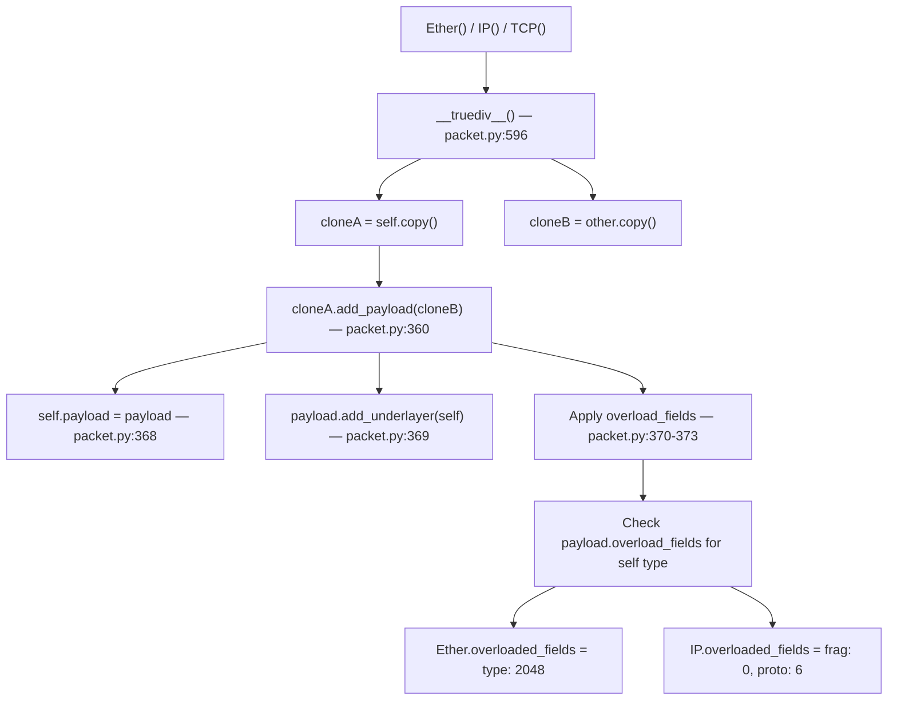
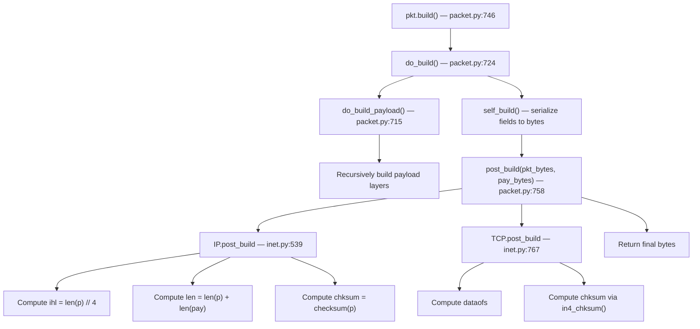
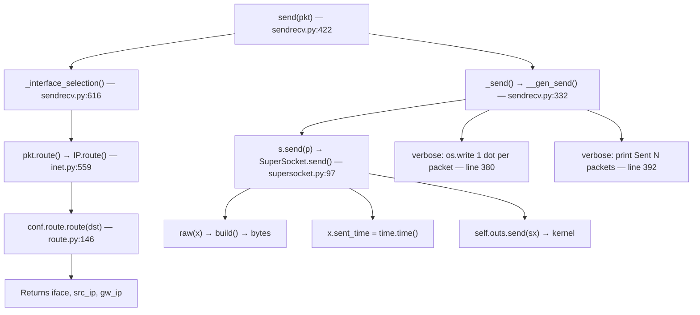
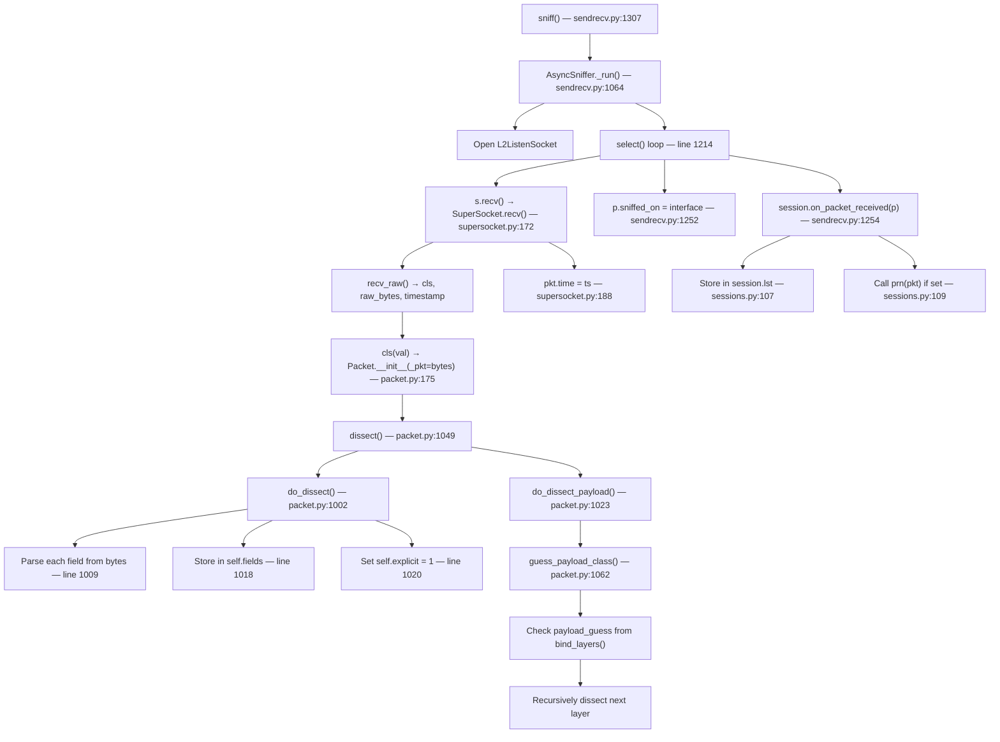

# Scapy Runtime Behavior: Building, Sending, and Sniffing Packets

> A code-grounded analysis of what Scapy displays and reports at each stage of the
> build → send → sniff lifecycle, with source code citations.

---

## Table of Contents

1. [Starting Scapy](#1-starting-scapy)
2. [Building Packets — Layer-by-Layer Observation](#2-building-packets--layer-by-layer-observation)
   - [2.1 Creating Individual Layers](#21-creating-individual-layers)
   - [2.2 Stacking with the `/` Operator](#22-stacking-with-the--operator)
   - [2.3 The `__repr__()` Method — Why `repr()` Is Concise](#23-the-__repr__-method--why-repr-is-concise)
   - [2.4 The `show()` Method — Full Field Visibility](#24-the-show-method--full-field-visibility)
   - [2.5 The `show2()` Method — Post-Build Computed Values](#25-the-show2-method--post-build-computed-values)
   - [2.6 Other Display Methods](#26-other-display-methods)
3. [Sending Packets — Transmission Observation](#3-sending-packets--transmission-observation)
   - [3.1 Route Resolution](#31-route-resolution)
   - [3.2 `send()` / `sendp()` Verbose Output](#32-send--sendp-verbose-output)
   - [3.3 `sr1()` / `sr()` Verbose Output](#33-sr1--sr-verbose-output)
   - [3.4 Socket-Level Build and Transmit](#34-socket-level-build-and-transmit)
4. [Sniffing Packets — Reception Observation](#4-sniffing-packets--reception-observation)
   - [4.1 How `sniff()` Captures Packets](#41-how-sniff-captures-packets)
   - [4.2 Dissection from Raw Bytes](#42-dissection-from-raw-bytes)
   - [4.3 Display of Sniffed Packets](#43-display-of-sniffed-packets)
   - [4.4 `prn` Callback Output](#44-prn-callback-output)
   - [4.5 PacketList Display](#45-packetlist-display)
5. [Summary — Build vs Send vs Sniff](#5-summary--build-vs-send-vs-sniff)
   - [5.1 Key Behavioral Differences](#51-key-behavioral-differences)
   - [5.2 show() vs show2() Summary](#52-show-vs-show2-summary)
   - [5.3 Lifecycle Mermaid Diagrams](#53-lifecycle-mermaid-diagrams)
6. [Source References](#6-source-references)

---

## 1. Starting Scapy

### What happens when `from scapy.all import *` is executed

When you run `from scapy.all import *` in a Python script or at the Python REPL, Scapy's
`scapy/all.py` module is imported. This triggers a cascade of sub-module imports that
initialize the entire Scapy runtime: the configuration singleton (`conf`), the routing table,
all protocol layer definitions, and the socket backends.

**Source:** `scapy/all.py` — umbrella import that loads all public APIs.

In contrast, when you start Scapy via its interactive console (the `scapy` command), the
`interact()` function is called:

**Source:** `scapy/main.py:503`

```python
def interact(mydict=None, argv=None, mybanner=None, loglevel=logging.INFO):
    """Starts Scapy's console."""
```

The interactive console performs two additional setup steps that a bare `import` does not:

1. **Sets interactive mode and loads the color theme:**

   ```python
   conf.interactive = True
   conf.color_theme = DefaultTheme()
   ```

   **Source:** `scapy/main.py:513-514`

   The `DefaultTheme` (from `scapy/themes.py`) applies ANSI color codes to `repr()` and
   `show()` output, making field names, values, and punctuation visually distinct. When
   running non-interactively (e.g., in a script), `conf.color_theme` defaults to `NoTheme`,
   which produces plain uncolored text.

2. **Displays the banner:**

   The interactive console prints the Scapy ASCII art logo, version, and a welcome
   message.

   **Source:** `scapy/main.py:589-655` — banner formatting and display logic.

### Rationale

The distinction between interactive and scripted usage matters for observing Scapy's output
because `repr()` and `show()` delegate color formatting to `conf.color_theme`. In this
document, all runtime outputs were captured with `conf.color_theme = NoTheme()` to produce
plain text suitable for documentation. In an interactive terminal, the same outputs would
include ANSI color escape sequences.

**Source:** `scapy/themes.py` — `DefaultTheme`, `NoTheme`, and `AnsiColorTheme` class
definitions.

---

## 2. Building Packets — Layer-by-Layer Observation

### 2.1 Creating Individual Layers

Scapy represents network protocols as Python classes that inherit from `Packet`. Each layer
class declares its fields in a `fields_desc` list, with default values.

#### Ether (Ethernet)

```python
>>> from scapy.all import *
>>> e = Ether()
>>> repr(e)
'<Ether  |>'
```

The `Ether` class is defined at `scapy/layers/l2.py:244-248`:

```python
class Ether(Packet):
    name = "Ethernet"
    fields_desc = [DestMACField("dst"),
                   SourceMACField("src"),
                   XShortEnumField("type", 0x9000, ETHER_TYPES)]
```

**Default field values:**
- `dst` — `DestMACField` with default `None` (resolved to `ff:ff:ff:ff:ff:ff` at build time). Source: `scapy/layers/l2.py:161-179`
- `src` — `SourceMACField` with default `None` (resolved to the interface's MAC at build time). Source: `scapy/layers/l2.py:186-211`
- `type` — default `0x9000` (Loopback/Configuration Test Protocol)

**Why `repr(Ether())` shows `<Ether  |>`:** Because no fields have been explicitly set by the
user, and no overload fields are active (no payload attached yet), the `__repr__()` method
(described in Section 2.3) skips all fields, producing an empty display.

#### IP (Internet Protocol)

```python
>>> i = IP()
>>> repr(i)
'<IP  |>'
```

The `IP` class is defined at `scapy/layers/inet.py:521-537`:

```python
class IP(Packet, IPTools):
    name = "IP"
    fields_desc = [BitField("version", 4, 4),
                   BitField("ihl", None, 4),
                   XByteField("tos", 0),
                   ShortField("len", None),
                   ShortField("id", 1),
                   FlagsField("flags", 0, 3, ["MF", "DF", "evil"]),
                   BitField("frag", 0, 13),
                   ByteField("ttl", 64),
                   ByteEnumField("proto", 0, IP_PROTOS),
                   XShortField("chksum", None),
                   Emph(SourceIPField("src", "dst")),
                   Emph(DestIPField("dst", "127.0.0.1")),
                   PacketListField("options", [], IPOption, length_from=lambda p:p.ihl * 4 - 20)]
```

**Key defaults:**
- `version=4`, `ihl=None` (auto-computed), `tos=0`, `len=None` (auto-computed)
- `id=1`, `flags=0`, `frag=0`, `ttl=64`, `proto=0` (hopopt)
- `chksum=None` (auto-computed), `src=None` (auto-resolved), `dst="127.0.0.1"`

Fields with `None` defaults (`ihl`, `len`, `chksum`) are **auto-computed** during the build
process (see Section 2.5).

#### TCP (Transmission Control Protocol)

```python
>>> t = TCP()
>>> repr(t)
'<TCP  |>'
```

The `TCP` class is defined at `scapy/layers/inet.py:753-765`:

```python
class TCP(Packet):
    name = "TCP"
    fields_desc = [ShortEnumField("sport", 20, TCP_SERVICES),
                   ShortEnumField("dport", 80, TCP_SERVICES),
                   IntField("seq", 0),
                   IntField("ack", 0),
                   BitField("dataofs", None, 4),
                   BitField("reserved", 0, 3),
                   FlagsField("flags", 0x2, 9, "FSRPAUECN"),
                   ShortField("window", 8192),
                   XShortField("chksum", None),
                   ShortField("urgptr", 0),
                   TCPOptionsField("options", "")]
```

**Key defaults:**
- `sport=20` (ftp_data), `dport=80` (http), `seq=0`, `ack=0`
- `dataofs=None` (auto-computed), `reserved=0`, `flags=0x2` (SYN)
- `window=8192`, `chksum=None` (auto-computed), `urgptr=0`

### Rationale

All three `repr()` outputs are empty (`<ClassName  |>`) because no fields have been
explicitly set. The `__repr__()` method only shows fields that are in `self.fields` (user-set)
or `self.overloaded_fields` (set by `bind_layers()`). When a layer is freshly constructed
with no arguments, both dictionaries are empty.

**Source:** `scapy/packet.py:552-586` — `Packet.__repr__()` implementation.

---

### 2.2 Stacking with the `/` Operator

Scapy uses Python's division operator (`/`) to stack protocol layers:

```python
>>> pkt = Ether() / IP() / TCP()
>>> repr(pkt)
'<Ether  type=IPv4 |<IP  frag=0 proto=tcp |<TCP  |>>>'
```

**Observation:** After stacking, `Ether.type` now shows `IPv4` (0x0800) and `IP.proto` shows
`tcp` (6), even though we never set these values. This is the **overload fields** mechanism
driven by `bind_layers()`.

#### How the `/` operator works

The `/` operator calls `__truediv__()`:

**Source:** `scapy/packet.py:596-607`

```python
def __div__(self, other):
    if isinstance(other, Packet):
        cloneA = self.copy()
        cloneB = other.copy()
        cloneA.add_payload(cloneB)
        return cloneA
    elif isinstance(other, (bytes, str, bytearray, memoryview)):
        return self / conf.raw_layer(load=bytes_encode(other))
    else:
        return other.__rdiv__(self)
__truediv__ = __div__
```

**Step-by-step:**
1. Both `self` and `other` are deep-copied to avoid mutating the originals.
2. `cloneA.add_payload(cloneB)` links them together.

#### How `add_payload()` applies overload fields

**Source:** `scapy/packet.py:360-377`

```python
def add_payload(self, payload):
    if payload is None:
        return
    elif not isinstance(self.payload, NoPayload):
        self.payload.add_payload(payload)
    else:
        if isinstance(payload, Packet):
            self.payload = payload
            payload.add_underlayer(self)
            for t in self.aliastypes:
                if t in payload.overload_fields:
                    self.overloaded_fields = payload.overload_fields[t]
                    break
```

The critical lines are **370-373**: after setting `self.payload = payload` and establishing the
`underlayer` link, Scapy iterates through `self.aliastypes` and checks if the *payload's*
class has `overload_fields` entries for the *underlayer's* type. If a match is found,
`self.overloaded_fields` is updated with those values.

#### The `bind_layers()` registration mechanism

The overload fields are registered at import time by `bind_layers()` calls:

**Source:** `scapy/layers/inet.py:1101`
```python
bind_layers(Ether, IP, type=2048)
```

**Source:** `scapy/layers/inet.py:1113`
```python
bind_layers(IP, TCP, frag=0, proto=6)
```

The `bind_layers()` function (`scapy/packet.py:1974-1996`) calls both `bind_top_down()` and
`bind_bottom_up()`:

**Source:** `scapy/packet.py:1974-1996`
```python
def bind_layers(lower, upper, __fval=None, **fval):
    if __fval is not None:
        fval.update(__fval)
    bind_top_down(lower, upper, **fval)
    bind_bottom_up(lower, upper, **fval)
```

- **`bind_top_down()`** (`scapy/packet.py:1953-1971`) stores the field overloads on the
  *upper* class:
  ```python
  upper._overload_fields[lower] = fval
  ```
  So `bind_layers(Ether, IP, type=2048)` results in:
  `IP._overload_fields[Ether] = {'type': 2048}`

- **`bind_bottom_up()`** (`scapy/packet.py:1931-1950`) stores dissection hints on the
  *lower* class:
  ```python
  lower.payload_guess.append((fval, upper))
  ```
  So `Ether.payload_guess` gains `({'type': 2048}, IP)`.

#### Tracing the complete chain

When `Ether() / IP()` is evaluated:

1. `__truediv__()` creates copies and calls `add_payload()` (packet.py:596-601)
2. `add_payload()` sets `Ether.payload = IP_copy` (packet.py:368)
3. `add_payload()` checks `IP_copy.overload_fields` for `Ether` (packet.py:370-373)
4. Finds `IP._overload_fields[Ether] = {'type': 2048}` (set by inet.py:1101)
5. Sets `Ether_copy.overloaded_fields = {'type': 2048}`

Similarly, when the result is combined with `TCP()`:

1. `add_payload()` on the IP copy finds `TCP._overload_fields[IP] = {'frag': 0, 'proto': 6}`
   (set by inet.py:1113)
2. Sets `IP_copy.overloaded_fields = {'frag': 0, 'proto': 6}`

**Verification:**

```python
>>> pkt = Ether() / IP() / TCP()
>>> pkt[Ether].overloaded_fields
{'type': 2048}
>>> pkt[IP].overloaded_fields
{'frag': 0, 'proto': 6}
>>> hex(pkt[Ether].type)
'0x800'
>>> pkt[IP].proto
6
```

### Rationale

The `bind_layers()` mechanism serves a dual purpose: it tells Scapy (1) which field values to
*automatically set* when building packets (top-down), and (2) which next-layer class to choose
when *dissecting* raw bytes (bottom-up). This eliminates the need for users to manually set
`Ether.type` or `IP.proto` when stacking standard protocol layers.

---

### 2.3 The `__repr__()` Method — Why `repr()` Is Concise

```python
>>> repr(Ether() / IP() / TCP())
'<Ether  type=IPv4 |<IP  frag=0 proto=tcp |<TCP  |>>>'
```

Notice that `repr()` shows only a few fields per layer (e.g., `type=IPv4` for Ether, `frag=0
proto=tcp` for IP), not all of them. This is intentional.

**Source:** `scapy/packet.py:552-586`

```python
def __repr__(self):
    s = ""
    ct = conf.color_theme
    for f in self.fields_desc:
        if isinstance(f, ConditionalField) and not f._evalcond(self):
            continue
        if f.name in self.fields:              # Line 559: user-set fields
            fval = self.fields[f.name]
            if isinstance(fval, (list, dict, set)) and len(fval) == 0:
                continue
            val = f.i2repr(self, fval)
        elif f.name in self.overloaded_fields:  # Line 564: overloaded fields
            fover = self.overloaded_fields[f.name]
            if isinstance(fover, (list, dict, set)) and len(fover) == 0:
                continue
            val = f.i2repr(self, fover)
        else:
            continue                            # Line 570: skip default fields
        # ... format and append to s
```

**The algorithm:**
1. Iterate over all `fields_desc` entries.
2. If the field name is in `self.fields` (explicitly set by user) → display it. *(Line 559)*
3. Else if the field name is in `self.overloaded_fields` (set by `bind_layers()`) → display it. *(Line 564)*
4. Otherwise → **skip it** (`continue` at line 570).

**This is why:**
- `repr(Ether())` shows nothing — `self.fields` is `{}` and `self.overloaded_fields` is `{}`.
- `repr(Ether()/IP())` shows `type=IPv4` — because `self.overloaded_fields` contains `{'type': 2048}` after stacking.
- `repr(IP()/TCP())` shows `frag=0 proto=tcp` — because `self.overloaded_fields` contains `{'frag': 0, 'proto': 6}`.

### Rationale

This concise display strategy keeps `repr()` readable. A full IP header has 13 fields; showing
all of them on every `repr()` call would be overwhelming. By filtering to only user-set and
overloaded fields, Scapy highlights *what changed* relative to defaults — the information most
likely to be relevant.

---

### 2.4 The `show()` Method — Full Field Visibility

Unlike `repr()`, the `show()` method displays **all** fields, including those at default values:

```python
>>> pkt = Ether() / IP() / TCP()
>>> pkt.show()
###[ Ethernet ]###
  dst       = ff:ff:ff:ff:ff:ff
  src       = 00:00:00:00:00:00
  type      = IPv4
###[ IP ]###
     version   = 4
     ihl       = None
     tos       = 0x0
     len       = None
     id        = 1
     flags     =
     frag      = 0
     ttl       = 64
     proto     = tcp
     chksum    = None
     src       = 127.0.0.1
     dst       = 127.0.0.1
     \options   \
###[ TCP ]###
        sport     = ftp_data
        dport     = http
        seq       = 0
        ack       = 0
        dataofs   = None
        reserved  = 0
        flags     = S
        window    = 8192
        chksum    = None
        urgptr    = 0
        options   = ''
```

**Source:** `scapy/packet.py:1459-1471`

```python
def show(self, dump=False, indent=3, lvl="", label_lvl=""):
    return self._show_or_dump(dump, indent, lvl, label_lvl)
```

The `show()` method delegates to `_show_or_dump()`:

**Source:** `scapy/packet.py:1383-1457`

The key difference from `__repr__()` is at line 1421:

```python
fvalue = self.getfieldval(f.name)
```

The `getfieldval()` method (`scapy/packet.py:438-448`) returns the field value by checking,
in order: `self.fields` → `self.overloaded_fields` → `self.default_fields`. This means
`show()` always has a value for every field — it never skips any.

**Key observations:**
- Fields with `None` defaults (`ihl`, `len`, `chksum`, `dataofs`) display as `None` because
  they haven't been computed yet. These are **auto-computed fields** that get their values
  during the `build()` process.
- `dst = ff:ff:ff:ff:ff:ff` and `src = 00:00:00:00:00:00` show the resolved defaults from
  `DestMACField.i2h()` and `SourceMACField.i2h()`, not `None`.
- The `###[ LayerName ]###` format with indentation makes the layer hierarchy visually clear.

### Rationale

`show()` is designed for detailed packet inspection. While `repr()` is optimized for
one-line summaries, `show()` gives you the complete picture of every field's current state.
The `None` values for auto-computed fields are intentional — they tell you "this field will be
calculated when the packet is actually serialized to bytes."

---

### 2.5 The `show2()` Method — Post-Build Computed Values

```python
>>> pkt = Ether() / IP() / TCP()
>>> pkt.show2()
###[ Ethernet ]###
  dst       = ff:ff:ff:ff:ff:ff
  src       = 00:00:00:00:00:00
  type      = IPv4
###[ IP ]###
     version   = 4
     ihl       = 5
     tos       = 0x0
     len       = 40
     id        = 1
     flags     =
     frag      = 0
     ttl       = 64
     proto     = tcp
     chksum    = 0x7ccd
     src       = 127.0.0.1
     dst       = 127.0.0.1
     \options   \
###[ TCP ]###
        sport     = ftp_data
        dport     = http
        seq       = 0
        ack       = 0
        dataofs   = 5
        reserved  = 0
        flags     = S
        window    = 8192
        chksum    = 0x917c
        urgptr    = 0
        options   = ''
```

**Compared to `show()`**, the following fields now have computed values instead of `None`:

| Field | `show()` | `show2()` |
|-------|----------|-----------|
| `IP.ihl` | None | 5 |
| `IP.len` | None | 40 |
| `IP.chksum` | None | 0x7ccd |
| `TCP.dataofs` | None | 5 |
| `TCP.chksum` | None | 0x917c |

**Source:** `scapy/packet.py:1473-1486`

```python
def show2(self, dump=False, indent=3, lvl="", label_lvl=""):
    return self.__class__(raw(self)).show(dump, indent, lvl, label_lvl)
```

The implementation is a single, powerful expression: `self.__class__(raw(self)).show(...)`.

**Step-by-step breakdown:**
1. `raw(self)` → calls `self.build()` → serializes the packet to bytes
2. `self.__class__(raw_bytes)` → creates a **new** packet by *dissecting* those bytes
3. `.show()` → displays the dissected packet

This means `show2()` triggers the **full build pipeline**, then the **full dissection pipeline**,
and shows the result. All auto-computed fields are now populated.

#### The build pipeline

**Source:** `scapy/packet.py:746-756`

```python
def build(self):
    p = self.do_build()
    p += self.build_padding()
    p = self.build_done(p)
    return p
```

**Source:** `scapy/packet.py:724-740` — `do_build()` calls `self_build()` (field serialization),
then `post_build()` (auto-computation).

For **IP**, `post_build()` computes three fields:

**Source:** `scapy/layers/inet.py:539-551`

```python
def post_build(self, p, pay):
    ihl = self.ihl
    p += b"\0" * ((-len(p)) % 4)  # pad IP options if needed
    if ihl is None:
        ihl = len(p) // 4                          # Compute ihl
        p = chb(((self.version & 0xf) << 4) | ihl & 0x0f) + p[1:]
    if self.len is None:
        tmp_len = len(p) + len(pay)                 # Compute len
        p = p[:2] + struct.pack("!H", tmp_len) + p[4:]
    if self.chksum is None:
        ck = checksum(p)                            # Compute chksum
        p = p[:10] + chb(ck >> 8) + chb(ck & 0xff) + p[12:]
    return p + pay
```

For **TCP**, `post_build()` computes `dataofs` and `chksum`:

**Source:** `scapy/layers/inet.py:767-786`

```python
def post_build(self, p, pay):
    p += pay
    dataofs = self.dataofs
    if dataofs is None:
        opt_len = len(self.get_field("options").i2m(self, self.options))
        dataofs = 5 + ((opt_len + 3) // 4)            # Compute dataofs
        dataofs = (dataofs << 4) | orb(p[12]) & 0x0f
        p = p[:12] + chb(dataofs & 0xff) + p[13:]
    if self.chksum is None:
        if isinstance(self.underlayer, IP):
            ck = in4_chksum(socket.IPPROTO_TCP, self.underlayer, p)  # Compute chksum
            p = p[:16] + struct.pack("!H", ck) + p[18:]
        # ... IPv6 and fallback cases
    return p
```

### Rationale

`show2()` answers the question: "What would this packet actually look like on the wire?" By
building the packet to bytes and then re-dissecting, it forces all auto-computed fields
(`ihl`, `len`, `chksum`, `dataofs`) to be calculated. The original packet object is
**not modified** — the build-and-dissect happens on temporary copies. This makes `show2()` a
non-destructive way to preview the final wire format.

---

### 2.6 Other Display Methods

#### `summary()`

```python
>>> pkt = Ether() / IP() / TCP()
>>> pkt.summary()
'Ether / IP / TCP 127.0.0.1:ftp_data > 127.0.0.1:http S'
```

**Source:** `scapy/packet.py:1642-1645`

```python
def summary(self, intern=0):
    """Prints a one line summary of a packet."""
    return self._do_summary()[1]
```

The `_do_summary()` method (`scapy/packet.py:1617-1640`) walks the payload chain from the
innermost layer outward, calling `mysummary()` on each layer. Only the *uppermost* layer that
returns a non-empty `mysummary()` is used as the primary summary; lower layers contribute
their class names.

Each layer's `mysummary()` formats layer-specific information:

- **`Ether.mysummary()`** (`scapy/layers/l2.py:262-264`):
  ```python
  def mysummary(self):
      return self.sprintf("%src% > %dst% (%type%)")
  ```

- **`IP.mysummary()`** (`scapy/layers/inet.py:612-616`):
  ```python
  def mysummary(self):
      s = self.sprintf("%IP.src% > %IP.dst% %IP.proto%")
      if self.frag:
          s += " frag:%i" % self.frag
      return s
  ```

- **`TCP.mysummary()`** (`scapy/layers/inet.py:825-831`):
  ```python
  def mysummary(self):
      if isinstance(self.underlayer, IP):
          return self.underlayer.sprintf(
              "TCP %IP.src%:%TCP.sport% > %IP.dst%:%TCP.dport% %TCP.flags%"
          )
  ```

The TCP summary is the "winning" uppermost summary, which is why the output includes
the full `src:sport > dst:dport flags` format.

#### `hexdump()`

```python
>>> hexdump(pkt)
0000  FF FF FF FF FF FF 00 00 00 00 00 00 08 00 45 00  ..............E.
0010  00 28 00 01 00 00 40 06 7C CD 7F 00 00 01 7F 00  .(....@.|.......
0020  00 01 00 14 00 50 00 00 00 00 00 00 00 00 50 02  .....P........P.
0030  20 00 91 7C 00 00                                 ..|..
```

`hexdump()` calls `raw(pkt)` to build the packet to bytes, then displays the standard
hex + ASCII representation. This output represents the **actual wire bytes** that would be
transmitted — all auto-computed fields are included.

#### `command()`

```python
>>> pkt.command()
"Ether()/IP()/TCP()"
```

**Source:** `scapy/packet.py:1662-1693`

The `command()` method generates a Python expression that, when executed, would recreate the
packet. It only includes fields that are explicitly set in `self.fields`, so for a default
`Ether()/IP()/TCP()` stack the output is minimal.

#### `ls()`

```python
>>> ls(IP)
version    : BitField  (4 bits)                  = ('4')
ihl        : BitField  (4 bits)                  = ('None')
tos        : XByteField                          = ('0')
len        : ShortField                          = ('None')
id         : ShortField                          = ('1')
flags      : FlagsField                          = ('<Flag 0 ()>')
frag       : BitField  (13 bits)                 = ('0')
ttl        : ByteField                           = ('64')
proto      : ByteEnumField                       = ('0')
chksum     : XShortField                         = ('None')
src        : SourceIPField                       = ('None')
dst        : DestIPField                         = ('None')
options    : PacketListField                     = ('[]')
```

`ls()` lists all fields in a layer class with their field type, size (for bit fields), and
default value. This is a class-level inspection tool — it shows the layer's *definition*,
not the values of any particular instance.

---

## 3. Sending Packets — Transmission Observation

### 3.1 Route Resolution

Before Scapy can send a packet, it must determine which network interface to use and what
source IP address to bind. This is handled by the route resolution chain.

**The call chain:**

1. `send()` (`scapy/sendrecv.py:422-448`) calls `_interface_selection(iface, x)` at line 442.

2. `_interface_selection()` (`scapy/sendrecv.py:616-631`):
   ```python
   def _interface_selection(iface, packet):
       if iface is None:
           try:
               iff = next(packet.__iter__()).route()[0]
           except AttributeError:
               iff = None
           return iff or conf.iface
       return iface
   ```
   When no interface is specified, it calls `pkt.route()[0]` on the first packet to get the
   interface name.

3. For IP packets, `IP.route()` (`scapy/layers/inet.py:559-566`):
   ```python
   def route(self):
       dst = self.dst
       if isinstance(dst, Gen):
           dst = next(iter(dst))
       if conf.route is None:
           import scapy.route
       return conf.route.route(dst)
   ```
   This delegates to `conf.route.route(dst)`.

4. `Route.route()` (`scapy/route.py:146-197`):
   - Iterates through all routing table entries
   - For each entry `(d, m, gw, i, a, me)`, checks if `(atol_dst & m) == (d & m)` — i.e.,
     whether the destination matches the route's network/mask
   - Also checks if the destination is the interface's own IP (adds a loopback route)
   - Sorts matches by greatest netmask (most specific) with metric as tiebreaker (line 193)
   - Returns `(iface, output_ip, gateway_ip)` tuple

**Runtime example:**

```python
>>> conf.route.route("127.0.0.1")
('lo', '127.0.0.1', '0.0.0.0')
```

The routing table:
```
Network     Netmask          Gateway     Iface    Output IP     Metric
0.0.0.0     0.0.0.0          10.236.6.1  eth0     10.236.6.106  0
10.236.6.0  255.255.255.0    10.236.6.1  eth0     10.236.6.106  0
10.236.6.1  255.255.255.255  0.0.0.0     eth0     10.236.6.106  0
127.0.0.0   255.0.0.0        0.0.0.0     lo       127.0.0.1     1
172.17.0.0  255.255.0.0      0.0.0.0     docker0  172.17.0.1    0
```

### Rationale

Route resolution is an implicit but critical step in sending. Scapy performs it transparently —
the user sees no output from route resolution during `send()`. However, understanding this
mechanism is essential because it determines which interface the packet exits from, which in
turn affects the source MAC and IP addresses that get auto-filled.

---

### 3.2 `send()` / `sendp()` Verbose Output

#### `send()` — Layer 3

```python
>>> send(IP(dst="127.0.0.1")/TCP(), verbose=2)
.
Sent 1 packets.
```

**Source:** `scapy/sendrecv.py:422-448`

`send()` operates at layer 3: it uses `conf.L3socket` (which is `L3PacketSocket` on Linux,
defined at `scapy/arch/linux.py:587`) to send packets. The L3 socket automatically handles
the Ethernet framing.

Both `send()` and `sendp()` delegate to `__gen_send()`:

**Source:** `scapy/sendrecv.py:332-393`

The verbose output comes from two specific lines:

```python
# Line 379-380: Print a dot for EACH packet sent
if verbose:
    os.write(1, b".")

# Line 391-392: Print total count after all packets sent
if verbose:
    print("\nSent %i packets." % n)
```

**The dot (`.`)** is written with `os.write(1, b".")` — a direct write to stdout file
descriptor 1 — rather than `print()`. This ensures the dot appears immediately without
buffering, giving real-time feedback during batch sends.

**The "Sent N packets." message** uses `print()` with a leading `\n` to start a new line
after the dots.

#### `sendp()` — Layer 2

`sendp()` (`scapy/sendrecv.py:452-470`) operates at layer 2: it uses `conf.L2socket` (which
is `L2Socket` on Linux, defined at `scapy/arch/linux.py:475`) and expects the user to provide
the full Ethernet frame. The verbose output is identical because both functions delegate to
the same `__gen_send()` function.

### Rationale

The verbose output is deliberately minimal — a dot per packet and a final count. This design
is optimized for batch sending scenarios where thousands of packets may be transmitted. The
dots provide a visual progress indicator without flooding the terminal.

---

### 3.3 `sr1()` / `sr()` Verbose Output

The `sr()` and `sr1()` functions send packets and wait for matching responses. They produce
additional verbose output compared to `send()`:

```python
>>> sr1(IP(dst="127.0.0.1")/ICMP(), timeout=2, verbose=2)
Begin emission:
Finished sending 1 packets.

Received 1 packets, got 0 answers, remaining 1 packets
```

These functions use the `SndRcvHandler` class:

**Source:** `scapy/sendrecv.py:100-268`

The verbose output comes from three locations:

**1. "Begin emission:" — printed before sending starts**

**Source:** `scapy/sendrecv.py:238-239` (inside `_sndrcv_snd()`):

```python
if self.verbose:
    print("Begin emission:")
```

**2. "Finished sending N packets." — printed after all packets are sent**

**Source:** `scapy/sendrecv.py:249-250` (inside `_sndrcv_snd()`):

```python
if self.verbose:
    print("Finished sending %i packets." % i)
```

**3. "Received X packets, got Y answers, remaining Z packets" — final summary**

**Source:** `scapy/sendrecv.py:216-223` (in `__init__()`, after the send/receive loop completes):

```python
if verbose:
    print(
        "\nReceived %i packets, got %i answers, "
        "remaining %i packets" % (
            self.nbrecv + len(self.ans), len(self.ans),
            max(0, self.notans - self.noans)
        )
    )
```

**Breaking down the numbers:**
- "Received X packets" = `self.nbrecv + len(self.ans)` — total packets seen on the wire
- "got Y answers" = `len(self.ans)` — packets that matched a sent stimulus
- "remaining Z packets" = `self.notans - self.noans` — stimuli that received no response

### Rationale

The `SndRcvHandler` verbose output is structured around the stimulus-response paradigm:
"Begin emission" signals the start of the sending phase, "Finished sending" signals
completion, and the final summary tells you how many responses were received. This is
crucial for debugging connectivity — if you see "got 0 answers", you know the remote host
didn't respond (or the response was filtered).

---

### 3.4 Socket-Level Build and Transmit

When `send()` or `sr1()` transmits a packet, the following sequence occurs at the socket level:

#### `SuperSocket.send()`

**Source:** `scapy/supersocket.py:97-108`

```python
def send(self, x):
    sx = raw(x)                    # Line 99: Build packet to bytes
    try:
        x.sent_time = time.time()  # Line 101: Record send timestamp
    except AttributeError:
        pass
    if self.outs:
        return self.outs.send(sx)  # Line 106: Send raw bytes via kernel socket
    else:
        return 0
```

**Step-by-step:**
1. `raw(x)` calls `x.build()`, triggering the full build pipeline including `post_build()`
   where checksums and lengths are computed.
2. `x.sent_time` is stamped with the current time — this is used by `sr()` to compute
   round-trip times.
3. The raw bytes are sent through the underlying kernel socket.

#### `L3PacketSocket.send()` (Linux Layer 3)

**Source:** `scapy/arch/linux.py:598-631`

```python
def send(self, x):
    iff = x.route()[0]                      # Line 600: Resolve interface
    if iff is None:
        iff = network_name(conf.iface)
    sdto = (iff, self.type)
    self.outs.bind(sdto)                    # Line 604: Bind to interface
    sn = self.outs.getsockname()
    ll = lambda x: x
    type_x = type(x)
    if type_x in conf.l3types:
        sdto = (iff, conf.l3types.layer2num[type_x])
    if sn[3] in conf.l2types:
        ll = lambda x: conf.l2types.num2layer[sn[3]]() / x  # Line 611: Add L2 header
    # ...
    sx = raw(ll(x))                         # Line 616: Serialize to bytes
    x.sent_time = time.time()               # Line 617: Timestamp
    return self.outs.sendto(sx, sdto)       # Line 619: Send via PF_PACKET socket
```

The L3 socket does additional work compared to the base `SuperSocket`:
1. Calls `x.route()[0]` to determine the outgoing interface
2. Binds the raw socket to that specific interface
3. If needed, wraps the L3 packet in an L2 header (e.g., Ethernet)
4. Serializes and sends via `sendto()`

### Rationale

The two-level socket architecture (SuperSocket base + platform-specific subclass) allows
Scapy to work across operating systems while sharing the core build-and-timestamp logic.
On Linux, `L3PacketSocket` uses `PF_PACKET` sockets for direct access to the network
interface, which is why Scapy typically requires root privileges.

---

## 4. Sniffing Packets — Reception Observation

### 4.1 How `sniff()` Captures Packets

```python
>>> pkts = sniff(iface="lo", count=3, timeout=5)
>>> print("Captured:", len(pkts), "packets")
Captured: 3 packets
```

**Source:** `scapy/sendrecv.py:1307-1312`

```python
def sniff(*args, **kwargs):
    sniffer = AsyncSniffer()
    sniffer._run(*args, **kwargs)
    return cast(PacketList, sniffer.results)
```

The synchronous `sniff()` function creates an `AsyncSniffer` and calls `_run()` directly
(blocking until completion).

**Source:** `scapy/sendrecv.py:1064-1275` — `AsyncSniffer._run()`

Key steps inside `_run()`:

1. **Session creation** (lines 1085-1088):
   ```python
   session = session or DefaultSession
   session = session(prn=prn, store=store, **session_kwargs)
   ```
   Creates a `DefaultSession` that manages packet storage and `prn` callbacks.

2. **Socket creation** (lines 1154-1172):
   The `_RL2` lambda resolves the L2 listen socket class for the interface:
   ```python
   _RL2 = lambda i: L2socket or resolve_iface(i).l2listen()
   ```
   On Linux, this yields `L2ListenSocket` (`scapy/arch/linux.py:579-584`).

3. **Main capture loop** (lines 1214-1258):
   ```python
   while sniff_sockets and self.continue_sniff:
       # ... timeout check ...
       sockets = select_func(list(sniff_sockets.keys()), remain)
       for s in sockets:
           p = s.recv()                                    # Line 1225
           # ...
           p.sniffed_on = sniff_sockets[s]                 # Line 1252
           session.on_packet_received(p)                   # Line 1254
   ```

   The loop uses `select()` to wait for packets on one or more sockets. When a packet
   arrives, it:
   - Calls `s.recv()` to get the dissected `Packet` object (see Section 4.2)
   - Sets `p.sniffed_on` to the interface name (line 1252)
   - Passes the packet to the session's `on_packet_received()` callback (line 1254)

### Rationale

The sniff architecture is built around the `AsyncSniffer` class to support both synchronous
(`sniff()`) and asynchronous (`AsyncSniffer().start()`) usage patterns. The `select()`-based
loop enables multi-interface sniffing within a single thread.

---

### 4.2 Dissection from Raw Bytes

When `s.recv()` is called in the sniff loop, the raw bytes from the network are transformed
into a layered `Packet` object through Scapy's dissection pipeline.

#### `SuperSocket.recv()`

**Source:** `scapy/supersocket.py:172-189`

```python
def recv(self, x=MTU):
    cls, val, ts = self.recv_raw(x)      # Get (layer_class, raw_bytes, timestamp)
    if not val or not cls:
        return None
    try:
        pkt = cls(val)                   # Line 178: Dissect raw bytes into Packet
    except KeyboardInterrupt:
        raise
    except Exception:
        if conf.debug_dissector:
            from scapy.sendrecv import debug
            debug.crashed_on = (cls, val)
            raise
        pkt = conf.raw_layer(val)
    if ts:
        pkt.time = ts                   # Line 188: Set capture timestamp
    return pkt
```

**Step-by-step:**
1. `recv_raw()` returns a tuple: the expected layer class (`Ether` for L2 sockets), the raw
   bytes, and a kernel timestamp.
2. `cls(val)` — e.g., `Ether(raw_bytes)` — invokes `Packet.__init__()` with `_pkt=raw_bytes`.
3. The timestamp from the kernel is attached as `pkt.time`.

#### `Packet.__init__()` with raw bytes

**Source:** `scapy/packet.py:141-199`

When `_pkt` is provided (lines 175-178):

```python
if _pkt:
    self.dissect(_pkt)
    if not _internal:
        self.dissection_done(self)
```

#### `dissect()`

**Source:** `scapy/packet.py:1049-1060`

```python
def dissect(self, s):
    s = self.pre_dissect(s)
    s = self.do_dissect(s)
    s = self.post_dissect(s)
    payl, pad = self.extract_padding(s)
    self.do_dissect_payload(payl)
    if pad and conf.padding:
        self.add_payload(conf.padding_layer(pad))
```

#### `do_dissect()` — The Core Parser

**Source:** `scapy/packet.py:1002-1021`

```python
def do_dissect(self, s):
    _raw = s
    self.raw_packet_cache_fields = {}
    for f in self.fields_desc:
        if not s:
            break
        s, fval = f.getfield(self, s)           # Line 1009: Parse field from bytes
        if isinstance(f, ConditionalField) and fval is None:
            continue
        if (f.islist or f.holds_packets or f.ismutable) and fval is not None:
            self.raw_packet_cache_fields[f.name] = \
                self._raw_packet_cache_field_value(f, fval, copy=True)
        self.fields[f.name] = fval              # Line 1018: Store in self.fields
    self.raw_packet_cache = _raw[:-len(s)] if s else _raw
    self.explicit = 1                           # Line 1020: Mark as explicit
    return s
```

**Critical line 1020: `self.explicit = 1`** — This flag is set after dissection and has a
profound effect on how the packet is displayed (see Section 4.3).

**Critical line 1018: `self.fields[f.name] = fval`** — Every parsed field value is stored in
`self.fields`, not `self.default_fields`. This means ALL fields are treated as "explicitly set"
for display purposes.

#### `do_dissect_payload()` — Recursive Layer Detection

**Source:** `scapy/packet.py:1023-1047`

```python
def do_dissect_payload(self, s):
    if s:
        cls = self.guess_payload_class(s)              # Line 1031
        try:
            p = cls(s, _internal=1, _underlayer=self)  # Line 1033
        except:
            p = conf.raw_layer(s, _internal=1, _underlayer=self)
        self.add_payload(p)
```

#### `guess_payload_class()` — The bind_layers() Lookup

**Source:** `scapy/packet.py:1062-1079`

```python
def guess_payload_class(self, payload):
    for t in self.aliastypes:
        for fval, cls in t.payload_guess:
            try:
                if all(v == self.getfieldval(k)
                       for k, v in fval.items()):
                    return cls
            except AttributeError:
                pass
    return self.default_payload_class(payload)
```

This is where the `bind_bottom_up()` registrations come into play:
- `Ether.payload_guess` contains `({'type': 2048}, IP)` — so when a dissected Ether frame
  has `type=0x0800`, the next layer is identified as `IP`.
- `IP.payload_guess` contains `({'frag': 0, 'proto': 6}, TCP)` — so when a dissected IP
  packet has `proto=6` and `frag=0`, the next layer is identified as `TCP`.

### Rationale

The dissection pipeline mirrors the build pipeline in reverse. While `build()` goes
top-down (Ether → IP → TCP → bytes), dissection goes bottom-up (bytes → Ether → detect IP →
detect TCP). The `bind_layers()` mechanism provides the glue: `bind_top_down()` tells Scapy
what field values to set when building, and `bind_bottom_up()` tells Scapy what class to use
when dissecting.

---

### 4.3 Display of Sniffed Packets

The most important behavioral difference between constructed and sniffed packets is in how
`repr()` displays them.

#### Constructed packet `repr()`:

```python
>>> pkt_constructed = Ether() / IP() / TCP()
>>> repr(pkt_constructed)
'<Ether  type=IPv4 |<IP  frag=0 proto=tcp |<TCP  |>>>'
```

Only overloaded fields are shown. `Ether.fields` is `{}` (empty).

#### Sniffed (dissected) packet `repr()`:

```python
>>> pkt_sniffed = Ether(raw(Ether() / IP() / TCP()))  # Simulate sniffing
>>> repr(pkt_sniffed)
'<Ether  dst=ff:ff:ff:ff:ff:ff src=00:00:00:00:00:00 type=IPv4 |<IP  version=4 ihl=5 tos=0x0 len=40 id=1 flags= frag=0 ttl=64 proto=tcp chksum=0x7ccd src=127.0.0.1 dst=127.0.0.1 |<TCP  sport=ftp_data dport=http seq=0 ack=0 dataofs=5 reserved=0 flags=S window=8192 chksum=0x917c urgptr=0 |>>>'
```

**ALL** fields are shown — even those that would be at default values in a constructed packet.

#### Why this happens

The `__repr__()` method (`scapy/packet.py:552-586`) shows a field if its name is in
`self.fields` (line 559) or `self.overloaded_fields` (line 564).

For a **constructed** packet:
- `Ether().fields` = `{}` (empty — no fields explicitly set)
- `Ether().overloaded_fields` = `{'type': 2048}` (only if stacked with IP)

For a **sniffed/dissected** packet:
- `Ether(bytes).fields` = `{'dst': 'ff:ff:ff:ff:ff:ff', 'src': '00:00:00:00:00:00', 'type': 2048}`
- ALL fields are in `self.fields` because `do_dissect()` stores every parsed field there
  (packet.py:1018)

**Verification:**

```python
>>> pkt_constructed = Ether() / IP() / TCP()
>>> pkt_constructed.fields
{}
>>> pkt_constructed.explicit
0

>>> pkt_sniffed = Ether(raw(pkt_constructed))
>>> pkt_sniffed.fields
{'dst': 'ff:ff:ff:ff:ff:ff', 'src': '00:00:00:00:00:00', 'type': 2048}
>>> pkt_sniffed.explicit
1
```

The `explicit` flag (`scapy/packet.py:1020`) is set to `1` after dissection. While the
`__repr__()` method doesn't directly check `self.explicit`, the effect is the same: because
`do_dissect()` populates `self.fields` with every parsed field, and `__repr__()` displays
all fields in `self.fields`, dissected packets get a verbose `repr()`.

#### `show()` of a sniffed packet

The `show()` output for a sniffed packet looks almost identical to `show2()` of a constructed
packet, because all auto-computed fields are present:

```python
>>> pkts[0].show()
###[ Ethernet ]###
  dst       = ff:ff:ff:ff:ff:ff
  src       = 00:00:00:00:00:00
  type      = IPv4
###[ IP ]###
     version   = 4
     ihl       = 5
     tos       = 0x0
     len       = 28
     id        = 1
     flags     =
     frag      = 0
     ttl       = 64
     proto     = icmp
     chksum    = 0x7cde
     src       = 127.0.0.1
     dst       = 127.0.0.1
     \options   \
###[ ICMP ]###
        type      = echo-request
        code      = 0
        chksum    = 0xf7ff
        id        = 0x0
        seq       = 0x0
        unused    = ''
```

Note: `show()` uses `getfieldval()` (`scapy/packet.py:438-448`) which checks `self.fields`
first, so for sniffed packets it shows the dissected values directly.

### Rationale

This asymmetry is a fundamental design consequence: constructed packets store only what the
user explicitly sets, while dissected packets store every field parsed from the wire. The
`__repr__()` method's filtering logic (show only `self.fields` and `self.overloaded_fields`)
amplifies this difference, producing concise output for constructed packets and verbose output
for sniffed ones.

---

### 4.4 `prn` Callback Output

The `prn` parameter lets you specify a function that is called for each sniffed packet:

```python
>>> sniff(iface="lo", count=2, timeout=5, prn=lambda x: x.summary())
Ether / IP / ICMP 127.0.0.1 > 127.0.0.1 echo-request 0
Ether / IP / ICMP 127.0.0.1 > 127.0.0.1 echo-request 0
```

**Source:** `scapy/sessions.py:96-111` — `DefaultSession.on_packet_received()`

```python
def on_packet_received(self, pkt):
    if not pkt:
        return
    if not isinstance(pkt, Packet):
        raise TypeError("Only provide a Packet.")
    self.__count += 1                  # Line 105: Increment counter
    if self.store:
        self.lst.append(pkt)           # Line 107: Store packet if requested
    if self.prn:
        result = self.prn(pkt)         # Line 109: Call user's prn function
        if result is not None:
            print(result)              # Line 111: Print the result
```

**Key behaviors:**
1. The packet count is always incremented (used for `count` limit in the sniff loop).
2. If `store=True` (default), the packet is appended to `self.lst`.
3. If `prn` is set, it is called with the packet. If the return value is not `None`, it is
   printed to stdout.

This means `prn=lambda x: x.summary()` prints each packet's summary line in real-time as
packets arrive.

### Rationale

The `prn` mechanism is simple but powerful: by separating the callback from the storage, Scapy
allows users to process packets in real-time (e.g., logging, filtering, modifying) while still
optionally collecting them for later analysis. The "print if not None" behavior means
`prn` can be used for both display (`return x.summary()`) and side-effect-only processing
(`return None` after doing work).

---

### 4.5 PacketList Display

After sniffing completes, the stored packets are returned as a `PacketList`:

**Source:** `scapy/sessions.py:89-94`

```python
def toPacketList(self):
    if self._supersession:
        return PacketList(self._supersession.lst, "Sniffed")
    else:
        return PacketList(self.lst, "Sniffed")
```

The `PacketList` class (from `scapy/plist.py`) provides several display methods:

#### `nsummary()`

```python
>>> pkts = sniff(iface="lo", count=3, timeout=5)
>>> pkts.nsummary()
0000 Ether / IP / ICMP 127.0.0.1 > 127.0.0.1 echo-request 0
0001 Ether / IP / ICMP 127.0.0.1 > 127.0.0.1 echo-request 0
0002 Ether / IP / ICMP 127.0.0.1 > 127.0.0.1 echo-request 0
```

`nsummary()` displays each packet with a zero-padded index number followed by its `summary()`.

#### Metadata on sniffed packets

Each sniffed packet carries metadata set during the capture process:

```python
>>> pkts[0].sniffed_on
'lo'
>>> pkts[0].time
1775775536.7589214
>>> pkts[0].explicit
1
```

- **`sniffed_on`** — Set at `scapy/sendrecv.py:1252`: the interface name where the packet
  was captured.
- **`time`** — Set at `scapy/supersocket.py:188`: the kernel-level capture timestamp (or
  `time.time()` from `Packet.__init__()` at `scapy/packet.py:150` if no kernel timestamp is
  available).
- **`explicit`** — Set at `scapy/packet.py:1020`: flag indicating the packet was dissected
  from raw bytes.

---

## 5. Summary — Build vs Send vs Sniff

### 5.1 Key Behavioral Differences

| Aspect | Construction (`Ether()/IP()/TCP()`) | After `build()` / `show2()` | Sniffed (`sniff()`) |
|--------|--------------------------------------|----------------------------|---------------------|
| `explicit` flag | `0` (Source: packet.py:168) | `0` (original unchanged) | `1` (Source: packet.py:1020) |
| Fields in `self.fields` | Only user-set fields | Only user-set fields | ALL parsed fields (Source: packet.py:1018) |
| `repr()` shows | Only set + overloaded fields | Only set + overloaded fields | ALL fields (Source: packet.py:559, 564) |
| Auto fields (`chksum`, `len`, `ihl`) | `None` | Computed values (Source: inet.py:539-551) | Actual wire values |
| `show()` shows | All fields, `None` for auto | All fields, `None` for auto | All fields, all populated |
| `show2()` shows | All fields, all computed | All fields, all computed | All fields, all populated |
| `sniffed_on` | `None` (Source: packet.py:173) | `None` | Interface name (Source: sendrecv.py:1252) |
| `time` | `time.time()` at creation (Source: packet.py:150) | `time.time()` at creation | Kernel capture timestamp (Source: supersocket.py:188) |
| `sent_time` | `None` (Source: packet.py:151) | `None` | `None` |

### 5.2 show() vs show2() Summary

| Method | Implementation | What it shows |
|--------|---------------|---------------|
| `show()` | `self._show_or_dump(...)` (Source: packet.py:1459-1471) | Current field values as-is, including `None` for auto-computed fields |
| `show2()` | `self.__class__(raw(self)).show(...)` (Source: packet.py:1473-1486) | Builds to bytes first, then re-dissects, then shows — all auto fields computed |

**When to use which:**
- Use `show()` to see what you've *configured* — `None` values tell you which fields Scapy will auto-compute.
- Use `show2()` to preview what the packet will look like *on the wire* — all fields filled in.
- For sniffed packets, `show()` and `show2()` produce nearly identical output because all fields are already populated from the wire bytes.

---

### 5.3 Lifecycle Mermaid Diagrams

#### Diagram 1: Layer Stacking Flow



#### Diagram 2: Build Lifecycle



#### Diagram 3: Send Pathway



#### Diagram 4: Sniff-Dissection Pipeline



---

## 6. Source References

### Core Packet Engine — `scapy/packet.py`

| Code Element | Lines | Description |
|---|---|---|
| `Packet.__init__()` | 141-199 | Packet initialization; dissects `_pkt` if provided |
| `Packet.explicit` initialization | 168 | Set to `0` for new packets |
| `Packet.sniffed_on` initialization | 173 | Set to `None` for new packets |
| `Packet.add_payload()` | 360-377 | Links layers; applies overload_fields (370-373) |
| `Packet.getfieldval()` | 438-448 | Returns field value: fields → overloaded → defaults |
| `Packet.__repr__()` | 552-586 | Concise display: only user-set and overloaded fields |
| `Packet.__truediv__()` | 596-607 | The `/` operator: copies and chains layers |
| `Packet.do_build_payload()` | 715-722 | Recursively builds payload |
| `Packet.do_build()` | 724-740 | Builds layer: self_build + post_build |
| `Packet.build()` | 746-756 | Top-level build entry point |
| `Packet.post_build()` | 758-767 | Base post_build (no-op; overridden by IP, TCP) |
| `Packet.do_dissect()` | 1002-1021 | Parses fields from bytes; sets `explicit=1` |
| `Packet.do_dissect_payload()` | 1023-1047 | Guesses and dissects payload layer |
| `Packet.dissect()` | 1049-1060 | Full dissection pipeline |
| `Packet.guess_payload_class()` | 1062-1079 | Looks up payload_guess from bind_layers() |
| `Packet._show_or_dump()` | 1383-1457 | Internal show implementation; shows ALL fields |
| `Packet.show()` | 1459-1471 | Displays hierarchical view of current field values |
| `Packet.show2()` | 1473-1486 | Builds, re-dissects, then shows (computed values) |
| `Packet.mysummary()` | 1609-1615 | Base summary (empty string) |
| `Packet._do_summary()` | 1617-1640 | Walks payload chain calling mysummary() |
| `Packet.summary()` | 1642-1645 | One-line packet summary |
| `Packet.command()` | 1662-1693 | Generates recreate-command string |
| `bind_bottom_up()` | 1931-1950 | Registers dissection hint (payload_guess) |
| `bind_top_down()` | 1953-1971 | Registers build hint (overload_fields) |
| `bind_layers()` | 1974-1996 | Calls both bind_bottom_up and bind_top_down |

### Send/Receive — `scapy/sendrecv.py`

| Code Element | Lines | Description |
|---|---|---|
| `SndRcvHandler.__init__()` | 114-145 | Initializes send/receive state |
| `SndRcvHandler verbose summary` | 216-223 | "Received X packets, got Y answers, remaining Z" |
| `SndRcvHandler._sndrcv_snd()` | 232-268 | "Begin emission" (239) + "Finished sending" (250) |
| `__gen_send()` | 332-393 | Core send loop: dots (380) + "Sent N packets" (392) |
| `send()` | 422-448 | Layer 3 send entry point |
| `sendp()` | 452-470 | Layer 2 send entry point |
| `_interface_selection()` | 616-631 | Determines outgoing interface via route() |
| `AsyncSniffer._run()` | 1064-1275 | Sniff main loop: select, recv, dispatch |
| `sniffed_on assignment` | 1252 | Attaches interface name to sniffed packets |
| `session.on_packet_received()` | 1254 | Dispatches packet to session callback |
| `sniff()` | 1307-1312 | Synchronous sniff wrapper around AsyncSniffer |

### Protocol Layers — `scapy/layers/l2.py` and `scapy/layers/inet.py`

| Code Element | File | Lines | Description |
|---|---|---|---|
| `Ether` class | l2.py | 244-248 | Ethernet: dst, src, type (default 0x9000) |
| `Ether.mysummary()` | l2.py | 262-264 | `"%src% > %dst% (%type%)"` |
| `IP` class | inet.py | 521-537 | IP fields: version, ihl, tos, len, id, flags, frag, ttl, proto, chksum, src, dst, options |
| `IP.post_build()` | inet.py | 539-551 | Computes ihl, len, chksum |
| `IP.route()` | inet.py | 559-566 | Delegates to conf.route.route(dst) |
| `IP.mysummary()` | inet.py | 612-616 | `"%IP.src% > %IP.dst% %IP.proto%"` |
| `TCP` class | inet.py | 753-765 | TCP fields: sport, dport, seq, ack, dataofs, flags, window, chksum, urgptr, options |
| `TCP.post_build()` | inet.py | 767-786 | Computes dataofs, chksum |
| `TCP.mysummary()` | inet.py | 825-831 | `"TCP %IP.src%:%TCP.sport% > %IP.dst%:%TCP.dport% %TCP.flags%"` |
| `bind_layers(Ether, IP, type=2048)` | inet.py | 1101 | Ether→IP binding |
| `bind_layers(IP, TCP, frag=0, proto=6)` | inet.py | 1113 | IP→TCP binding |

### Infrastructure

| Code Element | File | Lines | Description |
|---|---|---|---|
| `Route.route()` | route.py | 146-197 | IPv4 routing: returns (iface, output_ip, gateway_ip) |
| `SuperSocket.send()` | supersocket.py | 97-108 | Builds to bytes, timestamps, sends via kernel socket |
| `SuperSocket.recv()` | supersocket.py | 172-189 | Receives raw bytes, dissects to Packet, sets timestamp |
| `L2Socket` | arch/linux.py | 475-553 | Linux L2 socket (PF_PACKET) |
| `L2Socket.recv_raw()` | arch/linux.py | 555-563 | Returns (cls, pkt_data, timestamp) |
| `L3PacketSocket.send()` | arch/linux.py | 598-631 | L3 send: route, bind, wrap in L2, send via PF_PACKET |
| `DefaultSession.on_packet_received()` | sessions.py | 96-111 | Sniff callback: count, store, prn |
| `DefaultSession.toPacketList()` | sessions.py | 89-94 | Returns PacketList("Sniffed") |
| `interact()` | main.py | 503-560 | Interactive console startup |
| `DefaultTheme` | themes.py | — | ANSI color theme for interactive repr/show |

---

*All line numbers reference the Scapy source code as present in this repository. All runtime
outputs were captured verbatim from actual Scapy execution in a Python 3.11 environment on
Linux with `conf.color_theme = NoTheme()`.*
