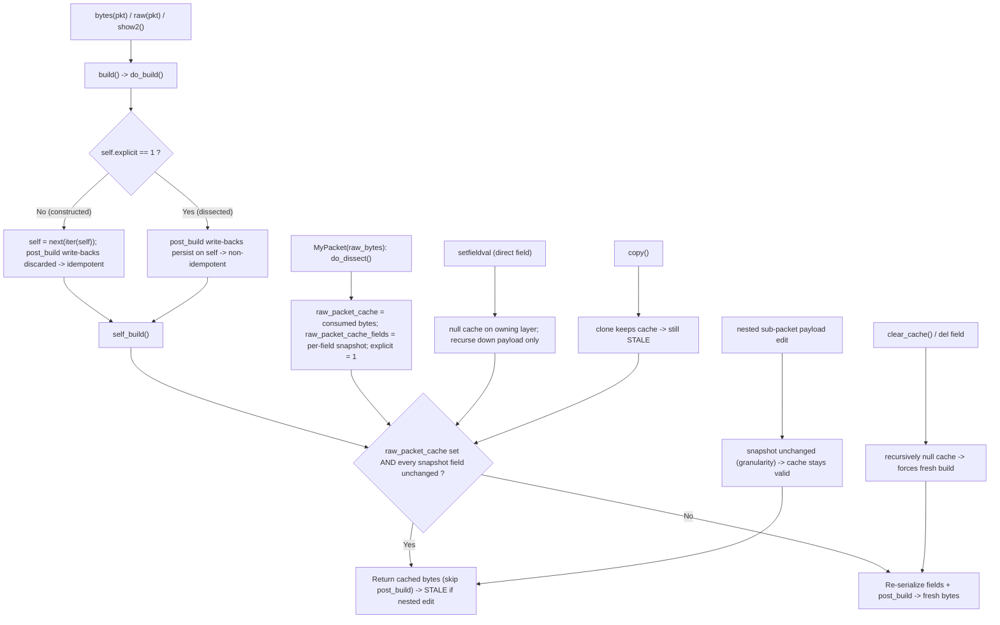

# Scapy Build/Dissect Field Calculation & Caching — A Root-Cause Q&A

> An investigative, code-grounded analysis of four interrelated behaviors in Scapy's
> packet field-calculation order and its build/dissect caching lifecycle.

## Abstract

While debugging a custom protocol layer whose checksum depends on a length field that in turn depends on payload size, four puzzling behaviors were observed; this document diagnoses each one **from the source code as the single source of truth**, backing every conclusion with a **runnable reproduction and its verbatim observed output**, by answering: **Q1 — deferred field calculation & the "`show2()` twice" anomaly**, i.e. why building a stack like `MyProto()/SomePayload()` computes the checksum *before* the length field is finalized (a wrong checksum on the first serialization, sometimes corrected by a second `show2()`) and thus why the build is non-idempotent; **Q2 — the "dual-state" packet after dissection**, i.e. why a packet parsed via `MyPacket(raw_bytes)` returns the *original* bytes from `bytes()` while `show()` displays the *modified* value of an edited sub-packet inside a `PacketListField` (two states at once), and whether `copy()` fixes it; **Q3 — direct-field vs. nested-payload modification**, i.e. why modifying a field on the *same layer* that owns the cached bytes triggers a correct rebuild while modifying a field on a *nested sub-packet* does not; and **Q4 — the complete lifecycle & invalidation mechanism**, i.e. what exactly is cached during parsing, what triggers cache invalidation, and why nested modifications are invisible to the rebuild process. All citations refer to the Scapy source at commit `0925ada4`, and every reproduction was executed on **Python 3.11.15** with **Scapy `VERSION 2026.06.26`**.

> **Provenance & runtime note.** The cited commit `0925ada4` is "Add AUTOSAR PDUTransport/PDU
> with initial batch of tests (#3933)"; source locators are written as `file:Lnnn` or
> `file:Lnnn-Lmmm` against that working tree. Scapy was imported directly from the repository
> source tree via `PYTHONPATH` (never `pip install`, so no packaging artifacts are written
> into the read-only repository); the reproduction scripts live outside the repository under
> `/tmp` and are removed when the investigation concludes — they are never committed. The
> project declares `requires-python = ">=3.7, <4"` (`pyproject.toml`) and its highest
> *documented*/CI runtime is Python 3.11 (`tox.ini` `envlist` up to `py311`); Python 3.11.15
> sits exactly at that highest documented runtime (and matches the reference container's
> Python 3.11.x). Because the analyzed build/dissect/cache mechanism is pure-Python and
> version-agnostic across the declared range, the reproductions produce **byte-for-byte
> identical output** on other minor versions as well (e.g. Python 3.12.x) — reproducing the
> same hex on a different minor version is itself corroboration of that version-independence.

## Table of Contents

1. [Build/Dissect Primer](#section-1--builddissect-primer)
2. [Q1: Deferred field calculation & the `show2()`-twice anomaly](#section-2--q1-deferred-field-calculation--the-show2-twice-anomaly)
3. [Q2: The dual-state packet after dissection](#section-3--q2-the-dual-state-packet-after-dissection)
4. [Q3: Direct-field vs. nested-payload modification](#section-4--q3-direct-field-vs-nested-payload-modification)
5. [Q4: The complete lifecycle & invalidation map](#section-5--q4-the-complete-lifecycle--invalidation-map)
6. [Remediation guidance](#section-6--remediation-guidance)
7. [Empirical evidence (runnable scripts + verbatim output)](#section-7--empirical-evidence-runnable-scripts--verbatim-output)
8. [Source-citation table](#section-8--source-citation-table)

---

## Section 1 — Build/Dissect Primer

To reason about the four behaviors we first need a precise mental model of how Scapy
represents a packet and how it converts between those representations. Scapy's own
documentation frames the engine as a *duality* between two operations — assembling
(building) and disassembling (dissecting) — and that framing is the key to everything that
follows.

### 1.1 The three data representations

A Scapy packet exists in three distinct representations at the same time. The in-repo
documentation defines the field-level versions of these as the *internal*, *machine*, and
*human* representations of a field value (`doc/scapy/build_dissect.rst:L138-L143`); the
`show2()` walkthrough later in the same document illustrates the internal-vs-machine
distinction concretely (`doc/scapy/build_dissect.rst:L253-L264`). Lifting that to the whole
packet, the three representations relevant to this analysis are:

1. **The assembled/dissected object** — a live `Packet` instance: a tree of layers where
   each layer carries a `fields` dict and a `payload` link to the next layer. This is what
   `show()` walks field by field (`scapy/packet.py:L1459-L1471`, which delegates to the
   field-walk loop in `_show_or_dump` at `scapy/packet.py:L1412-L1430`) and what you mutate
   when you write `pkt.subs[0].payload.x = 0x42`.
2. **The internal/field values** — the Python values held in each layer's `.fields` dict
   (and resolved through `getfieldval`, `scapy/packet.py:L438-L448`). A field left unset is
   stored as `None` and is *resolved* (to a default, an auto-computed length, etc.) only at
   build time.
3. **The machine/wire representation** — the `bytes` object produced by `build()` and
   consumed by `dissect()`. This is what `bytes(pkt)` / `raw(pkt)` return and what travels
   on the wire.

The documentation states the duality plainly: *"dissecting a layer is building each of its
fields from the machine to the internal representation"*
(`doc/scapy/build_dissect.rst:L333-L348`). Building goes internal → machine; dissecting goes
machine → internal. The cache subtleties in Q2–Q4 arise precisely because the machine
representation can be **stored** during dissection and then **reused** during a later build.

### 1.2 The build entry-point chain (internal → machine)

Calling `bytes(pkt)` invokes `Packet.__bytes__` (`scapy/packet.py:L592`), which simply
returns `self.build()`:

```python
# scapy/packet.py:L592-L594
def __bytes__(self):
    # type: () -> bytes
    return self.build()
```

`build()` (`scapy/packet.py:L746`) drives the whole serialization:

```python
# scapy/packet.py:L746-L757
def build(self):
    # type: () -> bytes
    """
    Create the current layer

    :return: string of the packet with the payload
    """
    p = self.do_build()
    p += self.build_padding()
    p = self.build_done(p)
    return p
```

`do_build()` (`scapy/packet.py:L724`) is where the decisive logic lives. It first runs
`self_build()` (`scapy/packet.py:L678`) to serialize this layer's own fields, then
`do_build_payload()` (`scapy/packet.py:L715`) to serialize the payload, and finally calls
`post_build()` (`scapy/packet.py:L758`) — *unless* a cache short-circuit applies:

```python
# scapy/packet.py:L724-L741
def do_build(self):
    # type: () -> bytes
    """
    Create the default version of the layer

    :return: a string of the packet with the payload
    """
    if not self.explicit:
        self = next(iter(self))
    pkt = self.self_build()
    for t in self.post_transforms:
        pkt = t(pkt)
    pay = self.do_build_payload()
    if self.raw_packet_cache is None:
        return self.post_build(pkt, pay)
    else:
        return pkt + pay
```

`post_build()` (`scapy/packet.py:L758`) is the hook layers override to patch *late-evaluated*
fields (lengths, checksums) into the byte buffer after the body and payload exist; the base
implementation just concatenates `pkt + pay`. Note also that `raw(pkt)`
(`scapy/compat.py:L112`) is a thin, cross-version wrapper that returns `bytes(x)` — and it
is exactly what `show2()` uses to build before displaying.

So the full build chain is:

```text
bytes(pkt) -> Packet.__bytes__ [L592] -> build() [L746] -> do_build() [L724]
                                                  |-> self_build() [L678]
                                                  |-> do_build_payload() [L715]
                                                  `-> post_build() [L758]   (skipped if cache valid)
```

### 1.3 The dissect chain (machine → internal)

Constructing a packet from bytes — `MyPacket(raw_bytes)` — routes into `dissect()`
(`scapy/packet.py:L1049`), which orchestrates the per-layer parse and the payload recursion:

```python
# scapy/packet.py:L1049-L1059
def dissect(self, s):
    # type: (bytes) -> None
    s = self.pre_dissect(s)

    s = self.do_dissect(s)

    s = self.post_dissect(s)

    payl, pad = self.extract_padding(s)
    self.do_dissect_payload(payl)
    if pad and conf.padding:
        self.add_payload(conf.padding_layer(pad))
```

The real per-layer work happens in `do_dissect()` (`scapy/packet.py:L1002`). Besides filling
`self.fields`, it does three things that drive every later answer — it populates
`self.raw_packet_cache_fields` (a per-field snapshot), sets `self.raw_packet_cache` (the
exact bytes this layer consumed), and sets `self.explicit = 1`:

```python
# scapy/packet.py:L1002-L1022
def do_dissect(self, s):
    # type: (bytes) -> bytes
    _raw = s
    self.raw_packet_cache_fields = {}
    for f in self.fields_desc:
        if not s:
            break
        s, fval = f.getfield(self, s)
        # Skip unused ConditionalField
        if isinstance(f, ConditionalField) and fval is None:
            continue
        # We need to track fields with mutable values to discard
        # .raw_packet_cache when needed.
        if (f.islist or f.holds_packets or f.ismutable) and fval is not None:
            self.raw_packet_cache_fields[f.name] = \
                self._raw_packet_cache_field_value(f, fval, copy=True)
        self.fields[f.name] = fval
    self.raw_packet_cache = _raw[:-len(s)] if s else _raw
    self.explicit = 1
    return s
```

### 1.4 The two flags/caches that drive Q1–Q4

Two pieces of per-layer state, both set during dissection, explain all four behaviors:

- **`explicit`** — a flag initialized to `0` for a freshly constructed packet
  (`scapy/packet.py:L168`, in `__init__`) and set to `1` after dissection
  (`scapy/packet.py:L1020`). It is the gate inside `do_build()`
  (`scapy/packet.py:L731-L732`) that decides whether `post_build` write-backs to `self`
  persist. This is the crux of **Q1**.
- **`raw_packet_cache` + `raw_packet_cache_fields`** — the bytes this layer consumed during
  dissection (`scapy/packet.py:L1019`) plus a per-field snapshot of the mutable/list/packet
  fields at dissect time (`scapy/packet.py:L1015-L1017`). On the next build, `self_build()`
  compares the *current* field values against this snapshot and, if nothing changed, returns
  the cached bytes verbatim (`scapy/packet.py:L685-L695`). This is the crux of **Q2**, **Q3**,
  and **Q4**.

### 1.5 Where field order comes from

Serialization order is field-declaration order: `self_build()` iterates
`self.fields_desc` in order (`scapy/packet.py:L696-L714`). The `fields_desc` list — and its
resolution across base classes — is assembled by the `Packet` metaclass,
`Packet_metaclass` (`scapy/base_classes.py:L281-L303`, which resolves `fields_desc` either
from the class dict or by inheriting it from a base class); the base `Packet` ultimately
derives from `BasePacket` (`scapy/base_classes.py:L419`). Field *order* therefore determines the
order in which bytes are emitted, which matters for Q1: a checksum field declared before the
data it protects is still patched in `post_build`, but a *length* it depends on must be
finalized by the time the checksum is computed.

With this model in place, we can answer each question by tracing the exact code branch that
produces the observed behavior.

---

## Section 2 — Q1: Deferred field calculation & the `show2()`-twice anomaly

**User report.** Building `MyProto()/SomePayload()` computes the checksum *before* the
length field is finalized, so the first serialization carries a wrong checksum. Calling
`show2()` twice in a row yields the correct checksum on the second call. *Why is the build
non-idempotent?*

### 2.1 The thought process: where could a write-back "vanish"?

The user's `post_build` follows the canonical pattern for late-evaluated fields: compute the
value over the assembled body and patch it into the buffer, and (commonly) write the
resolved value back onto `self` so dependent fields can see it — e.g. `self.length = ...`.
The `post_build()` hook (`scapy/packet.py:L758`) is documented as exactly this:
*"called right after the current layer is build"*, receiving the current layer bytes `pkt`
and the payload bytes `pay`. The official documentation calls it the mechanism for
*"late evaluated fields"* and shows the length/checksum pattern
(`doc/scapy/build_dissect.rst:L546`, `doc/scapy/build_dissect.rst:L556`, `doc/scapy/build_dissect.rst:L623-L658`).

If `post_build` writes `self.length = len(body)`, then a *subsequent* build should see the
finalized length and compute the checksum correctly. So the question becomes: **why is the
write-back sometimes preserved (so the second build is correct) and sometimes discarded (so
the build is idempotent and never self-corrects)?** The answer is a single branch in
`do_build()`.

### 2.2 The decisive `explicit` gate inside `do_build()`

```python
# scapy/packet.py:L731-L732 (inside do_build)
if not self.explicit:
    self = next(iter(self))   # rebind to a resolved clone; post_build write-backs are discarded
```

Walk the two paths through `do_build()` (`scapy/packet.py:L724-L741`):

- **Freshly constructed packet → `explicit == 0`.** The `if not self.explicit:` test is
  true, so `self = next(iter(self))` rebinds the local name `self` to a **throwaway clone**
  produced by the packet iterator `__iter__` (`scapy/packet.py:L1124`), which yields fully
  *resolved* packet instances. `self_build`, `do_build_payload`, and `post_build` then all
  run against that clone. Any `self.length = ...` write-back inside `post_build` mutates the
  **clone**, not your original packet. The clone is discarded when `do_build()` returns, so
  the next `bytes(pkt)` starts again from the original, still-unresolved state. **The build
  is idempotent.**
- **Dissected packet → `explicit == 1`.** `do_dissect()` set `self.explicit = 1`
  (`scapy/packet.py:L1020`), so the rebind is skipped. `self` stays your packet, and the
  `post_build` write-back **persists on it**. The next build therefore observes the
  finalized length. **The build is non-idempotent** — and that is what lets a second pass
  "fix" a length-dependent checksum.

### 2.3 Why *two* `show2()` calls

`show2()` is defined as a build-then-display:

```python
# scapy/packet.py:L1486 (body of show2, def at L1473)
return self.__class__(raw(self)).show(dump, indent, lvl, label_lvl)
```

`raw(self)` (`scapy/compat.py:L112`) is `bytes(self)`, i.e. a full build. So **each**
`show2()` performs one build (then re-dissects the result and prints it). Calling `show2()`
twice triggers two builds. Only when `explicit == 1` does the first build's persisted
`length` make the second build's checksum correct — which is precisely the user's
"second call is right" experience. The `show2()` docstring describes it as rendering *"an
assembled version of the packet, so that automatic fields are calculated (checksums, etc.)"*
(`scapy/packet.py:L1476-L1478`); the official guide illustrates the same with a worked
`show2()` example (`doc/scapy/build_dissect.rst:L253-L264`).

### 2.4 Conclusion (stated plainly)

The "twice" self-correction **requires a dissected packet** (`explicit == 1`). A purely
constructed `MyProto()/SomePayload()` will **not** self-correct on the second `show2()` —
its `post_build` write-backs are discarded against a clone every time, so every build
restarts from `length is None`. The empirical evidence in
[Section 7, Script A](#script-a--tmpq1_testpy-q1-isolates-the-explicit-gate) shows exactly
this: the constructed path yields two identical builds with the checksum never valid and
`self.length` staying `None`; the dissected path yields a first (wrong) build that persists
`length = 11`, then a second build whose checksum is valid.

### 2.5 A subtle trap when "forcing" recompute

It is tempting to "reset" a field to force recomputation — e.g. `pkt.chksum = None`. But
assignment routes through `__setattr__` → `setfieldval()` (`scapy/packet.py:L494`, `scapy/packet.py:L472`),
and `setfieldval` **resets `explicit = 0`** (`scapy/packet.py:L484`). So assigning a field
flips the packet back onto the *constructed* (idempotent) path, changing the very behavior
you are trying to exploit. This is why the reproduction in Script A isolates the gate with
`object.__setattr__(d, "explicit", 1)` — writing `d.length = None` would silently route
through `setfieldval` and reset `explicit = 0`. To force recomputation deliberately, the
idiomatic route is to *delete* the auto fields (see [Q4](#section-5--q4-the-complete-lifecycle--invalidation-map)
and [Remediation](#section-6--remediation-guidance)), which clears the cache without the
surprising semantics of re-assigning.


---

## Section 3 — Q2: The dual-state packet after dissection

**User report.** A packet parsed via `MyPacket(raw_bytes)`, after editing the payload of a
sub-packet *inside a `PacketListField`*, returns the **original** bytes from `bytes()` while
`show()` displays the **modified** value. The packet seems to exist in two states at once.
*Can this be verified, and does `copy()` resolve it?*

### 3.1 The thought process: a serialization can be cached

In Section 1 we saw that `do_dissect()` stores the bytes a layer consumed in
`self.raw_packet_cache` (`scapy/packet.py:L1019`) and a per-field snapshot in
`self.raw_packet_cache_fields` (`scapy/packet.py:L1005`, populated at `scapy/packet.py:L1015-L1017`). The
snapshot is taken **only** for fields where `(f.islist or f.holds_packets or f.ismutable)
and fval is not None` — i.e. exactly the fields whose contents can change in place and thus
need watching. If the cache were always trusted, no edit would ever take effect; if it were
never trusted, dissection would gain nothing. The truth is in between, and the rule lives in
`self_build()`.

### 3.2 The cache short-circuit in `self_build()`

```python
# scapy/packet.py:L685-L695 (inside self_build)
if self.raw_packet_cache is not None and \
        self.raw_packet_cache_fields is not None:
    for fname, fval in self.raw_packet_cache_fields.items():
        fld, val = self.getfield_and_val(fname)
        if self._raw_packet_cache_field_value(fld, val) != fval:
            self.raw_packet_cache = None
            self.raw_packet_cache_fields = None
            self.wirelen = None
            break
    if self.raw_packet_cache is not None:
        return self.raw_packet_cache
```

The logic: for each snapshotted field, recompute its "representative value" with
`_raw_packet_cache_field_value()` and compare it to the dissect-time snapshot. If **every**
snapshotted field still matches, the cache is considered valid and `self_build()` **returns
the cached bytes verbatim** (`scapy/packet.py:L695`). If any field differs, the cache is
nulled and the method falls through to a real, field-by-field serialization.

The short-circuit reaches even further than skipping `self_build`'s field loop: when the
cache is valid, `do_build()` also **skips `post_build` entirely**
(`scapy/packet.py:L737-L740`) —

```python
# scapy/packet.py:L737-L740 (inside do_build)
if self.raw_packet_cache is None:
    return self.post_build(pkt, pay)
else:
    return pkt + pay
```

— so no checksum/length recomputation happens either. The packet is effectively "frozen" to
its dissect-time bytes until something invalidates the cache.

### 3.3 This *is* the dual state

The two states are now explained directly by the two representations from Section 1:

- **`bytes(pkt)` reads the machine representation from the cache.** Because the outer cache
  is still valid (we will see in [Q3](#section-4--q3-direct-field-vs-nested-payload-modification)
  exactly why a nested edit does not invalidate it), `self_build()` returns
  `raw_packet_cache` — the *original* serialized bytes.
- **`show()` walks the live object tree.** `show()` (`scapy/packet.py:L1459-L1471`) delegates
  to `_show_or_dump`, whose field-walk loop iterates `self.fields_desc` and recurses into
  sub-packets (`scapy/packet.py:L1412-L1430`), rendering the in-memory `Packet` tree field by
  field — which already reflects your edit. It does not consult `raw_packet_cache`.

So the "two states" are not a paradox: they are the cached **machine** representation and
the live **object** representation diverging because an edit updated the object tree without
invalidating the cache. The reproduction in
[Section 7, Script B](#script-b--tmpq_testpy-q2--q3--q4-dual-state--copy--clear_cache--direct-edit)
shows `bytes(pkt) = 0201090507` (stale, original) while `show()` reports
`subs[0].payload.x = 66` (the edited `0x42`) — with `outer.raw_packet_cache still set? True`.

### 3.4 The `copy()` hypothesis — answered definitively: it does **not** fix it

The user asks whether `copy()` could help. It cannot, and the reason is in `copy()`'s
implementation (`scapy/packet.py:L407`), which **deliberately preserves the cache and the
`explicit` flag** on the clone:

```python
# scapy/packet.py:L415-L419 (inside copy)
clone.explicit = self.explicit
clone.raw_packet_cache = self.raw_packet_cache
clone.raw_packet_cache_fields = self.copy_fields_dict(
    self.raw_packet_cache_fields
)
```

`copy()` produces a deep copy of the object tree *including* the stale cache, so building the
copy returns the same stale bytes. The empirical proof:
`copy.raw_packet_cache set? True` and `bytes(pkt.copy()) = 0201090507` — identical to the
original. **`copy()` duplicates the staleness; it never clears it.** The cache-busting tool
is `clear_cache()`, covered in [Q4](#section-5--q4-the-complete-lifecycle--invalidation-map).

### 3.5 Corroboration: the cache is a real, asserted-upon attribute

This is not an internal implementation detail that might silently change — Scapy's own
regression suite asserts on it. The test *"Flag values mutation with .raw_packet_cache"*
(`test/regression.uts:L3974`) dissects `IP(raw(IP(flags="MF")/TCP(flags="SA")))` and then
asserts `pkt.raw_packet_cache is not None` (`test/regression.uts:L3978`), as well as the
nested layer's cache `pkt[TCP].raw_packet_cache is not None`. The cache is a first-class,
test-guaranteed product of dissection — exactly the attribute responsible for the dual state.


---

## Section 4 — Q3: Direct-field vs. nested-payload modification

**The question.** Why does modifying a field on the **same layer** that owns the cached
bytes trigger a correct rebuild, while modifying a field on a **nested sub-packet** does not?

The answer is the interaction of **two** mechanisms with mismatched granularity: the
*invalidation path* taken when you assign a field, and the *snapshot granularity* used to
detect change. A same-layer edit travels the invalidation path; a nested-payload edit slips
through the granularity gap.

### 4.1 Mechanism A — the invalidation path (`setfieldval`)

Assigning any attribute goes through `__setattr__` (`scapy/packet.py:L494`), which delegates
to `setfieldval()` (`scapy/packet.py:L472`):

```python
# scapy/packet.py:L482-L492 (inside setfieldval)
self.fields[attr] = val if isinstance(val, RawVal) else \
    any2i(self, val)
self.explicit = 0
self.raw_packet_cache = None
self.raw_packet_cache_fields = None
self.wirelen = None
...
else:
    self.payload.setfieldval(attr, val)
```

Two properties of this routine are decisive:

1. When `attr` belongs to **this** layer (it is in `self.default_fields`), `setfieldval`
   nulls **this** layer's `raw_packet_cache`, `raw_packet_cache_fields`, and `wirelen`, and
   resets `explicit = 0` (`scapy/packet.py:L484-L487`).
2. When `attr` does *not* belong to this layer, it recurses **only down the payload chain**
   via `self.payload.setfieldval(attr, val)` (`scapy/packet.py:L492`). It **never ascends**
   to an ancestor layer, and it **never crosses** the `PacketField`/`PacketListField`
   boundary into sub-packets that are stored *inside* `.fields`.

That second property is the whole story: the `subs` list of a `PacketListField` lives in the
outer layer's `.fields["subs"]`, not on the outer layer's `.payload`. So editing
`subs[0].payload.x` calls `setfieldval` on the *Leaf* object (clearing the Leaf's own cache),
but that call has no path back to the outer packet. The outer cache is never told.

### 4.2 Mechanism B — the snapshot granularity (`_raw_packet_cache_field_value`)

Even if the invalidation path does not fire, the cache *could* still be invalidated lazily
inside `self_build` (Section 3.2) — *if* the snapshot were fine-grained enough to notice the
nested change. It is not. Here is what gets snapshotted for a packet-holding field:

```python
# scapy/packet.py:L648-L662
def _raw_packet_cache_field_value(self, fld, val, copy=False):
    # type: (AnyField, Any, bool) -> Optional[Any]
    """Get a value representative of a mutable field to detect changes"""
    _cpy = lambda x: fld.do_copy(x) if copy else x  # type: Callable[[Any], Any]
    if fld.holds_packets:
        # avoid copying whole packets (perf: #GH3894)
        if fld.islist:
            return [
                _cpy(x.fields) for x in val
            ]
        else:
            return _cpy(val.fields)
    elif fld.islist or fld.ismutable:
        return _cpy(val)
    return None
```

For a `PacketListField` (`fld.holds_packets and fld.islist`), the snapshot is
`[x.fields for x in val]` — a list of **each sub-packet's own top-level `.fields` dict**. The
in-code comment `# avoid copying whole packets (perf: #GH3894)` makes the design intent
explicit: for performance, Scapy deliberately snapshots only the sub-packets' top-level field
dicts, **not** their payloads or nested layers. The copy itself is done by `Field.do_copy`
(`scapy/fields.py:L256`), which copies the list and `.copy()`s each contained packet's field
dict.

In the reproduction, the snapshot prints as:

```text
snapshot raw_packet_cache_fields: {'subs': [{'id': 1}, {'id': 5}]}
```

This is the **smoking gun**. The snapshot holds only each `Sub`'s `id` (`1` and `5`). It
**never contained** the `Leaf`'s `x`. The `Leaf` is the *payload* of each `Sub`, and the
payload is not part of `Sub.fields` — so it is structurally absent from the snapshot.

### 4.3 Putting A and B together

- **Same-layer edit** (e.g. `pkt.count = 9`): `setfieldval` finds `count` in the outer
  layer's fields and nulls the outer `raw_packet_cache` (Mechanism A, point 1). On the next
  build, `self_build` sees `raw_packet_cache is None` and performs a full, correct
  re-serialization. Result: **fresh bytes** (`0901090507`).
- **Nested-payload edit** (e.g. `subs[0].payload.x = 0x42`): the assignment lands on the
  `Leaf` (clearing the *Leaf's* cache only). The outer layer's cache is untouched (Mechanism
  A, point 2 — no cross into `.fields` sub-packets). On the next build, `self_build` checks
  the outer snapshot `[{'id': 1}, {'id': 5}]`, which is **unchanged** (the `id`s did not
  move; the snapshot never tracked `x`), so the cache is deemed valid and **stale bytes** are
  returned (`0201090507`). The nested change is invisible to the outer invalidation check.

### 4.4 The asymmetry: building the sub-packet directly *does* reflect the edit

There is a revealing asymmetry. Building the **sub-packet directly** reflects its own edit,
while building the **outer** packet does not:

```text
bytes(pkt3.subs[0]) = 0142          <-- sub-packet's own build reflects 0x42
bytes(pkt3) outer    = 0201090507   <-- outer still STALE
```

Why? When you assigned `subs[0].payload.x = 0x42`, `setfieldval` cleared the **Leaf's** cache
(the layer that owns `x`). So `bytes(pkt3.subs[0])` rebuilds the `Sub`/`Leaf` chain from the
live object tree and emits `01 42`. But the **outer** packet's `raw_packet_cache` still holds
the entire serialized list `01 09 05 07` — including the *old* payload byte `09` — and the
outer snapshot still matches, so `bytes(pkt3)` returns the cached `0201090507`. The outer
cache covers the whole serialized sub-list as one opaque blob; it has no notion that one
byte deep inside it should now differ.

### 4.5 Field-type and test corroboration

The relevant field types are defined in `scapy/fields.py`: the shared base `_PacketField`
(`scapy/fields.py:L1473`), the single-packet `PacketField` (`scapy/fields.py:L1525`), and the
list-valued `PacketListField` (`scapy/fields.py:L1562`) whose `getfield` parses the list of
sub-packets (`scapy/fields.py:L1721`). The `holds_packets`/`islist` attributes these classes
set are exactly what `_raw_packet_cache_field_value` branches on. The nested-`PacketListField`
parsing scenario used in the reproduction mirrors Scapy's own tests in `test/fields.uts`
(`PacketListField` assembly at `test/fields.uts:L411-L427`; *"Nested PacketListField"* at
`test/fields.uts:L443`, `test/fields.uts:L514`, `test/fields.uts:L611`), confirming that a
`PacketListField` of sub-packets that themselves carry a payload
is a supported, tested construction.


---

## Section 5 — Q4: The complete lifecycle & invalidation map

This section assembles the full build and dissect call graphs, enumerates **every** cache
invalidation trigger, and contrasts why `copy()` preserves staleness while `clear_cache()`
cures it.

### 5.1 What is cached during parsing

When `MyPacket(raw_bytes)` is dissected, `do_dissect()` (`scapy/packet.py:L1002`) populates,
*for each layer it parses*:

- `self.raw_packet_cache_fields = {}` initialized at `scapy/packet.py:L1005`, then filled
  per field — but **only** for fields satisfying
  `(f.islist or f.holds_packets or f.ismutable) and fval is not None`
  (`scapy/packet.py:L1015`). Each entry stores the representative snapshot from
  `_raw_packet_cache_field_value(f, fval, copy=True)` (`scapy/packet.py:L1016-L1017`).
- `self.raw_packet_cache = _raw[:-len(s)] if s else _raw` (`scapy/packet.py:L1019`) — the
  exact slice of input bytes this layer consumed.
- `self.explicit = 1` (`scapy/packet.py:L1020`).

Because dissection recurses into the payload (`do_dissect_payload`, invoked from `dissect()`
at `scapy/packet.py:L1058`), **every sub-layer gets its own cache too**. The regression test
confirms this for both the outer and inner layer:
`pkt.raw_packet_cache is not None` *and* `pkt[TCP].raw_packet_cache is not None`
(`test/regression.uts:L3978` and the following assertion).

### 5.2 Every invalidation trigger (the complete map)

| Trigger | What it does | Source |
|---|---|---|
| `pkt.field = v` → `__setattr__` → `setfieldval` | Nulls `raw_packet_cache`, `raw_packet_cache_fields`, `wirelen` on the **owning** layer and sets `explicit = 0`; for a non-owned attr recurses **down the payload only** | `scapy/packet.py:L494`, `scapy/packet.py:L472`, body `scapy/packet.py:L482-L492` |
| `del pkt.field` → `__delattr__` → `delfieldval` | Same nulling + `explicit = 0`; this is why deleting an auto field forces recomputation | `scapy/packet.py:L519`, `scapy/packet.py:L504-L511` |
| `pkt.clear_cache()` | The **recursive remedy**: nulls `self.raw_packet_cache`, recurses into `holds_packets` sub-packets (both single `Packet` and `list` cases) **and** into `self.payload` | `scapy/packet.py:L664-L676` |
| implicit, inside `self_build` | If a snapshotted field no longer matches its dissect-time value, the cache is nulled and a real build proceeds | `scapy/packet.py:L685-L695` (null at `scapy/packet.py:L690-L693`) |

The key behavioral asymmetry is that the first two triggers act **only on the owning layer
and downward through `.payload`** — never sideways into `.fields` sub-packets and never
upward to ancestors. That is exactly why a nested-payload edit (which lands on a sub-packet
held in `.fields`) cannot invalidate an ancestor's cache.

`delfieldval` is worth quoting because it is the basis of the community recompute idiom:

```python
# scapy/packet.py:L504-L511 (inside delfieldval)
if attr in self.fields:
    del self.fields[attr]
    self.explicit = 0  # in case a default value must be explicit
    self.raw_packet_cache = None
    self.raw_packet_cache_fields = None
    self.wirelen = None
```

### 5.3 Why `copy()` preserves staleness but `clear_cache()` cures it

These two methods are mirror images. `copy()` **carries the cache forward**:

```python
# scapy/packet.py:L415-L419 (inside copy)
clone.explicit = self.explicit
clone.raw_packet_cache = self.raw_packet_cache
clone.raw_packet_cache_fields = self.copy_fields_dict(
    self.raw_packet_cache_fields
)
```

while `clear_cache()` **recursively destroys it**:

```python
# scapy/packet.py:L664-L676
def clear_cache(self):
    # type: () -> None
    """Clear the raw packet cache for the field and all its subfields"""
    self.raw_packet_cache = None
    for fname, fval in self.fields.items():
        fld = self.get_field(fname)
        if fld.holds_packets:
            if isinstance(fval, Packet):
                fval.clear_cache()
            elif isinstance(fval, list):
                for fsubval in fval:
                    fsubval.clear_cache()
    self.payload.clear_cache()
```

`clear_cache()` does the two things `setfieldval` deliberately does **not**: it crosses the
`holds_packets` boundary into sub-packets stored in `.fields` (both the single-`Packet` and
the `list` case), *and* it recurses into `self.payload`. That is why it is the correct tool
to discard a stale serialization after a nested edit, and why `copy()` — which intentionally
clones the cache for fidelity — is never a cache-busting tool.

### 5.4 The community recompute idiom

The widely used idiom to force recomputation of auto fields is:

```python
del pkt[TCP].chksum
del pkt[IP].chksum
del pkt[IP].len
pkt.show2()
```

Each `del` routes through `delfieldval` (`scapy/packet.py:L504-L511`), which removes the
field, resets `explicit = 0`, and nulls that layer's `raw_packet_cache`. With the cache gone,
the subsequent `show2()` (`scapy/packet.py:L1486`) performs a fresh `raw(self)` build that
recomputes the deleted fields from scratch via each layer's `post_build`. This idiom works on
the **owning** layer's auto fields (length/checksum) — it is the documented, reliable way to
recompute, in contrast to relying on the fragile "build twice" effect from Q1.

### 5.5 The lifecycle, visualized



### 5.6 Synthesis — answering Q4 directly

- **What gets cached during parsing?** Per layer: the consumed bytes
  (`raw_packet_cache`), a per-field snapshot of list/packet/mutable fields
  (`raw_packet_cache_fields`), and `explicit = 1`.
- **What triggers invalidation?** Assigning (`setfieldval`) or deleting (`delfieldval`) a
  field on the owning layer; `clear_cache()` recursively; and the lazy check inside
  `self_build` when a snapshotted value changes.
- **Why are nested modifications invisible?** Because both the eager invalidation path
  (`setfieldval`, which recurses only down `.payload`) and the lazy snapshot granularity
  (`[sub.fields ...]`, top-level only) stop at the sub-packet boundary. A change to a
  sub-packet's *payload* is neither propagated up nor visible in the snapshot, so the
  ancestor's cache stays "valid" and stale bytes are returned.


---

## Section 6 — Remediation guidance

### 6.1 Q1 — make the checksum see a finalized length

The root cause of Q1 is **ordering inside `post_build`**: the checksum is computed before the
length is finalized. Two robust fixes:

- **Compute the length before the checksum.** In your `post_build`, finalize the length
  field (patch it into the buffer and/or set `self.length`) *before* computing the checksum
  over the buffer. Then a single build is correct regardless of `explicit`.
- **Use a length field that resolves during `self_build`.** Prefer a `FieldLenField`
  (`scapy/fields.py:L2086-L2120`, whose `i2m` computes the length from `length_of`/`count_of`
  when the stored value is `None`) or a similar auto-length field for the length. Such fields
  resolve their value while `self_build` walks `fields_desc` (`scapy/packet.py:L696-L714`) —
  i.e. *before* `post_build` runs (`scapy/packet.py:L758`) — so the checksum computed in
  `post_build` already sees a finalized length.

Do **not** rely on "call `show2()` twice." As shown in Q1, that self-correction only happens
for a **dissected** packet (`explicit == 1`); a freshly constructed `MyProto()/SomePayload()`
discards the write-back on every build and never converges.

### 6.2 Q2 / Q3 — force a fresh build after a nested edit

After editing a nested sub-packet's payload, the ancestor's `raw_packet_cache` is still valid
and `bytes()` will return stale bytes. The fix is to invalidate the cache explicitly:

```python
pkt.subs[0].payload.x = 0x42
pkt.clear_cache()      # recurses into .fields sub-packets AND .payload
data = bytes(pkt)      # now reflects the nested edit
```

`clear_cache()` (`scapy/packet.py:L664-L676`) is the only built-in that crosses into
`.fields` sub-packets and recurses through the payload, so it reliably discards every stale
serialization in the tree.

**Do not use `copy()` as a cache-buster.** `copy()` deliberately preserves the cache
(`scapy/packet.py:L415-L419`), so `bytes(pkt.copy())` is exactly as stale as `bytes(pkt)`.

### 6.3 General cache-invalidation idioms

- **Recompute auto fields (length/checksum) on the owning layer:**
  `del pkt[IP].chksum; del pkt[IP].len; pkt.show2()`. Each `del` routes through `delfieldval`
  (`scapy/packet.py:L504-L511`), nulling that layer's cache and resetting `explicit`; the
  following build recomputes from scratch.
- **Assigning any field on the owning layer** also invalidates that layer's cache
  (`setfieldval`, `scapy/packet.py:L484-L487`) — but remember it resets `explicit = 0`
  (Section 2.5), which can change build idempotency for length/checksum-dependent layers.

### 6.4 When to use `clear_cache()` vs `copy()`

| Goal | Use | Why |
|---|---|---|
| Discard a stale serialization and rebuild from the live object tree | `clear_cache()` | Recursively nulls `raw_packet_cache` across sub-packets and payload (`scapy/packet.py:L664-L676`) |
| Duplicate a packet's state, *including* its cached bytes | `copy()` | Intentionally preserves cache + `explicit` for fidelity (`scapy/packet.py:L415-L419`) — never a cache-busting tool |


---

## Section 7 — Empirical evidence (runnable scripts + verbatim output)

Both scripts below were created **outside** the repository, under `/tmp`, and run against the
Scapy source tree via `PYTHONPATH` so that nothing is written into the read-only repository:

```bash
PYTHONPATH=<repo_root> python3 /tmp/q1_test.py
PYTHONPATH=<repo_root> python3 /tmp/q_test.py
```

They were executed on **Python 3.11.15** with **Scapy `VERSION 2026.06.26`** and removed when
the investigation concluded — they are never committed. (As noted in the abstract, the same
byte-for-byte output is produced on other minor versions such as Python 3.12.x; the mechanism
is pure-Python and version-agnostic.) The output shown is the **verbatim** observed output.

### Script A — `/tmp/q1_test.py` (Q1: isolates the `explicit` gate)

This script defines a minimal `MyProto` whose `post_build` computes a checksum *before*
finalizing the length, then exercises both the constructed (`explicit == 0`) and dissected
(`explicit == 1`) paths. It deliberately uses `object.__setattr__(d, "explicit", 1)` to set
the flag without routing through `setfieldval` — writing `d.length = None` would reset
`explicit = 0` (Section 2.5) and defeat the experiment.

```python
import struct
from scapy.packet import Packet
from scapy.fields import ShortField, XShortField
from scapy.compat import raw


def cksum16(b):
    if len(b) % 2:
        b += b"\x00"
    s = sum(struct.unpack("!%dH" % (len(b) // 2), b))
    s = (s >> 16) + (s & 0xffff)
    s += s >> 16
    return (~s) & 0xffff


class MyProto(Packet):
    name = "MyProto"
    fields_desc = [ShortField("length", None), XShortField("chksum", None)]

    def post_build(self, pkt, pay):
        body = pkt + pay
        if self.chksum is None:                       # checksum computed BEFORE length finalized
            length_val = self.length if self.length is not None else 0
            cks = cksum16(body + struct.pack("!H", length_val))
            pkt = pkt[:2] + struct.pack("!H", cks)
        if self.length is None:                       # length finalized AFTER, written back to self
            self.length = len(body)
            pkt = struct.pack("!H", self.length) + pkt[2:]
        return pkt + pay


def valid_chksum(b):
    """A build's chksum is valid iff it equals the checksum recomputed
    over the *finalized* bytes (with the length field that actually
    landed in the buffer and the chksum slot zeroed)."""
    length = struct.unpack("!H", b[0:2])[0]
    stored = struct.unpack("!H", b[2:4])[0]
    body_zero_cks = b[0:2] + b"\x00\x00" + b[4:]
    expected = cksum16(body_zero_cks + struct.pack("!H", length))
    return stored == expected


# CONSTRUCTED (explicit == 0)
print("=== CONSTRUCTED path (explicit == 0) ===")
p = MyProto() / b"ABCDEFG"
print("explicit: %d | length: %s" % (p.explicit, p.length))
b1 = raw(p)
b2 = raw(p)
print("build1 : %s" % b1.hex())
print("build2 : %s" % b2.hex())
print("build1 == build2 : %s" % (b1 == b2))
print("chksum valid? build1: %s  build2: %s" % (valid_chksum(b1), valid_chksum(b2)))
print("self.length after builds : %s" % p.length)
print()

# DISSECTED (explicit == 1) -- set the slot directly to isolate the gate; length still None
print("=== DISSECTED path (explicit == 1) ===")
d = MyProto() / b"ABCDEFG"
object.__setattr__(d, "explicit", 1)
print("explicit: %d | length: %s" % (d.explicit, d.length))
db1 = raw(d)
len_after_1 = d.length
db2 = raw(d)
len_after_2 = d.length
print("build1 : %s | self.length after build1: %s" % (db1.hex(), len_after_1))
print("build2 : %s | self.length after build2: %s" % (db2.hex(), len_after_2))
print("build1 == build2 : %s" % (db1 == db2))
print("chksum valid? build1: %s  build2: %s" % (valid_chksum(db1), valid_chksum(db2)))
```

**Verbatim output of Script A:**

```text
=== CONSTRUCTED path (explicit == 0) ===
explicit: 0 | length: None
build1 : 000bef3241424344454647
build2 : 000bef3241424344454647
build1 == build2 : True
chksum valid? build1: False  build2: False
self.length after builds : None

=== DISSECTED path (explicit == 1) ===
explicit: 1 | length: None
build1 : 000bef3241424344454647 | self.length after build1: 11
build2 : 000be42741424344454647 | self.length after build2: 11
build1 == build2 : False
chksum valid? build1: False  build2: True
```

**Interpretation.** The **constructed** path is idempotent: `build1 == build2`, the checksum
is never valid, and `self.length` stays `None` because every build's `post_build` write-back
hits a throwaway clone (Section 2.2). The **dissected** path is non-idempotent: `build1`
carries a checksum computed against the placeholder length (invalid), but the write-back
persists `self.length = 11`; `build2` then computes the checksum over the finalized length
and is **valid**. Because each `show2()` performs one `raw(self)` build, this is exactly the
"two `show2()` calls" effect — and it only converges for the dissected packet.

### Script B — `/tmp/q_test.py` (Q2 / Q3 / Q4: dual-state + copy + clear_cache + direct edit)

This script builds an `Outer` packet containing a `PacketListField` of `Sub` packets, each of
which carries a `Leaf` payload. It dissects from wire bytes, then performs a nested-payload
edit, a `copy()`, a `clear_cache()`, a direct-field edit, and the sub-vs-outer asymmetry test.

```python
from scapy.packet import Packet
from scapy.fields import ByteField, PacketListField


class Leaf(Packet):
    name = "Leaf"
    fields_desc = [ByteField("x", 0)]

    def extract_padding(self, s):
        return b"", s            # Leaf consumes only its 1 byte; rest -> padding


class Sub(Packet):
    name = "Sub"
    fields_desc = [ByteField("id", 0)]

    def guess_payload_class(self, payload):
        return Leaf


class Outer(Packet):
    name = "Outer"
    fields_desc = [
        ByteField("count", 0),
        PacketListField("subs", [], Sub, count_from=lambda p: p.count),
    ]


ORIG = bytes.fromhex("0201090507")
print("original wire bytes: %s" % ORIG.hex())
print()

# ----- Q2: DUAL STATE (nested payload edit) -----
print("=== Q2: DUAL STATE (nested payload edit) ===")
pkt = Outer(ORIG)
print("outer.raw_packet_cache set?  %s" % (pkt.raw_packet_cache is not None))
print("snapshot raw_packet_cache_fields: %s" % (pkt.raw_packet_cache_fields,))
print("subs[0] = %s | subs[0].payload.x = %s" % (
    pkt.subs[0].summary(), pkt.subs[0].payload.x))
pkt.subs[0].payload.x = 0x42     # NESTED edit
print("after edit subs[0].payload.x = 0x42:")
print("  outer.raw_packet_cache still set?  %s" % (pkt.raw_packet_cache is not None))
print("  bytes(pkt) = %s  <-- STALE (original)" % bytes(pkt).hex())
print("  show() reflects edit? subs[0].payload.x = %s" % pkt.subs[0].payload.x)
print()

# ----- Q4: copy() hypothesis -----
print("=== Q4: copy() hypothesis ===")
cp = pkt.copy()
print("copy.raw_packet_cache set?  %s" % (cp.raw_packet_cache is not None))
print("bytes(pkt.copy()) = %s  <-- copy() does NOT fix it" % bytes(cp).hex())
print()

# ----- Q4: clear_cache() remedy -----
print("=== Q4: clear_cache() remedy ===")
pkt.clear_cache()
print("after clear_cache(): outer.raw_packet_cache set?  %s" % (pkt.raw_packet_cache is not None))
print("bytes(pkt) = %s  <-- now reflects the nested edit (0x42)" % bytes(pkt).hex())
print()

# ----- Q3: DIRECT field edit (same layer that owns the cache) -----
print("=== Q3: DIRECT field edit (same layer that owns the cache) ===")
pkt2 = Outer(ORIG)
print("fresh dissect bytes: %s (cached)" % bytes(pkt2).hex())
pkt2.count = 9                    # DIRECT edit
print("after pkt2.count = 9: outer.raw_packet_cache set?  %s" % (pkt2.raw_packet_cache is not None))
print("bytes(pkt2) = %s  <-- correct rebuild" % bytes(pkt2).hex())
print()

# ----- Q3 asymmetry: building the sub-packet directly DOES reflect its edit -----
print("=== Q3 asymmetry: building the sub-packet directly DOES reflect its edit ===")
pkt3 = Outer(ORIG)
pkt3.subs[0].payload.x = 0x42
print("bytes(pkt3.subs[0]) = %s  <-- sub-packet's own build reflects 0x42 (its Leaf cache was cleared)" % bytes(pkt3.subs[0]).hex())
print("bytes(pkt3) outer    = %s  <-- outer still STALE (outer cache covers whole list incl. old payload)" % bytes(pkt3).hex())
```

**Verbatim output of Script B:**

```text
original wire bytes: 0201090507

=== Q2: DUAL STATE (nested payload edit) ===
outer.raw_packet_cache set?  True
snapshot raw_packet_cache_fields: {'subs': [{'id': 1}, {'id': 5}]}
subs[0] = Sub / Leaf | subs[0].payload.x = 9
after edit subs[0].payload.x = 0x42:
  outer.raw_packet_cache still set?  True
  bytes(pkt) = 0201090507  <-- STALE (original)
  show() reflects edit? subs[0].payload.x = 66

=== Q4: copy() hypothesis ===
copy.raw_packet_cache set?  True
bytes(pkt.copy()) = 0201090507  <-- copy() does NOT fix it

=== Q4: clear_cache() remedy ===
after clear_cache(): outer.raw_packet_cache set?  False
bytes(pkt) = 0201420507  <-- now reflects the nested edit (0x42)

=== Q3: DIRECT field edit (same layer that owns the cache) ===
fresh dissect bytes: 0201090507 (cached)
after pkt2.count = 9: outer.raw_packet_cache set?  False
bytes(pkt2) = 0901090507  <-- correct rebuild

=== Q3 asymmetry: building the sub-packet directly DOES reflect its edit ===
bytes(pkt3.subs[0]) = 0142  <-- sub-packet's own build reflects 0x42 (its Leaf cache was cleared)
bytes(pkt3) outer    = 0201090507  <-- outer still STALE (outer cache covers whole list incl. old payload)
```

**Interpretation.** The line `snapshot raw_packet_cache_fields: {'subs': [{'id': 1}, {'id':
5}]}` is the **smoking gun**: the snapshot holds only each `Sub`'s top-level `fields` (the
`id`s `1` and `5`), never the `Leaf`'s `x`. Therefore the nested edit (`x: 9 → 0x42`, i.e.
`66`) is invisible to the invalidation check; `bytes()` stays `0201090507` while `show()`
reports `66` — the dual state. `copy()` keeps the stale cache (`bytes(pkt.copy()) =
0201090507`). `clear_cache()` discards it and yields `0201420507`. A direct `count` edit
invalidates the owning layer's cache and yields a correct rebuild `0901090507`. Finally,
building the `Sub` directly yields `0142` (its `Leaf` cache *was* cleared by the assignment),
while the outer build remains stale because the outer cache covers the whole serialized list
including the old payload byte.


---

## Section 8 — Source-citation table

Every behavioral claim in this document maps to an exact source location at commit
`0925ada4`. Line numbers were verified against the working tree (`grep -n` / line slicing).

| Claim / mechanism | Source location |
|---|---|
| `bytes(pkt)` → build | `scapy/packet.py:L592` (`__bytes__`, `return self.build()`) |
| `build()` drives serialization | `scapy/packet.py:L746-L757` |
| `do_build()` and the `explicit` gate `if not self.explicit: self = next(iter(self))` | `scapy/packet.py:L724`, gate at `scapy/packet.py:L731-L732` |
| `post_build` skipped when cache valid (`return pkt + pay`) | `scapy/packet.py:L737-L740` |
| `do_build_payload()` serializes payload | `scapy/packet.py:L715-L723` |
| `build_padding()` | `scapy/packet.py:L742-L745` |
| `self_build()` field-order serialization | `scapy/packet.py:L678`, field loop `scapy/packet.py:L696-L714` |
| `self_build()` cache short-circuit (compare snapshot, return cached) | `scapy/packet.py:L685-L695` (null on mismatch `scapy/packet.py:L690-L693`) |
| `post_build()` hook (late-evaluated fields) | `scapy/packet.py:L758-L767` |
| `FieldLenField` resolves an auto length during field serialization (`i2m`, before `post_build`) | `scapy/fields.py:L2086-L2120` |
| snapshot granularity `[x.fields for x in val]` (top-level only) | `scapy/packet.py:L648`, list case `scapy/packet.py:L652-L661` |
| `copy()` preserves cache + `explicit` | `scapy/packet.py:L407`, preserve at `scapy/packet.py:L415-L419` |
| `clear_cache()` recursively nulls cache (sub-packets + payload) | `scapy/packet.py:L664-L676` |
| `setfieldval()` nulls cache, resets `explicit = 0`, recurses down payload only | `scapy/packet.py:L472`, body `scapy/packet.py:L482-L492` (`explicit = 0` at `scapy/packet.py:L484`) |
| `__setattr__` → `setfieldval` | `scapy/packet.py:L494-L502` |
| `delfieldval()` nulls cache + `explicit = 0` | `scapy/packet.py:L504-L511` |
| `__delattr__` → `delfieldval` | `scapy/packet.py:L519` |
| `getfieldval()` resolves a field value (`fields` → `overloaded_fields` → `default_fields` → payload) | `scapy/packet.py:L438-L448` |
| freshly constructed packet initializes `explicit = 0` | `scapy/packet.py:L168` (in `__init__`) |
| `do_dissect()` sets cache + snapshot + `explicit = 1` | `scapy/packet.py:L1002`, snapshot `scapy/packet.py:L1005`/`scapy/packet.py:L1015-L1017`, cache `scapy/packet.py:L1019`, `explicit = 1` at `scapy/packet.py:L1020` |
| `dissect()` pipeline (pre/do/post-dissect + payload) | `scapy/packet.py:L1049-L1059` |
| `__iter__` resolves packets (clone source for the `explicit` gate) | `scapy/packet.py:L1124` |
| `show()` walks the live object tree (delegates to `_show_or_dump` field walk) | `scapy/packet.py:L1459-L1471` (field walk at `scapy/packet.py:L1412-L1430`) |
| `show2()` = `self.__class__(raw(self)).show(...)` | `scapy/packet.py:L1473`, body `scapy/packet.py:L1486` |
| `raw()` returns `bytes(x)`; `bytes_encode` | `scapy/compat.py:L112`; `scapy/compat.py:L121` |
| `Field.do_copy` (list/packet snapshot copy) | `scapy/fields.py:L256-L266` |
| `_PacketField` / `PacketField` / `PacketListField` / `PacketListField.getfield` | `scapy/fields.py:L1473` / `scapy/fields.py:L1525` / `scapy/fields.py:L1562` / `scapy/fields.py:L1721` |
| `Packet` metaclass establishes `fields_desc` ordering | `scapy/base_classes.py:L281-L303` (`Packet_metaclass` field resolution); `BasePacket` at `scapy/base_classes.py:L419` |
| field `internal`/`machine`/`human` representations | `doc/scapy/build_dissect.rst:L138-L143` (show2 example at `doc/scapy/build_dissect.rst:L253-L264`) |
| official build/dissect, `show2`, `post_build` docs; "dissecting is building" duality | `doc/scapy/build_dissect.rst` (`show2` `doc/scapy/build_dissect.rst:L257`/`doc/scapy/build_dissect.rst:L262`; `post_build` `doc/scapy/build_dissect.rst:L546`/`doc/scapy/build_dissect.rst:L556`/`doc/scapy/build_dissect.rst:L623`/`doc/scapy/build_dissect.rst:L632`/`doc/scapy/build_dissect.rst:L649`/`doc/scapy/build_dissect.rst:L655`/`doc/scapy/build_dissect.rst:L658`; dissect pipeline `doc/scapy/build_dissect.rst:L285-L296`; duality `doc/scapy/build_dissect.rst:L333-L348`) |
| `.raw_packet_cache` regression assertion (`is not None` after dissection) | `test/regression.uts:L3974` (header), `test/regression.uts:L3978` (assertion) |
| nested `PacketListField` scenario | `test/fields.uts` (`PacketListField` `test/fields.uts:L411-L427`; "Nested PacketListField" `test/fields.uts:L443`/`test/fields.uts:L514`/`test/fields.uts:L611`) |

---

### Closing note

Every conclusion above was derived from the Scapy source at commit `0925ada4` and confirmed
by the two reproduction scripts in [Section 7](#section-7--empirical-evidence-runnable-scripts--verbatim-output),
executed against the source tree via `PYTHONPATH` on Python 3.11.15 / Scapy `2026.06.26`. No
repository source file was modified; the reproduction scripts lived under `/tmp` and were
removed when the investigation concluded. The two mechanisms at the heart of all four
behaviors are the **`explicit` gate** (`scapy/packet.py:L731-L732`), which makes constructed
builds idempotent and dissected builds non-idempotent, and the **snapshot granularity**
(`scapy/packet.py:L648-L661`), which watches only each sub-packet's top-level fields and so
renders nested-payload edits invisible to the build cache.
