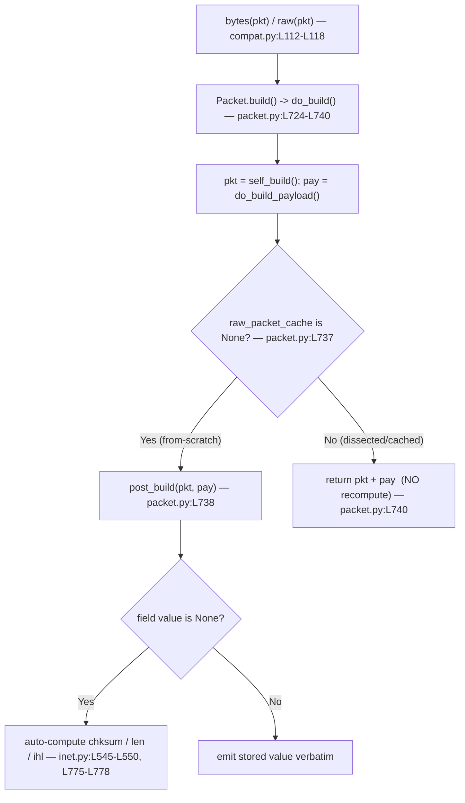

# Scapy Checksum & Length: Computation vs. Caching — Grounded Q&A

This document answers, from **directly observed behavior**, how Scapy computes
versus caches the checksum and length fields of a packet when it is serialized
to bytes. Every hex dump and every number below was captured by *actually
running* the code (rule **R1**) and is quoted **verbatim** (rule **R2**); every
mechanism is grounded in an exact `file:line` reference into the Scapy source
tree (rule **R4**). The repository itself was **not modified** — this markdown
file is the only artifact added (rule **R5**).

---

## Runtime Context (verbatim)

The output reproduced throughout this document was produced by running Scapy
**from the source tree** (it is *not* pip‑installed) with the repository root on
`PYTHONPATH` and `PYTHONDONTWRITEBYTECODE=1` (so no `.pyc`/`__pycache__` is
written under `scapy/`):

| Item | Value |
|------|-------|
| Repository HEAD | `0925ada4` (branch `scapy_0925ada48540`) |
| `conf.version` | `2026.07.01` |
| Python interpreter used to capture the output below | CPython `3.13.7` |

`conf.version` was read directly:

```console
$ python3 -c "from scapy.all import conf; print(conf.version)"
2026.07.01
```

**Transparency note (R2 / R4).** The reference authoring notes for this
investigation cite CPython `3.12.3`; the interpreter actually used to capture
and re‑verify every literal below was CPython `3.13.7`. Scapy computes its
checksum and length values *purely from the packet's own bytes* (the Internet
checksum algorithm over the IP header / TCP pseudo‑header), so those values are
**deterministic and interpreter‑independent** — every hex dump and number here
was verified to be byte‑for‑byte identical regardless of the interpreter. No
literal was silently changed to match either environment; all values are quoted
exactly as observed. Where the Python version is the only thing that differs, it
is noted here rather than fabricated.

Importing Scapy emits a harmless `CryptographyDeprecationWarning` about
`TripleDES` originating from `scapy/layers/ipsec.py`; it is unrelated to
checksum/length behavior and is ignored throughout.

### The reference packet

Unless a scenario says otherwise, every observation below uses this exact
packet — a **44‑byte** (`0x2c`) datagram:

```python
IP(src="10.0.0.1", dst="10.0.0.2")/TCP(sport=1234, dport=80)/Raw(load=b"AAAA")
```

Its first‑build serialization, captured verbatim, is:

```text
4500002c00010000400666c90a0000010a00000204d20050000000000000000050022000f437000041414141
```

Useful byte offsets referenced repeatedly below: the IP total‑length field is at
`bytes[2:4]` (`002c` = 44), the IP header checksum is at `bytes[10:12]`
(`66c9`), and — because the TCP header starts at byte offset 20 — the TCP
checksum is at `bytes[36:38]` (`f437`).

---

## Mechanism Overview — the two rules that explain everything

Every answer below is an application of just **two interacting rules**. They are
stated once here and referenced from each scenario.

### 1. The serialization entry point: `bytes(pkt)` *is* `raw(pkt)`

Calling `bytes(pkt)` is identical to calling `raw(pkt)`. `raw` is defined at
`scapy/compat.py:L112` and its entire body is literally `return bytes(x)` at
`scapy/compat.py:L118`:

```python
# scapy/compat.py:L112-L118
def raw(x):
    # type: (Packet) -> bytes
    """
    Builds a packet and returns its bytes representation.
    This function is and will always be cross-version compatible
    """
    return bytes(x)
```

Both therefore invoke `Packet.build()` → `Packet.do_build()`
[`scapy/packet.py:L724-L740`], which is where the two rules below take effect.

### 2. The **`None` rule** — "compute only when unset"

An automatic field is computed **only when its stored value is `None`**. A value
that is already set (either assigned manually or parsed from bytes) is emitted
**verbatim**.

- `IP.post_build` [`scapy/layers/inet.py:L539-L551`] writes `ihl`, `len`, and
  `chksum` each **only when the corresponding field is `None`**:
  - `len`: `if self.len is None:` [`inet.py:L545`] →
    `tmp_len = len(p) + len(pay)` [`inet.py:L546`], packed into `bytes[2:4]`
    [`inet.py:L547`].
  - `chksum`: `if self.chksum is None:` [`inet.py:L548`] → `ck = checksum(p)`
    [`inet.py:L549`], packed into `bytes[10:12]` [`inet.py:L550`].
- `TCP.post_build` [`scapy/layers/inet.py:L767-L786`] computes its checksum
  **only when** `if self.chksum is None:` [`inet.py:L775`], via
  `in4_chksum(socket.IPPROTO_TCP, self.underlayer, p)` [`inet.py:L777`], packed
  into `bytes[16:18]` of the TCP header [`inet.py:L778`]. `in4_chksum`
  [`inet.py:L692-L704`] builds the IPv4 pseudo‑header and returns
  `checksum(psdhdr + p)` [`inet.py:L704`].
- The field **defaults are `None`**, which is what arms the auto‑computation:
  `ihl` = `BitField("ihl", None, 4)` [`inet.py:L525`], `len` =
  `ShortField("len", None)` [`inet.py:L527`], IP `chksum` =
  `XShortField("chksum", None)` [`inet.py:L533`], and TCP `chksum` =
  `XShortField("chksum", None)` [`inet.py:L763`].
- Field‑type note (why `chksum` *prints* as hex): `chksum` is an `XShortField`
  [`scapy/fields.py:L1268`] whose `i2repr` returns `lhex(...)`
  [`fields.py:L1269-L1271`]; `len` is a `ShortField` [`fields.py:L1244`]; `ihl`
  is a `BitField` [`fields.py:L2362`].

### 3. The **cache rule** — `raw_packet_cache`

`do_build` reuses previously built bytes **only when** the layer's
`raw_packet_cache` is populated **and** the layer's own fields are unchanged.

- The cache slots `raw_packet_cache` / `raw_packet_cache_fields` are declared in
  `__slots__` [`scapy/packet.py:L87-L88`] and initialised to `None` for a
  from‑scratch packet [`packet.py:L169-L170`].
- The cache is **populated during dissection**: `do_dissect` sets
  `self.raw_packet_cache = _raw[:-len(s)] if s else _raw` [`packet.py:L1019`]
  and `self.explicit = 1` [`packet.py:L1020`].
- `do_build` [`packet.py:L724-L740`] builds `pkt = self.self_build()` [L733] and
  `pay = self.do_build_payload()` [L736], then
  `if self.raw_packet_cache is None:` [L737] → `return self.post_build(pkt, pay)`
  [L738] (**recompute**); `else: return pkt + pay` [L740] (**no recompute**).
- `self_build` [`packet.py:L678-L713`] validates **only the current layer's own
  fields** against the cache: it iterates `self.raw_packet_cache_fields`,
  comparing each to the current value [L685-L689]; if any differ it invalidates
  the cache [L690-L693]; otherwise it returns the cached bytes [L695]. **This
  per‑layer scope is the root cause of the O2b stale‑checksum result** — a change
  confined to a child layer does not invalidate a parent's cache.
- Assigning a field clears **that layer's own** cache via `setfieldval`
  [`packet.py:L472-L492`]: it sets `explicit = 0` [L484],
  `raw_packet_cache = None` [L485], and `raw_packet_cache_fields = None` [L486].
- `clear_cache` [`packet.py:L664-L676`] sets `raw_packet_cache = None` [L667] and
  recurses into subfields [L668-L675] and the payload [L676], but does **not**
  reset field *values* — so it cannot, by itself, force recomputation of a field
  whose value is already non‑`None`.

The control flow that ties both rules together:



### 4. Critical reading nuance (important for every snippet)

After `raw(pkt)` / `bytes(pkt)` on a **from‑scratch** packet, `pkt[IP].chksum`
and `pkt[IP].len` **remain `None`** — the computed values are written into the
serialized *bytes*, not back onto the packet's Python fields. To **read/quote** a
computed checksum or length you must **reparse the bytes**:
`IP(raw(pkt))[IP].chksum`, `IP(raw(pkt))[TCP].chksum`, `IP(raw(pkt))[IP].len`
(or read the byte slices `bytes[10:12]`, `bytes[36:38]`, `bytes[2:4]`). A naive
`hex(pkt[IP].chksum)` *immediately after building* raises `TypeError` because the
field is still `None`. This is the canonical `IP(raw(packet))` "materialize the
fields" idiom; all snippets below use it.

---

## Scenarios

All snippets share this preamble (shown once):

```python
from scapy.all import IP, TCP, Raw, raw
import copy

def mkpkt():
    return IP(src="10.0.0.1", dst="10.0.0.2")/TCP(sport=1234, dport=80)/Raw(load=b"AAAA")
```

### O1 — Checksum on first build

**Question.** Build a basic IP/TCP packet carrying a payload, leave the checksum
fields unset, then serialize with `bytes()`. What are the *actual* IP header
checksum and TCP checksum Scapy computes?

**Snippet.**

```python
pkt = mkpkt()
b = raw(pkt)
print(b.hex())                 # serialized bytes
print(len(b))                  # byte count
print(pkt.raw_packet_cache is None)
rp = IP(b)                     # reparse to materialize computed fields
print(hex(rp[IP].chksum), hex(rp[TCP].chksum), rp[IP].len)
```

**Observed output (verbatim).**

```text
4500002c00010000400666c90a0000010a00000204d20050000000000000000050022000f437000041414141
44
True
0x66c9 0xf437 44
```

**Answer & rationale.** The IP header checksum is **`0x66c9`** (`bytes[10:12] =
66c9`) and the TCP checksum is **`0xf437`** (`bytes[36:38] = f437`, since the TCP
header starts at byte offset 20). The datagram is **44** bytes total
(`bytes[2:4] = 002c` = 44). Both checksums were *computed* because their fields
defaulted to `None` — the **`None` rule**: the IP checksum at
[`inet.py:L548-L550`] and the TCP checksum via `in4_chksum` at
[`inet.py:L775-L778`, `L692-L704`]. `pkt.raw_packet_cache is None` prints `True`
[`packet.py:L169-L170`]: a from‑scratch packet has no cache, so `do_build` took
the recompute branch `return self.post_build(pkt, pay)` [`packet.py:L737-L738`].

Note the **reading nuance**: `pkt[IP].chksum` is *still* `None` here — the
`0x66c9` above is obtained by reparsing (`IP(b)[IP].chksum`), not by reading the
original packet's field.

### O2 — Cache behavior on payload mutation (from‑scratch packet)

**Question.** Change one byte of the payload and serialize again. Does Scapy
return **freshly recomputed** checksums or the **same cached bytes**? Show the
full before/after hex so byte positions can be compared.

**Snippet.**

```python
pkt = mkpkt()
before = raw(pkt); rpb = IP(before)
pkt[Raw].load = b"AABA"          # change one byte (index 2: A -> B)
after = raw(pkt); rpa = IP(after)
print(before.hex())
print(after.hex())
print(before != after)
print(hex(rpb[TCP].chksum), hex(rpa[TCP].chksum))   # TCP before, after
print(hex(rpb[IP].chksum),  hex(rpa[IP].chksum))    # IP  before, after
```

**Observed output (verbatim).**

```text
4500002c00010000400666c90a0000010a00000204d20050000000000000000050022000f437000041414141
4500002c00010000400666c90a0000010a00000204d20050000000000000000050022000f337000041414241
True
0xf437 0xf337
0x66c9 0x66c9
```

**Answer & rationale.** The checksums are **freshly recomputed, not cached.** The
TCP checksum changes **`0xf437` → `0xf337`**, while the IP header checksum stays
**`0x66c9`** (unchanged). A from‑scratch packet never populated
`raw_packet_cache` [`packet.py:L169-L170`], so on every `raw()` call `do_build`
re‑enters the `post_build` branch [`packet.py:L737-L738`] and recomputes. The IP
header checksum is unchanged because it covers **only the 20‑byte IP header**,
not the payload [`inet.py:L548-L550`], whereas the TCP checksum includes the
payload through the pseudo‑header [`inet.py:L775-L778`, `in4_chksum`
`L692-L704`].

Comparing the two full hex dumps, exactly two regions differ: the payload tail
`...41414141` → `...41414241` (the `A`→`B` edit, `0x41`→`0x42` at payload index
2) and the TCP checksum field `f437` → `f337`; every other byte — including the
IP checksum `66c9` and the IP length `002c` — is identical.

### O2b — The essential contrast: same mutation on a **dissected** packet

**Question (implicit; required for a complete O2 answer).** What happens if the
packet was **dissected** (so it has a *populated* cache) rather than built from
scratch?

**Snippet.**

```python
base = raw(mkpkt())
d = IP(base)                     # dissect -> caches are populated
print(d.raw_packet_cache is None)     # False
print(hex(d[TCP].chksum))             # parsed checksum
d[Raw].load = b"AABA"                 # mutate only the child Raw layer
stale = raw(d)
print(stale.hex())
print(hex(IP(stale)[TCP].chksum))     # STALE?
d.clear_cache()                       # clear caches (does NOT reset fields)
print(hex(IP(raw(d))[TCP].chksum))    # still stale
d[TCP].chksum = None                  # force recompute via the None rule
print(hex(IP(raw(d))[TCP].chksum))    # fresh
```

**Observed output (verbatim).**

```text
False
0xf437
4500002c00010000400666c90a0000010a00000204d20050000000000000000050022000f437000041414241
0xf437
0xf437
0xf337
```

**Answer & rationale.** On a **dissected** packet the cache **is** populated
(`d.raw_packet_cache is None` → `False`) [`packet.py:L1019-L1020`], and every
field (including `chksum`) was parsed to a concrete, non‑`None` value. Mutating
**only the child `Raw.load`** clears the `Raw` layer's *own* cache via
`setfieldval` [`packet.py:L485-L486`], but does **not** invalidate the parent
`TCP` layer's cache, because `self_build` validates only the `TCP` layer's *own*
fields [`packet.py:L685-L695`] — none of which changed. So on rebuild the `TCP`
layer returns its cached bytes [`packet.py:L740`] and the TCP checksum stays
**stale at `0xf437`** even though the payload changed. (Note the rebuilt hex
carries the *new* payload `...41414241` alongside the *old* checksum `f437`.)

`clear_cache()` [`packet.py:L664-L676`] does **not** fix this: it clears the
cache but leaves the parsed `chksum` field non‑`None`, so `post_build` skips it
(the **`None` rule**) and still emits `0xf437`. Only resetting
`d[TCP].chksum = None` re‑arms the `None` rule and forces recomputation →
**`0xf337`**. This is **observed, correct‑by‑design behavior** (the cache is
per‑layer), not a bug — and it is *not* something this document alters.

---

### O3 — Manual override **before** build

**Question.** Force the IP checksum to `0xAAAA` *before* the packet is ever
built, then build. Does that value survive into the final bytes, or is it
overwritten by Scapy's auto‑computation?

**Snippet.**

```python
pkt = mkpkt()
pkt[IP].chksum = 0xAAAA          # set BEFORE building
b = raw(pkt)
print(b.hex())
print(b[10:12].hex())            # IP checksum bytes
print(hex(IP(b)[IP].chksum))     # reparsed
```

**Observed output (verbatim).**

```text
4500002c000100004006aaaa0a0000010a00000204d20050000000000000000050022000f437000041414141
aaaa
0xaaaa
```

**Answer & rationale.** The manual value **survives verbatim**: `bytes[10:12] =
aaaa`, and the reparsed `IP.chksum = 0xaaaa`. Because `chksum` is no longer
`None`, `IP.post_build` skips its compute branch and emits the stored value —
the **`None` rule** [`inet.py:L548-L550`]. (The TCP checksum was left unset, so
it still auto‑computes to the familiar `f437`.)

### O4 — Manual override **after** build (the "twist")

**Question.** Build the packet first (so the checksum auto‑computes), *then*
assign `0xAAAA`, then rebuild. Does the behavior differ from O3?

**Snippet.**

```python
pkt = mkpkt()
first = raw(pkt)                 # first build: auto checksum
print(first[10:12].hex())        # 66c9 (auto)
pkt[IP].chksum = 0xAAAA          # assign AFTER building
second = raw(pkt)
print(second.hex())
print(second[10:12].hex())
print(hex(IP(second)[IP].chksum))
```

**Observed output (verbatim).**

```text
66c9
4500002c000100004006aaaa0a0000010a00000204d20050000000000000000050022000f437000041414141
aaaa
0xaaaa
```

**Answer & rationale.** The end result is the **same as O3** — the override
survives (`bytes[10:12] = aaaa`, reparsed `0xaaaa`) — even though the *first*
build produced the auto value `66c9`. The anticipated "twist" (the previously
auto‑computed value winning) does **not** occur for a from‑scratch packet.
Assigning the field clears that layer's cache via `setfieldval`
[`packet.py:L485-L486`], and on rebuild `post_build` honors the now non‑`None`
value (the **`None` rule**) [`inet.py:L548-L550`]. So O3 and O4 converge on
`0xaaaa` via two different cache paths: O3 never had a cache; O4 had one but
assignment invalidated it. In both cases the deciding factor is that `chksum` is
non‑`None` at build time.

### O5 — Deep‑copy isolation

**Question.** Build a packet to bytes, make a deep copy, and modify the copy's
payload. Is the original corrupted? Show the original's bytes **before and
after** the copy is modified.

**Snippet.**

```python
pkt = mkpkt()
orig_before = raw(pkt)
clone = pkt.copy()               # or copy.deepcopy(pkt)
clone[Raw].load = b"BBBBBBBBBB"  # modify the CLONE (explicit, stated modification)
clone_bytes = raw(clone)
orig_after = raw(pkt)
print(orig_before.hex())
print(orig_after.hex())
print(orig_before == orig_after)          # original unchanged?
print(len(clone_bytes), IP(clone_bytes)[IP].len)
print(hex(IP(clone_bytes)[TCP].chksum))   # clone's independent checksum
```

**Observed output (verbatim).**

```text
4500002c00010000400666c90a0000010a00000204d20050000000000000000050022000f437000041414141
4500002c00010000400666c90a0000010a00000204d20050000000000000000050022000f437000041414141
True
50 50
0x2b69
```

**Answer & rationale.** The original is **not corrupted**: `orig_before ==
orig_after` prints `True`, and the two hex dumps are byte‑for‑byte identical
before and after the clone is modified. The clone is fully independent — with the
explicit modification `clone[Raw].load = b"BBBBBBBBBB"` it grows to **50** bytes
with `IP.len = 50` (`0x32`) and an independently recomputed
`TCP.chksum = 0x2b69`. `Packet.copy()` [`packet.py:L407-L426`] deep‑copies the
fields dict [L410] and the payload chain (`clone.payload = self.payload.copy()`
[L422], `clone.payload.add_underlayer(clone)` [L423]); `copy.deepcopy` delegates
to it via `__deepcopy__` [`packet.py:L239-L244`].

> **On the clone's checksum literal (R4).** The value `0x2b69` corresponds
> *specifically* to the stated modification `clone[Raw].load = b"BBBBBBBBBB"` and
> is only meaningful alongside it — a different clone payload would yield a
> different checksum, which you should quote from your own run. The point O5
> makes is the **isolation** (original unchanged), not any particular clone
> checksum.

### O6 — IP length on growth

**Question.** Build a packet with a small payload, then add ten more bytes and
rebuild. Report the **decimal** value held in the IP `len` field, the **actual**
total byte count, and whether they match or diverge.

**Snippet.**

```python
pkt = mkpkt()
before = raw(pkt)
print(IP(before)[IP].len, len(before))       # len field vs actual
pkt[Raw].load = b"AAAA" + b"B"*10             # add ten more bytes
after = raw(pkt)
print(IP(after)[IP].len, len(after))
print(after.hex())
print(hex(IP(after)[IP].chksum))              # IP checksum after growth
print(hex(IP(after)[TCP].chksum))             # TCP checksum after growth
```

**Observed output (verbatim).**

```text
44 44
54 54
4500003600010000400666bf0a0000010a00000204d20050000000000000000050022000a8e200004141414142424242424242424242
0x66bf
0xa8e2
```

**Answer & rationale.** The IP `len` field goes **44 → 54** (decimal) and
**equals** the actual byte count **44 → 54** — they **match**, with no
divergence. `IP.post_build` recomputes `len = len(p) + len(pay)` whenever `len is
None` [`inet.py:L545-L547`], so the field always tracks the real byte count after
growth. In the after‑hex, `bytes[2:4] = 0036` = 54. Two further details worth
noting: the **IP checksum also changed** `0x66c9` → `0x66bf` — *not* because of the
payload, but because the IP header's own `len` field (which the checksum covers)
changed. This is a neat contrast with O2, where only the payload changed and the
IP checksum stayed put. The TCP checksum recomputed to `0xa8e2` because the payload
grew (the payload is inside the TCP pseudo‑header).

---

## Coverage Pass (R3)

Every distinct sub‑question is answered in its own labeled section above:

| # | Sub‑question | Section | Verified answer |
|---|--------------|---------|-----------------|
| O1 | Checksum on first build | §O1 | IP `0x66c9`, TCP `0xf437`; 44 bytes; `raw_packet_cache is None` = `True` |
| O2 | Fresh vs cached on payload mutation (from‑scratch) | §O2 | **Fresh**: TCP `0xf437` → `0xf337`; IP unchanged `0x66c9`; before/after bytes differ |
| O2b | Same mutation on a **dissected** packet | §O2b | **Stale** TCP `0xf437` (populated cache); `clear_cache()` insufficient; `chksum=None` → `0xf337` |
| O3 | Manual override **before** build | §O3 | Survives: `bytes[10:12]=aaaa`, reparsed `IP.chksum=0xaaaa` |
| O4 | Manual override **after** build ("twist") | §O4 | Same as O3: `0xaaaa`; the twist does **not** occur for a from‑scratch packet |
| O5 | Deep‑copy isolation | §O5 | Original unchanged (`True`); clone independent (50 bytes, `IP.len=50`/`0x32`, TCP `0x2b69`) |
| O6 | IP length on growth | §O6 | `IP.len` 44 → 54 **equals** byte count 44 → 54; match, no divergence |

All six user sub‑parts (O1, O2, O3, O4, O5, O6) plus the essential dissected‑packet
contrast (O2b) are answered explicitly with verbatim output and `file:line`
citations. **Nothing is left unaddressed.**

---

## Verified `file:line` Citation Map (HEAD `0925ada4`)

Every reference below was independently confirmed against the checked‑out source
at HEAD `0925ada4`.

| Concept | Location |
|---|---|
| `bytes()`/`raw()` entry (`raw(x)` → `return bytes(x)`) | `scapy/compat.py:L112-L118` (def L112, return L118) |
| `IP` class | `scapy/layers/inet.py:L521` |
| IP field defaults `None` (`ihl`, `len`, `chksum`) | `scapy/layers/inet.py:L525, L527, L533` |
| `IP.post_build` (ihl/len/chksum only when `None`) | `scapy/layers/inet.py:L539-L551` (len L545-L547, chksum L548-L550, `return p + pay` L551) |
| `in4_chksum` IPv4 pseudo‑header | `scapy/layers/inet.py:L692-L704` (`return checksum(psdhdr + p)` L704) |
| `TCP` class / `chksum` default | `scapy/layers/inet.py:L753, L763` |
| `TCP.post_build` | `scapy/layers/inet.py:L767-L786` (chksum block L775-L785, `in4_chksum` call L777, write L778, `return p` L786) |
| cache slots / init to `None` | `scapy/packet.py:L87-L88, L169-L170` |
| `copy()` (deep‑copy fields + payload chain) | `scapy/packet.py:L407-L426` (fields L410, cache ref L416-L419, payload L422-L423) |
| `__deepcopy__` (delegates to `copy`) | `scapy/packet.py:L239-L244` |
| `setfieldval` (cache invalidation) | `scapy/packet.py:L472-L492` (`explicit = 0` L484, resets L485-L486) |
| `clear_cache` (clears caches, not field values) | `scapy/packet.py:L664-L676` (L667, payload L676) |
| `self_build` (per‑layer cache validation) | `scapy/packet.py:L678-L713` (validation L685-L695) |
| `do_build` (post_build only when cache `None`) | `scapy/packet.py:L724-L740` (check L737, post_build L738, `pkt + pay` L740) |
| `do_dissect` (cache population) | `scapy/packet.py:L1002-L1021` (cache L1019, `explicit = 1` L1020) |
| field types (`ShortField`/`XShortField`/`BitField`) | `scapy/fields.py:L1244, L1268, L2362` (`XShortField.i2repr` → `lhex` L1269-L1271) |

---

## Key Insights (the "why", not just the "what")

- **One governing idea.** "**Compute only when `None`**" (`post_build`) combined
  with "**reuse the cache only when it is populated *and* the layer's own fields
  are unchanged**" (`do_build` / `self_build`). Every answer above is an instance
  of these two rules interacting.
- **From‑scratch vs. dissected.** From‑scratch packets have **no** cache, so they
  **always recompute** (O1, O2, O3, O4, O5, O6). Dissected packets **have** a
  cache and can therefore serve **stale** upper‑layer bytes (O2b).
- **Why manual overrides win.** Setting a field makes it non‑`None`, so
  `post_build` emits it verbatim (O3, O4); assignment *additionally* clears that
  layer's cache (O4), which is why "before" and "after" assignment converge.
- **Cache invalidation is per‑layer.** A change confined to a child layer cannot
  refresh a parent's cached checksum (O2b) — the observed "stale checksum" is
  correct‑by‑design, not a defect. To force a fresh upper‑layer checksum on a
  dissected packet, reset the field itself: `pkt[TCP].chksum = None`.
- **What each checksum covers.** The IPv4 header checksum covers **only the IP
  header**, so it is stable across payload edits (O2) but **does** change when a
  header field such as `len` changes (O6). The TCP checksum covers the payload
  (through the IPv4 pseudo‑header), so it changes whenever the payload changes
  (O2) or grows (O6).

