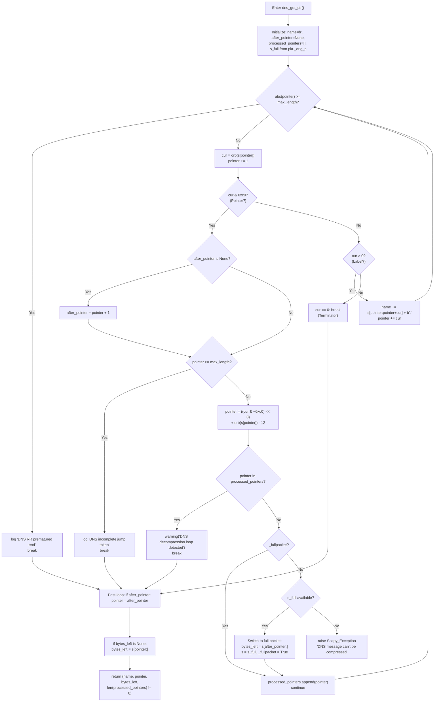
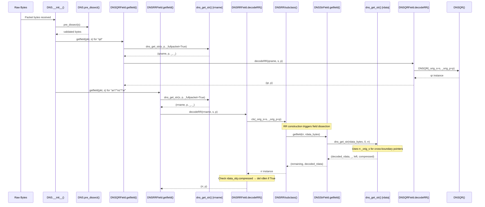
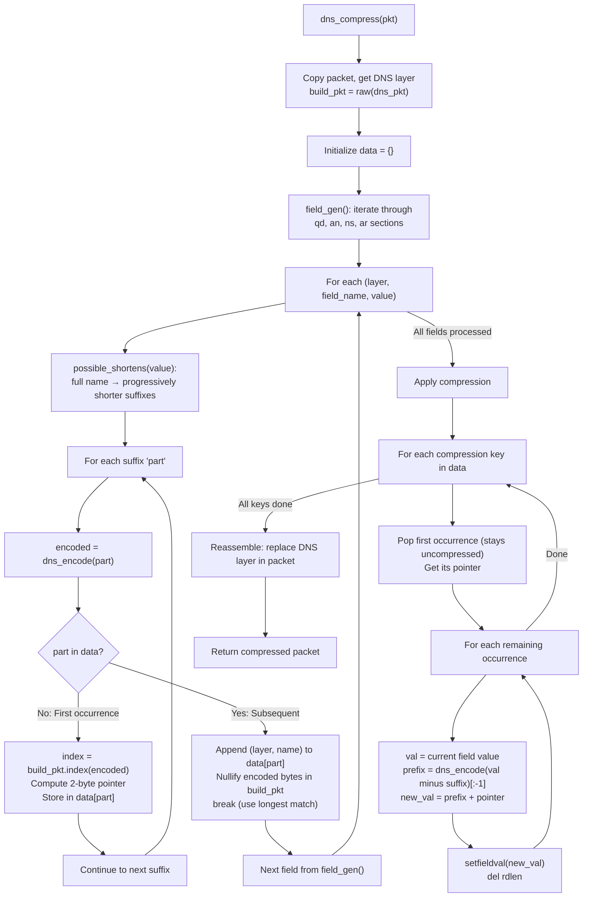

# DNS Name Compression in Scapy: A Deep-Dive Architecture Explainer

## Introduction

This document provides a comprehensive, code-grounded explanation of how the DNS name compression subsystem operates within the [Scapy](https://scapy.net/) packet manipulation library. It covers both the **packet parsing (decompression)** path and the **packet building (compression)** path, answering a series of deeply interrelated questions about the implementation.

**Primary source file:** `scapy/layers/dns.py` (1179 lines) at commit `0925ada4` on branch `scapy_0925ada48540`.

**Methodology:** Every answer in this document is grounded directly in the source code. Each technical claim cites the specific file and line number where the behavior is implemented. Thinking and rationale are provided alongside each answer to explain *why* the code works as it does, not just *what* it does. No assumptions are made beyond what the code explicitly demonstrates.

**Supporting source files referenced:**
- `scapy/compat.py` — byte-level helpers `orb()` (line 146) and `chb()` (line 140)
- `scapy/error.py` — `Scapy_Exception` (line 30), `log_runtime` (line 123), `warning()` (line 132)
- `test/scapy/layers/dns.uts` — regression tests validating compression/decompression behavior

---

## Table of Contents

1. [DNS Wire-Format Encoding (`dns_encode()`)](#1-dns-wire-format-encoding-dns_encode)
2. [Compression Pointer Detection (`0xc0` Bitmask)](#2-compression-pointer-detection-0xc0-bitmask)
3. [Decompression Walkthrough (`dns_get_str()`)](#3-decompression-walkthrough-dns_get_str)
4. [Where Decompression Begins in the Pipeline](#4-where-decompression-begins-in-the-pipeline)
5. [Loop Detection and Prevention](#5-loop-detection-and-prevention)
6. [Error Handling for Malformed Packets](#6-error-handling-for-malformed-packets)
7. [Cross-Boundary Reference Resolution](#7-cross-boundary-reference-resolution)
8. [Compression During Packet Building (`dns_compress()`)](#8-compression-during-packet-building-dns_compress)
9. [Decompression Consistency](#9-decompression-consistency)
10. [End-to-End Flow Summary](#10-end-to-end-flow-summary)

---

## 1. DNS Wire-Format Encoding (`dns_encode()`)

### Question

How are domain names encoded into length-prefixed label sequences before compression enters the picture?

### Thinking / Rationale

DNS uses length-prefixed labels rather than delimiter-separated strings for a fundamental reason: binary safety and unambiguous parsing. In the DNS wire format, each label is preceded by a single byte indicating its length. This means the parser never needs to scan for a delimiter character — it reads the length, consumes exactly that many bytes, and repeats. A zero-length byte terminates the name. This design, specified in RFC 1035 Section 4.1.2, eliminates delimiter-ambiguity problems and allows binary data in labels (up to 63 bytes per label). Scapy faithfully implements this encoding in the `dns_encode()` function.

### Code Analysis

**`dns_encode()` — Source: `scapy/layers/dns.py:154–172`**

```python
def dns_encode(x, check_built=False):
    """Encodes a bytes string into the DNS format

    :param x: the string
    :param check_built: detect already-built strings and ignore them
    :returns: the encoded bytes string
    """
    if not x or x == b".":
        return b"\x00"

    if check_built and _is_ptr(x):
        # The value has already been processed. Do not process it again
        return x

    # Truncate chunks that cannot be encoded (more than 63 bytes..)
    x = b"".join(chb(len(y)) + y for y in (k[:63] for k in x.split(b".")))
    if x[-1:] != b"\x00":
        x += b"\x00"
    return x
```

**Step-by-step breakdown:**

1. **Empty / root domain handling (lines 161–162):** If the input `x` is falsy (empty bytes) or is just `b"."` (the root domain), the function returns `b"\x00"` — a single null byte representing the root domain in wire format.

2. **Already-encoded check (lines 164–166):** When `check_built=True`, the function calls `_is_ptr(x)` to determine if the value has already been processed (is a pointer or an already-encoded name). If so, it returns the value unchanged. This prevents double-encoding during the packet build phase. (See [the `_is_ptr()` helper](#the-_is_ptr-helper) below.)

3. **Core encoding logic (line 169):**
   ```python
   x = b"".join(chb(len(y)) + y for y in (k[:63] for k in x.split(b".")))
   ```
   This single expression performs the entire encoding:
   - `x.split(b".")` — splits the dotted domain name on the `b"."` delimiter, producing a list of labels
   - `k[:63]` — truncates each label to a maximum of 63 bytes (the DNS label length limit, since the length field is 6 bits)
   - `chb(len(y)) + y` — for each (possibly truncated) label `y`, prepends a single byte containing its length. `chb()` (Source: `scapy/compat.py:140–143`) converts an integer to a single byte using `struct.pack("!B", x)`.
   - `b"".join(...)` — concatenates all length-prefixed labels into a single byte string

4. **Null terminator (lines 170–171):** If the resulting encoded string does not already end with `b"\x00"`, a null byte is appended. This null byte marks the end of the domain name in wire format. If the original input ended with `b"."`, the split produces an empty final element whose `chb(0)` encoding is already `b"\x00"`.

### Concrete Example

Encoding `b"www.example.com"`:

```
Input:  b"www.example.com"
Split:  [b"www", b"example", b"com"]

Label "www":     len=3 → chb(3) = b"\x03"  → b"\x03www"
Label "example": len=7 → chb(7) = b"\x07"  → b"\x07example"
Label "com":     len=3 → chb(3) = b"\x03"  → b"\x03com"

Join:   b"\x03www\x07example\x03com"
Append: b"\x00" (null terminator, since last byte is not already \x00)

Result: b"\x03www\x07example\x03com\x00"
```

**Wire-format byte layout:**

```
Offset: 0x00  0x01-0x03  0x04  0x05-0x0B  0x0C  0x0D-0x0F  0x10
Data:   \x03  w w w      \x07  e x a m p  \x03  c o m      \x00
        ^^^^             ^^^^  l e         ^^^^             ^^^^
        len=3            len=7             len=3            terminator
```

### Test Evidence

The test suite validates this encoding at `test/scapy/layers/dns.uts:223–225`:

```python
assert dns_encode(b"www.google.com") == b'\x03www\x06google\x03com\x00'
assert dns_encode(b"*") == b'\x01*\x00'
assert dns_encode(dns_encode(b"*")) == b'\x03\x01*\x00'
```

The third assertion is particularly revealing: calling `dns_encode()` on an already-encoded value `b'\x01*\x00'` without `check_built=True` **will** double-encode it — the `b"\x01"` byte and `b"*"` and `b"\x00"` get treated as a single 3-byte label. This is why the `check_built` parameter and `_is_ptr()` exist.

### The `_is_ptr()` Helper

**Source: `scapy/layers/dns.py:147–151`**

```python
def _is_ptr(x):
    return b"." not in x and (
        (x and orb(x[-1]) == 0) or
        (len(x) >= 2 and (orb(x[-2]) & 0xc0) == 0xc0)
    )
```

This function checks whether a byte string looks like an already-built/compressed DNS name by testing two conditions (after confirming it contains no dots, since dots indicate a human-readable name, not wire format):

1. **Normal termination:** `x and orb(x[-1]) == 0` — the string is non-empty and ends with a null byte, which is the wire-format terminator for an uncompressed name.
2. **Pointer termination:** `len(x) >= 2 and (orb(x[-2]) & 0xc0) == 0xc0` — the second-to-last byte has the two high bits set (`0xc0`), indicating a compression pointer at the end of the name.

The rationale: during packet building, some field values may already be in wire format (e.g., from a previously compressed packet). Without this check, `dns_encode()` would corrupt them by double-encoding. The `check_built=True` parameter enables this safety check, and it is used by `dns_compress()` (line 220, 255) and `DNSStrField.i2m()` (line 295) during packet construction.

---

## 2. Compression Pointer Detection (`0xc0` Bitmask)

### Question

How does the `0xc0` bitmask distinguish a compression pointer from a normal label length byte?

### Thinking / Rationale

In DNS wire format, every byte at the start of a label is interpreted as either a length or a pointer. Normal label lengths range from 0 to 63 (6 bits: `0b00000000` to `0b00111111`). This means the top two bits of a legitimate label length byte are always `00`. The DNS specification deliberately reserves the `11xxxxxx` pattern (both top bits set) to signal a compression pointer. When a parser sees the top two bits set, it knows the current byte and the following byte together form a 14-bit pointer into the DNS message, not a label. The values `10xxxxxx` and `01xxxxxx` are reserved and unused — Scapy correctly treats only the `11xxxxxx` pattern as a pointer.

### Code Analysis

**Source: `scapy/layers/dns.py:101–103`**

```python
cur = orb(s[pointer])  # get pointer value
pointer += 1  # make pointer go forward
if cur & 0xc0:  # Label pointer
```

The `orb()` function (Source: `scapy/compat.py:146–151`) converts a byte to an integer, handling both `int` and `bytes` types:

```python
def orb(x):
    """Return ord(x) when not already an int."""
    if isinstance(x, int):
        return x
    return ord(x)
```

The expression `cur & 0xc0` performs a bitwise AND with `0xc0` (`11000000` in binary). This masks out everything except the two highest bits:

### Bit-Level Walkthrough

**Normal label length byte — `0x07` (length 7):**
```
Binary:     0 0 0 0 0 1 1 1
Mask 0xc0:  1 1 0 0 0 0 0 0
AND result: 0 0 0 0 0 0 0 0  = 0x00 = 0 (falsy)
→ Not a pointer → treat as label length
```

**Compression pointer byte — `0xc0`:**
```
Binary:     1 1 0 0 0 0 0 0
Mask 0xc0:  1 1 0 0 0 0 0 0
AND result: 1 1 0 0 0 0 0 0  = 0xc0 = 192 (truthy)
→ IS a pointer → follow the pointer
```

**Another pointer byte — `0xc3` (pointer with offset bits set):**
```
Binary:     1 1 0 0 0 0 1 1
Mask 0xc0:  1 1 0 0 0 0 0 0
AND result: 1 1 0 0 0 0 0 0  = 0xc0 = 192 (truthy)
→ IS a pointer
```

**Reserved value — `0x80` (only bit 7 set):**
```
Binary:     1 0 0 0 0 0 0 0
Mask 0xc0:  1 1 0 0 0 0 0 0
AND result: 1 0 0 0 0 0 0 0  = 0x80 = 128 (truthy)
```

> **Important nuance:** The `cur & 0xc0` test in Scapy is truthy for `0x80` and `0x40` as well, not just `0xc0`. This means Scapy treats any byte with *either* of the top two bits set as a pointer, which is slightly broader than the strict `11xxxxxx` requirement in RFC 1035. In practice, the `10xxxxxx` and `01xxxxxx` values are reserved and never appear in valid DNS messages, so this broader check is safe and simplifies the code.

### Why Both Bits?

The reason the DNS wire format uses `11` (not just `1` in bit 7) is to maximize the range of normal label lengths. Using only bit 7 would limit labels to 0–127 bytes but waste the `10xxxxxx` space. Using both bits restricts labels to 0–63 bytes but cleanly separates the namespace: `00xxxxxx` = label length, `11xxxxxx` = pointer, and `01xxxxxx`/`10xxxxxx` = reserved for future use. Since DNS labels have a 63-byte maximum length anyway (per the specification), using 6 bits for the length is sufficient.

---

## 3. Decompression Walkthrough (`dns_get_str()`)

### Question

How does `dns_get_str()` unravel a chain of compression pointer references into a readable domain name, and where does the unwinding begin within the DNS dissection pipeline?

### Thinking / Rationale

The `dns_get_str()` function is Scapy's core decompression engine. Its design philosophy is a sequential walk through bytes: it reads one byte at a time, branches based on whether that byte is a label length, a pointer, or a terminator, and accumulates labels into a result string. When a pointer is encountered, the function "jumps" to a new location in the byte stream and continues reading from there. This process naturally handles chains of pointers — each pointer redirects to a new location, which may itself contain another pointer or a sequence of labels.

### Function Signature

**Source: `scapy/layers/dns.py:69–78`**

```python
def dns_get_str(s, pointer=0, pkt=None, _fullpacket=False):
    """This function decompresses a string s, starting
    from the given pointer.

    :param s: the string to decompress
    :param pointer: first pointer on the string (default: 0)
    :param pkt: (optional) an InheritOriginDNSStrPacket packet

    :returns: (decoded_string, end_index, left_string)
    """
```

| Parameter | Type | Purpose |
|-----------|------|---------|
| `s` | `bytes` | The byte string to decompress (may be a sub-record slice or the full DNS payload) |
| `pointer` | `int` | Starting index within `s` (default: 0) |
| `pkt` | `InheritOriginDNSStrPacket` or `None` | Optional parent packet providing access to the full original bytes via `_orig_s` |
| `_fullpacket` | `bool` | Internal flag — when `True`, indicates `s` is the complete DNS payload (not a sub-record slice) |

### Return Value — The 4-Element Tuple

**Source: `scapy/layers/dns.py:144`**

```python
return name, pointer, bytes_left, len(processed_pointers) != 0
```

| Element | Type | Description |
|---------|------|-------------|
| `name` | `bytes` | The decoded domain name (e.g., `b"www.example.com."`) |
| `pointer` | `int` | The end index — where the caller should resume reading after this name |
| `bytes_left` | `bytes` | The remaining unprocessed bytes after the name |
| `len(processed_pointers) != 0` | `bool` | `True` if any compression pointers were followed; `False` for uncompressed names |

> **Documentation discrepancy:** The docstring at line 77 states the return is `(decoded_string, end_index, left_string)` — only 3 elements. The actual implementation at line 144 returns **4 elements**, with the fourth being a boolean compression flag. This fourth element is used by `DNSStrField.getfield()` (line 305) to store whether the field's value was compressed, which later drives `rdlen` recalculation in `DNSRRField.decodeRR()` (lines 362–369).

### Initialization

**Source: `scapy/layers/dns.py:83–94`**

```python
max_length = len(s)
name = b""
after_pointer = None
processed_pointers = []  # Used to check for decompression loops
if pkt and hasattr(pkt, "_orig_s") and pkt._orig_s:
    s_full = pkt._orig_s
else:
    s_full = None
bytes_left = None
```

| Variable | Purpose |
|----------|---------|
| `max_length` | Boundary check limit — prevents reading past the end of `s` |
| `name` | Accumulator for the decoded domain name |
| `after_pointer` | Records the "real" position in the byte stream after the first pointer jump, so the caller knows where the remaining data begins |
| `processed_pointers` | Tracks visited pointer destinations for loop detection (see [Section 5](#5-loop-detection-and-prevention)) |
| `s_full` | The full original packet bytes from `pkt._orig_s`, for cross-boundary resolution (see [Section 7](#7-cross-boundary-reference-resolution)) |
| `bytes_left` | Will hold the unprocessed bytes after the name; computed at loop exit |

### Main Loop — The Three Code Paths

**Source: `scapy/layers/dns.py:95–137`**

The function enters a `while True` loop that processes one byte at a time with four possible branches:

#### Path 1: Out-of-Bounds Check (lines 96–100)

```python
if abs(pointer) >= max_length:
    log_runtime.info(
        "DNS RR prematured end (ofs=%i, len=%i)", pointer, len(s)
    )
    break
```

Before reading any byte, the function checks whether `pointer` is within bounds. If not, it logs an info-level message (silently suppressed by default — see [Section 6](#6-error-handling-for-malformed-packets)) and breaks the loop, returning whatever has been accumulated so far. The `abs()` call handles the case where `pointer` becomes negative (which can happen from the `- 12` offset adjustment).

#### Path 2: Reading the Current Byte (lines 101–102)

```python
cur = orb(s[pointer])  # get pointer value
pointer += 1  # make pointer go forward
```

The current byte is read and converted to an integer via `orb()`. The `pointer` is advanced past this byte.

#### Path 3: Compression Pointer — `cur & 0xc0` is truthy (lines 103–131)

```python
if cur & 0xc0:  # Label pointer
    if after_pointer is None:
        after_pointer = pointer + 1
    if pointer >= max_length:
        log_runtime.info(
            "DNS incomplete jump token at (ofs=%i)", pointer
        )
        break
    pointer = ((cur & ~0xc0) << 8) + orb(s[pointer]) - 12
    if pointer in processed_pointers:
        warning("DNS decompression loop detected")
        break
    if not _fullpacket:
        if s_full:
            bytes_left = s[after_pointer:]
            s = s_full
            max_length = len(s)
            _fullpacket = True
        else:
            raise Scapy_Exception("DNS message can't be compressed " +
                                  "at this point!")
    processed_pointers.append(pointer)
    continue
```

This is the most complex path. When the byte has the top two bits set (a compression pointer):

1. **Save the resume position (lines 104–107):** On the *first* pointer jump only, `after_pointer` is set to `pointer + 1` (one byte past the second byte of the 2-byte pointer token). This tells the caller where the remaining data starts — because the pointer "replaces" the rest of the name, the bytes after the 2-byte pointer belong to the next field.

2. **Bounds check the second byte (lines 108–112):** The compression pointer is 2 bytes long. If the second byte is beyond `s`, an info message is logged and parsing breaks.

3. **The critical pointer calculation (line 114):**

   ```python
   pointer = ((cur & ~0xc0) << 8) + orb(s[pointer]) - 12
   ```

   Breaking this down:
   - `cur & ~0xc0` — clears the top two bits of the first byte, extracting the high 6 bits of the offset
   - `<< 8` — shifts those 6 bits to the high byte position
   - `+ orb(s[pointer])` — adds the second byte as the low 8 bits, forming a 14-bit offset
   - **`- 12` — the critical Scapy-specific adjustment**

   **Why subtract 12?** DNS compression pointers encode offsets from the start of the *entire DNS message*, which includes a 12-byte header (transaction ID: 2 bytes, flags: 2 bytes, qdcount: 2 bytes, ancount: 2 bytes, nscount: 2 bytes, arcount: 2 bytes). However, Scapy's internal byte buffer `s` starts *after* this 12-byte header — the header fields are parsed separately by the `DNS` class. So a wire-format pointer value of, say, 12 (pointing to the first byte after the header) should index position 0 in Scapy's buffer `s`. Hence the subtraction: `wire_offset - 12 = scapy_index`.

4. **Loop detection (lines 115–117):** Checks if we've already visited this pointer target. See [Section 5](#5-loop-detection-and-prevention).

5. **Cross-boundary resolution (lines 118–129):** If we're working with a sub-record slice (not the full packet), we may need to switch to the full packet bytes. See [Section 7](#7-cross-boundary-reference-resolution).

6. **Record and continue (lines 130–131):** The pointer target is added to `processed_pointers`, and the loop continues from the new position.

#### Path 4: Normal Label — `cur > 0` (lines 132–135)

```python
elif cur > 0:  # Label
    name += s[pointer:pointer + cur] + b"."
    pointer += cur
```

When `cur` is a positive value less than 64 (it passed the `& 0xc0` check), it's a label length. The function extracts `cur` bytes from the current position, appends a dot separator, and advances the pointer.

#### Path 5: Terminator — `cur == 0` (lines 136–137)

```python
else:
    break
```

A zero byte terminates the domain name. The loop exits.

### Post-Loop Logic

**Source: `scapy/layers/dns.py:138–144`**

```python
if after_pointer is not None:
    pointer = after_pointer
if bytes_left is None:
    bytes_left = s[pointer:]
return name, pointer, bytes_left, len(processed_pointers) != 0
```

- If any pointer was followed, `pointer` is reset to `after_pointer` — the position just after the 2-byte pointer token in the original stream. This ensures the caller resumes reading from the correct position.
- If `bytes_left` was not set during a cross-boundary switch, it's computed from the current position.

### Mermaid Flowchart



### Concrete Decompression Example

Consider a DNS payload where the question section contains `\x03www\x07example\x03com\x00` starting at offset 0, and later a pointer `\xc0\x10` references offset 16 (which is `0x10 = 16`; in the DNS message that's 16 bytes from the message start, or `16 - 12 = 4` in Scapy's buffer — pointing to the `\x07example` label).

**Decompressing a name that starts with `\x03www` followed by pointer `\xc0\x10`:**

```
Input bytes (from offset 0 in full packet):
  [0]  \x03  — label length 3
  [1]  w
  [2]  w
  [3]  w
  [4]  \x07  — label length 7
  [5]  e
  [6]  x
  ...
  [11] e
  [12] \x03  — label length 3
  [13] c
  [14] o
  [15] m
  [16] \x00  — terminator

Compressed name to decompress (at some later offset):
  [ofs]   \x03  — label length 3
  [ofs+1] f
  [ofs+2] t
  [ofs+3] p
  [ofs+4] \xc0  — pointer high byte (0xc0 | 0x00 = 0xc0)
  [ofs+5] \x10  — pointer low byte (0x10 = 16)

Iteration 1:
  cur = 0x03 (label length 3)
  name = b"ftp."
  pointer advances by 3

Iteration 2:
  cur = 0xc0 (pointer detected: 0xc0 & 0xc0 = 0xc0)
  after_pointer = ofs + 6 (just past the 2-byte pointer)
  pointer = ((0xc0 & ~0xc0) << 8) + 0x10 - 12 = 0 + 16 - 12 = 4
  → Jump to offset 4 in the buffer

Iteration 3 (at offset 4):
  cur = 0x07 (label length 7)
  name = b"ftp.example."
  pointer advances by 7

Iteration 4:
  cur = 0x03 (label length 3)
  name = b"ftp.example.com."
  pointer advances by 3

Iteration 5:
  cur = 0x00 (terminator)
  → break

Result: (b"ftp.example.com.", after_pointer, bytes_left, True)
```

---

## 4. Where Decompression Begins in the Pipeline

### Question

Where does the unwinding begin within the DNS dissection pipeline?

### Thinking / Rationale

DNS decompression does not happen at a single entry point. It occurs at multiple levels during packet dissection, depending on whether Scapy is parsing question records, resource records, or individual fields within those records. The pipeline starts at the `DNS` packet class level and drills down through specialized field types, each of which invokes `dns_get_str()` at the appropriate moment.

### The Dissection Pipeline

#### 1. `DNS` Packet Class

**Source: `scapy/layers/dns.py:462–489`**

The `DNS` class declares its fields in a specific order:

```python
class DNS(Packet):
    name = "DNS"
    fields_desc = [
        # ... header fields (id, flags, counts) ...
        DNSQRField("qd", "qdcount", DNSQR()),     # line 485
        DNSRRField("an", "ancount", None),          # line 486
        DNSRRField("ns", "nscount", None),          # line 487
        DNSRRField("ar", "arcount", None, 0),       # line 488
    ]
```

During dissection, Scapy processes these fields sequentially. Each `DNSQRField` and `DNSRRField` has a `getfield()` method that invokes `dns_get_str()`.

#### 2. `DNSRRField.getfield()` — Resource Record Parsing

**Source: `scapy/layers/dns.py:375–396`**

```python
def getfield(self, pkt, s):
    if isinstance(s, tuple):
        s, p = s
    else:
        p = 0
    ret = None
    c = getattr(pkt, self.countfld)
    # ...
    while c:
        c -= 1
        name, p, _, _ = dns_get_str(s, p, _fullpacket=True)  # line 387
        rr, p = self.decodeRR(name, s, p)                     # line 388
        # ... chain records together ...
```

For each resource record:
1. **Line 387:** `dns_get_str()` is called with `_fullpacket=True` because `s` at this level IS the full DNS payload. This decodes the record's name (e.g., `rrname`).
2. **Line 388:** `decodeRR()` is called to parse the record's type, class, TTL, rdlen, and rdata.

#### 3. `DNSRRField.decodeRR()` — Individual Record Construction

**Source: `scapy/layers/dns.py:354–373`**

```python
def decodeRR(self, name, s, p):
    ret = s[p:p + 10]
    typ, cls, _, rdlen = struct.unpack("!HHIH", ret)
    p += 10
    cls = DNSRR_DISPATCHER.get(typ, DNSRR)
    rr = cls(b"\x00" + ret + s[p:p + rdlen], _orig_s=s, _orig_p=p)  # line 360

    # Reset rdlen if DNS compression was used
    for fname in rr.fieldtype.keys():                     # line 363
        rdata_obj = rr.fieldtype[fname]
        if fname == "rdata" and isinstance(rdata_obj, MultipleTypeField):
            rdata_obj = rdata_obj._find_fld_pkt_val(rr, rr.type)[0]
        if isinstance(rdata_obj, DNSStrField) and rdata_obj.compressed:  # line 367
            del rr.rdlen                                                  # line 368
            break
```

**Line 360** is critical: the RR class constructor receives `_orig_s=s` (the full DNS payload bytes) and `_orig_p=p` (the current offset). These are stored as attributes of the `InheritOriginDNSStrPacket` base class, enabling cross-boundary pointer resolution when `DNSStrField` later calls `dns_get_str()`.

**Lines 362–369:** After constructing the RR, the code checks if any `DNSStrField` within the record used compression (via the `compressed` attribute). If so, it deletes `rdlen` to force recomputation — because the compressed wire-format length differs from the decompressed internal representation.

#### 4. `DNSQRField.decodeRR()` — Question Record Construction

**Source: `scapy/layers/dns.py:399–405`**

```python
class DNSQRField(DNSRRField):
    def decodeRR(self, name, s, p):
        ret = s[p:p + 4]
        p += 4
        rr = DNSQR(b"\x00" + ret, _orig_s=s, _orig_p=p)  # line 403
        rr.qname = name                                     # line 404
        return rr, p
```

Same pattern: `_orig_s` and `_orig_p` are passed to enable cross-boundary resolution.

#### 5. `DNSStrField.getfield()` — The Field-Level Bridge

**Source: `scapy/layers/dns.py:300–307`**

```python
def getfield(self, pkt, s):
    remain = b""
    if self.length_from:
        remain, s = super(DNSStrField, self).getfield(pkt, s)
    # Decode the compressed DNS message
    decoded, _, left, self.compressed = dns_get_str(s, 0, pkt)  # line 305
    # returns (remaining, decoded)
    return left + remain, decoded
```

This is the innermost entry point for decompression. When a `DNSRR` subclass has a `DNSStrField` in its `rdata` (e.g., for CNAME, NS, PTR, MX records — types 2, 3, 4, 5, 12), Scapy calls this `getfield()` method during dissection. It passes `pkt` (the parent `InheritOriginDNSStrPacket` with `_orig_s`) to `dns_get_str()`, enabling pointer resolution across record boundaries.

The `self.compressed` attribute (declared at line 285: `__slots__ = ["compressed"]`) stores the boolean fourth return value, which is later checked by `DNSRRField.decodeRR()` at line 367.

### Mermaid Sequence Diagram



---

## 5. Loop Detection and Prevention

### Question

How does the `processed_pointers` list in `dns_get_str()` prevent the parser from chasing circular pointer references, and what happens when a loop is caught?

### Thinking / Rationale

Malicious or malformed DNS packets can contain circular pointer chains — for example, pointer A referencing offset B, where offset B contains another pointer back to A. Without loop detection, the parser would chase these pointers indefinitely, consuming CPU and memory. The defense mechanism is conceptually simple: maintain a list of all pointer destinations visited so far, and if a new pointer leads to an already-visited destination, declare a loop and stop.

### Code Analysis

**Initialization — Source: `scapy/layers/dns.py:88`**

```python
processed_pointers = []  # Used to check for decompression loops
```

An empty list is created at the start of every `dns_get_str()` call.

**Recording visited pointers — Source: `scapy/layers/dns.py:130`**

```python
processed_pointers.append(pointer)
```

After computing the pointer target and passing all safety checks (bounds, loop, cross-boundary), the destination offset is appended to the list.

**Loop check — Source: `scapy/layers/dns.py:115–117`**

```python
if pointer in processed_pointers:
    warning("DNS decompression loop detected")
    break
```

Before continuing the loop at a new pointer destination, the function checks whether this destination has already been visited. If yes:

1. `warning("DNS decompression loop detected")` is called — this invokes `log_runtime.warning()` (Source: `scapy/error.py:132–137`), which is at the WARNING level and is **visible by default** (the `log_scapy` logger threshold is set to `logging.WARNING` at `scapy/error.py:113`).
2. `break` exits the loop immediately.

### Behavior on Detection

The parser does **NOT** raise an exception when a loop is detected. It **gracefully degrades** — the name accumulated up to the point of loop detection is returned as the result. This design choice is deliberate: packet analysis tools must handle malformed traffic without crashing. A warning is logged to alert the user, but processing continues for the rest of the packet.

### Test Evidence

**Source: `test/scapy/layers/dns.uts:150–153`**

```python
= Decompression loop in dns_get_str
~ dns

assert dns_get_str(b"\x04data\xc0\x0c", 0, _fullpacket=True)[0] == b"data.data."
```

Tracing through this test:

1. **Offset 0:** `cur = 0x04` (label length 4) → read "data", `name = b"data."`, pointer advances to 5
2. **Offset 5:** `cur = 0xc0` (pointer high byte), `after_pointer = 7`
3. **Offset 6:** second byte = `0x0c` → `pointer = ((0xc0 & ~0xc0) << 8) + 0x0c - 12 = 0 + 12 - 12 = 0`
4. `processed_pointers = [0]`
5. **Back to offset 0:** `cur = 0x04` (label length 4) → read "data", `name = b"data.data."`, pointer advances to 5
6. **Offset 5:** `cur = 0xc0` (pointer), compute `pointer = 0` again
7. **Loop check:** `0 in [0]` → **True** → `warning("DNS decompression loop detected")` → `break`

**Result:** `b"data.data."` — the name accumulated before the loop was detected.

**Source: `test/scapy/layers/dns.uts:161–164`** — A more complex test with a real-world mDNS packet containing multiple records. The parser processes `DNS(s)` without crashing, demonstrating that loop detection works correctly even in complex multi-record scenarios.

---

## 6. Error Handling for Malformed Packets

### Question

What occurs when compression pointers reference out-of-bounds locations, truncated data, or invalid offsets?

### Thinking / Rationale

Scapy employs a defense-in-depth approach with multiple independent checks, each protecting against a different failure mode. Critically, most error paths fail **gracefully** — the function returns whatever it has decoded so far rather than crashing. This is essential for a packet analysis tool that routinely encounters malformed, truncated, or deliberately crafted packets.

### Error Path Catalog

| Error Condition | Source Lines | Detection Logic | Response | Severity |
|---|---|---|---|---|
| Premature end of record | `dns.py:96–100` | `abs(pointer) >= max_length` | `log_runtime.info("DNS RR prematured end (ofs=%i, len=%i)")` + `break` | Info (silent by default) |
| Incomplete jump token | `dns.py:108–112` | `pointer >= max_length` after reading first byte of a pointer | `log_runtime.info("DNS incomplete jump token at (ofs=%i)")` + `break` | Info (silent by default) |
| Cannot decompress (no full packet) | `dns.py:126–129` | Pointer encountered, `_fullpacket` is `False`, and `s_full` is `None` | `raise Scapy_Exception("DNS message can't be compressed at this point!")` | Exception (propagates up) |
| Decompression loop | `dns.py:115–117` | `pointer in processed_pointers` | `warning("DNS decompression loop detected")` + `break` | Warning (visible by default) |

### Logging Hierarchy

Scapy uses a tiered logging system that determines which messages the user sees:

1. **`log_runtime.info()` (lines 97, 109):** Logs at the INFO level. The master `log_scapy` logger is set to `logging.WARNING` at `scapy/error.py:112–113`:
   ```python
   if log_scapy.level == logging.NOTSET:
       log_scapy.setLevel(logging.WARNING)
   ```
   Since INFO < WARNING, these messages are **silently suppressed by default**. Users must explicitly lower the log level (e.g., `logging.getLogger("scapy.runtime").setLevel(logging.INFO)`) to see them.

2. **`warning()` (line 116):** Defined at `scapy/error.py:132–137` as a direct call to `log_runtime.warning()`. Since WARNING ≥ WARNING (the default threshold), this message **IS visible** to users.

3. **`Scapy_Exception` (line 128):** A hard exception (class defined at `scapy/error.py:30–31`) that propagates up the call stack. This is the most severe response — it indicates a structural impossibility (trying to follow a pointer without access to the full packet data).

### Test Evidence

**Source: `test/scapy/layers/dns.uts:155–159`**

```python
= Prematured end in dns_get_str
~ dns

assert dns_get_str(b"\x06da", 0, _fullpacket=True)[0] == b"da."
assert dns_get_str(b"\x04data\xc0\x01", 0, _fullpacket=True)[0] == b"data."
```

**Test 1 — Truncated label:** The first byte `\x06` claims a 6-byte label, but only 2 bytes (`da`) are available. The function reads what it can (`s[1:1+6]` = `b"da"` since only 2 bytes exist past the length byte), appends a dot, then on the next iteration `pointer` exceeds `max_length`, triggering the premature-end check. Result: `b"da."`.

**Test 2 — Invalid pointer target:** After reading the label "data", the pointer `\xc0\x01` computes to `((0 << 8) + 1) - 12 = -11`. Then `abs(-11) = 11 >= 6 (len of s)`, triggering the premature-end check at the jump target. The name accumulated before the jump is returned: `b"data."`.

### Graceful Degradation Principle

In all error cases **except** `Scapy_Exception`, the function returns whatever name it has decoded so far rather than failing completely. This design is critical for:
- **Forensic analysis:** Malformed packets in pcap files should be partially parseable
- **Network monitoring:** A single malformed record should not crash the entire dissection
- **Fuzzing resilience:** The parser handles arbitrary byte sequences without panicking

---

## 7. Cross-Boundary Reference Resolution

### Question

How does the `InheritOriginDNSStrPacket` class and its `_orig_s` attribute provide access to the full original packet bytes for resolving pointers that span across DNS record boundaries?

### Thinking / Rationale

When Scapy dissects a DNS packet, each resource record is extracted as a separate sub-packet with its own byte slice. For example, a CNAME record's `rdata` field is parsed from just the bytes of that record's data section. But DNS compression pointers encode offsets from the start of the *entire* DNS message — a pointer like `\xc0\x0c` (offset 12, Scapy index 0) might reference a name in the question section, which is far outside the current record's byte slice. Without access to the full packet, this pointer would be unresolvable.

The `_orig_s` mechanism solves this by threading the full original packet bytes through the dissection pipeline, from the top-level `DNSRRField` down to each individual record.

### `InheritOriginDNSStrPacket` Class

**Source: `scapy/layers/dns.py:270–276`**

```python
class InheritOriginDNSStrPacket(Packet):
    __slots__ = Packet.__slots__ + ["_orig_s", "_orig_p"]

    def __init__(self, _pkt=None, _orig_s=None, _orig_p=None, *args, **kwargs):
        self._orig_s = _orig_s
        self._orig_p = _orig_p
        Packet.__init__(self, _pkt=_pkt, *args, **kwargs)
```

This class adds two attributes to the standard `Packet` base class:

| Attribute | Type | Purpose |
|-----------|------|---------|
| `_orig_s` | `bytes` or `None` | The full original DNS payload bytes (everything after the DNS header) |
| `_orig_p` | `int` or `None` | The offset within `_orig_s` where this record's data begins |

The constructor stores these values **before** calling `Packet.__init__()`, ensuring they are available when the parent constructor triggers field dissection (which may call `dns_get_str()` via `DNSStrField.getfield()`).

### How `_orig_s` Is Passed

The full packet bytes are threaded through the pipeline at two points:

**1. `DNSRRField.decodeRR()` — Source: `scapy/layers/dns.py:360`**

```python
rr = cls(b"\x00" + ret + s[p:p + rdlen], _orig_s=s, _orig_p=p)
```

The variable `s` here is the full DNS payload (passed from `DNSRRField.getfield()` which processes the entire DNS payload). It's passed as `_orig_s` to the newly constructed record.

**2. `DNSQRField.decodeRR()` — Source: `scapy/layers/dns.py:403`**

```python
rr = DNSQR(b"\x00" + ret, _orig_s=s, _orig_p=p)
```

Same pattern for question records.

### How `_orig_s` Is Used in `dns_get_str()`

**Source: `scapy/layers/dns.py:90–93, 118–129`**

At initialization:
```python
if pkt and hasattr(pkt, "_orig_s") and pkt._orig_s:
    s_full = pkt._orig_s
else:
    s_full = None
```

When a pointer is encountered and `_fullpacket` is `False` (meaning `s` is a sub-record slice):
```python
if not _fullpacket:
    if s_full:
        # Yes -> use it to continue
        bytes_left = s[after_pointer:]     # Save remaining from sub-record
        s = s_full                          # Switch to full packet
        max_length = len(s)                 # Update boundary
        _fullpacket = True                  # Mark that we now have full access
    else:
        # No -> abort
        raise Scapy_Exception("DNS message can't be compressed " +
                              "at this point!")
```

The switch is a one-way operation: once `s` is replaced with `s_full`, the function operates on the full packet for the remainder of its execution. The `bytes_left` from the sub-record are saved for the return value.

### Classes That Inherit from `InheritOriginDNSStrPacket`

| Class | Source Line | Purpose |
|-------|-------------|---------|
| `DNSQR` | `dns.py:454` | Question record — needs cross-boundary for qname |
| `DNSRR` | `dns.py:1034` | Standard resource record — needs cross-boundary for rrname and rdata |
| All DNSSEC RR classes | Various | `DNSRRRSIG`, `DNSRRNSEC`, `DNSRRDNSKEY`, etc. — all inherit via DNSRR dispatcher |

### Concrete Example

Consider a DNS response where:
- **Question section** (offset 0 in Scapy's buffer): `\x03www\x07example\x03com\x00` → "www.example.com."
- **Answer section** contains a CNAME record whose rdata is the pointer `\xc0\x0c`

When Scapy parses the answer record:
1. `DNSRRField.getfield()` calls `dns_get_str(s, p, _fullpacket=True)` for the rrname — no problem, `s` is the full payload.
2. `DNSRRField.decodeRR()` creates a `DNSRR` with `_orig_s=s` (full payload).
3. The DNSRR construction triggers `DNSStrField.getfield()` for the rdata field.
4. `DNSStrField.getfield()` calls `dns_get_str(rdata_bytes, 0, pkt=rr)` where `rdata_bytes` is just the 2 bytes `\xc0\x0c` — the record's rdata slice.
5. Inside `dns_get_str()`, `cur = 0xc0` triggers the pointer path. `_fullpacket` is `False`, so the function checks for `s_full`.
6. Since `rr._orig_s` was set, `s_full` is available. The function switches: `s = s_full` (the full DNS payload).
7. The pointer `\xc0\x0c` computes to offset `12 - 12 = 0` in Scapy's buffer, pointing to `\x03www\x07example\x03com\x00`.
8. The function reads the labels and returns `b"www.example.com."`.

Without the `_orig_s` mechanism, step 6 would fail — the 2-byte rdata slice `\xc0\x0c` doesn't contain offset 0, and a `Scapy_Exception` would be raised.

---

## 8. Compression During Packet Building (`dns_compress()`)

### Question

How does `dns_compress()` decide which name parts to compress, how does it discover compression opportunities by walking through all DNS string fields, and what is the strategy behind `possible_shortens()` and `field_gen()`?

### Thinking / Rationale

The compression algorithm uses a **greedy first-occurrence strategy**: it scans all domain name fields in order, and for each field, tries to find the longest suffix that has already appeared in the packet. The first occurrence of any suffix becomes the "canonical" location — all subsequent occurrences are replaced with 2-byte pointers to that location. This is efficient and straightforward, though not necessarily optimal (an optimal algorithm would try all possible compression trees to minimize total packet size). The greedy approach matches common DNS server behavior and is simpler to implement correctly.

### Function Overview

**Source: `scapy/layers/dns.py:184–267`**

```python
def dns_compress(pkt):
    """This function compresses a DNS packet according to compression rules."""
```

**Setup (lines 187–192):**

```python
if DNS not in pkt:
    raise Scapy_Exception("Can only compress DNS layers")
pkt = pkt.copy()
dns_pkt = pkt.getlayer(DNS)
dns_pkt.clear_cache()
build_pkt = raw(dns_pkt)
```

The function copies the packet (to avoid mutating the original), gets the DNS layer, clears cached values, and builds the raw bytes. The `build_pkt` variable holds the uncompressed wire-format bytes and is used to find byte offsets of domain names.

### `field_gen()` — The Field Iterator

**Source: `scapy/layers/dns.py:194–209`**

```python
def field_gen(dns_pkt):
    """Iterates through all DNS strings that can be compressed"""
    for lay in [dns_pkt.qd, dns_pkt.an, dns_pkt.ns, dns_pkt.ar]:
        if lay is None:
            continue
        current = lay
        while not isinstance(current, NoPayload):
            if isinstance(current, InheritOriginDNSStrPacket):
                for field in current.fields_desc:
                    if isinstance(field, DNSStrField) or \
                       (isinstance(field, MultipleTypeField) and
                       current.type in [2, 3, 4, 5, 12, 15]):
                        dat = current.getfieldval(field.name)
                        yield current, field.name, dat
            current = current.payload
```

This generator:
1. Iterates through all four DNS sections: `qd` (question), `an` (answer), `ns` (authority), `ar` (additional) — **line 196**
2. Within each section, follows the payload chain (records are linked via payloads) — **line 200**
3. For each `InheritOriginDNSStrPacket`, yields compressible fields:
   - All `DNSStrField` instances (e.g., `rrname`, `qname`)
   - `MultipleTypeField` instances where the record type is one of 2 (NS), 3 (MD), 4 (MF), 5 (CNAME), 12 (PTR), or 15 (MX) — these are the record types whose rdata contains domain names that can be compressed
4. Yields tuples of `(layer_instance, field_name, field_value)` — **line 208**

### `possible_shortens()` — The Suffix Generator

**Source: `scapy/layers/dns.py:211–215`**

```python
def possible_shortens(dat):
    """Iterates through all possible compression parts in a DNS string"""
    yield dat
    for x in range(1, dat.count(b".")):
        yield dat.split(b".", x)[x]
```

For a domain name, this generator yields all possible compression suffixes, from longest to shortest:

| Input | Yields |
|-------|--------|
| `b"www.example.com."` | `b"www.example.com."`, `b"example.com."`, `b"com."` |
| `b"mail.google.com."` | `b"mail.google.com."`, `b"google.com."`, `b"com."` |
| `b"ns1.google.com."` | `b"ns1.google.com."`, `b"google.com."`, `b"com."` |

The first yield is the full name. Subsequent yields split on dots and take the right portion, producing progressively shorter suffixes. This ordering is essential for the greedy strategy — the longest matching suffix is tried first.

### Main Compression Loop

**Source: `scapy/layers/dns.py:216–241`**

```python
data = {}
for current, name, dat in field_gen(dns_pkt):
    for part in possible_shortens(dat):
        encoded = dns_encode(part, check_built=True)
        if part not in data:
            # First occurrence — store as compression target
            index = build_pkt.index(encoded)
            fb_index = ((index >> 8) | 0xc0)
            sb_index = index - (256 * (fb_index - 0xc0))
            pointer = chb(fb_index) + chb(sb_index)
            data[part] = [(current, name, pointer, index + 1)]
        else:
            # Subsequent occurrence — mark for compression
            data[part].append((current, name))
            _in = data[part][0][3]
            build_pkt = build_pkt[:_in] + build_pkt[_in:].replace(
                encoded, b"\0\0", 1
            )
            break
```

**First occurrence path (lines 221–230):**

When a suffix hasn't been seen before:
1. **Line 225:** Find the byte offset of the encoded suffix in `build_pkt` using `build_pkt.index(encoded)`. This offset is relative to the start of the DNS payload (which includes the 12-byte header in the built bytes).
2. **Lines 227–229 — Pointer encoding:**
   ```python
   fb_index = ((index >> 8) | 0xc0)   # High byte: top 2 bits = 11, next 6 bits = high offset
   sb_index = index - (256 * (fb_index - 0xc0))  # Low byte: remaining offset bits
   pointer = chb(fb_index) + chb(sb_index)        # 2-byte compression pointer
   ```
   This constructs a standard DNS compression pointer: the top 2 bits are set to `11`, and the remaining 14 bits encode the offset from the start of the DNS message.
3. **Line 230:** Store the first occurrence along with its pointer and `index + 1` (the position just past the first byte of the encoded name, used for the `build_pkt` nullification trick).

**Subsequent occurrence path (lines 231–241):**

When a suffix has already been seen:
1. **Line 234:** Record the current field as needing compression.
2. **Lines 235–240:** Replace the encoded bytes in `build_pkt` with `b"\0\0"`. This is a critical trick: it prevents future `build_pkt.index(encoded)` calls from matching this occurrence (which is about to be compressed away). Without this nullification, the `index()` call for a third occurrence might find the second occurrence's position instead of the first.
3. **Line 241:** `break` — stop trying shorter suffixes for this field. The greedy strategy uses the longest match found.

### Compression Application

**Source: `scapy/layers/dns.py:242–261`**

```python
for ck in data:
    replacements = data[ck]
    replace_pointer = replacements.pop(0)[2]
    for rep in replacements:
        val = rep[0].getfieldval(rep[1])
        assert val.endswith(ck)
        kept_string = dns_encode(val[:-len(ck)], check_built=True)[:-1]
        new_val = kept_string + replace_pointer
        rep[0].setfieldval(rep[1], new_val)
        try:
            del rep[0].rdlen
        except AttributeError:
            pass
```

For each compression key (suffix):
1. **Line 248:** Pop the first occurrence — it stays uncompressed as the canonical location. Extract its pointer.
2. **Lines 251–257:** For each subsequent occurrence:
   - Get the current field value
   - Verify it ends with the compression key (`assert val.endswith(ck)`)
   - Encode the prefix (the part before the compressed suffix): `dns_encode(val[:-len(ck)], check_built=True)[:-1]` — the `[:-1]` strips the trailing null byte because the pointer will terminate the name instead
   - Set the new value: `prefix_bytes + pointer_bytes`
3. **Lines 258–261:** Delete `rdlen` from the record to force recomputation, since the compressed rdata is shorter.

### Final Reassembly

**Source: `scapy/layers/dns.py:263–267`**

```python
if not isinstance(pkt, DNS) and pkt.getlayer(DNS).underlayer:
    pkt.getlayer(DNS).underlayer.remove_payload()
    return pkt / dns_pkt
return dns_pkt
```

If the DNS layer is encapsulated (e.g., in IP/UDP), the old DNS layer is removed and replaced with the compressed version.

### Mermaid Flowchart



### Test Evidence

**Source: `test/scapy/layers/dns.uts:103–128`**

```python
= Basic DNS Compression
~ dns

assert len(pkt) == 426                    # Uncompressed size
z = pkt.compress()
assert len(z) == 295                      # Compressed size (31% reduction)
```

Specific compressed values demonstrating the pointer replacement:
- `z.an[0].rdata == b'\x1b140C768FFE28@Freebox Server\xc0\x0c'` — the suffix `_raop._tcp.local.` is replaced by pointer `\xc0\x0c`
- `z.an[1].rrname == z.an[2].rrname == b'\xc0('` — the entire rrname is a pointer
- `z.an[2].target == b'\x10Freebox-Server-3\xc0\x17'` — prefix + pointer to `local.`
- `z.an[3].rrname == b'\xc1\x04'` — pointer to the `Freebox-Server-3.local.` target

**Round-trip test (lines 121–128):**
```python
recompressed = DNS(raw(z))                # Decompress
# ... clear rdlen ...
assert raw(recompressed) == raw(pkt)      # Matches original uncompressed packet
```

This confirms that compression is lossless — decompressing a compressed packet produces byte-identical output to the original uncompressed packet.

**SOA compression test — Source: `test/scapy/layers/dns.uts:194–209`**

```python
cp = dns_compress(p)
assert cp.ns.rrname == b'\xc0\x10'              # Pointer to "google.com."
assert cp.ns.mname == b'\x03ns1\xc0\x10'        # "ns1" prefix + pointer
assert cp.ns.rname == b'\tdns-admin\xc0\x10'    # "dns-admin" prefix + pointer

p = IP(raw(cp))                                   # Decompress
assert p.ns.rrname == b"google.com."
assert p.ns.mname == b"ns1.google.com."
assert p.ns.rname == b"dns-admin.google.com."
```

This demonstrates the suffix-sharing strategy: "google.com." appears once uncompressed, and "ns1.google.com." and "dns-admin.google.com." both use a pointer to that first occurrence plus their unique prefixes.

---

## 9. Decompression Consistency

### Question

Do different compression pointer strategies for the same domain always decompress to identical strings?

### Thinking / Rationale

The answer is **yes**, and this can be proven by reasoning about the deterministic nature of `dns_get_str()`.

### Formal Argument

1. **Termination guarantee:** Every pointer chain must eventually terminate. This is enforced by two mechanisms:
   - **Loop detection** (Source: `dns.py:115`): `if pointer in processed_pointers` catches cycles
   - **Bounds checking** (Source: `dns.py:96`): `abs(pointer) >= max_length` catches out-of-bounds jumps

2. **Transparent redirection:** Compression pointers are purely navigational — they change *where* the parser reads from, but not *what* it reads. A pointer is a "goto" instruction that redirects to a sequence of labels. The parser follows the pointer, then reads labels normally at the new location.

3. **Deterministic label extraction:** The only place where bytes are added to the result `name` is at line 134:
   ```python
   name += s[pointer:pointer + cur] + b"."
   ```
   This extraction depends solely on the byte content at the resolved position in the buffer, not on how the parser arrived there.

4. **Therefore:** Any arrangement of pointers that ultimately resolves to the same sequence of label bytes produces the same output string. Two different compression strategies for the same domain name — say, one using a single pointer to the full name and another using separate pointers for each label — will both produce identical `name` values because they both resolve to the same underlying label data.

### What Could Differ?

- The `pointer` (second return element) and `bytes_left` (third element) may differ between compression strategies, since they reflect the structure of the compressed encoding
- The fourth element (`len(processed_pointers) != 0`) will be `True` for any compressed encoding and `False` for uncompressed
- But the **name itself** (first element) is always identical for the same underlying domain

### Test Evidence

The round-trip tests confirm consistency:

**Source: `test/scapy/layers/dns.uts:121–128`**
```python
recompressed = DNS(raw(z))    # Decompress the compressed packet
# ...
assert raw(recompressed) == raw(pkt)  # Byte-identical to original
```

**Source: `test/scapy/layers/dns.uts:206–209`**
```python
p = IP(raw(cp))               # Decompress the compressed packet
assert p.ns.rrname == b"google.com."
assert p.ns.mname == b"ns1.google.com."
assert p.ns.rname == b"dns-admin.google.com."
```

These tests compress with Scapy's greedy strategy, then decompress, and verify the results match the original names. Since the tests pass, we have empirical confirmation that the specific compression strategy used does not affect the decompressed output.

---

## 10. End-to-End Flow Summary

### The Complete DNS Name Lifecycle

#### Building (Encoding → Compression)

1. **User creates a DNS packet:**
   ```python
   pkt = DNS(qd=DNSQR(qname="www.example.com"))
   ```

2. **Field encoding:** When the packet is built (via `raw(pkt)` or wire transmission), `DNSStrField.i2m()` (Source: `dns.py:294–295`) calls `dns_encode(x, check_built=True)` for each domain name field, converting dotted names to length-prefixed wire format.

3. **Optional compression:** The user can call `pkt.compress()` (Source: `dns.py:514–516`), which invokes `dns_compress()`. The compression algorithm:
   - Builds the uncompressed raw bytes
   - Scans all domain name fields via `field_gen()`
   - For each field, generates suffix candidates via `possible_shortens()`
   - Replaces subsequent occurrences of shared suffixes with 2-byte pointers
   - Returns a new packet with compressed values

4. **Wire transmission:** The compressed (or uncompressed) bytes are sent.

#### Parsing (Dissection → Decompression)

5. **Bytes received:** Raw bytes arrive and are passed to `DNS()`.

6. **`DNS.pre_dissect()`** (Source: `dns.py:518–530`): Validates the packet structure (especially for DNS over TCP, checking length field consistency).

7. **Field-by-field processing:** Scapy processes the DNS fields in order:
   - `DNSQRField.getfield()` → `dns_get_str()` for each qname
   - `DNSRRField.getfield()` → `dns_get_str()` for each rrname, then `decodeRR()` for the record body
   - Within each record, `DNSStrField.getfield()` → `dns_get_str()` for rdata fields containing domain names

8. **Pointer resolution:** `dns_get_str()` follows compression pointers, switching to the full packet bytes via `_orig_s` when needed, and accumulates labels into the decoded name.

9. **Result:** All domain names are restored to their original dotted form (e.g., `b"www.example.com."`), regardless of how they were compressed.

### Mermaid End-to-End Flow Diagram

```mermaid
flowchart LR
    subgraph Building["Building (Encoding + Compression)"]
        direction TB
        U["User creates DNS packet"] --> E["DNSStrField.i2m()<br/>calls dns_encode()"]
        E --> B["raw(pkt): build wire-format bytes"]
        B --> C{"User calls .compress()?"}
        C -->|Yes| D["dns_compress():<br/>field_gen() → possible_shortens()<br/>→ pointer replacement"]
        C -->|No| W["Uncompressed bytes"]
        D --> W2["Compressed bytes"]
    end

    subgraph Wire["Wire"]
        direction TB
        TX["Transmission"]
    end

    subgraph Parsing["Parsing (Dissection + Decompression)"]
        direction TB
        R["Raw bytes received"] --> PD["DNS.pre_dissect()<br/>validate structure"]
        PD --> QR["DNSQRField.getfield()<br/>→ dns_get_str() for qname"]
        QR --> RR["DNSRRField.getfield()<br/>→ dns_get_str() for rrname"]
        RR --> DR["DNSRRField.decodeRR()<br/>create RR with _orig_s"]
        DR --> SF["DNSStrField.getfield()<br/>→ dns_get_str() for rdata"]
        SF --> RES["Resolved domain names:<br/>b'www.example.com.'"]
    end

    W --> TX
    W2 --> TX
    TX --> R
```



### Key Implementation Details Summary

| Aspect | Implementation | Source |
|--------|---------------|--------|
| Wire-format encoding | `dns_encode()` splits on `.`, prepends each label with its length byte, appends null terminator | `scapy/layers/dns.py:154–172` |
| Double-encoding prevention | `_is_ptr()` checks for already-encoded names; used with `check_built=True` | `scapy/layers/dns.py:147–151` |
| Compression pointer detection | `cur & 0xc0` bitmask — top two bits set indicates a pointer | `scapy/layers/dns.py:103` |
| Pointer offset calculation | `((cur & ~0xc0) << 8) + orb(s[pointer]) - 12` — 14-bit offset minus DNS header size | `scapy/layers/dns.py:114` |
| Loop detection | `processed_pointers` list tracks visited destinations; warning + break on revisit | `scapy/layers/dns.py:88, 115–117` |
| Cross-boundary access | `InheritOriginDNSStrPacket._orig_s` provides full packet bytes to sub-record decompression | `scapy/layers/dns.py:270–276` |
| Compression strategy | Greedy first-occurrence suffix matching via `field_gen()` and `possible_shortens()` | `scapy/layers/dns.py:184–267` |
| Decompression entry points | `DNSStrField.getfield()`, `DNSRRField.getfield()`, `DNSQRField.getfield()` | `scapy/layers/dns.py:300–307, 375–396, 399–405` |
| Error handling | Tiered: info log (silent) → warning (visible) → exception (propagates) | `scapy/layers/dns.py:96–100, 108–112, 115–117, 126–129` |
| Round-trip fidelity | Compress → decompress = byte-identical original | `test/scapy/layers/dns.uts:121–128, 206–209` |
| Byte helpers | `orb()` converts byte→int; `chb()` converts int→byte | `scapy/compat.py:146–151, 140–143` |
| Return tuple discrepancy | Docstring says 3-tuple; actual implementation returns 4-tuple (4th = compression flag) | `scapy/layers/dns.py:77 vs 144` |
