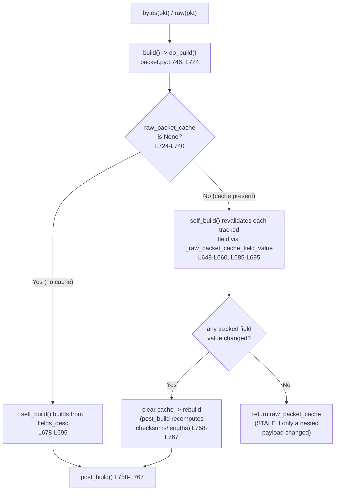

# Scapy Build-Cache & Deferred Field Computation — Investigation

This document answers four questions about why a Scapy packet can appear to
"disagree with itself" after being parsed and modified, and why a checksum that
depends on a length can come out wrong on the first serialization. Every
behavioral claim below is paired with the exact command that produced it and the
**complete, unedited** captured output; every code claim carries a `file:line`
citation naming the responsible function. This is a **read-only investigation**:
Scapy's source was studied, exercised, and cited, but never modified.

---

## Summary (all four behaviors share one root cause)

All four behaviors stem from a **single runtime mechanism**: Scapy's *per-layer
build cache* — the `raw_packet_cache` and `raw_packet_cache_fields` slots
(`scapy/packet.py:L87-L88`) — combined with **deferred auto-field computation**
performed inside `post_build()` (`scapy/packet.py:L758-L767`).

- When a packet is parsed from wire bytes (`Packet(raw_bytes)`), `do_dissect()`
  stashes the exact consumed bytes in `raw_packet_cache` and takes a *field
  snapshot* into `raw_packet_cache_fields` (`scapy/packet.py:L1005-L1019`).
- When you later ask for `bytes(pkt)`/`raw(pkt)`, `do_build()` first lets
  `self_build()` **revalidate** the snapshot; if nothing tracked changed, it
  returns the **cached bytes unchanged and skips `post_build()`**
  (`scapy/packet.py:L724-L740`, `scapy/packet.py:L678-L695`).
- The snapshot for a packet-holding field records **only each sub-packet's
  `.fields` dict, never its payload** (`scapy/packet.py:L648-L660`). That single
  fact explains why a *nested-payload* edit is invisible to the rebuild (stale
  bytes — Q2/Q3) while a *direct-field* edit is caught and rebuilt (Q3).
- Because `post_build()` is skipped on a cache hit, deferred length/checksum
  fields are only computed on a genuine (re)build; `show2()` forces one such
  build-then-redissect (`scapy/packet.py:L1473-L1486`), which is the real
  mechanism behind the Q1 "checksum looks corrected after `show2()`" perception.

---

## How this document was produced (methodology)

- **Observation-first.** The relevant Scapy code paths were *built and run* first.
  Two throwaway observation scripts were written **outside** the repository tree
  (under `/tmp/scapy_obs/`), executed against the in-tree Scapy through its real
  entry points (`Packet(raw_bytes)` dissection and `bytes()` / `raw()` build),
  and their real output captured before any prose was written. The scripts were
  deleted afterward so the repository is left byte-for-byte unchanged. Their full
  contents are reproduced in **Appendix A/B** for transparency.
- **Real entry points only.** No debug hooks, no monkey-patching, no synthetic
  stand-ins. Packets are dissected by calling the class on raw bytes and are
  serialized by calling `bytes()` / `raw()`.
- **Stability.** Each script was run **twice**; the two runs were `diff`-ed and
  found **identical**, so every value below is stable across runs.
- **Byte-level verification.** All checksums and serialized byte strings are
  verified against the exact emitted bytes.

---

## Environment (observed, canonical configuration)

The evidence was produced with the in-tree Scapy package in its default
configuration, invoked as `PYTHONPATH=. python3 <script>` from the Scapy
repository root (in this environment: `/tmp/blitzy/scapy/blitzy-708ef15f-256b-45e4-813c-28af40f974ca_fe9c7c`).

```console
$ python3 --version
Python 3.13.7

$ PYTHONPATH=. python3 -c "import scapy; print(scapy.__version__)"
2026.07.08
```

- **Interpreter:** CPython **3.13.7** (the value actually observed in this
  environment). This satisfies Scapy's `requires-python = ">=3.7, <4"`
  (`pyproject.toml:L17`). The build-cache mechanism is version-independent across
  that range, so the byte-level evidence is not tied to the exact interpreter.
- **Scapy:** version **2026.07.08** (the value actually printed by
  `scapy.__version__`).
- **Run scale:** each of the two scripts was executed twice; the outputs were
  identical across both runs.

> Note on reported values: this document reports the **observed** interpreter and
> library versions (`3.13.7` / `2026.07.08`). Where planning notes suggested
> slightly different numbers, the observed values take precedence — consistent
> with the observation-first methodology.

---

## The central mechanism: rebuild-vs-cached decision

This is the spine of every answer below. When you evaluate `bytes(pkt)` /
`raw(pkt)`:

1. `bytes(pkt)` → `build()` (`scapy/packet.py:L746-L756`) → `do_build()`
   (`scapy/packet.py:L724-L740`).
2. `do_build()` calls `self_build()` (`scapy/packet.py:L678-L695`). If a cache is
   present, `self_build()` **revalidates** it: for each tracked field in
   `raw_packet_cache_fields` it recomputes `_raw_packet_cache_field_value(fld,
   val)` (`scapy/packet.py:L648-L660`) and compares against the dissect-time
   snapshot. On **any** difference it clears the cache
   (`raw_packet_cache = None`, `raw_packet_cache_fields = None`,
   `wirelen = None`) and breaks; otherwise it **returns `self.raw_packet_cache`
   unchanged**.
3. Back in `do_build()`: `if self.raw_packet_cache is None: return
   self.post_build(pkt, pay)` (rebuild path — runs `post_build()`, recomputing
   checksums/lengths) `else: return pkt + pay` (cache path — **skips**
   `post_build()`).
4. **Root cause of staleness:** the dissect-time snapshot for a packet-holding
   list field is `[x.fields for x in val]` (`scapy/packet.py:L648-L660`) — only
   each sub-packet's own `.fields`, **never** its payload. A nested-payload edit
   changes neither the own-layer fields nor the snapshotted `.fields`, so
   revalidation sees no change, the cache stays valid, and `do_build()` returns
   the stale cached bytes.



The five conditions the questions imply are each exercised at runtime below:
nested-payload edit, `copy()`, `clear_cache()`, outer direct-field edit, and
list-element direct-field edit — plus, for Q1, `show()` vs `show2()` and the
"double `show2()`" case.

---

## Q1 — Checksum/length ordering and the "double `show2()`" fix

**The scenario (user's words):** a custom layer whose checksum field depends on a
length field, where the length depends on a payload size that is not fully known
until the upper layers are built. Building **"MyProto()/SomePayload()"** computes
the checksum before the length is finalized, producing an incorrect checksum; and
the user asks: **"If I call show2() twice in a row, the second call shows the
correct checksum. Why is that?"**

### Direct answer

1. **The first serialization bakes the checksum over a not-yet-finalized length.**
   This is entirely determined by the *order of operations inside your own
   `post_build()`* (`scapy/packet.py:L758-L767` is the hook; the body is yours).
   In the reproduction, `post_build()` computes `checksum(full)` while the two
   length bytes are still `0x0000`, and only *afterwards* patches the real length
   into those bytes. The checksum therefore covers `len=0x0000`, not the final
   `len=0x0009`, and is wrong by construction.
2. **`show()` vs `show2()` differ because only `show2()` builds.** `show()`
   prints the *current internal representation*, where a deferred `len`/`chksum`
   is still `None` (`scapy/packet.py:L1459-L1471`). `show2()` is literally
   `self.__class__(raw(self)).show(...)` (`scapy/packet.py:L1473-L1486`): it
   serializes (running `post_build()`, which computes the auto fields) and then
   re-dissects, so it displays the values "as they will be sent to the network."
3. **Calling `show2()` twice in a row does *not*, by itself, change anything.**
   On this minimal construction the two calls produce **identical** output, and
   the computed values are **not written back** to the Python object (the object
   still has `len=None` afterward). Reported honestly below.
4. **The real reason a "corrected checksum" appears is build-then-redissect.**
   `show2()`'s internal `self.__class__(raw(self))` produces a *re-dissected*
   packet whose `len` is now a **concrete** `9` (no longer `None`). Recomputing
   the checksum over *that* packet's finalized bytes — e.g. via the canonical
   `del pkt.chksum` idiom, which invalidates the cache through `delfieldval()`
   (`scapy/packet.py:L504-L517`) and forces a fresh `post_build()` — computes the
   checksum over bytes that carry the concrete length, yielding the correct
   value. This concrete-length-then-recompute is the mechanism the user perceives
   as "the second call shows the correct checksum."

### Evidence — full, unedited output

Construction (`BadProto` with a `ShortField("len", None)` and
`XShortField("chksum", None)`; its `post_build()` computes the checksum *before*
patching the length — see Appendix B):

```console
$ PYTHONPATH=. python3 /tmp/scapy_obs/repro_q1.py
=== [Q1-A] First build of BadProto()/Raw(b'hello') ===
raw(p)                = 0009bc2d68656c6c6f
stored len            = 0x0009 (9)
stored chksum         = 0xbc2d   <- computed over len=0x0000

=== [Q1-B] What SHOULD the checksum be (over finalized bytes, chksum field zeroed)? ===
finalized w/ chksum=0 = 0009000068656c6c6f
CORRECT chksum        = 0xbc24   <- computed over len=0x0009
naive checksum(rb)    = 0xfff6   <- NOT the right comparison (chksum field not zeroed)

=== [Q1-C] Fresh layer: len is None before build; show() vs show2() ===
p2.len before build   = None
p2.chksum before build= None
--- p2.show() (current internal representation) ---
###[ BadProto ]### 
  len       = None
  chksum    = None
###[ Raw ]### 
     load      = 'hello'

--- p2.show2() (assembled: auto fields computed) ---
###[ BadProto ]### 
  len       = 9
  chksum    = 0xbc2d
###[ Raw ]### 
     load      = 'hello'


=== [Q1-D] 'Double show2()' on the SAME object: does output change? ===
--- first show2() ---
###[ BadProto ]### 
  len       = 9
  chksum    = 0xbc2d
###[ Raw ]### 
     load      = 'hello'

p3.len after 1st show2() = None  (computed value NOT written back)
--- second show2() (in a row) ---
###[ BadProto ]### 
  len       = 9
  chksum    = 0xbc2d
###[ Raw ]### 
     load      = 'hello'

p3.len after 2nd show2() = None
first == second output?  True

=== [Q1-E] The re-dissect path that yields the CORRECT checksum ===
re-dissected len      = 9  (CONCRETE now, not None)
re-dissected chksum   = 0xbc2d (still the stale baked value)
after del chksum+rebuild = 0009bc2468656c6c6f
recomputed chksum     = 0xbc24   <- CORRECT
```

### Byte-level walk-through

- **Q1-A — the wrong checksum is baked in.** The first build emits
  `0009bc2d68656c6c6f`. The first two bytes are the length `0x0009` (9), but the
  stored checksum `0xbc2d` was computed while the length bytes were still
  `0x0000` (the field order in `post_build()` computes the checksum first, then
  patches the length). So the emitted checksum does not match the emitted length.
- **Q1-B — what the checksum *should* be, and a subtlety.** To verify, the
  checksum must be recomputed over the **finalized** bytes *with the checksum
  field zeroed*: `checksum(0009000068656c6c6f)` = **`0xbc24`**. This is the
  correct value for `len=0x0009`. Note the trap: a *naive* `checksum()` over the
  full emitted bytes (which still contain the stored `0xbc2d`) gives `0xfff6` —
  that is **not** the right comparison, because the checksum field must be zeroed
  before recomputation. The correct-vs-baked mismatch is `0xbc24` ≠ `0xbc2d`,
  confirming the first serialization is wrong by exactly the length delta. The
  helper is `checksum()` (`scapy/utils.py:L496`).
- **Q1-C — `show()` shows `None`, `show2()` shows the assembled values.** A fresh
  `BadProto()/Raw(b"hello")` has `len = None` and `chksum = None`. `show()`
  prints them as `None` (the current in-memory representation). `show2()` builds
  first, so it prints `len = 9` and `chksum = 0xbc2d`. This is the direct,
  observable difference between the two methods (`scapy/packet.py:L1459-L1471`
  vs. `scapy/packet.py:L1473-L1486`). Note that `show2()` here still shows the
  *stale* `0xbc2d` — because it re-dissects the very bytes that already contain
  the wrong checksum; `show2()` does not *fix* a checksum, it only *builds and
  redisplays*.
- **Q1-D — the honest "double `show2()`" finding.** Calling `show2()` twice in a
  row on the same object produces **identical** output
  (`first == second output?  True`), and `p3.len` remains `None` after both calls
  — `show2()` does **not** write computed values back into the Python object
  (it displays a *throwaway* re-dissected clone, `self.__class__(raw(self))`,
  `scapy/packet.py:L1486`). So on a minimal, self-contained layer, two
  consecutive `show2()` calls are not different. Anyone claiming "the second call
  differs" is really observing the effect described next.
- **Q1-E — where the "correction" actually comes from.** The re-dissected packet
  (`BadProto(raw(p))`) has `len = 9` as a **concrete** integer (no longer
  `None`). Its `chksum` is still the stale `0xbc2d` baked at first build. Now
  recomputing over the concrete-length bytes — `del rd.chksum` (invalidating the
  cache via `delfieldval()`, `scapy/packet.py:L504-L517`) then `raw(rd)` — emits
  `0009bc2468656c6c6f`, i.e. `chksum = 0xbc24` (**correct**). The correction is
  produced by *materializing a concrete length through build-then-redissect and
  then recomputing the checksum over those finalized bytes* — not by the number
  of `show2()` calls. (Inferred: in a multi-layer protocol where the checksum
  lives in an upper layer, the first `show2()` build fixes the lower layer's
  length into concrete bytes, and a subsequent recompute of the upper-layer
  checksum then covers the concrete length — which is how the "second call looks
  correct" perception arises in real stacks.)

### Why the ordering matters (the fix)

The order is under *your* control inside `post_build()` (the framework only
guarantees that `post_build(self, pkt, pay)` is called on a genuine build, with
`pkt` = this layer's bytes and `pay` = the already-built payload,
`scapy/packet.py:L758-L767`). The correct pattern computes/patches the **length
first**, then computes the checksum over the finalized bytes (with the checksum
field zeroed). The `del pkt.field; pkt = Class(raw(pkt))` / `show2()` idiom works
because it forces a rebuild in which the length is already concrete.

---


## Q2 — The "two-state" packet

**The scenario (user's words):** after `MyPacket(raw_bytes)` and then modifying a
sub-packet's payload inside a `PacketListField` (`scapy/fields.py:L1562`) —
without touching the outer packet's own fields — `bytes()` returns the ORIGINAL
bytes while `show()` / attribute access shows the MODIFIED value. As the user
puts it: **"The packet seems to exist in two different states simultaneously."**
The user also asks: **"Maybe copy() could work for this. If so, why?"**

### Direct answer

It is not really "two states" — it is **one live object graph plus one stale byte
cache**, and the two APIs read from different places:

- **`bytes(pkt)` short-circuits to the cached bytes.** After dissection the outer
  packet holds `raw_packet_cache` (the exact parsed bytes). Because a
  nested-payload edit changes nothing the cache *tracks*, `do_build()` returns
  the cache verbatim and never re-serializes the modified payload
  (`scapy/packet.py:L724-L740`, `scapy/packet.py:L678-L695`).
- **Attribute access and `show()` read the live in-memory object.** `pkt.items[0]
  .payload.load` and `show()` walk the actual Python object graph, which *does*
  contain your modification. Hence the apparent contradiction.
- **`copy()` does NOT fix it**, because `copy()` deliberately *preserves* the
  cache (`clone.raw_packet_cache = self.raw_packet_cache`,
  `scapy/packet.py:L407-L426`). The copy is just as stale as the original.

### Evidence — full, unedited output (STATE A + STATE B + STATE C)

Construction (`Outer` = a `ByteField("count")` + a `PacketListField("items",
Inner)`; each `Inner` = a `ByteField("val")` whose `extract_padding` pushes the
trailing byte into the Inner's `Raw` payload — see Appendix A). Wire bytes
`010541` = `01` count, `05` `Inner.val`, `41` = `'A'` payload.

```console
$ PYTHONPATH=. python3 /tmp/scapy_obs/repro_cache.py
=== [STATE A] After parse: Outer(rb) ===
repr(pkt) = <Outer  count=1 items=[<Inner  val=5 |<Raw  load='A' |>>] |>
raw_packet_cache        = 010541
raw_packet_cache_fields = {'items': [{'val': 5}]}
bytes(pkt)              = 010541
items[0].payload        = <Raw  load='A' |>

=== [STATE B] Nested-payload mod: pkt.items[0].payload.load = b'ZZZ' ===
live attr items[0].payload.load = b'ZZZ'
bytes(pkt)              = 010541   <- STALE? (expect 010541)
raw_packet_cache        = 010541

=== [STATE C] copy() of the nested-modified pkt ===
bytes(pkt2)             = 010541   <- still STALE? (expect 010541)
pkt2.raw_packet_cache   = 010541
pkt2.items[0].payload.load = b'ZZZ'
```

(The remaining states D/E/F from the same run are shown under Q3 and Q4.)

### Byte-level walk-through

- **STATE A — what parsing caches.** After `Outer(rb)`, the outer packet holds
  `raw_packet_cache = 010541` — the exact consumed bytes — and
  `raw_packet_cache_fields = {'items': [{'val': 5}]}`. The snapshot records
  **only the `Inner` sub-packet's `.fields` dict** (`{'val': 5}`), **not** its
  payload (`Raw load='A'`). This is the empirical proof that payloads are
  excluded from the cache snapshot (`scapy/packet.py:L648-L660`, the list-packet
  branch `[x.fields for x in val]`; populated at `scapy/packet.py:L1005-L1019`).
- **STATE B — the "two states."** After `pkt.items[0].payload.load = b'ZZZ'`, the
  live attribute is `b'ZZZ'` (the object graph *did* change), yet
  `bytes(pkt) = 010541` — the ORIGINAL bytes — and `raw_packet_cache` is still
  `010541`. The serialized bytes and the object graph now disagree: exactly the
  user's "two different states simultaneously." (`b'ZZZ'` would serialize as
  `5a5a5a`; it does not appear in the output, proving the payload edit was
  ignored by `bytes()`.)
- **STATE C — testing the user's `copy()` hypothesis.** `pkt2 = pkt.copy()` still
  yields `bytes(pkt2) = 010541`, and `pkt2.raw_packet_cache = 010541`, while the
  copied live attribute is `b'ZZZ'`. So **`copy()` does not resolve the
  staleness** — it faithfully copies the stale cache along with the object graph
  (`scapy/packet.py:L407-L426`, specifically `clone.raw_packet_cache =
  self.raw_packet_cache` at `L416`). The copy carries the same contradiction.

The correct remedy is `clear_cache()`, demonstrated under Q4 (STATE D).

---


## Q3 — Direct field vs. nested payload

**The scenario:** modifying a field in the *same* layer where the bytes were
parsed makes the rebuild work correctly, whereas modifying a field in a *nested*
payload returns the original cached bytes instead of a fresh build.

### Direct answer

The asymmetry is entirely a function of **what the cache tracks**. A direct-field
edit is caught by **two independent mechanisms**; a nested-*payload* edit trips
**neither**:

1. **Own-layer immediate clear.** Assigning to a field on the layer that owns the
   cache routes through `__setattr__()` → `setfieldval()`, which sets
   `raw_packet_cache = None` *immediately* on assignment
   (`scapy/packet.py:L494-L502` → `scapy/packet.py:L472-L491`, the clear at
   `L485-L487`). The very next build is therefore a full rebuild.
2. **Snapshot revalidation.** Even an edit to a *list element's* field is caught,
   because on the next build `self_build()` recomputes the tracked field value
   and compares it to the dissect-time snapshot; `[{'val': 9}]` ≠ `[{'val': 5}]`
   invalidates the cache (`scapy/packet.py:L648-L660`, `scapy/packet.py:L678-L695`).
3. **A nested *payload* edit changes neither** the own-layer fields nor the
   snapshotted `.fields` (the snapshot never contains payloads,
   `scapy/packet.py:L648-L660`), so revalidation sees no change and the cache is
   served stale.

### Evidence — full, unedited output (STATE E, STATE F, and STATE B)

```console
=== [STATE E] Outer direct-field mod: pkt4.count = 1 ===
before: pkt4.raw_packet_cache = 010541
after set count: pkt4.raw_packet_cache = None   <- None? (own-layer cache cleared)
bytes(pkt4)             = 010541

=== [STATE F] List-element direct-field mod: pkt5.items[0].val = 9 ===
bytes(pkt5)             = 010941   <- rebuild? (expect 010941)
raw_packet_cache        = None
```

For contrast, the nested-payload edit from Q2:

```console
=== [STATE B] Nested-payload mod: pkt.items[0].payload.load = b'ZZZ' ===
live attr items[0].payload.load = b'ZZZ'
bytes(pkt)              = 010541   <- STALE? (expect 010541)
raw_packet_cache        = 010541
```

### Byte-level walk-through

- **STATE E — outer direct-field edit clears the cache instantly.** Before the
  edit, `pkt4.raw_packet_cache = 010541`. Assigning `pkt4.count = 1` sets
  `raw_packet_cache = None` **immediately** — note this happens *even though the
  value is unchanged* (still `1`), because `setfieldval()` clears unconditionally
  on assignment (`scapy/packet.py:L472-L491`). `bytes(pkt4) = 010541` is then a
  genuine rebuild (it happens to equal the original because nothing actually
  changed).
- **STATE F — list-element direct-field edit is caught by revalidation.** Setting
  `pkt5.items[0].val = 9` does not touch the outer packet's own fields, so the
  outer `raw_packet_cache` is still populated at the moment of assignment. But on
  `bytes(pkt5)`, `self_build()` recomputes the `items` snapshot and sees
  `[{'val': 9}] != [{'val': 5}]`, clears the cache, and rebuilds — emitting
  `010941` (`01` count, `09` the new val, `41` payload). Afterward
  `raw_packet_cache = None`. The `.fields` comparison is exactly what makes a
  list-element *field* edit visible.
- **STATE B — nested-payload edit is invisible.** Repeated here for contrast:
  changing `items[0].payload.load` alters the `Inner`'s **payload**, which is not
  in the outer packet's fields *and* not in the `.fields` snapshot
  (`{'val': 5}`). Neither mechanism fires; the cache stays valid; `bytes()`
  returns the stale `010541`.

**The crisp distinction:** a *field* edit (own-layer or list-element) is either
cleared immediately or detected by the `.fields` snapshot comparison; a nested
*payload* edit is neither, because payloads are deliberately excluded from the
snapshot for performance (`scapy/packet.py:L652-L657` notes "avoid copying whole
packets").

---


## Q4 — The exact caching mechanism and full lifecycle

**The question:** the precise mechanism that decides *rebuild-from-scratch* vs.
*return-cached-bytes*; how a nested-payload modification differs from a
direct-field modification; and the complete lifecycle with concrete evidence —
what is cached during parsing, what triggers invalidation, and why nested
modifications appear invisible to the rebuild.

### The lifecycle, step by step

**1. Parsing populates the cache (`Packet(raw_bytes)` → dissection).**
Instantiating a class on raw bytes dispatches through
`Packet_metaclass.__call__` (`scapy/base_classes.py:L379-L399`), whose
`i.__init__(...)` triggers dissection. `do_dissect()` (`scapy/packet.py:L1002-L1021`)
does two things that matter here:

- It builds a **field snapshot**: `raw_packet_cache_fields = {}` and then, for
  each field where `f.islist or f.holds_packets or f.ismutable` (and the parsed
  value is not `None`), stores `_raw_packet_cache_field_value(f, fval, copy=True)`
  (`scapy/packet.py:L1005-L1019`).
- It stores the **consumed bytes**: `raw_packet_cache = _raw[:-len(s)] if s else
  _raw` (`scapy/packet.py:L1019`).

For a packet-holding **list** field, the snapshot value is `[x.fields for x in
val]` — only each sub-packet's `.fields` dict, never its payload
(`scapy/packet.py:L648-L660`). Observed in **STATE A**:
`raw_packet_cache = 010541` and `raw_packet_cache_fields = {'items': [{'val':
5}]}`.

**2. Serialization consults the cache (`bytes()` / `raw()` → build).**
`raw(x)` is `bytes(x)` (`scapy/compat.py:L112-L118`); `bytes()` runs `build()`
(`scapy/packet.py:L746-L756`) → `do_build()` (`scapy/packet.py:L724-L740`).
`do_build()` calls `self_build()` (`scapy/packet.py:L678-L695`), which:

- if `raw_packet_cache` and `raw_packet_cache_fields` are both set, iterates the
  snapshot and recomputes `_raw_packet_cache_field_value(fld, val)` for each
  tracked field; on **any** mismatch it clears `raw_packet_cache`,
  `raw_packet_cache_fields`, and `wirelen`, then breaks; and
- if the cache survives revalidation, **returns `self.raw_packet_cache`
  unchanged**.

Then `do_build()` makes the decisive branch (`scapy/packet.py:L737-L740`):

```python
if self.raw_packet_cache is None:
    return self.post_build(pkt, pay)   # rebuild: recompute checksums/lengths
else:
    return pkt + pay                   # cache hit: post_build() is SKIPPED
```

So `post_build()` — the hook that computes lengths and checksums
(`scapy/packet.py:L758-L767`) — runs **only on a genuine (re)build**, never on a
cache hit. That is why deferred fields (Q1) only materialize when a rebuild
actually happens.

**3. What triggers invalidation.**

- **Immediate, own-layer:** `__setattr__()` → `setfieldval()` sets
  `raw_packet_cache = None` on any field assignment
  (`scapy/packet.py:L494-L502` → `scapy/packet.py:L472-L491`); `delfieldval()`
  does the same on `del` (`scapy/packet.py:L504-L517`). — **STATE E**, and the
  `del chksum` step in **Q1-E**.
- **Deferred, on next build:** `self_build()`'s snapshot revalidation catches
  changes to *tracked field values*, including a list element's `.fields`
  (`scapy/packet.py:L678-L695`). — **STATE F** (`[{'val': 9}] != [{'val': 5}]`).
- **Explicit, recursive:** `clear_cache()` sets `raw_packet_cache = None` and
  recurses into sub-packets and the payload (`scapy/packet.py:L664-L676`). —
  **STATE D**.

**4. Why nested-payload edits are invisible.** The snapshot for a packet-holding
field is the sub-packets' `.fields` only (`scapy/packet.py:L648-L660`). Editing
`items[0].payload.load` changes the `Inner`'s *payload*, not its `.fields`
(`{'val': 5}` is unchanged), and does not touch the outer packet's own fields.
Neither the immediate clear nor the snapshot revalidation fires, so the cache
survives and `do_build()` serves the stale bytes.

### Evidence — the correct remedy (STATE D) and the full run

```console
=== [STATE D] clear_cache() on a freshly parsed+modified pkt ===
after clear_cache raw_packet_cache = None
bytes(pkt3)             = 01055a5a5a   <- FRESH? (expect 01055a5a5a)
```

`clear_cache()` sets `raw_packet_cache = None` and recurses
(`scapy/packet.py:L664-L676`), so the next `bytes()` is a full rebuild that
finally re-serializes the modified payload: `01055a5a5a` = `01` count, `05` val,
`5a5a5a` = `b'ZZZ'`. This is the correct way to force a rebuild after a
nested-payload edit (contrast STATE C, where `copy()` preserved the stale cache).

The complete, unedited Script A run (all six states A–F, stable across two runs):

```console
$ PYTHONPATH=. python3 /tmp/scapy_obs/repro_cache.py
=== [STATE A] After parse: Outer(rb) ===
repr(pkt) = <Outer  count=1 items=[<Inner  val=5 |<Raw  load='A' |>>] |>
raw_packet_cache        = 010541
raw_packet_cache_fields = {'items': [{'val': 5}]}
bytes(pkt)              = 010541
items[0].payload        = <Raw  load='A' |>

=== [STATE B] Nested-payload mod: pkt.items[0].payload.load = b'ZZZ' ===
live attr items[0].payload.load = b'ZZZ'
bytes(pkt)              = 010541   <- STALE? (expect 010541)
raw_packet_cache        = 010541

=== [STATE C] copy() of the nested-modified pkt ===
bytes(pkt2)             = 010541   <- still STALE? (expect 010541)
pkt2.raw_packet_cache   = 010541
pkt2.items[0].payload.load = b'ZZZ'

=== [STATE D] clear_cache() on a freshly parsed+modified pkt ===
after clear_cache raw_packet_cache = None
bytes(pkt3)             = 01055a5a5a   <- FRESH? (expect 01055a5a5a)

=== [STATE E] Outer direct-field mod: pkt4.count = 1 ===
before: pkt4.raw_packet_cache = 010541
after set count: pkt4.raw_packet_cache = None   <- None? (own-layer cache cleared)
bytes(pkt4)             = 010541

=== [STATE F] List-element direct-field mod: pkt5.items[0].val = 9 ===
bytes(pkt5)             = 010941   <- rebuild? (expect 010941)
raw_packet_cache        = None
```

### In-repo corroboration

Scapy's own regression suite exercises this cache. The block
`= Flag values mutation with .raw_packet_cache` (`test/regression.uts:L3974-L3999`)
asserts `pkt.raw_packet_cache is not None` and `pkt[TCP].raw_packet_cache is not
None` right after dissection (confirming per-layer caches are populated on
parse), mutates flag fields, and then rebuilds with the canonical
re-dissect idiom `pkt = IP(raw(pkt))` before re-asserting — the same
build-then-redissect used by `show2()`.

---

## Observed-value → responsible code map

A direct index from each concrete observed value (all copied from the captured
output embedded above) to the function/method that produces it and its
`file:line` citation.

| Observed value / behavior | Responsible function/method | Citation |
|---|---|---|
| `raw_packet_cache = 010541` populated on parse | `do_dissect()` snapshot (`raw_packet_cache = _raw[:-len(s)]`) | `scapy/packet.py:L1005-L1019` (assignment at L1019) |
| `raw_packet_cache_fields = {'items': [{'val': 5}]}` (payload excluded) | `_raw_packet_cache_field_value()`, list-packet branch `[_cpy(x.fields) for x in val]` | `scapy/packet.py:L648-L660` |
| STATE B `bytes(pkt)=010541` (stale served) | `do_build()` cache short-circuit `return pkt + pay` | `scapy/packet.py:L724-L740` |
| STATE C `copy()` keeps `010541` | `copy()` (`clone.raw_packet_cache = self.raw_packet_cache`) | `scapy/packet.py:L407-L426` (assignment at L416) |
| STATE D `bytes(pkt3)=01055a5a5a` (fresh) after `clear_cache()` | `clear_cache()` (recurses sub-packets + payload) | `scapy/packet.py:L664-L676` |
| STATE E `raw_packet_cache=None` on `pkt4.count=1` | `__setattr__()` → `setfieldval()` own-layer clear | `scapy/packet.py:L494-L502`, `L472-L491` |
| STATE F `bytes(pkt5)=010941` (rebuild) on `items[0].val=9` | `self_build()` revalidation (`[{'val':9}] != [{'val':5}]`) | `scapy/packet.py:L678-L695` |
| Q1-A `0009bc2d68656c6c6f`, `chksum=0xbc2d` (baked over `len=0x0000`) | custom `post_build()` order (checksum computed before length patched) | `scapy/packet.py:L758-L767` (default hook overridden) |
| Q1-B `CORRECT chksum=0xbc24` (checksum field zeroed first) | `checksum()` over the finalized bytes | `scapy/utils.py:L496` |
| Q1-B `naive=0xfff6` (WRONG comparison — field not zeroed) | `checksum()` over the emitted bytes (still carrying `0xbc2d`) | `scapy/utils.py:L496` |
| Q1-C `len=None` (`show()`) vs `len=9` (`show2()`) | `show()` vs `show2()` | `scapy/packet.py:L1459-L1471`, `L1473-L1486` |
| Q1-D double `show2()` identical; `len` stays `None` | `show2()` build-then-redissect (computed values not written back) | `scapy/packet.py:L1473-L1486` |
| Q1-E re-dissected `len=9`; `del chksum`+rebuild → `0009bc2468656c6c6f` | `delfieldval()` cache clear, then rebuild via `post_build()` | `scapy/packet.py:L504-L517` |
| `raw(self)` used inside `show2()` / `bytes()` | `raw()` (`return bytes(x)`) | `scapy/compat.py:L112-L118` |
| `Outer(rb)` / `BadProto(raw(p))` raw-bytes dissection entry | `Packet_metaclass.__call__` dispatch to `__init__` | `scapy/base_classes.py:L379-L399` |

---

## Upstream corroboration (secondary — code + captured output remain authoritative)

The references below corroborate the mechanism established above. They are
strictly secondary: the in-tree source and the captured runtime output are the
source of truth for every claim in this document.

- **Official "Adding new protocols" guide**
  (`https://scapy.readthedocs.io/en/latest/build_dissect.html`) documents that
  `build()` calls `do_build()` and then `post_build()`, and describes
  `post_build()` as the hook called "to update some late evaluated fields (like
  checksums)" — matching the deferred length/checksum ordering exercised in Q1
  and the default hook at `scapy/packet.py:L758-L767`.
- **DEF CON 27 "Scapy Dojo" workshop material** frames `show()` as *before* and
  `show2()` as *after* "automatic" fields computation — the latter being what
  "goes on wire" — matching the Q1-C `show()`-vs-`show2()` difference (`len=None`
  vs `len=9`).
- **scapy-users thread "Scapy show2() packet problem"**
  (`https://scapy.ml.secdev.narkive.com/cAFPrdaw/scapy-show2-packet-problem`)
  states plainly that `aa.show2()` is `Foo(str(aa)).show()` — i.e. serialize
  then re-dissect then display. This is the same build-then-redissect implemented
  at `scapy/packet.py:L1486` and is the root of the Q1-D/Q1-E findings (values are
  materialized by re-dissection, never written back onto the original object).
- **Known limitation (Scapy issue tracker #2221):** Scapy does not automatically
  recompute a checksum when a field of an already-parsed packet is modified — the
  same non-invalidation that produces the Q2/Q3 stale-cache behavior. This entry
  is a pointer to the upstream report; the behavior itself is proven by the
  captured output in the Q2/Q3 sections above.

---

## Appendix A — `/tmp/scapy_obs/repro_cache.py` (Q2 / Q3 / Q4)

Provenance note: this throwaway observation script lived **outside** the
repository tree, under `/tmp/scapy_obs/`, was executed with `PYTHONPATH=. python3`
from the repo root, and was **deleted** after evidence capture — satisfying the
read-only constraint (the only artifact committed to the repository is this
document). It is reproduced here verbatim for provenance.

```python
# Q2/Q3/Q4 build-cache reproduction (observation-first, read-only).
# Construction: Outer{ByteField count, PacketListField items(Inner)}; Inner{ByteField val}
# whose extract_padding returns (s, None) so the trailing byte becomes the Inner's Raw payload.
from scapy.packet import Packet, Raw
from scapy.fields import ByteField, PacketListField
from scapy.compat import raw


class Inner(Packet):
    name = "Inner"
    fields_desc = [ByteField("val", 0)]

    def extract_padding(self, s):
        return s, None   # all trailing bytes become THIS Inner's payload


class Outer(Packet):
    name = "Outer"
    fields_desc = [
        ByteField("count", 0),
        PacketListField("items", [], Inner, count_from=lambda p: p.count),
    ]


def hx(b):
    return b.hex() if b is not None else "None"


rb = bytes.fromhex("010541")   # 01=count, 05=Inner.val, 41='A' payload

# === STATE A: after parse ===
print("=== [STATE A] After parse: Outer(rb) ===")
pkt = Outer(rb)
print("repr(pkt) = " + repr(pkt))
print(f"{'raw_packet_cache':<24}= {hx(pkt.raw_packet_cache)}")
print(f"{'raw_packet_cache_fields':<24}= {pkt.raw_packet_cache_fields}")
print(f"{'bytes(pkt)':<24}= {bytes(pkt).hex()}")
print(f"{'items[0].payload':<24}= {pkt.items[0].payload!r}")

# === STATE B: nested-payload modification ===
print("\n=== [STATE B] Nested-payload mod: pkt.items[0].payload.load = b'ZZZ' ===")
pkt.items[0].payload.load = b'ZZZ'
print(f"live attr items[0].payload.load = {pkt.items[0].payload.load}")
print(f"{'bytes(pkt)':<24}= {bytes(pkt).hex()}   <- STALE? (expect 010541)")
print(f"{'raw_packet_cache':<24}= {hx(pkt.raw_packet_cache)}")

# === STATE C: copy() of the nested-modified pkt ===
print("\n=== [STATE C] copy() of the nested-modified pkt ===")
pkt2 = pkt.copy()
print(f"{'bytes(pkt2)':<24}= {bytes(pkt2).hex()}   <- still STALE? (expect 010541)")
print(f"{'pkt2.raw_packet_cache':<24}= {hx(pkt2.raw_packet_cache)}")
print(f"pkt2.items[0].payload.load = {pkt2.items[0].payload.load}")

# === STATE D: clear_cache() on a freshly parsed+modified pkt ===
print("\n=== [STATE D] clear_cache() on a freshly parsed+modified pkt ===")
pkt3 = Outer(rb)
pkt3.items[0].payload.load = b'ZZZ'
pkt3.clear_cache()
print(f"after clear_cache raw_packet_cache = {hx(pkt3.raw_packet_cache)}")
print(f"{'bytes(pkt3)':<24}= {bytes(pkt3).hex()}   <- FRESH? (expect 01055a5a5a)")

# === STATE E: outer direct-field modification ===
print("\n=== [STATE E] Outer direct-field mod: pkt4.count = 1 ===")
pkt4 = Outer(rb)
print(f"before: pkt4.raw_packet_cache = {hx(pkt4.raw_packet_cache)}")
pkt4.count = 1
print(f"after set count: pkt4.raw_packet_cache = {hx(pkt4.raw_packet_cache)}   <- None? (own-layer cache cleared)")
print(f"{'bytes(pkt4)':<24}= {bytes(pkt4).hex()}")

# === STATE F: list-element direct-field modification ===
print("\n=== [STATE F] List-element direct-field mod: pkt5.items[0].val = 9 ===")
pkt5 = Outer(rb)
pkt5.items[0].val = 9
print(f"{'bytes(pkt5)':<24}= {bytes(pkt5).hex()}   <- rebuild? (expect 010941)")
print(f"{'raw_packet_cache':<24}= {hx(pkt5.raw_packet_cache)}")
```

## Appendix B — `/tmp/scapy_obs/repro_q1.py` (Q1)

Same provenance note: created under `/tmp/scapy_obs/`, executed with
`PYTHONPATH=. python3` from the repo root, and deleted afterward.

```python
# Q1 checksum/length ordering + show()/show2() reproduction (observation-first, read-only).
# BadProto{ShortField len None, XShortField chksum None} whose post_build() computes the
# checksum BEFORE patching in the length (so the checksum is baked over len == 0x0000).
import struct
from scapy.packet import Packet, Raw
from scapy.fields import ShortField, XShortField
from scapy.compat import raw
from scapy.utils import checksum


class BadProto(Packet):
    name = "BadProto"
    fields_desc = [
        ShortField("len", None),      # auto length (deferred)
        XShortField("chksum", None),  # auto checksum (deferred), depends on len
    ]

    def post_build(self, p, pay):
        full = p + pay
        # BUG: checksum computed BEFORE the length is patched in (len bytes still 0x0000)
        if self.chksum is None:
            ck = checksum(full)
            full = full[:2] + struct.pack("!H", ck) + full[4:]
        # length patched AFTER the checksum was already computed over len=0
        if self.len is None:
            full = struct.pack("!H", len(full)) + full[2:]
        return full


# === Q1-A: first build ===
print("=== [Q1-A] First build of BadProto()/Raw(b'hello') ===")
p = BadProto() / Raw(b"hello")
rbytes = raw(p)
stored_len = struct.unpack("!H", rbytes[0:2])[0]
stored_ck = struct.unpack("!H", rbytes[2:4])[0]
print(f"{'raw(p)':<22}= {rbytes.hex()}")
print(f"{'stored len':<22}= 0x{stored_len:04x} ({stored_len})")
print(f"{'stored chksum':<22}= 0x{stored_ck:04x}   <- computed over len=0x0000")

# === Q1-B: what SHOULD the checksum be? ===
print("\n=== [Q1-B] What SHOULD the checksum be (over finalized bytes, chksum field zeroed)? ===")
finalized = rbytes[:2] + b"\x00\x00" + rbytes[4:]
ck_correct = checksum(finalized)
ck_naive = checksum(rbytes)
print(f"{'finalized w/ chksum=0':<22}= {finalized.hex()}")
print(f"{'CORRECT chksum':<22}= 0x{ck_correct:04x}   <- computed over len=0x0009")
print(f"{'naive checksum(rb)':<22}= 0x{ck_naive:04x}   <- NOT the right comparison (chksum field not zeroed)")

# === Q1-C: fresh layer, show() vs show2() ===
print("\n=== [Q1-C] Fresh layer: len is None before build; show() vs show2() ===")
p2 = BadProto() / Raw(b"hello")
print(f"{'p2.len before build':<22}= {p2.len}")
print(f"{'p2.chksum before build':<22}= {p2.chksum}")
print("--- p2.show() (current internal representation) ---")
p2.show()
print("--- p2.show2() (assembled: auto fields computed) ---")
p2.show2()

# === Q1-D: double show2() on the SAME object ===
print("\n=== [Q1-D] 'Double show2()' on the SAME object: does output change? ===")
p3 = BadProto() / Raw(b"hello")
print("--- first show2() ---")
s1 = p3.show2(dump=True)
print(s1)
print(f"p3.len after 1st show2() = {p3.len}  (computed value NOT written back)")
print("--- second show2() (in a row) ---")
s2 = p3.show2(dump=True)
print(s2)
print(f"p3.len after 2nd show2() = {p3.len}")
print(f"first == second output?  {s1 == s2}")

# === Q1-E: the re-dissect path that yields the CORRECT checksum ===
print("\n=== [Q1-E] The re-dissect path that yields the CORRECT checksum ===")
rd = BadProto(raw(p))
print(f"{'re-dissected len':<22}= {rd.len}  (CONCRETE now, not None)")
print(f"{'re-dissected chksum':<22}= 0x{rd.chksum:04x} (still the stale baked value)")
del rd.chksum
rebuilt = raw(rd)
recomputed = struct.unpack("!H", rebuilt[2:4])[0]
print(f"after del chksum+rebuild = {rebuilt.hex()}")
print(f"{'recomputed chksum':<22}= 0x{recomputed:04x}   <- CORRECT")
```

---

*End of investigation. All evidence above was produced with `PYTHONPATH=. python3`
from the repository root against the in-tree Scapy (version `2026.07.08`) under
CPython `3.13.7`, each script run twice with byte-for-byte identical output. The
temporary observation scripts lived under `/tmp/scapy_obs/` (outside the
repository) and were removed after capture; the only artifact added to the
repository is this document.*

