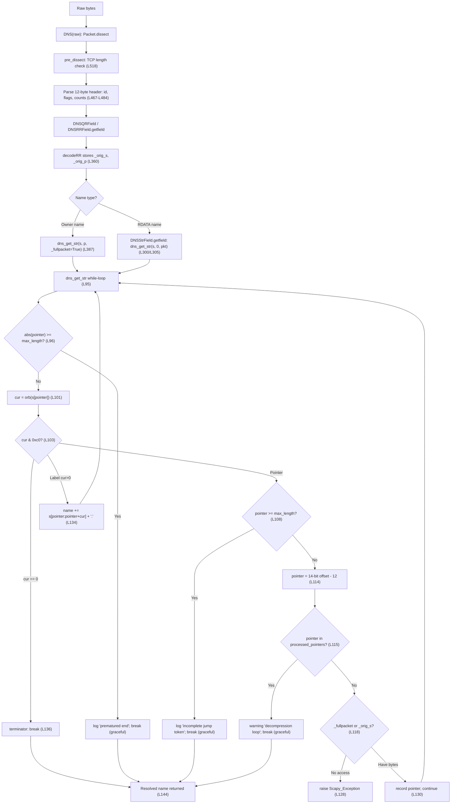

# Scapy DNS Name Compression — An Onboarding Q&A (Runtime‑Verified)

> **What this document is.** A runtime‑verified explanation of *exactly* how Scapy encodes, parses,
> decompresses, and re‑compresses DNS names (RFC 1035 §4.1.4 message compression), for both
> well‑formed packets and deliberately malformed ("twisted") ones. Every behavioral claim below is
> backed by **observed output** from code that was actually run, plus a `file:line` citation into the
> source. Anything derived purely from reading (not observed at runtime) is explicitly labeled
> **(inferred)**.
>
> **Commit pin.** All citations are pinned to HEAD `0925ada485406684174d6f068dbd85c4154657b3`
> (branch `scapy_0925ada48540`). At this HEAD, `scapy/layers/dns.py` is **1179 lines**; every line
> number below was re‑read against that exact file.

---

## 1. Overview & background frame

DNS messages frequently repeat the same domain name many times (a query name, then the same name as
an answer's owner, then again inside RDATA). To save space, RFC 1035 §4.1.4 defines **message
compression**: an entire name — or the trailing labels of one — may be replaced by a two‑octet
**pointer** back to an earlier occurrence of that name in the same message.

The canonical wire rules (RFC 1035 §4.1.4, corroborated by RFC 9267):

- A **label** begins with a length octet whose top two bits are `00`; labels are limited to 63 octets.
- A **pointer** is a two‑octet sequence whose **top two bits are `11`** (i.e. the byte `0xc0` masked);
  the remaining **14 bits** are an **offset measured from the start of the message** (the first octet
  of the 12‑byte DNS header). The classic value `0xc00c` is a pointer to offset **12** — the question
  name that immediately follows the header.
- The `10` and `01` bit combinations are **reserved** by the RFC.

RFC 9267 ("Common Implementation Anti‑Patterns … DNS RR Processing") documents the two failure modes a
naive decompressor must defend against, and which this document exercises against Scapy directly:

- **Compression loops** — a pointer that (directly or transitively) points back at itself; a
  blind implementation "will enter an infinite‑loop state."
- **Out‑of‑bounds / forward pointers** — a pointer offset that lands outside the packet.

Scapy's DNS name‑compression machinery lives entirely in one module, `scapy/layers/dns.py`
[scapy/layers/dns.py:L1-L1179]. The three functions at its core are:

| Direction | Function | Location | Role |
|-----------|----------|----------|------|
| Decode | `dns_get_str` | [scapy/layers/dns.py:L69-L144] | The single decompression routine — follows pointer chains, accumulates labels, guards against loops/OOB/truncation |
| Encode | `dns_encode` | [scapy/layers/dns.py:L154-L172] | Turns a dotted name into length‑prefixed labels (before any compression) |
| Compress | `dns_compress` | [scapy/layers/dns.py:L184-L267] | Build‑side compressor — walks the packet and substitutes pointers |

This document answers nine specific questions (Q1–Q9) about these paths, each with a captured runtime
demonstration.

---

## 2. Environment & methodology

**Run‑before‑write.** Per the governing rules, the code was **run first** and its complete, unedited
output captured; only then was this prose written. Every experiment used a temporary observation
script placed **under `/tmp` (outside the repository)**; all such scripts were deleted afterward and
the repository confirmed unchanged (see the Appendix for the `git status --porcelain` proof).

**Runtime actually used (observed):**

```text
$ git rev-parse HEAD
0925ada485406684174d6f068dbd85c4154657b3
$ git branch --show-current
blitzy-a3ff4b59-e1d8-4c40-afc6-a343c6428841
$ /tmp/scapy-venv/bin/python --version
Python 3.11.15
$ wc -l scapy/layers/dns.py
1179 scapy/layers/dns.py
$ PYTHONPATH=. /tmp/scapy-venv/bin/python -c "import scapy; print('scapy', scapy.__version__); from scapy.layers.dns import dns_encode; print(dns_encode(b'www.example.com.'))"
scapy 2026.07.08
b'\x03www\x07example\x03com\x00'
```

- **Python version — reported transparently.** The runtime used here is **Python 3.11.15** (a
  standalone CPython in the project's virtualenv at `/tmp/scapy-venv`), which satisfies Scapy's
  declared `requires-python = ">=3.7, <4"` and is the highest version explicitly exercised by the
  project's CI (`tox.ini` `py311`). *Note:* the original task brief speculatively referenced Python
  3.12.3 with a caveat that 3.11 "was not installable"; in **this** environment the canonical 3.11.15
  virtualenv is present and was used, so the actual observed version (3.11.15) is reported rather than
  the brief's placeholder. Scapy's DNS layer is a zero‑dependency, pure‑Python module and behaves
  identically across this range.
- **Canonical invocation.** All scripts were run as `PYTHONPATH=. /tmp/scapy-venv/bin/python <script>`
  from the repository root. Scapy's zero‑dependency core imports the DNS layer directly from the
  source tree. The repository's own interactive entry point is `PYTHONPATH=. python -m scapy`.
- **Capturing warnings/logs.** Scapy emits diagnostics through Python's `logging` module
  (`log_runtime = logging.getLogger("scapy.runtime")` [scapy/error.py:L123]), which writes to
  **stderr** — *not* through the `warnings` module. Every recipe that can emit a warning/log was run
  with `2>&1` so stderr is included. The INFO‑level messages (Q5a/Q5b/Q5c) are below Scapy's default
  log level, so those recipes raise the logger level with
  `logging.getLogger('scapy.runtime').setLevel(logging.INFO)` (and deliberately do **not** call
  `logging.basicConfig`, which would double‑emit each line).

**Evidence template.** Each Q&A section below is structured as: (1) the direct answer first;
(2) the specific function/method with its `file:line`; (3) the exact enclosing code excerpt, copied
verbatim; (4) the exact command and its complete captured output; (5) a cause→effect rationale.

---

## 3. Critical up‑front facts (read this before the Q&A)

### 3.1 The default build path does **not** auto‑compress

Building a DNS packet with `bytes(pkt)` **does not** compress names. Compression is an **explicit,
opt‑in** step, performed only by `dns_compress(pkt)` [scapy/layers/dns.py:L184-L267] or the
convenience method `DNS.compress()` [scapy/layers/dns.py:L514-L516].

The proof is in `DNS.post_build` [scapy/layers/dns.py:L509-L512], the only build hook — it merely
prepends the TCP length prefix (when carried over TCP) and **never** calls `dns_compress`:

```python
    def post_build(self, pkt, pay):
        if isinstance(self.underlayer, TCP) and self.length is None:
            pkt = struct.pack("!H", len(pkt) - 2) + pkt[2:]
        return pkt + pay
```

`DNS.compress()` is the thin opt‑in wrapper:

```python
    def compress(self):
        """Return the compressed DNS packet (using `dns_compress()`"""
        return dns_compress(self)
```

**Observed** (command + complete output):

```text
$ PYTHONPATH=. /tmp/scapy-venv/bin/python - <<'PY'
from scapy.layers.dns import DNS, DNSQR, DNSRR, dns_compress
pkt = DNS(qd=DNSQR(qname='www.example.com'),
          an=DNSRR(rrname='www.example.com', type='A', rdata='1.2.3.4'))
u = bytes(pkt)
print('uncompressed bytes(pkt)      len =', len(u))
print('  contains 0xc0 after header :', b'\xc0' in u[12:])
print("  count of b'example'        :", u.count(b'example'))
print('  hex:', u.hex())
c = bytes(dns_compress(pkt))
print('compressed dns_compress(pkt) len =', len(c))
print("  contains b'\\xc0\\x0c'        :", b'\xc0\x0c' in c)
print("  count of b'example'        :", c.count(b'example'))
print('  hex:', c.hex())
c2 = bytes(pkt.compress())
print('compressed pkt.compress()    len =', len(c2))
print('  identical to dns_compress  :', c2 == c)
PY
uncompressed bytes(pkt)      len = 64
  contains 0xc0 after header : False
  count of b'example'        : 2
  hex: 00000100000100010000000003777777076578616d706c6503636f6d000001000103777777076578616d706c6503636f6d000001000100000000000401020304
compressed dns_compress(pkt) len = 49
  contains b'\xc0\x0c'        : True
  count of b'example'        : 1
  hex: 00000100000100010000000003777777076578616d706c6503636f6d0000010001c00c0001000100000000000401020304
compressed pkt.compress()    len = 49
  identical to dns_compress  : True
```

**Cause → effect.** The default `bytes(pkt)` render spells the repeated name `www.example.com` out
**twice** (`b'example'` appears 2×, no `0xc0` after the 12‑byte header), producing **64 bytes**. Only
after `dns_compress` does the second occurrence collapse to the two‑octet pointer `\xc0\x0c`, dropping
the packet to **49 bytes** with `b'example'` appearing once. `pkt.compress()` returns byte‑for‑byte the
same result as `dns_compress(pkt)`, confirming it is just a wrapper.

> The byte sizes here (**64 → 49**) are the values observed for *this specific packet*; a different
> packet yields different sizes. They are measured, not copied from any prior estimate.

### 3.2 The dual parse path (owner names vs. RDATA names)

Decompression is entered from **two** distinct places, and they hand `dns_get_str` its full‑packet
access differently:

- **Owner/record names** (the `qd`/`an`/`ns`/`ar` record names) are decoded by
  `DNSRRField.getfield`, which calls `dns_get_str(s, p, _fullpacket=True)`
  [scapy/layers/dns.py:L387] over the entire RR‑section string. Passing `_fullpacket=True` tells the
  routine "the string you were handed *is* the whole (post‑header) message," so it never needs to look
  elsewhere.
- **RDATA names** (e.g. the target of a `CNAME`/`NS`/`PTR`) are decoded by `DNSStrField.getfield`,
  which calls `dns_get_str(s, 0, pkt)` [scapy/layers/dns.py:L300, call at L305]. Here `_fullpacket`
  defaults to `False`, so the routine regains whole‑message access through the stored
  `pkt._orig_s` [scapy/layers/dns.py:L90-L91]. The `_fullpacket` flag is **not** propagated into inner
  RDATA fields, which is exactly why those fields depend on the `_orig_s` bytes captured at
  dissection time [scapy/layers/dns.py:L360]. *(This dual path is exercised directly in Q6.)*

The RDATA entry point, `DNSStrField.getfield` [scapy/layers/dns.py:L300-L307], shows the `pkt`‑based
call and how the 4th tuple element (`self.compressed`) is captured:

```python
    def getfield(self, pkt, s):
        remain = b""
        if self.length_from:
            remain, s = super(DNSStrField, self).getfield(pkt, s)
        # Decode the compressed DNS message
        decoded, _, left, self.compressed = dns_get_str(s, 0, pkt)
        # returns (remaining, decoded)
        return left + remain, decoded
```

### 3.3 The 12‑byte header and the `‑12` offset

The `DNS` header is **12 bytes**: `id` (2) + the flag/opcode/rcode bits (2) + four count fields
`qdcount`/`ancount`/`nscount`/`arcount` (2 each = 8) [scapy/layers/dns.py:L467-L484]. Because the
string handed to each field begins **after** the header, while a wire pointer's offset is measured
**from the start of the message**, `dns_get_str` subtracts 12 when it follows a pointer
[scapy/layers/dns.py:L114]. The build‑side compressor does the *opposite* — it does **not** subtract 12
[scapy/layers/dns.py:L227-L229] — because the buffer it indexes into still contains the header (see Q7).

The header is defined by the `DNS.fields_desc` [scapy/layers/dns.py:L462-L489] (the `id` field at
L467 through the four count fields at L481‑L484 are the 12 header bytes; the optional TCP `length`
prefix at L465‑L466 is conditional and not part of the 12):

```python
class DNS(Packet):
    name = "DNS"
    fields_desc = [
        ConditionalField(ShortField("length", None),
                         lambda p: isinstance(p.underlayer, TCP)),
        ShortField("id", 0),
        BitField("qr", 0, 1),
        BitEnumField("opcode", 0, 4, {0: "QUERY", 1: "IQUERY", 2: "STATUS"}),
        BitField("aa", 0, 1),
        BitField("tc", 0, 1),
        BitField("rd", 1, 1),
        BitField("ra", 0, 1),
        BitField("z", 0, 1),
        # AD and CD bits are defined in RFC 2535
        BitField("ad", 0, 1),  # Authentic Data
        BitField("cd", 0, 1),  # Checking Disabled
        BitEnumField("rcode", 0, 4, {0: "ok", 1: "format-error",
                                     2: "server-failure", 3: "name-error",
                                     4: "not-implemented", 5: "refused"}),
        DNSRRCountField("qdcount", None, "qd"),
        DNSRRCountField("ancount", None, "an"),
        DNSRRCountField("nscount", None, "ns"),
        DNSRRCountField("arcount", None, "ar"),
        DNSQRField("qd", "qdcount", DNSQR()),
        DNSRRField("an", "ancount", None),
        DNSRRField("ns", "nscount", None),
        DNSRRField("ar", "arcount", None, 0),
    ]
```

### 3.4 Two helper facts

- `_is_ptr` [scapy/layers/dns.py:L147-L152] is the heuristic the **encoder** uses to detect a string
  that is *already* an encoded/pointer form, so it isn't re‑encoded (exercised in Q2's neighbourhood
  and in the Appendix).
- `DNSgetstr` [scapy/layers/dns.py:L175-L181] is a **deprecated** backward‑compatible alias that
  delegates to `dns_get_str` and returns the *legacy* 3‑tuple (it slices off the 4th element). It
  emits a `DeprecationWarning` (demonstrated in the Appendix).

---

## Q1 — How Scapy unravels a pointer chain, and *where* the unwinding begins

**Direct answer.** Dissection begins at `DNS(raw)`, which runs `Packet.dissect`
[scapy/packet.py:L1049] → `do_dissect` [scapy/packet.py:L1002] → each DNS field's `getfield`. The
actual *unwinding* of a pointer chain begins inside the `while True:` loop of **`dns_get_str`**
[scapy/layers/dns.py:L95-L137]: the moment it reads an octet whose high bits mark a pointer
(`if cur & 0xc0:` at L103), it computes the target offset and *follows* it, looping until it reaches a
zero terminator, a guard, or a detected loop. A compressed packet therefore reparses straight back to
its original readable names.

**Function.** `dns_get_str` [scapy/layers/dns.py:L69-L144]; entry points `DNSRRField.getfield`
[scapy/layers/dns.py:L387] (owner names) and `DNSStrField.getfield` [scapy/layers/dns.py:L305]
(RDATA names).

**Verbatim excerpt — the full routine** [scapy/layers/dns.py:L69-L144]:

```python
def dns_get_str(s, pointer=0, pkt=None, _fullpacket=False):
    """This function decompresses a string s, starting
    from the given pointer.

    :param s: the string to decompress
    :param pointer: first pointer on the string (default: 0)
    :param pkt: (optional) an InheritOriginDNSStrPacket packet

    :returns: (decoded_string, end_index, left_string)
    """
    # The _fullpacket parameter is reserved for scapy. It indicates
    # that the string provided is the full dns packet, and thus
    # will be the same than pkt._orig_str. The "Cannot decompress"
    # error will not be prompted if True.
    max_length = len(s)
    # The result = the extracted name
    name = b""
    # Will contain the index after the pointer, to be returned
    after_pointer = None
    processed_pointers = []  # Used to check for decompression loops
    # Analyse given pkt
    if pkt and hasattr(pkt, "_orig_s") and pkt._orig_s:
        s_full = pkt._orig_s
    else:
        s_full = None
    bytes_left = None
    while True:
        if abs(pointer) >= max_length:
            log_runtime.info(
                "DNS RR prematured end (ofs=%i, len=%i)", pointer, len(s)
            )
            break
        cur = orb(s[pointer])  # get pointer value
        pointer += 1  # make pointer go forward
        if cur & 0xc0:  # Label pointer
            if after_pointer is None:
                # after_pointer points to where the remaining bytes start,
                # as pointer will follow the jump token
                after_pointer = pointer + 1
            if pointer >= max_length:
                log_runtime.info(
                    "DNS incomplete jump token at (ofs=%i)", pointer
                )
                break
            # Follow the pointer
            pointer = ((cur & ~0xc0) << 8) + orb(s[pointer]) - 12
            if pointer in processed_pointers:
                warning("DNS decompression loop detected")
                break
            if not _fullpacket:
                # Do we have access to the whole packet ?
                if s_full:
                    # Yes -> use it to continue
                    bytes_left = s[after_pointer:]
                    s = s_full
                    max_length = len(s)
                    _fullpacket = True
                else:
                    # No -> abort
                    raise Scapy_Exception("DNS message can't be compressed " +
                                          "at this point!")
            processed_pointers.append(pointer)
            continue
        elif cur > 0:  # Label
            # cur = length of the string
            name += s[pointer:pointer + cur] + b"."
            pointer += cur
        else:
            break
    if after_pointer is not None:
        # Return the real end index (not the one we followed)
        pointer = after_pointer
    if bytes_left is None:
        bytes_left = s[pointer:]
    # name, end_index, remaining
    return name, pointer, bytes_left, len(processed_pointers) != 0
```

> **Observed nuance.** The docstring (L77) says the return is a 3‑tuple, but the code at L144 actually
> returns a **4‑tuple**: `(name, end_index, bytes_left, loop_detected_bool)`. That 4th element is why
> every tuple you see in Q4/Q5 below has four members.

**Command + complete output:**

```text
$ PYTHONPATH=. /tmp/scapy-venv/bin/python - <<'PY'
from scapy.layers.dns import DNS, DNSQR, DNSRR, dns_compress
pkt = DNS(qd=DNSQR(qname='www.example.com'),
          an=DNSRR(rrname='www.example.com', type='A', rdata='1.2.3.4'))
comp = bytes(dns_compress(pkt))
print('compressed hex:', comp.hex())
print('contains c00c :', b'\xc0\x0c' in comp)
p = DNS(comp)
print('qd.qname  =', p.qd.qname)
print('an.rrname =', p.an.rrname)
PY
compressed hex: 00000100000100010000000003777777076578616d706c6503636f6d0000010001c00c0001000100000000000401020304
contains c00c : True
qd.qname  = b'www.example.com.'
an.rrname = b'www.example.com.'
```

**Cause → effect.** The compressed packet's answer section carries the owner name as the pointer
`c0 0c`. When `DNS(comp)` dissects it, `DNSRRField.getfield` reaches that byte, `dns_get_str` sees
`cur & 0xc0` is true (L103), computes offset `12 − 12 = 0` (L114), and follows it to the question name
`www.example.com` at the start of the post‑header string — accumulating `www`, `example`, `com`
labels (L134) until the zero terminator (L136‑L137). Both `qd.qname` and `an.rrname` therefore emerge
as the identical readable string `b'www.example.com.'`.

---

## Q2 — The underlying wire format (before compression enters the picture)

**Direct answer.** `dns_encode` turns a dotted name into a sequence of **length‑prefixed labels
terminated by a zero octet** — e.g. `www.example.com.` becomes
`\x03www \x07example \x03com \x00`. This is the raw form that compression later replaces occurrences
of with pointers.

**Function.** `dns_encode` [scapy/layers/dns.py:L154-L172]; the core transformation is the join at
L169.

**Verbatim excerpt** [scapy/layers/dns.py:L154-L172]:

```python
def dns_encode(x, check_built=False):
    """Encodes a bytes string into the DNS format

    :param x: the string
    :param check_built: detect already-built strings and ignore them
    :returns: the encoded bytes string
    """
    if not x or x == b".":
        return b"\x00"

    if check_built and _is_ptr(x):
        # The value has already been processed. Do not process it again
        return x

    # Truncate chunks that cannot be encoded (more than 63 bytes..)
    x = b"".join(chb(len(y)) + y for y in (k[:63] for k in x.split(b".")))
    if x[-1:] != b"\x00":
        x += b"\x00"
    return x
```

**Command + complete output:**

```text
$ PYTHONPATH=. /tmp/scapy-venv/bin/python - <<'PY'
from scapy.layers.dns import dns_encode
print("dns_encode(b'www.example.com.') =", dns_encode(b'www.example.com.'))
print("dns_encode(b'www.example.com')  =", dns_encode(b'www.example.com'))
print("dns_encode(b'a.b.c.d.')         =", dns_encode(b'a.b.c.d.'))
print("dns_encode(b'')  (empty)        =", dns_encode(b''))
print("dns_encode(b'.') (root)         =", dns_encode(b'.'))
enc = dns_encode((70 * 'x' + '.com.').encode())
print("dns_encode(70*'x'+'.com.') first length octet = %d (0x%02x)" % (enc[0], enc[0]))
print('  -> first label truncated to 63 bytes (63 max)')
print('  full:', enc)
PY
dns_encode(b'www.example.com.') = b'\x03www\x07example\x03com\x00'
dns_encode(b'www.example.com')  = b'\x03www\x07example\x03com\x00'
dns_encode(b'a.b.c.d.')         = b'\x01a\x01b\x01c\x01d\x00'
dns_encode(b'')  (empty)        = b'\x00'
dns_encode(b'.') (root)         = b'\x00'
dns_encode(70*'x'+'.com.') first length octet = 63 (0x3f)
  -> first label truncated to 63 bytes (63 max)
  full: b'?xxxxxxxxxxxxxxxxxxxxxxxxxxxxxxxxxxxxxxxxxxxxxxxxxxxxxxxxxxxxxxx\x03com\x00'
```

**Cause → effect.** L169 splits the name on `.` and, for each label `k`, emits `chb(len(k[:63]))`
(the length octet, with the label truncated to 63 bytes because a length octet only has 6 usable
bits) followed by the label bytes. L170‑L171 append the terminating `\x00` if not already present.
The two early‑exit cases at L161‑L162 explain why both the empty string and the bare root `b'.'`
encode to a single `b'\x00'` (the root name has no labels). The 70‑character label demonstrates the
truncation directly: its length octet is `0x3f` = 63, and only 63 `x` bytes survive.

---

## Q3 — The `0xc0` marker: distinguishing a pointer from a label (and a deviation)

**Direct answer.** Scapy classifies an octet as the start of a compression pointer with the single
test **`if cur & 0xc0:`** [scapy/layers/dns.py:L103]. **Observed deviation from strict RFC 1035:** the
RFC defines a pointer strictly as the top two bits being `11`, but `cur & 0xc0` is truthy whenever
*either* high bit is set — so `0x40` (`01…`) and `0x80` (`10…`), which the RFC **reserves**, are
**also** treated as pointers by Scapy. This is reported as an observation of current behavior, not a
defect to be changed.

**Function.** the marker test [scapy/layers/dns.py:L103]; the 14‑bit offset arithmetic
[scapy/layers/dns.py:L114].

**Verbatim excerpt** [scapy/layers/dns.py:L103-L114]:

```python
        if cur & 0xc0:  # Label pointer
            if after_pointer is None:
                # after_pointer points to where the remaining bytes start,
                # as pointer will follow the jump token
                after_pointer = pointer + 1
            if pointer >= max_length:
                log_runtime.info(
                    "DNS incomplete jump token at (ofs=%i)", pointer
                )
                break
            # Follow the pointer
            pointer = ((cur & ~0xc0) << 8) + orb(s[pointer]) - 12
```

**Command + complete output:**

```text
$ PYTHONPATH=. /tmp/scapy-venv/bin/python - <<'PY'
from scapy.layers.dns import dns_get_str
print('--- bitwise probe: is (marker & 0xc0) truthy? ---')
for m in (0x40, 0x80, 0xc0):
    print('  0x%02x : cur & 0xc0 => %s' % (m, bool(m & 0xc0)))
print()
print('--- end-to-end: craft inputs with each marker as the FIRST byte, follow as pointer ---')
for m in (0x40, 0x80, 0xc0):
    inp = bytes([m]) + b'\x0e\x03abc\x00'
    print('  marker=0x%02x  input=%r  -> dns_get_str=%r' % (m, inp, dns_get_str(inp, 0, _fullpacket=True)))
PY
--- bitwise probe: is (marker & 0xc0) truthy? ---
  0x40 : cur & 0xc0 => True
  0x80 : cur & 0xc0 => True
  0xc0 : cur & 0xc0 => True

--- end-to-end: craft inputs with each marker as the FIRST byte, follow as pointer ---
  marker=0x40  input=b'@\x0e\x03abc\x00'  -> dns_get_str=(b'abc.', 2, b'\x03abc\x00', True)
  marker=0x80  input=b'\x80\x0e\x03abc\x00'  -> dns_get_str=(b'abc.', 2, b'\x03abc\x00', True)
  marker=0xc0  input=b'\xc0\x0e\x03abc\x00'  -> dns_get_str=(b'abc.', 2, b'\x03abc\x00', True)
```

**Cause → effect.** The bitwise probe shows the test itself accepts all three markers. The end‑to‑end
runs confirm it at runtime: each crafted input `[marker][0x0e][\x03abc\x00]` is *followed* as a
pointer, producing `b'abc.'` in every case. The reason the offset comes out identical regardless of
which high bit was set is the mask at L114: `cur & ~0xc0` clears **both** top bits before shifting, so
for `0x40`, `0x80`, and `0xc0` alike the high‑byte contribution is `0`, and the offset is
`0x0e − 12 = 2`, landing on the `\x03abc` label. In other words, Scapy will happily follow a byte the
RFC considers reserved — a broader acceptance than the spec mandates.


---

## Q4 — Loop protection: what stops the parser chasing its own tail

**Direct answer.** `dns_get_str` keeps a list `processed_pointers` [scapy/layers/dns.py:L88] of every
pointer target it has already followed. Immediately after computing a new target it checks
`if pointer in processed_pointers:` [scapy/layers/dns.py:L115]; on a repeat it emits
`warning("DNS decompression loop detected")` [scapy/layers/dns.py:L116] and **`break`s**
[scapy/layers/dns.py:L117] — a graceful stop, never infinite recursion. The target is recorded at
L130 **after** the revisit check, so the first visit is remembered and any second visit to the same
offset is caught on the following iteration.

**Function.** `dns_get_str` [scapy/layers/dns.py:L69-L144]; guard state at L88, check/warn/break at
L115‑L117, record at L130.

**Verbatim excerpt** [scapy/layers/dns.py:L114-L131]:

```python
            pointer = ((cur & ~0xc0) << 8) + orb(s[pointer]) - 12
            if pointer in processed_pointers:
                warning("DNS decompression loop detected")
                break
            if not _fullpacket:
                # Do we have access to the whole packet ?
                if s_full:
                    # Yes -> use it to continue
                    bytes_left = s[after_pointer:]
                    s = s_full
                    max_length = len(s)
                    _fullpacket = True
                else:
                    # No -> abort
                    raise Scapy_Exception("DNS message can't be compressed " +
                                          "at this point!")
            processed_pointers.append(pointer)
            continue
```

**Command + complete output** (`\xc0\x0c` is a pointer to wire offset 12 → index `12 − 12 = 0`, i.e.
itself — a self‑loop):

```text
$ PYTHONPATH=. /tmp/scapy-venv/bin/python - 2>&1 <<'PY'
from scapy.layers.dns import dns_get_str
res = dns_get_str(b'\xc0\x0c', 0, _fullpacket=True)
print("dns_get_str(b'\\xc0\\x0c', 0, _fullpacket=True) =", repr(res))
PY
WARNING: DNS decompression loop detected
dns_get_str(b'\xc0\x0c', 0, _fullpacket=True) = (b'', 2, b'', True)
```

**Cause → effect.** The input `\xc0\x0c` computes offset `0` and follows it. On the *first* visit,
offset `0` is not yet in `processed_pointers`, so it is appended (L130) and the loop continues — but
the byte at offset `0` is again `\xc0`, computing offset `0` a second time. This time the check at
L115 matches, so L116 logs the warning and L117 breaks out. The routine returns
`(b'', 2, b'', True)`: an empty name, the end index, no bytes left, and the **4th element `True`**
signaling that pointers were processed (i.e. a loop was involved). This is precisely the RFC 9267
"infinite‑loop" anti‑pattern — defused into a single warning and a clean return.

> **Why `2>&1` matters.** The warning travels via `warning()` → `log_runtime` (Python `logging`),
> which writes to **stderr**, *not* the `warnings` module. A `warnings.catch_warnings()` block would
> capture nothing here; stderr must be captured, which the command does with `2>&1`.

---

## Q5 — Out‑of‑bounds, truncation, and no‑full‑packet: graceful retreat vs. exception

**Direct answer.** There are **four** distinct malformed conditions. **Three** produce a *graceful*
retreat — a log message plus a `break`, returning whatever name was accumulated so far — and **exactly
one** raises an exception:

1. **Out‑of‑bounds pointer** → `log_runtime.info("DNS RR prematured end …")` + break
   [scapy/layers/dns.py:L96-L100] *(graceful)*.
2. **Truncated pointer** (marker byte with no following offset byte) →
   `log_runtime.info("DNS incomplete jump token …")` + break [scapy/layers/dns.py:L108-L112]
   *(graceful)*.
3. **Truncated label** (declared length exceeds the remaining bytes) → Python slicing
   `s[pointer:pointer + cur]` simply clamps to what is available [scapy/layers/dns.py:L134]
   *(graceful; no error)*.
4. **Pointer encountered with no access to the full packet** (`_fullpacket=False` **and** no
   `pkt._orig_s`) → **`raise Scapy_Exception("DNS message can't be compressed at this point!")`**
   [scapy/layers/dns.py:L128-L129] *(the only dramatic failure)*.

**Function.** `dns_get_str` [scapy/layers/dns.py:L69-L144] — the OOB guard L96‑L100, the truncated‑
pointer guard L108‑L112, the clamping label copy L134, and the no‑full‑packet raise L126‑L129.

**Verbatim excerpts.** OOB guard [scapy/layers/dns.py:L96-L100]:

```python
        if abs(pointer) >= max_length:
            log_runtime.info(
                "DNS RR prematured end (ofs=%i, len=%i)", pointer, len(s)
            )
            break
```

Truncated‑pointer guard [scapy/layers/dns.py:L108-L112]:

```python
            if pointer >= max_length:
                log_runtime.info(
                    "DNS incomplete jump token at (ofs=%i)", pointer
                )
                break
```

Label copy that clamps, and the no‑full‑packet raise [scapy/layers/dns.py:L126-L134]:

```python
                else:
                    # No -> abort
                    raise Scapy_Exception("DNS message can't be compressed " +
                                          "at this point!")
            processed_pointers.append(pointer)
            continue
        elif cur > 0:  # Label
            # cur = length of the string
            name += s[pointer:pointer + cur] + b"."
```

**Command + complete output** (the INFO messages are surfaced by raising the logger level; note
Python flushes buffered stdout after the already‑written stderr lines, so the three `INFO:` lines
appear first):

```text
$ PYTHONPATH=. /tmp/scapy-venv/bin/python - 2>&1 <<'PY'
import logging
logging.getLogger('scapy.runtime').setLevel(logging.INFO)
from scapy.layers.dns import dns_get_str
from scapy.error import Scapy_Exception
print('Q5a OOB      :', repr(dns_get_str(b'\xc0\xff', 0, _fullpacket=True)))
print('Q5b trunc-ptr:', repr(dns_get_str(b'\xc0', 0, _fullpacket=True)))
print('Q5c trunc-lbl:', repr(dns_get_str(b'\x05ab', 0, _fullpacket=True)))
try:
    dns_get_str(b'\x03www\xc0\x0c', 4, pkt=None, _fullpacket=False)
    print('Q5d: NO RAISE (unexpected)')
except Scapy_Exception as e:
    print('Q5d raises   :', repr(str(e)))
PY
INFO: DNS RR prematured end (ofs=243, len=2)
INFO: DNS incomplete jump token at (ofs=1)
INFO: DNS RR prematured end (ofs=6, len=3)
Q5a OOB      : (b'', 2, b'', True)
Q5b trunc-ptr: (b'', 2, b'', False)
Q5c trunc-lbl: (b'ab.', 6, b'', False)
Q5d raises   : "DNS message can't be compressed at this point!"
```

**Cause → effect, per branch:**

- **Q5a (`b'\xc0\xff'`)** — the pointer computes offset `0xff − 12 = 243`, is recorded, and the loop
  continues; on the next iteration `abs(243) >= max_length(2)` trips the OOB guard (L96), logging
  `prematured end (ofs=243, len=2)` and breaking. The `True` 4th element reflects that a pointer was
  followed before the retreat.
- **Q5b (`b'\xc0'`)** — the marker is read, `pointer` advances to `1`, but `1 >= max_length(1)`, so
  there is no second offset byte to read; the truncated‑pointer guard (L108) logs `incomplete jump
  token at (ofs=1)` and breaks. No pointer was ever *followed*, so the 4th element is `False`.
- **Q5c (`b'\x05ab'`)** — the length octet claims a 5‑byte label but only 2 bytes remain; the slice
  `s[1:1+5]` clamps to `b'ab'`, yielding `b'ab.'`. There is **no error** — this is why the result is a
  normal name. (A follow‑on `prematured end (ofs=6, len=3)` INFO is then emitted because `pointer`
  advanced past the end, and is reported here faithfully.)
- **Q5d (`b'\x03www\xc0\x0c'`, starting at index 4, `pkt=None`, `_fullpacket=False`)** — the start
  index lands exactly on the `\xc0` marker. The pointer branch is entered, but `_fullpacket` is
  `False` **and** there is no `pkt._orig_s` to fall back on, so L128‑L129 raises
  `Scapy_Exception("DNS message can't be compressed at this point!")`. This is the single "something
  more dramatic" path.

---

## Q6 — Cross‑record‑boundary references: keeping the full original packet bytes

**Direct answer.** Every dissected record stores the section byte‑string as `_orig_s` at dissection
time — set in `DNSRRField.decodeRR` [scapy/layers/dns.py:L360]
(`rr = cls(b"\x00" + ret + s[p:p + rdlen], _orig_s=s, _orig_p=p)`) and in `DNSQRField.decodeRR`
[scapy/layers/dns.py:L403]. `dns_get_str` picks it up at [scapy/layers/dns.py:L90-L91]. Owner names
pass `_fullpacket=True` [scapy/layers/dns.py:L387]; RDATA names regain whole‑message access through
`pkt._orig_s`. This is what lets a pointer in the *answer* section resolve to a name defined back in
the *question* section.

**Function.** the storage mixin `InheritOriginDNSStrPacket` [scapy/layers/dns.py:L270-L276]; storage
at L360 / L403; consumption at L90‑L91; RDATA entry at L300/L305.

**Verbatim excerpts.** The mixin [scapy/layers/dns.py:L270-L276]:

```python
class InheritOriginDNSStrPacket(Packet):
    __slots__ = Packet.__slots__ + ["_orig_s", "_orig_p"]

    def __init__(self, _pkt=None, _orig_s=None, _orig_p=None, *args, **kwargs):
        self._orig_s = _orig_s
        self._orig_p = _orig_p
        Packet.__init__(self, _pkt=_pkt, *args, **kwargs)
```

Storage in `DNSRRField.decodeRR` [scapy/layers/dns.py:L354-L360]:

```python
    def decodeRR(self, name, s, p):
        ret = s[p:p + 10]
        # type, cls, ttl, rdlen
        typ, cls, _, rdlen = struct.unpack("!HHIH", ret)
        p += 10
        cls = DNSRR_DISPATCHER.get(typ, DNSRR)
        rr = cls(b"\x00" + ret + s[p:p + rdlen], _orig_s=s, _orig_p=p)
```

The owner‑name entry point, `DNSRRField.getfield` [scapy/layers/dns.py:L375-L396], is where each
record's owner name is decoded with `_fullpacket=True` (L387) before `decodeRR` runs:

```python
    def getfield(self, pkt, s):
        if isinstance(s, tuple):
            s, p = s
        else:
            p = 0
        ret = None
        c = getattr(pkt, self.countfld)
        if c > len(s):
            log_runtime.info("DNS wrong value: DNS.%s=%i", self.countfld, c)
            return s, b""
        while c:
            c -= 1
            name, p, _, _ = dns_get_str(s, p, _fullpacket=True)
            rr, p = self.decodeRR(name, s, p)
            if ret is None:
                ret = rr
            else:
                ret.add_payload(rr)
        if self.passon:
            return (s, p), ret
        else:
            return s[p:], ret
```

The question record uses the same machinery via `DNSQRField.decodeRR`
[scapy/layers/dns.py:L399-L405], which likewise stores `_orig_s`/`_orig_p`:

```python
class DNSQRField(DNSRRField):
    def decodeRR(self, name, s, p):
        ret = s[p:p + 4]
        p += 4
        rr = DNSQR(b"\x00" + ret, _orig_s=s, _orig_p=p)
        rr.qname = name
        return rr, p
```

Consumption at the top of `dns_get_str` [scapy/layers/dns.py:L89-L93]:

```python
    # Analyse given pkt
    if pkt and hasattr(pkt, "_orig_s") and pkt._orig_s:
        s_full = pkt._orig_s
    else:
        s_full = None
```

**Command + complete output:**

```text
$ PYTHONPATH=. /tmp/scapy-venv/bin/python - <<'PY'
from scapy.layers.dns import DNS, DNSQR, DNSRR, dns_compress
comp = bytes(dns_compress(DNS(qd=DNSQR(qname='www.example.com'),
                              an=DNSRR(rrname='www.example.com', type='A', rdata='1.2.3.4'))))
print('full raw packet hex :', comp.hex())
print('c00c present        :', b'\xc0\x0c' in comp)
p = DNS(comp)
print('an.rrname           :', p.an.rrname)
print()
print('p.an._orig_s        :', p.an._orig_s)
print('p.an._orig_s hex    :', p.an._orig_s.hex())
print('len(full raw)       :', len(comp))
print('len(_orig_s)        :', len(p.an._orig_s))
print('_orig_s == full raw :', p.an._orig_s == comp)
print('_orig_s == comp[12:]:', p.an._orig_s == comp[12:])
PY
full raw packet hex : 00000100000100010000000003777777076578616d706c6503636f6d0000010001c00c0001000100000000000401020304
c00c present        : True
an.rrname           : b'www.example.com.'

p.an._orig_s        : b'\x03www\x07example\x03com\x00\x00\x01\x00\x01\xc0\x0c\x00\x01\x00\x01\x00\x00\x00\x00\x00\x04\x01\x02\x03\x04'
p.an._orig_s hex    : 03777777076578616d706c6503636f6d0000010001c00c0001000100000000000401020304
len(full raw)       : 49
len(_orig_s)        : 37
_orig_s == full raw : False
_orig_s == comp[12:]: True
```

**Cause → effect.** The answer's owner name is the pointer `c0 0c`. During dissection each record is
constructed with `_orig_s=s` (L360), where `s` is the **post‑header** RR‑section string. When the
answer's owner name is decoded via `dns_get_str(s, p, _fullpacket=True)` (L387), the routine has the
whole post‑header message in hand and follows offset `12 − 12 = 0` back to the question name — across
the record boundary — yielding `b'www.example.com.'`.

**Subtlety, reported honestly.** `p.an._orig_s` is **not** equal to the full raw packet: it is **37
bytes** versus the packet's **49**. The captured output proves it holds the **post‑header** bytes —
`_orig_s == comp[12:]` is `True`, while `_orig_s == comp` (the full packet) is `False`. This
post‑header framing is exactly *why* the pointer arithmetic subtracts 12 at L114: the wire offset is
measured from the start of the message, but `_orig_s` (and the string the field is handed) starts
after the 12‑byte header.


---

## Q7 — Build‑side compression: which parts get compressed, and how the walk works

**Direct answer.** `dns_compress` [scapy/layers/dns.py:L184-L267] copies the packet
[scapy/layers/dns.py:L189], renders it once to bytes (`build_pkt = raw(dns_pkt)`
[scapy/layers/dns.py:L192]), then walks the four sections `qd`/`an`/`ns`/`ar` via the inner
generator `field_gen` [scapy/layers/dns.py:L194-L209] (sections listed at L196). For each compressible
name it enumerates that name **and all of its trailing‑label suffixes** via `possible_shortens`
[scapy/layers/dns.py:L211-L215]. The **first** time a (sub)name is seen it is recorded together with
the wire index of its encoded bytes; a **later** occurrence of the same (sub)name is replaced by a
two‑octet pointer to that first index. So Scapy compresses whole names *and* shared tails, always
referencing the earliest prior occurrence.

**Function.** `dns_compress` [scapy/layers/dns.py:L184-L267]; pointer construction at
L227‑L229. Note there is **no `-12`** here — because `build_pkt` still contains the 12‑byte header,
`index` is already measured from the start of the message (the opposite of the decode side at L114).

**Verbatim excerpts.** The section walk and suffix generator [scapy/layers/dns.py:L194-L215]:

```python
    def field_gen(dns_pkt):
        """Iterates through all DNS strings that can be compressed"""
        for lay in [dns_pkt.qd, dns_pkt.an, dns_pkt.ns, dns_pkt.ar]:
            if lay is None:
                continue
            current = lay
            while not isinstance(current, NoPayload):
                if isinstance(current, InheritOriginDNSStrPacket):
                    for field in current.fields_desc:
                        if isinstance(field, DNSStrField) or \
                           (isinstance(field, MultipleTypeField) and
                           current.type in [2, 3, 4, 5, 12, 15]):
                            # Get the associated data and store it accordingly  # noqa: E501
                            dat = current.getfieldval(field.name)
                            yield current, field.name, dat
                current = current.payload

    def possible_shortens(dat):
        """Iterates through all possible compression parts in a DNS string"""
        yield dat
        for x in range(1, dat.count(b".")):
            yield dat.split(b".", x)[x]
```

The first‑occurrence recording and pointer construction [scapy/layers/dns.py:L217-L241]:

```python
    for current, name, dat in field_gen(dns_pkt):
        for part in possible_shortens(dat):
            # Encode the data
            encoded = dns_encode(part, check_built=True)
            if part not in data:
                # We have no occurrence of such data, let's store it as a
                # possible pointer for future strings.
                # We get the index of the encoded data
                index = build_pkt.index(encoded)
                # The following is used to build correctly the pointer
                fb_index = ((index >> 8) | 0xc0)
                sb_index = index - (256 * (fb_index - 0xc0))
                pointer = chb(fb_index) + chb(sb_index)
                data[part] = [(current, name, pointer, index + 1)]
            else:
                # This string already exists, let's mark the current field
                # with it, so that it gets compressed
                data[part].append((current, name))
                _in = data[part][0][3]
                build_pkt = build_pkt[:_in] + build_pkt[_in:].replace(
                    encoded,
                    b"\0\0",
                    1
                )
                break
```

**Command + complete output:**

```text
$ PYTHONPATH=. /tmp/scapy-venv/bin/python - <<'PY'
from scapy.layers.dns import DNS, DNSQR, DNSRR, dns_compress
pkt = DNS(qd=DNSQR(qname='www.example.com'),
          an=DNSRR(rrname='www.example.com', type='A', rdata='1.2.3.4'))
u = bytes(pkt); c = bytes(dns_compress(pkt))
print('uncompressed len: %d | has pointer after header: %s' % (len(u), b'\xc0' in u[12:]))
print('  uncompressed hex:', u.hex())
print('compressed   len: %d | c00c present: %s' % (len(c), b'\xc0\x0c' in c))
print('  compressed   hex:', c.hex())
print('bytes saved     :', len(u) - len(c))
print()
pkt2 = DNS(qd=DNSQR(qname='www.example.com'),
           an=DNSRR(rrname='mail.example.com', type='A', rdata='1.2.3.4'))
u2 = bytes(pkt2); c2 = bytes(dns_compress(pkt2))
print('suffix-share uncompressed len:', len(u2))
print('suffix-share compressed   len: %d | has 0xc0 pointer: %s' % (len(c2), b'\xc0' in c2[12:]))
print('  compressed hex:', c2.hex())
PY
uncompressed len: 64 | has pointer after header: False
  uncompressed hex: 00000100000100010000000003777777076578616d706c6503636f6d000001000103777777076578616d706c6503636f6d000001000100000000000401020304
compressed   len: 49 | c00c present: True
  compressed   hex: 00000100000100010000000003777777076578616d706c6503636f6d0000010001c00c0001000100000000000401020304
bytes saved     : 15

suffix-share uncompressed len: 65
suffix-share compressed   len: 54 | has 0xc0 pointer: True
  compressed hex: 00000100000100010000000003777777076578616d706c6503636f6d0000010001046d61696cc0100001000100000000000401020304
```

**Cause → effect.** In the identical‑name case, the question name `www.example.com` is recorded first
at its wire index; when the same name reappears as the answer's owner, `part` is already in `data`, so
the else‑branch (L231) fires and the second copy is compressed to the pointer `\xc0\x0c` — dropping the
packet from **64** to **49 bytes** (15 saved). The suffix‑share case (`www.example.com` vs.
`mail.example.com`) shows `possible_shortens` at work: the two names share the tail `example.com`, so
the compressed answer keeps the distinct label `\x04mail` (`046d61696c`) and then points to the shared
`example.com` with `c0 10`, shrinking **65 → 54 bytes**. As emphasized in §3.1, none of this happens
under plain `bytes(pkt)`; it requires the explicit `dns_compress(pkt)` (or `pkt.compress()`).

> The sizes (**64 → 49** and **65 → 54**) are the measured values for these exact packets; different
> inputs give different sizes.

---

## Q8 — Determinism: do different compression strategies decompress identically?

**Direct answer — no surprises.** The same domain built with different strategies (uncompressed vs.
`dns_compress`) decompresses to **identical** strings. There is **no** run‑to‑run variation and **no**
"surprising result" from where a pointer is placed, because every pointer target ultimately resolves
through the *same* label‑accumulation loop in `dns_get_str`.

**Function.** the two build strategies (`bytes(pkt)` vs. `dns_compress`
[scapy/layers/dns.py:L184-L267]) both decode back through `dns_get_str` [scapy/layers/dns.py:L69-L144].

**Verbatim excerpt** — the decode loop's two branches converge: the pointer branch *follows* an offset
(L114) while the label branch *copies* bytes (L134), but **both write into the same `name` accumulator**
and both terminate at the zero octet (L136‑L137). That single shared accumulation is why layout
strategy cannot change the recovered string [scapy/layers/dns.py:L114-L137]:

```python
            pointer = ((cur & ~0xc0) << 8) + orb(s[pointer]) - 12
            if pointer in processed_pointers:
                warning("DNS decompression loop detected")
                break
            if not _fullpacket:
                # Do we have access to the whole packet ?
                if s_full:
                    # Yes -> use it to continue
                    bytes_left = s[after_pointer:]
                    s = s_full
                    max_length = len(s)
                    _fullpacket = True
                else:
                    # No -> abort
                    raise Scapy_Exception("DNS message can't be compressed " +
                                          "at this point!")
            processed_pointers.append(pointer)
            continue
        elif cur > 0:  # Label
            # cur = length of the string
            name += s[pointer:pointer + cur] + b"."
            pointer += cur
        else:
            break
```

**Command + complete output** (the *same unchanged input* was run three times to confirm stability, as
the question's "surprising results" wording invites):

```text
$ PYTHONPATH=. /tmp/scapy-venv/bin/python - <<'PY'
from scapy.layers.dns import DNS, DNSQR, DNSRR, dns_compress
for run in (1, 2, 3):
    u = DNS(qd=DNSQR(qname='a.example.com'),
            an=DNSRR(rrname='a.example.com', type='A', rdata='1.2.3.4'))
    c = dns_compress(u)
    a = DNS(bytes(u)).an.rrname
    b = DNS(bytes(c)).an.rrname
    print('run %d | uncompressed: %r | compressed: %r | identical: %s' % (run, a, b, a == b))
PY
run 1 | uncompressed: b'a.example.com.' | compressed: b'a.example.com.' | identical: True
run 2 | uncompressed: b'a.example.com.' | compressed: b'a.example.com.' | identical: True
run 3 | uncompressed: b'a.example.com.' | compressed: b'a.example.com.' | identical: True
```

**Cause → effect.** Compression only changes *how* the bytes are laid out (a pointer instead of a
spelled‑out tail); it never changes *what* name those bytes denote. On the decode side there is a
single code path — the `while True:` loop of `dns_get_str` — that either copies a label (L134) or
follows a pointer (L114) to reach labels elsewhere, always terminating at the zero octet (L136‑L137).
Because both strategies funnel through that one loop, both yield the byte‑for‑byte identical
`b'a.example.com.'`, stably across all three runs. The honest, direct answer to "can subtle
differences in pointer placement lead to surprising results?" is **no** — for well‑formed packets the
result is deterministic and identical. (The only way to get a *different* outcome is a **malformed**
packet — a loop, an out‑of‑bounds offset, or truncation — which is the subject of Q4 and Q5, and which
Scapy handles with graceful breaks or a single exception rather than a wrong name.)

---

## Q9 — End‑to‑end: from raw bytes to a resolved name (well‑formed and twisted)

**Direct answer.** For a **well‑formed** packet the path is: raw bytes → `DNS(raw)` →
`Packet.dissect` → `pre_dissect` (TCP length check) [scapy/layers/dns.py:L518] → parse the 12‑byte
header [scapy/layers/dns.py:L467-L484] → `DNSQRField`/`DNSRRField.getfield` → `decodeRR` stores
`_orig_s` [scapy/layers/dns.py:L360] → owner‑name vs. RDATA‑name branch → the `dns_get_str` loop
[scapy/layers/dns.py:L95] accumulating labels until the zero terminator [scapy/layers/dns.py:L136-L137]
→ the resolved name is returned [scapy/layers/dns.py:L144]. For **twisted** packets the *same* loop
exits early via a graceful `break` (out‑of‑bounds, truncated pointer, truncated label, or a detected
loop) **or** the single `Scapy_Exception` (a pointer encountered with no full‑packet access).

**Function.** the end‑to‑end dissection path is driven by `Packet.dissect`/`do_dissect`
[scapy/packet.py:L1049, L1002] and, in order: `DNS.pre_dissect` [scapy/layers/dns.py:L518-L538] (the
entry point), the 12‑byte header in `DNS.fields_desc` [scapy/layers/dns.py:L462-L489] (header bytes
L467‑L484), the record dissectors `DNSQRField`/`DNSRRField.getfield` [scapy/layers/dns.py:L375-L396]
(owner names decoded with `_fullpacket=True` at L387) whose `decodeRR` stores `_orig_s`
[scapy/layers/dns.py:L360], the RDATA‑name dissector `DNSStrField.getfield`
[scapy/layers/dns.py:L300-L307] (call at L305), and finally the decompression routine `dns_get_str`
[scapy/layers/dns.py:L69-L144]. Full verbatim excerpts for these already appear above — §3.2
(`DNSStrField.getfield`), §3.3 (the header `fields_desc`), Q1 (`dns_get_str`), and Q6
(`DNSRRField.getfield`/`decodeRR`) — so the entry point, `pre_dissect`, is the one reproduced here.

**Verbatim excerpt** — `DNS.pre_dissect` [scapy/layers/dns.py:L518-L538] is the very first dissection
step; it validates a DNS‑over‑TCP length prefix before any field is parsed (for UDP it is a no‑op that
returns `s` unchanged):

```python
    def pre_dissect(self, s):
        """
        Check that a valid DNS over TCP message can be decoded
        """
        if isinstance(self.underlayer, TCP):

            # Compute the length of the DNS packet
            if len(s) >= 2:
                dns_len = struct.unpack("!H", s[:2])[0]
            else:
                message = "Malformed DNS message: too small!"
                log_runtime.info(message)
                raise Scapy_Exception(message)

            # Check if the length is valid
            if dns_len < 14 or len(s) < dns_len:
                message = "Malformed DNS message: invalid length!"
                log_runtime.info(message)
                raise Scapy_Exception(message)

        return s
```

**Command + complete output** (well‑formed round‑trip plus every twisted exit in one run):

```text
$ PYTHONPATH=. /tmp/scapy-venv/bin/python - 2>&1 <<'PY'
import logging
logging.getLogger('scapy.runtime').setLevel(logging.INFO)
from scapy.layers.dns import DNS, DNSQR, DNSRR, dns_compress, dns_get_str
from scapy.error import Scapy_Exception
comp = bytes(dns_compress(DNS(qd=DNSQR(qname='www.example.com'),
                              an=DNSRR(rrname='www.example.com', type='A', rdata='1.2.3.4'))))
p = DNS(comp)
loop = dns_get_str(b'\xc0\x0c', 0, _fullpacket=True)
oob = dns_get_str(b'\xc0\xff', 0, _fullpacket=True)
tptr = dns_get_str(b'\xc0', 0, _fullpacket=True)
tlbl = dns_get_str(b'\x05ab', 0, _fullpacket=True)
try:
    dns_get_str(b'\x03www\xc0\x0c', 4, pkt=None, _fullpacket=False)
    nfp = 'NO RAISE (unexpected)'
except Scapy_Exception as e:
    nfp = str(e)
print('=== WELL-FORMED round-trip ===')
print('qd.qname  =', p.qd.qname)
print('an.rrname =', p.an.rrname)
print()
print('=== TWISTED exits ===')
print('loop        :', repr(loop))
print('oob         :', repr(oob))
print('trunc-ptr   :', repr(tptr))
print('trunc-label :', repr(tlbl))
print('no-full-pkt :', repr(nfp))
PY
WARNING: DNS decompression loop detected
INFO: DNS RR prematured end (ofs=243, len=2)
INFO: DNS incomplete jump token at (ofs=1)
INFO: DNS RR prematured end (ofs=6, len=3)
=== WELL-FORMED round-trip ===
qd.qname  = b'www.example.com.'
an.rrname = b'www.example.com.'

=== TWISTED exits ===
loop        : (b'', 2, b'', True)
oob         : (b'', 2, b'', True)
trunc-ptr   : (b'', 2, b'', False)
trunc-label : (b'ab.', 6, b'', False)
no-full-pkt : "DNS message can't be compressed at this point!"
```

**Cause → effect.** The well‑formed compressed packet round‑trips cleanly to `b'www.example.com.'`
for both the question and the answer owner name (the mechanism detailed in Q1/Q6). Each twisted input
exits through exactly one branch of the shared loop: the self‑loop and the OOB pointer both retreat
gracefully after following a pointer (4th element `True`); the truncated pointer and truncated label
retreat without ever following one (4th element `False`, and the truncated label still yields the
clamped `b'ab.'`); and only the no‑full‑packet case raises. In no case does the parser hang or return
a corrupted name.

### End‑to‑end flow diagram

The complete path from raw bytes to a resolved name — and the twisted‑packet exits — is:



---

## Appendix A — Helper facts observed (`DNSgetstr`, `_is_ptr`)

**`DNSgetstr` is a deprecated alias returning the legacy 3‑tuple.** [scapy/layers/dns.py:L175-L181]:

```python
def DNSgetstr(*args, **kwargs):
    """Legacy function. Deprecated"""
    warnings.warn(
        "DNSgetstr is deprecated. Use dns_get_str instead.",
        DeprecationWarning
    )
    return dns_get_str(*args, **kwargs)[:-1]
```

**`_is_ptr` — the encoder's "already built?" heuristic.** [scapy/layers/dns.py:L147-L152]:

```python
def _is_ptr(x):
    return b"." not in x and (
        (x and orb(x[-1]) == 0) or
        (len(x) >= 2 and (orb(x[-2]) & 0xc0) == 0xc0)
    )
```

**Command + complete output:**

```text
$ PYTHONPATH=. /tmp/scapy-venv/bin/python - 2>&1 <<'PY'
import warnings
from scapy.layers.dns import DNSgetstr, _is_ptr, dns_encode
print('=== DNSgetstr deprecated alias delegates to dns_get_str ===')
with warnings.catch_warnings(record=True) as w:
    warnings.simplefilter('always')
    res = DNSgetstr(dns_encode(b'www.example.com.'), 0, _fullpacket=True)
    print('DNSgetstr result:', repr(res))
    print('warnings captured:', [str(x.message) for x in w])
    print('category:', [x.category.__name__ for x in w])
print()
print("=== _is_ptr heuristic (encoder's already-built detector) ===")
print("_is_ptr(b'\\x03www\\x00')        = %s (ends in 0x00)" % _is_ptr(b'\x03www\x00'))
print("_is_ptr(b'ab\\xc0\\x0c')          = %s (2nd-last & 0xc0 == 0xc0)" % _is_ptr(b'ab\xc0\x0c'))
print("_is_ptr(b'www.example.com.')  = %s (contains dots -> not built)" % _is_ptr(b'www.example.com.'))
PY
=== DNSgetstr deprecated alias delegates to dns_get_str ===
DNSgetstr result: (b'www.example.com.', 17, b'')
warnings captured: ['DNSgetstr is deprecated. Use dns_get_str instead.']
category: ['DeprecationWarning']

=== _is_ptr heuristic (encoder's already-built detector) ===
_is_ptr(b'\x03www\x00')        = True (ends in 0x00)
_is_ptr(b'ab\xc0\x0c')          = True (2nd-last & 0xc0 == 0xc0)
_is_ptr(b'www.example.com.')  = False (contains dots -> not built)
```

**Cause → effect.** `DNSgetstr` delegates to `dns_get_str` but slices off the 4th element (`[:-1]` at
L181), so callers of the legacy API still receive the historical **3‑tuple** `(name, end, left)` —
here `(b'www.example.com.', 17, b'')` — while a `DeprecationWarning` is raised (via the `warnings`
module, so `warnings.catch_warnings()` *does* capture it — in contrast to the `logging`‑based messages
of Q4/Q5). `_is_ptr` returns `True` for an already‑encoded name (one that contains no `.` and either
ends in a `0x00` terminator or has a `0xc0`‑masked pointer as its penultimate byte), and `False` for a
human‑readable dotted name — which is how `dns_encode(..., check_built=True)` avoids double‑encoding
data that is already in wire form.

## Appendix B — Coverage & citation map

| Item | Where addressed | Primary `file:line` |
|------|-----------------|---------------------|
| `dns_get_str` | Q1, Q4, Q5, Q6, Q9 | [scapy/layers/dns.py:L69-L144] |
| `dns_encode` | Q2 | [scapy/layers/dns.py:L154-L172] |
| `dns_compress` | Q7, Q8, §3.1 | [scapy/layers/dns.py:L184-L267] |
| `_is_ptr` | Appendix A, Q2 | [scapy/layers/dns.py:L147-L152] |
| `DNSgetstr` | Appendix A, §3.4 | [scapy/layers/dns.py:L175-L181] |
| `InheritOriginDNSStrPacket` | Q6 | [scapy/layers/dns.py:L270-L276] |
| `DNSStrField.getfield` | §3.2, Q6 | [scapy/layers/dns.py:L300-L307] |
| `DNSRRField.decodeRR` / `getfield` | Q6, §3.2 | [scapy/layers/dns.py:L354-L396] |
| `DNSQRField.decodeRR` | Q6 | [scapy/layers/dns.py:L399-L405] |
| `DNS` class + header | §3.3, Q9 | [scapy/layers/dns.py:L462-L489] |
| `DNS.post_build` | §3.1 | [scapy/layers/dns.py:L509-L512] |
| `DNS.compress` | §3.1 | [scapy/layers/dns.py:L514-L516] |
| `DNS.pre_dissect` | Q9 | [scapy/layers/dns.py:L518-L538] |
| `_orig_s` / `_orig_p` | Q6 | [scapy/layers/dns.py:L360, L403] |
| `processed_pointers` | Q4 | [scapy/layers/dns.py:L88, L115-L117, L130] |
| `_fullpacket` | §3.2, Q5, Q6 | [scapy/layers/dns.py:L387, L118] |
| 12‑byte header / `-12` | §3.3, Q6 | [scapy/layers/dns.py:L467-L484, L114] |
| Two log msgs + one exception | Q4, Q5 | [scapy/layers/dns.py:L98, L110, L116, L128] |

Supporting helpers cited: `orb`/`raw`/`chb` [scapy/compat.py:L146, L112, L140];
`log_runtime`/`warning`/`Scapy_Exception` [scapy/error.py:L123, L132, L30]; dissection entry
`Packet.dissect`/`do_dissect` [scapy/packet.py:L1049, L1002].

## Appendix C — Read‑only proof (repository left unchanged)

Every observation recipe in this document is a **self‑contained inline heredoc**
(`PYTHONPATH=. /tmp/scapy-venv/bin/python - <<'PY' … PY`), so each documented command can be re‑run
**verbatim** from the repository root — there is no external script file, and therefore nothing that
could go missing after cleanup. Any scratch scripts and notes developed under `/tmp` (**outside** the
repository) during the investigation were deleted after use; **no** observation script was ever added
to the repository. The only file added to the repository is this document. The captured `git status`
proof, taken from the repository root immediately before first committing this file, is:

```text
$ git status --porcelain
?? blitzy/

$ git status --porcelain --untracked-files=all
?? blitzy/documentation/scapy_0925ada48540.md

$ git diff --stat
$            # (empty — no tracked file was modified)
```

The single untracked entry resolves to exactly this one new file (in its new `blitzy/documentation/`
directory); `git diff --stat` is empty, confirming **no** existing Scapy source, test, or
documentation file was modified. This document was then staged and committed as the sole change on the
working branch.

