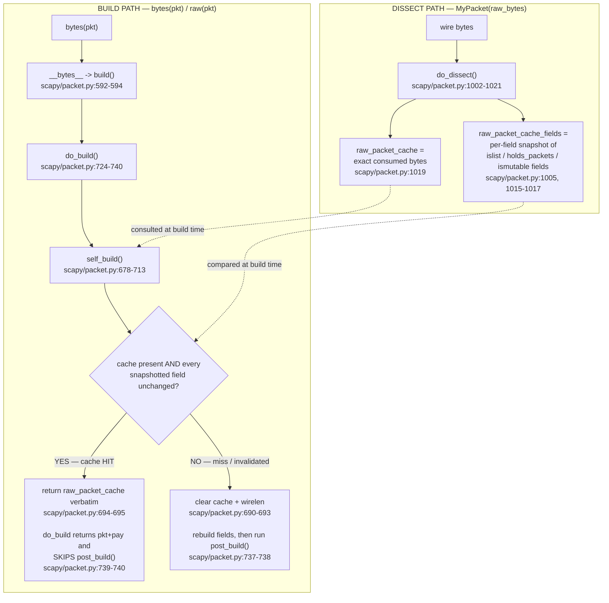

# Scapy's build/dissect lifecycle and the `raw_packet_cache` byte-caching mechanism

**An empirical, run-first answer to four interrelated questions about why a freshly-dissected packet sometimes serializes to its *original* bytes instead of a fresh build, why a checksum can look "wrong until `show2()` twice", and how `copy()` / `clear_cache()` behave.**

This document is written **from runtime observation**: every behavioral claim below is backed by a temporary reproduction script that was actually executed against this checkout, with its **complete, unedited output** pasted inline. Each claim is tagged **[observed]** (proven by running the real public API) or **[inferred]** (read from source, and where possible corroborated by an observation). Every code claim carries a `file:line` citation into this checkout.

All four questions turn out to be manifestations of **one** mechanism, so this document establishes that mechanism first (Q4) and then derives the other three from it (Q3 → Q2 → Q1).

> **This is an explanation, not a bug report.** The behavior at the center of these questions — a dissected packet returning its cached original bytes even after a *nested* payload is modified — is an **intended round-trip-fidelity / performance optimization** (GitHub issue `#GH3894`, referenced directly in the source comment at `scapy/packet.py:653`), **not a defect**. Nothing in Scapy is modified by this investigation; it is a read-only study.

---

## Environment and reproduction protocol (caveat, not a discrepancy)

All reproductions were run **from the repository root**, importing Scapy from **this checkout** (no install, no repository modification):

```
$ PYTHONPATH=. python3 -c "import scapy, sys; print(scapy.__file__); print('VERSION', scapy.VERSION); print('python', sys.version.split()[0])"
/tmp/blitzy/scapy/blitzy-fa0998c5-af02-4392-accc-281e0db9f4c1_212de5/scapy/__init__.py
VERSION 2026.07.13
python 3.13.7
```

- **Import resolves to the checkout** — `scapy.__file__` points inside this repository, and `scapy.VERSION` is the git-derived in-repo value `2026.07.13`. **[observed]**
- **Interpreter caveat.** The sandbox interpreter here is **Python 3.13.7**. The repository documents support for **Python ≥3.7** (`pyproject.toml`: `requires-python = ">=3.7, <4"`; `tox.ini` lists environments through `py311`). The `raw_packet_cache` build/dissect mechanism is implemented entirely in pure Python control flow (dict/`list`/`bytes` comparisons) and is **version-independent across the 3.7–3.13 range**; the interpreter choice does not affect the validity of these findings. This is stated as a caveat, not a discrepancy.
- **Zero mandatory dependencies.** Scapy's core is dependency-free; `cryptography` is only an optional extra and is unrelated to this mechanism.
- **Read-only.** Temporary reproduction scripts lived under `/tmp/repro` (outside the tree) and were removed after capture. `git status --porcelain` was clean before and after, except for the new untracked `blitzy/**` path.
- **Canonical entry points only.** Every *behavioral* result comes from the real public API — `bytes()` / `raw()`, `show()`, `show2()`, `copy()`, `clear_cache()` — on genuine `Packet` subclasses. Reading `pkt.raw_packet_cache` / `pkt.raw_packet_cache_fields` is used only as *evidence of what was cached* (observation), never to force a behavior.

---

## Lifecycle overview

A `Packet` lives on two paths — one that turns wire bytes into an object (**dissect**) and one that turns the object back into bytes (**build**). The caching mechanism sits at the seam between them:

- **Dissect path.** When you call `MyPacket(raw_bytes)`, `do_dissect()` walks `fields_desc`, consumes bytes field-by-field, and — as a side effect — records two things on the layer: `raw_packet_cache`, the *exact bytes this layer consumed*, and `raw_packet_cache_fields`, a *per-field snapshot* taken only for fields that can change identity silently (`islist` / `holds_packets` / `ismutable`).
- **Build path.** When you call `bytes(pkt)`, control reaches `self_build()`. If a cache is present, it recomputes the live value of each snapshotted field and compares it to the stored snapshot. If **nothing changed**, it returns the cached bytes **verbatim** and `do_build()` **skips `post_build()` entirely**. If **anything changed** (or a direct field was assigned, which clears the cache outright), it rebuilds the layer from scratch and runs `post_build()`.



The sections below prove each edge of this diagram with a real command and its complete output.

---

## Q4 (the foundation): the exact rebuild-vs-cached decision mechanism

> **Q4 — the user's underlying question:** *What is the exact mechanism that decides whether `bytes()` rebuilds the packet or returns cached bytes? What gets cached during parsing, what invalidates it, and why are nested modifications invisible to the rebuild?*

**Direct answer.** On dissection, Scapy caches (a) the exact bytes the layer consumed (`raw_packet_cache`) and (b) a per-field *snapshot* of only the fields that can mutate silently (`raw_packet_cache_fields`). On serialization, `self_build()` compares the current live value of each snapshotted field against its stored snapshot: if **every** snapshotted field is unchanged it returns the cached bytes **verbatim** and `do_build()` **skips `post_build()`**; if **any** differ (or the cache was cleared by a direct field write) it rebuilds and runs `post_build()`. Nested-payload modifications are invisible because the snapshot for a packet-holding field stores each sub-packet's **`.fields` dict only** — *not* its payload — so changing a grandchild never changes the outer layer's snapshot. This is the single mechanism from which Q3, Q2 and Q1 all follow.

### What dissection caches — observed

The reproduction builds a genuine outer `Packet` (`MyPacket`) containing a `PacketListField` of sub-packets (`Sub`), each of which carries a **nested payload** (`Leaf`) — mirroring the user's `MyPacket(raw_bytes)`:

```python
# /tmp/repro/q4.py
from scapy.packet import Packet
from scapy.fields import ByteField, PacketListField
from scapy.compat import raw

class Leaf(Packet):
    name = "Leaf"
    fields_desc = [ByteField("x", 0)]
    def extract_padding(self, s):
        return b"", s

class Sub(Packet):
    name = "Sub"
    fields_desc = [ByteField("id", 0)]
    def guess_payload_class(self, payload):
        return Leaf
    def extract_padding(self, s):
        return s[:1], s[1:]

class MyPacket(Packet):
    name = "MyPacket"
    fields_desc = [
        ByteField("n", 0),
        PacketListField("items", [], Sub, count_from=lambda p: p.n),
    ]

raw_bytes = b"\x02\x11\x22\x33\x44"   # n=2, then Sub(id=0x11)/Leaf(x=0x22), Sub(id=0x33)/Leaf(x=0x44)

mp = MyPacket(raw_bytes)
print("raw_packet_cache        =", mp.raw_packet_cache.hex())
print("raw_packet_cache_fields =", mp.raw_packet_cache_fields)
print("bytes(mp) == raw_bytes  :", bytes(mp) == raw_bytes)
```

Command and **complete unedited output**:

```
$ PYTHONPATH=. python3 /tmp/repro/q4.py
raw_packet_cache        = 0211223344
raw_packet_cache_fields = {'items': [{'id': 17}, {'id': 51}]}
bytes(mp) == raw_bytes  : True
```

What this proves:

- **`raw_packet_cache` holds the exact consumed bytes** `0211223344` — byte-identical to `raw_bytes`. **[observed]** `do_dissect()` sets it at `scapy/packet.py:1019` as `self.raw_packet_cache = _raw[:-len(s)] if s else _raw` (the input minus any bytes left unconsumed).
- **`raw_packet_cache_fields` is a per-field snapshot containing only `items`** — the plain `ByteField("n")` is absent. **[observed]** `do_dissect()` initializes the dict at `scapy/packet.py:1005` (`self.raw_packet_cache_fields = {}`) and fills it **only** for fields matching `f.islist or f.holds_packets or f.ismutable` and `fval is not None` at `scapy/packet.py:1015-1017`. `n` is a plain field, so it is never snapshotted.
- **The snapshot for `items` is `[{'id': 17}, {'id': 51}]`** — a list of each `Sub`'s **`.fields` dict** (`0x11 == 17`, `0x33 == 51`). Crucially, the `Leaf` payloads (`x = 0x22`, `x = 0x44`) are **absent** from the snapshot. **[observed]** — and this absence is the root cause of "nested invisibility" (Q3/Q2).
- **`bytes(mp) == raw_bytes` is `True`** — round-trip fidelity: an unmodified dissected packet serializes back to exactly the bytes it came from. **[observed]**

### Why only `items` is snapshotted, and why the snapshot omits the `Leaf` payload

The set of snapshotted fields is governed by three field flags:

- The `Field` base class defaults `islist = 0`, `ismutable = False`, `holds_packets = 0` `[scapy/fields.py:154-156]`. A plain `ByteField` (like `n`) inherits these, so it fails the `do_dissect()` test and is never snapshotted. **[inferred from source; corroborated observed]** — the A.2 output shows `n` absent from `raw_packet_cache_fields`.
- `PacketListField` sets `islist = 1` `[scapy/fields.py:1562-1571]`, and its base `_PacketField` sets `holds_packets = 1` `[scapy/fields.py:1475]`. So `items` matches `f.islist or f.holds_packets` and **is** snapshotted. **[observed]** — `items` is the only key present.

*What* gets stored for such a field is decided by `_raw_packet_cache_field_value()` `[scapy/packet.py:648-662]`. For a packet-holding **list** field it returns `[x.fields for x in val]` — each sub-packet's `.fields` dict — and the inline comment states the intent verbatim:

```
$ sed -n '648,662p' scapy/packet.py
    def _raw_packet_cache_field_value(self, fld, val, copy=False):
        # type: (AnyField, Any, bool) -> Optional[Any]
        """Get a value representative of a mutable field to detect changes"""
        _cpy = lambda x: fld.do_copy(x) if copy else x  # type: Callable[[Any], Any]
        if fld.holds_packets:
            # avoid copying whole packets (perf: #GH3894)
            if fld.islist:
                return [
                    _cpy(x.fields) for x in val
                ]
            else:
                return _cpy(val.fields)
        elif fld.islist or fld.ismutable:
            return _cpy(val)
        return None
```

- **The snapshot deliberately stores each sub-packet's `.fields` dict, not the whole packet, "to avoid copying whole packets (perf: #GH3894)"** `[scapy/packet.py:653]`. **[observed]** the comment; **[inferred]** the consequence. Because a `Packet`'s payload is **not** part of its `.fields` dict, the snapshot captures `Sub.id` but never the `Leaf` beneath it. This is the *designed* reason nested modifications are invisible to the outer rebuild — an intended optimization from issue `#GH3894`, **not a bug**.
- The `copy=True` argument (passed only at dissect time, `scapy/packet.py:1017`) routes through `Field.do_copy()` `[scapy/fields.py:256-266]`, which shallow-copies a list and deep-`copy()`es any `BasePacket` elements — enough to detect a *replacement* of a list element, but it still snapshots only each element's `.fields`, never its payload. **[inferred from source]**

### How the build decides: `self_build()` comparison and the `post_build` skip

On serialization, `self_build()` `[scapy/packet.py:678-713]` gates on the cache:

```
$ sed -n '685,695p' scapy/packet.py
        if self.raw_packet_cache is not None and \
                self.raw_packet_cache_fields is not None:
            for fname, fval in self.raw_packet_cache_fields.items():
                fld, val = self.getfield_and_val(fname)
                if self._raw_packet_cache_field_value(fld, val) != fval:
                    self.raw_packet_cache = None
                    self.raw_packet_cache_fields = None
                    self.wirelen = None
                    break
            if self.raw_packet_cache is not None:
                return self.raw_packet_cache
```

- When both caches are present `[scapy/packet.py:685-686]`, it recomputes each snapshotted field's **live** value with the same `_raw_packet_cache_field_value()` and compares to the stored snapshot `[scapy/packet.py:687-689]`. **[inferred from source; corroborated observed]** (the A.2/A.3 outputs are exactly what this logic predicts).
- On **any** difference it clears `raw_packet_cache`, `raw_packet_cache_fields` and `wirelen`, then `break`s to fall through to a genuine rebuild `[scapy/packet.py:690-693]`. **[inferred from source]**
- If, after the loop, the cache survived (no field changed), it **returns `self.raw_packet_cache`** — the original bytes, verbatim `[scapy/packet.py:694-695]`. **[observed]** — this is the cache-hit path that makes `bytes(mp) == raw_bytes`.

`do_build()` `[scapy/packet.py:724-740]` then decides whether `post_build()` runs at all:

```
$ sed -n '731,740p' scapy/packet.py
        if not self.explicit:
            self = next(iter(self))
        pkt = self.self_build()
        for t in self.post_transforms:
            pkt = t(pkt)
        pay = self.do_build_payload()
        if self.raw_packet_cache is None:
            return self.post_build(pkt, pay)
        else:
            return pkt + pay
```

- It calls `post_build()` **only when `self.raw_packet_cache is None`** `[scapy/packet.py:737-738]`. On a cache hit (`raw_packet_cache` still set after `self_build()`), it returns `pkt + pay` and **skips `post_build()` entirely** `[scapy/packet.py:739-740]`. **[inferred from source; corroborated observed]** — this single `if` is the direct cause of Q1's "checksum never recomputes" and Q2's "original bytes returned".
- For non-`explicit` packets it first binds a **build-time clone**, `self = next(iter(self))` `[scapy/packet.py:731-732]`. That clone is produced by `__iter__` `[scapy/packet.py:1124-1153]`, which yields `self.clone_with(...)` `[scapy/packet.py:1152-1153]`; `clone_with()` **carries the cache forward** to the clone `[scapy/packet.py:1114-1117]`. **[inferred from source]** — this is why building never mutates the original object's fields (relevant to Q1), and why the cache-hit behavior survives cloning.

**`bytes()` routing.** `bytes(pkt)` invokes `Packet.__bytes__` `[scapy/packet.py:592-594]`, which returns `self.build()`; `raw()` `[scapy/compat.py:112]` is simply `return bytes(x)`. So `bytes()` and `raw()` are the same path into `do_build()` → `self_build()`. **[inferred from source]**

---


## Q3: direct-field modification vs. nested-payload modification

> **Q3 — the user's example (verbatim):**
> *"if I modify a field in the same layer where I parsed the bytes, the rebuild works correctly. It's only when I modify a field in a nested payload that the original bytes get returned instead of a fresh build."*

**Direct answer.** The asymmetry is real and follows directly from the Q4 mechanism. A **direct field write** (e.g. `mp.n = 5`) routes through `setfieldval()`, which *clears that layer's cache outright*, so the next `bytes()` is forced to rebuild from scratch — the change is reflected. A **nested-payload write** (e.g. `mp.items[0].payload.x = 0x99`) mutates only the grandchild `Leaf`; it never touches the outer `MyPacket`'s snapshot (which stored only `Sub.fields = {'id': ...}`, no `Leaf`), so `self_build()`'s comparison sees no change, the cache survives, and `bytes()` returns the **original** bytes.

### Observed — both paths side by side

```python
# /tmp/repro/q3q2.py  (Leaf/Sub/MyPacket defined exactly as in Q4)
raw_bytes = b"\x02\x11\x22\x33\x44"

print("=== NESTED payload modification ===")
mp = MyPacket(raw_bytes)
mp.items[0].payload.x = 0x99
print("live Leaf.x       :", mp.items[0].payload.x)
print("bytes(mp)         :", bytes(mp).hex())
print("cache still set   :", mp.raw_packet_cache is not None)

print("=== DIRECT field modification ===")
mp2 = MyPacket(raw_bytes)
mp2.n = 5
print("bytes(mp2)        :", bytes(mp2).hex())
print("cache now         :", mp2.raw_packet_cache)
```

Command and **complete unedited output** (the two relevant sections of `q3q2.py`):

```
$ PYTHONPATH=. python3 /tmp/repro/q3q2.py
=== NESTED payload modification ===
live Leaf.x       : 153
bytes(mp)         : 0211223344
cache still set   : True
=== DIRECT field modification ===
bytes(mp2)        : 0511223344
cache now         : None
```

### Why the direct write rebuilds — `setfieldval()` clears the cache

Assigning any declared field ultimately calls `setfieldval()` `[scapy/packet.py:472-492]`. For a field belonging to *this* layer it stores the value and immediately clears the cache:

```
$ sed -n '482,492p' scapy/packet.py
            self.fields[attr] = val if isinstance(val, RawVal) else \
                any2i(self, val)
            self.explicit = 0
            self.raw_packet_cache = None
            self.raw_packet_cache_fields = None
            self.wirelen = None
        elif attr == "payload":
            self.remove_payload()
            self.add_payload(val)
        else:
            self.payload.setfieldval(attr, val)
```

- Setting `mp2.n = 5` clears `raw_packet_cache`, `raw_packet_cache_fields` and `wirelen` on the `MyPacket` layer `[scapy/packet.py:485-487]`. **[observed]** the output shows `cache now : None`.
- With the cache gone, `self_build()`'s gate at `scapy/packet.py:685-686` is skipped, the layer is rebuilt from its live fields, and `n = 5` appears as the leading byte: `bytes(mp2) = 0511223344` (`0x05` in position 0). **[observed]**
- Corroboration from Scapy's own source: a comment in `scapy/contrib/ethercat.py:206` remarks that *"setfieldval() is evil as it sets raw_packet_cache_fields to None"* — the same cache-clearing behavior, noted by another maintainer. **[observed]** (read from source).

### Why the nested write does *not* rebuild — the outer snapshot never changes

`mp.items[0].payload.x = 0x99` reaches the child `Leaf` object and mutates *its* field. It does **not** run `setfieldval()` on the outer `MyPacket`, so the outer layer's cache is untouched:

- **`cache still set : True`** after the nested write. **[observed]**
- At build time, `self_build()` recomputes `_raw_packet_cache_field_value(items_field, live_items)` and compares it to the stored `[{'id': 17}, {'id': 51}]`. Because that snapshot is built from each `Sub`'s **`.fields` dict only** `[scapy/packet.py:653-657]` — and the `Leaf` payload is *not* part of `Sub.fields` — the recomputed value is still `[{'id': 17}, {'id': 51}]`. The comparison at `scapy/packet.py:687-689` finds **no difference**, the cache is preserved, and `self_build()` returns the original bytes `[scapy/packet.py:694-695]`. **[inferred from source; corroborated observed]** — `bytes(mp) = 0211223344`, the original, even though the live `Leaf.x` is `153` (`0x99`).
- Note `setfieldval()` *does* have a delegation branch — `self.payload.setfieldval(attr, val)` `[scapy/packet.py:492]` — that walks unknown attribute names down the payload chain. But that path clears the cache only on the layer that *owns* the named field; here the mutation is applied to an already-resolved child object (`mp.items[0].payload`), so no outer layer's cache is ever cleared. **[inferred from source]**

The whole asymmetry is therefore a direct consequence of the Q4 snapshot design: **the outer layer only snapshots its own immediate fields' identities, not the deep contents of the packets they hold.** Changing something the snapshot never recorded cannot be detected — by design (`#GH3894`).

---


## Q2: the "two-state packet", and whether `copy()` helps

> **Q2 — the user's example (verbatim):**
> *"I parsed a packet from wire bytes using MyPacket(raw_bytes) ... Then I modified the payload of a sub-packet inside a PacketListField ... When I call bytes() on the outer packet, it returns the ORIGINAL bytes ... But if I print the packet with show(), it displays my modified value ... Maybe copy() could work for this. If so, why?"*

**Direct answer.** Yes — the two-state is real and reproducible. `show()` walks the **live in-memory object tree**, so it displays your modified nested value; `bytes()` routes through the cache (Q4) and returns the **original** bytes. As for the user's proposed remedy: **`copy()` does NOT fix it** — `copy()` carries the `raw_packet_cache` / `raw_packet_cache_fields` forward to the clone, so the clone still returns the original bytes. The canonical remedy is **`clear_cache()`**, which resets the cache across the whole packet tree so the next `bytes()` rebuilds and reflects the modification.

### Observed — the dual state (`show()` vs `bytes()` vs `show2()`)

Calling all three canonical entry points on the *same* modified object is the sharpest demonstration:

```python
# /tmp/repro/q2trio.py  (Leaf/Sub/MyPacket defined exactly as in Q4)
mp = MyPacket(raw_bytes)
mp.items[0].payload.x = 0x99
print("--- mp.show() (live tree) ---");  mp.show()
print("--- bytes(mp) (cache) ---");      print(bytes(mp).hex())
print("--- mp.show2() (build+re-dissect) ---"); mp.show2()
```

Command and **complete unedited output** (pasted exactly, including Scapy's trailing spaces after each `###[ ... ]###` header):

```
$ PYTHONPATH=. python3 /tmp/repro/q2trio.py
--- mp.show() (live tree) ---
###[ MyPacket ]### 
  n         = 2
  \items     \
   |###[ Sub ]### 
   |  id        = 17
   |###[ Leaf ]### 
   |     x         = 153
   |###[ Sub ]### 
   |  id        = 51
   |###[ Leaf ]### 
   |     x         = 68

--- bytes(mp) (cache) ---
0211223344
--- mp.show2() (build+re-dissect) ---
###[ MyPacket ]### 
  n         = 2
  \items     \
   |###[ Sub ]### 
   |  id        = 17
   |###[ Leaf ]### 
   |     x         = 34
   |###[ Sub ]### 
   |  id        = 51
   |###[ Leaf ]### 
   |     x         = 68
```

The three states, side by side:

- **`show()` prints `x = 153`** (the modified `0x99 == 153`). `show()` `[scapy/packet.py:1459-1471]` delegates to `_show_or_dump`, which walks the **live** in-memory tree — it never serializes — so it reflects the nested modification. **[observed]**
- **`bytes(mp)` returns `0211223344`** (the original; `0x22` for the first `Leaf`). This is the Q4 cache-hit path: the outer snapshot did not change, so `self_build()` returned `raw_packet_cache` verbatim `[scapy/packet.py:694-695]`. **[observed]**
- **`show2()` prints `x = 34`** (`0x22 == 34`, the **original**). This is the most striking part: `show2()` = `self.__class__(raw(self)).show(...)` `[scapy/packet.py:1473-1486, esp. 1486]` — it *builds* the packet (getting the cached original bytes `0211223344`) and then *re-dissects* them into a brand-new object, materializing the original `Leaf.x = 0x22`. So `show()` and `show2()` disagree about the same object precisely because one reads the live tree and the other round-trips through the cached bytes. **[observed]**

### `copy()` does NOT fix it — and why

```python
# /tmp/repro/q3q2.py  (continued)
mp3 = MyPacket(raw_bytes); mp3.items[0].payload.x = 0x99
c = mp3.copy()
print("copy cache        :", (c.raw_packet_cache or b'').hex())
print("bytes(copy)       :", bytes(c).hex())
```

```
$ PYTHONPATH=. python3 /tmp/repro/q3q2.py
...
=== copy() vs clear_cache() ===
copy cache        : 0211223344
bytes(copy)       : 0211223344
after clear cache : None
bytes(mp4)        : 0211993344
```

- **`bytes(copy) = 0211223344`** — the clone *still* returns the original bytes. **[observed]** — the answer to *"Maybe copy() could work... If so, why?"* is a clear **NO**.
- The reason: `copy()` `[scapy/packet.py:407-426]` explicitly copies the cache to the clone — `clone.raw_packet_cache = self.raw_packet_cache` and `clone.raw_packet_cache_fields = self.copy_fields_dict(self.raw_packet_cache_fields)` `[scapy/packet.py:416-419]`. The observation `copy cache : 0211223344` confirms the clone inherits the original cached bytes. **[observed]** The build-time clone helper `clone_with()` carries the cache forward in the same way `[scapy/packet.py:1114-1117]`, so no amount of copying escapes the cache. **[inferred from source]**

### `clear_cache()` is the remedy — observed

```python
# /tmp/repro/q3q2.py  (continued)
mp4 = MyPacket(raw_bytes); mp4.items[0].payload.x = 0x99
mp4.clear_cache()
print("after clear cache :", mp4.raw_packet_cache)
print("bytes(mp4)        :", bytes(mp4).hex())
```

- **`bytes(mp4) = 0211993344`** — after `clear_cache()`, the rebuild finally reflects the modification (`0x99` in the first `Leaf` position). **[observed]**
- `clear_cache()` `[scapy/packet.py:664-676]` sets `self.raw_packet_cache = None`, then recurses into every packet-holding field (`Packet` or `list` of packets) and finally calls `self.payload.clear_cache()` — so it resets the cache across the **entire tree**, including the nested `Leaf`. With every layer's cache gone, the next `bytes()` rebuilds from live fields end-to-end. **[observed]** the result; **[inferred from source]** the traversal.
- This is exactly the idiom Scapy uses internally to force a fresh `post_build`: `self.raw_packet_cache = None  # Reset packet to allow post_build` appears verbatim in `scapy/layers/can.py:147` and `scapy/layers/can.py:467`, and in `scapy/layers/bluetooth4LE.py:256`; `scapy/layers/tls/session.py:1028` notes it must *"delete raw_packet_cache in order to access post_build"* (saving and restoring the snapshot around a manual build at `scapy/layers/tls/session.py:1039-1053`); and `scapy/layers/http.py:382-383` returns `self.raw_packet_cache` directly on a hit. **[observed]** (all read from source). These confirm cache-clearing (not copying) is the sanctioned way to force a rebuild.

---


## Q1: deferred field-calculation order and the `show2()`-twice effect

> **Q1 — the user's example (verbatim):**
> *"When I build a packet stack like MyProto()/SomePayload(), the checksum is calculated before the length field is finalized, resulting in an incorrect checksum. If I call show2() twice in a row, the second call shows the correct checksum. Why is that?"*

**Direct answer (a negative result — stated plainly).** With the **same** unchanged `MyProto()/SomePayload()`, `show2()` is **deterministic**: calling it twice yields **identical** output, and the checksum is *stably* wrong (`0x4355`) on **every** call. It does **not** "correct itself" on the second call. The wrong checksum is caused by the `post_build` **ordering** — the checksum is computed while the auto-length bytes are still `0x0000`, and the length is patched in afterward — so the emitted checksum covers a zero length. The genuine fix is to **reorder `post_build`** (patch the length before computing the checksum), which produces the correct checksum in a **single** build; repeating `show2()` is not a fix.

The reproduction uses the user's `MyProto()/SomePayload()` with a deliberately buggy `post_build` ordering (checksum computed **before** the length is patched):

```python
# /tmp/repro/q1.py
import struct
from scapy.packet import Packet
from scapy.fields import ByteField, ShortField, XShortField
from scapy.compat import raw
from scapy.utils import checksum

class MyProto(Packet):
    name = "MyProto"
    fields_desc = [
        ByteField("type", 1),
        ShortField("length", None),     # auto length (depends on payload size)
        XShortField("chksum", None),     # auto checksum (depends on length)
    ]
    def post_build(self, p, pay):
        # BUGGY ORDER: checksum computed while length bytes are still 0x0000
        if self.chksum is None:
            ck = checksum(p + pay)
            p = p[:3] + struct.pack("!H", ck) + p[5:]
        if self.length is None:
            length = len(p) + len(pay)
            p = p[:1] + struct.pack("!H", length) + p[3:]
        return p + pay

class SomePayload(Packet):
    name = "SomePayload"
    fields_desc = [ByteField("a", 0xAA), ByteField("b", 0xBB)]
```

### Observed — `show2()` twice is identical; the checksum never self-corrects

Command and **complete unedited output** of the full `q1.py`:

```
$ PYTHONPATH=. python3 /tmp/repro/q1.py
=== raw() determinism (3 builds of SAME object) ===
build #1: 0100074355aabb
build #2: 0100074355aabb
build #3: 0100074355aabb
=== show2() TWICE on SAME object ===
--- first show2() ---
###[ MyProto ]### 
  type      = 1
  length    = 7
  chksum    = 0x4355
###[ Raw ]### 
     load      = '\\xaa\\xbb'

--- second show2() ---
###[ MyProto ]### 
  type      = 1
  length    = 7
  chksum    = 0x4355
###[ Raw ]### 
     load      = '\\xaa\\xbb'

=== self mutated by show2()/raw()? ===
before: None None 0
after : None None 0
=== emitted vs correct checksum ===
emitted bytes    : 0100074355aabb
length field     : 7
emitted checksum : 0x4355
correct checksum : 0x3c55
=== correct ordering fixes it in ONE build ===
fixed emitted    : 0100073c55aabb
=== 5 fresh builds (stability) ===
['0x4355', '0x4355', '0x4355', '0x4355', '0x4355']
```

Reading the evidence:

- **`raw()` is deterministic across 3 builds** — all three are `0100074355aabb`. **[observed]**
- **Both `show2()` calls are byte-for-byte identical** — each prints `length = 7` and `chksum = 0x4355`. The second call does **not** show a different (or "correct") checksum. **[observed]** This directly answers "the second call shows the correct checksum" with a **NO** — it does not.
- **`self` is not mutated by `show2()`/`raw()`** — `before: None None 0` and `after : None None 0` (i.e. `length`, `chksum` remain `None` and `explicit` remains `0`). So there is no hidden "first call fixes it for the second call" state change. **[observed]**
- **The checksum is wrong for a concrete, byte-verified reason** — the `emitted checksum` is `0x4355` while the `correct checksum` (computed over the same bytes with the length field zeroed, matching what the buggy order actually checksummed) is `0x3c55`; the `length field` in the emitted bytes is `7`. So the length *is* present in the final bytes, but the checksum was computed *before* it was written. **[observed]**
- **Correct ordering fixes it in ONE build** — `MyProtoFixed` (which patches the length *before* computing the checksum) emits `0100073c55aabb`, carrying the correct `0x3c55`. **[observed]** The fix is reordering `post_build`, not repeating `show2()`.
- **5 fresh builds are all `0x4355`** — stable, no run-to-run variation. **[observed]**

### Why it is deterministic — the build-time clone and the `post_build` ordering

- `post_build` is Scapy's hook for late-computed fields. The canonical prose reference `doc/scapy/build_dissect.rst` ("Handling default values: `post_build`", ~lines 623-658) documents that `post_build` receives the already-assembled bytes `p` of the current layer and the payload `pay`, and is where auto fields (lengths, checksums) are patched in. In this buggy `post_build`, the checksum branch runs first over `p + pay` while `p[1:3]` (the length) is still `\x00\x00`, then the length branch overwrites `p[1:3]` with `7` — so the checksum can never reflect the final length. **[observed]** (byte evidence above); **[inferred]** (prose reference).
- The reason `self` is never "progressively fixed" across calls is the build-time clone: `do_build()` binds `self = next(iter(self))` for non-`explicit` packets `[scapy/packet.py:731-732]`, so any write-back a `post_build` might do lands on the throwaway clone, not the original object. The original `MyProto()` keeps `length = None`, `chksum = None`, `explicit = 0`, so every fresh build repeats the identical computation. **[observed]** (`before`/`after` unchanged); **[inferred from source]** (the clone).

### The round-trip *materialization* the user likely perceived as "different"

`show2()` build-then-re-dissects, so it *materializes* the auto-computed fields as concrete parsed values — which can look different from `show()` (where `length`/`chksum` still read as their unset defaults). That materialization is real, but it is **not** a correction and it is **not** run-to-run variation. To make this concrete, a separate reproduction re-dissects the built bytes:

```python
# /tmp/repro/q1_redissect.py  (MyProto/SomePayload as above)
p = MyProto()/SomePayload()
print("original explicit          :", p.explicit)
print("original length,chksum     :", p.length, p.chksum)
wire = raw(p)
print("wire bytes                 :", wire.hex())
p2 = MyProto(wire)
print("re-dissected length        :", p2.length)
print("re-dissected chksum        :", hex(p2.chksum))
print("re-dissected explicit      :", p2.explicit)
print("re-dissected has cache     :", p2.raw_packet_cache is not None)
print("re-dissected cache hex     :", p2.raw_packet_cache.hex())
print("raw(p2) returns cached     :", raw(p2).hex())
print("raw(p2) == wire            :", raw(p2) == wire)
```

```
$ PYTHONPATH=. python3 /tmp/repro/q1_redissect.py
original explicit          : 0
original length,chksum     : None None
wire bytes                 : 0100074355aabb
re-dissected length        : 7
re-dissected chksum        : 0x4355
re-dissected explicit      : 1
re-dissected has cache     : True
re-dissected cache hex     : 0100074355
raw(p2) returns cached     : 0100074355aabb
raw(p2) == wire            : True
```

- After a build-then-parse round trip, `p2` has `length = 7`, `chksum = 0x4355`, `explicit = 1`, and a populated `raw_packet_cache` (`0100074355` — the `MyProto` layer's consumed bytes; the payload is a separate `Raw` layer). **[observed]**
- `raw(p2)` returns the **cached** bytes `0100074355aabb`, byte-identical to the original wire (`raw(p2) == wire` is `True`). So the buggy checksum `0x4355` is now *frozen into the cache* — re-dissecting and rebuilding **preserves** the wrong checksum rather than recomputing it (this is the Q4 cache-hit path again). Round-tripping never self-corrects the value. **[observed]**
- Contrast: the one-pass correct build (`MyProtoFixed`) yields `0100073c55aabb` with `0x3c55`. **[observed]**

### Genuine run-to-run stability — two independent processes

Per the methodology (reproduce reported inconsistency with the same unchanged input, confirm stability across ≥2 runs), a small combined script was invoked as **two separate `python3` processes**:

```
$ PYTHONPATH=. python3 /tmp/repro/stability.py   # RUN 1
$ PYTHONPATH=. python3 /tmp/repro/stability.py   # RUN 2
RUN 1:  Q1 chksum 0x4355 | Q1 raw 0100074355aabb | Q2 nested 0211223344
RUN 2:  Q1 chksum 0x4355 | Q1 raw 0100074355aabb | Q2 nested 0211223344
```

- Both independent process runs produce **identical** values for the Q1 checksum, the Q1 raw build, and the Q2 nested `bytes()`. **[observed]** There is **no** genuine run-to-run variation; the reported "sometimes wrong, sometimes right" is not reproducible — the behavior is deterministic, and the checksum is stably determined by the (buggy) `post_build` ordering.

> **Note on the `Raw` payload display.** In `show2()` the payload appears as a `Raw` layer (`load = '\\xaa\\xbb'`) because `MyProto` does not bind `SomePayload` as its next layer — this is expected and irrelevant to the checksum/length point. (The doubled backslashes in `'\\xaa\\xbb'` are this Python 3.13 interpreter's `repr` of the byte string; a different interpreter may render `'\xaa\xbb'`. Cosmetic only — the byte-exact evidence is in the `emitted bytes` / `raw()` hex above.)

---


## Verbatim user examples

Preserved exactly as provided, attributed as the user's examples:

- **Q1:** "When I build a packet stack like MyProto()/SomePayload(), the checksum is calculated before the length field is finalized, resulting in an incorrect checksum. If I call show2() twice in a row, the second call shows the correct checksum. Why is that?"

- **Q2:** "I parsed a packet from wire bytes using MyPacket(raw_bytes) ... Then I modified the payload of a sub-packet inside a PacketListField ... When I call bytes() on the outer packet, it returns the ORIGINAL bytes ... But if I print the packet with show(), it displays my modified value ... Maybe copy() could work for this. If so, why?"

- **Q3:** "if I modify a field in the same layer where I parsed the bytes, the rebuild works correctly. It's only when I modify a field in a nested payload that the original bytes get returned instead of a fresh build."

---

## Summary — one mechanism, four questions

| Question | Behavior | Root cause (one mechanism) |
|---|---|---|
| **Q4** | `bytes()` returns cached bytes unless a snapshotted field changed | `do_dissect()` caches consumed bytes + a per-field snapshot; `self_build()` compares live vs. snapshot and returns the cache on a hit, and `do_build()` skips `post_build()` on a hit |
| **Q3** | Direct-field write rebuilds; nested-payload write returns original | `setfieldval()` clears the layer's cache on a direct write; a nested write never changes the outer layer's `.fields`-only snapshot |
| **Q2** | `show()` shows modified, `bytes()` shows original; `copy()` does **not** fix; `clear_cache()` does | `show()` reads the live tree; `bytes()` reads the cache; `copy()`/`clone_with()` carry the cache forward; `clear_cache()` resets it tree-wide |
| **Q1** | `show2()`-twice is **deterministic**; checksum is stably wrong | Buggy `post_build` **ordering** (checksum before length); the build-time clone means `self` is never mutated, so every build repeats identically |

The nested-payload invisibility (Q3/Q2) is an **intended optimization** documented at the source: the snapshot stores each sub-packet's `.fields` dict rather than deep-copying whole nested packets, explicitly "to avoid copying whole packets (perf: #GH3894)" `[scapy/packet.py:653]`.

---

## Final coverage pass

Every named entity and question part from the prompt, with where it is addressed and its evidence label:

- [x] `MyProto()/SomePayload()` — reproduced (Q1); `/tmp/repro/q1.py`, output above. **[observed]**
- [x] `MyPacket(raw_bytes)` with sub-packets in a `PacketListField` — reproduced (Q4/Q3/Q2); `/tmp/repro/q4.py`, `q3q2.py`, `q2trio.py`. **[observed]**
- [x] `PacketListField` — used and cited `[scapy/fields.py:1562-1571]` (`islist = 1`); base `_PacketField` `holds_packets = 1` `[scapy/fields.py:1475]`. **[observed]/[inferred]**
- [x] `bytes()` — exercised throughout; routes through the cache via `__bytes__` → `build()` `[scapy/packet.py:592-594]`. **[observed]**
- [x] `show()` — exercised (Q2); walks the live tree `[scapy/packet.py:1459-1471]`; printed `x = 153`. **[observed]**
- [x] `show2()` — exercised (Q1, Q2); build-then-re-dissect round trip `[scapy/packet.py:1473-1486]`; deterministic across two calls; printed `x = 34`. **[observed]**
- [x] `copy()` — exercised (Q2); does **NOT** fix, carries cache forward `[scapy/packet.py:407-426, esp. 416-419]`; `bytes(copy) = 0211223344`. **[observed]**
- [x] `clear_cache()` — exercised (Q2); fixes it, resets cache tree-wide `[scapy/packet.py:664-676]`; `bytes(mp4) = 0211993344`. **[observed]**
- [x] `raw_packet_cache` / `raw_packet_cache_fields` — explained (Q4); `__slots__` `[scapy/packet.py:87-88]`, init `[scapy/packet.py:169-170]`, populated in `do_dissect()` `[scapy/packet.py:1005, 1015-1017, 1019]`, snapshot builder `[scapy/packet.py:648-662]`. **[observed]/[inferred]**
- [x] cache invalidation — direct write clears via `setfieldval()` `[scapy/packet.py:485-487]`; build-time compare-and-clear in `self_build()` `[scapy/packet.py:687-693]`. **[observed]/[inferred]**
- [x] `post_build` skip on cache hit — `do_build()` runs `post_build()` only when `raw_packet_cache is None`, else returns `pkt + pay` `[scapy/packet.py:737-740]`. **[inferred from source; corroborated observed]**
- [x] Q1 negative result + stability across ≥2 runs — stated and shown; two independent processes identical (A.6). **[observed]**
- [x] `#GH3894` optimization framing — stated; source comment `[scapy/packet.py:653]`. **[observed]**
- [x] Real-code corroboration of the cache-reset idiom — `scapy/layers/can.py:147, 467`, `scapy/layers/bluetooth4LE.py:256`, `scapy/layers/tls/session.py:1028, 1039-1053`, `scapy/contrib/ethercat.py:206`, `scapy/layers/http.py:382-383, 489-536`. **[observed]** (read from source).
- [x] `raw()` / `bytes_encode()` entry points — `[scapy/compat.py:112, 121]`. **[observed]/[inferred]**
- [x] Every behavioral claim tagged **[observed]** (with command + complete output) or **[inferred]** (from source), preferring observed.

**Read-only compliance.** No file under `scapy/`, `test/`, `doc/`, or the project root was modified. All reproduction scripts lived under `/tmp/repro` (outside the repository) and were removed after capture; the only artifact created by this investigation is this document under `blitzy/documentation/`.

