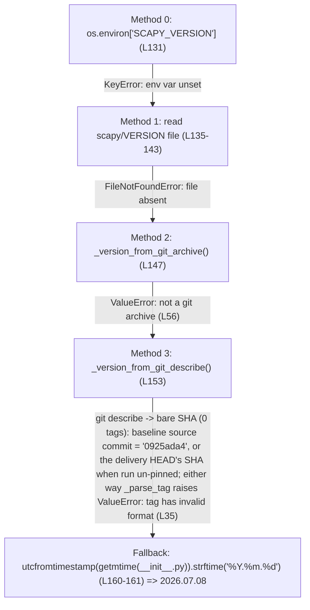

# Scapy Runtime Environment — New-Team-Member Q&A

This document answers five questions about **Scapy's runtime environment and behavior**, written for a new team member preparing to write code against the library. It follows a strict **run-first, evidence-grounded** methodology: every value below was obtained by **actually running Scapy's real entry point** (`python3 -m scapy`) in its default, canonical configuration, capturing the **verbatim output**, and then tracing that output back to the responsible code with a `file:line` citation.

Each question section has the same four-part shape: **(1)** a direct answer, **(2)** the verbatim observed output preceded by the exact command that produced it, **(3)** the `file:line` code citations, and **(4)** the causal reasoning plus every sibling/variant path (not just the happy path).

> **Method note.** All temporary observation scripts were created under `/tmp` (never inside the repository) and deleted afterward. The Scapy source tree is left **byte-for-byte unchanged** — the only new path is this documentation file under `blitzy/`. Values were confirmed **stable across ≥2 runs**; the three intentionally run-specific items (the version *digits*, the optional-extra INFO/WARNING lines, and the random banner quote) are explicitly called out where they appear.

---

## Context header (environment of record)

| Property | Observed value |
|----------|----------------|
| **Repository path** | `/tmp/blitzy/scapy/blitzy-d739fed8-298d-4380-ace7-4acedb1d7062_0057fd` |
| **Git branch (working checkout)** | `blitzy-d739fed8-298d-4380-ace7-4acedb1d7062` (this document is named after the **source branch** `scapy_0925ada48540`) |
| **Source commit under investigation** | `0925ada485406684174d6f068dbd85c4154657b3` — the Scapy code being documented; its short SHA `0925ada4` matches the source branch name `scapy_0925ada48540`. Every Scapy runtime fact below is reported against this source state. |
| **Delivery commit** | a descendant of the source commit that adds **only** this document; its SHA is assigned when the file is committed, so it is intentionally **not** hard-coded here. The Scapy source is byte-for-byte identical between the two commits (`git diff --stat 0925ada485406684174d6f068dbd85c4154657b3 -- scapy test doc` → empty). |
| **git status** | clean (`git status --porcelain` → empty) |
| **git tags** | **0** (no tags in this checkout — important for Q1) |
| **Python** | **3.13.7** at `/usr/bin/python3` |
| **OS** | Linux (no IPv6 support in kernel; not run as root) |
| **Optional extras** | `cryptography` **present**; `PyX` **absent**; `IPython` **absent** |
| **Canonical invocation** | `python3 -m scapy` (equivalently `./run_scapy`) |

Commands used to establish the header:

```
$ git rev-parse 0925ada485406684174d6f068dbd85c4154657b3
0925ada485406684174d6f068dbd85c4154657b3
$ git log --oneline -1 0925ada485406684174d6f068dbd85c4154657b3
0925ada4 Add AUTOSAR PDUTransport/PDU with initial batch of tests (#3933)
$ git tag | wc -l
0
$ python3 --version
Python 3.13.7
$ PYTHONPATH=. python3 -c "import scapy; print(scapy.__file__)"
/tmp/blitzy/scapy/blitzy-d739fed8-298d-4380-ace7-4acedb1d7062_0057fd/scapy/__init__.py
```

> **Source commit vs. delivery commit (reproducibility note).** The commands above pin explicitly to the **source commit** `0925ada485406684174d6f068dbd85c4154657b3` so they reproduce identically no matter what the working checkout's `HEAD` is. `HEAD` itself points at the *delivery* commit (a descendant that adds only this file), so a bare `git rev-parse HEAD` would return the delivery SHA, not the source SHA — which is exactly why every command here names the source commit rather than relying on `HEAD`.

Key facts that anchor every subsequent observation:

- **Scapy runs in-place from the source tree via `PYTHONPATH` — it is NOT pip-installed.** `scapy.__file__` resolves to `<repo>/scapy/__init__.py` (shown above). The launcher `run_scapy` does exactly this: its final line is `PYTHONPATH=$DIR exec "$PYTHON" -m scapy $@` (`run_scapy:L13`).
- The console entry point is declared as `scapy = "scapy.main:interact"` (`pyproject.toml:L47`); supported interpreters are `requires-python = ">=3.7, <4"` (`pyproject.toml:L17`); the tested interpreter matrix is in `tox.ini:L6`. Python 3.13.7 falls within the declared range.
- **Environment-specific vs. general.** Several reported results are host/environment-specific and are labeled as such where they appear: **(a)** the version *digits* (`2026.07.08`) are derived from a file modification time; **(b)** the socket classes are selected for **Linux**; and **(c)** the loaded-**module** count `len(conf.load_layers) = 49` is **Linux/BSD-specific**, because it includes a `tuntap` module appended only under `if LINUX or BSD:` (`scapy/arch/__init__.py:L148`–`L149`) — on a non-Linux/BSD host it would be **48**. Everything else generalizes across platforms: the verbosity default, the registered-**class** count `len(conf.layers) = 1319` (a function of *which modules are imported*, not of the OS), the packet structure, the theme name, and the code paths.

> **A note on the container vs. the AAP prose.** The task's planning prose referenced Python `3.12.3` and a version string `2026.07.07`. The **actual** container runs Python **3.13.7** and prints **`2026.07.08`**. Per the binding rule *"report what the system actually did,"* this document reports the **observed** values. The `2026.07.07` → `2026.07.08` drift is not an error — it is **positive proof** that the version is a file-mtime fallback (see Q1).

---

## Q1 — What is the welcome message and version information Scapy displays at startup?

### (1) Direct answer

Scapy prints a **two-column banner**: a **green ASCII-art logo** on the left beside a **blue info column** on the right whose lines read `Welcome to Scapy`, then `Version 2026.07.08`, then `https://github.com/secdev/scapy`, then `Have fun!`, then a **randomly-selected quote** (the captured run below drew *"We are in France, we say Skappee. OK? Merci." — Sébastien Chabal*; a different quote is chosen on each startup — see variant (c)). The banner (and the version string) are written to **stderr**, preceded by a few `INFO`/`WARNING` lines emitted by optional extras. The version is **not a real release number** — it is the **file-modification-time fallback** of `_version()`, because this checkout has no `SCAPY_VERSION`, no `VERSION` file, no git-archive metadata, and **no git tags**.

### (2) Verbatim observed output

**Command** (the banner is on **stderr**, so it is captured with `2>&1`; ANSI colors are stripped with `sed` for readability):

```
$ echo "exit()" | PYTHONPATH=. python3 -m scapy 2>&1 | sed 's/\x1b\[[0-9;]*m//g'
```

**Output** (complete and unedited; the quote on the last banner lines is randomly selected — this run drew the "Sébastien Chabal" quote):

```
INFO: Can't import PyX. Won't be able to use psdump() or pdfdump().
INFO: No IPv6 support in kernel
/tmp/blitzy/scapy/blitzy-d739fed8-298d-4380-ace7-4acedb1d7062_0057fd/scapy/layers/ipsec.py:573: CryptographyDeprecationWarning: TripleDES has been moved to cryptography.hazmat.decrepit.ciphers.algorithms.TripleDES and will be removed from this module in 48.0.0.
  cipher=algorithms.TripleDES,
/tmp/blitzy/scapy/blitzy-d739fed8-298d-4380-ace7-4acedb1d7062_0057fd/scapy/layers/ipsec.py:577: CryptographyDeprecationWarning: TripleDES has been moved to cryptography.hazmat.decrepit.ciphers.algorithms.TripleDES and will be removed from this module in 48.0.0.
  cipher=algorithms.TripleDES,
WARNING: IPython not available. Using standard Python shell instead.
AutoCompletion, History are disabled.
                                      
                     aSPY//YASa       
             apyyyyCY//////////YCa       |
            sY//////YSpcs  scpCY//Pp     | Welcome to Scapy
 ayp ayyyyyyySCP//Pp           syY//C    | Version 2026.07.08
 AYAsAYYYYYYYY///Ps              cY//S   |
         pCCCCY//p          cSSps y//Y   | https://github.com/secdev/scapy
         SPPPP///a          pP///AC//Y   |
              A//A            cyP////C   | Have fun!
              p///Ac            sC///a   |
              P////YCpc           A//A   | We are in France, we say Skappee.
       scccccp///pSP///p          p//Y   | OK? Merci.
      sY/////////y  caa           S//P   |             -- Sebastien Chabal
       cayCyayP//Ya              pY/Ya   |
        sY/PsY////YCc          aC//Yp 
         sc  sccaCY//PCypaapyCP//YSs  
                  spCPY//////YPSps    
                       ccaacs         
                                      
>>> now exiting InteractiveConsole...
```

**Raw ANSI colors** (same run, one logo/banner line shown with escape codes via `cat -v`, `^[` = `ESC`):

```
$ echo "exit()" | PYTHONPATH=. python3 -m scapy 2>&1 | grep -a "Welcome to Scapy" | cat -v
^[[32m^[[1m            sY//////YSpcs  scpCY//Pp  ^[[0m^[[34m^[[1m   | Welcome to Scapy^[[0m
```

So each **logo** line is wrapped in `ESC[32m` (green) + `ESC[1m` (bold) and each **info-column** line in `ESC[34m` (blue) + `ESC[1m` (bold), every span terminated by `ESC[0m`.

**Version derivation trace** — a fully self-contained command (no external file; paste it verbatim) that calls each `_version()` method directly to show which ones fail and why the fallback wins. `stderr` is sent to `/dev/null` only to hide an unrelated Python 3.13 `DeprecationWarning` about `utcfromtimestamp` (the same call Scapy itself makes at `scapy/__init__.py:L160`):

```
$ PYTHONPATH=. python3 - 2>/dev/null <<'PY'
import os, subprocess, datetime
import scapy

print("=== Observed VERSION / __version__ (from the real package) ===")
print("scapy.VERSION      =", scapy.VERSION)
print("scapy.__version__  =", scapy.__version__)

print("\n=== Method 0: SCAPY_VERSION env var (scapy/__init__.py:L131) ===")
print("'SCAPY_VERSION' in os.environ =", 'SCAPY_VERSION' in os.environ)

print("\n=== Method 1: scapy/VERSION file (scapy/__init__.py:L136) ===")
vf = os.path.join(os.path.dirname(scapy.__file__), 'VERSION')
print("VERSION file path =", vf)
print("exists =", os.path.exists(vf))

print("\n=== Method 2: _version_from_git_archive() (scapy/__init__.py:L38) ===")
try:
    scapy._version_from_git_archive()
except Exception as e:
    print("raised %s: %s" % (type(e).__name__, e))

print("\n=== Method 3: _version_from_git_describe() (scapy/__init__.py:L72) ===")
try:
    scapy._version_from_git_describe()
except Exception as e:
    print("raised %s: %s" % (type(e).__name__, e))

print("\n=== Inside Method 3: raw `git describe` on the BASELINE SOURCE commit 0925ada4 ===")
src = "0925ada485406684174d6f068dbd85c4154657b3"
out = subprocess.run(["git", "describe", "--tags", "--always", "--long", src],
                     capture_output=True, text=True)
print("cmd = git describe --tags --always --long %s" % src)
print("rc=%d stdout=%r stderr=%r" % (out.returncode, out.stdout.strip(), out.stderr.strip()))

print("\n=== _parse_tag on the bare SHA (should raise) ===")
try:
    scapy._parse_tag(out.stdout.strip())
except Exception as e:
    print("raised %s: %s" % (type(e).__name__, e))

print("\n=== Fallback: mtime of scapy/__init__.py (scapy/__init__.py:L160) ===")
m = os.path.getmtime(scapy.__file__)
print("os.path.getmtime =", m)
d = datetime.datetime.utcfromtimestamp(m)
print("utcfromtimestamp =", d)
print("strftime('%Y.%m.%d') =", d.strftime('%Y.%m.%d'))
PY
=== Observed VERSION / __version__ (from the real package) ===
scapy.VERSION      = 2026.07.08
scapy.__version__  = 2026.07.08

=== Method 0: SCAPY_VERSION env var (scapy/__init__.py:L131) ===
'SCAPY_VERSION' in os.environ = False

=== Method 1: scapy/VERSION file (scapy/__init__.py:L136) ===
VERSION file path = /tmp/blitzy/scapy/blitzy-d739fed8-298d-4380-ace7-4acedb1d7062_0057fd/scapy/VERSION
exists = False

=== Method 2: _version_from_git_archive() (scapy/__init__.py:L38) ===
raised ValueError: not a git archive

=== Method 3: _version_from_git_describe() (scapy/__init__.py:L72) ===
raised ValueError: tag has invalid format

=== Inside Method 3: raw `git describe` on the BASELINE SOURCE commit 0925ada4 ===
cmd = git describe --tags --always --long 0925ada485406684174d6f068dbd85c4154657b3
rc=0 stdout='0925ada4' stderr=''

=== _parse_tag on the bare SHA (should raise) ===
raised ValueError: tag has invalid format

=== Fallback: mtime of scapy/__init__.py (scapy/__init__.py:L160) ===
os.path.getmtime = 1783483561.9825172
utcfromtimestamp = 2026-07-08 04:06:01.982517
strftime('%Y.%m.%d') = 2026.07.08
```

> **On the `git describe` SHA (baseline vs. `HEAD`).** The raw `git describe` above is pinned to the **baseline source commit** `0925ada4` so it reproduces the same value forever. Internally, `_version_from_git_describe()` runs the *un-pinned* `git describe --tags --always --long` against the working checkout's `HEAD` (the delivery commit), which returns *that* commit's bare short SHA instead — but the outcome is identical: any bare SHA lacking a `vX.Y.Z-<N>-g<sha>` tag shape fails `_parse_tag`'s regex (`scapy/__init__.py:L30`, `L35`), so Method 3 raises `ValueError` and control falls through to the mtime fallback regardless of which commit `HEAD` points at.

### (3) `file:line` code citations

Banner assembly, in `scapy/main.py` `interact()`:

- `interact()` is defined at `scapy/main.py:L503`; it sets `conf.interactive = True` (`scapy/main.py:L513`) and installs the theme with `conf.color_theme = DefaultTheme()` (`scapy/main.py:L514`).
- `if conf.fancy_prompt:` (`scapy/main.py:L589`) and `mini_banner = (get_terminal_width() or 84) <= 75` (`scapy/main.py:L591`).
- The full logo list `the_logo` is at `scapy/main.py:L593`; the mini logo `the_logo_mini` at `scapy/main.py:L616`.
- The info column `the_banner` is built at `scapy/main.py:L628`, containing `"   | Welcome to Scapy"` (`L632`), `"   | Version %s" % conf.version` (`L633`), `"   | https://github.com/secdev/scapy"` (`L635`) and `"   | Have fun!"` (`L637`).
- The two columns are colored and joined by `zip_longest`: `conf.color_theme.logo(line)` (green, `scapy/main.py:L651`) and `conf.color_theme.success(line)` (blue, `scapy/main.py:L652`), assembled at `scapy/main.py:L649`.
- The quote pool `QUOTES` is defined at `scapy/main.py:L49`; `_prepare_quote()` is defined at `scapy/main.py:L476`.
- `conf.version` is `version = ReadOnlyAttribute("version", VERSION)` (`scapy/config.py:L726`), i.e. it returns the module-level `scapy.VERSION`.

Version derivation, in `scapy/__init__.py` `_version()` (defined at `scapy/__init__.py:L122`):

- **Method 0** — `return os.environ['SCAPY_VERSION']` (`scapy/__init__.py:L131`), caught by `except KeyError` (`L132`).
- **Method 1** — read the `scapy/VERSION` file (`scapy/__init__.py:L135`–`L143`), caught by `except FileNotFoundError` (`L142`).
- **Method 2** — `_version_from_git_archive()` (called at `scapy/__init__.py:L147`; function defined at `L38`), which raises `ValueError('not a git archive')` (`L56`) because the `$Format:…$` export-subst placeholder is still literal (`if "Format" in tstamp:` at `L55`).
- **Method 3** — `_version_from_git_describe()` (called at `scapy/__init__.py:L153`; function defined at `L72`). The `.git` directory exists, so the guard `raise ValueError('not in scapy git repo')` (`L98`) does **not** fire. It runs `git describe --tags --always --long` (`L114`); with 0 tags this returns a bare SHA that does not start with `v`, so `if not tag.startswith("v"):` (`L115`) runs `git rev-list --tags --max-count=1` (`L117`) and re-describes; `_parse_tag(tag)` (`L119`) then raises `ValueError('tag has invalid format')` (`L35`) because the regex `^v?(.+?)-(\d+)-g[a-f0-9]+$` (`L30`) does not match a bare SHA. `_parse_tag` is defined at `scapy/__init__.py:L21`. The exception is caught by `except Exception` (`L154`).
- **Fallback** — `datetime.datetime.utcfromtimestamp(os.path.getmtime(__file__))` (`scapy/__init__.py:L160`) formatted with `.strftime('%Y.%m.%d')` (`L161`). The last-resort `return '0.0.0'` (`L166`) is not reached.
- `VERSION = __version__ = _version()` (`scapy/__init__.py:L169`).

### (4) Causal reasoning and sibling/variant paths

**Why `Version 2026.07.08`?** `_version()` is a four-method fallback chain. In this checkout the first three methods all fail (env var unset → `VERSION` file absent → not a git archive → no usable tag), so control reaches the fallback, which formats the **modification time of `scapy/__init__.py`** as `YYYY.MM.DD`. The trace above proves the mtime (`1783483561.98` → `2026-07-08 04:06:01` UTC) is byte-for-byte the source of the digits `2026.07.08`. This is exactly why the planning prose's `2026.07.07` differs from the observed `2026.07.08`: the digits **track the file's mtime**, so they change whenever `scapy/__init__.py` is re-touched.



**Canonical release scheme (for contrast).** A real Scapy release is a **signed git tag of the form `vX.Y.Z`** (with release-candidate tags like `v2.6.0rc1`), which `_parse_tag` turns into `X.Y.Z[.devN]`; alternatively a `VERSION` file is baked into an sdist/wheel and picked up by Method 1. The `git archive` route (Method 2) is what CI exercises — see `tox.ini`'s `[testenv:gitarchive]` (`tox.ini:L149`) which runs `git archive HEAD` (`tox.ini:L154`) and then `scapy._version_from_git_archive()` (`tox.ini:L157`). The upstream documentation line is currently the **2.7.x** series, so a date-like `2026.07.xx` is clearly **not** a release number — it is only what a **tag-less, packaging-metadata-less working checkout** produces.

**Leading INFO/WARNING lines (run/environment-specific).** These depend on which optional extras are installed and are reported exactly as emitted this run:

- `INFO: Can't import PyX. …` — the optional `PyX` drawing dependency is absent.
- `INFO: No IPv6 support in kernel` — this container has no IPv6.
- `…/scapy/layers/ipsec.py:573` and `:577` `CryptographyDeprecationWarning: TripleDES …` — emitted because `cryptography` **is** installed, so `scapy/layers/ipsec.py` imports the (now-deprecated) TripleDES algorithm. *(This warning is environment-dependent: it appears here on Python 3.13.7 with `cryptography` present; on a host without `cryptography` the IPsec layer would instead be limited and this warning would not appear.)*
- `WARNING: IPython not available. Using standard Python shell instead. / AutoCompletion, History are disabled.` — `IPython` is absent, so the console falls back to the standard-library `InteractiveConsole` (the IPython import attempt is at `scapy/main.py:L571`).

**Banner variants (each exercised at runtime):**

- **(a) Mini-banner** — when the terminal is ≤ 75 columns the code uses `the_logo_mini` and strips the `"   | "` prefix: `the_banner = [x[2:] for x in the_banner[3:-1]]` (`scapy/main.py:L643`, inside the `if mini_banner:` branch at `L641`), and **no random quote** is added. Forced with a narrow terminal:

  ```
  $ echo "exit()" | COLUMNS=70 PYTHONPATH=. python3 -m scapy 2>&1 | sed 's/\x1b\[[0-9;]*m//g'
  INFO: Can't import PyX. Won't be able to use psdump() or pdfdump().
  INFO: No IPv6 support in kernel
  /tmp/blitzy/scapy/blitzy-d739fed8-298d-4380-ace7-4acedb1d7062_0057fd/scapy/layers/ipsec.py:573: CryptographyDeprecationWarning: TripleDES has been moved to cryptography.hazmat.decrepit.ciphers.algorithms.TripleDES and will be removed from this module in 48.0.0.
    cipher=algorithms.TripleDES,
  /tmp/blitzy/scapy/blitzy-d739fed8-298d-4380-ace7-4acedb1d7062_0057fd/scapy/layers/ipsec.py:577: CryptographyDeprecationWarning: TripleDES has been moved to cryptography.hazmat.decrepit.ciphers.algorithms.TripleDES and will be removed from this module in 48.0.0.
    cipher=algorithms.TripleDES,
  WARNING: IPython not available. Using standard Python shell instead.
  AutoCompletion, History are disabled.
        .SYPACCCSASYY  
  P /SCS/CCS        ACS | Welcome to Scapy
         /A          AC | Version 2026.07.08
       A/PS       /SPPS |
          YP        (SC | https://github.com/secdev/scapy
         SPS/A.      SC |
     Y/PACC          PP | Have fun!
      PY*AYC        CAA
           YYCY//SCYP  
  >>> now exiting InteractiveConsole...
  ```

- **(b) Non-fancy banner** — when `conf.fancy_prompt` is `False` the whole logo is skipped and `banner_text = "Welcome to Scapy (%s)" % conf.version` (`scapy/main.py:L657`). This is what the `-H` flag triggers (it sets `conf.fancy_prompt = False` at `scapy/main.py:L532`):

  ```
  $ echo "exit()" | PYTHONPATH=. python3 -m scapy -H 2>&1 | sed 's/\x1b\[[0-9;]*m//g' | grep -a "Welcome to Scapy"
  Welcome to Scapy (2026.07.08)
  ```

- **(c) Random quote** — the full banner appends `quote, author = choice(QUOTES)` (`scapy/main.py:L646`) via `_prepare_quote(quote, author, max_len=39)` (`scapy/main.py:L647`), which is why the last banner lines **differ every startup**. Across four runs this environment drew four different quotes (e.g. the "Sébastien Chabal" quote shown above, an "IPv6 layer — Craft me if you can." quote, and a "Satoshi Nakamoto — Star us on GitHub!" quote). The quote is therefore **run-specific by design**.

---

## Q2 — How many protocol layers are actually loaded and ready to use (not just files in the source tree)?

### (1) Direct answer

There are **two distinct runtime metrics**, and they must not be confused with each other or with source-file counts:

- **`len(conf.load_layers) = 49`** — the number of loaded layer **modules** (48 from a static list, plus `tuntap` appended at runtime on Linux/BSD).
- **`len(conf.layers) = 1319`** — the number of registered protocol **classes** across those loaded modules.

Both are **different from the raw source-file counts** (57 top-level `layers/*.py` files, 91 including the `tls/` sub-package, 94 `contrib/*.py` files) — which is exactly the "not just files" distinction the question asks about.

### (2) Verbatim observed output

**Command** — fully self-contained (paste verbatim). The `print(...)` statements are fed on **stdin** to the real console via a heredoc; `2>/dev/null` suppresses the startup banner/warnings (which go to stderr); and the `sed` postprocessor strips ANSI color codes and the leading `>>> `/`... ` REPL prompt echoes (which Scapy writes to stdout), so the output is exactly the six printed lines:

```
$ PYTHONPATH=. python3 -m scapy 2>/dev/null <<'PY' | sed -E 's/\x1b\[[0-9;]*m//g; s/^(>>> |\.\.\. )+//'
print("load_layers_count:", len(conf.load_layers))
print("layers_count:", len(conf.layers))
print("last3_load_layers:", conf.load_layers[-3:])
print("tuntap_in_load_layers:", 'tuntap' in conf.load_layers)
print("load_layers type:", type(conf.load_layers).__name__)
print("layers type:", type(conf.layers).__name__)
exit()
PY
```

**Output** (byte-exact; the `sed` filter above removes ANSI codes and `>>> ` prompt echoes; stable across repeated runs):

```
load_layers_count: 49
layers_count: 1319
last3_load_layers: ['x509', 'zigbee', 'tuntap']
tuntap_in_load_layers: True
load_layers type: list
layers type: LayersList
```

**Raw source-file counts** (the "files" the question warns against conflating with the loaded counts):

```
$ ls scapy/layers/*.py | wc -l
57
$ find scapy/layers -name '*.py' | wc -l
91
$ ls scapy/contrib/*.py | wc -l
94
$ find scapy/layers/tls -name '*.py' | wc -l
34
```

### (3) `file:line` code citations

- **`conf.load_layers` (49 modules).** The static literal `load_layers = [ … ]` spans `scapy/config.py:L848`–`L897` and contains **exactly 48 entries** (`'bluetooth'` … `'zigbee'`, alphabetical). It does **not** contain `'tuntap'`; the preceding comment at `scapy/config.py:L847` reads `# can, tls, http and a few others are not loaded by default`. At runtime `conf.load_layers.append("tuntap")` runs at `scapy/arch/__init__.py:L149`, guarded by `if LINUX or BSD:` (`scapy/arch/__init__.py:L148`). Hence 48 + 1 = **49**, and `tuntap` is the appended last entry (observed above as `['x509', 'zigbee', 'tuntap']`).
- **`conf.layers` (1319 classes).** `conf.layers` is a `LayersList` (class defined at `scapy/config.py:L265`; its `register()` method appends the class at `scapy/config.py:L280`). It is populated by the `Packet` metaclass `Packet_metaclass` (`scapy/base_classes.py:L281`): for every `Packet` subclass whose name does not start with `_` — the guard `if newcls.__name__[0] != "_":` (`scapy/base_classes.py:L367`) — it calls `config.conf.layers.register(newcls)` (`scapy/base_classes.py:L369`). So `1319` is the count of registered protocol classes across all loaded modules.

### (4) Causal reasoning and why the numbers differ

The question's core confusion — *"files vs. loaded"* — resolves as follows:

- **49 modules ≠ 57/91/94 files** because **not every layer file is loaded by default.** The comment at `scapy/config.py:L847` says it explicitly: `can`, `tls`, `http` "and a few others are not loaded by default," so they are absent from the `load_layers` list even though their `.py` files exist under `scapy/layers/`. The `tls/` sub-package alone is 34 files (hence 57 → 91 recursively), none of which are auto-loaded. And the `94` files under `scapy/contrib/` are **never** auto-loaded — contrib layers must be imported explicitly (e.g. via `load_contrib`). The raw file counts also include `__init__.py` files, which are packaging artifacts, not loadable layers.
- **1319 classes ≫ 49 modules** because **one loaded module registers many protocol classes.** A single module like `scapy/layers/inet.py` defines `IP`, `ICMP`, `TCP`, `UDP`, and dozens more — each a `Packet` subclass that the metaclass registers into `conf.layers`. So the class count is roughly an order of magnitude larger than the module count.

In short: **`load_layers` answers "which modules were imported at startup" (49), while `conf.layers` answers "how many protocol classes are now usable" (1319)**, and neither equals the number of `.py` files on disk (57/91/94) because default loading is selective, `contrib/` is opt-in, and each module contributes many classes.


---

## Q3 — What is the default configuration: the startup verbosity level, what that number means for output, and which networking socket implementation is used on this system?

### (1) Direct answer

The default verbosity is **`conf.verb = 2`**, on a scale of **0 (almost mute) to 3 (verbose)**. On **this Linux host**, the networking sockets resolve to Linux **PF_PACKET** classes: `L3socket = L3PacketSocket`, `L2socket = L2Socket`, `L2listen = L2ListenSocket`, and `L3socket6 = functools.partial(L3PacketSocket, filter='ip6')` — selected because `conf.use_pcap` and `conf.use_bpf` are both `False`. *(The socket selection is host-specific; the verbosity default generalizes.)*

### (2) Verbatim observed output

**Command** — fully self-contained (paste verbatim); the `print(...)` statements are fed on **stdin** via a heredoc, `2>/dev/null` drops the banner/warnings on stderr, and the `sed` step strips ANSI codes and the `>>> `/`... ` prompt echoes:

```
$ PYTHONPATH=. python3 -m scapy 2>/dev/null <<'PY' | sed -E 's/\x1b\[[0-9;]*m//g; s/^(>>> |\.\.\. )+//'
import functools
print("verb=%r" % conf.verb)
print("use_pcap=%r  use_bpf=%r" % (conf.use_pcap, conf.use_bpf))
print("L3socket =", conf.L3socket)
print("L2socket =", conf.L2socket)
print("L2listen =", conf.L2listen)
print("L3socket6 =", conf.L3socket6)
print("L3socket.__name__ =", getattr(conf.L3socket, "__name__", "n/a"))
print("L3socket6 is functools.partial:", isinstance(conf.L3socket6, functools.partial))
exit()
PY
```

**Output** (byte-exact; the `sed` filter above removes ANSI codes and `>>> ` prompt echoes; stable across repeated runs):

```
verb=2
use_pcap=False  use_bpf=False
L3socket = <L3PacketSocket: read/write packets at layer 3 using Linux PF_PACKET sockets>
L2socket = <L2Socket: read/write packets at layer 2 using Linux PF_PACKET sockets>
L2listen = <L2ListenSocket: read packets at layer 2 using Linux PF_PACKET sockets. Also receives the packets going OUT>
L3socket6 = functools.partial(<L3PacketSocket: read/write packets at layer 3 using Linux PF_PACKET sockets>, filter='ip6')
L3socket.__name__ = L3PacketSocket
L3socket6 is functools.partial: True
```

### (3) `file:line` code citations

**Verbosity:**

- `verb = 2  #: level of verbosity, from 0 (almost mute) to 3 (verbose)` (`scapy/config.py:L759`) — the inline comment is the authoritative statement of the 0–3 scale.
- The consumers that read it are in `scapy/sendrecv.py`: `verbose = conf.verb` is the default at `scapy/sendrecv.py:L133`, `L355`, and `L730`; the docstrings note `default None=conf.verb` at `L434` and `L466`.
- Per-level behavior (each with its `file:line`):
  - **Level 0 (almost mute):** the guarded prints are suppressed — e.g. the end-of-run summary `if verbose and n > 0:` at `scapy/sendrecv.py:L780` does not fire; net effect is essentially no output.
  - **Level 1 (minimal):** `if verbose == 1:` at `scapy/sendrecv.py:L766` writes single-character progress markers (`b"*"` for an answer, `b"."` for none), and the summary line at `L780` prints.
  - **Level 2 (default):** `if self.verbose > 1:` at `scapy/sendrecv.py:L282` and `L297` writes richer per-packet markers/messages during send/receive — more than level 1.
  - **Level 3 (verbose):** `elif conf.verb > 2:` at `scapy/sendrecv.py:L552` logs additional information (e.g. full `tcpreplay` output).
- **`-H` modifier:** `scapy/main.py:L531`–`L534` sets `conf.fancy_prompt = False` (`L532`), `conf.verb = 1` (`L533`), and `conf.logLevel = logging.WARNING` (`L534`).

**Socket selection** (in `_set_conf_sockets()`, `scapy/config.py:L606`):

- The observed defaults are `conf.use_pcap = False` (Interceptor default at `scapy/config.py:L832`) and `conf.use_bpf = False` (Interceptor default at `scapy/config.py:L837`).
- With both `False`, the **Linux branch** `if LINUX:` (`scapy/config.py:L645`) is taken: `from scapy.arch.linux import L3PacketSocket, L2Socket, L2ListenSocket` (`L646`), `conf.L3socket = L3PacketSocket` (`L647`), `conf.L3socket6 = cast(..., functools.partial(L3PacketSocket, filter="ip6"))` (`L648`–`L654`), `conf.L2socket = L2Socket` (`L655`), `conf.L2listen = L2ListenSocket` (`L656`), then `return` (`L658`).
- The classes live in `scapy/arch/linux.py`: `L2Socket` at `L475` (`desc` at `L476`), `L2ListenSocket` at `L579` (`desc` at `L580`), `L3PacketSocket` at `L587` (`desc` at `L588`). Each `desc` string matches the observed `repr` verbatim.

### (4) Causal reasoning and sibling/variant paths

**Why verbosity 2?** It is simply the class default assigned on the `Conf` object (`scapy/config.py:L759`). The functions that send/receive packets read `conf.verb` (unless a caller passes an explicit `verbose=`), and branch on its value: higher numbers unlock progressively more console feedback (nothing at 0, terse markers at 1, per-packet detail at 2, extra logging at 3). The `-H` startup flag deliberately lowers it to `1` for a quieter session.

**Why these sockets, and what are the paths not taken?** `_set_conf_sockets()` is a cascade of `if` branches keyed on `use_pcap`/`use_bpf` and the platform. On this host both flags are `False` and the platform is Linux, so the native **PF_PACKET** branch wins. The alternatives — documented here as **host-specific paths not taken** — are:

- **pcap branch** (`scapy/config.py:L628`–`L632`, under `if conf.use_pcap:`): sets `L3pcapSocket`/`L2pcapSocket`/`L2pcapListenSocket` from `scapy.arch.libpcap`. Taken when `conf.use_pcap` is `True` (e.g. no native support, or libpcap explicitly requested).
- **bpf branch** (`scapy/config.py:L638`–`L642`, under `if conf.use_bpf:`): sets `L3bpfSocket`/`L2bpfSocket`/`L2bpfListenSocket`. Used on BSD/macOS.
- **Windows branch** (`scapy/config.py:L659`+): sets `L3WinSocket`/`L3WinSocket6` and marks L2 as `_NotAvailableSocket`.
- **Generic raw-socket `else`** (`scapy/config.py:L670`+): falls back to `L3RawSocket`/`L3RawSocket6`.

On this Linux host, none of these apply — which is why the reported classes are the Linux PF_PACKET set, and why this particular result is labeled environment-specific.


---

## Q4 — When constructing a basic ICMP ping (`IP()/ICMP()`), what is the actual structure of the packet object — a single composite object or something else, and what layer types are involved and how are they related?

### (1) Direct answer

It is **not a single composite object.** `IP()/ICMP()` produces a **linked chain of two separate `Packet` instances**: an `IP` layer (outer) whose `.payload` is an `ICMP` layer (inner). The outermost object's type is `IP`. The two layers are joined by the `/` operator and cross-linked in both directions — `IP.payload` points **down** to the `ICMP`, and `ICMP.underlayer` points **up** to the `IP`.

### (2) Verbatim observed output

**Command** — fully self-contained (paste verbatim); the `print(...)` statements are fed on **stdin** via a heredoc, `2>/dev/null` drops the banner/warnings on stderr, and the `sed` step strips ANSI codes and the `>>> `/`... ` prompt echoes:

```
$ PYTHONPATH=. python3 -m scapy 2>/dev/null <<'PY' | sed -E 's/\x1b\[[0-9;]*m//g; s/^(>>> |\.\.\. )+//'
pkt = IP()/ICMP()
print("type(pkt)              ->", type(pkt))
print("pkt.layers()           ->", pkt.layers())
print("type(pkt[IP].payload)  ->", type(pkt[IP].payload))
print("type(pkt[ICMP].underlayer) ->", type(pkt[ICMP].underlayer))
print("pkt.payload is pkt[ICMP]:", pkt.payload is pkt[ICMP])
print("pkt[ICMP].underlayer is pkt[IP]:", pkt[ICMP].underlayer is pkt[IP])
print("isinstance(pkt, Packet):", isinstance(pkt, Packet))
print("repr(pkt)              ->", repr(pkt))
exit()
PY
```

**Output** (byte-exact; the `sed` filter above removes ANSI codes and `>>> ` prompt echoes; stable across repeated runs):

```
type(pkt)              -> <class 'scapy.layers.inet.IP'>
pkt.layers()           -> [<class 'scapy.layers.inet.IP'>, <class 'scapy.layers.inet.ICMP'>]
type(pkt[IP].payload)  -> <class 'scapy.layers.inet.ICMP'>
type(pkt[ICMP].underlayer) -> <class 'scapy.layers.inet.IP'>
pkt.payload is pkt[ICMP]: True
pkt[ICMP].underlayer is pkt[IP]: True
isinstance(pkt, Packet): True
repr(pkt)              -> <IP  frag=0 proto=icmp |<ICMP  |>>
```

**The `.show()` dump** — reproduced with its own fully self-contained command (`pkt.show()` on a freshly built `IP()/ICMP()`):

```
$ PYTHONPATH=. python3 -m scapy 2>/dev/null <<'PY' | sed -E 's/\x1b\[[0-9;]*m//g; s/^(>>> |\.\.\. )+//'
pkt = IP()/ICMP()
pkt.show()
exit()
PY
```

**Output** (byte-exact; note the single trailing blank line `show()` emits before the prompt returns):

```
###[ IP ]### 
  version   = 4
  ihl       = None
  tos       = 0x0
  len       = None
  id        = 1
  flags     = 
  frag      = 0
  ttl       = 64
  proto     = icmp
  chksum    = None
  src       = 127.0.0.1
  dst       = 127.0.0.1
  \options   \
###[ ICMP ]### 
     type      = echo-request
     code      = 0
     chksum    = None
     id        = 0x0
     seq       = 0x0
     unused    = ''

```

### (3) `file:line` code citations

- The `/` operator resolves to `Packet.__div__` (`scapy/packet.py:L596`), aliased as `__truediv__ = __div__` (`scapy/packet.py:L607`). It **copies both operands** — `cloneA = self.copy()` (`L599`), `cloneB = other.copy()` (`L600`) — then calls `cloneA.add_payload(cloneB)` (`L601`) and returns `cloneA` (`L602`). The original `IP()` and `ICMP()` objects are not mutated; the result is a fresh chain.
- `add_payload()` (`scapy/packet.py:L360`) establishes the links: `self.payload = payload` (`scapy/packet.py:L368`) sets the **downward** link, and `payload.add_underlayer(self)` (`scapy/packet.py:L369`) sets the **upward** link (`add_underlayer` is defined at `scapy/packet.py:L385`). It also copies `overload_fields` (`scapy/packet.py:L370`–`L373`), which is why the IP layer displays `proto=icmp` — ICMP overloads IP's `proto` field.
- Field defaults come from `scapy/layers/inet.py`: `class IP(Packet, IPTools)` at `L521` with `ByteField("ttl", 64)` (`L531`) → `ttl=64`, `ByteEnumField("proto", 0, IP_PROTOS)` (`L532`) shown as `icmp` via the overload, `Emph(SourceIPField("src", "dst"))` (`L535`) and `Emph(DestIPField("dst", "127.0.0.1"))` (`L536`) → `src=dst=127.0.0.1`. `class ICMP(Packet)` at `L952` with `ByteEnumField("type", 8, icmptypes)` (`L954`) → `type=echo-request`, `code=0`.

### (4) Causal reasoning and the relationship

The `is`-identity checks above are the decisive proof that this is **one chain of two distinct objects**, not a single merged object: `pkt.payload is pkt[ICMP]` is `True` and `pkt[ICMP].underlayer is pkt[IP]` is `True`, so the same two `Packet` instances are reachable both downward (via `.payload`) and upward (via `.underlayer`). `type(pkt)` is `IP` (the outer layer *is* the packet handle you hold), and `pkt.layers()` enumerates the chain's classes in order: `[IP, ICMP]`. You can navigate the chain with `pkt.payload` / `pkt.underlayer`, or index it by layer class with `pkt[IP]` / `pkt[ICMP]`. `repr(pkt)` renders the nesting compactly as `<IP  frag=0 proto=icmp |<ICMP  |>>`, and `.show()` prints each layer's fields under its own `###[ … ]###` header.


---

## Q5 — What theme is active in a default interactive session, and what is it called in the code?

### (1) Direct answer

In a default interactive session the active theme is **`DefaultTheme`** (a subclass of `AnsiColorTheme`). In the code it is literally named `DefaultTheme`, and it is installed by `interact()` at startup. Note the contrast: a *plain library import* (`from scapy.all import conf`) reports **`NoTheme`** — the console's `DefaultTheme` is what makes output colored.

### (2) Verbatim observed output

**Command — console** — fully self-contained (paste verbatim); the `print(...)` statements are fed on **stdin** via a heredoc, `2>/dev/null` drops the banner/warnings on stderr, and the `sed` step strips ANSI codes and the `>>> `/`... ` prompt echoes (`AnsiColorTheme` is already in the console namespace, so no extra import is needed):

```
$ PYTHONPATH=. python3 -m scapy 2>/dev/null <<'PY' | sed -E 's/\x1b\[[0-9;]*m//g; s/^(>>> |\.\.\. )+//'
print("console_theme:", type(conf.color_theme).__name__)
print("is_AnsiColorTheme_subclass:", isinstance(conf.color_theme, AnsiColorTheme))
exit()
PY
```

**Output — console** (byte-exact; the `sed` filter above removes ANSI codes and `>>> ` prompt echoes; stable across repeated runs):

```
console_theme: DefaultTheme
is_AnsiColorTheme_subclass: True
```

**Command — plain import** (NOT the console; a self-contained `python3 -c` one-liner; `2>/dev/null` drops the same optional-extra warnings that go to stderr, so stdout is just the one line):

```
$ PYTHONPATH=. python3 -c "from scapy.all import conf; print('plain_import_theme:', type(conf.color_theme).__name__)" 2>/dev/null
```

**Output — plain import** (byte-exact):

```
plain_import_theme: NoTheme
```

### (3) `file:line` code citations

- The `Conf` class default is `NoTheme()`: `color_theme = Interceptor("color_theme", NoTheme(), _prompt_changer)` (`scapy/config.py:L818`) — this is why a plain `import scapy` / `from scapy.all import conf` reports `NoTheme`.
- `interact()` **unconditionally installs** `conf.color_theme = DefaultTheme()` (`scapy/main.py:L514`) — this is why the interactive console shows the colored `DefaultTheme`.
- `class DefaultTheme(AnsiColorTheme)` is defined at `scapy/themes.py:L167`. Its `style_success = Color.blue + Color.bold` (`scapy/themes.py:L182`) and `style_logo = Color.green + Color.bold` (`scapy/themes.py:L190`) are exactly what produce the blue info column and green logo seen in Q1.

### (4) Causal reasoning and sibling/variant paths

The default `Conf.color_theme` is `NoTheme` (no escape codes), so a script that merely imports Scapy gets **uncolored** output. The **interactive console changes this**: `interact()` runs `conf.color_theme = DefaultTheme()` at `scapy/main.py:L514` before printing the banner, so anything the REPL shows (banner, packet dumps) is colored. The two observed values — `DefaultTheme` in the console vs. `NoTheme` on plain import — are the direct, expected consequence of that one assignment.

**Sibling variant not taken on this host — the Windows `BlackAndWhite` fallback.** `interact()` installs `conf.color_theme = BlackAndWhite()` at `scapy/main.py:L582`, but **only** when the IPython import fails (`scapy/main.py:L571`) **and** `WINDOWS` is `True` (`scapy/main.py:L578`). On this Linux host IPython **is** absent (so the import does fail, producing the `WARNING: IPython not available` line seen in Q1), but `WINDOWS` is `False`, so `BlackAndWhite` is **not** installed and the `DefaultTheme` set at `L514` remains active.

**Full theme roster** (all classes defined in `scapy/themes.py`, with `file:line`):

| Theme class | `file:line` |
|-------------|-------------|
| `ColorTheme` (base) | `scapy/themes.py:L94` |
| `NoTheme` | `scapy/themes.py:L117` |
| `AnsiColorTheme` | `scapy/themes.py:L121` |
| `BlackAndWhite` | `scapy/themes.py:L163` |
| `DefaultTheme` | `scapy/themes.py:L167` |
| `BrightTheme` | `scapy/themes.py:L193` |
| `RastaTheme` | `scapy/themes.py:L214` |
| `ColorOnBlackTheme` | `scapy/themes.py:L237` |
| `FormatTheme` | `scapy/themes.py:L264` |
| `LatexTheme` | `scapy/themes.py:L273` |
| `LatexTheme2` | `scapy/themes.py:L293` |
| `HTMLTheme` | `scapy/themes.py:L313` |
| `HTMLTheme2` | `scapy/themes.py:L332` |

---

## Closing note — Environment-specific vs. general results

To help you reason about what will look the same on your own machine and what may differ:

- **Generalizes across platforms and runs** (deterministic, code-driven):
  - The banner **layout and text** (`Welcome to Scapy` / `Version …` / URL / `Have fun!`), the two-column green-logo/blue-info structure, and the mini-/non-fancy variants.
  - The **version derivation *mechanism*** — the four-method fallback chain and the fact that a tag-less, metadata-less checkout ends at the mtime fallback (only the *digits* vary).
  - **Q2 registered-class count** `len(conf.layers) = 1319` — a function of *which modules are imported*, not of the OS — and the "files ≠ loaded" reasoning. The **static base** of `conf.load_layers` is likewise fixed across platforms at **48** entries (the literal at `scapy/config.py:L848`–`L897`); only the `tuntap` append is platform-conditional (see the environment-specific list below).
  - **Q3 verbosity** default `conf.verb = 2` and its 0–3 semantics.
  - **Q4 packet structure** — `IP()/ICMP()` is always a two-instance linked chain via `Packet.__div__`/`add_payload`.
  - **Q5 theme** — the console always installs `DefaultTheme`; a plain import always yields `NoTheme`.
- **Host/environment-specific** (labeled as such above):
  - The **Q2 loaded-module count** `len(conf.load_layers) = 49`, which is **Linux/BSD-specific**: it is the 48-entry static list plus a `tuntap` module appended only under `if LINUX or BSD:` (`scapy/arch/__init__.py:L148`–`L149`). On a non-Linux/BSD host it would be **48**.
  - The **version *digits*** `2026.07.08` (they equal the mtime of `scapy/__init__.py` and move if the file is re-touched).
  - The leading **INFO/WARNING lines**, which depend on which optional extras are installed (here: PyX absent, IPython absent, `cryptography` present → the TripleDES `CryptographyDeprecationWarning`, no IPv6 in kernel).
  - The **random banner quote** (`choice(QUOTES)`), which changes every startup.
  - The **socket classes** (Linux PF_PACKET here; pcap/bpf/Windows/raw on other platforms).

### Reproducibility & integrity

All observations were produced with the canonical entry point `python3 -m scapy` (equivalently `./run_scapy`) run from the repository root with `PYTHONPATH=.`, in the default configuration (no `.scapy_startup.py`, no environment overrides). Temporary observation scripts were kept under `/tmp` and removed afterward; the Scapy source tree is unchanged (`git status --porcelain` and `git diff --stat` report no modifications to tracked files — the only new path is this document under `blitzy/`).

