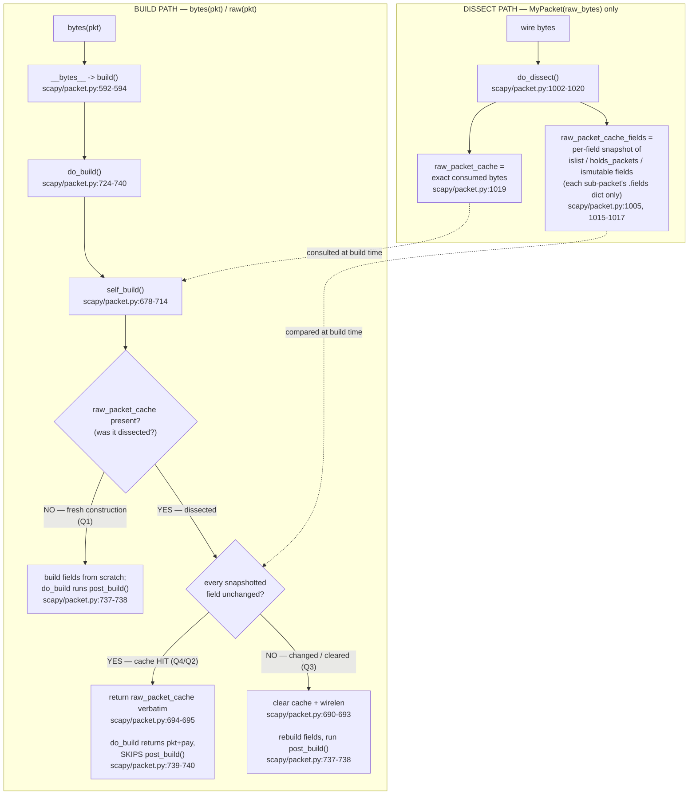

# Scapy's build/dissect lifecycle and the `raw_packet_cache` byte-caching mechanism

**An empirical, run-first answer to four interrelated questions about why a freshly-dissected packet sometimes serializes to its *original* bytes instead of a fresh build, why a checksum can look "wrong until `show2()` twice", and how `copy()` / `clear_cache()` behave.**

This document is written **from runtime observation**: every behavioral claim below is backed by a temporary reproduction script that was actually executed in the **canonical Docker environment** (Python 3.11.13; see the next section), with its **complete, unedited output** pasted inline immediately after the exact command that produced it. Provenance is tagged per claim: **[observed]** means the statement is proven by running the real public API and is backed by the output shown; **[inferred]** means the statement is read from the source code (with a `file:line` citation). Claims that mix the two are split so each part carries the correct tag; a statement read from source is never tagged `[observed]`.

Each question opens with a short **Direct answer** that *summarizes* the finding. Because such a summary combines runtime results with source-derived reasoning, it is marked **[observed + inferred]** as a whole, and every individual claim in it is then restated and tagged (`[observed]` / `[inferred]`) beside its evidence in the subsection that follows. The same combined **[observed + inferred]** marker is applied to the other multi-claim summaries in this document — the lifecycle-overview bullets just below and the final summary paragraph and table — each of which is likewise backed by per-claim tagged evidence in the section it summarizes.

The four questions are related through the **build/dissect lifecycle** — but they are **not** all the same phenomenon, and this document is careful to separate them:

- **Q4, Q3, and Q2** are all governed by the **`raw_packet_cache` mechanism** that is populated *only when a packet is dissected from bytes*. The document establishes that mechanism first (Q4) and derives Q3 and Q2 from it (Q3 → Q2). **[observed + inferred]**
- **Q1 is different.** A freshly *constructed* `MyProto()/SomePayload()` (never dissected) has **no** cache, so its checksum comes purely from `post_build` **ordering**, not from any cache hit. The cache only becomes relevant to Q1 *after* the built bytes are re-dissected, at which point it *preserves* the already-computed checksum. Q1 is presented last, with this uncached-vs-cached distinction made explicit. **[observed + inferred]**

> **This is an explanation, not a bug fix.** Nothing in Scapy is modified by this investigation; it is a read-only study. The shallow-snapshot design behind the nested-payload behavior (Q3/Q2) is **performance-motivated** — the source comment at `scapy/packet.py:653` states it exists to "avoid copying whole packets (perf: #GH3894)". The observed consequence is that a change confined to a *nested payload* is invisible to the outer layer's cache comparison. This document reports that consequence as an **observed behavior of the current implementation** and cites the performance rationale; it does not adjudicate whether the behavior is a guaranteed API contract. (The nested-payload invisibility is **[observed]** — reproduced in Q3/Q2 and the edge-case section below; the performance rationale is **[inferred]** from the `#GH3894` source comment at `scapy/packet.py:653`.)

---

## Environment and reproduction protocol

### Canonical environment (primary)

All behavioral results below were produced in the **user-provided canonical Docker environment** — image `scapy-canonical:latest` (equivalently `ghcr.io/scaleapi/swe-atlas:swe_atlas_QnA_secdev_scapy_1.0`), which ships **Python 3.11.13** and the editable Scapy checkout. To keep the study strictly read-only, the repository is bind-mounted **read-only** at `/work`, the temporary reproduction scripts are bind-mounted **read-only** at `/repro`, and bytecode writing is disabled (`PYTHONDONTWRITEBYTECODE=1` plus `python3 -B`). Throughout, `$REPO` denotes the repository root shown below.

```
$ REPO=/tmp/blitzy/scapy/blitzy-fa0998c5-af02-4392-accc-281e0db9f4c1_212de5
$ docker run --rm --entrypoint /bin/bash -v "$REPO":/work:ro -v /tmp/repro:/repro:ro -w /work \
    -e PYTHONDONTWRITEBYTECODE=1 scapy-canonical:latest -lc \
    'PYTHONPATH=/work python3 -B -c "import scapy, sys; print(scapy.__file__); print(\"VERSION\", scapy.VERSION); print(\"python\", sys.version.split()[0])"'
/work/scapy/__init__.py
VERSION 2026.07.13
python 3.11.13
```

- **Import resolves to this checkout** — `scapy.__file__` is `/work/scapy/__init__.py` (the read-only bind mount of this repository), and `scapy.VERSION` is the git-derived in-repo value `2026.07.13`. **[observed]**
- **Interpreter** — the canonical interpreter is **Python 3.11.13**. Every reproduction command in this document is the Docker invocation shown above with a different script or `-c` body; each is pasted verbatim next to its output. **[observed]**

### Read-only safety (verified, not merely asserted)

The bind mount is read-only, so nothing the reproductions do can alter the checkout — not even the ignored `scapy/**/__pycache__/*.pyc` bytecode caches that a normal import would create. This is demonstrated directly: attempting to write into `/work` fails at the filesystem level.

```
$ docker run --rm --entrypoint /bin/bash -v "$REPO":/work:ro -w /work \
    scapy-canonical:latest -lc 'touch /work/__probe 2>&1; echo "touch exit=$?"'
touch: cannot touch '/work/__probe': Read-only file system
touch exit=1
```

- **Writes into the checkout are physically blocked** — `touch` fails with `Read-only file system` (exit 1). Combined with `python3 -B` / `PYTHONDONTWRITEBYTECODE=1`, no `.pyc` or any other file can be created under the repository during the study. **[observed]**
- **Working tree is clean before the study** (the only later change is the new `blitzy/documentation/` artifact this document lives in):

```
$ git -C "$REPO" status --porcelain
$
```

  Empty output = clean tree. **[observed]** The matching post-study status and diff, plus the `/tmp/repro` cleanup, are shown in the final section ("Read-only compliance — verified bookends").

### Secondary corroboration (native Python 3.13.7) and the scope of the version claim

A second interpreter — the native venv at `/opt/scapy-venv`, **Python 3.13.7**, importing the *same* checkout via `PYTHONPATH=$REPO` — was used only to check that the findings are not an artifact of one interpreter. It resolves to this checkout and reproduces the key values identically (the `stability.py` script invoked here is listed in full in the [Q1 stability subsection](#genuine-run-to-run-stability--two-independent-processes)):

```
$ PYTHONPATH="$REPO" /opt/scapy-venv/bin/python -B -c "import scapy, sys; print(scapy.__file__); print('VERSION', scapy.VERSION); print('python', sys.version.split()[0])"
/tmp/blitzy/scapy/blitzy-fa0998c5-af02-4392-accc-281e0db9f4c1_212de5/scapy/__init__.py
VERSION 2026.07.13
python 3.13.7
$ PYTHONPATH="$REPO" /opt/scapy-venv/bin/python -B /tmp/repro/stability.py
Q1 chksum 0x4355 | Q1 raw 0100074355aabb | Q2 nested 0211223344
```

- **The same values reproduce on both interpreters actually tested** — Python 3.11.13 (canonical) and Python 3.13.7 (native) emit identical Q1 checksum, Q1 raw build, and Q2 nested `bytes()`. **[observed]**
- **Scope of the version claim.** The mechanism is implemented in pure-Python control flow (dict/`list`/`bytes` comparisons in `self_build`/`do_dissect`), so it is *expected* to behave identically on the repository's full supported range (`pyproject.toml:17`: `requires-python = ">=3.7, <4"`). That broad-range equivalence is **[inferred]** from the source, not exhaustively tested; the only interpreters empirically verified here are **3.11.13 and 3.13.7**. **[inferred]**
- **Zero mandatory dependencies** — Scapy's core is dependency-free (`pyproject.toml` declares no mandatory `dependencies` array, only optional extras); `cryptography` is only an optional extra, unrelated to this mechanism. **[inferred]** (`pyproject.toml:49-56`).

### Canonical entry points only

Every *behavioral* result comes from the real public API — `bytes()` / `raw()`, `show()`, `show2()`, `copy()`, `clear_cache()` — on genuine `Packet` subclasses. Reading `pkt.raw_packet_cache` / `pkt.raw_packet_cache_fields` is used only as *evidence of what was cached*, never to force a behavior. One reproduction (`q1.py`) adds a plain counter inside the user's own `post_build` to count how many times that method runs; this is application code in the user's protocol, not a Scapy debug hook, and it does not alter the build path.

---

## Lifecycle overview

A `Packet` lives on two paths — one that turns wire bytes into an object (**dissect**) and one that turns the object back into bytes (**build**). The cache is created **only on the dissect path**; whether the build path consults it depends on whether the packet was dissected at all.

- **Dissect path.** When you call `MyPacket(raw_bytes)`, `do_dissect()` walks `fields_desc`, consumes bytes field-by-field, and — as a side effect — records two things on the layer: `raw_packet_cache`, the *exact bytes this layer consumed*, and `raw_packet_cache_fields`, a *per-field snapshot* taken only for fields flagged `islist` / `holds_packets` / `ismutable` `[scapy/packet.py:1015-1017]`. **[inferred]** (source). A packet built **from scratch** (e.g. `MyProto()/SomePayload()`) never runs `do_dissect()`, so **both caches stay `None`** — Q1 shows `raw_packet_cache (fresh) : None`. **[observed]**
- **Build path — three outcomes** (control flow read from the cited source — **[inferred]** — and each outcome demonstrated with real output in the linked question section below). `bytes(pkt)` reaches `do_build()` → `self_build()`, and exactly one of three things happens:
  1. **No cache** (`raw_packet_cache is None`, i.e. a freshly *constructed* packet). `self_build()` assembles the layer from live fields and `do_build()` calls **`post_build()`** `[scapy/packet.py:737-738]`. *This is Q1's path — the cache plays no role in the wrong checksum.*
  2. **Cache present and every snapshotted field unchanged** (a dissected packet whose immediate fields were not touched). `self_build()` returns `raw_packet_cache` **verbatim** `[scapy/packet.py:694-695]` and `do_build()` returns `pkt + pay`, **skipping `post_build()`** `[scapy/packet.py:739-740]`. *This is Q4/Q2's cache-hit path.*
  3. **Cache present but a snapshotted field changed, or a direct field was assigned** (which clears the cache outright via `setfieldval()`). The comparison invalidates the cache `[scapy/packet.py:690-693]`, the layer is rebuilt from live fields, and `post_build()` runs. *This is Q3's direct-write path.*

The decisive detail for Q3/Q2 is *what* the snapshot records: for a packet-holding field it stores each sub-packet's **`.fields` dict only** — never its payload `[scapy/packet.py:653-658]` — so a change confined to a nested grandchild is not represented in the outer layer's snapshot and outcome (2) is taken. **[inferred]** (source; demonstrated in Q3/Q2 below).



The sections below prove each edge of this diagram with a real command in the canonical environment and its complete, unedited output.

---

## Q4 (the foundation): the exact rebuild-vs-cached decision mechanism

> **Q4 — the user's underlying question:** *What is the exact mechanism that decides whether `bytes()` rebuilds the packet or returns cached bytes? What gets cached during parsing, what invalidates it, and why are nested modifications invisible to the rebuild?*

**Direct answer.** The decision is made in `self_build()` and `do_build()`, and it only has anything to decide when a cache exists — which happens **only after dissection**. On dissection, `do_dissect()` caches (a) the exact bytes the layer consumed (`raw_packet_cache`) and (b) a per-field *snapshot* of only the fields flagged `islist` / `holds_packets` / `ismutable` (`raw_packet_cache_fields`). On serialization of a *dissected* packet, `self_build()` recomputes the live value of each snapshotted field and compares it to the stored snapshot: if **every** snapshotted field is unchanged it returns the cached bytes **verbatim** `[scapy/packet.py:694-695]` and `do_build()` **skips `post_build()`** `[scapy/packet.py:737-740]`; if **any** differ (or the cache was cleared by a direct field write) it rebuilds and runs `post_build()`. Nested-payload modifications are invisible to this comparison because the snapshot for a packet-holding field stores each sub-packet's **`.fields` dict only** — *not* its payload `[scapy/packet.py:653-658]` — so changing a grandchild never changes the outer layer's snapshot. This mechanism directly explains **Q3 and Q2**. It does **not** explain Q1: a packet built from scratch has no cache, so its `post_build()` always runs (see the Q1 section) — the cache only matters to Q1 *after* re-dissection, where it *preserves* an already-computed value. **[observed + inferred]** (each constituent claim is individually tagged beside its evidence in the subsections below.)

### What dissection caches — observed

The reproduction builds a genuine outer `Packet` (`MyPacket`) containing a `PacketListField` of sub-packets (`Sub`), each of which carries a **nested payload** (`Leaf`) — mirroring the user's `MyPacket(raw_bytes)`:

```python
# /tmp/repro/q4.py  -- Q4: what dissection caches and how the build consults it.
# Complete, standalone. Run: PYTHONPATH=/work python3 -B /repro/q4.py
from scapy.packet import Packet
from scapy.fields import ByteField, PacketListField


class Leaf(Packet):
    name = "Leaf"
    fields_desc = [ByteField("x", 0)]

    def extract_padding(self, s):
        return b"", s


class Sub(Packet):
    name = "Sub"
    fields_desc = [ByteField("id", 0)]

    def guess_payload_class(self, payload):
        return Leaf

    def extract_padding(self, s):
        return s[:1], s[1:]


class MyPacket(Packet):
    name = "MyPacket"
    fields_desc = [
        ByteField("n", 0),
        PacketListField("items", [], Sub, count_from=lambda p: p.n),
    ]


raw_bytes = b"\x02\x11\x22\x33\x44"  # n=2; Sub(id=0x11)/Leaf(x=0x22); Sub(id=0x33)/Leaf(x=0x44)

mp = MyPacket(raw_bytes)
print("raw_packet_cache        =", mp.raw_packet_cache.hex())
print("raw_packet_cache_fields =", mp.raw_packet_cache_fields)
print("bytes(mp) == raw_bytes  :", bytes(mp) == raw_bytes)
print("live Sub[0].id          :", mp.items[0].id)
print("live Sub[0]/Leaf.x      :", mp.items[0].payload.x)
```

Command (canonical environment) and **complete unedited output**:

```
$ docker run --rm --entrypoint /bin/bash -v "$REPO":/work:ro -v /tmp/repro:/repro:ro -w /work \
    -e PYTHONDONTWRITEBYTECODE=1 scapy-canonical:latest -lc 'PYTHONPATH=/work python3 -B /repro/q4.py'
raw_packet_cache        = 0211223344
raw_packet_cache_fields = {'items': [{'id': 17}, {'id': 51}]}
bytes(mp) == raw_bytes  : True
live Sub[0].id          : 17
live Sub[0]/Leaf.x      : 34
```

What this proves:

- **`raw_packet_cache` holds the exact consumed bytes** `0211223344` — byte-identical to `raw_bytes`. **[observed]** The assignment is `self.raw_packet_cache = _raw[:-len(s)] if s else _raw` at `scapy/packet.py:1019` (the input minus any bytes left unconsumed). **[inferred]** (source).
- **`raw_packet_cache_fields` is a per-field snapshot containing only `items`** — the plain `ByteField("n")` is absent. **[observed]** In source, `do_dissect()` initializes the dict at `scapy/packet.py:1005` and fills it only for fields matching `f.islist or f.holds_packets or f.ismutable` with `fval is not None` at `scapy/packet.py:1015-1017`, so a plain field like `n` is never snapshotted. **[inferred]** (source).
- **The snapshot for `items` is `[{'id': 17}, {'id': 51}]`** — a list of each `Sub`'s **`.fields` dict** (`0x11 == 17`, `0x33 == 51`), while the live objects still hold the `Leaf` payloads (`live Sub[0]/Leaf.x : 34`, i.e. `0x22`). The `Leaf` values are **absent** from the snapshot. **[observed]** This absence is what makes nested modifications invisible to the outer rebuild (Q3/Q2).
- **`bytes(mp) == raw_bytes` is `True`** — round-trip fidelity: an unmodified dissected packet serializes back to exactly the bytes it came from. **[observed]**

### Why only `items` is snapshotted, and why the snapshot omits the `Leaf` payload

The set of snapshotted fields is governed by three field flags:

- The `Field` base class defaults `islist = 0`, `ismutable = False`, `holds_packets = 0` `[scapy/fields.py:154-156]`; a plain `ByteField` (like `n`) inherits these, so it fails the `do_dissect()` test and is never snapshotted. **[inferred]** (source). The [q4.py output above](#what-dissection-caches--observed) confirms it: `n` is absent from `raw_packet_cache_fields`. **[observed]**
- `PacketListField` sets `islist = 1` `[scapy/fields.py:1571]`, and its base `_PacketField` sets `holds_packets = 1` `[scapy/fields.py:1475]`, so `items` matches `f.islist or f.holds_packets` and is snapshotted. **[inferred]** (source). The output confirms `items` is the only key present. **[observed]**

*What* gets stored for such a field is decided by `_raw_packet_cache_field_value()` `[scapy/packet.py:648-662]`. For a packet-holding **list** field it returns `[_cpy(x.fields) for x in val]` — a copy of each sub-packet's `.fields` dict — and the inline comment states the performance intent verbatim:

```
$ sed -n '648,662p' scapy/packet.py
    def _raw_packet_cache_field_value(self, fld, val, copy=False):
        # type: (AnyField, Any, bool) -> Optional[Any]
        """Get a value representative of a mutable field to detect changes"""
        _cpy = lambda x: fld.do_copy(x) if copy else x  # type: Callable[[Any], Any]
        if fld.holds_packets:
            # avoid copying whole packets (perf: #GH3894)
            if fld.islist:
                return [
                    _cpy(x.fields) for x in val
                ]
            else:
                return _cpy(val.fields)
        elif fld.islist or fld.ismutable:
            return _cpy(val)
        return None
```

- **The snapshot stores each sub-packet's `.fields` dict, not the whole packet** — the source comment at `scapy/packet.py:653` gives the reason as performance: "avoid copying whole packets (perf: #GH3894)". **[inferred]** (the comment is source text). Because a `Packet`'s payload is **not** part of its `.fields` dict, the snapshot for `items` captures `Sub.id` but never the `Leaf` beneath it. The observed consequence — confirmed throughout Q3/Q2 — is that a change confined to a nested payload is not represented in the outer snapshot and so is invisible to the rebuild comparison. This document reports that as the behavior of the current implementation and cites the performance rationale (`#GH3894`); it does not assert whether the behavior is a guaranteed contract. **[inferred]**
- **Precise snapshot semantics (what is stored and how it is compared).** At dissect time `_raw_packet_cache_field_value` is called with `copy=True` `[scapy/packet.py:1017]`, so `_cpy` = `fld.do_copy`. For a list-of-packets field the stored value is `[fld.do_copy(x.fields) for x in val]`. Each `x.fields` is a **dict**, so `do_copy` `[scapy/fields.py:256-266]` takes its `hasattr(x, "copy")` branch and returns a **shallow copy of that dict** — the list-of-`BasePacket` branch of `do_copy` is *not* the operative path for each `.fields` dict here. At build time `self_build()` recomputes the field with `copy=False` (`_cpy` = identity) and compares with `!=` `[scapy/packet.py:689]`, i.e. a **by-value comparison of the immediate `.fields` dictionaries**. Consequently the comparison detects a *value change to an immediate field* of a sub-packet (e.g. `Sub.id`), but it does **not** detect a replacement of a list element by a different packet that happens to have equal `.fields`, and it never sees anything inside a sub-packet's payload. **[inferred]** (source). The dedicated edge-case reproduction below (*"the three snapshot-comparison outcomes"*) corroborates each of these three cases at runtime — an immediate `Sub.id` change *is* detected (rebuilt to `0299223344`), an equal-`.fields` replacement carrying a different payload is *not* detected (stale `0211223344`), and nothing inside a payload is ever seen. **[observed]**

### How the build decides: `self_build()` comparison and the `post_build` skip

On serialization, `self_build()` `[scapy/packet.py:678-713]` gates on the cache:

```
$ sed -n '685,695p' scapy/packet.py
        if self.raw_packet_cache is not None and \
                self.raw_packet_cache_fields is not None:
            for fname, fval in self.raw_packet_cache_fields.items():
                fld, val = self.getfield_and_val(fname)
                if self._raw_packet_cache_field_value(fld, val) != fval:
                    self.raw_packet_cache = None
                    self.raw_packet_cache_fields = None
                    self.wirelen = None
                    break
            if self.raw_packet_cache is not None:
                return self.raw_packet_cache
```

- When both caches are present `[scapy/packet.py:685-686]`, it recomputes each snapshotted field's **live** value with the same `_raw_packet_cache_field_value()` and compares to the stored snapshot `[scapy/packet.py:687-689]`. **[inferred]** (source). The dedicated edge-case reproduction below drives **both** outcomes of this comparison directly — a changed snapshotted field (an immediate `Sub.id` mutation, or a changed-`.fields` replacement) takes the clear-and-rebuild branch, while an equal-`.fields` replacement takes the cache-return branch. **[observed]**
- On **any** difference it clears `raw_packet_cache`, `raw_packet_cache_fields` and `wirelen`, then `break`s to fall through to a genuine rebuild `[scapy/packet.py:690-693]`. **[inferred]** (source).
- If, after the loop, the cache survived (no field changed), it **returns `self.raw_packet_cache`** — the original bytes, verbatim `[scapy/packet.py:694-695]`. **[inferred]** (source). This is the cache-hit path that makes `bytes(mp) == raw_bytes` in the q4.py output above. **[observed]**

`do_build()` `[scapy/packet.py:724-740]` then decides whether `post_build()` runs at all:

```
$ sed -n '731,740p' scapy/packet.py
        if not self.explicit:
            self = next(iter(self))
        pkt = self.self_build()
        for t in self.post_transforms:
            pkt = t(pkt)
        pay = self.do_build_payload()
        if self.raw_packet_cache is None:
            return self.post_build(pkt, pay)
        else:
            return pkt + pay
```

- It calls `post_build()` **only when `self.raw_packet_cache is None`** `[scapy/packet.py:737-738]`; when the cache is still set after `self_build()` (a cache hit) it returns `pkt + pay` and **skips `post_build()` entirely** `[scapy/packet.py:739-740]`. **[inferred]** (source). This `if` is what makes **Q2** return the original bytes for a *dissected* packet whose immediate fields were untouched, and (as the Q1 re-dissection experiment shows) it is why *re-dissecting* Q1's bytes then rebuilding preserves the already-baked checksum. **[observed]** It is **not** the cause of the wrong checksum in a freshly-*constructed* `MyProto()/SomePayload()`: that packet has `raw_packet_cache is None`, so this `if` takes the `post_build()` branch on **every** build (proven in the Q1 section, where `post_build` runs 3 times for 3 builds). **[observed]**
- For non-`explicit` packets `do_build()` first binds a **build-time clone**, `self = next(iter(self))` `[scapy/packet.py:731-732]`, produced by `__iter__` `[scapy/packet.py:1124-1153]` which yields `self.clone_with(...)`; `clone_with()` **carries the cache forward** to the clone `[scapy/packet.py:1114-1116]`. **[inferred]** (source). The practical effect is twofold: the cache-hit behavior survives cloning (relevant to Q2/`copy()`), and *if* build logic were to assign to `self`, the write would land on the throwaway clone rather than the original. Note this is a separate fact from why Q1's `length`/`chksum` stay `None`: as the Q1 section shows, this protocol's `post_build` never assigns those fields at all — it only patches a local byte string. **[inferred]**

**`bytes()` routing.** `bytes(pkt)` invokes `Packet.__bytes__` `[scapy/packet.py:592-594]`, which returns `self.build()`; `raw()` `[scapy/compat.py:112]` is simply `return bytes(x)`. So `bytes()` and `raw()` are the same path into `do_build()` → `self_build()`. **[inferred]** (source).

### Observed — the three snapshot-comparison outcomes (edge cases)

The plain Q3 reproduction (next section) shows the two most common paths — a *nested-payload* write that is invisible, and a *direct outer-field* write that clears the cache via `setfieldval()`. Neither, however, drives the `self_build()` **by-value comparison** itself: the direct write clears the cache *before* the build ever reaches the comparison loop, and the nested write is invisible precisely because it never enters the snapshot. To exercise the comparison directly — including the **compare-and-clear** branch `[scapy/packet.py:690-693]` that fires when a *snapshotted* field changes with **no** `setfieldval()` on the outer layer — a dedicated standalone reproduction drives all three comparison outcomes through the public API only:

```python
# /tmp/repro/q3_edge.py  -- Q3/Q4 edge cases: the self_build() compare-and-clear branch.
# Exercises, through the public API only, the three snapshot-comparison cases that the
# plain nested/direct reproduction does not: (1) an immediate sub-packet field change
# detected by self_build()'s by-value comparison (not via setfieldval on the outer),
# (2) an equal-.fields replacement that is invisible to the comparison, and
# (3) a changed-.fields replacement that the comparison detects.
# Complete, standalone. Run: PYTHONPATH=/work python3 -B /repro/q3_edge.py
from scapy.packet import Packet
from scapy.fields import ByteField, PacketListField


class Leaf(Packet):
    name = "Leaf"
    fields_desc = [ByteField("x", 0)]

    def extract_padding(self, s):
        return b"", s


class Sub(Packet):
    name = "Sub"
    fields_desc = [ByteField("id", 0)]

    def guess_payload_class(self, payload):
        return Leaf

    def extract_padding(self, s):
        return s[:1], s[1:]


class MyPacket(Packet):
    name = "MyPacket"
    fields_desc = [
        ByteField("n", 0),
        PacketListField("items", [], Sub, count_from=lambda p: p.n),
    ]


raw_bytes = b"\x02\x11\x22\x33\x44"

# (1) immediate sub-packet field change: setfieldval runs on the CHILD Sub, not the outer
print("=== (1) immediate sub-packet field mutation: mp.items[0].id = 0x99 ===")
mp = MyPacket(raw_bytes)
mp.items[0].id = 0x99
print("outer cache before bytes() :", mp.raw_packet_cache is not None)
print("bytes(mp)                  :", bytes(mp).hex())
print("outer cache after bytes()  :", mp.raw_packet_cache)

# (2) equal-.fields replacement: different payload, but .fields == {'id': 17}
print("=== (2) equal-.fields replacement: mp2.items[0] = Sub(id=0x11)/Leaf(x=0x99) ===")
mp2 = MyPacket(raw_bytes)
mp2.items[0] = Sub(id=0x11) / Leaf(x=0x99)
print("replacement .fields        :", mp2.items[0].fields)
print("outer cache before bytes() :", mp2.raw_packet_cache is not None)
print("bytes(mp2)                 :", bytes(mp2).hex())
print("outer cache after bytes()  :", mp2.raw_packet_cache is not None)

# (3) changed-.fields replacement: .fields == {'id': 153}, differs from snapshot
print("=== (3) changed-.fields replacement: mp3.items[0] = Sub(id=0x99)/Leaf(x=0x99) ===")
mp3 = MyPacket(raw_bytes)
mp3.items[0] = Sub(id=0x99) / Leaf(x=0x99)
print("replacement .fields        :", mp3.items[0].fields)
print("bytes(mp3)                 :", bytes(mp3).hex())
print("outer cache after bytes()  :", mp3.raw_packet_cache)
```

Command (canonical environment) and **complete unedited output**:

```
$ docker run --rm --entrypoint /bin/bash -v "$REPO":/work:ro -v /tmp/repro:/repro:ro -w /work \
    -e PYTHONDONTWRITEBYTECODE=1 scapy-canonical:latest -lc 'PYTHONPATH=/work python3 -B /repro/q3_edge.py'
=== (1) immediate sub-packet field mutation: mp.items[0].id = 0x99 ===
outer cache before bytes() : True
bytes(mp)                  : 0299223344
outer cache after bytes()  : None
=== (2) equal-.fields replacement: mp2.items[0] = Sub(id=0x11)/Leaf(x=0x99) ===
replacement .fields        : {'id': 17}
outer cache before bytes() : True
bytes(mp2)                 : 0211223344
outer cache after bytes()  : True
=== (3) changed-.fields replacement: mp3.items[0] = Sub(id=0x99)/Leaf(x=0x99) ===
replacement .fields        : {'id': 153}
bytes(mp3)                 : 0299993344
outer cache after bytes()  : None
```

- **(1) An immediate sub-packet field change is detected by the comparison — not by `setfieldval()` on the outer layer.** `mp.items[0].id = 0x99` runs `setfieldval()` on the *child* `Sub`, so the outer `MyPacket`'s cache is **still present** immediately afterward — `outer cache before bytes() : True`. It is then `self_build()`'s by-value comparison that detects the changed `.fields` (recomputed `{'id': 153}` `!=` stored `{'id': 17}`), takes the compare-and-clear branch `[scapy/packet.py:690-693]`, rebuilds, and leaves `outer cache after bytes() : None`; the rebuilt bytes are `0299223344`. **[observed]**
- **(2) An equal-`.fields` replacement is invisible.** Replacing the element with a *different* packet that happens to carry the **same** immediate `.fields` — `Sub(id=0x11)/Leaf(x=0x99)`, whose `.fields` prints as `{'id': 17}` — but a different nested payload leaves the comparison with **no** difference, so the cache **survives** (`outer cache after bytes() : True`) and `bytes()` returns the **original** `0211223344`, even though the live element now carries `Leaf.x = 0x99`. This proves the comparison is a **by-value comparison of the immediate `.fields` dict**, blind both to object identity and to anything inside the payload. **[observed]**
- **(3) A changed-`.fields` replacement is detected.** The same style of replacement but with a *different* immediate field — `Sub(id=0x99)/Leaf(x=0x99)`, `.fields` = `{'id': 153}` — *does* differ from the snapshot, so the comparison clears the cache (`outer cache after bytes() : None`) and rebuilds to `0299993344`. **[observed]**

Cases (1) and (3) exercise the `self_build()` **compare-and-clear** outcome, and case (2) exercises the **no-difference (cache-returned)** outcome — the two branches at `[scapy/packet.py:687-695]`. The (2)-vs-(3) contrast isolates the *by-value-of-`.fields`* semantics: an equal `.fields` dict is invisible even when the replacement packet's identity **and** payload differ, whereas any change to the immediate `.fields` values is caught. **[observed]** (all four decisive `bytes()` values and cache states are printed above); **[inferred]** (the cited branch line numbers are read from source).

---


## Q3: direct-field modification vs. nested-payload modification

> **Q3 — the user's example (verbatim):**
> *"if I modify a field in the same layer where I parsed the bytes, the rebuild works correctly. It's only when I modify a field in a nested payload that the original bytes get returned instead of a fresh build."*

**Direct answer.** The asymmetry is real and follows directly from the Q4 mechanism. A **direct field write** (e.g. `mp.n = 5`) routes through `setfieldval()`, which *clears that layer's cache outright*, so the next `bytes()` is forced to rebuild from scratch — the change is reflected. A **nested-payload write** (e.g. `mp.items[0].payload.x = 0x99`) mutates only the grandchild `Leaf`; it never touches the outer `MyPacket`'s snapshot (which stored only `Sub.fields = {'id': ...}`, no `Leaf`), so `self_build()`'s comparison sees no change, the cache survives, and `bytes()` returns the **original** bytes. **[observed + inferred]** (each constituent claim is individually tagged beside its evidence in the subsections below.)

### Observed — both paths side by side

```python
# /tmp/repro/q3.py  -- Q3: direct-field vs nested-payload modification.
# Complete, standalone. Run: PYTHONPATH=/work python3 -B /repro/q3.py
from scapy.packet import Packet
from scapy.fields import ByteField, PacketListField


class Leaf(Packet):
    name = "Leaf"
    fields_desc = [ByteField("x", 0)]

    def extract_padding(self, s):
        return b"", s


class Sub(Packet):
    name = "Sub"
    fields_desc = [ByteField("id", 0)]

    def guess_payload_class(self, payload):
        return Leaf

    def extract_padding(self, s):
        return s[:1], s[1:]


class MyPacket(Packet):
    name = "MyPacket"
    fields_desc = [
        ByteField("n", 0),
        PacketListField("items", [], Sub, count_from=lambda p: p.n),
    ]


raw_bytes = b"\x02\x11\x22\x33\x44"

print("=== NESTED payload modification (mp.items[0].payload.x = 0x99) ===")
mp = MyPacket(raw_bytes)
mp.items[0].payload.x = 0x99
print("live Leaf.x       :", mp.items[0].payload.x)
print("bytes(mp)         :", bytes(mp).hex())
print("cache still set   :", mp.raw_packet_cache is not None)

print("=== DIRECT field modification (mp2.n = 5) ===")
mp2 = MyPacket(raw_bytes)
mp2.n = 5
print("bytes(mp2)        :", bytes(mp2).hex())
print("cache now         :", mp2.raw_packet_cache)
```

Command (canonical environment) and **complete unedited output**:

```
$ docker run --rm --entrypoint /bin/bash -v "$REPO":/work:ro -v /tmp/repro:/repro:ro -w /work \
    -e PYTHONDONTWRITEBYTECODE=1 scapy-canonical:latest -lc 'PYTHONPATH=/work python3 -B /repro/q3.py'
=== NESTED payload modification (mp.items[0].payload.x = 0x99) ===
live Leaf.x       : 153
bytes(mp)         : 0211223344
cache still set   : True
=== DIRECT field modification (mp2.n = 5) ===
bytes(mp2)        : 0511223344
cache now         : None
```

### Why the direct write rebuilds — `setfieldval()` clears the cache

Assigning any declared field ultimately calls `setfieldval()` `[scapy/packet.py:472-492]`. For a field belonging to *this* layer it stores the value and immediately clears the cache:

```
$ sed -n '482,492p' scapy/packet.py
            self.fields[attr] = val if isinstance(val, RawVal) else \
                any2i(self, val)
            self.explicit = 0
            self.raw_packet_cache = None
            self.raw_packet_cache_fields = None
            self.wirelen = None
        elif attr == "payload":
            self.remove_payload()
            self.add_payload(val)
        else:
            self.payload.setfieldval(attr, val)
```

- Setting a field on the layer that owns it clears `raw_packet_cache`, `raw_packet_cache_fields` and `wirelen` at `scapy/packet.py:485-487`. **[inferred]** (source). The `q3.py` output confirms it for `mp2.n = 5`: `cache now : None`. **[observed]**
- With the cache gone, `self_build()`'s gate at `scapy/packet.py:685-686` is skipped and the layer is rebuilt from its live fields; `n = 5` appears as the leading byte — `bytes(mp2) = 0511223344` (`0x05` in position 0). **[observed]**
- The same cache-clearing behavior is noted in Scapy's own source: a comment in `scapy/contrib/ethercat.py:206` remarks that *"setfieldval() is evil as it sets raw_packet_cache_fields to None"*. **[inferred]** (source comment).

### Why the nested write does *not* rebuild — the outer snapshot never changes

`mp.items[0].payload.x = 0x99` reaches the child `Leaf` object and mutates *its* field. It does **not** run `setfieldval()` on the outer `MyPacket`, so the outer layer's cache is untouched:

- **`cache still set : True`** after the nested write, and **`bytes(mp) = 0211223344`** — the original bytes — even though the live `Leaf.x` reads `153` (`0x99`). **[observed]**
- The reason, in source: at build time `self_build()` recomputes `_raw_packet_cache_field_value(items_field, live_items)` (this time with `copy=False`) and compares it **by value** to the stored `[{'id': 17}, {'id': 51}]` at `scapy/packet.py:689`. Because the snapshot is built from each `Sub`'s **`.fields` dict only** `[scapy/packet.py:653-658]` — and the `Leaf` payload is *not* part of `Sub.fields` — the recomputed dicts are still `[{'id': 17}, {'id': 51}]`, the comparison finds **no difference**, the cache is preserved, and `self_build()` returns the original bytes `[scapy/packet.py:694-695]`. **[inferred]** (source). The `q3.py` values are exactly what this logic predicts. **[observed]**
- Note `setfieldval()` *does* have a delegation branch — `self.payload.setfieldval(attr, val)` `[scapy/packet.py:492]` — that walks unknown attribute names down the payload chain, clearing the cache on the layer that *owns* the named field. But in the nested case the mutation is applied to an already-resolved child object (`mp.items[0].payload`), so `setfieldval()` runs on the `Leaf`, not on the outer `MyPacket`, and no outer layer's cache is cleared. **[inferred]** (source).

The whole asymmetry is therefore a direct consequence of the Q4 snapshot design: **the outer layer only snapshots the values of its own immediate fields (each sub-packet's `.fields` dict), not the deeper contents of the packets those fields hold.** A change the snapshot never recorded cannot be detected by the by-value comparison — the performance-motivated shallow snapshot (`#GH3894`) is exactly what produces this observed behavior.

---


## Q2: the "two-state packet", and whether `copy()` helps

> **Q2 — the user's example (verbatim):**
> *"I parsed a packet from wire bytes using MyPacket(raw_bytes) ... Then I modified the payload of a sub-packet inside a PacketListField ... When I call bytes() on the outer packet, it returns the ORIGINAL bytes ... But if I print the packet with show(), it displays my modified value ... Maybe copy() could work for this. If so, why?"*

**Direct answer.** Yes — the two-state is real and reproducible. `show()` walks the **live in-memory object tree**, so it displays your modified nested value; `bytes()` routes through the cache (Q4) and returns the **original** bytes. As for the user's proposed remedy: **`copy()` does NOT fix it** — `copy()` carries the `raw_packet_cache` / `raw_packet_cache_fields` forward to the clone, so the clone still returns the original bytes. The canonical remedy is **`clear_cache()`**, which resets the cache across the whole packet tree so the next `bytes()` rebuilds and reflects the modification. **[observed + inferred]** (each constituent claim is individually tagged beside its evidence in the subsection below.)

### Observed — the dual state, and `copy()` vs `clear_cache()`

A single self-contained script exercises all five public entry points on freshly-dissected objects: `show()`, `bytes()`, and `show2()` on the *same* nested-modified object (the dual state), then `copy()` (proposed remedy) and `clear_cache()` (actual remedy). It is run once; its complete output is pasted once below and every claim in this section refers to that one output.

```python
# /tmp/repro/q2.py  -- Q2: the two-state packet; copy() vs clear_cache().
# Complete, standalone. Run: PYTHONPATH=/work python3 -B /repro/q2.py
from scapy.packet import Packet
from scapy.fields import ByteField, PacketListField


class Leaf(Packet):
    name = "Leaf"
    fields_desc = [ByteField("x", 0)]

    def extract_padding(self, s):
        return b"", s


class Sub(Packet):
    name = "Sub"
    fields_desc = [ByteField("id", 0)]

    def guess_payload_class(self, payload):
        return Leaf

    def extract_padding(self, s):
        return s[:1], s[1:]


class MyPacket(Packet):
    name = "MyPacket"
    fields_desc = [
        ByteField("n", 0),
        PacketListField("items", [], Sub, count_from=lambda p: p.n),
    ]


raw_bytes = b"\x02\x11\x22\x33\x44"

print("=== dual state: show() vs bytes() vs show2() on the SAME modified object ===")
mp = MyPacket(raw_bytes)
mp.items[0].payload.x = 0x99
print("--- mp.show() (live tree) ---")
mp.show()
print("--- bytes(mp) (cache) ---")
print(bytes(mp).hex())
print("--- mp.show2() (build + re-dissect) ---")
mp.show2()

print("=== copy() does NOT fix it ===")
mp3 = MyPacket(raw_bytes)
mp3.items[0].payload.x = 0x99
c = mp3.copy()
print("copy cache        :", (c.raw_packet_cache or b'').hex())
print("bytes(copy)       :", bytes(c).hex())

print("=== clear_cache() IS the remedy ===")
mp4 = MyPacket(raw_bytes)
mp4.items[0].payload.x = 0x99
mp4.clear_cache()
print("after clear cache :", mp4.raw_packet_cache)
print("bytes(mp4)        :", bytes(mp4).hex())
```

Command (canonical environment) and **complete unedited output** (pasted exactly, including Scapy's trailing space after each `###[ <layer> ]###` header):

```
$ docker run --rm --entrypoint /bin/bash -v "$REPO":/work:ro -v /tmp/repro:/repro:ro -w /work \
    -e PYTHONDONTWRITEBYTECODE=1 scapy-canonical:latest -lc 'PYTHONPATH=/work python3 -B /repro/q2.py'
=== dual state: show() vs bytes() vs show2() on the SAME modified object ===
--- mp.show() (live tree) ---
###[ MyPacket ]### 
  n         = 2
  \items     \
   |###[ Sub ]### 
   |  id        = 17
   |###[ Leaf ]### 
   |     x         = 153
   |###[ Sub ]### 
   |  id        = 51
   |###[ Leaf ]### 
   |     x         = 68

--- bytes(mp) (cache) ---
0211223344
--- mp.show2() (build + re-dissect) ---
###[ MyPacket ]### 
  n         = 2
  \items     \
   |###[ Sub ]### 
   |  id        = 17
   |###[ Leaf ]### 
   |     x         = 34
   |###[ Sub ]### 
   |  id        = 51
   |###[ Leaf ]### 
   |     x         = 68

=== copy() does NOT fix it ===
copy cache        : 0211223344
bytes(copy)       : 0211223344
=== clear_cache() IS the remedy ===
after clear cache : None
bytes(mp4)        : 0211993344
```

**The dual state — `show()` vs `bytes()` vs `show2()`:**

- **`show()` prints `x = 153`** (the modified `0x99 == 153`). **[observed]** `show()` `[scapy/packet.py:1459-1471]` is a thin wrapper that returns `self._show_or_dump(...)`; the live-tree traversal is implemented in `_show_or_dump` `[scapy/packet.py:1383-1458]`, whose field loop reads each field's *live* value via `self.getfieldval(f.name)` and recurses into sub-packets and the payload `[scapy/packet.py:1412-1450]`, never serializing — so it reflects the nested modification. **[inferred]** (source).
- **`bytes(mp)` returns `0211223344`** (the original; `0x22` for the first `Leaf`). **[observed]** This is the Q4 cache-hit path: the outer snapshot did not change, so `self_build()` returns `raw_packet_cache` verbatim `[scapy/packet.py:694-695]`. **[inferred]** (source).
- **`show2()` prints `x = 34`** (`0x22 == 34`, the **original**). **[observed]** `show2()` is `return self.__class__(raw(self)).show(...)` `[scapy/packet.py:1486]` — it *builds* the packet (getting the cached original bytes `0211223344`) and *re-dissects* them into a brand-new object, materializing the original `Leaf.x = 0x22`. **[inferred]** (source). So `show()` and `show2()` disagree about the same object because one reads the live tree and the other round-trips through the cached bytes. **[observed]** (both values above).

**`copy()` does NOT fix it — and why:**

- **`copy cache : 0211223344`** and **`bytes(copy) : 0211223344`** — the clone *still* returns the original bytes; the answer to *"Maybe copy() could work… If so, why?"* is a clear **NO**. **[observed]**
- The reason, in source: `copy()` `[scapy/packet.py:407-426]` explicitly copies the cache to the clone — `clone.raw_packet_cache = self.raw_packet_cache` and `clone.raw_packet_cache_fields = self.copy_fields_dict(self.raw_packet_cache_fields)` `[scapy/packet.py:416-418]`. The build-time clone helper `clone_with()` carries the cache forward the same way `[scapy/packet.py:1114-1116]`, so copying never escapes the cache. **[inferred]** (source). The observed `copy cache : 0211223344` is that carried-forward cache. **[observed]**

**`clear_cache()` is the remedy:**

- **`after clear cache : None`** and **`bytes(mp4) : 0211993344`** — after `clear_cache()` the rebuild finally reflects the modification (`0x99` in the first `Leaf` position). **[observed]**
- In source, `clear_cache()` `[scapy/packet.py:664-676]` sets `self.raw_packet_cache = None`, recurses into every packet-holding field (a `Packet`, or a `list` of packets), and finally calls `self.payload.clear_cache()` — resetting the cache across the **entire tree**, including the nested `Leaf`. With every layer's cache gone, the next `bytes()` rebuilds from live fields end-to-end. **[inferred]** (source); the `bytes(mp4) : 0211993344` result confirms it. **[observed]**
- Clearing the cache to force a fresh build is an idiom Scapy uses internally: `self.raw_packet_cache = None  # Reset packet to allow post_build` appears verbatim at `scapy/layers/can.py:147` and `scapy/layers/can.py:467`, and at `scapy/layers/bluetooth4LE.py:256`; `scapy/layers/tls/session.py:1028` notes it must *"delete raw_packet_cache in order to access post_build"* (saving and restoring the snapshot around a manual build at `scapy/layers/tls/session.py:1039-1053`); and `scapy/layers/http.py:382-383` returns `self.raw_packet_cache` directly on a hit. **[inferred]** (all read from source). These corroborate that cache-clearing — not copying — is the sanctioned way to force a rebuild.

---


## Q1: deferred field-calculation order and the `show2()`-twice effect

> **Q1 — the user's example (verbatim):**
> *"When I build a packet stack like MyProto()/SomePayload(), the checksum is calculated before the length field is finalized, resulting in an incorrect checksum. If I call show2() twice in a row, the second call shows the correct checksum. Why is that?"*

**Direct answer (a negative result — stated plainly).** With the **same** unchanged `MyProto()/SomePayload()`, `show2()` is **deterministic**: calling it twice yields **identical** output, and the checksum is *stably* wrong (`0x4355`) on **every** call. It does **not** "correct itself" on the second call. The wrong checksum is caused by the `post_build` **ordering** — the checksum is computed while the auto-length bytes are still `0x0000`, and the length is patched in afterward — so the emitted checksum covers a zero length. The genuine fix is to **reorder `post_build`** (patch the length before computing the checksum), which produces the correct checksum in a **single** build; repeating `show2()` is not a fix. **[observed + inferred]** (each constituent claim is individually tagged beside its evidence in the subsections below.)

The reproduction uses the user's `MyProto()/SomePayload()` with a deliberately buggy `post_build` ordering (checksum computed **before** the length is patched), plus a `MyProtoFixed` with the correct order for contrast. The script is complete and standalone:

```python
# /tmp/repro/q1.py  -- Q1: post_build ordering, show2() repetition (deterministic),
# and the exact checksum inputs. Complete, standalone.
# Run: PYTHONPATH=/work python3 -B /repro/q1.py
import struct
from scapy.packet import Packet
from scapy.fields import ByteField, ShortField, XShortField
from scapy.compat import raw
from scapy.utils import checksum


class MyProto(Packet):
    name = "MyProto"
    fields_desc = [
        ByteField("type", 1),
        ShortField("length", None),   # auto length (depends on payload size)
        XShortField("chksum", None),  # auto checksum (depends on length)
    ]
    pb_calls = 0  # counts real post_build invocations on THIS class

    def post_build(self, p, pay):
        # BUGGY ORDER: checksum computed while length bytes are still 0x0000,
        # THEN the length is patched in afterwards.
        MyProto.pb_calls += 1
        if self.chksum is None:
            ck = checksum(p + pay)
            p = p[:3] + struct.pack("!H", ck) + p[5:]
        if self.length is None:
            length = len(p) + len(pay)
            p = p[:1] + struct.pack("!H", length) + p[3:]
        return p + pay


class MyProtoFixed(Packet):
    name = "MyProtoFixed"
    fields_desc = [
        ByteField("type", 1),
        ShortField("length", None),
        XShortField("chksum", None),
    ]

    def post_build(self, p, pay):
        # CORRECT ORDER: patch the length FIRST, then compute the checksum
        if self.length is None:
            length = len(p) + len(pay)
            p = p[:1] + struct.pack("!H", length) + p[3:]
        if self.chksum is None:
            ck = checksum(p + pay)
            p = p[:3] + struct.pack("!H", ck) + p[5:]
        return p + pay


class SomePayload(Packet):
    name = "SomePayload"
    fields_desc = [ByteField("a", 0xAA), ByteField("b", 0xBB)]


print("=== fresh construction has NO cache; post_build runs on EVERY build ===")
p = MyProto() / SomePayload()
print("raw_packet_cache (fresh)   :", p.raw_packet_cache)
MyProto.pb_calls = 0
print("build #1:", raw(p).hex())
print("build #2:", raw(p).hex())
print("build #3:", raw(p).hex())
print("post_build calls for 3 builds:", MyProto.pb_calls)

print("=== show2() TWICE on the SAME object ===")
print("--- first show2() ---")
p.show2()
print("--- second show2() ---")
p.show2()

print("=== self mutated by show2()/raw()? (length, chksum, explicit) ===")
print("before:", p.length, p.chksum, p.explicit)
_ = raw(p)
_ = p.show2(dump=True)  # exercise the real show2() path; capture instead of print
print("after :", p.length, p.chksum, p.explicit)

print("=== emitted bytes and the TWO checksum inputs ===")
emitted = raw(p)
print("emitted bytes                    :", emitted.hex())
print("length field in emitted bytes    :", MyProto(emitted).length)
print("emitted checksum                 :", hex(MyProto(emitted).chksum))
buggy_in = bytes.fromhex("0100000000aabb")   # length bytes STILL 0x0000 (pre-patch)
corr_in = bytes.fromhex("0100070000aabb")    # length=7 patched, chksum field zero
print("checksum input the BUGGY order used:", buggy_in.hex(), "-> chksum", hex(checksum(buggy_in)))
print("checksum input the CORRECT order   :", corr_in.hex(), "-> chksum", hex(checksum(corr_in)))

print("=== correct ordering fixes it in ONE build ===")
pf = MyProtoFixed() / SomePayload()
print("fixed emitted                    :", raw(pf).hex())

print("=== 5 fresh builds (stability) ===")
outs = []
for _ in range(5):
    fresh = MyProto() / SomePayload()
    outs.append(hex(MyProto(raw(fresh)).chksum))
print(outs)
```

Command (canonical environment) and **complete unedited output** (pasted exactly, including Scapy's trailing space after each `###[ <layer> ]###` header):

```
$ docker run --rm --entrypoint /bin/bash -v "$REPO":/work:ro -v /tmp/repro:/repro:ro -w /work \
    -e PYTHONDONTWRITEBYTECODE=1 scapy-canonical:latest -lc 'PYTHONPATH=/work python3 -B /repro/q1.py'
=== fresh construction has NO cache; post_build runs on EVERY build ===
raw_packet_cache (fresh)   : None
build #1: 0100074355aabb
build #2: 0100074355aabb
build #3: 0100074355aabb
post_build calls for 3 builds: 3
=== show2() TWICE on the SAME object ===
--- first show2() ---
###[ MyProto ]### 
  type      = 1
  length    = 7
  chksum    = 0x4355
###[ Raw ]### 
     load      = '\\xaa\\xbb'

--- second show2() ---
###[ MyProto ]### 
  type      = 1
  length    = 7
  chksum    = 0x4355
###[ Raw ]### 
     load      = '\\xaa\\xbb'

=== self mutated by show2()/raw()? (length, chksum, explicit) ===
before: None None 0
after : None None 0
=== emitted bytes and the TWO checksum inputs ===
emitted bytes                    : 0100074355aabb
length field in emitted bytes    : 7
emitted checksum                 : 0x4355
checksum input the BUGGY order used: 0100000000aabb -> chksum 0x4355
checksum input the CORRECT order   : 0100070000aabb -> chksum 0x3c55
=== correct ordering fixes it in ONE build ===
fixed emitted                    : 0100073c55aabb
=== 5 fresh builds (stability) ===
['0x4355', '0x4355', '0x4355', '0x4355', '0x4355']
```

**Reading the evidence:**

- **Fresh construction is uncached, and `post_build` runs on *every* build.** `raw_packet_cache (fresh)` is `None`, and `post_build calls for 3 builds` is `3` — three `raw()` builds trigger three `post_build` calls. **[observed]** This is the crucial distinction from Q4: a freshly *constructed* packet has no cache, so **there is no cache-hit path here** — `do_build()` calls `post_build()` on every build precisely because `self.raw_packet_cache is None` `[scapy/packet.py:737-738]`. The wrong checksum is therefore a `post_build` *ordering* effect, entirely independent of the byte-cache mechanism that governs Q2/Q3/Q4. **[observed]** (the call count); **[inferred]** (the `do_build` gate in source).
- **`raw()` is deterministic across 3 builds** — all three are `0100074355aabb`. **[observed]**
- **Both `show2()` calls are byte-for-byte identical** — each prints `length = 7` and `chksum = 0x4355`. The second call does **not** show a different (or "correct") checksum. **[observed]** This directly answers *"the second call shows the correct checksum"* with a **NO** — it does not.
- **`self` is not mutated by `show2()`/`raw()`** — `before: None None 0` and `after : None None 0` (`length` and `chksum` stay `None`; `explicit` stays `0`). So there is no hidden "first call fixes it for the second call" state change. **[observed]**
- **The two checksum inputs, byte-verified.** The buggy order fed `checksum()` the bytes `0100000000aabb` — where the length field is still `0x0000` (not yet patched) — yielding the emitted `0x4355`. A correct (length-first) order feeds `0100070000aabb` — where the length `0x0007` is already present — yielding `0x3c55`. **Both inputs and results are printed in the output above.** The emitted bytes `0100074355aabb` carry `length = 7` **and** the stale `chksum = 0x4355`: the length *is* present in the final wire bytes, but the checksum was computed *before* the length was written into `p`. **[observed]**
- **Correct ordering fixes it in ONE build** — `MyProtoFixed` (which patches the length *before* computing the checksum) emits `0100073c55aabb`, carrying the correct `0x3c55`. **[observed]** The fix is reordering `post_build`, not repeating `show2()`.
- **5 fresh builds are all `0x4355`** — stable, no run-to-run variation. **[observed]**

### Why it is deterministic — `post_build` never writes `self`; the clone is secondary

- **The direct reason `length`/`chksum` stay `None`:** this `post_build` only assembles and patches a **local byte string** `p` (e.g. `p = p[:3] + struct.pack("!H", ck) + p[5:]`) and returns `p + pay`; it **never** executes `self.length = ...` or `self.chksum = ...`. There is simply no write-back to the object at all, so the two auto fields keep their unset `None` and every fresh build recomputes the identical bytes. **[observed]** (`before`/`after` are both `None None 0`); **[inferred]** (reading the `post_build` body in the script above).
- **The build-time clone is a secondary, general fact — not the cause here.** Independently, `do_build()` binds `self = next(iter(self))` for non-`explicit` packets `[scapy/packet.py:731-732]`, so *even if* a `post_build` did assign to `self`, those writes would land on the throwaway per-build clone rather than the original. That mechanism is **not** what produces the `None` values in this case (this `post_build` writes nothing to `self`); it explains, more generally, why write-back-style `post_build`s do not "progressively fix" the original across builds. **[inferred]** (source).
- **The `post_build` ordering itself.** The canonical prose reference `doc/scapy/build_dissect.rst:623-658` ("Handling default values: `post_build`") documents `post_build(self, p, pay)` as receiving the already-assembled bytes `p` of the current layer plus the payload `pay`, and as the place to patch auto fields (lengths, checksums). In the buggy body the checksum branch runs first over `p + pay` while `p[1:3]` (the length) is still `\x00\x00`, and only then does the length branch overwrite `p[1:3]` with `7` — so the checksum can never reflect the final length. **[inferred]** (prose reference + the `post_build` body); the byte evidence (`0x4355` computed over `0100000000aabb`) confirms it. **[observed]**

### The round-trip *materialization* the user likely perceived as "different"

`show2()` build-then-re-dissects, so it *materializes* the auto-computed fields as concrete parsed values — which can look different from `show()` (where `length`/`chksum` still read as their unset defaults). That materialization is real, but it is **not** a correction and **not** run-to-run variation. A separate, complete standalone reproduction re-dissects the built bytes:

```python
# /tmp/repro/q1_redissect.py  -- Q1: build -> re-dissect round trip.
# Shows the cache appears ONLY after dissection and then preserves the (buggy) checksum.
# Complete, standalone. Run: PYTHONPATH=/work python3 -B /repro/q1_redissect.py
import struct
from scapy.packet import Packet
from scapy.fields import ByteField, ShortField, XShortField
from scapy.compat import raw
from scapy.utils import checksum


class MyProto(Packet):
    name = "MyProto"
    fields_desc = [
        ByteField("type", 1),
        ShortField("length", None),
        XShortField("chksum", None),
    ]

    def post_build(self, p, pay):
        if self.chksum is None:
            ck = checksum(p + pay)
            p = p[:3] + struct.pack("!H", ck) + p[5:]
        if self.length is None:
            length = len(p) + len(pay)
            p = p[:1] + struct.pack("!H", length) + p[3:]
        return p + pay


class SomePayload(Packet):
    name = "SomePayload"
    fields_desc = [ByteField("a", 0xAA), ByteField("b", 0xBB)]


p = MyProto() / SomePayload()
print("original explicit          :", p.explicit)
print("original length,chksum     :", p.length, p.chksum)
print("original has cache         :", p.raw_packet_cache is not None)
wire = raw(p)
print("wire bytes                 :", wire.hex())
p2 = MyProto(wire)
print("re-dissected length        :", p2.length)
print("re-dissected chksum        :", hex(p2.chksum))
print("re-dissected explicit      :", p2.explicit)
print("re-dissected has cache     :", p2.raw_packet_cache is not None)
print("re-dissected cache hex     :", p2.raw_packet_cache.hex())
print("raw(p2) returns cached     :", raw(p2).hex())
print("raw(p2) == wire            :", raw(p2) == wire)
```

```
$ docker run --rm --entrypoint /bin/bash -v "$REPO":/work:ro -v /tmp/repro:/repro:ro -w /work \
    -e PYTHONDONTWRITEBYTECODE=1 scapy-canonical:latest -lc 'PYTHONPATH=/work python3 -B /repro/q1_redissect.py'
original explicit          : 0
original length,chksum     : None None
original has cache         : False
wire bytes                 : 0100074355aabb
re-dissected length        : 7
re-dissected chksum        : 0x4355
re-dissected explicit      : 1
re-dissected has cache     : True
re-dissected cache hex     : 0100074355
raw(p2) returns cached     : 0100074355aabb
raw(p2) == wire            : True
```

- **Before any build/parse the original is uncached** — `original has cache : False`, `original explicit : 0`, `original length,chksum : None None`. This is the same uncached state that makes `post_build` run on every build (above). **[observed]**
- **After a build-then-parse round trip**, `p2` has `length = 7`, `chksum = 0x4355`, `explicit = 1`, and a populated `raw_packet_cache` (`0100074355` — the `MyProto` layer's consumed bytes; the payload is a separate `Raw` layer). **[observed]**
- **`raw(p2)` returns the cached bytes** `0100074355aabb`, byte-identical to the original wire (`raw(p2) == wire` is `True`). So the buggy checksum `0x4355` is now *frozen into the cache* — re-dissecting and rebuilding **preserves** the wrong checksum rather than recomputing it (this is the Q4 cache-hit path, which only exists *after* dissection). Round-tripping never self-corrects the value. **[observed]**
- **Contrast:** the one-pass correct build (`MyProtoFixed`, above) yields `0100073c55aabb` with `0x3c55`. **[observed]**

### Genuine run-to-run stability — two independent processes

Per the methodology (reproduce a reported inconsistency with the *same unchanged input*; confirm stability across ≥2 runs), a small combined probe prints the Q1 checksum, the Q1 raw build, and the Q2 nested `bytes()` on a single line, with **no** internal run labels — so its stdout is exactly what each process emits:

```python
# /tmp/repro/stability.py  -- run-to-run stability probe (one line of output).
# Prints the Q1 checksum, the Q1 raw build, and the Q2 nested-modified bytes().
# No internal run labels: two independent invocations emit identical lines.
# Complete, standalone. Run: PYTHONPATH=/work python3 -B /repro/stability.py
import struct
from scapy.packet import Packet
from scapy.fields import ByteField, ShortField, XShortField, PacketListField
from scapy.compat import raw
from scapy.utils import checksum


class MyProto(Packet):
    name = "MyProto"
    fields_desc = [
        ByteField("type", 1),
        ShortField("length", None),
        XShortField("chksum", None),
    ]

    def post_build(self, p, pay):
        if self.chksum is None:
            ck = checksum(p + pay)
            p = p[:3] + struct.pack("!H", ck) + p[5:]
        if self.length is None:
            length = len(p) + len(pay)
            p = p[:1] + struct.pack("!H", length) + p[3:]
        return p + pay


class SomePayload(Packet):
    name = "SomePayload"
    fields_desc = [ByteField("a", 0xAA), ByteField("b", 0xBB)]


class Leaf(Packet):
    name = "Leaf"
    fields_desc = [ByteField("x", 0)]

    def extract_padding(self, s):
        return b"", s


class Sub(Packet):
    name = "Sub"
    fields_desc = [ByteField("id", 0)]

    def guess_payload_class(self, payload):
        return Leaf

    def extract_padding(self, s):
        return s[:1], s[1:]


class MyPacket(Packet):
    name = "MyPacket"
    fields_desc = [
        ByteField("n", 0),
        PacketListField("items", [], Sub, count_from=lambda p: p.n),
    ]


q1 = MyProto() / SomePayload()
q1_raw = raw(q1)
q1_chksum = hex(MyProto(q1_raw).chksum)
mp = MyPacket(b"\x02\x11\x22\x33\x44")
mp.items[0].payload.x = 0x99
q2_nested = bytes(mp).hex()
print("Q1 chksum %s | Q1 raw %s | Q2 nested %s" % (q1_chksum, q1_raw.hex(), q2_nested))
```

Invoked as **two separate `python3` processes**; each command is shown immediately followed by that invocation's own complete, unedited stdout:

```
$ docker run --rm --entrypoint /bin/bash -v "$REPO":/work:ro -v /tmp/repro:/repro:ro -w /work \
    -e PYTHONDONTWRITEBYTECODE=1 scapy-canonical:latest -lc 'PYTHONPATH=/work python3 -B /repro/stability.py'
Q1 chksum 0x4355 | Q1 raw 0100074355aabb | Q2 nested 0211223344
```

```
$ docker run --rm --entrypoint /bin/bash -v "$REPO":/work:ro -v /tmp/repro:/repro:ro -w /work \
    -e PYTHONDONTWRITEBYTECODE=1 scapy-canonical:latest -lc 'PYTHONPATH=/work python3 -B /repro/stability.py'
Q1 chksum 0x4355 | Q1 raw 0100074355aabb | Q2 nested 0211223344
```

- The two independent process runs produce **identical** lines (confirmed with `diff`: no difference) for the Q1 checksum, the Q1 raw build, and the Q2 nested `bytes()`. **[observed]** There is **no** genuine run-to-run variation; the reported "sometimes wrong, sometimes right" is **not** reproducible here — the behavior is deterministic, and the checksum is stably determined by the (buggy) `post_build` ordering. **[observed]**

> **Note on the `Raw` payload display.** In `show2()` the payload appears as a `Raw` layer (`load = '\\xaa\\xbb'`) because `MyProto` does not bind `SomePayload` as its next layer — expected, and irrelevant to the checksum/length point. The doubled backslashes in `'\\xaa\\xbb'` are **Scapy's own display behavior** for byte-string field values (its `repr`-style rendering in `show()`/`show2()` output), **not** a Python-3.13 interpreter artifact: the canonical **Python 3.11.13** run shown above renders exactly this doubled form. It is cosmetic only — the byte-exact evidence is the `emitted bytes` / `raw()` hex (`0100074355aabb`) above.

---


## Verbatim user examples

Preserved exactly as provided, attributed as the user's examples:

- **Q1:** "When I build a packet stack like MyProto()/SomePayload(), the checksum is calculated before the length field is finalized, resulting in an incorrect checksum. If I call show2() twice in a row, the second call shows the correct checksum. Why is that?"

- **Q2:** "I parsed a packet from wire bytes using MyPacket(raw_bytes) ... Then I modified the payload of a sub-packet inside a PacketListField ... When I call bytes() on the outer packet, it returns the ORIGINAL bytes ... But if I print the packet with show(), it displays my modified value ... Maybe copy() could work for this. If so, why?"

- **Q3:** "if I modify a field in the same layer where I parsed the bytes, the rebuild works correctly. It's only when I modify a field in a nested payload that the original bytes get returned instead of a fresh build."

---

## Summary — the byte-cache mechanism (Q4/Q3/Q2) and the separate `post_build` ordering (Q1)

Three of the four questions share **one** mechanism: the `raw_packet_cache` byte-cache that `do_dissect()` populates and that `self_build()`/`do_build()` consult. **Q1 is different** — it concerns `post_build` field-calculation *ordering* on a freshly-constructed (uncached) packet, and only touches the cache *after* a re-dissection, where the cache then preserves the already-computed value. **[observed + inferred]**

Every row of the table below pairs an **[observed]** behavior (reproduced in the question section it names) with its **[inferred]**, source-cited root cause; each row is therefore **[observed + inferred]** as a whole, and its underlying command output and `file:line` citations appear in the corresponding question section above.

| Question | Behavior | Root cause |
|---|---|---|
| **Q4** | `bytes()` returns cached bytes unless a snapshotted field changed | `do_dissect()` caches the consumed bytes + a per-field snapshot; `self_build()` compares live vs. snapshot and returns the cache on a hit `[scapy/packet.py:685-695]`, and `do_build()` skips `post_build()` on a hit `[scapy/packet.py:737-740]` |
| **Q3** | Direct-field write rebuilds; nested-payload write returns original | `setfieldval()` clears the layer's cache on a direct write `[scapy/packet.py:485-487]`; a nested write never changes the outer layer's `.fields`-only snapshot `[scapy/packet.py:648-662]` |
| **Q2** | `show()` shows modified, `bytes()` shows original; `copy()` does **not** fix; `clear_cache()` does | `show()` reads the live tree `[scapy/packet.py:1383-1471]`; `bytes()` reads the cache `[scapy/packet.py:694-695]`; `copy()`/`clone_with()` carry the cache forward `[scapy/packet.py:416-418, 1114-1116]`; `clear_cache()` resets it tree-wide `[scapy/packet.py:664-676]` |
| **Q1** *(separate — not the cache)* | `show2()`-twice is **deterministic**; the checksum is stably wrong on every build | On a fresh (uncached) packet `do_build()` runs `post_build()` on **every** build `[scapy/packet.py:737-738]`, and the buggy `post_build` computes the checksum **before** patching the length (ordering). `self.length`/`self.chksum` stay `None` because this `post_build` only patches a local byte string and never assigns them — so every build repeats identically. Only *after* re-dissection does the cache preserve the already-baked checksum. |

The nested-payload invisibility in Q3/Q2 is an **observed consequence of a performance-motivated design choice**: rather than deep-copying whole nested packets during dissection, the snapshot stores each sub-packet's `.fields` dict — the code comments this "avoid copying whole packets (perf: #GH3894)" `[scapy/packet.py:653]`. That documents the *performance* rationale; it does not, by itself, adjudicate whether the stale nested serialization is a guaranteed API contract. **[inferred]** (source comment).

---

## Final coverage pass

Every named entity and question part from the prompt, with where it is addressed and its evidence label (**[observed]** = seen in an entry-point run above; **[inferred]** = read from source). The per-question "Direct answer" paragraphs (and the lifecycle-overview bullets and the summary paragraph/table) are intentional multi-claim summaries, each marked **[observed + inferred]** and substantiated by the labeled per-claim evidence that follows in the section it summarizes.

- [x] `MyProto()/SomePayload()` — reproduced (Q1); `/tmp/repro/q1.py`, output above. **[observed]**
- [x] `MyPacket(raw_bytes)` with sub-packets in a `PacketListField` — reproduced (Q4/Q3/Q2); `/tmp/repro/q4.py`, `q3.py`, `q2.py`, outputs above. **[observed]**
- [x] `PacketListField` — exercised at runtime (above) **[observed]**; `islist = 1` `[scapy/fields.py:1562-1571]`, base `_PacketField` `holds_packets = 1` `[scapy/fields.py:1475]` **[inferred]** (source).
- [x] `bytes()` — exercised throughout **[observed]**; routes through the cache via `__bytes__` → `build()` `[scapy/packet.py:592-594]` **[inferred]** (source).
- [x] `show()` — exercised (Q2), printed `x = 153` **[observed]**; walks the live tree via `_show_or_dump` `[scapy/packet.py:1459-1471, 1383-1458]` **[inferred]** (source).
- [x] `show2()` — exercised (Q1, Q2), deterministic across two calls, printed `x = 34` **[observed]**; build-then-re-dissect round trip `[scapy/packet.py:1473-1486]` **[inferred]** (source).
- [x] `copy()` — exercised (Q2): `bytes(copy) = 0211223344`, does **NOT** fix **[observed]**; carries the cache forward `[scapy/packet.py:407-426, esp. 416-418]` **[inferred]** (source).
- [x] `clear_cache()` — exercised (Q2): `bytes(mp4) = 0211993344`, fixes it **[observed]**; resets the cache tree-wide `[scapy/packet.py:664-676]` **[inferred]** (source).
- [x] `raw_packet_cache` / `raw_packet_cache_fields` — observed values in Q4 (`0211223344` and `{'items': [{'id': 17}, {'id': 51}]}`) **[observed]**; `__slots__` `[scapy/packet.py:87-88]`, init `[scapy/packet.py:169-170]`, populated in `do_dissect()` `[scapy/packet.py:1005, 1015-1017, 1019]`, snapshot builder `[scapy/packet.py:648-662]` **[inferred]** (source).
- [x] cache invalidation — observed in Q3 (direct write → cache becomes `None`) **[observed]**; direct write clears via `setfieldval()` `[scapy/packet.py:485-487]`, build-time compare-and-clear in `self_build()` `[scapy/packet.py:687-693]` **[inferred]** (source).
- [x] `post_build` skip on cache hit — `do_build()` runs `post_build()` only when `raw_packet_cache is None`, else returns `pkt + pay` `[scapy/packet.py:737-740]` **[inferred]** (source); the converse is observed in Q1 (fresh/uncached → `post_build calls for 3 builds: 3`) **[observed]**.
- [x] `raw()` entry point — exercised throughout (Q1/Q4, e.g. `raw(p)`, `raw(fresh)`) **[observed]**; `raw()` is `return bytes(x)` `[scapy/compat.py:112]` **[inferred]** (source).
- [x] `bytes_encode()` — **not** exercised by any reproduction (it is never imported or called); it is cited as a source reference only. It is a general bytes-coercion helper whose own docstring states *"If the parameter is a packet, `raw()` should be preferred"*, so it is not on the packet build path exercised here `[scapy/compat.py:121-129]`. **[inferred]** (source).
- [x] Q1 negative result + stability across ≥2 runs — stated and shown; two independent processes produce identical output (see *"Genuine run-to-run stability — two independent processes"*). **[observed]**
- [x] `#GH3894` optimization framing — the source comment "avoid copying whole packets (perf: #GH3894)" `[scapy/packet.py:653]` documents the performance rationale. **[inferred]** (source comment).
- [x] Real-code corroboration of the cache-reset idiom — `scapy/layers/can.py:147, 467`, `scapy/layers/bluetooth4LE.py:256`, `scapy/layers/tls/session.py:1028, 1039-1053`, `scapy/contrib/ethercat.py:206`, `scapy/layers/http.py:382-383, 489-536`. **[inferred]** (read from source).

## Read-only compliance — verified bookends

The investigation modified **no** repository file. After the entire study the working tree shows only the new documentation artifact; the Scapy source, tests, docs, and build configuration are untouched, and the temporary reproduction scripts — which lived outside the repository, under `/tmp` — were removed.

```
$ git -C "$REPO" status --porcelain
 M blitzy/documentation/scapy_0925ada48540.md
$ git -C "$REPO" diff --stat -- scapy test doc pyproject.toml setup.py tox.ini
$
```

- **Only the new document is modified** — `git status --porcelain` lists solely `blitzy/documentation/scapy_0925ada48540.md`; nothing under `scapy/`, `test/`, `doc/`, or the project root changed. (After the commit that adds this document, the tree is clean.) **[observed]**
- **The source-tree diff is empty** — `git diff --stat` restricted to `scapy/`, `test/`, `doc/` and the build config (`pyproject.toml`, `setup.py`, `tox.ini`) prints nothing, confirming zero edits to the code under study. **[observed]**
- **Temporary scripts removed** — the reproduction scripts lived only under `/tmp` (outside the checkout, which was additionally bind-mounted *read-only* in the canonical container) and were deleted once their output was captured:

```
$ rm -rf /tmp/repro /tmp/doc_verify
$ ls -d /tmp/repro
ls: cannot access '/tmp/repro': No such file or directory
```

Together with the physically read-only bind mount demonstrated earlier (writes into `/work` fail with `Read-only file system`), this establishes that the study left the repository byte-for-byte unchanged apart from this single additive document. **[observed]**

