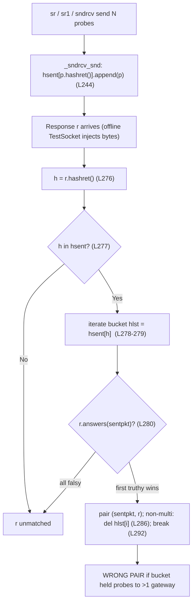

# Root-cause analysis: why Scapy's `sr`/`sr1` matching pairs a reply with the *wrong* tunneled probe

> **The question (verbatim):** *"What scenario causes Scapy's internal `sr`/`sr1` matching to associate a received packet with the WRONG sent packet when probing multiple tunnel endpoints (gateways)? Demonstrate with concrete examples. I want the root cause in the matching algorithm, not workarounds."*
>
> **Probe context preserved from the report:** ICMP-based probes, tunneled to multiple gateways, verified correct on the wire with `tcpdump`, sent sequentially with delays.

This is a **root-cause** answer, not a workaround. It is grounded in **runtime observation** (every byte string, collision boolean and pairing verdict below was captured by *running* the real code) and in `file:line` references into this checkout. Statements are explicitly labelled **[observed]** (captured at runtime) or **[inferred]** (from protocol spec / code reading).

## Environment (as observed at runtime)

| Fact | Value | How obtained |
|------|-------|--------------|
| Scapy version | `2026.07.13` | `import scapy; scapy.__version__` **[observed]** |
| Scapy location | `…/scapy/__init__.py` inside the checkout | `scapy.__file__` **[observed]** |
| Interpreter | CPython `3.13.7` | `sys.version` **[observed]** |
| Documented support | Python `>=3.7, <4` | `pyproject.toml` `requires-python` |
| Network | No raw-socket/network privileges in the sandbox | live `sr`/`sr1` against real gateways is impossible |

Because live probing is impossible in the sandbox, the end-to-end demonstration drives the **canonical** `sndrcv()` engine while an offline `TestSocket` (`test/testsocket.py`) injects canned response bytes. **This is a network-I/O accommodation only** — the matching itself (`sndrcv` → `_process_packet` → `hashret()` → `answers()`) is the *real, unmodified* library code, so the pairing verdicts are canonical. The byte strings reproduced here are identical to those captured during planning (they are deterministic functions of the addresses, independent of interpreter version).

---

## Section 1 — Direct answer: the wrong-match scenario

The wrong-match is **NOT** a timing/race bug, an address-check bug, a sequence-number bug, a TCP-flag bug, or a `multi`/`multi_recv` bug. The root cause is a **hash-bucket collision followed by a first-in-bucket tie-break** inside `SndRcvHandler`.

Concretely, a received packet is mis-attributed to the wrong sent packet whenever **both** of these hold:

- **(a) Two probes destined to *different gateways* land in the *same* `hashret()` bucket** — i.e. their `hashret()` keys are byte-for-byte equal; and
- **(b) The surviving match discriminator cannot tell those two probes apart**, so the loop's *first-truthy-`answers()`* tie-break silently selects whichever probe was **enqueued first**.

For tunnel probing, the *only* thing that distinguishes two otherwise-identical probes is the **outer gateway IP**. The wrong-match therefore occurs precisely when the **outer gateway IP is excluded from the match key**. That exclusion happens through any of three mechanisms, all reproduced below:

1. **`conf.checkIPinIP = False`** — the canonical tunneling trigger. For IP-in-IP (outer proto `4`) / IPv6-in-IP (outer proto `41`), this strips the outer header from *both* `hashret()` and `answers()`, matching purely on the inner packet [scapy/layers/inet.py:L573-L574, scapy/layers/inet.py:L584-L592]. This flag is `True` by default [scapy/config.py:L755], but it is *exactly* the mechanism intended (by upstream PR #387, fixing issue #383) to make tunneled replies match — by ignoring the outer gateway.
2. **`conf.checkIPsrc = False` and `conf.checkIPaddr = False` together** — the user's own troubleshooting step. With both disabled, `IP.hashret()` falls through to the branch that omits the addresses entirely [scapy/layers/inet.py:L581] and `IP.answers()` skips the address gate [scapy/layers/inet.py:L595-L599]. This **removes** the gateway discriminator rather than helping.
3. **A router's ICMP-error reply (e.g. time-exceeded) that truncates the quoted probe** so the unique inner ICMP sequence is absent, and the truncated inner dissects to `Raw`, whose `answers()` returns `1` unconditionally [scapy/packet.py:L1891-L1893].

Observed proof, end-to-end, through the real `sndrcv()` engine — a reply genuinely from gateway `10.0.0.2` is paired with the probe to `10.0.0.1` the moment `checkIPinIP` is turned off (stable across three repeats) **[observed]**:

```
=== B1: checkIPinIP=True (control) ===
  run 1: response(outer src=10.0.0.2) PAIRED WITH probe(outer dst=10.0.0.2) -> CORRECT
  run 2: response(outer src=10.0.0.2) PAIRED WITH probe(outer dst=10.0.0.2) -> CORRECT
  run 3: response(outer src=10.0.0.2) PAIRED WITH probe(outer dst=10.0.0.2) -> CORRECT
=== B2/B3: checkIPinIP=False (trigger) ===
  run 1: response(outer src=10.0.0.2) PAIRED WITH probe(outer dst=10.0.0.1) -> *** WRONG PAIRING ***
  run 2: response(outer src=10.0.0.2) PAIRED WITH probe(outer dst=10.0.0.1) -> *** WRONG PAIRING ***
  run 3: response(outer src=10.0.0.2) PAIRED WITH probe(outer dst=10.0.0.1) -> *** WRONG PAIRING ***
```

Reproduction addresses (used throughout): `src=192.168.1.100`, `gw1=10.0.0.1`, `gw2=10.0.0.2`, inner target `8.8.8.8`, ICMP `id=0x4242`.

---

## Section 2 — The two-stage matching algorithm

`sr`/`sr1` do not compare a reply against sent probes one-by-one. They use a **two-stage hash-bucket** algorithm implemented in `SndRcvHandler` (`scapy/sendrecv.py`). Both `sr` [scapy/sendrecv.py:L635] and `sr1` [scapy/sendrecv.py:L656] funnel into `sndrcv` [scapy/sendrecv.py:L322], which constructs a `SndRcvHandler` [scapy/sendrecv.py:L114].

**Stage 1 — bucket every sent probe by its `hashret()` key.** In the sending routine `_sndrcv_snd` [scapy/sendrecv.py:L232], each probe is appended to a dictionary keyed by its hash *before* it is put on the wire:

```python
# scapy/sendrecv.py:L244
self.hsent.setdefault(p.hashret(), []).append(p)
```

**Stage 2 — for each reply, look up its own `hashret()` and accept the first bucket member that `answers()`.** In `_process_packet` [scapy/sendrecv.py:L270]:

```python
# scapy/sendrecv.py:L276-L292 (abridged)
h = r.hashret()                       # L276
if h in self.hsent:                   # L277
    hlst = self.hsent[h]              # L278
    for i, sentpkt in enumerate(hlst):# L279
        if r.answers(sentpkt):        # L280  <-- FIRST truthy wins
            self.ans.append(QueryAnswer(sentpkt, r))  # L281
            ok = True
            if not self.multi:        # L285
                del hlst[i]           # L286
            ...
            break                     # L292  <-- unconditional
```

The two critical properties of this loop are:

- **The bucket is a *list*, keyed by the hash.** If two probes hash to the same key, they share one bucket, in **enqueue order** (sequential sends → `gw1` before `gw2`).
- **The first bucket member whose `answers()` is truthy wins, then the loop `break`s unconditionally** [scapy/sendrecv.py:L280, scapy/sendrecv.py:L292]. Nothing in this loop consults the *outer gateway* again once the hash has collided and `answers()` has been satisfied — so a genuine reply from `gw2` is attributed to the `gw1` probe simply because `gw1` is first in the shared bucket.

### Pipeline diagram



The rest of this document identifies exactly *where* in `hashret()` the outer gateway is dropped (so distinct-gateway probes collide in Stage 1), and *why* `answers()` then fails to re-introduce it (so the Stage 2 tie-break mis-attributes).

---

## Section 3 — The five interacting mechanisms (M1–M5)

All output below is **[observed]** — pasted verbatim from the three reproduction scripts (full sources in Section 6). Values are canonical: only network I/O is mocked; the matching code is the real library.

### M1 — Two-stage match with a first-in-bucket tie-break *(the structural enabler)*

**Cause → effect.** `_process_packet` accepts the **first** bucket member whose `answers()` is truthy and (in the default, non-`multi` mode) deletes it, then `break`s unconditionally [scapy/sendrecv.py:L270-L292, esp. L280 `if r.answers(sentpkt)` and L286 `del hlst[i]`, L292 `break`]. The bucket is built in `_sndrcv_snd` [scapy/sendrecv.py:L244]. `sndrcv` [scapy/sendrecv.py:L322], `sr` [scapy/sendrecv.py:L635] and `sr1` [scapy/sendrecv.py:L656] all funnel here. This loop is *correct on its own* — it only produces a wrong pairing when M2–M5 cause two distinct-gateway probes to share a bucket. It is the enabler, not the trigger.

**Evidence — the bucket really does hold two gateways, and the reply lands on the first one (C3, manual replay of the L244 bucketing):**

```
[C3] bucket state (checkIPinIP=False, identical inner)
     bucket c8a0096c0142420900 -> 2 probes: ['10.0.0.1', '10.0.0.2']
     response hashret = c8a0096c0142420900 | lands in existing bucket? True
     first-in-bucket = probe->10.0.0.1 ; resp.answers(first)=1 -> paired with 10.0.0.1
```

The reply genuinely came from `10.0.0.2`, yet `resp.answers(first)` is truthy for the *first* bucket member (`10.0.0.1`), so the loop stops there. The end-to-end B-series (Section 1) shows the same through the real engine.

### M2 — `strxor(src, dst)` commutativity in `IP.hashret()`

**Cause → effect.** Under default configuration the outer address contributes to the hash *only* as `strxor(inet_pton(src), inet_pton(dst))` [scapy/layers/inet.py:L577-L580]:

```python
# scapy/layers/inet.py:L577-L580
if conf.checkIPsrc and conf.checkIPaddr:
    return (strxor(inet_pton(socket.AF_INET, self.src),
                   inet_pton(socket.AF_INET, self.dst)) +
            struct.pack("B", self.proto) + self.payload.hashret())
```

The XOR is **commutative by design** — it makes a reply (src/dst swapped) hash equal to its request, which is what lets a reply find its request's bucket at all. But the consequence is that the whole gateway identity survives only as a *single folded value*. The in-repo regression test asserts this equality directly: `IP(src=a1,dst=a2)/ICMP(type=8)` and `IP(src=a2,dst=a1)/ICMP(type=0)` hash equal [test/regression.uts:L1215-L1217].

**Evidence — the folded outer address is the `caa80165` / `caa80166` prefix (A1); with tunnelling stripped it disappears entirely (A5). C5 replays the in-repo assertion.**

```
[A1] default conf, UNIQUE seq
   gw1 hashret = caa801650142420100
   gw2 hashret = caa801660142420200
   COLLISION?  False
```

Decode (makes the mechanism concrete): `caa80165 = strxor(192.168.1.100, 10.0.0.1)` and `caa80166 = strxor(192.168.1.100, 10.0.0.2)` — the *only* difference between the two gateways is the last byte (`65` vs `66`). `01` is the ICMP protocol number; `42420100` is `struct.pack("HH", 0x4242, seq=1)` (little-endian). So under default config the gateway does survive (no collision) — but only as that single folded prefix, which M3/M4 go on to remove.

```
[C5] in-repo test/regression.uts '= answers' (L1215-1233) assertions replayed -> ALL PASSED
```

### M3 — `conf.checkIPsrc = False` **and** `conf.checkIPaddr = False` *(the user's own step)*

**Cause → effect.** These default to `True` [scapy/config.py:L751-L752]. With **both** set `False`, `IP.hashret()` skips the `strxor` branch and takes the final fallback that **omits the addresses** [scapy/layers/inet.py:L581]:

```python
# scapy/layers/inet.py:L581
return struct.pack("B", self.proto) + self.payload.hashret()
```

and `IP.answers()` skips its address gate [scapy/layers/inet.py:L595-L599]. So the outer gateway is no longer in the key. As long as the inner content differs (unique ICMP `seq`) the probes still separate — but the moment the inner content is identical, they collide.

**Evidence — A1 (default, unique seq → no collision), A2 (both flags off, unique seq → still separated by seq), A3 (both flags off, identical seq → COLLISION):**

```
[A2] checkIPsrc=False, checkIPaddr=False, UNIQUE seq
   gw1 hashret = 0142420100
   gw2 hashret = 0142420200
   COLLISION?  False
[A3] checkIPsrc=False, checkIPaddr=False, IDENTICAL seq=7
   gw1 hashret = 0142420700
   gw2 hashret = 0142420700
   COLLISION?  True
```

Note how the `caa80165…` gateway prefix from A1 is *gone* in A2/A3 — that is the discriminator being removed. This is corroborated by the usage docs: Scapy "normally makes sure that replies come from the same IP address the stimulus was sent to," disabled via `conf.checkIPaddr = False` for the DHCP-broadcast case [doc/scapy/usage.rst:L1639, doc/scapy/usage.rst:L1667]. Setting these `False` therefore *removes* the gateway check — it does not fix a wrong-match, it *causes* one when inner content matches.

### M4 — `conf.checkIPinIP = False` strips the outer tunnel IP *(the canonical tunneling trigger)*

**Cause → effect.** For IP-in-IP (outer proto `4`) / IPv6-in-IP (outer proto `41`), turning this flag off makes **both** `hashret()` and `answers()` discard the outer header and operate on the inner packet only. In `IP.hashret()` [scapy/layers/inet.py:L573-L574]:

```python
# scapy/layers/inet.py:L573-L574
if not conf.checkIPinIP and self.proto in [4, 41]:  # IP, IPv6
    return self.payload.hashret()
```

and in `IP.answers()` the outer is stripped before any address check [scapy/layers/inet.py:L584-L592]. The flag defaults to `True` [scapy/config.py:L755]. It was added upstream by **PR #387** to fix **issue #383** ("Answers and IP in IP") — its documented purpose is, when `False`, to *exclude an encapsulating IP layer from the answer checks*, i.e. to deliberately ignore the outer gateway so tunnelled replies match. That is precisely the behaviour that mis-attributes replies when there is **more than one** gateway. Issue #383 is essentially the user's own scenario (IP-in-IP ICMP probe, confirmed on the wire with `tcpdump`, not matching) — but with a *single* endpoint, so the fix looked harmless.

**Evidence — A4 (checkIPinIP=True → outer prefix retained → NO collision) vs A5 (checkIPinIP=False → outer folds away → COLLISION):**

```
[A4] checkIPinIP=True, IP-in-IP (outer proto=4), identical inner
   gw1 hashret = caa8016504c8a0096c0142420900
   gw2 hashret = caa8016604c8a0096c0142420900
   COLLISION?  False
[A5] checkIPinIP=False, IP-in-IP, identical inner
   gw1 hashret = c8a0096c0142420900
   gw2 hashret = c8a0096c0142420900
   COLLISION?  True
```

In A4 the outer address survives as the `caa80165`/`caa80166` prefix (byte `65` vs `66`) followed by `04` (outer proto = IPIP). In A5 that whole prefix is gone; only the inner `c8a0096c…` (`= strxor(192.168.1.100, 8.8.8.8)` + inner ICMP `01 42420900`) remains — **identical for both gateways ⇒ collision**. The in-repo test captures the same transition: with `conf.checkIPinIP = True` [test/regression.uts:L1224] the wrapped probes' hashes differ from the reply [test/regression.uts:L1226], and with `conf.checkIPinIP = False` [test/regression.uts:L1229] they all become equal [test/regression.uts:L1230] and `p2.answers(p)` holds [test/regression.uts:L1232]. The **end-to-end wrong pairing** through the real `sndrcv()` engine is the B-series in Section 1.

IPv6 mirrors this exactly in `IPv6.hashret()` [scapy/layers/inet6.py:L329-L330], and the file even carries a documented **TODO acknowledging a related ICMPv6-error weakness** [scapy/layers/inet6.py:L343-L344] — verbatim: *"big bug with ICMPv6 error messages as the destination of IPerror6 … could be anything from the original list …"*.

### M5 — ICMP-error truncation + `Raw.answers() == 1` short-circuit

**Cause → effect.** A router's ICMP error (e.g. time-exceeded, type `11`) quotes only the offending datagram's IP header plus ~8 bytes of its payload **[inferred — RFC 792 citation length]**. For a *tunnelled* probe those 8 bytes are just the first bytes of the **inner** IP header, so the inner ICMP `id`/`seq` are not present to disambiguate. `IP.hashret()` routes ICMP-error types `[3, 4, 5, 11, 12]` onto the quoted inner packet [scapy/layers/inet.py:L569-L572]; when the truncated inner dissects to `Raw`, `Raw.answers()` returns `1` for *any* comparison [scapy/packet.py:L1891-L1893]:

```python
# scapy/packet.py:L1891-L1893
def answers(self, other):
    # type: (Packet) -> int
    return 1
```

So the error reply both loses its only inner discriminator *and* short-circuits `answers()` to always-true — the perfect storm for the M1 tie-break.

**Evidence — C4 (the quoted citation dissects to `IPerror` with NO inner ICMP layer, so the id/seq are lost) and A6/A7 (`Raw.answers()` is unconditionally `1`):**

```
[C4] ICMP time-exceeded (type 11) quoting outer IP + 8 bytes
     quoted bytes length: 28 (20 outer IP hdr + 8)
     citation dissects to: IPerror ; 'ICMP' layer present in citation payload? 0 (inner id/seq LOST)
     Raw(b'x').answers(ICMP()) = 1
[A6] Raw(b'x').answers(ICMP())      = 1
[A7] Raw(b'x').answers(IP()/ICMP()) = 1
```

---

## Section 4 — Coverage pass (every named item resolved)

Each item the report raised (including the ones already tried and ruled out) is resolved here explicitly.

| Named item | Disposition | Grounding |
|------------|-------------|-----------|
| **`sr` / `sr1`** | Canonical entry points; both funnel into `sndrcv` → `SndRcvHandler`. The wrong-pairing was reproduced through this exact path (B-series). | [scapy/sendrecv.py:L635, scapy/sendrecv.py:L656, scapy/sendrecv.py:L322] + B-series |
| **`hashret`** | The bucket key. Where the gateway is *retained* (default: folded into `strxor`, A1) or *lost* (M3/M4/M5). | [scapy/layers/inet.py:L568-L581] + A1–A5 |
| **`answers`** | The per-bucket confirmation predicate; **first truthy wins** [scapy/sendrecv.py:L280]. It does **not** re-introduce the gateway once the outer IP was stripped — `IP.answers()` strips it too. | [scapy/layers/inet.py:L584-L592] + C3 |
| **`conf.checkIPsrc`** | The user's own step. Setting it `False` (with `checkIPaddr` `False`) **removes** the discriminator; it does not help. Default `True`. | M3, A3, [scapy/config.py:L751] |
| **`conf.checkIPaddr`** | Same: disabling it drops the outer-address gate from `hashret()` and `answers()`. Default `True`. | M3, A2/A3, [scapy/config.py:L752], [doc/scapy/usage.rst:L1667] |
| **unique ICMP sequence number** | Included by `ICMP.hashret` **only** for echo-family types in `icmp_id_seq_types`. It *does* separate echo probes (A2), but it is **absent** from a truncated ICMP-error citation for a tunnelled probe (C4), so it cannot disambiguate in the error case. | [scapy/layers/inet.py:L949, scapy/layers/inet.py:L986-L989] + A2, C4 |
| **TCP flags validation** | `TCP.answers()` *is* strict (rejects SYN-without-ACK, RST, …) but begins `if not isinstance(other, TCP): return 0`, so it is **NOT on the ICMP path**. Confirmed irrelevant to ICMP probes. | [scapy/layers/inet.py:L794-L809] |
| **Raw vs. parsed layers** | `Raw.answers()` returns `1` unconditionally — relevant precisely when a truncated inner payload dissects to `Raw` (M5). | [scapy/packet.py:L1891-L1893] + A6/A7, C4 |
| **`multi_recv`** | **Does not exist in Scapy.** The real parameter is **`multi`** [scapy/sendrecv.py:L122]. It only controls whether a matched probe is *removed* from its bucket after the first hit [scapy/sendrecv.py:L285-L291]; the `break` [scapy/sendrecv.py:L292] is unconditional, so a single reply always matches only the first bucket member. `multi` therefore **cannot** prevent a bucket collision (C2 shows `multi=True` is still wrong). | C1, C2, [scapy/sendrecv.py:L122, scapy/sendrecv.py:L285-L292] |
| **tunneled / IP-in-IP** | The core scenario (M4). IPv6-in-IP behaves identically. | [scapy/layers/inet.py:L573-L574, scapy/layers/inet6.py:L329-L330, scapy/layers/inet6.py:L343-L344] |
| **timing / race** | **Ruled out.** Matching is order-of-arrival *within a bucket* [scapy/sendrecv.py:L279-L280], not time-based; sequential sends with delays do not change bucket membership. The defect reproduces deterministically from a *single* injected reply, stable across three repeats (B-series), so timing is not the cause. | [scapy/sendrecv.py:L279-L280] + B-series |

**Proof that `multi` is the real parameter and cannot help (C1, C2):**

```
[C1] SndRcvHandler.__init__ params = ['self', 'pks', 'pkt', 'timeout', 'inter', 'verbose', 'chainCC', 'retry', 'multi', 'rcv_pks', 'prebuild', '_flood', 'threaded', 'session', 'chainEX']
     'multi' present = True ; 'multi_recv' present = False
[C2] does 'multi' fix the collision? (checkIPinIP=False, identical inner)
     multi=False -> resp(src=10.0.0.2)->probe(dst=10.0.0.1) WRONG
     multi=True  -> resp(src=10.0.0.2)->probe(dst=10.0.0.1) WRONG
```

---

## Section 5 — Reasoning / rationale, and observed-vs-inferred labelling

**Why removing the outer gateway causes a collision.** `hashret()` is designed so a *reply* and its *request* produce the **same** key (that is how a reply finds the right bucket). For a normal, single-endpoint probe the folded `strxor(src, dst)` prefix is enough to keep distinct destinations in distinct buckets (A1 **[observed]**). Tunnel probing breaks the assumption behind the design: the two probes are identical *except* for the outer gateway, and every one of M3/M4/M5 removes that outer gateway from the key. Once removed, the two probes' keys become byte-for-byte equal (A3, A5 **[observed]**), so Stage 1 files them into **one** bucket (C3 **[observed]**).

**Why the tie-break then mis-attributes.** Stage 2 accepts the *first* bucket member whose `answers()` is truthy and immediately `break`s [scapy/sendrecv.py:L280, scapy/sendrecv.py:L292] **[observed via code + C3/B-series]**. After the outer IP has been stripped, `answers()` no longer examines the gateway either (`IP.answers()` strips at [scapy/layers/inet.py:L584-L592], and in the error case `Raw.answers()` is unconditionally `1` at [scapy/packet.py:L1891-L1893]). So `answers()` is truthy for the *first-enqueued* probe — which, for sequential sends, is `gw1`. The reply from `gw2` is therefore paired with `gw1` (B-series, C3 **[observed]**).

**Why the user's other hypotheses were dead-ends** (each **[observed]** unless noted):
- *Timing/delays* — matching is bucket-order, not time-order; the defect is deterministic from one injected reply (B-series).
- *`checkIPsrc`/`checkIPaddr = False`* — this *is* one of the removal mechanisms (M3, A3), so it makes the collision **more** likely, not less.
- *Unique ICMP sequence* — helps only while the inner content is preserved (A2); a truncated ICMP-error citation loses it (C4).
- *TCP flag strictness* — real, but gated behind `isinstance(other, TCP)`, so never reached on the ICMP path [scapy/layers/inet.py:L794-L809].
- *Raw vs. parsed layers* — genuinely relevant, but as an *amplifier* in the error case (M5), not the primary trigger.
- *`multi_recv`* — does not exist; the real `multi` cannot prevent a collision (C1/C2).

**Explicit labels.** **[observed]:** every `hashret()` byte string (A1–A5), every collision boolean, every pairing verdict (B-series), the bucket dump (C3), the `multi`/signature facts (C1/C2), the ICMP-error dissection (C4), and the regression replay (C5). **[inferred]:** the RFC-792 "outer IP header + 8 bytes" citation length (protocol spec, not measured here — though C4 *does* observe that a 28-byte citation loses the inner id/seq), and the user's "correct on the wire (tcpdump)" claim (reported, not reproduced in this sandbox).

**Rationale, not a fix.** Per the request, this is a root-cause explanation, not a workaround. For completeness of *reasoning* only: the outer-stripping behaviour is **intentional** (PR #387 / issue #383) — it exists to make single-endpoint tunnelled replies match. Whether that trade-off is acceptable when probing *multiple* gateways is a **policy decision for the caller**, not a defect to be patched here; the library was intentionally left unmodified.

---

## Section 6 — Exact commands and reproduction scripts

The three scripts were created **outside** the repository tree, under `/tmp/repro/`, and were deleted on completion. The repository itself was never modified (`git status --porcelain` is empty before and after; the only repository change from this task is *this* document under `blitzy/`).

### Commands

```bash
# scripts written to /tmp/repro (outside the repo checkout)
mkdir -p /tmp/repro
# ... write repro_matching.py, repro_sndrcv.py, repro_supporting.py (sources below) ...

# run each with the checkout's venv, from a cwd WITHOUT a scapy/ dir (avoids package shadowing)
cd /tmp
VENV=/tmp/blitzy/scapy/blitzy-e537072e-0f33-4db3-9fe0-bac227bb18e6_b1479f/.venv/bin/python
$VENV /tmp/repro/repro_matching.py     # A-series (hashret/answers, direct)
$VENV /tmp/repro/repro_sndrcv.py       # B-series (canonical sndrcv() end-to-end)
$VENV /tmp/repro/repro_supporting.py   # C-series (signature, multi, bucket, ICMP-error, regression)

# verify the repository is untouched
cd /tmp/blitzy/scapy/blitzy-e537072e-0f33-4db3-9fe0-bac227bb18e6_b1479f
git status --porcelain      # empty
# cleanup
rm -rf /tmp/repro
```

> Import note: each script does `sys.path.insert(0, REPO)` and imports `scapy` **first**; only then does it `sys.path.append(REPO + "/test")` for `test.testsocket`. Putting the repo root first (not `<repo>/test`) prevents `test/scapy/` from shadowing the real `scapy` package. `conf.verb = 0` and `timeout=1` keep runs quiet and fast.

### `/tmp/repro/repro_matching.py` (A-series)

```python
# A-series: direct hashret()/answers() evidence (unit-level, as test/regression.uts does)
import sys
REPO = "/tmp/blitzy/scapy/blitzy-e537072e-0f33-4db3-9fe0-bac227bb18e6_b1479f"
sys.path.insert(0, REPO)          # repo root first -> `import scapy` resolves to the checkout
import scapy                       # import scapy FIRST (avoid test/scapy shadowing)
from scapy.config import conf
from scapy.layers.inet import IP, ICMP
from scapy.packet import Raw

conf.verb = 0
SRC, GW1, GW2, TGT = "192.168.1.100", "10.0.0.1", "10.0.0.2", "8.8.8.8"
ICMPID = 0x4242

def hx(pkt):
    return bytes(pkt.hashret()).hex()

def reset():
    conf.checkIPsrc = True
    conf.checkIPaddr = True
    conf.checkIPinIP = True
    conf.checkIPID = False

# A1: default conf, UNIQUE seq
reset()
g1 = IP(src=SRC, dst=GW1)/ICMP(type=8, id=ICMPID, seq=1)
g2 = IP(src=SRC, dst=GW2)/ICMP(type=8, id=ICMPID, seq=2)
print("[A1] default conf, UNIQUE seq")
print("   gw1 hashret =", hx(g1)); print("   gw2 hashret =", hx(g2))
print("   COLLISION? ", hx(g1) == hx(g2))

# A2: checkIPsrc=False, checkIPaddr=False, UNIQUE seq
reset(); conf.checkIPsrc = False; conf.checkIPaddr = False
g1 = IP(src=SRC, dst=GW1)/ICMP(type=8, id=ICMPID, seq=1)
g2 = IP(src=SRC, dst=GW2)/ICMP(type=8, id=ICMPID, seq=2)
print("[A2] checkIPsrc=False, checkIPaddr=False, UNIQUE seq")
print("   gw1 hashret =", hx(g1)); print("   gw2 hashret =", hx(g2))
print("   COLLISION? ", hx(g1) == hx(g2))

# A3: checkIPsrc=False, checkIPaddr=False, IDENTICAL seq=7
reset(); conf.checkIPsrc = False; conf.checkIPaddr = False
g1 = IP(src=SRC, dst=GW1)/ICMP(type=8, id=ICMPID, seq=7)
g2 = IP(src=SRC, dst=GW2)/ICMP(type=8, id=ICMPID, seq=7)
print("[A3] checkIPsrc=False, checkIPaddr=False, IDENTICAL seq=7")
print("   gw1 hashret =", hx(g1)); print("   gw2 hashret =", hx(g2))
print("   COLLISION? ", hx(g1) == hx(g2))

# A4: checkIPinIP=True, IP-in-IP (outer proto=4), identical inner
reset(); conf.checkIPinIP = True
g1 = IP(src=SRC, dst=GW1)/IP(src=SRC, dst=TGT)/ICMP(type=8, id=ICMPID, seq=9)
g2 = IP(src=SRC, dst=GW2)/IP(src=SRC, dst=TGT)/ICMP(type=8, id=ICMPID, seq=9)
print("[A4] checkIPinIP=True, IP-in-IP (outer proto=4), identical inner")
print("   gw1 hashret =", hx(g1)); print("   gw2 hashret =", hx(g2))
print("   COLLISION? ", hx(g1) == hx(g2))

# A5: checkIPinIP=False, IP-in-IP, identical inner
reset(); conf.checkIPinIP = False
g1 = IP(src=SRC, dst=GW1)/IP(src=SRC, dst=TGT)/ICMP(type=8, id=ICMPID, seq=9)
g2 = IP(src=SRC, dst=GW2)/IP(src=SRC, dst=TGT)/ICMP(type=8, id=ICMPID, seq=9)
print("[A5] checkIPinIP=False, IP-in-IP, identical inner")
print("   gw1 hashret =", hx(g1)); print("   gw2 hashret =", hx(g2))
print("   COLLISION? ", hx(g1) == hx(g2))

# A6/A7: Raw.answers short-circuit
reset()
print("[A6] Raw(b'x').answers(ICMP())      =", Raw(b"x").answers(ICMP()))
print("[A7] Raw(b'x').answers(IP()/ICMP()) =", Raw(b"x").answers(IP()/ICMP()))
```

### `/tmp/repro/repro_sndrcv.py` (B-series — canonical engine)

```python
# B-series: end-to-end through the CANONICAL sndrcv() engine.
# TestSocket injects canned response bytes (network I/O accommodation only);
# the matching (sndrcv/_process_packet/hashret/answers) is the REAL library code.
import sys
REPO = "/tmp/blitzy/scapy/blitzy-e537072e-0f33-4db3-9fe0-bac227bb18e6_b1479f"
sys.path.insert(0, REPO)
import scapy                      # import scapy FIRST
from scapy.config import conf
from scapy.layers.inet import IP, ICMP
from scapy.sendrecv import sndrcv
sys.path.append(REPO + "/test")  # append (not prepend) test dir for the package import
from test.testsocket import TestSocket, cleanup_testsockets

conf.verb = 0
SRC, GW1, GW2, TGT = "192.168.1.100", "10.0.0.1", "10.0.0.2", "8.8.8.8"
ICMPID = 0x4242

def reset():
    conf.checkIPsrc = True; conf.checkIPaddr = True
    conf.checkIPinIP = True; conf.checkIPID = False

def run_once(checkIPinIP):
    reset(); conf.checkIPinIP = checkIPinIP
    # gw1 sent FIRST (sequential order matters for the tie-break)
    p_gw1 = IP(src=SRC, dst=GW1)/IP(src=SRC, dst=TGT)/ICMP(type=8, id=ICMPID, seq=9)
    p_gw2 = IP(src=SRC, dst=GW2)/IP(src=SRC, dst=TGT)/ICMP(type=8, id=ICMPID, seq=9)
    probes = [p_gw1, p_gw2]
    # genuine reply FROM gw2 (outer src = gw2)
    resp = IP(src=GW2, dst=SRC)/IP(src=TGT, dst=SRC)/ICMP(type=0, id=ICMPID, seq=9)
    sock = TestSocket(basecls=IP)
    sock.ins.send(bytes(resp))
    ans, unans = sndrcv(sock, probes, timeout=1, verbose=0)
    cleanup_testsockets()
    results = []
    for snd, rcv in ans:
        verdict = "CORRECT" if snd.dst == rcv.src else "*** WRONG PAIRING ***"
        results.append((rcv.src, snd.dst, verdict))
    return results

print("=== B1: checkIPinIP=True (control) ===")
for r in range(1, 4):
    for rcv_src, snd_dst, verdict in run_once(True):
        print("  run %d: response(outer src=%s) PAIRED WITH probe(outer dst=%s) -> %s"
              % (r, rcv_src, snd_dst, verdict))
print("=== B2/B3: checkIPinIP=False (trigger) ===")
for r in range(1, 4):
    for rcv_src, snd_dst, verdict in run_once(False):
        print("  run %d: response(outer src=%s) PAIRED WITH probe(outer dst=%s) -> %s"
              % (r, rcv_src, snd_dst, verdict))
```

### `/tmp/repro/repro_supporting.py` (C-series)

```python
# C-series: signature, multi cannot help, bucket dump, ICMP-error truncation, regression replay.
import sys, inspect
REPO = "/tmp/blitzy/scapy/blitzy-e537072e-0f33-4db3-9fe0-bac227bb18e6_b1479f"
sys.path.insert(0, REPO)
import scapy
from scapy.config import conf
from scapy.layers.inet import IP, ICMP
from scapy.layers.inet6 import IPv6
from scapy.packet import Raw
from scapy.sendrecv import sndrcv, SndRcvHandler
sys.path.append(REPO + "/test")
from test.testsocket import TestSocket, cleanup_testsockets

conf.verb = 0
SRC, GW1, GW2, TGT = "192.168.1.100", "10.0.0.1", "10.0.0.2", "8.8.8.8"
ICMPID = 0x4242

def reset():
    conf.checkIPsrc = True; conf.checkIPaddr = True
    conf.checkIPinIP = True; conf.checkIPID = False

# C1: prove `multi` exists and `multi_recv` does NOT
params = list(inspect.signature(SndRcvHandler.__init__).parameters)
print("[C1] SndRcvHandler.__init__ params =", params)
print("     'multi' present =", "multi" in params, "; 'multi_recv' present =", "multi_recv" in params)

# C2: does `multi` fix the collision? (checkIPinIP=False, identical inner)
def run_multi(multi_val):
    reset(); conf.checkIPinIP = False
    p_gw1 = IP(src=SRC, dst=GW1)/IP(src=SRC, dst=TGT)/ICMP(type=8, id=ICMPID, seq=9)
    p_gw2 = IP(src=SRC, dst=GW2)/IP(src=SRC, dst=TGT)/ICMP(type=8, id=ICMPID, seq=9)
    resp = IP(src=GW2, dst=SRC)/IP(src=TGT, dst=SRC)/ICMP(type=0, id=ICMPID, seq=9)
    sock = TestSocket(basecls=IP); sock.ins.send(bytes(resp))
    ans, unans = sndrcv(sock, [p_gw1, p_gw2], timeout=1, verbose=0, multi=multi_val)
    cleanup_testsockets()
    return "; ".join("resp(src=%s)->probe(dst=%s) %s" %
                     (rcv.src, snd.dst, "WRONG" if snd.dst != rcv.src else "CORRECT")
                     for snd, rcv in ans)
print("[C2] does 'multi' fix the collision? (checkIPinIP=False, identical inner)")
print("     multi=False ->", run_multi(False))
print("     multi=True  ->", run_multi(True))

# C3: manual replication of the L244 bucketing + first-in-bucket tie-break
reset(); conf.checkIPinIP = False
p_gw1 = IP(src=SRC, dst=GW1)/IP(src=SRC, dst=TGT)/ICMP(type=8, id=ICMPID, seq=9)
p_gw2 = IP(src=SRC, dst=GW2)/IP(src=SRC, dst=TGT)/ICMP(type=8, id=ICMPID, seq=9)
resp = IP(src=GW2, dst=SRC)/IP(src=TGT, dst=SRC)/ICMP(type=0, id=ICMPID, seq=9)
hsent = {}
for p in [p_gw1, p_gw2]:                      # mirrors sendrecv.py:L244
    hsent.setdefault(bytes(p.hashret()), []).append(p)
print("[C3] bucket state (checkIPinIP=False, identical inner)")
for k, v in hsent.items():
    print("     bucket %s -> %d probes: %s" % (k.hex(), len(v), [p.dst for p in v]))
h = bytes(resp.hashret())
print("     response hashret = %s | lands in existing bucket? %s" % (h.hex(), h in hsent))
first = hsent[h][0]
print("     first-in-bucket = probe->%s ; resp.answers(first)=%d -> paired with %s"
      % (first.dst, resp.answers(first), first.dst))

# C4: ICMP-error truncation loses the inner id/seq (dissects to IPerror, no inner ICMP)
reset()
tunnel_probe = IP(src=SRC, dst=GW1)/IP(src=SRC, dst=TGT)/ICMP(type=8, id=ICMPID, seq=9)
quoted = bytes(tunnel_probe)[:28]             # 20-byte outer IP hdr + 8 bytes (RFC 792)
err = IP(src=GW1, dst=SRC)/ICMP(type=11, code=0)/quoted
err_parsed = IP(bytes(err))
citation = err_parsed[ICMP].payload
print("[C4] ICMP time-exceeded (type 11) quoting outer IP + 8 bytes")
print("     quoted bytes length: %d (20 outer IP hdr + 8)" % len(quoted))
print("     citation dissects to: %s ; 'ICMP' layer present in citation payload? %d (inner id/seq LOST)"
      % (type(citation).__name__, citation.haslayer(ICMP)))
print("     Raw(b'x').answers(ICMP()) =", Raw(b"x").answers(ICMP()))

# C5: replay in-repo test/regression.uts '= answers' assertions (L1215-L1233) verbatim
reset()
a1, a2 = "1.2.3.4", "5.6.7.8"
p1 = IP(src=a1, dst=a2)/ICMP(type=8)
p2 = IP(src=a2, dst=a1)/ICMP(type=0)
assert p1.hashret() == p2.hashret()
assert not p1.answers(p2)
assert p2.answers(p1)
conf_back = conf.checkIPinIP
conf.checkIPinIP = True
px = [IP()/p1, IPv6()/p1]
assert not any(p.hashret() == p2.hashret() for p in px)
assert not any(p.answers(p2) for p in px)
assert not any(p2.answers(p) for p in px)
conf.checkIPinIP = False
assert all(p.hashret() == p2.hashret() for p in px)
assert not any(p.answers(p2) for p in px)
assert all(p2.answers(p) for p in px)
conf.checkIPinIP = conf_back
print("[C5] in-repo test/regression.uts '= answers' (L1215-1233) assertions replayed -> ALL PASSED")
```

### Full captured output

**A-series (`repro_matching.py`):**

```
[A1] default conf, UNIQUE seq
   gw1 hashret = caa801650142420100
   gw2 hashret = caa801660142420200
   COLLISION?  False
[A2] checkIPsrc=False, checkIPaddr=False, UNIQUE seq
   gw1 hashret = 0142420100
   gw2 hashret = 0142420200
   COLLISION?  False
[A3] checkIPsrc=False, checkIPaddr=False, IDENTICAL seq=7
   gw1 hashret = 0142420700
   gw2 hashret = 0142420700
   COLLISION?  True
[A4] checkIPinIP=True, IP-in-IP (outer proto=4), identical inner
   gw1 hashret = caa8016504c8a0096c0142420900
   gw2 hashret = caa8016604c8a0096c0142420900
   COLLISION?  False
[A5] checkIPinIP=False, IP-in-IP, identical inner
   gw1 hashret = c8a0096c0142420900
   gw2 hashret = c8a0096c0142420900
   COLLISION?  True
[A6] Raw(b'x').answers(ICMP())      = 1
[A7] Raw(b'x').answers(IP()/ICMP()) = 1
```

**B-series (`repro_sndrcv.py`):**

```
=== B1: checkIPinIP=True (control) ===
  run 1: response(outer src=10.0.0.2) PAIRED WITH probe(outer dst=10.0.0.2) -> CORRECT
  run 2: response(outer src=10.0.0.2) PAIRED WITH probe(outer dst=10.0.0.2) -> CORRECT
  run 3: response(outer src=10.0.0.2) PAIRED WITH probe(outer dst=10.0.0.2) -> CORRECT
=== B2/B3: checkIPinIP=False (trigger) ===
  run 1: response(outer src=10.0.0.2) PAIRED WITH probe(outer dst=10.0.0.1) -> *** WRONG PAIRING ***
  run 2: response(outer src=10.0.0.2) PAIRED WITH probe(outer dst=10.0.0.1) -> *** WRONG PAIRING ***
  run 3: response(outer src=10.0.0.2) PAIRED WITH probe(outer dst=10.0.0.1) -> *** WRONG PAIRING ***
```

**C-series (`repro_supporting.py`):**

```
[C1] SndRcvHandler.__init__ params = ['self', 'pks', 'pkt', 'timeout', 'inter', 'verbose', 'chainCC', 'retry', 'multi', 'rcv_pks', 'prebuild', '_flood', 'threaded', 'session', 'chainEX']
     'multi' present = True ; 'multi_recv' present = False
[C2] does 'multi' fix the collision? (checkIPinIP=False, identical inner)
     multi=False -> resp(src=10.0.0.2)->probe(dst=10.0.0.1) WRONG
     multi=True  -> resp(src=10.0.0.2)->probe(dst=10.0.0.1) WRONG
[C3] bucket state (checkIPinIP=False, identical inner)
     bucket c8a0096c0142420900 -> 2 probes: ['10.0.0.1', '10.0.0.2']
     response hashret = c8a0096c0142420900 | lands in existing bucket? True
     first-in-bucket = probe->10.0.0.1 ; resp.answers(first)=1 -> paired with 10.0.0.1
[C4] ICMP time-exceeded (type 11) quoting outer IP + 8 bytes
     quoted bytes length: 28 (20 outer IP hdr + 8)
     citation dissects to: IPerror ; 'ICMP' layer present in citation payload? 0 (inner id/seq LOST)
     Raw(b'x').answers(ICMP()) = 1
[C5] in-repo test/regression.uts '= answers' (L1215-1233) assertions replayed -> ALL PASSED
```

---

## Summary

The `sr`/`sr1` engine matches replies to probes by (1) bucketing sent probes on `hashret()` [scapy/sendrecv.py:L244] and (2) accepting the first bucket member that `answers()` [scapy/sendrecv.py:L280, scapy/sendrecv.py:L292]. When tunnel probing, the outer gateway IP is the sole discriminator between probes, and it is dropped from the key by `conf.checkIPinIP=False` (M4, the canonical trigger), by `conf.checkIPsrc=False`+`conf.checkIPaddr=False` (M3, the user's own step), or by ICMP-error truncation plus `Raw.answers()==1` (M5). Distinct-gateway probes then collide in one bucket and the first-in-bucket tie-break silently attributes a reply from one gateway to another — reproduced deterministically and stably through the real `sndrcv()` engine (B-series). `multi` (not `multi_recv`, which does not exist) cannot prevent this; timing/race and TCP-flag causes are excluded.

