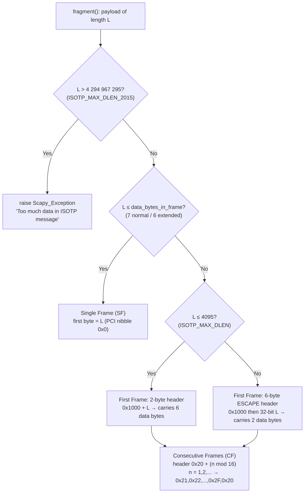

# Scapy ISO-TP (ISO 15765-2) Message Segmentation — Onboarding Q&A

> **Abstract.** This document answers seven onboarding questions about how Scapy's
> **ISO-TP (ISO 15765-2)** automotive transport-protocol module performs **message
> segmentation**. Every answer is grounded in the actual source code (cited as
> `path:Lstart-Lend`) and, where the question is empirical, is substantiated with
> **verbatim runtime output** captured by executing the in-repository Scapy. Findings
> are pinned to Scapy `2026.06.26` running on Python `3.12.3`; the cited line numbers
> correspond to this exact source checkout. The framing logic under study
> (`ISOTP.fragment()`) is **pure Python**, so the 20-byte and 5000-byte answers require
> no CAN hardware and no `python-can`; the receive-timeout behaviour is observed
> in-memory through Scapy's own paired `TestSocket(CAN)` abstraction.

## How to read this document

The seven questions (R1–R7) are answered in dedicated sections below. Each section
states the **answer up front**, then explains the **reasoning ("why")** by walking
through the relevant source, and — for the empirical questions (R3, R6, R7) — embeds
the **captured command output** that proves the claim. Section 9 is a one-glance
summary table; Section 10 lists every source locator used plus the corroborating
ISO 15765-2 standard rationale.

| # | Question (as asked) | Section |
|---|---------------------|---------|
| R1 | How do I set up Scapy and load the ISO-TP module from the automotive contrib packages? | [§1](#1-overview--environment-setup--module-loading-r1) |
| R2 | What happens if I send a payload larger than fits in a single CAN frame? | [§3](#3-r2--what-happens-when-a-payload-is-larger-than-one-can-frame) |
| R3 | Can I see the actual frames generated, and how many, for a 20-byte payload? | [§4](#4-r3--concrete-20-byte-example-the-actual-frames) |
| R4 | What do the first bytes of each generated frame look like? | [§5](#5-r4--what-the-first-bytes-of-each-frame-look-like-and-why) |
| R5 | What is the maximum payload size before segmentation kicks in? | [§6](#6-r5--maximum-payload-before-segmentation-begins) |
| R6 | What error/behaviour occurs when sending something absurdly large like 5000 bytes? | [§7](#7-r6--absurdly-large-5000-bytes) |
| R7 | On receive, if a middle frame never arrives, what timeout applies and what error appears? | [§8](#8-r7--missing-middle-frame-on-receive-timeout--behaviour) |

---

## 1. Overview & Environment Setup / Module Loading (R1)

**Answer.** Install/initialise Scapy as usual, then load the ISO-TP contribution module
with **`load_contrib('isotp')`** (the canonical Scapy way to pull in a `scapy/contrib`
module), or import its public symbols directly with
**`from scapy.contrib.isotp import ISOTP, ISOTPSocket`**. After loading, the public API
— `ISOTP`, `ISOTP_SF`/`ISOTP_FF`/`ISOTP_CF`/`ISOTP_FC`, `ISOTPSoftSocket`,
`ISOTPSession`, `ISOTPMessageBuilder`, and `isotp_scan` — is importable.

```python
# Option A — the Scapy console / REPL idiom
from scapy.all import *
load_contrib('isotp')                       # registers and imports scapy.contrib.isotp

# Option B — explicit import (equivalent for our purposes)
from scapy.contrib.isotp import ISOTP, ISOTPSocket
# also available: ISOTP_SF, ISOTP_FF, ISOTP_CF, ISOTP_FC,
#                 ISOTPSoftSocket, ISOTPSession, ISOTPMessageBuilder, isotp_scan
```

### 1.1 ⚠️ Framing correction: ISO-TP is a *sibling* of `automotive`, not inside it

The question assumes ISO-TP lives "inside the automotive contrib packages." That is a
natural assumption, but it is **not** how the tree is laid out. The ISO-TP module is the
package **`scapy/contrib/isotp/`**, which sits **directly under `scapy/contrib/`** as a
**sibling of `scapy/contrib/automotive/`** — it is *not* a member of the `automotive`
package. (Verified: `scapy/contrib/isotp` and `scapy/contrib/automotive` are two
distinct sibling directories.) Both are "contrib" packages, but you load ISO-TP with the
name `'isotp'`, not via `automotive`.

### 1.2 How `load_contrib('isotp')` finds the module

`load_contrib` keys on two magic comments at the top of the package's `__init__.py`
[`scapy/contrib/isotp/__init__.py:L6-L7`]:

```python
# scapy.contrib.description = ISO-TP (ISO 15765-2)
# scapy.contrib.status = loads
```

The `description` gives the module its human-readable name and `status = loads` marks it
as loadable on import. The package then re-exports its public symbols through `__all__`
[`scapy/contrib/isotp/__init__.py:L22-L25`]:

```python
__all__ = ["ISOTP", "ISOTPHeader", "ISOTPHeaderEA", "ISOTP_SF", "ISOTP_FF",
           "ISOTP_CF", "ISOTP_FC", "ISOTPSoftSocket", "ISOTPSession",
           "ISOTPSocket", "ISOTPMessageBuilder", "isotp_scan",
           "USE_CAN_ISOTP_KERNEL_MODULE", "log_isotp"]
```

### 1.3 Which socket does `ISOTPSocket` resolve to?

`ISOTPSocket` is **not a fixed class** — the package selects the concrete implementation
at import time [`scapy/contrib/isotp/__init__.py:L27`, `L32-L47`]:

- The default `USE_CAN_ISOTP_KERNEL_MODULE = False` [`__init__.py:L27`].
- On Linux, if `conf.contribs['ISOTP']['use-can-isotp-kernel-module']` is set truthy, the
  flag flips to `True` [`__init__.py:L32-L39`].
- Finally `ISOTPSocket = ISOTPNativeSocket` when the flag is `True`, otherwise
  `ISOTPSocket = ISOTPSoftSocket` [`__init__.py:L44-L47`].

So **by default `ISOTPSocket` is the pure-Python `ISOTPSoftSocket`**. Only when you
explicitly opt into the Linux kernel `can-isotp` module does it become
`ISOTPNativeSocket`. The receive-timeout answer (R7) concerns the default
`ISOTPSoftSocket` path.

### 1.4 No CAN hardware or `python-can` is required for these questions

The segmentation logic we examine for R2–R6 is the method `ISOTP.fragment()`, which is
**pure Python byte-packing** — it constructs `CAN(...)` packet objects in memory and
never touches a bus. The receive-timeout question (R7) is demonstrated with Scapy's own
in-memory `TestSocket(CAN)` (`test/testsocket.py`), which simulates a CAN bus via paired
object pipes. Consequently **no SocketCAN interface, no CAN hardware, and no `python-can`
runtime are needed** to reproduce any answer here.

---

## 2. ISO-TP Frame-Format Primer

To read the answers below you need the ISO-TP frame vocabulary. ISO-TP encodes the
**frame type in the high nibble of the first byte** of each CAN frame's data field — this
first byte is the *Protocol Control Information* (PCI). There are four frame types, each
with a PCI-nibble constant and a Scapy packet class
[`scapy/contrib/isotp/isotp_packet.py:L42-L45`]:

| Frame type | PCI nibble | Constant (`isotp_packet.py:L42-L45`) | Packet class | Role |
|------------|-----------|--------------------------------------|--------------|------|
| **Single Frame (SF)** | `0x0` | `N_PCI_SF = 0x00` | `ISOTP_SF` | A whole message that fits in one CAN frame |
| **First Frame (FF)** | `0x1` | `N_PCI_FF = 0x10` | `ISOTP_FF` | The opening frame of a segmented message (carries the total length) |
| **Consecutive Frame (CF)** | `0x2` | `N_PCI_CF = 0x20` | `ISOTP_CF` | Each subsequent chunk of a segmented message (carries a sequence number) |
| **Flow Control (FC)** | `0x3` | `N_PCI_FC = 0x30` | `ISOTP_FC` | Receiver→sender pacing (continue / wait / abort) |

On dissection, `ISOTPHeader.guess_payload_class` reads that nibble to pick the class
[`scapy/contrib/isotp/isotp_packet.py:L222-L238`]:

```python
t = (orb(payload[0]) & 0xf0) >> 4
# 0 -> ISOTP_SF, 1 -> ISOTP_FF, 2 -> ISOTP_CF, else -> ISOTP_FC
```

The four packet-class field layouts make the leading bytes precise
[`scapy/contrib/isotp/isotp_packet.py:L271-L309`]:

- **`ISOTP_SF`** [`L271-L277`]: 4-bit `type=0`, 4-bit `message_size` (a `BitFieldLenField`
  carrying the data length), then `data`. So the SF first byte is simply
  `0x0_` with the low nibble = payload length.
- **`ISOTP_FF`** [`L280-L288`]: 4-bit `type=1`, **12-bit** `message_size`, then a
  `ConditionalField(BitField('extended_message_size', 0, 32), lambda pkt: pkt.message_size == 0)`
  — i.e. a **32-bit escape length** that is present **only when the 12-bit field is 0**,
  followed by `data`. This conditional is exactly the ISO-TP 2016 large-message escape.
- **`ISOTP_CF`** [`L291-L297`]: 4-bit `type=2`, 4-bit `index` (the sequence number),
  then `data`.
- **`ISOTP_FC`** [`L300-L309`]: 4-bit `type=3`, 4-bit `fc_flag` (`0:continue`, `1:wait`,
  `2:abort`), `block_size` (`ByteField`), `separation_time` (`ByteField`).

Finally, each ISO-TP frame is physically carried inside a **`CAN`** packet. The CAN class
[`scapy/layers/can.py:L64`] has `fields_desc` [`scapy/layers/can.py:L97-L105`] =
`flags` (3-bit), `identifier` (29-bit), `length`, `reserved`, and **`data`**
(`StrLenField`, `scapy/layers/can.py:L104`). The ISO-TP PCI/payload bytes live in this
CAN `.data` field, and **the first byte of `.data` is the PCI byte** — which is why the
experiments below inspect `frame.data` to read the leading bytes.

---

## 3. R2 — What Happens When a Payload Is Larger Than One CAN Frame?

**Answer.** When the diagnostic payload is too large to fit in a single CAN frame,
`ISOTP.fragment()` automatically **segments** it: instead of one Single Frame it emits a
**First Frame (FF)** followed by one or more **Consecutive Frames (CF)**. Nothing fails
or raises — segmentation is the normal, expected path.

**Why.** A classic CAN frame carries at most 8 data bytes
(`CAN_MAX_DLEN = 8`, [`scapy/contrib/isotp/isotp_packet.py:L34`]). ISO-TP spends the
first byte of every frame on the PCI, so under normal addressing only **7 bytes** of
real payload fit in one frame (6 bytes under extended addressing — see R5). The whole
decision lives in `ISOTP.fragment()` [`scapy/contrib/isotp/isotp_packet.py:L92-L152`]:

1. Compute the per-frame payload budget: `data_bytes_in_frame = 7`, dropping to `6` if
   `rx_ext_address is not None` [`isotp_packet.py:L99-L101`].
2. If the payload exceeds the 32-bit maximum (`ISOTP_MAX_DLEN_2015 = 4294967295`), raise
   `Scapy_Exception("Too much data in ISOTP message")` [`isotp_packet.py:L103-L104`].
3. Otherwise, **if it fits** (`len(data) <= data_bytes_in_frame`), build a single
   **Single Frame**: `frame_data = struct.pack('B', len(self.data)) + self.data`
   [`isotp_packet.py:L106-L117`].
4. **Otherwise segment**: build a First Frame [`isotp_packet.py:L119-L132`] then loop
   producing Consecutive Frames [`isotp_packet.py:L134-L152`].

The decision flow:



In short: **"larger than one frame" is not an error condition — it triggers
segmentation into FF + CF(s).** The concrete shape of that segmentation is shown next.

---

## 4. R3 — Concrete 20-Byte Example: The Actual Frames

**Answer.** `ISOTP(b"A"*20).fragment()` yields **exactly 3 CAN frames**: one First Frame
followed by two Consecutive Frames.

**Evidence (captured runtime output).** Running a short script against the in-repository
Scapy — which prints the frame count and the leading byte (and full `.data` hex) of each
generated `CAN` frame — produces:

```
ISOTP_MAX_DLEN (12-bit): 4095
ISOTP_MAX_DLEN_2015 (32-bit): 4294967295
==================================================
20-byte payload -> frame count: 3
  frame[0] CAN.data first byte = 0x10  (full data=1014414141414141)
  frame[1] CAN.data first byte = 0x21  (full data=2141414141414141)
  frame[2] CAN.data first byte = 0x22  (full data=2241414141414141)
==================================================
6-byte payload -> 1 frame(s) [SINGLE], first byte 0x06
7-byte payload -> 1 frame(s) [SINGLE], first byte 0x07
8-byte payload -> 2 frame(s) [SEGMENTED], first byte 0x10
ext-addr 6-byte -> 1 frame(s); ext-addr 7-byte -> 2 frame(s)
==================================================
5000-byte payload -> frame count: 715
  FF first 6 bytes (escape header+data): 100000001388
  CF1 first byte = 0x21, last CF first byte = 0x2a
  defragment round-trip equal: False
==================================================
```

**Why exactly 3 frames?** The payload is 20 bytes, which is `> 7`, so it must be
segmented (R2). The arithmetic of how 20 bytes distribute across frames is dictated by
`fragment()`:

- **Frame 0 — First Frame.** Because `20 <= 4095`, the FF uses a **2-byte** header
  (`struct.pack(">H", 20 + 0x1000)`, [`isotp_packet.py:L120-L121`]). With `idx = 8 -
  len(frame_header) = 8 - 2 = 6` [`isotp_packet.py:L126`], the FF carries the **first 6**
  payload bytes (`b"AAAAAA"`). That leaves `20 - 6 = 14` bytes to send.
- **Frames 1 & 2 — Consecutive Frames.** Each CF spends 1 byte on its PCI/sequence
  header and carries up to `data_bytes_in_frame = 7` payload bytes
  [`isotp_packet.py:L137-L142`]. So the remaining 14 bytes split as `7 + 7` → exactly
  two CFs.

The byte budget closes cleanly: **`6 + 7 + 7 = 20`** → 1 FF + 2 CF = **3 frames**. The
leading bytes (`0x10`, `0x21`, `0x22`) are explained in R4.

---

## 5. R4 — What the First Bytes of Each Frame Look Like (and Why)

**Answer.** For the 20-byte example the leading bytes are:

| Frame | Leading byte(s) | Meaning |
|-------|-----------------|---------|
| `frame[0]` First Frame | **`0x10 0x14`** | FF PCI nibble `0x1` + 12-bit total length `0x014 = 20` |
| `frame[1]` Consecutive Frame | **`0x21`** | CF PCI nibble `0x2` + sequence number `1` |
| `frame[2]` Consecutive Frame | **`0x22`** | CF PCI nibble `0x2` + sequence number `2` |

**Why.** The leading byte(s) are produced directly by `fragment()`:

- **First Frame — two-byte header.** The FF header is
  `struct.pack(">H", len(self.data) + 0x1000)` [`isotp_packet.py:L120-L121`]. For 20
  bytes that is `0x1000 + 20 = 0x1014`, i.e. the two bytes **`0x10 0x14`**. The high
  nibble `0x1` is the FF PCI (`N_PCI_FF`); the remaining 12 bits hold the **total message
  length** (`0x014 = 20`). That is why `frame[0]`'s `.data` begins `1014…` and the rest
  (`414141…`) is the first six `A` bytes.
- **Consecutive Frames — one-byte header.** Each CF header is
  `struct.pack("b", (n % 16) + N_PCI_CF)` with `n` starting at 1
  [`isotp_packet.py:L135-L139`]. So CF #1 → `0x20 + 1 = 0x21`, CF #2 → `0x20 + 2 = 0x22`,
  and the sequence wraps every 16: `0x21, 0x22, …, 0x2F, 0x20, 0x21, …`. The high nibble
  `0x2` is the CF PCI (`N_PCI_CF`); the low nibble is the rolling sequence number.

**Independent corroboration (read-only test).** Scapy's own unit tests dissect a 40-byte
ISO-TP message and assert the identical pattern
[`test/contrib/isotp_packet.uts:L129-L157`]: the First Frame has `type == 1` and
`message_size == 40` (leading bytes `0x10 0x28`, since `0x1028 = 0x1000 + 40`), followed
by **five** Consecutive Frames with `index` 1–5 (leading bytes `0x21`–`0x25`). This
confirms the FF/CF leading-byte scheme independently of our experiment.


---

## 6. R5 — Maximum Payload Before Segmentation Begins

**Answer.** The single-frame ceiling is **7 bytes under normal addressing** and
**6 bytes under extended addressing**. A payload of `7` (normal) or `6` (extended) bytes
or fewer travels in one Single Frame; one byte more triggers segmentation.

**Why — and the addressing-mode dependency.** The ceiling is the variable
`data_bytes_in_frame` in `fragment()` [`scapy/contrib/isotp/isotp_packet.py:L99-L101`]:

```python
data_bytes_in_frame = 7
if self.rx_ext_address is not None:
    data_bytes_in_frame = 6
```

A classic CAN frame holds 8 bytes (`CAN_MAX_DLEN = 8`). ISO-TP always spends **1 byte**
on the PCI, leaving `8 − 1 = 7` usable payload bytes under normal addressing. Under
**extended addressing**, an additional **address byte is prepended to every frame**
(see the `rx_ext_address` prefixing at [`isotp_packet.py:L109-L110`, `L124-L125`,
`L144-L145`]), stealing one more byte and dropping the ceiling to `8 − 1 − 1 = 6`.
The single-frame test in `fragment()` is literally `len(self.data) <= data_bytes_in_frame`
[`isotp_packet.py:L106`].

**Evidence (from the Experiment-1 sweep above).** The boundary is confirmed empirically
by the sweep lines:

```
6-byte payload -> 1 frame(s) [SINGLE], first byte 0x06
7-byte payload -> 1 frame(s) [SINGLE], first byte 0x07
8-byte payload -> 2 frame(s) [SEGMENTED], first byte 0x10
ext-addr 6-byte -> 1 frame(s); ext-addr 7-byte -> 2 frame(s)
```

- Normal addressing: 6 and 7 bytes each stay a single Single Frame (note the SF first
  byte is just the length — `0x06`, `0x07` — because the SF PCI nibble is `0x0`); at 8
  bytes it segments (first byte `0x10`, a First Frame).
- Extended addressing: 6 bytes still fits one frame, but **7 bytes already segments** —
  exactly the predicted one-byte-lower ceiling.

So the precise statement is: **maximum single-frame payload = 7 bytes (normal) / 6 bytes
(extended)**; the addressing mode must be disclosed because it shifts the boundary.

---

## 7. R6 — "Absurdly Large" 5000 Bytes

**Answer (premise corrected).** 5000 bytes is **not** an error, and it is **not**
"absurdly large" for this implementation. It is comfortably within ISO-TP's 2016
(32-bit FF_DL) limit. `ISOTP(b"A"*5000).fragment()` succeeds and produces **715 CAN
frames** — **no exception is raised**.

**Evidence (from the Experiment-1 output above).** The relevant lines are:

```
5000-byte payload -> frame count: 715
  FF first 6 bytes (escape header+data): 100000001388
  CF1 first byte = 0x21, last CF first byte = 0x2a
  defragment round-trip equal: False
```

**Why 715 frames, and why no error.**

- **The 12-bit length field can't hold 5000, so the escape header is used.** Since
  `5000 > ISOTP_MAX_DLEN (4095)`, `fragment()` takes the escape branch and builds a
  **6-byte First Frame header** `struct.pack(">HI", 0x1000, len(self.data))`
  [`scapy/contrib/isotp/isotp_packet.py:L122-L123`]. That is `0x1000` (i.e. the bytes
  `0x10 0x00` — FF PCI nibble `0x1` with the 12-bit length set to **0**, which *signals*
  the escape) followed by the **32-bit** length `0x00 0x00 0x13 0x88` (`0x1388 = 5000`).
  This is exactly the captured `FF first 6 bytes … = 100000001388`.
- **Frame count.** With a 6-byte FF header, only `idx = 8 − 6 = 2` payload bytes ride in
  the First Frame [`isotp_packet.py:L126-L127`]. The remaining `5000 − 2 = 4998` bytes
  are sent in Consecutive Frames of 7 bytes each: `4998 / 7 = 714` CFs. Total =
  `1 FF + 714 CF = 715 frames`, and the byte budget closes: **`2 + 714×7 = 5000`**.
- **Last CF leading byte `0x2a`.** The CF sequence number wraps modulo 16
  [`isotp_packet.py:L139`]. The 714th CF has `n = 714`, and `714 mod 16 = 10`, so its
  leading byte is `0x20 + 0x0a = 0x2a` — matching the captured `last CF first byte = 0x2a`.
- **When *does* it error?** The only size that raises is one **strictly greater than the
  32-bit maximum**: `Scapy_Exception("Too much data in ISOTP message")` fires only when
  `len(self.data) > ISOTP_MAX_DLEN_2015` (= `4 294 967 295`)
  [`isotp_packet.py:L103-L104`]. 5000 is nowhere near that, hence no error.

> **Minor caveat (noted, not analysed).** The captured `defragment round-trip equal:
> False` line reflects a *defragmentation-ambiguity* quirk: a multi-frame **escape-header**
> payload reassembled **without** an extended address does not compare equal to the
> original. This is outside the scope of the seven segmentation questions and does **not**
> affect the fragmentation conclusion above. (For contrast, Scapy's own round-trip test
> at [`test/contrib/isotp_packet.uts:L437-L441`] uses `ISOTP(b"T"*5000,
> rx_ext_address=ord('A'))` — i.e. **extended** addressing — and there the round-trip
> asserts equal.)

---

## 8. R7 — Missing Middle Frame on Receive: Timeout & Behaviour

**Answer.** The applicable timeout is **`cf_timeout = 1` second**
[`scapy/contrib/isotp/isotp_soft_socket.py:L497`]. If a Consecutive Frame fails to
arrive within that window, Scapy's `ISOTPSoftSocket` **silently resets its receive state
to idle and raises NO exception**. The partial buffer is discarded, a blocking `recv()`
yields `None`, and the *only* diagnostic is a **verbose-only** log warning
(`"RX state was reset due to timeout"`), emitted only when `conf.verb > 2`.

**Evidence (captured runtime output).** Driving a paired in-memory `TestSocket(CAN)` with
**only** the First Frame of a 20-byte message (withholding every Consecutive Frame), at
`conf.verb = 3`, produces:

```
WARNING: RX state was reset due to timeout
cf_timeout = 1 second(s);  fc_timeout = 1
after FF: rx_state = 3 (WAIT_DATA=3) at +0.005s
rx_state reset to IDLE(0) after ~1.008s of missing CF
message delivered to rx_queue: None
exception raised? : NO (no try/except triggered; flow completed normally)
log warnings captured: ['RX state was reset due to timeout']
```

(The leading `WARNING: RX state was reset due to timeout` line is the live verbose-only
log emission on **stderr**; the remaining lines are the script's **stdout**.)

**Why — the receive state machine.** The relevant states are
`ISOTP_IDLE = 0`, `ISOTP_WAIT_DATA = 3`, … [`isotp_soft_socket.py:L47-L51`]. The flow is:

1. **First Frame arrives.** `_recv_ff` records the declared length, sets the next expected
   sequence number (`rx_sn = 1`), moves to **`rx_state = ISOTP_WAIT_DATA`**, and **arms a
   timer** — `TimeoutScheduler.schedule(self.cf_timeout, self._rx_timer_handler)` — to
   fire after `cf_timeout` (1 s) [`isotp_soft_socket.py:L830-L831`, `L842-L843`]. The
   evidence line `after FF: rx_state = 3 (WAIT_DATA=3)` captures this state.
2. **No Consecutive Frame comes.** When the timer expires, `_rx_timer_handler` runs
   [`isotp_soft_socket.py:L619-L629`]:

   ```python
   def _rx_timer_handler(self):
       """Method called every time the rx_timer times out, due to the peer not
       sending a consecutive frame within the expected time window"""
       if self.rx_state == ISOTP_WAIT_DATA:
           # we did not get new data frames in time.
           # reset rx state
           self.rx_state = ISOTP_IDLE
           if conf.verb > 2:
               log_isotp.warning("RX state was reset due to timeout")
   ```

   It simply flips `rx_state` back to `ISOTP_IDLE` and — **only if `conf.verb > 2`** —
   logs the warning. **There is no `raise` anywhere in this path.** The partially
   received buffer is abandoned. The evidence line `rx_state reset to IDLE(0) after
   ~1.008s of missing CF` captures this.
3. **The caller sees nothing.** Because the message was never completed, it is **never
   enqueued** into `rx_queue` (completion enqueues at `isotp_soft_socket.py:L891`). A
   blocking `recv()` therefore has nothing to return — `recv_raw` returns
   `(basecls, None, None)` and `recv` returns `None` when nothing arrives
   [`isotp_soft_socket.py:L172-L198`], while `impl.recv` blocks on the empty queue
   [`isotp_soft_socket.py:L976-L979`]. The evidence line
   `message delivered to rx_queue: None` and `exception raised? : NO` capture this.

**⭐ Key nuance to internalise.** This is the single most surprising behaviour for an
onboarding reader: **a dropped middle frame is *silent* in Scapy.** Other ISO-TP stacks —
notably `python-can-isotp` and the Linux kernel `can-isotp` driver — raise a
`ConsecutiveFrameTimeoutError` (their N_Cr timeout) when a CF is missing. Scapy's
`ISOTPSoftSocket` instead just resets state and (optionally) logs one line. If you rely on
an exception to detect a truncated transfer, **you will not get one here** — you must
detect it yourself (e.g. by observing that `recv()` returned `None`/timed out).


---

## 9. Consolidated Answer Summary

| # | Question | Short answer | Key evidence (`path:line` / runtime) |
|---|----------|--------------|--------------------------------------|
| **R1** | Set up Scapy & load ISO-TP | `load_contrib('isotp')` or `from scapy.contrib.isotp import ISOTP, ISOTPSocket`. ISO-TP is a **sibling** of `automotive`, not inside it. `ISOTPSocket` defaults to the pure-Python `ISOTPSoftSocket`. | `isotp_packet.py` package; `__init__.py:L6-L7`, `L22-L25`, `L27`, `L32-L47` |
| **R2** | Payload bigger than one frame | Not an error — it **segments** into a First Frame + Consecutive Frame(s). | `isotp_packet.py:L92-L152` |
| **R3** | Frames for a 20-byte payload | **3 frames**: 1 FF + 2 CF. | Experiment 1; `isotp_packet.py:L106-L152` |
| **R4** | Leading bytes of each frame | FF = **`0x10 0x14`** (`0x1000+20`); CF1 = **`0x21`**, CF2 = **`0x22`** (`0x20 + seq`). | Experiment 1; `isotp_packet.py:L120-L121`, `L135-L139`; `isotp_packet.uts:L129-L157` |
| **R5** | Max payload before segmenting | **7 bytes** (normal) / **6 bytes** (extended addressing). | Experiment 1 sweep; `isotp_packet.py:L99-L101`, `L106` |
| **R6** | 5000 bytes ("absurdly large") | **Not an error** — 32-bit escape FF (`0x10 0x00` then `0x00001388`) → **715 frames**. Exception only above `4 294 967 295` bytes. | Experiment 1; `isotp_packet.py:L103-L104`, `L122-L123` |
| **R7** | Missing middle frame on receive | **`cf_timeout = 1 s`**, then **silent reset to idle, NO exception**; `recv()` → `None`; verbose-only warning `"RX state was reset due to timeout"`. | Experiment 2; `isotp_soft_socket.py:L497`, `L619-L629`, `L831`, `L842-L843` |

---

## 10. References

### 10.1 Source locators used (read-only — none modified)

**`scapy/contrib/isotp/isotp_packet.py`**
- `L34` — `CAN_MAX_DLEN = 8`
- `L35` — `ISOTP_MAX_DLEN_2015 = (1 << 32) - 1` (= 4 294 967 295; 32-bit FF_DL escape max)
- `L36` — `ISOTP_MAX_DLEN = (1 << 12) - 1` (= 4095; classic 12-bit FF_DL max)
- `L42-L45` — PCI nibble constants `N_PCI_SF/FF/CF/FC = 0x00/0x10/0x20/0x30`
- `L92-L152` — `ISOTP.fragment()` segmentation algorithm
- `L99-L101` — `data_bytes_in_frame` = 7 (normal) / 6 (extended)
- `L103-L104` — `raise Scapy_Exception("Too much data in ISOTP message")`
- `L106-L117` — Single Frame construction
- `L120-L121` — First Frame 2-byte header (`>H`, `len + 0x1000`)
- `L122-L123` — First Frame 6-byte escape header (`>HI`, `0x1000`, 32-bit `len`)
- `L126-L127` — `idx = 8 - len(frame_header)` (FF payload bytes)
- `L135-L152` — Consecutive Frame loop, header `(n % 16) + N_PCI_CF`
- `L222-L238` — `ISOTPHeader.guess_payload_class` (PCI-nibble → packet class)
- `L271-L309` — packet classes `ISOTP_SF` / `ISOTP_FF` / `ISOTP_CF` / `ISOTP_FC`

**`scapy/contrib/isotp/isotp_soft_socket.py`**
- `L47-L51` — RX/TX state enum (`ISOTP_IDLE = 0` … `ISOTP_WAIT_DATA = 3` …)
- `L172-L198` — `recv_raw` / `recv` (return `None` when nothing arrives)
- `L496-L497` — `fc_timeout = 1`, `cf_timeout = 1` (seconds)
- `L619-L629` — `_rx_timer_handler` (silent reset to idle; verbose-only warning; no exception)
- `L792-L843` — `_recv_ff` (sets `rx_state = ISOTP_WAIT_DATA`; schedules `_rx_timer_handler` after `cf_timeout`)
- `L976-L979` — `impl.recv` (`return self.rx_queue.recv()`)

**`scapy/contrib/isotp/__init__.py`**
- `L6-L7` — `# scapy.contrib.description = ISO-TP (ISO 15765-2)`, `# scapy.contrib.status = loads`
- `L22-L25` — `__all__` public exports
- `L27`, `L32-L47` — `USE_CAN_ISOTP_KERNEL_MODULE` default + `ISOTPSocket` implementation selection

**`scapy/layers/can.py`**
- `L64` — `class CAN(Packet)`
- `L97-L105` — `fields_desc` (`flags`, `identifier`, `length`, `reserved`, `data`); the ISO-TP PCI byte is the first byte of `data` (`L104`)

**`test/contrib/isotp_packet.uts`** (behavioural corroboration)
- `L129-L157` — 40-byte message → FF (`0x10 0x28`, `message_size == 40`) + 5 CFs (`index` 1–5, `0x21`–`0x25`)
- `L437-L441` — `ISOTP(b"T"*5000, rx_ext_address=ord('A'))` fragment/defragment round-trip (extended addressing)

**`test/testsocket.py`**
- `L36` — `class TestSocket(SuperSocket)`; `L86` — `.pair()`; `L91` — `.send()` (enables the in-memory R7 demo with no hardware / no `python-can`)

### 10.2 ISO 15765-2 standard corroboration

The observed Scapy behaviour aligns with the governing ISO 15765-2 (ISO-TP) standard
(paraphrased for copyright):

- **Single-Frame ceiling** — the standard permits up to **7** payload bytes under normal
  addressing and **6** under extended addressing, matching Scapy's `data_bytes_in_frame`
  of 7/6 (R5).
- **12-bit FF_DL** — caps a classic ISO-TP message at **4095** bytes, matching
  `ISOTP_MAX_DLEN = 4095`.
- **CAN-FD / 2016-revision escape** — extends the First Frame with a **32-bit** FF_DL for
  larger messages while remaining backward compatible, matching
  `ISOTP_MAX_DLEN_2015 = 4 294 967 295` (the 5000-byte path in R6).
- **Consecutive-Frame sequence numbering** — starts at 1 and increments
  `1, 2, …, F, 0, 1, …`, matching Scapy's CF index byte `0x21, 0x22, …, 0x2F, 0x20` (R4).
- **Receiver-side N_Cr timeout** — the standard defines a timeout for the receiver
  awaiting Consecutive Frames. **Key implementation difference:** reference stacks such as
  `python-can-isotp` and the Linux kernel `can-isotp` raise a
  `ConsecutiveFrameTimeoutError` on expiry, **whereas Scapy's `ISOTPSoftSocket` silently
  resets its receive state and raises no exception** (R7).

### 10.3 Environment & reproduction notes

- **Pinned environment:** Scapy `2026.06.26`, Python `3.12.3`. The cited line numbers
  correspond to this exact in-repository source checkout.
- **Runtime evidence:** the two captured blocks (Experiment 1 — framing; Experiment 2 —
  receive timeout) were produced by executing transient scripts against the in-repository
  Scapy with `PYTHONPATH` set to the repository root so that `import scapy` resolves to
  the source checkout. Those scripts were temporary and removed after capture; no file in
  the Scapy source tree (`scapy/`, `test/`, `doc/`, or any config/build file) was created,
  modified, or deleted in the course of this investigation.
- **Reproducing Experiment 1 (framing):** import `ISOTP` and call
  `ISOTP(b"A"*20).fragment()` (and the 6/7/8-byte and extended-address variants, and
  `ISOTP(b"A"*5000).fragment()`), reading each returned `CAN` frame's `.data` field.
- **Reproducing Experiment 2 (receive timeout):** set `conf.verb = 3`; create a paired
  `TestSocket(CAN)`; build `ISOTPSoftSocket(cans, tx_id=0x641, rx_id=0x241)`; inject only
  the First Frame (`stim.send(ISOTP(b"A"*20, rx_id=0x241).fragment()[0])`); withhold all
  Consecutive Frames; observe `rx_state` transition `WAIT_DATA → IDLE` after ~1 s with no
  exception. (Timing values such as `+0.005s` / `~1.008s` are inherently per-run and will
  vary slightly between executions.)

