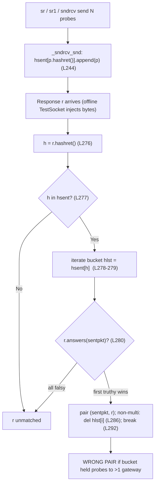

# Root-cause analysis: why Scapy's `sr`/`sr1` matching pairs a reply with the *wrong* tunneled probe

> **The user's question (verbatim):** *"Can you figure out what scenario causes Scapy's internal matching to associate a received packet with the wrong sent packet when using tunneled probes, and demonstrate with concrete examples where this happens?"* and *"I'm not looking for workarounds, I want to understand the root cause in the matching algorithm."*
>
> **Probe context (from the prompt):** the probes are ICMP-based, tunneled to *multiple* gateways, "verified with tcpdump that the packets on the wire are correct", and sent as "sequential sends with delays".
>
> **Hypotheses the user already tried and ruled out (verbatim):** *"I tried setting conf.checkIPsrc and conf.checkIPaddr to False."*; *"I made sure each probe has a unique ICMP sequence number."*; *"I checked if it was a TCP flags validation issue since I read that answers() has strict flag requirements, but my probes are ICMP based."*; *"I wondered if it was related to how Raw payloads are handled versus parsed layers."*; *"Someone suggested it might be the multi_recv parameter ... but disabling that didn't help."* Each is resolved by name in Section 4.

This is a **root-cause** answer, not a workaround. It is grounded in **runtime observation** (every byte string, collision boolean and pairing verdict below was captured by *running* the real code through its canonical entry points) and in `file:line` references into this checkout. Statements are labelled **[observed]** (captured at runtime) or **[inferred]** (from protocol spec / code reading). All observed values come from four self-checking scripts whose complete sources and unedited output are in Section 6; every script asserts its expected values, so a drift in a future checkout would make it exit non-zero rather than silently print a wrong number.

## Environment (as observed at runtime)

| Fact | Value | How obtained |
|------|-------|--------------|
| Scapy version | `2026.07.13` | `import scapy; scapy.__version__` **[observed]** |
| Scapy location | `…/scapy/__init__.py` inside the checkout | `scapy.__file__` **[observed]** |
| Interpreter | CPython `3.13.7` | `sys.version` **[observed]** |
| Documented support | Python `>=3.7, <4` | `pyproject.toml` `requires-python` **[inferred — file read]** |
| Raw-socket capability | **Present** — a raw IPv4 ICMP socket opens; `euid=0`, `cap_net_raw` in the effective set | capability probe **[observed]** |
| Why the demo is offline | There are **no real tunnel gateways to probe** in the sandbox, so live `sr`/`sr1` against real gateways was **not performed**; an offline `TestSocket` (`test/testsocket.py`) injects canned response bytes to reproduce the wrong-match **deterministically and repeatably** | design choice, not a privilege limit **[observed]** |

The offline `TestSocket` is a **network-I/O accommodation only**: the matching itself (`sndrcv` → `_process_packet` → `hashret()` → `answers()`) is the *real, unmodified* library code, so the pairing verdicts are canonical. The reproduction is also driven through the real `sr()`/`sr1()` wrappers (Section 6, B3) by pointing `conf.L3socket` at the offline socket, exactly as `sr()` would instantiate its layer-3 socket [scapy/sendrecv.py:L648-L650]. The byte strings are deterministic functions of the addresses, independent of interpreter version.

---

## Section 1 — Direct answer: the wrong-match scenario

The wrong-match is **NOT** a timing/race bug, an address-check bug, a sequence-number bug, a TCP-flag bug, or a `multi`/`multi_recv` bug. The root cause is a **hash-bucket collision followed by a first-in-bucket tie-break** inside `SndRcvHandler`.

A received packet is mis-attributed to the wrong sent packet whenever **both** of these hold:

- **(a) Two probes destined to *different gateways* land in the *same* `hashret()` bucket** — their `hashret()` keys are byte-for-byte equal; and
- **(b) The surviving match discriminator cannot tell those two probes apart**, so the loop's *first-truthy-`answers()`* tie-break silently selects whichever probe was **enqueued first** (for sequential sends, the first gateway).

For tunnel probing, the *only* thing that distinguishes two otherwise-identical probes is the **outer gateway IP**. The wrong-match therefore occurs precisely when the **outer gateway IP is excluded from the match key**. In this checkout that exclusion happens through **two** configuration-driven mechanisms, both reproduced below:

1. **`conf.checkIPinIP = False` — the canonical tunneling trigger (M4).** For IP-in-IP (outer proto `4`) / IPv6-in-IP (outer proto `41`), this strips the outer header from *both* `hashret()` [scapy/layers/inet.py:L573-L574] and `answers()` [scapy/layers/inet.py:L584-L592], matching purely on the inner packet. The flag is `True` by default [scapy/config.py:L755], but it is *exactly* the mechanism upstream added to make tunneled replies match — by ignoring the outer gateway (PR [#387](https://github.com/secdev/scapy/pull/387), fixing issue [#383](https://github.com/secdev/scapy/issues/383)).
2. **`conf.checkIPaddr = False` — the user's own troubleshooting step (M3).** Disabling the address gate drops the outer address from both key generation and answer validation. (Setting **`checkIPsrc = False` alone is not enough** to cause a *wrong* pairing — see the truth table in M3.) This **removes** the gateway discriminator rather than helping.

An ICMP **error** reply can also be mis-attributed, but — contrary to a natural first guess — **not** because a truncated citation reaches `Raw.answers()`. As Section 3 (M5) demonstrates at runtime, a truncated citation dissects to a nested `IPerror`, the error is left **unmatched**, and `Raw.answers()` is never reached. The genuine error wrong-match is simply a **manifestation of mechanism (1)**: when an error generated beyond the tunnel egress quotes the *decapsulated inner* packet and `checkIPinIP=False`, that error collides with the inner-only keys of every gateway's probe.

Observed proof, end-to-end, through the real `sndrcv()` engine — a reply genuinely from gateway `10.0.0.2` is paired with the probe to `10.0.0.1` the moment `checkIPinIP` is turned off (stable across three repeats) **[observed]**:

```
=== B2: checkIPinIP=False (trigger) — same gw2 reply now pairs with the gw1 probe ===
  run 1: response(outer src=10.0.0.2) PAIRED WITH probe(outer dst=10.0.0.1) -> *** WRONG PAIRING ***
  run 2: response(outer src=10.0.0.2) PAIRED WITH probe(outer dst=10.0.0.1) -> *** WRONG PAIRING ***
  run 3: response(outer src=10.0.0.2) PAIRED WITH probe(outer dst=10.0.0.1) -> *** WRONG PAIRING ***
```

Conversely, give the two probes a **unique inner ICMP sequence** and that sequence survives into the (outer‑stripped) key, so the buckets stay distinct and the *same* `gw2` reply pairs with the `gw2` probe. The wrong-match is therefore a **collision of otherwise-indistinguishable probes**, not an inevitability of tunnelling — condition (b) above turned off (stable across three repeats) **[observed]**:

```
=== B5: checkIPinIP=False + UNIQUE inner seq (control) — surviving inner seq keeps the gw2 reply on the gw2 probe ===
  run 1: response(outer src=10.0.0.2) PAIRED WITH probe(outer dst=10.0.0.2) -> CORRECT
  run 2: response(outer src=10.0.0.2) PAIRED WITH probe(outer dst=10.0.0.2) -> CORRECT
  run 3: response(outer src=10.0.0.2) PAIRED WITH probe(outer dst=10.0.0.2) -> CORRECT
```

Reproduction addresses (used throughout): `src=192.168.1.100`, `gw1=10.0.0.1`, `gw2=10.0.0.2`, inner target `8.8.8.8`, ICMP `id=0x4242`.

---

## Section 2 — The two-stage matching algorithm

`sr`/`sr1` do not compare a reply against sent probes one-by-one. They use a **two-stage hash-bucket** algorithm implemented in `SndRcvHandler` (`scapy/sendrecv.py`). Both `sr` [scapy/sendrecv.py:L635] and `sr1` [scapy/sendrecv.py:L656] funnel into `sndrcv` [scapy/sendrecv.py:L322], which constructs a `SndRcvHandler` [scapy/sendrecv.py:L114].

**Stage 1 — bucket every sent probe by its `hashret()` key.** In the sending routine `_sndrcv_snd` [scapy/sendrecv.py:L232], each probe is appended to a dictionary keyed by its hash *before* it is put on the wire:

```python
# scapy/sendrecv.py:L244
self.hsent.setdefault(p.hashret(), []).append(p)
```

**Stage 2 — for each reply, look up its own `hashret()` and accept the first bucket member that `answers()`.** In `_process_packet` [scapy/sendrecv.py:L270]:

```python
# scapy/sendrecv.py:L276-L292 (abridged)
h = r.hashret()                       # L276
if h in self.hsent:                   # L277
    hlst = self.hsent[h]              # L278
    for i, sentpkt in enumerate(hlst):# L279
        if r.answers(sentpkt):        # L280  <-- FIRST truthy wins
            self.ans.append(QueryAnswer(sentpkt, r))  # L281
            ok = True
            if not self.multi:        # L285
                del hlst[i]           # L286
            ...
            break                     # L292  <-- unconditional
```

The two critical properties of this loop are:

- **The bucket is a *list*, keyed by the hash.** If two probes hash to the same key, they share one bucket, in **enqueue order** (sequential sends → `gw1` before `gw2`).
- **The first bucket member whose `answers()` is truthy wins, then the loop `break`s unconditionally** [scapy/sendrecv.py:L280, scapy/sendrecv.py:L292]. Nothing in this loop consults the *outer gateway* again once the hash has collided and `answers()` has been satisfied — so a genuine reply from `gw2` is attributed to the `gw1` probe simply because `gw1` is first in the shared bucket.

### Pipeline diagram



The rest of this document identifies exactly *where* in `hashret()` the outer gateway is dropped (so distinct-gateway probes collide in Stage 1), and *why* `answers()` then fails to re-introduce it (so the Stage 2 tie-break mis-attributes).

---
## Section 3 — The interacting mechanisms (M1–M5)

All output below is **[observed]** — pasted verbatim from the four self-checking reproduction scripts (full sources in Section 6). Values are canonical: only network I/O is mocked; the matching code is the real library.

### M1 — Two-stage match with a first-in-bucket tie-break *(the structural enabler)*

**Cause → effect.** `_process_packet` accepts the **first** bucket member whose `answers()` is truthy and (in the default, non-`multi` mode) deletes it, then `break`s unconditionally [scapy/sendrecv.py:L270-L292, esp. L280 `if r.answers(sentpkt)`, L286 `del hlst[i]`, L292 `break`]. The bucket is built in `_sndrcv_snd` [scapy/sendrecv.py:L244]. `sndrcv` [scapy/sendrecv.py:L322], `sr` [scapy/sendrecv.py:L635] and `sr1` [scapy/sendrecv.py:L656] all funnel here. This loop is *correct on its own*; it only produces a wrong pairing when **M3 or M4** causes two distinct-gateway probes to share a bucket. It is the enabler, not the trigger. (M2 by itself does **not** create a shared bucket — see M2.)

**Evidence — the bucket really does hold two gateways, the reply lands on the first one, and (non-`multi`) that first probe is then deleted (B4, captured from the real engine's `self.hsent`):**

```
=== B4: real before/after bucket state (checkIPinIP=False, identical inner) ===
  multi=False BEFORE bucket=['10.0.0.1', '10.0.0.2']
            matched=probe(dst=10.0.0.1) -> paired (probe dst=10.0.0.1, reply src=10.0.0.2)
            AFTER  bucket=['10.0.0.2']
  multi=True  BEFORE bucket=['10.0.0.1', '10.0.0.2']
            matched=probe(dst=10.0.0.1) -> paired (probe dst=10.0.0.1, reply src=10.0.0.2)
            AFTER  bucket=['10.0.0.1', '10.0.0.2']
```

The reply genuinely came from `10.0.0.2`, yet the loop stops at the *first* bucket member (`10.0.0.1`). With `multi=False` the matched (wrong) probe is removed at L286; with `multi=True` it is kept — but the pairing is wrong either way.

### M2 — `strxor(src, dst)` commutativity in `IP.hashret()` *(a folding property, not a trigger)*

**Cause → effect.** Under default configuration the outer address contributes to the hash *only* as `strxor(inet_pton(src), inet_pton(dst))` [scapy/layers/inet.py:L577-L580]:

```python
# scapy/layers/inet.py:L577-L580
if conf.checkIPsrc and conf.checkIPaddr:
    return (strxor(inet_pton(socket.AF_INET, self.src),
                   inet_pton(socket.AF_INET, self.dst)) +
            struct.pack("B", self.proto) + self.payload.hashret())
```

The XOR is **commutative by design** — it makes a reply (src/dst swapped) hash equal to its request, which is what lets a reply find its request's bucket at all. The in-repo regression test asserts this equality directly: `IP(src=a1,dst=a2)/ICMP(type=8)` and `IP(src=a2,dst=a1)/ICMP(type=0)` hash equal [test/regression.uts:L1215-L1217]. **On its own, M2 does *not* cause two distinct-gateway probes to share a bucket** — with the folded prefix present, `gw1` and `gw2` produce *different* keys (A1 below, `COLLISION? False`). M2 matters only because it reduces the entire gateway identity to that single folded value, which **M3/M4 then remove**.

**Evidence — the folded outer address is the `caa80165` / `caa80166` prefix (A1); the in-repo assertion is replayed in full in C5.**

```
[A1] default conf, UNIQUE seq
   gw1 hashret = caa801650142420100
   gw2 hashret = caa801660142420200
   COLLISION?  False
```

Decode (to make the mechanism concrete): `caa80165 = strxor(192.168.1.100, 10.0.0.1)` and `caa80166 = strxor(192.168.1.100, 10.0.0.2)` — the *only* difference between the two gateways is the last byte (`65` vs `66`). `01` is the ICMP protocol number; `42420100` is `struct.pack("HH", 0x4242, seq=1)` (little-endian). So under default config the gateway does survive (no collision) — but only as that single folded prefix, which M3/M4 go on to remove.

### M3 — `conf.checkIPaddr = False` (optionally with `conf.checkIPsrc = False`) *(the user's own step)*

**Cause → effect — with the hash and the answer stages kept separate.** These flags default to `True` [scapy/config.py:L751-L752]. There are **two independent stages**, gated differently:

- **Hash generation (`IP.hashret`).** The `strxor` prefix is emitted **only when both flags are True** (the `and` at [scapy/layers/inet.py:L577]); otherwise the fallback omits the addresses entirely [scapy/layers/inet.py:L581]. So **either** flag being `False` makes the two gateways collide (given identical inner content).
- **Answer validation (`IP.answers`).** The outer-address gate is controlled by **`checkIPaddr` alone** [scapy/layers/inet.py:L595-L599, scapy/layers/inet.py:L607]; `checkIPsrc` is **not** consulted for the normal (non-error) IPv4 address check.

The consequence is that a *collision* is **necessary but not sufficient** for a wrong pairing: you also need `answers()` to accept the wrong candidate, which additionally requires **`checkIPaddr = False`**. This is exactly why the user's `checkIPsrc = False` step did not, by itself, cause the symptom.

```python
# scapy/layers/inet.py:L581  (fallback taken when NOT (checkIPsrc and checkIPaddr))
return struct.pack("B", self.proto) + self.payload.hashret()
```

**Evidence — hash-collision behaviour (A2/A3), the hash-collision truth table (A6), and the full end-to-end truth table with pairing verdicts (C6):**

```
[A2] checkIPsrc=False, checkIPaddr=False, UNIQUE seq
   gw1 hashret = 0142420100
   gw2 hashret = 0142420200
   COLLISION?  False
[A3] checkIPsrc=False, checkIPaddr=False, IDENTICAL seq=7
   gw1 hashret = 0142420700
   gw2 hashret = 0142420700
   COLLISION?  True
[A6] hashret collision truth table (non-tunnel echo, IDENTICAL inner id/seq=7)
     (checkIPsrc, checkIPaddr) -> collide?
     (True , True ) -> False
     (True , False) -> True
     (False, True ) -> True
     (False, False) -> True
[C6] (checkIPsrc, checkIPaddr) end-to-end truth table (non-tunnel echo, identical seq, reply from gw2)
     checkIPsrc  checkIPaddr  collide?  pairing
     True        True        False     CORRECT(gw2)
     True        False       True      WRONG(gw1)
     False       True        True      CORRECT(gw2)
     False       False       True      WRONG(gw1)
```

C6 is decisive: `(False, True)` **collides yet still pairs correctly**, because the `answers()` address gate (`checkIPaddr=True`) rejects the wrong candidate; only rows with `checkIPaddr = False` produce a wrong pairing. The minimal normal-echo trigger is therefore **a hash collision plus `checkIPaddr = False`**. This is corroborated by the usage docs, which note Scapy "makes sure that replies come from the same IP address the stimulus was sent to," disabled via `conf.checkIPaddr = False` for the DHCP-broadcast case [doc/scapy/usage.rst:L1667] ([official usage docs](https://scapy.readthedocs.io/en/latest/usage.html)), and by upstream issue [#1894](https://github.com/secdev/scapy/issues/1894), where setting `conf.checkIPsrc = 0` alone did **not** make a traceroute-style ICMP probe match.

### M4 — `conf.checkIPinIP = False` strips the outer tunnel IP *(the canonical tunneling trigger)*

**Cause → effect.** For IP-in-IP (outer proto `4`) / IPv6-in-IP (outer proto `41`), turning this flag off makes **both** `hashret()` and `answers()` discard the outer header and operate on the inner packet only. In `IP.hashret()` [scapy/layers/inet.py:L573-L574]:

```python
# scapy/layers/inet.py:L573-L574
if not conf.checkIPinIP and self.proto in [4, 41]:  # IP, IPv6
    return self.payload.hashret()
```

and in `IP.answers()` the outer is stripped before any address check [scapy/layers/inet.py:L584-L592]. The flag defaults to `True` [scapy/config.py:L755], with the in-repo comment "if False, do not check IP layers that encapsulates another IP layer" [scapy/config.py:L753-L755]. It was added upstream by PR [#387](https://github.com/secdev/scapy/pull/387) to fix issue [#383](https://github.com/secdev/scapy/issues/383) ("Answers and IP in IP"); the PR's stated purpose is, when `False`, to "exclude IP layers which encapsulate another IP layer from the checks" used to decide whether a packet answers another — i.e. to deliberately ignore the outer gateway so tunnelled replies match. Issue #383 is the user's own scenario (an IP-in-IP ICMP probe, confirmed on the wire with `tcpdump`, not matching) but with a **single** endpoint; the fix is correct for one gateway and only mis-attributes when there is **more than one**.

**Evidence — A4 (checkIPinIP=True → outer prefix retained → NO collision) vs A5 (checkIPinIP=False, *identical* inner → outer folds away → COLLISION) vs A5b (checkIPinIP=False, *unique* inner seq → inner keys diverge → NO collision), and the end-to-end B-series (B2 wrong, B5 correct):**

```
[A4] checkIPinIP=True, IP-in-IP (outer proto=4), identical inner
   gw1 hashret = caa8016504c8a0096c0142420900
   gw2 hashret = caa8016604c8a0096c0142420900
   COLLISION?  False
[A5] checkIPinIP=False, IP-in-IP, identical inner
   gw1 hashret = c8a0096c0142420900
   gw2 hashret = c8a0096c0142420900
   COLLISION?  True
[A5b] checkIPinIP=False, IP-in-IP, UNIQUE seq
   gw1 hashret = c8a0096c0142420100
   gw2 hashret = c8a0096c0142420200
   COLLISION?  False
```

In A4 the outer address survives as the `caa80165`/`caa80166` prefix (byte `65` vs `66`) followed by `04` (outer proto = IPIP). In A5 that whole prefix is gone; only the inner `c8a0096c…` (`= strxor(192.168.1.100, 8.8.8.8)` + inner ICMP `01 42420900`) remains — **identical for both gateways ⇒ collision**. This collision depends on the inner content being *identical*: give the two probes a **unique inner ICMP sequence** and the inner-only keys diverge again (`…0100` vs `…0200`, A5b), so no collision occurs and the genuine gw2 reply pairs with the gw2 probe end-to-end (B5) — i.e. the M4 wrong-match requires the *surviving inner content* to be identical, not merely the outer gateway to be stripped. The in-repo test captures the same transition: with `conf.checkIPinIP = True` [test/regression.uts:L1224] the wrapped probes' hashes differ from the reply [test/regression.uts:L1226], and with `conf.checkIPinIP = False` [test/regression.uts:L1229] they all become equal [test/regression.uts:L1230] and `p2.answers(p)` holds [test/regression.uts:L1232]. The **end-to-end wrong pairing** through the real `sndrcv()` engine — and through the real `sr()`/`sr1()` wrappers — is the B-series in Sections 1 and 6.

IPv6 mirrors this exactly in `IPv6.hashret()` [scapy/layers/inet6.py:L329-L330], and the file even carries a documented **TODO acknowledging a related ICMPv6-error weakness** [scapy/layers/inet6.py:L343-L344] — verbatim: *"big bug with ICMPv6 error messages as the destination of IPerror6 … could be anything from the original list …"*.

### M5 — The ICMP-error path: the "truncation + `Raw.answers()`" hypothesis is **refuted**; the real error wrong-match is an M4 sub-case

The intuitive story — *a router truncates the quoted probe, the inner ICMP `id`/`seq` are lost, the truncated bytes dissect to `Raw`, and `Raw.answers()==1` forces a match* — is **false in this checkout**. Running it shows the error is **unmatched**, and `Raw.answers()` is **never reached**. Here is why, step by step.

**(a) A truncated citation dissects to a nested `IPerror`, not `Raw`.** `ICMP.guess_payload_class` returns `IPerror` for error types `[3,4,5,11,12]` [scapy/layers/inet.py:L1000-L1004], so the quoted bytes are parsed as an `IPerror` (a subclass of `IP`), whose own payload is parsed recursively. A time-exceeded error quoting the outer datagram truncated to 28 bytes (RFC 792's "IP header + 8 bytes" — **[inferred — protocol spec]**) therefore yields `IPerror/IPerror`, with **no ICMP layer** carrying the inner `id`/`seq` (D1).

**(b) The error is *unmatched*, because `IPerror.answers()` fails — `Raw.answers()` is not on the path.** For an ICMP-error reply, `IP.answers()` recurses into the citation via `IPerror.answers()` [scapy/layers/inet.py:L1016-L1034], which enforces `test_IPdst = self.dst == other.dst` **unconditionally** (no flag) [scapy/layers/inet.py:L1022] and `test_IPproto` [scapy/layers/inet.py:L1029]. The truncated inner has neither the right destination nor a matching protocol, so `IPerror.answers()` returns `0` before any `Raw` comparison. Observed for **both** probes, under **both** `checkIPinIP` settings (D1):

```
[D1] ingress ICMP time-exceeded quoting the OUTER datagram, truncated to 28 bytes (RFC 792: IP hdr + 8B)
     citation dissects to : IPerror   (full: IP / ICMP 10.0.0.1 > 192.168.1.100 time-exceeded ttl-zero-during-transit / IPerror / IPerror)
     inner ICMP present?   : 0   (the inner id/seq are truncated away)
     checkIPinIP=True  : err.hashret=caa80165040000000000         p1=caa8016504c8a0096c0142420900 p2=caa8016604c8a0096c0142420900 answers(p1)=0 answers(p2)=0
     checkIPinIP=False : err.hashret=0000000000                   p1=c8a0096c0142420900           p2=c8a0096c0142420900           answers(p1)=0 answers(p2)=0
     => error is UNMATCHED (both answers()==0); Raw.answers() is NEVER reached.
```

Note the hash values, too: under `checkIPinIP=False` the truncated error hashes to `0000000000` (the zeroed, address-less inner), which does not even *collide* with the probes' `c8a0096c…` key — so it is dropped at Stage 1 regardless.

**(c) `Raw.answers()==1` is real but off the ICMP path.** `Raw.answers()` does return `1` unconditionally [scapy/packet.py:L1891-L1893], but `ICMP.answers()` decides an ICMP match purely from `(type, id, seq)` and **never inspects its payload** [scapy/layers/inet.py:L991-L998]; an echo reply carrying a *different* `Raw` payload still answers the request (D5). So the always-true `Raw` short-circuit cannot gate an ICMP pairing.

```
[D5] ICMP.answers() ignores its payload -> Raw.answers() is not on the ICMP path
     echo reply with a DIFFERENT Raw payload still answers the request: 1
```

**(d) The *genuine* error wrong-match is an M4 manifestation — via `IPerror`/`ICMPerror`, not `Raw`.** An ICMP error generated **beyond the tunnel egress** quotes the *decapsulated inner* datagram (`IP(dst=target)/ICMP`), which carries no outer-gateway bytes at all. With `checkIPinIP=False`, each gateway's probe has already been reduced to that same inner-only key, so the error collides with **both** and is accepted for **both** through `IPerror.answers()` → `ICMPerror.answers()` (the error-specific predicate that matches on equal `type`/`code` and, for echo, equal `id`/`seq` [scapy/layers/inet.py:L1082-L1095]). The first-in-bucket tie-break then attributes the gateway-ambiguous error to the first probe (D2):

```
[D2] egress-beyond ICMP time-exceeded quoting the DECAPSULATED INNER packet (full), identical inner seq
     checkIPinIP=True  : err.hashret=c8a0096c0142420900   p1=caa8016504c8a0096c0142420900 collide=False answers(p1)=0 answers(p2)=0  (citation: IPerror/ICMPerror)
     checkIPinIP=False : err.hashret=c8a0096c0142420900   p1=c8a0096c0142420900           collide=True  answers(p1)=1 answers(p2)=1  (citation: IPerror/ICMPerror)
     end-to-end sndrcv(): error(outer src=203.0.113.9) ATTRIBUTED TO probe(outer dst=10.0.0.1) -> *** WRONG (first-in-bucket) ***
```

**(e) A *unique* inner sequence works whenever it survives.** When the citation preserves the inner `id`/`seq`, `ICMPerror.answers()` uses them and correctly disambiguates — the error for the `seq=2` probe answers only that probe (D3). Conversely, if truncation strips the sequence, the key's `id`/`seq` are zeroed and the error is **unmatched** (D4), not wrong-matched:

```
[D3] distinct inner seq preserved in the citation -> answers() disambiguates (unique seq WORKS)
     err(inner seq=2).answers(probe seq=1)=0   err(inner seq=2).answers(probe seq=2)=1
[D4] egress-beyond error truncated so the inner id/seq are lost -> zeroed key -> UNMATCHED (not wrong)
     errc.hashret=c8a0096c0100000000   p1=c8a0096c0142420900   collide=False answers(p1)=0 answers(p2)=0
```

**Bottom line for M5:** the ICMP-error wrong-match is *not* a distinct `Raw` mechanism; it is mechanism M4 (`checkIPinIP=False`) acting on an error that quotes the decapsulated inner packet with identical inner content. A unique inner sequence is a *working* discriminator whenever it survives into the compared key: once M4 strips the outer IP, the surviving key **is** the inner packet — ICMP `id`/`seq` included — so a genuinely-unique inner sequence makes the two probes' keys differ and **prevents** the collision (A5b; end-to-end B5). The M4/error wrong-match therefore *requires the surviving inner content to be identical* (D2). A unique sequence fails to help only when it never reaches the compared key — either the probes differ *only* in the outer gateway while their surviving inner content is identical, or an ICMP-error citation truncates the sequence away, which leaves the error **unmatched** (D4), not mis-matched.

---
## Section 4 — Coverage pass (every named item resolved)

Each item the user raised (including the ones already tried and ruled out) is resolved here explicitly.

| Named item | Disposition | Grounding |
|------------|-------------|-----------|
| **`sr` / `sr1`** | Canonical entry points; both funnel into `sndrcv` → `SndRcvHandler`. The wrong pairing is reproduced through the internal `sndrcv()` engine (B1/B2/B4) **and** through the **real `sr()`/`sr1()` wrappers**, driven offline by pointing `conf.L3socket` at a `TestSocket` exactly where `sr()` opens its socket (B3). | [scapy/sendrecv.py:L635, scapy/sendrecv.py:L656, scapy/sendrecv.py:L322, scapy/sendrecv.py:L648-L650] + B1/B2/B3/B4 |
| **`hashret`** | The bucket key. The gateway is *retained* (default: folded into `strxor`, A1) or *lost* (M3 fallback / M4 strip). | [scapy/layers/inet.py:L568-L581] + A1–A5 |
| **`answers`** | The per-bucket confirmation predicate; **first truthy wins** [scapy/sendrecv.py:L280]. It does **not** re-introduce the gateway once the outer IP was stripped: `IP.answers()` strips IP-in-IP [scapy/layers/inet.py:L584-L592] and gates the address on `checkIPaddr` alone [scapy/layers/inet.py:L595-L599]. | [scapy/layers/inet.py:L583-L610] + C6 |
| **`conf.checkIPsrc`** | The user's own step. Default `True`. Setting it `False` **alone** collides the buckets but does **not** cause a wrong pairing, because the `IP.answers()` address gate uses `checkIPaddr`, not `checkIPsrc` (C6: `(False,True)` → CORRECT). Corroborated by issue [#1894](https://github.com/secdev/scapy/issues/1894). | M3, A6, C6, [scapy/config.py:L751] |
| **`conf.checkIPaddr`** | Disabling it drops the outer-address gate from **both** `hashret()` (via the `and` at L577) and `answers()`, so it both collides the buckets and accepts the wrong candidate — the minimal normal-echo trigger. Default `True`. | M3, A6/C6, [scapy/config.py:L752], [doc/scapy/usage.rst:L1667] |
| **unique ICMP sequence number** | Included by `ICMP.hashret` only for echo-family types in `icmp_id_seq_types` [scapy/layers/inet.py:L949, scapy/layers/inet.py:L986-L989]. It **is** a real discriminator when it survives into the compared key: it separates echo probes (A2), keeps the two tunnel probes in distinct buckets even with `checkIPinIP=False` (A5b) so the reply pairs correctly end-to-end (B5), and correctly picks the right probe inside an ICMP-error citation that preserves it (D3). It does **not** explain the reported wrong-match, because that wrong-match requires the *surviving* inner content to be identical (M3/M4/D2): the sequence helps wherever it reaches the compared key, so a wrong-match despite 'unique sequences' means the probes differed outer-only (identical surviving inner content) or an error citation truncated the sequence away — leaving the probe **unmatched** (D4), not wrong-matched. | A2, D3, D4 |
| **TCP flags validation** | Real but on a different protocol path. `TCP.answers()` begins `if not isinstance(other, TCP): return 0` [scapy/layers/inet.py:L795-L796], so it is **never invoked for ICMP probes**. Its flag logic is also **direction-specific**: it drops a reply when the *stimulus* carried RST (`other.flags.R` [scapy/layers/inet.py:L798-L799]) or was a SYN-without-ACK [scapy/layers/inet.py:L804-L806], yet it **accepts a *received* RST-without-ACK** as an answer (`self.flags.R and not self.flags.A` [scapy/layers/inet.py:L819-L820]). Either way, irrelevant to ICMP. | [scapy/layers/inet.py:L794-L823] |
| **Raw vs. parsed layers** | `Raw.answers()` returns `1` unconditionally [scapy/packet.py:L1891-L1893], but this is **not on the ICMP path**: `ICMP.answers()` ignores its payload (D5), and a truncated ICMP-error citation dissects to nested `IPerror`/`ICMPerror` — never `Raw` — so the short-circuit is never reached (D1, M5). | [scapy/packet.py:L1891-L1893] + D1, D5 |
| **`multi_recv`** | **Does not exist in Scapy.** The real parameter is **`multi`** [scapy/sendrecv.py:L122] (C1 confirms `multi_recv` is absent from the signature). It only controls whether a matched probe is *removed* from its bucket after the first hit [scapy/sendrecv.py:L285-L291]; the `break` [scapy/sendrecv.py:L292] is unconditional, so a single reply always matches only the first bucket member. `multi` therefore **cannot** prevent a bucket collision (C2/B4: `multi=True` is still wrong). | C1, C2, B4, [scapy/sendrecv.py:L122, scapy/sendrecv.py:L285-L292] |
| **tunneled / IP-in-IP** | The core scenario (M4). IPv6-in-IP behaves identically. | [scapy/layers/inet.py:L573-L574, scapy/layers/inet6.py:L329-L330, scapy/layers/inet6.py:L343-L344] |
| **timing / race** | **Ruled out.** Matching is order-of-arrival *within a bucket* [scapy/sendrecv.py:L279-L280], not time-based; sequential sends with delays do not change bucket membership. The defect reproduces deterministically from a *single* injected reply, stable across three repeats (B-series). | [scapy/sendrecv.py:L279-L280] + B1/B2 |

**Proof that `multi` is the real parameter and cannot help (C1, C2):**

```
[C1] SndRcvHandler.__init__ params = ['self', 'pks', 'pkt', 'timeout', 'inter', 'verbose', 'chainCC', 'retry', 'multi', 'rcv_pks', 'prebuild', '_flood', 'threaded', 'session', 'chainEX']
     'multi' present = True ; 'multi_recv' present = False
[C2] does 'multi' fix the collision? (checkIPinIP=False, identical inner)
     multi=False -> resp(src=10.0.0.2) attributed to probe(dst=10.0.0.1) : WRONG
     multi=True  -> resp(src=10.0.0.2) attributed to probe(dst=10.0.0.1) : WRONG
```

---

## Section 5 — Reasoning / rationale, and observed-vs-inferred labelling

**Why removing the outer gateway causes a collision.** `hashret()` is designed so a *reply* and its *request* produce the **same** key (that is how a reply finds the right bucket). For a normal, single-endpoint probe the folded `strxor(src, dst)` prefix is enough to keep distinct destinations in distinct buckets (A1 **[observed]**). Tunnel probing breaks the assumption behind the design: the two probes are identical *except* for the outer gateway, and each of M3/M4 removes that outer gateway from the key. Once removed, the two probes' keys become byte-for-byte equal (A3, A5 **[observed]**), so Stage 1 files them into **one** bucket (B4 **[observed]**).

**Why the tie-break then mis-attributes.** Stage 2 accepts the *first* bucket member whose `answers()` is truthy and immediately `break`s [scapy/sendrecv.py:L280, scapy/sendrecv.py:L292] **[observed via code + B-series]**. After the outer IP has been stripped, `answers()` no longer examines the gateway either (`IP.answers()` strips IP-in-IP at [scapy/layers/inet.py:L584-L592] and gates the address on `checkIPaddr` at [scapy/layers/inet.py:L595-L599]). So `answers()` is truthy for the *first-enqueued* probe — which, for sequential sends, is `gw1`. The reply from `gw2` is therefore paired with `gw1` (B-series, B4 **[observed]**).

**Why the user's hypotheses were dead-ends** (each **[observed]** unless noted):
- *Timing/delays* — matching is bucket-order, not time-order; the defect is deterministic from one injected reply (B-series).
- *`checkIPsrc`/`checkIPaddr = False`* — `checkIPaddr=False` *is* the address-gate removal that turns a collision into a wrong pairing (M3, C6); `checkIPsrc=False` alone collides but still pairs correctly (C6). So this step makes the wrong-match **more** likely, not less.
- *Unique ICMP sequence* — a *working* discriminator wherever it survives into the compared key: it keeps the tunnel probes in distinct buckets under `checkIPinIP=False` (A5b) and pairs the reply correctly end-to-end (B5), and it disambiguates a full-inner error citation (D3). It therefore does not explain the wrong-match unless the surviving inner content is identical (probes differ outer-only) or truncation strips the sequence — which yields an *unmatched* error (D4), not a wrong one.
- *TCP flag strictness* — real, but gated behind `isinstance(other, TCP)` [scapy/layers/inet.py:L795-L796], so never reached on the ICMP path; and its logic is direction-specific (Section 4).
- *Raw vs. parsed layers* — the truncation→`Raw` chain is **refuted** at runtime (M5, D1/D5): the citation dissects to `IPerror`/`ICMPerror` and the error is unmatched; `Raw.answers()` is never reached.
- *`multi_recv`* — does not exist; the real `multi` cannot prevent a collision (C1/C2/B4).

**Explicit labels.** **[observed]:** every `hashret()` byte string (A1–A5), every collision boolean and truth-table row (A6/C6), every pairing verdict and bucket snapshot (B1–B4), the `multi`/signature facts (C1/C2), the echo/error controls (C3/C4), the ICMP-error dissections and predicates (D1–D5), and the regression replay (C5). **[inferred]:** the RFC 792 "outer IP header + 8 bytes" citation length (protocol spec, not measured here — though D1 *does* observe that a 28-byte citation loses the inner `id`/`seq`), and the user's "correct on the wire (tcpdump)" claim (reported, not reproduced in this sandbox — corroborated by the identical single-target report in issue #383).

**Rationale, not a fix.** Per the request, this is a root-cause explanation, not a workaround. For completeness of *reasoning* only: the outer-stripping behaviour is **intentional** (PR #387 / issue #383) — it exists to make single-endpoint tunnelled replies match. Whether that trade-off is acceptable when probing *multiple* gateways is a **policy decision for the caller**, not a defect to be patched here; the library was intentionally left unmodified.

---

## Section 6 — Exact commands and reproduction scripts

The four scripts were created **outside** the repository tree, in a private `mktemp` directory (mode `0700`), and were deleted on completion. No existing or source files were modified; the only repository change from this task is *this* document under `blitzy/`.

### Commands

```bash
# 1) Private working dir OUTSIDE the repo (mode 0700). Hardened so a failed/empty mktemp can NEVER
#    let the cleanup trap touch root-level paths, and so a failing script is never masked.
set -euo pipefail

REPRO=''                                    # defined up-front so `set -u` is satisfied
REPRO="$(mktemp -d "${TMPDIR:-/tmp}/repro.XXXXXX")"

# Refuse to proceed unless mktemp returned a NON-EMPTY, ABSOLUTE directory whose basename matches
# the expected `repro.*` template. Without this, an empty $REPRO would make the trap below run
# `rm -f /repro_matching.py ...` against the filesystem root.
case "$REPRO" in
  /*) : ;;
  *) echo "refusing: mktemp did not return an absolute path (REPRO='$REPRO')" >&2; exit 1 ;;
esac
case "${REPRO##*/}" in
  repro.??????*) : ;;
  *) echo "refusing: unexpected temp-dir basename (REPRO='$REPRO')" >&2; exit 1 ;;
esac
[ -d "$REPRO" ] || { echo "refusing: '$REPRO' is not a directory" >&2; exit 1; }
chmod 700 "$REPRO"

# Arm cleanup ONLY after $REPRO is validated. cleanup() preserves the triggering exit status,
# removes ONLY the four known files (with `--`), then rmdir's the now-empty directory.
cleanup() {
  ec=$?
  rm -f -- "$REPRO/repro_matching.py" "$REPRO/repro_sndrcv.py" \
           "$REPRO/repro_error.py"    "$REPRO/repro_controls.py"
  rmdir -- "$REPRO" 2>/dev/null || true
  exit "$ec"
}
trap cleanup EXIT

# 2) Save the FOUR complete script sources printed below (6.1–6.4) into $REPRO, one file each:
#      $REPRO/repro_matching.py   (A-series)   $REPRO/repro_sndrcv.py    (B-series)
#      $REPRO/repro_error.py      (D-series)   $REPRO/repro_controls.py  (C-series)
#    Each block below is the ENTIRE file — copy it verbatim (no ellipses, nothing omitted).

# 3) Run each with the checkout's venv, from a cwd WITHOUT a scapy/ dir (avoids package shadowing).
#    Under `set -e`, the FIRST script whose assertions fail aborts here with a non-zero status,
#    so a failure is surfaced immediately and never masked by a later command or the cleanup trap.
VENV=/tmp/blitzy/scapy/blitzy-e537072e-0f33-4db3-9fe0-bac227bb18e6_b1479f/.venv/bin/python
cd /tmp
PYTHONDONTWRITEBYTECODE=1 "$VENV" "$REPRO/repro_matching.py"    # A-series (hashret + truth table)
PYTHONDONTWRITEBYTECODE=1 "$VENV" "$REPRO/repro_sndrcv.py"      # B-series (canonical sndrcv + real sr/sr1)
PYTHONDONTWRITEBYTECODE=1 "$VENV" "$REPRO/repro_error.py"       # D-series (ICMP-error path)
PYTHONDONTWRITEBYTECODE=1 "$VENV" "$REPRO/repro_controls.py"    # C-series (signature, controls, regression)

# 4) Confirm the repository is untouched; the EXIT trap removes the scripts and the dir automatically.
cd /tmp/blitzy/scapy/blitzy-e537072e-0f33-4db3-9fe0-bac227bb18e6_b1479f
git status --porcelain      # empty
```

> Import note: each script does `sys.path.insert(0, REPO)` and imports `scapy` **first**; only then does it `sys.path.append(REPO + "/test")` for `test.testsocket`. Putting the repo root first (not `<repo>/test`) prevents `test/scapy/` from shadowing the real `scapy` package. `conf.verb = 0` and `timeout=1` keep runs quiet and fast. Every script ends by asserting its expected values, so any drift exits non-zero.

### 6.1 `repro_matching.py` (A-series — hashret values + hash-collision truth table)

```python
#!/usr/bin/env python3
# A-series: direct hashret() evidence + (checkIPsrc, checkIPaddr) hash-collision truth table.
# Assertion-driven: every hash string and every collision boolean is asserted, so any
# drift in a future checkout raises AssertionError and exits non-zero.
import sys
REPO = "/tmp/blitzy/scapy/blitzy-e537072e-0f33-4db3-9fe0-bac227bb18e6_b1479f"
sys.path.insert(0, REPO)           # repo root FIRST -> `import scapy` resolves to the checkout
import scapy                        # import scapy FIRST (avoids test/scapy shadowing)
from scapy.config import conf
from scapy.layers.inet import IP, ICMP
from scapy.packet import Raw

# --- Test isolation: snapshot the global conf fields this script mutates and restore them
#     in an outer finally, so running this file inside a shared interpreter leaves conf as found. ---
_CONF_SNAP = {k: getattr(conf, k) for k in ("verb", "checkIPsrc", "checkIPaddr", "checkIPinIP", "checkIPID")}
_L3_SNAP = conf.L3socket
try:
    conf.verb = 0
    SRC, GW1, GW2, TGT = "192.168.1.100", "10.0.0.1", "10.0.0.2", "8.8.8.8"
    ICMPID = 0x4242

    def hx(pkt):
        return bytes(pkt.hashret()).hex()

    def reset():
        conf.checkIPsrc = True
        conf.checkIPaddr = True
        conf.checkIPinIP = True
        conf.checkIPID = False

    # A1: default conf, UNIQUE seq -> outer gateway survives folded into the strxor prefix; NO collision
    reset()
    g1 = IP(src=SRC, dst=GW1)/ICMP(type=8, id=ICMPID, seq=1)
    g2 = IP(src=SRC, dst=GW2)/ICMP(type=8, id=ICMPID, seq=2)
    h1, h2 = hx(g1), hx(g2)
    print("[A1] default conf, UNIQUE seq")
    print("   gw1 hashret =", h1)
    print("   gw2 hashret =", h2)
    print("   COLLISION? ", h1 == h2)
    assert h1 == "caa801650142420100", h1
    assert h2 == "caa801660142420200", h2
    assert h1 != h2

    # A2: checkIPsrc=False AND checkIPaddr=False, UNIQUE seq -> outer dropped but seq differs; NO collision
    reset(); conf.checkIPsrc = False; conf.checkIPaddr = False
    g1 = IP(src=SRC, dst=GW1)/ICMP(type=8, id=ICMPID, seq=1)
    g2 = IP(src=SRC, dst=GW2)/ICMP(type=8, id=ICMPID, seq=2)
    h1, h2 = hx(g1), hx(g2)
    print("[A2] checkIPsrc=False, checkIPaddr=False, UNIQUE seq")
    print("   gw1 hashret =", h1)
    print("   gw2 hashret =", h2)
    print("   COLLISION? ", h1 == h2)
    assert h1 == "0142420100", h1
    assert h2 == "0142420200", h2
    assert h1 != h2

    # A3: checkIPsrc=False AND checkIPaddr=False, IDENTICAL seq -> COLLISION
    reset(); conf.checkIPsrc = False; conf.checkIPaddr = False
    g1 = IP(src=SRC, dst=GW1)/ICMP(type=8, id=ICMPID, seq=7)
    g2 = IP(src=SRC, dst=GW2)/ICMP(type=8, id=ICMPID, seq=7)
    h1, h2 = hx(g1), hx(g2)
    print("[A3] checkIPsrc=False, checkIPaddr=False, IDENTICAL seq=7")
    print("   gw1 hashret =", h1)
    print("   gw2 hashret =", h2)
    print("   COLLISION? ", h1 == h2)
    assert h1 == "0142420700", h1
    assert h1 == h2

    # A4: checkIPinIP=True, IP-in-IP (outer proto=4), identical inner -> outer prefix retained; NO collision
    reset(); conf.checkIPinIP = True
    g1 = IP(src=SRC, dst=GW1)/IP(src=SRC, dst=TGT)/ICMP(type=8, id=ICMPID, seq=9)
    g2 = IP(src=SRC, dst=GW2)/IP(src=SRC, dst=TGT)/ICMP(type=8, id=ICMPID, seq=9)
    h1, h2 = hx(g1), hx(g2)
    print("[A4] checkIPinIP=True, IP-in-IP (outer proto=4), identical inner")
    print("   gw1 hashret =", h1)
    print("   gw2 hashret =", h2)
    print("   COLLISION? ", h1 == h2)
    assert h1 == "caa8016504c8a0096c0142420900", h1
    assert h2 == "caa8016604c8a0096c0142420900", h2
    assert h1 != h2

    # A5: checkIPinIP=False, IP-in-IP, identical inner -> outer folds away; COLLISION
    reset(); conf.checkIPinIP = False
    g1 = IP(src=SRC, dst=GW1)/IP(src=SRC, dst=TGT)/ICMP(type=8, id=ICMPID, seq=9)
    g2 = IP(src=SRC, dst=GW2)/IP(src=SRC, dst=TGT)/ICMP(type=8, id=ICMPID, seq=9)
    h1, h2 = hx(g1), hx(g2)
    print("[A5] checkIPinIP=False, IP-in-IP, identical inner")
    print("   gw1 hashret =", h1)
    print("   gw2 hashret =", h2)
    print("   COLLISION? ", h1 == h2)
    assert h1 == "c8a0096c0142420900", h1
    assert h1 == h2

    # A5b: checkIPinIP=False, IP-in-IP, UNIQUE inner seq -> the inner id/seq SURVIVE in the key, so the
    #      two gateways' inner-only keys DIFFER -> NO collision. A unique surviving sequence therefore
    #      PREVENTS the M4 collision (contrast A5, which uses an identical inner seq and DOES collide).
    reset(); conf.checkIPinIP = False
    g1 = IP(src=SRC, dst=GW1)/IP(src=SRC, dst=TGT)/ICMP(type=8, id=ICMPID, seq=1)
    g2 = IP(src=SRC, dst=GW2)/IP(src=SRC, dst=TGT)/ICMP(type=8, id=ICMPID, seq=2)
    h1, h2 = hx(g1), hx(g2)
    print("[A5b] checkIPinIP=False, IP-in-IP, UNIQUE seq")
    print("   gw1 hashret =", h1)
    print("   gw2 hashret =", h2)
    print("   COLLISION? ", h1 == h2)
    assert h1 == "c8a0096c0142420100", h1
    assert h2 == "c8a0096c0142420200", h2
    assert h1 != h2

    # A6: hash-generation truth table for (checkIPsrc, checkIPaddr).
    #     Collision is governed by the AND-branch in IP.hashret [inet.py:L577-L580]:
    #     the strxor(src,dst) prefix is emitted ONLY when BOTH flags are True, so EITHER flag
    #     False makes the two gateways' keys identical (given identical inner content).
    print("[A6] hashret collision truth table (non-tunnel echo, IDENTICAL inner id/seq=7)")
    print("     (checkIPsrc, checkIPaddr) -> collide?")
    expected_collide = {
        (True, True): False,
        (True, False): True,
        (False, True): True,
        (False, False): True,
    }
    for src_f in (True, False):
        for addr_f in (True, False):
            reset(); conf.checkIPsrc = src_f; conf.checkIPaddr = addr_f
            e1 = IP(src=SRC, dst=GW1)/ICMP(type=8, id=ICMPID, seq=7)
            e2 = IP(src=SRC, dst=GW2)/ICMP(type=8, id=ICMPID, seq=7)
            collide = hx(e1) == hx(e2)
            print("     (%-5s, %-5s) -> %s" % (src_f, addr_f, collide))
            assert collide == expected_collide[(src_f, addr_f)], (src_f, addr_f, collide)

    # A7/A8: Raw.answers() short-circuit is real [packet.py:L1891-L1893] but is NOT reached on the
    #        ICMP path (proven separately in repro_error.py). Recorded here only as the raw fact.
    reset()
    r1 = Raw(b"x").answers(ICMP())
    r2 = Raw(b"x").answers(IP()/ICMP())
    print("[A7] Raw(b'x').answers(ICMP())      =", r1)
    print("[A8] Raw(b'x').answers(IP()/ICMP()) =", r2)
    assert r1 == 1 and r2 == 1

    print("A-SERIES: ALL ASSERTIONS PASSED")
finally:
    for _k, _v in _CONF_SNAP.items():
        setattr(conf, _k, _v)
    conf.L3socket = _L3_SNAP
```

### 6.2 `repro_sndrcv.py` (B-series — canonical `sndrcv` + real `sr()`/`sr1()` + bucket state)

```python
#!/usr/bin/env python3
# B-series: end-to-end through the CANONICAL matching engine.
#   B1/B2 : sndrcv() directly (the internal engine sr/sr1 funnel into).
#   B3    : the REAL sr()/sr1() wrappers, driven offline by patching conf.L3socket.
#   B4    : real before/after bucket state for multi=False AND multi=True, captured by a
#           thin SndRcvHandler subclass that only snapshots self.hsent around _process_packet.
# TestSocket injects canned response bytes (a network-I/O accommodation only); the matching
# (sndrcv -> _process_packet -> hashret/answers) is the REAL, unmodified library code.
# Assertion-driven with try/finally cleanup so any drift exits non-zero and sockets are freed.
import sys
REPO = "/tmp/blitzy/scapy/blitzy-e537072e-0f33-4db3-9fe0-bac227bb18e6_b1479f"
sys.path.insert(0, REPO)
import scapy                        # import scapy FIRST
from scapy.config import conf
from scapy.layers.inet import IP, ICMP
from scapy.sendrecv import sndrcv, sr, sr1, SndRcvHandler
sys.path.append(REPO + "/test")    # append (not prepend) the test dir for test.testsocket
from test.testsocket import TestSocket, cleanup_testsockets

# --- Test isolation: snapshot the global conf fields this script mutates and restore them
#     in an outer finally, so running this file inside a shared interpreter leaves conf as found. ---
_CONF_SNAP = {k: getattr(conf, k) for k in ("verb", "checkIPsrc", "checkIPaddr", "checkIPinIP", "checkIPID")}
_L3_SNAP = conf.L3socket
try:
    conf.verb = 0
    SRC, GW1, GW2, TGT = "192.168.1.100", "10.0.0.1", "10.0.0.2", "8.8.8.8"
    ICMPID = 0x4242

    def reset():
        conf.checkIPsrc = True; conf.checkIPaddr = True
        conf.checkIPinIP = True; conf.checkIPID = False

    def probes():
        # gw1 sent FIRST (sequential order is what the first-in-bucket tie-break latches onto)
        p1 = IP(src=SRC, dst=GW1)/IP(src=SRC, dst=TGT)/ICMP(type=8, id=ICMPID, seq=9)
        p2 = IP(src=SRC, dst=GW2)/IP(src=SRC, dst=TGT)/ICMP(type=8, id=ICMPID, seq=9)
        return [p1, p2]

    def genuine_reply_from_gw2():
        # A real ICMP echo-reply arriving from gw2 (outer src = gw2), inner from the target.
        return IP(src=GW2, dst=SRC)/IP(src=TGT, dst=SRC)/ICMP(type=0, id=ICMPID, seq=9)

    def run_sndrcv(checkIPinIP):
        reset(); conf.checkIPinIP = checkIPinIP
        sock = TestSocket(basecls=IP)
        try:
            sock.ins.send(bytes(genuine_reply_from_gw2()))
            ans, unans = sndrcv(sock, probes(), timeout=1, verbose=0)
        finally:
            cleanup_testsockets()
        out = []
        for snd, rcv in ans:
            verdict = "CORRECT" if snd.dst == rcv.src else "*** WRONG PAIRING ***"
            out.append((rcv.src, snd.dst, verdict))
        return out

    print("=== B1: checkIPinIP=True (control) — genuine gw2 reply should pair with the gw2 probe ===")
    b1_seen = []
    for r in range(1, 4):
        res = run_sndrcv(True)
        assert len(res) == 1, res
        rcv_src, snd_dst, verdict = res[0]
        print("  run %d: response(outer src=%s) PAIRED WITH probe(outer dst=%s) -> %s"
              % (r, rcv_src, snd_dst, verdict))
        assert (rcv_src, snd_dst, verdict) == ("10.0.0.2", "10.0.0.2", "CORRECT"), res[0]
        b1_seen.append(res[0])
    assert len(set(b1_seen)) == 1   # stable across repeats

    print("=== B2: checkIPinIP=False (trigger) — same gw2 reply now pairs with the gw1 probe ===")
    b2_seen = []
    for r in range(1, 4):
        res = run_sndrcv(False)
        assert len(res) == 1, res
        rcv_src, snd_dst, verdict = res[0]
        print("  run %d: response(outer src=%s) PAIRED WITH probe(outer dst=%s) -> %s"
              % (r, rcv_src, snd_dst, verdict))
        assert (rcv_src, snd_dst, verdict) == ("10.0.0.2", "10.0.0.1", "*** WRONG PAIRING ***"), res[0]
        b2_seen.append(res[0])
    assert len(set(b2_seen)) == 1   # stable across repeats

    # --- B3: drive the REAL sr()/sr1() wrappers offline by patching conf.L3socket ---
    def make_offline_L3(resp_bytes):
        # sr() calls conf.L3socket(promisc=, filter=, iface=, nofilter=); this factory ignores
        # those kwargs and returns a TestSocket preloaded with the canned reply.
        class _OfflineL3(TestSocket):
            def __init__(self, *a, **k):
                super().__init__(basecls=IP)
                self.ins.send(resp_bytes)
        return _OfflineL3

    print("=== B3: REAL sr()/sr1() wrappers (conf.L3socket patched to offline TestSocket), checkIPinIP=False ===")
    saved_L3 = conf.L3socket
    try:
        reset(); conf.checkIPinIP = False
        conf.L3socket = make_offline_L3(bytes(genuine_reply_from_gw2()))
        ans, unans = sr(probes(), timeout=1, verbose=0)
        assert len(ans) == 1, ans
        snd, rcv = ans[0]
        verdict = "CORRECT" if snd.dst == rcv.src else "*** WRONG PAIRING ***"
        print("  sr()  : response(outer src=%s) PAIRED WITH probe(outer dst=%s) -> %s"
              % (rcv.src, snd.dst, verdict))
        assert (rcv.src, snd.dst) == ("10.0.0.2", "10.0.0.1"), (rcv.src, snd.dst)

        reset(); conf.checkIPinIP = False
        conf.L3socket = make_offline_L3(bytes(genuine_reply_from_gw2()))
        first = sr1(probes(), timeout=1, verbose=0)
        print("  sr1() : returned first answer from outer src=%s" % (first.src,))
        assert first is not None and first.src == "10.0.0.2", first
    finally:
        conf.L3socket = saved_L3
        cleanup_testsockets()

    # --- B4: real before/after bucket state via a snapshotting SndRcvHandler subclass ---
    class SnapshotHandler(SndRcvHandler):
        def __init__(self, *a, **k):
            self._snaps = []          # set BEFORE super().__init__ runs the send/recv/match
            super().__init__(*a, **k)
        def _process_packet(self, r):
            before = [(k.hex(), [p.dst for p in v]) for k, v in self.hsent.items()]
            super()._process_packet(r)
            after = [(k.hex(), [p.dst for p in v]) for k, v in self.hsent.items()]
            self._snaps.append((before, after))

    def run_bucket(multi_val):
        reset(); conf.checkIPinIP = False
        sock = TestSocket(basecls=IP)
        try:
            sock.ins.send(bytes(genuine_reply_from_gw2()))
            h = SnapshotHandler(sock, probes(), timeout=1, verbose=0, multi=multi_val)
            ans, unans = h.results()
        finally:
            cleanup_testsockets()
        return h._snaps, [(s.dst, r.src) for s, r in ans]

    print("=== B4: real before/after bucket state (checkIPinIP=False, identical inner) ===")
    for multi_val in (False, True):
        snaps, pairs = run_bucket(multi_val)
        assert len(snaps) >= 1, snaps
        before, after = snaps[0]
        # exactly one bucket holding both gateways, in enqueue order, before the match
        assert len(before) == 1 and before[0][1] == ["10.0.0.1", "10.0.0.2"], before
        after_lists = [lst for _, lst in after]
        print("  multi=%-5s BEFORE bucket=%s" % (multi_val, before[0][1]))
        print("            matched=probe(dst=%s) -> paired (probe dst=%s, reply src=%s)"
              % (pairs[0][0], pairs[0][0], pairs[0][1]))
        print("            AFTER  bucket=%s" % (after_lists[0] if after_lists else [],))
        assert pairs == [("10.0.0.1", "10.0.0.2")], pairs   # WRONG pairing either way
        if not multi_val:
            assert after_lists[0] == ["10.0.0.2"], after   # matched gw1 deleted at L286
        else:
            assert after_lists[0] == ["10.0.0.1", "10.0.0.2"], after   # kept when multi=True

    # B5: control — checkIPinIP=False but UNIQUE inner seq. The surviving inner seq keeps the two
    #     gateways' inner-only keys DISTINCT (no collision), so the genuine gw2 reply pairs with the
    #     gw2 probe. This is the clean contrast to B2 (identical inner seq -> WRONG): the wrong-match
    #     needs the surviving inner content to be identical; a unique surviving seq is a real discriminator.
    def run_sndrcv_uniqueseq():
        reset(); conf.checkIPinIP = False
        p1 = IP(src=SRC, dst=GW1)/IP(src=SRC, dst=TGT)/ICMP(type=8, id=ICMPID, seq=1)
        p2 = IP(src=SRC, dst=GW2)/IP(src=SRC, dst=TGT)/ICMP(type=8, id=ICMPID, seq=2)
        reply2 = IP(src=GW2, dst=SRC)/IP(src=TGT, dst=SRC)/ICMP(type=0, id=ICMPID, seq=2)
        sock = TestSocket(basecls=IP)
        try:
            sock.ins.send(bytes(reply2))
            ans, unans = sndrcv(sock, [p1, p2], timeout=1, verbose=0)
        finally:
            cleanup_testsockets()
        out = []
        for snd, rcv in ans:
            verdict = "CORRECT" if snd.dst == rcv.src else "*** WRONG PAIRING ***"
            out.append((rcv.src, snd.dst, verdict))
        return out

    print("=== B5: checkIPinIP=False + UNIQUE inner seq (control) — surviving inner seq keeps the gw2 reply on the gw2 probe ===")
    b5_seen = []
    for r in range(1, 4):
        res = run_sndrcv_uniqueseq()
        assert len(res) == 1, res
        rcv_src, snd_dst, verdict = res[0]
        print("  run %d: response(outer src=%s) PAIRED WITH probe(outer dst=%s) -> %s"
              % (r, rcv_src, snd_dst, verdict))
        assert (rcv_src, snd_dst, verdict) == ("10.0.0.2", "10.0.0.2", "CORRECT"), res[0]
        b5_seen.append(res[0])
    assert len(set(b5_seen)) == 1   # stable across repeats

    print("B-SERIES: ALL ASSERTIONS PASSED")
finally:
    for _k, _v in _CONF_SNAP.items():
        setattr(conf, _k, _v)
    conf.L3socket = _L3_SNAP
```

### 6.3 `repro_error.py` (D-series — the ICMP-error path)

```python
#!/usr/bin/env python3
# D-series: the ICMP-error path, end to end. This is the corrected analysis that REFUTES the
# old "truncation + Raw.answers()==1" hypothesis and instead shows the *real* error-path behaviour:
#   D1  a truncated ICMP error dissects to nested IPerror (NOT Raw); answers()==0 for both probes
#       under both checkIPinIP settings -> the error is UNMATCHED, and Raw.answers() is never reached.
#   D2  the genuine error wrong-match: an error generated BEYOND the tunnel egress quoting the
#       DECAPSULATED INNER packet, with checkIPinIP=False and IDENTICAL inner seq, collides and is
#       accepted for BOTH probes via IPerror/ICMPerror (NOT Raw) -> first-in-bucket wins.
#   D3  with a UNIQUE inner seq that survives, answers() correctly disambiguates (unique seq WORKS).
#   D4  if truncation strips the inner seq, the id/seq are zeroed in the key -> no collision -> UNMATCHED.
#   D5  ICMP.answers() ignores its payload entirely, so a Raw comparison never gates ICMP matching.
# Assertion-driven with try/finally cleanup.
import sys
REPO = "/tmp/blitzy/scapy/blitzy-e537072e-0f33-4db3-9fe0-bac227bb18e6_b1479f"
sys.path.insert(0, REPO)
import scapy
from scapy.config import conf
from scapy.layers.inet import IP, ICMP, IPerror, ICMPerror
from scapy.packet import Raw
from scapy.sendrecv import sndrcv
sys.path.append(REPO + "/test")
from test.testsocket import TestSocket, cleanup_testsockets

# --- Test isolation: snapshot the global conf fields this script mutates and restore them
#     in an outer finally, so running this file inside a shared interpreter leaves conf as found. ---
_CONF_SNAP = {k: getattr(conf, k) for k in ("verb", "checkIPsrc", "checkIPaddr", "checkIPinIP", "checkIPID")}
_L3_SNAP = conf.L3socket
try:
    conf.verb = 0
    SRC, GW1, GW2, TGT, RTR = "192.168.1.100", "10.0.0.1", "10.0.0.2", "8.8.8.8", "203.0.113.9"
    ICMPID = 0x4242

    def hx(p): return bytes(p.hashret()).hex()
    def reset():
        conf.checkIPsrc = True; conf.checkIPaddr = True
        conf.checkIPinIP = True; conf.checkIPID = False

    def tunnel_probes():
        p1 = IP(src=SRC, dst=GW1)/IP(src=SRC, dst=TGT)/ICMP(type=8, id=ICMPID, seq=9)
        p2 = IP(src=SRC, dst=GW2)/IP(src=SRC, dst=TGT)/ICMP(type=8, id=ICMPID, seq=9)
        return p1, p2

    # ---- D1: REFUTATION of the truncation+Raw hypothesis ----
    print("[D1] ingress ICMP time-exceeded quoting the OUTER datagram, truncated to 28 bytes (RFC 792: IP hdr + 8B)")
    reset()
    p1, p2 = tunnel_probes()
    quoted = bytes(p1)[:28]
    err = IP(bytes(IP(src=GW1, dst=SRC)/ICMP(type=11, code=0)/quoted))
    citation = err[ICMP].payload
    print("     citation dissects to : %s   (full: %s)" % (type(citation).__name__, err.summary()))
    print("     inner ICMP present?   : %d   (the inner id/seq are truncated away)" % citation.haslayer(ICMP))
    assert type(citation).__name__ == "IPerror", type(citation).__name__
    assert not isinstance(citation, ICMP)
    assert citation.haslayer(ICMP) == 0
    for tag, ci, eh in (("True ", True, "caa80165040000000000"), ("False", False, "0000000000")):
        reset(); conf.checkIPinIP = ci
        a1, a2 = err.answers(p1), err.answers(p2)
        print("     checkIPinIP=%s : err.hashret=%-28s p1=%-28s p2=%-28s answers(p1)=%d answers(p2)=%d"
              % (tag, hx(err), hx(p1), hx(p2), a1, a2))
        assert hx(err) == eh, hx(err)
        assert a1 == 0 and a2 == 0, (a1, a2)
    print("     => error is UNMATCHED (both answers()==0); Raw.answers() is NEVER reached.")

    # ---- D2: the GENUINE error-path wrong-match (an M4 / checkIPinIP=False manifestation) ----
    print("[D2] egress-beyond ICMP time-exceeded quoting the DECAPSULATED INNER packet (full), identical inner seq")
    def make_inner_error():
        return IP(bytes(IP(src=RTR, dst=SRC)/ICMP(type=11, code=0) /
                        IP(src=SRC, dst=TGT)/ICMP(type=8, id=ICMPID, seq=9)))
    for tag, ci in (("True ", True), ("False", False)):
        reset(); conf.checkIPinIP = ci
        e = make_inner_error()
        cit = e[ICMP].payload
        a1, a2 = e.answers(p1), e.answers(p2)
        print("     checkIPinIP=%s : err.hashret=%-20s p1=%-28s collide=%-5s answers(p1)=%d answers(p2)=%d  (citation: %s/%s)"
              % (tag, hx(e), hx(p1), str(hx(e) == hx(p1)), a1, a2,
                 type(cit).__name__, type(cit.payload).__name__))
        if ci:
            assert hx(e) != hx(p1) and a1 == 0 and a2 == 0            # outer retained -> no collision
        else:
            assert hx(e) == hx(p1) == hx(p2) and a1 == 1 and a2 == 1  # collide + both accepted
            assert type(cit).__name__ == "IPerror" and type(cit.payload).__name__ == "ICMPerror"
    # end-to-end through the real sndrcv() engine: the gateway-ambiguous error is force-attributed to gw1
    reset(); conf.checkIPinIP = False
    sock = TestSocket(basecls=IP)
    try:
        sock.ins.send(bytes(make_inner_error()))
        ans, unans = sndrcv(sock, [p1, p2], timeout=1, verbose=0)
    finally:
        cleanup_testsockets()
    assert len(ans) == 1, ans
    snd, rcv = ans[0]
    print("     end-to-end sndrcv(): error(outer src=%s) ATTRIBUTED TO probe(outer dst=%s) -> *** WRONG (first-in-bucket) ***"
          % (rcv.src, snd.dst))
    assert snd.dst == "10.0.0.1", snd.dst

    # ---- D3: a UNIQUE inner seq that SURVIVES disambiguates correctly (unique seq WORKS) ----
    print("[D3] distinct inner seq preserved in the citation -> answers() disambiguates (unique seq WORKS)")
    reset(); conf.checkIPinIP = False
    pa = IP(src=SRC, dst=GW1)/IP(src=SRC, dst=TGT)/ICMP(type=8, id=ICMPID, seq=1)
    pb = IP(src=SRC, dst=GW2)/IP(src=SRC, dst=TGT)/ICMP(type=8, id=ICMPID, seq=2)
    err_seq2 = IP(bytes(IP(src=RTR, dst=SRC)/ICMP(type=11, code=0) /
                        IP(src=SRC, dst=TGT)/ICMP(type=8, id=ICMPID, seq=2)))
    x1, x2 = err_seq2.answers(pa), err_seq2.answers(pb)
    print("     err(inner seq=2).answers(probe seq=1)=%d   err(inner seq=2).answers(probe seq=2)=%d" % (x1, x2))
    assert x1 == 0 and x2 == 1

    # ---- D4: truncation that strips the inner seq -> zeroed id/seq in the key -> no collision -> UNMATCHED ----
    print("[D4] egress-beyond error truncated so the inner id/seq are lost -> zeroed key -> UNMATCHED (not wrong)")
    reset(); conf.checkIPinIP = False
    inner = IP(src=SRC, dst=TGT)/ICMP(type=8, id=ICMPID, seq=9)
    q = bytes(inner)[:24]        # inner IP hdr (20) + 4 ICMP bytes (type/code/cksum); id/seq gone
    errc = IP(bytes(IP(src=RTR, dst=SRC)/ICMP(type=11, code=0)/q))
    print("     errc.hashret=%-20s p1=%-20s collide=%s answers(p1)=%d answers(p2)=%d"
          % (hx(errc), hx(p1), str(hx(errc) == hx(p1)), errc.answers(p1), errc.answers(p2)))
    assert hx(errc) == "c8a0096c0100000000", hx(errc)
    assert hx(errc) != hx(p1) and errc.answers(p1) == 0 and errc.answers(p2) == 0

    # ---- D5: ICMP.answers() ignores its payload, so a Raw comparison never gates ICMP matching ----
    print("[D5] ICMP.answers() ignores its payload -> Raw.answers() is not on the ICMP path")
    reset()
    rep = IP(src=TGT, dst=SRC)/ICMP(type=0, id=ICMPID, seq=9)/Raw(b"DIFFERENT")
    req = IP(src=SRC, dst=TGT)/ICMP(type=8, id=ICMPID, seq=9)/Raw(b"ORIGINAL")
    v = rep.answers(req)
    print("     echo reply with a DIFFERENT Raw payload still answers the request: %d" % v)
    assert v == 1

    print("D-SERIES: ALL ASSERTIONS PASSED")
finally:
    for _k, _v in _CONF_SNAP.items():
        setattr(conf, _k, _v)
    conf.L3socket = _L3_SNAP
```

### 6.4 `repro_controls.py` (C-series — signature, controls, regression replay)

```python
#!/usr/bin/env python3
# C-series: supporting controls.
#   C1  SndRcvHandler signature: 'multi' exists, 'multi_recv' does NOT.
#   C2  'multi' cannot fix a bucket collision (multi=False and multi=True are both wrong).
#   C3  canonical ECHO controls through sndrcv(): matching seq answers; mismatched seq does not.
#   C4  canonical ICMP-ERROR positive control: with checkIPinIP=True (default) an error quoting the
#       FULL tunnelled datagram matches the CORRECT gateway (answers gw1, not gw2).
#   C5  Full semantic replay of test/regression.uts '= answers' (L1212/L1214-L1233), INCLUDING the
#       ordering assertions at L1220-L1222 (p1 > p2, p2 < p1, p1 == p1).
# Assertion-driven with try/finally cleanup.
import sys, inspect
REPO = "/tmp/blitzy/scapy/blitzy-e537072e-0f33-4db3-9fe0-bac227bb18e6_b1479f"
sys.path.insert(0, REPO)
import scapy
from scapy.config import conf
from scapy.layers.inet import IP, ICMP
from scapy.layers.inet6 import IPv6
from scapy.sendrecv import sndrcv, SndRcvHandler
sys.path.append(REPO + "/test")
from test.testsocket import TestSocket, cleanup_testsockets

# --- Test isolation: snapshot the global conf fields this script mutates and restore them
#     in an outer finally, so running this file inside a shared interpreter leaves conf as found. ---
_CONF_SNAP = {k: getattr(conf, k) for k in ("verb", "checkIPsrc", "checkIPaddr", "checkIPinIP", "checkIPID")}
_L3_SNAP = conf.L3socket
try:
    conf.verb = 0
    SRC, GW1, GW2, TGT, RTR = "192.168.1.100", "10.0.0.1", "10.0.0.2", "8.8.8.8", "203.0.113.9"
    ICMPID = 0x4242

    def reset():
        conf.checkIPsrc = True; conf.checkIPaddr = True
        conf.checkIPinIP = True; conf.checkIPID = False

    # C1: prove `multi` exists and `multi_recv` does NOT
    params = list(inspect.signature(SndRcvHandler.__init__).parameters)
    print("[C1] SndRcvHandler.__init__ params =", params)
    print("     'multi' present =", "multi" in params, "; 'multi_recv' present =", "multi_recv" in params)
    assert "multi" in params and "multi_recv" not in params

    # C2: does `multi` fix the collision? (checkIPinIP=False, identical inner)
    def run_multi(multi_val):
        reset(); conf.checkIPinIP = False
        p1 = IP(src=SRC, dst=GW1)/IP(src=SRC, dst=TGT)/ICMP(type=8, id=ICMPID, seq=9)
        p2 = IP(src=SRC, dst=GW2)/IP(src=SRC, dst=TGT)/ICMP(type=8, id=ICMPID, seq=9)
        resp = IP(src=GW2, dst=SRC)/IP(src=TGT, dst=SRC)/ICMP(type=0, id=ICMPID, seq=9)
        sock = TestSocket(basecls=IP)
        try:
            sock.ins.send(bytes(resp))
            ans, unans = sndrcv(sock, [p1, p2], timeout=1, verbose=0, multi=multi_val)
        finally:
            cleanup_testsockets()
        return [("WRONG" if s.dst != r.src else "CORRECT", r.src, s.dst) for s, r in ans]

    print("[C2] does 'multi' fix the collision? (checkIPinIP=False, identical inner)")
    for mv in (False, True):
        res = run_multi(mv)
        assert len(res) == 1 and res[0][0] == "WRONG", res
        print("     multi=%-5s -> resp(src=%s) attributed to probe(dst=%s) : %s" % (mv, res[0][1], res[0][2], res[0][0]))

    # C3: canonical ECHO controls through the real engine
    def echo_once(reply_seq):
        reset()
        probe = IP(src=SRC, dst=TGT)/ICMP(type=8, id=ICMPID, seq=5)
        reply = IP(src=TGT, dst=SRC)/ICMP(type=0, id=ICMPID, seq=reply_seq)
        sock = TestSocket(basecls=IP)
        try:
            sock.ins.send(bytes(reply))
            ans, unans = sndrcv(sock, [probe], timeout=1, verbose=0)
        finally:
            cleanup_testsockets()
        return len(ans), len(unans)
    m_ans, m_un = echo_once(5)
    x_ans, x_un = echo_once(6)
    print("[C3] canonical echo control: matching seq(5->5) answers=%d unans=%d ; mismatched seq(5->6) answers=%d unans=%d"
          % (m_ans, m_un, x_ans, x_un))
    assert (m_ans, m_un) == (1, 0) and (x_ans, x_un) == (0, 1)

    # C4: canonical ICMP-ERROR positive control (checkIPinIP=True default) -> matches the CORRECT gateway
    reset()   # checkIPinIP=True
    p1 = IP(src=SRC, dst=GW1)/IP(src=SRC, dst=TGT)/ICMP(type=8, id=ICMPID, seq=9)
    p2 = IP(src=SRC, dst=GW2)/IP(src=SRC, dst=TGT)/ICMP(type=8, id=ICMPID, seq=9)
    err_full = IP(bytes(IP(src=GW1, dst=SRC)/ICMP(type=11, code=0)/bytes(p1)))   # quotes FULL gw1 datagram
    a1, a2 = err_full.answers(p1), err_full.answers(p2)
    print("[C4] checkIPinIP=True, error quoting FULL gw1 datagram: answers(gw1-probe)=%d answers(gw2-probe)=%d (correctly distinguishes)"
          % (a1, a2))
    assert a1 == 1 and a2 == 0

    # C5: full semantic replay (a1/a2 renamed a1s/a2s to avoid clashing with C4 answer-ints; assertions identical) of test/regression.uts '= answers' (L1214-L1233), including L1220-L1222
    reset()
    a1s, a2s = "1.2.3.4", "5.6.7.8"
    p1 = IP(src=a1s, dst=a2s)/ICMP(type=8)         # uts L1215
    p2 = IP(src=a2s, dst=a1s)/ICMP(type=0)         # uts L1216
    assert p1.hashret() == p2.hashret()            # uts L1217
    assert not p1.answers(p2)                      # uts L1218
    assert p2.answers(p1)                          # uts L1219
    assert p1 > p2                                 # uts L1220  (previously OMITTED)
    assert p2 < p1                                 # uts L1221  (previously OMITTED)
    assert p1 == p1                                # uts L1222  (previously OMITTED)
    conf_back = conf.checkIPinIP                   # uts L1223
    conf.checkIPinIP = True                        # uts L1224
    px = [IP()/p1, IPv6()/p1]                      # uts L1225
    assert not any(p.hashret() == p2.hashret() for p in px)   # uts L1226
    assert not any(p.answers(p2) for p in px)                 # uts L1227
    assert not any(p2.answers(p) for p in px)                 # uts L1228
    conf.checkIPinIP = False                       # uts L1229
    assert all(p.hashret() == p2.hashret() for p in px)       # uts L1230
    assert not any(p.answers(p2) for p in px)                 # uts L1231
    assert all(p2.answers(p) for p in px)                     # uts L1232
    conf.checkIPinIP = conf_back                   # uts L1233
    print("[C5] test/regression.uts '= answers' (L1214-L1233) replayed in full (semantic, not textually verbatim) incl. L1220-L1222 -> ALL PASSED")


    # C6: end-to-end (checkIPsrc, checkIPaddr) truth table (non-tunnel echo, IDENTICAL inner seq,
    #     genuine reply from gw2). Shows collision (hashret) AND the resulting pairing, proving that
    #     the answer-validation address gate is governed by checkIPaddr ALONE: collision is necessary
    #     but NOT sufficient -- a wrong pairing additionally requires checkIPaddr=False.
    def truthrow(src_f, addr_f):
        reset(); conf.checkIPsrc = src_f; conf.checkIPaddr = addr_f
        p1 = IP(src=SRC, dst=GW1)/ICMP(type=8, id=ICMPID, seq=7)
        p2 = IP(src=SRC, dst=GW2)/ICMP(type=8, id=ICMPID, seq=7)
        collide = bytes(p1.hashret()) == bytes(p2.hashret())
        reply = IP(src=GW2, dst=SRC)/ICMP(type=0, id=ICMPID, seq=7)   # genuinely from gw2
        sock = TestSocket(basecls=IP)
        try:
            sock.ins.send(bytes(reply))
            ans, unans = sndrcv(sock, [p1, p2], timeout=1, verbose=0)
        finally:
            cleanup_testsockets()
        if not ans:
            verdict = "UNMATCHED"
        else:
            s, r = ans[0]
            verdict = ("CORRECT(gw2)" if s.dst == GW2 else "WRONG(gw1)")
        return collide, verdict

    print("[C6] (checkIPsrc, checkIPaddr) end-to-end truth table (non-tunnel echo, identical seq, reply from gw2)")
    print("     checkIPsrc  checkIPaddr  collide?  pairing")
    expected = {
        (True,  True):  (False, "CORRECT(gw2)"),
        (True,  False): (True,  "WRONG(gw1)"),
        (False, True):  (True,  "CORRECT(gw2)"),
        (False, False): (True,  "WRONG(gw1)"),
    }
    for src_f in (True, False):
        for addr_f in (True, False):
            collide, verdict = truthrow(src_f, addr_f)
            print("     %-11s %-11s %-8s  %s" % (src_f, addr_f, collide, verdict))
            assert (collide, verdict) == expected[(src_f, addr_f)], (src_f, addr_f, collide, verdict)

    print("C-SERIES: ALL ASSERTIONS PASSED")
finally:
    for _k, _v in _CONF_SNAP.items():
        setattr(conf, _k, _v)
    conf.L3socket = _L3_SNAP
```

### Full captured output

**A-series (`repro_matching.py`):**

```
[A1] default conf, UNIQUE seq
   gw1 hashret = caa801650142420100
   gw2 hashret = caa801660142420200
   COLLISION?  False
[A2] checkIPsrc=False, checkIPaddr=False, UNIQUE seq
   gw1 hashret = 0142420100
   gw2 hashret = 0142420200
   COLLISION?  False
[A3] checkIPsrc=False, checkIPaddr=False, IDENTICAL seq=7
   gw1 hashret = 0142420700
   gw2 hashret = 0142420700
   COLLISION?  True
[A4] checkIPinIP=True, IP-in-IP (outer proto=4), identical inner
   gw1 hashret = caa8016504c8a0096c0142420900
   gw2 hashret = caa8016604c8a0096c0142420900
   COLLISION?  False
[A5] checkIPinIP=False, IP-in-IP, identical inner
   gw1 hashret = c8a0096c0142420900
   gw2 hashret = c8a0096c0142420900
   COLLISION?  True
[A5b] checkIPinIP=False, IP-in-IP, UNIQUE seq
   gw1 hashret = c8a0096c0142420100
   gw2 hashret = c8a0096c0142420200
   COLLISION?  False
[A6] hashret collision truth table (non-tunnel echo, IDENTICAL inner id/seq=7)
     (checkIPsrc, checkIPaddr) -> collide?
     (True , True ) -> False
     (True , False) -> True
     (False, True ) -> True
     (False, False) -> True
[A7] Raw(b'x').answers(ICMP())      = 1
[A8] Raw(b'x').answers(IP()/ICMP()) = 1
A-SERIES: ALL ASSERTIONS PASSED
```

**B-series (`repro_sndrcv.py`):**

```
=== B1: checkIPinIP=True (control) — genuine gw2 reply should pair with the gw2 probe ===
  run 1: response(outer src=10.0.0.2) PAIRED WITH probe(outer dst=10.0.0.2) -> CORRECT
  run 2: response(outer src=10.0.0.2) PAIRED WITH probe(outer dst=10.0.0.2) -> CORRECT
  run 3: response(outer src=10.0.0.2) PAIRED WITH probe(outer dst=10.0.0.2) -> CORRECT
=== B2: checkIPinIP=False (trigger) — same gw2 reply now pairs with the gw1 probe ===
  run 1: response(outer src=10.0.0.2) PAIRED WITH probe(outer dst=10.0.0.1) -> *** WRONG PAIRING ***
  run 2: response(outer src=10.0.0.2) PAIRED WITH probe(outer dst=10.0.0.1) -> *** WRONG PAIRING ***
  run 3: response(outer src=10.0.0.2) PAIRED WITH probe(outer dst=10.0.0.1) -> *** WRONG PAIRING ***
=== B3: REAL sr()/sr1() wrappers (conf.L3socket patched to offline TestSocket), checkIPinIP=False ===
  sr()  : response(outer src=10.0.0.2) PAIRED WITH probe(outer dst=10.0.0.1) -> *** WRONG PAIRING ***
  sr1() : returned first answer from outer src=10.0.0.2
=== B4: real before/after bucket state (checkIPinIP=False, identical inner) ===
  multi=False BEFORE bucket=['10.0.0.1', '10.0.0.2']
            matched=probe(dst=10.0.0.1) -> paired (probe dst=10.0.0.1, reply src=10.0.0.2)
            AFTER  bucket=['10.0.0.2']
  multi=True  BEFORE bucket=['10.0.0.1', '10.0.0.2']
            matched=probe(dst=10.0.0.1) -> paired (probe dst=10.0.0.1, reply src=10.0.0.2)
            AFTER  bucket=['10.0.0.1', '10.0.0.2']
=== B5: checkIPinIP=False + UNIQUE inner seq (control) — surviving inner seq keeps the gw2 reply on the gw2 probe ===
  run 1: response(outer src=10.0.0.2) PAIRED WITH probe(outer dst=10.0.0.2) -> CORRECT
  run 2: response(outer src=10.0.0.2) PAIRED WITH probe(outer dst=10.0.0.2) -> CORRECT
  run 3: response(outer src=10.0.0.2) PAIRED WITH probe(outer dst=10.0.0.2) -> CORRECT
B-SERIES: ALL ASSERTIONS PASSED
```

**D-series (`repro_error.py`):**

```
[D1] ingress ICMP time-exceeded quoting the OUTER datagram, truncated to 28 bytes (RFC 792: IP hdr + 8B)
     citation dissects to : IPerror   (full: IP / ICMP 10.0.0.1 > 192.168.1.100 time-exceeded ttl-zero-during-transit / IPerror / IPerror)
     inner ICMP present?   : 0   (the inner id/seq are truncated away)
     checkIPinIP=True  : err.hashret=caa80165040000000000         p1=caa8016504c8a0096c0142420900 p2=caa8016604c8a0096c0142420900 answers(p1)=0 answers(p2)=0
     checkIPinIP=False : err.hashret=0000000000                   p1=c8a0096c0142420900           p2=c8a0096c0142420900           answers(p1)=0 answers(p2)=0
     => error is UNMATCHED (both answers()==0); Raw.answers() is NEVER reached.
[D2] egress-beyond ICMP time-exceeded quoting the DECAPSULATED INNER packet (full), identical inner seq
     checkIPinIP=True  : err.hashret=c8a0096c0142420900   p1=caa8016504c8a0096c0142420900 collide=False answers(p1)=0 answers(p2)=0  (citation: IPerror/ICMPerror)
     checkIPinIP=False : err.hashret=c8a0096c0142420900   p1=c8a0096c0142420900           collide=True  answers(p1)=1 answers(p2)=1  (citation: IPerror/ICMPerror)
     end-to-end sndrcv(): error(outer src=203.0.113.9) ATTRIBUTED TO probe(outer dst=10.0.0.1) -> *** WRONG (first-in-bucket) ***
[D3] distinct inner seq preserved in the citation -> answers() disambiguates (unique seq WORKS)
     err(inner seq=2).answers(probe seq=1)=0   err(inner seq=2).answers(probe seq=2)=1
[D4] egress-beyond error truncated so the inner id/seq are lost -> zeroed key -> UNMATCHED (not wrong)
     errc.hashret=c8a0096c0100000000   p1=c8a0096c0142420900   collide=False answers(p1)=0 answers(p2)=0
[D5] ICMP.answers() ignores its payload -> Raw.answers() is not on the ICMP path
     echo reply with a DIFFERENT Raw payload still answers the request: 1
D-SERIES: ALL ASSERTIONS PASSED
```

**C-series (`repro_controls.py`):**

```
[C1] SndRcvHandler.__init__ params = ['self', 'pks', 'pkt', 'timeout', 'inter', 'verbose', 'chainCC', 'retry', 'multi', 'rcv_pks', 'prebuild', '_flood', 'threaded', 'session', 'chainEX']
     'multi' present = True ; 'multi_recv' present = False
[C2] does 'multi' fix the collision? (checkIPinIP=False, identical inner)
     multi=False -> resp(src=10.0.0.2) attributed to probe(dst=10.0.0.1) : WRONG
     multi=True  -> resp(src=10.0.0.2) attributed to probe(dst=10.0.0.1) : WRONG
[C3] canonical echo control: matching seq(5->5) answers=1 unans=0 ; mismatched seq(5->6) answers=0 unans=1
[C4] checkIPinIP=True, error quoting FULL gw1 datagram: answers(gw1-probe)=1 answers(gw2-probe)=0 (correctly distinguishes)
[C5] test/regression.uts '= answers' (L1214-L1233) replayed in full (semantic, not textually verbatim) incl. L1220-L1222 -> ALL PASSED
[C6] (checkIPsrc, checkIPaddr) end-to-end truth table (non-tunnel echo, identical seq, reply from gw2)
     checkIPsrc  checkIPaddr  collide?  pairing
     True        True        False     CORRECT(gw2)
     True        False       True      WRONG(gw1)
     False       True        True      CORRECT(gw2)
     False       False       True      WRONG(gw1)
C-SERIES: ALL ASSERTIONS PASSED
```

---

## References and external corroboration

The code-level findings above were cross-checked against official Scapy documentation and upstream history:

- **PR [#387](https://github.com/secdev/scapy/pull/387) — "Add conf.checkIPinIP"** (fixes #383). States that when `False` the flag will "exclude IP layers which encapsulate another IP layer from the checks" used to decide whether a packet answers another. This is the exact outer-gateway-ignoring behaviour behind M4. **[external]**
- **Issue [#383](https://github.com/secdev/scapy/issues/383) — "Answers and IP in IP".** A single-target IP-in-IP ICMP probe seen on the wire via `tcpdump` but not matched by `srp()` — the user's own scenario with one gateway; motivated PR #387. **[external]**
- **Issue [#1894](https://github.com/secdev/scapy/issues/1894) — "conf.checkIPsrc Is not working as intended".** A traceroute-style ICMP probe where `conf.checkIPsrc = 0` alone did not yield answers; corroborates that `checkIPsrc` is not the IPv4 address gate (M3/C6). Its own session output shows a time-exceeded reply dissecting to `IPerror / ICMPerror`, corroborating that ICMP-error citations parse to `IPerror`/`ICMPerror`, **not** `Raw` (M5). **[external]**
- **Official usage docs** ([usage.html](https://scapy.readthedocs.io/en/latest/usage.html)): Scapy "makes sure that replies come from the same IP address the stimulus was sent to," disabled via `conf.checkIPaddr = False` (the DHCP-broadcast case) [doc/scapy/usage.rst:L1667]. **[external]**
- **`checkIPID` semantics (authoritative in-repo source):** the config comments define the tri-state — `0` = no check, `1` = equal *or* byte-swapped-equal (a known IP-stack bug), `2` = strict — with the default `False` [scapy/config.py:L744-L748]. `checkIPID` is orthogonal to the tunnel wrong-match and is held at its default throughout. **[observed — file read]**
- **RFC 792** specifies that an ICMP error quotes the original IP header plus the first 64 bits (8 bytes) of the datagram. Used only to justify the 28-byte citation length in D1; the runtime itself confirms that such a citation loses the inner `id`/`seq`. **[inferred — protocol spec]**

---

## Summary

The `sr`/`sr1` engine matches replies to probes by (1) bucketing sent probes on `hashret()` [scapy/sendrecv.py:L244] and (2) accepting the **first** bucket member that `answers()` [scapy/sendrecv.py:L280, scapy/sendrecv.py:L292]. When tunnel probing, the outer gateway IP is the sole discriminator between probes, and it is dropped from the key by **`conf.checkIPinIP = False`** (M4, the canonical tunneling trigger) or by **`conf.checkIPaddr = False`** (M3, the user's own step; `checkIPsrc = False` alone collides the buckets but still pairs correctly). Distinct-gateway probes then collide in one bucket and the first-in-bucket tie-break silently attributes a reply from one gateway to another — reproduced deterministically and stably through the real `sndrcv()` engine and the real `sr()`/`sr1()` wrappers (B-series).

The ICMP-error case is **not** a separate `Raw` mechanism: a truncated citation dissects to a nested `IPerror`, `IPerror.answers()` fails its unconditional destination check, and the error is left *unmatched* — `Raw.answers()` is never reached (M5, D1/D5). The real error wrong-match is mechanism M4 acting on an error that quotes the *decapsulated inner* packet with identical inner content, matched via `IPerror`/`ICMPerror` (D2). A unique ICMP sequence is a *working* discriminator wherever it survives into the compared key: once the outer IP is stripped it keeps the tunnel probes in distinct buckets (A5b) and pairs the reply correctly end-to-end (B5), and it disambiguates a full-inner error citation (D3); the wrong-match therefore requires the *surviving* inner content to be identical (D2), so a unique sequence fails to help only when the probes differ outer-only or truncation strips the sequence away (leaving the error unmatched, D4). `multi` (not `multi_recv`, which does not exist) cannot prevent the collision (C1/C2/B4); timing/race and TCP-flag causes are excluded.
