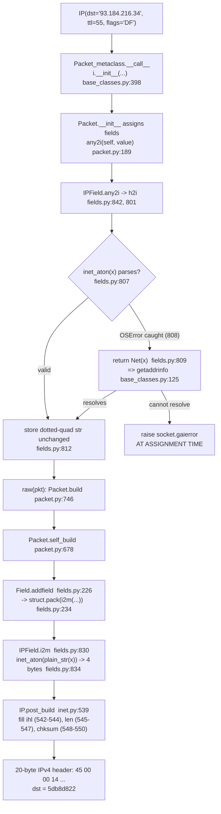

# How Scapy Represents, Validates, and Serializes IPv4 Header Fields

**An evidence-grounded investigation of the IPv4 destination-address field (`IP.dst`)**

This document empirically answers how this Scapy checkout represents, validates, and
serializes protocol header fields, with emphasis on the IPv4 destination-address field.
Every behavioral claim below was produced by **building and running** the relevant code
paths against the in-place library **first**, capturing the complete, unedited output, and
only then writing the surrounding analysis. Each factual claim carries a `file:line`
citation and names the specific class/method that does the work.

> **Read-only investigation.** No source file in this repository was modified. All probe
> scripts lived outside the tree (under `/tmp/scapy_probe`) and were removed after use. The
> only new artifact produced by the whole task is this document and its two parent
> directories (`blitzy/`, `blitzy/documentation/`).
>
> The governing user directive is preserved verbatim: *"Do not modify any source files. Only use temporary scripts if required, and ensure any test data is cleaned up."*

---

## Answer at a glance

| # | Question | Direct answer |
|---|----------|---------------|
| **A1** | Total serialized byte length and first few bytes of a simple IPv4 packet | **20 bytes**; first four bytes **`45 00 00 14`** |
| **A2** | Python type exposed by the destination-address field at runtime | The built-in **`str`** |
| **A3** | What happens with a clearly invalid IPv4 destination | An error is raised **at assignment / construction time (not at build time)** — a **`socket.gaierror: [Errno -2] Name or service not known`** (via a hostname-resolution fallback). Calling the field's own conversion method directly instead raises **`OSError: illegal IP address string passed to inet_aton`**. |
| **A4** | Field class, Python→bytes conversion method, validation kind, registry role | Class **`IPField`** (subclass **`DestIPField`** for `IP.dst`); conversion method **`i2m`** (calls `inet_aton`); validation delegated to **`inet_aton`** (which rejects clearly-invalid addresses but accepts legacy shorthand forms — Scapy adds no stricter validator) with a `Net` hostname fallback; registered into the field/layer type system by **`Field_metaclass`**, **`register_owner`**, and **`Packet_metaclass`** → **`conf.layers`**. |

---

## Environment and version banner

All commands were run exactly as a normal user would from the repository root, using the
canonical in-place invocation `PYTHONPATH=. python3`.

- **Repository root (this checkout):** `/tmp/blitzy/scapy/blitzy-cc08c4fd-cc32-450e-be37-a01e185a1a8a_7871b0`
- **Source / baseline commit:** `0925ada485406684174d6f068dbd85c4154657b3` (the branch point named by source branch `scapy_0925ada48540`). The investigation was run against this pre-existing baseline; the delivered working tree is a descendant of it that adds the commit(s) introducing and refining this answer document.
- **Interpreter:** CPython **3.13.7**

Command and output — interpreter version:

```console
$ python3 --version
Python 3.13.7
$ PYTHONPATH=. python3 -c "import sys; print(sys.version)"
3.13.7 (main, Mar  3 2026, 12:19:54) [GCC 15.2.0]
```

CPython 3.13.7 satisfies Scapy's declared support range `requires-python = ">=3.7, <4"`
(`pyproject.toml:17`).

Command and output — Scapy version:

```console
$ PYTHONPATH=. python3 -c "import scapy; print(scapy.VERSION)"
2026.07.08
```

**The version is dynamic / date-based, not a static literal.** `pyproject.toml:78` declares
`version = { attr="scapy.VERSION" }` under `[tool.setuptools.dynamic]`; there is no static
`VERSION` file in the tree. The value `2026.07.08` is what this checkout reported at
authoring time and may differ on another date. Note the version manifest is the
**repository-root** `pyproject.toml` (not `scapy/pyproject.toml`).

**Import warnings (captured verbatim).** Importing the full `scapy.all` namespace (which
loads the IPsec layer) prints a benign `CryptographyDeprecationWarning` about TripleDES on
stderr; importing the bare `scapy` package does not. Both behaviors are shown below exactly
as observed:

```console
$ PYTHONPATH=. python3 -c "from scapy.all import IP; print(repr(IP()))" 2>&1
/tmp/blitzy/scapy/blitzy-cc08c4fd-cc32-450e-be37-a01e185a1a8a_7871b0/scapy/layers/ipsec.py:573: CryptographyDeprecationWarning: TripleDES has been moved to cryptography.hazmat.decrepit.ciphers.algorithms.TripleDES and will be removed from this module in 48.0.0.
  cipher=algorithms.TripleDES,
/tmp/blitzy/scapy/blitzy-cc08c4fd-cc32-450e-be37-a01e185a1a8a_7871b0/scapy/layers/ipsec.py:577: CryptographyDeprecationWarning: TripleDES has been moved to cryptography.hazmat.decrepit.ciphers.algorithms.TripleDES and will be removed from this module in 48.0.0.
  cipher=algorithms.TripleDES,
<IP  |>

$ PYTHONPATH=. python3 -c "import scapy; print(scapy.VERSION)" 2>&1
2026.07.08
```

This warning originates from `scapy/layers/ipsec.py:573` and `scapy/layers/ipsec.py:577`
and is unrelated to IPv4 field handling. Scapy core is pure Python and requires no
third-party package to import `IP` or to build/serialize a packet.

---

## A1 — Build & serialize a simple IPv4 packet

**Direct answer:** the serialized packet is **20 bytes** long, and its **first four bytes
are `45 00 00 14`**.

### Command and full, unedited output

The probe builds `IP(dst="93.184.216.34", ttl=55, flags="DF")`, serializes it with `raw()`,
and prints the length, full hex, and byte slices. It was run **three times** (twice with
stderr shown, once with stderr suppressed) and the reported bytes were **identical every
time**.

```console
$ PYTHONPATH=. python3 /tmp/scapy_probe/a1_a2.py 2>&1
/tmp/blitzy/scapy/blitzy-cc08c4fd-cc32-450e-be37-a01e185a1a8a_7871b0/scapy/layers/ipsec.py:573: CryptographyDeprecationWarning: TripleDES has been moved to cryptography.hazmat.decrepit.ciphers.algorithms.TripleDES and will be removed from this module in 48.0.0.
  cipher=algorithms.TripleDES,
/tmp/blitzy/scapy/blitzy-cc08c4fd-cc32-450e-be37-a01e185a1a8a_7871b0/scapy/layers/ipsec.py:577: CryptographyDeprecationWarning: TripleDES has been moved to cryptography.hazmat.decrepit.ciphers.algorithms.TripleDES and will be removed from this module in 48.0.0.
  cipher=algorithms.TripleDES,
len: 20
full hex: 45000014000140003700f6310aec0cf15db8d822
first4: 45 00 00 14
src bytes[12:16]: 0aec0cf1
dst bytes[16:20]: 5db8d822
pkt.dst repr: '93.184.216.34'
type(pkt.dst): <class 'str'>
isinstance str: True
default IP().dst: '127.0.0.1' <class 'str'>
field object type: Emph
field object class name: Emph
```

### Byte-by-byte decode of the observed 20-byte header

| Offset | Bytes (this run) | IPv4 field | Meaning | Determinism |
|--------|------------------|------------|---------|-------------|
| `[0]`     | `45`       | version + IHL | version 4, IHL 5 (5×4 = 20-byte header) | **deterministic** |
| `[1]`     | `00`       | ToS/DSCP | 0 | **deterministic** |
| `[2:4]`   | `0014`     | total length | 20 | **deterministic** |
| `[4:6]`   | `0001`     | identification | 1 | **deterministic** |
| `[6:8]`   | `4000`     | flags + fragment offset | `0x4000` → top 3 bits = `0b010` = **DF** set | **deterministic** |
| `[8]`     | `37`       | TTL | `0x37` = **55** | **deterministic** |
| `[9]`     | `00`       | protocol | 0 | **deterministic** |
| `[10:12]` | `f631`     | header checksum | depends on the source address | **host-dependent** |
| `[12:16]` | `0aec0cf1` | source address | `10.236.12.241` (auto-filled from this host's route) | **host-dependent** |
| `[16:20]` | `5db8d822` | destination address | `93.184.216.34` | **deterministic** |

### Deterministic vs host-dependent (mandatory distinction)

- **Deterministic (identical on any host):** `len` = **20**; `first4` = **`45 00 00 14`**
  (IP version 4, IHL 5); the destination bytes `[16:20]` = **`5db8d822`** = `93.184.216.34`;
  and every field we set explicitly (`ttl` = `0x37`, the `DF` flag = `0x4000`).
- **Host-dependent (WILL differ on other hosts):** the auto-filled **source address**
  `[12:16]` (here `0aec0cf1` = `10.236.12.241`) and the **header checksum** `[10:12]` (here
  `f631`, which is a function of the source address). On a different machine these bytes —
  and therefore the middle of the `full hex` string — will differ; that is expected and
  correct.

### Cause → effect (why these values, with citations)

- **Why 20 bytes and why the leading `0x45`:** the header length and first byte are not
  stored by the user; they are auto-computed by `IP.post_build` (`scapy/layers/inet.py:539`).
  When `ihl` is left `None` it is filled as `len(p) // 4` and packed into the high nibble of
  byte 0 together with the version (`scapy/layers/inet.py:542`–`544`); when `len` is `None`
  the total length is computed and packed into bytes `[2:4]` (`scapy/layers/inet.py:545`–`547`);
  when `chksum` is `None` the checksum is computed and packed into bytes `[10:12]`
  (`scapy/layers/inet.py:548`–`550`). With no IP options, the header is exactly 5 words →
  IHL 5 → `0x45` and total length 20.
- **Why `ttl` byte is `0x37`:** `ttl=55` overrides the default `ByteField("ttl", 64)`
  (`scapy/layers/inet.py:531`); `55` = `0x37`.
- **Why the flags byte is `0x4000` (DF):** `flags="DF"` sets one bit of the 3-bit
  `FlagsField("flags", 0, 3, ["MF", "DF", "evil"])` (`scapy/layers/inet.py:529`). `DF` is the
  second name in that list, giving flag value `0b010` = 2, which occupies the top 3 bits of
  the 16-bit flags+fragment word: `2 << 13` = `0x4000`.
- **Why the source bytes are host-dependent:** `src` is bound as
  `Emph(SourceIPField("src", "dst"))` (`scapy/layers/inet.py:535`). `SourceIPField`
  (`scapy/fields.py:854`) auto-derives the source address from the routing table
  (`conf.route`) when it is not set explicitly, so the bytes depend on the machine's network
  configuration; the checksum then depends on that source.
- **Why the destination bytes are deterministic:** `dst="93.184.216.34"` is converted to
  its 4-byte network form by `IPField.i2m` via `inet_aton` (`scapy/fields.py:834`), which
  yields the fixed bytes `5db8d822` regardless of host.

---


## A2 — Runtime type of the destination-address field

**Direct answer:** accessing `pkt.dst` at runtime yields the built-in **`str`**.

### Command and full, unedited output

The relevant lines come from the same probe as A1 (`/tmp/scapy_probe/a1_a2.py`):

```console
$ PYTHONPATH=. python3 /tmp/scapy_probe/a1_a2.py 2>/dev/null
len: 20
full hex: 45000014000140003700f6310aec0cf15db8d822
first4: 45 00 00 14
src bytes[12:16]: 0aec0cf1
dst bytes[16:20]: 5db8d822
pkt.dst repr: '93.184.216.34'
type(pkt.dst): <class 'str'>
isinstance str: True
default IP().dst: '127.0.0.1' <class 'str'>
field object type: Emph
field object class name: Emph
```

The load-bearing lines:

- `pkt.dst repr: '93.184.216.34'`
- `type(pkt.dst): <class 'str'>`
- `isinstance str: True`
- `default IP().dst: '127.0.0.1' <class 'str'>`

So the **field value** exposed at runtime is a plain Python `str` (the dotted-quad string),
both for the explicitly-set packet and for the default `IP()` (whose `dst` reads back as the
`str` `'127.0.0.1'`).

### Distinguish the field *value* from the field *object*

There are two different "types" in play, and only the first is what `type(pkt.dst)` reports:

- **Field value type** (what `pkt.dst` returns): `str` — as shown above.
- **Field object class** (the descriptor bound in `IP.fields_desc`): the destination field
  is defined as `Emph(DestIPField("dst", "127.0.0.1"))` (`scapy/layers/inet.py:536`).
  Retrieving the field object shows the observed `field object type: Emph` — the field is
  wrapped by the `Emph` "emphasis" helper for display purposes, while the underlying field
  class is `DestIPField` (`scapy/layers/inet.py:503`), a subclass of `IPField`
  (`scapy/fields.py:796`). The `Emph` wrapper forwards attribute access to the wrapped
  `DestIPField`, so the *value* semantics are those of `IPField`.

In short: the field **object** is an `Emph`-wrapped `DestIPField`, but the field **value**
it produces for `pkt.dst` is a `str`.

### Cause → effect (why a plain `str`, with citations)

- When you read `pkt.dst`, Scapy runs the field's human-facing conversion `IPField.i2h`,
  which simply returns the stored value cast to `str`: `return cast(str, x)`
  (`scapy/fields.py:816`).
- The stored (internal) value is itself the dotted-quad string, because on assignment
  `IPField.h2i` (`scapy/fields.py:801`) validates the input with `inet_aton(x)`
  (`scapy/fields.py:807`) and, when parsing succeeds, **returns the string unchanged**
  (`scapy/fields.py:812`) rather than converting it to bytes or a custom object. (For
  `DestIPField`, `i2h` first substitutes the packet's resolved destination when the value is
  `None`, then delegates to `IPField.i2h` — `scapy/layers/inet.py:515`–`517`.)
- The conversion to 4 network bytes happens only later, at serialization time, in
  `IPField.i2m` (`scapy/fields.py:830`) — not when you read the attribute. That is why the
  attribute reads back as a human-readable `str`, while the wire form is bytes.

---


## A3 — A clearly invalid IPv4 destination

**Direct answer:** the error appears **at assignment / construction time (during `IP(...)`,
not at `build()`/serialization time)**. At the packet level it surfaces as a
**`socket.gaierror: [Errno -2] Name or service not known`**, because a non-parseable
address is treated as a *hostname* and a DNS lookup is attempted and fails. When the field's
raw conversion method is invoked directly instead, the underlying `inet_aton` parse error is
visible as **`OSError: illegal IP address string passed to inet_aton`**.

Two malformed inputs were exercised — `"999.999.999.999"` (out-of-range dotted quad) and
`"not.an.ip"` (non-numeric) — plus a direct field-level call. Both malformed packet inputs
produce the **same** final error via the **same** code path.

### Surface 1 — Packet-level (`IP(dst=...)`)

#### `IP(dst="999.999.999.999")` — command and full, unedited traceback

```console
$ PYTHONPATH=. python3 /tmp/scapy_probe/a3_pkt.py 2>&1
/tmp/blitzy/scapy/blitzy-cc08c4fd-cc32-450e-be37-a01e185a1a8a_7871b0/scapy/layers/ipsec.py:573: CryptographyDeprecationWarning: TripleDES has been moved to cryptography.hazmat.decrepit.ciphers.algorithms.TripleDES and will be removed from this module in 48.0.0.
  cipher=algorithms.TripleDES,
/tmp/blitzy/scapy/blitzy-cc08c4fd-cc32-450e-be37-a01e185a1a8a_7871b0/scapy/layers/ipsec.py:577: CryptographyDeprecationWarning: TripleDES has been moved to cryptography.hazmat.decrepit.ciphers.algorithms.TripleDES and will be removed from this module in 48.0.0.
  cipher=algorithms.TripleDES,
Traceback (most recent call last):
  File "/tmp/blitzy/scapy/blitzy-cc08c4fd-cc32-450e-be37-a01e185a1a8a_7871b0/scapy/fields.py", line 807, in h2i
    inet_aton(x)
    ~~~~~~~~~^^^
OSError: illegal IP address string passed to inet_aton

During handling of the above exception, another exception occurred:

Traceback (most recent call last):
  File "/tmp/scapy_probe/a3_pkt.py", line 2, in <module>
    IP(dst="999.999.999.999")
    ~~^^^^^^^^^^^^^^^^^^^^^^^
  File "/tmp/blitzy/scapy/blitzy-cc08c4fd-cc32-450e-be37-a01e185a1a8a_7871b0/scapy/base_classes.py", line 398, in __call__
    i.__init__(*args, **kargs)
    ~~~~~~~~~~^^^^^^^^^^^^^^^^
  File "/tmp/blitzy/scapy/blitzy-cc08c4fd-cc32-450e-be37-a01e185a1a8a_7871b0/scapy/packet.py", line 189, in __init__
    self.get_field(fname).any2i(self, value)
    ~~~~~~~~~~~~~~~~~~~~~~~~~~~^^^^^^^^^^^^^
  File "/tmp/blitzy/scapy/blitzy-cc08c4fd-cc32-450e-be37-a01e185a1a8a_7871b0/scapy/fields.py", line 842, in any2i
    return self.h2i(pkt, x)
           ~~~~~~~~^^^^^^^^
  File "/tmp/blitzy/scapy/blitzy-cc08c4fd-cc32-450e-be37-a01e185a1a8a_7871b0/scapy/fields.py", line 809, in h2i
    return Net(x)
  File "/tmp/blitzy/scapy/blitzy-cc08c4fd-cc32-450e-be37-a01e185a1a8a_7871b0/scapy/base_classes.py", line 160, in __init__
    self.start = self.ip2int(net) >> inv_mask << inv_mask
                 ~~~~~~~~~~~^^^^^
  File "/tmp/blitzy/scapy/blitzy-cc08c4fd-cc32-450e-be37-a01e185a1a8a_7871b0/scapy/base_classes.py", line 138, in ip2int
    "!I", socket.inet_aton(cls.name2addr(addr))
                           ~~~~~~~~~~~~~^^^^^^
  File "/tmp/blitzy/scapy/blitzy-cc08c4fd-cc32-450e-be37-a01e185a1a8a_7871b0/scapy/base_classes.py", line 125, in name2addr
    socket.getaddrinfo(name, None, cls.family)
    ~~~~~~~~~~~~~~~~~~^^^^^^^^^^^^^^^^^^^^^^^^
  File "/usr/lib/python3.13/socket.py", line 977, in getaddrinfo
    for res in _socket.getaddrinfo(host, port, family, type, proto, flags):
               ~~~~~~~~~~~~~~~~~~~^^^^^^^^^^^^^^^^^^^^^^^^^^^^^^^^^^^^^^^^
socket.gaierror: [Errno -2] Name or service not known
```

#### `IP(dst="not.an.ip")` — command and full, unedited traceback

```console
$ PYTHONPATH=. python3 /tmp/scapy_probe/a3_pkt_notanip.py 2>&1
/tmp/blitzy/scapy/blitzy-cc08c4fd-cc32-450e-be37-a01e185a1a8a_7871b0/scapy/layers/ipsec.py:573: CryptographyDeprecationWarning: TripleDES has been moved to cryptography.hazmat.decrepit.ciphers.algorithms.TripleDES and will be removed from this module in 48.0.0.
  cipher=algorithms.TripleDES,
/tmp/blitzy/scapy/blitzy-cc08c4fd-cc32-450e-be37-a01e185a1a8a_7871b0/scapy/layers/ipsec.py:577: CryptographyDeprecationWarning: TripleDES has been moved to cryptography.hazmat.decrepit.ciphers.algorithms.TripleDES and will be removed from this module in 48.0.0.
  cipher=algorithms.TripleDES,
Traceback (most recent call last):
  File "/tmp/blitzy/scapy/blitzy-cc08c4fd-cc32-450e-be37-a01e185a1a8a_7871b0/scapy/fields.py", line 807, in h2i
    inet_aton(x)
    ~~~~~~~~~^^^
OSError: illegal IP address string passed to inet_aton

During handling of the above exception, another exception occurred:

Traceback (most recent call last):
  File "/tmp/scapy_probe/a3_pkt_notanip.py", line 2, in <module>
    IP(dst="not.an.ip")
    ~~^^^^^^^^^^^^^^^^^
  File "/tmp/blitzy/scapy/blitzy-cc08c4fd-cc32-450e-be37-a01e185a1a8a_7871b0/scapy/base_classes.py", line 398, in __call__
    i.__init__(*args, **kargs)
    ~~~~~~~~~~^^^^^^^^^^^^^^^^
  File "/tmp/blitzy/scapy/blitzy-cc08c4fd-cc32-450e-be37-a01e185a1a8a_7871b0/scapy/packet.py", line 189, in __init__
    self.get_field(fname).any2i(self, value)
    ~~~~~~~~~~~~~~~~~~~~~~~~~~~^^^^^^^^^^^^^
  File "/tmp/blitzy/scapy/blitzy-cc08c4fd-cc32-450e-be37-a01e185a1a8a_7871b0/scapy/fields.py", line 842, in any2i
    return self.h2i(pkt, x)
           ~~~~~~~~^^^^^^^^
  File "/tmp/blitzy/scapy/blitzy-cc08c4fd-cc32-450e-be37-a01e185a1a8a_7871b0/scapy/fields.py", line 809, in h2i
    return Net(x)
  File "/tmp/blitzy/scapy/blitzy-cc08c4fd-cc32-450e-be37-a01e185a1a8a_7871b0/scapy/base_classes.py", line 160, in __init__
    self.start = self.ip2int(net) >> inv_mask << inv_mask
                 ~~~~~~~~~~~^^^^^
  File "/tmp/blitzy/scapy/blitzy-cc08c4fd-cc32-450e-be37-a01e185a1a8a_7871b0/scapy/base_classes.py", line 138, in ip2int
    "!I", socket.inet_aton(cls.name2addr(addr))
                           ~~~~~~~~~~~~~^^^^^^
  File "/tmp/blitzy/scapy/blitzy-cc08c4fd-cc32-450e-be37-a01e185a1a8a_7871b0/scapy/base_classes.py", line 125, in name2addr
    socket.getaddrinfo(name, None, cls.family)
    ~~~~~~~~~~~~~~~~~~^^^^^^^^^^^^^^^^^^^^^^^^
  File "/usr/lib/python3.13/socket.py", line 977, in getaddrinfo
    for res in _socket.getaddrinfo(host, port, family, type, proto, flags):
               ~~~~~~~~~~~~~~~~~~~^^^^^^^^^^^^^^^^^^^^^^^^^^^^^^^^^^^^^^^^
socket.gaierror: [Errno -2] Name or service not known
```

#### Packet-level cause → effect (two-stage fallback, with citations)

The failure happens **during `__init__`**, before any call to `build()` — construction is
dispatched by `Packet_metaclass.__call__`, which calls `i.__init__(*args, **kargs)`
(`scapy/base_classes.py:398`). The chain is:

1. `Packet.__init__` assigns each keyword field via
   `self.get_field(fname).any2i(self, value)` (`scapy/packet.py:189`).
2. For `dst`, `IPField.any2i` simply forwards to `h2i`: `return self.h2i(pkt, x)`
   (`scapy/fields.py:842`).
3. `IPField.h2i` (`scapy/fields.py:801`) tries to parse the value with `inet_aton(x)`
   (`scapy/fields.py:807`). For `"999.999.999.999"`/`"not.an.ip"` this raises
   `OSError: illegal IP address string passed to inet_aton` — the first traceback block above.
4. That `OSError` is **caught** by `except socket.error:` (`scapy/fields.py:808`), and `h2i`
   falls back to treating the string as a *hostname*: `return Net(x)` (`scapy/fields.py:809`).
5. Constructing `Net` (`scapy/base_classes.py:112`) triggers address resolution:
   `Net.__init__` computes `self.start = self.ip2int(net) ...` (`scapy/base_classes.py:160`),
   `ip2int` calls `socket.inet_aton(cls.name2addr(addr))` (`scapy/base_classes.py:138`), and
   `name2addr` performs the DNS lookup `socket.getaddrinfo(name, None, cls.family)`
   (`scapy/base_classes.py:125`).
6. The name does not resolve, so `getaddrinfo` raises the final
   `socket.gaierror: [Errno -2] Name or service not known`.

So the raw `inet_aton` validation error is **masked** at the packet level by the hostname
fallback, and the user-visible error is a DNS-resolution failure raised **at assignment
time**.

### Surface 2 — Field-level (`IPField.i2m` in isolation)

Calling the field's Python→wire conversion method directly bypasses the `h2i`/`Net`
fallback and exposes `inet_aton`'s own parse error.

```console
$ PYTHONPATH=. python3 /tmp/scapy_probe/a3_field.py 2>&1
Traceback (most recent call last):
  File "/tmp/scapy_probe/a3_field.py", line 2, in <module>
    IPField("x", None).i2m(None, "999.999.999.999")
    ~~~~~~~~~~~~~~~~~~~~~~^^^^^^^^^^^^^^^^^^^^^^^^^
  File "/tmp/blitzy/scapy/blitzy-cc08c4fd-cc32-450e-be37-a01e185a1a8a_7871b0/scapy/fields.py", line 834, in i2m
    return inet_aton(plain_str(x))
OSError: illegal IP address string passed to inet_aton
```

Here `IPField.i2m` (`scapy/fields.py:830`) reaches `return inet_aton(plain_str(x))`
(`scapy/fields.py:834`), and `inet_aton` raises `OSError: illegal IP address string passed
to inet_aton` directly — there is no hostname fallback on this path. (Note: this probe
imports `scapy.fields` directly rather than `scapy.all`, so it does not load the IPsec layer
and prints no `CryptographyDeprecationWarning`.)

### Why the two paths differ

- **Packet path** (`IP(dst=...)`): routes through `any2i` → `h2i`, which catches the
  `inet_aton` `OSError` and retries the value as a hostname via `Net`
  (`scapy/fields.py:808`–`809`). The user therefore sees a **`socket.gaierror`** from DNS
  resolution, raised at construction time.
- **Direct field path** (`IPField.i2m(...)`): performs the raw `inet_aton` parse with **no
  fallback** (`scapy/fields.py:834`), so the user sees `inet_aton`'s raw
  **`OSError: illegal IP address string passed to inet_aton`**.

Both are raised eagerly (at assignment or at the explicit `i2m` call), not deferred to a
later `build()`.

---


## A4 — Field class, conversion method, validation kind, and registry role

**Direct answer:**

- **IPv4 field class:** `IPField` (`scapy/fields.py:796`). For `IP.dst` specifically the
  field is the subclass `DestIPField` (`scapy/layers/inet.py:503`).
- **Python→bytes conversion method:** `i2m` — returns `b'\x00\x00\x00\x00'` for `None`, else
  `inet_aton(plain_str(x))` (`scapy/fields.py:830`–`834`).
- **Validation kind:** delegated entirely to `inet_aton` — Scapy adds no validator of its own.
  `inet_aton` rejects clearly-invalid / out-of-range text (e.g. `999.999.999.999`,
  `not.an.ip`) but accepts legacy shorthand IPv4 forms (e.g. `1`, `1.2`, `1.2.3`, octal
  `01.02.03.04`), so it is *not* a strict dotted-quad validator. A hostname-resolution fallback
  via `Net` applies on the assignment path (`scapy/fields.py:801`–`812`).
- **Registry / type-system role:** two-fold — `Field_metaclass` enforces `__slots__` on every
  field class, and `register_owner` + `Packet_metaclass` link each field to its owning
  packet classes and register the packet into the global `conf.layers` registry.

### Command and full, unedited output

```console
$ PYTHONPATH=. python3 /tmp/scapy_probe/a4.py 2>/dev/null
IPField.__bases__: ['Field']
DestIPField.__mro__: ['DestIPField', 'IPField', 'DestField', 'Field', 'Generic', 'object']
issubclass(DestIPField, IPField): True
i2m(None,'1.2.3.4'): b'\x01\x02\x03\x04'
i2m(None,None): b'\x00\x00\x00\x00'
Field.__slots__: ['name', 'fmt', 'default', 'sz', 'owners', 'struct']
IPField.__slots__: []
dst field owners: ['IP', 'IPerror', 'IPv46']
IP in conf.layers: True
type(conf.layers).__name__: LayersList
```

### The field class

- `IPField` is declared as `class IPField(Field[Union[str, Net], bytes]):`
  (`scapy/fields.py:796`); the observed `IPField.__bases__: ['Field']` confirms it extends the
  generic `Field` base (`scapy/fields.py:139`).
- `IP.dst` uses the more specific `class DestIPField(IPField, DestField):`
  (`scapy/layers/inet.py:503`). The observed MRO
  `['DestIPField', 'IPField', 'DestField', 'Field', 'Generic', 'object']` and
  `issubclass(DestIPField, IPField): True` confirm `DestIPField` is a subclass of `IPField`
  that additionally mixes in `DestField` (which lets it fill the destination from the packet
  when unset).

### The Python→wire conversion method: `i2m`

- `IPField.i2m` (`scapy/fields.py:830`) is the method that turns a Python value into
  on-the-wire bytes: `if x is None: return b'\x00\x00\x00\x00'` (`scapy/fields.py:832`–`833`),
  else `return inet_aton(plain_str(x))` (`scapy/fields.py:834`). The observed
  `i2m(None,'1.2.3.4'): b'\x01\x02\x03\x04'` and `i2m(None,None): b'\x00\x00\x00\x00'` verify
  both branches.
- `DestIPField` overrides `i2m` to substitute the packet's resolved destination when the
  value is `None`, then delegates to `IPField.i2m` (`scapy/layers/inet.py:510`–`513`).

### The validation kind

- Validation is **delegated entirely to `inet_aton`** — Scapy does not implement a validator
  of its own. `inet_aton` is invoked on the assignment path inside `IPField.h2i`
  (`scapy/fields.py:807`) and again at serialization inside `IPField.i2m`
  (`scapy/fields.py:834`).
- `inet_aton` is **not a strict dotted-quad validator**. It rejects clearly-invalid /
  out-of-range text (e.g. `999.999.999.999`, `not.an.ip`) with `OSError`, but it **accepts
  legacy shorthand IPv4 forms** — `1` → `0.0.0.1`, `1.2` → `1.0.0.2`, `1.2.3` → `1.2.0.3`, and
  octal such as `01.02.03.04` → `1.2.3.4` — i.e. the historical `inet_aton(3)` behavior of the
  platform libc. This was verified live (see *Captured output — validation kind* in the
  evidence appendix). There is no numeric range/format check beyond what `inet_aton` itself
  enforces.
- On the assignment path only, a **hostname fallback** wraps that parse: if `inet_aton` raises,
  `h2i` catches `socket.error` (`scapy/fields.py:808`) and returns `Net(x)`
  (`scapy/fields.py:809`), which attempts DNS resolution (see A3).

### Registry participation (two-fold)

**(1) Field type system — `Field_metaclass` enforces `__slots__`.** Every `Field` subclass is
created through `Field_metaclass` (`scapy/base_classes.py:404`), whose `__new__` runs
`dct.setdefault("__slots__", [])` (`scapy/base_classes.py:411`) so that field classes are
slotted (memory-efficient, attribute-constrained). The observed
`Field.__slots__: ['name', 'fmt', 'default', 'sz', 'owners', 'struct']` matches the base
declaration (`scapy/fields.py:146`–`153`), and `IPField.__slots__: []` shows the subclass
adds no new slots (it inherits the base's).

**(2) Ownership + layer registry — `register_owner` and `Packet_metaclass` → `conf.layers`.**
When a packet class such as `IP` is created, `Packet_metaclass.__new__`
(`scapy/base_classes.py:281`) iterates its `fields_desc` and, for each field exposing
`register_owner`, calls `_f.register_owner(newcls)` (`scapy/base_classes.py:364`–`366`).
`Field.register_owner` appends the packet class to the field's `owners` list
(`scapy/fields.py:172`–`174`). The observed `dst field owners: ['IP', 'IPerror', 'IPv46']`
shows the single `dst` field descriptor is shared/registered across the `IP`, `IPerror`, and
`IPv46` packet classes. The same metaclass then registers every non-underscore packet class
into the global layer registry via `config.conf.layers.register(newcls)`
(`scapy/base_classes.py:369`). `conf.layers` is a `LayersList` (`scapy/config.py:265`;
instantiated as `layers = LayersList()` at `scapy/config.py:735`) whose `register` method
appends the layer (`scapy/config.py:278`–`280`). The observed `IP in conf.layers: True` and
`type(conf.layers).__name__: LayersList` confirm `IP` is registered in that global list.

### Serialization wiring (how `i2m` gets called during `raw()`)

At serialization, `Packet.self_build` (`scapy/packet.py:678`) iterates `fields_desc` and
calls each field's `addfield`. `Field.addfield` (`scapy/fields.py:226`) does
`return s + self.struct.pack(self.i2m(pkt, val))` (`scapy/fields.py:234`) — i.e. it invokes
`i2m` to obtain the network bytes and packs them. If packing fails with a `struct.error`,
`addfield` wraps it into a `ValueError` that names the offending field
(`scapy/fields.py:235`–`241`), aiding traceability. The overall build entry point is
`Packet.build` (`scapy/packet.py:746`), and the IPv4 auto-fields (`ihl`, `len`, `chksum`) are
completed afterward by `IP.post_build` (`scapy/layers/inet.py:539`), as detailed in A1.

---


## Code-trace summary

The IPv4 destination-address field is represented, validated, and serialized by a small,
well-defined set of classes and methods:

- **Representation.** `IP.dst` is bound in `IP.fields_desc` as
  `Emph(DestIPField("dst", "127.0.0.1"))` (`scapy/layers/inet.py:536`). `DestIPField`
  (`scapy/layers/inet.py:503`) is a subclass of `IPField` (`scapy/fields.py:796`), which
  extends the generic `Field` base (`scapy/fields.py:139`). The value you read back
  (`pkt.dst`) is a plain `str`, because `IPField.i2h` returns the value as a string
  (`scapy/fields.py:816`) and `IPField.h2i` stores an accepted dotted-quad unchanged
  (`scapy/fields.py:801`–`812`).
- **Validation.** Input is validated by `inet_aton` — directly, with no fallback, on the field path
  (`IPField.i2m`, `scapy/fields.py:834`), and with a `Net` hostname fallback on the packet
  assignment path (`IPField.h2i`, `scapy/fields.py:807`–`809`). An invalid address therefore
  fails **at assignment time**: a `socket.gaierror` (packet level, via `Net`/`getaddrinfo`,
  `scapy/base_classes.py:125`) or a raw `OSError` from `inet_aton` (direct `i2m` call).
- **Serialization.** `raw(pkt)` → `Packet.build` (`scapy/packet.py:746`) →
  `Packet.self_build` (`scapy/packet.py:678`) → per-field `Field.addfield`
  (`scapy/fields.py:226`) → `IPField.i2m` (`scapy/fields.py:830`) → `inet_aton` → 4 bytes.
  Afterward `IP.post_build` (`scapy/layers/inet.py:539`) auto-fills `ihl`, total `len`, and
  `chksum`, producing the deterministic 20-byte header beginning `0x45`.
- **Type system / registry.** `Field_metaclass` slots every field class
  (`scapy/base_classes.py:411`); `register_owner` links a field to its owning packets
  (`scapy/fields.py:172`–`174`) as invoked by `Packet_metaclass`
  (`scapy/base_classes.py:364`–`366`); and the same metaclass registers each packet into the
  global `conf.layers` `LayersList` (`scapy/base_classes.py:369`; `scapy/config.py:265`,
  `scapy/config.py:278`).

### Flow diagram



The direct field path used in A3's second surface skips the `h2i`/`Net` fallback and calls
`IPField.i2m` straight away, so an invalid address raises `OSError` from `inet_aton`
(`scapy/fields.py:834`) with no hostname retry.

---


## Evidence appendix

This appendix contains the exact temporary probe scripts and their complete, unedited
captured output. The scripts were created under `/tmp/scapy_probe` (outside the repository
tree) and removed after use; nothing was written inside the repository except this document.
All commands were run from the repository root with `PYTHONPATH=. python3`.

### Probe scripts

`/tmp/scapy_probe/a1_a2.py` (A1 + A2 — build/serialize and runtime type):

```python
from scapy.all import IP, raw
pkt = IP(dst="93.184.216.34", ttl=55, flags="DF")
b = raw(pkt)
print("len:", len(b))
print("full hex:", b.hex())
print("first4:", " ".join("%02x" % x for x in b[:4]))
print("src bytes[12:16]:", b[12:16].hex())
print("dst bytes[16:20]:", b[16:20].hex())
print("pkt.dst repr:", repr(pkt.dst))
print("type(pkt.dst):", type(pkt.dst))
print("isinstance str:", isinstance(pkt.dst, str))
print("default IP().dst:", repr(IP().dst), type(IP().dst))
f = IP().get_field('dst')
print("field object type:", type(f).__name__)
print("field object class name:", f.__class__.__name__)
```

`/tmp/scapy_probe/a3_pkt.py` and `/tmp/scapy_probe/a3_pkt_notanip.py` (A3 packet-level):

```python
# a3_pkt.py
from scapy.all import IP
IP(dst="999.999.999.999")
```

```python
# a3_pkt_notanip.py
from scapy.all import IP
IP(dst="not.an.ip")
```

`/tmp/scapy_probe/a3_field.py` (A3 field-level):

```python
from scapy.fields import IPField
IPField("x", None).i2m(None, "999.999.999.999")
```

`/tmp/scapy_probe/a4.py` (A4 — field class, conversion, validation, registry):

```python
from scapy.all import IP
from scapy.fields import IPField, Field
from scapy.layers.inet import DestIPField
print("IPField.__bases__:", [c.__name__ for c in IPField.__bases__])
print("DestIPField.__mro__:", [c.__name__ for c in DestIPField.__mro__])
print("issubclass(DestIPField, IPField):", issubclass(DestIPField, IPField))
f = IPField("x", None)
print("i2m(None,'1.2.3.4'):", f.i2m(None, "1.2.3.4"))
print("i2m(None,None):", f.i2m(None, None))
print("Field.__slots__:", Field.__slots__)
print("IPField.__slots__:", IPField.__slots__)
dstf = IP().get_field('dst')
print("dst field owners:", [c.__name__ for c in dstf.owners])
from scapy.config import conf
print("IP in conf.layers:", IP in conf.layers)
print("type(conf.layers).__name__:", type(conf.layers).__name__)
```

`/tmp/scapy_probe/a4_validation.py` (A4 — validation kind: `inet_aton` leniency):

```python
from scapy.fields import IPField
import socket
for value in ['1', '1.2', '1.2.3', '01.02.03.04', '1.2.3.4', '999.999.999.999', 'not.an.ip']:
    print('value', value)
    try:
        print(' socket.inet_aton:', socket.inet_aton(value).hex())
    except Exception as e:
        print(' socket.inet_aton_error:', type(e).__name__, str(e))
    try:
        print(' IPField.i2m:', IPField('x', None).i2m(None, value).hex())
    except Exception as e:
        print(' IPField.i2m_error:', type(e).__name__, str(e))
```

### Captured output — A1 + A2 (run three times; deterministic bytes identical every time)

Run 1 (`2>&1`, stderr shown):

```console
$ PYTHONPATH=. python3 /tmp/scapy_probe/a1_a2.py 2>&1
/tmp/blitzy/scapy/blitzy-cc08c4fd-cc32-450e-be37-a01e185a1a8a_7871b0/scapy/layers/ipsec.py:573: CryptographyDeprecationWarning: TripleDES has been moved to cryptography.hazmat.decrepit.ciphers.algorithms.TripleDES and will be removed from this module in 48.0.0.
  cipher=algorithms.TripleDES,
/tmp/blitzy/scapy/blitzy-cc08c4fd-cc32-450e-be37-a01e185a1a8a_7871b0/scapy/layers/ipsec.py:577: CryptographyDeprecationWarning: TripleDES has been moved to cryptography.hazmat.decrepit.ciphers.algorithms.TripleDES and will be removed from this module in 48.0.0.
  cipher=algorithms.TripleDES,
len: 20
full hex: 45000014000140003700f6310aec0cf15db8d822
first4: 45 00 00 14
src bytes[12:16]: 0aec0cf1
dst bytes[16:20]: 5db8d822
pkt.dst repr: '93.184.216.34'
type(pkt.dst): <class 'str'>
isinstance str: True
default IP().dst: '127.0.0.1' <class 'str'>
field object type: Emph
field object class name: Emph
```

Run 2 (`2>&1`, stderr shown — byte-for-byte identical to Run 1, confirming determinism):

```console
$ PYTHONPATH=. python3 /tmp/scapy_probe/a1_a2.py 2>&1
/tmp/blitzy/scapy/blitzy-cc08c4fd-cc32-450e-be37-a01e185a1a8a_7871b0/scapy/layers/ipsec.py:573: CryptographyDeprecationWarning: TripleDES has been moved to cryptography.hazmat.decrepit.ciphers.algorithms.TripleDES and will be removed from this module in 48.0.0.
  cipher=algorithms.TripleDES,
/tmp/blitzy/scapy/blitzy-cc08c4fd-cc32-450e-be37-a01e185a1a8a_7871b0/scapy/layers/ipsec.py:577: CryptographyDeprecationWarning: TripleDES has been moved to cryptography.hazmat.decrepit.ciphers.algorithms.TripleDES and will be removed from this module in 48.0.0.
  cipher=algorithms.TripleDES,
len: 20
full hex: 45000014000140003700f6310aec0cf15db8d822
first4: 45 00 00 14
src bytes[12:16]: 0aec0cf1
dst bytes[16:20]: 5db8d822
pkt.dst repr: '93.184.216.34'
type(pkt.dst): <class 'str'>
isinstance str: True
default IP().dst: '127.0.0.1' <class 'str'>
field object type: Emph
field object class name: Emph
```

Run 3 (`2>/dev/null`, stdout only — deterministic and host-dependent fields identical to
Runs 1 and 2 on this host):

```console
$ PYTHONPATH=. python3 /tmp/scapy_probe/a1_a2.py 2>/dev/null
len: 20
full hex: 45000014000140003700f6310aec0cf15db8d822
first4: 45 00 00 14
src bytes[12:16]: 0aec0cf1
dst bytes[16:20]: 5db8d822
pkt.dst repr: '93.184.216.34'
type(pkt.dst): <class 'str'>
isinstance str: True
default IP().dst: '127.0.0.1' <class 'str'>
field object type: Emph
field object class name: Emph
```

### Captured output — A3

For appendix self-containment, the complete, unedited tracebacks for all three A3 conditions
are reproduced in full below (identical to the blocks shown in **Section A3** above). Both
packet-level tracebacks end in `socket.gaierror: [Errno -2] Name or service not known`; the
field-level call ends in `OSError: illegal IP address string passed to inet_aton`. Each
command exits with code 1.

Packet-level — `IP(dst="999.999.999.999")`:

```console
$ PYTHONPATH=. python3 /tmp/scapy_probe/a3_pkt.py 2>&1          # exit code 1
/tmp/blitzy/scapy/blitzy-cc08c4fd-cc32-450e-be37-a01e185a1a8a_7871b0/scapy/layers/ipsec.py:573: CryptographyDeprecationWarning: TripleDES has been moved to cryptography.hazmat.decrepit.ciphers.algorithms.TripleDES and will be removed from this module in 48.0.0.
  cipher=algorithms.TripleDES,
/tmp/blitzy/scapy/blitzy-cc08c4fd-cc32-450e-be37-a01e185a1a8a_7871b0/scapy/layers/ipsec.py:577: CryptographyDeprecationWarning: TripleDES has been moved to cryptography.hazmat.decrepit.ciphers.algorithms.TripleDES and will be removed from this module in 48.0.0.
  cipher=algorithms.TripleDES,
Traceback (most recent call last):
  File "/tmp/blitzy/scapy/blitzy-cc08c4fd-cc32-450e-be37-a01e185a1a8a_7871b0/scapy/fields.py", line 807, in h2i
    inet_aton(x)
    ~~~~~~~~~^^^
OSError: illegal IP address string passed to inet_aton

During handling of the above exception, another exception occurred:

Traceback (most recent call last):
  File "/tmp/scapy_probe/a3_pkt.py", line 2, in <module>
    IP(dst="999.999.999.999")
    ~~^^^^^^^^^^^^^^^^^^^^^^^
  File "/tmp/blitzy/scapy/blitzy-cc08c4fd-cc32-450e-be37-a01e185a1a8a_7871b0/scapy/base_classes.py", line 398, in __call__
    i.__init__(*args, **kargs)
    ~~~~~~~~~~^^^^^^^^^^^^^^^^
  File "/tmp/blitzy/scapy/blitzy-cc08c4fd-cc32-450e-be37-a01e185a1a8a_7871b0/scapy/packet.py", line 189, in __init__
    self.get_field(fname).any2i(self, value)
    ~~~~~~~~~~~~~~~~~~~~~~~~~~~^^^^^^^^^^^^^
  File "/tmp/blitzy/scapy/blitzy-cc08c4fd-cc32-450e-be37-a01e185a1a8a_7871b0/scapy/fields.py", line 842, in any2i
    return self.h2i(pkt, x)
           ~~~~~~~~^^^^^^^^
  File "/tmp/blitzy/scapy/blitzy-cc08c4fd-cc32-450e-be37-a01e185a1a8a_7871b0/scapy/fields.py", line 809, in h2i
    return Net(x)
  File "/tmp/blitzy/scapy/blitzy-cc08c4fd-cc32-450e-be37-a01e185a1a8a_7871b0/scapy/base_classes.py", line 160, in __init__
    self.start = self.ip2int(net) >> inv_mask << inv_mask
                 ~~~~~~~~~~~^^^^^
  File "/tmp/blitzy/scapy/blitzy-cc08c4fd-cc32-450e-be37-a01e185a1a8a_7871b0/scapy/base_classes.py", line 138, in ip2int
    "!I", socket.inet_aton(cls.name2addr(addr))
                           ~~~~~~~~~~~~~^^^^^^
  File "/tmp/blitzy/scapy/blitzy-cc08c4fd-cc32-450e-be37-a01e185a1a8a_7871b0/scapy/base_classes.py", line 125, in name2addr
    socket.getaddrinfo(name, None, cls.family)
    ~~~~~~~~~~~~~~~~~~^^^^^^^^^^^^^^^^^^^^^^^^
  File "/usr/lib/python3.13/socket.py", line 977, in getaddrinfo
    for res in _socket.getaddrinfo(host, port, family, type, proto, flags):
               ~~~~~~~~~~~~~~~~~~~^^^^^^^^^^^^^^^^^^^^^^^^^^^^^^^^^^^^^^^^
socket.gaierror: [Errno -2] Name or service not known
```

Packet-level — `IP(dst="not.an.ip")`:

```console
$ PYTHONPATH=. python3 /tmp/scapy_probe/a3_pkt_notanip.py 2>&1  # exit code 1
/tmp/blitzy/scapy/blitzy-cc08c4fd-cc32-450e-be37-a01e185a1a8a_7871b0/scapy/layers/ipsec.py:573: CryptographyDeprecationWarning: TripleDES has been moved to cryptography.hazmat.decrepit.ciphers.algorithms.TripleDES and will be removed from this module in 48.0.0.
  cipher=algorithms.TripleDES,
/tmp/blitzy/scapy/blitzy-cc08c4fd-cc32-450e-be37-a01e185a1a8a_7871b0/scapy/layers/ipsec.py:577: CryptographyDeprecationWarning: TripleDES has been moved to cryptography.hazmat.decrepit.ciphers.algorithms.TripleDES and will be removed from this module in 48.0.0.
  cipher=algorithms.TripleDES,
Traceback (most recent call last):
  File "/tmp/blitzy/scapy/blitzy-cc08c4fd-cc32-450e-be37-a01e185a1a8a_7871b0/scapy/fields.py", line 807, in h2i
    inet_aton(x)
    ~~~~~~~~~^^^
OSError: illegal IP address string passed to inet_aton

During handling of the above exception, another exception occurred:

Traceback (most recent call last):
  File "/tmp/scapy_probe/a3_pkt_notanip.py", line 2, in <module>
    IP(dst="not.an.ip")
    ~~^^^^^^^^^^^^^^^^^
  File "/tmp/blitzy/scapy/blitzy-cc08c4fd-cc32-450e-be37-a01e185a1a8a_7871b0/scapy/base_classes.py", line 398, in __call__
    i.__init__(*args, **kargs)
    ~~~~~~~~~~^^^^^^^^^^^^^^^^
  File "/tmp/blitzy/scapy/blitzy-cc08c4fd-cc32-450e-be37-a01e185a1a8a_7871b0/scapy/packet.py", line 189, in __init__
    self.get_field(fname).any2i(self, value)
    ~~~~~~~~~~~~~~~~~~~~~~~~~~~^^^^^^^^^^^^^
  File "/tmp/blitzy/scapy/blitzy-cc08c4fd-cc32-450e-be37-a01e185a1a8a_7871b0/scapy/fields.py", line 842, in any2i
    return self.h2i(pkt, x)
           ~~~~~~~~^^^^^^^^
  File "/tmp/blitzy/scapy/blitzy-cc08c4fd-cc32-450e-be37-a01e185a1a8a_7871b0/scapy/fields.py", line 809, in h2i
    return Net(x)
  File "/tmp/blitzy/scapy/blitzy-cc08c4fd-cc32-450e-be37-a01e185a1a8a_7871b0/scapy/base_classes.py", line 160, in __init__
    self.start = self.ip2int(net) >> inv_mask << inv_mask
                 ~~~~~~~~~~~^^^^^
  File "/tmp/blitzy/scapy/blitzy-cc08c4fd-cc32-450e-be37-a01e185a1a8a_7871b0/scapy/base_classes.py", line 138, in ip2int
    "!I", socket.inet_aton(cls.name2addr(addr))
                           ~~~~~~~~~~~~~^^^^^^
  File "/tmp/blitzy/scapy/blitzy-cc08c4fd-cc32-450e-be37-a01e185a1a8a_7871b0/scapy/base_classes.py", line 125, in name2addr
    socket.getaddrinfo(name, None, cls.family)
    ~~~~~~~~~~~~~~~~~~^^^^^^^^^^^^^^^^^^^^^^^^
  File "/usr/lib/python3.13/socket.py", line 977, in getaddrinfo
    for res in _socket.getaddrinfo(host, port, family, type, proto, flags):
               ~~~~~~~~~~~~~~~~~~~^^^^^^^^^^^^^^^^^^^^^^^^^^^^^^^^^^^^^^^^
socket.gaierror: [Errno -2] Name or service not known
```

Field-level — `IPField("x", None).i2m(None, "999.999.999.999")`:

```console
$ PYTHONPATH=. python3 /tmp/scapy_probe/a3_field.py 2>&1        # exit code 1
Traceback (most recent call last):
  File "/tmp/scapy_probe/a3_field.py", line 2, in <module>
    IPField("x", None).i2m(None, "999.999.999.999")
    ~~~~~~~~~~~~~~~~~~~~~~^^^^^^^^^^^^^^^^^^^^^^^^^
  File "/tmp/blitzy/scapy/blitzy-cc08c4fd-cc32-450e-be37-a01e185a1a8a_7871b0/scapy/fields.py", line 834, in i2m
    return inet_aton(plain_str(x))
OSError: illegal IP address string passed to inet_aton
```

### Captured output — A4

```console
$ PYTHONPATH=. python3 /tmp/scapy_probe/a4.py 2>/dev/null
IPField.__bases__: ['Field']
DestIPField.__mro__: ['DestIPField', 'IPField', 'DestField', 'Field', 'Generic', 'object']
issubclass(DestIPField, IPField): True
i2m(None,'1.2.3.4'): b'\x01\x02\x03\x04'
i2m(None,None): b'\x00\x00\x00\x00'
Field.__slots__: ['name', 'fmt', 'default', 'sz', 'owners', 'struct']
IPField.__slots__: []
dst field owners: ['IP', 'IPerror', 'IPv46']
IP in conf.layers: True
type(conf.layers).__name__: LayersList
```

### Captured output — validation kind (`inet_aton` leniency)

This probe imports `scapy.fields` directly (not `scapy.all`), so it emits no
`CryptographyDeprecationWarning`. It confirms that both `socket.inet_aton` and `IPField.i2m`
**accept** legacy shorthand IPv4 forms and only **reject** clearly-invalid / out-of-range
text — i.e. `inet_aton` is not a strict dotted-quad validator.

```console
$ PYTHONPATH=. python3 /tmp/scapy_probe/a4_validation.py 2>&1
value 1
 socket.inet_aton: 00000001
 IPField.i2m: 00000001
value 1.2
 socket.inet_aton: 01000002
 IPField.i2m: 01000002
value 1.2.3
 socket.inet_aton: 01020003
 IPField.i2m: 01020003
value 01.02.03.04
 socket.inet_aton: 01020304
 IPField.i2m: 01020304
value 1.2.3.4
 socket.inet_aton: 01020304
 IPField.i2m: 01020304
value 999.999.999.999
 socket.inet_aton_error: OSError illegal IP address string passed to inet_aton
 IPField.i2m_error: OSError illegal IP address string passed to inet_aton
value not.an.ip
 socket.inet_aton_error: OSError illegal IP address string passed to inet_aton
 IPField.i2m_error: OSError illegal IP address string passed to inet_aton
```

---

## Notes on determinism and host dependence

- **Deterministic (identical on any host, verified across repeated runs):** the 20-byte
  header length; the leading bytes `45 00 00 14`; the destination bytes `5db8d822`
  (`93.184.216.34`); the `ttl` byte `0x37`; and the `DF` flag bit (`0x4000`).
- **Host-dependent (expected to differ elsewhere):** the auto-filled source address
  (`src bytes[12:16]` = `0aec0cf1` = `10.236.12.241` on this host) and the header checksum
  (`[10:12]` = `f631`), because `SourceIPField` derives the source from `conf.route`
  (`scapy/fields.py:854`) and the checksum is computed over the whole header including that
  source.
- The `scapy.VERSION` value (`2026.07.08`) is **date-based** (`pyproject.toml:78`) and may
  differ if regenerated on another date. The interpreter here is CPython **3.13.7**; the
  Python-standard-library frame in the A3 tracebacks (`/usr/lib/python3.13/socket.py:977`) is
  interpreter/host-specific, while all `scapy/*` frame line numbers are properties of this
  checkout and are cited throughout.

*End of answer document.*

