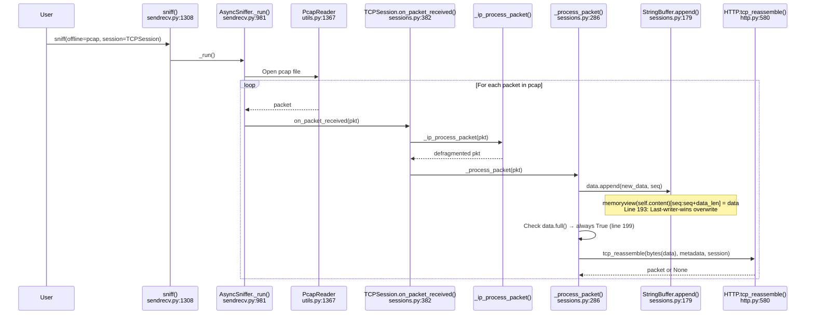
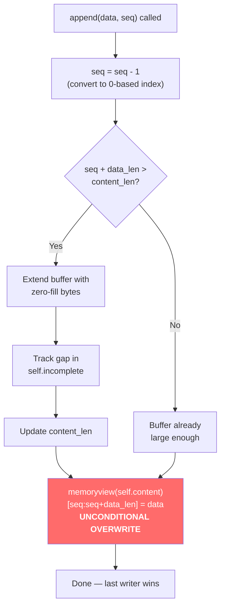

# TCP Stream Reconstruction with Overlapping Segments in Scapy

> **Repository**: Scapy — commit `0925ada4` on branch `scapy_0925ada48540`
>
> **Scope**: Read-only investigation of the TCP reassembly pipeline; no source files are modified.

---

## Question Summary

This document investigates the following question:

**How does Scapy's offline TCP reassembly pipeline handle overlapping (retransmitted) TCP segments, and which bytes "win" when two segments cover the same byte range?**

The investigation covers two distinct scenarios:

1. **Identical-byte overlap** — A retransmitted segment carries the *same* bytes as the original for the overlapping positions. This simulates a normal TCP retransmission where the sender re-sends the same data.
2. **Different-byte overlap** — A retransmitted segment carries *different* bytes for the overlapping positions. This simulates a pathological or adversarial scenario where conflicting data is injected for the same TCP sequence range.

For each variant we provide:
- The exact reconstructed byte stream
- The exact byte length
- Which segment's bytes prevail in the overlap region
- The code path from `sniff()` through to the buffer overwrite that determines the outcome

---

## Approach and Rationale

Every design choice in the experiment is driven by Scapy's actual source code. Below we explain *why* each decision was made.

### Why HTTP on port 80

The experiment needs a built-in Scapy layer that implements the `tcp_reassemble` class method — the hook that `TCPSession` calls to produce reassembled packets. HTTP is the most accessible choice because:

- `scapy/layers/http.py:748-750` registers HTTP as the payload class for TCP traffic on port 80:

  ```python
  bind_bottom_up(TCP, HTTP, sport=80)
  bind_bottom_up(TCP, HTTP, dport=80)
  bind_layers(TCP, HTTP, sport=80, dport=80)
  ```

  Source: `scapy/layers/http.py:748-750`

- `HTTP.tcp_reassemble()` at `scapy/layers/http.py:580` is a fully functional reassembly method that handles `Content-Length`, chunked transfer encoding, and FIN-based stream termination.

- HTTP is loaded on demand via `load_layer("http")`, which is a standard Scapy API — no custom `bind_layers()` calls or new `Packet` classes are required.

### Why three TCP segments with a 10-byte overlap

The full HTTP response is 42 bytes:

```
b'HTTP/1.0 200 OK\r\nContent-Length: 4\r\n\r\nABCD'
```

We split it into three segments so that the **second segment partially overlaps the first**:

| Segment | TCP seq | Buffer positions | Payload (identical variant) | Notes |
|---------|---------|------------------|-----------------------------|-------|
| seg1 | 201 | `[0:20)` | `b'HTTP/1.0 200 OK\r\nCon'` | First 20 bytes |
| seg2 | 211 | `[10:30)` | `b'00 OK\r\nContent-Lengt'` | Overlap at `[10:20)` |
| seg3 | 231 | `[30:42)` | `b'h: 4\r\n\r\nABCD'` | Trailing data + FIN |

The 10-byte overlap region `[10:20)` is large enough to be clearly visible in the output and to corrupt the HTTP status line in the different-byte variant (where `ZZZZZZZZZZ` replaces `00 OK\r\nCon`).

### Why the FIN flag on seg3

`TCPSession._process_packet()` at `scapy/sessions.py:346` checks for the TCP FIN flag:

```python
if pkt[TCP].flags.F or pkt[TCP].flags.R:
    metadata["tcp_end"] = True
```

Source: `scapy/sessions.py:346-347`

This sets `metadata["tcp_end"] = True`, which is consumed by `HTTP.tcp_reassemble()` at `scapy/layers/http.py:627`:

```python
detect_end = lambda dat: metadata.get("tcp_end", False)
```

Without FIN, the `Content-Length`-based detection in the identical-byte variant would still work (since the body length matches), but the FIN flag provides a clean stream termination signal that ensures both variants exercise the same reassembly trigger.

### Why `wrpcap()` + `sniff(offline=..., session=TCPSession)`

This exercises Scapy's normal offline reassembly pipeline end-to-end:

1. `wrpcap()` (`scapy/utils.py:1095`) serializes the crafted packets to a pcap file on disk.
2. `sniff(offline=..., session=TCPSession)` (`scapy/sendrecv.py:1308`) reads the pcap back:
   - `sniff()` creates an `AsyncSniffer` and calls `_run()` (`scapy/sendrecv.py:1310-1311`)
   - `_run()` opens the pcap via `PcapReader` (`scapy/utils.py:1367`) at `scapy/sendrecv.py:1116`
   - Each decoded packet is fed to `TCPSession.on_packet_received()` (`scapy/sessions.py:382`)
   - Which calls `_process_packet()` (`scapy/sessions.py:286`) for TCP reassembly

This approach avoids live capture, requires no network interfaces, and produces deterministic results.

---

## Experimental Setup

### Test Script

The following self-contained Python script constructs both pcap variants, runs reassembly, prints results, and cleans up after itself. It uses **only built-in Scapy APIs** — no new `Packet` classes, no `bind_layers()` calls, no direct `StringBuffer` import.

```python
#!/usr/bin/env python3
"""
TCP Overlap Investigation Script
Demonstrates Scapy's behavior when handling overlapping TCP segments.
Two variants: identical-byte overlap and different-byte overlap.
"""
import sys, os

# Suppress Scapy's startup warnings
import logging
logging.getLogger("scapy.runtime").setLevel(logging.ERROR)

from scapy.all import *
load_layer("http")

# ---------- constants ----------
FULL_RESPONSE = b'HTTP/1.0 200 OK\r\nContent-Length: 4\r\n\r\nABCD'  # 42 bytes
BASE_SEQ      = 200        # ISN for the server side
SRC_IP, DST_IP = "10.0.0.1", "10.0.0.2"
SPORT, DPORT   = 80, 12345
SRC_MAC, DST_MAC = "aa:bb:cc:dd:ee:01", "aa:bb:cc:dd:ee:02"

def make_seg(seq, payload, flags="A"):
    """Build one Ether/IP/TCP/Raw segment."""
    return (
        Ether(src=SRC_MAC, dst=DST_MAC)
        / IP(src=SRC_IP, dst=DST_IP)
        / TCP(sport=SPORT, dport=DPORT, seq=seq, flags=flags)
        / Raw(load=payload)
    )

# ---------- Variant A: identical-byte overlap ----------
seg1_a = make_seg(BASE_SEQ + 1, FULL_RESPONSE[0:20])          # seq 201, pos [0:20)
seg2_a = make_seg(BASE_SEQ + 11, FULL_RESPONSE[10:30])         # seq 211, pos [10:30) — overlap [10:20) SAME bytes
seg3_a = make_seg(BASE_SEQ + 31, FULL_RESPONSE[30:42], "FA")   # seq 231, pos [30:42) — FIN+ACK

pcap_identical = "/tmp/_overlap_identical.pcap"
wrpcap(pcap_identical, [seg1_a, seg2_a, seg3_a])

# ---------- Variant B: different-byte overlap ----------
seg1_b = make_seg(BASE_SEQ + 1, FULL_RESPONSE[0:20])           # seq 201, pos [0:20)
seg2_b = make_seg(BASE_SEQ + 11, b'ZZZZZZZZZZtent-Lengt')      # seq 211, pos [10:30) — overlap [10:20) DIFFERENT bytes
seg3_b = make_seg(BASE_SEQ + 31, FULL_RESPONSE[30:42], "FA")   # seq 231, pos [30:42) — FIN+ACK

pcap_different = "/tmp/_overlap_different.pcap"
wrpcap(pcap_different, [seg1_b, seg2_b, seg3_b])

# ---------- Reassemble and report ----------
def reassemble_and_report(label, pcap_path):
    print(f"=== {label} ===")
    pkts = sniff(offline=pcap_path, session=TCPSession)
    print(f"Reassembled packet count: {len(pkts)}")
    for i, pkt in enumerate(pkts):
        print(f"  Packet {i+1} summary : {pkt.summary()}")
        payload_bytes = bytes(pkt[TCP].payload)
        print(f"  Packet {i+1} raw     : {payload_bytes!r}")
        print(f"  Packet {i+1} length  : {len(payload_bytes)} bytes")
    print()

reassemble_and_report("Variant A: Identical-byte overlap", pcap_identical)
reassemble_and_report("Variant B: Different-byte overlap", pcap_different)

# ---------- Cleanup ----------
for f in [pcap_identical, pcap_different, os.path.abspath(__file__)]:
    try:
        os.remove(f)
    except OSError:
        pass
    print(f"{f} exists? {os.path.exists(f)}")
```

### Pcap Construction Details

**Base sequence number**: `BASE_SEQ = 200`. TCP sequence numbers for the server-side stream start at 201 (the first data byte). Within `StringBuffer.append()` at `scapy/sessions.py:182`, the sequence number is converted to a 0-based buffer index via `seq = seq - 1` (relative to the `relative_seq` computed at `scapy/sessions.py:340`).

**Segment layout for both variants**:

| Segment | Absolute seq | Relative seq | Buffer index range | Overlap? |
|---------|-------------|-------------|-------------------|----------|
| seg1 | 201 | 1 | `[0:20)` | No |
| seg2 | 211 | 11 | `[10:30)` | Yes — `[10:20)` overlaps seg1 |
| seg3 | 231 | 31 | `[30:42)` | No |

**Variant A (identical-byte)**: seg2's overlap region `[10:20)` contains `b'00 OK\r\nCon'` — the same bytes as seg1 at those positions.

**Variant B (different-byte)**: seg2's overlap region `[10:20)` contains `b'ZZZZZZZZZZ'` — ten Z-bytes that replace seg1's `b'00 OK\r\nCon'`.

---

## Runtime Evidence

### Variant A: Identical-Byte Overlap

```
$ python3 /tmp/tcp_overlap_test.py
=== Variant A: Identical-byte overlap ===
Reassembled packet count: 1
  Packet 1 summary : Ether / IP / TCP / HTTP / 'HTTP/1.0' '200' 'OK' / Raw
  Packet 1 raw     : b'HTTP/1.0 200 OK\r\nContent-Length: 4\r\n\r\nABCD'
  Packet 1 length  : 42 bytes
```

**Analysis**:

| Property | Value |
|----------|-------|
| Reassembled packets | **1** |
| Total bytes | **42** |
| Reconstructed stream | `b'HTTP/1.0 200 OK\r\nContent-Length: 4\r\n\r\nABCD'` |
| Overlap region `[10:20)` from seg1 | `b'00 OK\r\nCon'` |
| Overlap region `[10:20)` from seg2 | `b'00 OK\r\nCon'` (identical) |
| Winner | **seg2** (last writer), but net effect: **no visible change** |

Because seg2's overlap bytes are identical to seg1's, the unconditional overwrite at `scapy/sessions.py:193` replaces the buffer content with the same data. The HTTP response headers remain intact, `Content-Length: 4` is parsed correctly, and the 4-byte body `ABCD` completes the response. `HTTP.tcp_reassemble()` (`scapy/layers/http.py:580`) returns a single well-formed HTTP response packet.

### Variant B: Different-Byte Overlap

```
=== Variant B: Different-byte overlap ===
Reassembled packet count: 2
  Packet 1 summary : Ether / IP / TCP 10.0.0.1:http > 10.0.0.2:12345 A / HTTP / Raw
  Packet 1 raw     : b'HTTP/1.0 2ZZZZZZZZZZtent-Lengt'
  Packet 1 length  : 30 bytes
  Packet 2 summary : Ether / IP / TCP 10.0.0.1:http > 10.0.0.2:12345 FA / HTTP / Raw
  Packet 2 raw     : b'h: 4\r\n\r\nABCD'
  Packet 2 length  : 12 bytes
```

**Analysis**:

| Property | Value |
|----------|-------|
| Reassembled packets | **2** (stream fragmentation due to corruption) |
| Packet 1 bytes | **30** — `b'HTTP/1.0 2ZZZZZZZZZZtent-Lengt'` |
| Packet 2 bytes | **12** — `b'h: 4\r\n\r\nABCD'` |
| Total bytes | **42** (30 + 12) |
| Overlap region `[10:20)` from seg1 | `b'00 OK\r\nCon'` |
| Overlap region `[10:20)` from seg2 | `b'ZZZZZZZZZZ'` (different) |
| Winner | **seg2** (last writer), net effect: **HTTP header corruption** |

The Z-bytes from seg2 overwrote the original HTTP status line fragment. The buffer now begins with `HTTP/1.0 2ZZZZZZZZZZ...` instead of `HTTP/1.0 200 OK\r\n...`. This corrupted data causes `HTTP.tcp_reassemble()` to return a partial packet of only 30 bytes. The remaining 12 bytes from seg3 start a fresh reassembly buffer and produce a second packet. See the [HTTP.tcp_reassemble() Interaction](#httptcp_reassemble-interaction) section below for the detailed code-path explanation of why two packets are produced.

---

## Cleanup Verification

All temporary files were deleted by the script and confirmed non-existent:

```
/tmp/_overlap_identical.pcap exists? False
/tmp/_overlap_different.pcap exists? False
/tmp/tcp_overlap_test.py exists? False
```

---

## Code-Path Analysis

### Call Chain Overview

The following Mermaid sequence diagram traces the complete reassembly path from the user's `sniff()` call through to the `memoryview` overwrite that implements the overlap policy:



**Step-by-step walkthrough**:

1. **`sniff(offline=pcap_path, session=TCPSession)`** — Entry point at `scapy/sendrecv.py:1308`. Creates an `AsyncSniffer` and calls `_run()` synchronously (`scapy/sendrecv.py:1310-1311`).

2. **`AsyncSniffer._run()`** — At `scapy/sendrecv.py:1107-1123`, detects the `offline` parameter, opens the pcap file via `PcapReader` (`scapy/utils.py:1367`), and iterates over decoded packets.

3. **`TCPSession.on_packet_received(pkt)`** — At `scapy/sessions.py:382`. First calls `_ip_process_packet(pkt)` (inherited from `IPSession` at `scapy/sessions.py:126`) for IP defragmentation. Then calls `_process_packet(pkt)` for TCP reassembly.

4. **`_process_packet(pkt)`** — At `scapy/sessions.py:286`. This is the core TCP reassembly logic:
   - Extracts the TCP payload (`scapy/sessions.py:313-316`)
   - Computes a unique stream identifier (`scapy/sessions.py:319`)
   - Retrieves (or creates) the `StringBuffer` and metadata for this stream (`scapy/sessions.py:320`)
   - Determines the `pay_class` (HTTP, in our case) and its `tcp_reassemble` method (`scapy/sessions.py:323-334`)
   - Computes the relative sequence number (`scapy/sessions.py:338-341`)
   - Calls `data.append(new_data, seq)` to add data to the `StringBuffer` (`scapy/sessions.py:344`)
   - Checks FIN/RST flags to set `metadata["tcp_end"]` (`scapy/sessions.py:346-347`)
   - Calls `data.full()` which always returns `True` (`scapy/sessions.py:356`, `scapy/sessions.py:199`)
   - Invokes `tcp_reassemble(bytes(data), metadata, tcp_session)` (`scapy/sessions.py:358-362`)
   - If a packet is returned, clears the buffer and metadata (`scapy/sessions.py:364-379`)

5. **`StringBuffer.append(data, seq)`** — At `scapy/sessions.py:179`. This is where the overlap resolution happens. See the next section for a detailed annotated walkthrough.

6. **`HTTP.tcp_reassemble(data, metadata, _)`** — At `scapy/layers/http.py:580`. Constructs an `HTTP(data)` packet and determines whether enough data has been received to return a complete packet. See the [HTTP.tcp_reassemble() Interaction](#httptcp_reassemble-interaction) section for details.

---

## StringBuffer.append() — The Overlap Policy

The overlap resolution policy lives entirely in `StringBuffer.append()` at `scapy/sessions.py:179-193`. Below is the method with line-by-line annotations:

```python
def append(self, data, seq):                                   # Line 179
    data_len = len(data)                                       # Line 181
    seq = seq - 1                                              # Line 182: Convert 1-based relative seq
                                                               #           to 0-based buffer index
    if seq + data_len > self.content_len:                      # Line 183: Does new data extend beyond
                                                               #           the current buffer end?
        self.content += b"\x00" * (seq - self.content_len + data_len)  # Line 184: Extend with zero-fill
        # If data was missing, mark it.
        self.incomplete.append((self.content_len, seq))        # Line 186: Track the gap
        self.content_len = seq + data_len                      # Line 187: Update total length
        assert len(self.content) == self.content_len           # Line 188: Invariant check
    # XXX removes empty space marker.                          # Line 189 ─┐
    # for ifrag in self.incomplete:                            # Line 190  │ COMMENTED OUT:
    #     if [???]:                                            # Line 191  │ Gap-tracking removal
    #         self.incomplete.remove([???])                    # Line 192 ─┘ is NOT implemented
    memoryview(self.content)[seq:seq + data_len] = data        # Line 193: *** THE OVERLAP POLICY ***
                                                               #   Unconditional overwrite.
                                                               #   Last writer wins.
                                                               #   No conflict detection.
```

Source: `scapy/sessions.py:179-193`

### Key observations

1. **Line 182 — Sequence number conversion**: `seq = seq - 1` converts the 1-based relative TCP sequence number to a 0-based buffer index. The `relative_seq` was computed at `scapy/sessions.py:340` as `seq - 1` of the first segment seen, so the first data byte has relative seq = 1, which maps to buffer index 0 after the subtraction.

2. **Lines 183–188 — Conditional buffer extension**: The `if` block only executes when the incoming data would extend *beyond* the current buffer length. For overlapping data that fits entirely within the existing buffer, this block is **skipped** — the buffer is already large enough.

   In our experiment, seg1 creates the buffer with 20 bytes (indices `[0:20)`). When seg2 arrives with indices `[10:30)`, positions `[10:20)` are already covered, but `[20:30)` extends beyond. So the `if` block fires for seg2, extending the buffer to 30 bytes. For the overlap region `[10:20)`, the buffer already contains seg1's data.

3. **Lines 189–192 — Incomplete gap tracking (not implemented)**: The `# XXX` marker and the commented-out loop indicate that the logic to remove gap markers when data fills them was never completed. The `[???]` placeholders confirm this is still a work-in-progress.

4. **Line 193 — The unconditional overwrite**: This single line is the **entire overlap resolution policy**:
   ```python
   memoryview(self.content)[seq:seq + data_len] = data
   ```
   It writes the incoming data into the buffer at the computed position **without any check** for whether data already exists there. There is:
   - No comparison of old vs. new bytes
   - No preference for earlier or later segments
   - No conflict detection or warning
   
   The effect is pure **last-writer-wins**: whatever segment is processed last for a given byte position determines the final content of the buffer at that position.

5. **`full()` always returns `True`** — At `scapy/sessions.py:195-199`:
   ```python
   def full(self):
       # Should only be true when all missing data was filled up,
       # (or there never was missing data)
       return True  # XXX
   ```
   Source: `scapy/sessions.py:195-199`
   
   The `# XXX` marker confirms this is a known incomplete implementation. Because `full()` always returns `True`, `_process_packet()` at `scapy/sessions.py:356` always attempts reassembly after every segment, regardless of whether gaps exist in the buffer. Combined with the incomplete gap-tracking in `append()`, this means Scapy's current TCP reassembly has **no missing-segment detection**.

### StringBuffer.append() flowchart



---

## HTTP.tcp_reassemble() Interaction

The overlap policy in `StringBuffer.append()` has a direct downstream effect on `HTTP.tcp_reassemble()` at `scapy/layers/http.py:580-636`. Here is how the two variants produce different outcomes.

### Identical-byte overlap (Variant A) — Normal parsing

1. After all three segments are appended, the buffer contains the correct 42-byte HTTP response:
   ```
   b'HTTP/1.0 200 OK\r\nContent-Length: 4\r\n\r\nABCD'
   ```

2. `tcp_reassemble` is called with this data. At `scapy/layers/http.py:585`:
   ```python
   http_packet = HTTP(data)
   ```
   The `HTTP` class calls `guess_payload_class()` at `scapy/layers/http.py:637`.

3. `guess_payload_class()` extracts the first line `HTTP/1.0 200 OK` and matches it against the response regex at `scapy/layers/http.py:653`:
   ```python
   prog = re.compile(br"^HTTP/\d\.\d \d\d\d .*$")
   ```
   The match succeeds → returns `HTTPResponse` (`scapy/layers/http.py:656`).

4. Back in `tcp_reassemble`, `isinstance(http_packet.payload, _HTTPContent)` at `scapy/layers/http.py:587` is **True** (because `HTTPResponse` inherits from `_HTTPContent` at `scapy/layers/http.py:501`).

5. `Content-Length: 4` is parsed, and the `detect_end` lambda at `scapy/layers/http.py:598` confirms the body is complete (4 bytes of `ABCD` ≥ 4). The packet is returned.

**Result**: One correctly reassembled HTTP packet containing all 42 bytes.

### Different-byte overlap (Variant B) — Corrupted parsing

1. After seg1 and seg2 are appended, the buffer contains 30 bytes:
   ```
   b'HTTP/1.0 2ZZZZZZZZZZtent-Lengt'
   ```
   The overlap region `[10:20)` was overwritten with `ZZZZZZZZZZ`, corrupting the HTTP status line from `200 OK\r\nCon` to `2ZZZZZZZZZZ`.

2. `tcp_reassemble` is called with this 30-byte buffer. At `scapy/layers/http.py:585`:
   ```python
   http_packet = HTTP(data)
   ```

3. `guess_payload_class()` at `scapy/layers/http.py:637` attempts to match `HTTP/1.0 2ZZZZZZZZZZtent-Lengt`:
   - The request regex at `scapy/layers/http.py:643-645` does not match (it's not a valid HTTP method).
   - The response regex at `scapy/layers/http.py:653` — `br"^HTTP/\d\.\d \d\d\d .*$"` — does **not** match because `2ZZZ...` is not a valid 3-digit status code followed by a space.
   - The method falls through to return `Raw` at `scapy/layers/http.py:660`.

4. Back in `tcp_reassemble`, `isinstance(http_packet.payload, _HTTPContent)` at `scapy/layers/http.py:587` is **False** (because the payload is `Raw`, not `HTTPResponse` or `HTTPRequest`).

5. The `if not isinstance(...)` check at `scapy/layers/http.py:587-588` triggers an **immediate return** of `http_packet`:
   ```python
   if not isinstance(http_packet.payload, _HTTPContent):
       return http_packet
   ```
   Source: `scapy/layers/http.py:587-588`

6. Back in `_process_packet()` at `scapy/sessions.py:364-379`, the returned packet triggers buffer cleanup:
   ```python
   if packet:
       if "seq" in metadata:
           pkt[TCP].seq = metadata["seq"]
       data.clear()           # Line 368: Clear the StringBuffer
       metadata.clear()       # Line 370: Clear reassembly metadata
       del self.tcp_frags[ident]  # Line 371: Remove the stream entry
   ```
   Source: `scapy/sessions.py:364-371`

7. When seg3 arrives (carrying `b'h: 4\r\n\r\nABCD'` with the FIN flag), it finds **no existing buffer** for this stream (it was deleted in step 6). A brand-new `StringBuffer` is created (`scapy/sessions.py:263-264`), seg3's 12 bytes are the only content, and `tcp_reassemble` is called again — producing a second packet.

**Result**: Two packets — 30 bytes of corrupted data, then 12 bytes of the stream tail.

---

## Key Findings Summary

| Question | Answer |
|----------|--------|
| What is the overlap resolution policy? | **Last-writer-wins** via unconditional `memoryview` overwrite at `scapy/sessions.py:193` |
| Which source file implements it? | `scapy/sessions.py`, class `StringBuffer`, method `append()` (line 179) |
| Which line performs the overwrite? | Line 193: `memoryview(self.content)[seq:seq + data_len] = data` |
| Identical-byte overlap result? | 42 bytes, single packet, correct reassembly — seg2 overwrites `[10:20)` with same data, no net change |
| Different-byte overlap result? | 30 bytes + 12 bytes (two packets) — seg2's `ZZZZZZZZZZ` corrupts HTTP headers, causing stream fragmentation |
| Is gap detection implemented? | No — `full()` always returns `True` (line 199, marked `# XXX`), and gap-removal code is commented out (lines 189–192) |
| Which bytes win in the overlap? | The bytes from the **last segment processed** for each position (seg2 in both variants) |
| Does Scapy warn about overlaps? | No — there is no conflict detection, logging, or warning when overlapping data is written to the buffer |
| What is the downstream effect? | When overlap corrupts protocol headers (e.g., HTTP status line), the application-layer parser (`tcp_reassemble`) may return partial results, fragmenting the reassembled stream |

---

*Document generated from read-only analysis of the Scapy repository at commit `0925ada4` on branch `scapy_0925ada48540`. No source files were modified.*
